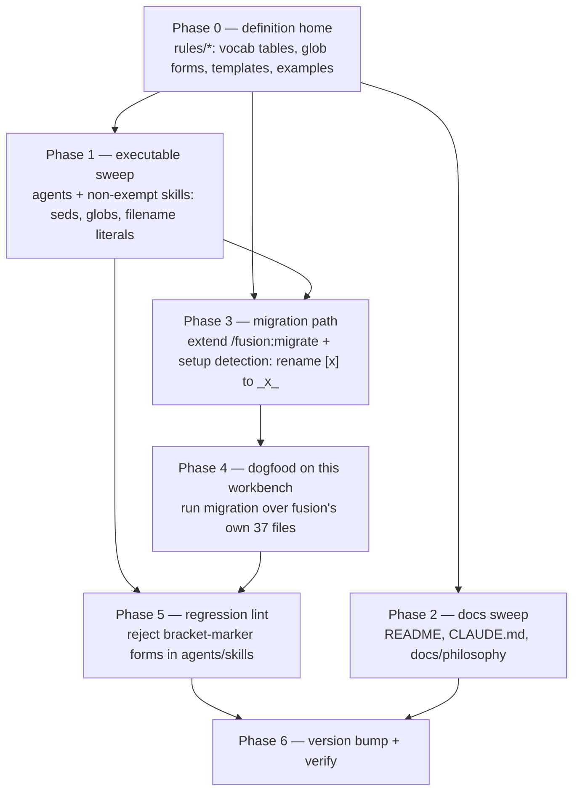
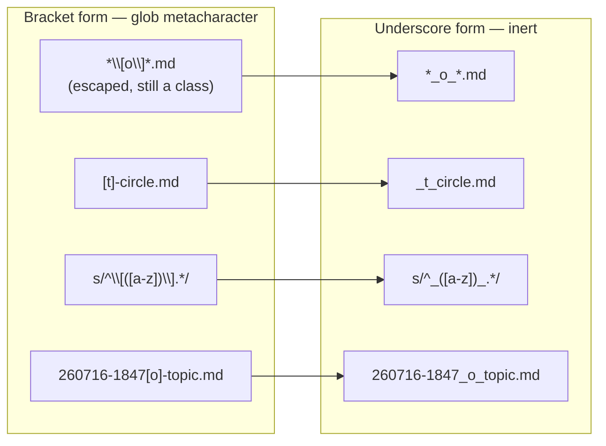

# Implementation Plan: state markers from bracket-delimited to underscore-delimited

**Date:** 2026-07-17
**Status:** Complete
**Spec:** none — planned from the Circle Directive (`260717-1638-marker-format-ohne-glob-metazeichen`)

## Directive

State markers in filenames lose their brackets. `[o]` becomes `_o_`, `[t]-circle.md` becomes `_t_circle.md`, `260716-1847[o]-topic.md` becomes `260716-1847_*_topic.md`. The marker vocabulary (`o a t c i b s d p`), every marker's meaning, the state transitions, the sort order, and the `ls`-readability all stay exactly as they are. Only the delimiter changes, because `[` and `]` are shell-glob metacharacters: a marker written into a glob is silently a character class, and that class hit five sites in one session (Circle Grounding snapshot).

## Current State

### What actually parses markers (verified, not assumed)

The dispatch brief said `bin/fusion-paths` "reads the Circle marker out of the record filename." **It does not.** The resolver reads `.active-circle`, which holds a bare directory name with no marker, validates that it is a bare name (rejecting any `.md` suffix or path separator), and builds paths from it (`bin/fusion-paths:209-233`). It carries no marker glob and no marker regex, so it needs **no functional change**. `bin/monitor` and the TypeScript hooks likewise parse no markers (verified by grep — empty).

The marker-parsing logic lives in exactly these places, all shell:

| Site | File:line | What it does |
|---|---|---|
| P1 | `agents/orchestrator.md:147` | marker-collect: `sed -nE 's/^\[([a-z])\].*/\1/p'` over `circles/*/*-circle.md` |
| P2 | `agents/playmaker.md:76` | marker-collect: same sed |
| P3 | `skills/next/SKILL.md:134` | record-marker read: same sed |
| P4 | `skills/archive/SKILL.md:135` | marker-collect: same sed, then `case c\|b\|s` |
| P5 | `skills/setup/SKILL.md:37` | pre-v4 detect: `grep -qE '^[0-9]{6}-[0-9]{4}\[[a-z]\]'` |
| P6 | `skills/setup/SKILL.md:192` | count snapshot: same marker-collect sed |
| P7 | `skills/migrate/SKILL.md:51` | survey: `sed -nE 's/^[0-9]{6}-[0-9]{4}\[([a-z])\].*$/\1/p'` + `sed -E 's/\[[a-z]\]//'` + emits `[$m]-circle.md` |
| P8 | `skills/migrate/SKILL.md:84` | execute: same parse; emits `circles/<dir>/[$m]-circle.md`; strips `\[[a-z]\]` for dir name; `.active-circle` re-point |

### Glob forms that carry a bracket marker

- **Escaped-bracket globs** (`\[o\]`, `\[p\]`, `\[t\]`, …): 16 occurrences in `agents/`+`skills/`. The sharpest is `skills/cleanup/SKILL.md:67` (`ls .../*\[o\]*.md .../*\[p\]*.md 2>/dev/null`).
- **Filename-shaped literals in prose**: `[t]-circle.md`, `260716-1847[o]-topic.md`, the record template's `[S]-circle.md`, the stash-layout examples — throughout the conventions and other prompts.

### Blast radius, measured 2026-07-17

| Surface | Bracket-marker mentions |
|---|---|
| `agents/` + `skills/` + `rules/` | 556 |
| `README.md` | 19 |
| `CLAUDE.md` | 32 |
| `docs/philosophy.md` | 16 |
| `rules/decision-record-examples.md` (subset of the 556) | 39 |
| **Workbench files carrying a marker in the name** | **37** (was 31 at Grounding time; more issues filed since) — includes both Circle records: `260716-1847-workbench-umbau[c]-circle.md` and this Circle's own `circles/260717-1638-.../[t]-circle.md` |

The edit itself is a mechanical string substitution (`[x]` → `_x_` for the nine marker letters). The work is in the count and in migrating live workbenches.

### The underscore form is verified safe (empirical, zsh 5.9 — this environment's shell)

- `*_o_*.md` matches `260716-1847_*_topic.md`, does **not** match `_p_`/`_c_` files.
- `_t_circle.md` matches literally (underscore is neither a glob nor a regex metacharacter).
- `sed -nE 's/^_([a-z])_.*/\1/p'` reads the leading marker; `sed -nE 's/^[0-9]{6}-[0-9]{4}_([a-z])_.*/\1/p'` reads the datestamped one; `sed -E 's/_[a-z]_/_/'` strips it.
- Slugs are hyphen-separated and never contain `_`, so `_o_` appears only as the marker — no slug collision (already recorded in the Grounding verification table; re-confirmed here).

## Approach

**One delimiter, one substitution, applied wherever a marker token is written.** The marker becomes `_x_` in filenames, in globs, in the parsing regexes, in the vocabulary tables, and in prose. This is the single-source-of-truth answer and it avoids a special-case split ("brackets in prose, underscores in filenames") that critical-stance §2 warns against — and that split is precisely the copy-paste vector that produced session hits 2 and 3 (a bracket glob written in a *doc*, then copied). See Open Question 1: this is a recommendation, and its cost (623 doc/prose mentions vs ~150 filename/glob/parser mentions) is real enough to gate.

The change is sequenced so that at no point does code expect one delimiter while files carry the other, and so that the downstream zsh-hardening plan is *simplified* rather than fought (see "Sequencing vs the zsh-fix plan").



**The delimiter transformation, uniformly:**



## Sequencing vs the zsh-fix plan (`260717-1918[o]`)

That plan (open, planned, not yet executed) converts every glob loop to a `find … | while read` loop to remove the zsh *no-match-abort* class. It is a **different defect class** (empty-glob fatal under zsh) but it **edits the same lines** this Circle touches — most sharply `skills/cleanup/SKILL.md:67` and the eight marker-parse sites. Because they touch the same lines, they cannot land in parallel (merge collision); they must be sequenced.

**Recommendation: this Circle lands FIRST, then the zsh-fix.** Concrete reasons:

1. This Circle's entire purpose is to erase the bracket-metacharacter class. Once markers are underscores, the zsh-fix's hardest site (its "two bug classes compose at one site", `cleanup`) *dissolves*: `*\[o\]*.md` becomes `*_o_*.md`, a plain glob with no bracket to preserve. The zsh-fix's Step 5 special-casing ("do **not** use `find -name '*[o]*'`", "keep the bracket fix") becomes moot — with underscores, even `find -name '*_o_*.md'` is safe. The zsh-fix then treats site 12 identically to every other site.
2. Order it the other way and the zsh-fix does bracket-preservation work at site 12 that this Circle immediately throws away, and this Circle ends up editing lines the zsh-fix just created. Front-loading this Circle removes that dead work.

**Consequence to record:** after this Circle lands, the zsh-fix plan must be re-grounded — its "site 12 is special" note and its Step 5 bracket-preservation caveat are removed, and it becomes a uniform glob-loop-to-find sweep. This Circle does **not** itself fix the no-match class (out of scope; separately gated). This Circle's own verification therefore runs against *populated* fixtures so it never trips the pre-existing no-match behaviour it is not here to fix.

## Implementation Steps

1. **[Phase 0] Rewrite the definition home**
   - Executor: coder
   - Files: `rules/fusion-workbench-conventions.md`, `rules/decision-record-examples.md`, `rules/user-facing-output.md`
   - Changes: In `fusion-workbench-conventions.md`, convert every marker token to underscore form: the three "State Markers" vocabulary tables (issues/planning, decisions, circles), the "Filename Patterns" table (`[S]-circle.md` → `_S_circle.md`, `YYMMDD-HHMM[S]-<topic>.md` → `YYMMDD-HHMM_S_<topic>.md`), the Circle record template header (`[S]-circle.md`), the stash-layout examples, and all worked-transition prose. **Rewrite the "two correct glob forms" block** (currently the escaped-bracket `circles/*/\[t\]-circle.md` and the read-marker-from-name enumeration) to the underscore forms: `circles/*/_t_circle.md` (no escaping needed) and `circles/*/*-circle.md` → `sed -nE 's/^_([a-z])_.*/\1/p'`. Add a short paragraph stating *why* the delimiter is an underscore (bracket = glob metacharacter; the five-hit session) so the rationale lives at the definition, and note that the underscore is inert in both glob and regex. In `decision-record-examples.md` (39 mentions) and the marker mentions in `user-facing-output.md` (17), convert to underscore form. Update `**Status:**`-style prose unaffected. `260716-1910[i]-...circle-marker...md` is cited as the binding decision for marker-on-record — leave the citation path as-is (Phase 4 renames the file; the citation is updated there).
   - Dependencies: none

2. **[Phase 1] Convert the executable marker logic — agents and non-exempt skills**
   - Executor: coder
   - Files: `agents/orchestrator.md` (P1, line 147), `agents/playmaker.md` (P2, line 76), `skills/next/SKILL.md` (P3, line 134), `skills/archive/SKILL.md` (P4, line 135), `skills/cleanup/SKILL.md` (line 67 glob), `skills/circle-stash/SKILL.md`, `skills/circle-pop/SKILL.md`, `skills/direct/SKILL.md`, plus every remaining agent prompt carrying a bracket-marker mention (all 12 agents + these skills).
   - Changes: (a) Parse regexes `sed -nE 's/^\[([a-z])\].*/\1/p'` → `sed -nE 's/^_([a-z])_.*/\1/p'` at P1–P4. (b) Escaped-bracket globs `*\[o\]*.md` → `*_o_*.md` (drop the backslashes; underscore needs none) — 16 occurrences, notably `cleanup:67`. (c) Circle-record globs `\[t\]-circle.md` → `_t_circle.md`. (d) All filename-shaped literals and prose marker tokens → underscore form. **Do not** touch `skills/setup` or `skills/migrate` here (they carry old-format parsing and are handled in Steps 3–4). Preserve every glob's *loop structure* untouched — the zsh no-match fix is a separate plan.
   - Dependencies: Step 1 (the definition the prompts cite must already read underscore)

3. **[Phase 2] Convert the docs**
   - Executor: coder
   - Files: `README.md` (19), `CLAUDE.md` (32), `docs/philosophy.md` (16)
   - Changes: Convert bracket-marker tokens to underscore form in all three. These are dev-facing (never shipped by the installer) but are the plugin's source-of-record and must stay consistent with the definition. `README-agents.md` and `README-hooks.md` carry zero marker mentions — no change.
   - Dependencies: Step 1

4. **[Phase 3] Extend `/fusion:migrate` (and setup detection) to reformat existing workbenches**
   - Executor: coder
   - Files: `skills/migrate/SKILL.md`, `skills/setup/SKILL.md`
   - Changes:
     - **migrate — reframe purpose:** broaden from "pre-v4 → v4 container" to "bring a workbench to the current format" (container layout **and** underscore markers). Its idempotency model already keys on removable-artifact presence, and bracket-marker files are removable (renamed away), so they fit the model unchanged.
     - **migrate — the existing circle-file pass (P7/P8) emits underscore directly:** change the two emit points from `circles/<dir>/[$m]-circle.md` to `circles/<dir>/_${m}_circle.md`, and the parse regexes to underscore where they read *new*-format inputs. Keep the *old*-format parse (`\[([a-z])\]`) where it reads pre-v4 flat `circles/*.md` — a pre-v4 workbench still has bracket names, so migrate must still read them. Migrate is thus the one place that reads bracket form and writes underscore form.
     - **migrate — add a general reformat pass:** after the type-folder and circle-dir passes, walk every store (`shared/*` and each `circles/*/{planning,issues,decisions,history,reviews,analyses}`) and each circle record; for every `*[x]*.md`, compute the underscore name (`sed -E 's/\[([oatcibspd])\]/_\1_/g'`) and `move_one` old → new, reusing the existing git-mv/plain-mv + collision-refuse + counter machinery. This is what reformats a workbench that is *already* container-layout but still bracket-marked (fusion's own case).
     - **migrate — extend `rewrite_fields`:** the record's `**Active spec/plan:**` and `**Active session history:**` may hold paths containing bracket markers (e.g. `.../planning/260716-1910[c]-plan.md`); after the reformat pass renames those targets, rewrite the field values bracket→underscore so they do not dangle (same HYG-NO-SILENT-FAIL concern migrate already handles for the shared/ move).
     - **migrate — `.active-circle`:** unaffected by the reformat (bare directory name, no marker) — no change to that block beyond what already exists.
     - **setup — detection:** setup's pre-v4 check (P5) already routes the user to migrate when old artifacts exist. Extend the detector to *also* fire when any bracket-marker file exists anywhere in the workbench (`find fusion-workbench -name '*[[]*[]]*.md'` present), so a container-layout-but-bracket-marked workbench is caught and sent to migrate. Update P6's count-snapshot sed to underscore (it reads current-format records).
   - Dependencies: Steps 1 and 2 (migrate/setup prose cites the conventions and the current marker form)

5. **[Phase 4] Dogfood: reformat fusion's own 37 workbench files**
   - Executor: coder
   - Files: the 37 marker-named files under `fusion-workbench/` (both stores + both Circle records), via the Step 4 migration path — not by hand.
   - Changes: Run the extended `/fusion:migrate` reformat pass over this workbench (it is `MODE=plain` — fusion's workbench is gitignored, so plain `mv`, no diff, per migrate's own honesty note). This renames every `*[x]*.md` to `*_x_*.md`, including `260716-1847-workbench-umbau[c]-circle.md` → `_c_circle.md` and **this Circle's own** `circles/260717-1638-.../[t]-circle.md` → `_t_circle.md`. **Active-record hazard, resolved:** `.active-circle` holds the bare directory name `260717-1638-marker-format-ohne-glob-metazeichen` (markerless, stable), so renaming the active record does not break resolution; the orchestrator resume reads `**Active session history:**` (a markerless path in `shared/history/`), also unaffected. Rename this plan file (`260717-1959[o]-plan-...md` → `_o_`) in the same pass. Verify afterward that `bin/fusion-paths orchestrator` still resolves cleanly and that a marker-collect over `circles/*/_*_circle.md` returns the two records with correct markers.
   - Dependencies: Step 4

6. **[Phase 5] Add the regression lint — reject bracket-marker forms in agents/skills**
   - Executor: coder
   - Files: `hooks/lib/__tests__/` (new `it` block in `path-literal-lint.test.ts`, or a sibling `marker-format-lint.test.ts`)
   - Changes: A vitest gate over `agents/*.md` + non-exempt `skills/*/SKILL.md` that fails if a single marker-letter bracket token (`\[[oatcibspd]\]`) appears. Reuse the existing `EXEMPT_SKILLS = {setup, migrate}` set: both legitimately name the bracket form (setup detects it, migrate reads-and-reformats it). Under the recommended scope (Open Question 1 = A, underscore everywhere), after Steps 1–2 land the bracket form appears **nowhere** in the gated file set, so the gate starts and stays green with zero exemptions — the same clean property the path-literal lint and the zsh-plan's lint have. Message points at the underscore replacement. **Scope caution:** target only the single-marker-letter bracket `\[[oatcibspd]\]`; do not flag markdown checkboxes `[ ]`/`[x]`, POSIX classes `[:lower:]`, or char classes `[a-z]`/`[!.]` (none is a single marker letter, so the narrow pattern excludes them by construction).
   - Dependencies: Steps 2 and 5 (the gated tree must be clean before an assert-clean gate lands, or it fails on landing) — depends on Step 1+2 for cleanliness and Step 5's dogfood is independent of the lint file set.
   - Note: if Open Question 1 resolves to scope **B** (prose keeps brackets), this gate cannot be a blanket bracket-token reject — it must become shape-aware (glob/filename contexts only), matching the path-literal lint's approach. The recommended scope A keeps it strict and simple; this coupling is itself an argument for A.

7. **[Phase 6] Version bump and full verification**
   - Executor: coder
   - Files: `.claude-plugin/plugin.json`, the marketplace `marketplace.json` (per CLAUDE.md release process — path passed at release time), `install.sh` header example if it pins a version
   - Changes: Bump the plugin version (marker-format is a behavioural change to file naming). Run `npm test` (all gates green, including the new one), `claude plugin validate .` (passed), and the default-agent smoke check. No frontmatter is touched, but the smoke check is cheap.
   - Dependencies: Steps 1–6

## Data Structures

None. This is a delimiter substitution plus a migration pass; no schema, type, or data-shape change. The marker *vocabulary* and *semantics* are untouched.

## API Changes

None. `bin/fusion-paths`' contract is unchanged (it never parsed a marker). No agent dispatch parameter, no resolver key, no exit code changes.

## Testing Strategy

Every check is written to run under **zsh 5.9** (this environment's shell), using *populated* fixtures so the pre-existing no-match behaviour (the separate zsh-fix plan's domain) is never conflated with a marker-parse failure. Run each from the repo root.

- **Step 1 (definition home):** grep `rules/fusion-workbench-conventions.md` for any remaining `\[[oatcibspd]\]` token — expect zero. Confirm the two documented glob forms are now `_t_circle.md` and the underscore sed. Re-read the vocabulary tables and assert the nine letters and their meanings are unchanged.
- **Step 2 (executable sweep):** `grep -rE '\[[oatcibspd]\]' agents/ skills/next skills/archive skills/cleanup skills/circle-stash skills/circle-pop skills/direct` → zero. Then, against a populated scratch `circles/` (two records `_a_circle.md`, `_t_circle.md`), run each converted marker-collect block under zsh and assert the marker histogram is `a=1 t=1`:
  ```sh
  zsh -c 'D=$(mktemp -d); mkdir -p "$D/c/x" "$D/c/y"; : > "$D/c/x/_a_circle.md"; : > "$D/c/y/_t_circle.md"; for f in "$D"/c/*/*-circle.md; do basename "$f" | sed -nE "s/^_([a-z])_.*/\1/p"; done | sort | uniq -c'
  ```
- **Step 2 (cleanup site):** against a plans dir holding `..._o_..md`, `..._p_..md`, `..._c_..md`, `..._d_..md`, run the converted listing and assert only `_o_`/`_p_` appear, and that a file with the letter `o` in its slug (`260101-0000_*_add-o-ring.md`) is **not** matched.
- **Step 4 (migrate):** stand up a scratch tree in *both* shapes — (a) a pre-v4 flat `circles/*.md` with bracket names, (b) a container-layout workbench with `circles/<dir>/[x]-circle.md` and bracket-marked store files — run the extended migrate under zsh and assert: pre-v4 files land as `circles/<dir>/_x_circle.md`; container bracket files are renamed to underscore; `rewrite_fields` re-points a record field that held a bracket-marked plan path; `.active-circle` (bare dir name) is untouched; collisions are refused loudly; the tail counters are correct. Re-run to confirm idempotence (second run finds nothing).
- **Step 5 (dogfood):** after reformatting fusion's own workbench, assert `find fusion-workbench -name '*[[]*[]]*.md'` returns nothing, `bin/fusion-paths orchestrator` exits 0 with the active Circle resolved, and the two Circle records read `_c_` and `_t_`.
- **Step 6 (lint):** `npm test` — the new gate passes on the clean tree; a fixture with `\[o\]` spliced into a copied prompt fails with a message naming the underscore replacement and the file/line.
- **Full gate:** `npm test` green, `claude plugin validate .` passed, default-agent smoke check OK.

## Risks & Mitigations

| Risk | Mitigation |
|------|------------|
| A blind `s/\[x\]/_x_/g` rewrites a non-marker bracket (markdown checkbox, POSIX class, char class, footnote) | The substitution targets only the nine single marker letters `[oatcibspd]` in single-char brackets; every step's verification greps the *result*, and Step 6's lint enforces zero bracket-marker tokens thereafter. Reviewed edit, not blind sed. |
| Renaming the active Circle's own record mid-session breaks resolution or resume | `.active-circle` holds the markerless directory name (stable); the resume field is a markerless `shared/history/` path. Both are unaffected by the record rename. Verified in Step 5. |
| A live workbench is caught half-reformatted (some `[x]`, some `_x_`) if the run is interrupted | Migrate's move-one-then-detect idempotency model already covers this: an interrupted reformat leaves its source in place, the detector re-fires next run, no state flag drifts from the filesystem. Same guarantee as the existing passes. |
| This Circle and the zsh-fix plan collide at shared lines | They cannot land in parallel; this plan sequences this Circle first (see "Sequencing vs the zsh-fix plan") and records that the zsh-fix must be re-grounded (its site-12 special-casing dissolves) afterward. |
| Consuming projects' workbenches become unreachable on plugin update | The extended `/fusion:migrate` (Step 4) is the migration path; setup's detector (Step 4) routes users to it. Same "run migrate once" story as the pre-v4 → v4 move. This must be called out in the release note. |
| Scope decision deferred, blast radius under-scoped | Open Question 1 gates prose-vs-filename scope; the plan is written for the recommended scope A and flags the delta if B is chosen. |

## Open Questions

- [ ] **1 — Prose scope: underscore everywhere (A) or filenames/globs/parsers only (B)?** *Recommended: A.* Change every marker token — including vocabulary tables and inline prose ("rename `_o_` → `_p_`") — to underscore form. Rationale: the Directive says "only the brackets disappear" (unqualified); A is the single-source-of-truth answer with no special-case split; the copy-paste vector that caused two of the five session hits *is* prose (a bracket glob written in a doc, then copied); and A lets the Step 6 lint be a strict zero-exemption bracket-token reject. Cost: ~623 doc/prose mentions vs ~150 filename/glob/parser mentions under B, and prose reads slightly worse (`_o_` vs `[o]`). B keeps a fragile split rule, a shape-aware (not strict) lint, and a surviving copy-paste vector. **Blocks the exact edit set of Steps 1–3 and 6; decide at the gate.**
- [ ] **2 — Migration approach for existing workbenches.** The moment the code switches to underscore globs, a bracket-marked workbench (37 files here; any consuming project's) is unreachable. Options: **M1 (recommended) — extend `/fusion:migrate`** to detect and reformat bracket-marker files, reframing it as "bring a workbench to the current format." Reuses migrate's git-mv/plain-mv, collision-refuse, counters, and idempotency model; one migration entry point; setup already routes users to it. Cost: migrate's purpose broadens (a semantic, but its detector already keys on artifacts, not version). **M2 — a separate reformat skill.** Keeps migrate's pre-v4 scope pure (single responsibility), but adds a second migration tool the user must know and sequence, and setup must route to both. **M3 — transitional dual-read** (code reads both forms for a window): **rejected** — every glob site would need both `*_o_*.md` and `*\[o\]*.md`, which *re-introduces the escaped-bracket glob this Circle exists to remove*, and dual-read is the special-case thicket critical-stance forbids. **Decide M1 vs M2 at the gate; M3 is not recommended.**
- [ ] **3 — Path-lint regression gate (Step 6): add it?** *Recommended: yes.* A vitest gate rejecting `\[[oatcibspd]\]` in `agents/*.md` + non-exempt `skills/*/SKILL.md`, reusing the existing `{setup, migrate}` exemption. Cheap, precise, starts green with zero exemptions under scope A, and stops the bracket form creeping back — the same posture as the existing path-literal lint and the zsh-plan's proposed `.[!.]*` lint. It is strict-and-simple only under scope A; under B it must become shape-aware (a further argument for A).
- [ ] **4 (informational, non-blocking) — zsh-fix sequencing.** Recorded above: this Circle lands first; the zsh-fix plan (`260717-1918[o]`) is re-grounded afterward (its site-12 bracket special-casing dissolves). Not a gate question — a coordination note for whoever schedules the two.

## Reconciliation Log

**2026-07-17 22:58 — closure reconciliation (reconciler, domain `code`), verified against the tree at HEAD `79845f5`, not against headers.**

All 7 steps landed. Ground-truth evidence per step:

1. **[Phase 0] Definition home** — DONE, commit `b95da8d`. `rules/fusion-workbench-conventions.md` (156 lines changed), `rules/decision-record-examples.md` (36), `rules/user-facing-output.md` (8). Grep of the gated set for `\[[oatcibspd]\]` returns zero.
2. **[Phase 1] Executable sweep** — DONE, commit `2b93123`. All 12 agents + 7 non-exempt skills converted. `circles/*/_t_circle.md` enumeration globs present (27 underscore circle-globs in `agents/`+`skills/`); zero escaped-bracket circle-globs remain. Marker-collect seds now read `s/^_([a-z])_.*/\1/p` — verified by running the converted block over a scratch `circles/` (markers read `a=1 t=1`, and the equivalent read `c`/`t` over this workbench's two records).
3. **[Phase 2] Docs** — DONE, commit `bd53355`. `README.md` (14 lines), `CLAUDE.md` (14), `docs/philosophy.md` (24). Zero bracket-marker tokens in any of the three.
4. **[Phase 3] Migrate + setup (M1)** — DONE, commit `312c045`. `skills/migrate/SKILL.md` (28 lines) + `skills/setup/SKILL.md` (14). Both intentionally retain the bracket form (migrate reads pre-v4 bracket names, setup detects them): `migrate` = 8 bracket hits, `setup` = 1, both by design and both exempted by the Step 6 lint.
5. **[Phase 4] Dogfood** — DONE (workbench, gitignored, not a commit). This workbench's marker-named files reformatted to underscore: both Circle records read `_c_`/`_t_`; `bin/fusion-paths reconciler` resolves cleanly into the active Circle; `find fusion-workbench -name '*[[]*[]]*.md'` returns nothing. `.active-circle` holds the markerless directory name — unaffected by the record rename.
6. **[Phase 5] Regression lint** — DONE, commit `0da0482`. `hooks/lib/__tests__/marker-format-lint.test.ts` present, 17 tests green under vitest. `EXEMPT_SKILLS = {setup, migrate}` — strict zero-exemption over every other gated file.
7. **[Phase 6] Version bump + verify** — DONE, commit `79845f5`. `plugin.json` = 5.0.0; `install.sh` header pins the example to `tags/v5.0.0`; 4 stale citations fixed.

**Gate decisions honoured (all four):** scope **A** underscore-everywhere (prose + tables + filenames all converted; zero bracket-marker tokens in the gated set) · **M1** migrate-extends (one migration entry point, reframed to bring a workbench to current format) · **strict** lint (blanket bracket-token reject with two documented exemptions) · **ABSORB** hyphen (`_t_circle.md`, not `_t_-circle.md` — no `_x_-` forms anywhere in the source tree).

**Open Questions 1–3** resolved at the gate (A / M1 / yes). **Open Question 4** (zsh-fix sequencing) is a non-blocking coordination note — see Coherence closure note below.

Plan marker transitioned `_o_` → `_c_`; status set Complete.
