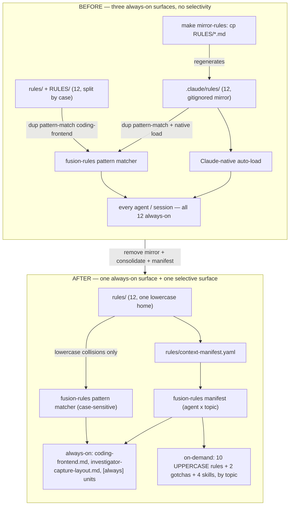
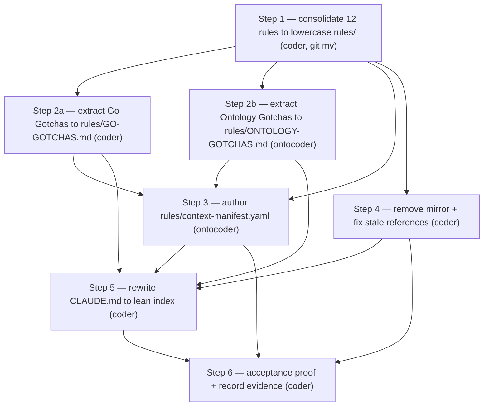

# Implementation Plan: unite-co-creator context-loading conversion (v5 selective-loading dogfood)

**Date:** 2026-07-19
**Status:** Complete
**Spec:** none — planned from the user's target end-state (supersedes v5.x master-plan Step 5). Cites `260718-1001_*_master-plan-fusion-v5x-overhaul.md` (Circle B steps 5-8) and the answered premise decision `260719-1856_*_unite-rules-mirror-vs-dedup-premise.md`.

> **Target repo `$U` = `/Users/kai/Dropbox/qboot/projects/F03_digital-leadership/unite-co-creator`.** Every edit in this plan lands in `$U` by absolute path. This is a different repo from the fusion source repo the planner ran Setup in. Paths written **`$U/...`** are absolute in the target; paths without `$U` are in the fusion plugin.

---

## Directive

Convert unite-co-creator to fusion v5 selective rule-loading: consolidate its 12 rule files onto one canonical lowercase home, remove the always-on `.claude/rules/` mirror, author `$U/rules/context-manifest.yaml` so rules load per-agent and per-topic, and reduce `$U/CLAUDE.md` from 43,145 bytes to a links-only index. Prove selective loading with acceptance runs. This is the downstream dogfood proof of the mechanism already shipped in the plugin (v5.1.0); it produces **no** fusion-plugin artifacts.

## Current State (verified ground truth)

All verified by direct inspection on 2026-07-19; `path:line` cited where load-bearing.

**Rules today.**
- `$U/RULES/` (uppercase) is the git-tracked canonical source: 11 files (`git ls-files RULES/*`). `$U/rules/investigator-capture-layout.md` (lowercase) is tracked separately. On the case-insensitive macOS FS, `RULES/` and `rules/` are **one physical directory** (12 files) but git tracks 11 under `RULES/` + 1 under `rules/`. On a case-sensitive FS (Linux/CI/another clone) `./rules/` would hold only `investigator-capture-layout.md`, and `bin/fusion-rules` (which reads `./rules/`) would miss the other 11. **Consolidating all 12 to lowercase `rules/` is a correctness fix, not cosmetics.**
- `$U/.claude/rules/` is a **gitignored generated mirror** (`$U/.gitignore:72` `.claude/*`, exceptions only for `settings.json` + `skills/`). Regenerated by `make mirror-rules` (`$U/Makefile:625-628` → `cp RULES/*.md .claude/rules/`). No git-tracked duplication exists.

**The two loading surfaces of `bin/fusion-rules`** (read from `bin/fusion-rules:116-127, 291-299`) — this is the crux of the whole conversion:
1. **Pattern matcher** — globs `./rules/*<pat>*.md` **and** `.claude/rules/*<pat>*.md` **case-sensitively**, always-on and topic-independent. Per-agent tokens: `coding` (coder/coderev/bugfixer/planner), `ontology`/`normative`/`verb` (ontocoder/ontorev), `investigator` (investigator).
2. **Manifest** — the optional `./rules/context-manifest.yaml`, topic-scoped (`bin/fusion-rules:305-437`).

**Verified collision result** (case-sensitive glob simulated over all 12 filenames): only the two **lowercase-named** files collide with a built-in pattern — `coding-frontend.md` (matched by `coding`) and `investigator-capture-layout.md` (matched by `investigator`). The **10 UPPERCASE files do not collide**, so they are cleanly topic-scopable via the manifest. This is the fact that makes selective loading achievable for unite.

**Third always-on surface (external to fusion-rules):** Claude Code natively auto-loads `$U/.claude/rules/` every plain session (user-asserted; treated as ground truth). Emptying `.claude/rules/` and removing the mirror is what makes the reduction real for plain sessions.

**`$U/CLAUDE.md`** — 43,145 bytes, 259 lines, 18 `##` sections (enumerated in the disposition table under Step 5). No `context-manifest.yaml` exists yet. `$U` working tree clean, on branch `main`.

**Skills present under `$U/.claude/skills/`:** `unite-bok-sc-skill`, `unite-mos-sc-skill`, `unite-platform-skill`, `unite-taxonomy-skill` (knowledge bodies → manifest `skill:` units), plus `new-fe-feature`, `finish-fe-feature` (dev-workflow slash skills → **not** manifest units).

## Approach

One integral design, not a pile of special cases. The whole conversion turns on a single principle:

> **`bin/fusion-rules` has one always-on surface (the case-sensitive pattern matcher over `./rules/`) and one selective surface (the manifest). A rule loads selectively only when its filename does not collide with a built-in lowercase pattern. unite's UPPERCASE rule names already satisfy this; the manifest tags them by topic; the two lowercase collision files stay pattern-loaded and are deliberately excluded from the manifest to avoid double-emission.**

Everything else follows: consolidate to one lowercase home (correctness + gives the manifest a stable `path:`), remove the mirror (kills the two remaining always-on surfaces — Claude-native `.claude/rules/` and the duplicate pattern-match from `.claude/rules/`), lean the `CLAUDE.md` down to identity + the every-session rules + a pointer table, then prove it.

**Manifest `path:` targets `rules/<f>.md`, not `.claude/rules/...`.** The shipped worked example in `rules/context-lean-claude-md.md` points units at `.claude/rules/`; that assumes the mirror stays. Here the mirror is removed, so `.claude/rules/` is empty and the canonical home is `rules/`. Units point at `rules/<f>.md` (resolved against CWD = `$U` root, which is also the acceptance-run CWD).

### Executor routing note (deviation from the dispatch's "coder for all")

The dispatch said the executor for all steps is `coder`. Per fusion's own routing rules a `.yaml` manifest and ontology-documentation are **ontocoder's** domain, so I have assigned:
- **ontocoder** — Step 3 (`context-manifest.yaml`, structured data) and Step 2b (ontology-gotchas extraction, ontology documentation).
- **coder** — all Markdown/Makefile/`.gitignore`/`CLAUDE.md` steps.

If the user prefers a single-executor run, reassign Steps 2b and 3 to `coder` at dispatch — that is the one override point. Flagged in Risks.

### Mechanism, before → after

### Step dependency DAG

## Implementation Steps

### 1. Consolidate all 12 rule files into lowercase `$U/rules/` (case-fix) [DONE]

- **Executor:** coder
- **Files:** `$U/RULES/*.md` (11) → `$U/rules/*.md`; `$U/rules/investigator-capture-layout.md` already lowercase (leave).
- **Changes:** For each of the 11 uppercase-tracked files, `git mv` it into lowercase `rules/`. On the case-insensitive FS a direct `git mv RULES/X.md rules/X.md` may fail ("destination exists" — same physical inode). Use per file: `git mv -f "$U/RULES/X.md" "$U/rules/X.md"`. If `-f` still balks, two-step through a temp name: `git mv "$U/RULES/X.md" "$U/rules/X.md.tmp" && git mv "$U/rules/X.md.tmp" "$U/rules/X.md"`. After all 11, confirm `$U/RULES/` is empty of tracked files and remove the now-empty dir from the index if git still lists it.
- **Dependencies:** none.
- **Acceptance:** `git -C $U ls-files 'rules/*'` lists **12** `.md` files (11 former-uppercase + `investigator-capture-layout.md`); `git -C $U ls-files 'RULES/*'` lists **0**. `git -C $U status` shows only renames (R), no content changes.

### 2. Extract the two "not covered by rules" gotchas blocks into dedicated rule files [DONE]

These are the CLAUDE.md heavy blocks whose own headers say "not covered by rules" — they have no existing rule home, so they need new topic-scoped homes before CLAUDE.md can point at them. (Reuse-check: if the executor finds a block is already captured verbatim in an existing rule/doc, replace with a pointer to that home instead of creating a new file, and note it.)

**2a. Go Gotchas → `$U/rules/GO-GOTCHAS.md`** [DONE]
- **Executor:** coder
- **Files:** read `$U/CLAUDE.md` §"Go Gotchas" (line 154) and §"Go Services" (124, if it carries unique implementation notes); create `$U/rules/GO-GOTCHAS.md`.
- **Changes:** move the Go-gotchas prose into `rules/GO-GOTCHAS.md` with a short header naming its purpose and citation convention. Uppercase name (no pattern collision — verified `GO-GOTCHAS` matches none of `coding/ontology/normative/verb/investigator`).
- **Dependencies:** Step 1.
- **Acceptance:** `rules/GO-GOTCHAS.md` exists and is git-tracked; content equals the former CLAUDE.md block (no bytes lost).

**2b. Ontology Gotchas → `$U/rules/ONTOLOGY-GOTCHAS.md`** [DONE]
- **Executor:** ontocoder (ontology documentation)
- **Files:** read `$U/CLAUDE.md` §"Ontology Gotchas" (189) and §"Ontology Status" (113, if unique); create `$U/rules/ONTOLOGY-GOTCHAS.md`.
- **Changes:** move the ontology-gotchas prose into `rules/ONTOLOGY-GOTCHAS.md`. Uppercase name (no collision — note `ONTOLOGY-GOTCHAS` does contain lowercase-free `ONTOLOGY`; the `ontology` pattern is lowercase and glob is case-sensitive, so no match — verified against the same simulation).
- **Dependencies:** Step 1.
- **Acceptance:** `rules/ONTOLOGY-GOTCHAS.md` exists, git-tracked, content preserved.

### 3. Author `$U/rules/context-manifest.yaml` [DONE]

- **Executor:** ontocoder (structured-data / manifest)
- **Files:** create `$U/rules/context-manifest.yaml`.
- **Changes:** flat `units:` list per the schema in `rules/context-manifest.md` (inline arrays only; exactly one of `path`/`skill` per unit; `agents`/`topics` required). All `path:` values are `rules/<f>.md`. Include a **header comment** documenting that `coding-frontend.md` and `investigator-capture-layout.md` are intentionally **omitted** because they are pattern-loaded always-on (`coding` / `investigator` tokens) and listing them would cause double-emission on matching topics. Concrete unit set:

  | Unit (`path:` / `skill:`) | agents | topics | note |
  |---|---|---|---|
  | `rules/CODING-HYGIENE.md` | `[coder, coderev, bugfixer, planner]` | `[always]` | binds every code edit |
  | `rules/ARCHITECTURE-RULES.md` | `[coder, coderev, bugfixer, planner]` | `[always]` | H-rules bind every code edit |
  | `rules/RULES-INDEX.md` | `[coder, coderev, ontocoder, ontorev, planner, bugfixer]` | `[always]` | small citation index |
  | `rules/ONTO-ENG-RULES.md` | `[ontocoder, ontorev, planner]` | `[ontology]` | UEOF/UIF eng rules |
  | `rules/ONTOLOGY-GOTCHAS.md` | `[ontocoder, ontorev, planner]` | `[ontology]` | new (Step 2b) |
  | `rules/READER-ABSTRACTION-RULES.md` | `[coder, planner]` | `[llm-pipeline]` | no-bytes-lost doctrine |
  | `rules/GO-GOTCHAS.md` | `[coder, coderev, bugfixer]` | `[go]` | new (Step 2a) |
  | `rules/CO-CREATOR-DEV-RULES.md` | `[coder, coderev, bugfixer, planner]` | `[co-creator]` | co-creator dev/viewer rules |
  | `rules/CENTRAL-DEV-RULES.md` | `[coder, coderev, bugfixer, planner]` | `[central]` | central-tier dev rules |
  | `rules/FE-DESIGN-RULES.md` | `[coder, coderev, planner]` | `[frontend]` | FE design rules |
  | `rules/NORMATIVE-MATERIAL-POLICY.md` | `[ontocoder, ontorev, coder, planner]` | `[normative]` | normative-source policy |
  | `rules/LICENSE-POLICY.md` | `[coder, coderev, ontocoder, planner]` | `[license]` | license-compliance policy |
  | `skill: unite-bok-sc-skill` | `["*"]` | `[unite-framework]` | BoK body-of-knowledge |
  | `skill: unite-mos-sc-skill` | `["*"]` | `[unite-framework, mos, architecture]` | MOS architecture+rules |
  | `skill: unite-platform-skill` | `["*"]` | `[unite-framework, platform]` | platform body |
  | `skill: unite-taxonomy-skill` | `["*"]` | `[taxonomy, unite-framework]` | glossary-of-record |

  (Tags are the recommended default; the executor may adjust topic slugs to match the vocabulary unite actually uses in Circle slugs — but must keep `[always]` on the two binding code rules + the index, and must keep the two collision files out.)
- **Dependencies:** Steps 1, 2a, 2b (targets must exist before the manifest points at them).
- **Acceptance:** `"$FUSION_PLUGIN_ROOT/bin/fusion-rules" coder ontology` run with CWD=`$U` **exits 0** (manifest well-formed, not exit 3); every `path:` resolves to an existing `rules/*.md`; both collision files are absent from the unit list.

### 4. Remove the `.claude/rules/` mirror and fix every stale reference [DONE]

- **Executor:** coder
- **Files & changes:**
  - `$U/Makefile:618-628` — delete the `mirror-rules` target and its comment block (`618-628`).
  - `$U/.gitignore:66-75` — keep `.claude/*` ignored (still correct — `.claude/rules/` is generated/local) but rewrite the comment block (`67-71`) to drop the "rules/ is a mirror of RULES/ (make mirror-rules)" rationale; state instead that rule bodies now live git-tracked in `rules/` and load via `rules/context-manifest.yaml`.
  - Empty `$U/.claude/rules/` — delete the physical files (gitignored, so this is a local-FS cleanup, no index change). The dir may remain empty.
  - **Live mirror-mechanism references to fix** (verified as genuine, not incidental):
    - `$U/README.md:69,73` — describes `.claude/rules/` as SoT + auto-loaded; rewrite to name `rules/` as the canonical home loaded selectively via the manifest.
    - `$U/docs/architecture.md:25` — "mirrored to `.claude/rules/` via `make mirror-rules`"; rewrite to "canonical `rules/`, loaded per-topic via `rules/context-manifest.yaml`".
    - `$U/architecture/README.md:7,45,58-60,80` — mirror + "cp to `.claude/rules/`" edit-discipline lines; rewrite the live edit-discipline (edit in `rules/`; no mirror step).
    - `$U/rules/*.md` self-header HTML comments (each of the 10 former-uppercase files, e.g. `rules/ARCHITECTURE-RULES.md:1-9`) — every one carries a "Mirror: cp to `.claude/rules/<self>`, run `make mirror-rules`" block. Remove the mirror instruction; replace with "single canonical home; fusion agents load this selectively via `rules/context-manifest.yaml`".
    - `$U/ontology/docs/_ontology-meta-elements.md:620`, `$U/ontology/docs/multi-track-plan-schema.md:217-218` — citation paths `.claude/rules/ONTO-ENG-RULES.md` / `.claude/rules/CO-CREATOR-DEV-RULES.md`; repoint the prefix to `rules/`.
  - **Incidental / historical matches to LEAVE (do not touch — verified not live-mechanism):** `$U/.claude/skills/unite-mos-sc-skill/SKILL.md:430` (lists `.claude/rules/` among folders the skill does *not* need — still true); `$U/architecture/AZ-glossary.md`, `$U/architecture/archive/*`, `$U/architecture/sources/*` (historical provenance referencing pre-consolidation files that no longer exist); `$U/codebase/go/.../ueo-unified.yaml:38` and `$U/codebase/python/enricher_common.py:139` (stale code comments citing paths — out of scope; optionally repoint the yamledit testdata comment to `rules/ONTO-ENG-RULES.md` if trivial, else leave).
- **Dependencies:** Step 1 (rules must be in `rules/` before references are repointed there).
- **Acceptance:** `grep -rIn 'mirror-rules' $U --include=Makefile --include='*.md'` returns no **live** hit (only historical/archive prose, if any, remains and is explicitly listed as left); `make -C $U mirror-rules` fails ("No rule to make target"); `$U/.claude/rules/` is empty; `git -C $U grep -n 'make mirror-rules'` shows no instruction in `README.md`, `docs/architecture.md`, `architecture/README.md`, or any `rules/*.md` header.

### 5. Rewrite `$U/CLAUDE.md` to a lean links-only index [DONE]

- **Executor:** coder
- **Files:** rewrite `$U/CLAUDE.md`.
- **Changes:** per the disposition table below. Keep always-on only: identity, `**Language:**` line (load-bearing — `bin/fusion-rules` reads it for voice profiles), and the handful of every-session behavioral rules. Everything topic-specific becomes a pointer-table row that names the topic and its home (a `rules/*.md` file or a skill), matching the manifest tags from Step 3.

  **Section-by-section disposition (18 sections):**

  | # | Section (line) | Disposition | Target |
  |---|---|---|---|
  | 1 | User Detection (7) | **INLINE** | identity/session behavior — stays |
  | 2 | Security (16) | **INLINE** | binds every session — stays |
  | 3 | Grounding (20) | **INLINE** | fusion grounding discipline — stays (short) |
  | 4 | Taxonomy Compliance — binding (26) | **SKILL + 1-line inline** | keep the binding one-liner ("canonical UNITE terms are never translated"); detail → `skill: unite-taxonomy-skill` [taxonomy] |
  | 5 | Decision-Filing-Disziplin (41) | **INLINE** | workbench discipline, every session — stays |
  | 6 | Binding Rules — auto-loaded list (51) | **REPLACE → pointer table** | becomes the Topic map (rows below), naming the manifest as the loader |
  | 7 | Architecture (73) | **POINTER** | `rules/ARCHITECTURE-RULES.md` [architecture, always]; move any unique bits into that file first |
  | 8 | Project State Storage (89) | **POINTER** | condense to a pointer (detail in architecture docs) |
  | 9 | Folder Structure (97) | **POINTER** | `architecture/README.md` |
  | 10 | Ontology Status (113) | **POINTER** | `rules/ONTO-ENG-RULES.md` / ontology docs [ontology]; unique bits → Step 2b file |
  | 11 | Go Services (124) | **POINTER** | architecture/go docs [go]; unique impl notes → Step 2a file |
  | 12 | Go Gotchas (154) | **EXTRACT** | `rules/GO-GOTCHAS.md` (Step 2a) [go] |
  | 13 | Ontology Gotchas (189) | **EXTRACT** | `rules/ONTOLOGY-GOTCHAS.md` (Step 2b) [ontology] |
  | 14 | Authoritative Material (204) | **POINTER** | `rules/NORMATIVE-MATERIAL-POLICY.md` [normative] + source location |
  | 15 | Key Pointers (224) | **FOLD** | into the Topic-map/pointer table |
  | 16 | Orchestrator Observability (241) | **POINTER** | brief pointer (fusion-workbench convention) |
  | 17 | Python Scripts (247) | **POINTER** | `docs/` or script README |
  | 18 | Viewers (257) | **POINTER** | viewer docs |

  Final CLAUDE.md shape: identity paragraph + `**Language:**` line + a short "Always-on rules" block (security, grounding, decision-filing, taxonomy-no-translation one-liner) + one Topic-map table whose rows name each topic, its home, and which agents load it (mirrors the manifest). A reader can scan it in seconds.
- **Dependencies:** Steps 2a, 2b (extraction targets exist), 3 (manifest exists to reference), 4 (mirror gone, so no pointer contradicts the new loading story).
- **Acceptance:** `wc -c $U/CLAUDE.md` sharply reduced from 43,145 (target ≤ ~6 KB; the exact number is evidence, not a gate); `**Language:**` line present and unchanged in meaning; every pointer-table target path exists; no section body over a few lines except the always-on block.

### 6. Prove selective loading by acceptance runs; record evidence [DONE]

- **Executor:** coder
- **Files:** append an evidence entry to `$OUT_HISTORY` (this Circle's history store).
- **Changes:** run the following from **CWD = `$U`** (so `./rules/context-manifest.yaml` and `rules/*` resolve to unite), using **explicit topic arguments** so results are deterministic regardless of unite's active-Circle state. `FR="$FUSION_PLUGIN_ROOT/bin/fusion-rules"`.
  - **Topic-scoped inclusion:** `$FR ontocoder ontology` **includes** `rules/ONTO-ENG-RULES.md` + `rules/ONTOLOGY-GOTCHAS.md`.
  - **Topic-scoped exclusion:** `$FR ontocoder license` (or any non-ontology topic) **excludes** both ontology files.
  - **Cross-topic pull:** `$FR coder go` includes `rules/GO-GOTCHAS.md`; `$FR planner architecture` includes `rules/ARCHITECTURE-RULES.md`.
  - **`[always]` survives every topic:** `$FR coder license` still includes `rules/CODING-HYGIENE.md` + `rules/ARCHITECTURE-RULES.md`.
  - **No-regression / no-topic:** `$FR coder` (no topic; run with no active unite Circle, or confirm the derived slug yields no manifest topic-units) emits the always-on plugin rules + pattern-loaded `rules/coding-frontend.md` + the `[always]` manifest units — and **no** topic-scoped unit leaks. Nothing essential is dropped versus before.
  - **Duplicate-emission gone:** `$FR coder | sort | uniq -d` is empty (pre-conversion, `coding-frontend.md` was emitted twice — once from `rules/`, once from `.claude/rules/` mirror; emptying the mirror removes the duplicate).
  - **All 12 reachable:** a short loop over (agent, topic) pairs proving each rule appears under some pair — 10 UPPERCASE + 2 new gotchas via the manifest, `coding-frontend.md` + `investigator-capture-layout.md` via the pattern matcher.
  - **Manifest well-formed:** every run above exits 0 (no exit-3).
  - **Lean index:** record `wc -c $U/CLAUDE.md` before (43,145) and after.
- **Dependencies:** Steps 3, 4, 5.
- **Acceptance:** every check above passes and the evidence (commands + outputs + byte counts) is written to `$OUT_HISTORY`. If any check fails, do not close — report the failing check.

## Data Structures

`$U/rules/context-manifest.yaml` — the only new structured artifact. Schema is fixed by `rules/context-manifest.md` (flat `units:` list, inline arrays, exactly one of `path`/`skill`, required `agents`/`topics`). Unit set enumerated in Step 3.

## API Changes

None (no code interfaces). The behavioral contract that changes: `make mirror-rules` is removed, and `.claude/rules/` ceases to be an always-on surface.

## Testing Strategy

Step 6 is the test: it exercises the manifest's emit predicate across topics and agents against the real `bin/fusion-rules`, and asserts inclusion, exclusion, `[always]` survival, no-regression, no-duplicate, and reachability. All assertions are `fusion-rules` invocations with explicit topics from CWD=`$U` — no mock, the shipped mechanism is the system under test.

## Risks & Mitigations

| Risk | Mitigation |
|---|---|
| **Case-only rename fails on the case-insensitive FS** (`git mv RULES/X rules/X` sees "destination exists"). | Use `git mv -f`; fall back to the two-step temp-name rename (Step 1). Verify with `git ls-files rules/*`. |
| **Removing `.claude/rules/` auto-load changes plain Claude Code sessions** for other unite developers — they lose the always-on rule bodies. | This is the intended reduction, but it is a convention change unite's team must accept. Surfaced here and in the answered premise decision (`260719-1856_*_...`, resolved by user direction). Plain sessions can still read `rules/*.md` on demand; fusion agents load them selectively. Communicate to the unite team on merge. |
| **The case-consolidation only bites on a case-sensitive clone/CI** — on the dev's macOS FS nothing looks broken, so the fix's value is invisible locally. | Acceptance Step 1 asserts git tracks 12 under `rules/` and 0 under `RULES/` — that is the case-sensitive-correct state, verifiable on macOS via the index even though the FS hides it. |
| **`coding-frontend.md` cannot be made topic-scoped** (lowercase name collides with the `coding` pattern → always-on for code agents). | Filed as decision `260719-1917_*_coding-frontend-pattern-collision.md`. Recommended: accept always-on (2 KB), keep it out of the manifest to avoid double-emission, document the exclusion in the manifest header. User owns the final call. |
| **Executor-routing deviation** — dispatch said "coder for all"; plan routes the `.yaml` manifest (Step 3) and ontology-gotchas (Step 2b) to `ontocoder` per fusion routing. | Explicit single override point: reassign Steps 2b + 3 to `coder` at dispatch if a single-executor run is preferred. Flagged in Approach. |
| **`unite-platform-skill` inclusion** — dispatch named bok/mos/taxonomy but not platform. | Included as a manifest `skill:` unit `[unite-framework, platform]` (it is a knowledge body under `.claude/skills/`). Trivially droppable if the user does not want it tagged. |
| **Gotchas content may already be duplicated** in existing rule files. | Step 2 instructs a reuse-check: if a block is already captured, replace with a pointer instead of creating a new file, and note it — do not blindly proliferate files. |
| **Working on `main`** — `$U` is on `main`; fusion agents cannot switch branches (guard). | Executor edits on the current branch; commits only when the user asks. If the user wants a feature branch, they create it before dispatch (branch creation is user-gated). |
| **Manifest topic slugs may not match unite's actual Circle-slug vocabulary**, so real Circles might not trigger the intended units. | Step 3 tags are recommended defaults; the executor aligns topic slugs to unite's real slug keywords. Acceptance uses explicit topics, so the mechanism is proven regardless; slug-alignment is a tuning follow-up. |

## Open Questions

- [x] **`coding-frontend.md` collision** — resolved: accept always-on, keep out of manifest, document exclusion in header. Decision `260719-1917_*_coding-frontend-pattern-collision.md` (user approved plan gate); realised by `06734571`. Manifest header carries the INTENTIONAL OMISSIONS block.
- [x] **Gotchas destination** — resolved: new dedicated files. `rules/GO-GOTCHAS.md` (10,127 B) + `rules/ONTOLOGY-GOTCHAS.md` (3,904 B) created and git-tracked (`1e9b5649`).
- [x] **`unite-platform-skill` tagging** — resolved: included as a `skill:` unit `[unite-framework, platform]` in the manifest (`06734571`).

## Reconciliation Log

**2026-07-19 20:50 — reconciler (domain=code). Verdict: Complete. Plan `_o_` → `_c_`.**

All 6 steps (+2 substeps) verified realised in target repo `$U = /Users/kai/Dropbox/qboot/projects/F03_digital-leadership/unite-co-creator`. Ground truth checked by direct `git`/`ls`/`grep` inspection in `$U`, not from headers.

| Step | Evidence in `$U` | Commit |
|---|---|---|
| 1 — consolidate 12 → lowercase `rules/` | `git ls-files 'rules/*.md'` = 14 tracked; `git ls-files 'RULES/*'` = 0 | `3876e0c0` |
| 2a — `rules/GO-GOTCHAS.md` | exists, git-tracked, 10,127 B | `1e9b5649` |
| 2b — `rules/ONTOLOGY-GOTCHAS.md` | exists, git-tracked, 3,904 B | `1e9b5649` |
| 3 — `rules/context-manifest.yaml` | exists (3,794 B), git-tracked; header documents the two intentional omissions; `coding-frontend` appears only in the omissions comment, not as a unit | `06734571` |
| 4 — remove mirror + fix refs | `grep 'mirror-rules' $U/Makefile` = 0 live hits; `$U/.claude/rules/` empty | `5be1cb25` |
| 5 — lean `CLAUDE.md` | `wc -c` = 8,504 B (was 43,145; −80.3%) | `2e9abf30` |
| 6 — acceptance proof | 9/9 checks PROVEN in `260719-2045-step6-acceptance-evidence.md` | (verification-only, no commit) |

`$U` working tree clean; the 6 commits `a957bd30 3876e0c0 1e9b5649 06734571 5be1cb25 2e9abf30` present in `git -C $U log`. No drift between plan and disk. No open issues filed in this Circle's `issues/` store.

Executor-routing deviation from the plan (Steps 2b + 3 routed to ontocoder) was noted in the plan and did not affect the outcome — both artifacts exist and are well-formed.
