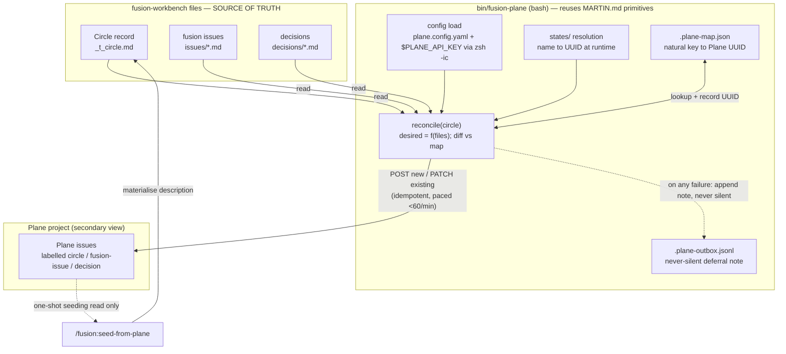
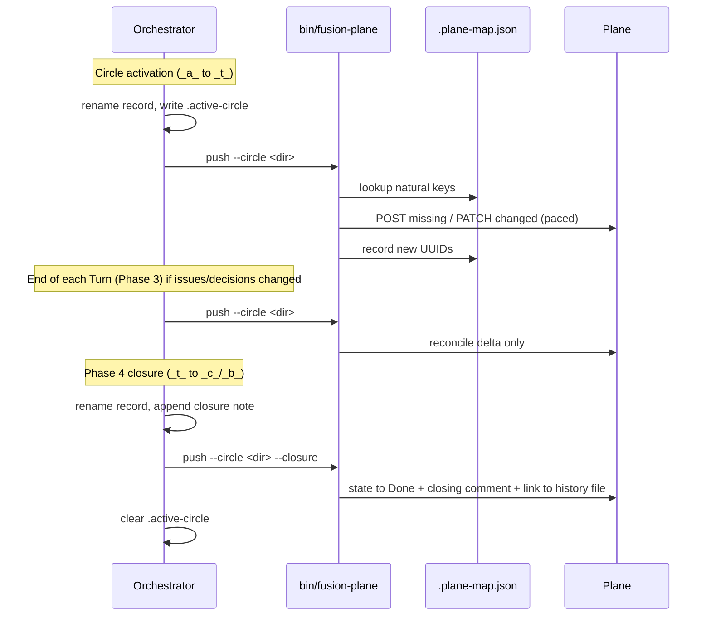
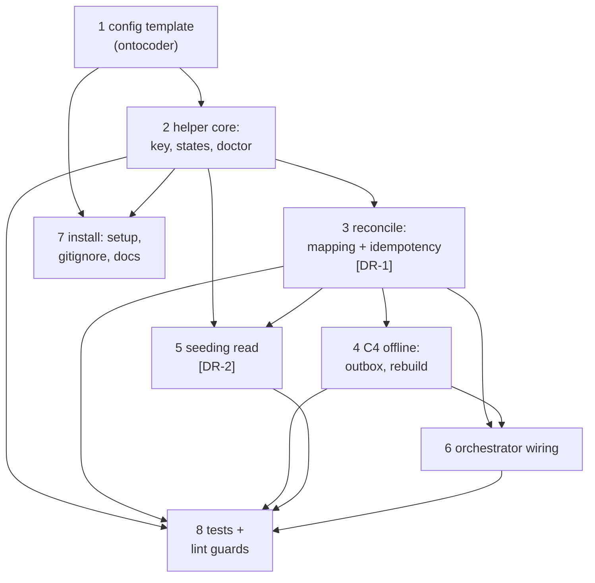

# Implementation Plan: Plane bounded bridge (C3 push mirror + C4 offline + one seeding read)

**Date:** 2026-07-19
**Status:** Complete
**Spec:** `260716-1847_*_spec-plane-integration-und-workbench-struktur.md` (C3/C4 backbone + "Open for Planner" agenda), refined to variant b (bounded bridge) by `260719-2141-plane-mirror-martin-convergence-feasibility.md` §5
**Circle:** `260719-1536-plane-mirror-integration`

## Directive

Build a Plane bridge for fusion's work queue, implemented in the fusion plugin source (this repo). Two channels, one design:

- **Continuous channel (C3 + C4):** a push-only, idempotent mirror. Circles, fusion issues, and decisions appear in a Plane project as a secondary read-along view. fusion stays fully operational when Plane is unreachable, rebuilds the mirror from files on reconnect, and never fails silently.
- **Bounded read channel:** one explicit-command seeding read. On user command, seed a new Circle from a named Plane issue by reading its description once, writing it into the Circle's Grounding, after which files are the source of truth and Plane is not consulted about that Circle again.

Reuse Martin's verified self-hosted Plane primitives rather than reinventing them (`MARTIN.md`). Out of scope: continuous bidirectional sync, a conflict model, webhooks, Plane-as-authoritative-queue, prose-in-Plane (Pages API unreachable on self-hosted). Concurrency is out of scope (single-active-Circle stands).

## Current State

Relevant existing shape this plan fits into (verified, not assumed):

- **bin/ helpers are bash**, invoked by prompts and skills at named points: `fusion-paths`, `fusion-rules`, `fusion-commit-lock`, `fusion-session-mark` (subcommand style: `check|write|heartbeat|clear`), `fusion-workbench-root`. The commit lock and session marker are the precedent for "a helper the orchestrator calls at a specific moment."
- **hooks/ are TypeScript** compiled to `dist/`, and are strictly guard/tracker on tool-use events (`guard.ts`, `tracker.ts`, `lib/*`). They protect paths and count churn; they do not perform work at state transitions. CLAUDE.md is explicit that hooks are for guard/tracker.
- **Orchestrator state transitions** (the mirror's natural trigger points) are performed by the orchestrator prompt via Bash: Circle activation renames `_a_circle.md`→`_t_circle.md` and writes `fusion-workbench/.active-circle`; Phase 4 renames `_t_`→`_c_`/`_b_` and appends a `## Closure note`, then clears `.active-circle` (`agents/orchestrator.md` write-points, Phase 4 portfolio sync `:491-513`).
- **Root-anchored runtime state** already lives at `fusion-workbench/` root: `agentstate.yaml`, `.active-circle`, `.guard-state/`, `.session-marker`. The whole `fusion-workbench/` tree is gitignored in a consuming project. New runtime state (the ID map, the outbox) belongs here.
- **Martin's verified primitives** (`MARTIN.md:62-136`): `$PLANE_API_KEY` in `~/.zshrc`, calls run through `zsh -ic "curl ... \$PLANE_API_KEY ..."` because the non-interactive Bash-tool shell does not inherit the key; runtime `states/` resolution (never hardcode state IDs); `sequence_id`→UUID via `GET issues/?per_page=100 | jq 'select(.sequence_id==$s)'`; the `issues/{id}/links/` endpoint (verified reachable); the absent-key/Plane-down doctrine ("print the exact transition, let the human do it in the UI").
- **Test suite** is vitest under `hooks/lib/__tests__/` — unit tests plus lint-style tests that read repo files (`path-literal-lint.test.ts`, `marker-format-lint.test.ts`). This is the pattern new tests follow.

### Research gate — why no fresh Plane research

The Circle mandates reuse of Martin's verified integration against the *same* self-hosted `plane.digitalleadership.com`. `MARTIN.md` is the authoritative, running source for every endpoint this plan touches (issues, states, links, comments, `sequence_id` lookup, key handling). context7 / web docs would be lower-fidelity than a verified live integration and would risk reinventing what the Directive says to reuse. No external research was performed by design. The one thing `MARTIN.md` does not verify — the issue `parent` field for sub-issues — is isolated behind decision DR-1 and a single verification call in Step 3, so the plan does not rest on an unverified claim.

## Approach — one integral design, not a pile of special cases

The whole bridge is **one idempotent reconcile function plus two trigger surfaces**.

The mirror is not a scatter of per-event pushes. It is a single function `reconcile(circle)`: read the Circle's files (record, issues, decisions), compute the *desired* Plane state, diff it against the persisted file↔Plane-ID map, and issue the minimal create/update calls. Because the desired state is a pure function of the files, running `reconcile` more or fewer times changes nothing — that single property delivers three requirements at once:

- **Idempotency** (C3 AC "twice-run transfer creates no duplicates") — a second run finds the natural key in the map and PATCHes instead of POSTing.
- **Offline rebuild** (C4 / D3 Option 2 "rebuild from files") — after an outage, the next `reconcile` reconstructs Plane from the files; no durable queue is needed for correctness.
- **Never-silent** (C4) — any call failure is recorded to a human-readable outbox note and surfaced by the orchestrator; correctness is restored by the next reconcile, the note tells the user what was pending.

The two trigger surfaces are just *when* reconcile runs — the orchestrator calls it at the state-change points it already owns (activation, closure, and once per Turn when issues/decisions changed). Missing a trigger is harmless; the next one catches up. The seeding read is the mirror in reverse for exactly one call, then it hands off to the existing Circle-creation path and the map ties the seeded Circle's future pushes back to the origin story.

The natural key throughout is the **stable Circle directory name** (Circle 1 shipped specifically to make it immutable), plus the artifact's repo-relative file path for issues and decisions.

## Artifact-type → Plane-object mapping (agenda item 1)

**One-line mapping:** every fusion work-queue artifact — Circle, fusion issue, decision — becomes exactly one Plane issue, labelled by kind (`circle` / `fusion-issue` / `decision`); issues and decisions attach to their Circle's Plane issue (attach shape is DR-1); the fusion marker maps to a Plane **state resolved at runtime via `states/`**, never a hardcoded ID.

| fusion artifact | Plane object | Kind label | Natural key (map key) |
|---|---|---|---|
| Circle (`*_circle.md`) | Plane issue | `circle` | Circle directory name |
| fusion issue (`issues/*.md`) | Plane issue (attached to Circle — DR-1) | `fusion-issue` | Circle-dir + issue file relpath |
| decision (`decisions/*.md`) | Plane issue (attached to Circle — DR-1) | `decision` | Circle-dir + decision file relpath |
| shared/ artifact (no Circle) | Plane issue (top-level, no parent) | same kind labels | file relpath |
| prose (history, reviews, analyses) | **not mirrored** — stays a file (Pages unreachable) | — | — |

**Marker → Plane state**, resolved at runtime by matching a state *name* against the project's `states/` list (the helper resolves name→UUID; if a name is absent on the instance, it falls to the nearest per a config-declared fallback order, never a hardcoded UUID):

| Artifact | fusion marker | Plane state (by name) |
|---|---|---|
| Circle | `_a_` anticipated | Backlog |
| Circle | `_t_` active | In Progress |
| Circle | `_c_` / `_b_` closed / bounded | Done |
| Circle | `_s_` / `_d_` superseded / deferred | Cancelled (fallback Done) |
| Issue | `_o_` open | Todo |
| Issue | `_p_` in progress | In Progress |
| Issue | `_c_` closed | Done |
| Issue | `_d_` dropped | Cancelled (fallback Done) |
| Decision | `_o_` open question | Todo |
| Decision | `_a_` answered (unrealised) | In Progress |
| Decision | `_i_` implemented | Done |
| Decision | `_s_` / `_d_` superseded / deferred | Cancelled (fallback Done) |

The name set (Backlog / Todo / In Progress / Done / Cancelled) and any per-instance override live in the config file (Step 1), not in code and not in a prompt.

## The transfer mechanism and its timing (agenda item 2)

**Where reconcile runs** — the orchestrator prompt calls `bin/fusion-plane push --circle <dir>` at the state-change points it already owns:

- **File↔Plane-ID mapping is persisted** in `fusion-workbench/.plane-map.json` at the workbench root (alongside `.active-circle`, `agentstate.yaml`). Shape: `{ "<natural-key>": { "plane_id": "<uuid>", "kind": "circle|fusion-issue|decision", "last_state": "<name>", "last_pushed": "<iso8601>" } }`. Written only by the helper.
- **Idempotency:** for each artifact, look up its natural key in the map. Present → PATCH (state/title). Absent → POST (create), then record the returned UUID under the natural key. A twice-run push therefore updates, never duplicates. The natural key is the stable Circle directory name (+ file relpath for sub-artifacts), which is why Circle 1 froze that name.
- **Map-loss resilience:** the helper also writes the natural key into the Plane issue (title suffix or a known field) so that if `.plane-map.json` is lost, a `push --rebuild-map` can query Plane once, match on the embedded key, and reconstruct the map before reconciling — no duplicates even after map loss.
- **Rate limit (60/min):** `states/` is fetched once per run and cached; a Circle's reconcile is `1 + N_issues + M_decisions` calls, normally well under 60. The helper paces calls (short sleep between writes) and on HTTP 429 backs off and defers the remainder to the outbox (C4 path). Batching + backoff is the C3 acceptance criterion, satisfied here.

## The C4 offline doctrine, concretely (agenda item 3)

Reuses D3 Option 2 (keep working, rebuild from files, never silent) and Martin's fallback doctrine.

| Failure at a Plane call | What the helper does |
|---|---|
| No network / DNS / connection refused | Append the intended transition to `.plane-outbox.jsonl`; exit 0 with a distinct "deferred" status line the orchestrator surfaces. fusion continues. |
| Plane returns an HTTP error (5xx/4xx) | Same outbox note including the status code and body; never retried silently in-line; surfaced. |
| Rate limit (429) mid-reconcile | Push what fits, defer the rest to the outbox, surface "N of M deferred (rate limit)". |
| `$PLANE_API_KEY` absent | No call attempted; print the exact transition/URL and ask the user to do it in the Plane UI (Martin's doctrine). Surfaced, not silent. |

- **Never silent:** every failure produces (1) an outbox line and (2) a non-error status the orchestrator prints in its dashboard/report. The outbox is a *human-readable record of what was pending*, not a correctness-bearing queue (D3 chose rebuild-from-files over a durable queue).
- **Rebuild on reconnect:** because `reconcile` is a pure function of the files, the next successful `push` reconstructs the correct Plane state from the files. The orchestrator can also run `fusion-plane push --all` to reconcile every Circle after a long outage. The outbox is drained (cleared) once a reconcile succeeds for the affected Circle.
- **Doctor check:** `fusion-plane doctor` reports key presence, config validity, and `states/` reachability, so "is Plane wired up" is observable, not guessed.

## The one seeding-read command (agenda item 4)

**Surface:** a user-invocable skill `/fusion:seed-from-plane <seq>` (skill body in `skills/seed-from-plane/SKILL.md`), delegating the API work to `bin/fusion-plane seed <seq>`. A skill is the correct surface per CLAUDE.md ("critical procedures are skills, not MUST directives") — the skill body becomes the user prompt.

Flow (one-shot, then inert):

1. `bin/fusion-plane seed <seq>` resolves `sequence_id`→UUID (Martin's lookup) and GETs the issue's description + title (one read).
2. The skill hands the fetched title+description to the shaper as the draft Directive for a **new Circle's Grounding** (default: anticipated `_a_` via the existing `/fusion:direct` path — see DR-2 for `_a_` vs straight-to-`_t_`).
3. The helper records the origin Plane UUID in `.plane-map.json` under the new Circle's natural key, so the seeded Circle's future pushes land on the **same** origin story (closing Martin's round-trip: seed from story → work → status/PR/closure pushed back to that story). No continuous read-back; the read happened once.
4. **Fallback (absent key / Plane down):** `fusion-plane seed` prints the issue URL and the fetch command and asks the user to paste the description; the skill proceeds with the pasted text into the same Circle-creation path. Never silent, never blocked.

After step 2 the Grounding file is authoritative; Plane is not consulted about that Circle again. This satisfies "files = source of truth" while relaxing only "push-only" for exactly one command-driven read (the invariant split from the feasibility analysis §3).

## `$PLANE_API_KEY` and the config surface (agenda item 5)

- **Key from env, never in a file.** Every Plane call runs through `zsh -ic "curl -s -H \"X-API-Key: \$PLANE_API_KEY\" ..."` (verbatim reuse of Martin's wrapper) because the non-interactive Bash-tool shell does not inherit the key. The key is never written to config, never read from a file an agent sees (C3 AC + conventions `## Security`).
- **Config surface (not hardcoded in a prompt):** `fusion-workbench/plane.config.yaml` at the workbench root holds `base_url`, `workspace_slug`, `project_id`, the state-name set, and the optional per-instance state fallback order. The *shape* is fusion's; the *values* are the consumer's project. The helper reads config for IDs and env for the key. A `templates/plane.config.yaml` ships in the plugin source; `/fusion:setup` copies it into the workbench for the user to fill in (Step 7).

## What "install" covers (agenda item 6)

Documented in a new `docs/plane-setup.md`, and checkable via `fusion-plane doctor`:

1. **A Plane instance** — self-hosted (e.g. `plane.digitalleadership.com`) or cloud (`plane.so`). Self-hosted note: the Pages API is unreachable, so only the work queue mirrors; prose stays files (already scoped).
2. **An API key** exported as `$PLANE_API_KEY` in the shell profile (`~/.zshrc`), so `zsh -ic` picks it up every session.
3. **`plane.config.yaml` filled in** — base URL, workspace slug, project UUID. `fusion-plane doctor` verifies the key resolves, the config parses, and `states/` is reachable before the first real push.

## Where the code lives, and why (agenda item 7)

- **`bin/fusion-plane` (bash), subcommand style** (`push` / `seed` / `map` / `states` / `doctor` / `plan`), consistent with `fusion-session-mark` and `fusion-commit-lock`.
- **Why bin/ and not a hook:** hooks fire on tool-use events and are, by CLAUDE.md and by their code, guard/tracker only. The mirror is an explicit side-effect at state-change points the orchestrator already performs by Bash; wiring it as a hook would require fragile parsing of Bash commands to detect a `.active-circle` write, and would force reimplementing Martin's verified `curl`/`jq` as TypeScript `fetch` — reinvention the Directive forbids.
- **Why bash and not TypeScript:** Martin's verified primitives are bash `curl` + `jq` + `zsh -ic`. The Directive says reuse them, not reinvent. A bash helper reuses them at the highest fidelity and lowest risk, and matches every other bin/ helper.
- **Orchestrator wiring** lives in `agents/orchestrator.md` (prompt edits at activation, per-Turn, and Phase 4). **The seeding skill** lives in `skills/seed-from-plane/SKILL.md`. **Config template** in `templates/plane.config.yaml`. **Runtime state** (`.plane-map.json`, `.plane-outbox.jsonl`) at workbench root, gitignored with the rest of `fusion-workbench/`. **Docs** in `docs/plane-setup.md`.

## Testing (agenda item 8)

Reuse the `hooks/lib/__tests__/` vitest pattern; no live Plane needed.

- **Dry-run / mock-Plane mode:** `bin/fusion-plane push --plan` (or `FUSION_PLANE_DRYRUN=1`) computes the reconcile plan and emits it as JSON (the ordered list of create/update ops with resolved state names) **without executing any curl**. Tests shell out to the helper with fixture Circle directories and assert on the emitted plan. This tests the whole pure core — marker→state mapping, natural-key idempotency (POST vs PATCH decision from a seeded map), attach shape (DR-1), and the shared/top-level vs Circle-child rule — with no network.
- **Idempotency test:** run `--plan` twice against a fixture with a pre-populated `.plane-map.json`; assert the second plan contains zero POSTs (all PATCH/no-op).
- **Offline test:** point `base_url` at an unreachable host (or set a mock-fail flag); assert an outbox line is written and the exit status is the "deferred" (non-error) status, not a crash.
- **Seeding test:** feed a captured Plane issue JSON fixture to `seed --plan`; assert the extracted description and that the origin UUID would be recorded under the new Circle's natural key. Assert the absent-key path prints the manual-paste fallback.
- **Lint-style guards** (mirroring `path-literal-lint.test.ts`): (a) no hardcoded Plane state UUID appears in `bin/fusion-plane`; (b) `templates/plane.config.yaml` contains no `api_key`/token field (key-in-env invariant); (c) `bin/fusion-plane` names no state ID literal.

## Implementation Steps

1. **Plane config surface + template** [DONE]
   - Executor: `ontocoder`
   - Files: `templates/plane.config.yaml` (new)
   - Changes: author the config schema — `base_url`, `workspace_slug`, `project_id`, `states:` name set (Backlog/Todo/In Progress/Done/Cancelled), optional `state_fallback:` order. No key field (key lives in env). Include inline comments documenting each field and the self-hosted-vs-cloud note.
   - Acceptance: template parses as YAML; contains no key/token field; every field the helper reads is present with a documented placeholder.
   - Dependencies: none.

2. **`bin/fusion-plane` core — config load, key handling, states resolution, doctor** [DONE]
   - Executor: `coder`
   - Files: `bin/fusion-plane` (new, +x)
   - Changes: subcommand skeleton (`push|seed|map|states|doctor|plan`); load `plane.config.yaml`; wrap all HTTP in `zsh -ic "curl ... \$PLANE_API_KEY ..."` (verbatim Martin pattern); `states` subcommand resolves state name→UUID at runtime and caches per run; `doctor` reports key presence + config validity + `states/` reachability. Reuse MARTIN.md: `zsh -ic` key wrapper, runtime `states/` resolution.
   - Acceptance: `fusion-plane doctor` reports OK against a reachable config and a clear, non-silent failure against a missing key or bad config; `states` prints resolved name→UUID pairs; no state ID literal in the source.
   - Dependencies: Step 1.

3. **Reconcile core — artifact→Plane-object model, marker→state, natural-key idempotency, `push`/`plan`/`map`** [DONE]
   - Executor: `coder`
   - Files: `bin/fusion-plane` (extend), reads/writes `fusion-workbench/.plane-map.json`
   - Changes: implement `reconcile(circle)` = read record + `issues/*.md` + `decisions/*.md`, derive kind label + Plane state (mapping table above), diff against `.plane-map.json`, POST-if-absent / PATCH-if-present keyed on the stable Circle directory name (+ file relpath); embed the natural key in the Plane issue for `--rebuild-map`; pace calls under 60/min. `--plan` emits the ordered op list as JSON without executing (test seam). Implement the DR-1 attach as a single swappable function (default: child sub-issue via `parent`; verify the field with one call, else fall back to links via the verified `issues/{id}/links/` endpoint). Reuse MARTIN.md: `sequence_id`/issue lookup pattern, issue-links endpoint.
   - Acceptance: first `push` creates; second `push` (map populated) issues zero POSTs; `--plan` JSON matches fixtures for a Circle with issues + decisions; shared/ artifacts get no parent; attach function is one call site.
   - Dependencies: Step 2; **decision DR-1** (`260719-2223_*_plane-datamodel-subissue-vs-flat-links.md`) — default (child sub-issue, fall back to links) lets the step proceed; the gate confirms.

4. **C4 offline doctrine — never-silent, outbox, rebuild-from-files** [DONE]
   - Executor: `coder`
   - Files: `bin/fusion-plane` (extend), writes `fusion-workbench/.plane-outbox.jsonl`
   - Changes: wrap every call so no-network / HTTP-error / 429 / absent-key each append a human-readable outbox line and return a distinct "deferred" status (non-crash); `--all` reconciles every Circle after an outage; drain (clear) the outbox for a Circle once its reconcile succeeds; absent-key path prints the exact transition for manual UI entry (Martin's doctrine). Reuse D3 (rebuild-from-files, no durable queue) + MARTIN.md fallback doctrine.
   - Acceptance: an unreachable host yields an outbox line + deferred status, not a crash; a subsequent reachable `push` rebuilds Plane from files and clears the outbox; absent key prints the manual step.
   - Dependencies: Step 3.

5. **Seeding read — `/fusion:seed-from-plane` skill + `fusion-plane seed`** [DONE]
   - Executor: `coder`
   - Files: `skills/seed-from-plane/SKILL.md` (new), `bin/fusion-plane` (add `seed`)
   - Changes: `seed <seq>` resolves `sequence_id`→UUID, GETs title+description (one read), records the origin UUID under the new Circle's natural key; the skill feeds the fetched text into the existing `/fusion:direct`→shaper Circle-creation path (default anticipated `_a_` — DR-2), and prints the manual-paste fallback when the key is absent or Plane is down. Reuse MARTIN.md: `sequence_id` lookup, `/new-fe-feature` read-once-then-materialise shape.
   - Acceptance: given a fixture issue JSON, `seed --plan` extracts the description and records the origin UUID under the new Circle's key; absent-key path prints the paste fallback; after seeding, no further Plane read is issued for that Circle.
   - Dependencies: Step 2 (key/states), Step 3 (map); **decision DR-2** (`260719-2223_*_seeded-circle-anticipated-vs-active.md`) — default (anticipated) lets the step proceed; the gate confirms.

6. **Wire the mirror into the orchestrator Turn loop** [DONE]
   - Executor: `coder`
   - Files: `agents/orchestrator.md`
   - Changes: add prompt instructions to call `bin/fusion-plane push --circle <dir>` (a) immediately after Circle activation (`_a_`→`_t_`, after `.active-circle` write), (b) at end of Turn (Phase 3) when issues/decisions changed this Turn, (c) at Phase 4 closure with `--closure` (Done + closing comment + link to history file), before clearing `.active-circle`. Specify that a "deferred" status is surfaced in the dashboard/report (never silent) and never blocks the Turn. Keep the mirror strictly a side-effect of transitions the orchestrator already performs.
   - Acceptance: the three call points read correctly in the prompt; the deferred-status handling is explicit; `claude plugin validate .` passes (frontmatter intact).
   - Dependencies: Step 3, Step 4.

7. **Install surface — setup copies config, gitignore, docs, installer asset list** [DONE]
   - Executor: `coder`
   - Files: `skills/setup/SKILL.md` (copy `templates/plane.config.yaml` into the workbench, idempotently, never overwrite a filled-in one), `.gitignore` (ensure `.plane-map.json` / `.plane-outbox.jsonl` are covered by the existing `fusion-workbench/` exclusion — verify, no leak), `docs/plane-setup.md` (new — the install doc), `install.sh` (add `templates` if not already copied; confirm `bin/fusion-plane` ships with +x), `CLAUDE.md` (one Layout-table row for `bin/fusion-plane`).
   - Acceptance: fresh `/fusion:setup` places a `plane.config.yaml` template in the workbench without clobbering an existing one; `docs/plane-setup.md` covers instance + key + config + `doctor`; the HTTPS install ships the new bin helper executable.
   - Dependencies: Step 1, Step 2.

8. **Testing — dry-run/mock-Plane vitest suite + lint guards** [DONE]
   - Executor: `coder`
   - Files: `hooks/lib/__tests__/fusion-plane.test.ts` (new), fixtures under `hooks/lib/__tests__/fixtures/plane/` (fixture Circle dirs, a captured issue JSON, a pre-seeded map)
   - Changes: tests that shell out to `fusion-plane --plan` / `seed --plan` and assert on emitted JSON (mapping, idempotency, attach shape, shared/-vs-child, seeding extraction); offline test asserting outbox + deferred status; lint-style tests (no state UUID literal in `bin/fusion-plane`; no key field in `templates/plane.config.yaml`).
   - Acceptance: `npm test` in `hooks/` passes; idempotency test shows zero POSTs on second plan; offline test shows outbox line + non-crash; lint guards fail loudly if a state UUID or a config key field is introduced.
   - Dependencies: Steps 2–6.

## Data Structures

- **`fusion-workbench/plane.config.yaml`** (consumer-filled): `base_url`, `workspace_slug`, `project_id`, `states` (name set), `state_fallback` (order). No key field.
- **`fusion-workbench/.plane-map.json`** (helper-owned): `{ "<natural-key>": { plane_id, kind, last_state, last_pushed } }`. Natural key = Circle dir name, or `<circle-dir>::<file-relpath>` for sub-artifacts, or `shared::<file-relpath>` for shared.
- **`fusion-workbench/.plane-outbox.jsonl`** (helper-owned, human-readable): one line per deferred transition `{ ts, natural_key, intended_state, reason, manual_hint }`.

## API Changes

No fusion-internal API changes. New Plane REST usage (all reused/verified in MARTIN.md): `GET states/` (resolve state names), `GET issues/?per_page=100` (`sequence_id`→UUID), `POST issues/` / `PATCH issues/{id}/` (create/update mirror), `POST issues/{id}/links/` (attach + closure link), `POST issues/{id}/comments/` (closing comment). The `parent` field on issue create (sub-issue attach) is the one unverified call — gated behind DR-1 with a link-based fallback.

## Testing Strategy

Covered in agenda item 8 above: a dry-run `--plan` JSON seam makes the whole reconcile core testable with vitest and fixtures, no live Plane; offline behaviour tested against an unreachable host; lint guards enforce the no-hardcoded-state and key-in-env invariants. This mirrors the existing `hooks/lib/__tests__/` unit + lint-test pattern.

## Risks & Mitigations

| Risk | Mitigation |
|---|---|
| Self-hosted instance rejects the `parent` field (sub-issues) | DR-1 default verifies with one call and falls back to the verified links endpoint; attach is a single swappable function (Step 3). |
| Rate limit (60/min) hit on a large Circle | `states/` cached per run; calls paced; 429 defers remainder to outbox and surfaces it (C4). A normal Circle is far under 60 calls. |
| `.plane-map.json` lost → duplicate Plane issues on next push | Natural key embedded in each Plane issue; `push --rebuild-map` reconstructs the map from Plane before reconciling — no duplicates after map loss. |
| Silent mirror failure (violates C4) | Every failure writes an outbox line AND returns a distinct deferred status the orchestrator surfaces; correctness restored by next reconcile. Lint + offline test enforce it. |
| Key leaks into a file | Config template has no key field (lint-guarded); key only ever read from `$PLANE_API_KEY` via `zsh -ic`. |
| Orchestrator prompt edit breaks agent loading | `claude plugin validate .` in Step 6 acceptance; frontmatter untouched (body-only edits). |
| Seeded Circle straight-to-active corrupts single-active-Circle | DR-2 default is anticipated (`_a_`) reusing the gated `/fusion:direct` path; straight-to-active is deferred until the guard interplay is confirmed. |

## Open Questions

- [ ] **DR-1** — attach shape for issues/decisions in Plane (child sub-issues vs flat + links vs labels-only). Filed as a decision record; Step 3 proceeds on the recommended default (child, fall back to links) and the plan gate confirms.
- [ ] **DR-2** — seeded Circle enters anticipated (`_a_`) vs active (`_t_`). Filed as a decision record; Step 5 proceeds on the recommended default (anticipated) and the plan gate confirms.
- [ ] Whether `/fusion:setup` should run `fusion-plane doctor` automatically when a `plane.config.yaml` is present (nice-to-have; not blocking — deferred to Step 7 discretion).

## Reconciliation Log

**2026-07-19 (reconciler, domain=code) — Status: Complete. All 8 steps verified on disk against ground truth in this repo.**

| Step | Verified | Evidence |
|---|---|---|
| 1 config template | DONE | `templates/plane.config.yaml` (4831 B) — commit `eb9cf59`; no key/token field (lint guard passes). |
| 2 helper core (config/key/states/doctor) | DONE | `bin/fusion-plane` subcommand dispatch `push\|plan\|seed\|map\|states\|doctor` (`bin/fusion-plane:1028-1033`) — commit `982336f`; no state-UUID literal in source (lint guard passes). |
| 3 reconcile core (mapping/idempotency/attach/`--plan`) | DONE | `982336f`; 11 mapping/attach + idempotency tests green (`fusion-plane.test.ts`); second plan against in-sync map = zero create ops. |
| 4 C4 offline (outbox/rebuild/never-silent) | DONE | `982336f`; offline test asserts outbox line + deferred (non-crash) status. |
| 5 seeding read (skill + `seed`) | DONE | `skills/seed-from-plane/SKILL.md` (10362 B) + `cmd_seed` — commit `bd62bf1`; seed-extraction + origin-UUID-record tests green. |
| 6 orchestrator wiring (3 push points) | DONE | `agents/orchestrator.md:194` (activation), `:195` (per-Turn Phase 3), `:196`+`:529` (Phase 4 `--closure` before `.active-circle` clear) — commit `be9cbb9`. |
| 7 install surface (setup copy/docs/CLAUDE row) | DONE | idempotent copy `skills/setup/SKILL.md:144`; `docs/plane-setup.md` (4601 B); CLAUDE.md row `:29` — commit `ecc0568`. |
| 8 tests + lint guards | DONE | `hooks/lib/__tests__/fusion-plane.test.ts` (23 tests) + fixtures — commit `aefbf39`; `npm test` = **284/284 passed**; the two fixes the suite surfaced folded into `aefbf39` (helper's last touch). |

**Decisions DR-1 and DR-2 transitioned `_a_`→`_i_`** (see the two decision records): DR-1 (attach shape) implemented by `982336f` as a single swappable `attach_child` with child sub-issue default + links fallback; DR-2 (seeded-Circle state) implemented by `bd62bf1` routing through `/fusion:direct` to the anticipated `_a_` path.

**Two items deliberately left OPEN — the pre-live-Plane gap, not implementation debt:**
- Issue `260719-2304_*_verify-plane-create-patch-body-against-live-instance.md` — create/PATCH body field names, `states/` envelope, and the `parent` sub-issue field are unverified against a live instance. The plan scoped acceptance as offline dry-run by design (Testing §, agenda item 8); this is the separate live/install-time check. No live Plane was reachable this session.
- Decision `260719-2313_*_round-trip-write-overwrites-origin-story-description.md` — how a seeded issue's push-back treats the human's original description (recommendation: Option 1, state-only writes for seeded issues). User's to settle before the first real round-trip push.

No drift found: every claimed change exists and matches the plan. No new issues filed.
