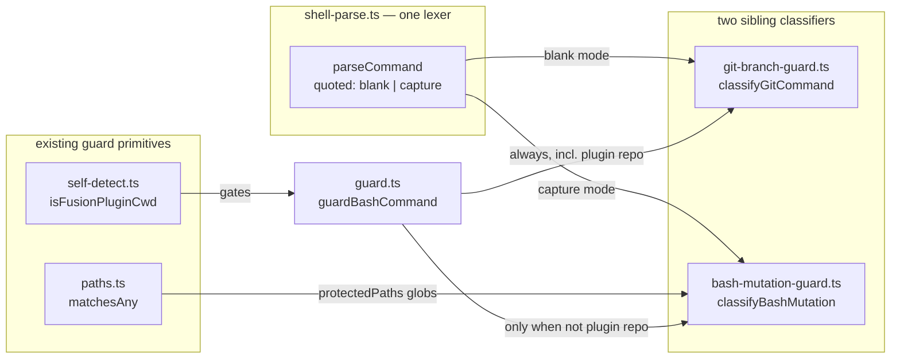
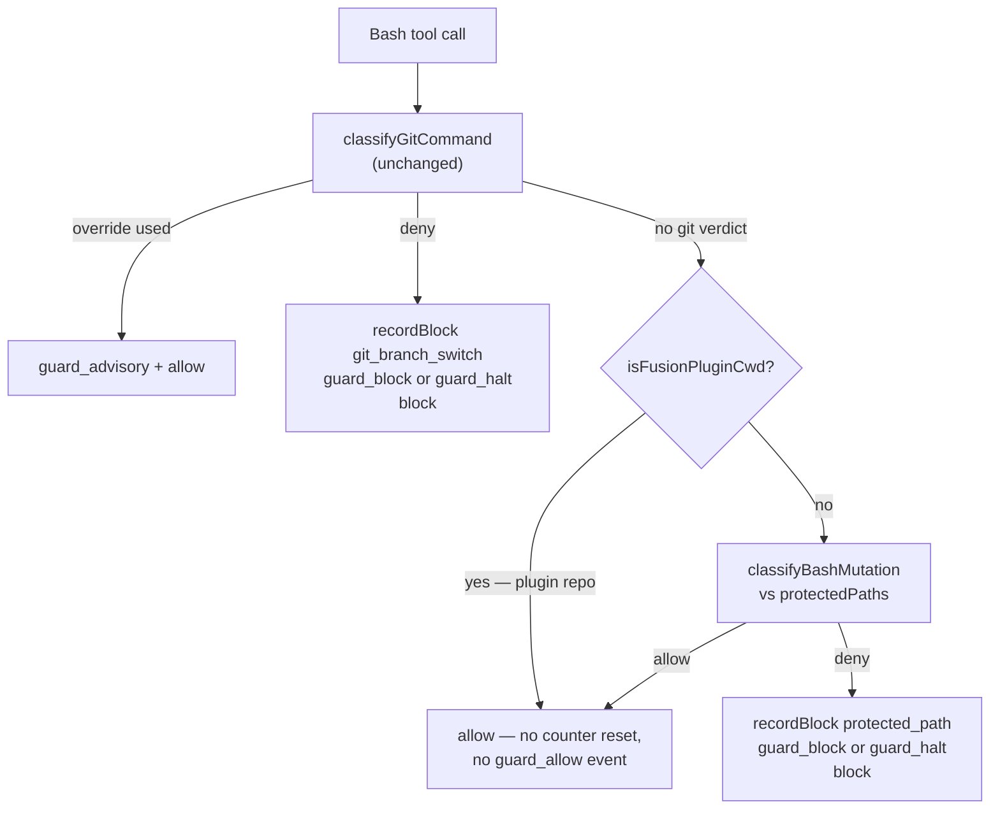
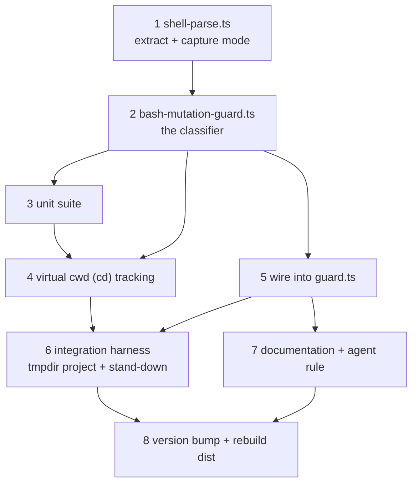

# Implementation Plan: guard inspects Bash for file mutation against protected paths (C5c)

**Date:** 2026-08-01
**Status:** Complete
**Circle:** `260801-1244-guard-bash-inspection`
**Spec:** `260801-1122_*_spec-normative-consolidation.md` — capability C5c only
**Closes:** `260801-1156_*_bash-bypasses-the-protected-path-check-entirely.md`
**Executors:** coder, ontocoder

---

## Directive

The compliance guard reaches its protected-path check only from the four write tools. A `Bash` call is classified for git branch and worktree operations and then returns unconditionally, so every entry in `guard.protectedPaths` is writable through a shell by all sixteen agents. This plan widens the `Bash` inspection to file-mutating commands checked against the same protected-path list, in the shape the existing git classifier already uses, and leaves the guard's Bash bookkeeping untouched.

The spec holds the remit, the fail-closed bound, the self-detect interaction and the ten acceptance criteria under `### C5: Guard changes` and its `*C5c — Bash inspection:*` block. They are not restated here except where a step has to satisfy one, and each step names the criteria it carries.

C5a (`FUSION_ALLOW_RULES_WRITE`) and C5b (project-level guard configuration) belong to Circle `260801-1244-guard-rules-write` and are out of scope. This plan builds the seam C5a plugs into and proposes deferring one C5c criterion that cannot be satisfied without the flag. See `## Open Questions` Q1.

---

## Current State

Everything below was read from the source, not inferred.

**The bypass.** `hooks/guard.ts:265-268` routes every `Bash` call into `guardBashCommand` and returns. `guardBashCommand` ends in `allow()` at line 214 for anything that is not a branch or worktree-moving git operation. The protected-path check at line 309 sits below that return and is reachable only from the write-tool path.

**The bookkeeping the allow path must keep.** The comment at `hooks/guard.ts:201-213` states the two settled properties: an innocuous `Bash` call must not reset the consecutive-block counter (issue 260707-0750_*_bash-allow-resets-block-counter-defeats-halt-escalation.md) and must not emit a `guard_allow` event (issue 260707-0751_*_guard-allow-bash-events-flood-events-jsonl.md). Both hold because the allow path does nothing at all. Adding the mutation check must leave that path byte-identical in effect.

**The stand-down ordering.** `isFusionPluginCwd()` at `hooks/guard.ts:274` sits *below* the Bash return, deliberately, so the branch policy stays active while fusion is developed. The new check is a write-guard concern and must be gated on that detection from *inside* `guardBashCommand`, after the git verdict. `hooks/lib/self-detect.ts:20` resolves `.claude-plugin/plugin.json` against `process.cwd()` **only**, with no upward walk. That single fact makes the whole test problem tractable: any directory that is not literally the plugin root is not the plugin repo, so a temporary project directory gets the full write guard even while the test process runs from inside this repository.

**The parser that already exists.** `hooks/lib/git-branch-guard.ts` is pure, exported and unit-tested: `stripDataRegions` (line 169) blanks single-quoted strings and quoted-delimiter heredoc bodies while preserving regions where bash still expands, `extractCommandSegments` (line 335) splits on `;`, `&&`, `||`, `|`, `&` and newlines and recurses into `$(…)` and backtick subshells, and `tokenize` (line 409) splits a segment on whitespace. Its suite is 84 cases in 512 lines for one command family with two verbs.

**Two parser behaviours found by probing it, both load-bearing for this design.** I ran the two exported functions over mutation-shaped commands rather than reasoning about them:

| Input | `stripDataRegions` output | segments |
|---|---|---|
| `mv 'rules/x.md' /tmp/` | `mv '          ' /tmp/` | one segment, path gone |
| `sed -i '' 's/MUST/may/' rules/x.md` | `sed -i '' '           ' rules/x.md` | one segment, target visible |
| `cd fusion-workbench && rm -rf .guard-state` | unchanged | `["cd fusion-workbench", "rm -rf .guard-state"]` |
| `echo hi 2>&1 >/tmp/log` | unchanged | `["echo hi 2>", "1 >/tmp/log"]` |

The first row is a fail-open hole: a single-quoted protected path is blanked to spaces before any classifier sees it, so `mv 'rules/x.md' /tmp/` would slip through, and under the fail-closed rule the blanked operand would instead deny every ordinary `mv 'my file.txt' …`. Blanking is correct for the git classifier, where a quoted `git switch` is inert prose, and wrong for a mutation classifier, where a quoted operand is an ordinary path. Step 1 resolves this.

The fourth row is a false-positive trap. `extractCommandSegments` replaces `&` with a space, so `2>&1` splits into a dangling `2>` at the end of one segment and a bare `1` at the head of the next. A redirection scanner that treats "an operator with no following token" as an unresolved target would deny `echo hi 2>&1`, which agents run constantly. Step 2 has to skip that case explicitly.

**The test runner.** `hooks/package.json` uses vitest (`vitest run`), with `tsx` available as a dev dependency. `hooks/tsconfig.json` excludes `lib/__tests__` from the build. `hooks/dist/*.js` is committed and shipped (`.gitignore` carries the `!hooks/dist/` exception), and production runs `hooks/dist/guard.js` via `hooks/hooks.json`. Guard state resolves through `findWorkbenchRoot()` from `process.cwd()`, so a temporary directory carrying its own `fusion-workbench/.fusion-setup` gets isolated escalation and event files. `loadConfig()` walks up from the compiled hook's own directory, so a temporary project still inherits the plugin's shipped `protectedPaths` — no fixture config needed.

---

## Approach

One parser, two classifiers, one wiring point.

The shell-parsing primitives move out of `git-branch-guard.ts` into a `shell-parse.ts` that both classifiers consume, because a module named for git should not own the generic lexer a non-git consumer depends on. The mutation classifier is a sibling of the git classifier, not a second parser, and it reuses the guard's existing `matchesAny` glob matching and `normalizeToRelative` path handling rather than introducing its own.

The classifier resolves each recognised mutating command to a set of **written** operands, resolves each operand to a project-relative path, and matches that path against the effective `protectedPaths`. Recognition is table-driven: one row per verb naming the flags that consume a value and which positionals are written. Adding a verb later is a row and two tests, not a new code path.

Fail-closed is scoped exactly as the spec bounds it — to a recognised mutating command whose written operands cannot be resolved — and never to unparseable Bash in general.



### Control flow after the change

The git verdict is evaluated first and unchanged, so a call carrying both a branch switch and a mutation denies on the branch. The mutation check is gated on the plugin-repo detection. The allow path keeps its zero side effects.



### What counts as a mutation

Three families, table-driven. `written` names which operands the verb writes; a positional that is only read is not a target, so copying *out of* a protected path stays allowed.

| Verb | Flags taking a value | Written operands |
|---|---|---|
| `mv` | `-t` | all positionals, plus the `-t` directory (sources are removed, destination written) |
| `rm` | — | all positionals |
| `cp` | `-t` | the last positional, or the `-t` directory |
| `ln` | `-t` | the last positional, or the `-t` directory |
| `install` | `-t`, `-m`, `-o`, `-g` | the last positional, or the `-t` directory |
| `tee` | — | all positionals |
| `truncate` | `-s`, `-r` | all positionals |
| `dd` | — | the value of `of=` |
| `sed` (only with `-i` / `-i.bak` / `--in-place`) | `-e`, `-f`, `-l` | all positionals |
| `perl` (only with `-i` / `-i.bak`) | `-e`, `-f` | all positionals |
| `git mv` | — | all positionals |
| `git rm` | — | all positionals |

`sed` and `perl` take all positionals rather than modelling where the script ends, because the two platforms disagree (BSD `-i` takes a separate mandatory suffix argument, GNU `-i` takes an optional attached one) and a sed script never matches a protected-path glob. `sed -i '' 's/MUST/may/' rules/x.md` therefore denies on `rules/x.md` and `sed -i '' 's/a/b/' notes.txt` allows, on both platforms, with no platform branch in the code.

Redirection is scanned separately and position-independently, since a redirection binds to the whole simple command wherever it appears: `>`, `>>`, `>|`, `N>`, `N>>`, `&>`, `&>>`, whether glued to the target (`>file`) or separated (`> file`). Three forms are skipped rather than denied — a target that is a bare file-descriptor number (`>&2`, `2>&1`), a target of `-`, and an operator with no following token in its segment, which is the `&`-split artifact documented above.

### The fail-closed rule and its bound

A written operand is **unresolved** when it survives quote handling still containing `$`, a backtick, or a `~` prefix, or when the segment's virtual working directory is unknown and the operand is relative. A recognised mutating command with at least one unresolved written operand denies. This gives exactly the spec's three cases: `mv $SRC rules/` denies on the visible protected target, `mv rules/x.md $DST` denies on the visible protected source, and `mv $A $B` denies because nothing resolves. An unrecognised program is allowed regardless of how unparseable its arguments are, so ordinary shell work is untouched.

Glob metacharacters in an operand are matched as literal text rather than expanded. This is fail-closed for the patterns that matter, because `rules/**` compiles to `^rules/.*$` and therefore matches the literal string `rules/*.md`, and `fusion-workbench/.guard-state/**` matches `fusion-workbench/.guard-state/*`.

### The accepted residual

An unrecognised program that writes a protected path still writes it. A path constructed at run time from a variable is denied when it is an operand of a recognised verb and invisible otherwise. A project's own build script can write anywhere. C5c raises the cost of the bypass from zero to deliberate; it does not eliminate it, and no claim that `protectedPaths` is enforced should be made without that qualification. Step 7 puts this statement in the guard's own documentation, which is a criterion, not a courtesy.

---

## Implementation Steps



### 1. [DONE] Extract the shell parser and add quoted-word capture
<!-- DONE: hooks/lib/shell-parse.ts (new) + hooks/lib/git-branch-guard.ts (imports/re-exports) + hooks/lib/__tests__/shell-parse.test.ts (new, 30 cases); npm test 346 passed (316 before + 30); git-branch-guard.test.ts unmodified, its 84 cases green; not yet committed (orchestrator commits) -->
<!-- Divergences from the step as written: (a) a test file was added, which the step's Files list did not name — the four acceptance criteria are only checkable as tests; (b) the flat `extractCommandSegments` is KEPT alongside the new ordered scanner rather than being reimplemented on top of it, so blank-mode equivalence is a real assertion instead of a tautology (see the history log for the collapse-later note); (c) capture mode replaces the whole quoted region INCLUDING its quotes, which the step left ambiguous — it is what makes `resolveWord`'s stated contract (placeholders + double quotes) sufficient. -->


- **Executor:** coder
- **Files:** `hooks/lib/shell-parse.ts` (new), `hooks/lib/git-branch-guard.ts`, `hooks/lib/__tests__/git-branch-guard.test.ts` (imports only, if needed)
- **Dependencies:** none

Move `stripDataRegions`, `blankData`, `findHeredocTerminator`, `extractCommandSegments` and `tokenize` into `hooks/lib/shell-parse.ts`. `git-branch-guard.ts` imports them and re-exports `stripDataRegions` and `extractCommandSegments` under their current names, so the existing 84-case suite keeps its import path and its assertions unchanged.

Add a capture mode. `parseCommand(command, { quoted: "blank" | "capture" })` returns ordered segments with a nesting depth and, in capture mode, a literal table:

```ts
export interface ParsedSegment { text: string; depth: number }   // depth 0 = outer, ≥1 = subshell body
export interface ParsedCommand { segments: ParsedSegment[]; literals: Map<string, string> }
```

In `"blank"` mode the output is today's behaviour exactly. In `"capture"` mode each single-quoted region's content is replaced by an opaque placeholder token that contains no whitespace and no shell operator (so the segmenter and the tokenizer treat it as one word), and the placeholder maps to the literal text. Quoted-delimiter heredoc bodies stay blanked in both modes — they are data, never operands.

Capture mode preserves inertness by construction rather than by blanking: `echo 'mv rules/x.md /tmp'` tokenizes to two words, so `mv` is never in command position. Add `resolveWord(token, literals)` returning `{ value }` or `{ unresolved: true }`: it expands placeholders, strips surrounding double quotes whose content carries no `$` or backtick, and reports unresolved for anything still containing `$`, a backtick, or a leading `~`.

Segments must come back in **source order** with their depth, which today's function does not guarantee (it pushes subshell bodies ahead of outer segments). The git classifier asks only whether *any* segment denies, so the order change is invisible to it; step 4 needs the order.

**Acceptance:**
- `npm test` in `hooks/` passes with the existing 84 git-classifier cases unmodified.
- `parseCommand("mv 'rules/x.md' /tmp/", { quoted: "capture" })` yields one depth-0 segment whose second word resolves to `rules/x.md`.
- `parseCommand(cmd, { quoted: "blank" }).segments.map(s => s.text)` equals `extractCommandSegments(stripDataRegions(cmd))` as a set, for every command in the existing suite.
- `resolveWord` reports unresolved for `$DST`, `"$DST"`, `` `pwd` `` and `~user/x`, and resolves `"plain.txt"` to `plain.txt`.

### 2. [DONE] The mutation classifier
<!-- DONE: hooks/lib/bash-mutation-guard.ts (new, ~560 lines incl. docstrings); npm test 346 passed (unchanged — no test file added, step 3 owns the suite), git-branch-guard 84 and shell-parse 30 green; npx tsc --noEmit clean; hooks/guard.ts, hooks/dist/ and plugin.json untouched; not committed (orchestrator commits). Verified against a 93-case scratch matrix plus 42 ordinary-agent-command allow cases, both run outside the repo. -->
<!-- Divergences and findings: (a) `>|` is UNREACHABLE as written — `shell-parse` splits on `|`, so the target lands at the head of the next segment, the same artifact as `2>&1`; handled by letting a dangling operator adopt the next SAME-DEPTH segment's head token, where `2>&1` / `>&2` still skip because that head is a bare fd number. (b) The fail-closed rule cannot fire for a `$(…)` / backtick OPERAND — the parser lifts it out and leaves a space, so it is invisible, not unresolved; filed as `260801-1430_*_substitution-operand-is-invisible-to-the-mutation-classifier.md` for the Q3 gate rather than patched. (c) Added beyond the table: `--target-directory[=DIR]` as an alias of `-t`, a directory-form protected match (`rm -rf fusion-workbench/.guard-state` must hit `…/.guard-state/**`), grammar-prefix skipping (`{`, `(`, `!`, `then`, `else`, `do`), and an empty `protectedPaths` early return so a project with nothing to protect is never denied fail-closed. (d) Wrapper programs (`sudo`, `xargs`, `env`, `command`, `time`) are NOT skipped and `chmod`/`chown`/`touch`/`tar`/`rsync`/`patch` are NOT rows — both are residual, listed for the Q3 gate. -->

<!-- AMENDED after the Q3 gate (260801-1520_coder_verb-table-gate-widenings.md, coder): the three widenings the user approved are applied. (1) WRAPPER SKIPPING — `WRAPPER_PROGRAMS` (sudo, doas, env, command, nice, ionice, timeout, xargs, time, nohup, setsid, stdbuf), each with its own value-flags and, for `timeout`, its duration operand; skipped in a loop, so `sudo env rm rules/x.md` classifies as `rm`. (2) ANCESTOR MATCHING — a written operand that is a proper directory prefix of a protected pattern's literal prefix denies (`ancestorOfProtected`), with its own deny reason naming the contained pattern; `rm -rf hooks`, `rm -rf fusion-workbench`, `mv hooks /tmp` now deny, `rm -rf node_modules` / `dist` / `hooks/dist` do not; the project root is excluded so `cp x .` stays allowed. (3) SUBSTITUTION OPERANDS — `shell-parse` capture mode leaves `$(…)` instead of a space where a lifted subshell stood, so the fail-closed rule fires; blank mode unchanged. Files: `hooks/lib/bash-mutation-guard.ts`, `hooks/lib/shell-parse.ts`. Closes `260801-1430_*_substitution-operand-…`. `npm test` 346 passed (84 git + 30 shell-parse unmodified), `npx tsc --noEmit` clean. Verified against the rebuilt 42-ordinary-command matrix (42/42 still allow, before AND after) plus a 52-command false-positive hunt diffed against the committed baseline: 4 verdicts changed, all of them the approved semantics. Q3's checkbox is left for the orchestrator to close. -->

- **Executor:** coder
- **Files:** `hooks/lib/bash-mutation-guard.ts` (new)
- **Dependencies:** step 1

A pure, exported module in the shape of `git-branch-guard.ts`:

```ts
export interface MutationVerdict {
  deny: boolean;
  reason?: string;           // names the offending segment and the path
  offendingSegment?: string;
  targetPath?: string;
}
export interface MutationOptions {
  protectedPaths: string[];
  /** Project-root-relative normalisation, injected so the module stays pure. */
  normalize: (raw: string) => string;
  /** C5a seam — a path this predicate accepts is exempt. Defaults to none. */
  exempt?: (path: string) => boolean;
}
export function classifyBashMutation(command: string, opts: MutationOptions): MutationVerdict;
```

Implement the verb table, the operand roles, the redirection scanner and the fail-closed rule described in `## Approach`. Normalise each resolved operand with `path.normalize` before matching, so `foo/../rules/x.md` matches `rules/**`. Match with the existing `matchesAny` from `hooks/lib/paths.ts` — do not write a second glob matcher. The `exempt` predicate is checked after a protected match and before the deny, and is the only thing Circle 2 has to supply.

The reason string must name both the segment and the path, per the first acceptance criterion, in the shape of the branch classifier's `DENY_REASON`: what was denied, why, and what to do instead (stop and ask the user; the write tools are guarded on the same list, so re-routing through `Edit` is not a way around it).

Do **not** add a halt check on this path. Halt currently blocks the four write tools only, and extending it to Bash would stop an agent from running `ls` while halted, which is a behaviour change nobody asked for. A protected-path mutation is blocked by the protected-path rule whether or not a halt is active.

**Acceptance:** covered by step 3.

### 3. [DONE] Unit suite for the classifier
<!-- DONE: hooks/lib/__tests__/bash-mutation-guard.test.ts (new, 177 vitest cases / 413 command assertions). npm test 523 passed, 14 files (346 before + 177); git-branch-guard.test.ts (84) and shell-parse.test.ts (30) unmodified and green; npx tsc --noEmit clean. No source file touched — MUTATION_VERBS, MUTATION_GIT_SUBCOMMANDS and WRAPPER_PROGRAMS were already exported, so no new export was needed. hooks/guard.ts, hooks/dist/ and plugin.json untouched. Not committed (orchestrator commits). -->
<!-- Beyond the step as written: (a) the verb, git-subcommand and wrapper tables are asserted COMPLETE against the exported tables, so a row added without a test fails the suite; (b) the protected-path fixture is pinned against hooks/config.json, so a drifted fixture cannot silently weaken the ancestor cases; (c) the 42-command must-never-deny matrix from the two prior history logs is reconstructed and extended to 50, labelled as the regression block; (d) three residual/gap blocks assert CURRENT behaviour on purpose — the accepted residuals, the backslash-continuation gap (new issue 260801-1513), and step 4's cd cases inverted, so step 4 gets a failing test naming exactly what to flip. -->
<!-- FINDING: `rm \<newline>rules/x.md` is ALLOWED. shell-parse does not honour a backslash line continuation — the escape pair is emitted verbatim and the newline then terminates the segment, so the operand lands outside the verb's command. The same hole allows `git worktree \<newline>add ../wt x` in the pre-existing git classifier. Filed as 260801-1513_*_backslash-line-continuation-…; the fix is in shell-parse and widens both classifiers, so it needs a gate. -->

- **Executor:** coder
- **Files:** `hooks/lib/__tests__/bash-mutation-guard.test.ts` (new)
- **Dependencies:** step 2

Pure tests, no hook, no filesystem, in the shape of `git-branch-guard.test.ts`. Expect roughly 90 to 120 cases. Required coverage:

- Each of the twelve table verbs denying on a protected target and allowing on an unprotected one.
- Read-only positionals allowed: `cp rules/x.md /tmp/y`, `ln -s rules/x.md /tmp/link`, `dd if=rules/x.md of=/tmp/y`.
- Redirection: `> `, `>>`, `>|`, `>file` glued, `&>file`, `cat > rules/x.md <<EOF`, and the three skip forms — `2>&1`, `>&2`, `echo hi 2>` with no target.
- Quoting: single-quoted, double-quoted and unquoted forms of the same protected target all deny; `mv 'my file.txt' /tmp/` allows.
- Fail-closed: `mv $SRC rules/`, `mv rules/x.md $DST`, `mv $A $B` all deny; `curl -o $OUT https://x` and `make $TARGET` allow.
- Inertness: `echo 'rm -rf rules/'`, and a quoted-delimiter heredoc body containing `rm rules/x.md`, both allow.
- Compound and subshell: `ls && rm rules/x.md`, `$(rm rules/x.md)`, and a backtick form all deny.
- `git mv rules/x.md docs/` denies; `git checkout HEAD -- rules/x.md` allows, which is fusion's own revert strategy and the load-bearing allow case.
- `fusion-workbench/.guard-state/escalation.json` and `fusion-workbench/.guard-state/*` both deny.
- The `exempt` predicate turns a would-be deny into an allow.

**Acceptance:**
- `npm test` passes.
- Carries the criterion *"The classifier's cases run as unit tests without the hook firing."*
- Every command in the issue's reproduction block (`mv`, `rm`, `sed -i`, `printf '' >`) has a denying case.

### 4. [DONE] Virtual working directory tracking
<!-- DONE (reconciler 260801-2029, marked from commits — the coders were told not to edit this plan): commit 59a1cd9 "track a virtual working directory across shell segments", hooks/lib/bash-mutation-guard.ts (+438) with applyDirEffect at :1097 and the walk at :1361, hooks/lib/shell-parse.ts (+7), 312 new test lines. Q2's cut candidate was kept, per the user's Q3-gate directive recorded in agentstate.yaml plan_context.user_directive. -->

- **Executor:** coder
- **Files:** `hooks/lib/bash-mutation-guard.ts`, `hooks/lib/__tests__/bash-mutation-guard.test.ts`
- **Dependencies:** steps 2 and 3

Without this, `cd fusion-workbench && rm -rf .guard-state` is allowed, because the operand resolves to `.guard-state` and never matches `fusion-workbench/.guard-state/**`. That is the sharpest case the issue names, and it is one `cd` away from trivial.

Walk the depth-0 segments in source order carrying a `virtualCwd`, starting at `.`. A segment whose command word is `cd`, `pushd` or `chdir` updates it when its argument resolves to a literal, and sets it to unknown otherwise. Depth-1-and-deeper segments are evaluated from `.` and their `cd` does not leak outward, which matches subshell semantics closely enough. When `virtualCwd` is unknown, a relative written operand is unresolved and therefore denies; an absolute one still resolves.

This step is separable on purpose. It is the one to cut if the Circle runs long — see `## Open Questions` Q2.

**Acceptance:**
- `cd fusion-workbench && rm -rf .guard-state` denies, naming `fusion-workbench/.guard-state`.
- `cd build && rm -rf out` allows, so ordinary work is not caught.
- `cd $D && rm -rf x` denies, and `cd $D && rm -rf /tmp/x` allows.
- `(cd rules && ls)` followed by `rm x.md` at depth 0 does not resolve `x.md` under `rules/`.

### 5. [DONE] Wire the classifier into the guard
<!-- DONE (reconciler 260801-2029): commit 5b8430c "guard checks Bash file mutation against protected paths", hooks/guard.ts (+127) — classifyBashMutation imported at :59, the check gated on !isFusionPluginCwd() at :249, recordBlock with trigger "protected_path" at :267. The step's acceptance holds on the diff read at HEAD: no resetBlockCounter call and no emitEvent("guard_allow") anywhere on the Bash path (guard.ts:510,512 are the write-tool path; :397-399 is the self-detect stand-down advisory). Amended twice afterwards — 3177e65 (a git override waives only what it names) and 5d9bbcc (one shared command-word resolver) both touch this wiring. -->

- **Executor:** coder
- **Files:** `hooks/guard.ts`
- **Dependencies:** step 2

Inside `guardBashCommand`, after the git override and deny branches and before the final `allow()`, add the mutation check gated on `!isFusionPluginCwd()`. Reuse `normalizeToRelative` as the injected `normalize`. On a deny, use `recordBlock` with trigger `"protected_path"` — the same trigger the write-tool path uses, so the monitor, the escalation counter and the three-block halt treat both paths identically — then `saveEscalation`, `emitEvent("guard_halt" | "guard_block", "Bash", targetPath, "Protected path")`, then `block(reason)`.

Leave the allow path and its comment block untouched, and extend the comment to record that the mutation check sits above it and denies only, so the stated zero-side-effect property still describes what the code does.

Update the module docstring at `hooks/guard.ts:1-18`, which currently says the guard intercepts Bash for the branch policy alone.

**Acceptance:** covered by step 6. The diff must show no call to `resetBlockCounter` and no `guard_allow` emission added anywhere on the Bash path.

### 6. [DONE] Integration harness against a real project directory
<!-- DONE (reconciler 260801-2029): commit 85c043c, hooks/lib/__tests__/guard-bash-integration.test.ts (new, 458 lines) + helpers/guard-harness.ts (new, 384 lines), plus guard-bash-wiring.test.ts. All eight acceptance bullets verified present at HEAD: the deny-five and the allow-five (:285-344, asserting consecutiveBlocks and events.jsonl on the FILES, which is the 260707-0750_*_bash-allow-resets-block-counter-defeats-halt-escalation.md/0751 regression guard), fail-closed (:154), the unrecognised-command residual (:184), git mv / git checkout (:77-153), the three-block halt (:350-383), the guard-state case, and the stand-down pair (:389-458, four cases including the boundary from the other side). The test script change landed separately in e31c0f3 rather than here — see issue 260801-1821. -->

- **Executor:** coder
- **Files:** `hooks/lib/__tests__/guard-bash-integration.test.ts` (new), `hooks/package.json`
- **Dependencies:** steps 4 and 5

This step is the answer to the Circle's named risk. The full strategy is in `## Testing Strategy`; the work is:

Build a throwaway project root per test file with `mkdtemp` under the OS temp directory, containing `fusion-workbench/.fusion-setup`, a `rules/` directory with a file, and a `fusion-workbench/.guard-state/` that starts empty. It must **not** contain `.claude-plugin/plugin.json`, which is what makes the write guard active there. Spawn `node <repo>/hooks/dist/guard.js` with `cwd` set to that directory, feed PreToolUse JSON on stdin, and assert on the JSON verdict and on the two state files.

Change `hooks/package.json`'s test script to `tsc && vitest run`. Production runs the committed `hooks/dist/guard.js`, so a suite that exercised the TypeScript source would pass against a stale `dist` and ship the defect unfixed — the exact failure mode this Circle is warned about, in a second form.

**Acceptance:** carries six of the ten criteria.
- `mv`, `rm`, `sed -i`, `tee` and `>` redirection against `rules/x.md` each return `{"decision":"block", …}` with the segment and the path in the reason.
- The same five against `/tmp/…` return `{}`, and after each the escalation file's `consecutiveBlocks` is unchanged and `events.jsonl` has gained no line. This is the 260707-0750_*_bash-allow-resets-block-counter-defeats-halt-escalation.md and 260707-0751_*_guard-allow-bash-events-flood-events-jsonl.md regression guard and must be asserted on the files, not inferred.
- A recognised mutation with an unresolvable operand blocks.
- An unrecognised command (`curl -o rules/x.md https://x`) is allowed, which is the residual, made visible as a test.
- `git mv rules/x.md docs/` blocks and `git checkout HEAD -- rules/x.md` is allowed.
- Three consecutive Bash protected-path denials produce `haltActive: true` and a `guard_halt` event on the third.
- `rm -rf fusion-workbench/.guard-state` blocks.
- Stand-down: with `cwd` set to the plugin repository root, `mv rules/x.md /tmp/` is allowed **and** `git switch main` on the same call is denied. Run these as two spawns, because `isFusionPluginCwd()` caches per process.

### 7. [DONE] Documentation and the agent-facing rule
<!-- DONE (reconciler 260801-2029): commit 3806a49 "document the shell protected-path check; correct five false claims" — rules/protected-path-discipline.md (new, 203 lines, present at HEAD), README-hooks.md (+57), bin/fusion-rules (+8, the emit line), CLAUDE.md (+9), rules/git-branch-discipline.md (+10). npm test green at HEAD, so path-literal-lint and glob-nomatch-lint still pass. The rule file was revised three further times as the classifier changed (18e2e4f, 9ab5a2a, and the 1858/1859/1902 fixes), which is the documentation staying with the code rather than drifting from it. -->

- **Executor:** coder
- **Files:** `README-hooks.md`, `rules/protected-path-discipline.md` (new), `bin/fusion-rules`, `CLAUDE.md`
- **Dependencies:** step 5

`README-hooks.md` currently describes the Bash interception as the branch policy only (lines 32-33, 113, 124-130). Add the protected-path inspection, the verb and redirection families, the fail-closed bound, and the residual statement in the spec's own terms.

Add `rules/protected-path-discipline.md`, a short always-on rule in the shape of `git-branch-discipline.md`: what is denied, what stays allowed, why enforcement rather than instruction, and what to do instead (stop and ask the user; do not rephrase the command, because the guard segments and inspects subshells). Wire it with one `emit_if_exists` line beside `bin/fusion-rules:267`. Without this an agent meets an unexplained deny and its first instinct is to route around it.

Update the `hooks/` row and the "Where to look when something breaks" table in `CLAUDE.md` with a row for a false-positive deny on ordinary shell work, pointing at the verb table.

**Acceptance:**
- Carries the criterion *"the spec's statement of that residual appears in the guard's own documentation rather than only here."*
- `bin/fusion-rules planner` emits the new rule file, and the `path-literal-lint` and `glob-nomatch-lint` tests still pass.

### 8. [DONE] Version bump and rebuild
<!-- DONE (reconciler 260801-2029): commit e31c0f3 "bump to 5.8.0, rebuild dist, make npm test build first" — .claude-plugin/plugin.json now reads 5.8.0, hooks/package.json test script is `tsc && vitest run`, dist gained lib/bash-mutation-guard.{js,d.ts} and lib/shell-parse.{js,d.ts}. Verified at HEAD rather than from the commit: `npm test` in hooks/ is 753 passed / 16 files, and `git status --short hooks/dist` is empty AFTER that run, so the committed dist is current with the source at HEAD (the two later fix commits 18e2e4f and 9ab5a2a each rebuilt it in the same commit). The marketplace bump, the v5.8.0 tag and the install.sh header refresh are the user's release ritual and are outstanding: `git tag -l 'v5.*'` stops at v5.7.0 and install.sh:27 still names v5.7.0 as the current release. The marketplace clone is not reachable from here and was not checked. `claude plugin validate .` was not re-run by this reconciliation. See the Reconciliation Log. -->

- **Executor:** ontocoder
- **Files:** `.claude-plugin/plugin.json`, `hooks/dist/**`
- **Dependencies:** steps 6 and 7

Bump the plugin version. Rebuild `hooks/dist` and commit it, since it is shipped and the installer depends on it being current. Run `claude plugin validate .` per the release checklist.

The marketplace bump, the tag and the `install.sh` header refresh are the user's release ritual, not a plan step.

**Acceptance:** `npm test` in `hooks/` passes, `claude plugin validate .` reports passed, and `git status` shows a `hooks/dist` diff consistent with the source changes.

---

## Testing Strategy

The Circle record names local verification as the most likely way this ships broken, so the strategy is stated before the tests are written rather than after.

**The problem.** The write guard stands down when `process.cwd()` is the fusion plugin's own source tree. A shell mutation of `rules/` in this repository is allowed by design and proves nothing about the new check.

**What makes it tractable.** `hooks/lib/self-detect.ts:20` resolves `.claude-plugin/plugin.json` against `process.cwd()` with no upward walk. A directory that is not literally a plugin root is therefore not the plugin repo, however deep inside this repository it sits. A temporary project directory gets the full write guard.

**Three layers.**

1. **Pure unit tests** (steps 3 and 4) carry the classification matrix. They import the classifier directly, touch no filesystem, and are unaffected by cwd. This is the bulk of the coverage and the only layer where a hundred cases are cheap.
2. **Integration tests** (step 6) carry the wiring: that a deny actually reaches a block, that the escalation counter and the events file move exactly when they should, and that three denials halt. Each case spawns the compiled `hooks/dist/guard.js` as a subprocess with `cwd` set to a freshly created temporary project root. The subprocess boundary is not incidental — `isFusionPluginCwd()` caches its answer in a module-level variable, so one process cannot test both cwd conditions.
3. **A stand-down pair** (step 6) is the one assertion this repository can carry directly: from the plugin root, `mv rules/x.md /tmp/` is allowed while `git switch main` is denied. That is the load-bearing ordering property, and it is checkable here precisely because it asserts the absence of the new deny.

**Why a temporary directory rather than a committed fixture.** A committed fixture under `hooks/lib/__tests__/fixtures/` would also work, since it is not a plugin root. It was rejected because the guard writes `escalation.json` and `events.jsonl` into the fixture's workbench on every run, and `fusion-workbench/` is not gitignored in this repository (`.gitignore:50` is commented out). A committed fixture would accumulate state in the working tree. `mkdtemp` gives isolation for free and needs no gitignore change.

**What no layer covers.** Nothing here proves the behaviour in a real consuming project with its own workbench, its own agents and a live session. The temporary directory reproduces the two conditions that matter — no plugin manifest at cwd, a `.fusion-setup` marker present — and inherits the plugin's real `protectedPaths` through the unchanged config loader, so the gap is small. It is still a gap, and one manual check against a real consuming project before release is worth the five minutes. That is a recommendation, not a step.

---

## Risks & Mitigations

| Risk | Mitigation |
|---|---|
| A false positive blocks ordinary shell work across all sixteen agents. This is the largest blast radius in the Circle. | Read-only operands are excluded by role rather than by verb, the three redirection skip forms are explicit, `cd` with a literal argument is applied rather than treated as unknown, and step 3 spends cases on allow-side assertions, not only deny-side. The verb table is the review surface — see the gate in Q3. |
| The parser refactor in step 1 breaks the branch classifier. | The 84-case suite is not modified and must pass unchanged; `git-branch-guard.ts` re-exports the moved functions under their current names; `"blank"` mode is required to be output-identical. |
| Capture mode changes segmentation and creates new false positives, because a placeholder is one word where blanked content was several. | The placeholder carries no whitespace and no shell operator, so it can only *reduce* over-segmentation. The blank-mode equivalence assertion in step 1 pins the old behaviour. |
| The allow path silently acquires a side effect and re-opens issues 260707-0750_*_bash-allow-resets-block-counter-defeats-halt-escalation.md and 260707-0751_*_guard-allow-bash-events-flood-events-jsonl.md. | Step 6 asserts on the state files themselves before and after an innocuous Bash call, not on the verdict. Step 5's acceptance names the two forbidden calls. |
| The stand-down is placed wrongly and the branch policy stops working in this repository, or the mutation check starts working here. | The stand-down pair in step 6 asserts both halves of the ordering in one test. |
| A committed `hooks/dist` goes stale and the shipped guard does not contain the fix. | Step 6 changes the test script to build first, and step 6's integration tests run against `dist`, so a stale build fails the suite. |
| An agent meets an unexplained deny and works around it, which is the failure `git-branch-discipline.md` was written to prevent. | Step 7's rule file is emitted to every agent and names the correct response. The deny reason itself says stop and ask rather than re-route. |
| Scope overrun: the branch classifier needed 649 lines and 84 cases for two verbs, and this is twelve plus redirection. | The verb table makes a marginal verb one row and two cases rather than a code path. Step 4 is separable and is the named cut. Q2 puts the decision at the gate. |

---

## Open Questions

- [x] **Q1 — Human gate. Defer the `FUSION_ALLOW_RULES_WRITE` criterion to Circle 2?** *(RESOLVED as proposed — reconciler 260801-2029. The `exempt` seam exists and is used: `MutationOptions.exempt` at `hooks/lib/bash-mutation-guard.ts:168`, checked at `:1243` and `:1252` before the deny. `FUSION_ALLOW_RULES_WRITE` appears nowhere in `hooks/`, `bin/`, `agents/`, `rules/`, `skills/` or `README-hooks.md` at HEAD, so the criterion is genuinely deferred to `260801-1244-guard-rules-write` and not quietly missed. It is the one C5c criterion of ten left unticked in the spec.)* The C5c criteria block includes *"With `FUSION_ALLOW_RULES_WRITE` set, a shell move of a rule file into `retired/` is allowed and emits one `guard_advisory` event."* The flag is C5a and belongs to `260801-1244-guard-rules-write`, and the spec's own open question 651 (how the guard recognises a project rule directory) is unanswered. **Proposed:** this Circle ships the `exempt` predicate seam and a unit test proving an exempted path is allowed; the criterion moves to Circle 2, which supplies the flag, the rule-directory definition and the advisory event on both the write and the shell paths. Recorded here so the criterion is deferred deliberately rather than quietly missed.

- [x] **Q2 — Cut candidate. Is step 4 in or out?** *(RESOLVED: kept, as recommended — reconciler 260801-2029. Commit `59a1cd9` implements it; `cd fusion-workbench && rm -rf .guard-state` denies. Nothing was cut from this Circle.)* Virtual working directory tracking is the one genuinely separable step. Dropping it saves perhaps a fifth of the work and leaves `cd fusion-workbench && rm -rf .guard-state` allowed, which is the sharpest case the issue names. **Recommendation: keep it.** It is roughly thirty lines on top of machinery step 1 already builds, and without it the guard's headline case is one `cd` away from trivial. If the Circle has to be cut, cut here and file the gap as an issue rather than shipping it silently.

- [x] **Q3 — Human gate after step 3.** The verb table and its operand roles are where a false positive would come from, and a false positive is felt by every agent on every shell call. Review the table and the allow-side test cases before step 5 wires it into the hook. This is the cheapest point to catch an over-broad row.

- [x] **Q4 — Non-blocking.** Should the new deny also get a `settings.json` belt, the way the branch policy has `Bash(git switch:*)`? **Proposed: no.** A settings pattern cannot see the path, so any belt would be `Bash(rm:*)`-shaped and would block ordinary work outright. The hook is the only surface with enough context. *(RESOLVED as proposed — reconciler 260801-2029: no `Bash(rm:*)`-shaped entry was added; `settings.json` is unchanged across `17730b8..HEAD`.)*

---

## Reconciliation Log

**260801-2029 — reconciler, domain `code`.** Verified against the codebase at `HEAD` (`9ab5a2a`) and against `git log 17730b8..HEAD`, not against the file's own headers. **Status Draft → Complete; filename marker `_o_` → `_c_`.**

### What the markers said and what the commits show

The file carried `[DONE]` on steps 1-3 only. Every coder in this Circle was told not to edit the plan, to avoid concurrent-write races, and nothing caught the markers up afterwards. All eight steps are in fact complete; steps 4-8 are marked here from commit evidence, each with the commit hash and the artifact verified present at HEAD.

### Sixteen commits, not eight steps

The plan's eight steps produced eight commits. Eight more landed in the same range. They are not scope creep; each is a defect found by the work itself or by review of it, and each has a filed issue in this Circle's store.

| Commit | Plan step | Origin |
|---|---|---|
| `56a41c4` | S1 | plan |
| `a342e9b` | — | out-of-band prompt edit found in `git status`; `260801-1410` |
| `9a35b8e` | S2 | plan |
| `7105f21` | — | the three widenings the user approved at the Q3 gate |
| `50d7f00` | S3 | plan |
| `1b4e828` | — | issue `260801-1513`, found by writing S3's suite |
| `5b8430c` | S5 | plan |
| `59a1cd9` | S4 | plan |
| `3177e65` | — | issue `260801-1745` |
| `2a29c90` | — | issues `260801-1610_*_paren-subshell-glues-its-parentheses-to-the-command-word-and-the-last-operand.md`, `260801-1857_*_compound-command-head-hides-the-verb-from-both-bash-classifiers.md`-adjacent; two pre-existing git-classifier holes |
| `85c043c` | S6 | plan |
| `3806a49` | S7 | plan |
| `e31c0f3` | S8 | plan |
| `5d9bbcc` | — | Turn 2: issues `260801-1857_*_compound-command-head-hides-the-verb-from-both-bash-classifiers.md`, `260801-1858_*_a-backslash-escaped-command-word-is-unrecognised-by-both-classifiers.md` (both High) |
| `18e2e4f` | — | Turn 2: issues `260801-1859_*_redirection-carries-fail-closed-into-unrecognised-programs-and-three-docs-deny-it.md`, `260801-1900_*_the-must-never-deny-corpus-omits-the-largest-false-positive-family.md`, `260801-1901_*_a-redirect-operator-inside-a-double-quoted-string-is-read-as-a-redirection.md`, `260801-1902_*_git-clean-restore-and-stash-mutate-protected-paths-and-are-in-neither-the-table-nor-the-residual-list.md`, `260801-1903_*_perl-include-flag-glued-to-its-value-is-misread-as-the-in-place-flag.md` (five Medium) |
| `9ab5a2a` | — | Turn 3: issues `260801-1955_*_value-letter-truncation-loses-the-in-place-flag-for-perl-lpi.md`, `260801-1956_*_the-git-stash-row-reads-its-sub-subcommand-and-refs-as-written-paths.md`, both regressions introduced by `18e2e4f` |

Two of the sixteen touch the pre-existing git branch classifier rather than the new one (`3177e65`, `2a29c90`), and `5d9bbcc` unified the command-word resolution both classifiers were doing separately. The Circle's reach is therefore wider than its Directive states: it also closed four holes in a shipped classifier it was only supposed to borrow a parser from.

### Verified at HEAD

- `npm test` in `hooks/`: **753 passed, 16 files**, exit 0.
- `git status --short hooks/dist` is empty after that run, so the committed `dist` is current with the source. The staleness failure mode issue `260801-1821` names is closed in fact, not only in claim.
- `.claude-plugin/plugin.json` reads `5.8.0`; `hooks/package.json` test script is `tsc && vitest run`.
- Nine of C5c's ten spec acceptance criteria are met. The tenth is Q1's deliberate deferral. Ticked in `260801-1122_*_spec-normative-consolidation.md`.

### Divergence from the plan as written, worth recording

The plan's `## Approach` promised "one parser, two classifiers, one wiring point". HEAD has **three** modules under the parser: `shell-parse.ts`, `command-word.ts` (added by `5d9bbcc`), and the two classifiers. The third exists because both classifiers were independently answering "which word names the program" and answering it differently; unifying it was the fix for two High findings. The design is better than the plan's, and the plan's diagram in `## Approach` no longer matches the code. Left as written rather than redrawn — the plan is a record of what was intended, and this log is where the difference belongs.

### Not done, and not this plan's to do

The release ritual after step 8: no `v5.8.0` git tag exists (`git tag -l 'v5.*'` stops at `v5.7.0`), and `install.sh:27` still names `v5.7.0` as the current release. The marketplace clone is not reachable from this repository and was not checked. `claude plugin validate .` was not re-run.
