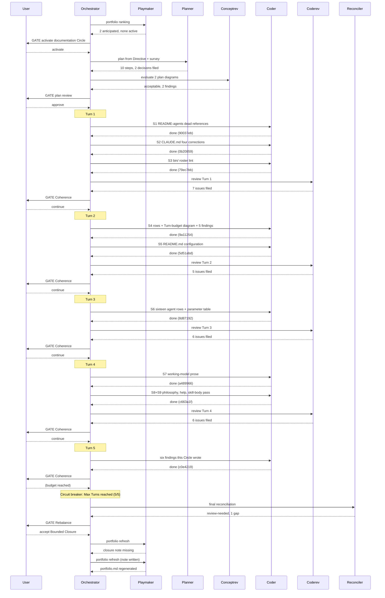

# Orchestrator Session — 260813-1815

**Directive:** fusion's user-facing documentation agrees with the plugin at v8.1.0 (Circle 260813-0910-documentation-matches-shipped-plugin)
**Mode:** plan
**Status:** Bounded Closure: Turn budget spent at 9 of 10 steps; step 10 filed as a record

## Setup snapshot

| Item | Value |
|---|---|
| Active Circle | 260813-0910-documentation-matches-shipped-plugin (activated this session via /fusion:next) |
| Git HEAD at start | 267a65c |
| Turn budget | 5 |
| Domain | code |
| Open defect records | Circle store 0, shared 90 |
| Open decision records | Circle store 0, shared 7 |
| Circles | 1 active, 1 anticipated, 11 closed, 1 superseded |
| Work queue | tasklist.md predates this activation — a shared backlog, not this Circle's work |
| Guard | OK |
| Plane mirror | config present but unfilled (template placeholders) — no push attempted |

## Session log

- 260813-1815 Circle activated from anticipated to active; .active-circle written; playmaker portfolio regenerated.

## Per-Turn Log

### Turn 1
- Tasks attempted: S1, S2, S3
- Tasks completed: S1, S2, S3
- Commits: 90037eb, 0b20859, 79ec7bb (plus 6590cd5 activation, 28f3029 review artifacts)
- Review findings: 7 issues filed by coderev (1 medium, 6 minor), none blocking
- Circuit breaker status: OK
- Coherence: ok

### Turn 2
- Tasks attempted: S4, S5
- Tasks completed: S4, S5
- Commits: 9a11254, 5d51abd, 22f892e
- Review findings: 5 new issues (all minor); the 5 closures from Turn 1 re-verified and holding
- Circuit breaker status: OK
- Coherence: ok

### Turn 3
- Tasks attempted: S6
- Tasks completed: S6
- Commits: 8d87192, 93388bc
- Review findings: 6 new issues (1 high, 3 medium, 2 low); 9 rows re-read independently, all holding
- Circuit breaker status: OK
- Coherence: ok

### Turn 4
- Tasks attempted: S7, S8, S9
- Tasks completed: S7, S8, S9
- Commits: a489966, 27af85a, c663a1f, 22f2353
- Review findings: 6 new issues, three of them in the prose this Turn wrote; 3 closures from Turn 3 re-verified
- Circuit breaker status: OK
- Coherence: ok
- Note: commit 27af85a's staging list reached only the renames; its content followed in c663a1f, whose message says so.

### Turn 5
- Tasks attempted: six review findings (chosen over step 10 by the user at the Turn 4 gate)
- Tasks completed: all six closed
- Commits: c0e4219
- Review findings: none — this Turn's own commit is unreviewed, stated rather than implied
- Circuit breaker status: Max Turns reached (5/5)
- Coherence: ok

## Coherence

<!-- RECONCILER-OWNED -->

**Verdict:** review-needed

**Edges:**

- **Artifact↔Grounding:** 9 of 10 plan steps verified landed against the artifact at HEAD `c0e4219` (per-step evidence in the plan's `## Reconciliation Log`); the suite is green, run rather than cited (`cd hooks && npx vitest run` — 49 files, 1022 tests). 25 defect records in the Circle store: 16 closed, each re-checked against its artifact and all 16 holding; 9 open, each re-verified as still present. **Four drift items**, none of them in shipped files: the residual issue the plan's risk table requires for a deferred step 10 does not exist in either issue store; step 6's completion note says "twelve corrected, four left standing" where the diff `22f892e..8d87192` shows fifteen rows changed and `bugfixer` alone unchanged (open issue `260813-2052_o_the-step-6-completion-note-…`); both conceptrev recommendations are unapplied, one of which is the risk row now justifying the deferral that happened; and three records still cite the plan under its pre-rename `_o_` filename, `_t_circle.md`'s `**Active spec/plan:**` among them. Reviewer coverage: `bin/fusion-review-coverage` reports 6 of 15 commits uncovered, of which only `c0e4219` (Turn 5) touches shipped files — stated in the Turn-5 log rather than hidden.
- **Artifact↔Directive:** the commits move **toward** the Directive, with one named promise unmet. All 15 commits land inside the surfaces the Directive names, and the shipped-file diffstat is exactly the union of steps 1 to 9's declared file lists — nothing orthogonal, nothing outside scope. `90037eb`, `0b20859`, `79ec7bb`, `9a11254`, `5d51abd`, `8d87192`, `a489966`, `27af85a`, `c663a1f`, `c0e4219` carry the content; the remaining five are the activation and the four review-artifact commits. The unmet clause is the Directive's own: *"`docs/plane-setup.md` has its command forms and configuration fields verified against `bin/fusion-plane`"*. `git log 267a65c..HEAD -- docs/plane-setup.md` returns nothing. Deferred by the user at the Turn 4 gate in favour of five open review findings, so this is a scope choice on the record, not drift — but it is unrecorded outside prose, which is what flags the edge.
- **Grounding↔Directive:** 21 active decision records read across both stores (2 open in this Circle, 7 open + 12 answered in `shared/`); **0 conflict with the Directive**, and 2 actively support it. `shared/decisions/260813-0826_a_should-fusion-help-become-a-self-knowledge-skill-…` answers that option 1's prose work happens "inside the documentation Circle", which is what step 9 did; `shared/decisions/260810-1635_a_where-does-the-obligation-sit-to-update-the-artefact-…` answers by re-cutting the question toward stating a claim once and citing it elsewhere, which is the form several closures took. The Circle's own two open records (the planner's domain parameter, the treatment of a decaying hand-measured number) are both consequences of the work rather than blocks on it, and both remain unanswered. One adjacent open record, `shared/decisions/260812-0254_o_should-a-cited-artifact-path-be-absolute-…`, was exercised heavily by this Circle without being answered — not a conflict, but the convention behind the three stale plan citations above.

**Rebalance recommendation:** revise Artifact

The Directive is right and reachable — one step, no dependency in either direction, and the plugin is
otherwise documented as it behaves at v8.1.0. The Grounding is consistent with it. What is missing is
one piece of work and its record: verify `docs/plane-setup.md`'s command forms and configuration
fields against `bin/fusion-plane`, or file the residual issue the plan's risk table requires so the
unmet promise stops living in prose. Bounded Closure is **not** proposed: nothing about the Directive
turned out to be unreachable.

## Budget

| Metric | Count |
|--------|-------|
| Turns | 5 |
| Tasks resolved | 9 of 10 plan steps |
| Tasks skipped/deferred | 1 (step 10, deferred by user at the Turn 4 gate) |
| Issues created | 26 |
| Issues resolved | 16 |
| Decisions answered (`_o_`→`_a_`) | 0 |
| Decisions implemented (`_a_`→`_i_`) | 0 |
| Commits | 17 |
| Agent errors | 0 |
| Human gates hit | 7 |

The four record counts are read off the Circle's own stores rather than tallied. They
are taken from `circles/260813-0910-documentation-matches-shipped-plugin/{issues,decisions}/`
directly, because the Circle closed before this read and the resolver therefore no longer
scans it: `bin/fusion-paths orchestrator` now returns the shared stores alone. A record was
filed this session when its filename stamp is at or after `260813-1815`, and reached its
marker this session when that name did not exist at `267a65c`. Two decision records were
filed and both remain open. Nothing was filed into the shared stores.

## Review coverage

**Range:** `267a65c..602fa1b` — 17 commits
**Covered by:** five review files under the Circle's `reviews/`, four coderev passes over Turns 1
to 4 plus one conceptrev pass on the plan. The conceptrev file records no `**Reviewed-range:**`
and contributes no coverage; the four coderev files tile `6590cd5..c663a1f`.
**Not covered:** 8 commits. Seven of them touch no shipped file — the activation commit, the four
review-artifact commits, the reconciliation commit and the closure commit — checked one by one
with `git show --name-only`. The eighth is `c0e4219`, Turn 5's correction pass, which changes two
shipped files and was never reviewed: the Turn budget ended with it.
**Carried out-of-scope files:** none. Every coderev pass declared `**Not-opened:** none`.

## Session Flow

