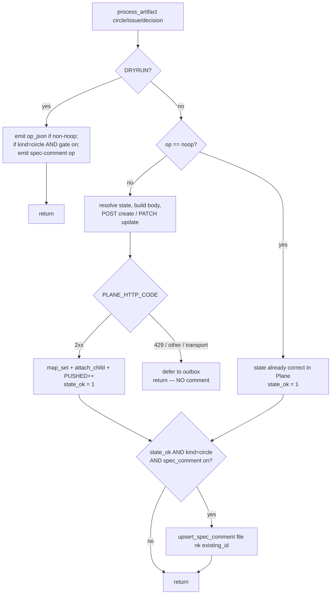
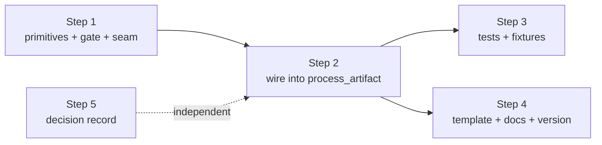

# Implementation Plan: Plane bridge — opt-in idempotent spec-comment

**Date:** 2026-07-22
**Status:** Complete — all 5 steps done; commits 4d95a91, bf5dc5e, d75afed, dd6b092; decision 260722-2230_*_thin-mirror-vs-comment-borne-full-spec.md; coderev verdict clean; 315 tests passing; v5.6.0
**Spec:** `260722-1943_*_spec-plane-spec-comment.md`

## Directive

Implement the approved spec: with a default-off `spec_comment` config flag, every
`bin/fusion-plane push` of a **Circle** attaches (or refreshes) the Circle record's full
body as one idempotent Plane comment, keyed on an HTML-comment marker. Non-blocking,
never changes exit codes, never touches the description, byte-for-byte unchanged when off.
The five design forks are decided in the spec; this plan is the HOW — exact edits, order,
dependencies, and C1–C5 acceptance mapping.

## Current State

Verified against `bin/fusion-plane` (read in full) and `hooks/lib/__tests__/fusion-plane.test.ts`:

- **`process_artifact`** (`:568-705`) is the per-artifact core, shared by dry-run and live.
  It computes `op` = create/update/noop (`:590-596`) and the seed-origin `write_scope`
  (`:605-606`). Dry-run emits an op only for non-noop (`:619`); live returns early on noop
  (`:626`), then resolves state, builds body, POST/PATCH, and on `2*)` (`:671-694`) does
  `map_set` + `attach_child` + `PUSHED++`. Defer paths (`:659-668`, `:695-703`) each
  `return`/fall out **before** the success branch.
- **`plane_curl METHOD URL [BODY]`** (`:223-244`) — every call runs through it; sets
  `PLANE_HTTP_CODE` / `PLANE_BODY` / `PLANE_CURL_RC`. All Plane paths build on
  `$BASE = <base_url>/api/v1/workspaces/<ws>/projects/<project_id>` (`:195-200`); existing
  endpoints: `$BASE/issues/`, `$BASE/issues/${id}/`, `$BASE/issues/${pid}/links/`,
  `$BASE/labels/`, `$BASE/states/` — all trailing-slash.
- **The label path is the exact precedent for a non-blocking auxiliary write**: globals
  `LABELS_SKIPPED` (`:298`), `label_skip()` (`:332-337`, info + increment, no defer, no
  exit change), folded into the STATUS line via `label_note` (`:948-956`).
- **`cfg_get <key>`** (`:184`) reads a top-level scalar via the awk config reader; the
  reader already handles a top-level boolean (`spec_comment: true` → `cfg_get spec_comment`
  = `true`). Confirmed by reading `AWK_CFG` (`:145-173`).
- **Fixture seam precedent**: `--fixture`/`FUSION_PLANE_ISSUES_FIXTURE` for rebuild-map
  (`:888-897`), `--fixture`/`FUSION_PLANE_SEED_FIXTURE` for seed (`:1237-1257`). Both read
  a captured `GET issues/` JSON instead of the wire. **`--fixture` is already taken on
  `push`** (rebuild-map), so the comments seam needs a distinct name.
- **Dry-run test harness** drives the real script via `execFileSync` against a throwaway
  copy of `hooks/lib/__tests__/fixtures/plane/workbench` (`FUSION_PLANE_WORKBENCH`), reading
  `{"ops":[...]}` off stdout. The fixture config **has no `spec_comment` field** → the gate
  is off there, so the existing `toHaveLength(8)` and empty-ops idempotency assertions are
  unaffected by this change.
- **jq `@html` verified** (ran it): `A --> B & <tag>` → `A --&gt; B &amp; &lt;tag&gt;`,
  single left-to-right pass, ampersand escaped first, no entity double-break — exactly C3.
  The marker sits literally outside the escaped `<pre>`.
- `--closure` is an accepted no-op (`:879-885`) whose block comment claims the Step-6
  comment hook is "intentionally NOT implemented (comments-endpoint body shape unverified)"
  — now false; reconcile the comment (Deliverable 1).

**Executor routing:** the whole change is code-led — a bash script, its vitest suite, one
prose doc, and two structured files (`templates/plane.config.yaml`, `.claude-plugin/plugin.json`)
whose edits are dictated by the code change and its lint tests. Per the task's guidance,
**a single `coder` owns every step.** No `ontocoder` split: the template/plugin.json edits
are trivial and coupled to code behavior + the vitest lint guards that live with the code.

## Approach

**One integral mechanism, one live call site.** The comment is an auxiliary write modelled
byte-for-byte on the existing **kind-label** path (fetch-or-skip, non-blocking, counted in
STATUS) — no new failure vocabulary is invented.

Two design resolutions the spec left to the planner, decided here:

1. **The comment fires on every non-deferred Circle push, including a state noop.** Fork 1
   is explicit: "Fire on every push, gated only by the opt-in… Martin's real use is
   attaching an anticipated-Circle brief at ordinary push time." An anticipated (`_a_`)
   Circle re-pushed after a brief edit is a **state noop** (Backlog→Backlog). If the comment
   only fired inside the create/update `2*)` branch, that edit would never reach Plane — the
   brief would go stale, defeating the stated use case. So the noop early-return (`:626`) is
   restructured into an `if [ "$op" != "noop" ]` wrapper around the state write, converging
   on a **single** comment tail gated by a `state_ok` flag (set on `2*)` success **or** on
   noop, never on a defer path). This yields the one-call-site shape the spec anticipated
   while honouring fork 1, and keeps the C4 invariant intact: every defer path `return`s
   before the tail, so a deferred state write never reaches the comment (C4-4).

2. **The dry-run represents the comment as a separate op entry**, not a field on `op_json`.
   Rationale: (a) a noop Circle emits **no** `op_json` (`:619`), so a field there could not
   represent the comment on the exact noop case resolution 1 requires — a separate entry can;
   (b) it leaves the `op_json` object shape untouched, so the ~20 existing op-shape
   assertions are not at risk. The entry is `{op:"spec-comment", …}`, emitted for `circle`
   whenever the gate is on, independent of create/update/noop, carrying `comment_html`, the
   `marker`, and the fixture-driven `method` (PATCH+`comment_id` on marker match, else POST).

Everything else follows the established patterns: `@html`-based escaping (reuse, no sed),
`plane_curl` for every call, `?per_page=100` on the comments GET (matches rebuild/seed),
a `COMMENTS_SKIPPED` counter folded into STATUS like `LABELS_SKIPPED`.

### Live control flow (restructured `process_artifact`, live mode)

## Implementation Steps

### Step 1 — [DONE] Comment primitives + config gate + fixture seam (no wiring)
<!-- DONE: commit 4d95a91; npm test 309 passed -->

- **Executor:** coder
- **Files:** `bin/fusion-plane`
- **Changes:**
  - Add `spec_comment_enabled()` → `[ "$(cfg_get spec_comment)" = "true" ]` (default-off:
    absent or `false` → disabled). **C1-1/C1-2/C1-4.**
  - Add `build_comment_body <file> <key>` — one jq call producing the exact Plane body:
    `jq -Rs --arg key "$key" '{comment_html: ("<!-- fusion-spec-comment:\($key) -->\n<pre>"
    + (.|@html) + "</pre>")}' "$file"`. `@html` escapes `& < >` in a single ampersand-first
    pass; the marker is literal, outside the escaped body. **C3.**
  - Add globals `COMMENTS_SKIPPED=0` and helper `comment_skip <reason>` mirroring
    `label_skip` (`info` note + increment; no defer, no outbox, no exit change). **C4-3.**
  - Add a `comment_id_for_marker <comments_json> <key>` jq matcher:
    `(.results // .) | map(select((.comment_html // "") | contains($marker))) | (.[0].id // empty)`
    — handles bare-array and `{results:[…]}` envelopes exactly like `state_uuid`/`label_uuid`.
    Marker string is `<!-- fusion-spec-comment:<key> -->` built from `$key`. **C2-3.**
  - Extend `cmd_push` flag parse: add `--comments-fixture <path>` / `--comments-fixture=…`
    (distinct from the rebuild `--fixture`) and env fallback `FUSION_PLANE_COMMENTS_FIXTURE`.
    Store in a global `COMMENTS_FIXTURE`. Mirrors the rebuild/seed fixture plumbing. **C5-2.**
  - Reconcile the stale `--closure` block comment (`:879-885`): the Step-6 comment hook is
    now implemented as the `spec_comment` opt-in (fired on every push, not closure-gated);
    `--closure` stays an accepted no-op, Done is still handled by the marker→state map. No
    semantic change to `--closure`.
- **Dependencies:** none.
- **Review:** coderev (bash correctness, jq escaping order, envelope handling, no UUID literal).

### Step 2 — [DONE] Wire the comment into `process_artifact` (dry-run + live)
<!-- DONE: bin/fusion-plane; npm test 309 passed; not yet committed (orchestrator commits) -->

- **Executor:** coder
- **Files:** `bin/fusion-plane`
- **Changes:**
  - Add `upsert_spec_comment <file> <nk> <issue_id>`: build body via `build_comment_body`;
    `plane_curl GET "$BASE/issues/${issue_id}/comments/?per_page=100"`; on transport fail or
    non-2xx → `comment_skip` and return 0 (never defer). Match the marker via
    `comment_id_for_marker` on `PLANE_BODY`; if found → `plane_curl PATCH
    "$BASE/issues/${issue_id}/comments/${cid}/" "$body"`, else `plane_curl POST
    "$BASE/issues/${issue_id}/comments/" "$body"`; non-2xx/transport on either → `comment_skip`,
    return 0. Endpoints confirmed against the `$BASE` builder. **C2-1/C2-2/C2-4, C4-1/C4-2.**
  - **Dry-run block** (`:616-623`): after the existing non-noop `op_json` emission, add — for
    `kind = circle` **and** `spec_comment_enabled` — a separate op:
    `{op:"spec-comment", natural_key, kind:"circle", marker, comment_html, method}` where
    `method`/`comment_id` come from `comment_id_for_marker` run against `COMMENTS_FIXTURE`
    when supplied (match→`"PATCH"`+id, else `"POST"`), defaulting to `"POST"` with no fixture.
    Emitted regardless of create/update/noop. **C5-1/C5-2/C5-4.**
  - **Live path**: replace the noop early-return (`:626`) with `if [ "$op" != "noop" ]; then …
    fi` wrapping the state-write section (`:628-704`); set `state_ok=1` in the `2*)` branch and
    `state_ok=1` in the noop `else`. After the wrapper, single tail: `if [ "$state_ok" -eq 1 ]
    && [ "$kind" = circle ] && spec_comment_enabled; then upsert_spec_comment "$file" "$nk"
    "$existing_id"; fi`. `existing_id` already holds the new id after a create (`:683`) and the
    mapped id on update/noop. The comment is gated only on kind+gate+state_ok — **not** on
    `write_scope`, so a seed-origin (state-only) Circle still gets it (C2-5) while its
    description stays untouched (respects decision 260719-2313_*_round-trip-write-overwrites-origin-story-description.md). **C2-1/C2-2/C2-5/C2-6.**
  - Extend the STATUS summary (`:948-956`): if `COMMENTS_SKIPPED > 0`, append a
    "N spec-comment(s) skipped" clause to the existing `label_note`, same shape. **C4-3.**
- **Dependencies:** Step 1.
- **Review:** coderev (the noop-restructure is the highest-risk edit — verify every defer path
  still returns before the tail; verify `existing_id` correctness across create/update/noop).

### Step 3 — [DONE] vitest coverage + fixtures
<!-- DONE: hooks/lib/__tests__/fusion-plane.test.ts + 2 fixtures; npm test 315 passed (309 + 6 new); plan-test-6 INCLUDED; fixtures use {results:[…]} envelope not bare array — see history 260722-2225_coder_plane-spec-comment-step3.md -->

- **Executor:** coder
- **Files:** `hooks/lib/__tests__/fusion-plane.test.ts`,
  `hooks/lib/__tests__/fixtures/plane/comments-with-marker.json`,
  `hooks/lib/__tests__/fixtures/plane/comments-other-key.json`
- **Changes:** new `describe("fusion-plane push --plan: spec-comment", …)`. Enable the gate by
  appending `spec_comment: true` to the copied workbench's `plane.config.yaml` (same pattern
  as the tests that `writeFileSync` `.plane-map.json`) — no new workbench fixture. Tests:
  1. Gate on, no comments fixture → a `spec-comment` op exists for `CIRCLE`; body shape is
     `{comment_html:<html>}`; `comment_html` = `<!-- fusion-spec-comment:260719-1536-demo-circle
     -->\n<pre>…</pre>`; exact marker string asserted. **C5-1, C5-3, C2 marker.**
  2. Escaping: overwrite the demo `_t_circle.md` in the fresh copy with a body containing
     `A --> B`, `<tag>`, `a && b`; assert `comment_html` contains `&amp; &lt; &gt;` and **no**
     raw `<tag>`; assert ampersand not double-broken. **C3, C5-3.**
  3. `--comments-fixture comments-with-marker.json` → op `method:"PATCH"` + the matched
     `comment_id`. **C5-2 (PATCH branch).**
  4. `--comments-fixture comments-other-key.json` (a different Circle's marker) → op
     `method:"POST"`, no match. **C2-3, C5-2 (POST branch).**
  5. Gate absent/false → no `spec-comment` op; `push --all --plan` still yields exactly 8 ops.
     **C1-1/C1-2, C5-4.**
  6. Gate on + unreachable fixture host, live `push --all` → exit still `10` (state deferred
     first, comment never attempted); no crash. **C4-1/C4-4.**
  - `comments-with-marker.json`: `[{"id":"comment-uuid-1","comment_html":"…<!-- fusion-spec-comment:260719-1536-demo-circle -->…"}]`
    (id deliberately **not** UUID-shaped, so the UUID lint guard stays green).
    `comments-other-key.json`: same shape, marker for `some-other-circle`.
- **Dependencies:** Step 2.
- **Review:** coderev optional (tests self-verify; a review confirms both fixture branches are
  actually exercised and the escaping assertion is strict).

### Step 4 — [DONE] Template, docs, version bump
<!-- DONE: commit dd6b092; templates/plane.config.yaml + docs/plane-setup.md + plugin.json 5.5.1→5.6.0 -->

- **Executor:** coder
- **Files:** `templates/plane.config.yaml`, `docs/plane-setup.md`, `.claude-plugin/plugin.json`
- **Changes:**
  - Template: add a commented/absent `spec_comment` block after `labels:` — a short doc block
    plus `# spec_comment: true` left **commented** so existing filled-in configs are byte-for-byte
    unchanged (default off). **C1 template invariant.** (No secret field introduced — the secret
    lint guard stays green.)
  - `docs/plane-setup.md`: a subsection documenting the `spec_comment` opt-in and the
    "thin mirror description vs. comment-borne full spec" model — description stays a thin stub
    by design; the full brief rides in an idempotent comment; seed-origin stories keep their
    description untouched. Deliverable 3.
  - `.claude-plugin/plugin.json`: bump `version` from `5.5.1` (release convention). Deliverable 4.
- **Dependencies:** Step 2 (documents shipped behavior).
- **Review:** none required.

### Step 5 — [DONE] Decision record
<!-- DONE: 260722-2230_*_thin-mirror-vs-comment-borne-full-spec.md; NOTE placement diverges from plan (shared/ not the Circle) — see Reconciliation Log -->

- **Executor:** coder
- **Files:** one decision record `…_i_thin-mirror-vs-comment-borne-full-spec.md`
- **Changes:** capture the architectural choice — the full brief lives in a comment (survives
  re-push via `build_write_body` never sending comments; no source-of-truth contention with the
  description; respects decision 260719-2313_*_round-trip-write-overwrites-origin-story-description.md so it applies to seed-origin and fusion-owned issues
  alike). Marker `_i_` (decided **and** realised by this change). **Placement per the Origin Rule:**
  this work is the explicit continuation of decision 260719-2313_*_round-trip-write-overwrites-origin-story-description.md, so file it into
  `circles/260719-1536-plane-mirror-integration/decisions/` (where the sibling `_i_` decisions
  live), **not** `shared/decisions/`. Deliverable 5.
- **Dependencies:** none (can land first or last; independent of the code).
- **Review:** none.

### Step dependency graph

## Data Structures

- **Config field** (top-level scalar, `plane.config.yaml`): `spec_comment: true|false` (absent
  ⇒ false). Read by `cfg_get spec_comment`.
- **Plane comment body** (sent): `{"comment_html": "<!-- fusion-spec-comment:<key> -->\n<pre><escaped record body></pre>"}`.
  `<key>` = Circle natural key = directory name = `$nk`.
- **Dry-run `spec-comment` op** (emitted): `{op:"spec-comment", kind:"circle", natural_key,
  marker, comment_html, method:"POST"|"PATCH", comment_id?}`.
- **Comments fixture** (`--comments-fixture` / `FUSION_PLANE_COMMENTS_FIXTURE`): a captured
  `GET issues/<id>/comments/` response — bare array or `{results:[…]}`, each element
  `{id, comment_html, …}`. Only `id` + `comment_html` are read.

## API Changes

New Plane REST calls, all via `plane_curl`, all built on `$BASE`:

| Purpose | Method | Path |
|---|---|---|
| List comments (marker search) | GET | `$BASE/issues/<id>/comments/?per_page=100` |
| Create comment | POST | `$BASE/issues/<id>/comments/` |
| Update comment in place | PATCH | `$BASE/issues/<id>/comments/<comment_id>/` |

New CLI/env surface: `push --comments-fixture <path>`, `FUSION_PLANE_COMMENTS_FIXTURE` (test
seam only). No change to any existing endpoint, exit code, or the description write body.

## Testing Strategy

All offline via the existing dry-run/mock seams (no live Plane), per Step 3. The PATCH-vs-POST
branch is driven by the two comments fixtures; escaping by an inline special-char record; the
no-regression case by the gate-off run (still 8 ops). C4's exit-code invariant is covered by the
gate-on-unreachable live test (still exit 10) and the pre-existing offline C4 suite. Lint guards
(no UUID literal in the helper; no secret field in the template) stay green — new ids in fixtures
are deliberately non-UUID-shaped and live outside the helper. Run: `npm test`.

## Risks & Mitigations

| Risk | Mitigation |
|------|------------|
| The noop-restructure of `process_artifact` (Step 2) breaks a defer path, letting a comment fire after a deferred state write | Every defer path already `return`s before the new tail; the `state_ok` flag is set only on `2*)` or noop. Step 2 coderev specifically verifies this; the gate-on-unreachable test asserts exit 10 with no comment. |
| A field on `op_json` would misrepresent the noop case | Chose a separate `spec-comment` op entry (Approach §2); noop still emits it, and `op_json`'s existing assertions are untouched. |
| Escaping ordering bug (`&` after `<`) | Use jq `@html` (single ampersand-first pass, verified) — no hand-rolled multi-substitution. |
| An issue with >100 comments could miss the marker → duplicate comment | `?per_page=100` matches every other list path in the bridge (rebuild, seed); accepted as the established bound. Noted, not fixed here. |
| `--fixture` name collision on `push` (already the rebuild seam) | New seam named `--comments-fixture` / `FUSION_PLANE_COMMENTS_FIXTURE`, distinct from the rebuild fixture. |
| Comment goes stale if the record body changes but the marker doesn't AND the push is skipped entirely | Fork-1 resolution: the comment fires on every non-deferred push including noop, so any push refreshes it. |

## Open Questions

- [ ] None blocking. The two planner-owned design forks (noop-refresh, dry-run representation)
  are resolved above under Approach, both grounded in the spec's decided fork 1 and the existing
  test/idempotency constraints. If the reviewer disputes the noop-refresh reading of fork 1,
  that is the single point to confirm before Step 2 — but the spec text ("fire on every push")
  is explicit.

## Reconciliation Log

**260723-0710 — reconciler (domain: code).** Verified all 5 steps against git ground truth.
Closure (`_c_`, Status Complete) confirmed correct; all claimed work landed.

- **S1** `4d95a91` — verified; touches `bin/fusion-plane` only (+67/-6). [DONE] marker present.
- **S2** `bf5dc5e` — verified; touches `bin/fusion-plane` only (+163/-71). [DONE] marker present.
- **S3** `d75afed` — verified; touches `hooks/lib/__tests__/fusion-plane.test.ts` +
  `fixtures/plane/comments-with-marker.json` + `comments-other-key.json`. [DONE] marker present.
- **S4** `dd6b092` — verified; touches `.claude-plugin/plugin.json` (5.5.1→5.6.0, confirmed on
  disk), `docs/plane-setup.md`, `templates/plane.config.yaml`. **Drift fixed:** inline header
  lacked `[DONE]` — added.
- **S5** — decision record `260722-2230_*_thin-mirror-vs-comment-borne-full-spec.md`
  exists, marker `_i_`, `Implemented:` line cites dd6b092/bf5dc5e/4d95a91/d75afed (all match).
  **Drift fixed:** inline header lacked `[DONE]` — added.
- **Tests:** `npm test` from `hooks/` → **315 passed (12 files)**, matching the plan's claim;
  the 5-test `spec-comment` describe block all green.
- **Session walk:** `git log 1525585..HEAD` = exactly the 4 feature commits, no orthogonal work.

**Divergence from plan (not an error, recorded):** Step 5 explicitly directed the decision into
`circles/260719-1536-plane-mirror-integration/decisions/` (Origin Rule — continuation of the
parent decision 260719-2313_*_round-trip-write-overwrites-origin-story-description.md). It actually landed in `shared/decisions/`. With no active Circle
this session (`.active-circle` absent) and the parent Circle already `_c_` closed, `bin/fusion-paths`
resolves new decisions to `shared/` — filing into a closed Circle would have been the questionable
move. The shared/ placement is the defensible live outcome; the plan text was written before that
constraint was live. No action taken; flagged for awareness.
