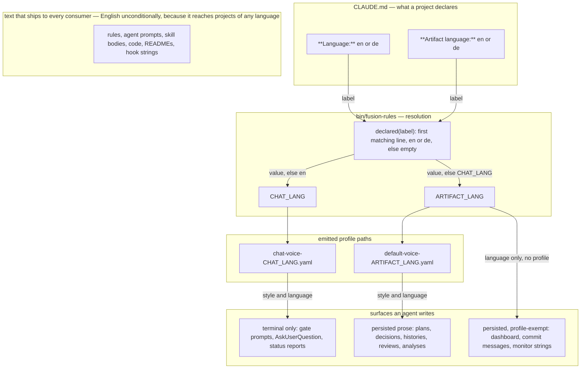
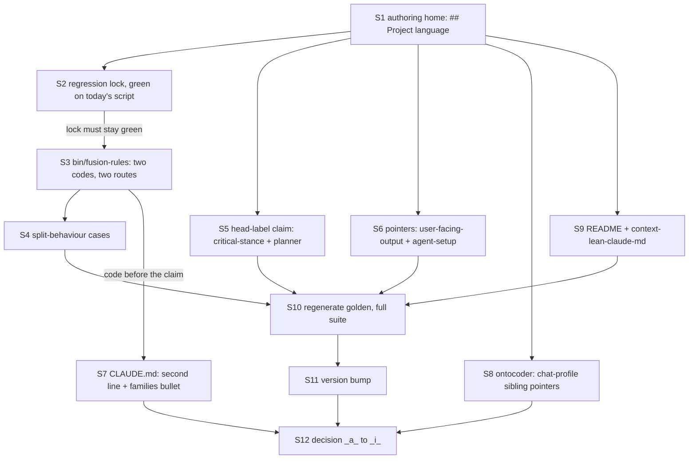

# Implementation Plan: split the language declaration into chat language and artifact language

**Date:** 2026-08-07
**Status:** Complete
**Spec:** none — planned from a raw Directive (user, 260807-2024)
**Decidability:** The load-bearing question is "which language does this piece of output belong to?" It is decidable from two inputs the mechanism has: the surface being written (a file that persists, or a string that only ever appears in the terminal), and the two declared lines in `CLAUDE.md`. No approximation is needed and no mechanism change follows. One honest residual, stated rather than hidden: `bin/fusion-rules` decides the question only for the two stylometric profile families, which are an exact proxy for their own surfaces but do not reach the profile-exempt persisted surfaces (dashboard lines, commit messages, monitor strings). For those the answer is carried by rule text an agent reads, not by code — the same enforcement `critical-stance.md` §4 already describes honestly for the plan-head line itself.

## Directive

`CLAUDE.md` carries one language declaration. Decision `260807-1515_*_wie-weit-reicht-die-projektsprache-in-den-regelkorpus.md`, answered by the user on 260807-1925, draws the boundary elsewhere than the declaration does: the declaration reaches direct user interaction only, and every artifact that persists as a file is English. One line cannot serve both halves. Split it in two, make `bin/fusion-rules` honour the split, and bring the rule text that describes the old single line up to the answer.

The mechanism is fixed by the user and is not re-opened: a second declaration line in `CLAUDE.md`, with the first line governing both when the second is absent.

## Current State

**The declaration has exactly one reader in code.** `bin/fusion-rules:227` `resolve_lang_code()` greps `^\*\*Language:\*\* *[a-z]{2}` out of `./CLAUDE.md`, accepts `en` or `de`, and falls through to `en` on anything else. `emit_voice_profile()` at line 248 calls it and emits one profile path per family:

- line 344, unconditional for all 16 agents: `chat-voice-<lang>.yaml` — short-form chat (gate prompts, `AskUserQuestion` text, status reports, chat replies).
- line 349, gated on `IS_PROSE_AGENT` (nine agents, set at line 167): `default-voice-<lang>.yaml` — long-form narrative (session summary bodies, consultant reports, analysis reports, investigator timelines, playmaker briefings, prose sections of specs and plans).

Verified by grep across `rules/`, `agents/`, `skills/`, `hooks/`, `bin/`, `docs/`, `templates/` and the READMEs: nothing else parses the line. `bin/fusion-paths` does not read it.

**The two profile families already partition the boundary the answer draws.** Every surface `default-voice` governs is a file that persists. Every surface the `chat` *profile* governs is terminal-only — `agents/consultant.md:166` states the discriminator explicitly ("The surface decides, never the length"), so a long chat answer is never promoted to the writing profile. That alignment is what makes the split cheap: the routing follows from the boundary rather than approximating it.

**Three surfaces persist but wear no profile.** `rules/user-facing-output.md:25` exempts dashboard lines (`orchestrator-live.md`), commit messages, monitor strings, event-log JSON and machine-read tables from both profiles. They are files, so the artifact language covers them, but no emitted path carries that fact — only rule text can.

**Four rule-text sites still describe the single line**, plus two the Directive's scope list does not name:

| Site | What it claims today |
|---|---|
| `rules/fusion-workbench-conventions.md:176-183` | the authoring home; "the language of their prose output", both families "resolved from the same `**Language:**` line" |
| `rules/critical-stance.md:65` | "Like every other head label it is written in the project's language — `**Entscheidbarkeit:**` where the project language is `de`" |
| `rules/user-facing-output.md:9` | both families "resolved per the `**Language:**` line" |
| `CLAUDE.md:3`, `CLAUDE.md:56` | the line itself; "both resolved from CLAUDE.md's `**Language:**` line" |
| **`agents/planner.md:146`** (not in the Directive's list) | "Head labels are written in the project's language, so in a `de` project the line reads `**Entscheidbarkeit:**`" — the same false claim as `critical-stance.md:65`, in the file that carries the template |
| **`rules/agent-setup.md:44-50`** (not in the Directive's list) | tells every agent to read both emitted profiles; says nothing about them resolving to different languages, so an agent that meets `chat-voice-de.yaml` beside `default-voice-en.yaml` has no rule saying that is intended |

**Structured data work exists after all**, contrary to the Directive's expectation. `stilwerk/chat-voice-de.yaml` lines 4, 7 and 12 name `default-voice-de.yaml` as their long-form sibling; `stilwerk/chat-voice-en.yaml` lines 4, 7 and 11 do the same for `default-voice-en.yaml`. Under the split those pointers are wrong whenever the two declarations differ — which is this repository's own configuration. The workbench copies at `fusion-workbench/stilwerk/` are byte-identical to the shipped ones (verified with `diff`) and carry the same six lines.

**Test coverage of the language resolution today: none.** `hooks/lib/__tests__/rules-emission-golden.test.ts` drives `bin/fusion-rules` for all 16 agents, but from an empty temp directory with no `CLAUDE.md` and no `fusion-workbench/`, so no profile path is ever emitted; its header calls the profiles "deliberately out of scope" (line 38) and `foreignLines()` asserts the exclusion held. No other suite touches the line. `hooks/lib/__tests__/derivable-enumerations-lint.test.ts` parses no language claim (verified by grep), so the `CLAUDE.md` bullet edit is free of it.

**Two lint gates constrain the rule-text edits.** `reference-resolution-lint.test.ts` resolves cited section headings by prefix against the cited file, so `## Project language` must keep its name or every one of the ten citations pointing at it has to move. The emission golden pins every rule file's byte size, so any rule-text edit fails it until the fixture is regenerated by the documented two-run procedure.

## Approach

**One boundary, two consequences.** The rule is stated once, by surface: output the user reads in the terminal is chat language; output that persists as a file is artifact language; text that ships to consuming projects is English regardless. The two declarations are how a project names those two languages, and the profile routing in `bin/fusion-rules` is a consequence of the boundary rather than a second definition of it. This avoids the failure the decision record complains about — a convention living in a subordinate clause of a rule about something else.

**The label: `**Artifact language:**`.** Alternatives considered:

- `**Language (artifacts):**` — the parenthetical breaks the symmetry of the grep idiom (parentheses would need escaping in the ERE), for no gain in clarity.
- `**File language:**` — plainer, but "file" invites exactly the wrong reading: source files are the surface that is *exempt*.
- `**Written language:**` — collides with "writing profile", which is the thing being routed.
- `**Persisted language:**` — accurate and unreadable.
- Renaming the first line to `**Chat language:**` and adding `**Artifact language:**` — the honest naming, and rejected: it breaks every consuming `CLAUDE.md`, or forces a deprecated alias and a three-way resolution. Backwards compatibility is binding.

`**Artifact language:**` wins because "artifact" is already this project's defined vocabulary — the conventions file's artifact-kind table and the Origin Rule both use it — so a human editing `CLAUDE.md` meets a term the same file defines. Verified greppable and non-colliding: `grep -E '^\*\*Language:\*\* *[a-z]{2}'` matches only the first line and `grep -E '^\*\*Artifact language:\*\* *[a-z]{2}'` only the second, against a two-line fixture.

**The resolution contract**, stated as one rule with no special cases:

```
CHAT_LANG     = declared("Language")          or "en"
ARTIFACT_LANG = declared("Artifact language") or CHAT_LANG
```

`declared(<label>)` is the two-letter code on the first line matching `^\*\*<label>:\*\* *[a-z]{2}` when that code is `en` or `de`, and empty otherwise. Absent, unparseable and unsupported-value collapse into one branch — "not declared" — so the case split is disjoint and complete and the second line needs no error path of its own.

**`resolve_lang_code()` is parameterised, not duplicated.** The two resolutions differ in the label and in the default; the extraction regex is the same, and two copies of it are two things that can drift (`HYG-SOT`). But the *default* stays out of the function: `declared_lang <label>` returns a code or nothing, and each call site applies its own default on the next line, where the two sit side by side and the difference between them is legible. Correspondingly `emit_voice_profile` takes the resolved code as a second argument instead of resolving one internally — one function, one job, no hidden read.

**Byte-identical output for a project that adds nothing is guaranteed, not hoped for.** When the second line is absent, `ARTIFACT_LANG == CHAT_LANG` and both `emit_voice_profile` calls receive exactly the code the old `resolve_lang_code()` would have produced; the per-family fallback chain (declared variant → `-en` variant → nothing) is untouched. The only new work is a second `grep` of `CLAUDE.md`, which writes nothing to stdout. Step S2 locks this as an executable claim before a line of S3 is written.

### Resolution and surfaces



The subgraph **text that ships to every consumer** carries a single node and no edges at all, and that is the design, not a drawing slip: no declaration edge reaches the shipped text, and that unreachability *is* the exempt-surface rule. It is named here by its title rather than by where it sits on the canvas, because Mermaid guarantees no placement for a component with no edge into the rest of the graph — the renderer may put it anywhere, and it does. Its reason ("reaches projects of any language") belongs in the title rather than in a node of its own: it is a justification, not a thing that flows, and every other arrow in the graph means "flows into" or "governs". Drawing the exempt surfaces as a fifth consumer of `DEC` would state the opposite of what the decision answered. The one edge that carries language without a profile (`ART → FPLAIN`) is the residual the Decidability line names — it is enforced by rule text an agent reads, not by an emitted path.

## Implementation Steps

1. [DONE] **S1 — Rewrite `## Project language` as the single authoring home for both declarations**
   - Executor: `coder`
   - Files: `rules/fusion-workbench-conventions.md` (lines 176-183)
   - Changes: replace the section body. It must state, in this order: (a) the boundary by surface — terminal output is chat language, output that persists as a file is artifact language; (b) the two declaration lines, `**Language:**` and `**Artifact language:**`, valid values `en` and `de`; (c) the fallback chain — second line absent or unparseable means the first governs both, first line absent means `en`, both silent; (d) the profile routing as a consequence, `chat-voice-<lang>.yaml` from the chat language for every agent and `default-voice-<lang>.yaml` from the artifact language for the nine long-form-prose agents, with the existing per-family missing-variant fallback carried over unchanged; (e) the exempt-surface list — rule files, agent prompts, skill bodies, code and code comments, READMEs and `docs/`, and hook and CLI operator strings are English whatever either line says, because they ship to consuming projects of every language, citing `hooks/session-start.ts` `## Why the message is English` as the worked case; (f) the persisted-but-profile-exempt surfaces — dashboard lines, commit messages, monitor strings — follow the artifact language even though no profile governs their style, cross-referencing `rules/user-facing-output.md` `## Style anti-patterns apply to everything`; (g) head labels: a label defined in a shipped template is English in every project (the template lives in an exempt file), while the artifact body follows the artifact language. Keep the heading text `## Project language` exactly — ten citations resolve against it and `reference-resolution-lint.test.ts` checks them.
   - Dependencies: none
   - **Human gate.** Point (f) is a consequence the answered decision implies but never spells out: it puts `orchestrator-live.md` and the monitor strings in English. The precedent is strong — the answer names commit messages, which are the same class of persisted-but-user-facing surface — but a dashboard the user watches live is the one place where "persists as a file" and "direct user interaction" genuinely overlap, and the user should confirm the reading before it is written into the authoring home. See Open Questions.

2. [DONE] **S2 — Lock today's emission before changing it**
   - Executor: `coder`
   - Files: `hooks/lib/__tests__/rules-voice-profile.test.ts` (new)
   - Changes: create the suite and write the backwards-compatibility case only: a temp project directory holding a `CLAUDE.md` with `**Language:** de` and nothing else, plus an empty `fusion-workbench/stilwerk/` containing all four profile files; assert `bin/fusion-rules planner` emits exactly `./fusion-workbench/stilwerk/chat-voice-de.yaml` and `./fusion-workbench/stilwerk/default-voice-de.yaml`, and that `bin/fusion-rules coder` emits the chat path only. Follow the golden suite's two environment disciplines and say so in the header: force `FUSION_PLUGIN_ROOT` to this repository (`rules-emission-golden.test.ts:52-56`), and assert the temp cwd carries no `.claude-plugin/plugin.json`, or the work-tree preference silently measures the wrong branch (`rules-emission-golden.test.ts:625-645`). Note in the header that these emitted paths are relative (`./fusion-workbench/...`), unlike the absolute rule paths, because `emit_voice_profile` builds them from a relative `stilwerk_dir`. **Run this test green against the unmodified `bin/fusion-rules`** — a regression lock written after the change is a description, not a lock.
   - Dependencies: S1 (the contract it asserts is defined there)

3. [DONE] **S3 — Resolve two language codes in `bin/fusion-rules` and route each family to its own**
   - Executor: `coder`
   - Files: `bin/fusion-rules` (header comment lines 105-125; `resolve_lang_code` line 227; `emit_voice_profile` line 248; the call sites at lines 338-350)
   - Changes: replace `resolve_lang_code()` with `declared_lang <label>`, which prints the code or nothing, built from the same case-sensitive `^\*\*<label>:\*\* *[a-z]{2}` extraction with the label interpolated and quoted. Resolve both codes once, before the emission block, with the defaults visible at the call sites: `CHAT_LANG` defaulting to `en`, `ARTIFACT_LANG` defaulting to `$CHAT_LANG`. Give `emit_voice_profile` a second parameter for the language code and drop its internal resolution; leave its fallback chain (declared variant → `-en` → nothing) untouched. Call it as `emit_voice_profile "chat-voice" "$CHAT_LANG"` at the unconditional site and `emit_voice_profile "default-voice" "$ARTIFACT_LANG"` inside the `IS_PROSE_AGENT` branch. Update the header block: the paragraph at lines 115-120 describes one line resolving both families and must describe two, name the absent-second-line fallback, and state the byte-identical guarantee for a project that declares only the first line — the same `HYG-NO-REGRESS` promise the manifest block at lines 86-93 already makes for its own addition. Keep `set -eu` safety: the extraction stays inside a pipeline whose exit status is `sed`'s.
   - Dependencies: S2. Re-run S2's test after the change — it must still be green, unmodified. That is the byte-identical guarantee discharged rather than asserted in prose.

4. [DONE] **S4 — Extend the suite with the split behaviour**
   - Executor: `coder`
   - Files: `hooks/lib/__tests__/rules-voice-profile.test.ts`
   - Changes: add the cases that make a collapse back into one declaration impossible without a red test. (a) `**Language:** de` + `**Artifact language:** en` → `chat-voice-de.yaml` and `default-voice-en.yaml`. (b) the reverse, `**Language:** en` + `**Artifact language:** de` → `chat-voice-en.yaml` and `default-voice-de.yaml`, which is what rules out a hard-coded "artifacts are always English". (c) `bin/fusion-rules coder` with both lines declared emits the chat path only and the chat path is in the *chat* language — the artifact declaration must not leak into the chat family. (d) no `CLAUDE.md` at all → both families resolve `en`. (e) per-family missing-variant fallback, independently: artifact `de` declared with `default-voice-de.yaml` deleted falls back to `default-voice-en.yaml` while the chat family keeps its own `-de` variant, and the mirror case. (f) `**Artifact language:** xx` and `**Artifact language:** English` → treated as not declared, so the chat language governs, not `en`. (g) a `CLAUDE.md` carrying only `**Artifact language:** en` → the chat family falls back to its own `en` default and the second line never satisfies the first line's pattern. Do **not** add a source-shape assertion (grepping `bin/fusion-rules` for two labels): it would pin an implementation where cases (a) and (b) already pin the contract, and a test that reads the source fails for edits that break nothing.
   - Dependencies: S3

5. [DONE] **S5 — Resolve the head-label claim in both places that make it**
   - Executor: `coder`
   - Files: `rules/critical-stance.md` (line 65), `agents/planner.md` (line 146)
   - Changes: in `critical-stance.md`, delete the sentence "Like every other head label it is written in the project's language — `**Entscheidbarkeit:**` where the project language is `de`" and replace it with the settled rule: the label is `**Decidability:**` in every project, because a label defined in a shipped template lives in an exempt surface, while the plan body follows the artifact language; point at `rules/fusion-workbench-conventions.md` `## Project language` rather than restating the rule. In `agents/planner.md`, make the parenthetical after the plan output format say the same thing, so the file that carries the template and the file that defines the norm no longer disagree. Note explicitly in the `critical-stance.md` sentence that this also settles point 3 of decision `260807-1515_*_wie-weit-reicht-die-projektsprache-in-den-regelkorpus.md`, which is where the claim came from.
   - Dependencies: S1

6. [DONE] **S6 — Repoint the two rules that describe the resolution without owning it**
   - Executor: `coder`
   - Files: `rules/user-facing-output.md` (line 9), `rules/agent-setup.md` (lines 44-50)
   - Changes: in `user-facing-output.md`, change "both resolved per the `**Language:**` line" to name the two lines and which family takes which, in one clause, with the existing pointer at `## Project language` carrying the definition — do not restate the fallback chain or the exempt list here. In `agent-setup.md` `## Voice profiles`, add one sentence: the two emitted profile paths may resolve to different languages, and that is the intended configuration for a project whose chat and artifacts differ — an agent must not read the mismatch as a fault to be reported or worked around. Without it, the first agent to meet `chat-voice-de.yaml` beside `default-voice-en.yaml` has a rule telling it to read both and none telling it they may disagree.
   - Dependencies: S1

7. [DONE] **S7 — Add the declaration to this repository and correct the bullet that describes it**
   - Executor: `coder`
   - Files: `CLAUDE.md` (line 3, line 56)
   - Changes: add `**Artifact language:** en` directly under `**Language:** de`, which is this repository's configuration per the answered decision. Rewrite the "Two stylometric profile families" bullet at line 56: the two families no longer resolve from one line — the chat profile from `**Language:**`, the writing profile from `**Artifact language:**` with the chat line as its fallback. Keep the bullet's existing claims about what each family is for and about the shared `en` fallback, which stay true.
   - Dependencies: S3. Ordered after the implementation on purpose: adding the line first would leave a window in which `CLAUDE.md` declares a behaviour the code does not have.

8. [DONE] **S8 — Correct the same-language sibling pointers in the chat profiles**
   - Executor: `ontocoder`
   - Files: `stilwerk/chat-voice-de.yaml` (lines 4, 7, 12), `stilwerk/chat-voice-en.yaml` (lines 4, 7, 11), `fusion-workbench/stilwerk/chat-voice-de.yaml` (same three lines), `fusion-workbench/stilwerk/chat-voice-en.yaml` (same three lines)
   - Changes: each chat profile names its long-form sibling by filename (`default-voice-de.yaml` / `default-voice-en.yaml`), which is wrong for any project whose two declarations differ. Replace the filename with a language-neutral reference to "the long-form writing profile", so the sentence is correct in both configurations; keep each file's own language and register. Edit the shipped copies under `stilwerk/` and this repository's workbench copies under `fusion-workbench/stilwerk/` — they are byte-identical today (verified with `diff`) and both are read: `/fusion:setup` copies the shipped ones into a new consumer, while fusion's own agents read the workbench ones. `default-voice-*.yaml` carries no such pointer and is not touched. Note in the step's commit that `/fusion:setup` copies a profile only when it is absent, so an existing consumer keeps its stale copy until it removes the file — which is why the fix must be a wording change that is *correct in both configurations* rather than a second filename.
   - Dependencies: S1

9. [DONE] **S9 — Bring the two remaining prose descriptions of the line up to the split**
   - Executor: `coder`
   - Files: `README.md` (line 117), `rules/context-lean-claude-md.md` (lines 39-40)
   - Changes: `README.md` tells a user setting up a project to set `**Language:**` and says that line selects which profile pair applies; extend it to both lines, one sentence, with the second described as optional and defaulting to the first. `context-lean-claude-md.md` lists the declaration among what must stay in a lean `CLAUDE.md`; it now has to name both lines and say the second is optional. Leave the example block at line 99 as it stands — a single-language project declaring one line is a legitimate and now explicitly supported configuration, and the example is about leanness, not about language.
   - Dependencies: S1

10. [DONE] **S10 — Regenerate the emission golden and run the full suite**
    - Executor: `coder`
    - Files: `hooks/lib/__tests__/fixtures/rules-emission.golden`
    - Changes: S1, S5 and S6 change the byte size of four always-on rule files, so every agent's total moves and the golden fails until it is regenerated. Follow the documented two-run procedure exactly (`rules-emission-golden.test.ts` `## Updating the golden`): `cd hooks && UPDATE_RULES_GOLDEN=1 npx vitest run lib/__tests__/rules-emission-golden.test.ts`, which rewrites the fixture and then fails on purpose, then a second run without the flag. Review the fixture diff — that is the whole obligation. Do **not** touch `RULE_BASELINE`: it moves only after a cleanup, and this is growth. The growth is a few hundred bytes against a 12 000-byte budget and a distant drift ceiling, so no report and no gate should trip; if either does, that is a finding to report rather than a number to adjust. Then run the whole suite once (`cd hooks && npm test`) and confirm `reference-resolution-lint`, `derivable-enumerations-lint` and `path-literal-lint` are green.
    - Dependencies: S1, S5, S6, S9 (every step that changes rule-file bytes), and S4 (so the new suite runs in the same green pass)

11. [DONE] **S11 — Bump the plugin version**
    - Executor: `coder`
    - Files: `.claude-plugin/plugin.json`
    - Changes: bump `version`. This repository's convention is a bump on every change (`CLAUDE.md`, Layout table). The rest of the release — the marketplace `version`, the git tag, the `FUSION_REF` example in `install.sh` and `README.md` — is the user's call at a release gate and is deliberately not planned here.
    - Dependencies: S10

12. [DONE] **S12 — Move the answered decision to implemented**
    - Executor: `coder`
    - Files: `260807-1515_*_wie-weit-reicht-die-projektsprache-in-den-regelkorpus.md`
    - Changes: the record's own reconciliation note (lines 160-164) states the condition for the transition — the rule text carries the exempt-surface list, the `**Decidability:**` resolution, and the "direct user interaction" wording. All three land in S1 and S5. Append an `Implemented:` line citing the commit hash and summarising the change in one sentence (the declaration is split in two; the exempt-surface list, the head-label resolution and the direct-user-interaction wording now sit in `rules/fusion-workbench-conventions.md` `## Project language`), then rename `_a_` → `_i_`. The commit hash exists only after the work is committed, so this step runs last and cites the real hash, never a placeholder.
    - Dependencies: S11, and the commit that lands S1-S11

### Step dependencies



Acyclic, seven levels deep on the longest path (`S1 → S2 → S3 → S4 → S10 → S11 → S12`), one source (`S1`, the only step nothing precedes) and one sink (`S12`, the only step nothing follows). S7 and S8 stay outside the S10 test gate — S7 because this repository's own declaration changes nothing for a consumer, S8 because the profile wording is read by agents rather than by the suite — but both still run before S12, because S12's `Implemented:` line cites the commit that lands S1 through S11 and that commit has to contain them.

## Data Structures

No new types. Two shell variables replace one, and one function gains a parameter:

| Name | Was | Becomes |
|---|---|---|
| `resolve_lang_code()` | no argument, returns a code, defaults to `en` internally | `declared_lang <label>` — returns a code or empty; the default moves to the call site |
| `emit_voice_profile()` | `<stem>`, resolves the language itself | `<stem> <lang-code>` — emits only, resolves nothing |
| — | — | `CHAT_LANG`, `ARTIFACT_LANG` — resolved once, before the emission block |

## API Changes

`bin/fusion-rules` has one public interface, its stdout, and it is unchanged in shape: one path per line, same order, same set. The only observable difference is which language variant of `default-voice-*.yaml` appears, and only for a project that adds the second declaration line.

## Testing Strategy

The new suite is `hooks/lib/__tests__/rules-voice-profile.test.ts`, driving the real `bin/fusion-rules` through `child_process` in a temp project directory — the seam `fusion-paths.test.ts` and `rules-emission-golden.test.ts` already established for bash helpers, and the same seam an agent's Setup reads.

- **The regression lock (S2) is written and run before the implementation.** It states the backwards-compatibility promise as an executable claim against the unchanged script, so that after S3 it is a lock and not a description.
- **Collapse is made loud rather than forbidden.** Cases (a) and (b) of S4 route the two families in opposite directions; any edit that merges the two codes back into one turns both red. No source-shape assertion is added — it would pin an implementation the contract does not care about.
- **The two failure modes the golden suite documents are carried into the new one:** an inherited `FUSION_PLUGIN_ROOT` measures the developer's installed copy, and a temp cwd carrying a plugin manifest measures the work-tree branch. Both are asserted, not assumed.
- **Untestable by construction, and stated so in the suite header:** the language of prose an agent actually writes. The tests can prove which profile path is emitted; they cannot prove an agent obeyed it. That is the same honest limit `critical-stance.md` §4 records for the plan-head line, and the enforcement is the same — a human reading the artifact.
- **Regression surface:** `npm test` in `hooks/` after S10, with `reference-resolution-lint`, `derivable-enumerations-lint`, `path-literal-lint` and the regenerated golden all green.

## Risks & Mitigations

| Risk | Mitigation |
|---|---|
| A consuming project's emission changes although it declared nothing new. | S2 locks the single-line emission green against the unchanged script, and S3 must leave it green. The absent second line resolves to the chat code, so both `emit_voice_profile` calls receive the code the old function returned. |
| The second label accidentally satisfies the first label's pattern, or the reverse. | Verified against a two-line fixture before planning: each ERE matches exactly its own line. S4 case (g) keeps it verified. |
| The extraction regex is duplicated and the two copies drift. | `declared_lang <label>` is one function with the label interpolated; only the defaults live at the call sites, where the difference between them is the thing a reader needs to see. |
| An agent meets two profile paths in different languages and treats it as a bug — reports it, or picks one. | S6 adds the sentence to `rules/agent-setup.md` `## Voice profiles`, which every agent reads at Setup before it reads either profile. |
| A chat profile keeps telling the agent that its long-form sibling is the same-language file. | S8 replaces the filename with a language-neutral reference, correct in both configurations. Note the reach limit: `/fusion:setup` copies a profile only when absent, so an existing consumer keeps its stale copy until it deletes the file. |
| The rule text says "artifacts are English" and this repository's own German histories look like violations. | Consequence 2 of the answered decision governs: existing German artifacts are not translated, the boundary applies going forward. S1 carries that sentence into the authoring home so a later reader does not read the workbench as evidence against the rule. |
| The golden fails and someone raises `RULE_BASELINE` or a cap to make it pass. | S10 names the two-run regeneration as the only correct response and says explicitly that `RULE_BASELINE` moves only after a cleanup. |
| The definition drifts into a second home as the other five files are edited. | S6 and S9 are pointer-only edits by construction: neither may restate the fallback chain or the exempt list. `## Project language` keeps its heading so the ten existing citations, and `reference-resolution-lint`, keep resolving. |

## Open Questions

- [ ] **Does the artifact language cover the dashboard and the monitor strings?** They persist as files, which the answer's general clause ("everything that persists as a file is English") covers, and commit messages — the same class of persisted-but-user-facing surface — are named English explicitly. But `orchestrator-live.md` is a live display the user watches, which is the one place the two halves of the boundary genuinely overlap. S1 is written to the "persisted, therefore artifact language" reading and is marked as a human gate for exactly this. If the user reads it the other way, S1's point (f) inverts and nothing else in the plan moves.
- [ ] **Should `**Artifact language:**` accept a value the chat line does not, or vice versa?** The plan keeps one shared value set (`en`, `de`) because the profiles exist in exactly those two variants. If a project ever declares an artifact language with no profile pair, the existing per-family fallback already handles it silently — worth knowing, not worth a mechanism.

## Out of Scope

Named here so nobody re-checks:

- **`/fusion:setup` needs no change.** Verified: it copies all four profile files unconditionally when each is absent (`skills/setup/SKILL.md:134-138`) and never reads the language line to decide what to copy. It also never writes `CLAUDE.md`, so it has no declaration to seed. The split changes routing, not which files a workbench holds.
- **The nine skill bodies that cite `**Language:**` need no change.** Verified by grep across `skills/*/SKILL.md`: every one of them cites it for an `AskUserQuestion` prompt or a chat confirmation, which is chat surface, which is still the first line.
- **`README-agents.md:156` needs no change.** It names `default-voice-<lang>.yaml` as a conditional emission for the prose agents and makes no claim about where the language comes from.
- **`hooks/session-start.ts` needs no change.** Its `## Why the message is English` block already gives the right reason for the right surface, and S1 cites it as the worked case rather than rewriting it.
- **Existing German artifacts are not translated** (Directive, and consequence 2 of the answered decision).
- **The citation rule for `## Filename Patterns`** (cite a record by full filename, never by bare timestamp) and **any tidying pass over bilingual fragments in rule files** are recorded as remaining work elsewhere and are explicitly not part of this Directive.
- **The release itself** — marketplace `version`, git tag, `FUSION_REF` examples — is the user's call at a release gate. S11 bumps only `plugin.json`, which this repository's convention requires on any change.

## Reconciliation Log

**260808-0030 (reconciler, domain `code`) — all twelve steps verified on disk. Status `Complete` and marker `_c_` both stand.**

Verified against the tree at `c54ead9`, not against the step markers. Every `[DONE]` was
re-derived from the file it claims to have changed; two steps were additionally re-executed
rather than read.

| Step | Evidence at `c54ead9` |
|---|---|
| S1 | `rules/fusion-workbench-conventions.md:176-219`. All seven required points present in the required order: surface boundary (`:178-182`), the two declaration lines (`:184-191`), the fallback chain (`:193`), the profile routing (`:195-202`), the exempt-surface list with the `hooks/session-start.ts` worked case (`:204-213`), the persisted-but-profile-exempt paragraph (`:215`), head labels (`:217`). Heading text `## Project language` unchanged, so the ten citations and `reference-resolution-lint` still resolve. |
| S2 | `hooks/lib/__tests__/rules-voice-profile.test.ts` exists, 16 `it()` cases. **Re-executed independently:** `git show 73c52b4~1:bin/fusion-rules` run against a temp project holding only `**Language:** de` emits `chat-voice-de.yaml` + `default-voice-de.yaml` for `planner` and `chat-voice-de.yaml` alone for `coder` — byte-identical to what today's script emits for the same project. The backwards-compatibility promise is discharged by measurement, not by the step's own claim. |
| S3 | `bin/fusion-rules:255` `declared_lang()`, `:305` `emit_voice_profile()` with the language as `$2` and no internal resolution, `:396-399` both codes resolved with the defaults visible at the call site, `:418` / `:427` the two routed calls. |
| S4 | 16 cases, up from the planned 12; the four added in Turn 2 cover the prefix-match class. |
| S5 | `rules/critical-stance.md:65` and `agents/planner.md:146` now carry the same rule and both cite `## Project language`. `**Entscheidbarkeit:**` appears nowhere in `rules/` or `agents/`. |
| S6 | `rules/user-facing-output.md:9` names both lines and which family takes which; `rules/agent-setup.md:52-56` carries the differing-languages sentence. Neither restates the fallback chain or the exempt list. |
| S7 | `CLAUDE.md:3-4` carries both declarations; `CLAUDE.md:57` routes each family to its own line. |
| S8 | Both shipped chat profiles name the sibling by role (`chat-voice-en.yaml:4-5,8,12-13`; `chat-voice-de.yaml:4,7,12`). `diff` confirms the two workbench copies are byte-identical to the shipped ones. No `default-voice-*.yaml` filename remains in either. |
| S9 | `README.md:117` describes the optional second line; `rules/context-lean-claude-md.md:39` names both. The lean example at `:103` is untouched, as planned. |
| S10 | `cd hooks && npm test` — **33 files, 1030 tests, all green**, including the regenerated golden, `reference-resolution-lint`, `derivable-enumerations-lint` and `path-literal-lint`. |
| S11 | `.claude-plugin/plugin.json:3` = `6.1.0`. |
| S12 | The record is `260807-1515_*_…` and carries an `Implemented:` line. See the decision's own reconciliation note for the one citation defect found. |

**The split itself re-executed, end to end.** Against today's script in a temp project: `de`/`en`
→ `chat-voice-de` + `default-voice-en`; `en`/`de` → the mirror, so a hard-coded "artifacts are
English" is ruled out; `en`/`de-DE` → `default-voice-en`, where `git show 4992ffb~1:bin/fusion-rules`
emits `default-voice-de` for the same input. Turn 2's `declared_lang` fix is real and
`260807-2152_*_…` is correctly closed.

**Two Open Questions carry unticked boxes in a plan marked Complete.** Both are resolved, and
neither is a gap: OQ1 (does the artifact language cover the dashboard and monitor strings?) was
put to the user at S1's human gate and answered "persisted reading" — the answer is recorded in
`rules/fusion-workbench-conventions.md:215` as settled by user decision. OQ2 was closed in the
plan's own text as "worth knowing, not worth a mechanism". Left unticked rather than edited,
because the convention marks steps and not questions.

**Drift found: one, and it points outward rather than at the plan.** S1 grew
`rules/fusion-workbench-conventions.md` by roughly 36 lines, which moved every section below
`## Project language` and staled the line-range citations that other records hold into it —
`260807-0158_*_…:7` cites `## Filename Patterns` at lines 185-208, now 221-245.
Nothing in the suite catches this: `reference-resolution-lint` resolves paths, heading anchors and
record citations, and reads no line number. Filed as
`260808-0030_*_line-number-citations-into-rule-files-go-stale-and-no-gate-reads-them.md`.
