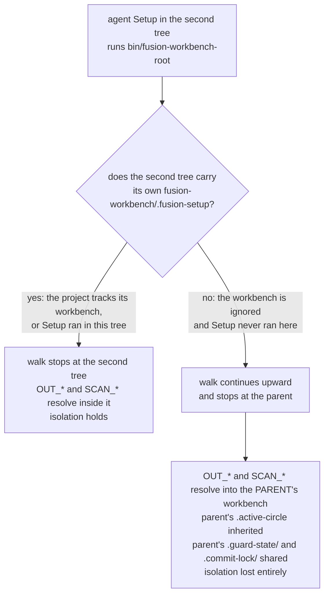

# Analysis: What two checkouts of one project actually share

**Date:** 2026-08-22 22:19
**Type:** Feasibility
**Status:** Complete
**Requested by:** orchestrator, as the single measuring task of Circle `260822-1921-measure-what-two-checkouts-share`

## Verdict

**The premise holds. Two checkouts of one project get two isolated workbench states, in both arrangements the user intends to use, with one exception that only occurs in an arrangement the user does not intend to use.**

| Arrangement | Isolation of workbench state | Exception |
|---|---|---|
| Second full clone, placed beside the first | Holds | none measured |
| `git worktree` of the same repository, placed beside the first | Holds | two worktrees cannot check out the same branch |
| Either of the two, placed **inside** a directory that already holds a workbench | Holds **only** when the second tree carries its own `.fusion-setup` | where it does not, the second tree resolves to the parent's workbench in full |

The three-way question the Directive asks (own copy, first tree's copy, or nothing at all) resolved into **two** answers over every entry measured. No second tree ever received the first tree's copy of a workbench file. A tracked entry arrived as an independent file with its own inode; an ignored entry did not arrive at all. Sharing appeared exactly once, and not as a shared file: it appeared where the second tree had no workbench of its own, and the upward walk in `bin/fusion-workbench-root` therefore handed it the parent's workbench entire.

Two normative statements were measured false along the way. They are stated in `## Findings` section 8 and one of them is filed as a defect.

## Question

Does N checkouts of one project produce N isolated workbench states, or do they share one? The whole multi-user arrangement rests on that fact and nobody had ever measured it. `260719-2141_*_concurrency-worktree-slots-vs-single-active-circle.md` rested its option 1 on the assumption and said it "must be verified before relying on it". `260822-1610_*_how-does-fusion-support-several-people-working-one-project-at-once.md` closes by calling the arrangement chosen but not proven. This report is what resolves that sentence.

## Scope

Measured on macOS 15 (Darwin 24.6.0), git 2.49.0, fusion plugin v10.5.0 at HEAD `f90de0c`. The helpers under test were run from `$FUSION_PLUGIN_ROOT` (`/Users/k1/.fusion`); `diff -q` confirmed `bin/fusion-workbench-root` is byte-identical between that installed copy and this repository's work tree, so the measurement is not sensitive to which copy ran.

**Everything was built and destroyed under `/tmp/fusion-c1-measure/`.** Nothing was created inside `/Users/k1/Projects/productive/fusion`, and the scratch tree was deleted at the end. Per the Circle's Grounding this is a purpose-built throwaway project rather than a clone of a real one, and the accepted cost is that behaviour appearing only at realistic size can be missed.

Two scratch projects were built, each with a git repository and a full fusion workbench populated with at least one file in every entry of the spec's state partition:

- `P-tracked`, whose workbench is tracked under exactly this repository's split (the `fusion-workbench/` block of its `.gitignore`, copied verbatim in effect: `agentstate.yaml`, `orchestrator-live.md`, `.session-marker`, `.active-circle`, `.guard-state/*`, `.commit-lock/*` and `monitor` ignored, everything else tracked).
- `P-untracked`, whose whole workbench is ignored (`fusion-workbench/`).

Each got a bare remote, and from those: a sibling clone, a sibling worktree, two further clones for the push measurements, and four nested placements.

**Not covered, and named rather than inferred.** No fusion agent and no Claude Code session was run in a second tree. What an agent *does* there was measured through the two mechanisms an agent's Setup actually runs, `bin/fusion-workbench-root` and `bin/fusion-paths`, and through reading `hooks/lib/workbench-root.ts` to confirm the hooks resolve identically. Behaviour that would need a live session (a second orchestrator's dashboard, a real Turn loop) is outside this report. Nothing here was measured on a network remote; both remotes were local bare repositories, so push and fetch semantics were exercised but not transport failure.

## Findings

### 1. The two-arrangement table

One row per workbench entry, one column per arrangement. `A` is the origin tree `P-tracked`, which holds every entry. Identity was tested by device and inode (`stat -f '%d:%i'`), so "own copy" means a distinct file, not merely a file with the same content.

| Entry | Partition class | Tracked here | Second full clone | `git worktree` |
|---|---|---|---|---|
| `circles/<c>/_t_circle.md` | R1 | yes | own copy | own copy |
| `circles/<c>/planning/<file>` | R1 | yes | own copy | own copy |
| `circles/<c>/issues/<file>` | R1 | yes | own copy | own copy |
| `circles/<c>/decisions/` (empty) | R1 | no content to track | nothing at all | nothing at all |
| `circles/<c>/history/` (empty) | R1 | no content to track | nothing at all | nothing at all |
| `circles/<c>/reviews/` (empty) | R1 | no content to track | nothing at all | nothing at all |
| `circles/<c>/analyses/` (empty) | R1 | no content to track | nothing at all | nothing at all |
| `shared/decisions/<file>` | R1 | yes | own copy | own copy |
| `shared/memos/<file>` | R1 | yes | own copy | own copy |
| `shared/planning/`, `shared/issues/`, `shared/analyses/`, `shared/reviews/`, `shared/investigations/`, `shared/consult/`, `shared/history/`, `shared/backlog/` (all empty) | R1 | no content to track | nothing at all | nothing at all |
| `archive/<batch>/<file>` | R1 | yes | own copy | own copy |
| `stilwerk/<profile>.yaml` | R1 | yes | own copy | own copy |
| `stashes/<file>` (legacy, frozen) | R1 | yes | own copy | own copy |
| `.migration-v2-backup/<file>` (legacy, frozen) | R1 | yes | own copy | own copy |
| `orchestrator-events.jsonl` | R2 | yes | own copy | own copy |
| `.fusion-setup` | R3 | yes | own copy | own copy |
| `.asset-provenance` | R3 | yes | own copy | own copy |
| `portfolio.md` | R1 today, L after C2 | yes | own copy | own copy |
| `agentstate.yaml` | L | no | nothing at all | nothing at all |
| `orchestrator-live.md` | L | no | nothing at all | nothing at all |
| `.session-marker` | L | no | nothing at all | nothing at all |
| `.active-circle` | L | no | nothing at all | nothing at all |
| `.guard-state/events.jsonl` | L in this project's config, record by classification | no | nothing at all | nothing at all |
| `.guard-state/throttle-*.json` | L | no | nothing at all | nothing at all |
| `.commit-lock/holder` | L | no | nothing at all | nothing at all |
| `monitor` | L | no | nothing at all | nothing at all |

**`.guard-state/` is split per file in the spec, and the split is real but invisible in this table.** Both files behave the same way here, because this project's `.gitignore` excludes the whole directory with `fusion-workbench/.guard-state/*` and preserves the event log through the archive roll instead. So the log arrives in the second tree as an archived file under `archive/`, which the table shows as an own copy, and never as a live one. That is the configuration `rules/workbench-tracking.md` prescribes and it is what was measured.

**Write independence was tested, not assumed.** Appending a line to `orchestrator-events.jsonl` in the clone and in the worktree left the origin tree's copy byte-identical, and each second tree saw only its own append.

### 2. No second tree ever got the first tree's copy

The Directive allows three answers per entry and only two occurred. This is worth stating as its own finding because it is the shape of the result, not a detail of it.

A tracked entry travels through git as content, so the second tree materialises its own file. An ignored entry is not in the commit, and neither `git clone` nor `git worktree add` copies ignored working-tree files, so the second tree gets nothing. There is no mechanism in either arrangement that would make two trees point at one file: no symlink, no hardlink, no shared directory.

What the two arrangements do share is git plumbing, and only the worktree shares any of it:

| Property | Second full clone | `git worktree` |
|---|---|---|
| object store and refs | own (`.git/` in the second tree) | shared with the first (`.git` is a file pointing at `<first>/.git/worktrees/<name>`) |
| index | own | own (`<first>/.git/worktrees/<name>/index`) |
| checked-out branch | may equal the first tree's | **must differ**: `git worktree add ../dup main` refuses with "main is already used by worktree at `<first>`" |
| workbench state | own, per the table above | own, per the table above |

The branch constraint is the one operational difference between the two arrangements. Two clones can both sit on `main` and exchange records through it. Two worktrees cannot, so records reach each other only across a branch boundary and a merge.

### 3. What a fresh clone of a tracked-workbench project holds, and what it lacks

Command: `git clone <bare> A-clone`, then a full `find` on both trees compared with `comm`.

**It holds** the whole record layer: the Circle directory and its files, the shared stores that have content, `archive/`, `stilwerk/` (all four stylometric profiles), `portfolio.md`, `orchestrator-events.jsonl`, `.fusion-setup`, `.asset-provenance`, and both frozen legacy stores.

**It lacks** three groups:

1. **Every entry of class L**: `agentstate.yaml`, `orchestrator-live.md`, `.session-marker`, `.active-circle`, the whole `.guard-state/` directory, `.commit-lock/`, and the `monitor` binary. This is the isolation working, not a fault.
2. **Every empty directory.** Git carries no empty directory, so `shared/planning/`, `shared/issues/`, `shared/analyses/`, `shared/reviews/`, `shared/investigations/`, `shared/consult/`, `shared/history/`, `shared/backlog/` and the four empty subdirectories of the Circle are absent in the clone. `/fusion:setup`'s `mkdir -p` re-creates the `shared/` ones. The Circle's own empty subdirectories are re-created by nothing, because Setup creates no Circle.
3. **The active-Circle pointer**, which produces the sharpest single result in this report and gets its own section below.

**The clone has no active Circle, while the Circle record it pulled says it is active.** `bin/fusion-paths analyst` run in `A-clone` emits no `CIRCLE=` key at all and routes every write target into `shared/`:

```
WORKBENCH=/private/tmp/fusion-c1-measure/A-clone/fusion-workbench
OUT_ANALYSIS=shared/analyses
SCAN_ISSUES=shared/issues
```

The same command in the origin tree emits `CIRCLE=260822-0900-scratch-circle` and Circle-scoped targets. The clone holds `260822-0900-scratch-circle`, whose marker says active. The marker travels and the pointer does not, by construction, because `.active-circle` is class L. That is the correct behaviour for isolation and it leaves a question nobody has answered: what an orchestrator in the second checkout should do with a `_t_` record it never activated. Filed as an open decision, below.

`bin/fusion-paths` exits 0 in that state and names targets whose directories do not exist. It is not a fault: the resolver names where a write goes, and the writer creates the directory.

### 4. What an agent does in the second tree before `/fusion:setup` has run there

The mechanism is `bin/fusion-workbench-root`, which walks from `pwd` toward the filesystem root and prints the first ancestor holding `fusion-workbench/.fusion-setup`. `hooks/lib/workbench-root.ts` `findWorkbenchRoot()` implements the identical walk, so agents and hooks answer this question the same way.

Measured by running the helper in each tree with no Setup ever having run there:

| Tree | Project's workbench is | Exit | Root printed |
|---|---|---|---|
| origin `P-tracked` | tracked | 0 | `/private/tmp/fusion-c1-measure/P-tracked` |
| sibling clone of it | tracked | 0 | `/private/tmp/fusion-c1-measure/A-clone` |
| sibling worktree of it | tracked | 0 | `/private/tmp/fusion-c1-measure/B-worktree` |
| sibling clone of `P-untracked` | ignored | 1 | nothing printed |
| sibling worktree of `P-untracked` | ignored | 1 | nothing printed |

**The answer splits on whether the project tracks its workbench, and it splits the two ways round.**

Where the workbench is tracked, `.fusion-setup` arrives with the checkout, the helper exits 0, and **no agent halts**. The second tree is usable immediately for anything that only reads and writes records. It is also the case where nothing prompts the user to run Setup there, and three things are missing until they do: the `monitor` binary, the empty `shared/` stores, and the `.guard-state/` directory. Only the third self-heals, because `hooks/lib/events.ts:102` and `hooks/lib/guard-state-file.ts:186` both call `mkdirSync(..., { recursive: true })`.

Where the workbench is ignored, no marker arrives, the helper exits 1, and every agent halts at Setup with "run `/fusion:setup`", which is the designed behaviour and is correct.

### 5. The nested case: a second tree inside a directory that already holds a workbench

This is the failure mode the superseded record named and nobody measured. It is real, it is total where it occurs, and it occurs on a condition that is easy to state.



Four nested placements were built and probed:

| Placement | Second tree has own marker | Root resolved to |
|---|---|---|
| `P-tracked/nested-clone-tracked` (clone of the tracked project) | yes | itself |
| `P-tracked/nested-clone-untracked` (clone of the ignored-workbench project) | no | **`P-tracked`, the parent** |
| `P-untracked/.worktree-ui/wt-1` (worktree, ignored workbench) | no | **`P-untracked`, the parent** |
| `P-tracked/wt-nested` (worktree of the tracked project) | yes | itself |

**Where it leaks, it leaks completely.** `bin/fusion-paths analyst` run in `P-untracked/.worktree-ui/wt-1` printed `WORKBENCH=/private/tmp/fusion-c1-measure/P-untracked/fusion-workbench` and `CIRCLE=260822-0900-scratch-circle`. The nested tree therefore inherits the parent's active Circle and writes every issue, decision, analysis and history file into the parent's stores. A second nested slot, `wt-2`, resolved to the same workbench, so two slots share one `agentstate.yaml`, one `.guard-state/`, one `.session-marker` and one `.commit-lock/`.

Two of those shared surfaces were probed directly, and the contrast with the sibling case is instructive:

| Mechanism | Sibling clones | Nested slots |
|---|---|---|
| `bin/fusion-session-mark check` in the second tree while the first holds a marker | `none` | `running` (heartbeat 0s ago) |
| `bin/fusion-commit-lock check` in the second tree while the first holds the lock | `not held` | `held by slot1/pid 61834` |

So in the nested case fusion's one advisory concurrency warning does fire, and the commit mutex does serialise the two trees, because both are workbench-anchored and the two trees have one workbench. In the sibling case neither fires, correctly, because there is nothing to serialise. **The commit mutex is not a cross-checkout mutex**: two sibling checkouts can each hold their own lock at the same time, and what serialises their pushes is git's non-fast-forward rejection instead.

**This is the shape the superseded record was worried about**, and the shape is `.worktree-ui/wt-N` nested under the project root, which is exactly the arrangement `260719-2141` described. Per the Circle's Grounding this is documented and is not treated as a blocker, because the user does not intend to use it. Nothing is filed against it and the sequence continues.

**One adjacent hazard, for the reader who nests anyway.** In the parent tree, `git status` reports each nested tree as untracked. `git add -A` warns "adding embedded git repository" and adds it as a gitlink rather than refusing. `git clean -xdn` leaves nested trees alone; `git clean -xdnff` lists all three of them for deletion, alongside every class-L file in the parent's own workbench.

### 6. Two trees, the same Circle, and two pushes of one Circle record

**Both trees can hold the same Circle active at once, and neither can see that the other does.** Writing the same Circle directory name into `.active-circle` in two clones succeeded in both. `git status --porcelain --ignored` reports the path as `!!` in each, so the pointer is neither pushable nor visible across checkouts. There is no mechanism that would detect the condition and none that would prevent it.

**What git does when both push a changed Circle record depends on where in the file the two edits are, and both cases were measured.**

Same region, which is the realistic case because the `## Turn log` is appended to at the end of the file by every session:

```
T1 push -> OK (fast-forward)
T2 push -> ! [rejected]  main -> main (fetch first)
T2 pull -> KONFLIKT (Inhalt): Merge-Konflikt in .../_t_circle.md
T2 status -> UU fusion-workbench/circles/.../_t_circle.md
```

The conflicted file carried the usual `<<<<<<< HEAD` / `=======` / `>>>>>>>` markers around one Turn-log line from each tree. A person resolves it by hand.

Different regions, one tree appending to `## Turn log` and the other rewriting a line under `## Directive`, with roughly twenty lines between them:

```
T2 push -> rejected (1)
T2 pull -> automatischer Merge ... Merge made by the 'ort' strategy
T2 status -> (clean)
```

Both edits survived, in the right places, with no human intervention.

So the honest answer to the fourth question is: **a push conflict on a Circle record is a normal conflict, resolved the normal way, and it happens whenever two trees write near the same lines.** Since the Turn log is where sessions write and it is at the end of the record, two sessions in two checkouts will conflict there on most exchanges rather than on unlucky ones.

### 7. Supplementary: the one file the spec calls the whole merge question

Not asked by the Directive, measured because it costs one command and because `260822-1136_*_how-does-the-tracked-event-log-behave-when-two-checkouts-both-appended-to-it.md` is open and its option 1 rests on an untested claim.

Both trees appended one line to `orchestrator-events.jsonl` and pushed. Result: `KONFLIKT (Inhalt)`, `UU`, conflict markers inside a machine-written log. Exactly as that record predicts.

The same case was then re-run with one line added to a root `.gitattributes`:

```
fusion-workbench/orchestrator-events.jsonl merge=union
```

Result: `Merge made by the 'ort' strategy`, clean status, and both lines present. The resulting file:

```
{"ts":"2026-08-22T09:00:00","event":"turn_start","tree":"A"}
{"ts":"2026-08-22T10:00:00","tree":"T1"}
{"ts":"2026-08-22T11:01:00","tree":"T2"}
{"ts":"2026-08-22T11:00:00","tree":"T1"}
```

**Both of that record's claims about option 1 are confirmed, including the cost.** No line was lost, no conflict reached a person, and the output is not in timestamp order: `11:01` precedes `11:00`. Any consumer that reads the log positionally is wrong after the first merge.

### 8. Two normative statements the measurement contradicts

**`.fusion-setup` is not written once.** `rules/workbench-tracking.md` classifies it as "written once, never rewritten", and the spec's class R3 says it "already tolerates a second writer, because a second setup writes the same kind of line about the same assets". `skills/setup/SKILL.md` writes it with a truncating redirect on every run, and its content is `{"setup_at": <now>, "setup_pwd": <absolute path of this checkout>, "plugin_version": ...}`. Reproducing that write verbatim inside the clone produced `setup_pwd` = `/private/tmp/fusion-c1-measure/A-clone` and `git status` reported ` M fusion-workbench/.fusion-setup`. So in a tracked workbench with several checkouts, every checkout's Setup dirties a tracked file, the committed value names one person's local filesystem path, and two checkouts that both run Setup conflict on a one-line file. Filed as a defect.

**`.asset-provenance` does hold.** Its lines are `<sha256>  <path>`, derived from content, so a second Setup on the same plugin version writes byte-identical lines. R3's tolerance claim is true for that entry and false for its sibling.

## Implications

**C2 through C4 may start.** The premise the sequence rests on is measured true for both arrangements the specification names, and the one arrangement where it fails is one the user has already decided not to use and not to guard.

**The isolation has a precondition worth writing down in the addendum.** It is not "N checkouts are isolated". It is "N checkouts are isolated as long as each carries its own `.fusion-setup`, which for a project that tracks its workbench happens automatically and for a project that does not requires Setup in each tree". Stated that way, the nested failure is not a separate case at all: it is what happens when the precondition is not met, and the sibling case never violates it.

**Isolation of live state costs visibility of activation.** A second checkout sees a Circle record marked `_t_` and has no local pointer to it. Nothing in the workbench says what an orchestrator should do there. C2 settles what travels and this question sits inside it.

**The C2 event-log decision now has a measurement behind it.** Option 1 works, costs exactly what its own con paragraph says it costs, and the cost lands on consumers that already carry a timestamp per line.

**One tracked file will conflict on Setup.** Whoever writes C2's transport work should treat `.fusion-setup` as the entry whose R3 classification did not survive measurement.

## Recommendations

1. **Orchestrator, next task as planned**: write the addendum to `260822-1610_*_how-does-fusion-support-several-people-working-one-project-at-once.md` resolving its closing sentence, citing this report. The sentence to replace is the one saying the arrangement is chosen but not proven. State the precondition from `## Implications` rather than a bare "isolated".
2. **Whoever answers `260822-1136_*_how-does-the-tracked-event-log-behave-when-two-checkouts-both-appended-to-it.md`**: section 7 above is the measurement its option 1 lacked. Both the benefit and the ordering cost are confirmed. It is not appended to that record here, because this pass writes only its own report and the records it files.
3. **Planner or coder, when C2 runs**: the defect filed below has to be settled before several checkouts each run Setup, because it is a tracked file that conflicts on a one-line diff.
4. **Nothing to do about the nested case.** The user decided at shaping that it is documented and nothing more. Section 5 is that documentation.

## Filed Issues

- `260822-2219_*_the-tracked-setup-marker-is-rewritten-by-every-setup-and-carries-the-checkouts-absolute-path.md` — `.fusion-setup` is classified as written once and tracked, and Setup overwrites it on every run with a checkout-specific `setup_pwd`.

## Filed Decisions

- `260822-2219_*_what-does-a-second-checkout-do-with-a-circle-record-marked-active-that-it-never-activated.md` — the `_t_` marker travels and `.active-circle` does not, so a second checkout holds an active-marked Circle with no local activation.

## Sources

Measured, in `/tmp/fusion-c1-measure/` (deleted after the run):

- `git clone` and `git worktree add` of two scratch projects, one tracking its workbench under this repository's split and one ignoring it entirely.
- `stat -f '%d:%i'` over every entry of the state partition in all three trees, plus an append-and-compare write-independence test.
- `bin/fusion-workbench-root` run in nine trees (three sibling, four nested, two origin).
- `bin/fusion-paths analyst` run in the origin trees, the sibling clone, and two nested trees.
- `bin/fusion-session-mark check` and `bin/fusion-commit-lock check` across sibling and nested pairs.
- Two clones plus a bare remote for the push measurements: same-region and different-region edits to one Circle record, and the event log with and without `merge=union`.
- `skills/setup/SKILL.md`'s marker-write command, reproduced verbatim inside a clone.

Read:

- `rules/fusion-workbench-conventions.md` `## fusion-workbench Layout`
- `rules/workbench-tracking.md`
- `bin/fusion-workbench-root`
- `hooks/lib/workbench-root.ts` `findWorkbenchRoot()`
- `hooks/lib/events.ts:102`, `hooks/lib/guard-state-file.ts:186` (the `mkdirSync` that makes `.guard-state/` self-healing)
- `bin/fusion-commit-lock` header
- `skills/setup/SKILL.md` Step 0 (layout probe, `mkdir -p`, marker write, `.asset-provenance` stamping)
- `.gitignore` of this repository, `fusion-workbench/` block
- `260822-1136_*_spec-fusion-becomes-a-multi-user-tool.md` `### C1` and `## The state partition`
- `260822-1610_*_how-does-fusion-support-several-people-working-one-project-at-once.md`
- `260719-2141_*_concurrency-worktree-slots-vs-single-active-circle.md`
- `260822-1136_*_how-does-the-tracked-event-log-behave-when-two-checkouts-both-appended-to-it.md`
- `260822-1556_*_does-the-record-filename-convention-hold-when-several-checkouts-file-into-one-store.md`
- `260822-1921-measure-what-two-checkouts-share`

## Open Questions

- [ ] What an orchestrator in a second checkout does with a Circle record marked `_t_` that it never activated. Filed as the decision above; it needs the user.
- [ ] Whether the isolation holds at realistic size. The Grounding accepted this gap: the scratch project is small and clean, and a workbench with thousands of records was not built. Nothing measured here depends on size, but nothing here rules out a size-dependent effect either.
- [ ] Whether a fusion agent run live in a second checkout behaves as its two Setup mechanisms predict. This report measured the mechanisms, not a session. Settling it needs a Claude Code session started in a second checkout, which is one Turn of work and was outside this pass.
