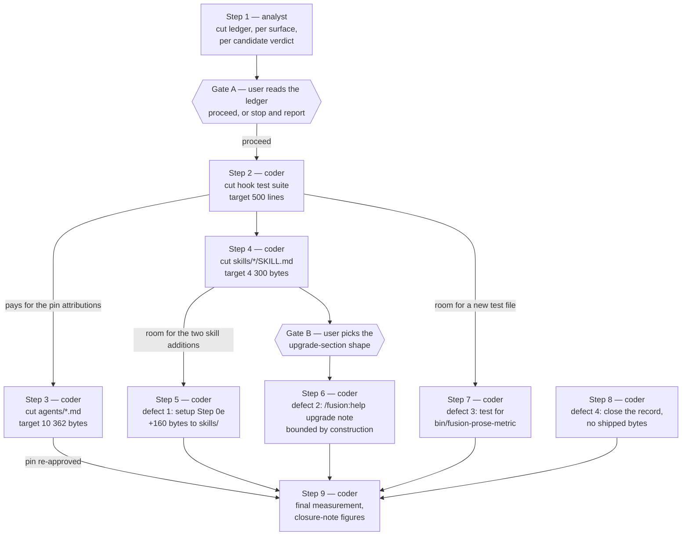

# Implementation Plan: C0 — the cut-only Circle that buys head-room on four bounded surfaces

**Date:** 2026-08-22
**Status:** Complete
**Spec:** `260822-1136_*_spec-fusion-becomes-a-multi-user-tool.md`, capability `### C0`. C1 through C4 are out of scope here and are not planned.
**Decidability:** The load-bearing question is whether the required cut exists — 10 362 bytes out of `agents/*.md`, about 4 300 out of `skills/*/SKILL.md` and about 500 lines out of the hook test suite — taken from text that is not load-bearing. The targets are decidable and are pure arithmetic, derived in `## Current State` from the baseline maps and the tree. Whether a cut of that size exists is **not** decidable from what this plan holds: whether a given paragraph carries a mechanism is a judgement about text nobody has yet read with that question in mind, and reading it is the work. The mechanism change is that this plan does not commit to the target on a survey it has not run. Step 1 measures the achievable cut per surface and returns a ledger with a per-candidate verdict; a user gate on that ledger decides whether the Circle proceeds or stops and reports. Two measurements taken while planning bound the risk without removing it: 24 685 bytes of `agents/*.md` and 12 022 bytes of `skills/*/SKILL.md` sit in sentences that appear verbatim in another shipped file, against requirements of 10 362 and 4 300. The hook test suite has no comparable margin — ten duplicated comment lines across 44 files — so it is the surface on which the ledger may fall short, and step 1 reports that surface first.

## Directive

Buy head-room on the four bounded surfaces of this plugin so that the multi-user rebuild has room to write into, and prove the room by landing four already-open defects that the bounds currently block. Nothing else. This Circle adds no capability, and the room it buys is spent by later Circles rather than by this one.

## Current State

### The four bounds, re-measured at HEAD `370bfc5` on 2026-08-22

Each surface was summed the way its own test sums it: `agents/` and `skills/` by `statSync` byte size over the files the reader collects, the hook tests by newline count over a recursive walk of `hooks/lib/__tests__/**/*.ts`, and the always-on rule core by byte size over the five files every agent loads. The floor is that surface's baseline map summed over the files present; a file with no baseline entry contributes nothing to the floor and its whole size counts as growth.

| Surface | Floor | Head-room constant | Budget | Now | Remaining |
|---|---|---|---|---|---|
| Always-on rule core | 86 573 | 12 000 | 98 573 | 95 064 | 3 509 bytes |
| `agents/*.md` | 399 843 | 18 000 | 417 843 | 416 205 | 1 638 bytes |
| `skills/*/SKILL.md` | 220 439 | 20 000 | 240 439 | 240 409 | 30 bytes |
| Hook test suite | 17 875 | 2 500 | 20 375 | 20 363 | 12 lines |

The figures are identical to the spec's, so nothing moved between the spec's measurement and this plan's. Re-measure again at the Circle's first Turn: this table is stale by construction the moment anybody edits a shipped file.

### Where the growth actually sits

The bound's own instruction is to cut where the growth is. Measured per file against the baseline maps:

**`agents/*.md`, 16 362 bytes of growth.** `orchestrator.md` carries 10 948 of it (67 per cent), `shaper.md` 3 181, `planner.md` 1 300, `curator.md` 701, and four files hold the remaining 232. Eight of the fifteen prompts have not moved a byte since the 2026-08-15 arming. The growth is prose expansion inside existing sections rather than new sections: the whole of `orchestrator.md`'s growth is 106 added and 64 removed lines.

**`skills/*/SKILL.md`, 19 970 bytes of growth.** `setup/SKILL.md` carries 11 385 (57 per cent) and `help/SKILL.md` 4 049 (20 per cent). `direct/SKILL.md` adds 1 780 and `archive/SKILL.md` 1 149; the remaining seven bodies hold 1 607 between them, and two have not moved.

**Hook test suite, 2 488 lines of growth.** Five files that have no baseline entry account for 1 553 of it and are counted in full: `sentence-identifier-containment.test.ts` (425), `workbench-citation-lint.test.ts` (347), `committed-dist.test.ts` (329), `plan-stopping-section-lint.test.ts` (284) and `fenced-code-exemption.test.ts` (168). All five are live gates. The other 935 lines are growth in existing files, 452 of them in `reference-resolution-lint.test.ts` and 347 in `helpers/citation-scan.ts`.

### What is already available to cut, measured rather than assumed

**Restated text across the shipped surfaces.** Splitting `agents/*.md`, `skills/*/SKILL.md` and `rules/*.md` into sentences, normalising whitespace and markdown emphasis, and keeping sentences of 70 characters or more, 73 distinct sentences appear in more than one file. `agents/*.md` holds 24 685 bytes of such text and `skills/*/SKILL.md` 12 022. Exact-match sentence identity is a floor on the real duplication, not an estimate of it: paraphrases and near-restatements are invisible to it.

Not all of that mass is removable. Two sentences of the Setup contract stand in all fifteen agent prompts because an agent has to be told to run `bin/fusion-rules` before it can read `rules/agent-setup.md`, which is the file that would otherwise carry them. That bootstrap duplication is legitimate and stays. Separating it from the rest is step 1's work, and it is why this plan states a measured floor and not a promised yield.

**Duplication that is already filed as a defect.** The cut this Circle performs is not a new policy. `260811-1734_*_reduce-the-surface-so-a-claim-cannot-go-stale-in-several-places-at-once.md` is the standing umbrella record for exactly this work, filed to realise the answered decision `260810-1635_*_where-does-the-obligation-sit-to-update-the-artefact-that-explains-a-behaviour-when-the-behaviour-changes.md`. It states the method (identify claims stated in more than one shipped surface, pick an authoring home for each, replace the rest with citations), says acceptance is per instance rather than for the class, and says the work should not be attempted in one dispatch. Three further open records name concrete instances: `260810-2110_*_the-domain-capture-one-liner-is-now-copied-into-a-fourth-skill-body-and-the-copying-is-the-stated-justification.md` (four skill bodies), `260816-0133_*_the-setup-and-migrate-probes-are-byte-identical-in-three-copies-with-no-gate-against-the-next-drift.md` (three copies of one 218-character expression), and the `bin/fusion-source-root` resolution block, which stands in four skill bodies.

**Comment mass in the hook test suite.** 7 167 of the suite's 20 363 lines are comment and 1 652 are blank, leaving 11 544 lines of code. The 500 lines this Circle needs are 7 per cent of the comment mass. Two concentrations are worth naming. Nine test files each implement their own walk of `agents/` and `skills/` while `helpers/citation-scan.ts` already exports `pluginRoot` and `markdownFilesUnder()`, which is duplication of an abstraction that exists. And the guard-related tests — `helpers/guard-harness.ts` (978), `hook-fail-open.test.ts` (621), `guard-project-config-integration.test.ts` (423), `guard-bash-integration.test.ts` (417), `guard-state-shape.test.ts` (251) and `legacy-halt-clearing.test.ts` (213) — hold 2 903 lines, 14 per cent of the suite, against a hook that has decided nothing since 2026-08-16.

### Two findings that change what the plan may do

**A re-baseline is available and must not be taken.** The spec's acceptance criteria permit one where a re-baseline follows an actual cut named in the same commit, which is event 1 of `## Re-baselining` in `hooks/lib/__tests__/helpers/growth-bound.ts`. At the current numbers, taking it can only absolve growth. Head-room after a cut of X bytes with no re-baseline is `1 638 + X` on `agents/`; after a re-baseline onto post-cut sizes it is a flat 18 000 whatever X is. The two are equal only when X reaches 16 362, the whole of the growth, and at that point not re-baselining gives the same result. Every value of X below that makes the re-baseline a raise that absolves `16 362 − X` bytes nobody cut. The same arithmetic holds on all four surfaces, because all four currently stand above their floors. This plan therefore edits no baseline map at all, and the exception in the acceptance criteria goes unused. The choice is put to the user as an open decision rather than settled here, because it binds every future cut-only Circle.

**The hook test surface has to be cut first.** Cutting `agents/*.md` or `skills/*/SKILL.md` removes path citations, which moves the `BASELINE = { paths, anchors, records }` pin in `hooks/lib/__tests__/reference-resolution-lint.test.ts`. Re-approving that pin is expected by the gate; the attribution comment that file's own convention asks for is not demanded by the assertion but is the convention this project follows, and it costs lines on the hook test surface, which has 12. That is the trap `260821-2204_*_a-growth-bound-lost-half-its-head-room-against-a-stated-stopping-criterion-and-the-finding-lives-only-in-a-history-log.md` records, arriving inside this Circle. Cutting the hook tests first pays for the attributions the later cuts will need. `surface()` in that gate walks `rules/`, `agents/`, `docs/`, `templates/`, `skills/*/SKILL.md`, the READMEs, `CLAUDE.md`, the shell scripts in `bin/`, `install.sh`, `hooks/*.ts` and `hooks/lib/*.ts`, and **not** `hooks/lib/__tests__/`, so the hook-test cut itself moves no pin.

## Approach

One integral approach, and it is not new work: execute the already-filed surface-reduction record against the three surfaces that have targets, in the order the pin dependency forces, then land the four blocked defects into the room that produces.

The cut is restatement, not reasoning. Where a claim stands in two shipped files, one file keeps it and the other cites it, which is what `rules/fusion-workbench-conventions.md` did to five of its own topics and what its header table records. Where a paragraph exists because a measured defect happened, it stays: this project's prose is frequently the mechanism, and a cut that removes a mechanism is a worse outcome than a red bound.

Nothing is added to any bounded surface except the four defect fixes, and one of those is planned to be net negative.



Steps 3 and 4 are independent of each other and both depend on step 2. Step 8 depends on nothing and may run at any point; it is drawn feeding the closure because that is the only thing that waits on it.

## Implementation Steps

### Gates

Two user gates sit inside this Circle and neither is a step, because neither is executed by an agent.

**Gate A** follows step 1. The user reads the cut ledger and decides whether the Circle proceeds. If the ledger does not clear a target, the Circle stops and reports, which is a valid closure. The gate exists because step 1 is the only place the plan's own premise is tested, and because the largest single item available on `agents/*.md` — `orchestrator.md` at 150 807 bytes, 36 per cent of that surface — is a cut nobody has asked for and must not be taken without the user saying so. See `## Open Questions`.

**Gate B** precedes step 6 and is the choice the record for defect 2 explicitly leaves to the user: compress the tail of the upgrade list, or cap it at the last N releases. Its third option, raising the `skills/` baseline, is rejected by the same reasoning that rejects the re-baseline above.

---

1. [DONE] **Survey the cut, per surface, and produce the ledger**
   - Executor: `analyst`
   - Files: writes one analysis report to `$OUT_ANALYSIS`. Reads `agents/*.md`, `skills/*/SKILL.md`, `hooks/lib/__tests__/**/*.ts`, `rules/*.md`, and the four records named in `## Current State` under "Duplication that is already filed as a defect".
   - Changes: for each of the three surfaces with a target, a ledger of candidate cuts. One row per candidate: the file and line range, the measured bytes or lines it removes, the claim it states, where that claim is authored if it is a restatement, and a verdict of `restatement` (another file already authors it), `superseded` (its subject was removed), or `load-bearing` (it carries a mechanism and stays). A candidate with no authoring home and no reason it is not load-bearing does not enter the ledger. The report also carries a running total per surface against that surface's target, and states first, before anything else, whether the hook test surface clears 500 lines, because that is the surface most likely to fall short.
   - The report states plainly which of the 24 685 duplicated bytes in `agents/*.md` are bootstrap duplication that must stay, naming the Setup contract sentences as the known case, and does not count them toward the total.
   - The report proposes no cut to `orchestrator.md` beyond restatement without saying, in its own words, that a deeper cut is something the project has not asked for and what would be given up. The arming note in `hooks/lib/__tests__/surface-growth-bound.test.ts` is explicit that nothing asks for that file to be cut.
   - The always-on rule core has 3 509 bytes and no target. The report surveys it last and treats a cut there as optional, saying whether one is available and what it would cost. See `## Open Questions`.
   - Dependencies: none.
   - Acceptance: the ledger's totals per surface are stated against the targets in `## Current State`; every row carries a verdict and a citation; the report names, per surface, the shortfall if there is one. `npm test` is not run, because this step changes no file the suite reads.

2. [DONE] **Cut the hook test suite by at least 500 lines**
   - Executor: `coder`
   - Files: `hooks/lib/__tests__/**/*.ts`, `hooks/lib/__tests__/fixtures/surface-growth.golden`
   - Changes: apply the ledger's hook-test rows. The two concentrations step 1 will have measured are the nine per-file walks of `agents/` and `skills/` that duplicate what `helpers/citation-scan.ts` already exports, and the comment mass in the guard-related tests, whose subject has decided nothing since 2026-08-16. Remove no assertion whose subject still exists. Where a comment block is a historical narrative that a workbench record also carries, the cut is permitted only if the record is cited from the file; where the comment is the arming or absolution text `helpers/growth-bound.ts` requires to survive the number moving, it stays. Regenerate the golden with `cd hooks && UPDATE_SURFACE_GOLDEN=1 npx vitest run lib/__tests__/surface-growth-bound.test.ts`, read the diff, then run again without the flag.
   - Edit no file under `hooks/lib/` outside `__tests__/`. That directory is excluded from `hooks/tsconfig.json`, so this step compiles nothing and `hooks/lib/__tests__/committed-dist.test.ts` is unaffected. If a later ledger row does reach `hooks/lib/*.ts`, run `npm run build` in the same step.
   - Dependencies: step 1, and Gate A.
   - Acceptance: `cd hooks && npm test` exits 0. The hook test surface stands at least 500 lines below where it stood at the Circle's start, measured by summing `TEST_LINE_BASELINE` over the files present and comparing against a recursive newline count. `TEST_LINE_BASELINE` is unchanged. Every removed assertion, if any, is named in the step report with the reason its subject no longer exists.

3. [DONE] **Cut `agents/*.md` by at least 10 362 bytes**
   - Executor: `coder`
   - Files: `agents/*.md`, `hooks/lib/__tests__/reference-resolution-lint.test.ts` (the `BASELINE` pin and its attribution comment only), `hooks/lib/__tests__/fixtures/surface-growth.golden`
   - Changes: apply the ledger's `agents/` rows. Each removed restatement is replaced by a citation of the file that authors the claim, in the citation form `rules/fusion-workbench-conventions.md` `## Marker globs` requires of a record that states something about a citation. Leave the Setup bootstrap sentences in every prompt. Re-approve `BASELINE` in the same commit with one attribution block covering the whole step, not one per file: the two-blocks-for-one-commit spend is what defect 4 records.
   - Dependencies: step 2. Cutting before the hook tests are cut risks the attribution block reddening the hook-test bound, which has 12 lines at the Circle's start.
   - Acceptance: `cd hooks && npm test` exits 0. `agents/*.md` has at least 12 000 bytes of head-room, measured by summing `AGENT_BASELINE` over the files present, adding 18 000 and subtracting the tree's total. `AGENT_BASELINE` is unchanged. The step report states, per prompt file, the bytes removed and the authoring home each removed claim now cites.

4. [DONE] **Cut `skills/*/SKILL.md` by at least 4 300 bytes**
   - Executor: `coder`
   - Files: `skills/*/SKILL.md`, `hooks/lib/__tests__/reference-resolution-lint.test.ts` (pin and attribution only), `hooks/lib/__tests__/fixtures/surface-growth.golden`
   - Changes: apply the ledger's `skills/` rows. The three already-filed instances are the first candidates: the `agentstate.yaml` domain-capture one-liner in four bodies, the byte-identical bracket-marker probe in three places, and the `bin/fusion-source-root` resolution block in four bodies. Each of those three records names a fix direction; take the one that gives the claim a single authoring home, and close the record in the same step where the fix discharges it. Where a body must keep an executable block because it is pasted into a shell, keep the block and cut the prose around it that another body also carries.
   - The target is 4 300 rather than the bare 2 970, because steps 5 and 6 add to this surface afterwards: about 160 bytes for defect 1 and up to 1 100 for defect 2.
   - Dependencies: step 2.
   - Acceptance: `cd hooks && npm test` exits 0. `skills/*/SKILL.md` stands at least 4 300 bytes below its size at the Circle's start. `SKILL_BASELINE` is unchanged. Any of the three cited duplication records that this step discharges is renamed to closed with a `Resolved:` note.

5. [DONE] **Fix defect 1: Step 0e's unguarded blocks and its unreported outcome**
   - Executor: `coder`
   - Files: `skills/setup/SKILL.md`
   - Changes: both parts of the fix the record prescribes. Part 1, add the `source-root-unresolved` skip to the Done-report contract as a reported outcome, and make the enumeration's count agree with the number of tokens the block emits. Part 2, give the replace and the stamp blocks the same `[ -n "$SRC" ] || { echo …; exit 0; }` guard the classification block carries. Both are additive and neither changes behaviour on a resolving root.
   - Dependencies: step 4. The record itself states the sequencing constraint: applying either part before the `skills/` cut reddens the growth bound.
   - Acceptance: `cd hooks && npm test` exits 0. The record `260821-0302_*_step-0es-repair-guards-one-of-its-three-blocks-and-its-done-report-omits-the-outcome-that-guard-emits.md` is renamed to closed with a `Resolved:` note naming both parts. `skills/*/SKILL.md` head-room is stated in the step report.

6. [DONE] **Fix defect 2: the v10.5 upgrade note reaches `/fusion:help`, and the section stops growing without bound**
   - Executor: `coder`
   - Files: `skills/help/SKILL.md`
   - Changes: the shape the user picked at Gate B, plus the v10.5 paragraph the release omitted. Option 2 of the record — cap the section at the last N releases with one standing line pointing at `docs/` for the rest — is the option that makes the section's growth bounded by construction rather than by repeated pruning, and it is the one this plan recommends; option 1 buys several releases and leaves the shape unchanged. Take whichever the user chose. Do not take option 3.
   - Dependencies: step 4, and Gate B.
   - Acceptance: `cd hooks && npm test` exits 0. `/fusion:help`'s update topic names v10.5 and points at `docs/upgrading-to-v10-5.md`. The record `260822-0946_*_the-v10-5-release-note-reaches-the-readme-and-not-fusion-help-because-the-skills-bound-has-30-bytes.md` is renamed to closed. The step report states the net byte change for `skills/help/SKILL.md`, which under option 2 is expected to be negative.

7. [DONE] **Fix defect 3: a test for `bin/fusion-prose-metric`**
   - Executor: `coder`
   - Files: a new file under `hooks/lib/__tests__/`
   - Changes: a test that runs the script and pins the behaviour its own header documents as authoritative — the em-dash count, the word count, and the four regions that are not prose (a fenced code block, an inline code span, a block-quote line, and the subtree of an `examples:` or `anti_examples:` key in a YAML profile). Cover the case the metric was built for: a file whose exhibits of the em-dash fault must not be counted as instances of it. Pin that only `—` U+2014 is counted and `–` is not. Keep the file at or under 200 lines; a longer file spends room the Circle bought for later Circles, and the step report states the line count.
   - Dependencies: step 2. The surface has 12 lines at the Circle's start, so this file cannot land before the cut.
   - Acceptance: `cd hooks && npm test` exits 0. The record `260821-0144_*_the-authoritative-prose-metric-has-no-test-and-the-hook-test-surface-has-43-of-2500-lines-left.md` is renamed to closed. The hook test surface still holds at least 300 lines of head-room after the file lands.

8. [DONE] **Fix defect 4: close the record whose stopping criterion could not be met**
   - Executor: `coder`
   - Files: `260821-2204_*_a-growth-bound-lost-half-its-head-room-against-a-stated-stopping-criterion-and-the-finding-lives-only-in-a-history-log.md`
   - Changes: verify that the disposition the record asked for was made, then close it. It was: the closure note of `260821-1042-reply-bounded-whole-question-answered` states 15 lines of head-room as residual 1 rather than repeating the unmet criterion, and the two attribution blocks were consolidated into one. Append a `Resolved:` note citing that closure note and stating that the figure it quotes is the figure at that closure and not at HEAD. Do not rewrite the closed plan's `## Where this Circle stops`: a closed record is not edited to make a past criterion true.
   - The residual the record raises but does not answer — whether a re-approval comment belongs on a budget derived from what test code costs to maintain and to run — is filed as an open decision by this plan and is cited from the `Resolved:` note. Closing the defect does not close the question.
   - Dependencies: none. No shipped surface is touched, so this step may run at any point.
   - Acceptance: `cd hooks && npm test` exits 0, which here proves only that the record edit broke no citation gate. The record carries a `Resolved:` note and the closed marker, and cites both the closure note and the open decision.

9. [DONE] **Measure the four surfaces and write the closure figures**
   - Executor: `coder`
   - Files: writes the measurement into the step report and into `$OUT_HISTORY`; the closure note itself is the orchestrator's at Phase 4.
   - Changes: sum each of the four surfaces the way its own test sums it, and state, per surface, what was cut, the head-room before, and the head-room after. Confirm by diff that `AGENT_BASELINE`, `SKILL_BASELINE`, `TEST_LINE_BASELINE` and `RULE_BASELINE` are byte-identical to their state at HEAD `370bfc5`. State the always-on rule core's head-room even though no target was set for it.
   - Dependencies: steps 2 through 8.
   - Acceptance: `cd hooks && npm test` exits 0. Four head-room figures are stated with the command that produced each. The four baseline maps are shown unchanged. Any target not met is named with its shortfall rather than rounded past.

**No step routes to `ontocoder`.** Nothing in this Circle is structured data. The two golden fixtures under `hooks/lib/__tests__/fixtures/` are machine-written by a command the coder runs, not files anybody edits, and the workbench records are Markdown. Inventing a data step for symmetry would put a second executor on files one executor already holds.

## Where this Circle stops

- Each of the four defects the spec enumerates is closed, and `cd hooks && npm test` exits 0 at the commit that closes each.
- `agents/*.md` holds at least 12 000 bytes of head-room, `skills/*/SKILL.md` at least 3 000 bytes, and the hook test suite at least 300 lines, each measured by the summation its own bound performs.
- No baseline map moved. `AGENT_BASELINE`, `SKILL_BASELINE` and `TEST_LINE_BASELINE` in `hooks/lib/__tests__/surface-growth-bound.test.ts` and `RULE_BASELINE` in `hooks/lib/__tests__/rules-emission-golden.test.ts` are byte-identical to their state at HEAD `370bfc5`.
- Every cut that landed carries, in the ledger or in its step report, either a named authoring home that now holds the claim or a stated reason the text is not load-bearing. A cut that carries neither is not a cut this Circle may make, and its presence stops the Circle even if every byte target is met.
- Nothing was added to any of the four bounded surfaces beyond the four defect fixes. A cut Circle that also lands a feature has spent the room it bought, and that stops the Circle whatever the final measurement says.
- The closure note states, per surface, what was cut and what the head-room measured before and after, including the always-on rule core, for which no target was set.
- The Circle also stops, validly, without meeting the three head-room clauses, if the ledger at Gate A does not clear a target and the user chooses not to widen the cut. The closure note then names which surface fell short and by how much, and C1 through C4 do not start.

## Data Structures

None. This Circle introduces no type, schema or record format. The one structure it reads is the `Sized` and `Growth` pair in `hooks/lib/__tests__/helpers/growth-bound.ts`, unchanged.

## API Changes

None. No signature, no endpoint, no helper interface moves. `bin/fusion-prose-metric` gains a test and not a change: step 7 pins the behaviour its header already documents, and a test that required the program to change would be reporting a defect rather than covering it.

## Testing Strategy

`cd hooks && npm test` is the verification command and every step that touches shipped text or tests states it. Beyond the growth bounds themselves, four gates recompute from the tree on every run and can go red over a cut:

- `hooks/lib/__tests__/reference-resolution-lint.test.ts` holds an exact count pin. A cut that removes path citations moves it downward, which is the case the pin exists for. Re-approve it in the same commit as the cut, with one attribution block per step.
- `hooks/lib/__tests__/workbench-citation-lint.test.ts` recomputes its corpus with no approvable baseline. It reddens if a cut removes a citation target. No step here deletes a file, so the exposure is a step that removes a heading another record anchors to.
- `hooks/lib/__tests__/plan-stopping-section-lint.test.ts` fails on a live plan whose `## Where this Circle stops` is missing, empty or still the shipped placeholder. This plan carries one.
- `hooks/lib/__tests__/committed-dist.test.ts` fails when the committed `hooks/dist/` is not the compilation of the committed source. No step compiles anything as planned, because `hooks/lib/__tests__` is excluded from `hooks/tsconfig.json`; a step that reaches `hooks/lib/*.ts` runs `npm run build` in the same step.

At least eight further lint tests assert that specific sentences are present in `agents/*.md` and `skills/*/SKILL.md`: `turn-budget-lint`, `executor-verification-report-lint`, `playmaker-backlog-mandate-lint`, `deliverable-language-lint`, `marker-format-lint`, `glob-nomatch-lint`, `review-coverage-mandate` and `domain-cascade-order-lint`. A cut is therefore never verified by reading the diff alone. Run the suite after every step, not at the end of the Circle.

Both golden fixtures are regenerated deliberately and never left switched on. The regenerating run rewrites the fixture and then fails on purpose, forcing a second run without the flag:

```bash
cd hooks && UPDATE_SURFACE_GOLDEN=1 npx vitest run lib/__tests__/surface-growth-bound.test.ts
cd hooks && UPDATE_RULES_GOLDEN=1   npx vitest run lib/__tests__/rules-emission-golden.test.ts
```

## Risks & Mitigations

| Risk | Mitigation |
|---|---|
| A cut removes a paragraph that exists because a measured defect happened, and the defect recurs. | Every ledger row carries a verdict and a citation; a row with neither an authoring home nor a stated reason does not enter the ledger. The stopping clauses make an uncited cut a reason to stop the Circle. |
| The hook test surface cannot yield 500 lines without removing coverage. | Step 1 reports that surface first, before the other two, so the shortfall is known at Gate A rather than at step 2. If it does not clear, the Circle stops and reports, which the spec names as a valid closure. |
| A cut moves the `reference-resolution-lint` pin and the attribution comment reddens the hook-test bound. | Step 2 cuts the hook tests before steps 3 and 4 touch a citation, so the attributions are paid out of room already bought. One attribution block per step, not one per file. |
| A lint that pins a sentence in a prompt goes red after a cut that read as safe. | The suite runs after every step. At least eight such lints exist and are named in `## Testing Strategy`. |
| The Circle re-baselines a surface it cut and absolves growth nobody removed. | No baseline map is edited, and the arithmetic that shows why is in `## Current State`. The stopping clauses require the four maps to be byte-identical at closure. |
| The four defect fixes add more than the cut bought, and the Circle closes with less room than it planned. | Step 4's target carries the two skill additions explicitly, step 7 caps the new test file at 200 lines, and step 9 measures rather than assumes. |
| `orchestrator.md` is cut deeper than restatement because it is the largest file and the target is close to its growth. | Gate A. Step 1 must state in its own words that a deeper cut is something the project has not asked for and what would be given up, and the user decides. |
| The always-on rule core is cut opportunistically because it is easy, spending room a later Circle needs. | No target is set for it, step 1 surveys it last, and the question of whether to cut there at all is an open decision. |

## Open Questions

- [ ] Does a cut-only Circle re-baseline the surfaces it cuts? Filed as `260822-1154_*_does-a-cut-only-circle-re-baseline-the-surfaces-it-cuts.md`. This plan proceeds on "no" and states the arithmetic; the record exists because the answer binds every future cut-only Circle and because the spec's acceptance criteria permit the re-baseline this plan declines.
- [ ] Does the hook-test line budget cover comment prose? Filed as `260822-1154_*_does-the-hook-test-line-budget-cover-comment-prose.md`. Raised and deliberately unanswered by `260821-0144_*_…` and again by defect 4. It is not answerable inside this Circle: any answer that changes what the surface counts requires the baseline to be recomputed under the new rule, which is neither re-baselining event, and the user rejected declaring a third one.
- [x] Which shape does the `/fusion:help` upgrade section take? Gate B, and the three options are stated in `260822-0946_*_the-v10-5-release-note-reaches-the-readme-and-not-fusion-help-because-the-skills-bound-has-30-bytes.md`. No second record is filed; that issue holds the options and the reasoning, and duplicating them into a decision record would be the defect this Circle exists to reduce.
- [x] Is any cut taken on the always-on rule core, which has 3 509 bytes and no target? This plan proposes none. Cutting there is optional, the surface is the one charged to every dispatch of every agent, and the room is worth more held than spent. Step 1 reports whether a cut is available so the question is answerable at Gate A rather than assumed away.
- [x] Is `orchestrator.md` cut beyond restatement? This plan proposes not, and says where the 12 000 bytes come from instead: from the 24 685 bytes of `agents/*.md` that stand in sentences another shipped file also carries, of which `orchestrator.md` is the largest single holder. A deeper cut is available and large, and the arming note in `hooks/lib/__tests__/surface-growth-bound.test.ts` says nothing asks for it. Gate A is where that changes, if it changes.

## Reconciliation Log

**260822-1556 (reconciler, domain `code`, HEAD `9f65463`) — `_o_` → `_c_`, `**Status:** Draft` →
`Complete`, and steps 1, 2, 7, 8 and 9 marked `[DONE]` to match the tree.**

Four of the nine steps carried an inline `[DONE]` marker and all nine had executed. The five
unmarked ones are marked here against the commit that landed each, and the plan is closed because
no step holds remaining work. What is *not* closed by this is the Circle's closure gate: stopping
clause 5 is answered "no", the record that names it
(`260822-1506_*_two-of-the-c0-plans-stopping-clauses-cannot-both-be-answered-yes-for-a-repair-the-first-one-demands.md`)
stays open, and clause 6 asks for a closure note that does not yet exist. Both are the
orchestrator's and the user's at Phase 4, not a plan step.

| Step | Commit | Verified against the tree |
|---|---|---|
| 1 | `aa44a8b` | `260822-1226-cut-ledger-for-three-bounded-surfaces.md` exists, carries per-surface totals against the targets, and reports the hook-test surface first. |
| 2 | `5afb910` | Suite 20 363 → 19 862 lines, a cut of 501. `reference-resolution-lint.test.ts` 1431 → 1014 lines. |
| 3 | `181dd8a` | `agents/*.md` 416 205 → 401 242 bytes. Fifteen files, per-prompt reductions summing to 14 963. |
| 4 | `c2ad89c` | `skills/*/SKILL.md` 240 409 → 236 069 bytes, a cut of 4 340 across eight bodies. |
| 5 | `6781814` | All three Step 0e blocks carry `[ -n "$SRC" ] || { echo "source-root-unresolved"; exit 0; }` (`skills/setup/SKILL.md:188,223,231`); the Done-report contract names the skip (`:242`); the enumeration head reads "The eight tokens" (`:203`). |
| 6 | `6781814` | `skills/help/SKILL.md:101` carries the v10.5 paragraph and points at `docs/upgrading-to-v10-5.md`; `:107` caps the section at the last three releases. Net −68 bytes on that body. |
| 7 | `7c9e3f1` | `hooks/lib/__tests__/fusion-prose-metric.test.ts`, 162 lines, 9 cases, under the plan's 200-line cap. |
| 8 | `4a58be1` | The record moved `_o_` → `_c_` in that commit and carries the prescribed `Resolved:` note. See the correction below. |
| 9 | `9f65463` | `260822-1540-coder-c0-step-9-closure-measurement.md`, 285 lines, four surfaces measured with the command that produced each. |

**The step-9 figures were re-measured here rather than read.** Summing each baseline map over the
files present and comparing against the tree with the collectors each bound uses gives head-room of
**16 601 bytes** on `agents/*.md`, **4 661 bytes** on `skills/*/SKILL.md` and **302 lines** on the
hook test suite — the three figures the closure measurement reports, to the byte and to the line.
The four baseline maps were re-extracted from `370bfc5` and from the working tree by the same slice
and diffed: `AGENT_BASELINE` 17 lines / 413 bytes, `SKILL_BASELINE` 14 / 389, `TEST_LINE_BASELINE`
41 / 1 554, `RULE_BASELINE` 17 / 1 042, all four identical. `cd hooks && npm test` — exit 0, 41
files, 724 tests.

**Clause 5's "no" was re-derived and stands at exactly the figure reported.** Per-commit surface
totals give `skills/*/SKILL.md` +50 bytes at `620e737` and +156 at `77b9a02` (both review-finding
repairs), and the hook test suite +41 lines at `181dd8a` and +8 at `c2ad89c` (both pin re-approval
attributions the cuts required in the same commit). **206 bytes and 49 lines**, none of it a
feature, every surface net negative across the range.

**One step-3 figure is stated two ways across three records, and this plan is not the place it is
fixed.** The relocation into `rules/review-contract.md` is 8 894 bytes in the step-3 history and in
the decision record, and the closure measurement assigns the whole 9 504 that `coderev.md` and
`ontorev.md` gave back to that one destination. The difference is 610 bytes — 305 in each of the two
reviewer prompts — which belongs to the five-claim cut, not to the relocation. Filed as
`260822-1556_*_the-closure-measurement-assigns-610-bytes-of-the-five-claim-cut-to-the-reviewer-contract-relocation.md`.

**Step 8's premise, corrected.** `260822-1228_*_plan-step-8-asks-for-a-closure-that-was-already-made-and-the-record-already-carries-the-note.md`
states that the target record was already `_c_` at HEAD `370bfc5`. It was `_o_` at `370bfc5`
(`git ls-tree 370bfc5`) and became `_c_` in `4a58be1`, which is step 8 itself running. The analyst
observed the effect of the step and dated it to the session anchor. That record is closed with the
correction, and the anchor error it came from is filed as
`260822-1556_*_the-cut-ledger-states-a-head-anchor-two-commits-behind-where-it-ran.md`.

**The five open questions, three of them ticked above.** The `/fusion:help` shape was answered at
Gate B (option 2, cap at the last three releases; `skills/help/SKILL.md:107`). No cut was taken on
the always-on rule core: it stands at 3 509 bytes of head-room at both ends of the range, and the
five files in the intersection are unchanged. `orchestrator.md` was not cut beyond restatement — it
gave back 496 bytes at `181dd8a`, the same figure as five other prompts, against the 10 948 of
growth it carries. The two that stay unticked are filed decisions and are still `_o_`; neither was
answerable inside this Circle and neither blocked it.
