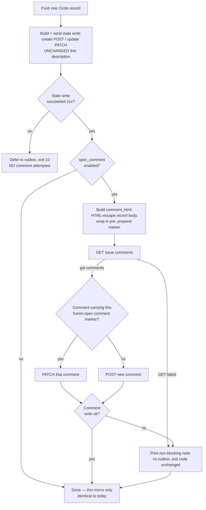

# Spec: Plane bridge — full Circle spec as an idempotent comment (opt-in)

**Date:** 2026-07-22
**Status:** Complete
**Source:** "Bring the deferred Step 6 hook into `bin/fusion-plane` as a native, opt-in capability: on push, fusion upserts the FULL Circle spec as an idempotent Plane comment, so a developer opening the mirrored Plane issue sees the complete brief instead of the thin 'Mirrored fusion circle' stub." The lone blocker — an unverified comments-endpoint body shape — was cleared by Martin's live test against ticket #66.

## Directive

When the opt-in is enabled, every `bin/fusion-plane push` of a Circle attaches (or refreshes) the Circle record's full body as a single Plane comment on the mirrored issue, so a developer opening that issue reads the complete brief rather than the ~160-character stub the description carries today. The comment is idempotent across re-pushes, never overwrites the issue description, and never blocks or defers the state transition. With the opt-in off, behaviour is byte-for-byte what it is now.

## Background: why the comment, not the description

The push writes a deliberately thin description body: `Mirrored fusion <kind>.\n\nfusion-key: <nk>\nsource: <relpath>` into `description_html` (`bin/fusion-plane:726`). `build_write_body` (`bin/fusion-plane:707-732`) sends only `name` / `description_html` / `state` and never touches comments — so a comment fusion adds survives every subsequent re-push untouched. That is the property that makes the comment the correct home for the full spec: there is no source-of-truth contention with the description, and for a seed-origin issue (a human's own Plane story) the human's description text is never at risk.

The capability was scaffolded but withheld: `push --closure` is already accepted as a no-op placeholder (`bin/fusion-plane:882-885`), whose block comment records that the Step-6 comment hook was "intentionally NOT implemented here (its comments-endpoint body shape is unverified in MARTIN.md)." That unverified body shape was the sole blocker, and it is now verified: the comments endpoint takes `{"comment_html": <html>}`, and an idempotent upsert keyed on an HTML-comment marker in the comment body was confirmed against real ticket #66 and survives re-push.

Decision `circles/260719-1536-plane-mirror-integration/decisions/260719-2313_i_round-trip-write-overwrites-origin-story-description.md` chose Option 1 (seed-origin issues get state-only description writes; fusion never overwrites a human's story) and explicitly named this spec-comment as Option 3's planned continuation "once the comments body is verified." This spec is that continuation, and it respects Option 1: a comment never touches the description, so it applies to seed-origin and fusion-owned issues alike without reopening that decision.

## Capabilities

### C1: Opt-in surface — `spec_comment` config field

**Description:** A single boolean field in `fusion-workbench/plane.config.yaml`, `spec_comment`, controls the whole capability. Default OFF. No CLI flag is added. This matches how `states:` and `labels:` config already gate bridge behaviour — the consumer edits config, not command lines.

**Acceptance criteria:**
- [ ] With `spec_comment` absent from the config, a push produces exactly the same Plane calls and the same `--plan` output as before this change (zero behaviour change; the existing test corpus still passes unmodified).
- [ ] With `spec_comment: false`, behaviour is identical to absent.
- [ ] With `spec_comment: true`, the comment-upsert path (C2) runs on every Circle push.
- [ ] The field is read through the existing config getter (`cfg_get`), so it lives at the top level of `plane.config.yaml` alongside `base_url` / `states` / `labels`.

**Decisions made:**
- Config field, not CLI flag (fork 2) — matches `states`/`labels`; zero behaviour change unless enabled.
- Default OFF (fork 2).

### C2: Idempotent spec-comment upsert on push

**Description:** When `spec_comment` is enabled and a Circle is pushed, fusion attaches the Circle record's full body as one Plane comment, refreshing the same comment on every later push rather than piling up duplicates. Idempotency is achieved with an HTML-comment marker embedded in the comment body: `<!-- fusion-spec-comment:<key> -->`, where `<key>` is the Circle's natural key (its directory name, the same key the map records). On each push the bridge GETs the issue's comments, finds the one bearing this Circle's marker, and PATCHes it; if none exists, it POSTs a new one. The comment body shape sent to Plane is `{"comment_html": <html>}`.

**Acceptance criteria:**
- [ ] On the first enabled push of a Circle, the bridge POSTs one comment to the issue's comments endpoint, and that comment's body contains the marker `<!-- fusion-spec-comment:<key> -->` for this Circle's natural key.
- [ ] On a second enabled push of the same Circle, the bridge finds the marker-bearing comment and PATCHes it (updates in place); no second comment is created.
- [ ] The upsert decision is by marker match only: a comment is treated as fusion's spec-comment if and only if its body carries this Circle's exact `<!-- fusion-spec-comment:<key> -->` marker. A comment for a different Circle's key is never matched.
- [ ] The comment body is `{"comment_html": <html>}` — no other fields sent.
- [ ] The spec-comment is attached regardless of the issue's origin: a seed-origin Circle (whose description write is state-only) still receives the comment, because a comment never overwrites the description (fork 5; respects decision 260719-2313).
- [ ] The description write is unchanged — the thin `Mirrored fusion …` body (`bin/fusion-plane:726`) and the state-only branch for seed-origin issues both remain exactly as they are; the comment is purely additive.

**Decisions made:**
- Fire on every push, gated only by the opt-in — not closure-only (fork 1). Martin's real use is attaching an anticipated-Circle brief at ordinary push time.
- Content source is the Circle record body (`*_circle.md`), which is always present and self-contained (fork 3).
- Applies regardless of issue origin (fork 5).

### C3: Content and HTML-escaping rule

**Description:** The comment content is the raw Circle record body wrapped in a `<pre>…</pre>` block, so Plane renders the Markdown as preformatted text without an external Markdown renderer (the bridge is bash + jq + curl only). Before wrapping, the record body is HTML-escaped so that Markdown containing angle brackets or ampersands cannot break either the HTML or the JSON. The marker (`<!-- fusion-spec-comment:<key> -->`) is fusion-authored and carries only the key, so it is emitted literally, outside the escaped body.

**Acceptance criteria:**
- [ ] The record body is HTML-escaped for at least `&`, `<`, and `>` (ampersand first, so already-escaped entities are not double-broken) before being wrapped in `<pre>…</pre>`.
- [ ] A Circle record whose body contains literal `<`, `>`, or `&` (e.g. a Mermaid edge `A --> B`, an HTML tag, or `a && b`) produces a comment whose `comment_html` is valid and whose JSON is valid — the raw characters appear escaped inside the `<pre>` block, not as live markup.
- [ ] No external Markdown renderer or non-`{bash,jq,curl}` dependency is introduced.
- [ ] The `<pre>`-wrapped escaped body and the literal marker together form the `comment_html` value.

**Decisions made:**
- `<pre>`-wrap, no external renderer; HTML-escape at minimum `&`, `<`, `>` (fork 3).

### C4: Failure discipline — non-blocking, like the kind-label path

**Description:** A failed comment operation (GET comments, POST, or PATCH — network error, non-2xx, or rate limit) is non-blocking, exactly like the existing kind-label path. The bridge prints a note, does NOT append to the outbox, does NOT defer, and does NOT change the exit code. The state write has already completed before the comment is attempted, so the state transition is never at the comment's mercy. The idempotent marker upsert self-heals on the next push: a comment that failed to write this time is simply POSTed or PATCHed next time.

**Acceptance criteria:**
- [ ] When the comment GET/POST/PATCH fails, the push's exit code is whatever the state writes produced (`0` ok / `10` deferred) — the comment failure never turns an ok push into a deferred one and never crashes.
- [ ] A comment failure writes nothing to `.plane-outbox.jsonl`.
- [ ] A comment failure prints a human-readable note (surfaced in the live `STATUS:` line the same way `LABELS_SKIPPED` is at `bin/fusion-plane:948-956`, or as an inline note — planner's call on placement, but it must be visible and never silent).
- [ ] The comment path is attempted only after the state write for that artifact succeeded (2xx); if the state write itself deferred, no comment is attempted.
- [ ] This honours the C4 offline doctrine (`bin/fusion-plane:71-77`): an auxiliary write must never cost the state transition.

**Decisions made:**
- Non-blocking, no outbox, no exit-code change; self-heals on next push (fork 4).

### C5: Dry-run / mock testability (no live Plane)

**Description:** The capability must be verifiable through the existing dry-run and fixture seams (`--plan` / `FUSION_PLANE_DRYRUN=1`, and the fixture-injection pattern already used by `push --rebuild-map --fixture` / `FUSION_PLANE_ISSUES_FIXTURE`), with no live Plane instance — the same way the current vitest suite (`hooks/lib/__tests__/fusion-plane.test.ts`, dry-run/mock, commit `aefbf39`) tests everything else.

**Acceptance criteria:**
- [ ] `push --plan` (dry-run) for an enabled Circle surfaces, in its JSON op output, the intended comment: the fact that a spec-comment will be written, the `comment_html` body it would send (escaped, `<pre>`-wrapped, marker-bearing), and — where a comments fixture is supplied — the upsert decision (PATCH an existing comment vs POST a new one).
- [ ] The PATCH-vs-POST decision is testable offline via a comments fixture seam (analogous to the issues fixture: a captured comments-list JSON injected so the marker-match branch runs with no network). The exact seam name/shape is planner's to choose, but it must let a test assert both branches.
- [ ] Mock/dry-run tests assert: the `comment_html` shape is `{"comment_html": <html>}`; the body is HTML-escaped (a fixture record with `<`, `>`, `&` yields an escaped `<pre>` block); the marker string is exactly `<!-- fusion-spec-comment:<key> -->` for the Circle's key; the marker-match logic selects the right existing comment (and ignores a different key's comment).
- [ ] With `spec_comment` absent/false, `--plan` output is unchanged from today (the C1 no-regress criterion, observable in the dry run).

**Decisions made:**
- Same dry-run/mock discipline as the rest of the bridge — no live-Plane dependency in tests.

## Push flow (with the comment-upsert branch)

## Constraints

- Bridge stack stays bash + jq + curl. No external Markdown renderer, no new binary dependency (fork 3).
- Every Plane call continues to run through the existing `plane_curl` wrapper (the `zsh -ic` key-handling path); the API key is never read from a file, echoed, or persisted.
- The comment path must not alter the description write, the seed-origin state-only branch (decision 260719-2313), or any existing exit-code semantics.
- The C4 offline doctrine holds unchanged: outages/rate-limits on the *state* path still defer to `.plane-outbox.jsonl` and exit 10; the comment path never defers.
- Config field lives only in the workbench copy of `plane.config.yaml`; the template documents it but ships it commented/absent so existing filled-in configs keep today's behaviour.
- No state UUID or label UUID literal may appear in the source (the existing lint invariant).

## Out of Scope

- **Consumer-side `/new-fe-feature` fusion-key awareness** — reading the fusion key off a Plane issue and pulling the matching local brief lives in the consumer project, not in `bin/fusion-plane`. This spec is the generic capability only: "attach/refresh the full Circle spec as a comment that survives re-push." Explicitly excluded (restated scope boundary).
- Spec-comments for non-Circle artifacts (fusion issues, decision records). The capability targets the Circle record body only; issues and decisions keep description-only mirroring.
- Rendering Markdown to rich HTML. The comment is preformatted (`<pre>`) text, not rendered Markdown.
- Any change to the `--closure` flag's semantics beyond what this delivers. (The placeholder block at `bin/fusion-plane:882-885` should be reconciled with reality by the implementer — the comment hook it references is no longer "not implemented" — but no closure-only triggering is introduced; the trigger is the opt-in on every push, per fork 1.)
- Pushing prose artifacts (history, reviews, analyses) — still file-only, unchanged.

## Open for Planner

- **Where the comment upsert slots into `process_artifact`** — the state write succeeds around `bin/fusion-plane:671-694`; the comment call belongs after that 2xx branch, and must run for the `circle` kind on both the `full` and `state-only` write-scope paths. Planner determines the exact insertion and whether it is a new helper (e.g. `upsert_spec_comment`) called from one site.
- **The comments fixture seam** — name, env-var, and JSON shape of the injected comments-list used to test the PATCH-vs-POST branch offline (mirror the `FUSION_PLANE_ISSUES_FIXTURE` / `--fixture` pattern).
- **How the dry-run op represents the comment** — an added field on the existing `op_json` object vs a separate op entry. It must expose: that a spec-comment will be written, the `comment_html` it would send, and (with a fixture) PATCH-vs-POST.
- **HTML-escaping mechanism** — jq-based vs a small sed/awk step; ordering must escape `&` before `<`/`>`.
- **Comments endpoint path** — construct as `<BASE>/issues/<id>/comments/` (list/POST) and `<BASE>/issues/<id>/comments/<comment_id>/` (PATCH); planner confirms the exact path segments against the established `$BASE` builder.
- **Note placement** — fold the comment-skip count into the live `STATUS:` line (like `LABELS_SKIPPED`) vs an inline `info` line.
- **Comment ordering under pagination** — whether the comments GET needs `per_page` handling to find an existing marker on issues with many comments (the rebuild path uses `?per_page=100`).

## Deliverables

1. **`bin/fusion-plane`** — the opt-in field read, the upsert helper (build escaped `<pre>` body + marker, GET comments, marker-match, PATCH or POST), wired into `process_artifact` after the successful state write; non-blocking failure handling; dry-run representation. Reconcile the stale `--closure` placeholder comment (`:882-885`) with the now-implemented reality.
2. **vitest coverage** in `hooks/lib/__tests__/fusion-plane.test.ts` (plus any new fixtures under `hooks/lib/__tests__/fixtures/plane/`) against the dry-run/mock seam: `comment_html` shape, HTML-escaping of `& < >`, exact marker string, marker-match selection, PATCH-vs-POST branch, and the `spec_comment`-off no-regression case.
3. **`docs/plane-setup.md`** — document the `spec_comment` opt-in field and the "thin mirror vs. comment-borne full spec" model (description stays a thin stub by design; the full brief rides in an idempotent comment; seed-origin stories keep their description untouched).
4. **`.claude-plugin/plugin.json`** — version bump (per the release convention: every change bumps the version).
5. **A decision record** capturing the architectural choice: "thin mirror description vs. comment-borne full spec" — why the full brief lives in a comment (survives re-push, no description contention, respects decision 260719-2313), filed into the plane-mirror-integration Circle's decisions (or `shared/decisions/` if no Circle is active at implementation time — the Origin Rule decides).

Also update `templates/plane.config.yaml` to document the `spec_comment` field (shipped absent/commented so existing configs are unchanged).

## User Decisions Pending

- None. All five design forks were decided by the user ("Accept all five"); the remaining open items are technical and belong to the planner.

---

## Reconciliation Log

**260731-2324 (reconciler, domain `code`)** — spec is **Complete**; all five deliverables plus the template update shipped in v5.6.0. Marker `_o_` → `_c_`, Status Draft → Complete.

| Deliverable | Evidence |
|---|---|
| 1. `bin/fusion-plane` — opt-in field, upsert helper, wired into `process_artifact`, non-blocking failure, dry-run op | `4d95a91` (primitives), `bf5dc5e` (wiring), `47c4398` (jq `.results? // .` bare-array fix). 10 `spec_comment` occurrences in `bin/fusion-plane`. |
| 1b. Stale `--closure` placeholder comment reconciled | `bin/fusion-plane:1021-1027` — the block now explains the accepted-no-op forward-compat reality; the "intentionally NOT implemented" text is gone. |
| 2. vitest coverage + fixtures | `d75afed`. Fixtures `hooks/lib/__tests__/fixtures/plane/comments-with-marker.json`, `comments-other-key.json`, `comments-with-marker-bare-array.json`. Suite green: 316/316, 12 files (run 260731-2324). Four `spec-comment` cases present incl. the gate-off no-regression case (8 ops unchanged). |
| 3. `docs/plane-setup.md` | `dd6b092`. 3 `spec_comment` occurrences. |
| 4. `.claude-plugin/plugin.json` version bump | `dd6b092` — 5.5.1 → 5.6.0. |
| 5. Decision record "thin mirror vs comment-borne full spec" | `shared/decisions/260722-2230_i_thin-mirror-vs-comment-borne-full-spec.md`, marker `_i_`. Filed to `shared/` rather than the Circle — correct, the parent Circle was already `_c_` and no Circle was active (Origin Rule + invariant 1). |
| 6. `templates/plane.config.yaml` documents the field | `dd6b092`. 1 `spec_comment` occurrence. |

Drift note: the plan (`shared/planning/260722-2021_c_plan-plane-spec-comment.md`) was closed by the 260723-0712 reconciliation pass, but this spec was left `_o_` — the pass reconciled the plan only. No implementation gap; a tracking miss, corrected here.
