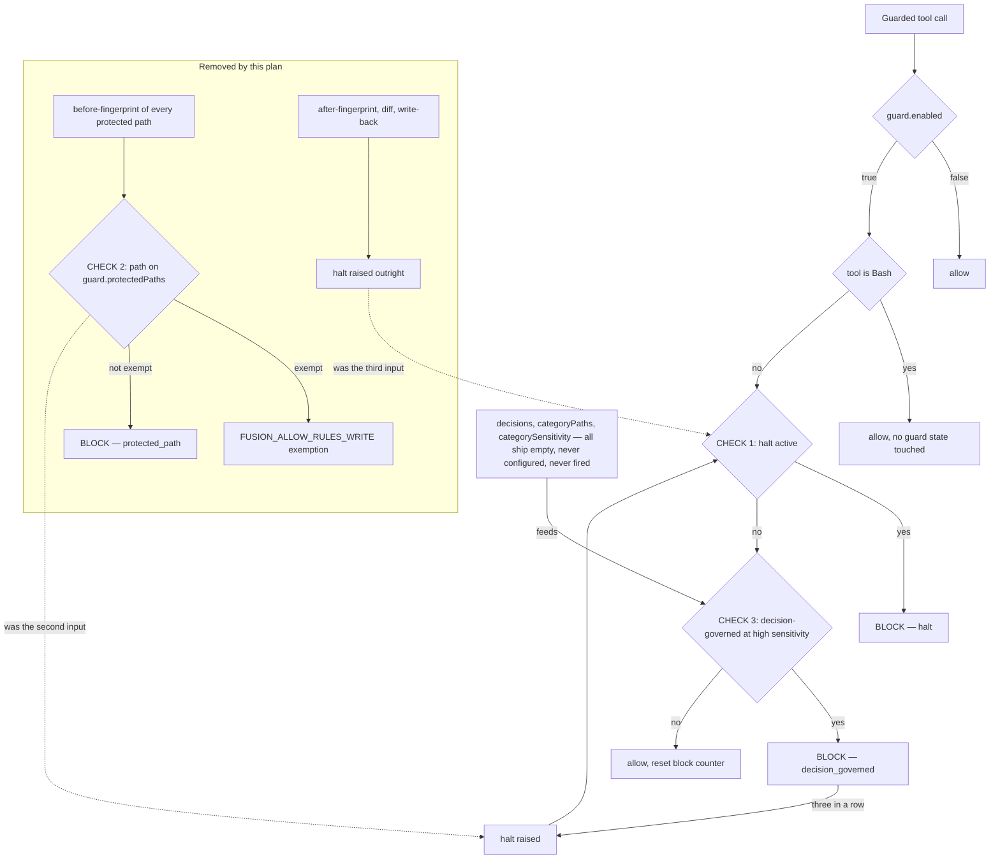
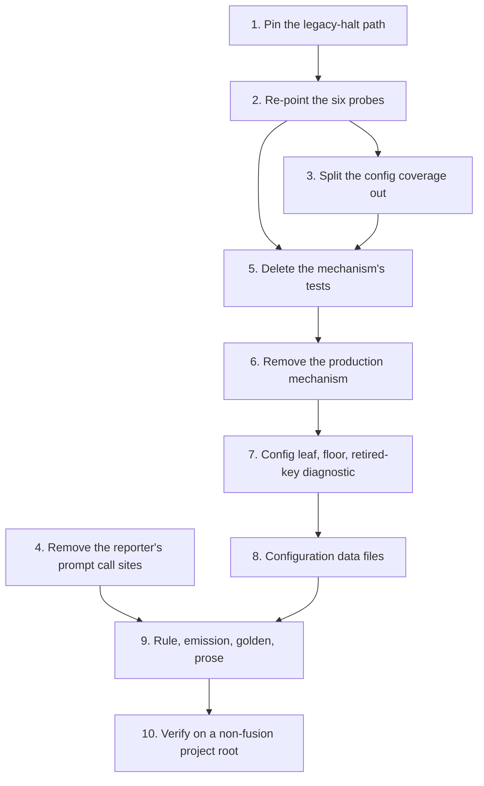

# Implementation Plan: Remove the protected-path half of the compliance guard

**Date:** 2026-08-12
**Status:** Complete — all ten steps landed; step 10's acceptance run is `shared/history/260812-1546-coder-acceptance-run-against-a-project-that-is-not-this-repository.md`
**Spec:** none — planned from a user decision recorded in `shared/issues/260812-0843_o_the-guard-and-its-configuration-must-be-simplified-project-settable-and-defaulted-to-fit-or-not-shipped-to-consumers-at-all.md`, section "Decided 260812-1230 by the user: option 2"
**Decidability:** The load-bearing question is whether anything still blocks a tool call once the protected-path half is gone. The escalation counter counts blocks toward a halt, so if protected paths were its only input, the guard collapses into churn counting behind a halt nobody can raise. The question is decidable from the inputs this plan has: every `block(...)` site is enumerable in the two hook entry points, and a live consuming project's event log records every block that has actually happened. The answer is that one input survives in code, the decision-governed check at `hooks/guard.ts:604-649`, and it ships with nothing to act on. That answer does not change the mechanism this plan builds; it changes what the *next* decision has to be, and it is filed as one rather than acted on here.

---

## Directive

Remove the protected-path half of the compliance guard: the before/after fingerprint pair, the write-tool deny that reads `guard.protectedPaths`, the `FUSION_ALLOW_RULES_WRITE` exemption that exists only to soften that deny, the configuration leaf and self-protection floor that feed it, the reporter released four hours before the decision, the always-on agent rule that explains it, and every test and prose surface that describes any of it.

The evidence is in the filed record and is not re-argued here. Two facts settled it. Across roughly 450 records in this project and its largest consumer there is no recorded instance of the failure the mechanism exists to prevent, and the mechanism has stood down in fusion's own tree since the first public release, which is the only tree where its patterns name what they say they name.

**Scope is the protected-path half only.** The escalation counter and the churn apparatus share `hooks/config.json` with it and are separately open in `shared/analyses/260812-0251-four-mechanisms-purpose-bindingness-and-cost.md`. Every place where this plan touches them, it says so and stops.

## Current State

### What blocks a tool call today, measured rather than reasoned

Three sites in `hooks/guard.ts` write a `decision: "block"` response, and one site in `hooks/tracker.ts` raises the halt that the first of them reads.

| Site | Trigger | What supplies its input |
|---|---|---|
| `guard.ts:458-491` (CHECK 1) | an active halt | not an independent source; a halt is raised only by the two rows below |
| `guard.ts:501-581` (CHECK 2) | `matchesAnyFolded(filePath, config.guard.protectedPaths)` | the plugin's `hooks/config.json`, eight patterns, inherited by every consumer |
| `guard.ts:604-649` (CHECK 3) | a `decisions` entry whose `categoryPaths` glob matches the written path, at `high` sensitivity | `config.decisions` plus `guard.categoryPaths` plus `guard.categorySensitivity` |
| `tracker.ts:593-599` | a protected path whose fingerprint moved during the call; raises the halt outright | the same eight patterns |

CHECK 3 ships inert in every layer. `hooks/config.json` declares `"decisions": []`, `"categoryPaths": {}` and `"categorySensitivity": {}`; `DEFAULTS` in `hooks/lib/config.ts:304-327` declares the same three empty. Neither consuming project on this machine declares any of them: `grep -c 'decisions\|categoryPaths' fusion-guard.json` returns 0 in `krk` and in `unite-co-creator`, whose files are documentation comments and nothing else.

The event log confirms the arithmetic. `krk/fusion-workbench/.guard-state/events.jsonl` holds 37,186 events. It carries 50 `guard_block` rows, every one of them with the detail `Protected path`, and every one of them dated between 2 and 7 August, which is the life of the deleted shell classifier. It carries zero `guard_halt` rows in its entire history and zero blocks of any kind since 7 August, the day the measurement replaced the prediction. No `decision_governed` block has ever been recorded in either project.

So the honest statement is a two-part one. In *code*, escalation is not orphaned by this removal: CHECK 3 remains a real input, and a project that fills `decisions`, `categoryPaths` and `categorySensitivity` gets blocks and can reach a halt. In *practice*, nothing that ships supplies that input, no project has ever configured it, and it has never fired. After this plan lands, the escalation counter's only reachable input is a mechanism that is inert by default in every project on earth.

This also corrects a sentence in `shared/analyses/260812-0251-four-mechanisms-purpose-bindingness-and-cost.md:190`, which reads "Escalation is driven only by the protected-path machinery." That is true of what has happened and false of what the code permits. It is filed as `shared/issues/260812-1232_o_the-four-mechanisms-analysis-says-escalation-has-one-input-and-the-code-has-two.md`.

**The same measurement answers a deferral trigger that has been standing since 11 August.** `shared/decisions/260809-1224_d_is-the-decision-governed-escalation-check-3-a-live-feature.md` asks whether CHECK 3 is a live feature or a retired one still carrying its configuration surface, and the user deferred it with an explicit re-open condition: measure whether any reachable consuming project populates `decisions` or the rest of CHECK 3's configuration, where a zero answer settles it as retired. The answer is zero in both projects reachable from this machine. That record is the user's to re-open and answer, and doing so unblocks recommendation C5 of `shared/analyses/260809-1101-guard-support-layer.md`, which has been blocked behind it since 9 August. It is not answered here.



The cycle between `RAISE` and `C1` is intentional and is the escalation design: a block feeds the counter, the counter raises the halt, and the halt blocks the next write until a human clears it. The graph shows what the plan leaves behind, which is that cycle with an input that nothing supplies.

### The consumer cost the removal answers

`shared/analyses/260812-0303-the-largest-consumer-read-for-the-first-time.md` measured 53 records in `unite-co-creator` that exist only because agents may not write files that project owns, across 143 days, against zero halts and no recorded prevention. The per-call cost is real and small: `protected-snapshot.ts` reads the content of every matching file twice per tool call, which in that project is roughly 360 KB and 30 file reads. The damage is the 53 records, not the milliseconds.

## Approach

One integral removal, staged so the test suite is green at every commit boundary. The staging is not a convenience here: this is the gate that guards every other change, and a red intermediate state would leave a reviewer unable to tell a removal defect from a rearrangement.

The ordering rests on one observation. The eleven test files that fail on an emptied list do not all *test* the protected-path mechanism. Six of them use a protected-path deny, or the sentence the measurement hands back, as the **probe** for something else: a malformed state file must not make the guard fail open, a malformed churn map must not swallow the tracker's reply, an innocuous `Bash` call must not reset the block counter. Those probes have a replacement that works identically before and after the removal, namely a decision-governed deny declared in the test project's own `fusion-guard.json`. Re-pointing the probes first makes every later deletion a deletion, and a deletion cannot turn the suite red.

The measurement that fixes the shape of the work was reproduced for this plan, against a scratch copy of the tree at `HEAD` with `guard.protectedPaths` emptied:

```
Test Files  11 failed | 42 passed (53)
     Tests  153 failed | 1202 passed | 8 skipped (1363)
```

That is exactly the 11 files and 153 cases the filed record measured at `5acc626`.

## Inventory

Every item the brief named, plus what tracing the imports turned up. "Goes" means deleted. "Changes" means it survives with a different subject or a corrected description. "Stays" means untouched.

### Hook source

| Item | Verdict | Why |
|---|---|---|
| `hooks/lib/protected-snapshot.ts` (802 lines) | **goes** | the fingerprint format, the walk, the diff, the restore, and `measurementRoot()`. No surviving caller: `guard.ts`, `tracker.ts` and `hooks/protected-paths.ts` are its only importers and all three lose the call. |
| `hooks/guard.ts` — the before-fingerprint at `:363-366` | **goes** | it exists to give `tracker.ts` something to compare against |
| `hooks/guard.ts` — CHECK 2 at `:501-581`, `isExemptRulePath`, `exemptionRefusalNote`, the `fsLocator` constant | **goes** | the deny and its one exemption |
| `hooks/guard.ts` — CHECK 1, CHECK 3, the `Bash` allow, the diagnostics loop, `collapseSegments`, `projectRelative` | **stays** | CHECK 3 still reads a collapsed, project-relative spelling, so the normalisation keeps its subject even though the deny above it goes |
| `hooks/guard.ts` — the `isFusionPluginCwd()` stand-down at `:405-415` | **changes** | the code stays; its stated subject ("the protected paths are the very files a fusion developer needs to edit") does not survive, and the comment must be rewritten to name what it now stands down: the halt and the decision-governed check. Whether it should survive its subject at all is a choice point beyond this plan and is filed as a decision record. |
| `hooks/tracker.ts` — job 1, `measureProtectedPaths`, `splitOffExempted`, `narrowingTarget`, `restorePath`, `preserve`, `describe`, `MeasuredOutcome`, `Preserved`, the `raiseHalt` import (`:196-656`) | **goes** | the comparison, the write-back and the halt |
| `hooks/tracker.ts` — jobs 0, 0b, 0c and 2 (state drift, review coverage, staging drift, churn) | **stays** | none of them reads a protected path. Churn is out of scope by the record and is not touched. |
| `hooks/lib/config.ts` — the `protectedPaths` leaf rule, the self-protection floor, `floorPaths`, `protectedPathsSource`, `projectDeclaredProtectedPaths`, the `GuardSettings.guard.protectedPaths` field | **goes** | every one of them exists for the removed list. The floor protects the configuration file against a mechanism that will not be there. |
| `hooks/lib/config.ts` — the three-layer per-leaf merge, `validateLayer`, the diagnostics, the `guard.enabled` refusal, `orchestrator.maxTurns`, `findRelevantDecisions` | **stays** | the loader still serves `defaultSensitivity`, `categoryPaths`, `categorySensitivity`, `decisions`, `escalation`, `churn` and the Turn budget |
| `hooks/lib/rules-write-exemption.ts` (838 lines) and the `FUSION_ALLOW_RULES_WRITE` flag | **goes** | it exists solely to exempt from the deny that is going |
| `hooks/lib/fs-locator.ts` (268 lines) | **goes** | its only production caller is `guard.ts:92`, which builds it for the exemption's filesystem gate |
| `hooks/lib/reverted-copy.ts` (188 lines) and `.guard-state/reverted/` | **goes** | it keeps the bytes a write-back overwrites, and there is no write-back |
| `hooks/protected-paths.ts` (268 lines) and `bin/fusion-protected-paths` | **goes** | released in v7.4.0 four hours before the decision. It was the right thing to build then, because it is what made the silent inheritance visible; it reports a list that stops existing. |
| `hooks/lib/paths.ts` — `matchesAnyFolded`, `canonicalise` | **goes** | `matchesAnyFolded` has two callers, `guard.ts:501` and `protected-snapshot.ts`, both removed. `canonicalise` has one, inside `rules-write-exemption.ts`. |
| `hooks/lib/paths.ts` — `matchesAny`, `matchesPattern`, `foldCase`, `collapseSegments` | **stays** | `matchesAny` serves `findRelevantDecisions` and the churn noise filter, `foldCase` serves the review-coverage store comparison at `tracker.ts:968`, `collapseSegments` serves the guard's path normalisation above CHECK 3 |
| `hooks/lib/escalation.ts`, `hooks/clear-halt.ts`, `hooks/lib/guard-state-file.ts` | **stays** | escalation is out of scope and `clear-halt.js` is the only way a halt is cleared, including a halt a consuming project is carrying from the old mechanism. `guard-state-file.ts` serves churn and escalation; its docstring cites the protected-path halt and needs a correction. |
| `hooks/lib/self-detect.ts` | **stays** | `isFusionPluginRoot` is still asked by the churn stand-down at `tracker.ts:1161`, and `isFusionPluginCwd` by the guard branch above |
| `hooks/lib/project-relative.ts`, `hooks/lib/churn.ts`, `hooks/lib/fail-open.ts`, `hooks/lib/events.ts`, `hooks/lib/workbench-root.ts` | **stays** | docstring corrections only where they describe the protected patterns |
| `hooks/session-start.ts` | **changes** | docstring only. Lines 13-16 and 29 describe the cwd-anchored protected-list match as the reason the subdirectory warning matters. The warning keeps its other reasons; that one goes. |
| `hooks/hooks.json` | **stays** | both hooks stay registered for churn, the measurement family and the two remaining checks |
| `bin/monitor` | **stays** | it renders `guard_block` and `guard_halt` rows, which CHECK 1 and CHECK 3 still write and which historical logs still carry |

### Configuration and data

| Item | Verdict | Why |
|---|---|---|
| `hooks/config.json` — the eight patterns | **goes** | the whole `protectedPaths` key. `escalation` and `churn` in the same file are untouched. |
| `hooks/config.example.json` — the same eight | **goes** | it documents the key shape and the key is gone |
| `templates/fusion-guard.json` | **changes** | four of its documentation keys are about the removed mechanism: `_inherits`, `_override` (in part), `_protectsItself`, `_inFusionsOwnSourceTree`. `_what`, `_turnBudget`, `_guardEnabled` and `_gitTracked` survive. |
| root `fusion-guard.json` | **changes** | pinned byte-identical to the template by `config.test.ts`, so it moves in the same commit |
| `.guard-state/protected-snapshot.json` and `.guard-state/reverted/` in existing workbenches | **stays where it is** | inert leftovers under a gitignored directory. No cleanup mechanism is added for them; `/fusion:cleanup` already sweeps the workbench. |

### Tests

Eleven files fail on an emptied list. The table gives the count each file holds, the count that fails, and which of the brief's three categories it is in.

| File | Tests | Fail | Verdict |
|---|---|---|---|
| `guard-rules-write-integration.test.ts` | 111 | 66 | **split.** Nine of its thirteen describes are the exemption, the floor and the declared-list replacement, and go. Four are the project configuration reaching the guard at all — an unparseable file reported rather than swallowed, what a project config can and cannot reach, and the plugin-repo case — and are real coverage of a loader that stays. They move to a new file. |
| `protected-snapshot-integration.test.ts` | 39 | 28 | **goes**, with one exception. Its "the halt no longer reaches the shell" describe duplicates `guard-halt-event.test.ts`, which keeps that subject. |
| `guard-case-folding.test.ts` | 20 | 18 | **goes.** Its subject is that the protected list folds case, and the unit-level coverage of `matchesAnyFolded` in `paths.test.ts` goes with the function. What it leaves behind is a live question, not a coverage gap: `findRelevantDecisions` matches `categoryPaths` case-sensitively, so the defect this file was written from (`260802-2320`, the whole list bypassable by shifting one letter) applies verbatim to the only block source that survives. That question is already filed, as the deferred decision `circles/260801-1244-guard-rules-write/decisions/260804-1632_d_should-findrelevantdecisions-fold-case-now-that-a-project-can-configure-categorypaths.md`, and this plan changes one of its stated constraints rather than raising it fresh. It is not fixed here, because the fix is a change to the decision-governed mechanism and this plan holds its scope. |
| `config.test.ts` | 85 | 15 | **rewrite.** The loader's merge, validation, diagnostics and `guard.enabled` coverage is the file's subject and it stays. Fifteen cases use `protectedPaths` as the fixture leaf; they re-point at `defaultSensitivity`, `escalation.blocksBeforeHalt` and `categoryPaths`. The cases about `protectedPathsSource`, `floorPaths` and `projectDeclaredProtectedPaths` go with the fields. |
| `guard-escalation-shape.test.ts` | 12 | 9 | **rewrite.** Subject: a shape-valid but wrong `escalation.json` used to make the whole guard fail open and allow. That is escalation coverage, not protected-path coverage, and it is worth keeping. It uses `Edit agents/coder.md` as the deny it needs; the replacement is a decision-governed deny. |
| `guard-state-shape.test.ts` | 9 | 7 | **rewrite.** Subject: a shape-valid but wrong `churn.json` used to swallow the tracker's reply. Churn stays, so this stays. Its probe was the protected-path sentence; the replacement is the state-drift sentence, with the review-coverage sentence as the fallback if state drift proves awkward to trigger in the harness. |
| `guard-bash-integration.test.ts` | 15 | 4 | **rewrite.** Subject: the `Bash` branch inspects nothing, allows, and has zero effect on guard state, which is the pair of defects `260707-0750` and `260707-0751`. Four cases need a deny to exist in order to prove the counter was not reset; the decision-governed deny supplies one. |
| `hook-fail-open.test.ts` | 17 | 2 | **rewrite.** Subject: a verdict the hook already reached survives its own bookkeeping. Fifteen cases are generic and pass untouched; two use a protected-path deny and a protected-path sentence as the verdict. |
| `guard-halt-event.test.ts` | 3 | 1 | **rewrite.** Subject: a reader of `events.jsonl` can tell the two `guard_halt` sources apart. One source goes, so the file shrinks to the surviving distinction plus "the halt does not reach the shell", which it already holds. |
| `protected-snapshot-subdirectory.test.ts` | 4 | 2 | **goes.** Its lesson, that a root-anchored measurement needs a root-anchored stand-down, survives in `churn-key-anchor.test.ts` for churn and in `session-start-subdirectory.test.ts` for the warning. |
| `fusion-protected-paths.test.ts` | 14 | 1 | **goes** with the reporter it covers. |

Two more files go although they pass on an emptied list, because their subject is a module this plan deletes: `rules-write-exemption.test.ts` (160 cases, 0.1 s) and `fs-locator.test.ts` (25 cases). `paths.test.ts` loses its `matchesAnyFolded` and `canonicalise` describes and keeps the rest. `helpers/guard-harness.ts` stays — fifteen test files import it — and sheds the `rules/x.md` and `agents/coder.md` fixtures it seeds by default at `:224-225`.

One number is worth stating because it is the plan's only measurable side benefit. `guard-rules-write-integration.test.ts` accounts for 119.8 seconds of test time in a suite whose wall clock is 83 seconds; `protected-snapshot-integration.test.ts` adds 64.1 and `guard-case-folding.test.ts` 28.1. Removing them and keeping the four surviving describes takes roughly 200 seconds of parallel test work out of the suite.

### The always-on rule

`rules/protected-path-discipline.md` is **10,541 bytes**, emitted to all sixteen agents on every dispatch. The always-on floor is 98,443 bytes per dispatch: 91,090 bytes of shipped rules (`agent-setup.md` 3,513 + `fusion-workbench-conventions.md` 46,124 + `decision-record-examples.md` 4,291 + `user-facing-output.md` 16,784 + `critical-stance.md` 9,837 + `protected-path-discipline.md` 10,541) plus the 7,353-byte chat voice profile. Removing it is a straight subtraction of **10.7 percent of every dispatch's rule context**, measured off `hooks/lib/__tests__/fixtures/rules-emission.golden`, which carries the same figure in all sixteen role blocks.

It is cited in twelve places outside the workbench, and they do not all behave the same way:

- `bin/fusion-rules:403` (the `emit_if_exists` line) and `:47` (the comment above it) — the emission itself.
- `README-hooks.md:15`, `:301`, `:307`; `CLAUDE.md:25`, `:60`; `README-agents.md:157` — prose citations, removed.
- `hooks/lib/churn.ts:214` and `hooks/lib/guard-state-file.ts:15` — docstrings on modules that **stay**. Both cite the rule as the failure a `{}` state file used to produce. They are rewritten, not deleted, and this is the one place where the removal reaches into the churn apparatus. It reaches its prose and stops there.
- `hooks/lib/__tests__/rules-emission-golden.test.ts:26`, `:246`, `:316`, and the budget entry `"protected-path-discipline.md": 19_943` at `:339` — the golden's own history and cap table.
- `fixtures/rules-emission.golden` — sixteen lines, one per role block, regenerated rather than hand-edited.

Two lint gates make this a single indivisible commit. `reference-resolution-lint.test.ts` fails if the rule file is deleted while any prose still cites it. `derivable-enumerations-lint.test.ts` re-derives the always-on rule list from `bin/fusion-rules` and diffs it against the documented claim, so it fails if the prose stops naming the rule while the emission line still stands. The file, the emission line, the golden and every prose citation therefore move together.

### Prose surfaces

| Surface | Verdict |
|---|---|
| `README-hooks.md` (41 mentions) | **changes.** The largest single edit. The whole "Protected paths are measured, not predicted" section goes, along with the protected-path rows of the `hooks/lib` file table, the tuning table's `protectedPaths` rows, the per-project configuration section's floor and declared-list paragraphs, and the `FUSION_ALLOW_RULES_WRITE` row. "Three things cause a block" becomes two. |
| `CLAUDE.md` (7 mentions) | **changes.** The `hooks/` layout row, the guard-rule convention bullet, the `bin/fusion-protected-paths` row if present, the opening self-detect paragraph, and the "Where to look when something breaks" row about a written-back protected path. |
| `README.md` (6 mentions) | **changes.** The guard bullet, the tuning table, and the "only three things ever block a write" line. |
| `README-agents.md:157` | **changes.** The always-on core list loses one entry. |
| `docs/philosophy.md:17` | **changes.** "Agent definitions, rules and workbench state are protected paths" is the load-bearing claim in the compliance principle and has to be rewritten rather than trimmed. |
| `docs/working-model.md:82,84,96` | **changes.** "Only three things ever block a write" becomes two. |
| `agents/orchestrator.md` Setup Step 5 | **changes.** The `bin/fusion-protected-paths` block and its explanatory paragraph go. The halt check immediately above it **stays**, and that is deliberate: it is what tells a user their guard is halted, including from the old mechanism. |
| `skills/setup/SKILL.md:265` | **changes.** The bullet pointing at the orchestrator's block goes. |
| `templates/fusion-guard.json`, root `fusion-guard.json` | **changes**, as above. |
| Workbench records under `fusion-workbench/` | **stays.** Historical records are not rewritten. Existing decision records about the mechanism keep their terminal markers; the two that this removal supersedes are named in the closing step. |

## Implementation Steps

1. [DONE] **Pin the legacy-halt path before anything moves**
   - Executor: `coder`
   - Files: `hooks/lib/__tests__/legacy-halt-clearing.test.ts` (new)
   - Changes: a case that writes an `escalation.json` with `haltActive: true` and a `recentEvents` entry whose `trigger` is `protected_path_measured`, a shape the new code will never produce. Assert that the guard loads it, blocks a write tool at CHECK 1, and that the block message names the `cd <project-root> && node <plugin>/hooks/dist/clear-halt.js` command in full; then that `clear-halt.js` clears it and reports success. Do the same for a `protected_path` trigger. This passes today and must pass after every later step, which is what makes it the migration guarantee rather than a note in a README.
   - Dependencies: none

2. [DONE] **Re-point the probes in the six test files whose subject survives**
   - Executor: `coder`
   - Files: `hooks/lib/__tests__/guard-escalation-shape.test.ts`, `guard-state-shape.test.ts`, `hook-fail-open.test.ts`, `guard-bash-integration.test.ts`, `guard-halt-event.test.ts`, `config.test.ts`, `helpers/guard-harness.ts`
   - Changes: give the harness a way to seed a project `fusion-guard.json` declaring a `decisions` entry, a matching `categoryPaths` glob and `categorySensitivity: "high"`, so a deny can be produced without a protected path. Re-point every deny probe at it. In `guard-state-shape.test.ts` re-point the tracker-reply probe at the state-drift sentence; if state drift proves hard to trigger reliably inside the harness, use review coverage instead and say in the file header which was chosen and why. In `config.test.ts` re-point the fifteen fixture cases at `defaultSensitivity`, `escalation.blocksBeforeHalt` and `categoryPaths`, and leave the `protectedPathsSource`, `floorPaths` and `projectDeclaredProtectedPaths` cases untouched for now. No production file changes in this step; the suite is green before and after.
   - Dependencies: 1

3. [DONE] **Split the surviving coverage out of the exemption integration file**
   - Executor: `coder`
   - Files: `hooks/lib/__tests__/guard-project-config-integration.test.ts` (new), `hooks/lib/__tests__/guard-rules-write-integration.test.ts`
   - Changes: move the four describes that are about the project configuration reaching the guard — "an unparseable project configuration is reported, not swallowed" (`:1713`), "what a project configuration can and cannot reach — measured" (`:1819`), "the project configuration in the plugin's own repo" (`:2141`), and the harness precondition cases at `:47` those three depend on — into the new file, with their probes re-pointed as in step 2. Delete them from the original. The header of the new file states what it covers and why it was carved out.
   - Dependencies: 2

4. [DONE] **Remove the two prompt call sites for the reporter**
   - Executor: `coder`
   - Files: `agents/orchestrator.md`, `skills/setup/SKILL.md`
   - Changes: delete the "Effective protected paths" bullet and its shell block from orchestrator Setup Step 5, and the pointer bullet at `skills/setup/SKILL.md:265`. Keep the guard halt check in the step immediately above. Grep `CLAUDE.md` for a `bin/fusion-protected-paths` row in the layout table and remove it in the same commit if one is there, because `reference-resolution-lint` will resolve it against a file that step 6 deletes.
   - Dependencies: none

5. [DONE] [NOTE: not green by construction — the harness seeds it drops are used by guard-bash-integration.test.ts, corrected in steps 1-3] **Delete the tests whose subject is the removed mechanism**
   - Executor: `coder`
   - Files: `hooks/lib/__tests__/guard-case-folding.test.ts`, `protected-snapshot-integration.test.ts`, `protected-snapshot-subdirectory.test.ts`, `rules-write-exemption.test.ts`, `fs-locator.test.ts`, `fusion-protected-paths.test.ts`, `guard-rules-write-integration.test.ts`, `paths.test.ts`, `helpers/guard-harness.ts`
   - Changes: delete the first seven files outright. In `paths.test.ts` delete the `matchesAnyFolded` describe and the `canonicalise` case, keeping `matchesAny`, `matchesPattern`, `foldCase` and `collapseSegments`. In the harness, drop the `rules/x.md` and `agents/coder.md` default fixtures at `:224-225` and any helper that exists only to build a protected-path payload. Deletion cannot make the suite red, so this boundary is green by construction.
   - Dependencies: 2, 3

6. [DONE] **Remove the production mechanism**
   - Executor: `coder`
   - Files: `hooks/guard.ts`, `hooks/tracker.ts`, `hooks/lib/protected-snapshot.ts`, `hooks/lib/rules-write-exemption.ts`, `hooks/lib/fs-locator.ts`, `hooks/lib/reverted-copy.ts`, `hooks/protected-paths.ts`, `bin/fusion-protected-paths`, `hooks/lib/paths.ts`, `hooks/session-start.ts`
   - Changes: delete the six modules and the shell wrapper. In `guard.ts` remove the before-fingerprint, CHECK 2, `isExemptRulePath`, `exemptionRefusalNote` and the `fsLocator` constant, and rewrite the file header and the `isFusionPluginCwd()` stand-down comment to name the two checks that remain. In `tracker.ts` remove job 1 and everything reachable only from it. In `paths.ts` remove `matchesAnyFolded` and `canonicalise` and verify by grep that `matchesAny`, `matchesPattern`, `foldCase` and `collapseSegments` each keep a caller. Correct the `session-start.ts` docstring. Run `npm run build` before the suite: a stale `hooks/dist/` will pass a suite that the source no longer supports.
   - Dependencies: 5

7. [DONE] **Remove the configuration leaf, the floor and the reports, and add the retired-key diagnostic**
   - Executor: `coder`
   - Files: `hooks/lib/config.ts`, `hooks/lib/__tests__/config.test.ts`
   - Changes: remove `protectedPaths` from `GuardSettings`, from `CONTAINER_LEAF_RULES`, from the merge, and remove `floorPaths`, `protectedPathsSource` and `projectDeclaredProtectedPaths` with the floor computation at `:723-754`. Add one diagnostic for a project that still declares `guard.protectedPaths`, in the same shape and with the same loudness as the existing `guard.enabled` refusal at `:625-630`: the key is named, the reason given is that the mechanism was removed, and the advisory repeats on every guarded tool call until the line is taken out of the file. Delete the `protectedPaths` cases from `config.test.ts` and add cases for the new diagnostic in the same commit.
   - Dependencies: 6

8. [DONE] [NOTE: the diagnostic's per-guarded-call property is pinned in `guard-project-config-integration.test.ts`, which step 7 does not list; `readLayer`'s absent-plugin-file diagnostic and the template's `_gitTracked` note both named the removed key and were corrected here] **Update the configuration data files**
   - Executor: `ontocoder`
   - Files: `hooks/config.json`, `hooks/config.example.json`, `templates/fusion-guard.json`, `fusion-guard.json`
   - Changes: delete `guard.protectedPaths` from `hooks/config.json` and `hooks/config.example.json`, leaving `escalation` and `churn` exactly as they are. In the template, delete `_inherits`, `_protectsItself` and `_inFusionsOwnSourceTree`, and rewrite `_override` so its worked example uses `defaultSensitivity` rather than the protected list and its inheritance paragraph no longer describes a list. Keep `_what`, `_turnBudget`, `_guardEnabled` and `_gitTracked`. Copy the result byte-identically to the root `fusion-guard.json`, which `config.test.ts` pins.
   - Dependencies: 7

9. [DONE] [NOTE: README-hooks.md was partly edited in step 6 — two lint gates forced it. It is now MORE internally inconsistent, not handled.] [NOTE: three surfaces the step-9 list did not carry had to move with it — `hooks/lib/project-relative.ts`, `skills/`, and `rules/critical-stance.md`; and `reference-resolution-lint`'s EXAMPLE_PATHS lost the last citation of three entries when the rule file went.] **Remove the always-on rule, its emission, its golden and every prose citation, in one commit**
   - Executor: `coder`
   - Files: `rules/protected-path-discipline.md`, `bin/fusion-rules`, `hooks/lib/__tests__/fixtures/rules-emission.golden`, `hooks/lib/__tests__/rules-emission-golden.test.ts`, `README-hooks.md`, `README.md`, `README-agents.md`, `CLAUDE.md`, `docs/philosophy.md`, `docs/working-model.md`, `hooks/lib/churn.ts`, `hooks/lib/guard-state-file.ts`
   - Changes: delete the rule file, its `emit_if_exists` line at `bin/fusion-rules:403` and the comment at `:47`; regenerate the golden with `UPDATE_RULES_GOLDEN=1 npx vitest run lib/__tests__/rules-emission-golden.test.ts` rather than hand-editing it, and drop the budget entry at `:339`; remove every prose citation listed in the inventory. Rewrite, do not delete, the two surviving docstring citations in `churn.ts:214` and `guard-state-file.ts:15`: both describe a real defect class and both must keep saying so without pointing at a rule that is gone. In `README-hooks.md`, `README.md` and `docs/working-model.md` the sentence "three things cause a block" becomes two, naming the halt and the decision-governed path. This commit cannot be split, because `reference-resolution-lint` and `derivable-enumerations-lint` fail on opposite halves of it.
   - Dependencies: 4, 8

10. [DONE] **Verify against a project that is not this repository**
    - Executor: `coder`
    - Files: none in the tree; a session history entry under `$OUT_HISTORY`
    - Result: all six checks passed from the project root and from a subdirectory, and the four
      additions were confirmed: the retired-key advisory repeats once per guarded tool call with no
      cap (428 bytes a row, 418 KiB per 1 000 calls), it fires for a plugin-layer declaration as well
      as a project one, `fusion-guard.json` is writable by an agent and the write survives the
      PostToolUse hook, and the decision-governed check denies, raises the halt on the third deny and
      clears. Two findings were filed, neither a failed check:
      `shared/issues/260812-1546_o_check-3-the-guards-only-remaining-block-source-allows-from-any-subdirectory-and-nothing-tests-it.md`
      and `shared/issues/260812-1546_o_the-record-of-the-floors-loss-does-not-say-the-file-it-stopped-defending-arms-the-last-block-source.md`.
      Measurements: `shared/history/260812-1546-coder-acceptance-run-against-a-project-that-is-not-this-repository.md`.
    - Changes: the release process requires that a guard change be verified against a project root that is not the plugin's own, because the self-detect stand-down makes local testing unrepresentative by construction. Stand up a scratch consuming project with a workbench and confirm, from its root and from a subdirectory: a write to `rules/x.md` is allowed and emits `guard_allow`; a `Bash` call still emits nothing and does not reset the block counter; churn events still land; a handcrafted legacy halt still blocks and still clears; a project declaring `guard.protectedPaths` gets the retired-key advisory and nothing else; and `.guard-state/` grows no `protected-snapshot.json`. Record the measurements in the history entry.
    - Dependencies: 9



## Data Structures

`GuardSettings` loses one field and `GuardConfig` loses two reports:

```ts
// before
guard: { enabled; defaultSensitivity; protectedPaths; categoryPaths; categorySensitivity }
// plus, on GuardConfig: protectedPathsSource: ConfigLayer; floorPaths: string[]

// after
guard: { enabled; defaultSensitivity; categoryPaths; categorySensitivity }
```

`ProtectedSnapshot`, `ProtectedChange`, `MeasuredOutcome`, `Preserved`, `FsLocator`, `RulesWriteRefusal` and `StandDown` are deleted with their modules. `ConfigLayer` survives, because `readLayer` and `validateLayer` still distinguish the project and plugin layers.

## API Changes

`bin/fusion-protected-paths` is withdrawn. It was released in v7.4.0 and has one release of exposure, so no consumer can reasonably be depending on it; the two call sites in the shipped prompts are removed in step 4. There is no replacement, because there is no list to report.

No other `bin/` helper's contract moves. `bin/fusion-rules` emits one fewer path, which is a change to its output and is caught by the golden.

## Testing Strategy

The suite is the gate here, so the strategy is the step ordering rather than a set of new assertions. Three things are asserted that are not asserted today.

First, the legacy halt. Step 1 pins that a halt raised by a trigger the code no longer produces still loads, still blocks, and still clears, and it is written before the surgery so that no later step can break it quietly.

Second, the retired key. Step 7 pins that a project declaring `guard.protectedPaths` is told the key does nothing, on every guarded call, rather than having it silently carried through as an unknown key. Without this the loader's existing behaviour applies: `validateLayer` passes an unrecognised key through untouched and undiagnosed, which is right for the template's documentation keys and wrong for a key that used to mean something.

Third, the live verification in step 10. The guard's stand-down in this repository means a green suite here is necessary and not sufficient.

Two things are deliberately not re-tested. Churn behaviour is unchanged and its own tests cover it. The escalation counter is unchanged, and `escalation.test.ts` plus the re-pointed `guard-escalation-shape.test.ts` cover it.

## Risks & Mitigations

| Risk | Mitigation |
|---|---|
| The decision-governed deny turns out not to be constructible in the harness, and step 2's re-pointing has no probe | It is constructible: `config.test.ts` already declares `decisions` from the project layer, and `categoryPaths` and `categorySensitivity` are ordinary project-settable leaves. If it fails in practice, the fallback is to keep one narrow protected-path fixture alive until step 6 and re-point at the CHECK 1 halt instead, which needs no configuration at all. The executor reports which it used. |
| The state-drift sentence is awkward to trigger inside the harness, so `guard-state-shape.test.ts` loses its probe | Review coverage and staging drift are two further tracker replies, and `review-coverage.test.ts` and `staging-drift.test.ts` already drive both through the harness. Step 2 names state drift as the first choice and requires the file header to record whichever was used. |
| A stale `hooks/dist/` makes step 6 look green when the source is broken | `npm test` runs `npm run build` first, and step 6 states it explicitly because the deletion of six modules is exactly the case where a leftover compiled file hides a missing import. |
| A consuming project upgrades while halted and is left blocked by a mechanism that no longer exists | `clear-halt.js` stays, the CHECK 1 message keeps naming it in full, and step 1 pins both against a legacy trigger. The halt is not auto-cleared, which is deliberate: a halt is a state a human decided to be in, and silently clearing one on upgrade would be a second surprise on top of the first. |
| The removal is read as also removing the escalation counter or the churn apparatus | Every step that touches their files says which lines it touches and stops. The two docstring corrections in `churn.ts` and `guard-state-file.ts` are the deepest the plan reaches into either. |
| `docs/philosophy.md`'s compliance principle loses its worked example and becomes vague | It is called out as a rewrite rather than a trim in step 9. The principle survives on the churn warning, the decision-governed check and the Human Gate, all of which are still there. |
| The 200 seconds of test time removed encourages a further sweep in the same commits | Nothing in this plan touches `fusion-plane.test.ts` (90.5 s, the second-largest), which is a separate open question in the complexity analysis. |

## Open Questions

- [ ] **Is CHECK 3 live or retired?** Already filed and deferred as `shared/decisions/260809-1224_d_is-the-decision-governed-escalation-check-3-a-live-feature.md`, with a re-open trigger this plan's measurement meets: zero of the reachable consuming projects populate `decisions` or `guard.category*`. By that record's own terms the zero settles it as retired. Re-opening and answering it is a small self-contained act for the user, and it unblocks recommendation C5 of `shared/analyses/260809-1101-guard-support-layer.md`.
- [ ] **The escalation counter's only remaining input ships inert.** Once this plan lands, a block can arise only from the decision-governed check. If that check is then retired on the answer above, escalation has no input at all: roughly 923 lines in `escalation.ts` plus 295 in `clear-halt.ts`, a state file, two event types and a monitor row type behind a halt nothing can raise. The two removals compose into something neither decides alone, so it is filed as the successor question with the measurement attached: `shared/decisions/260812-1232_o_does-the-escalation-counter-survive-a-block-source-that-ships-inert.md`. It is not this plan's to take, and it must not enlarge this plan.
- [ ] **Does the write guard's stand-down in fusion's own repository survive its subject?** `isFusionPluginCwd()` at `guard.ts:405` stands the write tools down here because the protected paths are what a fusion developer edits. After the removal it stands down a halt and a decision-governed check instead, which is a different thing and was never argued for. Step 6 keeps the code and corrects the comment. Filed as `shared/decisions/260812-1232_o_does-the-write-guards-fusion-repo-stand-down-survive-the-loss-of-its-subject.md`.
- [ ] **Does the decision-governed match need case folding?** Already filed and deferred, on 2026-08-04, as `circles/260801-1244-guard-rules-write/decisions/260804-1632_d_should-findrelevantdecisions-fold-case-now-that-a-project-can-configure-categorypaths.md`. No new record is opened for it. What this plan changes is one of that record's stated constraints: it says "This is CHECK 3, not CHECK 2" and that `guard.protectedPaths` is matched folded and is unaffected either way. After the removal there is no CHECK 2 and no folded match anywhere, so the decision-governed match is the only path match in the guard, and the reason for deferring it (five security-boundary questions competing for one Circle's attention) no longer holds. The record should be reopened or re-deferred deliberately once the escalation question below is answered, and it is contingent on it: if escalation goes, this question goes with it.
- [ ] **Which existing decision records does this supersede?** At least `circles/260804-1205-shell-reachability-model/decisions/260807-0825_i_should-the-guard-predict-shell-writes-or-enforce-them.md`, and in `circles/260801-1244-guard-rules-write/decisions/` the records `260802-1912_i_does-the-self-protection-floor-apply-before-the-config-file-exists.md`, `260803-1314_i_may-a-project-protect-a-path-inside-its-own-rule-directory-against-the-rules-write-flag.md` and `260803-1419_i_how-should-the-protected-path-check-treat-the-case-of-a-path.md` are implemented decisions whose subject this plan deletes. The `_i_` to `_s_` walk is the one allowed terminal-to-terminal transition and belongs to a reconciler pass after step 10, not to a step here.

---

## Filed alongside this plan

Two defect records and two decision records. None of them is a step in this plan.

| Record | Kind | What it is |
|---|---|---|
| `shared/issues/260812-1232_o_the-four-mechanisms-analysis-says-escalation-has-one-input-and-the-code-has-two.md` | defect | a load-bearing sentence in an analysis is inexact about the escalation counter's inputs |
| `shared/issues/260812-1232_o_thirty-four-of-seventy-four-decision-records-carry-a-status-header-that-contradicts-their-filename-marker.md` | defect | found while reading the decision store for this plan; not caused by it |
| `shared/decisions/260812-1232_o_does-the-escalation-counter-survive-a-block-source-that-ships-inert.md` | decision | the successor to `260809-1224_d`, carrying the measurement its deferral trigger asked for |
| `shared/decisions/260812-1232_o_does-the-write-guards-fusion-repo-stand-down-survive-the-loss-of-its-subject.md` | decision | whether `isFusionPluginCwd()` should keep standing the guard down here once the protected paths are gone |

Two questions this plan raised turned out to be already on record and were **not** re-filed: `circles/260801-1244-guard-rules-write/decisions/260804-1632_d_should-findrelevantdecisions-fold-case-now-that-a-project-can-configure-categorypaths.md` and `shared/decisions/260809-1224_d_is-the-decision-governed-escalation-check-3-a-live-feature.md`. Both are cited from the Open Questions above with what this plan changes about them.
