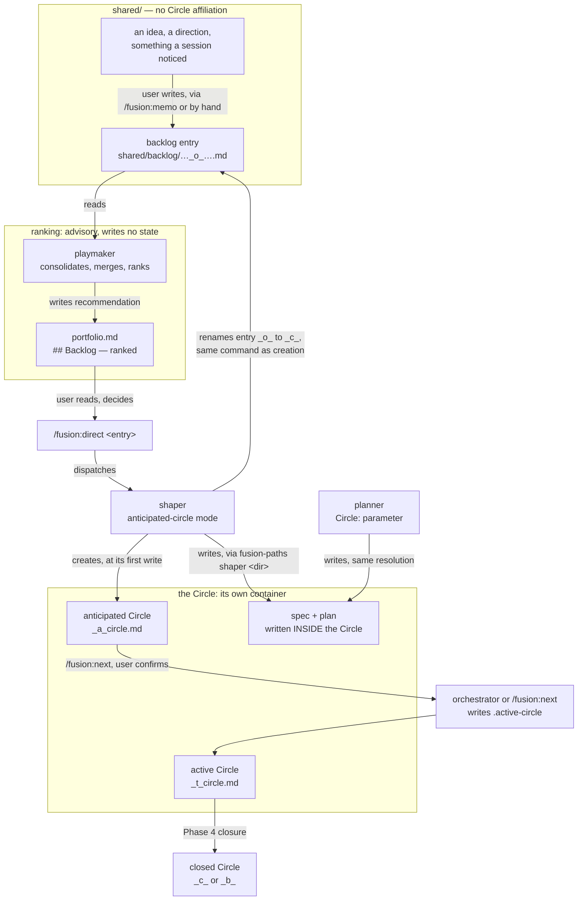
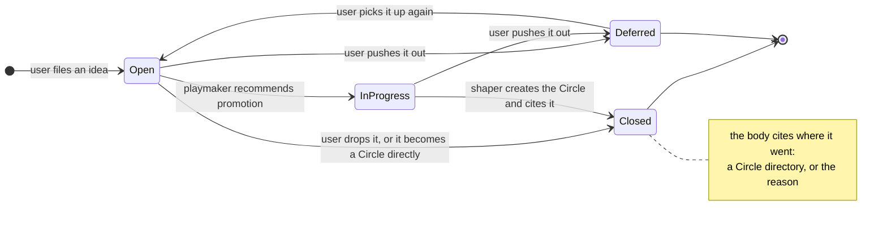
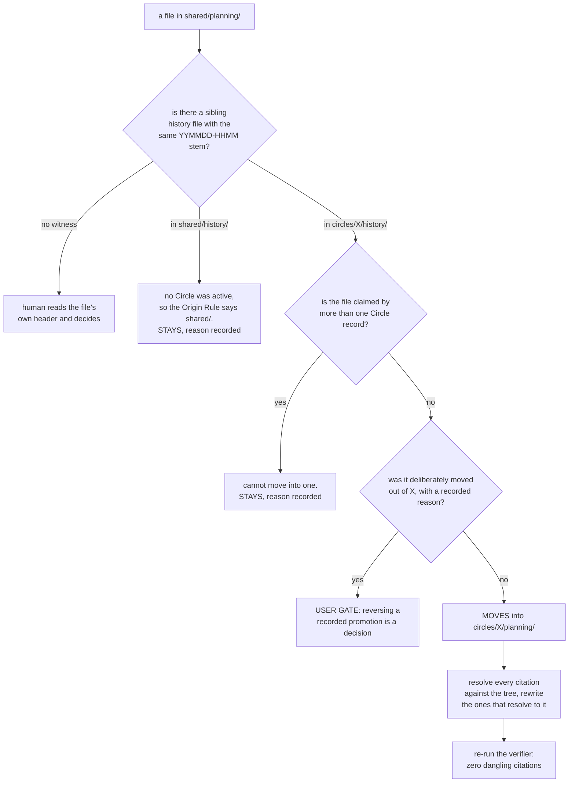

# Implementation Plan: the Circle comes first, and the backlog store the playmaker keeps

**Date:** 2026-08-12
**Status:** Complete — steps 1–11, 13 and 14 done; step 12 did not run (its gate answered *leave it*, so the migration moves nothing).
**Spec:** none. Planned from two answered decision records that are one design:
`260812-0254_*_where-do-a-circles-spec-and-plan-belong-when-the-circle-exists-before-them.md`
and `260812-0254_*_does-fusion-need-a-backlog-store-and-a-maintainer-that-anticipates-circles.md`,
both answered by the user at 260812-1620.
**Decidability:** The load-bearing question is *"which citations point at a file this migration
moves?"*, and asked of the citation **text** it is not decidable from the inputs a text search
has. Measured over the seven candidate files in `shared/planning/`: 184 references exist, and 91
of them (49 per cent) do not contain the file's current filename. They carry a stale marker
(`_o_` where the file is now `_c_`, seven times for one file alone), a wildcard (`_*_`), the
pre-v4 bracket form (`260717-1918[o]`, thirteen times), a trailing ellipsis
(`260809-1229_*_…`), a `fusion-workbench/` prefix, a Circle-relative `planning/`
prefix, or a bare timestamp. Matching the exact filename under-reports by half. Matching the
timestamp stem over-reports, because a stem is not unique across artifact kinds: `260812-1232`
names one plan, two decision records, one defect record and one session history, all written in
the same minute. No refinement of the pattern closes both gaps at once, so per
`rules/critical-stance.md` §4 the **mechanism** changes rather than the pattern.

It changes twice, and both changes are reuse rather than new machinery.

*First, the question is asked of the resolved target instead of of the string.*
`hooks/lib/__tests__/reference-resolution-lint.test.ts` already parses this exact citation
grammar (wildcard marker, exact marker, store and Circle prefixes, ellipsis truncation) and
resolves each token against the tree, failing on a dangling one. What it does not do is scan
`fusion-workbench/` itself, which is where the migration's citations live. Pointing its existing
parser at the workbench corpus turns "does this string mention the file" into "does this citation
resolve to a file this migration moves", which is a fact on disk rather than a guess about text.

*Second, the moving set is measured before it is moved, and measurement makes it nearly empty.*
Each spec and plan has a **sibling session-history file** written by the same agent run, under
the same `fusion-paths` call, carrying the same `YYMMDD-HHMM` stem. Where that history sits
answers where `OUT_*` resolved at the moment of writing, and therefore whether a Circle was
active. Checked for all seven, one witness each, no ambiguity: six sit in `shared/history/`, one
sits in `circles/260716-1847-workbench-umbau/history/`. The moving set is at most one file rather
than fourteen, and a citation problem over one file is decidable by reading it.

One residual is stated rather than hidden. A bare timestamp in running prose ("the 260722-1943
spec") carries no store, no kind and no slug, and nothing on disk disambiguates it from the four
other artifacts that may share its minute. There are roughly eight such tokens across the seven
files. They are enumerated for a human at step 11's gate rather than rewritten by a machine.

---

## Directive

Make a Circle exist before the shaper runs, so that a Circle's own spec and plan are written
inside it and never have to move. Add `shared/backlog/` as the home for an idea that is not yet a
unit of work, and give the playmaker the job of consolidating that store and proposing which
entry becomes a Circle. Then bring the existing workbench to the new placement rule, moving what
genuinely has a Circle origin and recording, for each file that stays, the measured reason it
stays.

## What this removes, and what it does not

The session this plan sits in began from a finding that fusion's binding constraint is the rate
at which it adds things. This change adds a store, a job, a resolver argument and a migration.
The honest accounting:

**It removes nothing structural.** No agent goes. No store goes. `shared/planning/` stays,
because a plan written with no Circle at all is routine, and six of the seven files there are
exactly that. `taskplanner` and `tasklist.md` stay untouched, and deliberately: whether they
retire into the backlog is option 4 of the backlog decision, and the user left it undecided. This
plan does not fold it in, and step 1 writes that non-decision into the rule text so a later
reader does not assume the queue was absorbed.

**It removes three passages and one recurring confusion.**

- `rules/circle-records.md` currently spends five lines explaining why `Active spec/plan:` must
  hold a full path. The first of its two reasons stops being true: "a spec written before the
  Circle existed lands in `shared/planning/`; every `/fusion:direct` run produces one". The field
  stays a path, because the second reason (migrated pre-v4 Circles) survives, and the explanation
  halves.
- `/fusion:direct` step 4 carries a paragraph reassuring the reader that a spec landing in the
  shared store "is correct and expected, not a migration defect". It goes.
- `agents/shaper.md` mode 3 carries the same reassurance in its own words. It goes.

**It simplifies one thing genuinely.** The shaper's four modes currently use two placement rules.
Modes 1, 2 and 4 write wherever the resolver points, while mode 3 writes to the shared store and
then points the Circle's record across stores at it. After step 8 all four modes obey one rule,
which is to write into the Circle in scope, or into `shared/` when there is none, and the mode
table loses its exception.

**One bound is drawn on purpose and is worth being seen.** No agent gains an obligation to file
backlog entries. Sixteen prompts each carrying a new filing duty is precisely the addition the
motivating analysis warned about, and the existing rule already covers what an agent finds: a
defect is an issue, a choice point is a decision record. The backlog is written by the user and
consolidated by the playmaker, and by nobody else.

## Current State

**The Circle-container layout works, and the gap is one resolution.** `bin/fusion-paths` resolves
every `OUT_*` from `fusion-workbench/.active-circle`, which names the **active** Circle. An
anticipated (`_a_`) Circle is not active, so a shaper or planner working one still writes to
`shared/`. That single fact is why "the Circle comes first" is not implementable by convention
alone.

**The pointer's writer set is closed and enumerated** in `rules/fusion-workbench-conventions.md`,
by decision `260806-0015_*_wem-gehoert-die-circle-aktivierung`. The orchestrator writes on
`_a_→_t_` and deletes at closure, `/fusion:next` writes in its confirmed activation branch, and
four lifecycle skills touch it in one bounded way each. This plan adds no writer to that set, and
the design below is shaped by that constraint rather than around it.

**The backlog store half-exists already.** `fusion-workbench/shared/backlogs/` holds one file,
`260811-0826_*_observations.md_observations.txt`, hand-written by the user on 260811. It is a 12 KB unstructured
dump of observations about fusion itself. It is not a declared store: `bin/fusion-paths` has no
key for it, `/fusion:setup` does not create it, and `hooks/lib/staging-drift.ts` classifies it as
`unclassified` with an explicit note that it "must appear in a complete reading and must not
raise an alarm". That file is the empirical answer to what a backlog entry is. When the cheapest
structured surface available was a decision record, the user wrote a text file instead.

**The migration surface is far smaller than the decision record assumed.** The record says the
twelve existing Circles are migrated, "spec and plan moved into their own directories". Measured:
ten of the twelve already hold their planning documents inside themselves. `shared/planning/`
holds seven files in total, and the sibling-history witness says six of them were written with no
Circle active, which is where the Origin Rule puts them. This gap between the record's premise
and the workbench is filed as a defect (see `## Issues filed`) and gated at step 11, because the
user chose migration over leaving-alone on a premise that measurement contradicts.

| File in `shared/planning/` | Sibling history | Origin | Verdict |
|---|---|---|---|
| `260717-1918_*_skill-glob-nomatch-zsh-hardening.md` | `circles/260716-1847-workbench-umbau/history/` | Circle `260716-1847-workbench-umbau` | **the only move candidate**, and it was promoted out deliberately at that Circle's closure, with the reason recorded on the record's line 49 |
| `260722-1943_*_spec-plane-spec-comment.md` | `shared/history/` | none active (the plane Circle closed 260720) | stays |
| `260722-2021_*_plan-plane-spec-comment.md` | `shared/history/` | none active | stays |
| `260801-1122_*_spec-normative-consolidation.md` | `shared/history/` | none active | stays, and cannot move: four Circles cite it as their spec |
| `260807-2024_*_two-language-declarations.md` | `shared/history/` | none active | stays |
| `260809-1229_*_plan-five-severe-guard-defects.md` | `shared/history/` | none active | stays |
| `260812-1232_*_remove-the-protected-path-half-of-the-compliance-guard.md` | `shared/history/` | none active | stays |

Store enumerations that a new store has to reach, found by grep and each verified open:
`bin/fusion-paths` (`ORDER`, `value_for`), `rules/workbench-path-resolution.md` (the key table),
`rules/fusion-workbench-conventions.md` (the layout tree and the filename table),
`skills/setup/SKILL.md` (the `mkdir -p`), `hooks/lib/staging-drift.ts` (`STORES`),
`hooks/lib/__tests__/path-literal-lint.test.ts` (`TYPE_FOLDERS`), `skills/archive/SKILL.md` and
`skills/log-activity/SKILL.md` (their own kind lists).

## Approach

Three mechanisms, each an extension of one that already exists.

**One: the resolver learns an optional target.** `bin/fusion-paths <name> [<circle-dir>]`. When
the second argument names an existing Circle directory, that Circle replaces the active one for
`OUT_*` and for the Circle half of `SCAN_*`. Nothing else changes. `.active-circle` is neither
read for the substitution nor written, its closed writer enumeration is untouched, and invariant
2 holds unchanged, because a `SCAN_*` still names exactly two stores: the Circle in scope and the
shared one. "The Circle in scope" simply becomes "the target when one is given, the active one
otherwise", which is a sharpening of the existing invariant rather than an exception to it.

This is what makes "the Circle comes first" real. The rejected alternative was to write
`.active-circle` at anticipation. That would collapse `_a_` into `_t_`, make an idea look like
running work in the portfolio, and add a writer to the enumeration the user warned about.

**Two: `shared/backlog/` is the fourth unconditionally-shared kind.** `investigations/`,
`consult/` and `memos/` are already shared-only, for one stated reason: none of the three is
produced by executing a Directive, so none can originate in a Circle. A backlog entry precedes
every Directive by construction, so it lands in the same class by the rule already written rather
than by a new one. `OUT_BACKLOG` is `shared/backlog` unconditionally, and `SCAN_BACKLOG` is the
same value, satisfying invariant 2 vacuously exactly as its three siblings do.

**Three: the promotion path is the one that already exists.** A backlog entry becomes an
anticipated Circle through `/fusion:direct` and the shaper's anticipated-circle mode, which
already creates `_a_` Circles and touches no pointer. The playmaker ranks and recommends. It
writes no backlog entry and no marker, exactly as it writes no Circle marker today. The shaper
closes the entry in the same command as the Circle creation, following the principle
`agents/orchestrator.md` `## Circle head fields` states from measurement: *write each field in
the same command as the act that moves it, never as a step of its own*. A maintenance step
standing beside an action was skipped six times in six sessions.

### What a backlog entry is

One file per entry at `$OUT_BACKLOG/YYMMDD-HHMM_S_<topic>.md`, carrying the **issues and
planning** marker vocabulary (`_o_`, `_p_`, `_c_`, `_d_`), and no fifth vocabulary is invented.
That set fits the lifecycle without strain:

| Marker | For a backlog entry |
|---|---|
| `_o_` | Open. An idea worth considering. The state on creation. |
| `_p_` | In progress. The playmaker has recommended it for promotion and the user has not yet acted. |
| `_c_` | Closed. The entry left the backlog, and the body cites where it went: a Circle directory, or the reason it was dropped. |
| `_d_` | Deferred. The user pushed it out, and the body cites the target. |

The one place the fit needs saying out loud: for a defect, `_c_` means the fix and the closure
were the same event, whereas for a backlog entry `_c_` means the entry is no longer live and the
body says why. The existing vocabulary already carries that second reading, "resolved, **or** user
decided to close", so the extension is within the definition rather than beside it.

**Minimum content is deliberately almost nothing:** a title line, and one paragraph saying what
the idea is and why it might matter. Optional and never required: `**Domain:**`, `**Filed by:**`,
and a `**Related:**` line citing records the idea touches. There is no Options section, no
Constraints section, no Recommendation section. That cheapness is the whole design. A decision
record costs four structured sections to file, and the measured consequence of that cost is
sitting in `shared/backlogs/` as a 12 KB text file the user wrote instead. An entry that is more
expensive to file than a note is an entry nobody files.

### The lifecycle, and who performs each write



The edge that matters is the one that is absent. No arrow reaches `.active-circle` from anything
this plan adds. The pointer is written at activation, by the two parties already enumerated, and
promotion from the backlog stops at the anticipated Circle.

### The backlog entry's states



`Deferred → Open` is the one reopening transition, and it is deliberate. Unlike a decision
record's `_d_`, a deferred idea is not a recorded commitment, so picking it up again is not a
supersession event. Of the two terminal-looking states, only `_c_` is final.

### The migration's decision procedure



Every branch of that split is reached by reading a fact on disk, and the two that are not, "no
witness" and "recorded promotion", hand the file to a human rather than guessing. That is what
makes the procedure decidable rather than approximate.

## Implementation Steps

Each step is one commit boundary with a green suite (`cd hooks && npm test`). The routing rule
used throughout: files that govern behaviour (`rules/*.md`, `agents/*.md`, `skills/*/SKILL.md`,
`bin/*`, `hooks/**`) go to `coder`, and workbench records, which are data about the project rather
than executable behaviour, go to `ontocoder`.

1. [DONE] **Define the backlog store, its entry shape and its marker vocabulary**
   - Executor: `coder`
   - Files: `rules/fusion-workbench-conventions.md`
   - Changes: add `backlog/` to the layout tree under `shared/`, in the group with
     `investigations/`, `consult/` and `memos/`, and extend that group's sentence to say why a
     backlog entry cannot originate in a Circle (it precedes every Directive). Add a
     `Backlog entry` row to `## Filename Patterns`: written to `$OUT_BACKLOG`, pattern
     `YYMMDD-HHMM_S_<topic>.md`, state marker yes (issues/planning vocabulary). Add a short
     `## Backlog entries` section defining the four markers as read for this kind, the minimum
     content, and two bounds. First, **no agent files backlog entries**: a defect is still an
     issue, a choice point is still a decision record. Second, **the backlog is not the work
     queue**: whether `taskplanner` and `tasklist.md` retire into it is undecided per option 4 of
     the backlog decision record, and nothing here answers it. Cite both answered decision
     records.
   - Dependencies: none

2. [DONE] **Add the optional target-Circle argument to the resolver**
   - Executor: `coder`
   - Files: `bin/fusion-paths`, `hooks/lib/__tests__/fusion-paths.test.ts`
   - Changes: accept an optional second argument. When present it must name a directory that
     exists under `circles/`, and when it does, it replaces `$CIRCLE` for the `OUT_*` base and for
     `scan_value`'s Circle half. `.active-circle` is not consulted for the substitution, though it
     is still validated, so an orphaned pointer still exits 3. When the argument names no such
     directory, exit **1** with a message naming the argument. This is a usage error by the
     caller, not a workbench-state fault, so it must not take exit 3, which would send the user to
     fix an intact pointer, and must not take exit 4, which claims a fusion bug when the caller
     may be a user typing `/fusion:direct`. Update the arg-count guard, which currently rejects
     more than one argument. Tests: target given and no Circle active; target given and a
     *different* Circle active; target naming a missing directory; no target, behaviour
     byte-identical to today.
   - Dependencies: none

3. [DONE] **Document the second argument where the resolver is authored**
   - Executor: `coder`
   - Files: `rules/workbench-path-resolution.md`, `rules/fusion-workbench-conventions.md`
   - Changes: in the authoring file, add the argument to `## The name namespace` and state the
     substitution rule. In the conventions file's `## Path Resolution`, extend the signature line,
     add the exit-1 case to the exit-code table, and sharpen invariant 2 to read "both stores, the
     Circle in scope and the shared one", with "the Circle in scope" defined as the target when
     one is given and the active Circle otherwise. Also state the one permitted second
     resolution: a consumer that **creates** a Circle mid-run resolves once more, immediately
     after creating it, and that is the only exception to "resolve once at Setup". Say why, namely
     that the ground genuinely moves once at a known point, so it does not read as drift.
   - Dependencies: 2

4. [DONE] **Add the backlog keys to the resolver**
   - Executor: `coder`
   - Files: `bin/fusion-paths`, `rules/workbench-path-resolution.md`,
     `hooks/lib/__tests__/fusion-paths.test.ts`
   - Changes: `OUT_BACKLOG` and `SCAN_BACKLOG` in `ORDER` and `value_for`, both resolving to
     `shared/backlog` unconditionally, placed beside `OUT_MEMO` and `SCAN_CONSULT` in the
     canonical order. Add both rows to the key table with the same "always shared, never
     Circle-bound" note its three siblings carry, and note that `SCAN_BACKLOG` satisfies invariant
     2 vacuously exactly as `SCAN_INVESTIGATIONS` and `SCAN_CONSULT` do. Tests: both keys emitted
     for a prompt naming them, both unchanged when a Circle is active, both unchanged when a
     target Circle is passed.
   - Dependencies: 2

5. [DONE] **Teach the store enumerations about the new store**
   - Executor: `coder`
   - Files: `skills/setup/SKILL.md`, `hooks/lib/staging-drift.ts`,
     `hooks/lib/__tests__/path-literal-lint.test.ts`, `skills/archive/SKILL.md`,
     `skills/log-activity/SKILL.md`
   - Changes: add `./fusion-workbench/shared/backlog` to setup's `mkdir -p`. Add `"backlog"` to
     `STORES` in `staging-drift.ts` so an uncommitted entry is classified `record` and enters the
     staging verdict, rather than sitting in `unclassified` where nothing is claimed about it. Add
     `backlog` to `TYPE_FOLDERS` in the path-literal lint so a prompt naming the literal fails the
     gate. Add the kind to archive's tier logic and to log-activity's source legend. Update the
     `shared/backlogs/` worked example in `staging-drift.ts`'s module docstring, since after step 6
     that path no longer exists and the docstring is the one place it is named in code.
   - Dependencies: 1, 4

6. [DONE] **Move the existing hand-made backlog file into the declared store**
   - Executor: `ontocoder`
   - Files: `fusion-workbench/shared/backlogs/260811-0826_observations.txt` becomes
     `260811-0826_*_observations.md`
   - Changes: `git mv` the file, rename it to the entry pattern, and remove the now-empty
     `shared/backlogs/` directory. Do **not** split its contents into separate entries. It is a
     raw dump of a dozen distinct observations, and splitting a dump into entries is
     consolidation, which the backlog decision assigns to the playmaker. Leaving it whole gives
     the playmaker's new job a real first input. Add nothing to the file's body except a one-line
     head naming what it is and that it awaits consolidation.
   - Dependencies: 5

7. [DONE] **Give the playmaker the backlog job**
   - Executor: `coder`
   - Files: `agents/playmaker.md`
   - Changes: add `$SCAN_BACKLOG` to the read scope, a consolidation step between the current
     Steps 2 and 3, and a `## Backlog — ranked` section to the portfolio output. The consolidation
     step reads every `_o_` and `_p_` entry, names duplicates and near-duplicates it finds
     (naming, not merging, because merging would be a write into an entry and the playmaker writes
     no entry), and ranks the entries by the same domain-biased heuristic it uses for anticipated
     Circles, adapted so that an entry citing records already on disk outranks one that would need
     fresh analysis. The section's first line is `Recommended to shape: <entry path> —
     <rationale>`, mirroring `Recommended next:`, and it carries the `/fusion:direct <entry path>`
     invocation the user would run. Extend the explicit write prohibitions: the playmaker never
     renames a backlog entry's marker and never edits an entry's body, for the same reason it
     never renames a Circle record. Add the backlog counts to the history log. Wildcard the marker
     position in every entry path it cites in the portfolio, per `rules/circle-records.md`
     `## Citation form in the portfolio`, because the entries transition between runs exactly as
     the records do.
   - Dependencies: 4, 6

8. [DONE] **Turn the shaper's anticipated-circle mode Circle-first, and let it close the entry**
   - Executor: `coder`
   - Files: `agents/shaper.md`
   - Changes: three changes to mode 4, and one to mode 3.

     (a) *The Circle is created as the shaper's first write.* Clarification rounds produce no
     writes, so this is after round 1 in the ordinary case, and before round 1 whenever round 1
     itself would file a deferred decision. One rule, no branches: nothing this mode writes ever
     lands outside the Circle. Immediately after creating the directory, re-run
     `"$FUSION_PLUGIN_ROOT/bin/fusion-paths" shaper <new-dir>` and hold the new values for the
     rest of the run. This is the one permitted second resolution, defined in step 3.

     (b) *A backlog entry is a valid draft.* When the `**Draft:**` value resolves to an existing
     file under `$SCAN_BACKLOG`, read that file as the draft. After creating the Circle, and in
     the same command, rename the entry from `_o_` or `_p_` to `_c_` and append
     `Promoted: circles/<dir> — <one-line summary>`. Add `$OUT_BACKLOG` and `$SCAN_BACKLOG` to the
     prompt, and add this one rename to the mode's write exception, which today permits creating a
     Circle and nothing else.

     (c) *Mode 3 writes into the Circle it is activating*, by resolving with that Circle as the
     target, and its paragraph explaining that the spec correctly lands in the shared store is
     deleted. The mode table's placement exception goes with it, so all four modes now write into
     the Circle in scope, or into `shared/` when there is none.
   - Dependencies: 2, 4, 6

9. [DONE] **Give the planner a `**Circle:**` parameter**
   - Executor: `coder`
   - Files: `agents/planner.md`
   - Changes: accept an optional `**Circle:** <directory-name>` line in the dispatch prompt's
     parameter block, alongside `**Executors:**`. When present, Setup step 2 calls
     `"$FUSION_PLUGIN_ROOT/bin/fusion-paths" planner <directory-name>` so the plan is written
     inside that Circle. When absent, behaviour is exactly today's. This is what lets a planner
     work an anticipated Circle before activation, which is the second half of "shaper and planner
     work inside it".
   - Dependencies: 2

10. [DONE] **Wire the three user surfaces**
    - Executor: `coder`
    - Files: `skills/direct/SKILL.md`, `skills/next/SKILL.md`, `skills/memo/SKILL.md`
    - Changes: `/fusion:direct` accepts a backlog entry path as its draft argument and passes it
      through unchanged, since the shaper resolves it per step 8b, and its step-4 paragraph about
      where the spec lands is deleted. `/fusion:next` renders the portfolio's `## Backlog — ranked`
      section after the anticipated Circles, printing the `/fusion:direct <entry>` line the user
      can run. It dispatches nothing new and its `allowed-tools` is unchanged, which keeps the
      skill read-only apart from its existing activation branch. `/fusion:memo` gains a third
      target beside the memo log and the task list, namely an idea to the project backlog, written
      as one file per entry at `$OUT_BACKLOG` in the entry shape from step 1. Note in that skill
      that this target differs from its two siblings in write semantics, since the memo and task
      files are append logs while a backlog entry is a new file each time, and add `$OUT_BACKLOG`
      to its prompt so the resolver derives the key.
    - Dependencies: 7, 8

11. [DONE] **Build the citation verifier and take the baseline, then stop at the gate**
    - Executor: `coder`
    - Files: `hooks/lib/__tests__/reference-resolution-lint.test.ts`, or a sibling module it
      exports its parser from; `bin/` if a CLI wrapper proves useful
    - Changes: expose the existing class-(c) citation parser so it can be run over an arbitrary
      corpus, and run it over `fusion-workbench/**`. For every citation token, resolve it against
      the tree by the grammar the parser already implements: wildcard marker, exact marker, store
      and Circle prefixes, ellipsis truncation. Emit three lists: citations that resolve to
      exactly one file, citations that resolve to nothing (already dangling today, before any
      move), and tokens that resolve ambiguously or not at all as paths, which is the
      bare-timestamp residual named in the Decidability line. Record the baseline counts in the
      plan's reconciliation log. **The pre-existing dangling count is the number that matters.** A
      migration is only verifiable against a known starting point, and any move that raises that
      count has broken something.
    - **HUMAN GATE — answered before the step ran.** Both questions in `## Open Questions` were
      put to the user at 260812-2100 and answered, so the step took the baseline and stopped
      rather than asking again. The move question was answered **leave it**: the single move
      candidate stays in `shared/planning/`, its promotion out of the Circle having been
      deliberate, reasoned and recorded, which the Origin Rule tolerates by its own text
      (`260812-1720_*_does-the-circle-first-migration-reverse-a-recorded-promotion-out-of-a-circle.md`).
      The Circle-existence question was answered in favour of the "first write" reading step 8
      was already written for
      (`260812-1720_*_when-exactly-does-the-anticipated-circle-come-into-existence.md`).
      **Step 12 therefore does not run. Step 13 does, and the answer is why** — this bullet said
      "steps 12 and 13" and was wrong (see the 260812-2200-coder-what-stayed-and-the-prose-sweep.md reconciliation entry). The move
      question's answer carries a constraint of its own: *"whatever is chosen must be recorded on
      the file or the Circle record, not only here"*, and step 13 is the only step that performs
      that recording. Reading the answer as cancelling both steps would have marked the decision
      `_i_` against nothing on disk. The verifier was still built and the baseline still taken, for
      the reason that survives the answer: nobody had counted the workbench's dangling citations,
      and that number is worth having on its own.
    - Dependencies: 1

12. [NOT RUN — gate answered *leave it*] **Execute the move, if the gate says move**
    - Executor: `ontocoder`
    - Files: `260717-1918_*_skill-glob-nomatch-zsh-hardening.md`
      into `fusion-workbench/circles/260716-1847-workbench-umbau/planning/`, plus every file the
      verifier says cites it
    - Changes: write a manifest of `old-path → new-path` pairs first, as a file, so the rewrite is
      driven by data and is reversible by reading the same file backwards. Then, in **one commit
      per moved file**, carrying the `git mv` and every citation rewrite for that file together,
      so that no commit ever contains a moved file whose citations were not rewritten in it.
      Rewrite each citation to the wildcard-marker form
      (`260717-1918_*_skill-glob-nomatch-zsh-hardening.md`),
      never to the exact marker. The marker moves, and the wildcard is the form
      `rules/circle-records.md` `## Citation form in the portfolio` already mandates, so the
      rewrite fixes the stale-marker class in the same pass rather than reproducing it in the
      other direction. Rewrite the thirteen pre-v4 bracket citations to the underscore form while
      you are in them. Leave the bare-timestamp tokens alone and list them for the user. Re-run
      the verifier after each commit, and a dangling count above the baseline stops the step.
    - Dependencies: 11
    - **Recoverability, stated because this is the step most likely to do damage.** Four
      properties, in order of how early each catches a mistake. *The manifest is written before
      the first move*, so a run interrupted at any point can be resumed or reversed by reading it
      rather than by reconstructing what happened. *Each commit is complete*, so a migration
      abandoned halfway is a sequence of correct commits plus at most one dirty working tree, and
      `git revert` of the tail undoes exactly one file. *The verifier runs after every commit*
      against a recorded baseline, so a broken citation is found one commit after it is made
      rather than at the end. *The whole workbench is git-tracked in this repository*, so
      `git checkout -- fusion-workbench/` is the floor and `git status` names anything the
      manifest missed. The guard is not a factor: the protected-path half was removed earlier
      today and never covered the workbench in any case.

13. [DONE] **Record what stayed, and why**
    - Executor: `ontocoder`
    - Files: the six files in `shared/planning/` that stay, and the two answered decision records
    - Changes: append one line to each staying file's header area naming its measured origin,
      which is the sibling history file, and therefore that no Circle was active when it was
      written. This is the migration's real product for six of the seven: not a move, but a
      recorded reason, so the next reader does not re-open the question. Then walk both decision
      records from `_a_` to `_i_` with `Implemented:` lines citing the commits, per
      `rules/fusion-workbench-conventions.md` `## State Markers — decisions`.
    - Dependencies: 11 (the gate). **Not** 12: the recording is what the gate's answer requires
      whichever way it went, and it is the whole of the migration's product when the answer is
      *leave it*.
    - **As executed, one note rather than seven** — see the 260812-2200-coder-what-stayed-and-the-prose-sweep.md reconciliation entry.

14. [DONE] **Bring the surrounding text up to the new placement rule**
    - Executor: `coder`
    - Files: `rules/circle-records.md`, `CLAUDE.md`, `README-agents.md`,
      `.claude-plugin/plugin.json`
    - Changes: in `circle-records.md`, delete the first of the two justifications for
      `Active spec/plan:` holding a full path, since a spec written before its Circle no longer
      lands elsewhere, and keep the second, migrated pre-v4 Circles, so the field stays a path
      with one honest reason instead of two of which one is now false. In `CLAUDE.md`, add the
      `shared/backlog/` row to the layout description and the resolver's second argument to the
      `bin/fusion-paths` row. In `README-agents.md`, extend the playmaker's line to name the
      backlog job. Bump the plugin version: this is a minor release, a new store and a new
      resolver argument, both backward-compatible.
    - Dependencies: 8, 10, 13

## Data Structures

No code data structures change. Two file-level shapes are introduced.

**A backlog entry**, at `$OUT_BACKLOG/YYMMDD-HHMM_S_<topic>.md`:

```markdown
# <one-line idea title>

**Domain:** code | data | strategic | knowledge   (optional)
**Filed by:** user                                 (optional)
**Related:** <paths to records this idea touches>  (optional)

<one paragraph: what the idea is, and why it might be worth doing>
```

**The migration manifest**, a working file for step 12 only: one `old-path → new-path` pair per
line, plus a header naming the verifier baseline it was taken against.

## API Changes

`bin/fusion-paths` gains one optional positional argument:

| | Before | After |
|---|---|---|
| Signature | `fusion-paths <name>` | `fusion-paths <name> [<circle-dir>]` |
| Two arguments | exit 1, "expected exactly one argument" | resolves `OUT_*` and the Circle half of `SCAN_*` into `<circle-dir>` |
| `<circle-dir>` names no directory | not applicable | exit 1, naming the argument |
| Keys | 21 | 23 (`OUT_BACKLOG`, `SCAN_BACKLOG`) |

Two dispatch parameters are added to the existing parameter-line convention: `**Circle:**` for the
planner, and a backlog entry path as a valid `**Draft:**` value for the shaper. Both are optional,
and absent either, behaviour is byte-identical to today.

## Testing Strategy

The suite must be green at every commit boundary (`cd hooks && npm test`).

- **Resolver, step 2**: target given with no Circle active; target given with a *different* Circle
  active, asserting that `SCAN_*` names the target and shared and **not** the active Circle;
  target naming a missing directory exits 1; no target produces byte-identical output to the
  current build. That last one is the regression that matters, because every one of the sixteen
  agents and sixteen skills calls this helper at Setup.
- **Resolver, step 4**: both keys emitted only when the prompt names them, and both invariant
  under Circle activity and under a target argument.
- **Lints**: `path-literal-lint` fails on a prompt naming `shared/backlog` literally, and the
  `DEFINITION_SITES` guard still passes. `provenance-header-lint` passes over the edited rule
  files. `rules-emission-golden` is untouched, since no new rule file is created and
  `bin/fusion-rules` needs no `emit_if_exists` entry.
- **Verifier, step 11**: assert its parser produces the same verdicts as the existing lint on the
  plugin surface that lint already covers, before pointing it at the workbench. A verifier that
  disagrees with the gate it was extracted from is the wrong verifier.
- **Migration, step 12**: the dangling-citation count after each commit is less than or equal to
  the recorded baseline. Strictly less is expected, because the rewrite fixes stale markers.
- **End to end, by hand**: `/fusion:memo` writes an entry, `/fusion:next` renders it under
  `## Backlog — ranked`, and `/fusion:direct <entry>` produces an anticipated Circle whose
  `planning/` receives the spec and whose source entry is `_c_` with a `Promoted:` line. That
  round trip is the acceptance for the whole plan, and it cannot be asserted by the suite, because
  it crosses three interactive surfaces.

## Risks & Mitigations

| Risk | Mitigation |
|---|---|
| The resolver's second argument breaks every consumer, since all 32 call it at Setup | The no-target path is asserted byte-identical in step 2's tests. The argument is additive, and no shipped prompt passes it until step 8. |
| The shaper's second resolution becomes a general licence to re-resolve mid-run | Step 3 writes the exception into the conventions with its one condition, a consumer that *creates* a Circle, immediately after creating it, rather than leaving it as shaper-local practice. |
| The migration breaks citations in the other direction, rewriting them to a marker that then moves | Step 12 rewrites to the wildcard form only, which is what `rules/circle-records.md` already mandates for exactly this reason. |
| The backlog fills with entries nobody revisits, becoming the memo log with extra steps | The playmaker's consolidation step names duplicates and ranks on every run, and `/fusion:next` surfaces the top entry beside the Circles. An entry nobody promotes is visible rather than buried. |
| The gate at step 11 reads as the planner reintroducing the declined option | It is not, and the plan says so where it counts. The user declined *leaving the placement rule alone*, and the rule changes. What measurement changed is the migration's size, and a gate that reports one file where the record assumed fourteen is reporting rather than re-deciding. |
| Filing cost creeps back into the backlog entry until it is a decision record again | Step 1 fixes the minimum at a title and a paragraph and states the reason in the rule text, with the 12 KB text file as the recorded evidence of what happens when filing is expensive. |
| The pre-v4 bracket citations are rewritten wrongly, since the file they name never existed under that spelling | Step 12 resolves each token before rewriting it, and a bracket citation that resolves to nothing is reported rather than guessed at. |

## Open Questions

Two of these are filed as decision records, because they bind work beyond this plan. The third is
this plan's alone and stays here.

- [x] **Does "the Circle exists before the shaper runs" mean before the first question, or before
      the first write?** The decision's literal words say "runs". This plan implements "writes",
      because a slug derived before any clarification is a worse slug, and an abandoned
      clarification would leave an empty Circle directory behind. The two readings differ only in
      the case where clarification round 1 changes what the Circle is called. Filed as
      `$OUT_DECISION/260812-1720_o_when-exactly-does-the-anticipated-circle-come-into-existence.md`.
      **Step 8 is written for the "first write" reading and must be revisited if the user chooses
      the other.**
- [x] **Does the migration reverse the recorded promotion of the zsh-glob plan out of its
      Circle?** `260716-1847-workbench-umbau:49` records that the plan was
      lifted to `shared/planning/` at closure, because it declares its own Directive and is
      independent follow-on work. That is a substantive argument, and it is also the only
      promotion step in the workbench, which the Origin Rule tolerates but does not encourage.
      Filed as
      `$OUT_DECISION/260812-1720_o_does-the-circle-first-migration-reverse-a-recorded-promotion-out-of-a-circle.md`.
      **This is step 11's gate and step 12's only input. Step 12 does nothing if the answer is
      "leave it"; step 13 still runs, because the answer has to be recorded somewhere a reader
      looks.** Answered 260812-1745: leave it.
- [ ] Should the citation verifier from step 11 become a standing gate over the workbench, rather
      than a one-shot migration tool? The reference-resolution lint deliberately excludes
      `fusion-workbench/` today, and that exclusion is the reason 91 of 184 citations to seven
      files could drift unnoticed. Making it standing is a larger change than this plan carries,
      because it would fail the suite on every pre-existing dangling citation in a 500-record
      workbench, so the question is left open and filed as a defect (see below) rather than
      answered here.

## Issues filed

- `$OUT_ISSUE/260812-1720_o_the-migration-premise-in-the-circle-placement-decision-does-not-match-the-workbench.md`.
  The answered decision record reasons from "twelve Circles, spec and plan in `shared/`", and ten
  of the twelve already hold their planning documents. Six of the seven files in
  `shared/planning/` were written with no Circle active.
- `$OUT_ISSUE/260812-1720_o_the-reference-resolution-lint-does-not-scan-the-workbench-where-citations-are-densest.md`.
  The gate covers `rules/`, `agents/`, `skills/`, `docs/`, `bin/`, `hooks/lib` comments and the
  READMEs, and excludes `fusion-workbench/`, which holds the great majority of the project's
  record-to-record citations.

## Reconciliation Log

**260812-2136 (coder, step 11) — the citation baseline, taken over the whole workbench.**

Instrument: `hooks/lib/__tests__/helpers/citation-scan.ts`, the class-(c) parser lifted out of
`hooks/lib/__tests__/reference-resolution-lint.test.ts` unchanged in behaviour. The gate imports
it and asserts what it asserted before the move; the same parser walked the corpus. Re-take the
measurement with `cd hooks && npx tsx lib/__tests__/helpers/citation-scan.ts`.

Corpus: 1012 `.md` files under `fusion-workbench/`, 8588 citation tokens.

| Class | Tokens | Resolve to exactly one | Dangling | Ambiguous | Never judged |
|---|---|---|---|---|---|
| store-prefixed record citation | 3025 | 1901 | 1003 | 34 | 87 |
| bare record citation (marker, no store) | 606 | 240 | 333 | 3 | 30 |
| Circle-directory citation | 329 | 322 | 7 | 0 | 0 |
| stamp plus name, no store prefix | 554 | 441 | 111 | 0 | 2 |
| **path-shaped, all four** | **4514** | **2904** | **1454** | **37** | **119** |
| bare stamp (the residual) | 4074 | — | — | — | 20 |

**The baseline is 1454 dangling path-shaped citations**, and the four causes are not one problem:

| Cause | Count | What it means |
|---|---|---|
| stale marker | 1104 | the record exists; the citation names a marker it has moved past |
| names nothing on disk | 322 | the target is gone or was never there |
| wrong store | 21 | the record exists, in a different store than the citation says |
| no such Circle directory | 7 | the Circle name in the citation does not exist |

Three bounds on that number, each measured rather than estimated:

1. **517 of the 1104 stale markers sit in `history/` files**, which record what was true when
   they were written. Whether an append-only session log is in scope is the first thing the
   standing-gate question has to answer, and it moves the number by 47 per cent.
2. **54 of the 322 "names nothing" are the parser's own blind spot**: a citation truncated with
   ASCII `...` rather than the `…` the grammar knows. Filed as
   `260812-2136_*_the-citation-grammar-reads-one-ellipsis-and-one-marker-syntax-and-the-workbench-uses-two-of-each.md`.
3. **171 occurrences of the retired pre-v4 bracket marker** (`260717-1918[o]`) are in the corpus
   and the grammar has no case for them. Store-prefixed, they resolve by prefix accident with the
   marker unread; bare, they fall into the residual. Same issue record.

The residual is larger than the plan's Decidability line estimated. It named "roughly eight" bare
timestamps across the seven planning files; the workbench carries **4074**, of which 2869 happen
to match exactly one artifact today, 981 match several and 204 match none. A bare stamp that
matches one artifact does so by the accident that one artifact was written in that minute, so it
is counted as undecidable whatever it resolves to.

Cross-check of the Decidability line's own measurement, over the workbench alone: the seven
`shared/planning/` stamps carry 223 tokens here, 141 resolving, 49 stale-marker, 33 otherwise
unresolved. The line's 184-of-which-91 was taken over the whole repository by hand and by a
different rule, so this neither confirms nor contradicts it — it is the same order of magnitude
measured mechanically.

**No citation was rewritten and nothing was moved.** Steps 12 and 13 do not run.

**260812-2200-coder-what-stayed-and-the-prose-sweep.md (coder, steps 13 and 14) — one note, not seven, and one justification corrected
rather than deleted.**

*Step 13.* The plan asks for "one line to each staying file's header area". Six of the seven got
nothing, deliberately. Their reason is the Origin Rule's ordinary case — no Circle was active, the
sibling history in `shared/history/` witnesses it — and a rule that already explains a file does not
need the file to repeat it; seven identical notes would be thoroughness theatre and six of them
would age into text nobody trusts. The seventh, `260717-1918_*_skill-glob-nomatch-zsh-hardening.md`,
carries a header paragraph, because its reason existed in two places a reader of *that file* never
opens: the closed Circle's `## Closure note` and the decision record. It now says where the plan
came from, that the promotion was deliberate and recorded, that the Circle-first change confirmed
rather than reversed it, and — in as many words — do not move this file.

Three placements were weighed. The **conventions file's Origin Rule** was rejected twice over: it
already carries the promotion clause the exception rests on, so it would be restating its own rule,
and it ships to every consuming project, where one fact about *this* workbench is noise paid
sixteen times a session. The **Circle record** was rejected because it already answers the question
at its `## Closure note`; a reader who is there is not the reader who is lost. The **file** was the
only candidate where the question is asked and the answer is absent.

Both decision records moved `_a_` → `_i_`. `when-exactly-does-the-anticipated-circle-come-into-existence`
cites `3c6ec4e` (the rule text the answer demanded) and `406ec0d` (the shaper). The promotion record
cites a `<path>` rather than a hash, which the convention permits and which is the honest form here:
its realisation is the note, and the note is uncommitted at the time of writing.

*Step 14.* One instruction was not followed. The plan says to **delete** the first justification for
`Active spec/plan:` holding a path, "since a spec written before its Circle no longer lands
elsewhere". That premise is false, and the workbench disproves it: four Circle records — `curator`,
`guard-bash-inspection`, `guard-rules-write`, `rule-provenance-header` — name
`260801-1122_*_spec-normative-consolidation.md` as their spec, one shared spec
serving four Circles, none of them a migrated pre-v4 case. What the Circle-first change falsified is
the bullet's *mechanism* clause ("every `/fusion:direct` run and every shaper run in
anticipated-circle mode produces one"), not its claim. Deleting the bullet would have left the field
justified by pre-v4 migration alone, which does not cover those four, and would have orphaned the
same claim in `agents/orchestrator.md:266`. The bullet was rewritten instead: same reason, current
mechanism, +25 bytes.

`agents/orchestrator.md:266` was checked rather than inherited, and step 8's executor was right to
leave it. "A spec written before the Circle existed legitimately lives in another store" is true
under shaper mode 1 and has four live instances. It stays.

*Corpus.* `rules/fusion-workbench-conventions.md` **+2 bytes** — `shared/planning/`'s tree comment
read "written with no Circle active", which step 3's own restatement of invariant 1 ("no Circle **in
scope**") falsified in the same file: under a `<circle-dir>` target a plan lands in a Circle with
none active. One word. `rules/circle-records.md` +25 bytes across its three agents. Everything else
went to files no agent loads.

*Beyond the plan's file list.* Both READMEs' workbench trees listed three shared-only kinds and
omitted `backlog/`; `README.md`'s and `README-agents.md`'s `/fusion:memo` lines named only the memo
log. Corrected — the enumerations step 5 taught were the code ones, and these two are the prose half
nobody's step owned.

*Left for the release.* `.claude-plugin/plugin.json` is at `8.1.0`. The other three version surfaces
`CLAUDE.md` `## Release process` enumerates — the marketplace entry, `install.sh`'s `FUSION_REF`
header example and `README.md`'s pin example — still read `v8.0.0`, correctly: `v8.1.0` is not
tagged yet, and pointing a documented pin at a tag nobody pushed is the drift that line warns about.
They move when the tag does.
