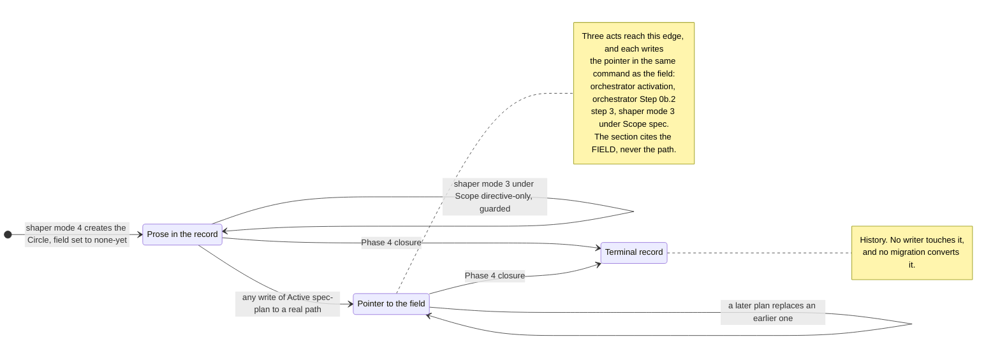
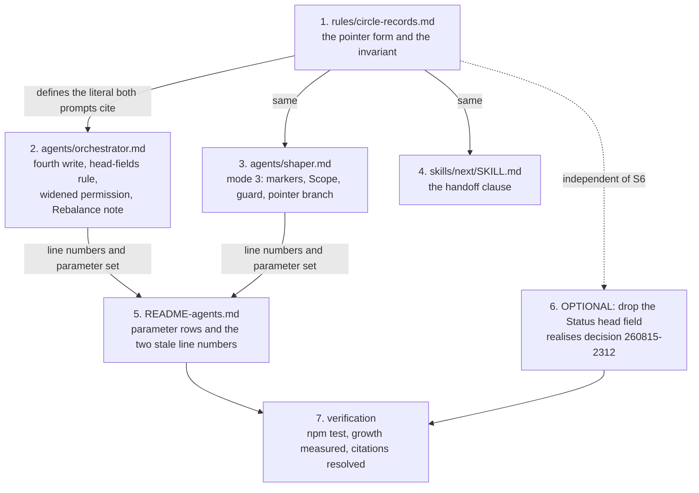

# Implementation Plan: the Circle record's Directive becomes a pointer, and gains a writer

**Date:** 2026-08-18
**Status:** Complete
**Spec:** none — planned from the answered decision `260818-1504_*_how-does-a-circle-record-carry-its-directive-once-a-spec-exists-and-who-may-correct-it-before-one-does.md` (option 1, pointer plus writer)
**Decidability:** The load-bearing question is *may this writer put Directive prose into this record?* It is decidable from an input every writer already holds: the record's own `**Active spec/plan:**` field, tested against the literal `(none yet)` that `agents/orchestrator.md` `## Circle head fields` already defines as a value rather than a gap. No writer predicts, classifies, or infers anything. The cut that would **not** have been decidable is named here so it is not reintroduced: *is this edit a typo correction or a re-shaping?* cannot be answered from what the shaper holds, and the only material available for the guess is the free text of `**Initiated by:**`. Reading intent out of an operator's own words is the shape of the branch-switch guard this repository deleted on 2026-08-09 after five patches and 24 consecutive false blocks. So the mechanism changes rather than the approximation improving: the fork moves onto the dispatch as an explicit `**Scope:**` parameter, which asks the dispatcher a question the dispatcher holds the answer to.

## Directive

Realise the answered decision `260818-1504_*_how-does-a-circle-record-carry-its-directive-once-a-spec-exists-and-who-may-correct-it-before-one-does.md`. Where a Circle has a spec, its record's `## Directive`
stops carrying prose and carries a reference to the record's `**Active spec/plan:**` field, so the
Directive has one source. Where a Circle has no spec, which is its state from activation until
planning finishes, the shaper may rewrite the prose under the user-initiated condition that
already governs its third mode.

The defect being closed is `260815-0752_*_no-agent-may-revise-an-active-circle-records-directive-so-a-revision-leaves-it-contradicting-the-spec.md`.

## Current State

Six facts were read at HEAD `83d3b04` rather than assumed, and four of them shrink the change.

**The record template.** `rules/circle-records.md` `## Circle record template` is the single
authoring home. `## Directive` is described as "What this Circle aims for. The post-completion
state of the Artifact, prognosticated. Revisable via Rebalance." The head carries five fields, of
which `**Active spec/plan:**` holds a workbench-relative path or the literal `(none yet)`.

**Who may write the section.** `agents/orchestrator.md:236` permits the orchestrator exactly three
Circle-record content writes, and `## Directive` is not among them. `agents/orchestrator.md:306`
names the shaper's third mode as "the only sanctioned writer" of the section, and
`agents/shaper.md:47` scopes that mode to an anticipated Circle, taking an `_a_circle.md` path in
its detection contract. No party covers an active Circle.

**Who writes `**Active spec/plan:**`.** Three acts, and the set is closed. The orchestrator writes
it at `_a_`→`_t_` activation and at Step 0b.2 step 3 with the read of the returned plan
(`agents/orchestrator.md` `## Circle head fields`). The shaper writes it in its third mode
(`agents/shaper.md:53`). `/fusion:next` Step 6.2 explicitly leaves the field as it stands, and
`/fusion:migrate`'s `rewrite_fields` rewrites a path prefix while leaving `(none yet)` alone. The
two skills therefore need no change from the invariant below, and neither can break it.

**Who reads `## Directive`.** Fewer readers than the section's prominence suggests.
`agents/playmaker.md:86` extracts "Directive (first `# ` heading)", meaning the record's title
line, not the section, so the portfolio's Directive line is untouched by anything in this plan.
`skills/direct/SKILL.md:122` reads the section's first paragraph, and only on a record its own run
has just created, where no spec can exist. `agents/curator.md:106` reads Circle records as tier-1
evidence and reads whatever is there. The orchestrator's Coherence gate resolves the Directive
from the plan, then the spec, then the session history line, and never from the record
(`agents/orchestrator.md:601`). One reader remains, and it is broken already:
`skills/next/SKILL.md:264` tells the orchestrator to take the record's `## Directive` as the
session Directive, and no orchestrator step does so. Filed separately as
`260818-1512_*_the-next-skills-activation-handoff-tells-the-orchestrator-to-read-the-circle-records-directive-and-no-orchestrator-step-does.md`.

**The population to migrate.** Eleven Circle records exist in this workbench and every one carries
a terminal marker. Zero anticipated, zero active. A migration would have nothing to convert here,
and in any project it could convert at most one record, because an anticipated Circle has no spec
by construction and only one Circle may be active.

**The budgets.** Measured, not taken from the dispatch. `agents/` stands 5 745 bytes above its
baseline with 18 000 of head-room, leaving 12 255. `skills/` stands 9 485 above with 20 000,
leaving 10 515. The always-on rule core stands 7 466 above its 12 000, leaving 4 534.
`rules/circle-records.md` is emitted at `bin/fusion-rules:432`, inside the `IS_CIRCLE_AGENT`
conditional, so it is **not** in the always-on set: it sits in the role-specific extras, which
`hooks/lib/__tests__/rules-emission-golden.test.ts` reports on and never fails. The template change
therefore lands on the one budget in this change that cannot turn the suite red.

## Approach

One invariant carries the whole design, and both of the decision's halves fall out of it.

> **The record's `## Directive` holds prose if and only if its `**Active spec/plan:**` reads the
> literal `(none yet)`.**

Duplication then cannot exist. It is not prevented by a maintainer keeping two copies in step,
which the defect record correctly says decays, and which `**Status:**` demonstrates decaying. It is
prevented because the two states are mutually exclusive by construction, and the invariant is
enforced from both ends by parties that are already doing the adjacent work:

- **A writer of prose** tests the field first. If the field names a file, the writer halts and says
  the Directive lives in the cited spec. Prose can enter only where nothing is duplicated.
- **A writer of the field** replaces the section body with the pointer in the same command that
  moves the field off `(none yet)`. Prose leaves at the exact moment a second copy would otherwise
  come into existence.

The second half is why the pointer swap cannot belong to one party. It is an invariant between two
fields, and the cheapest way to hold such an invariant is to write both in one act, which is the
rule `agents/orchestrator.md` `## Circle head fields` already applies to the head fields for the
same reason. Three acts write the field, so all three write the pointer.



The graph has no edge from `Pointer` back to `Prose`, and the absence is deliberate rather than an
oversight. A Circle that has acquired a spec does not lose one, and a Directive correction on such
a Circle is a correction to the spec, which is ordinary shaping work in the shaper's default mode.

### The four questions the decision left to this plan

**1. What the pointer literally looks like.** The section body becomes one line:

```
See `**Active spec/plan:**` above. The cited spec or plan states the Directive in force.
```

The pointer cites the **field**, not the path the field holds. A pointer naming the path would be a
second copy of the path, which is the duplication being removed, arriving one level down. Citing
the field also survives what the field actually contains in practice: three records in this
workbench carry a qualifying sentence in that field, and one of the three carries four paths, so a
pointer to the field resolves for a human reader in every one of those cases while a parser looking
for a single path would not.

A reader tells pointer from prose by the literal prefix ``See `**Active spec/plan:**` above.``,
which is the same shape of test the head-field readers already perform against `(none yet)`. No
collision with that sentinel is possible: the two occupy different places in the record, share no
leading characters, and the invariant makes them mutually exclusive, since the pointer appears only
when the field is not `(none yet)`.

Two alternatives were considered and rejected. Dropping the section entirely fails because an
absent section is indistinguishable from an unwritten one, and every reader that greps `## Directive`
would get silence instead of a redirection. A new head field declaring the Directive's source
(`**Directive source:** record | spec`) fails harder: it adds a fourth head field to a set that
`agents/orchestrator.md`, `agents/playmaker.md` and `skills/next/SKILL.md` each enumerate, and it
reintroduces duplication with a maintainer, which is the thing being removed.

**2. The transition.** Existing records are left exactly as they are, and are converted on the next
sanctioned write. No migration step exists, and the argument is not one of convenience.

A terminal record is history and stays uneditable, which removes every closed Circle from any
migration set. An anticipated Circle has `**Active spec/plan:** (none yet)` by construction, so the
invariant already holds for it and there is nothing to convert. What remains is the active Circle,
of which a project may have one. A migration mechanism would therefore exist to convert at most one
record per project, and zero in this repository, where all eleven records are terminal.

The second argument is stronger than the arithmetic. Converting a `_t_` record whose prose
contradicts its spec **deletes the evidence of the contradiction**, and in the worked instance the
Turn log entry points at that prose as the declared symptom
(`260815-0752_*_…`, `## Worked instance`). A migration would silently remove what a
record deliberately points at.

**3. The moment the pointer replaces the prose.** Not one moment, and not the shaper's alone. The
swap rides **every write of `**Active spec/plan:**` that moves it off `(none yet)`**, which is three
acts by two parties. Attaching it to the orchestrator's Step 0b.2 step 3 alone would leave the
activation row and the shaper's own spec write unguarded; attaching it to the shaper alone leaves
Step 0b.2 step 3 writing the field under untouched prose, which is today's defect exactly.

The orchestrator therefore gains a fourth permitted Circle-record content write, and it is a
narrowing rather than a widening of its authority over the Directive. The write substitutes one
fixed literal and never authors a sentence. What the orchestrator gains is the ability to **remove**
the record's independent statement of intent, not to make one.

**4. What keeps the writer half from decaying.** The boundary is mechanical, and it is a test the
writer performs on the file it is about to open rather than a rule it must remember. Before writing
prose into `## Directive`, the shaper reads `**Active spec/plan:**`. Anything other than the literal
`(none yet)` halts the run with a report naming the cited spec. The shape is the one mode 3 already
uses for `**Initiated by:**`, where the agent settles a permission question by a test it can
actually perform on itself.

Prose can enter a record at exactly two places, and both are behind that test: mode 4 at creation,
where the field is written as `(none yet)` in the same act, and mode 3 under `**Scope:**
directive-only`. Prose leaves at exactly one place, the field write. No third party writes either
side.

### The one place the mode's shape has to change

Mode 3 today always produces a spec. Under the invariant, producing a spec sets the field, and
setting the field writes the pointer, so a mode 3 that always produces a spec can never write prose.
The writer half of the decision would then be unreachable, and the case the user reported, a typo in
a Directive, would require manufacturing a whole spec to fix.

So mode 3 gains a fourth parameter line:

```
**Scope:** directive-only | spec
```

`spec` is today's behaviour and is the value assumed when the line is absent, so no existing caller
changes. `directive-only` refines the Directive with the user, writes the refined prose into
`## Directive`, writes no spec, and leaves `**Active spec/plan:**` untouched. It halts when the field
does not read `(none yet)`.

Putting the fork on the dispatch rather than inside the shaper is the Decidability line's substance.
The dispatcher, being the user or the orchestrator quoting the user at a gate, knows which of the two
occasions this is. The shaper does not, and the only material it could guess from is free text.

## Implementation Steps



1. **Define the pointer form and the invariant in the record template** [DONE]
   - Executor: `coder`
   - Files: `rules/circle-records.md`
   - Changes: in `## Circle record template`, the template's `## Directive` placeholder gains the
     two cases, and a short subsection is added under the template. The subsection heading is
     `### The Directive is a pointer once a spec exists`, and the name matters because both prompts
     will cite it in the adjacent `` `file.md` `## Section` `` form that
     `hooks/lib/__tests__/reference-resolution-lint.test.ts` class (b) resolves. It states: the exact
     pointer literal; that the pointer cites the field and never the path, with the reason; the
     invariant `prose ⟺ (none yet)`; that a terminal record is never converted; that existing
     records convert on the next sanctioned write and no migration exists; and the recognition rule
     for a reader. It does **not** state who writes it, which stays where the parallel obligation
     already lives, in `agents/orchestrator.md` `## Circle head fields` and `agents/shaper.md`.
   - Dependencies: none
   - Budget: role-specific extras, reported and never failing. Verified at `bin/fusion-rules:432`.
   - Lints: `reference-resolution-lint` must stay green, so any path this text cites has to resolve.
     `path-literal-lint` does not read `rules/`, and this file is in its `DEFINITION_SITES` in any
     case. `marker-format-lint` does not read `rules/`.

2. **Give the orchestrator the fourth write, and widen the dispatch permission** [DONE]
   - Executor: `coder`
   - Files: `agents/orchestrator.md`
   - Changes, four sites:
     - `## Scope`, the three permitted content writes become four. The fourth is the `## Directive`
       section, written **only** as the fixed pointer literal and **only** in the same command as a
       write of `**Active spec/plan:**` to a real path. State that the orchestrator never authors
       Directive prose, so the permission is a substitution and not an authorship.
     - `## Circle head fields`, one rule attached to the table rather than duplicated per row: any
       write of `**Active spec/plan:**` that moves it off `(none yet)` also replaces the
       `## Directive` body with the pointer literal, in the same command. Cite
       `rules/circle-records.md` `### The Directive is a pointer once a spec exists` for the literal.
       Add that a terminal record is never touched.
     - `## Re-sharpening an anticipated Circle (shaper portfolio-activation)`, the mode now also
       covers an active Circle. `**Circle file:**` may name `_a_circle.md` or `_t_circle.md`; a
       terminal marker is refused. The dispatch carries `**Scope:**` as a fourth parameter line. The
       user-initiated condition and the `**Initiated by:**` obligation are unchanged, and the
       sentence calling the shaper "the only sanctioned writer" of the two sections is narrowed to
       Directive **prose**, since the orchestrator now writes the pointer.
     - `### Rebalance Gate`, the **Revise Directive** bullet gains one sentence: the record stops
       contradicting its spec because the re-entry runs Step 0b.2, and the field write there carries
       the pointer. No new mechanism is added at this bullet, and saying so is the point, because a
       reader arriving from the defect will look for one here.
   - Dependencies: step 1 (the cited heading must exist for `reference-resolution-lint`)
   - Budget: `agents/`, 12 255 bytes of head-room measured at HEAD `83d3b04`. Estimate +1 200.
   - Lints expected to stay untouched: `path-literal-lint`, `marker-format-lint` (the underscore
     form is already used at these sites), `derivable-enumerations-lint` (no enumeration it parses
     is touched: not the skill roster, not an agent count, not an emission set).

3. **Widen the shaper's third mode and add its guard** [DONE]
   - Executor: `coder`
   - Files: `agents/shaper.md`
   - Changes, all inside mode 3 and the `## Scope` exception paragraph:
     - The cited record may carry `_a_` or `_t_`. A terminal marker halts, in the same form as the
       existing contract-violation halts.
     - The fourth parameter line `**Scope:** directive-only | spec`, absent meaning `spec`. State
       the default explicitly so an existing dispatch is unchanged.
     - Under `spec`, the run writes the spec, sets `**Active spec/plan:**`, and writes the **pointer
       literal** into `## Directive` rather than the refined prose. The refined Directive lives in
       the spec's own `## Directive` section, which the shaper's spec format already carries. The
       `## Grounding snapshot` write is unchanged.
     - Under `directive-only`, the run writes no spec, writes the refined prose into `## Directive`,
       and leaves `**Active spec/plan:**` alone. **Before writing, read that field; anything other
       than the literal `(none yet)` halts the run** and reports which spec holds the Directive.
     - The `## Scope` exception paragraph is updated so the permitted edits match.
   - Dependencies: step 1
   - Budget: `agents/`, shares the 12 255 with step 2. Estimate +1 300.
   - Note for the executor: mode 3's name is unchanged on purpose. The reasoning and the alternative
     are filed as
     `260818-1512_*_does-the-shapers-third-mode-keep-the-name-portfolio-activation-once-it-also-corrects-an-active-circles-directive.md`.

4. **Stop the activation handoff from instructing a wrong read** [DONE]
   - Executor: `coder`
   - Files: `skills/next/SKILL.md`
   - Changes: in Step 6.5's handoff message, the clause about reading the record's `## Directive`
     gains the pointer case, so the message does not tell the orchestrator to take a redirection
     sentence as a Directive. One clause, not a rewrite. The deeper gap, that no orchestrator step
     performs this read at all, is **out of scope for this plan** and is filed as
     `260818-1512_*_the-next-skills-activation-handoff-tells-the-orchestrator-to-read-the-circle-records-directive-and-no-orchestrator-step-does.md`.
     Step 6.2's treatment of the three head fields is correct as written and is not touched.
   - Dependencies: step 1
   - Budget: `skills/`, 10 515 bytes of head-room measured at HEAD `83d3b04`. Estimate +200.
   - Lints: `path-literal-lint` reads this file, so the added clause names no artifact-store folder
     as a path literal. `marker-format-lint` reads it too, so any marker stays in underscore form.

5. **Bring the dispatch-parameter roster up to date** [DONE]
   - Executor: `coder`
   - Files: `README-agents.md`
   - Changes: the `shaper` row in the agent table (its writes now include an active Circle's record
     and the pointer literal); the `**Circle file:**` row (accepts `_a_circle.md` or `_t_circle.md`);
     a new `**Scope:**` row with its values, its absent-behaviour and who passes it. Correct the two
     stale prompt-line citations measured at HEAD `83d3b04`: `agents/orchestrator.md:319` and `:320`
     should read `:329` and `:330`, and re-read every citation the earlier steps shifted. The
     underlying reason those citations rot is filed as
     `260818-1512_*_the-dispatch-parameter-tables-prompt-line-citations-are-resolved-by-no-gate-and-two-are-already-ten-lines-off.md`
     and is not fixed here.
   - Dependencies: steps 2 and 3 (their line numbers are the citations)
   - Budget: `README-agents.md` is on no bounded surface.
   - Lints: `derivable-enumerations-lint` reads this file for the skill table, the always-on rule
     bullet and the conditional-emission co-mentions. None of the three is touched, and the check
     that would move, "README-agents co-mentions each conditional rule file with its full derived
     agent set", moves only if the emission audience changes. It does not.

6. **OPTIONAL, and separable: drop the `**Status:**` head field** [DONE — taken; the user answered step 6 IN at the plan gate]
   - Executor: `coder`
   - Files: `rules/circle-records.md`, `agents/orchestrator.md`, `skills/next/SKILL.md`
   - Changes: remove the field from the template; remove its rows from
     `agents/orchestrator.md` `## Circle head fields` and the paragraph maintaining it; remove the
     `awk` rewrite from `skills/next/SKILL.md` Step 6.2. Existing records keep a field nothing
     writes, by the same argument step 2's transition uses. Append `Implemented:` to the decision
     record and rename it `_a_` to `_i_`.
   - Dependencies: none technically. Sequence it after step 5 so two rewrites of the same paragraph
     region do not collide.
   - **Why it is in this plan at all.** `260815-2312_*_should-the-circle-records-status-field-exist-at-all-now-that-both-transitions-maintain-it.md`
     was answered on 2026-08-16 for option 1, drop the field, and the answer timed the removal "to
     the next Circle that touches Circle records for another reason". This is that Circle: steps 1,
     2 and 4 touch the template, the head-fields table and Step 6.2, which are exactly the sites the
     answer names. Leaving it means the trigger fired and was not acted on, which is how an answered
     decision rots. The reconciliation of 2026-08-17 records that no such Circle has run since.
   - **Why it is optional.** Nothing in steps 1 to 5 reads or writes `**Status:**`. The invariant
     keys on `**Active spec/plan:**` alone. Dropping step 6 leaves the plan whole, and the user
     should decide it at the plan gate rather than inherit it.
   - Budget: a cut. It buys head-room on `agents/`, `skills/` and the role-specific rule extras.

7. **Verify** [DONE]
   - Executor: `coder`
   - Files: none written. Commands only.
   - Changes: run `cd hooks && npm test`. Confirm `surface-growth-bound` and
     `rules-emission-golden` are green and report the post-change figures for `agents/` and
     `skills/` against their 18 000 and 20 000 of head-room. Confirm `reference-resolution-lint`
     resolves the new `rules/circle-records.md` heading citations. Confirm `path-literal-lint`,
     `marker-format-lint` and `derivable-enumerations-lint` are unmoved. **If a bound is red, the
     answer is a cut, never a baseline edit** (`README-hooks.md` `### Growth bounds on the shipped
     text`, and the rule authored in `hooks/lib/__tests__/helpers/growth-bound.ts`).
   - Dependencies: steps 5 and, if taken, 6

## Data Structures

The Circle record's shape, as the template will define it:

| Element | Before | After |
|---|---|---|
| `# ` title line | one-line Directive title | unchanged, in both states |
| `**Active spec/plan:**` | path or `(none yet)` | unchanged |
| `## Directive` | always prose | prose when the field reads `(none yet)`, otherwise the pointer literal |
| `## Grounding snapshot` | prose | unchanged |
| `**Status:**` | `anticipated \| active \| …` | removed if step 6 is taken, otherwise unchanged |

The title line stays prose in both states and is deliberately out of scope. The playmaker reads it
as the portfolio's Directive line, and the Circle directory slug was derived from it and is
immutable for the Circle's whole life. A residual follows and is stated under Risks.

## API Changes

One new dispatch parameter, on the shaper's third mode:

```
**Scope:** directive-only | spec
```

Absent means `spec`, which is today's behaviour, so every existing caller is unchanged. The
detection contract's other three lines are unchanged. `README-agents.md` `## Dispatch parameters`
remains the single authoring home for the roster, and `CLAUDE.md` is not touched, since it forbids
a second copy of that table and states only the facts that shape a dispatch decision.

## Testing Strategy

fusion has no test that reads a Circle record's `## Directive`, and this plan does not add one. The
verification available is the lint suite plus one read-through, and saying so plainly is more useful
than implying more coverage than exists.

- `npm test` in `hooks/`, whole suite. The four gates that plausibly move are named per step, with
  the expectation stated in each direction.
- `reference-resolution-lint` is the only gate that mechanically checks anything this plan adds: it
  resolves the new `rules/circle-records.md` heading from the two prompts that cite it. A heading
  renamed in step 1 without updating steps 2 and 3 fails there, which is the intended coupling.
- The invariant itself is unenforced by any gate. No mechanism compares a record's `## Directive`
  against its `**Active spec/plan:**`. Whether one should exist is left open below rather than
  quietly assumed away.
- Read-through: after step 5, re-read `agents/shaper.md` mode 3 end to end as a dispatched agent
  would, and confirm the three halt conditions (missing `**Circle file:**`, missing
  `**Initiated by:**` when dispatched, field not `(none yet)` under `directive-only`) do not overlap
  and leave no case unhandled.

## Risks & Mitigations

| Risk | Mitigation |
|---|---|
| A pointer stands over a `**Active spec/plan:**` that a human later resets to `(none yet)`, leaving a redirection to nothing. No writer in fusion does this, so the risk is a hand edit. | Left unhandled deliberately. Adding a repair path would put a maintainer back on the invariant, which is the shape being removed. The condition is detectable by inspection and is named here so it is not mistaken for a design gap. |
| The record's `# ` title still names the original intent after a Directive revision, and the playmaker renders that title as the portfolio's Directive line. A revised Circle can therefore still show a stale one-liner. | Out of scope, and the fix is not obvious: rewriting the title desynchronises it from the immutable directory slug it was derived from. Worth a decision record if it is ever seen in practice; not worth pre-empting one here. |
| `agents/` head-room is 12 255 bytes and steps 2 and 3 both spend it. | Estimates are 1 200 and 1 300. Step 7 measures rather than assumes. If a bound goes red, the answer is a cut in the same surface, never a baseline edit. |
| Step 1's heading is renamed during review, and steps 2 and 3 keep citing the old one. | `reference-resolution-lint` class (b) fails on exactly that, and the coupling is stated in step 1. |
| The mode name `portfolio-activation` now under-describes the mode, and a later reader has to be told the name is historical. | Accepted with the residual stated, and filed as its own open decision so the choice is visible rather than buried in a prompt. Option 2 there is one extra step in this plan if the user prefers it at the gate. |
| Step 6 turns a plan about the Directive into a plan that also removes a head field, and the user did not ask for it. | It is marked optional, sequenced last, and depends on nothing. The reason it is offered at all is that decision `260815-2312_*_should-the-circle-records-status-field-exist-at-all-now-that-both-transitions-maintain-it.md` timed itself to this exact trigger. The gate decides. |

## Open Questions

- [ ] **Step 6, in or out?** Realise the answered decision
      `260815-2312_*_should-the-circle-records-status-field-exist-at-all-now-that-both-transitions-maintain-it.md`
      in this plan, or leave the trigger unfired for another Circle? The plan is whole either way.
- [ ] **The mode name.** `260818-1512_*_does-the-shapers-third-mode-keep-the-name-portfolio-activation-once-it-also-corrects-an-active-circles-directive.md`
      is filed open, with a recommendation for keeping the wire value. Overturning it at the gate
      adds one step and changes no other.
- [ ] **Should anything enforce the invariant?** No gate compares a record's `## Directive` against
      its `**Active spec/plan:**`. A lint could, since both are literals in one file, but this
      repository's own history argues that a gate over a workbench artifact is a different thing
      from a gate over shipped text. Not blocking; worth deciding before a second such invariant is
      written.
- [ ] **Mode 3's self-test is under an open decision.**
      `260814-1915_*_should-mode-3-require-the-audit-line-on-every-run-instead-of-testing-whether-it-was-dispatched.md`
      questions the `AskUserQuestion` discriminator that step 3 edits around, with measurement
      showing the test unsound in one direction. This plan is written against today's contract and
      does not touch the discriminator. Answering that decision first would change step 3's text but
      not its structure, so it is not a blocker.
- [ ] **Precedence, if the orchestrator ever does read the record's Directive.** The defect filed
      alongside this plan leaves open which wins when the user's prompt and the record disagree.
      Nothing here depends on the answer.

---
**Executed 2026-08-18** (coder). All seven steps landed in one change, in the order the plan's
dependency graph gives: the template's definition first, the two prompts that cite it and the
shaper's guard together, then the skill clause, then the roster. `npm test` in `hooks/` — exit 0,
36 files, 672 tests. Growth measured against each bound rather than assumed: `agents/` +5 615 bytes
(6 640 of 12 255 head-room left), `skills/` **−1 159** (11 674 left, the surface shrank), the
always-on rule core unmoved at 4 534 of head-room, hook tests +28 lines (1 996 left). No baseline
was edited. Three measurement fixtures were re-approved by their own documented procedures:
`surface-growth.golden`, `rules-emission.golden`, and the pinned reference count in
`reference-resolution-lint.test.ts` (paths 1 125→1 133, anchors 139→145, records 95→97, each
attributed per file by reverting that file and re-running the gate).

**Two things the plan left open and this run did not settle.** The heading
`## Re-sharpening an anticipated Circle (shaper portfolio-activation)` in `agents/orchestrator.md`
now under-describes its section the same way the mode's wire name under-describes the mode; it was
left standing because the plan named it as a site rather than as a thing to change, and because
renaming it breaks the class-(b) citation `agents/shaper.md` carries. The paragraph inside it says
what the mode covers. And no gate compares a record's `## Directive` against its
`**Active spec/plan:**` — the invariant is held by two prompts and enforced by nothing, which is the
third Open Question above, still open.
