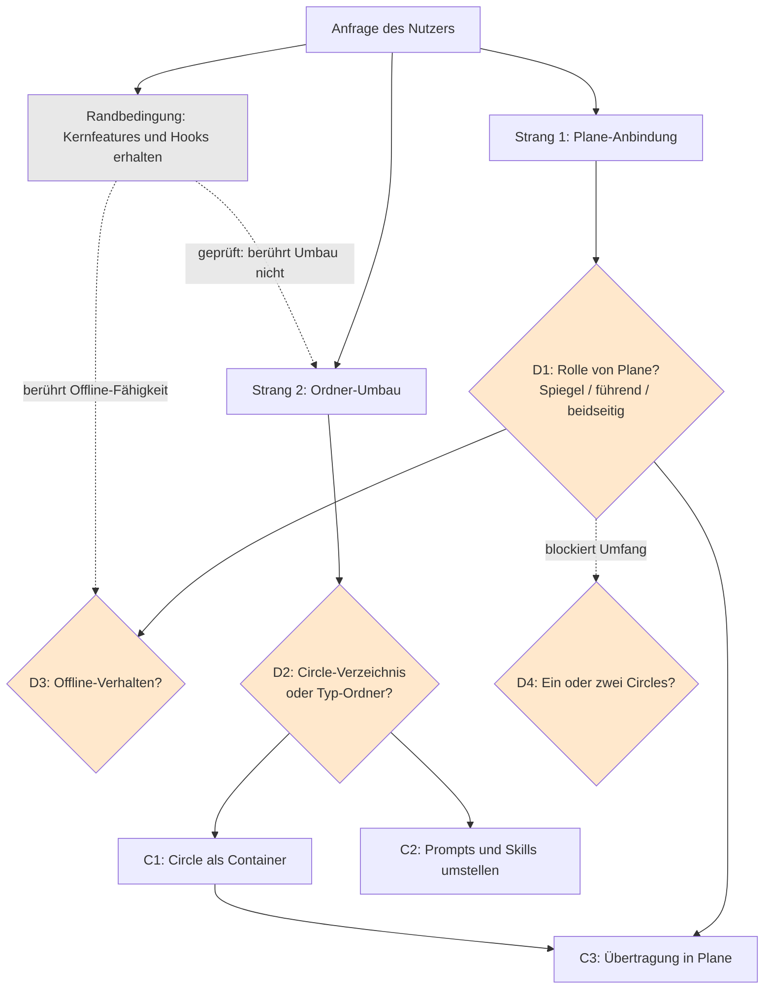

# Spec: Plane-Anbindung und Umstrukturierung der workbench

**Date:** 2026-07-16
**Status:** Draft — vier Entscheidungen offen, siehe `## Offene Entscheidungen`
**Source:** "Ich möchte fusion anpassen, so dass es perfekt mit plane (https://plane.so) zusammen arbeitet. Der Eingriff ist weitreichend. Gegenwärtig erzeugen die Agenten Output in typspezifischen Foldern. Dadurch entsteht eine Vielzahl semantisch verbundener und in der workbench verteilter Dateien. Das ist nicht besonders übersichtlich. Die Kernfeatures und hooks, die Fusion ausmachen sollen unbedingt erhalten bleiben."

## Zusammenfassung für den Review

Die Anfrage enthält zwei Vorhaben, die trennbar sind, und eine Randbedingung, die weniger einschränkt als erwartet.

Der erste Befund ist der wichtigste: die Umstrukturierung der Ordner berührt die Hooks nicht. Wir haben die Kopplung geprüft, nicht geschätzt. Die Namen der typspezifischen Ordner (`planning/`, `issues/`, `decisions/` und die übrigen acht) kommen in `hooks/` und `bin/` kein einziges Mal vor. Die Hooks schützen ausschließlich `agents/**`, `rules/**`, `skills/**`, die Plugin-Konfiguration und `.guard-state/**` (`hooks/config.json:12-22`); der Tracker und das Dashboard lesen ausschließlich vier Dateien im Wurzelverzeichnis der workbench (`hooks/tracker.ts:33-36`, `bin/monitor:72-75`). Die Randbedingung "Hooks müssen erhalten bleiben" schränkt die Umstrukturierung damit praktisch nicht ein. Die gesamte Kopplung liegt in den Agenten-Prompts, den Skills und den Regel-Dokumenten: 549 Pfadnennungen, davon 62 allein in `rules/fusion-workbench-conventions.md`, dem Dokument, das als einzige Quelle die Ablage definiert.

Der zweite Befund betrifft das Übersichtsproblem. fusion kennt mit dem Circle bereits den Begriff, der die verstreuten Dateien inhaltlich zusammenbindet. Ein Circle ist heute eine einzelne Datei in `circles/`, während sein Spec, seine Issues, seine Entscheidungen, sein Sitzungsprotokoll und seine Reviews an fünf weiteren Orten liegen. Der Begriff existiert, das Verzeichnis fehlt. Wir schlagen daher keine neue Ordnungsidee vor, sondern die Realisierung der vorhandenen.

Der dritte Befund betrifft Plane und ist eine Warnung. Was "perfekt zusammenarbeiten" bedeutet, ist unbestimmt, und die Spanne der möglichen Auslegungen reicht von einer Übertragung in eine Richtung bis zu einem beidseitigen Abgleich mit Konfliktmodell. Wir haben diese Frage nicht selbst entschieden, weil an ihr die Offline-Fähigkeit von fusion hängt, die ihrerseits ein Kandidat für die vom Nutzer geschützten Kernfeatures ist. Diese Spannung ist der Kern der Anfrage: würden Issues und Entscheidungen nach Plane wandern, löste sich das Streuungsproblem teilweise von selbst, und zugleich fiele die Datei-als-Wahrheit-Haltung, die fusion trägt.

**Was wir empfehlen:** zwei Circles, Umbau zuerst. Der Umbau steht für sich, liefert die gewünschte Übersicht auch ohne Plane und erzeugt genau die Struktur, auf die sich Plane-Module danach abbilden lassen.

**Was der Nutzer entscheiden muss:** vier Fragen, alle in `fusion-workbench/decisions/` abgelegt und unten zusammengefasst. Ohne die Antwort auf die Plane-Rolle lässt sich der Umfang des zweiten Teils nicht bemessen.

## Directive

fusion legt die Ergebnisse eines Vorhabens gebündelt an einem Ort ab, statt sie über zehn typspezifische Ordner zu verteilen, und überträgt den Arbeitsvorrat in ein Plane-Projekt, ohne die Hooks, die Marker-Vokabulare und die Prüfbarkeit über Git aufzugeben.

## Struktur der Anfrage

Die orange markierten Knoten sind die vier offenen Entscheidungen. Der gestrichelte Pfad von der Randbedingung zum Umbau trägt den geprüften Befund: die Hooks stehen dem Umbau nicht im Weg. Der gestrichelte Pfad zur Offline-Frage trägt die eigentliche Spannung.

## Geprüfter Ausgangszustand

Die folgenden Aussagen sind belegt, nicht erschlossen.

**Die Hooks kennen die Typ-Ordner nicht.** `hooks/config.json:12-22` listet als geschützte Pfade `agents/**`, `rules/**`, `hooks/config.json`, `hooks/hooks.json`, `settings.json`, `bin/monitor`, `skills/**`, `.claude-plugin/plugin.json` und `fusion-workbench/.guard-state/**`. `hooks/tracker.ts:33-36` beobachtet `orchestrator-live.md`, `orchestrator-events.jsonl`, `agentstate.yaml` und `.guard-state/**`. `hooks/lib/events.ts:18` schreibt nach `.guard-state/events.jsonl`. `hooks/lib/workbench-root.ts` sucht allein die Markierung `fusion-workbench/.fusion-setup`. Kein Hook nennt einen Typ-Ordner.

**Das Dashboard ebenso wenig.** `bin/monitor:72-75` liest `orchestrator-live.md`, `orchestrator-events.jsonl` und `.guard-state/events.jsonl`. Es sucht keine Dateien in den Typ-Ordnern und wertet keine Marker aus Dateinamen aus.

**Die Kopplung liegt in der Prosa.** 549 Pfadnennungen verteilen sich auf 15 Agenten-Prompts (von 47 in `playmaker.md` und 53 in `reconciler.md` bis 8 in `conceptrev.md`), 11 Skills (22 in `archive/SKILL.md`, 12 in `next/SKILL.md`) und 3 Regel-Dokumente. `rules/fusion-workbench-conventions.md` trägt mit 62 Nennungen die Definition und ist der Hebelpunkt: es ist die einzige Quelle für Ablage, Marker und Vorlagen.

**Plane bietet die nötigen Objekte, mit zwei Einschränkungen.** Die REST-Schnittstelle deckt über 180 Endpunkte ab, darunter Projects, Work Items, Cycles, Modules, Pages, Labels, States, Comments und Links, und authentifiziert über den Kopfzeileneintrag `X-API-Key`. Webhooks melden Anlegen, Ändern und Löschen. Zwei Einschränkungen sind für uns bindend: das Rate-Limit liegt bei 60 Anfragen pro Minute je Client, und die Pages-Schnittstelle ist auf selbst gehosteten Instanzen über die öffentliche REST-Schnittstelle nicht erreichbar ([makeplane/plane#8986](https://github.com/makeplane/plane/issues/8986)). Prosa-Dokumente können bei Selbsthosting also nicht zuverlässig in Plane liegen.

## Capabilities

Die Fähigkeiten C1 und C2 gehören zum Umbau und sind unabhängig von Plane. C3 und C4 gehören zur Plane-Anbindung und sind auf die Entscheidung D1 blockiert.

### C1: Ein Vorhaben liegt an einem Ort

**Description:** Alles, was zu einem Vorhaben gehört, liegt in einem Verzeichnis: das Directive, der Spec, der Plan, die Issues, die Entscheidungen, das Sitzungsprotokoll und die Reviews. Wer ein Vorhaben verstehen will, öffnet ein Verzeichnis statt sechs. Wer es archivieren will, verschiebt ein Verzeichnis.

**Acceptance criteria:**
- [ ] Eine Person, die das Projekt nicht kennt, findet alle Dateien eines abgeschlossenen Vorhabens, ohne mehr als ein Verzeichnis zu öffnen.
- [ ] Ein Vorhaben lässt sich als Ganzes archivieren, ohne dass Dateien in anderen Verzeichnissen zurückbleiben.
- [ ] Artefakte ohne Vorhabens-Bezug (projektweite Issues, freistehende Analysen, Memos) haben einen definierten Platz, und die Regel, wann etwas dorthin gehört, ist in `rules/fusion-workbench-conventions.md` benannt.
- [ ] Die Marker-Vokabulare für Issues, Entscheidungen und Circles funktionieren unverändert.
- [ ] Die Unterscheidung zwischen Defekt, Entscheidung und Circle bleibt in Kraft und ist weiterhin an genau einer Stelle definiert.

**Decisions made:** keine. Die Form hängt an D2.

### C2: Agenten und Skills schreiben in die neue Struktur

**Description:** Alle 15 Agenten und 11 Skills legen ihre Ergebnisse in der neuen Struktur ab. Bestehende Workbenches in anderen Projekten laufen weiter oder werden migriert.

**Acceptance criteria:**
- [ ] Jeder der 15 Agenten legt seine Ergebnisse in der neuen Struktur ab; kein Agent schreibt mehr in die alte.
- [ ] Die Ablage ist an genau einer Stelle definiert; kein Agenten-Prompt und keine Skill enthält eine abweichende Definition.
- [ ] Die Hooks, das Dashboard und die Commit-Sperre verhalten sich unverändert. Belegt durch einen Lauf, nicht durch Lesen.
- [ ] `/fusion:setup`, `/fusion:next`, `/fusion:direct`, `/fusion:archive`, `/fusion:circle-stash` und `/fusion:circle-pop` laufen gegen die neue Struktur durch.
- [ ] Eine bestehende workbench aus einem anderen Projekt ist entweder migrierbar oder läuft unverändert weiter; welches von beiden gilt, ist festgelegt und dokumentiert.

**Decisions made:** keine. Blockiert auf D2.

### C3: Der Arbeitsvorrat erscheint in Plane

**Description:** Die Vorhaben und der Arbeitsvorrat sind in einem Plane-Projekt sichtbar, sodass der Nutzer und andere Menschen dort mitlesen und sich abstimmen können.

**Acceptance criteria (vorläufig, hängen an D1):**
- [ ] Der Nutzer sieht in Plane, welche Vorhaben anstehen, welches läuft und welche Arbeitspakete offen sind, ohne eine Datei zu öffnen.
- [ ] Der API-Key wird aus einer Umgebungsvariablen gelesen und steht in keiner Datei, die ein Agent liest.
- [ ] Die Übertragung überschreitet 60 Anfragen pro Minute nicht und verhält sich bei Erreichen des Limits definiert.
- [ ] Eine zweimal ausgeführte Übertragung erzeugt in Plane keine Duplikate.
- [ ] Prosa-Dokumente (Sitzungsprotokolle, Reviews, Analysen) bleiben Dateien, weil die Pages-Schnittstelle bei Selbsthosting nicht erreichbar ist.

**Decisions made:** keine. Blockiert auf D1.

### C4: fusion bleibt ohne Plane arbeitsfähig

**Description:** Ist Plane nicht erreichbar, verhält sich fusion definiert und für den Nutzer nachvollziehbar.

**Acceptance criteria (vorläufig, hängen an D1 und D3):**
- [ ] Das Verhalten bei fehlender Verbindung, bei einem Fehler von Plane und bei erschöpftem Rate-Limit ist je Fall festgelegt und beobachtbar.
- [ ] Ein Fehlschlag bleibt nie still; der Nutzer erfährt, dass und was nicht übertragen wurde.

**Decisions made:** keine. Blockiert auf D1 und D3.

## Constraints

- Die Kernfeatures und Hooks bleiben erhalten. Das ist die bindende Vorgabe des Nutzers. Geprüft und für den Umbau entschärft: die Hooks kennen die Typ-Ordner nicht. Für die Plane-Anbindung bleibt die Vorgabe scharf, weil die Offline-Fähigkeit ein Kandidat für die geschützten Kernfeatures ist und nur der Nutzer entscheiden kann, ob sie dazuzählt.
- Die Marker-Vokabulare und die Unterscheidung zwischen Defekt, Entscheidung und Circle sind tragende Konzepte und bleiben unabhängig von der Ablage bestehen.
- Zugangsdaten gehören in Umgebungsvariablen, nicht in Dateien (`rules/fusion-workbench-conventions.md` `## Security`).
- Plane erzwingt 60 Anfragen pro Minute je Client.
- Die Pages-Schnittstelle ist bei Selbsthosting über die öffentliche REST-Schnittstelle nicht erreichbar.
- fusion wird über zwei Wege verteilt, den Marketplace und den HTTPS-Installer. Beide müssen die geänderte Struktur mitbringen.

## Out of Scope

- Änderungen an den Hooks selbst. Sie sind vom Umbau nicht betroffen, und die Vorgabe des Nutzers schützt sie ausdrücklich.
- Änderungen am Dashboard über das hinaus, was eine geänderte Ablage zwingend nötig macht.
- Eine Anbindung an andere Projektwerkzeuge als Plane.
- Eine Änderung der Marker-Vokabulare. Die Diskussion, ob `[o]` bis `[d]` noch die richtigen Zustände sind, ist ein eigenes Vorhaben.
- Die Ablösung des Dashboards durch Plane. Das Dashboard zeigt den laufenden Sitzungszustand, wofür Plane kein Gegenstück hat.

## Open for Planner

- Die Migration bestehender Workbenches: ob es einen Migrationspfad gibt, ob alte Strukturen weiterlaufen und wie der Übergang aussieht.
- Wo die Definition der Ablage technisch liegt und wie verhindert wird, dass 15 Prompts sie erneut je eigen definieren.
- Die Abbildung der Artefakt-Typen auf Plane-Objekte (Work Item, Cycle, Module, Project, Label, State) im Einzelnen.
- Der Mechanismus der Übertragung: Zeitpunkt im Turn-Loop, Zuordnung zwischen Dateien und Plane-Identifikatoren, Idempotenz.
- Der Umgang mit den bekannten Doppel-Webhooks von Plane (makeplane/plane#7249), falls die Rollen-Entscheidung Rücklesen vorsieht.
- Die Reihenfolge der Umstellung über die 15 Agenten und 11 Skills.

## Offene Entscheidungen

Vier Entscheidungen sind als Entscheidungssätze abgelegt. D1 ist die wichtigste: solange sie offen ist, lässt sich der Umfang von C3 und C4 nicht bemessen.

| Nr. | Frage | Datei | Unsere Empfehlung |
|---|---|---|---|
| D1 | Ist Plane Spiegel, führendes System oder beidseitiger Abgleich? | `decisions/260716-1847[o]-plane-rolle-source-of-truth.md` | Spiegel, unter Vorbehalt |
| D2 | Circle-Verzeichnis oder Typ-Ordner? | `decisions/260716-1847[o]-workbench-struktur-circle-container-vs-typ-ordner.md` | Circle-Verzeichnis plus gemeinsame Ablage |
| D3 | Was tut fusion, wenn Plane nicht erreichbar ist? | `decisions/260716-1847[o]-offline-verhalten-bei-plane-ausfall.md` | Weiterarbeiten, Plane später neu aufbauen |
| D4 | Ein Circle oder zwei? | `decisions/260716-1847[o]-zuschnitt-umbau-und-plane-ein-oder-zwei-circles.md` | Zwei, Umbau zuerst |

Der Vorbehalt bei D1: unsere Empfehlung trägt nur, wenn der Nutzer Plane zum Mitlesen und zur Abstimmung nutzen will. Erwartet er, in Plane selbst Status zu ziehen und zu kommentieren, und dass fusion das aufnimmt, dann lautet die Frage Option 3 oder gar nicht.

## Vorschlag zum Zuschnitt

Die Anfrage ist für einen Circle zu groß, solange D1 offen ist. Wir schlagen den Schnitt entlang der geprüften Unabhängigkeit vor:

**Circle 1 (Umbau).** Umfasst C1 und C2. Braucht nur die Antwort auf D2 und läuft ohne Plane. Liefert die vom Nutzer gewünschte Übersicht und erzeugt die Struktur, auf die sich Plane-Module danach abbilden lassen.

**Circle 2 (Plane).** Umfasst C3 und C4. Braucht D1 und D3 und setzt Circle 1 voraus.

Fällt D4 gegen diesen Vorschlag aus, bleibt die Spec gültig; die Capabilities sind so geschnitten, dass sie auch in einem Circle umsetzbar sind.

# Entscheidungen (Kai): 

D1: Spiegel

D2: Circle Verzeichnis

D3: Weiterarbeiten, Plane ist sekundäre View

D4: 2 Circles.
