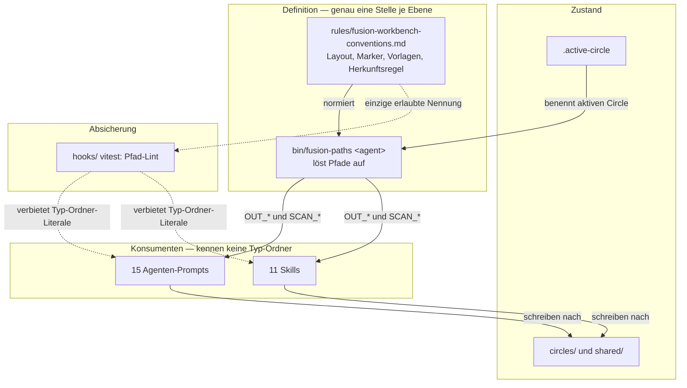
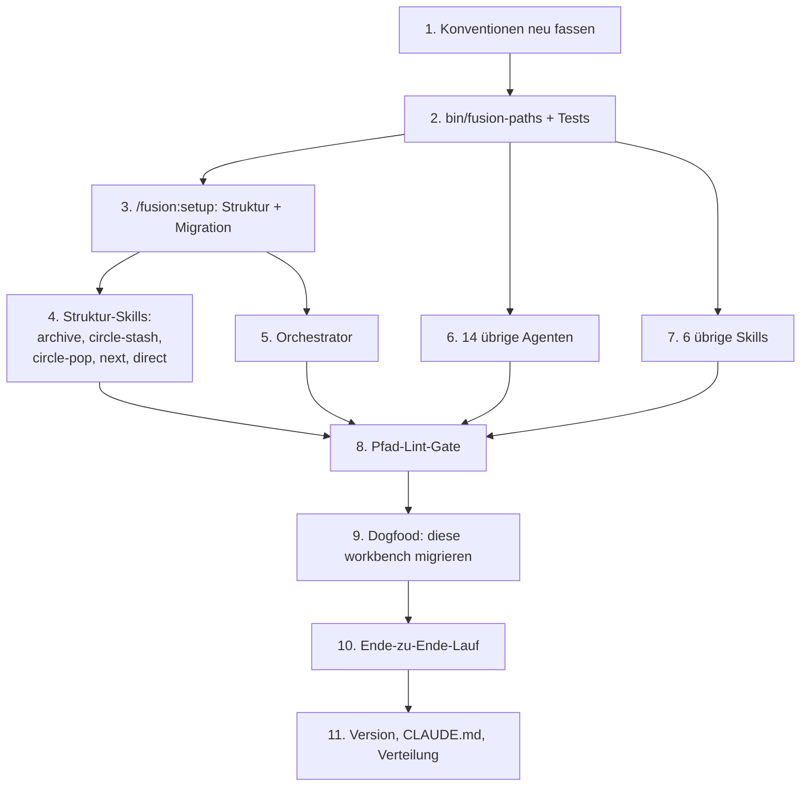

# Implementation Plan: Umbau der workbench zum Circle-Container (Circle 1)

**Date:** 2026-07-16
**Status:** Complete — alle 11 Schritte belegt. Schritte 1-8, 11 quellseitig committet (`6d4a88d`..`cb5fa80`, Version 4.0.0); Schritte 9 (Migration dieser workbench) und 10 (Ende-zu-Ende-Lauf, C2-Abnahme) in Sitzung 260717-1832 ausgeführt und durch den Lauf belegt. Marker `[p]→[c]` durch reconciler 260717 nach Verifikation gegen den Baum (173 Tests grün, Lint-Gate deckt alle 15 Agenten + 14 Skills). Siehe `## Reconciliation Log`.
**Spec:** `fusion-workbench/planning/260716-1847[o]-spec-plane-integration-und-workbench-struktur.md` (C1 und C2; C3 und C4 sind Circle 2 und nicht Gegenstand dieses Plans)
**Bindende Entscheidungen:** D2 `decisions/260716-1847[a]-workbench-struktur-circle-container-vs-typ-ordner.md`, D4 `decisions/260716-1847[a]-zuschnitt-umbau-und-plane-ein-oder-zwei-circles.md`, D1 `decisions/260716-1847[a]-plane-rolle-source-of-truth.md` (nur als Randbedingung)

## Zusammenfassung für den Review

Der Umbau steht und fällt mit einer Frage: wo liegt die Definition der Ablage. Heute liegt sie in Prosa, verteilt über 26 Dateien, und genau daraus entsteht das Problem. Würden wir die 549 Pfadnennungen bloß auf neue Pfade umschreiben, hätten wir dieselbe Verteilung mit anderen Zeichenketten. Wir schlagen deshalb vor, die Pfade aus den Prompts zu **entfernen** statt sie zu ersetzen.

Das Mittel dafür existiert bereits im Projekt. `bin/fusion-rules <agent>` löst für jeden Agenten auf, welche Regeldateien er lesen muss; der Prompt enthält den Aufruf, nicht die Liste. Jeder der 15 Agenten führt diesen Aufruf im Setup-Schritt 2 aus, und das Muster ist im Betrieb bewährt. Wir setzen daneben ein zweites Skript, `bin/fusion-paths <agent>`, in denselben Setup-Schritt. Es liest den aktiven Circle und gibt dem Agenten seine Schreib- und Suchziele als benannte Werte zurück. Der Prompt sagt danach "schreibe deinen Plan nach `$OUT_PLAN`" und kennt kein einziges Typ-Verzeichnis mehr. Die Ablage ist damit an genau einer ausführbaren Stelle definiert, und ein Lint-Test hält sie dort.

Die Zielstruktur folgt D2: ein Verzeichnis je Vorhaben unter `circles/`, daneben eine gemeinsame Ablage `shared/` für alles ohne Vorhabens-Bezug. Die Regel, wann etwas wohin gehört, lautet **Herkunft, nicht Haltbarkeit**: ein Artefakt liegt bei dem Circle, dessen Directive seine Entstehung veranlasst hat; ohne aktiven Circle liegt es in `shared/`. Diese Regel ist mechanisch anwendbar, weil ein Agent seine eigene Herkunft kennt, während er die künftige Reichweite eines Artefakts nur raten könnte. Übergreifende Bezüge werden zitiert, nicht durch Platzierung ausgedrückt.

Die Regel löst zugleich die Migration. Für die Artefakte bestehender Workbenches ist die Circle-Zugehörigkeit nie aufgezeichnet worden und daher nicht rekonstruierbar. Nach unserer Regel ist "Herkunft unbekannt" gleichbedeutend mit `shared/`. Die Migration verschiebt also die vorhandenen Typ-Ordner geschlossen nach `shared/`, legt das neue `circles/`-Gerüst an und ist damit vollständig, verlustfrei und ohne Auslegung durchführbar. Neue Arbeit landet in Circles, alte Arbeit bleibt lesbar an einem definierten Ort.

**Was wir empfehlen:** elf Schritte, alle an `coder`, in vier Phasen. Fundament (Definition und Resolver), Setup mit Migration, Umstellung der 26 Dateien, Absicherung durch Lint und einen echten Lauf.

**Was am Gate zu bestätigen ist:** die Platzierung des Zustandsmarkers. Wir setzen ihn auf die Circle-Datei innerhalb eines stabil benannten Verzeichnisses, nicht auf das Verzeichnis selbst. Begründung und Alternative stehen unter `## Open Questions`.

## Directive

fusion legt alles, was zu einem Vorhaben gehört, in einem Verzeichnis ab, definiert diese Ablage an genau einer ausführbaren Stelle und stellt alle 15 Agenten und 11 Skills darauf um, ohne Hooks, Marker-Vokabulare oder die Prüfbarkeit über Git anzutasten.

## Current State

Die folgenden Aussagen sind geprüft, nicht erschlossen. Wir haben die Befunde der Spec nachgemessen und in zwei Punkten ergänzt.

**Die Hooks und das Dashboard kennen die Typ-Ordner nicht.** `hooks/config.json:12-22` schützt `agents/**`, `rules/**`, `hooks/config.json`, `hooks/hooks.json`, `settings.json`, `bin/monitor`, `skills/**`, `.claude-plugin/plugin.json` und `fusion-workbench/.guard-state/**`. Kein Eintrag nennt ein Typ-Verzeichnis. Der Befund der Spec trägt: die Randbedingung "Kernfeatures und Hooks bleiben erhalten" schränkt den Umbau nicht ein.

**Die Kopplung ist quantifiziert.** Über `agents/`, `skills/` und `rules/` gemessen: `decisions` 94 Nennungen, `issues` 84, `circles` 82, `history` 69, `planning` 68, `analyses` 44, `codereview` 31, `ontoreview` 30, `consult` 30, `investigations` 25, `conceptreview` 8. Die Verteilung über Dateien reicht von 61 in `rules/fusion-workbench-conventions.md` und 53 in `agents/orchestrator.md` bis zu einer Nennung in `skills/unlock/SKILL.md`.

**Die Nennungen zerfallen in vier Klassen**, und nur die ersten beiden brauchen einen Resolver. Erstens Schreibziele ("dokumentiere in `fusion-workbench/planning/...`", `agents/planner.md:75`). Zweitens Lese- und Suchmuster ("`ls fusion-workbench/planning/`", `agents/reconciler.md:17-21`). Drittens identischer Fließtext: die Zeile "Locate the workbench" zählt in jedem der 15 Agenten-Prompts alle zehn Typ-Ordner auf, wortgleich. Viertens erklärende Prosa über Marker und die Unterscheidung von Defekt, Entscheidung und Circle, die gar keine Pfade braucht.

**Das Helper-Muster ist vorhanden und bewährt.** `bin/fusion-rules <agent>` (10 kB Bash) löst pro Agent auf, welche Regeln zu lesen sind, samt Sprachauflösung aus `CLAUDE.md` und dreistufiger Suche über Plugin-, Projekt- und `.claude/rules`-Verzeichnisse. Der Prompt jedes Agenten enthält dazu genau einen Satz. Daneben stehen `bin/fusion-workbench-root`, `bin/fusion-commit-lock` und `bin/fusion-session-mark` nach demselben Muster.

**Die Verteilung kostet nichts.** `install.sh:79-81` kopiert die Verzeichnisse `.claude-plugin agents skills rules hooks bin stilwerk templates docs` geschlossen. Ein neues Skript unter `bin/` wird von beiden Kanälen ohne Änderung mitgeliefert; zu tun bleibt allein der Versionssprung in `plugin.json` und `marketplace.json`.

**Ein Testrahmen existiert.** `hooks/package.json` deklariert `vitest` und ein `npm test`. Ein Lint-Test über die Prompts kann dort einziehen und braucht keine neue Infrastruktur.

**Diese workbench selbst ist im Altzustand, und `circles/` ist leer.** Der Spec, die vier Entscheidungen und die Sitzungsprotokolle dieses Vorhabens liegen in den Typ-Ordnern; eine Circle-Datei existiert nicht. Der Umbau muss seine eigene workbench mitnehmen, und dazu gehört, den Circle nachträglich anzulegen.

## Approach

Drei Festlegungen tragen den Plan.

**Erstens: ein Verzeichnis je Vorhaben, daneben eine gemeinsame Ablage.**

```
fusion-workbench/
├── circles/
│   └── 260716-1847-workbench-umbau/     # stabiler Name, ohne Marker
│       ├── [t]-circle.md                # Directive, Grounding, Turn log — trägt den Marker
│       ├── planning/                    # Spec und Plan dieses Vorhabens
│       ├── issues/
│       ├── decisions/
│       ├── history/
│       ├── reviews/                     # codereview, ontoreview, conceptreview
│       └── analyses/
├── shared/                              # alles ohne Vorhabens-Bezug
│   ├── planning/                        # nachgetragen, siehe Korrektur unten
│   ├── issues/
│   ├── decisions/
│   ├── analyses/
│   ├── reviews/                         # nachgetragen, siehe Korrektur unten
│   ├── investigations/
│   ├── consult/
│   ├── history/
│   └── memos/
├── archive/
├── stashes/
├── stilwerk/
├── portfolio.md
├── tasklist.md
├── monitor
├── .active-circle
├── .fusion-setup
├── agentstate.yaml                      # Wurzel: die Hooks lesen hier
├── orchestrator-live.md                 # Wurzel: die Hooks lesen hier
├── orchestrator-events.jsonl            # Wurzel: die Hooks lesen hier
└── .guard-state/                        # Wurzel: die Hooks lesen hier
```

Die vier Dateien und das Verzeichnis, die Tracker und Dashboard lesen (`hooks/tracker.ts:33-36`, `bin/monitor:72-75`), bleiben unangetastet in der Wurzel. Damit ist die Zusicherung "Hooks verhalten sich unverändert" konstruktiv erfüllt und nicht bloß behauptet.

> **Korrektur (Orchestrator, 2026-07-16, nach Schritt 1 / P-1).** Der ursprüngliche Baum listete unter `shared/` weder `planning/` noch `reviews/` und widersprach damit dem Plan an zwei Stellen: Schritt 3 nennt `shared/reviews/` ausdrücklich als Ziel der Review-Zusammenführung, und die Invariante "ohne aktiven Circle zeigen alle `OUT_*` nach `shared/`" verlangt zwingend ein `shared/planning`, weil ein Spec regelmäßig vor der Circle-Aktivierung entsteht (`/fusion:direct`, jeder `shaper`-Lauf im anticipated-circle-Modus). Beide sind im Baum oben nachgetragen. **Schritt 3 ist mitbetroffen:** seine `mkdir`-Liste muss auf `shared/{planning,issues,decisions,analyses,reviews,investigations,consult,history,memos}` lauten. Ergänzend in `rules/fusion-workbench-conventions.md` festgelegt: `investigations/`, `consult/` und `memos/` existieren nur in `shared/`, weil keins der drei durch Ausführung eines Directives entsteht; ihre `OUT_*`-Werte schalten nicht um. Gefunden von `coder` in P-1, geprüft und übernommen.

> **Korrektur 2 (Orchestrator, 2026-07-16, nach Schritt 3 / P-3).** Schritt 3 enthielt drei Fehler, alle bei der Ausführung gefunden und dort behoben:
>
> 1. **`git mv <typ-ordner> shared/<typ-ordner>` hätte den Baum verschachtelt.** Schritt 0 legt `shared/planning/` vorher an, und ein Verzeichnis-Move in ein existierendes Ziel landet *darin*: `shared/planning/planning/`. Nachgestellt und bestätigt. Die Migration verschiebt jetzt eintragsweise und räumt den geleerten Ordner per `rmdir` ab.
> 2. **Der `plugin_version`-Detektor war wirkungslos.** Schritt 0 überschreibt `.fusion-setup` mit der neuen Version, bevor irgendein späterer Schritt sie lesen könnte. Er beantwortet zudem die falsche Frage: eine workbench ohne Altbestände hat nichts zu migrieren, gleich welche Version sie angelegt hat. Die Erkennung hängt jetzt an den Artefakten; die Version wird dem Nutzer nur als Kontext gezeigt.
> 3. **`memos/` fehlte in der Migrations-Abbildung.** Es ist ein Typ-Ordner der Wurzel im Altzustand (`skills/memo/SKILL.md:18-20`), und `shared/memos/` steht im Zielbaum. Wird jetzt mitmigriert.
>
> Ergänzend, vom Plan nicht vorgesehen und bei der Ausführung entschieden: die Zusammenführung der drei Review-Ordner setzt den Absender in den Dateinamen ein (`260519-0438-coderev-…`), womit Kollisionen über Quellen hinweg konstruktiv unmöglich sind. Unauflösbare Kollisionen lassen die Quelle liegen und melden das; nichts wird überschrieben. Der `git mv`-Rückfall auf `mv` (nötig, weil diese workbench gitignored ist) meldet sich laut, bevor der Nutzer bestätigt.

> **Korrektur 3 (Orchestrator, 2026-07-16, nach dem Turn-1-Review).** Der Plan hat an zwei Stellen einen Glob vorgeschrieben, der nichts findet: `circles/*/[a]-circle.md` (Schritt 4) und dieselbe Form in der Marker-Entscheidung. `[a]` ist eine Zeichenklasse und matcht das einzelne Zeichen `a`, gesucht wird also `a-circle.md`. Unter bash schlägt das **still** fehl: das nicht passende Muster expandiert zu sich selbst, die übliche `[ -e "$f" ] || continue`-Wache verwirft es, und die Zählung meldet null auf einer workbench voller Circles. Nachgestellt und bestätigt. Schritt 4 ist oben korrigiert; die maßgebliche Definition steht seit Commit `6228391` in `rules/fusion-workbench-conventions.md` und nennt zwei richtige Formen, wobei die Aufzählform (`circles/*/*-circle.md` plus Marker-Lesung aus dem Namen) vorzuziehen ist, weil sie keine Klammern trägt. Auch `find -name '[a]-circle.md'` ist falsch — `find` globt das Muster selbst mit derselben Semantik.

Die drei Review-Typen ziehen in `reviews/` zusammen. Sie unterscheiden sich im Absender, nicht in der Sache, und der Absender steht im Dateinamen. Innerhalb eines Circles rechtfertigen sie kein eigenes Verzeichnis je Stück.

**Zweitens: Herkunft entscheidet über die Ablage.** Ein Artefakt liegt bei dem Circle, dessen Directive seine Entstehung veranlasst hat. Ist kein Circle aktiv, liegt es in `shared/`. Der Agent kennt seine Herkunft; er müsste die künftige Reichweite eines Artefakts raten. Ein Defekt, den ein Agent nebenbei in fremdem Code findet, entsteht ohne Bezug zum Directive und gehört nach `shared/issues/`; ein Defekt im Code, den dieser Circle gerade schreibt, gehört in den Circle. Übergreifende Geltung wird zitiert, nicht platziert: die Entscheidung D1 liegt bei Circle 1, weil sie dort entstand, und Circle 2 verweist auf sie.

**Drittens: die Ablage wird aufgelöst, nicht ausgeschrieben.** `bin/fusion-paths <agent>` steht im selben Setup-Schritt wie `bin/fusion-rules <agent>` und gibt benannte Werte aus:

```
WORKBENCH=/pfad/zum/projekt/fusion-workbench
CIRCLE=circles/260716-1847-workbench-umbau
OUT_PLAN=circles/260716-1847-workbench-umbau/planning
OUT_HISTORY=circles/260716-1847-workbench-umbau/history
OUT_ISSUE=circles/260716-1847-workbench-umbau/issues
OUT_DECISION=circles/260716-1847-workbench-umbau/decisions
SCAN_DECISIONS=circles/260716-1847-workbench-umbau/decisions shared/decisions
SCAN_ISSUES=circles/260716-1847-workbench-umbau/issues shared/issues
```

Emittiert wird je Agent nur, was er braucht, wie bei `fusion-rules`. Ohne aktiven Circle zeigen alle `OUT_*` nach `shared/`. Die `SCAN_*`-Werte tragen beide Orte, weil Suchen über Circle und gemeinsame Ablage gehen muss.

Der Aufruf liegt bewusst im Setup und nicht am Schreibzeitpunkt. Setup-Schritt 2 wird nachweislich ausgeführt, ein Aufruf je Schreibvorgang wäre eine neue Pflicht mit neuer Aussetzerwahrscheinlichkeit.



Die gestrichelten Kanten tragen die eigentliche Zusicherung. Der Lint erlaubt Typ-Ordner-Literale allein in `fusion-workbench-conventions.md` und in `bin/fusion-paths`; jede Nennung in einem Prompt oder einer Skill lässt `npm test` scheitern. Damit ist die Frage der Spec, wie 15 Prompts an einer erneuten Eigendefinition gehindert werden, mechanisch beantwortet statt durch Disziplin.

## Implementation Steps

Alle Schritte gehen an `coder`. Das Vorhaben berührt keine Ontologie und keine strukturierten Daten; `ontocoder` wird nicht gebraucht.



Schritt 3 ist der Engpass: vor ihm existiert die neue Struktur nirgends, und nichts ist prüfbar. Die Schritte 4 bis 7 sind untereinander unabhängig und könnten parallel laufen; die Reihenfolge im DAG bildet Risiko ab, nicht Zwang. Wir setzen die Skills mit echter Pfadlogik vor die Agenten mit reiner Prosa, weil dort die Überraschungen liegen.

1. [DONE] **Konventionen neu fassen** — Commit `6d4a88d`. Bei der Ausführung fiel die `shared/`-Lücke auf, siehe Korrektur unter `## Approach`.
   - Executor: `coder`
   - Files: `rules/fusion-workbench-conventions.md`
   - Changes: `## fusion-workbench Layout` auf die Zielstruktur umschreiben. Neuer Abschnitt `## Herkunftsregel`: ein Artefakt gehört zu dem Circle, dessen Directive seine Entstehung veranlasste; ohne aktiven Circle nach `shared/`; übergreifende Geltung wird zitiert, nicht platziert; mit je einem Beispiel für Defekt, Entscheidung und Analyse. Neuer Abschnitt `## Pfadauflösung`: `bin/fusion-paths` ist die einzige Auflösungsstelle, mit der Tabelle der `OUT_*`- und `SCAN_*`-Werte. Die Tabelle `## Filename Patterns` von Verzeichnissen auf Artefakt-Arten umstellen. Die Marker-Abschnitte für `issues/`, `decisions/` und `circles/` bleiben inhaltlich unberührt; angepasst wird allein, worauf der Circle-Marker sitzt (auf `[m]-circle.md`, nicht auf dem Verzeichnis). Die Abschnitte `## Stashes` und `## Commit lock` an die neuen Orte anpassen.
   - Dependencies: keine
   - Prüfung: das Dokument definiert Layout, Herkunftsregel und Auflösung vollständig, ohne auf einen Prompt zu verweisen.

2. [DONE] **`bin/fusion-paths` mit Tests** — Commit `114103f`, 110 Tests grün (19 neu). Zwei Nebenbefunde gefilt: `decisions/260716-1940[o]-fusion-paths-argument-namespace-agents-vs-skills.md` (muss vor Schritt 7 fallen) und `issues/260716-1940[o]-stale-bin-fu-exception-in-gitignore.md`. Der Plan sagte, `install.sh` brauche keine Änderung — geprüft und richtig, aber nur weil `.gitignore` um `!bin/fusion-paths` ergänzt wurde; `bin/*` ist ignoriert und die Datei war unsichtbar.
   - Executor: `coder`
   - Files: `bin/fusion-paths` (neu), `hooks/*.test.ts` (neu)
   - Changes: Bash-Skript nach dem Muster von `bin/fusion-rules`, Signatur `fusion-paths <agent>`. Löst die workbench über `bin/fusion-workbench-root`, liest `.active-circle`, gibt `KEY=value`-Zeilen aus. Unbekannter Agent: Exit 2 wie bei `fusion-rules`. Kein aktiver Circle: alle `OUT_*` nach `shared/`. `.active-circle` zeigt auf ein nicht existierendes Verzeichnis: Fehler auf stderr und Exit ungleich null, kein stiller Rückfall (`HYG-NO-SILENT-FAIL`). Je Agent nur die Werte, die er braucht. Tests decken ab: aktiver Circle, kein Circle, verwaister Zeiger, unbekannter Agent, Emission je Agent.
   - Dependencies: 1
   - Prüfung: `npm test` in `hooks/` grün.

3. [DONE] **`/fusion:setup`: Struktur anlegen und migrieren** — Commit `138cd46`. Migration liegt als Schritt **0c**, nicht 0e (0e ist bereits die Stilprofil-Kopie). Unabhängig vom Orchestrator gegen eine Kopie dieser workbench geprüft: 44 Dateien vorher und nachher, zweiter Lauf inert, Wurzeldateien unangetastet, `bin/fusion-paths` löst gegen den migrierten Baum auf. Drei Planfehler bei der Ausführung gefunden und behoben, siehe die Korrektur unten. Zusätzlich in derselben Datei: die Schritte 2, 3 und 4 der Skill nutzen jetzt `fusion-paths` — `skills/setup/SKILL.md` steht in keinem anderen Planschritt, niemand sonst hätte sie umgestellt, und Schritt 0 bricht sie (Schritt 3 zählte offene Issues an einem Pfad, den die Migration gerade geleert hat).
   - Executor: `coder`
   - Files: `skills/setup/SKILL.md`
   - Changes: Schritt 0 legt `circles/`, `shared/{planning,issues,decisions,analyses,reviews,investigations,consult,history,memos}` und `archive/` an (`planning` und `reviews` nachgetragen, siehe Korrektur unter `## Approach`). Neuer Schritt 0e "Migration": erkennt eine Vor-v4-workbench am Vorhandensein von `planning/`, `issues/` oder `decisions/` in der Wurzel oder an der `plugin_version` in `.fusion-setup`. Wird eine erkannt, zeigt Setup dem Nutzer per `AskUserQuestion` an, was verschoben würde, und führt nach Bestätigung aus: `git mv` der Typ-Ordner nach `shared/` (Zusammenführung der drei Review-Ordner nach `shared/reviews/`), Circle-Dateien aus `circles/*.md` in je ein Verzeichnis `circles/<stamp>-<slug>/` mit `[m]-circle.md`, Nachziehen von `.active-circle`. Die Wurzeldateien der Hooks werden nicht angefasst. Die Migration ist idempotent und beendet sich ohne Wirkung, wenn die Struktur bereits neu ist. `git mv` erhält die Historie und macht den Schritt über einen Diff prüfbar.
   - Dependencies: 1, 2
   - Prüfung: gegen eine Kopie einer echten Alt-workbench laufen lassen; kein Artefakt geht verloren, ein zweiter Lauf ändert nichts.

4. [DONE] **Struktur-Skills umstellen** — Commit `fd21ea6`. Der Lauf wurde von einem API-Fehler bei 3 von 5 Skills abgebrochen und mit Kontext fortgesetzt, nicht neu gestartet. Die Konflikt-Maschinerie in circle-stash/pop wurde gelöscht, nachdem verifiziert war, dass sie nichts schützt.
   - Executor: `coder`
   - Files: `skills/archive/SKILL.md`, `skills/circle-stash/SKILL.md`, `skills/circle-pop/SKILL.md`, `skills/next/SKILL.md`, `skills/direct/SKILL.md`
   - Changes: Pfadliterale durch `bin/fusion-paths`-Werte ersetzen. `archive` verschiebt fortan ein Circle-Verzeichnis am Stück statt Dateien aus zehn Ordnern einzusammeln; die Tier-Logik bleibt und vereinfacht sich. `circle-stash` und `circle-pop`: das Manifest-Feld `has_spec_plan` verliert seinen Zweck, weil der Circle seine Dateien enthält; das Feld entfällt und die Schema-Beschreibung in den Konventionen zieht nach. `next` und `direct` lesen Circle-Zustände künftig über die Aufzählform `circles/*/*-circle.md` mit Marker-Lesung aus dem Dateinamen, **nicht** über `circles/*/[a]-circle.md`. Der Bracket-Glob matcht nichts (siehe Korrektur 3), und die Aufzählform trägt keine Klammern, die beim Kopieren verlorengehen können. Die maßgebliche Definition steht in `rules/fusion-workbench-conventions.md` `## State Markers — circles`.
   - Dependencies: 3
   - Prüfung: `/fusion:archive` und `/fusion:circle-stash` samt `/fusion:circle-pop` gegen die migrierte workbench durchspielen.

5. [DONE] **Orchestrator umstellen** — Commit `d803c1e`. Der Circle-Count-Bug (Bracket-Glob) in Zeile 129-130 wurde reproduziert und mit der Aufzählform ersetzt.
   - Executor: `coder`
   - Files: `agents/orchestrator.md`
   - Changes: 53 Nennungen. Setup-Schritt 2 nimmt den `fusion-paths`-Aufruf auf. Die Pfade in Dispatch, Turn-Loop, Coherence-Gate und Phase 4 werden auf die aufgelösten Werte umgestellt. Die Aufzählung der Typ-Ordner in "Locate the workbench" entfällt und weicht einem Verweis auf die Konventionen.
   - Dependencies: 3
   - Prüfung: Lint aus Schritt 8.

6. [DONE] **Die 14 übrigen Agenten umstellen** — Commit `1d97c86`. Die wortgleiche Setup-Zeile wurde per Skript identisch in allen ersetzt und bleibt ein Text. Fand die reconciler-Under-Emission (OUT_DECISION fehlte → Schreiben in die Wurzel), separat behoben in `45d8a71` (T2-B).
   - Executor: `coder`
   - Files: `agents/{reconciler,playmaker,analyst,investigator,consultant,shaper,taskplanner,planner,conceptrev,coderev,ontorev,ontocoder,coder,bugfixer}.md`
   - Changes: dieselbe Behandlung, absteigend nach Nennungszahl (reconciler 41, playmaker 37, analyst 20, investigator 19, consultant 18, shaper 17, taskplanner 14, planner 12, conceptrev 11, coderev 10, ontorev 9, ontocoder 9, coder 6, bugfixer 5). Die wortgleiche Setup-Zeile wird in allen 15 Prompts identisch ersetzt und bleibt damit ein einziger Text.
   - Dependencies: 2
   - Prüfung: Lint aus Schritt 8.

7. [DONE] **Die 6 übrigen Skills umstellen** — Commit `b9dd6a8`. `unlock` brauchte nichts. `log-activity` wurde von einer 9-Zeilen-Pfadtabelle auf einen einzigen Baum-Scan mit Herkunft-aus-Verzeichnisnamen umgestellt. Lieferte die Evidenz, die Namensraum-Option 1 widerlegte (kein Agent führt SCAN_CONSULT und SCAN_INVESTIGATIONS zugleich) → Entscheidung `260716-1940[a]`.
   - Executor: `coder`
   - Files: `skills/{memo,log-activity,cleanup,help,unlock,revise-claude-md}/SKILL.md`
   - Changes: dieselbe Behandlung. `memo` schreibt nach `shared/memos/`, weil Memos definitionsgemäß ohne Vorhabens-Bezug entstehen.
   - Dependencies: 2
   - Prüfung: Lint aus Schritt 8.

8. [DONE] **Pfad-Lint-Gate** — Commit `603ce62`. Geschrumpft: der Key-Set-Abgleich entfiel, weil die Ableitung (`f261a6a`, T3-A) ihn tautologisch machte. Übrig blieb ein formsensibler Lint (matcht die Pfadform, nicht das Wort) mit `setup` und `migrate` als benannten Ausnahmen. Rot bei Injektion bewiesen. 173 Tests.
   - Executor: `coder`
   - Files: `hooks/lib/__tests__/path-literal-lint.test.ts` (neu)
   - Changes: ein vitest-Fall liest `agents/*.md` und `skills/*/SKILL.md` und schlägt fehl, sobald eines der elf Typ-Verzeichnisse als Pfadliteral vorkommt. Ausgenommen sind `rules/fusion-workbench-conventions.md` und `bin/fusion-paths` als die beiden Definitionsstellen. Die Fehlermeldung nennt Datei, Zeile und die Regel.
   - Dependencies: 4, 5, 6, 7
   - Prüfung: `npm test` grün; ein absichtlich eingefügtes Literal lässt den Test scheitern.

9. [DONE] **Dogfood: diese workbench migrieren** — Ausgeführt in Sitzung 260717-1832. Diese pre-v4-workbench wurde per `/fusion:migrate` migriert: 45 Artefakte aus den Wurzel-Typ-Ordnern nach `shared/`, die 3 Review-Ordner zu `shared/reviews/` zusammengeführt (Sender im Dateinamen), die eine Circle-Datei zu einem Circle-Verzeichnis; 0 Kollisionen, 0 Verlust. Anschließend der Circle `260716-1847-workbench-umbau` angelegt und aktiviert (`[t]`), 11 umbau-eigene Artefakte per Herkunftsregel hineingezogen (Spec, Plan, 5 Decisions, 4 Protokolle vom 16. Juli), `.active-circle` gesetzt. `bin/fusion-paths orchestrator` löst `OUT_*` seitdem in den Circle auf, `SCAN_*` nennt Circle + `shared/`. Verifiziert: `shared/analyses/260717-1910-v4-migration-verification.md` (analyst, PASS). Nebenbefund des Laufs: der erste Migrationslauf brach unter zsh am No-Match-Glob `.[!.]*` ab, der bash-Lauf war sauber → Issue `shared/issues/260717-1903[o]` + Fix-Plan `planning/260717-1918[o]` (separate Folgearbeit, siehe Reconciliation Log).
   - Executor: `coder`
   - Files: `fusion-workbench/**`
   - Changes: `/fusion:setup` gegen diese workbench laufen lassen. Da `circles/` leer ist, legt der Lauf keinen Circle an; die Altbestände wandern nach `shared/`. Anschließend von Hand den Circle dieses Vorhabens anlegen (`circles/260716-1847-workbench-umbau/` mit `[t]-circle.md` nach der Vorlage aus den Konventionen) und die vier Dateien dieses Vorhabens aus `shared/` dorthin ziehen: den Spec, diesen Plan, die vier Entscheidungen und die Sitzungsprotokolle vom 16. Juli. Der Rest bleibt in `shared/`, weil seine Herkunft nicht belegt ist. `.active-circle` auf den neuen Circle setzen.
   - Dependencies: 8
   - Prüfung: der Circle enthält alles zu diesem Vorhaben; `shared/` enthält den Rest; `bin/fusion-paths orchestrator` gibt Pfade in den Circle zurück.

10. [DONE] **Ende-zu-Ende-Lauf** — Ausgeführt in Sitzung 260717-1832 gegen die migrierte workbench. C2-Abnahme durch Lauf belegt, alle sechs Beobachtungen PASS: Dashboard zeigt Sitzungszustand (`orchestrator-live.md`), `orchestrator-events.jsonl` wächst (107 Zeilen), `.guard-state/` zählt je Write, Commit-Sperre greift (acquire→halten→release), planner (aktiver Circle) legt Plan+Protokoll IN den Circle, analyst (kein aktiver Circle) schreibt nach `shared/`. Ein offener Nebenbefund: ein absichtlicher `git switch` wurde nicht vom Branch-Guard abgefangen → Issue `shared/issues/260717-1938[o]` (separater Belang, betrifft den Live-Hook-Harness, nicht den Umbau).
    - Executor: `coder`
    - Files: keine (Verifikation)
    - Changes: eine Sitzung gegen die migrierte workbench fahren und beobachten statt lesen. Prüfen: das Dashboard zeigt den Sitzungszustand, `orchestrator-events.jsonl` wächst, `.guard-state/` zählt, die Commit-Sperre greift, ein Agent legt Plan und Protokoll im Circle ab, ein Agent ohne aktiven Circle schreibt nach `shared/`. Das ist das Abnahmekriterium C2 "belegt durch einen Lauf, nicht durch Lesen".
    - Dependencies: 9
    - Prüfung: alle sechs Beobachtungen treffen zu.

11. [DONE] **Version, CLAUDE.md, Verteilung** — Commit `cb5fa80`. Version 4.0.0. CLAUDE.md und READMEs auf Circle-Container umgeschrieben, stale Typ-Ordner-Beschreibungen ersetzt statt ergänzt. `install.sh` bestätigt unberührt (kopiert `bin/` geschlossen). Vorgezogen vor Schritt 9/10, weil reine Quellarbeit, unabhängig von der Migration dieser workbench.
    - Executor: `coder`
    - Files: `.claude-plugin/plugin.json`, `CLAUDE.md`, `README*.md`
    - Changes: Version auf 4.0.0 (die Struktur bricht mit der bisherigen; der Hauptsprung sagt das an). Die Layout-Tabelle in `CLAUDE.md` und der Abschnitt "Conventions" ziehen nach; `bin/fusion-paths` kommt in die `bin/`-Tabelle; die Symptomtabelle bekommt eine Zeile für "Agent schreibt in den falschen Ort". `install.sh` bleibt unberührt, weil es `bin/` geschlossen kopiert (`install.sh:79-81`). Der Sprung in `marketplace.json` gehört zum Release und liegt außerhalb dieses Repos.
    - Dependencies: 10
    - Prüfung: `claude plugin validate .` meldet passed; ein HTTPS-Install in ein Wegwerf-Verzeichnis bringt `bin/fusion-paths` ausführbar mit.

## Data Structures

Kein neues Schema. Zwei bestehende ändern sich.

**`.active-circle`** enthält künftig den Verzeichnisnamen (`260716-1847-workbench-umbau`) statt eines Dateinamens mit Marker. Der Zeiger wird damit über Marker-Übergänge hinweg stabil, und der Orchestrator muss ihn bei `[a]→[t]` und `[t]→[c]` nicht mehr nachziehen — er schreibt ihn bei Aktivierung und löscht ihn bei Abschluss. Das ist eine Vereinfachung der bestehenden Regel, keine Erweiterung.

**Das Stash-Manifest** verliert das Feld `has_spec_plan`. Es zählte auf, welche Spec- und Plan-Dateien aus fremden Verzeichnissen in den Stash kopiert wurden; im Circle-Container liegen sie im Circle selbst. Das Manifest schrumpft von zehn auf neun Felder. Bestehende Stashes mit zehn Feldern bleiben lesbar, weil `/fusion:circle-pop` das Feld künftig ignoriert.

## API Changes

`bin/fusion-paths <agent>` ist die einzige neue Schnittstelle. Signatur, Exit-Codes und Ausgabeform folgen `bin/fusion-rules`: ein Argument, `KEY=value` je Zeile auf stdout, Exit 2 bei unbekanntem Agenten, Exit 1 ohne workbench.

## Testing Strategy

Drei Ebenen, jede an einem vorhandenen Rahmen.

Der Resolver bekommt Unit-Tests in `hooks/` (vitest, `npm test`) über fünf Fälle: aktiver Circle, kein Circle, verwaister Zeiger, unbekannter Agent, agentspezifische Emission.

Das Lint-Gate aus Schritt 8 ist ein Struktur-Test im selben Rahmen. Er ist die eigentliche Absicherung gegen Rückfall: er prüft nicht, ob die Umstellung einmal richtig war, sondern dass sie richtig bleibt.

Die Migration und der Ende-zu-Ende-Lauf werden beobachtet, nicht gelesen. Die Migration läuft gegen eine Kopie einer echten Alt-workbench, zweimal, und muss beim zweiten Mal wirkungslos bleiben. Der Lauf aus Schritt 10 deckt Hooks, Dashboard, Commit-Sperre und beide Ablageorte ab.

## Risks & Mitigations

| Risiko | Minderung |
|---|---|
| Ein Agent ruft `fusion-paths` nicht auf und rät den Pfad. | Der Aufruf liegt im Setup-Schritt 2, denselben Schritt, in dem `fusion-rules` seit Langem zuverlässig läuft. Zusätzlich enthält kein Prompt mehr ein Pfadliteral, das er raten könnte, und Schritt 8 hält das so. |
| Die Migration verliert oder verlegt Artefakte einer fremden workbench. | `git mv` statt `mv`: die Historie bleibt, der Diff ist prüfbar, ein Rückzug ist ein `git revert`. Vor dem Verschieben zeigt Setup dem Nutzer, was passiert, und holt eine Bestätigung. |
| Der Marker-Ort ist falsch gewählt und muss später wandern. | Siehe `## Open Questions`. Die Alternative ist bekannt und der Wechsel wäre ein Rename plus eine Glob-Änderung an drei Stellen, nicht ein Umbau. |
| Die Herkunftsregel produziert Circles, in denen projektweit gültige Entscheidungen begraben liegen. | Bewusst in Kauf genommen: Herkunft ist ein Fakt, Reichweite eine Prognose. Übergreifende Bezüge laufen über Zitate, und `shared/` steht für die Fälle offen, in denen der Nutzer bewusst hochstuft. Sollte sich das im Betrieb als zu eng erweisen, ist die Antwort ein Promotionsschritt, keine zweite Ablageregel. |
| Die 26 Dateien driften während der Umstellung auseinander und schreiben zwischenzeitlich in zwei Layouts. | Die Schritte 4 bis 7 landen als eine Folge vor Schritt 8; das Lint-Gate lässt einen halb umgestellten Stand nicht durch `npm test`. |
| Die Zusammenlegung der drei Review-Ordner nach `reviews/` verliert die Trennung nach Absender. | Der Absender steht im Dateinamen und im Dokumentkopf. Geprüft: kein Hook und kein Skript liest die Review-Verzeichnisse; einzig `agents/reconciler.md:19-20` und `:58` listen sie, und diese Stellen werden in Schritt 6 ohnehin angefasst. |

## Open Questions

**Beide Punkte sind am Gate 2026-07-16 vom Nutzer bestätigt worden und damit geschlossen.** Der Zustandsmarker sitzt an der Circle-Datei im stabil benannten Verzeichnis (Entscheidung: `decisions/260716-1910[a]-circle-marker-am-verzeichnis-oder-an-der-circle-datei.md`). Die gemeinsame Ablage heißt `shared/`. Die ursprünglichen Formulierungen bleiben zur Nachvollziehbarkeit stehen.

- [x] **Wo sitzt der Zustandsmarker eines Circles?** Wir setzen ihn auf die Circle-Datei in einem stabil benannten Verzeichnis (`circles/260716-1847-workbench-umbau/[t]-circle.md`), nicht auf das Verzeichnis (`circles/260716-1847[t]-workbench-umbau/`). Drei Gründe. Erstens bleiben alle Pfade zu den Artefakten eines Circles über den gesamten Lebenszyklus stabil; säße der Marker am Verzeichnis, bräche jeder Verweis auf Spec, Plan oder Entscheidung bei jedem Zustandswechsel. Zweitens braucht die spätere Plane-Anbindung (D1, Spiegel) einen unveränderlichen natürlichen Schlüssel je Circle, sonst ist die Zusicherung "zweimal übertragen erzeugt keine Duplikate" nicht einzuhalten. Drittens bleibt der Zustand mit einem Glob lesbar: `circles/*/[t]-circle.md` kostet so viel wie das heutige `circles/*[t]*.md`. Der Preis: `ls circles/` zeigt den Zustand nicht mehr auf einen Blick; dafür stehen `portfolio.md` und `/fusion:next`. Die Alternative wäre der Marker am Verzeichnis, um die heutige Lesbarkeit zu erhalten — dann trägt der Nutzer die Pfadbrüche und Circle 2 das Schlüsselproblem. **Wir bitten am Gate um Bestätigung, nicht um eine Diskussion: der Punkt ist entschieden begründbar, aber er ist sichtbar für den Nutzer.**
- [x] **Name der gemeinsamen Ablage.** Wir schlagen `shared/` vor, parallel zu den bestehenden schlichten Namen (`circles/`, `history/`). Ein Wechsel auf `commons/` oder `projekt/` wäre eine reine Umbenennung in den Schritten 1 bis 3 und kostet nichts, solange er vor Schritt 4 fällt.

---

Zwei Punkte, die dieser Plan bewusst nicht behandelt. Die Abbildung der Artefakt-Typen auf Plane-Objekte und der Übertragungsmechanismus stehen in der `## Open for Planner`-Liste des Specs, gehören aber zu C3 und C4 und damit zu Circle 2. Die Zielstruktur ist so entworfen, dass ein Circle-Verzeichnis auf ein Plane-Modul und seine `issues/` auf Work Items abbildbar sind; gebaut wird dafür hier nichts.

## Reconciliation Log

**2026-07-17 — reconciler (Closure-Reconciliation Circle 1, Domain code).**

Verifiziert gegen den Baum, nicht gegen Header:

- **Alle 11 Schritte belegt.** Schritte 1-8, 11 committet (`6d4a88d`..`cb5fa80`). Schritt 9 (Migration) + Schritt 10 (E2E, C2-Abnahme) in Sitzung 260717-1832 ausgeführt; Belege im Circle-Record Turn-1-Log und in `shared/history/260717-1832-orchestrator-session.md`. Marker `[p]→[c]` gesetzt.
- **Directive-Nachweise:** `bin/fusion-paths` existiert und ist ausführbar (17 kB, die einzige Auflösungsstelle). `hooks/` `npm test` → **173 Tests grün**, davon `path-literal-lint.test.ts` (17) und `fusion-paths.test.ts` (65). Der Lint deckt `agents/*.md` (15) + `skills/*/SKILL.md` (14) und lässt Typ-Ordner-Literale nur in `rules/fusion-workbench-conventions.md` und `bin/fusion-paths` zu. `plugin.json` = 4.0.0.
- **Zähl-Drift (nicht blockierend):** Die Directive nennt „11 Skills"; der Baum trägt heute **14** Skill-Verzeichnisse (`/fusion:migrate` wurde in `8e24257` aus `/fusion:setup` herausgelöst, der Satz wuchs). Die Abdeckung ist vollständig — der Lint prüft alle Skills — die „11" ist ein Planungszeitpunkt-Wert, kein Abdeckungs-Loch.
- **Hooks / Marker / Git unangetastet:** `git-branch-guard.test.ts` (48) grün; `hooks/config.json` schützt dieselben Pfade wie vor dem Umbau (kein Typ-Ordner); die Marker-Vokabulare (`issues [o]/[p]/[c]/[d]`, `decisions [o]/[a]/[i]/[d]/[s]`, `circles [m]/[a]/[t]/[c]/[b]/[s]/[d]`) sind inhaltlich unberührt; die Plugin-Quelle hat lückenlose Git-Historie bis `cb5fa80`.
- **Grounding [a]→[i]:** vier der fünf bindenden Decisions sind in versendetem, testgedecktem Code realisiert und wurden auf `[i]` gehoben (D2 Struktur, Marker-Ort, fusion-paths-Namespace, Key-Set-Ableitung). D4 (Zuschnitt: zwei Circles, Umbau zuerst) bleibt `[a]`, weil Circle 2 (Plane-Push) noch aussteht.
- **Zwei zsh-Defekte in gelieferten Skills** (`shared/issues/260717-1903[o]` + Fix-Plan `planning/260717-1918[o]`) sind neu entdeckte Shell-Hygiene-Defekte (No-Match-Glob bricht unter zsh ab), **kein** Directive-Verstoß und **nicht abschluss-blockierend** — Begründung im Coherence-Verdikt der Sitzungshistorie. Der Fix-Plan ist eigenständige Folgearbeit (deklariert eine eigene Directive) und könnte zum eigenen Circle oder nach `shared/planning/` promoviert werden; das ist die Entscheidung des Orchestrators, keine Abschluss-Voraussetzung.
- **Aggregat-Verdikt: `coherent`.** Details in `shared/history/260717-1832-orchestrator-session.md` `## Coherence`.
