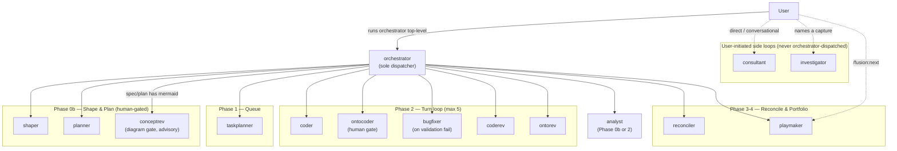
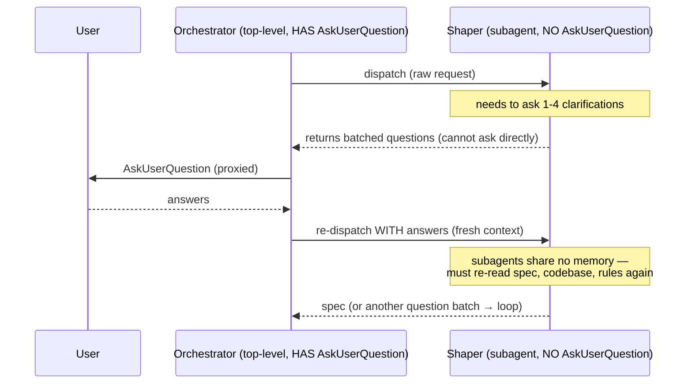

# Analysis: Agent coordination (fusion v5.x Circle A — LEAD)

**Date:** 2026-07-18 19:29
**Type:** Document Study + Impact (coordination analysis)
**Status:** Complete
**Requested by:** orchestrator (v5.x master plan, Circle A)
**Circle:** `260718-1924-v5x-overhaul`
**Feeds:** Circle C (editor-fit criteria, §7), Circle D (audit rubric, §6), Circle B (Setup-boilerplate finding, §4/F1)

## Question

How do the 15 (soon 16) fusion agents fit together as a coordinated system — who dispatches whom, how work reaches another agent, what the domain and executor parameters do, and where the gate model sits — and what in the *per-prompt* structure is duplicated versus divergent enough that Circle D should factor or fix it? Plus: capture the subagent-cannot-ask-user gap concretely, since it bit this session live. The report also emits the two hand-off artifacts the plan requires: Circle D's fixed audit rubric (§6) and Circle C's editor-fit criteria (§7).

## Scope

Read in full: all 15 `agents/*.md` (3,374 lines); `bin/fusion-rules` (219), `bin/fusion-paths` (365), `bin/fusion-workbench-root` (38); `README-agents.md` (250); `docs/philosophy.md` (161); the umbrella spec's Circle A section via the master plan `260718-1001_*_master-plan-fusion-v5x-overhaul.md`; `rules/design-diagrams.md`. Grep-quantified the shared Setup block, the Output-Style variants, the history-log step, and the readability-gate line across all prompts. Empirically confirmed the AskUserQuestion gap from this very subagent's tool inventory. Read-only throughout — nothing was modified.

## Findings

### 1. The dispatch graph — one hub, twelve spokes, two side loops

Dispatch is the orchestrator's monopoly, enforced two ways at once: only `orchestrator.md` carries a `tools:` allowlist naming `Agent(fusion:...)` (line 4), and every other prompt is prose-barred from calling `Agent` (`README-agents.md:43`, `planner.md:21`, `consultant.md:160`, etc.). The 14 non-orchestrator agents inherit tools from the parent session and declare only `name`/`description`. So the graph is a star: the orchestrator at the centre, every executor and reviewer a leaf that does its work and returns.

The orchestrator's `Agent()` allowlist names **12** dispatchable agents (`orchestrator.md:4`): coder, ontocoder, planner, shaper, coderev, ontorev, conceptrev, reconciler, taskplanner, analyst, bugfixer, playmaker. The remaining three of the fifteen are deliberately outside it: `consultant` and `investigator` are user-initiated only (`orchestrator.md:924-926`), and the orchestrator never recurses on itself.

Dispatch is phased, not free-form. Each dispatch is pinned to a phase of the Turn loop:

Every dispatch edge originates at the orchestrator; that fan-out of 12 is the design, not a smell — it is the dispatch-monopoly invariant (`README-agents.md:226`, philosophy §1). The side loops (dotted) are the two agents the user drives directly plus the `/fusion:next` path into playmaker.

### 2. How work reaches another agent — the file-mediated hand-off, not a call

Because sub-agents share no memory (`philosophy.md:24-25`), no leaf agent ever hands work to another leaf by calling it. Work travels as **files in the workbench**, and the orchestrator re-queues them. Four hand-off channels:

| Channel | Producer → nominal consumer | Mechanism | Routing point |
|---|---|---|---|
| **Issue** | coderev→coder; ontorev→ontocoder; investigator/analyst/bugfixer/shaper/planner/reconciler→coder or ontocoder | file in `issues/` (`_o_`) | Orchestrator picks it into next Turn's queue (`orchestrator.md:374`) |
| **Decision** | shaper/planner/analyst/reconciler/consultant/investigator file `_o_`; reconciler `_o_→_a_`; coder/ontocoder `_a_→_i_` | file in `decisions/` | Orchestrator surfaces `_o_` as user gate (`orchestrator.md:262`); realised via queue |
| **Verdict** | conceptrev → (no consumer; advisory) | file in `reviews/` + returned verdict | Orchestrator surfaces at the plan/spec gate (`orchestrator.md:236-237, 248-249`) |
| **Plan / spec / tasklist** | shaper→planner→taskplanner→executors | files in `planning/`, `tasklist.md` | Orchestrator sequences the chain (`README-agents.md:67-81`) |

The load-bearing consequence for the v5.x work: **Circle A's own deliverable is this file.** Circle D reads the rubric (§6) and Circle C reads the editor-fit criteria (§7) *from disk*, in later sessions with no shared context. The report is not a message to the orchestrator — it is the coordination artifact those circles consume.

Note the asymmetry conceptrev introduces: it is the one reviewer that files **nothing** (`conceptrev.md:29`). coderev/ontorev route findings as issues to an executor; conceptrev returns only a verdict, because a tangled design is fixed by re-planning (a human decision), not by an executor "fixing" a diagram. This is coherent, but it means conceptrev sits outside the reviewer→issue→executor loop that the other two anchor.

### 3. The domain and executor parameters — a thin overlay on three-plus-one agents

Two dispatch parameters ride the prompt as plain markdown lines (`CLAUDE.md` conventions; each agent parses its own first-non-empty-line):

- **`**Domain:** <code|data|strategic|knowledge>`** — the orchestrator detects it once (Setup Step 5, `orchestrator.md:124-143`) and passes it to `taskplanner` (Phase 1), `reconciler` (Phase 3), and `playmaker` (Phase 4). It biases *priority axis 1* (taskplanner), *verification protocol* (reconciler), and *ranking bias* (playmaker) — never the marker vocabulary or output structure. Each of the three carries an identical `### Parameter parsing` block and defaults to `code` if absent.
- **`**Executors:** coder, ontocoder, analyst`** — passed to `planner` (`planner.md:47-49`) so strategic/knowledge plans can route steps to `analyst`. Default `[coder, ontocoder]`.

The parameter model is clean and consistent: three parsers with byte-identical parsing prose, one extra on planner. The divergence worth noting is only that the *same* parsing paragraph is copy-pasted four times — a Circle-D dedup candidate, not a design fault.

### 4. Per-prompt structure — what is duplicated vs divergent

Grep-measured across all 15 prompts. The findings below are the raw material for Circle D's per-prompt scoring (§6).

**Setup boilerplate — the single largest duplication.** The Setup step-2 "Rules and paths check" block is near-identical in **14** of 15 prompts. The locked compressed variant (`"It prints one KEY=value line per key: OUT_* are your write targets… exit 3… exit 4…"`) appears verbatim in coder, ontocoder, coderev, ontorev, conceptrev, shaper, planner, taskplanner, reconciler, playmaker, investigator, bugfixer, analyst, consultant. The orchestrator (`orchestrator.md:100-116`) carries an **expanded bespoke variant** of the same content (full paragraphs, the root-anchored-surfaces note). So: 14 identical + 1 expanded. The shared "they are the only correct answer to 'where does this go'" sentence appears in all 15. Setup step 1 (locate-workbench) is likewise near-identical across the 14. This is Circle B's input and Circle D's largest single factoring opportunity — roughly 12-18 lines duplicated 14 times.

**Output-Style is two-tier.** The prompts split cleanly:

| Output-Style tier | Agents | What they carry |
|---|---|---|
| **Prose tier** (heavy) | orchestrator, shaper, planner, analyst, investigator, playmaker, consultant | `## Long-form prose vs short-form` block + explicit `Run the readability gate` line + default-voice profile loaded in Setup |
| **Executor/reviewer tier** (light) | coder, ontocoder, coderev, ontorev, bugfixer, taskplanner, reconciler | short "follows user-facing-output.md" + "no effort estimates unsolicited"; no long-form block |

The split *mostly* tracks `bin/fusion-rules`'s `IS_PROSE_AGENT` set (`fusion-rules:96-98`), which names **8**: orchestrator, consultant, shaper, planner, analyst, investigator, playmaker, **conceptrev**. But the "Long-form prose vs short-form" heading block appears in only **7** — conceptrev is the odd one out (F2 below). taskplanner and reconciler are prose-ish in practice but sit in the light tier. This is real divergence, not noise: three distinct Output-Style shapes exist where two would do.

**History-log step — the reviewers diverge.** 12 of 15 prompts name `$OUT_HISTORY` as a Process step. The three without: **coderev, ontorev, conceptrev** — the reviewers write a review file but no session-history log. This is already recorded as a prompt-gap in `260717-0031[o]-p8-lint-gate-scope-open-questions-from-conversions.md` (cited in `fusion-paths:110-115`). It is a genuine inconsistency — every other agent logs a history entry — but it may be intentional (reviewers' output *is* their record). Circle D must decide: unify (add the step) or document the exception.

**conceptrev's Setup omits the voice-profile read (F2).** `fusion-rules` emits default-voice for conceptrev (it is in `IS_PROSE_AGENT`), and conceptrev's Output Style *assumes* it ("Long-form prose … follows the project's writing voice profile loaded at Setup", `conceptrev.md:128`). But conceptrev's Setup step 2 (`conceptrev.md:19`) does not tell the agent to read/apply the emitted `default-voice-*.yaml` — it only calls out `design-diagrams.md`. The seven prose-tier agents *do* carry the explicit "if it emits a `default-voice-*.yaml` path, read it…" instruction in Setup. So conceptrev has a Setup/Output-Style mismatch: the profile is emitted and referenced but never explicitly loaded.

**Length spread.** orchestrator 941 lines; next largest analyst 282, reconciler 228, shaper 224; smallest ontorev 103, coder 114, coderev 119. The orchestrator is 3.3× the next agent and 28% of the whole corpus. It is also the only agent with a `tools:` allowlist and a documented history of breaking when that line is edited (the v3.0.1 AskUserQuestion-denied episode, `CLAUDE.md` troubleshooting table). Circle D must audit it last and re-verify the allowlist after every edit.

### 5. The subagent-cannot-ask-user gap — concrete, and it generalises

**The instance.** `AskUserQuestion` appears in exactly one prompt's toolset: the orchestrator's `tools:` line (`orchestrator.md:4`). The other 14 agents inherit tools from the parent session. Empirically — verified from *this analyst subagent's own tool inventory this session* — a dispatched sub-agent does **not** receive `AskUserQuestion` (it is absent from both the available and the deferred tool lists in the subagent context). So a Claude Code sub-agent runs non-interactively: it cannot prompt the user.

**Why it bites the shaper hardest.** The shaper's entire method is an interactive clarification loop: "Present decisions to the user using `AskUserQuestion`. One round at a time. Ask 1-4 related decisions per round" (`shaper.md:120-124`), across multiple rounds. The orchestrator's Phase 0b.1 reinforces the intent: "The shaper will involve the user in decisions via `AskUserQuestion`. Do not intercept or shortcut these interactions — the shaper's user involvement is the whole point." (`orchestrator.md:233`). But when the orchestrator dispatches the shaper *as a sub-agent*, the shaper has no `AskUserQuestion` to call. The prompt instructs a capability the runtime withholds.

**The cost.** The shaper's designed multi-round loop collapses into a proxy relay. Each round is: shaper returns → orchestrator asks user → orchestrator re-dispatches shaper. Because sub-agents share no memory (`philosophy.md:24`), every re-dispatch is a cold start — the shaper re-reads CLAUDE.md, the codebase, and its rules on each round. The three costs: (a) dispatch round-trips multiply by the number of clarification rounds; (b) context is re-established from scratch each round, burning tokens and risking drift; (c) the prompt-vs-runtime contradiction is a latent trap — the prompt says "use AskUserQuestion", the tool is absent, so behaviour depends on the model improvising the return-batch pattern rather than following an explicit instruction. This session hit exactly this friction.

**It generalises to a class.** The gap is not shaper-specific. It is: *any agent whose workflow requires mid-execution user involvement AND is dispatchable as a sub-agent.* Members:
- **shaper** — worst hit; clarification is its purpose. Dispatched in Phase 0b.1 and (for in-Circle clarification) mid-Turn.
- **planner** — asks the user via `AskUserQuestion` for technical decisions that affect plan structure (`planner.md:65`). Dispatched in Phase 0b.2.
- **bugfixer** — "If the input is too vague to investigate… ask for clarification" (`bugfixer.md:44`); "ask the user to confirm before making the [ontology] edit" (`bugfixer.md:23-24`). Dispatched on validation failure — cannot actually ask, so its ontology-gate and clarification both fall back to the orchestrator.
- **analyst** — "If unclear, ask" appears throughout (types, scope). Dispatched in Phase 0b/2.

The orchestrator absorbs all of it: it is the only agent that can reach the user, so every sub-agent's user-involvement must be proxied through the orchestrator's gate machinery. That is *why* the orchestrator carries the entire gate model (Human Gate Rules, Rebalance gate) — the gates are, in part, the proxy surface for sub-agents that cannot ask. The design is internally consistent, but the shaper/planner/bugfixer prompts do not *say* "you cannot ask directly when dispatched; return your questions to the orchestrator" — they say "use AskUserQuestion", which is only true when the agent is run top-level.

**Tag: re-wiring-for-D, with a Circle-C consequence.** See F5 for the ranked entry. The fix is prompt-level (make the return-to-orchestrator contract explicit in the sub-agent prompts, or state the top-level-vs-dispatched distinction), which is Circle D's scope; the editor (Circle C) must be born knowing it (§7, editor-fit criterion 6).

### Findings, ranked and tagged

Ranked by coordination cost. Tag = **analysis-only** (a recommendation the report makes; no prompt edit follows in this overhaul) or **re-wiring-for-D** (a concrete edit Circle D should apply).

| # | Finding | Coord. cost | Tag |
|---|---|---|---|
| **F1** | Setup steps 1-2 duplicated across 14 prompts (+1 expanded on orchestrator). Largest single duplication; ~12-18 lines × 14. | High | **re-wiring-for-D** (factor via Circle B's loadable unit; the umbrella spec assigns the mechanism to B, the application to D) |
| **F2** | Subagent-cannot-ask-user: shaper/planner/bugfixer/analyst prompts instruct `AskUserQuestion` but the tool is absent when they are dispatched; all user-involvement proxies through the orchestrator with cold-start re-dispatch cost. | High | **re-wiring-for-D** (make the dispatched-vs-top-level contract explicit in the four prompts; §7 for the editor) |
| **F3** | Output-Style exists in three shapes where two suffice; conceptrev is in `IS_PROSE_AGENT` but lacks the long-form block; taskplanner/reconciler sit in the light tier despite prose-ish output. | Medium | **re-wiring-for-D** (normalise to two Output-Style templates keyed off the prose/non-prose split; align conceptrev) |
| **F4** | conceptrev Setup omits the explicit default-voice read that its own Output Style assumes (`conceptrev.md:19` vs `:128`). | Medium | **re-wiring-for-D** (add the voice-profile read line to conceptrev Setup, matching the 7 prose agents) |
| **F5** | History-log step absent from the three reviewers (coderev, ontorev, conceptrev) while 12/15 agents have it. Already tracked in issue 260717-0031_*_p8-lint-gate-scope-open-questions-from-conversions.md. | Medium | **re-wiring-for-D** (decide: unify or document the exception; do not leave it undecided) |
| **F6** | The `### Parameter parsing` block is copy-pasted verbatim 4× (taskplanner, reconciler, playmaker, planner-ish). | Low | **re-wiring-for-D** (candidate for the same loadable-unit treatment as Setup, if Circle B's mechanism supports non-Setup shared blocks; else leave) |
| **F7** | conceptrev files no issues while coderev/ontorev do — it sits outside the reviewer→issue→executor loop. | Low | **analysis-only** (this is correct by design — a tangled design is re-planned, not executor-fixed; documented, not changed) |
| **F8** | The orchestrator is 28% of the corpus and the only `tools:`-bearing prompt, with a fragile-allowlist history. | Structural | **analysis-only** (audit last in D; re-verify allowlist after every edit — a process constraint, not an edit) |

## Implications

The agent set is a well-formed star with file-mediated coordination — the dispatch graph is a clean DAG with one legitimate hub and no cross-leaf edges (F7's conceptrev asymmetry is the only shape wrinkle, and it is correct). The coordination problems are **not** in the graph; they are in the *prompts*: duplication (F1, F6), a two-tier-should-be Output Style with one misfiled member (F3, F4), an undecided reviewer inconsistency (F5), and one genuine runtime-vs-prompt contradiction (F2). Every re-wiring finding is a prompt edit, which is exactly Circle D's remit, and F1's mechanism is exactly Circle B's. Nothing here reopens the dispatch model or the domain-parameter design.

For the **editor (Circle C)**: it inherits the whole prompt skeleton (Setup, Scope, Output Style, produce-only boundary) and must land on the *post-B, post-D* side of every finding above — it should be authored against the factored Setup unit (F1), the two-template Output Style (F3), and with the F2 dispatched-vs-top-level contract explicit from day one. §7 encodes this.

## Recommendations

1. **Circle B** consumes F1: build the loadable Setup unit so the 14 duplicated blocks become one. Consider whether the mechanism can also absorb F6 (the parameter-parsing block) — if it only factors Setup, F6 stays a D-local dedup.
2. **Circle D** consumes F1-F6 as its edit list, scored per the §6 rubric. Order: smallest homogeneous prompts first (coder/ontorev/coderev) to validate the factoring form, then the domain agents, then the orchestrator last (F8).
3. **Circle C** authors the editor against §7's criteria, on the post-B/post-D side of every finding.
4. **Gate:** conceptrev evaluates this report's two diagrams; the report goes to the user at the analysis gate. The dispatch flowchart's fan-out of 12 on the orchestrator node is expected and explained (dispatch monopoly) — it should read as *clean-dense*, not a god-node defect.

---

## 6. Circle D's audit rubric (hand-off artifact — D scores every one of the 16 prompts against this)

A fixed five-dimension rubric, each dimension with a **concrete per-prompt test** derived from the divergences actually found in §4. D records a per-prompt verdict of **pass** / **targeted-edit** / **defer-with-reason** for each dimension.

| # | Dimension | Concrete test (what D checks on each prompt) | Pass condition |
|---|---|---|---|
| **R1** | **Clarity of scope boundary** | Does the prompt state, in prose, what it owns and what it must NOT touch, naming the sibling agent that owns the excluded layer (e.g. coder→"data belongs to ontocoder")? Is the produce-only / read-only constraint unambiguous? | An unfamiliar reader can name the agent's write scope and its two nearest neighbours' scopes from the prompt alone. |
| **R2** | **Structural conformance** | Does the prompt follow the canonical section order — frontmatter → Setup (locate + rules/paths) → Scope → Process/What-you-do → Output Format → Output Style — with no missing or reordered load-bearing section? | All six canonical sections present and in order; any deviation is justified in a comment or is a defer-with-reason. |
| **R3** | **Duplicated Setup boilerplate** | Does the prompt still carry the verbatim Setup step-1/step-2 block, or has it been replaced by the reference to Circle B's loadable unit (per the agreed pointer form)? Measured against the frozen 14-way-identical baseline in §4/F1. | Setup is the factored pointer form, not the inlined block. (Pre-B: pass = "carries the standard block unmodified"; post-B: pass = "uses the loadable unit".) |
| **R4** | **Tool discipline** | (a) For the orchestrator only: is `AskUserQuestion` still in the `tools:` allowlist and is the allowlist otherwise intact after the edit (v3.0.1 guard)? (b) For every dispatchable agent whose workflow asks the user (shaper/planner/bugfixer/analyst): does the prompt state the dispatched-vs-top-level AskUserQuestion contract (F2), rather than instructing an unconditional "use AskUserQuestion"? (c) Does the prompt claim no tool it cannot receive as a subagent? | Orchestrator allowlist verified intact; the four user-asking agents carry the explicit dispatched-contract line; no prompt instructs an unavailable tool without the contract note. |
| **R5** | **Output-Style correctness** | Does the prompt sit in the right Output-Style tier for its `IS_PROSE_AGENT` classification in `bin/fusion-rules` — prose agents carry the long-form-vs-short-form block AND the readability-gate line AND load the voice profile in Setup; non-prose agents carry the light template? Specifically: is conceptrev aligned (F3/F4), and do the reviewers' history-log absence (F5) resolve to a decided state? | Output-Style tier matches `IS_PROSE_AGENT`; conceptrev Setup reads the emitted voice profile; the history-log step is present or its absence is explicitly documented in the prompt. |

**Rubric application rule for D:** a prompt that passes all five is left alone (no wholesale rewrite — spec §Circle D non-goal). A dimension scoring targeted-edit gets the minimal edit that reaches pass. `defer-with-reason` is only valid when the fix depends on an input that has not landed (e.g. a prompt cannot adopt the factored Setup form before Circle B ships it).

## 7. Circle C's editor-fit criteria (hand-off artifact — C plans the editor prompt against this)

What the new produce-only editor (Redakteur) agent must satisfy to fit the existing 15-agent set coherently. Derived from the invariants every current agent honours (§1-§4) plus the gaps the editor must be born on the right side of (§5).

1. **Dispatch-namespace fit.** The editor is a leaf: it declares only `name`/`description`, inherits tools, and never calls `Agent`. If the orchestrator is to dispatch it, `Agent(fusion:editor)` is added to the orchestrator's `tools:` allowlist AND the allowlist re-verified intact afterward (the v3.0.1 precedent, F8). If it is user-initiated-only (like consultant/investigator), it stays *out* of the allowlist and says so — C must decide which, and the decision must be explicit in the prompt.
2. **Setup-and-path discipline.** The editor's Setup resolves rules via `bin/fusion-rules editor` and paths via `bin/fusion-paths editor`, holds the `KEY=value` values, and hard-codes **no** store-path literal (the path-lint test blocks literals in `agents/*.md`). Per the master plan, `bin/fusion-rules` gets an `editor)` case with `IS_PROSE_AGENT=1` and no special pattern; `bin/fusion-paths` gets no new `OUT_*` key because the editor writes project-side, not to the workbench. The editor's prompt must therefore name only the session-history key every agent resolves, and must expand `$SCAN_*`/`$OUT_*` correctly so `bin/fusion-paths editor` key-derivation succeeds.
3. **Tool-discipline honesty (the F2 lesson, born-correct).** The editor is produce-only and, being dispatchable, runs without `AskUserQuestion`. Its prompt must NOT instruct interactive clarification as a subagent; if it needs a choice from the user, it states the return-to-orchestrator (or top-level-only) contract explicitly. It never claims a tool it cannot receive when dispatched.
4. **Output-Style / stilwerk consumption.** As a prose agent (`IS_PROSE_AGENT=1`), the editor carries the **prose-tier** Output-Style template (post-F3 normalised form): the long-form-vs-short-form block, the readability-gate line, and Setup instructions to read the emitted `chat-voice-*.yaml` (short-form) and `default-voice-*.yaml` (long-form writing profile). Its Markdown/pptx/translation deliverables are long-form default-voice; its chat replies are chat-voice. It uses `dl-brand-pptx` + the public `pptx` skill for slides. It must not repeat conceptrev's F4 mismatch (Setup must actually read the profiles its Output Style assumes).
5. **Scope boundary vs coder / ontocoder / analyst / consultant (stated in prose, per R1).** The editor owns *prose and rendered documents* — Markdown, branded pptx, en↔de translation both ways. Explicit exclusions the prompt must name: it does **not** write or edit code (coder), structured data/ontology (ontocoder), analysis reports or decision records (analyst — the editor renders/translates, it does not *analyse*), or opinionated consultation reports (consultant). It does not review other agents' prose at v5.x. The nearest-neighbour test (R1): a reader must be able to tell "when do I use the editor vs the analyst vs the consultant" from the prompt.
6. **Produce-only, file-mediated coordination.** Like every leaf, the editor coordinates through files, not calls. Its deliverables land project-side (not the workbench); any follow-on work it identifies is *recommended* (an issue or a note), never dispatched. It logs a session-history entry like the other 12 history-writing agents (it must not replicate the reviewers' F5 omission).
7. **Registration completeness (so the set stays coherent).** Adding the editor is not just a new prompt — C's plan must touch, in lockstep: `agents/editor.md`, the `editor)` case in `bin/fusion-rules`, `README-agents.md` (the agents table + the "14/15" narrative), `.claude-plugin/plugin.json` (count 15→16 + version bump), plugin `CLAUDE.md` (the two agent-count references), the orchestrator routing table + `tools:` if dispatched, and `docs/philosophy.md` §1 (agent count — Circle E does this). It must pass `claude plugin validate .`, the path-lint test, and the default-agent smoke test.

## Sources

- `agents/orchestrator.md` (941), `analyst.md` (282), `reconciler.md` (228), `shaper.md` (224), `investigator.md` (204), `playmaker.md` (200), `taskplanner.md` (192), `planner.md` (181), `consultant.md` (174), `bugfixer.md` (160), `conceptrev.md` (128), `ontocoder.md` (124), `coderev.md` (119), `coder.md` (114), `ontorev.md` (103) — all read in full.
- `bin/fusion-rules:80-219` (agent→pattern case, IS_PROSE_AGENT set `:96-98`, IS_DIAGRAM_AGENT set `:108-110`, voice-profile emit `:152-201`).
- `bin/fusion-paths:155-337` (name→prompt resolution, key derivation `:193`, Circle-vs-shared resolution `:239-296`, the derived-not-declared rationale + the 11-known-prompt-gap note `:104-119`).
- `README-agents.md:23-43` (agents table + dispatch monopoly), `:55-61` (inheritance model), `:166-173` (pattern→agent mapping).
- `docs/philosophy.md:9-21` (specialization), `:24-50` (workbench-mediated coordination), `:66-77` (domain parameter).
- `260718-1001_*_master-plan-fusion-v5x-overhaul.md` §Circle A/B/C/D, resolved decisions.
- `rules/design-diagrams.md` (diagram doctrine + coherence self-check, applied to §1 and §5 diagrams).
- Grep quantification (Setup block ×14+1, prose-block ×7, default-voice-load ×7, OUT_HISTORY ×12, readability-gate ×8) and the empirical AskUserQuestion-absent check from this subagent's own tool inventory.

## Open Questions

- [ ] **F5 (reviewers' history log):** unify or document? — a Circle-D decision, flagged not decided here (analysis-only recommendation is to document the exception, since a reviewer's review file already *is* its durable record; but this is the user's/D's call).
- [ ] **F6 (parameter-parsing dedup):** in-scope for Circle B's loadable-unit mechanism, or a D-local dedup? — depends on whether B's mechanism factors non-Setup shared blocks. Master plan scopes B to Setup; if it stays Setup-only, F6 is D-local.
- [ ] **Editor dispatch (C-criterion 1):** orchestrator-dispatched or user-initiated-only? — C must decide; it changes whether the orchestrator `tools:` allowlist is touched (F8 risk surface).
