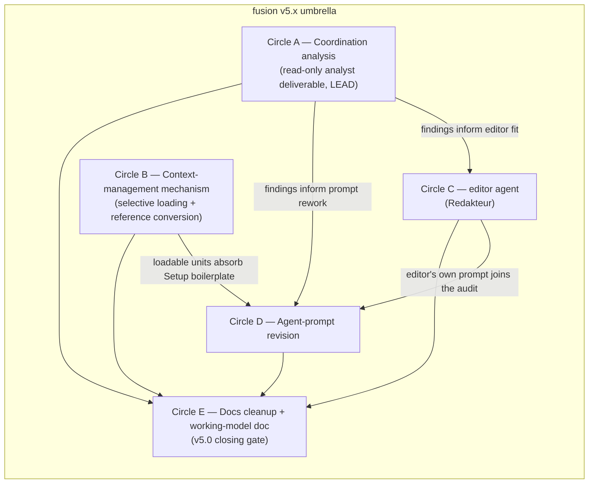

# Spec: fusion v5.x overhaul — umbrella framing

**Date:** 2026-07-18
**Status:** Complete — all ten forks were resolved and the spec was realised across v5.1.0–v5.4.0; closed retroactively by the reconciler, see Reconciliation Log.
**Source:** User request to overhaul the fusion plugin for v5.x, spanning five themes: (1) selective context management for a consuming project's CLAUDE.md and rules, (2) a new `editor` (Redakteur) agent, (3) systematic revision of the agent prompts, (4) an agent-coordination analysis, (5) a circle-centric, spec-driven working-model doc plus a docs cleanup for v5.0.

---

## Directive

After this work, fusion loads heavy knowledge selectively per agent and per topic rather than always-on, and a consuming project's own `CLAUDE.md` becomes a lean index that points at loadable units. Fusion ships a new `editor` agent (the Redakteur) that turns raw material into customer-ready deliverables in the stilwerk voice. The agent prompts are audited against a shared rubric and rewritten where they diverge or carry duplicated Setup boilerplate. The agent-coordination model is analysed as a read-only deliverable whose findings feed the editor and prompt work. The circle-centric, spec-driven working model is documented plainly, and `docs/philosophy.md` is freed of its historical hermeneutic-circle framing while keeping the operational Coherence and Circle content. The work ships as five sequenced circles under one v5.x umbrella, not one monolithic change.

---

## Scope

This is a genuine multi-concern request. The five themes differ in kind: a loader mechanism, a net-new agent, a prompt-quality pass, a read-only analysis, and a documentation pass. They carry real dependencies on each other. Folding them into one spec would couple unrelated work and force a single large planning pass over parts that want different executors and different gates.

The settled shape is **five sequenced circles, framed by this umbrella spec.** Each theme becomes its own circle with its own spec, produced when that circle activates. This umbrella spec fixes the split, the sequence, and the cross-circle contracts. It does not plan any circle's internals.

**Sequencing.** Circles A and B are the parallel foundation and start first. Circle A is read-only and produces the evidence the editor-fit (C) and prompt-rework (D) decisions depend on. Circle B is the foundational mechanism and can proceed alongside A. Circle C depends on A's findings for the editor's scope fit. Circle D waits on A and B, because the prompts shrink only once the loadable units exist and the coordination rubric is known, and it also covers the editor's own prompt, so C precedes it. Circle E is the v5.0 closing gate: it documents the settled result and lands last.

---

## Circles

### Circle A — Agent-coordination analysis (LEAD)

**Description:** A read-only analyst deliverable studying how the 15 (soon 16) agents fit together: the dispatch graph, the hand-offs, the orchestrator's routing table, the reviewer-to-issue flow, the domain parameter, and the gate model (Human Gates, per-Turn Coherence, Rebalance). It names concrete optimisation potential and states the success criteria that Circles C and D plan against. The circle has no authority to re-wire anything; every concrete re-wiring it identifies is handed to Circle D.

**Acceptance criteria:**
- [ ] A written analysis report enumerates every agent-to-agent dispatch path and hand-off in the current system, with a Mermaid dispatch/interaction diagram.
- [ ] The report identifies duplicated or divergent structure across prompts (Setup boilerplate, Output Style sections, tool discipline) as candidates for consolidation, and names them per-prompt.
- [ ] The report captures the known hand-off gap where a subagent cannot involve the user: the shaper dispatched as a subagent has no `AskUserQuestion`, so user-involving work must be proxied by the orchestrator. The report states whether this is one instance of a broader class and what the coordination cost is.
- [ ] Per finding, the report states whether the fix is an analysis-only recommendation or a concrete re-wiring for Circle D, and why.
- [ ] Success criteria for the editor-fit decision (Circle C) and the prompt-rework scope (Circle D) are stated explicitly, so those circles plan against evidence rather than intuition.

**Decisions made:**
- Authority: analysis-only, read-only. Concrete re-wiring flows into Circle D, not this circle.
- The subagent user-involvement gap is captured as a coordination finding here, not fixed here.

**Non-goals:** No edits to any prompt, code, or config. No re-wiring of the dispatch graph.

### Circle B — Context-management mechanism

**Description:** Extend fusion's selective-loading discipline so large bodies of a consuming project's knowledge become agent- and topic-scoped loadable units, and the always-on surface stays lean and points at them. The mechanism operates on the consuming project's own `CLAUDE.md` and its `rules/`, not on the user's global `~/.claude/` config. It extends `bin/fusion-rules` (per-agent pattern-matched discovery) with a manifest and topic-unit scheme: knowledge is decomposed into topic- and agent-specific units, loaded via the manifest, and the heaviest knowledge is packaged as on-demand Skills. `CLAUDE.md` becomes a lean index plus pointers. Loading is both per-agent and per-topic/circle: an agent pulls its domain as `fusion-rules` does today, and a circle or topic additionally pulls topic-specific units. The circle also resolves the canonical-home split fusion already intends: `.claude/rules/` is project-wide for every Claude session, `./rules/` is fusion-agent-specific.

Fusion ships the mechanism and its documentation, and performs a reference conversion on the representative project `unite-co-creator` as the dogfood proof. The proof is a "proven by a run" acceptance: the 43 kb, 259-line `CLAUDE.md` becomes a lean index, and the ~1,860 lines of rule files currently duplicated across `rules/` and `.claude/rules/` are deduplicated onto the canonical-home split.

**Acceptance criteria:**
- [ ] A consuming project can register a large knowledge base as topic-scoped loadable units, and an agent pulls only the units matching its agent and topic at Setup. Verifiable by observing that an agent's loaded context excludes non-matching units.
- [ ] A circle or topic can additionally pull topic-specific units beyond the agent's own domain, demonstrating the per-agent-and-per-topic granularity.
- [ ] The consuming project's `CLAUDE.md` is reduced to a lean index with pointers; a documented convention states what stays always-on versus what is pulled on demand.
- [ ] The heaviest knowledge is delivered as on-demand Skills, consistent with fusion's existing self-contained skills.
- [ ] The reference conversion on `unite-co-creator` is complete: the 43 kb `CLAUDE.md` is a lean index, and the 12 duplicated rule files are deduplicated onto the `.claude/rules/` (project-wide) versus `./rules/` (fusion-agent-specific) split. The conversion artifacts live in the `unite-co-creator` repo, not in the plugin.
- [ ] The mechanism is project-agnostic: it ships in the plugin and carries no UNITE-specific content.
- [ ] Existing `bin/fusion-rules` and `bin/fusion-paths` behaviour is preserved with no regression (`HYG-NO-REGRESS`).

**Decisions made:**
- Target surface: the consuming project's own `CLAUDE.md` and `rules/`. The global `~/.claude/` migration is out of scope; the user handles it.
- Form: manifest plus topic-unit scheme extending `bin/fusion-rules`; heavy knowledge as on-demand Skills; `CLAUDE.md` as lean index plus pointers.
- Delivery depth: mechanism plus documentation, and the reference conversion on `unite-co-creator` as dogfood proof.
- Granularity: per-agent and per-topic/circle loading.

**Non-goals:** No migration of the user's global `~/.claude/rules/`. No UNITE-specific content in the plugin.

### Circle C — `editor` (Redakteur) agent

**Description:** A new agent that writes, revises, translates, and renders text into specific output forms, and produces genuinely customer-ready, well-readable deliverables. It applies the stilwerk voice profiles (`default-voice-{en,de}.yaml` long-form, `chat-voice-{en,de}.yaml` short-form) and `rules/user-facing-output.md`. For slide output it uses the `dl-brand-pptx` skill together with the public `pptx` skill. It handles English-to-German and German-to-English translation. The agent's role is bounded to production: it writes, revises, translates, and renders. It does not review other agents' prose at v5.x. It fills the current gap where no existing agent owns polished, form-specific, style-applied output.

**Acceptance criteria:**
- [ ] The agent produces a customer-ready deliverable in Markdown, with the stilwerk long-form voice profile demonstrably applied.
- [ ] The agent produces a branded pptx deliverable via the `dl-brand-pptx` and public `pptx` skills.
- [ ] The agent produces an English-to-German and a German-to-English translation of a supplied text, each in the target-language voice profile.
- [ ] The agent's scope boundary versus `coder`, `ontocoder`, and `analyst` is stated in prose in its prompt: what it owns, what it must not touch.
- [ ] The agent produces only; it does not review other agents' prose or file findings against them.
- [ ] The agent is registered everywhere an agent must be (dispatch namespace, README-agents, agent count, `bin/fusion-rules` patterns as needed). The exact registration surface is enumerated by the planner, not here.

**Decisions made:**
- Output forms: Markdown, pptx (via `dl-brand-pptx` + public `pptx`), and English-German translation both ways. docx is deferred.
- Role: produce only (write / revise / translate / render). No reviewing of other agents' prose at v5.x.

**Non-goals:** No docx output. No review or critique of other agents' user-facing prose. No ownership of code, ontology, or analysis content.

### Circle D — Agent-prompt revision

**Description:** A per-agent audit of all agent prompts (16, including the new editor) against a shared rubric, with targeted rewrites where a prompt diverges. It is neither a full rewrite of every prompt nor a mere lint pass. The rubric covers clarity, structure, duplicated Setup boilerplate, tool discipline, and the Output Style sections; Circle A's analysis sharpens what "optimal" means concretely for each dimension. The circle depends on Circle B: once Setup boilerplate and heavy knowledge move into loadable units, the prompts shrink, and the audit factors that shift in rather than duplicating the text across prompts. It also covers the editor's own prompt from Circle C.

**Acceptance criteria:**
- [ ] Every agent prompt is assessed against the stated rubric (clarity, structure, duplicated Setup boilerplate, tool discipline, Output Style sections), informed by Circle A's findings.
- [ ] Each divergence found is either rewritten in a targeted edit or explicitly deferred with a reason. The pass is per-agent audit plus targeted rewrite, not a full rewrite and not a lint-only pass.
- [ ] Setup boilerplate that Circle B makes loadable is factored out of the prompts rather than restated.
- [ ] No agent loses a load-bearing boundary, tool-discipline line, or output-shape contract in the process (`HYG-NO-REGRESS`). The orchestrator's `tools:` allowlist is verified intact after any edit, given its known fragility (the v3.0.1 `AskUserQuestion`-denied episode).
- [ ] The editor's prompt from Circle C is included in the audit and meets the same rubric.

**Decisions made:**
- Depth: per-agent audit against the rubric with targeted rewrites. Not a full rewrite; not a lint pass.
- The rubric dimensions are fixed: clarity, structure, duplicated Setup boilerplate, tool discipline, Output Style sections.

**Non-goals:** No wholesale rewrite of prompts that already pass the rubric. No change to the domain-parameter model or the dispatch graph (re-wiring, if any, is scoped by Circle A's findings and lands as targeted edits here).

### Circle E — Circle-centric working-model doc plus docs cleanup (v5.0 closing gate)

**Description:** Substantial backbone rework of the docs to match the settled v5.x state, and a plain documentation of the circle-centric, spec-driven working model. The largest single change is `docs/philosophy.md`: drop the hermeneutic-circle and Gadamer residue and the other historical framing that is interesting but plays no practical role and tends to confuse; keep the operational Coherence and Circle content. Add a plain explainer of two things: how the user works circle-specifically and spec-driven, and how the hooks and gates work. All docs align to the new backbone. This is the v5.0 closing gate, so it documents the settled result of Circles A through D and lands last.

**Acceptance criteria:**
- [ ] `docs/philosophy.md` no longer leads with or depends on the hermeneutic-circle / Gadamer framing; the operational Coherence and Circle content is retained and expressed in plain operational terms.
- [ ] A clear explainer of the circle lifecycle, the spec-driven flow, and how hooks and gates work exists in the docs, written for the user rather than the agent.
- [ ] All docs affected by Circles B through D (README, README-agents, README-hooks, `CLAUDE.md`, `/fusion:help`) are updated to reflect the settled v5.x state (`HYG-DOCS-FRESH`).
- [ ] The doc set is internally consistent: no doc still describes a mechanism that Circles B through D changed.

**Decisions made:**
- Depth: substantial backbone rework. Drop the hermeneutic-circle / Gadamer residue and other historical framing; keep the operational Coherence and Circle content; add a plain explainer of the user's circle-specific, spec-driven working model and of the hooks and gates.

**Non-goals:** No re-engineering of hooks, gates, the monitor, or the compliance guard. Circle E documents them; it does not change them. No change to the Coherence-triangle model or the Circle lifecycle vocabulary; it documents these more clearly.

---

## Constraints

- **fusion is project-agnostic.** The plugin ships no domain-specific knowledge. The reference conversion in Circle B is performed on the `unite-co-creator` repo and its artifacts stay in that repo. The plugin receives only the mechanism and its documentation.
- **The global `~/.claude/` config is out of scope.** The user's global `~/.claude/rules/` currently holds UNITE-specific rules; the user removes those. Fusion touches only a consuming project's own `CLAUDE.md` and `rules/`.
- **Store-path literals are forbidden in agent and skill prompts.** The new `editor` agent and any Circle-B loader convention must resolve paths through `bin/fusion-paths` and rules through `bin/fusion-rules`. The path-lint test (`hooks/lib/__tests__/path-literal-lint.test.ts`) fails `npm test` on a type-folder literal in `agents/*.md` or `skills/*/SKILL.md`.
- **The orchestrator `tools:` allowlist is the only explicit one.** Adding the editor to the dispatch graph means it must be namespaced (`fusion:editor`) and, if the orchestrator dispatches it, added to the orchestrator's allowlist (the v3.0.1 `AskUserQuestion`-denied episode is the cautionary precedent).
- **No regressions on the compliance guard, gate model, or existing helpers.** Circles B and D touch shared surfaces; `HYG-NO-REGRESS` binds.
- **Marker and naming conventions** are fixed by `rules/fusion-workbench-conventions.md` (underscore markers; spec and plan files carry `_o_`). No circle may reintroduce bracket-marker globs.
- **Every release bumps `plugin.json` and `marketplace.json`** and validates (`claude plugin validate .`). A v5.x that adds an agent and changes docs must pass the smoke test that the default agent resolves.

## Out of Scope

- Migrating the user's global `~/.claude/rules/` UNITE knowledge onto the new mechanism. The user handles the global config himself.
- Rewriting the compliance guard, the monitor, or the hook architecture. Circle E documents hooks and gates; it does not re-engineer them.
- Changing the domain-parameter model, the Coherence-triangle model, or the Circle lifecycle vocabulary. Circle E documents these more clearly; it does not redefine them.
- Output forms beyond Markdown, pptx, and English-German translation for the editor. docx is deferred to a later circle if demand arises.
- Concrete re-wiring of the coordination model inside Circle A. Circle A is analysis-only; re-wiring lands as targeted edits in Circle D.
- A review role for the editor. The editor produces only at v5.x; a review role would be a separate later circle.

## Open for Planner

Technical and mechanical decisions deferred to per-circle planning, not to the shaper:

- **Circle A report structure** — how the dispatch graph is enumerated and diagrammed, how findings are ranked, what the rubric handed to Circle D looks like in detail. Planner and analyst determine.
- **Circle B loader design** — manifest format, topic-tag schema, whether units are files, Skills, or frontmatter, and how `bin/fusion-rules` is extended versus adding a new helper. The reference-conversion mechanics on `unite-co-creator` (which rule files map to which home, how the `CLAUDE.md` index is sectioned). Planner determines against the existing helper conventions.
- **Circle C editor internals** — how the agent consumes the stilwerk profiles at runtime, how it invokes the pptx skills, its tool allowlist, output-file placement, and the exact registration surface (README-agents, agent count, dispatch namespace). Planner determines.
- **Circle D audit order and factoring** — which prompts first, how the shared Setup text becomes an included unit (couples to Circle B), and how the rubric is scored per prompt. Planner determines.
- **Circle E doc structure** — how `philosophy.md` is re-sectioned, what moves to README versus stays in docs, where the hooks-and-gates explainer lives. Planner and editor determine.
- **Activation order within the umbrella** — whether A and B truly run fully in parallel or A leads B by a step, and the per-circle activation order. Playmaker and orchestrator determine at activation time.

## Reconciliation Log

**260806-1152 (reconciler, workbench-wide pass)** — marker `_o_` → `_c_`, retroactive: every capability this spec carries was delivered by the master plan (`planning/260718-1001_*_master-plan-fusion-v5x-overhaul.md`, now Complete) and verified at the Circle's coherent closure on 2026-07-19 (`history/260719-1455-reconciliation.md`). Same record-lag class as the master plan; see its log for the delivery evidence.
