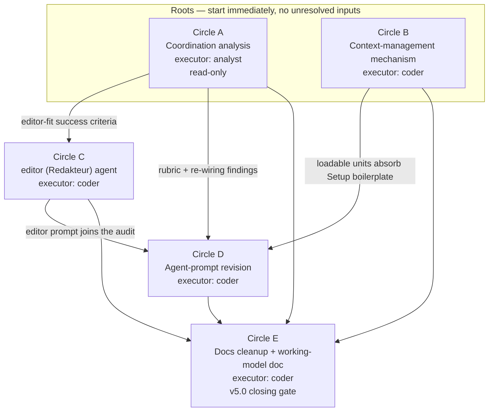

# Master Implementation Plan: fusion v5.x overhaul

**Date:** 2026-07-18
**Status:** Complete — all five work packages (A–E) delivered and verified; closed retroactively by the reconciler, see Reconciliation Log.
**Spec:** `260718-0437_*_spec-fusion-v5x-overhaul.md` (Final; conceptrev verdict clean)
**Executors:** coder, analyst

## Directive

The umbrella spec fixes what v5.x delivers and splits it into five sequenced circles: a coordination analysis (A), a context-management mechanism (B), a new editor agent (C), an agent-prompt revision pass (D), and a docs cleanup plus working-model doc (E). This master plan sequences all five, states each circle's implementation approach and acceptance, and details the two roots (A and B) to executable step level. It does not re-decide anything the spec settled. Where a circle's file-level mechanics depend on findings that do not yet exist (A's analysis, B's landed mechanism), the plan says so and stops short of inventing precision.

This is a plan for review, not five plans. Circles C, D, and E get a scoped step outline here and a dedicated per-circle planning pass when they activate, once their inputs exist.

## Current State

The grounding below is read from the live tree on 2026-07-18, not from memory.

**Agents.** 15 agent prompts under `agents/`, totalling 3,374 lines. The orchestrator alone is 941 lines; the rest run 103 to 282. `plugin.json` is at `5.0.0` and its description reads "15 project-agnostic specialized agents". The editor will be the 16th.

**The two helpers.**
- `bin/fusion-rules <agent>` maps an agent to filename patterns and emits every matching `*pattern*.md` from three roots in read-order: the plugin's `rules/`, the project's `./rules/`, the project's `.claude/rules/`. It also emits five always-on plugin rules, the chat-voice profile for every agent, the default-voice profile for the eight prose agents, and `design-diagrams.md` for the six diagram agents. The agent-to-pattern table is a hand-authored `case` block; an unknown agent exits 2.
- `bin/fusion-paths <name>` derives a consumer's `OUT_*`/`SCAN_*` key set by grepping the consumer's own prompt, then resolves each key into the active Circle or into `shared/` per the Origin Rule. Adding a key a prompt names but the resolver cannot value exits 4. The derivation is deliberately prompt-driven so no second copy of the key set can drift.

**The Setup boilerplate.** Every agent's Setup steps 1 and 2 are near-identical: locate the workbench via `bin/fusion-workbench-root`, then run `bin/fusion-rules <self>` and `bin/fusion-paths <self>` and hold the values. This is the largest single block of duplicated prose across the 15 prompts, and it is what Circle B makes loadable and Circle D factors out.

**The reference project.** `unite-co-creator` is reachable at `/Users/kai/Dropbox/qboot/projects/F03_digital-leadership/unite-co-creator`. Its `CLAUDE.md` is 259 lines / 43,145 bytes. Its `rules/` and `.claude/rules/` each hold the **same 12 files**, byte-for-byte duplicated: 3,722 lines total, ~1,861 per side. The files range from `NORMATIVE-MATERIAL-POLICY.md` (36 lines) to `CO-CREATOR-DEV-RULES.md` (263 lines) and the large dev-rule bodies (`READER-ABSTRACTION-RULES.md`, `ONTO-ENG-RULES.md`, `CENTRAL-DEV-RULES.md`, `ARCHITECTURE-RULES.md` — 20 to 44 kb each). The heaviest UNITE body-of-knowledge is **already packaged as Skills** (`unite-bok-sc-skill`, `unite-mos-sc-skill`, `unite-taxonomy-skill`), which confirms the Skill-packaging boundary the mechanism will formalise rather than invent.

**`docs/philosophy.md`.** 162 lines. It opens on the hermeneutic-circle framing and Gadamer, then runs seven operational sections (specialization, workbench-mediated coordination, compliance, domain parameterization, the Coherence triangle, Directive-not-Goal, the Circle portfolio and playmaker) plus "What fusion is not". The operational content is sound; the hermeneutic framing is the residue Circle E removes.

**Binding conventions.** Filename markers are underscores (`_o_`, `_t_`, `_c_`), never brackets — bracket globs fail silently and are forbidden. The path-lint test (`hooks/lib/__tests__/path-literal-lint.test.ts`) fails `npm test` on a store-path literal in any `agents/*.md` or `skills/*/SKILL.md`. The orchestrator is the only agent with an explicit `tools:` allowlist, and it has a documented history of breaking when that allowlist is edited (the v3.0.1 `AskUserQuestion`-denied episode).

## Approach

The spec's split holds and this plan follows it. The strategy per circle:

- **A leads and B runs beside it.** Both are roots with no unresolved inputs, so both can start immediately. A is read-only, so it carries no risk of touching shared surfaces while B modifies `bin/fusion-rules`.
- **B is one integral mechanism, not a bag of loaders.** The mechanism extends `bin/fusion-rules` with an optional topic argument and an optional project-side manifest. When no manifest is present, behaviour is byte-identical to today (`HYG-NO-REGRESS`). The manifest is the single new surface; the Skill-packaging boundary and the lean-`CLAUDE.md` convention are consequences of it, not separate machinery. This avoids the point-solution thicket the critical-stance rule warns against: one discovery path, extended, not a second helper competing with the first.
- **C, D, E consume the roots.** C needs A's editor-fit success criteria. D needs A's rubric and B's loadable units. E needs the settled result of all four. Their file-level steps wait on those inputs, and the plan marks exactly where.

The dependency shape:



The graph is a DAG with two roots and a single sink (E). No cycles. E's four incoming edges are the closing-gate convergence, not a god-node in the design — E writes only docs and depends on the others by reading their settled result.

## Depth map

| Circle | Executor | Detailed to | Why |
|---|---|---|---|
| A | analyst | executable steps | Root; inputs all exist (the 15 prompts, the helpers, README-agents) |
| B | coder | executable steps | Root; the mechanism is designable now against the existing helper |
| C | coder | scope + acceptance + step outline | Editor internals (tool allowlist, prompt wording) wait on A's editor-fit criteria; output placement is locked project-side |
| D | coder | scope + acceptance + step outline | Per-prompt edits wait on A's rubric and B's landed units |
| E | coder | scope + acceptance + step outline | Documents the settled result of A–D; cannot be detailed before they land |

---

## Circle A — Agent-coordination analysis (LEAD)

**Executor:** analyst (read-only). **Depends on:** nothing. **Produces:** one analysis report.

**Scope.** A single analyst dispatch studies how the 15-soon-16 agents fit together and produces a written report with a Mermaid dispatch/interaction diagram. The report enumerates every agent-to-agent dispatch path, names duplicated or divergent prompt structure per-prompt, captures the subagent-cannot-ask-user gap and whether it generalises, marks each finding as analysis-only-recommendation or concrete-re-wiring-for-D, and states the success criteria that Circles C and D plan against. It changes nothing.

**Acceptance.** The spec's five criteria for Circle A bind (spec §"Circle A", acceptance list). Plan-level addition: the report must name, as an explicit deliverable section, (1) the rubric Circle D scores each prompt against, with each of the five rubric dimensions given a concrete test, and (2) the editor-fit success criteria Circle C plans against. These two hand-off artifacts are the load-bearing outputs; without them C and D plan on intuition.

**Non-goals.** No edits to any prompt, code, or config. No re-wiring. (Spec §"Circle A" non-goals.)

**Implementation steps.**

1. **Dispatch the analyst against the coordination corpus.**
   - Executor: analyst
   - Inputs the analyst reads: all 15 `agents/*.md`; `bin/fusion-rules`, `bin/fusion-paths`, `bin/fusion-workbench-root`; `README-agents.md`; `rules/fusion-workbench-conventions.md`; `rules/user-facing-output.md`; `rules/critical-stance.md`; `docs/philosophy.md` §§1-2, 5-7 (the coordination-relevant sections).
   - Deliverable: the analysis report at the analyst's `$OUT_ANALYSIS` (resolves into `circles/<A>/analyses/` once Circle A is the active Circle, or `shared/analyses/` if A is run outside a Circle).
   - Dependencies: none.

2. **Enumerate the dispatch graph.** In the report, list every path by which one agent's work reaches another: the orchestrator's dispatch monopoly and its routing table; the reviewer-to-issue flow (coderev/ontorev/conceptrev file issues that route to coder/ontocoder); the shaper/planner/taskplanner/reconciler/playmaker hand-offs; the domain parameter's effect on taskplanner/reconciler/planner; the conceptrev gate on planning/analysis diagrams. Express the graph as a Mermaid `flowchart` (dispatch) and, where call-order matters, a `sequenceDiagram`.
   - Executor: analyst
   - Dependencies: step 1.

3. **Catalogue duplicated and divergent prompt structure, per-prompt.** Name the shared Setup steps 1-2 boilerplate as the primary consolidation candidate (this is B's input). Name Output-Style section variance, tool-discipline phrasing variance, and history-log-step presence/absence across prompts. Produce a per-prompt table so Circle D can score each.
   - Executor: analyst
   - Dependencies: step 1.

4. **Capture the subagent-cannot-ask-user gap.** State the concrete instance (a subagent-dispatched shaper has no `AskUserQuestion`, so user-involving work is proxied by the orchestrator), determine whether it is one case of a broader class (which other agents would need user involvement mid-dispatch), and state the coordination cost. Mark it analysis-only or re-wiring-for-D with reasoning.
   - Executor: analyst
   - Dependencies: step 1.

5. **Emit the two hand-off artifacts and rank findings.** Write the Circle-D rubric (five dimensions, each with a concrete per-prompt test) and the Circle-C editor-fit success criteria as named report sections. Rank all findings by coordination cost and mark each analysis-only vs concrete-re-wiring-for-D.
   - Executor: analyst
   - Dependencies: steps 2-4.

6. **Gate.** conceptrev evaluates the report's diagrams; the report goes to the user at the analysis gate. Findings marked re-wiring-for-D become Circle D inputs.
   - Executor: analyst (produces); user + conceptrev (gate).
   - Dependencies: step 5.

---

## Circle B — Context-management mechanism

**Executor:** coder. **Depends on:** nothing. **Produces:** an extended `bin/fusion-rules`, a manifest convention, plugin documentation, and the `unite-co-creator` reference conversion (artifacts in that repo).

**Scope.** Extend fusion's selective-loading discipline so a consuming project's large knowledge bodies become agent- and topic-scoped loadable units, with the always-on surface reduced to a lean index that points at them. The mechanism is a manifest plus a topic-unit scheme layered onto `bin/fusion-rules`, with the heaviest knowledge delivered as on-demand Skills. It ships in the plugin, carries no UNITE content, and is proven by converting `unite-co-creator`.

### The mechanism (one integral design)

The design extends the existing helper along its own grain. `bin/fusion-rules` today answers "which rule files does agent X read". The extension adds a second axis, topic, and a project-side manifest that declares units against both axes.

**1. The manifest.** A single optional file in the consuming project: `./rules/context-manifest.yaml` (**locked**). It lives in the fusion-agent-specific rules dir because it governs fusion-agent loading, and because `bin/fusion-rules` already reads `./rules/` — the manifest sits with the same-root files the helper already discovers. Schema, per unit:

```yaml
# ./rules/context-manifest.yaml  (in the consuming project, not the plugin)
units:
  - path: .claude/rules/ONTO-ENG-RULES.md   # a rule file, OR
    skill: unite-bok-sc-skill               # a skill name (exactly one of path|skill)
    agents: [ontocoder, ontorev, planner]   # or [*] for all agents
    topics: [ontology]                      # or [always] to load regardless of topic
    note: "UEOF/UIF engineering rules"
```

Resolution predicate: a unit is emitted for `fusion-rules <agent> [<topic>]` when
`(agent ∈ unit.agents OR unit.agents == [*])` **and** `(unit.topics == [always] OR topic ∈ unit.topics)`.
A `path` unit emits its file path (as today). A `skill` unit emits a pointer line naming the skill to invoke on demand, not the skill body — the Skill-packaging boundary (see 3).

**2. The topic argument.** `bin/fusion-rules` gains an optional second positional argument: `fusion-rules <agent> [<topic>]`. Without it, the helper emits exactly today's set plus any manifest units tagged `[always]` for that agent. With it, the helper additionally emits manifest units whose topics include `<topic>`. This is the per-agent-AND-per-topic granularity the spec requires: the agent axis is the existing behaviour; the topic axis is the manifest layer.

**3. The Skill-packaging boundary.** A unit is packaged as a Skill (referenced, not loaded) when it is reference knowledge consulted on demand rather than a binding constraint read every session, or when its size makes always-loading wasteful. Binding rules that must shape every relevant edit stay as `path` units (loaded). Large bodies of look-up knowledge become `skill` units (pointer emitted; agent invokes the skill only when the topic actually arises). The `unite-*-sc-skill` skills already embody this boundary; the manifest formalises it by letting a unit point at a skill instead of a file. The boundary is a documented convention, not a size threshold hard-coded in the helper.

**4. Backward compatibility.** No manifest present → the helper's output is byte-identical to today. The manifest read and the topic argument are both additive and both no-op when absent. This is the `HYG-NO-REGRESS` guarantee, and it is enforced by test (see Testing Strategy).

**5. The lean-`CLAUDE.md` convention.** A documented convention states what stays always-on in a consuming project's `CLAUDE.md` (project identity, `**Language:**`, the handful of truly-every-session rules, and a pointer table) versus what is pulled on demand (everything the manifest tags by topic). `CLAUDE.md` becomes an index plus pointers; the manifest is where the topic-to-unit mapping actually lives.

The resolution flow:

```mermaid
flowchart TD
    call["fusion-rules &lt;agent&gt; [&lt;topic&gt;]"] --> always["Always-on plugin rules<br/>(conventions, user-facing-output,<br/>critical-stance, voice profiles)"]
    call --> patterns["Existing pattern match<br/>agent → *pattern*.md<br/>across rules/ .claude/rules/"]
    call --> manifest{"./rules/<br/>context-manifest.yaml<br/>present?"}
    manifest -->|no| unchanged["Emit nothing extra<br/>(byte-identical to today)"]
    manifest -->|yes| filter["Filter units by predicate:<br/>agent-match AND topic-match"]
    filter --> pathunit["path unit →<br/>emit file path"]
    filter --> skillunit["skill unit →<br/>emit skill pointer<br/>(invoked on demand)"]
    always --> out["Emitted rule/skill set<br/>for this agent+topic"]
    patterns --> out
    unchanged --> out
    pathunit --> out
    skillunit --> out
```

### Who passes the topic

The mechanism defines the calling convention; wiring the callers is a bounded part of B plus a D-adjacent prompt concern. In B, the convention is documented and proven: an agent's Setup may pass the active topic when one is known.

**Topic resolution (locked).** The topic is **derived from the active Circle automatically** — its slug/directive is the default source, resolved the same way the active Circle already is via `.active-circle`. An **optional explicit `topic:`/`tags:` field on the Circle record** acts as the precision override for when the slug alone is insufficient to name the topic. So: default = Circle-derived (no author action needed), override = explicit tag on the Circle record. There is no user-supplied per-invocation topic argument in the standard flow; the Circle is the single source, with the explicit field as its sharpening knob.

B proves the mechanism by a direct helper invocation (see acceptance); threading the topic through every agent's Setup prose is a Circle D edit (it changes the shared Setup boilerplate that D is already rewriting), and this plan notes the coupling rather than duplicating the edit into B.

### The reference conversion (dogfood proof)

Performed on `unite-co-creator`; artifacts stay in that repo.

- **Dedup onto the canonical-home split.** Each of the 12 currently-duplicated rule files gets exactly one home. `investigator-capture-layout.md` is fusion-agent-specific → `./rules/` only. The remaining 11 (the dev-rule bodies, indices, policies) are project-wide bindings every Claude session should respect → `.claude/rules/` only. Delete the redundant copies. `bin/fusion-rules` reads both roots, so reachability is unchanged; ~1,861 duplicated lines are removed.
- **Author the manifest.** `./rules/context-manifest.yaml` tags each surviving rule file and each `unite-*-sc-skill` by agents and topics. Example tags: `ONTO-ENG-RULES` → agents [ontocoder, ontorev, planner], topics [ontology]; `READER-ABSTRACTION-RULES` → agents [coder, planner], topics [llm-pipeline]; `unite-bok-sc-skill` → skill unit, agents [*], topics [unite-framework]; the coding-hygiene and architecture rules → topics [always] for the code agents.
- **Rewrite `CLAUDE.md` to a lean index.** Keep project identity, `**Language:**`, release process, and the pointer table. Move the heavy per-topic detail behind the manifest and the skills. Target: a sharp reduction from 259 lines, with the exact line count an outcome of the conversion, not a pre-set number.

### Acceptance

The spec's seven Circle-B criteria bind (spec §"Circle B", acceptance list). The proven-by-a-run acceptance, made concrete:

- **Exclusion is observable.** Run `bin/fusion-rules <agent> <topic>` against the converted `unite-co-creator` manifest and confirm the emitted set includes the topic's units and **excludes** units tagged for other topics/agents. Run the same agent without a topic and confirm only `[always]` units and pattern matches appear. This is the "an agent's loaded context excludes non-matching units" criterion, demonstrated by helper output.
- **Per-agent-and-per-topic granularity is demonstrated.** Show one unit pulled for a topic beyond the agent's own domain (a topic unit an agent would not get by pattern alone), proving the two axes compose.
- **No regression.** With no manifest, `bin/fusion-rules <agent>` output is byte-identical to the pre-change helper for every one of the 15 agents.
- **`CLAUDE.md` is a lean index** and the 12 duplicated rule files are deduplicated onto the split.

### Non-goals

No migration of the user's global `~/.claude/rules/`. No UNITE content in the plugin. (Spec §"Circle B" non-goals.)

### Implementation steps

1. **Design-lock the manifest schema and the resolution predicate.** Write the schema (the `units:` list, `path`|`skill` exclusivity, `agents`/`topics` with `[*]`/`[always]` wildcards) and the emit predicate into a plugin rule doc (`rules/context-manifest.md`) so the convention is authored once and cited, not re-described per consumer.
   - Executor: coder. Files: `rules/context-manifest.md` (new). Dependencies: none.

2. **Extend `bin/fusion-rules` with the optional topic arg and manifest read.** Add the second positional argument; add a manifest-read step that parses `./rules/context-manifest.yaml` when present and emits matching `path`/`skill` units; keep the no-manifest path byte-identical. Preserve the exit-code contract (unknown agent still exits 2). Add the new editor agent to the agent `case` at the same time is a Circle-C concern, not here.
   - Executor: coder. Files: `bin/fusion-rules`. Dependencies: step 1.

3. **Add the regression and behaviour tests.** A test asserting no-manifest output equals the frozen baseline for all 15 agents (`HYG-NO-REGRESS`); a test asserting the emit predicate (agent-match AND topic-match, wildcards, `path` vs `skill` emission); a test asserting a malformed manifest fails loudly rather than silently dropping units (`HYG-NO-SILENT-FAIL`). **Harness (locked):** the tests live in the existing `hooks/` TS/vitest suite and invoke `bin/fusion-rules` as a subprocess, asserting on its stdout — the same pattern `hooks/lib/__tests__/path-literal-lint.test.ts` already uses to read prompt/bash files. One `npm test` gate; no separate shell harness.
   - Executor: coder. Files: a new test under `hooks/lib/__tests__/` (e.g. `context-manifest.test.ts`), run by the existing `npm test`. Dependencies: step 2.

4. **Document the mechanism and the lean-`CLAUDE.md` convention.** Extend `rules/context-manifest.md` (or a sibling) with the always-on-versus-on-demand convention and a worked example of a lean `CLAUDE.md`. Update `README.md`/`CLAUDE.md` (plugin) where they describe `bin/fusion-rules` so the docs match the extended helper. (Circle E does the full docs alignment; B updates only what it directly changes, `HYG-DOCS-FRESH`.)
   - Executor: coder. Files: `rules/context-manifest.md`, `README.md`, plugin `CLAUDE.md`. Dependencies: steps 2-3.

5. **Reference conversion — dedup.** In `unite-co-creator`: assign each of the 12 rule files its single canonical home per the split, delete the duplicate copy, verify `bin/fusion-rules` still emits every file for the agents that need it.
   - Executor: coder. Files: `unite-co-creator/rules/*`, `unite-co-creator/.claude/rules/*`. Dependencies: step 2.

6. **Reference conversion — author the manifest.** Write `unite-co-creator/rules/context-manifest.yaml` tagging every surviving rule file and every `unite-*-sc-skill` by agents and topics.
   - Executor: coder. Files: `unite-co-creator/rules/context-manifest.yaml` (new). Dependencies: steps 2, 5.

7. **Reference conversion — lean `CLAUDE.md`.** Rewrite `unite-co-creator/CLAUDE.md` to identity + language + release + pointer table; move per-topic detail behind the manifest and skills.
   - Executor: coder. Files: `unite-co-creator/CLAUDE.md`. Dependencies: step 6.

8. **Prove by a run.** Execute the acceptance runs (exclusion observable, cross-topic pull, no-regression, lean index) and record the outputs in the Circle's history as the dogfood evidence.
   - Executor: coder. Dependencies: steps 3, 6, 7.

---

## Circle C — editor (Redakteur) agent

**Executor:** coder (authors the new agent prompt). **Depends on:** Circle A (editor-fit success criteria). **Produces:** a new agent prompt and its registration.

**Scope.** A new produce-only agent that writes, revises, translates, and renders text into Markdown, branded pptx, and English-German translation both ways. It applies the stilwerk voice profiles and `rules/user-facing-output.md`, uses `dl-brand-pptx` + the public `pptx` skill for slides, and states its scope boundary versus coder/ontocoder/analyst in prose. It does not review other agents' prose at v5.x.

**Output placement (locked).** The editor writes its deliverables — Markdown, pptx, translations — to a **project-side** location, **not** the workbench. These are customer/consuming-project artifacts, not workbench tracking records. The consequence for registration: the editor needs **no new `OUT_*` workbench key and no `bin/fusion-paths` write entry** beyond the session-history target every agent already has. Where exactly project-side (a task-specified path, or a `deliverables/` convention) is a C-activation detail settled when the editor runs, not an umbrella-level open question.

**Acceptance.** The spec's six Circle-C criteria bind (spec §"Circle C"). Plan-level: the editor prompt must satisfy the same Setup and path-discipline contract every agent does (resolve rules via `bin/fusion-rules editor`, paths via `bin/fusion-paths editor`, no store-path literals), and it must pass the path-lint test and `claude plugin validate .`.

**Non-goals.** No docx. No reviewing of other agents' prose. No ownership of code, ontology, or analysis content. (Spec §"Circle C".)

**Dependency note — why file-level detail waits.** The editor's tool allowlist and its exact runtime consumption of the stilwerk profiles are the internals the spec defers to per-circle planning. The editor-fit success criteria come from Circle A, so the prompt's precise wording waits on them. (Output placement is no longer among the deferred items — it is locked to project-side above; only the exact project-side path is a C-activation detail.) C gets a per-circle planning pass once A lands.

**Registration surface (enumerated, since the spec asks the planner to).** Adding the editor touches:

| Surface | Change | Executor |
|---|---|---|
| `agents/editor.md` | New agent prompt (the deliverable) | coder |
| `bin/fusion-rules` | **(locked)** Add an `editor)` case to the agent `case` (else exit 2) with `IS_PROSE_AGENT=1` (so it loads the stilwerk long-form writing profile plus chat-voice) and **no special rule-file pattern** — standard set only; it consumes voice profiles, not domain rules | coder |
| `bin/fusion-paths` | **(locked — no change)** The editor writes only project-side deliverables (see Output placement above), so its prompt names no new `$OUT_*` deliverable key; it needs only the session-history target every agent already resolves. No `ORDER`/`value_for()` addition | coder |
| `README-agents.md` | Add the editor row to "The agents" table; update the "14/15 narrow agents" narrative | coder |
| `.claude-plugin/plugin.json` | "15 project-agnostic specialized agents" → 16; bump `version` | coder |
| plugin `CLAUDE.md` | "15 specialized agents — … plus …" list → 16; the `agents/*.md` layout row "The 15 agent prompts" → 16 | coder |
| `orchestrator.md` `tools:` | If the orchestrator dispatches the editor, add `Agent(fusion:editor)` to the allowlist. Verify the allowlist intact afterward (the v3.0.1 precedent). | coder |
| Orchestrator routing table | Add when-to-route-to-editor guidance (couples to Circle D's orchestrator edits) | coder |
| `docs/philosophy.md` §1 | Agent count and list (Circle E does this in the docs pass) | coder |

**Step outline** (detailed in C's per-circle plan once A lands):
1. Read A's editor-fit success criteria; confirm the editor's scope against them.
2. Author `agents/editor.md`: frontmatter (name, description), Setup (via the loadable unit Circle B produces — see coupling), Scope + prose boundary vs coder/ontocoder/analyst, the three output modes (Markdown / branded pptx via `dl-brand-pptx`+`pptx` / en↔de translation), Output Style (stilwerk profiles + `user-facing-output.md`), and the produce-only constraint.
3. Wire output to the locked project-side placement (no `bin/fusion-paths` change); settle only the exact project-side path at activation.
4. Register across the surface table above (the `editor)` case with `IS_PROSE_AGENT=1` and no pattern set; no `bin/fusion-paths` edit).
5. Validate: `claude plugin validate .`, the path-lint test, and the default-agent smoke test.
6. Prove by a run: produce a Markdown deliverable, a branded pptx, and both translation directions, each in the target voice profile.

---

## Circle D — Agent-prompt revision

**Executor:** coder. **Depends on:** Circle A (rubric + re-wiring findings), Circle B (loadable Setup unit), Circle C (editor prompt joins the audit). **Produces:** targeted prompt edits.

**Scope.** A per-agent audit of all 16 prompts against A's fixed rubric (clarity, structure, duplicated Setup boilerplate, tool discipline, Output Style), with targeted rewrites where a prompt diverges. Not a full rewrite; not a lint pass. Setup boilerplate that B made loadable is factored out rather than restated. The editor's own prompt is included.

**Acceptance.** The spec's five Circle-D criteria bind (spec §"Circle D"). Plan-level: no agent loses a load-bearing boundary, tool-discipline line, or output-shape contract (`HYG-NO-REGRESS`); the orchestrator `tools:` allowlist is verified intact after any edit; every edited prompt still passes `bin/fusion-paths <agent>` key derivation (an edit that drops a `$OUT_*` reference silently changes the derived key set) and the path-lint test.

**Non-goals.** No wholesale rewrite of prompts that already pass. No change to the domain-parameter model or the dispatch graph beyond the targeted re-wiring A's findings scope. (Spec §"Circle D".)

**Dependency note — why file-level detail waits.** The rubric's concrete per-dimension tests come from Circle A. The exact form of the factored-out Setup unit (an included file? a shorter prose pointer to a loadable unit?) comes from Circle B. Scoring each of 16 prompts and writing per-prompt edits before those two inputs exist would invent precision the plan does not have. D gets a per-circle planning pass once A and B land.

**Step outline** (detailed in D's per-circle plan once A + B land):
1. Load A's rubric and A's re-wiring findings; load B's loadable Setup unit and its inclusion convention.
2. Score each of the 16 prompts against the five rubric dimensions; record per-prompt verdicts (pass / targeted-edit / defer-with-reason).
3. Factor the shared Setup boilerplate out of every prompt into B's loadable unit; replace the duplicated prose with the agreed pointer form.
4. Apply the targeted rewrites and A's concrete re-wiring edits; leave passing prompts alone.
5. Audit order: start with the smallest homogeneous prompts to validate the factoring form, then the domain agents, then the orchestrator last (it is 941 lines and carries the fragile `tools:` allowlist).
6. After every edit touching the orchestrator, re-verify the `tools:` allowlist and run the default-agent smoke test; run the path-lint test and `bin/fusion-paths` key-derivation on every edited prompt.

---

## Circle E — Circle-centric working-model doc + docs cleanup (v5.0 closing gate)

**Executor:** coder. **Depends on:** Circles A, B, C, D (documents their settled result). **Produces:** revised docs.

**Scope.** Backbone rework of the docs to match the settled v5.x state. The largest change is `docs/philosophy.md`: drop the hermeneutic-circle and Gadamer residue while keeping the operational Coherence and Circle content, expressed in plain operational terms. Add a plain explainer of two things: how the user works circle-specifically and spec-driven, and how the hooks and gates work. Align all docs (README, README-agents, README-hooks, plugin `CLAUDE.md`, `/fusion:help`) to the new backbone.

**Acceptance.** The spec's four Circle-E criteria bind (spec §"Circle E"). Plan-level: the doc set is internally consistent — no doc still describes a mechanism B/C/D changed (the `bin/fusion-rules` topic extension, the editor as the 16th agent, the factored Setup unit, the manifest convention). `docs/philosophy.md` §1's agent count and list reflect 16 agents.

**Non-goals.** No re-engineering of hooks, gates, the monitor, or the compliance guard — E documents them. No change to the Coherence-triangle model or the Circle lifecycle vocabulary — E documents these more clearly. (Spec §"Circle E".)

**Dependency note — why file-level detail waits.** E documents the settled result of A through D. Its section-level structure (what moves from `philosophy.md` to README, where the hooks-and-gates explainer lives) depends on what those circles actually landed. E gets a per-circle planning pass once D closes.

**Step outline** (detailed in E's per-circle plan once A-D land):
1. Re-section `docs/philosophy.md`: remove the hermeneutic-circle opening and the Gadamer/`foundation_V3` framing; keep §§1-7 operational content (specialization, workbench coordination, compliance, domain parameter, Coherence triangle, Directive-not-Goal, portfolio+playmaker); rewrite the retained content in plain operational terms; update §1's agent count to 16.
2. Write the plain user-facing explainer: the circle lifecycle and spec-driven flow (how the user actually works), and how hooks and gates work — written for the user, not the agent. Decide its home (a new `docs/` file, or a README section).
3. Align README, README-agents, README-hooks, plugin `CLAUDE.md`, and `/fusion:help` to the settled v5.x state: the 16th agent, the `bin/fusion-rules` topic extension and manifest convention, the factored Setup unit.
4. Consistency sweep: confirm no doc describes a pre-v5.x mechanism that A-D changed.
5. Final v5.0 release gate: bump `plugin.json` + `marketplace.json`, `claude plugin validate .`, default-agent smoke test.

---

## Testing Strategy

- **Circle B** carries the load-bearing test surface: (1) a no-manifest byte-identical baseline test for all 15 (then 16) agents, the `HYG-NO-REGRESS` guarantee; (2) an emit-predicate test (agent-match AND topic-match, `[*]`/`[always]` wildcards, `path` vs `skill` emission); (3) a malformed-manifest-fails-loudly test (`HYG-NO-SILENT-FAIL`). All three live in the existing `hooks/` TS/vitest suite and invoke `bin/fusion-rules` as a subprocess (the `path-literal-lint.test.ts` pattern), gated by the plugin's existing `npm test`.
- **Circles C and D** are guarded by the existing `claude plugin validate .`, the path-lint test, `bin/fusion-paths` key-derivation on every edited/added prompt, and the default-agent smoke test — the same gates the plugin already runs, applied after every prompt change, with the orchestrator `tools:` allowlist re-verified explicitly.
- **Circle A** is read-only; its "test" is the conceptrev diagram evaluation plus the user gate.
- **Circle E** is guarded by the release validation and a manual doc-consistency sweep.
- Every circle that changes the plugin bumps `plugin.json` (and, at the v5.0 close, `marketplace.json`) and passes validation before it is considered done (`HYG-DONE`).

## Risks & Mitigations

| Risk | Mitigation |
|---|---|
| B's manifest read regresses the no-manifest path, breaking every consuming project's Setup | The no-manifest path is byte-identical by construction and frozen by a baseline test across all agents; the manifest read is additive and no-ops when absent |
| A malformed manifest silently drops units, so an agent loads partial context without knowing | Malformed manifest fails loudly (`HYG-NO-SILENT-FAIL`), tested; parsing errors stop Setup rather than emitting a short set |
| Editing the orchestrator's 941-line prompt (D) or its `tools:` allowlist (C) breaks agent loading or denies a needed tool (the v3.0.1 precedent) | Orchestrator is edited last in D; the `tools:` allowlist is re-verified and the default-agent smoke test is run after every orchestrator-touching edit |
| A D edit that drops a `$OUT_*`/`$SCAN_*` reference silently changes a prompt's derived key set, misrouting that agent's writes | Run `bin/fusion-paths <agent>` key-derivation on every edited prompt; the path-lint test blocks store-path literals |
| The editor writing into the workbench would add an `OUT_*` key and a `bin/fusion-paths` entry, coupling C to the resolver | Resolved: output is project-side, so C touches neither `bin/fusion-paths` nor the key set; only the exact project-side path is a C-activation detail |
| Threading the topic argument through 16 agent Setups (the caller side of B) sprawls into a large edit | The topic-threading is folded into Circle D's Setup-factoring edit, not duplicated into B; B proves the mechanism by direct helper invocation |
| Per-circle planning for C/D/E drifts from this master plan | Each per-circle plan cites this master plan and the umbrella spec as its Grounding; the reconciler checks alignment at each activation |

## Resolved decisions

All five umbrella-level open questions are user-confirmed and folded into the circle sections above. None remains open; nothing here blocks starting Circles A and B.

1. **Editor output placement → project-side.** The editor writes Markdown/pptx/translation deliverables to a project-side location, not the workbench. Circle C needs no new `OUT_*` key and no `bin/fusion-paths` write entry beyond the standard session-history target. Exact project-side path is a C-activation detail. (Folded into Circle C scope, registration table, step 3, dependency note, and the risk row.)
2. **Topic source (Circle B) → Circle-derived, automatic, with optional explicit tag.** Per-topic loading derives the topic from the active Circle's slug/directive by default; an optional `topic:`/`tags:` field on the Circle record is the precision override. No user-supplied per-invocation topic in the standard flow. (Folded into Circle B "Who passes the topic".)
3. **Manifest home → `./rules/`.** The context-manifest lives at `./rules/context-manifest.yaml`, consistent with `bin/fusion-rules` already reading `./rules/`. (Locked in Circle B mechanism §1.)
4. **Test harness → the TS/vitest suite.** Circle B's tests live in the existing `hooks/` vitest suite and invoke `bin/fusion-rules` as a subprocess, asserting on its output (the `path-literal-lint.test.ts` pattern); one `npm test` gate. (Locked in Circle B step 3 and Testing Strategy.)
5. **Editor `fusion-rules` registration → standard prose-agent config.** `bin/fusion-rules` gets an `editor)` case with `IS_PROSE_AGENT=1` and no special rule-file pattern (standard set only). (Locked in Circle C registration table and step 4.)

## Reconciliation Log

**260806-1152 (reconciler, workbench-wide pass)** — marker `_o_` → `_c_`, Status → Complete, both retroactive: the Circle `260718-1924-v5x-overhaul` closed coherent on 2026-07-19 with all five packages delivered (A analysis, B context mechanism v5.1.0 `4620837`, C editor v5.2.0 `fdc0310`, D prompt revision v5.3.0 `046453e..1cc6d5f`, E docs v5.4.0 `43ee3b5` + working-model explainer), attested by the closure note in `260718-1924-v5x-overhaul` and reconciliation `260719-1455-reconciliation.md` (verdict coherent). B-rest and E-rest were delivered by the severed Circles `260719-1536-brest-unite-co-creator-conversion` (`_c_`) and the E-rest plan `260719-1416_*_plan-circle-e-rest-docs-cleanup-v5-close.md`. This file stayed `_o_` only because no closure step renamed it — the same record-lag class as `260802-0920_*_next-skill-activates-a-circle-without-updating-its-status-field.md`.
