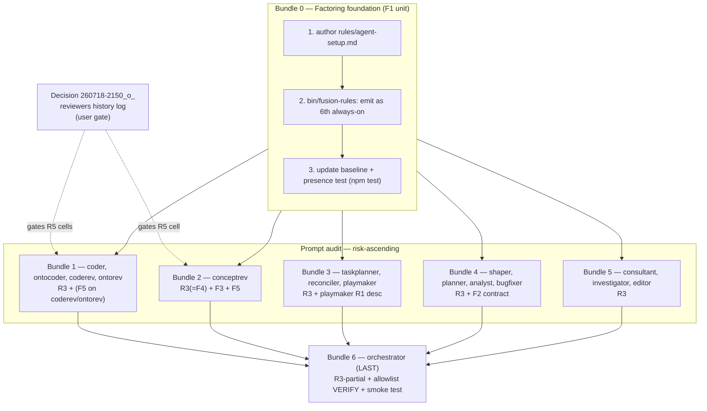

# Implementation Plan: Circle D — Agent-prompt revision (fusion v5.x)

**Date:** 2026-07-18
**Status:** Complete (session 260718-2110-orchestrator-session.md; all 16 prompts factored across Bundles 0–6; every Turn review GO/PASS/CLEAN; F1/F5/F6 settled; plugin bumped 5.2.0→5.3.0)
**Spec:** `260718-0437_*_spec-fusion-v5x-overhaul.md` (§Circle D)
**Master plan:** `260718-1001_*_master-plan-fusion-v5x-overhaul.md` (§Circle D, §Testing Strategy)
**Coordination analysis (rubric + findings):** `260718-1929-agent-coordination-analysis.md` (§4, §5, §6, F1–F8)
**Executors:** coder
**Circle:** `260718-1924-v5x-overhaul` (active)

## Directive

Audit all 16 agent prompts against Circle A's fixed five-dimension rubric (§6 of
the coordination analysis) and apply the minimal targeted edit that brings each
diverging prompt to pass. This is not a rewrite pass and not a lint pass. The
central design act is settling **F1** — the form of the factored Setup unit that
the 14 near-identical Setup blocks (plus the orchestrator's expanded variant, and
the editor's inlined copy) collapse into. The plan also settles **F5** (reviewers'
missing history step — user-gated, see the decision record) and **F6** (the
parameter-parsing dedup), applies the concrete re-wiring findings F2/F3/F4, and
scores every prompt so the audit is auditable.

Master plan and spec settled the *what*; this plan settles the *how* at
executable-step level and re-decides nothing above it.

## Current State

Read from the live tree on 2026-07-18, not from memory.

- **16 prompts** under `agents/` (editor.md landed in Circle C, v5.1.0). Line
  counts: editor 94, ontorev 103, coder 114, coderev 119, ontocoder 124,
  conceptrev 128, bugfixer 160, consultant 174, planner 181, taskplanner 192,
  playmaker 200, investigator 204, shaper 224, reconciler 228, analyst 282,
  orchestrator 942. The orchestrator is 27% of the corpus and the only prompt with
  a `tools:` allowlist — audit last (F8).
- **The Setup block.** Setup step 1 (locate workbench) is byte-identical across all
  16. Setup step 2 (rules-and-paths) is near-identical: the only variance is (a) a
  descriptive clause naming the pattern kind ("coding rules" / "ontology/normative/
  verb rules" / "domain rules") and (b) two voice-profile-read sentences that the
  nine prose agents carry and the seven non-prose agents omit. Verified first-hand
  in coder, coderev, ontorev, conceptrev, editor.
- **No loadable Setup unit exists yet.** Circle B (v5.1.0) shipped the *manifest*
  mechanism (`rules/context-manifest.md`, the `bin/fusion-rules` topic arg + manifest
  block) but **no factored Setup unit**. `bin/fusion-rules` currently emits five
  always-on plugin rules (`fusion-workbench-conventions.md`, `decision-record-examples.md`,
  `user-facing-output.md`, `critical-stance.md`, `git-branch-discipline.md`) via
  `emit_if_exists`, plus the chat-voice profile for every agent and default-voice for
  the nine prose agents. **So F1 requires D to create the unit** — the master plan
  deferred exactly this to the per-Circle pass. This is the plan's central decision.
- **Binding guards.** The path-lint test (`hooks/lib/__tests__/path-literal-lint.test.ts`)
  fails `npm test` on a store-path literal in any `agents/*.md`. The manifest
  regression test (`hooks/lib/__tests__/context-manifest.test.ts`) asserts the
  no-manifest `bin/fusion-rules` output equals a frozen baseline for every agent.
  The orchestrator has a documented history of breaking when its `tools:` line is
  edited (the v3.0.1 AskUserQuestion-denied episode).

## Approach

One integral factoring, applied uniformly, then a per-bundle audit ordered
smallest-and-most-uniform first so the factoring form is validated on cheap prompts
before it reaches the orchestrator.

### The F1 decision — the factored Setup unit (settled)

**Decision: create `rules/agent-setup.md`, a new always-on plugin rule emitted by
`bin/fusion-rules` for every agent, and reduce each prompt's Setup to a minimal
in-prompt bootstrap pointer.**

Why this form, and why it is the *integral* solution rather than a point-patch:

1. **Setup boilerplate is always-on, plugin-shipped, and agent-universal — so the
   manifest is the wrong tool.** Circle B's manifest is project-side
   (`./rules/context-manifest.yaml`, never ships in the plugin) and *topic-scoped*.
   Setup applies to every agent on every topic in every project. Forcing it through
   the manifest would misuse a project-side, topic-filtered mechanism for a
   plugin-side, universal concern. The correct reuse of "Circle B's loading spine"
   is the **always-on emission path** `bin/fusion-rules` already runs for the five
   framework rules — `agent-setup.md` rides that same spine as a sixth `emit_if_exists`.
   This reuses the existing mechanism (critical-stance §2: reuse before build) and
   invents no parallel loader.

2. **The chicken-and-egg is resolved cleanly.** An agent must know to *run*
   `fusion-rules`/`fusion-paths` before it can load anything — including
   `agent-setup.md` itself. So the split is:
   - **Stays inline in every prompt (the pre-load bootstrap, ~4–6 lines):** the three
     commands to run, in order — `fusion-workbench-root` (with the non-zero-exit halt
     message, which *must* stay inline because a step-1 failure means step 2 never
     runs and the unit never loads), then `fusion-rules <self>`, then
     `fusion-paths <self>` — plus a one-line pointer: *"then follow `rules/agent-setup.md`
     (emitted by `fusion-rules`) for what each output means."*
   - **Moves into `agent-setup.md` (the shared detail, loaded via step 2):** the
     "read every emitted path" instruction; the `fusion-paths` `KEY=value` /
     `OUT_*` vs `SCAN_*` semantics; the "a `SCAN_*` may name two directories" nuance;
     the exit-3 / exit-4 explanation; and the **universal voice-profile-read
     instruction** ("if `fusion-rules` emitted a `chat-voice-*.yaml` path, read it and
     apply to short-form per `user-facing-output.md`; if it emitted a `default-voice-*.yaml`
     path — prose agents only — read it as the long-form writing profile").
   The load order works: the agent runs step 2 (`fusion-rules`), which emits
   `agent-setup.md` in its list; the agent reads it and now understands how to
   interpret the `fusion-paths` output it runs next. The `fusion-paths` exit-code
   detail is *already* documented in `fusion-workbench-conventions.md` (always emitted
   first), so no forward reference is dangling.

3. **It reduces, not merely relocates.** ~12–18 lines duplicated 16 times (≈ 200–290
   lines) collapse to one ~40-line doc plus 16 short pointers (~5 lines each ≈ 80
   lines). Net removal is real, and the single doc becomes the one place the Setup
   contract is authored — future Setup changes touch one file, not sixteen.

4. **It subsumes F4 for free.** conceptrev's F4 mismatch (its Setup never loads the
   default-voice profile its Output Style assumes) vanishes the moment its Setup
   points at `agent-setup.md`, because the unit carries the universal voice-read
   instruction. F4 needs no separate edit — F1 delivers it. Verified first-hand:
   conceptrev.md:19 calls out only `design-diagrams.md`, never the voice profile.

**Generalising the pattern-kind clause.** The descriptive "coding / ontology /
domain rules" wording is not load-bearing — the agent reads whatever `fusion-rules`
emits regardless of the adjective. `agent-setup.md` says "pattern-matched domain
rules (coding, ontology, etc., per your agent)". No `HYG-NO-REGRESS` loss: the
emitted file set is unchanged; only the prose describing it is centralised.

### The F5 decision — reviewers' history log (user-gated)

Filed as a decision record: `260718-2150_*_reviewers-history-log-step.md`.
**Planner recommendation: document the exception** (a reviewer's `$OUT_REVIEW` file
is already its durable session record; adding a history step creates two records of
one session — a duplication smell). The user rules at this plan gate. This decision
gates the R5 cells for coderev/ontorev/conceptrev; if still open when those bundles
run, those specific R5 edits `defer-with-reason`.

### The F6 decision — parameter-parsing block (settled: leave alone)

**Decision: no new loadable unit; leave the four parameter-parsing blocks as
D-local, edit only if scoring finds drift.** Verified first-hand: the block is *not*
byte-identical across the four. taskplanner and reconciler are identical; playmaker's
tail differs ("portfolio.md content … briefing" vs "tasklist.md content … directive");
planner's is the `**Executors:**` variant, not `**Domain:**`. So there is no single
shared block to factor. Creating a loadable unit (a doc + a `fusion-rules` emit + four
pointers) for a ~8-line, non-uniform, four-agent block would roughly equal the
duplication it removes — it *relocates* rather than *reduces*, failing the F1 test —
and the block is not one of the five rubric dimensions, so it is not a scored defect.
Master plan scopes Circle B to Setup only; F6 stays out. `HYG-SIMPLEST`: leave it.

### Audit order (A §Recommendation 2, F8)

Smallest homogeneous prompts first (validate the pointer form on cheap, uniform
prompts), then the domain agents, then the orchestrator last.

## Per-prompt scoring table (16 prompts × R1–R5)

Verdict key: **pass** = leave alone · **edit** = targeted minimal edit to reach pass
· **defer** = fix depends on an un-landed input · **verify** = no edit, but a guard
must be re-checked. Cells I scored first-hand are stated plainly; cells taken from A
§4/§5 are marked *(A)*; cells needing the full prompt open at execution are *(exec)*.

| # | Prompt | R1 scope-boundary | R2 structure | R3 Setup-factor | R4 tool-discipline | R5 Output-Style |
|---|--------|-------------------|--------------|-----------------|--------------------|-----------------|
| 1 | coder | pass | pass | **edit** F1 | pass | pass |
| 2 | ontocoder | pass *(exec)* | pass *(exec)* | **edit** F1 | pass *(exec)* | pass *(exec)* |
| 3 | coderev | pass | pass | **edit** F1 | pass | **edit** F5 |
| 4 | ontorev | pass | pass | **edit** F1 | pass | **edit** F5 |
| 5 | conceptrev | pass | pass | **edit** F1 | pass | **edit** F4(via F1)+F3+F5 |
| 6 | bugfixer | pass *(A)* | pass *(exec)* | **edit** F1 | **edit** F2 *(A)* | pass *(exec)* |
| 7 | taskplanner | pass *(exec)* | pass *(exec)* | **edit** F1 | pass *(exec)* | pass (light tier — correct) |
| 8 | reconciler | pass *(exec)* | pass *(exec)* | **edit** F1 | pass *(exec)* | pass (light tier — correct) |
| 9 | shaper | pass *(A)* | pass *(exec)* | **edit** F1 | **edit** F2 *(A)* | pass *(exec)* |
| 10 | planner | pass *(exec)* | pass *(exec)* | **edit** F1 | **edit** F2 *(A)* | pass *(exec)* |
| 11 | analyst | pass *(exec)* | pass *(exec)* | **edit** F1 | **edit** F2 *(A)* | pass *(exec)* |
| 12 | playmaker | **edit** stale description | pass *(exec)* | **edit** F1 | pass *(exec)* | pass *(exec)* |
| 13 | consultant | pass *(exec)* | pass *(exec)* | **edit** F1 | pass (top-level; verify) | pass *(exec)* |
| 14 | investigator | pass *(exec)* | pass *(exec)* | **edit** F1 | pass (top-level; verify) | pass *(exec)* |
| 15 | editor | pass | pass | **edit** F1 | pass (born-correct F2) | pass |
| 16 | orchestrator | pass/verify | pass *(exec)* | **edit** F1-partial | **verify** allowlist | pass *(exec)* |

**Reading the table:**

- **R3 is `edit` for all 16** — every prompt carries the block (15 the standard
  form, orchestrator the expanded form) and adopts the `agent-setup.md` pointer.
  This is the frozen §4/F1 baseline. Orchestrator is `F1-partial`: factor the common
  step-1/step-2 into the pointer, **retain its bespoke expansions** (the
  root-anchored-surfaces note and any orchestrator-only Setup content) inline; the
  executor confirms no expansion is lost (`HYG-NO-REGRESS`).
- **R4 `edit` = F2 contract** for shaper, planner, analyst, bugfixer — the four whose
  workflow needs mid-dispatch user involvement (A §5). Each gains an explicit
  dispatched-vs-top-level `AskUserQuestion` note, modelled on editor's already-correct
  `## Tool Discipline`. bugfixer instructs "ask the user" in prose without naming the
  tool; it still needs the contract. consultant/investigator are user-initiated-only,
  so their `AskUserQuestion` use is legitimate at top level — `pass`, but the executor
  verifies the prompt says the top-level assumption. The grep found `AskUserQuestion`
  *mentioned* in 11 prompts; most are benign references (Output-Style "AskUserQuestion
  text follows user-facing-output.md"), not instructions — the executor confirms the
  non-four mentions are references, not unconditional use-instructions (R4 test c).
  Orchestrator R4 is `verify`, not edit: after its R3 edit, confirm the `tools:` line
  still lists `AskUserQuestion` + the 12 `Agent(fusion:…)` entries intact.
- **R5 `edit`** for coderev/ontorev/conceptrev is the F5 history-log resolution
  (gated by the decision record) plus, for conceptrev, the F3 normalisation. conceptrev
  already carries a compressed long-form/short-form distinction and the readability-gate
  line (verified first-hand in its Output Style tail) — F3 is the light act of aligning
  it to the canonical block shape the seven prose agents use, *not* adding a missing
  block. taskplanner/reconciler sit in the light tier and that is **correct** — they are
  not in `IS_PROSE_AGENT`, so R5 passes for them (A's "prose-ish" note is a description,
  not a defect).
- **R1 `edit` for playmaker only** — its `description:` frontmatter is factually stale
  (describes the pre-container model; tracked in issue `260717-0031_*_p8-lint-gate-scope-open-questions-from-conversions.md` item 1). A
  `description:` edit is far lower-risk than a `tools:` edit but is still frontmatter:
  the executor keeps YAML valid (quote any colon) and runs `claude plugin validate .`
  immediately after. The other five prompts whose frontmatter names type-folder
  literals (analyst, planner, consultant, investigator, taskplanner — issue 260717-0031_*_p8-lint-gate-scope-open-questions-from-conversions.md
  item 1) are **out of scope for D** — the path-lint test skips frontmatter, they are
  not R1-substantive, and P-6 deliberately left frontmatter alone. Not re-filed (already
  tracked).

## Ordered, bundled executable steps

Each bundle is sized for one orchestrator Turn. Every bundle after Bundle 0 depends
on Bundle 0 (the pointer references `agent-setup.md`, which must exist and be emitted
first). Within the prompt bundles the order is risk-ascending. After **every** bundle:
run `bin/fusion-paths <agent>` key-derivation on each edited prompt, the path-lint test,
and `claude plugin validate .`. After any orchestrator-touching edit, additionally run
the default-agent smoke test and re-verify the `tools:` allowlist.

### Bundle 0 — Factoring foundation (creates and validates the F1 unit)

1. **Author `rules/agent-setup.md`.**
   - Executor: coder
   - Files: `rules/agent-setup.md` (new)
   - Changes: write the shared Setup contract per the F1 split above — the "read every
     emitted path" instruction, the `fusion-paths` `KEY=value` / `OUT_*` vs `SCAN_*`
     semantics, the two-directories-per-`SCAN_*` nuance, the exit-3/exit-4 explanation
     (citing `fusion-workbench-conventions.md ## Path Resolution`), the generalised
     pattern-kind clause, and the universal voice-profile-read instruction (chat-voice
     for all, default-voice for prose agents). Contains **no** store-path literal (it is
     a `rules/` file, not an `agents/*.md`, so path-lint does not scan it — but keep it
     literal-free anyway for consistency).
   - Dependencies: none.

2. **Emit `agent-setup.md` as a sixth always-on rule from `bin/fusion-rules`.**
   - Executor: coder
   - Files: `bin/fusion-rules`
   - Changes: add `emit_if_exists "$PLUGIN_RULES_DIR/agent-setup.md"` to the always-on
     block (§1). Emit it **first**, before `fusion-workbench-conventions.md`, so an agent
     reads "how Setup works" before the detailed conventions. Update the header comment
     block (lines ~24–58) to list `agent-setup.md` among the always-emitted framework
     rules. Preserve every existing exit code and the no-manifest byte path (this change
     is intentional and additive to the always-on set, not a manifest change).
   - Dependencies: step 1.

3. **Update the regression baseline and add a presence assertion.**
   - Executor: coder
   - Files: `hooks/lib/__tests__/context-manifest.test.ts` (and any frozen baseline
     fixture it references)
   - Changes: the no-manifest baseline now legitimately includes `agent-setup.md` for
     every agent — regenerate/update the frozen expectation. Add an assertion that
     `agent-setup.md` appears in `bin/fusion-rules <agent>` output for every one of the
     16 agents. **This is an intended baseline change, not a `HYG-NO-REGRESS` break** —
     `HYG-NO-REGRESS` guards the *manifest-absent-equals-pre-manifest* property; here we
     are deliberately changing what the always-on set emits. Run `npm test` green.
   - Dependencies: step 2.

### Bundle 1 — Smallest homogeneous executors/reviewers (validate the pointer form)

4. **Factor Setup in coder, ontocoder, coderev, ontorev; resolve reviewer R5.**
   - Executor: coder
   - Files: `agents/coder.md`, `agents/ontocoder.md`, `agents/coderev.md`, `agents/ontorev.md`
   - Changes: replace each Setup step-1/step-2 block with the F1 bootstrap pointer.
     coderev + ontorev additionally get the F5 R5 resolution (per the decision-record
     outcome: document-the-exception sentence, or a new history step). Confirm no
     load-bearing boundary/tool-discipline/output-shape line is lost (`HYG-NO-REGRESS`).
   - Dependencies: Bundle 0. F5 decision (for coderev/ontorev R5 only — else defer).

### Bundle 2 — conceptrev (the multi-edit reviewer; F3/F4 focal point)

5. **Factor Setup (fixes F4), normalise Output-Style (F3), resolve R5 (F5).**
   - Executor: coder
   - Files: `agents/conceptrev.md`
   - Changes: adopt the F1 Setup pointer — this alone fixes F4 (the unit carries the
     voice-read the current Setup omits). Normalise its Output-Style long-form/short-form
     bullet into the canonical block shape (F3). Apply the F5 R5 resolution. Preserve its
     load-bearing "design-diagrams.md is the rubric you evaluate against" Setup emphasis —
     that is conceptrev-specific and must **not** be factored away; keep it inline
     alongside the pointer.
   - Dependencies: Bundle 0. F5 decision (else defer the R5 sentence).

### Bundle 3 — Non-asking domain agents

6. **Factor Setup in taskplanner, reconciler, playmaker; refresh playmaker's description.**
   - Executor: coder
   - Files: `agents/taskplanner.md`, `agents/reconciler.md`, `agents/playmaker.md`
   - Changes: F1 Setup pointer in all three. playmaker additionally gets the R1
     `description:` refresh (Circle-container model, not pre-container). F6 verified
     no-drift among these three's parameter-parsing blocks — leave those blocks alone.
     After the playmaker frontmatter edit, run `claude plugin validate .` before proceeding.
   - Dependencies: Bundle 0.

### Bundle 4 — User-asking domain agents (the F2 contract)

7. **Factor Setup and add the dispatched-vs-top-level contract in shaper, planner, analyst, bugfixer.** [DONE]
   - Executor: coder
   - Files: `agents/shaper.md`, `agents/planner.md`, `agents/analyst.md`, `agents/bugfixer.md`
   - Changes: F1 Setup pointer in all four. Add an explicit R4/F2 note (modelled on
     editor's `## Tool Discipline`): when dispatched as a sub-agent the prompt does not
     receive `AskUserQuestion`; it returns its questions to the orchestrator (or replies
     normally when run top-level) rather than instructing an unconditional interactive
     prompt. Reword the existing "use AskUserQuestion" / "ask the user" instructions to
     the conditional contract. Do **not** change the domain/executor-parameter model
     (non-goal).
   - Dependencies: Bundle 0.

### Bundle 5 — User-initiated side-loop agents + editor

8. **Factor Setup in consultant, investigator, editor.**
   - Executor: coder
   - Files: `agents/consultant.md`, `agents/investigator.md`, `agents/editor.md`
   - Changes: F1 Setup pointer only. consultant/investigator: verify (do not add F2 — they
     are top-level-only) that the prompt states its top-level assumption where it uses
     `AskUserQuestion`. editor: the pointer also removes editor's inlined voice-read
     sentences (now in `agent-setup.md`); editor is otherwise born-correct (F2, F3, F5).
   - Dependencies: Bundle 0.

### Bundle 6 — Orchestrator (LAST — F8)

9. **Factor the common Setup, retain bespoke expansions, verify the allowlist.**
   - Executor: coder
   - Files: `agents/orchestrator.md`
   - Changes: replace the common step-1/step-2 content with the F1 pointer; **retain**
     the orchestrator-specific Setup expansions (root-anchored-surfaces note, any
     orchestrator-only content) inline. Do not touch the `tools:` line. After the edit:
     re-verify the `tools:` allowlist lists `AskUserQuestion` and the 12
     `Agent(fusion:…)` entries unchanged; run the default-agent smoke test
     (`claude --plugin-dir . --agent fusion:orchestrator -p "reply SMOKE-OK"`) and
     `claude plugin validate .`. If the smoke test or validate fails, revert this bundle
     and stop.
   - Dependencies: Bundles 0–5 (orchestrator audited after all leaves, per F8).

### Coupling note (out of D's edit scope — verify, do not silently fix)

The master plan's Circle-C registration table lists an orchestrator routing-table entry
and (if the editor is dispatchable) a `tools:` allowlist addition for the editor. If, at
Bundle 6, the editor is dispatchable but absent from the orchestrator's allowlist/routing,
that is a **Circle-C registration gap**, not a D edit — the executor **files an issue**
rather than editing the allowlist under D's mandate. D's orchestrator change is Setup-only
plus the allowlist *verification*.

## Data Structures

None. This Circle edits Markdown prompts, one Bash helper, and one test. No new types,
schemas, or interfaces. The one new artifact is a prose rule file (`rules/agent-setup.md`).

## API Changes

`bin/fusion-rules` gains one behavioural change: it emits `rules/agent-setup.md` as an
always-on rule for every agent. No new argument, no new exit code, no signature change.
The manifest/topic contract Circle B added is untouched.

## Bundle / dependency structure

The graph is a DAG: one foundation root fanning into five independent prompt bundles
(different files, no cross-edges), converging on the orchestrator sink last. The F5
decision is a dotted gate onto the two bundles carrying reviewer R5 edits — it blocks
only those specific cells, not the bundles' R3 work. Bundle 0's internal chain is
strictly linear (author → wire → test). No cycles; the orchestrator's fan-in of five is
the deliberate audit-last convergence, not a god-node.

## Testing Strategy

Per the master plan §Testing Strategy, D adds no new load-bearing test surface beyond
Bundle 0's baseline update; it is guarded by the plugin's existing gates, applied after
every bundle:

- `npm test` — the path-lint test (no store-path literal in any edited `agents/*.md`) and
  the updated `context-manifest.test.ts` (baseline now includes `agent-setup.md`; new
  presence assertion for all 16 agents).
- `bin/fusion-paths <agent>` key-derivation on **every** edited prompt — an edit that
  drops a `$OUT_*`/`$SCAN_*` reference silently changes the derived key set and misroutes
  that agent's writes. Confirm each edited prompt's key set is unchanged from pre-edit.
- `claude plugin validate .` after every bundle, and immediately after the playmaker
  frontmatter edit and any orchestrator edit.
- The default-agent smoke test (`claude --plugin-dir . --agent fusion:orchestrator -p
  "reply SMOKE-OK"`) after Bundle 6.
- `HYG-NO-REGRESS` manual check per edited prompt: no load-bearing scope boundary,
  tool-discipline line, or output-shape contract removed — only the Setup block relocated
  and the scored divergences fixed.
- `plugin.json` version bump on completion (`HYG-DONE`); the v5.0 `marketplace.json`
  bump is Circle E's closing gate, not D's.

## Acceptance

Master plan Circle-D criteria bind. Plan-level acceptance:

1. All 16 prompts scored against R1–R5; every `edit` cell reaches pass; every `defer`
   cell names the un-landed input.
2. `rules/agent-setup.md` exists, is emitted always-on for all 16 agents, and every
   prompt's Setup is the bootstrap pointer (not the inlined block) — R3 pass for all 16.
3. `HYG-NO-REGRESS`: no prompt loses a load-bearing boundary, tool-discipline line, or
   output-shape contract; the orchestrator retains its bespoke Setup expansions.
4. The orchestrator `tools:` allowlist is verified intact (`AskUserQuestion` + 12
   `Agent(fusion:…)`) after its edit; the default-agent smoke test passes.
5. Every edited prompt passes `bin/fusion-paths <agent>` key-derivation and the path-lint
   test; `npm test` is green (including the updated baseline).
6. `claude plugin validate .` passes.
7. F2: shaper, planner, analyst, bugfixer carry the explicit dispatched-vs-top-level
   `AskUserQuestion` contract; no prompt instructs an unavailable tool unconditionally.
8. F4 resolved (conceptrev Setup loads the voice profile via the unit); F3 resolved
   (conceptrev Output-Style normalised); F5 resolved to the user-gated decided state
   across the three reviewers.
9. F1 and F6 decisions recorded in this plan; F5 decision recorded and resolved.

## Non-goals

- No wholesale rewrite of any prompt that passes its rubric dimensions — targeted edits only.
- No change to the dispatch graph, the domain-parameter model, or the executor-parameter
  model beyond F2's targeted contract lines.
- No new loadable unit for the parameter-parsing block (F6 settled: leave alone).
- No editor registration work (orchestrator routing/allowlist for the editor) — that is
  Circle C's; D verifies and files an issue if a gap is found.
- No agent-count/doc updates in README/plugin.json-description/philosophy.md — those are
  Circle C (editor registration) and Circle E (docs pass). D bumps only `plugin.json`
  `version` and syncs the `bin/fusion-rules` header comment for the new always-on rule.
- No frontmatter edits beyond playmaker's stale `description:` (the other five type-folder
  frontmatter literals are tracked in issue 260717-0031_*_p8-lint-gate-scope-open-questions-from-conversions.md and left to their own pass).

## Open Questions

- [ ] **F5 — reviewers' history log:** unify or document the exception? Recommendation:
  document. User rules at this plan gate. See
  `260718-2150_*_reviewers-history-log-step.md`. Gates the R5 cells of
  coderev, ontorev, conceptrev.
- [ ] **Editor dispatch coupling:** if the editor is dispatchable but not yet in the
  orchestrator's `tools:` allowlist/routing at Bundle 6, D files an issue (Circle-C gap)
  rather than editing the allowlist. Confirm the editor's dispatch status before Bundle 6.

## Reconciliation Log

**2026-07-19 (reconciler, code domain) — Circle D closed as a work package; all 9 acceptance criteria verified against the live tree.**

Ground-truth verification (not taken from the plan header):

1. **All 16 prompts carry the Setup pointer** — `grep -l "agent-setup.md" agents/*.md` returns all 16. `rules/agent-setup.md` exists (2742 bytes) and `bin/fusion-rules:262` emits it via `emit_if_exists` in the always-on block, **first** (`bin/fusion-rules:260` comment: "agent-setup.md goes first"). Confirmed first-hand by running `fusion-rules reconciler` — `agent-setup.md` is line 1 of the emitted set. (Criteria 2.)
2. **F2 dispatched-vs-top-level contract** present in all four asking agents: `shaper.md:88-91`, `planner.md:63-66` (+ the line-55 routing fix), `analyst.md:44-47`, `bugfixer.md:41-44`. Each states "you do not receive `AskUserQuestion`" when dispatched and routes the question back to the orchestrator. (Criterion 7.)
3. **F5 "document the exception"** landed in all three reviewers: `coderev.md:69`, `ontorev.md:62`, `conceptrev.md:32` — each "You write no separate session-history entry … a history log would only duplicate it." (Criterion 8; decision `260718-2150_i_` transitioned `_a_`→`_i_`.)
4. **F4/F3 (conceptrev)**: Setup points at `agent-setup.md` (`conceptrev.md:19`) which carries the voice-read F4 needed, while retaining the load-bearing `design-diagrams.md` "that is the rubric you evaluate against" emphasis inline. Output-Style long-form/short-form block normalised (`conceptrev.md:120-124`). (Criterion 8.)
5. **Orchestrator (Bundle 6, F8)**: Setup factored to the pointer (`orchestrator.md:100`) while **retaining** its bespoke expansions — the root-anchored-surfaces note (`orchestrator.md:106`) and the exit-4 issue-filing rule (`:105`). `tools:` allowlist intact: `AskUserQuestion` + all dispatchable `Agent(fusion:…)` entries present, editor included. (Criteria 3, 4.)
6. **Gates green**: `npm test` → 261 passed / 11 files (path-lint + updated context-manifest baseline with the `agent-setup.md` presence assertion). `claude plugin validate .` → passed with one pre-existing benign warning (CLAUDE.md-not-loaded). (Criteria 5, 6.)
7. **Both D-scoped issues closed on disk** with genuine Resolved notes: `260718-2238_*_agent-setup-voice-profile-assumes-history-file.md` (agent-setup history-file assumption, fix in `eecbd21`) and `260718-2353_*_planner-residual-unconditional-ask-line55.md` (planner line-55 residual ask, fix in `6bdf5ff`).

**Observation (not a defect — no action taken):** the plan text says the allowlist should list "12 `Agent(fusion:…)`" (criterion 4, and §Reading-the-table). The live allowlist lists **13** — the editor is the 13th, legitimately registered in Circle C (v5.2.0), so the Bundle-6 coupling note's "if editor absent, file an issue" gap did **not** materialise. The "12" is pre-editor plan phrasing; the acceptance is functionally met. No issue filed.

**Verdict:** plan status `_c_`/Complete is accurate. All acceptance criteria met on disk. No `[DONE]`-marked step found unimplemented; no implemented work found unmarked.
