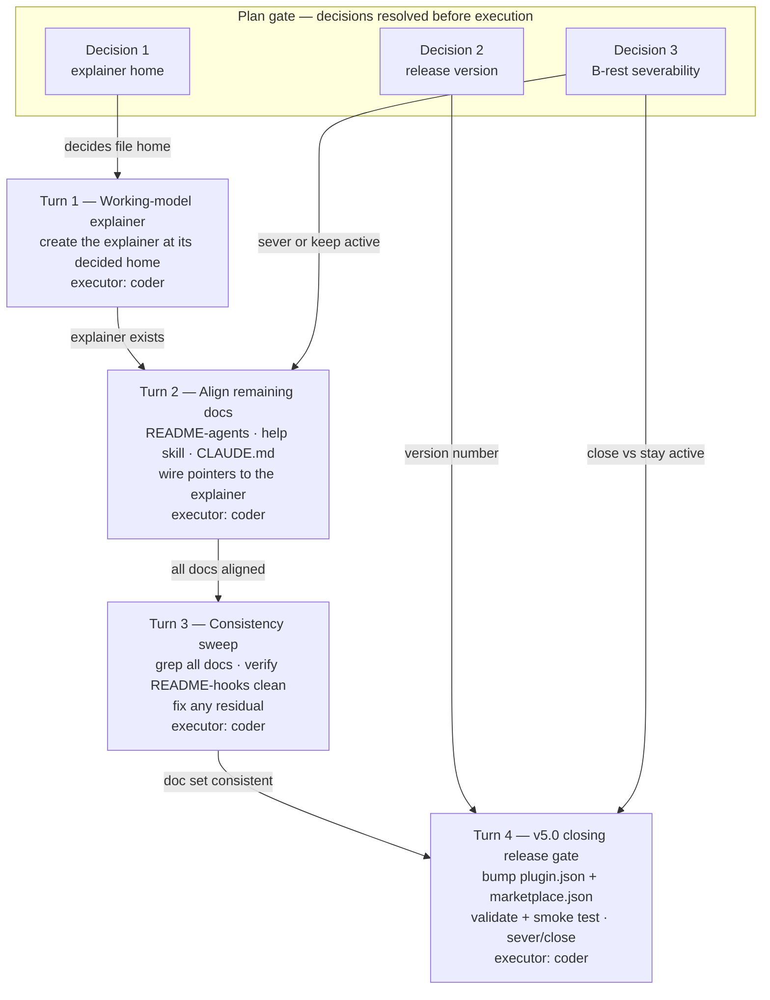

# Implementation Plan: Circle E-rest — docs cleanup + v5.0 closing gate

**Date:** 2026-07-19
**Status:** Complete — docs acceptance met (verified against the live tree, 260719 reconciliation). Marketplace publish (`marketplace.json` bump + push) is deferred/user-gated; B-rest stays out of scope with the umbrella Circle active. Decisions: (1) explainer home = new `docs/working-model.md`; (2) release version = 5.4.0; (3) B-rest = KEEP Circle active (do NOT sever/close — umbrella stays `_t_` for B-rest).
**Spec:** `260718-0437_*_spec-fusion-v5x-overhaul.md` §"Circle E" (conceptrev verdict clean)
**Master plan:** `260718-1001_*_master-plan-fusion-v5x-overhaul.md` §"Circle E" (deferred E's file-level detail to this per-Circle pass)
**Executors:** coder
**Circle:** `260718-1924-v5x-overhaul` (active)

## Directive

Finish Circle E — the docs cleanup and v5.0 closing gate of the fusion v5.x overhaul. Circles A–D and the two already-done E pieces (`docs/philosophy.md` + `README.md`, commit `43ee3b5`; the README-hooks guard-tuning section, commit `299f450`) are the settled backbone. This plan aligns the *remaining* docs to that backbone at executable-step level, adds the user-facing working-model explainer, runs a consistency sweep, and lands the v5-milestone release. It does not re-decide anything the spec or master plan settled, and it does no B-rest work (a separate package in a different repo).

## Current State

The backbone the rest aligns to (verified against the live tree, not memory):

- **Reality:** 16 agents (incl. `conceptrev` and `editor`); plugin `plugin.json` already at **v5.3.0** with a "16 project-agnostic specialized agents" description; Circle-container layout with underscore markers; the merged `reviews/` folder; Circle B's manifest + topic context-loading (`fusion-rules <agent> [<topic>]`, `./rules/context-manifest.yaml`); Circle D's always-on `rules/agent-setup.md` (emitted first by `bin/fusion-rules`) that all 16 prompts point at via a factored Setup pointer; the F2 dispatched-vs-top-level `AskUserQuestion` contract on shaper/planner/analyst/bugfixer.
- **Already clean (no E-rest work):** `README.md` (16 agents, no stale mechanisms — verified by grep), `docs/philosophy.md` (rewritten to five "Why it's built this way" pillars, 16 agents, Gadamer removed).
- **`README-hooks.md`:** the guard-tuning spectrum landed; a full read of the rest found **no** pre-v5.x staleness (no bracket markers, no type-folders, no stale agent counts, no bus protocol). E-rest **verifies** it clean rather than editing it.

### Per-file staleness audit (the concrete backbone of the consistency sweep)

This is the checklist the executor works against. Each row is a verified stale reference with its fix.

**`README-agents.md`** (verified stale):

| Line | Stale reference | Fix |
|---|---|---|
| 40 | `circles/<stamp>-<slug>/[m]-circle.md` — bracket-marker placeholder in the `playmaker` Writes cell | Underscore form: `circles/<stamp>-<slug>/_a_circle.md` (playmaker writes anticipated records); state marker sits on the file per underscore convention |
| 209 | `[m]-circle.md carries the marker` in the layout tree | Underscore form: `_t_circle.md carries the marker` (active), note `*_circle.md` for all states |
| 153 | "The plugin ships **exactly one rule file**" | Stale and self-contradicting (line 174 already names `design-diagrams.md`). Plugin now ships: `fusion-workbench-conventions.md`, `agent-setup.md`, `decision-record-examples.md`, `user-facing-output.md`, `critical-stance.md`, `design-diagrams.md`, `git-branch-discipline.md`, `context-manifest.md`, `context-lean-claude-md.md`, plus the stilwerk voice profiles. Rewrite to describe the always-on set + pattern-matched set |
| 155–161 | Helper description omits the always-on rules emitted first (`agent-setup.md`, Circle D) and the Circle B manifest + topic axis | Rewrite: `agent-setup.md` is emitted first and is the factored Setup contract all prompts point at; describe `fusion-rules <agent> [<topic>]` and the optional `./rules/context-manifest.yaml` (path/skill units, agent+topic predicate, byte-identical when absent) |
| 170 | Pattern→agent table's "workbench-conventions-only" row omits `editor` (the 16th agent) | Add `editor` — a prose agent (`IS_PROSE_AGENT=1`), no domain pattern, standard set + voice profiles |
| 188–197 | Skills table omits 4 shipped skills: `circle-pop`, `circle-stash`, `direct`, `next` | Add rows for `/fusion:next` (portfolio briefing/activation), `/fusion:direct` (draft a Directive as an anticipated Circle), `/fusion:circle-stash` and `/fusion:circle-pop` (freeze/restore the active Circle) |

**`skills/help/SKILL.md`** (verified stale):

| Line | Stale reference | Fix |
|---|---|---|
| 23 | "the **three** load-bearing ideas (specialization beats generalists, workbench-mediated coordination, compliance over speed)" | `docs/philosophy.md` now has **five** "Why it's built this way" pillars (adds Traceability and One-framework-many-shapes). Update the summary to match, or describe the pillars without a hard count |
| 34–42 | Entry-point list omits `editor` (16th agent) | Add: "Customer-ready deliverable, branded deck, or en↔de translation → **editor**" |
| 39 | "What should I work on next? → **taskplanner**" | Add the Circle surface: portfolio briefing and next-Circle activation is `/fusion:next` (playmaker); taskplanner still builds the in-Circle work queue |
| 82–85 | Configure → Project rules describes only the `./rules/` vs `.claude/rules/` split | Add the Circle B mechanism: a project may ship `./rules/context-manifest.yaml` to register topic-scoped loadable units (path or skill), pulled by agent + topic; `CLAUDE.md` becomes a lean index |

**plugin `CLAUDE.md`** (align only — **no slim**, per master plan non-goal):

| Location | Gap | Fix |
|---|---|---|
| `bin/fusion-rules` layout row (line 24) + "Rules loading" / "User-facing output style" convention bullets | No mention of `rules/agent-setup.md` (Circle D) — the always-on rule emitted *first* that all 16 Setup blocks point at via the factored Setup pointer | Add `agent-setup.md` to the always-on rules narrative; state it is emitted first and carries the shared Setup contract. One layout-table row or convention-bullet sentence |
| Conventions section | No mention of the F2 dispatched-vs-top-level `AskUserQuestion` contract (Circle D) | **Optional, low-priority:** one convention bullet noting shaper/planner/analyst/bugfixer carry the dispatched-vs-top-level `AskUserQuestion` contract. Include only if the user opts in at the gate; not load-bearing for the release |

**`README-hooks.md`:** verified **clean** — E-rest confirms, expects zero edits.
**`README.md`, `docs/philosophy.md`:** already done — no E-rest work.

### Open decisions read at Setup

`SCAN_DECISIONS` (Circle + shared) holds no open (`_o_`) decision that blocks this plan. The pre-existing README-drift issue `260717-1740_*_preexisting-readme-drift-...md` is partially superseded: its items 1–2 (README.md "14 agents", "30 tests") are moot after the `README.md` rewrite; its item 3 (README-agents.md:153 "exactly one rule file") is **live** and is folded into this plan's README-agents audit (Turn 2). That issue can be closed once E-rest lands.

## Approach

One integral docs pass, not a scatter of point-fixes. The backbone (philosophy.md, README.md) is fixed; every remaining doc is aligned to it, the new explainer slots into the existing docs structure as a distinct third concern, and a single grep-driven sweep verifies the whole set. Ordered into four Turns so the explainer exists before docs point at it, and the release gate lands last.

The three gate decisions (explainer home, release version, B-rest severability) are resolved at the plan gate **before** any Turn runs, so each Turn executes against settled inputs.

The graph is a linear DAG (single spine T1→T2→T3→T4) with three decision inputs feeding the Turns that consume them. No cycles, no fan-out god-node, clean top-down layering.

## Implementation Steps

### Turn 1 — The working-model explainer

1. [DONE] **Create the working-model explainer at its decided home (Decision 1; recommended: new `docs/working-model.md`).**
   - Executor: coder
   - Files: `docs/working-model.md` (new) — or the home the user picks at the gate
   - Changes: a plain, user-facing (not agent-facing) explainer with these sections:
     1. **The Circle — one unit of work.** What a Circle is; the lifecycle (anticipated → active → closed / bounded / deferred / superseded); `.active-circle` and the one-active-Circle model; where a Circle's artifacts live.
     2. **Spec-driven flow.** How the user works: shaper → spec gate → planner → plan gate → execute; when to skip the shaper; the spec and per-Circle plan as the contract.
     3. **The gates.** Human Gates (spec review, plan review, the ontology gate), the per-Turn Coherence check (Grounding / Directive / Reachability), and the Rebalance gate's four choices — in plain English.
     4. **The hooks.** The compliance guard at write time: protected paths, decision-governed categories, churn + ping-back detection, escalation/halt, and the git branch-switch policy — what blocks vs what only warns. Point at `README-hooks.md` for config depth.
     5. **A worked walkthrough.** One session from request to close, showing where each gate and hook fires.
     6. **Where to go next** — pointers to philosophy.md (why), README.md (hands-on), README-hooks.md (guard config).
   - Source: spec §"Circle E" acceptance criterion 2; master plan §"Circle E" step 2
   - Dependencies: Decision 1 (home)

### Turn 2 — Align the remaining docs

2. [DONE] **Align `README-agents.md` to the v5.3.0 backbone.**
   - Executor: coder
   - Files: `README-agents.md`
   - Changes: apply every `README-agents.md` row in the staleness audit above — bracket→underscore markers (lines 40, 209); rewrite the "exactly one rule file" claim (line 153) to the real always-on + pattern-matched rule set; rewrite the helper description (155–161) to include `agent-setup.md`-first and the Circle B manifest + topic axis; add `editor` to the pattern→agent table (170); add the 4 missing skills to the skills table (188–197).
   - Source: staleness audit; supersedes item 3 of `260717-1740_*_preexisting-readme-drift-...md`
   - Dependencies: none (may run alongside steps 3–4; all three are independent files)

3. [DONE] **Align `skills/help/SKILL.md` to the backbone and wire the explainer topic.**
   - Executor: coder
   - Files: `skills/help/SKILL.md`
   - Changes: apply every help-skill row in the staleness audit (three→five pillars at line 23; add `editor` and `/fusion:next` to the entry-point list; add the Circle B manifest to Configure). Additionally, add a routing pointer to the new working-model explainer (a topic or a cross-reference in the Daily-practice / Philosophy topics), so `/fusion:help` can send the user to it.
   - Source: staleness audit; Turn 1 output (the explainer must exist before this points at it)
   - Dependencies: step 1

4. [DONE] **Align plugin `CLAUDE.md` (align only, no slim).**
   - Executor: coder
   - Files: `CLAUDE.md`
   - Changes: add `rules/agent-setup.md` (Circle D) to the always-on rules narrative — the `bin/fusion-rules` layout row and/or the Rules-loading convention bullet — stating it is emitted first and carries the shared Setup contract all 16 prompts point at. **Optional (only if user opts in at gate):** one bullet on the F2 dispatched-vs-top-level `AskUserQuestion` contract. Do **not** slim or restructure the file; this is alignment of stale/missing facts only.
   - Source: master plan non-goal "no slimming of the plugin `CLAUDE.md` — align only"
   - Dependencies: none

5. [DONE] **Add cross-reference pointers to the explainer from the backbone docs.**
   - Executor: coder
   - Files: `docs/philosophy.md` ("Where to read more"), `README.md` (docs pointers)
   - Changes: add a one-line pointer to `docs/working-model.md` in each doc's "where to read more" / docs list, so the explainer is discoverable. Minimal additive edits only — these docs are otherwise done.
   - Source: spec §"Circle E" (doc set internally consistent)
   - Dependencies: step 1

### Turn 3 — Consistency sweep

6. [DONE] **Run the grep-driven consistency sweep across the whole doc set and verify `README-hooks.md` clean.**
   - Executor: coder
   - Files: read-only sweep over `README*.md`, `docs/*.md`, `skills/*/SKILL.md`, `CLAUDE.md`; fix any residual hit in place
   - Changes: confirm zero pre-v5.x mechanisms remain — bracket markers (`[o]`/`[m]`/`[p]`-style), type-folder layout, separate `codereview/`/`ontoreview/`/`conceptreview/` dirs (outside the "merged/former" narrative), 15-/14-agent counts, "exactly one rule file", the removed bus protocol. Use the grep patterns from this plan's audit as the checklist. Confirm `README-hooks.md` carries no such staleness (expected: clean, zero edits). Fix anything the earlier Turns missed.
   - Source: spec §"Circle E" acceptance criterion 4; task item 3
   - Dependencies: steps 2–5

### Turn 4 — v5.0 closing release gate

7. [DONE — local; publish deferred] **Bump versions and run the release validation.** `plugin.json` bumped 5.3.0→5.4.0 (commit `74cc11b`), `claude plugin validate` passed, smoke `SMOKE-OK`, `npm test` 261 green. The `marketplace.json` bump + push-both-repos are held for the user (feature/plane unpushed) — expected deferral, not a discrepancy.
   - Executor: coder
   - Files: `.claude-plugin/plugin.json`, `<marketplace>/.claude-plugin/marketplace.json` (marketplace clone at `~/.claude/plugins/marketplaces/tenzoki-plugins`)
   - Changes: bump `plugin.json` `version` to the number chosen at the gate (Decision 2; recommended **5.4.0**); bump the fusion entry in `marketplace.json` to match; run `claude plugin validate .` (must report passed); run the default-agent smoke test `claude --plugin-dir . --agent fusion:orchestrator -p "reply SMOKE-OK"`. Commit both repos per the release process in `CLAUDE.md`.
   - Source: spec §"Constraints" (every release bumps + validates); master plan §"Circle E" step 5
   - Dependencies: steps 1–6

8. [DONE — keep-active branch] **B-rest severance and Circle closure (per Decision 3).** Decision 3 resolved to KEEP the umbrella Circle active; no severance/closure performed. B-rest (the unite-co-creator reference conversion, separate repo) remains under the active umbrella per the user decision, recorded in the orchestrator session history and `agentstate.yaml`. The `.active-circle` pointer stays on `260718-1924-v5x-overhaul`.
   - Executor: coder for the artifact edits; the Circle-marker transition and `.active-circle` deletion are the orchestrator's gate action, not a coder edit
   - Files: the umbrella Circle record `_t_circle.md` (closure note); a new anticipated-Circle record or `shared/issues/` entry for B-rest
   - Changes: if the user severs B-rest at the gate, file B-rest (the `unite-co-creator` reference conversion) as its own tracking (a standalone anticipated Circle or a shared issue), and record in the umbrella's closure note that the fusion-side v5.x work is complete with B-rest severed to its own tracking. If the user keeps the Circle active for B-rest, record that instead and leave the Circle marker active.
   - Source: task "Circle-close severability" decision; Origin Rule (cross-repo reach is cited, not placed)
   - Dependencies: step 7; Decision 3

## Data Structures

None. This Circle produces and edits Markdown docs and bumps two JSON version fields; no new types, schemas, or manifests.

## API Changes

None. No helper, hook, or agent-contract change. `bin/fusion-rules`, `bin/fusion-paths`, and the guard are documented, not modified (spec §"Circle E" non-goals: E documents, it does not re-engineer).

## Testing Strategy

- **Release validation (Turn 4):** `claude plugin validate .` must report passed; the default-agent smoke test `claude --plugin-dir . --agent fusion:orchestrator -p "reply SMOKE-OK"` must resolve and reply. These are the existing plugin gates.
- **Doc-consistency sweep (Turn 3):** the grep checklist in the staleness audit is the manual test surface — a clean sweep (no bracket markers, no type-folders, no stale counts, no separate review dirs, no bus protocol) is the pass condition.
- **No code path changes**, so `npm test` (path-lint + the Circle B manifest tests) should be unaffected; run it once at the close as a regression guard that no doc edit disturbed a tested surface.

## Risks & Mitigations

| Risk | Mitigation |
|------|------------|
| The help skill gets edited twice (backbone align + explainer pointer), risking guard churn/ping-back on `skills/help/SKILL.md` | The explainer is created in Turn 1 first, so all help-skill edits are folded into one Turn-2 step (step 3) — a single edit, no ping-back |
| Aligning plugin `CLAUDE.md` drifts into slimming/rewriting it (a master-plan non-goal) | Step 4 is scoped to additive fact-alignment (add `agent-setup.md`, optional F2 bullet) only; the "no slim" non-goal is cited in the step; any slimming is a separate opt-in surfaced at the gate |
| Bumping to a major (6.0.0) while B-rest is unshipped over-claims completion | Recommend 5.4.0 (a minor, matching a docs + one-new-file increment); reserve 6.0.0 for a genuine breaking change; the B-rest-open state is an explicit argument against a milestone-major |
| Closing the umbrella Circle strands B-rest with no tracking | Step 8 files B-rest as a standalone anticipated Circle / shared issue before closure and records the severance in the closure note; if the user prefers, the Circle stays active instead |
| The new explainer duplicates content already in philosophy.md / README.md | The explainer is scoped to the *working model* (circle lifecycle, spec flow, gates, hooks) — the operational "how", distinct from philosophy's "why" and README's "install/run"; cross-references link the three rather than repeating |
| A residual pre-v5.x reference survives the per-file audit | Turn 3 is a whole-set grep sweep that re-checks every doc including the Turn-1/2 outputs and the already-done backbone docs, not just the edited ones |

## Open Questions — decisions for the plan gate

These three are surfaced for the user; the user decides. Each carries a proposal and reasoning.

- [ ] **Decision 1 — Working-model explainer home.** *Recommendation: a new `docs/working-model.md`.* Reasoning: `docs/philosophy.md` was just deliberately slimmed to a tight "why" intro (Gadamer removed); folding a how-to explainer back in re-bloats it and mixes "why" with "how". `README.md` is the hands-on install/run guide (151 lines, task-ordered) and the explainer is conceptual-operational — a distinct third concern. A new `docs/` file keeps philosophy lean, sits beside it as standalone reading, gives `/fusion:help` a clean topic to route to, and both philosophy.md and README.md link to it. Alternatives: a `README.md` section (couples conceptual content to the task guide) or extending `philosophy.md` (undoes the slimming).

- [ ] **Decision 2 — Release version for the v5-milestone close.** *Recommendation: `5.4.0`.* Reasoning: we are at 5.3.0 (B=5.1.0, C=5.2.0, D=5.3.0). E-rest ships docs alignment plus one new explainer file plus a version bump — new user-facing content, no breaking change to agents, helpers, or the manifest contract. By semver that is a minor (5.4.0), the capstone of a v5.x line that shipped incrementally, not a new major epoch. Reserve 6.0.0 for a genuine contract break (as v4.0.0 was for the layout change) so the major signal stays meaningful. B-rest still being open is a further argument against a milestone-major. Alternative: 6.0.0 if the user wants "v5.x vision fully realized" marketing weight over strict semver.

- [ ] **Decision 3 — B-rest severability at the closing gate.** *Recommendation: sever B-rest to its own tracking and close the fusion-side umbrella Circle.* Reasoning: B-rest (the `unite-co-creator` reference conversion) edits a *different repo*, produces no fusion-plugin artifacts, and is a dogfood *proof* — the fusion-side mechanism (Circle B) already landed and shipped (commit `4620837`, v5.1.0). The plugin's v5.x overhaul is functionally complete without it. Keeping the umbrella Circle active solely for a cross-repo conversion blocks the release and the `.active-circle` pointer while all fusion-side work is done; the Origin Rule already says cross-repo reach is cited, not placed. Sever B-rest into a standalone anticipated Circle or shared issue, cite it in the closure note, close the umbrella. Alternative: keep the Circle active until B-rest lands if the user wants the umbrella to represent the dogfood proof too — at the cost of coupling a plugin-release milestone to a separate-repo task. **[RESOLVED at plan gate: keep the Circle active for B-rest.]**

## Reconciliation Log

**260719 (Circle E-rest final reconciliation; domain=code).** All docs-acceptance criteria verified against the live tree; plan marked Complete, filename `_p_`→`_c_`.

- **Working-model explainer:** `docs/working-model.md` exists (113 lines) — commit `db0dedf`. Step 1 confirmed [DONE].
- **Docs aligned (step 2–5, commit `f5d79aa`):** `README-agents.md` carries the underscore markers, the always-on `agent-setup.md`-first rule set, the Circle B manifest+topic axis, the `editor` row, and the added skills; `skills/help/SKILL.md` and `CLAUDE.md` reference `agent-setup.md` and the manifest mechanism; working-model pointers wired into `README.md:5`, `docs/philosophy.md:46`, and `skills/help/SKILL.md`. Verified by grep.
- **Consistency sweep (step 6, commit `0a69a6b`):** zero pre-v5.x staleness remains — no 14/15-agent counts, no "exactly one rule file", no bracket-marker circle refs, no live bus protocol; `CLAUDE.md:9` and `README.md:3` both say "16 … agents". `README-hooks.md` confirmed clean.
- **Release (step 7, commit `74cc11b`):** `.claude-plugin/plugin.json` is `5.4.0`; `bin/fusion-rules` eight→nine prose-agent comment fixed; `npm test` re-run at reconciliation = **261 passed / 11 files** (regression guard green). Marketplace publish + push deferred (user-gated, feature/plane unpushed) — expected, not a discrepancy.
- **Circle state (step 8):** kept active per Decision 3; no closure. `.active-circle` → `260718-1924-v5x-overhaul`.
- **Issues:** the four session issues (`260719-1436`, `260719-1441` ×2, `260719-1452`) are all `_c_` with evidence-cited resolution notes. The pre-existing shared drift issue `260717-1740_*_preexisting-readme-drift-agent-count-test-count-rule-file-count.md` (agent/test/rule-file counts) is now fully resolved and was closed `_o_`→`_c_` in this pass (plan line 58 flagged it closable once E-rest landed).
- **No new issues** discovered during reconciliation. No drift between plan claims and disk.
