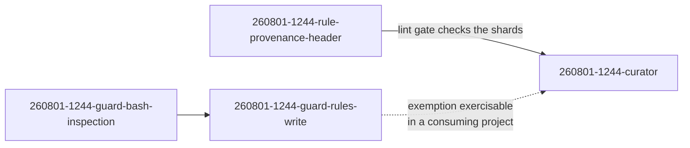

# The curator reconciles the three normative surfaces, and proves it on fusion's own conventions file

---
**Domain:** code
**Status:** anticipated
**Filed by:** shaper (anticipated-circle mode)
**Active spec/plan:** shared/planning/260801-1122_o_spec-normative-consolidation.md (the spec covers all four Circles of this body of work; the per-Circle implementation plan is produced by the planner at activation)
**Active session history:** (none yet)

---

## Directive

A fusion-governed project can ask one agent, the `curator`, to reconcile its three normative surfaces (decision records, project-owned rule files, and `CLAUDE.md`) against what actually happened in the project, and get back a reviewed set of edits that removes what history has retired and resolves what the surfaces say in contradiction. Every proposed change carries an evidence tier and a citation: a falsified claim about the present, a position a later record overturns, or a practice the accumulated history shows stopped, with the agent able to say when it stopped and what replaced it. A change justified only by re-reading the current text never removes a constraint; at most it proposes a rewrite that preserves every constraint the original expressed. Contradictions the agent cannot resolve become open decision records rather than edits, so a choice point reaches the user as a choice rather than as a silent pick. Nothing lands before the user has seen the complete change ledger, grouped by consequence with constraint removals first, and the agent applies only what the user approved and never commits. Rule files gain a retirement path that keeps them in version control and stops them loading. The agent runs when the user invokes `/fusion:curate`, not on a schedule and not inside `/fusion:cleanup`, which gains a staleness line instead. The finished agent's first real job is fusion's own 54 kB conventions file, taken through four steps in order: reconciled against ground truth, compacted, partitioned into shards, then scoped per agent. That is both the deliverable the project wants and the proof that the capability works, because a curator that cannot correctly reconcile and repartition its own framework's largest rule file, with every constraint preserved and every citation still resolving, is not finished.

**Capabilities carried:** C1, C2, C3, C4, C6, C7, and C9 as the closing work. The spec holds the remit boundaries, the three evidence tiers, the six surface pairs, the retirement mechanism, the gate and revert path, the invocation surface, the four-step ordering, the six-part scoping safety standard, and roughly sixty acceptance criteria across those capabilities. They are not restated here, so the spec stays the single source of detail.

**C9 is the closing work and does not begin early.** Its precondition is that C1 through C8 are complete: the curator runs end to end and the provenance lint gate exists, because the gate is one of the checks C9's output must pass.

## Grounding snapshot

Three answered decisions frame the work, and none is reopened. D1 settled that fusion gains a writing consolidation agent rather than a report-only detector. D2 settled that rule-file writes are permitted through an environment-gated exemption plus project-level guard configuration. D3, answered by the spec's D-e, settled the provenance header with full adoption. The spec's own twelve decisions (D-a through D-l) then fixed the shape: the boundary drawn by reason-for-edit rather than by surface, retirement by relocation into `retired/` rather than into the workbench archive, the survey-gate-apply structure in one dispatch, the user-invoked cadence, the agent's name, and the four-step ordering for the conventions file.

**The two boundaries that keep this from duplicating what exists.** `/fusion:revise-claude-md` keeps its three-pass add, update, and prune on the current session's learnings; the curator does not run those passes and does not call the skill. The two differ by evidence horizon, and running both is safe because the curator only proposes changes carrying a workbench or long-range-git citation, which is the class the skill's evidence base cannot reach. `agents/reconciler.md` keeps its decision-marker walk against ground truth; the curator handles what that walk cannot see, namely two live decisions that contradict each other with no superseding record yet in existence, and a decision that stopped applying without a successor arriving.

**Verified facts that constrain the closing work**, all checked 2026-08-01 and recorded in the spec's constraints block:

- Every agent receives 87 387 bytes of always-on rules, of which the conventions file is 54 401. That ratio is why the conventions file is the only always-on target worth scoping.
- The file has 32 second-level headings but 18 document sections. Fourteen headings are template body under the Circle record template, the embedded portfolio template, and the decision-record template. A partition driven off `^## ` would shred all three.
- 131 lines across 42 files cite the conventions file, 70 of them by section name and none by line number. Every one has to resolve after the partition, and the curator may not edit `agents/`, `skills/`, `bin/`, `hooks/`, `docs/`, or `README*.md`, so for those it produces the rewrite list and a coder applies it.
- Four sections carrying binding rules are named by no prompt or skill body at all: `## Issues vs Decisions — when to use which`, `## Issue and Decision Filing — MANDATORY`, `## Decision Record Template`, and `## Inline State Tracking`. Any citation-derived safety check places them at zero, which is what makes the derived floor a catch rather than a standard.
- `./rules/context-manifest.yaml` cannot scope a plugin-shipped rule file. It never ships in the plugin, and its emission is purely additive. The working lever is the per-agent pattern table in `bin/fusion-rules`, which is `bin/` work handed to a coder rather than curator work.
- `bin/fusion-rules` never reads a rule file's content, which is why retirement works by relocation rather than by a marker or a status header, and why six plugin rules emitted by explicit path cannot be retired by relocation alone.
- The workbench is neither tracked nor gitignored here, so decision-record edits have no git undo. That forces the requirement that the agent write every modified record's pre-edit content into its own history file, and it is what ruled the archive out as the retirement destination.

**One live defect the closing work would otherwise cover** is already filed separately, because it is real whether or not this Circle runs: `shared/issues/260801-1215_*_conventions-file-cites-three-records-that-do-not-resolve.md`. Two cited records exist nowhere in the workbench or the archive, and one is cited at a pre-v4 root-relative path while the file lives inside a Circle. That these survive in the document defining the v4 layout is the strongest available argument that the reconcile step is worth doing.

**What the closing work does not buy, stated so it is not expected.** The compaction step will not shrink the file much. The evidence tiers remove what history falsified or superseded, and a large share of the file is rationale prose that is still true. The context saving comes from the scoping step and from nothing else. Widening the tiers to reach "this reads long" is the exact failure the tiers exist to prevent.

**The honest limit of the scoping standard.** It does not claim to prevent loss, because nothing anywhere states which rules an agent relies on. It delivers no *silent* loss: a per-agent emission golden file as the reference, a derived citation floor as a partial check, opt-out scoping with every subtraction argued and gated, an index shard so a removed section stays discoverable, and history attribution so the postmortem is possible.

**Spec and its prior decisions** (cited where they live, per the Origin Rule, not copied):

- Spec: `shared/planning/260801-1122_o_spec-normative-consolidation.md`. C1 through C4, C6, C7, C9, the constraints block, `## Out of Scope`, and `## Open for Planner`.
- Gap analysis: `shared/analyses/260801-1020-normative-surface-drift-gap-analysis.md`. The measured drift this whole body of work responds to.
- **D1** — `shared/decisions/260801-1020_a_where-does-normative-consistency-live.md`. The direct input: a writing agent, not a report-only detector.
- **D2** — `shared/decisions/260801-1020_*_may-any-fusion-writer-touch-rules.md`. What lets the agent touch rule files at all, realised in Circle `260801-1244-guard-rules-write`.
- **D3** — `shared/decisions/260801-1020_*_provenance-header-on-rule-files.md`. The eighth evidence source, realised in Circle `260801-1244-rule-provenance-header`.

Four issues the gap analysis filed constrain this work without being part of it, and are cited rather than absorbed: `shared/issues/260801-1020_o_workbench-untracked-breaks-archive-durability-premise.md`, `shared/issues/260801-1020_o_guard-protects-rules-but-not-claude-rules.md`, `shared/issues/260801-1020_o_scan-keys-never-reach-the-archive-store.md`, and `shared/issues/260801-1020_o_plane-mirror-circle-closed-with-empty-turn-log.md`.

## Dependencies

**`260801-1244-rule-provenance-header`** — hard dependency, must close first. The closing work partitions the conventions file into shards, every shard carries a provenance header, and the lint gate checks them. The partition is the first real exercise of that gate, so the gate has to exist before the shards do.

**`260801-1244-guard-rules-write`** — soft dependency. The curator is buildable and testable in this repository without it, because the write guard stands down here (`hooks/lib/self-detect.ts:18-33`). The exemption is needed for the agent's rule-file writes and its retirement moves to be exercisable in a consuming project, which is where the acceptance criteria that assert a block have to run.

Transitively this Circle also waits on `260801-1244-guard-bash-inspection`, since the rules-write Circle depends on it.

## Turn log

## Activation proposal

**Als nächster Circle gereiht, aber nicht zur Aktivierung vorgeschlagen — playmaker-Lauf
260807-1646 (Auslöser: direct-dispatch, Domänen-Bias `code`).**

Dies ist der einzige geplante Circle im Portfolio. Nach der Code-Heuristik steht er sauber da:
seine Grounding zitiert keine offene Entscheidung, und alle drei Abhängigkeiten
(`260801-1244-rule-provenance-header` hart, `260801-1244-guard-rules-write` weich, transitiv
`260801-1244-guard-bash-inspection`) sind kohärent geschlossen. Der Rang ist damit unstrittig und
aussagearm, denn es gibt keinen zweiten Kandidaten. Aktivierbar ist der Circle nicht, und der
Grund ist seit dem Lauf 260806-2259 gewachsen.

**Bekannt war eine Lücke: der fehlende Validierungsfall.** C9 Schritt 3 und 4, Partition und
Zuschnitt der Konventionsdatei, hat coder von Hand erledigt. Damit fehlt dem Circle sein erster
echter Auftrag und zugleich sein Beweis, und Entscheidung D-g der Spec ist hinfällig. Quelle:
`circles/260805-2005-textschicht-gegen-code-nachziehen/_c_circle.md` `## Dependencies`.

**Neu ist, dass die Messwerte der Grounding nicht mehr stimmen.** Am 260807-1646 gegen HEAD
`a94f142` am Baum nachgemessen, nicht abgeleitet:

| Aussage der Grounding | Gemessen 260807 |
|---|---|
| `rules/fusion-workbench-conventions.md` hat 54 401 Bytes | 35 668 Bytes |
| Die Datei hat 32 Überschriften zweiter Ebene | 23 |
| Jeder Agent erhält 87 387 Bytes Dauer-Regeln | 89 313 für `coder`, 108 403 für `analyst` und `planner` |
| Die Scherben entstehen erst in C9 | vier liegen bereits im Regelverzeichnis: `circle-records.md`, `workbench-path-resolution.md`, `rule-file-provenance.md`, `workbench-stash-and-lock.md` |
| Die Workbench ist hier weder versioniert noch ignoriert, Entscheidungssätze haben kein git-Rückgängig | versioniert seit `e8988d9` (260801), 612 Dateien |

Der letzte Punkt ist der Shaper-Arbeit von damals nicht anzulasten: die Grounding weist ihre
Prüfung auf den 260801 aus, und der Commit fiel auf denselben Tag. Er ist trotzdem eine
tragende Aussage, denn er hat die Anforderung begründet, jeden geänderten Entscheidungssatz vor
der Bearbeitung ins eigene Sitzungsprotokoll zu schreiben, und er hat das Archiv als
Ruhestandsziel ausgeschlossen.

**Ein sechster Punkt betrifft die Motivation, nicht die Zahlen.** Die Grounding führt den
Befund `shared/issues/260801-1215_*_conventions-file-cites-three-records-that-do-not-resolve.md`
als „the strongest available argument that the reconcile step is worth doing". Er trägt heute
den Marker `_c_` und ist geschlossen.

**Was Bestand hat.** Die Fähigkeiten C1 bis C3, C6 und C7 bleiben als zusammenhängender Rest
sinnvoll, und der Bedarf ist belegt statt behauptet: im beobachteten Konsumprojekt cocreator
stehen 65 offene Befunde, rund 25 offene Entscheidungen und drei Monate Drift, gemessen in
`circles/260801-1244-guard-rules-write/analyses/260805-1830-zweck-nutzung-und-stand-des-plugins.md`.
Was fehlt, ist ein neuer Zuschnitt: eine Directive ohne C9, ein neuer Validierungsfall, und eine
Grounding, die auf einer frischen Messung ruht statt auf der vom 260801.

**Eine Reihenfolge, die vor der Neu-Schärfung liegt.** Die offene Entscheidung
`shared/decisions/260807-1515_o_wie-weit-reicht-die-projektsprache-in-den-regelkorpus.md` fragt,
wie weit die Projektsprache `de` in das durchgehend englische Regelkorpus reicht und was in einem
Repository gilt, das seine eigenen Regeln ausliefert. Ihr Gegenstand ist genau der Gegenstand
dieses Circles, nämlich Regeldateien und `CLAUDE.md`. Wer den Zuschnitt vor der Antwort macht,
macht ihn danach ein zweites Mal.

Vorgeschlagenes Vorgehen: erst die Sprachentscheidung beantworten, dann den shaper auf diesen
Circle ansetzen, dann `/fusion:next`. Playmaker benennt nur; die Neu-Schärfung ist Shaper-Arbeit
und die Aktivierung deine.
