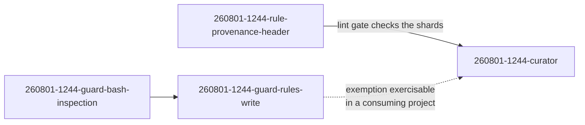

# The curator reconciles the three normative surfaces, and proves it on fusion's own conventions file

---
**Domain:** code
**Status:** anticipated
**Filed by:** shaper (anticipated-circle mode)
**Active spec/plan:** circles/260801-1244-curator/planning/260814-0738_o_spec-curator.md
**Active session history:** (none yet)

---

## Directive

A fusion-governed project can ask one agent, the `curator`, to reconcile its three normative surfaces (decision records, project-owned rule files, and `CLAUDE.md`) against what actually happened in the project, and gets back a reviewed set of edits that removes what history has retired and resolves what the surfaces state in contradiction. Every proposed change carries an evidence tier and a citation: a falsified claim about the present, a position a later record overturns, or a practice the accumulated history shows stopped, with the agent able to say when it stopped and what replaced it. A change justified only by re-reading the current text never removes a constraint; at most it proposes a rewrite that preserves every constraint the original expressed. Where a falsified claim is a measurement a command could produce, the agent proposes the derivation rather than the corrected number, and hands the implementation to a coder. Contradictions the agent cannot resolve become open decision records rather than edits, so a choice point reaches the user as a choice rather than as a silent pick. Nothing lands before the user has seen the complete change ledger, grouped by consequence with constraint removals first, and the agent applies only what the user approved and never commits. The agent runs when the user invokes `/fusion:curate`, not on a schedule and not inside `/fusion:cleanup`, which gains a staleness line instead. Alongside the agent, the always-on rule text every one of the sixteen agents loads gains a hard growth bound: the budget report that measures it today starts failing the test suite, so the drift the agent cleans up cannot silently return. The finished agent's first real job is this project's own decision corpus, 82 records of which none is marked superseded, and the run either produces the supersessions that were never recorded or establishes with a comparison count that there are none. That is both the deliverable and the proof, because a curator that cannot reconcile its own framework's decision history is not finished.

**Capabilities carried:** C1, C2, C3, C6 and C7 from the earlier spec, keeping their original numbers so existing citations resolve, plus C10 (the growth bound) and C11 (the validation case), added on 2026-08-14. The spec holds the remit boundaries, the three evidence tiers and the derive-over-correct rule, the six surface pairs, the gate and revert path, the invocation surface, the growth bound's cut and arming, and the validation case's criteria. They are not restated here, so the spec stays the single source of detail.

**Four capabilities of the earlier spec are gone, and none returns.** C5 (guard changes) and C8 (the provenance header) were delivered by closed Circles. C9 (reconcile, compact, partition and scope the conventions file) was performed by hand in Circle `260805-2005-textschicht-gegen-code-nachziehen` and is out by user direction. C4 (rule-file retirement by relocation, with a tombstone and a version-control check) was retired by user decision on 2026-08-14: a dead rule file is deleted and git holds the bytes.

## Grounding snapshot

**Measured on 2026-08-14 against HEAD `d7786eb`, not carried forward.** The three playmaker runs of 2026-08-07, 2026-08-13 and 2026-08-13 each found this Circle's earlier Grounding falsified. Every figure below was re-taken, and two of them correct a claim this shaper was handed.

| Earlier claim | Measured 2026-08-14 | How |
|---|---|---|
| `rules/fusion-workbench-conventions.md` holds 54 401 bytes | 51 920 | `wc -c` |
| 32 second-level headings, 18 document sections | 24 headings, 20 sections; only the decision-record template is still embedded | `grep -c '^## '` |
| Every agent receives 87 387 bytes of always-on rules | 93 819 at the leanest role, 129 172 at the heaviest; 86 466 of that is rule text and 7 353 is this project's chat profile | `bin/fusion-rules <agent> \| xargs wc -c` |
| The conventions file's share of the floor | 55 percent of the leanest floor | arithmetic on the two figures above |
| 131 lines in 42 files cite the conventions file, 70 by section | 207 lines in 63 files, 106 by section, none by line number | `grep -rn` over `agents/ skills/ rules/ bin/ hooks/ docs/ templates/ CLAUDE.md README*.md .claude-plugin/`, excluding compiled output |
| Four sections are named by no prompt | three; `## Issue and Decision Filing` is now cited by `agents/planner.md:65` | `grep` per section name |
| The workbench is neither tracked nor gitignored | tracked, 1 130 files | `git ls-files fusion-workbench/ \| wc -l` |
| `shared/issues/260801-1215_*_conventions-file-cites-three-records-that-do-not-resolve.md` is the strongest argument for the reconcile step | closed | marker on the filename |
| The shards are produced by C9 | four already sit in `rules/`, and the per-agent scoping table exists in `bin/fusion-rules` | `ls rules/` |
| The archive store is an evidence source | 0 files, and no scan key reaches it | `find fusion-workbench/archive -type f` |
| The decision corpus spans three months | 39 days, 2026-07-06 to 2026-08-13 | earliest and latest filename stamps |

**The growth this Circle now has to bound, measured by running the instrument.** `hooks/lib/__tests__/rules-emission-golden.test.ts` prints its budget report on every run and fails nothing. On 2026-08-14 all five roles are over budget: the core role by 10 812 bytes, the playmaker and shaper roles by 13 468, and the orchestrator's role by 17 175. The whole overshoot is universal-core growth. Since the 2026-08-05 cut the five always-on files grew 22 812 bytes against 12 000 of head-room, of which `rules/fusion-workbench-conventions.md` contributed 17 249 and `rules/critical-stance.md` 4 641. The file that was cut from 51 416 to 34 671 bytes on 2026-08-05 now sits at 51 920, which is 504 bytes above where the partition found it. The always-on floor looks smaller than the earlier figure only because two rules were deleted outright: `protected-path-discipline.md` at 19 960 bytes and `git-branch-discipline.md` at 6 299.

**The validation case, and what makes it one.** 82 decision records across the shared store and the Circles: 55 implemented, 14 answered, 9 open, 4 deferred, and none superseded. Alongside them, 510 defect records, 278 shared and 232 inside Circles, of which 117 are open. Zero superseded records over 82 decisions in 39 days is either true or never recorded, which is the contradiction-detection capability's question put to a real corpus rather than a seeded fixture. The consuming-project witness was considered and rejected as a second case.

**What the guard no longer does, which retires a block of the earlier acceptance criteria.** The protected-path half was removed on 2026-08-12: the write-tool deny, the before-and-after fingerprint, the write-back, the `FUSION_ALLOW_RULES_WRITE` exemption and the `guard.protectedPaths` configuration leaf. Every surviving reference in `hooks/` is a comment, a test fixture string or a historical note, verified on 2026-08-14; no live code reads the variable. Nothing in the guard resists a rule-file write in any project now, and the git diff is the only bound. Every criterion in the earlier spec that asserted a block is dead.

**The two boundaries that keep this from duplicating what exists.** `/fusion:revise-claude-md` keeps its three-pass add, update and prune on the current session's learnings; the curator does not run those passes and does not call the skill. The two differ by evidence horizon, and running both is safe because the curator only proposes changes carrying a workbench citation or a long-range git citation, which is the class the skill's evidence base cannot reach. `agents/reconciler.md` keeps its decision-marker walk against ground truth; the curator handles what that walk cannot see, namely two live records that contradict each other with no superseding record in existence, and a position that stopped applying without a successor arriving.

**What this Circle does not buy, stated so it is not expected.** It does not shrink the conventions file or any other always-on rule. The compaction and partition work is out of scope, and the growth bound governs the rate of addition rather than the size of the corpus. The curator's evidence tiers cannot justify a size-driven cut, and the earlier spec is explicit that widening them to reach "this reads long" is the exact failure they exist to prevent.

**One question is open and is the user's to answer before the planner plans the growth bound.** Arming the bound on a corpus already over budget requires either a one-time re-baseline at the moment of arming, or an unscoped cut of roughly 11 KB that reintroduces the work C9's retirement removed. The spec specifies the first and records the reasoning; the choice is filed as `circles/260801-1244-curator/decisions/260814-0738_*_how-is-the-always-on-growth-bound-armed-when-the-corpus-is-already-over-budget.md`. Nothing else in the spec depends on the answer.

**Spec and its prior inputs** (cited where they live, per the Origin Rule, not copied):

- Spec: `circles/260801-1244-curator/planning/260814-0738_*_spec-curator.md`. The single spec the planner works from for this Circle.
- Earlier spec: `shared/planning/260801-1122_*_spec-normative-consolidation.md`. Covered four Circles, three now closed. It stays as their record and is not retired by this Circle.
- Gap analysis: `shared/analyses/260801-1020-normative-surface-drift-gap-analysis.md`. The measured drift this body of work responds to.
- Growth analysis: `shared/analyses/260812-0022-where-the-complexity-comes-from-and-what-would-have-to-go.md`. The finding that the binding constraint is the rate of addition rather than the size of the system, which is what the growth bound answers.
- **D1** — `shared/decisions/260801-1020_*_where-does-normative-consistency-live.md`. A writing agent, not a report-only detector.

Two issues the gap analysis filed are still open and constrain this work without being part of it: `shared/issues/260801-1020_*_scan-keys-never-reach-the-archive-store.md` and `shared/issues/260801-1020_*_plane-mirror-circle-closed-with-empty-turn-log.md`. The other two it filed have closed.

## Dependencies

**`260801-1244-rule-provenance-header`** — hard dependency, must close first. The closing work partitions the conventions file into shards, every shard carries a provenance header, and the lint gate checks them. The partition is the first real exercise of that gate, so the gate has to exist before the shards do.

**`260801-1244-guard-rules-write`** — soft dependency. The curator is buildable and testable in this repository without it, because the write guard stands down here (`hooks/lib/self-detect.ts:18-33`). The exemption is needed for the agent's rule-file writes and its retirement moves to be exercisable in a consuming project, which is where the acceptance criteria that assert a block have to run.

Transitively this Circle also waits on `260801-1244-guard-bash-inspection`, since the rules-write Circle depends on it.

## Turn log

## Activation proposal

**Als nächster Circle gereiht, aber nicht zur Aktivierung vorgeschlagen — playmaker-Lauf
260807-1646 (Auslöser: direct-dispatch, Domänen-Bias `code`).**

Dies ist der einzige geplante Circle im Portfolio. Nach der Code-Heuristik steht er sauber da:
seine Grounding zitiert keine offene Entscheidung, und alle drei Abhängigkeiten
(`260801-1244-rule-provenance-header` hart, `260801-1244-guard-rules-write` weich, transitiv
`260801-1244-guard-bash-inspection`) sind kohärent geschlossen. Der Rang ist damit unstrittig und
aussagearm, denn es gibt keinen zweiten Kandidaten. Aktivierbar ist der Circle nicht, und der
Grund ist seit dem Lauf 260806-2259 gewachsen.

**Bekannt war eine Lücke: der fehlende Validierungsfall.** C9 Schritt 3 und 4, Partition und
Zuschnitt der Konventionsdatei, hat coder von Hand erledigt. Damit fehlt dem Circle sein erster
echter Auftrag und zugleich sein Beweis, und Entscheidung D-g der Spec ist hinfällig. Quelle:
`circles/260805-2005-textschicht-gegen-code-nachziehen/_c_circle.md` `## Dependencies`.

**Neu ist, dass die Messwerte der Grounding nicht mehr stimmen.** Am 260807-1646 gegen HEAD
`a94f142` am Baum nachgemessen, nicht abgeleitet:

| Aussage der Grounding | Gemessen 260807 |
|---|---|
| `rules/fusion-workbench-conventions.md` hat 54 401 Bytes | 35 668 Bytes |
| Die Datei hat 32 Überschriften zweiter Ebene | 23 |
| Jeder Agent erhält 87 387 Bytes Dauer-Regeln | 89 313 für `coder`, 108 403 für `analyst` und `planner` |
| Die Scherben entstehen erst in C9 | vier liegen bereits im Regelverzeichnis: `circle-records.md`, `workbench-path-resolution.md`, `rule-file-provenance.md`, `workbench-stash-and-lock.md` |
| Die Workbench ist hier weder versioniert noch ignoriert, Entscheidungssätze haben kein git-Rückgängig | versioniert seit `e8988d9` (260801), 612 Dateien |

Der letzte Punkt ist der Shaper-Arbeit von damals nicht anzulasten: die Grounding weist ihre
Prüfung auf den 260801 aus, und der Commit fiel auf denselben Tag. Er ist trotzdem eine
tragende Aussage, denn er hat die Anforderung begründet, jeden geänderten Entscheidungssatz vor
der Bearbeitung ins eigene Sitzungsprotokoll zu schreiben, und er hat das Archiv als
Ruhestandsziel ausgeschlossen.

**Ein sechster Punkt betrifft die Motivation, nicht die Zahlen.** Die Grounding führt den
Befund `shared/issues/260801-1215_*_conventions-file-cites-three-records-that-do-not-resolve.md`
als „the strongest available argument that the reconcile step is worth doing". Er trägt heute
den Marker `_c_` und ist geschlossen.

**Was Bestand hat.** Die Fähigkeiten C1 bis C3, C6 und C7 bleiben als zusammenhängender Rest
sinnvoll, und der Bedarf ist belegt statt behauptet: im beobachteten Konsumprojekt cocreator
stehen 65 offene Befunde, rund 25 offene Entscheidungen und drei Monate Drift, gemessen in
`circles/260801-1244-guard-rules-write/analyses/260805-1830-zweck-nutzung-und-stand-des-plugins.md`.
Was fehlt, ist ein neuer Zuschnitt: eine Directive ohne C9, ein neuer Validierungsfall, und eine
Grounding, die auf einer frischen Messung ruht statt auf der vom 260801.

**Eine Reihenfolge, die vor der Neu-Schärfung liegt.** Die offene Entscheidung
`shared/decisions/260807-1515_o_wie-weit-reicht-die-projektsprache-in-den-regelkorpus.md` fragt,
wie weit die Projektsprache `de` in das durchgehend englische Regelkorpus reicht und was in einem
Repository gilt, das seine eigenen Regeln ausliefert. Ihr Gegenstand ist genau der Gegenstand
dieses Circles, nämlich Regeldateien und `CLAUDE.md`. Wer den Zuschnitt vor der Antwort macht,
macht ihn danach ein zweites Mal.

Vorgeschlagenes Vorgehen: erst die Sprachentscheidung beantworten, dann den shaper auf diesen
Circle ansetzen, dann `/fusion:next`. Playmaker benennt nur; die Neu-Schärfung ist Shaper-Arbeit
und die Aktivierung deine.

## Activation proposal (playmaker run 260813-0007)

**Ranked first and still not proposed for activation — playmaker run 260813-0007 (trigger:
direct-dispatch, domain bias `code`).** This section is appended beside the proposal from run
260807-1646 rather than replacing it; that one is the earlier state of the same question. It is
written in English because the artifact language of this project is `en` and a Circle record is a
persisted file for the project's own use. The 260807 section is German, which was the reading
before decision `shared/decisions/260807-1515_*_wie-weit-reicht-die-projektsprache-in-den-regelkorpus.md`
was implemented.

**One thing improved since 260807.** That run asked for the language decision to be answered before
re-sharpening, because its subject is this Circle's subject. The record now carries the implemented
marker, so the ordering constraint is discharged and the shaper can start.

**Nothing else improved, and one thing got worse.** Re-measured against the working tree at commit
`1c2d555` on 260813, not inferred:

| Claim in the Grounding snapshot | Measured 260813 |
|---|---|
| `rules/fusion-workbench-conventions.md` holds 54 401 bytes | 49 992 bytes |
| The file has 32 second-level headings | 24 |
| Every agent receives 87 387 bytes of always-on rules | 91 891 for the five always-on rule files plus this project's chat profile; the full emission runs from 91 891 for `coder` to 126 514 for `orchestrator` |
| The shards are produced by the closing work C9 | four already sit in `rules/`: `circle-records.md`, `workbench-path-resolution.md`, `rule-file-provenance.md`, `workbench-stash-and-lock.md` |
| The workbench is neither tracked nor gitignored, so decision-record edits have no git undo | tracked since `e8988d9` on 260801 |

**The worse thing is the trajectory, and it is new evidence rather than a restatement.** The
partition that cut the conventions file from 51 416 bytes to 34 671 bytes on 260805 has been
undone. Measured across the twelve commits that touched the file since then: 35 668 on 260806,
39 507 on 260807, 41 680 on 260810, 46 124 on 260811, and 49 992 on 260812. The file regained
14 324 bytes in six days and now sits about 4 KB below where the partition found it. The project's
own analysis
`shared/analyses/260812-0022-where-the-complexity-comes-from-and-what-would-have-to-go.md` measured
the same shape on the largest removal this project ever performed, where the deleted lines were
back above their pre-deletion peak within four days, and concluded that the binding constraint is
the rate of addition rather than the size of the system.

That bears directly on this Circle's premise. Its compaction and partition steps are one-off acts.
If nothing bounds regrowth, a successful run buys about a week. The question the shaper should put
to the user is whether the Directive needs a rate-bounding component, or whether the reconcile and
scope capabilities are worth having on their own with regrowth accepted.

**Also unchanged from 260807.** The closing work C9 was carried out by hand by an executor, so this
Circle has lost both its first real job and its proof of capability
(`circles/260805-2005-textschicht-gegen-code-nachziehen/_c_circle.md` `## Dependencies`), and
decision D-g of the spec is void. The defect record the Grounding calls "the strongest available
argument that the reconcile step is worth doing",
`shared/issues/260801-1215_*_conventions-file-cites-three-records-that-do-not-resolve.md`, is
closed.

**What holds.** Capabilities C1 through C3, C6 and C7 remain a coherent remainder. All three
dependencies are closed coherent: `260801-1244-rule-provenance-header` on 260802,
`260801-1244-guard-rules-write` on 260805, and transitively `260801-1244-guard-bash-inspection` on
260801. The Grounding cites no open decision record.

**Proposed order:** put the shaper on this Circle in portfolio-activation mode for a Directive
without C9, a fresh validation case, a Grounding measured this week, and an answer on rate-bounding.
Then run `/fusion:next`. Playmaker only names this. The re-sharpening is shaper work and the
activation is yours.

**Housekeeping noticed while reading this Circle, not acted on.** The directory holds only this
record. The six artifact subdirectories the Circle record template requires (`planning/`, `issues/`,
`decisions/`, `history/`, `reviews/`, `analyses/`) are absent, so the first agent dispatched here
has to invent them.

## Activation proposal (playmaker run 260813-2326)

**Ranked first and still not proposed for activation. Playmaker run 260813-2326, trigger direct-dispatch, domain bias `code`.** Appended beside the sections from runs 260807-1646 and
260813-0007 rather than replacing them; the three are successive states of one question.

**What changed is the field, not this Circle.** The other anticipated Circle,
`circles/260813-0910-documentation-matches-shipped-plugin/`, reached Bounded Closure this evening
with nine of ten plan steps done. This record is now the only Circle in the portfolio that is
neither terminal nor active. Ranking it first therefore says nothing about it: there is no second
candidate to beat.

**Nothing in this record moved, and the falsification is now on its sixth consecutive run.**
Re-measured against the working tree at HEAD `431805b`, not carried forward from the previous run:

| Claim in the Grounding snapshot | Measured 260813-2326 |
|---|---|
| `rules/fusion-workbench-conventions.md` holds 54 401 bytes | 51 920 bytes |
| The file has 32 second-level headings | 24 |
| Every agent receives 87 387 bytes of always-on rules | 93 819 over the five always-on files plus this project's chat profile |
| The shards are produced by the closing work C9 | four already sit in `rules/` |
| The workbench is neither tracked nor gitignored | tracked since `e8988d9` |

**One ordering constraint named at run 260813-1756 is unchanged.** Reaching the shaper's
portfolio-activation mode from inside an orchestrator session is the subject of the open record
`shared/decisions/260813-0027_*_should-the-orchestrator-be-able-to-dispatch-the-shapers-portfolio-activation-mode.md`.
The user can run the shaper directly with the mode contract regardless; the open question is only
whether the orchestrator may.

**Proposed order, unchanged from the previous two runs.** Put the shaper on this Circle in
portfolio-activation mode for a Directive without capability C9, a fresh validation case, a
Grounding measured this week, and an answer on whether the Directive needs a rate-bounding
component. Then run `/fusion:next`. Playmaker only names this. The re-sharpening is shaper work and
the activation is yours.
