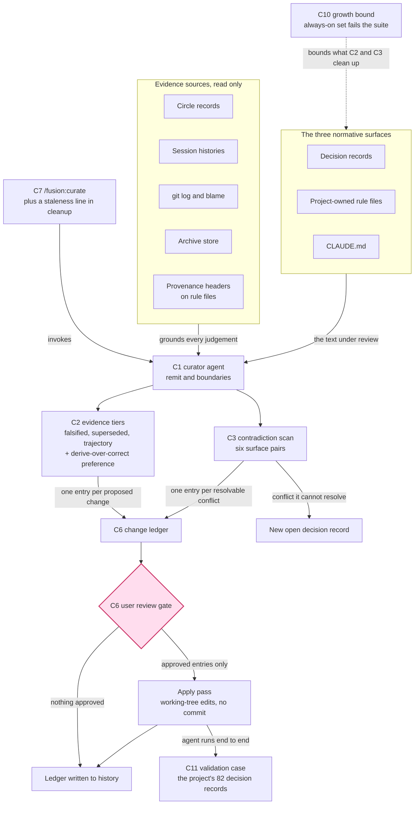

# Spec: the curator, and a bound on the rate the rule corpus grows

**Date:** 2026-08-14
**Status:** Draft
**Activated from Circle:** 260801-1244-curator
**Source:** The user's original proposal that fusion gain an agent which reads the project's history and the current state of the discussion, judges what must change and what remains, and consolidates the three normative surfaces that drift, contradict each other, and grow into a standing context tax. Re-shaped on 2026-08-14 in the shaper's portfolio-activation mode, after three playmaker runs found the Circle's Grounding falsified and its validation case gone.

**Relationship to the earlier spec.** `shared/planning/260801-1122_o_spec-normative-consolidation.md` covered four Circles. Three of them have closed, and that spec stays where it is as their record. This document is the surviving remainder re-shaped for the one Circle still open, and it is the only spec the planner works from for `260801-1244-curator`. Capability identifiers carried over from the earlier spec keep their original numbers (C1, C2, C3, C6, C7) so that every citation of them elsewhere in the workbench still resolves. The two capabilities added on 2026-08-14 take fresh numbers (C10, C11) rather than filling the gaps, for the same reason. C4, C5, C8 and C9 are absent by decision, and `## Out of Scope` says what happened to each.

**Prior decisions this spec builds on and does not reopen:** D1 (`shared/decisions/260801-1020_*_where-does-normative-consistency-live.md`), a writing agent rather than a report-only detector. D-a, D-c, D-d, D-f and D-h from the earlier spec, which fixed the remit boundary, the review-gate shape, the user-invoked cadence and the agent's name.

---

## Directive

A fusion-governed project can ask one agent, the `curator`, to reconcile its three normative surfaces against what actually happened in the project, and gets back a reviewed set of edits that removes what history has retired and resolves what the surfaces state in contradiction. Every proposed change carries an evidence tier and a citation, and a change justified only by re-reading the current text never removes a constraint. Nothing lands before the user has approved it at a gate. Alongside the agent, the always-on rule corpus every agent loads gains a hard growth bound, so the drift the agent cleans up cannot silently return.

---

## Shape

---

## Capabilities

### C1: The curator, its remit and its boundaries

**Description:** One new fusion agent, named `curator`, reads the three normative surfaces together with the project's retained history, and edits all three. Its remit is defined by the reason for an edit, not by the surface the edit touches. It changes something only when the change is justified by a cross-surface contradiction or by history-grounded obsolescence. Edits justified by anything else stay with the surfaces' existing owners.

**The three surfaces** are decision records under `$SCAN_DECISIONS`, project-owned rule files, and `CLAUDE.md`. In a consuming project the rule-file surface is `./rules/` and `.claude/rules/`, and nothing else. In this repository the working-tree preference makes `./rules/` the plugin's own rule directory, so a run here reaches the twelve files that ship to consumers.

**Boundary against `/fusion:revise-claude-md`.** The skill keeps its three-pass add, update and prune on the current session's learnings. The curator does not run those passes and does not call the skill. The two differ by evidence horizon: the skill works from the current session plus two days of git and never opens the workbench, while the curator works from the workbench and the whole git history. Running both is safe, because the curator only proposes changes carrying a workbench citation or a long-range git citation, which is the class the skill's evidence base cannot reach.

**Boundary against `agents/reconciler.md`.** The reconciler keeps its decision-marker walk against ground truth, including the reactive supersession that fires when a superseding record already exists. The curator does not advance markers on that basis. It handles the case the walk cannot see: two live records that contradict each other with no superseding record yet in existence, and a position that stopped applying without a successor arriving. Where the curator concludes that one live record supersedes another, it writes the `Superseded by:` annotation and renames the file, which is the same mechanical write the reconciler performs, reached by different reasoning.

**Retiring a rule file is deleting it.** There is no relocation directory, no tombstone and no version-control precondition. A deletion is an ordinary ledger entry, gated like every other change, and git holds the bytes. One obligation follows from dropping the precondition rather than replacing it: each ledger entry states its own revert path, and where the affected file is not under version control the entry says that no revert path exists. The user then approves or rejects with that in view. This costs a line of text per entry and replaces a mechanism that had to stop and ask.

**Explicitly not in the remit:**

- Advancing decision markers on ground-truth verification. The reconciler owns that.
- The session-learnings pass over `CLAUDE.md`. The revise skill owns that.
- Mechanical workbench shrinking by marker and date. `/fusion:archive` owns that.
- Any change to which rule files load for which agent. `bin/fusion-rules` and `./rules/context-manifest.yaml` own that, and they answer a different question, namely what loads, from the curator's question, which is what is true.
- Code, data, ontology, plans, defect records, agent prompts, skill bodies, and `README*.md`.
- Anything under `bin/`, `hooks/` or `docs/`. Where a change the curator wants requires an edit there, it reports the requirement and stops. C2's derive-over-correct rule and C10 both reach this boundary, and both handle it by reporting.
- The plugin's own installed `rules/` directory when running inside a consuming project. Those files live in the fusion install, outside the project tree.
- Committing anything. The agent leaves working-tree edits, as the revise skill does.

**Acceptance criteria:**

- [ ] Dispatching the agent on a project with all three surfaces present produces a change ledger covering all three, or an explicit statement that a surface yielded nothing.
- [ ] The agent's prompt states, in its Scope section, that it does not advance decision markers on ground-truth verification and does not run the session-learnings pass over `CLAUDE.md`, and names both owners.
- [ ] Running the curator and then `/fusion:revise-claude-md` in either order produces no edit that reverses the other's edit.
- [ ] The agent refuses, with a stated reason, when asked to edit an agent prompt, a skill body, a plan, a defect record, or any file under `bin/`, `hooks/` or `docs/`.
- [ ] In a consuming project the agent's rule-file scope covers `./rules/` and `.claude/rules/` and nothing else. A run in a project with neither directory reports that there are no project-owned rule files and proceeds with the other two surfaces.
- [ ] A ledger entry proposing to delete a rule file names `git checkout` as the revert path when the file is tracked, and states that no revert path exists when it is not.

**Decisions made:**

- The boundary is drawn by reason-for-edit rather than by surface, so the curator neither subsumes nor duplicates the two existing appliers (D-a, confirmed on 2026-08-01 and unchanged).
- The agent is named `curator` (D-h, confirmed on 2026-08-01 and unchanged).
- Retirement is deletion, and the relocation directory, the tombstone and the version-control precondition are dropped (user decision, 2026-08-14). The per-entry revert-path statement is the shaper's replacement for the dropped precondition, derived rather than chosen: C6 already requires the report to name the revert command, and stating it per entry is the same obligation at finer grain.

---

### C2: History-grounded justification for a change

**Description:** Every change the agent proposes carries a verdict tier and a citation. The tier says what kind of evidence justifies the change, and the citation names the evidence. A change with no citation is never applied. It is reported as a candidate the user may act on.

**Tier 1, a falsified claim.** The text asserts something checkable about the present, such as a path, a filename, a command, a version, a count, a configuration field, an agent name or a skill name, and the assertion is false today. Evidence is the check itself, reported with the command that was run and its result. No history is required.

**Tier 2, superseded by a recorded position.** The text encodes a position that a later record overturns. Evidence is a decision record carrying the answered, implemented or superseded marker, a Circle closure note, or a session history's design-decision section, cited by path plus section or line, whose content states the replacing position. The citation must name both the record and the sentence in the current text it overturns. A decision record still carrying the open marker is not evidence, because an open question retires nothing.

**Tier 3, obsolete by trajectory.** No single record retires it, but the accumulated history shows the practice stopped. Evidence is at least two independent sources that agree, drawn from different kinds, for example a git-log range showing a mechanism removed together with a Circle closure note describing the removal. The agent must be able to state when the thing stopped applying and what replaced it, or that nothing did. If it cannot state both, the change is downgraded to a candidate and not applied.

**Never permitted.** A deletion justified only by re-reading the current text. "This reads redundant", "this seems unimportant" and "this is historical narrative" are not evidence. Such a judgement may propose a consolidation, meaning a rewrite that preserves every constraint expressed in the original, but it may never propose removing a constraint. Consolidations are reported as their own ledger category and are gated like every other change.

**The derive-over-correct preference rule** (user decision, 2026-08-14). Where a Tier 1 falsified claim is a measurement of the tree, such as a count, a byte size, a file list or a version, and a command could produce that value, the ledger entry proposes the derivation rather than the corrected number. The entry names the command that produces the value and states what the surrounding sentence needs the number for, so that a reader can tell whether the sentence survives without a stated figure. A corrected value is proposed only as the fallback, and only where no command produces it.

The preference is not invented for this spec. `CLAUDE.md` already carries two worked instances of it, both reached the hard way. The always-on floor paragraph states that the number is deliberately not written down because it moves with every rule edit, and names `wc -c` over the always-on set as the way to obtain it. The workbench row records that a hand-written tracked-file count was deleted rather than re-measured, because a count of a directory every session writes to is wrong the day after it is written. Both are precedents in the surface the curator edits.

Implementing a derivation is coder work. Where the derivation needs a helper, a test or a generated table, the ledger entry names the requirement and stops there, per C1's boundary against `bin/` and `hooks/`.

**Evidence sources the agent must read**, in the order of value the gap analysis established:

1. Circle records under `$SCAN_CIRCLES`: the Directive, the Grounding snapshot, the Dependencies, the Turn log and the Closure note.
2. Decision records under `$SCAN_DECISIONS`, all five markers. Superseded and implemented records carry their own citation inline.
3. Session histories under `$SCAN_HISTORY`, including the reconciler-appended Coherence sections.
4. `git log --follow` on each rule file and on `CLAUDE.md`, and `git blame` when a single paragraph is in question.
5. Reviews and analyses under `$SCAN_REVIEWS` and `$SCAN_ANALYSES`.
6. `fusion-workbench/orchestrator-events.jsonl`, corroborating only. Its detail strings are summaries, so an event may support a finding but may never be its only evidence.
7. The archive store. No scan key resolves into it (`shared/issues/260801-1020_o_scan-keys-never-reach-the-archive-store.md`, still open), so the agent reads the archive directory directly. Skipping it makes the agent blinder the longer a project has run, which inverts its purpose.
8. The provenance header on a rule file. The header names the decision record, Circle or analysis that motivated the rule. Where the named record carries the superseded marker, the rule is a Tier 2 retirement candidate with no reconstruction required. All twelve of the plugin's rule files carry a header today.

**The thin spot, stated honestly.** For a consuming project's `./rules/` and `.claude/rules/`, sources 1 to 3 and 7 may be empty and source 4 may be uninformative, because those files can have been hand-authored outside any fusion session or copied from `templates/`. Behaviour there: Tier 1 changes still apply, and Tier 2 and Tier 3 findings are downgraded to candidates and reported. The agent does not reconstruct a rationale it cannot cite. The provenance convention narrows the gap forward and does not close it backward, because its lint gate lives in the plugin's own test suite and cannot reach a consuming project.

**Acceptance criteria:**

- [ ] Every ledger entry names exactly one tier and carries at least one citation in the form that tier requires.
- [ ] A Tier 1 entry shows the verification command and its output.
- [ ] A Tier 3 entry states when the practice stopped and what replaced it, or is marked as a candidate rather than as a proposed change.
- [ ] An entry that removes a constraint and cites only the current text is rejected by the agent's own pass and never reaches the ledger as a proposed change.
- [ ] A seeded stale count in `CLAUDE.md` produces a ledger entry proposing a derivation and naming the command that produces the value, not an entry proposing a corrected number.
- [ ] A seeded stale claim for which no command produces the value produces an entry that says so and proposes the corrected value.
- [ ] A proposed derivation that would require new code is marked as coder work and is not applied by the curator.
- [ ] The agent's report names how many files it read in each of the eight evidence sources, and reports zero explicitly where a source was empty.

**Decisions made:**

- Three tiers, with the never-permitted rule above them, unchanged from 2026-08-01.
- The derive-over-correct preference rule is added, and implementing a derivation stays coder work (user decision, 2026-08-14).

---

### C3: Cross-surface contradiction detection

**Description:** The agent compares the three surfaces against each other and reports every contradiction it finds. Where one side is falsified or superseded under C2, it fixes that side. Where both sides are live and defensible, it files a decision record and edits neither.

**What counts as a contradiction.** Two normative statements contradict when both are currently binding and an agent following one would violate the other. Three kinds:

- **Direct.** One says X, the other says not-X.
- **Precedence-undecided.** Two rule files from different roots are both emitted by `bin/fusion-rules` and both binding, and fusion has no precedence semantics between rule sources. Neither statement is wrong. The defect is that nothing says which governs.
- **Stale reference.** A normative statement cites an artifact that has moved, been archived, or never existed. Stale references are Tier 1 under C2 and are usually resolvable without the user.

**The pairs checked.** Six: decision against decision, decision against rule file, decision against `CLAUDE.md`, rule file against rule file, rule file against `CLAUDE.md`, and `CLAUDE.md` against itself.

**Behaviour on an unresolvable contradiction.** The agent files a decision record at `$OUT_DECISION` with the open marker, following the decision-record template in `rules/fusion-workbench-conventions.md`. The Question section states the conflict, the Options section states each position with its `path:line` citation, the Constraints section states what breaks under each, and the Recommendation section carries the agent's view with its confidence labelled per `rules/critical-stance.md`. The agent edits neither side, and it reports the record's path in its summary. Placement follows the Origin Rule and resolves through `bin/fusion-paths`, never through a named store path.

**Note on overlap.** The analyst is currently the typed authoring path for a decision record, and the consultant is explicitly told to delegate rather than write one. The curator becomes the second authorised author. That must be stated in the curator's prompt and reflected wherever the division of labour is documented, or it reads as an accidental overlap.

**Acceptance criteria:**

- [ ] The agent's report lists, per surface pair, how many pairs were compared and how many contradictions were found.
- [ ] A seeded direct contradiction between a rule file and `CLAUDE.md` is found and reported.
- [ ] A seeded precedence-undecided pair, being the same rule stated differently in `./rules/` and `.claude/rules/`, is reported as a contradiction rather than silently resolved by picking one.
- [ ] An unresolvable contradiction produces a decision record at the path `bin/fusion-paths` resolves, with all four template sections filled and both positions cited by path and line.
- [ ] The agent makes no edit to either side of a contradiction it filed as a decision record.

**Decisions made:**

- Unresolvable contradictions become open decision records rather than defect records, because a contradiction between two defensible positions is a choice point rather than a defect. This follows the issues-versus-decisions split in `rules/fusion-workbench-conventions.md`.

---

### C6: Review gate, revert path, and wrong-prune detection

**Description:** The agent runs in two passes with a user gate between them, inside a single dispatch. Nothing is written to any surface before the user has seen the complete change ledger.

**Pass 1, survey, no writes.** The agent produces the change ledger: one entry per proposed change, carrying the surface, the file, the tier, the evidence citation, the exact text before, the exact text after, the revert path, and a one-line statement of what constraint is removed where the change removes one.

**The gate.** The ledger is presented grouped by consequence rather than by surface, most consequential first: constraint removals, then Tier 3 changes, then Tier 2, then Tier 1, then consolidations. The user approves all, approves by group, approves individually, or rejects.

**Blast-radius stop.** If proposed deletions exceed 20 percent of any single surface's bytes, the agent says so at the top of the gate and asks the user to confirm the scale before showing the ledger. A run that wants to delete a fifth of the project's binding rules is either right about something large or wrong about something large, and both deserve a pause.

**Preserve list.** The agent never proposes removing an item that falls under the categories `skills/revise-claude-md/SKILL.md` enumerates in its `## Pass guard — what to PRESERVE` section: critical procedures, hidden coupling, non-obvious failure modes, authoritative pointers, and user-authored content. The single exception is a Tier 2 change with an explicit superseding record. Tier 1 and Tier 3 evidence is not sufficient against a preserve-list item.

**Pass 2, apply.** Only approved entries. Working-tree edits. The agent never commits.

**Revert path.** `CLAUDE.md` and the rule files are git-tracked, so `git checkout -- <path>` restores them, and the report names that command with the affected paths. The workbench is tracked in this project as well, at 1 130 files, so decision-record edits have a git undo here. That is a property of this project rather than of fusion: a consuming project may leave its workbench untracked. The agent therefore writes the complete pre-edit content of every modified decision record into its own history file regardless, and does not condition that on the tracking state it happens to find.

**Wrong-prune detection.** The failure mode is silent, because a removed constraint breaks nothing at the time. Three mitigations, all cheap:

1. The change ledger is written to `$OUT_HISTORY` on every run, applied or not. Every removal names the removed constraint in one line, so someone looking for a rule that vanished can search the ledgers by phrase.
2. The report states, per surface, bytes and lines before and after, and the count of removals by tier.
3. The agent's own history file records the run's date, so a later run can bound its git-history reads by the previous run and report what changed in the interval.

**Acceptance criteria:**

- [ ] No file on any of the three surfaces is modified before the gate returns an approval.
- [ ] The ledger shows tier, citation, before-text, after-text and revert path for every entry.
- [ ] Constraint removals appear first in what the user sees, not last.
- [ ] Rejecting everything at the gate leaves all three surfaces byte-identical and still writes the ledger to history.
- [ ] Approving a subset applies exactly that subset, and the report marks each unapproved entry as skipped.
- [ ] A run whose proposed deletions exceed 20 percent of a surface's bytes asks the user to confirm the scale before the ledger is shown.
- [ ] A proposed removal of a preserve-list item without a Tier 2 superseding record is not offered at the gate.
- [ ] The report names the exact `git checkout` command that reverts the tracked edits.
- [ ] Every modified decision record's pre-edit content is present in the agent's history file, whether or not the workbench is tracked.

**Decisions made:**

- Survey, then gate, then apply, in one dispatch, rather than apply-then-review or a two-dispatch proposal document (D-d, confirmed on 2026-08-01 and unchanged).
- Blast-radius stop at 20 percent of a surface's bytes, a proposed default that the user may override.
- The pre-edit-content requirement is unconditional. The earlier spec derived it from an untracked workbench, and the workbench has since been tracked. Making the requirement conditional on tracking would push the judgement into the agent and lose the record in exactly the projects that need it most.

---

### C7: Invocation surface and cadence

**Description:** A user-invoked skill, `/fusion:curate`, dispatches the agent. Consolidation does not run automatically.

**Shape.** The skill dispatches the curator and presents the gate. `/fusion:cleanup` is not extended to run it. Cleanup is an autonomous one-shot wrap-up, and wiring a pass that rewrites binding rules into every session's end means constraints get rewritten without anyone having asked.

**What cleanup gains instead is a staleness signal, not a run.** One read-only line in its report, naming the date of the last consolidation run, read from the agent's history files, and the current byte totals of the three surfaces. The user learns when consolidation is worth running without consolidation happening behind them.

**Acceptance criteria:**

- [ ] `/fusion:curate` dispatches the agent and presents the gate.
- [ ] `/fusion:cleanup` does not dispatch the agent.
- [ ] `/fusion:cleanup` reports the last consolidation date and the three surfaces' current byte totals, or states that no consolidation has run.
- [ ] The skill runs correctly in a project with no active Circle and in a project with one, resolving every path through `bin/fusion-paths`.
- [ ] The agent is dispatchable directly, without the skill, for a user or an orchestrator that wants it mid-session.

**Decisions made:**

- User-invoked, with a staleness line in cleanup rather than an automatic run (D-f, confirmed on 2026-08-01 and unchanged).
- The skill is named `/fusion:curate`, following the agent's name.

---

### C10: A growth bound on the always-on rule set

**Description:** The always-on rule set gains a hard byte budget. Exceeding it fails the test suite instead of printing a report. Role-specific rule text keeps the report-only treatment it has today.

**Why the capability exists.** Compaction is a one-off act. This project has measured twice what happens without a bound: the partition that cut the conventions file from 51 416 bytes to 34 671 on 2026-08-05 had been undone within a week, and `shared/analyses/260812-0022-where-the-complexity-comes-from-and-what-would-have-to-go.md` measured the same shape on the largest deletion the project ever performed, where the deleted lines were back above their pre-deletion peak within four days. Its conclusion was that the binding constraint is the rate of addition rather than the size of the system. A curator without a bound buys about a week.

**The instrument already exists and already measures the right thing.** `hooks/lib/__tests__/rules-emission-golden.test.ts` computes the universal core as the intersection of all sixteen agents' emissions, derives each role's floor from a hand-maintained per-file baseline, and grants each role 12 000 bytes of head-room. Exceeding the head-room prints a named report and fails nothing, by an explicit decision recorded in that file. This capability changes that decision for one part of the measurement and leaves the rest of it alone.

**The cut, and why it is disjoint.** The bound is hard for the universal core only, meaning the rule text every one of the sixteen agents loads. Text emitted to a subset keeps the report. The reason is who pays: universal-core growth is charged to every dispatch in the fleet and nobody can opt out of it, while role-specific growth is paid by the agents that need the text. That is also exactly the boundary the user named.

**The state today, measured against HEAD `d7786eb` on 2026-08-14 by running the test.** All five roles are over budget and the suite passes:

| Role | Emitted rule text | Budget | Over by |
|---|---|---|---|
| core only, 8 agents | 86 466 | 75 654 | 10 812 |
| plus design-diagrams, 5 agents | 92 139 | 81 327 | 10 812 |
| plus circle-records, playmaker | 98 424 | 84 956 | 13 468 |
| plus circle-records and design-diagrams, shaper | 104 097 | 90 629 | 13 468 |
| plus circle-records and stash-and-lock, orchestrator | 111 381 | 94 206 | 17 175 |

The whole overshoot is universal-core growth. Since the 2026-08-05 cut the five always-on files grew by 22 812 bytes against 12 000 of head-room: `fusion-workbench-conventions.md` +17 249, `critical-stance.md` +4 641, `agent-setup.md` +721, `user-facing-output.md` +101, `decision-record-examples.md` +100.

**How the bound is armed, and the open question under it.** Arming the gate on today's corpus would ship a red suite. The specified behaviour is that the baseline is re-set once, at the moment of arming, from the corpus as this Circle leaves it, and the bound then applies to growth from that point. That is what rate-bounding means, and it is consistent with the user's direction that the compaction and partition work stays out of scope.

The specified behaviour overrides a position recorded in the instrument, and the spec says so rather than sliding past it. The test file states that the baseline moves at exactly one moment, after somebody has done the cleanup the report asked for. The argument for overriding it is that the rule was written for a reporting instrument, where the baseline's only job is to keep the report actionable, and that under a blocking gate the baseline acquires a second job, namely defining what the gate blocks on. What the original rule protects against is a silent raise that retires the standing cleanup request. That protection is preserved by making the arming re-baseline explicit in the file and by keeping the 2026-08-14 overshoot recorded there as text, so the cleanup request survives the number moving.

This is the shaper's inference, not the user's stated choice, and it is filed as an open decision record for confirmation before the planner plans this capability. See `## User Decisions Pending`.

**Acceptance criteria:**

- [ ] Adding bytes to any always-on rule file such that the universal core exceeds its budget makes the test suite fail, and the failure names the file and the overshoot in bytes.
- [ ] The same addition to a role-specific rule file produces the existing report and does not fail the suite.
- [ ] With the corpus as this Circle leaves it, the whole suite passes with the bound armed.
- [ ] The failure message names the command that regenerates the golden fixture and states the condition under which the baseline may move.
- [ ] The baseline map carries, per entry, a comment naming the cut or the arming event that produced the figure, so a baseline move is visible in the diff.
- [ ] The two existing hard gates, `RELEASE_CAP` and `DRIFT_CEILING`, are unchanged, and neither is raised.
- [ ] The file records the 2026-08-14 per-role overshoot as text, so the standing cleanup request outlives the re-baseline.
- [ ] Reverting the always-on files to their 2026-08-14 sizes after the bound is armed does not fail the suite, since a shrink is never a violation.

**Decisions made:**

- The bound is hard for the universal core and remains a report for role-specific text (user decision, 2026-08-14, on the shaper's cut).
- The instrument is the existing golden test rather than a new mechanism, because it already computes the universal core and already holds the per-file baseline.
- This capability is coder work. It edits `hooks/`, which C1 puts outside the curator's remit.

---

### C11: Validation case, the project's decision corpus

**Description:** The finished curator's first real job is a run against this project's own decision records. The run is both a deliverable and the proof that the capability works, because a curator that cannot correctly reconcile 82 records of its own framework's decision history is not finished.

**The corpus, measured on 2026-08-14 at HEAD `d7786eb`.** 82 decision records across the shared store and the Circles: 55 implemented, 14 answered, 9 open, 4 deferred, and none superseded. They span 2026-07-06 to 2026-08-13, which is 39 days rather than the three months an earlier framing claimed. The defect corpus alongside them holds 510 records, 278 in the shared store and 232 inside Circles, of which 117 are open.

**The question the run must answer.** Zero superseded records over 82 decisions in 39 days is either true or never recorded. That is C3's question put to a real corpus rather than a seeded fixture. The run either produces candidate supersessions with a Tier 2 citation each, or it establishes that no live record overturns another and reports the comparison count that backs the claim.

**How the defect corpus is used, and how it is not.** The 117 open defect records are a cross-check on the run's own claims, not a second surface. Where the curator proposes that a position was superseded or that a practice stopped, an open defect asserting the opposite is a stop, and the entry is downgraded to a candidate. Where a decision carries the implemented marker while an open defect describes the implementation as absent, the curator reports the pair and edits nothing, because advancing or retracting a marker on ground-truth verification belongs to the reconciler.

**Acceptance criteria:**

- [ ] A run against this project's decision corpus reports, per surface pair, how many record pairs were compared and how many contradictions were found.
- [ ] The run produces a verdict on the zero-superseded question: either a list of candidate supersessions each carrying a Tier 2 citation, or a statement that no live record overturns another together with the comparison count behind it.
- [ ] Every proposed supersession annotation names both records by path and quotes the sentence in the superseded record that the later record overturns.
- [ ] No decision record is renamed without user approval at the gate.
- [ ] The run reports how many records it read, and that number matches the count on disk at the time of the run.
- [ ] Where an open defect record contradicts a proposed change, the entry is downgraded to a candidate and the defect is cited in it.
- [ ] Where a decision carrying the implemented marker is contradicted by an open defect, the pair is reported and neither file is edited.
- [ ] The run completes inside one dispatch, gate included.

**Decisions made:**

- The validation case is this project's decision corpus (user decision, 2026-08-14).
- The consuming-project witness is not a second validation case and is out of scope for this Circle (user decision, 2026-08-14).
- The defect corpus is a cross-check rather than a fourth surface, which keeps C1's boundary against the reconciler intact.

---

## Constraints

- **D1 is settled and is an input rather than an option.** A writing agent, not a report-only detector.
- **`rules/fusion-workbench-conventions.md` holds 51 920 bytes and 24 second-level headings** (measured 2026-08-14). Twenty document sections remain, and only the decision-record template is still embedded, so the template-shredding hazard the earlier spec named has largely resolved itself through the 2026-08-05 partition.
- **The always-on floor is 93 819 bytes per agent at the leanest role and 129 172 at the heaviest** (measured 2026-08-14 with `bin/fusion-rules <agent> | xargs wc -c`). The conventions file is 55 percent of the leanest floor. `CLAUDE.md`, at 55 239 bytes, is now larger than the conventions file, and it is loaded by every Claude session in this project rather than by fusion's rule mechanism.
- **207 lines across 63 files cite the conventions file**, 106 of them by section name, measured across `agents/`, `skills/`, `rules/`, `bin/`, `hooks/`, `docs/`, `templates/`, `CLAUDE.md`, the README files and `.claude-plugin/`, excluding compiled output. Every one has to resolve after any edit, and the curator may not edit most of those surfaces, so for them it produces a rewrite list and a coder applies it.
- **The workbench is tracked in this project**, 1 130 files. That is a project decision rather than a fusion property, so no requirement in this spec may assume it.
- **The archive store is empty**, 0 files, and no scan key reaches it (`shared/issues/260801-1020_o_scan-keys-never-reach-the-archive-store.md`, open). C2 requires the archive to be read, so the agent reads it directly and the planner must handle that the resolver does not supply the path. In this project that source currently yields nothing.
- **The guard's protected-path half no longer exists.** The write-tool deny, the before-and-after fingerprint, the write-back, the `FUSION_ALLOW_RULES_WRITE` exemption and the `guard.protectedPaths` configuration leaf were all removed on 2026-08-12. Every surviving reference in `hooks/` is a comment, a test fixture string or a historical note; no live code reads the variable, verified on 2026-08-14. Nothing in the guard now resists a rule-file write in any project, and the git diff is the only bound. Every acceptance criterion in the earlier spec that asserted a block is therefore dead and is not carried forward.
- **All twelve plugin rule files carry a provenance header**, and the lint gate exists. The header is available to C2 as evidence source 8 from day one in this repository.
- **`bin/fusion-rules` never reads a rule file's content.** Any lifecycle mechanism depending on the helper parsing a marker or a status header would require changing the helper, which C1 puts outside the curator's remit.
- **`bin/fusion-rules` is agent-only.** It exits 2 on an unknown name. Skill bodies reach rule content by direct citation, so per-agent scoping never reaches them.
- **The always-on set is an explicit list rather than a pattern match**, namely the unindented `emit_if_exists` lines in `bin/fusion-rules`. A new always-on rule needs a line there, and the golden test's universal core is computed as the intersection of the sixteen emissions rather than read off that list.
- **`.claude/rules/` does not exist in this repository**, so a run here exercises the `./rules/` half of the rule surface and reports the other half as absent.
- **Fusion has no precedence semantics between rule sources**, stated deliberately in `bin/fusion-rules`. C3 reports precedence-undecided pairs and does not invent a precedence rule to resolve them.
- **The Origin Rule governs where the agent's own outputs land.** Decision records, history files and the change ledger resolve through `bin/fusion-paths`, never through a named store path. The path-lint test fails the build if a store literal appears in an agent prompt or a skill body.
- **Turn logs are unevenly populated** (`shared/issues/260801-1020_o_plane-mirror-circle-closed-with-empty-turn-log.md`, open). An evidence pass that walks Turn logs mechanically will under-report, which is why C2 lists closure notes as a separate source.
- **The golden test's own hard gates are historical facts and are never raised.** `RELEASE_CAP` at 105 354 and `DRIFT_CEILING` at 145 144 stay where they are, and C10 adds a third gate rather than moving either.

---

## Out of Scope

- **Capability C4 of the earlier spec, rule-file lifecycle and retirement.** Retired by user decision on 2026-08-14. Retirement is deletion, git holds the bytes, and C1 carries the one line that remains of it.
- **Capability C5 of the earlier spec, the guard changes.** Delivered by the closed Circles `260801-1244-guard-bash-inspection` and `260801-1244-guard-rules-write`, and then removed with the rest of the protected-path half on 2026-08-12.
- **Capability C8 of the earlier spec, the provenance header.** Delivered by the closed Circle `260801-1244-rule-provenance-header`.
- **Capability C9 of the earlier spec, reconciling, compacting, partitioning and scoping the conventions file.** Performed by hand by an executor in Circle `260805-2005-textschicht-gegen-code-nachziehen`, which also produced the four shards now in `rules/` and the scoping table in `bin/fusion-rules`. Out by user direction and not to be reopened.
- **Reducing the size of any always-on rule file.** This Circle bounds the corpus's growth and does not shrink it. A cut is a separate piece of work, and C10's report is what will ask for it.
- **A consuming-project witness as a second validation case.** Out by user decision on 2026-08-14.
- **A general answer to which rules an agent depends on.** Nothing in this spec claims such a map is derivable.
- **Fixing the two gap-analysis issues that are still open**, being the archive read-set gap and the empty Turn log. Both constrain this work without being part of it.
- **A precedence mechanism between rule sources.**
- **Promoting a Circle-local decision to the shared store.** The Origin Rule pre-authorises the step but does not define it, and defining it is its own piece of work.
- **Editing agent prompts, skill bodies, `README*.md`, `docs/`, `bin/` or `hooks/` by the curator.** Changes needed there are handed to a coder as a list. C10 is itself coder work and is in scope for the spec, not for the curator.
- **Committing anything.**

---

## Open for Planner

- Where the consolidation logic lives: one agent prompt, or an agent plus a skill body carrying the procedure. Both patterns exist in fusion.
- How the survey-then-apply structure crosses the gate. Sub-agents share no memory, so either the ledger persists to a file the apply pass re-reads, or the agent runs top-level and holds it. The spec requires only that the ledger reach the user unaltered and that the apply pass touch nothing outside it.
- How the agent bounds its git-history reads on a repeat run: full history each time, or since the last recorded run.
- Which `bin/fusion-rules` pattern name the curator's own rules are discovered under, and whether a new pattern word is needed. Note that adding one to the always-on set would itself be measured by C10.
- How the ledger is rendered at the gate so that a run with many entries stays inside the gate-prompt length caps in `rules/user-facing-output.md`.
- How the curator reads the archive store given that no resolver key supplies its path.
- Whether C10's hard bound is expressed as a separate assertion in the existing golden test or as a distinct test file, and how it shares the universal-core computation with the report so the two cannot disagree.
- How the arming re-baseline is recorded in the baseline map so that a later reader can tell an arming event from a post-cleanup cut.
- What the curator does on a run where a surface is unreadable rather than absent, for example a rule directory it lacks permission to read.
- How C11's run reports a comparison count for the decision-against-decision pair without claiming a completeness it cannot have over 82 records.

---

## User Decisions Pending

- [ ] **How C10's bound is armed.** The spec specifies a one-time re-baseline at the moment of arming, so the bound governs growth from that point, and it records the 2026-08-14 overshoot as text so the standing cleanup request survives. Two alternatives were considered and rejected in the spec's reasoning: performing an 11 KB cut of the always-on set first, which reintroduces the compaction work the user removed from scope, and arming the bound while the suite is red, which nobody would accept. The specified behaviour overrides a position recorded in `hooks/lib/__tests__/rules-emission-golden.test.ts`, so it is filed for confirmation as `circles/260801-1244-curator/decisions/260814-0738_o_how-is-the-always-on-growth-bound-armed-when-the-corpus-is-already-over-budget.md`. Confirm or redirect before the planner plans C10. Nothing else in the spec depends on the answer.
