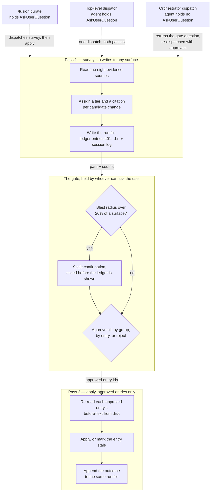
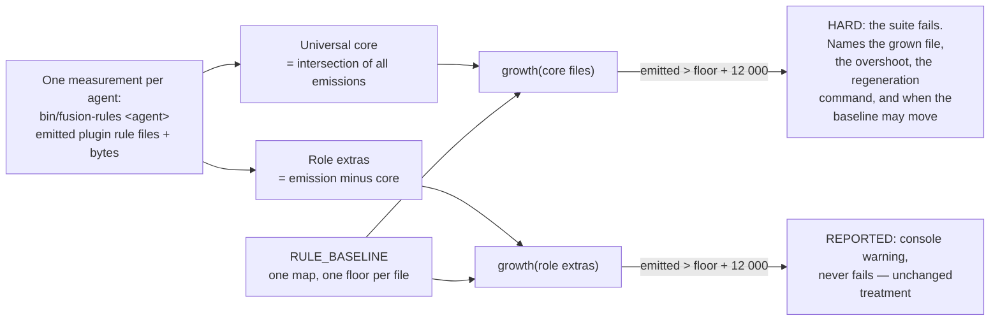
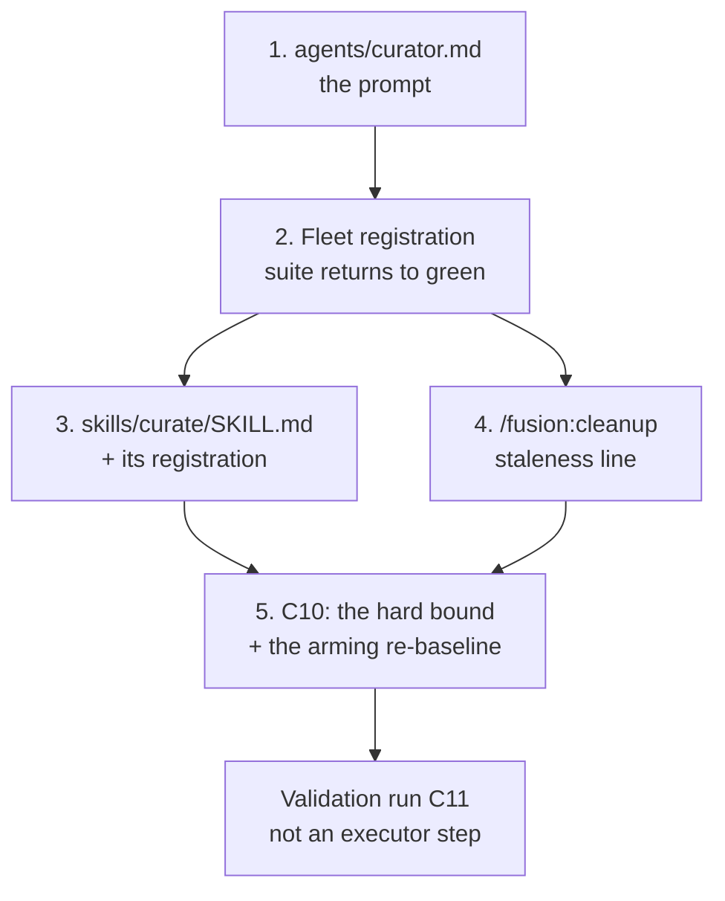

# Implementation Plan: the curator, and a hard growth bound on the always-on rule set

**Date:** 2026-08-14
**Status:** Draft
**Spec:** `circles/260801-1244-curator/planning/260814-0738_o_spec-curator.md`
**Circle:** `260801-1244-curator`
**Executors:** coder, ontocoder (the active set; every step below resolves to `coder`, and `## Executor routing` says why no step reaches `ontocoder`)

**Decidability:** The load-bearing question is whether the curator can decide, from the inputs it has, that a normative claim is falsified, superseded, or merely differently worded. Taken as posed the answer is no, and the tiers split three ways. Tier 1, a falsified claim about the present, is decidable: the claim names a path, a filename, a command, a version, a count, a configuration field, an agent or a skill, and a command produces the verdict. Tier 2, superseded by a recorded position, is decidable only in the positive direction: a superseding record either exists and resolves or it does not, while the absence of one over 83 records establishes nothing, and the semantic step "does this record's position overturn that sentence" is a judgement over prose that no command settles. Tier 3, obsolete by trajectory, is not decidable at all as posed, because it is a claim about absence over a corpus the agent samples rather than exhausts. So the mechanism changes, and the spec has already changed it: the curator never asserts the undecidable question. What it decides is a substitute question that its inputs do answer, namely whether a citation of the kind the tier requires exists and resolves, and every proposal built on one crosses a user gate before it touches a file. Tier 3 findings that cannot name a stop-date and a successor are downgraded to candidates and never applied; a constraint removal justified only by re-reading the current text is refused by the agent's own pass; a contradiction between two defensible positions becomes an open decision record instead of an edit. C11's verdict is bounded the same way, reporting the pairs a stated selection rule reached rather than a completeness the corpus size forbids. The residual is honest and is named in `## Risks & Mitigations`: an LLM's reading of two prose passages is the one step in the chain that no citation check replaces, and the gate is what stands behind it.

---

## Directive

Build the `curator` agent and its invocation surface, and turn the always-on rule set's byte budget from a report into a test failure. The spec holds the remit boundaries, the three evidence tiers, the derive-over-correct rule, the six surface pairs, the gate protocol, the invocation surface, the growth bound's cut, and the validation case. This plan does not restate them; it says where each lands in the tree, in what order, and how the ten questions the spec left to the planner are settled.

Seven capabilities are in scope: C1, C2, C3, C6, C7, C10, C11. Four are out and none returns: C4 and C9 by user direction, C5 and C8 delivered by closed Circles.

---

## Current State

**The tree.** This repository is the fusion plugin's own source, so the work is `agents/`, `skills/`, `bin/`, `hooks/` and the shipped documentation. Sixteen agent prompts sit in `agents/`, sixteen skill directories in `skills/`, twelve rule files in `rules/`.

**The growth bound's instrument exists and measures the right thing.** `hooks/lib/__tests__/rules-emission-golden.test.ts` runs `bin/fusion-rules` for every agent, computes the universal core as the intersection of all emissions, derives each role's floor by summing a hand-maintained `RULE_BASELINE` over the files that role loads, and grants each role 12 000 bytes of head-room. Four things in it are hard today: the golden fixture, the role coverage, the justification duty, and `DRIFT_CEILING`. The budget is the one thing that reports and never fails.

Measured at HEAD `e321a54` on 2026-08-14 by reading the five files directly: the universal core emits 86 466 bytes against a floor of 63 654, so it stands 10 812 over its 75 654 budget. That figure agrees with the spec's table for the core-only role. The three role-specific files stand at `design-diagrams.md` 5 673 against a baseline of 5 673, `circle-records.md` 11 958 against 9 302, and `workbench-stash-and-lock.md` 12 957 against 9 250. Every role's whole overshoot is therefore core growth, and no role's role-specific growth reaches its head-room on its own.

**The arming question is answered.** `circles/260801-1244-curator/decisions/260814-0738_a_how-is-the-always-on-growth-bound-armed-when-the-corpus-is-already-over-budget.md` carries the answered marker: the user chose option 1 on 2026-08-14 at an orchestrator gate. The baseline is re-set once, at the moment of arming, and the 2026-08-14 overshoot is written into the file as text so the standing cleanup request survives the number moving. The spec's `## User Decisions Pending` and the Circle record's `## Grounding snapshot` still describe the question as open; both lags are filed as `circles/260801-1244-curator/issues/260814-0828_o_the-grounding-and-the-spec-still-call-the-growth-bound-decision-open-after-it-was-answered.md`. C10 below is planned against the answer.

**The Circle record's title is stale.** It still names the conventions file as the validation case, which C11 replaced. Filed as `circles/260801-1244-curator/issues/260814-0813_o_the-circle-records-title-and-dependencies-still-describe-the-conventions-file-as-the-validation-case.md`. Nothing in this plan reads the title.

**Adding a seventeenth agent is not a free act, and the tree enforces that.** Five mechanical gates fail the moment `agents/curator.md` exists and until the fleet's registrations follow it:

| Gate | What breaks |
|---|---|
| `rules-emission-golden.test.ts` | `agentNames()` reads `agents/*.md`, so `fusion-rules curator` is invoked and exits 2 on an unregistered name; the golden fixture also lacks a `[curator]` block |
| `derivable-enumerations-lint.test.ts` | Five digit claims are re-derived from the tree: "N specialized agents" in `CLAUDE.md` and `README.md`, "The N agent prompts" and "the other N-1 inherit" in `CLAUDE.md`, "of the N prompts" in `README-agents.md` |
| `derivable-enumerations-lint.test.ts` | The skill roster is checked in both directions against `skills/`, and `README-agents.md`'s skill table must carry exactly one row per skill directory |
| `context-manifest.test.ts` | A hand-written `AGENTS` array plus a literal `expect(AGENTS.length).toBe(16)` |
| `fusion-paths.test.ts` | Hand-written `AGENTS` and `SKILLS` arrays, iterated for the key-set completeness assertion |

`reference-resolution-lint.test.ts` adds a sixth constraint of the opposite sign: a citation of `agents/curator.md` in any shipped text fails until the file exists. That fixes the direction of the first two steps.

**Twenty-seven further sentences say "sixteen" or "16 agents" in prose that no lint parses.** Seventeen are in `rules-emission-golden.test.ts`; the rest are spread over `context-manifest.test.ts`, `fusion-paths.test.ts`, `rules/rule-file-provenance.md`, `rules/fusion-workbench-conventions.md`, `CLAUDE.md`, `README-agents.md` and the plugin manifest's description. Counted by `grep` on 2026-08-14: thirty-two agent-count claims in nine files, of which five are the asserted ones above. They are Tier 1 falsified claims of exactly the kind the curator exists to catch, and how they are treated is the one question this plan files rather than settles. See `## Open Questions`.

**No scan key reaches the archive store**, and fixing that is out of scope by the spec. The archive is root-anchored at `archive/` under the workbench, `WORKBENCH` is emitted to every consumer, and `archive/` is deliberately excluded from the path-literal lint's `TYPE_FOLDERS`. The curator therefore reads `$WORKBENCH/archive` directly with no resolver change. In this repository that source holds zero files.

**The guard no longer resists a rule-file write.** The protected-path half was removed on 2026-08-12. What survives is the decision-governed category check at `high` sensitivity, which a consuming project configures in its own `fusion-guard.json`.

---

## Approach

Three tracks, sequenced so the test suite returns to green at the end of every step except the first.

**Track A, the agent.** One prompt at `agents/curator.md` carries the whole procedure. The skill is thin. The reason is C7's own acceptance criterion that the agent be dispatchable without the skill: a procedure living in the skill body would be unavailable on that path, and two copies of it would be a second authoring home for the thing most likely to drift.

**Track B, the invocation surface.** `/fusion:curate` follows the shape `/fusion:next` already uses: a skill that dispatches an agent, reads the file the agent wrote, and holds the user gate itself. `/fusion:cleanup` gains one read-only line and dispatches nothing.

**Track C, the growth bound.** One new hard assertion inside the existing golden test, sharing one growth function with the report over two disjoint file sets, plus the one-time arming re-baseline. It runs last, because the arming figures are read from the corpus as this Circle leaves it.

### How the gate is crossed

The change ledger is a file in every run. C6 already requires it, applied or not, so nothing here is invented to solve the gate problem: the artifact that has to exist anyway is the artifact the gate crosses.

The three invocation shapes differ only in who owns `AskUserQuestion`. All three read and write the same run file, and the apply pass never re-derives a proposal: its whole input is that file plus an approval set. Verifying each approved entry's before-text against disk before applying it is what makes the two-dispatch path as safe as the one-dispatch path, and it costs one read per entry.

### How the growth bound is cut

The two sets are disjoint and together they are the whole emission, so no byte is measured twice and none goes unmeasured. That is what answers the spec's question about the gate and the report disagreeing: they cannot, because they never read the same byte, and both read it through one function over one baseline map. Keeping the report on the whole role instead would make core growth fire in both places at once, which is duplication rather than agreement.

`GROWTH_BUDGET` stays at 12 000 for both halves. The figure was derived from four days of replayed history and no second figure has been measured, so inventing one for the extras half would be a guess wearing the authority of the first. The honest consequence, stated rather than hidden: a role's nominal advisory head-room becomes 24 000 across the two halves, of which only the core's 12 000 blocks. Nothing that fails today starts passing, because the report never failed anything.

### Step dependencies

Step 5 is last because the arming baseline is taken from the corpus as this Circle leaves it, and step 2 edits two always-on rule files.

---

## Implementation Steps

1. [DONE] **Author the curator agent prompt**
   - Executor: `coder`
   - Files: `agents/curator.md`
   - Changes: a new agent prompt carrying the whole procedure. Frontmatter is `name` and `description` only, as fifteen of the sixteen existing prompts have; the curator inherits tools and model from the parent session and declares no `tools:` allowlist, so the top-level invocation path receives `AskUserQuestion` and the dispatched path does not. Setup follows the shared three-command contract verbatim from `agents/reconciler.md` Setup steps 1 and 2. The body carries, in this order: the remit and the eight explicit exclusions of C1, including that retiring a rule file is deleting it and that each ledger entry states its own revert path; the three evidence tiers, the never-permitted rule and the derive-over-correct preference of C2, with the eight evidence sources enumerated and `$WORKBENCH/archive` named as source 7's read; the six surface pairs, the three kinds of contradiction and the unresolvable-contradiction procedure of C3, filing to `$OUT_DECISION` per the decision-record template; the two-pass structure, the ledger entry schema, the gate rendering, the blast-radius stop, the preserve list by citation to `skills/revise-claude-md/SKILL.md` `## Pass guard — what to PRESERVE`, the revert-path rule and the three wrong-prune mitigations of C6; the `## Tool Discipline` section in the dual-mode form `agents/planner.md` and `agents/analyst.md` already carry; the dispatch-parameter block of `## Data Structures` below; and a `## Scope` section that names the reconciler and the revise skill as the owners of the two things the curator does not do. Cite no store path as a literal: every write target is `$OUT_HISTORY`, `$OUT_DECISION` or `$OUT_ISSUE`, and every read target a `$SCAN_*` value or `$WORKBENCH/archive`.
   - Dependencies: none
   - Note: the suite is red from the moment this file exists until step 2 lands. That is the cost of the direction constraint, since `reference-resolution-lint.test.ts` fails on a citation of a file that does not yet exist and the golden test fails on an agent `bin/fusion-rules` does not know. The two steps belong in one working session.

2. [DONE] **Register the seventeenth agent across the fleet**
   - Executor: `coder`
   - Files: `bin/fusion-rules`, `hooks/lib/__tests__/fixtures/rules-emission.golden`, `hooks/lib/__tests__/context-manifest.test.ts`, `hooks/lib/__tests__/fusion-paths.test.ts`, `hooks/lib/__tests__/rules-emission-golden.test.ts`, `agents/consultant.md`, `rules/fusion-workbench-conventions.md`, `rules/rule-file-provenance.md`, `CLAUDE.md`, `README.md`, `README-agents.md`, `.claude-plugin/plugin.json`
   - Changes: add `curator` to the `PATTERNS=""` case arm and to the `IS_PROSE_AGENT=1` arm in `bin/fusion-rules`, and to no other arm, so the curator draws the five always-on files plus the project's two voice profiles and nothing else. Its role key is therefore `(core only)`, which `ROLES` already carries, and the universal-core intersection is unchanged. Regenerate the golden with `cd hooks && UPDATE_RULES_GOLDEN=1 npx vitest run lib/__tests__/rules-emission-golden.test.ts`, then read the fixture diff and confirm it holds exactly one new `[curator]` block and no other movement. Add `"curator"` to the `AGENTS` arrays in the two tests that hand-write one, and change `expect(AGENTS.length).toBe(16)` and the two test titles that name a count. Correct the five lint-derived digit claims. Add the curator's row to `README-agents.md` `## The agents`, its rows to `## Dispatch parameters`, and its name to the no-domain-patterns row of the rule-pattern table. Amend `agents/consultant.md:78` and its routing table row, which today name `analyst` as the sole owner of a decision record, to name the curator as the second authorised author for the unresolvable-contradiction case. Update `CLAUDE.md`'s agent bullet, its dispatch-parameter count and the manifest description. Handle the twenty-seven unparsed "sixteen" claims per whichever answer the decision record in `## Open Questions` receives; absent an answer, correct them in place, which is the reversible option.
   - Dependencies: step 1
   - Acceptance: `cd hooks && npm test` passes.

3. [DONE] **Add the `/fusion:curate` skill and register it**
   - Executor: `coder`
   - Files: `skills/curate/SKILL.md`, `hooks/lib/__tests__/fusion-paths.test.ts`, `CLAUDE.md`, `README-agents.md`
   - Changes: a new skill body with `allowed-tools: [Bash, Read, AskUserQuestion, Agent(fusion:curator)]`. It resolves the workbench root, runs `fusion-paths curate`, dispatches `Agent(fusion:curator)` with `**Mode:** survey`, reads the run file the agent reports, renders the gate as `## Data Structures` specifies, and dispatches a second time with `**Mode:** apply` plus the ledger path and the approved entry ids. It writes nothing itself. Add `"curate"` to the `SKILLS` array in `fusion-paths.test.ts`, the `/fusion:curate` mention to `CLAUDE.md`'s skill listing, and the table row to `README-agents.md`. Both additions are gated: the roster lint checks the skill list in both directions, and the table parser requires the slash command and the file column to agree.
   - Dependencies: step 2
   - Acceptance: `cd hooks && npm test` passes; `bin/fusion-paths curate` exits 0 with no stderr.

4. **Give `/fusion:cleanup` the staleness line**
   - Executor: `coder`
   - Files: `skills/cleanup/SKILL.md`
   - Changes: one read-only line in Step 8's report. It reads the most recent curator run file across every directory `$SCAN_HISTORY` names, reports its date, and reports the current byte totals of the three surfaces: the decision records under `$SCAN_DECISIONS`, the project-owned rule files under `./rules/` and `.claude/rules/`, and `CLAUDE.md`. Where no curator run file exists it says so. Naming `$SCAN_HISTORY` and `$SCAN_DECISIONS` in the body extends the skill's derived key set, which `bin/fusion-paths` picks up with no change. Cleanup dispatches nothing and gains no step.
   - Dependencies: step 2
   - Acceptance: `cd hooks && npm test` passes; `bin/fusion-paths cleanup` emits the two new keys.

5. **Arm the growth bound**
   - Executor: `coder`
   - Files: `hooks/lib/__tests__/rules-emission-golden.test.ts`
   - Changes: four things in one file. First, one function `growth(files)` returning emitted bytes, floor and delta over a given file set, computed from `RULE_BASELINE`, replacing the ad-hoc arithmetic in the report; `floorOf` becomes a call into it. Second, a new `it(...)` asserting the hard bound on the universal core alone, and the existing report narrowed to each role's extras. Third, the arming re-baseline: the five core entries in `RULE_BASELINE` take the sizes the regenerated golden reports at the moment this step runs, each gaining an inline comment naming the arming event, while the three role-specific entries keep their 2026-08-05 figures untouched, so the diff shows exactly which half moved and why. Fourth, the doctrine: `## Re-baselining after a cleanup` becomes a section naming both events at which the baseline may move, the cleanup and this one-time arming, citing the decision record; the running cut log above `RULE_BASELINE` gains a dated entry headed as an arming rather than a cut, stating that no bytes were removed and reproducing the 2026-08-14 per-role overshoot table as text; and the hard gate's failure message names the regeneration command and points at that section. Add unit-level assertions that exercise `growth()` on synthetic file sets, so all four behaviours are proved without mutating a real rule file: growth past the budget fails, a shrink never fails, growth in an extras file does not reach the hard gate, and the failure message names the grown file. `RELEASE_CAP` and `DRIFT_CEILING` are not touched.
   - Dependencies: steps 3 and 4
   - Acceptance: `cd hooks && npm test` passes with the bound armed, and the budget report prints nothing for any role.

### Executor routing

Every step resolves to `coder`, and the absence of `ontocoder` work is a property of the Circle rather than an oversight. The Circle touches agent prompts, a skill body, two shell helpers, one test file and the shipped documentation. No ontology entry, manifest, schema or domain-data file is in scope.

One assignment deserves its reasoning stated, because the routing rule names fixture data as `ontocoder`'s. `hooks/lib/__tests__/fixtures/rules-emission.golden` is not authored data: it is a pinned measurement that the test's own `UPDATE_RULES_GOLDEN=1` run rewrites, and the whole obligation attached to it is reading the resulting diff. The file's role decides the routing, and its role is a test artifact, so it goes to `coder` in the same step as the emission change that moves it. Splitting the regeneration into a second executor would put a handoff between a change and the diff that proves it.

---

## Settling the ten questions the spec left open

1. **Where the consolidation logic lives.** In the agent prompt. The skill is a thin dispatch-and-gate surface. C7 requires the agent to be dispatchable without the skill, so a procedure in the skill body would be missing on that path, and duplicating it would create the second authoring home this project has spent several Circles removing elsewhere.

2. **How survey and apply cross the gate.** Through the run file, in all three invocation shapes. The ledger has to be written on every run regardless of approval, so the crossing mechanism is an artifact the design already required. The apply pass reads that file and an approval set, and nothing else; before applying an entry it re-reads the before-text from disk and marks the entry stale rather than applying it where the two disagree. The spec's `## Acceptance criteria` for C11 says the run completes inside one dispatch, which holds literally on the top-level path and holds in substance on the other two, where the user sees one operation. The spec's own relaxation is the governing form: the ledger reaches the user unaltered and the apply pass touches nothing outside it.

3. **How git-history reads are bounded on a repeat run.** They are not bounded. The evidence pass reads the full `git log --follow` per file every time, and the previous run's date and HEAD are recorded solely so the report can say what changed in the interval. Bounding the evidence read to the interval since the last run would systematically hide the findings the curator exists to produce: a July record overturning a June rule is invisible in a window that starts in August. The cost is one `git log` per surface file per run, which is small against a per-run gate the user attends anyway. If a project's history ever makes the full pass expensive, that is a measured change to make then, not a guess to encode now.

4. **Which rule pattern the curator's own rules load under.** None. The curator joins the `PATTERNS=""` arm, so it draws the always-on set and nothing else, and its doctrine lives in its prompt, which C10 does not measure. A consuming project that wants to extend the curator reaches it through `./rules/context-manifest.yaml`, which already targets any agent by name with topic-scoped units; a new pattern word would be a second mechanism for a job the manifest does. The consequence for C10 is the point of the question and it is favourable: no always-on byte is added, the intersection is unchanged, and the curator's role key is one `ROLES` already carries.

5. **How the ledger is rendered at the gate.** The gate prompt never contains the ledger. It names the run file's path, the count per consequence group, the blast-radius verdict, and asks for a decision at group granularity in one question, with one line inviting per-entry approval by id. Entry ids are `L01` upward, assigned by the survey pass and written into the file, so per-entry granularity survives a prompt that stays inside the eight-line cap in `rules/user-facing-output.md`. Where the blast-radius stop fires, the scale confirmation is a separate, earlier prompt, as C6 requires.

6. **How the archive store is read.** `$WORKBENCH/archive`, directly. `WORKBENCH` is emitted to every consumer, `archive/` is a structural container root that the path-literal lint deliberately excludes from its type-folder list, and the spec puts the missing scan key out of scope. No resolver change.

7. **Whether the hard bound is a new file or an assertion in the existing test.** An assertion in `rules-emission-golden.test.ts`. A separate file would have to run `bin/fusion-rules` a second time and compute the intersection a second time, which is precisely the disagreement the question asks to prevent. One measurement, one baseline map, one growth function, two disjoint file sets.

8. **How the arming re-baseline is recorded.** On four surfaces that state one fact. Each of the five core entries carries an inline comment naming the arming event, against role entries that carry none and keep their 2026-08-05 figures. The running log above the map gains an entry headed as an arming, not a cut, saying that no bytes were removed and reproducing the 2026-08-14 overshoot table as text. The re-baselining section names both events at which the map may move and cites the decision record. The hard gate's failure message points at that section. A later reader hitting the gate learns the condition from the message; a later reader auditing the map learns it from the comment beside the number.

9. **What happens when a surface is unreadable rather than absent.** Absent means report zero and proceed, which the spec already fixes for `.claude/rules/`. Unreadable means report the surface by name with the error, proceed with the other two, and make no contradiction claim involving the unreadable surface, because a comparison over text the agent could not read is a claim it cannot support. Evidence that is unreadable is treated as evidence that is missing, so the affected findings are downgraded to candidates under the rule C2 already carries for the thin spot. Readable, absent and unreadable are the three branches, and no input falls outside them.

10. **How C11 reports a comparison count without claiming completeness.** By reporting what it compared and the rule that chose it. Eighty-three records give 3 403 unordered pairs, and no run reads them all. The report states the candidate-selection rule, how many pairs it produced, how many were read, and, in one sentence, that the verdict covers the pairs the rule reached rather than the corpus. The count itself is derived by a command named in the report, per the derive-over-correct rule the curator applies to everyone else. A verdict of "no live record overturns another" is therefore always qualified by its selector, which is the only form of that claim the inputs support.

---

## Data Structures

**Dispatch parameters.** Two lines, parsed off the dispatch prompt in the `**<Keyword>:**` form the six existing parameterised agents use. The curator becomes the seventh, and `README-agents.md` `## Dispatch parameters` is the single authoring home for the roster row.

| Line | Values | If absent |
|---|---|---|
| `**Mode:**` | `survey` \| `apply` | defaults to `survey`, which writes nothing to any of the three surfaces |
| `**Ledger:**` | workbench-relative path to a run file this agent wrote | required when the mode is `apply`; the agent **halts** without it |
| `**Approved:**` | entry ids, comma-separated, or `all` | required when the mode is `apply`; the agent **halts** without it |

The default is the pass that cannot write. An unparameterised dispatch surveys, which makes the dangerous mode the one that has to be asked for explicitly, and both of its inputs loud on absence in the way `editor`'s deliverable language is loud.

**Ledger entry.** One block per proposed change in the run file, carrying: the id, the surface, the file path, the tier, the citation in the form that tier requires, the exact before-text, the exact after-text, the revert path or an explicit statement that none exists, the consequence group, and, where the change removes a constraint, one line naming the constraint removed. A candidate carries the same shape with a `candidate` marker in place of the group and is never offered for approval.

**Run file.** One file per run at `$OUT_HISTORY/YYMMDD-HHMM-curator-run.md`, holding the session log, the evidence-source counts, the per-pair comparison counts, the ledger, the pre-edit content of every decision record the run intends to modify, and, after an apply pass, the outcome per entry. History files carry no state marker. The ledger and the session log are one artifact rather than two, because C6 requires the ledger in history on every run and a second file would duplicate its identity.

**`growth()`.** `(files: {rel, bytes}[]) => {emitted, floor, delta}`, where `floor` sums `RULE_BASELINE` over the given files and a file with no entry contributes zero, so a newly added always-on rule counts as growth in full. Called twice per role, over the core set and over the extras set.

---

## API Changes

- New agent `fusion:curator`, dispatched as `Agent(fusion:curator)`.
- New skill `/fusion:curate` at `skills/curate/SKILL.md`.
- `bin/fusion-rules` accepts `curator` and emits the always-on set plus both voice profiles. It gains no new emission and no new pattern.
- `bin/fusion-paths` gains nothing; `curate` and `curator` resolve by the existing prompt-grep derivation.
- `/fusion:cleanup`'s Step 8 report gains one line and its derived key set gains `SCAN_HISTORY` and `SCAN_DECISIONS`.
- `hooks/lib/__tests__/rules-emission-golden.test.ts` gains one hard assertion and narrows one report. No behaviour of `RELEASE_CAP`, `DRIFT_CEILING`, the golden fixture, the role coverage or the justification duty changes.

---

## Testing Strategy

**Mechanical gates already in the tree carry most of the load, and step 2 exists to satisfy them.** The five enumeration and roster checks, the golden fixture, the role coverage, the path-literal lint, the marker-format lint, the glob-nomatch lint and the reference-resolution lint all read `agents/*.md` and `skills/*/SKILL.md`, so a new prompt and a new skill body are checked against the project's own conventions the moment they land. `cd hooks && npm test` is the gate for every step.

**The growth bound is tested on synthetic inputs, not on the corpus.** Extracting `growth()` is what makes C10's four behavioural criteria provable without editing a real rule file to see whether the suite goes red. Growth past the budget in a core file fails and names the file; the same growth in an extras file reports and does not fail; a shrink never fails, because the comparison is one-sided; the message names the regeneration command. The live assertion over the real corpus then proves criterion 3, that the suite passes with the bound armed.

**One scope note on criterion 8.** Reverting the always-on files to their 2026-08-14 sizes after arming does not fail the *bound*, which is the criterion's subject. It does move the golden fixture, which pins sizes in both directions by design and is regenerated by one command. That behaviour predates this Circle and is not changed by it.

**What is not testable mechanically** is the agent's judgement, and no test in this plan pretends otherwise. The acceptance criteria in C1, C2, C3 and C6 that describe agent behaviour are exercised by the validation run below and by the seeded cases the spec names, both of which are read by a human.

---

## Validation Run (C11)

C11 is not an executor step and is deliberately not assigned to one. It is a run of the finished agent against this project's own decision records, and neither `coder` nor `ontocoder` can perform it: the curator performs it, invoked by the user through `/fusion:curate` after step 5 lands, at an orchestrator Turn or directly.

What closes it is the run's own output. The run file must report the number of records read against the count on disk at the time of the run, the per-pair comparison counts with the selection rule that produced them, and the verdict on the zero-superseded question in one of its two admissible forms. Every proposed supersession names both records by path and quotes the sentence it overturns. No decision record is renamed without approval at the gate. Where an open defect contradicts a proposed change the entry is downgraded and the defect is cited; where an implemented decision is contradicted by an open defect the pair is reported and neither file is edited.

The corpus figures move. The spec measured 82 decision records on 2026-08-14 and the store held 83 a day later, which is the derive-over-correct rule arriving on this plan's own text: the run reports the count it read, and no number here is the authority for what the run will find.

---

## Risks & Mitigations

| Risk | Mitigation |
|---|---|
| The one step no citation check replaces is an LLM reading two prose passages and calling one a supersession of the other. A wrong call there produces a citation-backed entry that is still wrong. | The gate. Every entry carries its before-text, its after-text and the quoted sentence it claims to overturn, so the user judges the same evidence the agent judged. Constraint removals are shown first, and the preserve list refuses everything but a Tier 2 change with an explicit superseding record. |
| The suite is red between steps 1 and 2, and an interrupted session leaves the repository in that state. | The two steps are one working session and the plan says so. The failure is loud and self-describing: the golden test reports an agent `bin/fusion-rules` does not know, and the enumeration lint names the count claims that no longer match the tree. |
| A wrong prune is silent, because a removed constraint breaks nothing at the time. | C6's three mitigations, all landing in the run file: the ledger is written on every run whether or not anything was applied, every removal names the removed constraint in one searchable line, and the report states bytes and lines before and after per surface. |
| In a consuming project the apply pass can be denied by that project's own guard configuration at `high` sensitivity, since the decision-governed category check survived the protected-path removal. | The agent reports a denied write as a failed entry with the denial reason and never records it as applied. A partial apply that silently claims completion is the failure to avoid. |
| Arming the bound on a re-set baseline can be read later as the silent raise the instrument warns against. | The four recording surfaces of question 8, and the overshoot preserved as text rather than only as a number that has moved. |
| The nominal advisory head-room per role becomes 24 000 across two halves once the report is narrowed to extras. | Stated in the plan rather than hidden. Only the core's 12 000 blocks, the report never blocked anything, and no second threshold is invented without a measurement behind it. |
| The curator's remit boundary against `/fusion:revise-claude-md` and against the reconciler is prose in a prompt, and prose in a prompt is overridable under task pressure. | The boundary is restated on both sides: the curator's `## Scope` names both owners, and step 2 amends `agents/consultant.md`, which is the surface that today names `analyst` as the sole decision-record author. Beyond that, the gate is the enforcement, as it is for every judgement in this design. |
| The Circle record's title still advertises the retired validation case, and `portfolio.md` renders that title. | Filed as issue `260814-0813`. Nothing in this plan reads the title, and resolving it belongs to the shaper or the orchestrator, whose write access to those sections is the reason it was left. |

---

## Open Questions

- [x] **How the twenty-seven unparsed "sixteen agents" claims are treated.** Five digit claims are re-derived by the enumeration lint and simply have to match the tree. The other twenty-seven are prose in which "sixteen" is a synonym for "every agent", and the project's own derive-over-correct doctrine says a figure a sentence does not need should leave rather than be corrected. Correcting them costs an edit now and the same edit at every future agent addition; removing the figure costs a slightly larger edit now and nothing afterwards. Filed as `circles/260801-1244-curator/decisions/260814-0845_o_are-the-sixteen-agent-claims-corrected-or-derived-away.md`, with the reasoning and a recommendation. Step 2 proceeds with the in-place correction absent an answer, which is the reversible branch. **Answered on 2026-08-14 at the plan gate: option 2.** The five lint-derived claims were corrected to seventeen and the figure was removed from the unasserted occurrences; the cut log's historical measurements were left untouched. Landed in step 2.
- [ ] Whether the hard dependency on `260801-1244-rule-provenance-header` survives on grounds other than the retired partition. Issue `260814-0813` raises it and explicitly does not settle it. Nothing in this plan depends on the answer: that Circle has closed, and the provenance headers it produced are available to C2 as evidence source 8 today.
