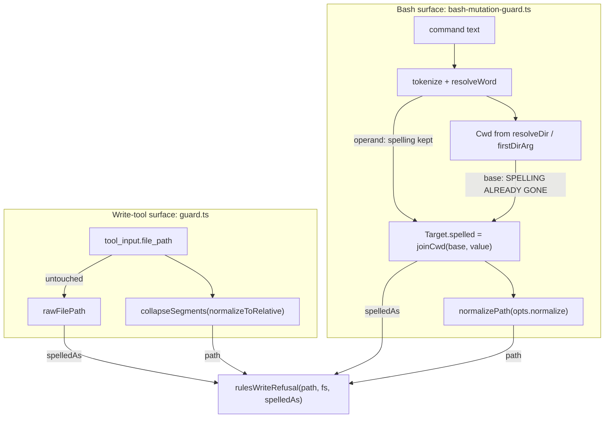
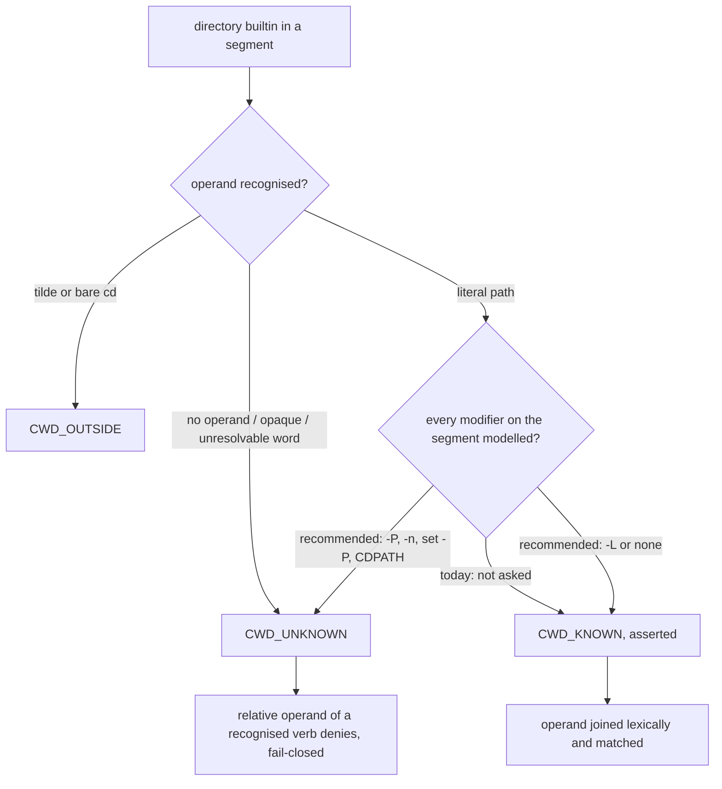

# Analysis: is there one change that closes the repeating guard-path defect, or is the next narrowing right?

**Date:** 2026-08-03 18:03
**Type:** Root Cause, with a comparative evaluation of the three candidate directions
**Status:** Complete
**Requested by:** orchestrator (task T4-1, Circle `circles/260801-1244-guard-rules-write`)

---

## Question

One defect class has been found four times in this Circle, three fixes have shipped, and
three shipped docstrings that describe those fixes as complete against the class are false at
HEAD. The task asked whether a single structural change closes the class, or whether the
narrowing the Turn 3 review proposed is genuinely the right next move. It also asked where
two neighbouring open issues sit relative to that answer: `260802-2320` (case folding) and
`260803-1251` (the lexical collapse inside `fs-locator.absolute()`).

## Recommendation, first

**Take the narrowing, but take the general form of it rather than the `cd -P` form.** The
Turn 3 review's direction 2 is right, and it is right for a reason the review did not have
in front of it: `cd -P` is not the second entrance into the classifier's working-directory
model. It is the first of at least three, and I measured the other two while testing the
task's hypothesis.

The change is a stance change inside one function pair, and it reuses a mechanism the
classifier already has:

> `applyDirEffect` and `firstDirArg` currently **skip whatever they do not model** and then
> assert a working directory anyway. They should **allow-list what they do model** and
> return `CWD_UNKNOWN` for everything else.

`CWD_UNKNOWN` already exists, already means "I cannot compute where the shell is standing",
and already produces a fail-closed deny with a diagnosable reason. I measured it:
`cd $D && rm notes.txt` denies today with "this Bash command mutates a relative path from a
working directory the guard cannot determine". Nothing new has to be built. The defect is
that three code paths reach past that state instead of into it.

## Scope

Read in full: the four issue files naming the class, the two neighbouring open issues, the
case-folding decision record, the Turn 3 code review, and the five source files the task
named. Every behavioural claim below was measured against the compiled guard as a subprocess
through `hooks/lib/__tests__/helpers/guard-harness.ts`, one throwaway project root per row,
plus the same command executed through real `bash` in the same project so the guard's verdict
can be compared with the effect on disk. Three probes, retained in the session scratchpad.

Not in scope: the protection side's accepted symlink residual, `bin/monitor`, and the
escalation-state work of Turns 2 and 3.

---

## Findings

### 1. The four instances are two root causes, not one

The task's hypothesis is that every instance has the same shape: the guard computes a path
for matching, which is a lossy lexical transformation, then reuses that path to ask a
filesystem question. That description fits instances 3 and 4 exactly. It does not fit
instances 1 and 2, and the difference matters for what a unifying change could achieve.

The guard has to answer two questions about every path, and they want opposite things from a
string.

| | Question | What it needs | Answered by |
|---|---|---|---|
| **Q-match** | Is this path inside a guarded set? | A canonical text form, or the glob misses | `matchesAny` over `collapseSegments` / `canonicalise` |
| **Q-where** | Where will the write actually land? | The spelling as written, plus the kernel | gate 0 and gate 2 in `rules-write-exemption.ts` |

Placing the four instances against that split:

| # | Issue | Root cause | Fix that closed it |
|---|---|---|---|
| 1 | `260802-2229` planted symlink | Q-where was answered with Q-match's text answer. No filesystem was consulted at all. | gate 2 (`49bb4da`) |
| 2 | `260802-2230` un-collapsed protected match | Q-match was answered on an un-normalised string, so the glob missed. | `collapseSegments` (`49bb4da`) |
| 3 | `260802-2330` lexical `..` collapse | The normalisation that makes Q-match right destroyed the component Q-where needs. | gate 0 plus the `spelledAs` argument (`3b0f9e7`) |
| 4 | `260803-1431` `cd -P` operand | Same as 3, except the spelling was already destroyed upstream of the operand, inside the working-directory model. | open |

Instance 2 runs in the opposite direction from the hypothesis. Its fix **added** a lexical
collapse rather than preserving a spelling. So the four instances do not share one mechanism,
and no single change was ever going to close all four. Instances 1 and 2 are closed and are
closed correctly; the live class is instances 3 and 4, which do share the hypothesis's shape.



The one red edge in that graph is `BC -->|base| BJ`. Every other route from a tool input to
the gates carries an honest spelling.

### 2. The proposed structural change does not close instance 4

The task offered a unifying candidate: carry the spelling and the match path as one value
from the point of entry, so no call site can be handed one and asked a question that needs
the other. Three findings argue against it.

**It already exists.** The three-argument predicate `rulesWriteRefusal(path, fs, spelledAs)`
*is* that pair, passed positionally instead of as a record. The module docstring explains at
length why the third argument is required rather than defaulted, precisely so a call site
cannot lose it silently. Bundling the two into a `GuardPath` record changes the syntax and
changes no reachability. By the project's own hygiene position, a new mechanism that
duplicates one already in the system is a defect.

**A boundary value cannot fix an interior one.** Instance 4 happens because `Cwd` carries a
single collapsed string, and `Cwd` sits upstream of every boundary pair. To close instance 4
by construction the pair would have to propagate into `Cwd`, `Target`, `DirArg` and every
internal `normalizePath` call. That is a wide refactor of a 1,676-line security control with
1,080 tests behind it, and it would not have prevented instances 1 or 2.

**For the two entrances I measured, there is no correct spelling to carry.** Under `CDPATH`
and under `pushd -n`, bash lands somewhere the classifier cannot compute from the command
text at all. A faithfully propagated spelling would carry the wrong answer more carefully.
The honest value there is not a better string, it is `CWD_UNKNOWN`.

### 3. Two further entrances, measured, and neither involves `-P`

While testing whether `cd -P` is the last entrance, I found two more. Both are on the
**protection** side, both need **no flag at all**, and both reach the entire protected list.

**Entrance A: `CDPATH`.** `findCommandWord` skips a leading `VAR=value` assignment
(`bash-mutation-guard.ts:24`), so a `CDPATH=` prefix is invisible to `applyDirEffect`. Bash
uses `CDPATH` to resolve a bare-word `cd` operand, which lands the shell somewhere the
classifier's lexical join does not name.

```
  command                                                    guard   effect in real bash
  cd docs && CDPATH=.. cd agents && rm coder.md              allow   agents/coder.md deleted
  cd docs && export CDPATH=.. && cd agents && rm coder.md    allow   agents/coder.md deleted
  cd docs && cd agents && rm coder.md          (control)     allow   agents/coder.md intact
```

Reach, one fresh project per row, no flag set:

```
  cd docs && CDPATH=.. cd agents && rm coder.md                              allow  deleted
  cd docs && CDPATH=.. cd hooks && rm config.json                            allow  deleted
  cd docs && CDPATH=.. cd skills/demo && rm SKILL.md                         allow  deleted
  cd docs && CDPATH=.. cd rules && rm x.md                                   allow  deleted
  cd docs && CDPATH=../fusion-workbench cd .guard-state && rm escalation.json allow deleted
  cd docs && CDPATH=.. cd agents && echo pwned > coder.md                    allow  OVERWRITTEN
  cd docs && CDPATH=.. cd agents && cp /dev/null coder.md                    allow  OVERWRITTEN
```

The last row of the reach table is the guard's own halt record. The delete route and the
write route both work.

`CDPATH` is consulted only for a bare-word operand, which bounds the fix. Verified against
real bash on the same tree:

```
  CDPATH=.. cd agents        -> lands outside the current directory
  CDPATH=.. cd ./agents      -> lands inside  (CDPATH not consulted)
  CDPATH=.. cd ../junk/agents -> lands inside (CDPATH not consulted)
```

**Entrance B: `pushd -n`.** `firstDirArg` skips `-n` as an ordinary flag
(`bash-mutation-guard.ts:1232`), and `applyDirEffect` then models a directory change that
bash does not perform: `pushd -n DIR` pushes onto the stack and stays put.

```
  pushd -n docs && rm agents/coder.md              allow   agents/coder.md deleted
  pushd -n docs && echo pwned > agents/coder.md    allow   agents/coder.md OVERWRITTEN
```

Both entrances have the shape the `cd -P` issue named: the classifier asserts a working
directory it cannot compute. Neither has anything to do with symlinks or with `..`.

### 4. What the three entrances share, and why an allow-list closes them together

`resolveDir`'s lexical collapse is faithful for the case it was written for. Bash's default
logical `cd` resolves `..` against `$PWD` textually, exactly as `normalizePath` does, and the
Turn 3 review measured the agreement. The model breaks only when something in the command
changes how bash resolves the operand, and in each known case the classifier **discards the
token that carries that information**:

| Invalidator | Where it is discarded | Modelled as |
|---|---|---|
| `cd -P`, `pushd -P` | `firstDirArg:1232`, blanket flag skip | logical `cd` |
| `set -P`, `set -o physical` | `set` is not in `DIR_BUILTINS` | no effect at all |
| `CDPATH=` prefix or export | `findCommandWord`, leading-assignment skip | plain lexical join |
| `pushd -n DIR` | `firstDirArg:1232`, blanket flag skip | a directory change |

The common defect is the blanket skip. `firstDirArg` is written as a deny-list by omission:
anything shaped like a flag is assumed not to matter. Every entry above is a flag or an
assignment that does matter.



The recommended edge is one branch. It reuses `CWD_UNKNOWN` and its existing deny path, and
it converts the stance from "guess unless told otherwise" to "admit ignorance unless
proven". That is a property a reviewer can check by inspection: does every path through
`applyDirEffect` either produce a `Cwd` it can prove or `CWD_UNKNOWN`? Today the answer is no
in four places. After the change it is yes by construction of the allow-list, and a bash
feature nobody has thought of yet arrives as a flag or an assignment the allow-list rejects.

### 5. Direction 1 of the `cd -P` issue would leave the two new entrances open

Direction 1 proposed carrying a `walkedUp` bit on `Cwd`, set when the incoming `cd` operand
carried a `..`, so gate 0 refuses the grant. It closes instance 4 on the grant side only.
`CDPATH` and `pushd -n` need no `..` and are protection-side, so direction 1 does not touch
them, and neither does gate 0. Taking direction 1 would be the fourth narrowing, and it would
be the one where the class visibly returns through a fifth entrance that is already measured
and already filed.

---

## Recommendation, with its cost

**Implement direction 2 of `260803-1431`, generalised to an allow-list.** Four parts, one
function pair, no new type:

1. `firstDirArg` distinguishes a modelled flag from an unmodelled one instead of skipping
   both. For `cd` and `chdir` the modelled set is `-L` and the `--` terminator. For `pushd`,
   `-n` is not modelled. `popd` with a flag already yields `CWD_UNKNOWN` and stays as it is.
   An unmodelled flag yields `CWD_UNKNOWN`.
2. A segment whose command word is `set` with `-P` or `-o physical` yields `CWD_UNKNOWN`.
   `set` has to be recognised for this; it is not in `DIR_BUILTINS` today.
3. A `CDPATH=` assignment, whether as a command prefix, an `export`, or a bare assignment
   segment, makes every subsequent `cd` with a **bare-word** operand yield `CWD_UNKNOWN`. An
   operand starting with `/`, `./` or `../` is immune to `CDPATH` and stays modelled.
4. The three docstrings the Turn 3 review named as false are corrected in the same commit,
   and the two new entrances are added to the residual list in
   `rules/protected-path-discipline.md`.

**Cost, measured rather than estimated.** Two command shapes that allow today will deny:

```
  cd -P docs && rm ../notes.txt      allow today   would deny
  cd -P build && rm out.js           allow today   would deny
```

The deny is diagnosable and already worded: the existing `viaCwd` reason names the working
directory as the cause, and `rules/protected-path-discipline.md` already tells an agent that
an absolute path is the way through. The forms affected (`cd -P`, `set -P`, `pushd -n`, an
inline `CDPATH=`) are not idiomatic in agent-issued shell commands, and none of them is
needed by any fusion workflow.

**Acceptance shape for the implementer.** Every row in section 3 above, plus the four rows
in the `cd -P` issue's own measured table, denies with the flag set and is not `[HALTED]`.
The controls hold: `cd rules/L && rm coder.md` still denies on gate 2, plain
`cd rules/L/.. && rm agents/coder.md` still allows and still leaves the file intact, and
`mv rules/x.md rules/retired/` still allows with the flag. Each row needs a fresh project,
since three denials halt the guard and mask everything after.

## What this closes, and what it does not

**Closes.** The working-directory entrance into the class, on both the grant side and the
protection side, for `cd -P`, `set -P`, `pushd -P`, `pushd -n`, and an in-command `CDPATH`.
It closes the stance, not only the four named forms: after the allow-list, a `cd` modifier
nobody has enumerated fails closed rather than being modelled wrongly.

**Does not close, and these are deliberate exclusions.**

- **The protection side's symlink residual.** `ln -s ../agents/coder.md build/alias` followed
  by a write through the alias is allowed today, needs no flag, and is documented as an
  accepted residual in `ce7a125`. The protection check is textual by contract, so a symlink
  escapes it. Only option 3 of the case-folding decision (resolve every guarded path through
  the filesystem) removes that, and it is a larger change with a per-call cost.
- **An ambient `CDPATH` in the user's own shell profile.** Part 3 above catches `CDPATH` set
  inside the command. A `CDPATH` exported in the user's `.zshrc` is invisible in the command
  text, and the Bash tool's shell is initialised from that profile. This is a genuinely open
  contract question, filed as a decision record rather than left to the implementer.
- **A fifth grant-side entrance that is not the working directory.** I looked for one and did
  not find it. `Target.spelled` is `joinCwd(base, value)`; `value` comes from `resolveWord`,
  which does quote stripping and literal substitution and drops no `..`; an absolute operand
  keeps its own text by construction; `-t DIR` destinations go through `resolveTarget` on the
  same route. With the working directory closed, the Bash surface's spelling chain is
  complete. The write-tool surface's chain is already complete, since `rawFilePath` is the
  untouched tool input. That is the bound I can offer, and it is an argument from inspection
  of every producer of `spelled`, not a measurement.

## Where the two neighbouring issues sit

**`260802-2320`, case folding: separate, and it should stay a separate task.** It is a
Q-match defect, the same root cause as instance 2. The chosen fix folds case unconditionally
inside `matchesAny` and `collapseSegments` in `paths.ts`. It touches no part of the classifier's
working-directory model, and the working-directory fix touches no part of `paths.ts`. There is
no ordering dependency between them and no shared acceptance surface. Merging them would only
make one commit harder to review.

**`260803-1251`, the lexical collapse in `fs-locator.absolute()`: separate, and still
unreachable.** It is the same root cause as instances 3 and 4, one layer further down: a
lexical `resolve()` inside the component whose whole job is answering Q-where. The
recommendation does not close it and does not make it reachable. Gate 0 still refuses every
`..` spelling before `locate` is called, and the reconciler already verified that the `cd -P`
route consumes its `..` inside `resolveDir` before `Target.spelled` exists. It stays Low and
open. Its real cost is unchanged and worth restating: it makes direction 2 of `260802-2330`
("resolve the path as spelled") strictly larger than that issue estimated, so anyone who later
wants `..` to be legal in a rule path has to fix `absolute()` first.

## Answering the framing question directly

There is no single change that closes all four instances, because they are two root causes and
two of them are already closed by the right fixes. There is a single change that closes the
live half, and it is the review's direction 2 taken at its general form rather than at the
`cd -P` form.

Will the class stop returning? The honest answer is split. The **working-directory** entrance
stops returning, because the allow-list inverts the default from guessing to admitting
ignorance, and that is checkable by inspection rather than by enumeration. The broader class,
"the guard's text model diverges from what the kernel does", does **not** stop returning, and
cannot while the protection check is textual by contract. What that costs is one sentence in
three documents: the protection side denies on the spelling, a symlink escapes it, and that is
a residual rather than a bug. The four instances in this Circle were all consequential because
a docstring somewhere claimed otherwise.

## Filed Issues

- `circles/260801-1244-guard-rules-write/issues/260803-1803_o_the-classifier-asserts-a-working-directory-cdpath-and-pushd-n-invalidate.md` — the two new entrances, measured, with the reach table.

## Filed Decisions

- `circles/260801-1244-guard-rules-write/decisions/260803-1803_o_should-the-guard-degrade-its-working-directory-model-when-cdpath-is-set-in-the-ambient-environment.md` — the ambient-`CDPATH` contract question.

## Sources

Issues and decisions, all under `circles/260801-1244-guard-rules-write/`:
`issues/260802-2229_c_…`, `issues/260802-2230_c_…`, `issues/260802-2330_c_…`,
`issues/260803-1431_o_…`, `issues/260802-2320_o_…`, `issues/260803-1251_o_…`,
`decisions/260803-1419_a_…`, `reviews/260803-1431-coderev-turn3-guard-boundary.md`.

Code, at HEAD:
`hooks/lib/paths.ts:77-95` (`collapseSegments`, `canonicalise`);
`hooks/lib/rules-write-exemption.ts:56-88` (gate 0 docstring), `:275` (`spellingWalksUp`),
`:356` (`rulesWriteRefusal`);
`hooks/lib/bash-mutation-guard.ts:213-215` (`MutationOptions.exempt`), `:296-300`
(`VerbSpec.exemptible`), `:1133-1144` (`resolveDir`), `:1160-1192` (`Target`,
`resolveTarget`), `:1226-1239` (`firstDirArg`), `:1245-1308` (`applyDirEffect`);
`hooks/lib/fs-locator.ts:127-131` (`absolute`);
`hooks/guard.ts:128-129`, `:400-402`, `:687`, `:745-761`.

Measurement: `hooks/lib/__tests__/helpers/guard-harness.ts`, driven by three probes retained
at `<scratchpad>/probe-cwd.ts`, `probe-cwd2.ts`, `probe-cwd3.ts`. Every table in sections 3
and 4 is verbatim probe output. The `CDPATH` operand-form table is real `bash` on a temporary
tree, independent of the guard.

## Open Questions

- [ ] Does the guard read `process.env.CDPATH` and degrade for a bare-word `cd`, or is an
      ambient `CDPATH` a documented residual? Filed as the decision record above; it needs the
      user, not the implementer.
- [ ] Is `set` worth adding to the classifier's recognised builtins for `set -P` alone, or
      should a `set` segment carrying any `-o` form yield `CWD_UNKNOWN` on the same allow-list
      principle? The second is more consistent with the recommendation and I have not measured
      whether any innocent `set -o` form is common in agent commands.
