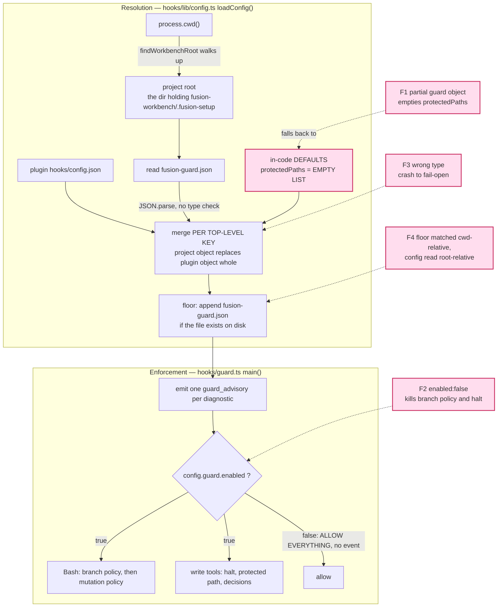

# Analysis: independent assessment of C5b, per-project guard configuration

**Date:** 2026-08-04 16:00
**Type:** Risk / Impact
**Status:** Complete
**Requested by:** user, via the orchestrator (task A1)
**Commits assessed:** `46d8333` (loader), `557340d` (template and root copy), `7f3d789` (setup seeding). Diff base `95a325d`.

---

## Question

Does capability C5b meet the acceptance criteria the spec sets for it, are its merge
semantics sound as a design rather than only as code, what can a consuming project now do
to itself through the new configuration file, and is the work ready for plan Step 10, which
is the ship?

## Verdict, first

**The three commits do what their own plan says, and the plan is wrong about one thing that
matters.** The loader, the template and the seeding are individually well built. Every claim
I checked in the three coder histories held up under independent measurement. The suite is
green at 1344 tests across 25 files, which is the number all three histories report.

**I would not ship this at Step 10.** Not because the code is defective against its plan, but
because the design decision the plan recorded as safe is not safe in the direction nobody
looked. A consuming project that writes the most natural possible edit to `fusion-guard.json`
— an object under the `guard` key confirming that the guard is enabled — loses every
protected path, silently, with the guard reporting the ordinary allow path. Two further
values in the same file turn the guard off entirely or crash it into its fail-open branch on
every tool call. None of these emits a diagnostic, and one of them emits nothing at all.

Eight issues are filed. Three of them are High.

---

## Scope

What I read: the spec's `### C5` section, the plan in full, the three coder and ontocoder
session histories, the two issues Step 6 filed, the decision record on the floor, and the
source of `hooks/lib/config.ts`, `hooks/guard.ts`, `hooks/tracker.ts`, `hooks/lib/paths.ts`,
`hooks/lib/workbench-root.ts`, `templates/fusion-guard.json`, `skills/setup/SKILL.md`,
`install.sh` and `bin/monitor`.

What I ran: `npx vitest run` in `hooks/` (1344 passed, 25 files, exit 0), and sixty-two
independent guard invocations through the shipped integration harness
(`hooks/lib/__tests__/helpers/guard-harness.ts`), each a fresh subprocess against a throwaway
project root that is not a plugin root. Plus the `/fusion:setup` Step 0f shell block run
three times against a scratch directory.

What I did not check: Claude Code's own hook dispatch, the compiled `hooks/dist/` artifact
(it is stale at HEAD by design, Step 10 owns it), the C5a criteria at `:322` through `:326`
which belong to Turn 1, and the marketplace install path beyond reading the installer.

I did not read the earlier `coderev` reviews in this Circle before forming these findings,
per the brief. I checked afterwards that none of the eight findings below appears in the
Circle's open or closed issues.

**Nothing in the repository was modified.** Every project root used for measurement was a
`mkdtemp` directory the harness creates and removes. The scratch seeding test ran under
`/private/tmp`. `git status` is unchanged from the start of this analysis apart from the
workbench's own session files.

---

## How C5b resolves configuration, and where the eight findings sit



The four flagged nodes are the ones that carry findings. Three of them meet at one place:
`MERGE` chooses an object, `DEF` supplies the leaf fallback, and `DEF`'s value for
`protectedPaths` is the empty list. That intersection is the design defect.

---

## Findings

### The spec's C5b criteria, walked

Six criteria at `260801-1122_*_spec-normative-consolidation.md:327-332` are
C5b's. I checked each by measurement rather than by reading a test name.

| Spec line | Criterion | Verdict | How I checked it |
|---|---|---|---|
| `:327` | A project declaring its own `protectedPaths` gets that list; one declaring only `escalation` keeps the plugin's | **Met** | `{"guard":{"protectedPaths":["secret/**"]}}` blocks `Edit secret/a` and allows `rm agents/coder.md`; `{"escalation":{...}}` alone still blocks `Edit agents/coder.md` |
| `:328` | An untouched seeded configuration gets the plugin's list, including paths added later | **Met** | The template verbatim blocks `agents/**`, `rules/**`, `skills/**` and emits no diagnostic. The "added later" half is pinned by `config.test.ts` case 2 against a synthetic plugin layer |
| `:329` | An `Edit` to the project guard configuration is blocked whether or not the file lists itself | **Met, with a reachability hole** | Blocked in both spellings, and on `rm`, `mv`, `cp`, `tee` and `>`. The hole is finding F4 below: it is only blocked when the guard's working directory *is* the project root |
| `:330` | An unparseable project configuration falls back and emits one advisory | **Met** | One `guard_advisory` naming the path and the `SyntaxError`, then the plugin's list still enforced. Also fires on an innocuous Bash call, which is the stated and accepted cost |
| `:331` | `/fusion:setup` creates the file when absent and leaves a filled-in one untouched | **Met** | The shipped Step 0f block run three times against a scratch directory: creates once, then byte-identical. The copy line alone is safe without the probe |
| `:332` | The two changes behave identically in the plugin repo and in a consuming project, or the difference is stated in the prompt and the release checklist | **Not met** | They do not behave identically: in the plugin repo the write guard stands down, so the floor does not protect `fusion-guard.json` there, while `git switch` still denies. The difference is stated in the seeded template but in no agent prompt and in no release checklist. `grep -rn fusion-guard README-hooks.md README.md CLAUDE.md rules/` returns nothing at all |

So five of six are met and the sixth is outstanding because Step 9 has not run. That is known
and tracked. It is not the reason I would hold the ship.

### The merge semantics, assessed as a design

The rule is that a project's top-level object replaces the plugin's whole, and only then does
the per-leaf `?? DEFAULTS` normalisation run. The plan states one consequence and calls it
harmless:

> A project that writes `guard: { protectedPaths: [...] }` and omits `defaultSensitivity`
> gets `defaultSensitivity` from `DEFAULTS`, not from the plugin's file. Both values are
> `"medium"` today, so nothing observable changes.

That is true of `defaultSensitivity`. The reasoning was not carried to the other direction of
the same rule, and the other direction is where the harm is. `DEFAULTS.guard.protectedPaths`
is the **empty list** (`hooks/lib/config.ts:149`). So any project object under `guard` that
omits `protectedPaths` inherits "protect nothing", not the plugin's nine patterns.

Measured, real guard subprocess, throwaway consuming project, shipped plugin config, no
environment flag:

```
fusion-guard.json = {"guard":{"enabled":true}}

  Edit  agents/coder.md                        allow      guard_allow
  Edit  rules/x.md                             allow      guard_allow
  Edit  skills/demo/SKILL.md                   allow      guard_allow
  rm -rf agents                                allow      (no event)
  rm -rf fusion-workbench/.guard-state         allow      (no event)
  Edit  fusion-guard.json                      DENY       (the floor, appended after the merge)
```

The same result for `{"guard":{"defaultSensitivity":"high"}}` and for
`{"guard":{"categoryPaths":{"api":["src/api/**"]}}}`. Three ordinary intentions — turn it on,
raise sensitivity, add a category — each remove the entire protected list, on both surfaces,
including the guard's own state directory.

This is not a coding error. The code does exactly what the docstring says. It is a design
that has one safe direction and one unsafe direction and defends only the safe one. A
project's edit can *narrow* deliberately, which is what D2 asked for and what a union could
not express; the same mechanism narrows to zero *accidentally*, and the accidental case is
the more likely one because writing a partial object is how people edit JSON.

The failure is silent in the strongest sense. The guard emits `guard_allow`, which is the
event that means everything is normal. There is no advisory, no diagnostic, no dashboard row.
The project owner learns about it when something they believed protected is gone.

What would fix it is not a union. It is that the *fallback* for a chosen object's missing
leaves should be the plugin layer, not `DEFAULTS`, for `protectedPaths` specifically — or
that `DEFAULTS.guard.protectedPaths` should not be the empty list, or that omitting
`protectedPaths` from a declared `guard` object should produce a diagnostic. Each of those is
a choice; the issue filed names them without picking one.

The template makes this worse rather than better. Its `_override` note says, accurately, that
"any field you leave out of your object falls back to fusion's built-in default, not to the
plugin's file" — and never says that the built-in default for the protected list is the
empty list. A reader who understands that sentence perfectly still does not learn that
omitting one key unprotects the project.

### What a consuming project can now do to itself

Three reachable states, all measured, ordered by how bad and how easy.

**The whole guard, off, in one key, with no signal.** `{"guard":{"enabled":false}}` reaches
the `if (!config.guard.enabled)` short-circuit at `hooks/guard.ts:652`, which sits *above*
the Bash dispatch and above every check. Measured:

```
fusion-guard.json = {"guard":{"enabled":false}}

  Edit  agents/coder.md            allow
  Edit  hooks/config.json          allow
  Edit  fusion-guard.json          allow      <- the floor itself
  rm -rf rules                     allow
  git switch main                  allow      <- the BRANCH policy
  git worktree add /tmp/w          allow
  fusion-workbench/.guard-state/   never created — zero events emitted
```

Two things about that are worse than the narrowing case. The git branch-switch policy dies
with it, and that policy is documented in three places as the one that runs unconditionally,
including in the plugin's own repository. I confirmed the same in a plugin-root project:
with the seeded template, `git switch main` denies; with `{"guard":{"enabled":false}}`, it
allows. And an **already active halt** is bypassed: a project with `haltActive: true` and
this file allows both `Edit agents/coder.md` and `rm -rf rules`, where the same project
without the file blocks both.

Issue `260804-1427_*_the-accepted-floor-residual-reaches-the-guards-own-state-directory-not-only-protectedpaths.md` records the accepted floor residual and bounds it with "an agent
cannot narrow its way out of a halt it is already in". That bound is correct for
`protectedPaths` and false for `guard.enabled`, with one saving detail I measured: while
halted, an agent cannot *create* the file either, because the halt blocks `Write
fusion-guard.json` and `echo x > fusion-guard.json`. So the accurate statement is that an
agent which writes the off-switch before it earns a halt is immune to halts from then on.

**The guard crashed into its fail-open branch, on every call.** The project layer is
`JSON.parse`d and cast (`parsed as RawConfig`, `hooks/lib/config.ts:240`) with no type
validation. Measured:

| `fusion-guard.json` | Result |
|---|---|
| `{"guard":{"protectedPaths":123}}` | `TypeError: declaredPaths.includes is not a function` — guard fails open, allows everything, emits `guard_error` |
| `{"guard":{"protectedPaths":{"a":"rules/**"}}}` | same |
| `{"guard":{"protectedPaths":[42]}}` | `TypeError: path.toLowerCase is not a function` — same |
| `{"guard":{"protectedPaths":"rules/**"}}` | **No error.** The string is spread by `[...declaredPaths]` into eight single characters, which match nothing. Everything allows, `guard_allow` is emitted, no diagnostic |

The last row is the quiet one and the most likely typo. `guard_error` at least reaches
`events.jsonl`; it is not in `bin/monitor`'s `WARNING_EVENT_TYPES`, so a permanently
fail-open guard shows nothing on the dashboard either.

This Circle already established this exact lesson. Issue
`260802-2334_*_a-shape-valid-escalation-json-makes-the-whole-guard-fail-open-on-both-surfaces.md`
found it for `escalation.json` and its own words are "every row that fails open is
well-formed JSON". C5b then created a second, larger, project-writable, git-tracked, actively
seeded file on the same code path with the same absence of validation. Nobody carried the
finding across.

**The floor defeated by a working directory.** The project layer is read from
`findWorkbenchRoot(process.cwd())`, which walks *up*. The protected patterns, including the
floor's `fusion-guard.json`, are matched against paths relativised to `process.cwd()`. When
those two directories differ the floor protects the wrong file. Measured with the workbench at
the project root and the guard's cwd one directory below it:

```
  Edit  ../fusion-guard.json                  allow
  Edit  <abs>/fusion-guard.json               allow
  rm ../fusion-guard.json                     allow
  cd .. && rm fusion-guard.json               allow
  Edit  secret/a                              DENY     <- proves the root config WAS loaded
```

The last line matters: the project layer is read from the root correctly, so the guard is
enforcing a list that came from a file it will not defend. The other protected patterns
degrade the same way, but for them the degradation is arguably correct — `rules/**` from a
subdirectory genuinely names a different directory. The floor is different in kind, because
it names one specific file at one specific place and then looks for it somewhere else.

*Inference, not measured:* the reachable trigger is a Claude Code session started in a
subdirectory of a fusion-set-up project. `CLAUDE.md` explicitly contemplates that shape
("A subfolder may legitimately have its own independent workbench"), and `findWorkbenchRoot`
is built to walk up, so a subfolder without its own workbench inherits the parent's.

### Coherence across the three commits

The seams are sound in the direction the plan checked and unsound in one direction it did
not.

**Loader to template.** The template's six underscore keys are genuinely inert:
`readLayer` accepts any JSON object and the merge reads exactly five named keys. Measured —
the seeded template produces `diagnostics: []` and an effective configuration equal to the
plugin's plus the floor. The ontocoder's three unit cases, including the mutation that makes
case 1 insufficient on its own, are the right cases and I could not find a way to make the
template pass them while inheriting nothing.

**Template to seeding.** `/fusion:setup` Step 0f copies from
`$FUSION_PLUGIN_ROOT/templates/fusion-guard.json`; `install.sh:80` ships `templates`, and the
root copy is not in that list, so the development artifact does not reach an HTTPS install.
Both files are trackable — `git check-ignore` exits 1 on both — and both are tracked. I
reproduced the Step 8 shape change and it is correct: with the file present the one-command
form is denied by the guard naming `fusion-guard.json`, and the probe-then-branch form is
not. That change was measured by its author and it measures the same way for me.

**The seam that is unsound is template to loader, in the claims direction.** The template
tells every consuming project two things the loader does not do:

> Once this file exists on disk the guard protects it, whatever this file itself says — an
> agent cannot unprotect the configuration that governs it.

Falsified by `guard.enabled: false`, and by any subdirectory working directory. This sentence
is seeded verbatim into every project `/fusion:setup` touches, so the misinformation
propagates by design.

> The escalation settings still apply, since the git branch-switch policy stays active even
> there.

True as far as it goes — I measured a halt arriving at `blocksBeforeHalt: 2` against denied
`git switch` calls in a plugin-root project — and incomplete for the same reason: with
`enabled: false` the branch policy does not stay active even there.

### Two smaller things

`{"escalation":{"blocksBeforeHalt":0}}` halts on the **first** block, before the agent has had
a second chance. Measured: one denied `Edit`, and `escalation.json` comes back
`haltActive: true, consecutiveBlocks: 1`. There is no lower bound on the value and no
diagnostic. A project that means "no threshold" and writes `0` bricks its own next tool call.

The plan's own tracking has drifted. Step 7 carries no `[DONE]` marker although `557340d`
landed it, and the plan header still reads "Steps 6, 7, 8 and 10 unstarted" while Steps 6 and
8 carry `[DONE]` blocks in the same file. `rules/fusion-workbench-conventions.md` makes the
inline marking mandatory precisely so the next reconciler does not have to re-derive state
from git.

---

## Implications

The spec asked for two things from C5b and got one of them cleanly. Projects can now
configure the guard, and the mechanism for reading and merging that configuration is
correct, cached properly, unit-tested, and honest about what it discards. That half is good
work and the tests behind it are real — I tried to make several of them pass vacuously and
could not.

What the spec did not ask, and what nobody in eleven sessions asked either, is what the
configuration file's *failure modes* are. The whole Circle's attention went to the question
"can an agent narrow `protectedPaths`", which is the adversarial framing, and the answer to
that is well understood and honestly bounded in issue `260804-1427_*_the-accepted-floor-residual-reaches-the-guards-own-state-directory-not-only-protectedpaths.md`. The three High
findings here are not adversarial. They are a project owner editing a JSON file the way
people edit JSON files. The guard's response to all three is to keep running and say nothing.

A guard that reports normal operation while protecting nothing is worse than no guard,
because it is the state in which someone stops checking. That is the same argument the spec
itself makes for C5c ("Building C5a on today's guard produces the appearance of a control,
which is worse than an acknowledged absence because it stops anyone looking"). The argument
applies to C5b's own configuration file and was not turned on it.

The fixes are small. A type check in `readLayer`, a decision about the `protectedPaths`
fallback, and a decision about whether `guard.enabled` belongs in the project layer at all.
None of them is a redesign. The merge rule can stay exactly as it is.

---

## Recommendations

1. **Do not run plan Step 10 yet.** Route the three High issues to `coder` first. Two of them
   need a user decision before code (the `protectedPaths` fallback, and whether the project
   layer may set `guard.enabled`); the third, type validation in `readLayer`, is a
   straightforward fix.
2. **Re-read `templates/fusion-guard.json` after those land** and correct the two claims. This
   is `ontocoder` work and it must not happen before the behaviour is settled, or the file
   documents a boundary that is about to move — the mistake Step 9 has already made once in
   this Circle.
3. **Fold the findings into Step 9's documentation scope** rather than adding a step. Step 9
   already owes the `fusion-guard.json` description in `README-hooks.md` and `CLAUDE.md`, and
   criterion `:332`'s release-checklist line. The residual list it writes should describe the
   measured reach, not the narrower one.
4. **Add the three High cases to the integration suite as pinning tests.** The harness already
   supports them; each is four lines. The existing
   `describe("what a project configuration can currently reach — measured, not endorsed")`
   block is the right home and already carries `MEASURES:`-labelled cases in this style.

## Filed Issues

- `260804-1601_*_a-partial-guard-object-silently-removes-every-protected-path.md` — High
- `260804-1602_*_guard-enabled-false-from-the-project-layer-turns-off-the-branch-policy-and-an-active-halt.md` — High
- `260804-1603_*_the-project-config-layer-is-not-type-validated-so-a-wrong-type-fails-the-guard-open.md` — High
- `260804-1604_*_the-self-protection-floor-is-matched-cwd-relative-while-the-file-is-read-root-relative.md` — Medium
- `260804-1605_*_the-seeded-template-states-two-properties-the-loader-does-not-have.md` — Medium
- `260804-1606_*_blocksbeforehalt-zero-halts-on-the-first-block-and-has-no-lower-bound.md` — Low
- `260804-1607_*_guard-error-is-not-rendered-by-the-monitor-so-a-fail-open-guard-is-invisible.md` — Low
- `260804-1608_*_plan-step-7-is-unmarked-and-the-plan-header-contradicts-its-own-step-markers.md` — Low

## Sources

- `260801-1122_*_spec-normative-consolidation.md:241-343` — capability C5 and the eleven criteria
- `260802-1856_*_plan-guard-rules-write.md` — Steps 6, 7, 8, and `## The four open questions, answered`
- `260804-1435-coder-step6-c5b-config-loader.md`
- `260804-1502-ontocoder-step7-guard-config-template.md`
- `260804-1511-coder-step8-setup-seeds-guard-config.md`
- `260804-1427_*_...md` and `260804-1432_*_...md` — the two issues Step 6 filed
- `260802-2334_*_a-shape-valid-escalation-json-makes-the-whole-guard-fail-open-on-both-surfaces.md` — the prior instance of the validation lesson
- `hooks/lib/config.ts:145-168` (DEFAULTS), `:216-241` (readLayer), `:250-332` (loadConfig, merge and floor)
- `hooks/guard.ts:624-680` (diagnostics, the enabled short-circuit, the Bash dispatch, the self-detect gate), `:900-905` (fail-open)
- `hooks/lib/paths.ts:143-151` (matchesAnyFolded), `hooks/lib/workbench-root.ts:17-28`
- `templates/fusion-guard.json`, `fusion-guard.json`, `hooks/config.json`
- `skills/setup/SKILL.md` Step 0f, `install.sh:80-84`, `bin/monitor:91-102`
- `hooks/lib/__tests__/helpers/guard-harness.ts` — the instrument all measurement ran through

## Open Questions

- [ ] Should the project layer be allowed to set `guard.enabled` at all? Disallowing it is one
      line and preserves the branch policy's documented unconditionality; allowing it and
      flooring it is more work and keeps a genuine capability.
- [ ] What should a declared `guard` object with no `protectedPaths` inherit — the plugin's
      list, the empty list as today, or the empty list plus a diagnostic?
- [ ] Should the floor be resolved against the project root rather than the working
      directory, which would make it the only pattern in the list with that property?
