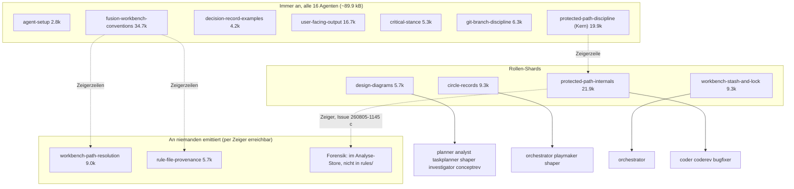

# Analyse: Wofür fusion da ist, wie es eingesetzt wird, und ob der heutige Stand den Zweck erfüllt

**Datum:** 2026-08-05 18:30
**Typ:** Document Study / Gap, mit vergleichender Messung vorher–nachher
**Status:** Complete
**Angefordert von:** Orchestrator (Dispatch im Circle `260801-1244-guard-rules-write`)

---

## Frage

Der Nutzer will wissen, ob das Plugin nach den massiven Änderungen der letzten Tage seinen Zweck erfüllt und ob die Umsetzungen der Intention entsprechen. Diese Analyse beantwortet fünf Teilfragen: wozu fusion tatsächlich eingesetzt wird (aus der Nutzung abgeleitet, nicht aus der Doku), was es am Stand `e8988d9` leistete und was jetzt, ob die Spec vom 1. August noch trägt, welche Extraschleife die teuerste war und ob ihre Ursache abgestellt ist, und was fehlt, geordnet nach dem, was ein Benutzer merkt.

## Umfang

Gelesen: die Spec `shared/planning/260801-1122_o_spec-normative-consolidation.md` vollständig, `docs/philosophy.md`, `docs/working-model.md` (Kopf), `README.md`-Familie (Umfänge), der Ausstiegsplan `planning/260804-2356_o_plan-ausstieg-kontextsteuer-und-auslieferung.md` vollständig, der Circle-Datensatz und Stichproben aus den 57 History-Dateien dieses Circles, die Wurzelursachen-Analyse `analyses/260803-1803-guard-path-model-root-cause.md`, die C5b-Bewertung `analyses/260804-1600-c5b-independent-assessment.md`, der Datensatz des abgespaltenen Circles `260804-1205-shell-reachability-model`. Im konsumierenden Projekt krk: Workbench-Struktur, beide Circles, Issue- und Decision-Stores, `portfolio.md`, `orchestrator-events.jsonl` (142 Zeilen), `.guard-state/` (14 599 Events), `agentstate.yaml`, `CLAUDE.md`, eine Orchestrator-History. Aus cocreator: alle sechs Dateien unter `fusion-plugin-findings/` (nur gelesen). Gemessen: Regelemission pro Agent an HEAD über `bin/fusion-rules`, Dateigrößen über die Commit-Historie, Commit-Verteilung `e8988d9..HEAD`.

Nicht geprüft: der Lauf auf der cocreator-Maschine selbst (nicht erreichbar), das Verhalten des kompilierten Hooks unter Claude Codes eigenem Dispatch.

---

## Befunde

### 1. Wozu der Nutzer fusion einsetzt (verifiziert aus zwei Projekten)

**krk** ist ein nativer macOS-Dateimanager in Rust, seit dem 2. August in Entwicklung. Die Nutzung dort ist ein einziger, lang laufender Bau-Circle: 20 Turns, 48 Tasks, 51 Commits in vier Tagen (aus `agentstate.yaml`), zuletzt heute 18:00. Die Agentenverteilung aus dem Event-Log: coder 37 Dispatches, planner 24, ontocoder 9, orchestrator 7, coderev 2, shaper 1; die Histories zeigen zusätzlich je einen analyst-, bugfixer- und playmaker-Lauf und zwei conceptrev-Berichte. Der Nutzer entscheidet laufend mit: 14 `user_gate`-Events, deren Inhalte substanzielle Produktentscheidungen sind ("Ordnernavigation auf die nackten Pfeiltasten", "Fortschritt in die Statuszeile statt ins Sheet"). Die Issue-Disziplin wird gelebt: der Circle trägt über 110 Issue-Dateien, fast alle geschlossen, und 25 Entscheidungsdatensätze mit gepflegten Markern (`_o_`/`_a_`/`_i_`). Das dominante Issue-Genre sind Plan-Text-Defekte, die während der Ausführung auffallen ("Dateiliste von Schritt X nennt Y nicht", "Abnahmekriterium kann nicht aufgehen"): der Rahmen wird also genau dafür benutzt, wofür er gebaut ist, nämlich Drift zwischen Plan, Zusage und Code sichtbar zu machen und sofort zu schließen.

**cocreator** (aus den sechs Protokollen) nutzt zusätzlich die Flächen, die krk nicht braucht: `/fusion:direct` und `/fusion:next`, playmaker mit Portfolio, `/fusion:archive` (941 archivierte Dateien, 12 archivierte Circles), den reconciler (Duplikat-Merge zweier Issues) und die Plane-Brücke gegen ein lokales Docker-Plane. Der Shared-Store dort hält 65 offene Issues und rund 25 offene Entscheidungen, also genau die Drift-Menge, für die die Spec den Curator entworfen hat.

**Was die Doku behauptet und die Nutzung nicht deckt.** `docs/philosophy.md` verkauft 16 spezialisierte Agenten. In krk kommen sechs davon nie vor: taskplanner (kein `tasklist.md` existiert; der Orchestrator führt die Queue in `agentstate.yaml`), reconciler (eine Erwähnung, kein Lauf), investigator, consultant, ontorev, editor. Die Portfolio-Schicht liegt in krk seit der Erstaktivierung brach: `portfolio.md` wurde am 2. August generiert und behauptet seither "kein Circle trägt `_t_`", während seit drei Tagen einer aktiv ist (die `Generated:`-Zeile macht das Alter erkennbar, der Widerspruch bleibt trotzdem stehen). Zwei kleinere Reibungen sind in den krk-Histories dokumentiert: die Domänenheuristik von Setup Schritt 5 lieferte `strategic` für einen Cargo-Workspace mit laufenden Tests (von der Sitzung von Hand auf `code` korrigiert), und die coder-Beschreibung nennt Go/TypeScript/React/Python, aber nicht Rust, die Sprache des am intensivsten bedienten Projekts. Beides als Issues gefilt.

### 2. Vorher–nachher, gemessen

**Was ein konsumierendes Projekt heute installiert hat** ist v5.8.0 = `e8988d9` (verifiziert: `~/.fusion/.claude-plugin/plugin.json` meldet 5.8.0; krk-Setup-Marker vom 3. August nennt 5.8.0). Seither: 68 Commits (17/16/24/11 über die Tage 02.–05.), Release v5.9.0 und v5.9.1 gepusht und getaggt, HEAD zwei Commits vor `origin/main`.

**Die Kontextsteuer, der Kernzweck laut `docs/philosophy.md` ("The problem it solves is context"):**

| Stand | Immer-an-Regellast pro Dispatch | Quelle |
|---|---|---|
| Spec-Baseline 31.07. | 87 387 B | Ausstiegsplan, Commit `8c1c9f8` |
| v5.8.0 = installiert | 105 354 B (alle 16 gleich; Diagramm-Agenten +5 593) | Ausstiegsplan |
| Spitze 04.08. | 145 144 B (alle 16) | Ausstiegsplan, `cac3726` |
| HEAD 05.08. | 89 896 B (5 Agenten) / 95 569 B (5) / 99 198 playmaker / 104 871 shaper / 108 448 orchestrator / 111 766 coder, coderev, bugfixer | eigene Messung, `bin/fusion-rules` je Agent, Summe der Plugin-`rules/`-Pfade |

`rules/protected-path-discipline.md` allein: geboren am 01.08. mit 11 032 B, an `e8988d9` 16 041 B, Spitze 50 559 B (04.08., `98c9363`), heute 19 943 B Kern plus 21 870 B Referenz (`protected-path-internals.md`, nur coder/coderev/bugfixer) plus Forensik, die ganz aus `rules/` heraus in den Analyse-Store gewandert ist. Die Konventionsdatei: 54 401 B → Spitze 59 303 B → heute 34 671 B Kern plus drei Shards mit begrenzter oder leerer Zielgruppe.

**Was davon ein Benutzer merkt, ehrlich gerechnet.** Gegen den installierten Stand 105 354 sparen zwölf Agenten bis zu 14,7 %. Vier liegen darüber: orchestrator +2,9 %, und coder/coderev/bugfixer +6,1 %, weil sie als einzige die Referenzdatei tragen. Gewichtet mit krks tatsächlichem Dispatch-Mix (Event-Log, 80 Agent-Dispatches) ergibt das Update im Mittel rund −3 000 B pro Dispatch, also etwa −3 % (abgeleitet, nicht verifiziert; das Event-Log untererfasst Dispatches). Der meistgenutzte Agent des beobachteten Konsumprojekts wird durch das Update schwerer, nicht leichter. Der Grund ist als Issue gefilt: die Referenzdatei adressiert laut eigener Aussage "whoever changes or reviews the classifier", und das tut in einem konsumierenden Projekt kein coder, denn die Guard-Quellen liegen dort außerhalb des Projektbaums und sind obendrein geschützt.

**Was das Update sonst bringt** (verifiziert aus Commits und Issue-Ledger): die Schließung der Case-Folding-Umgehung, die an v5.8.0 auf case-insensitivem APFS die gesamte Schutzliste aushebelt (`86a437a`; beide beobachteten Konsumprojekte laufen auf macOS), das Fail-Open bei formgültigem Eskalations-JSON (`d77eda8`), die Halt-Deckung beider Schreibflächen, `FUSION_ALLOW_RULES_WRITE` mit Advisory-Events, die Projektkonfiguration `fusion-guard.json` samt der acht Befunde der unabhängigen C5b-Bewertung (drei davon High: ein Teilobjekt löschte still jede Schutzliste), Monitor-Advisories, und drei aus konsumierenden Projekten gemeldete Defekte: der Setup-Deadlock auf archivierten Klammer-Markern (cocreator, zweimal von Hand übersteuert, behoben in v5.9.1 `ec0561a`), die irreführenden `← REPLACE`-Marker der Plane-Vorlage (zweimal Fehldiagnose, `1babb48`) und playmakers Mitlesen des eingefrorenen Archiv-Stores (`1babb48`). Nichts davon kommt an, bevor auf den konsumierenden Maschinen `fusion --update` läuft; die Installation auf dieser Maschine steht heute noch auf 5.8.0.

### 3. Der Guard im echten Einsatz: null Treffer, siebzehn Fehlalarme

Das kräftigste Empirie-Stück der ganzen Prüfung. krks `.guard-state/events.jsonl` hält 14 599 Events aus vier Tagen, darunter genau 17 `guard_block` auf der Bash-Fläche. Alle 17 tragen als Operand eine Variable, eine Tilde oder einen Glob: kein einziger Block nennt einen tatsächlich geschützten Pfad. Es sind durchweg Fail-Closed-Verweigerungen auf harmlosen Zielen, darunter `rm -f ~/Library/Application Support/KRK/session.toml` (das eigene Test-Artefakt der App) und, am bittersten, `mv "260803-1536_o_$f.md" "260803-1536_c_$f.md"`: die Marker-Umbenennung, die `rules/fusion-workbench-conventions.md` selbst als den Weg vorschreibt, Issues zu schließen, in ihrer natürlichen Schleifenform. Der Guard verweigert also die eigene Konvention des Rahmens, wenn ein Agent sie idiomatisch ausführt.

Zwei Dinge zur Einordnung, beide ebenfalls gemessen. Erstens hat kein Block zu einem Halt geführt (`consecutiveBlocks` stand heute auf 0), und die Deny-Botschaft leistet, was sie soll: sie erklärt den Grund, nennt den Ausweg (Pfad wörtlich ausschreiben) und verhindert das Herumrouten; die Agenten haben sich jeweils erholt. Zweitens ist die Rate niedrig: 17 Blocks auf 4 Tage intensiver Arbeit. Die Reibung ist bounded, aber ihr Nutzen war im Beobachtungszeitraum null, denn es gab keinen einzigen echten Treffer zu verhindern. Der abgespaltene Circle `260804-1205-shell-reachability-model` adressiert die Joiner-Fälle (`if cd X; then W; fi` u. ä.), aber nicht diese Klasse: `mv "$f"` bleibt auch unter einem Reachability-Modell unauflösbar. Als Issue gefilt, mit der Empfehlung, vor jedem weiteren Klassifizierer-Ausbau diese Empirie als Maßstab zu nehmen.

### 4. Die teuerste Extraschleife, und ob ihre Ursache abgestellt ist

Die Schleife ist präzise eingrenzbar: Turns 3 bis 10 (03.08. vormittags bis 04.08. mittags), die Härtung des Arbeitsverzeichnis-Modells im Mutationsklassifizierer. Rund 30 der 68 Commits, etwa 45 der 72 Issue-Dateien dieses Circles, und der Anstieg der Regeldatei von 16 100 auf 50 559 B fallen in dieses Fenster. Das Muster war jedes Mal gleich: ein Fix behauptet ein Modell der Shell, die Review findet den nächsten Eingang, den das Modell nicht sieht (`cd -P`, `command cd`, `pushd`-Rotation, CDPATH, Subshell-Pipelines, `git -C`, `GIT_WORK_TREE`), der nächste Fix verschiebt die Grenze. Der Turn-5-Review-Commit nennt es selbst: "the boundary moved a fifth time". Die Wurzelursache steht in der eigenen Analyse vom 03.08. (`260803-1803`): die Aufgabe, aus Kommandotext den Schreibort vorherzusagen, ist im Allgemeinen nicht entscheidbar; tragfähig ist nur eine Allow-List dessen, was das Modell beweisbar kann, plus `CWD_UNKNOWN` für alles andere. Bemerkenswert und unbequem: diese Analyse lag ab Turn 4 vor und empfahl genau die Haltung, die erst sechs Turns später, nach der Nutzerintervention, generalisiert wurde.

Zwei Ursachen, zwei Zustände heute:

- **Kein Kostenmesser.** Nichts bezifferte die wachsende Immer-an-Last, also bemerkte niemand die Bewegung; der Golden-Test sagt es in seinem eigenen Kopfkommentar: "A number nothing asserts is a number nobody notices moving." **Abgestellt, verifiziert:** `hooks/lib/__tests__/rules-emission-golden.test.ts` pinnt Pfadmenge, Reihenfolge und Byte je Agent, `RELEASE_CAP = 105 354` trägt im Quelltext "NEVER RAISE THIS" und blockierte den v5.9.0-Sprung tatsächlich, bis der Deckel je Rolle begründet war (`f41c1f6`, `2eaee31`); seit `3163281` meldet ein Wachstumsbudget Bewegungen statt sie nur zu sammeln. Die Spec hatte dieses Instrument als S1 sogar spezifiziert, aber als Teil von Schritt 4 statt als Vorbedingung; der Ausstiegsplan hat die Reihenfolge korrigiert ("Das Messinstrument zuerst, sonst ist jede spätere Behauptung unprüfbar").
- **Vollständigkeit als implizites Ziel, entgegen der eigenen Spec.** Die Spec hatte den Standard "fail closed on the constructible cases" und "the residual is documented rather than hidden" bereits gesetzt; die Turns 3–10 haben faktisch auf Vollständigkeit hingearbeitet. **Abgestellt, mit Restrisiko:** die Ein-Regel-Behandlung der 18 Befunde (Zweig B: Lücke dokumentieren statt Klassifizierer erweitern), die Auslagerung der Fortsetzung in einen eigenen anticipated Circle mit der Invariante "no command may newly allow" und der Pflicht zur generierten Cross-Product-Messung (222 319 Kommandos), und die Drei-Schichten-Teilung des Regeltexts. Das Restrisiko ist benannt: der Reachability-Circle ist genau die Einladung, die Schleife unter neuem Namen fortzusetzen; seine eigene Grounding hält dagegen ("The cost is honestly unmeasured, and it must stay that way until someone implements it").

**Was gut lief, genauso deutlich.** Der Ausstieg selbst war sauber: Instrument vor Schnitt, byte-genaue Verkettungsprüfungen bei jeder Teilung (Schritt 4a: 408 Zeilen, jede genau einmal wiedergefunden), Falsifikate pro Schritt formuliert und ehrlich als eingetreten protokolliert, Release erst nach Validierung gegen einen simulierten Installationspfad, und die drei Konsumprojekt-Defekte innerhalb eines Tages nach Meldung behoben. Die Spirale ist außerdem vollständig rekonstruierbar, weil die Issue- und Decision-Disziplin auch unter Druck gehalten hat; diese Analyse konnte jede Zahl aus Dateien belegen statt aus Erinnerung.

### 5. Trägt die Spec noch?

Der Stand der neun Fähigkeiten, gegen Code und Ledger geprüft:

| Fähigkeit | Stand |
|---|---|
| C5c Bash-Inspektion | geliefert in v5.8.0, gehärtet in v5.9.x |
| C5a Flag, C5b Projektkonfiguration | gebaut, remediert nach der C5b-Bewertung, geliefert in v5.9.0 |
| C8 Provenance-Header + Lint-Gate | geliefert |
| C9 Schritt 3 (Partition) und 4 (Zuschnitt) | ausgeführt, aber von Hand durch coder, nicht durch den Curator |
| C9 Schritt 1–2 (Reconcile, Compact nach C2-Tiers) | nicht als eigener Durchgang gelaufen; Teilkorrekturen nebenbei |
| C1–C3, C6, C7 (Curator, Beweisregel, Widerspruchsscan, Gate, Skill) | unberührt |
| C4 (Regelrückzug nach `retired/`) | unberührt, und aktuell ohne Bedarf: der gesamte Zuschnitt hat kein Byte gelöscht |

Das Urteil: **der Zweck der Spec steht, ihr Bauplan ist an zwei Stellen überholt.** Erstens ist D-g hinfällig: der "erste echte Auftrag" des Curators, die Konventionsdatei zu partitionieren und zuzuschneiden, existiert nicht mehr, denn er ist erledigt. Damit fehlt dem Curator-Circle sowohl sein Validierungsfall als auch sein konkretes Liefergut; C1–C3, C6, C7 bleiben als zusammenhängender Rest sinnvoll, brauchen aber vor Aktivierung einen neuen ersten Auftrag. Der Bedarf dafür ist real und liegt in cocreator: 65 offene Issues, rund 25 offene Entscheidungen, drei Monate Drift-Historie, dazu die in der Spec verifizierten Stale-Referenzen in fusions eigener `CLAUDE.md`. Zweitens ist die Dringlichkeitsreihenfolge gekippt: die Spec behandelte den Guard-Umbau als Vorspiel der Konsolidierung; tatsächlich war er der Hauptaufwand, und die Konsolidierungs-Kapazitäten C2 (Beweisregel) und C6 (Ledger-Gate) sind unverändert die Teile mit dem größten unerschlossenen Wert. Eine Neuformung des Curator-Circles vor Aktivierung ist Shaper-Arbeit; als offene Frage vermerkt.

### 6. Die Emissionsstruktur an HEAD, als Bild

Die eine strukturelle Schwäche des Bilds: die Zielgruppe von `protected-path-internals.md` ist nach Agentennamen geschnitten, nicht nach Repository-Kontext. Im Plugin-Repo ist "coder/coderev/bugfixer" die richtige Adresse; in jedem konsumierenden Projekt ist sie leer, und die 21,9 kB laden trotzdem. Ein mechanisch begrenzbares Kriterium existiert bereits im System (`hooks/lib/self-detect.ts` beantwortet "ist cwd das Plugin-Repo"), `bin/fusion-rules` konsultiert es nur nicht.

### 7. Kleinere Befunde am Rande

- Der Circle-Datensatz dieses Circles (`_t_circle.md`) blieb über die gesamte Laufzeit unberührt: `**Status:** anticipated` auf einem `_t_`-Record, leerer Turn log, `Active session history: (none yet)` neben 57 History-Dateien. In krk wurde dieselbe Defektklasse binnen Stunden gefilt und behoben (`260802-1417_c_circle-datensatz-status-widerspricht-dem-marker.md`); im eigenen Haus, wo der Guard stillsteht und der Druck hoch war, hielt die Konvention nicht. Als Issue gefilt.
- `README.md:26` nennt als Pin-Beispiel ein nie getaggtes `v5.3.0`: bereits gefilt als `issues/260805-1150_o_...`, hier nur zitiert.
- Beim Filen prüft niemand auf Duplikate im Store: bereits gefilt als `issues/260805-1548_o_beim-filen-prueft-niemand-ob-der-store-denselben-defekt-schon-traegt.md`; cocreators Duplikat-Merge durch den reconciler ist der lebende Beleg für den Bedarf.

---

## Implikationen

Fusion erfüllt seinen Kernzweck im echten Einsatz: krk ist ein durchlaufender Beleg, dass die Kombination aus Circle, Gates, Issue-Disziplin und enger Agenten-Scope produktive, auditierbare Produktentwicklung trägt, auch in einer Sprache (Rust), die die Doku gar nicht nennt. Die Krise der letzten Tage war keine Zweckkrise, sondern eine Steuerungskrise: ein Teilsystem ohne Kostenmesser wuchs unbemerkt gegen das erklärte Ziel. Das Instrumentarium, das genau das künftig verhindert, existiert jetzt und hat seine erste Bewährungsprobe (Blockade des Releases bis zur Begründung je Rolle) bestanden. Der ausgelieferte Zugewinn erreicht die Benutzer erst mit dem Update, und ein Teil des Zuschnitts wirkt beim wichtigsten Agenten in die falsche Richtung. Die Guard-Empirie aus krk verschiebt die Beweislast für jeden weiteren Klassifizierer-Ausbau: gemessen null verhinderte Treffer stehen gegen siebzehn Fehlalarme, davon einer auf fusions eigener Konvention.

## Empfehlungen

1. **Update ankommen lassen** (Nutzer): `fusion --update` bzw. Marketplace-Pull auf allen konsumierenden Maschinen, danach die Emissionszahl dort nachmessen (Falsifikat von Ausstiegsplan Schritt 6, noch offen). Die Case-Folding-Lücke und der Setup-Deadlock bleiben sonst live.
2. **Fail-Closed-Zuschnitt an der Empirie prüfen** (shaper/planner, vor dem Reachability-Circle): die 17/0-Bilanz aus krk als Grounding in `260804-1205-shell-reachability-model` aufnehmen; mindestens die Marker-Umbenennungs-Schleife verdient einen geprüften Weg, der ohne Ausschreiben jedes Pfads auskommt oder in den Konventionen eine schleifenfreie Form vorschreibt.
3. **`protected-path-internals.md` nicht an Konsumenten-coder emittieren** (coder, kleine Änderung in `bin/fusion-rules` mit Selbsterkennung): spart dem meistgenutzten Agenten konsumierender Projekte 21,9 kB pro Dispatch und bringt drei der vier über dem Release-Deckel liegenden Rollen darunter.
4. **Curator-Circle neu zuschneiden** (shaper): C1–C3, C6, C7 mit neuem Erstauftrag (cocreators drei Flächen oder fusions eigene `CLAUDE.md`), C4 explizit zurückstellen, D-g als überholt markieren.
5. **Kleinkram schließen** (coder): Domänenheuristik prüft künftig auf Quellcode-Bestand; coder-Beschreibung nennt Rust; Circle-Datensatz dieses Circles nachziehen, bevor der Circle schließt.

## Gefilte Issues

- `issues/260805-1830_o_protected-path-internals-erreicht-in-konsumprojekten-einen-adressaten-den-es-dort-nicht-gibt.md`
- `issues/260805-1830_o_alle-17-guard-blocks-im-beobachteten-konsumprojekt-waren-fail-closed-fehlalarme.md`
- `issues/260805-1830_o_der-circle-datensatz-dieses-circles-widerspricht-seinem-eigenen-marker-und-fuehrt-keinen-turn-log.md`
- `issues/260805-1830_o_die-domaenenheuristik-meldet-strategic-trotz-cargo-workspace-mit-laufenden-tests.md`
- `issues/260805-1830_o_die-coder-beschreibung-nennt-rust-nicht-die-sprache-des-groessten-beobachteten-einsatzes.md`

## Quellen

- Spec: `shared/planning/260801-1122_o_spec-normative-consolidation.md`; Ausstiegsplan: `planning/260804-2356_o_plan-ausstieg-kontextsteuer-und-auslieferung.md`
- Analysen: `analyses/260803-1803-guard-path-model-root-cause.md`, `analyses/260804-1600-c5b-independent-assessment.md`
- Messungen dieses Laufs: `bin/fusion-rules <agent>` je 16 Agenten an HEAD; `git show <commit>:rules/protected-path-discipline.md | wc -c` über 15 Commits; `git log --oneline e8988d9..HEAD` (68 Commits); `~/.fusion/.claude-plugin/plugin.json` (5.8.0)
- krk: `fusion-workbench/{agentstate.yaml, portfolio.md, orchestrator-events.jsonl, .guard-state/{events.jsonl,escalation.json}}`, Circle `260802-0842-krk-mac-dateimanager-editor-git` (Issues, Decisions, Histories), `CLAUDE.md`
- cocreator: sechs Dateien unter `.../shared/fusion-plugin-findings/` (Setup-Deadlock zweifach, Plane-Marker, Shaper-Wegwerf-Circle, zwei playmaker-Läufe)
- Golden/Gates: `hooks/lib/__tests__/rules-emission-golden.test.ts`, Commits `658653a`, `f41c1f6`, `2eaee31`, `3163281`

## Offene Fragen

- [ ] Nachmessung auf der cocreator-Maschine nach `fusion --update` (Ausstiegsplan Schritt 6, Falsifikat-Hälfte, von hier nicht ausführbar)
- [ ] Neuformung des Curator-Circles `260801-1244-curator` (Shaper-Dispatch; D-g überholt, Erstauftrag fehlt)
- [ ] Nimmt der Reachability-Circle die krk-Empirie (17 Fehlalarme, 0 Treffer) als Grounding-Messung auf?
