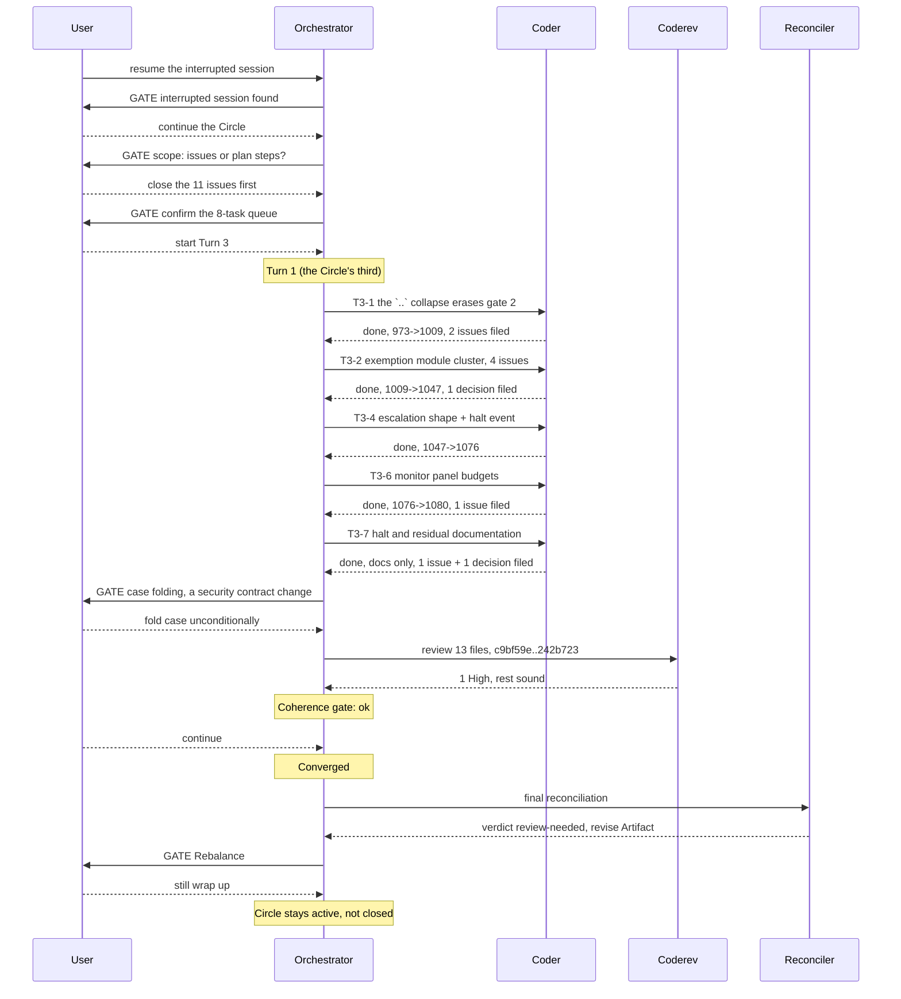

# Orchestrator Session — 260803-1038

**Directive:** A consuming project can permit rule-file writes on purpose, for one session, and see every write that happened only because it did. `FUSION_ALLOW_RULES_WRITE` exempts the project's rule directories and the `retired/` destination inside them, and nothing else; setting it does not turn the guard off and does not clear an active halt. Alongside the flag, the guard stops sharing one protected-path list across every project on an install: it reads a git-tracked `fusion-guard.json` at the project root first, then the plugin's `hooks/config.json`, then the in-code defaults, merging per top-level key. (Source: `circles/260801-1244-guard-rules-write/_t_circle.md` `## Directive`; capabilities C5a and C5b of `shared/planning/260801-1122_o_spec-normative-consolidation.md`.)
**Mode:** issues — the eleven open issues in this Circle, chosen by the user over the plan's remaining steps 6 to 10. The plan file stays the Circle's spine and did not advance this session.
**Status:** Complete. One Turn, converged, no circuit breaker. Coherence verdict `review-needed`; the user chose to stop rather than run a fourth Turn at the boundary, so the Circle stays active and does not close.
**Predecessor session:** `circles/260801-1244-guard-rules-write/history/260802-1827-orchestrator-session.md` (2 Turns, 7 commits, stopped by the net-negative-progress circuit breaker)

## Setup snapshot

| Item | Value |
|---|---|
| Workspace | `/Users/k1/Projects/productive/fusion` |
| Plugin version | 5.8.0 |
| Git HEAD at start | `c9bf59e` |
| Domain (detected) | `code` |
| Active Circle | `circles/260801-1244-guard-rules-write` |
| Circles | 1 anticipated, 1 active, 7 closed |
| Open issues | 31 total: 11 in this Circle, 20 shared |
| Open plans | 2: this Circle's plan, and the shared spec `260801-1122_o_spec-normative-consolidation.md` |
| Decisions | 1 answered in this Circle, 0 open anywhere |
| Guard | not halted; 0 consecutive blocks; last block 2026-08-01 (a branch-switch deny, working as designed) |
| Session resumed | yes, by user choice at the interrupted-session gate |

**Domain detection inputs:** 17 workbench commits, 7 analyses, 31 open issues, 0 open decisions, 3 top-level code files, 0 data files. No branch of the heuristic fired, so the fallback `code` applies. It matches the domain the prior session recorded.

**Working tree at Setup is not clean.** Seven issue files from the Turn 2 review are untracked, and `hooks/dist/` carries a build from the last `npm test` run (`guard.js`, `bash-mutation-guard.js`, `paths.js` modified; `fs-locator.js` and `rules-write-exemption.js` untracked). The prior session deliberately left `dist/` at HEAD; the current dirty state is a test-run artifact. Plan Step 10 rebuilds and commits `dist/` as its own step, so this resolves there rather than now.

## Where the prior session stopped

Plan steps 1 through 5 are `[DONE]` and committed (`768242c` through `bf75941`, plus the Turn 2 hardening at `49bb4da` and the workbench close-out at `c9bf59e`). Steps 6 through 10 remain: the C5b configuration loader, the template and this repository's own `fusion-guard.json`, the `/fusion:setup` seeding, the documentation edit, and the `dist` rebuild with the version bump.

Against that, 11 open issues sit in this Circle, 10 of them filed by the two review passes. The circuit breaker tripped precisely on that shape: Turn 1 resolved 5 tasks and filed 6 issues, Turn 2 resolved 3 and filed 7.

## Budget

| Metric | Count |
|--------|-------|
| Turns | 1 (the Circle's third) |
| Tasks resolved | 8 of 8 |
| Tasks skipped/deferred | 0 |
| Issues resolved | 10 of the 11 in scope |
| Issues created | 5 (4 by executors, 1 by the review) |
| Decisions filed | 3 (2 open, 1 answered) |
| Commits | 7 |
| Agent errors | 0 |
| Human gates hit | 4 (interrupted session, scope, queue, case folding) plus the two closing gates |
| Tests | 973 → 1080, across 20 → 23 files |

## Per-Turn Log

### Turn 1 (the Circle's third), `c9bf59e..fa81589`

Eight tasks against eleven issues, run sequentially rather than in parallel: five of the
issues lived in one module, and the two remaining coder tasks would have raced on the `tsc`
rebuild that every `npm test` run performs.

| Task | Issues | Commit |
|---|---|---|
| T3-1 gate 0, the `..` spelling refusal | 260802-2330 | `3b0f9e7` |
| T3-2 the exemption module cluster | 260802-2213, -2231, -2332, -2333, 260803-1252 | `245b8b7` |
| T3-4 escalation shape, halt event detail | 260802-2334, -2336 | `d77eda8` |
| T3-6 the monitor's panel budgets | 260802-2232 | `aff7486` |
| T3-7 the halt and residual documentation | 260802-2331, -2335 | `ce7a125` |
| T3-8 the case-folding decision (user gate) | 260802-2320 | `242b723` |
| Review | — | `fa81589` |

Two tasks were merged into their neighbours during the Turn rather than run separately:
T3-3 into T3-2, because both edited `hooks/lib/rules-write-exemption.ts` and running them
apart would have had the second rewrite the first's lines; T3-5 into T3-4, because both
concerned what the guard records rather than what it decides.

**Review:** `coderev` over all thirteen changed files. One finding, High
(`260803-1431`, gate 0 misses a `..` arriving through `cd -P`), with the explicit verdict
that the rest of the Turn is sound and was verified against the running guard rather than
read off the diff.

**Coherence gate:** verdict `ok`, user chose to continue.

**Circuit breaker:** not tripped. The pattern that stopped the prior session inverted —
Turn 1 closed 5 and filed 6, Turn 2 closed 3 and filed 7, this Turn closed 10 and filed 5.

### Bookkeeping this session got wrong

Recorded here because the reconciler found it and it would otherwise repeat.

`agentstate.yaml` was written at queue construction and never updated again, so it read
`turn: 0, commits: 0` while seven commits landed. Had this session been interrupted, the
resume would have replayed from the wrong point. The orchestrator's own write-point table
requires an update at every task boundary; it was not followed. The Circle record's
`## Turn log` is likewise empty after three Turns and twenty-three commits, and its
`**Status:**` still reads `anticipated`. That surface is outside this agent's write scope
(only a `## Closure note` may be appended), so it is left for the issue that already tracks
it: `shared/issues/260801-2038_o_session-bookkeeping-froze-at-turn-1-while-three-turns-ran.md`,
annotated by the reconciler with this session as its second instance.

## Coherence

<!-- RECONCILER-OWNED -->

**Verdict:** review-needed

**Edges:**
- Artifact↔Grounding: 20 claims verified against code (5 plan steps done, 5 unstarted, 10 issue closures traced to their commits, 1080 tests green at `npx vitest run`) / 8 drift items, all corrected or reported / 5 open issues in this Circle, 2 of them High — `260803-1431` filed by `coderev` against this Turn's own work and `260802-2320` predating it, both live at `fa81589`.
- Artifact↔Directive: the seven commits `c9bf59e..fa81589` move toward the Directive and it was met — ten of eleven issues closed (`3b0f9e7`, `245b8b7`, `d77eda8`, `aff7486`, `ce7a125`), the eleventh answered by decision `260803-1419_a` at `242b723` and deliberately left open, and the Turn 3 review filed at `fa81589`. No commit is orthogonal to "close the eleven issues before adding new surface", and no plan step was drifted into.
- Grounding↔Directive: 7 active decisions (4 in this Circle, 3 shared), all 7 consistent with the Directive / 0 conflicting. Two carry defects of their own rather than conflicts: `260803-1419_a`'s `Answered:` line cites this file, which does not record the answer, and `shared/decisions/260801-1020_a_may-any-fusion-writer-touch-rules.md` is now half-realised with a documentation surface that still denies the flag exists.

**Rebalance recommendation:** revise Artifact

---

**Why the verdict is not `coherent`, stated plainly.** The Directive was met and the work is sound — the review's own words are "sound enough to build on", and its three questions came back yes, yes, and yes. That is not enough to close coherent. The boundary this Circle exists to establish moved for the **fourth** time in this Circle: `260802-2229` closed by gate 2, `260802-2230` closed by `collapseSegments`, `260802-2330` closed by gate 0, and now `260803-1431` reaching the same escape through `cd -P` instead of through the operand. Three narrowings have shipped and the class has returned through a door each previous fix did not model. Three shipped docstrings assert the closed form and are false at HEAD.

**Why it is not `bounded-closure-proposed`.** The Directive is reachable. Steps 6 to 10 are a defined sequence, the fix shape for the open finding is named in the review, and nothing measured here says the goal cannot be met.

**What a later Circle inherits**, ranked, with the full list in `history/260803-1525-reconciliation.md` `## What a later Circle inherits`: the open High `cd -P` gap plus its three false docstrings; the open High case-folding bypass whose direction is decided and whose code is unchanged; a flag that works and that both shipped documents deny exists; plan Steps 6 to 10 entirely unstarted with a stale `hooks/dist/`; and the session-bookkeeping drift that has now left this Circle's `## Turn log` empty across three Turns and twenty-three commits.

## Remaining Work

Five issues open in this Circle, ranked as the reconciliation log ranks them
(`history/260803-1525-reconciliation.md` `## What a later Circle inherits`):

| Issue | Severity | State |
|---|---|---|
| `260803-1431` gate 0 misses a `..` arriving through `cd -P` | High | live at HEAD; fix shape named in the review, three docstrings false alongside it |
| `260802-2320` case folding bypasses the whole protected list | High | live at HEAD; direction decided (`260803-1419_a`), code unchanged |
| `260803-1251` `fs-locator` collapses `..` one call above the audited resolver | — | unreachable today, reachable if gate 0 is ever relaxed |
| `260803-1352` two advisory details skip the 200-char clamp | — | renders one row at nine times normal height |
| `260803-1402` Step 9 must also document the hard-link non-exemption | — | belongs to plan Step 9 |

Two open decisions await plan Step 6 and Step 9 respectively: `260803-1314_o` (may a project
protect a path inside its own rule directory against this flag) and `260803-1402_o` (should
the classifier inspect a read operand to close the planted alias).

Plan steps 6 through 10 are entirely unstarted, verified rather than assumed: the config
loader still resolves one source at module load, no `fusion-guard.json` exists anywhere, the
version is still 5.8.0, and the flag is named in no shipped document. Step 9's scope has
changed and the plan now carries a `[SCOPE CHANGED]` note saying how.

`hooks/dist/` is stale against source and has been for two sessions. Plan Step 10 owns the
rebuild; the plan's own risk table names it.

## Commits

| Hash | Message | Task |
|------|---------|------|
| `3b0f9e7` | gate 0 refuses a grant for any spelling carrying a `..` | T3-1 |
| `245b8b7` | a refused grant now says which gate refused it, and why | T3-2 |
| `d77eda8` | the guard's own state file can no longer switch the guard off | T3-4 |
| `aff7486` | advisories get their own budget, so a burst cannot bury a block | T3-6 |
| `ce7a125` | the halt covers both surfaces, and the residual list admits the alias | T3-7 |
| `242b723` | record the case-folding direction, leave the bypass open | T3-8 |
| `fa81589` | Turn 3 review, one High finding | review |

## Session Flow

