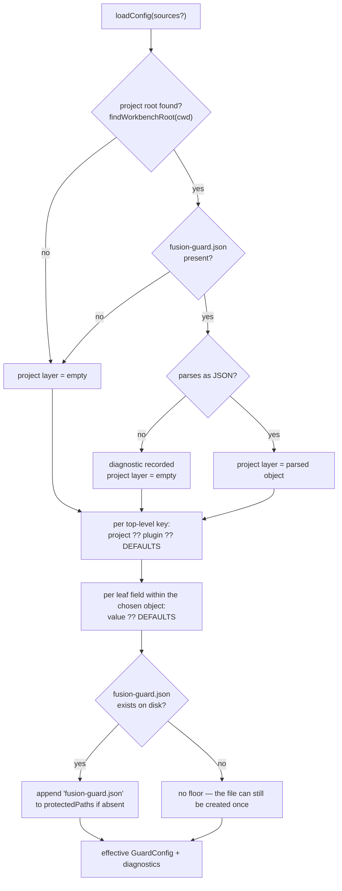
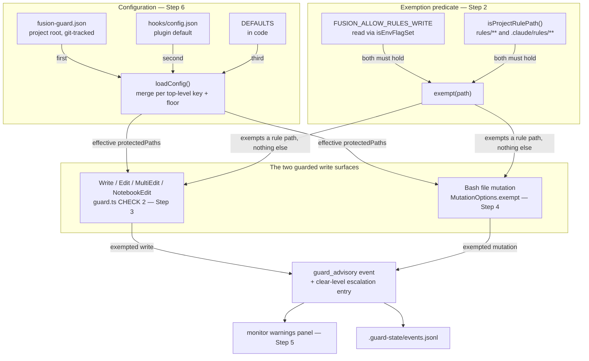
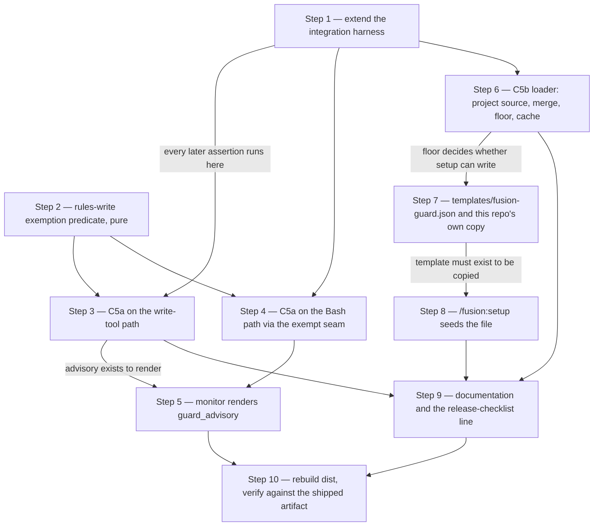

# Implementation Plan: rules-write flag and project-level guard configuration (C5a, C5b)

**Date:** 2026-08-02
**Status:** Complete — **Steps 1 to 8 complete and committed** (`768242c`, `6b3aa5c`, `0f341e0`, `45f53d4`, `bf75941`, `46d8333`, `557340d`, `7f3d789`). **Steps 9 and 10 are superseded** by `260804-1633_*_plan-c5b-remediation-and-ship.md`, whose Steps 7 and 8 carry the same obligations plus everything the independent assessment `260804-1600-c5b-independent-assessment.md` added. Do not execute Steps 9 or 10 from this file. **Step 9 was also partly written unintentionally under another task**, and the `[SCOPE CHANGED]` note on that step is partly false; the successor plan's Step 7 obligation list is the current statement of what is owed. Corrected by the planner on 260804-1633, closing `260804-1608_*_`. Earlier state verified by reconciliations 260803-1516 and 260804-1021-reconciliation.md; see `## Reconciliation Log`.
**Circle:** `260801-1244-guard-rules-write`
**Spec:** `260801-1122_*_spec-normative-consolidation.md`, `### C5: Guard changes` (C5a at `:275`, C5b at `:285`, criteria at `:305`). Status Final; nothing settled there is reopened here.
**Executors:** `coder` for nine steps, `ontocoder` for one (Step 7, two JSON files). No strategic-domain step, so `analyst` is not in the active set.

## Directive

Build the `FUSION_ALLOW_RULES_WRITE` exemption on both guarded write surfaces, and make the guard's configuration resolvable per project from a git-tracked `fusion-guard.json` at the project root. The spec holds the exemption's boundary, the merge semantics, the self-protection floor, the seeding rationale, and the eleven open acceptance criteria. This plan settles the four questions the Circle record hands the planner, states what the existing test fixture does and does not give us, and proposes a two-Turn split with the boundary drawn where the suite is green.

The configuration file is named **`fusion-guard.json`**. The user settled that at the activation gate; the spec's "working name" language is superseded.

Out of scope, stated so it is not drifted into: the curator agent, the partition of `rules/fusion-workbench-conventions.md`, and any change to the *content* of a rule file beyond the one documentation edit in Step 9.

---

## Current State

### The four line-number claims, checked

The prompt asked for two to be verified. All four the Circle depends on were checked at HEAD `e8988d9`.

| Claim | Verdict |
|---|---|
| `findConfigPath()` walks up from the compiled hook's own directory — `hooks/lib/config.ts:21-32` | **Correct, exactly.** The function occupies lines 21 to 32 and its result is frozen into the module-level `CONFIG_PATH` at line 34. |
| The branch-switch override's advisory event — `hooks/guard.ts:159-177` | **Wrong.** Lines 159 to 177 are prose inside the docstring of `guardBashCommand`, which narrates the three-step order. The advisory event itself is `hooks/guard.ts:293-309`. The shape is given verbatim below. |
| The write guard stands down in the plugin's own tree — `hooks/lib/self-detect.ts:18-33` | **Correct.** `isFusionPluginCwd()` runs lines 18 to 34, resolves `.claude-plugin/plugin.json` against `process.cwd()` with no upward walk, and caches the answer per process. |
| The exemption seam — `MutationOptions.exempt` at `hooks/lib/bash-mutation-guard.ts:168`, checked at `:1243` and `:1252` | **Correct.** Declared at `:168-169`, consulted in classification pass 1 (`:1243`) and pass 2 (`:1252`). Not consulted in pass 3, the fail-closed pass, which is right: an operand that does not resolve cannot be shown to be a rule path. `grep -n exempt` reports no other use, so the seam is unwired at HEAD as the spec says. |

### The advisory shape C5a must match

`hooks/guard.ts:293-309`, the branch-switch override note, in full:

```ts
if (verdict.overrideUsed && verdict.overrideKind) {
  const envVar = overrideEnvFor(verdict.overrideKind);
  const detail =
    `Override ${envVar} allowed normally-denied git op: ${verdict.overrideSegment ?? command}`;
  const escalation = loadEscalation();
  escalation.recentEvents.push({
    level: "clear",
    trigger: "git_branch_switch_override",
    message: detail,
    timestamp: new Date().toISOString(),
    toolName: "Bash",
  });
  saveEscalation(escalation);
  emitEvent("guard_advisory", "Bash", undefined, detail);
}
```

Four properties define "the same shape", and C5a's note reproduces all four: a `clear`-level entry pushed onto `escalation.recentEvents`; a trigger string naming the override rather than the offence; a `message` that names the environment variable and what it let through; and one `guard_advisory` line in `events.jsonl` carrying the same detail string. The one field this note leaves empty is the third argument to `emitEvent`, the file. C5a fills it, because C5a always has a path and the branch override does not.

### The fixture that already exists, and its two gaps

`hooks/lib/__tests__/guard-bash-integration.test.ts` and its helper `hooks/lib/__tests__/helpers/guard-harness.ts` are the fixture this Circle was told to reuse rather than rebuild. Read in full. What the harness gives us, verbatim from the source:

- `makeProject()` builds a throwaway project root under `os.tmpdir()`, seeded with `rules/x.md`, `agents/coder.md`, `skills/demo/SKILL.md`, `notes.txt`, `build/out.js`, `docs/.keep`, and the `fusion-workbench/.fusion-setup` marker that every guard-state write depends on.
- The root is resolved through `realpathSync` and then *asserted* to be its own realpath. This closes the macOS trap in which `/var/folders/…` and `/private/var/folders/…` diverge, `normalizeToRelative` fails to relativize, and every protected-path assertion passes vacuously. The harness also keeps a deliberate unresolved `alias` so the trap can be reproduced on purpose.
- `withPluginProject()` builds the same root plus a `.claude-plugin/plugin.json` naming fusion, which is the entire condition `isFusionPluginCwd()` tests. The stand-down is therefore testable without borrowing this repository's own `.guard-state/` counters.
- `runGuard(root, toolName, toolInput, overrides)` spawns a fresh subprocess with `cwd` set to the root and **already accepts arbitrary environment overrides**. `runBash` and `runWrite` pass them through. Setting `FUSION_ALLOW_RULES_WRITE` needs no new parameter.
- `readEscalation`, `readEvents`, and `guardStateWritten` read the guard's own state files back, so an assertion can be made on the file rather than on the verdict.
- `guardEntry()` runs `tsx guard.ts` by default and the committed `dist/guard.js` under `FUSION_GUARD_ENTRY=dist`, so the same suite can be pointed at the shipped artifact.
- It fails loudly rather than skipping: a missing entry point throws, and a `[guard] Error:` on stderr is treated as a harness failure, because the guard fails open and a crashed guard would otherwise satisfy every allow-side assertion.

That is a strong fixture and this Circle should extend it, not replace it. Two gaps block us, and one latent defect matters:

1. **No way to place a file in the project that is not in `SEED_FILES`.** `makeProject` takes `{ plugin?: boolean }` and nothing else. C5b needs a project carrying a `fusion-guard.json` whose content the case chooses, including a deliberately unparseable one. C5a needs `rules/retired/` to exist as a move destination and `.claude/rules/` to exist at all.
2. **No way to pre-seed guard state.** The criterion "setting the flag does not reset or clear an active halt" needs a project whose `escalation.json` already has `haltActive: true` before the run. Today the only way to reach halt is three real denials, which works but couples the test to the escalation threshold.
3. **`runGuard` strips `FUSION_ALLOW_BRANCH_SWITCH` and `FUSION_ALLOW_WORKTREE` from the child environment, and nothing else.** Once `FUSION_ALLOW_RULES_WRITE` exists, a developer who exports it in their own shell gets different verdicts from everyone else, and the flag-unset half of five criteria silently stops testing anything. This is the same class of defect the existing strip list was written to prevent.

Step 1 closes all three.

### What the fixture still cannot reach

Honest bound: the harness proves the guard's behaviour for a project root that is not a plugin root. It does not exercise Claude Code's own hook dispatch (`hooks/hooks.json` matcher, the PreToolUse envelope shape), and it does not exercise `/fusion:setup` running as an agent. Criterion 10, `/fusion:setup` creating the file when absent and leaving a filled-in one untouched, is a shell-level property of the seeding block and is verified as such in Step 8, not through the harness.

### The configuration loader today

`loadConfig()` reads one path, computed once at module load, and memoises the result in `cachedConfig` with no key. Both hook entry points call it with no argument exactly once per process (`hooks/guard.ts:363`, `hooks/tracker.ts:128`), and `hooks/lib/__tests__/` contains no test for it at all. The `configPath?` parameter is unused by every caller, and `resetConfigCache()` is exported but called nowhere.

### The effective protected list

`hooks/config.json` `guard.protectedPaths` is `agents/**`, `rules/**`, `hooks/config.json`, `hooks/hooks.json`, `settings.json`, `bin/monitor`, `skills/**`, `.claude-plugin/plugin.json`, `fusion-workbench/.guard-state/**`. The patterns are project-relative, matched by `matchesAny` in `hooks/lib/paths.ts`, where `**` becomes `.*` and `*` becomes `[^/]*`. `rules/**` therefore matches `rules/x.md` and `rules/retired/x.md` but **not** the bare directory `rules`. That asymmetry is load-bearing for the exemption boundary in Step 2.

### One finding that is not in the spec: the monitor does not show advisories

`bin/monitor:80-84` defines `WARNING_EVENT_TYPES` as the six event types the warnings panel renders: `churn_warning`, `churn_critical`, `cross_file_warning`, `cross_file_critical`, `guard_block`, `guard_halt`. `guard_advisory` is absent. The Circle Directive promises the user reads the exempted writes "in `.guard-state/events.jsonl` and on the monitor dashboard", and at HEAD the second half of that sentence is false — for this Circle's advisory and for the branch-switch override advisory that has shipped since v5.x. Step 5 is one line plus a comment. It also makes the existing git-override advisory visible for the first time, which is a behaviour change slightly wider than this Circle's own flag, and is called out rather than slipped in.

---

## The four open questions, answered

### Q1 — how `hooks/lib/config.ts` reaches the project root without a circular import

**There is no cycle to avoid.** `hooks/lib/workbench-root.ts` is 28 lines and imports `node:fs` and `node:path` and nothing else. It has no local dependency of any kind, so `config.ts` importing `findWorkbenchRoot` introduces no cycle, and none can appear later without someone adding an import to a module whose whole purpose is to have none. Two modules already do exactly this: `hooks/lib/escalation.ts:17` and `hooks/lib/events.ts:13` both import it, and neither is imported by `config.ts`.

The real constraint is different, and the question's framing hid it: **`config.ts` must stop resolving its source path at module load.** `CONFIG_PATH` is a module-level `const` evaluated on import (`hooks/lib/config.ts:34`). `findWorkbenchRoot()` defaults to `process.cwd()`, so calling it at module level would read the working directory at import time and freeze it. Resolution moves inside `loadConfig`, where the caller can also inject it. That is what makes the loader unit-testable at all, and no unit test for it exists today.

**Decision:** `config.ts` imports `findWorkbenchRoot` from `./workbench-root.js` directly. Both source paths are resolved inside `loadConfig`, not at module load.

### Q2 — the format of `fusion-guard.json` and the resolution order

**Decision: the project file has exactly the same shape as `hooks/config.json`.** The same five top-level keys (`guard`, `decisions`, `escalation`, `churn`, `crossFile`), all optional, parsed by the same `RawConfig` interface. Keys the parser does not know, including the `_comment` convention `hooks/config.json` already uses at its first line, are ignored.

The reason is the merge rule. The spec fixes merging "per top-level key, the project's value replaces the plugin's". That sentence is only meaningful if both files have the same top-level keys; a different project-side shape would need a second parser, a mapping between the two vocabularies, and a place for that mapping to drift. One schema, one parser, one thing to document.

Resolution order, unchanged from the spec: the project's `<project-root>/fusion-guard.json`, then the plugin's `hooks/config.json`, then the in-code `DEFAULTS`.



Two consequences of per-top-level-key replacement are worth stating because they will surprise someone:

- A project that writes `guard: { protectedPaths: [...] }` and omits `defaultSensitivity` gets `defaultSensitivity` from `DEFAULTS`, not from the plugin's file. The project's `guard` object replaces the plugin's `guard` object whole, and only then does the existing leaf-level `?? DEFAULTS` fallback run. Both values are `"medium"` today, so nothing observable changes, but the rule is what the spec asked for and the alternative — leaf-level merge across three sources — cannot express "narrow the list", which is half of what D2 asked for.
- A project that declares only `escalation` keeps the plugin's `protectedPaths` entirely, which is criterion `:327` stated as a mechanism.

**The self-protection floor and the seeding collision.** The spec asks for two things that cannot both hold literally in a consuming project: the effective `protectedPaths` "always includes the project configuration file itself, regardless of what that file says" (`:301`), and `/fusion:setup` seeds that file (`:293`). If the floor applies unconditionally, the seeding write is a write to a protected path and the guard denies it, so setup can never create the file. Verified by construction: `matchesAny("fusion-guard.json", [...,"fusion-guard.json"])` is true, and setup's `cp` is a recognised mutation with a literal operand.

**Decision: the floor applies when the file exists on disk.** Creation of an absent file is permitted once; every subsequent write, and every delete, is blocked. The delete is what makes this non-evadable through the guarded surfaces: an agent cannot return the project to the absent state in order to rewrite the file, because `rm fusion-guard.json` targets an existing file and the floor is in force.

The residual is real and is recorded rather than hidden: in a project where the file has never been created, an agent may create one that narrows `protectedPaths`, and the guard will honour it from the next tool call onward. Two things bound it. The file is git-tracked by D-c's own reasoning, so the creation appears in a diff and passes through review — which is precisely the property D-c chose the project root to obtain. And `/fusion:setup` creates the file at setup time, so the window exists only in a project that has fusion configured but has never run setup since this version. **This weakens a sentence the spec states as an invariant, so it is filed as a decision record rather than settled quietly here — see `## Decision record to file`.**

### Q3 — how `loadConfig`'s cache interacts with two sources

The current cache is keyed on nothing: `if (cachedConfig !== null) return cachedConfig` (`hooks/lib/config.ts:109-111`) ignores the `configPath` argument on every call after the first. With one source and one call per process this is inert. With two sources and injectable paths it is a live defect, and the unit tests this plan adds are exactly the code that would hit it — a vitest file is one process running many cases against many source pairs.

**Decision: key the cache on the resolved source pair.** A single module-level `{ key, value }` slot, the key built from the project path and the plugin path. A call whose sources differ from the cached key recomputes; a repeat call with the same sources hits. `resetConfigCache()` stays and is called in `beforeEach` in the new unit suite.

Deleting the cache outright was considered and rejected. It is defensible on the "simplest solution" reading — each hook is a fresh process and calls `loadConfig` once — but the memo also serves the guard hook's own path, and a keyed cache costs six lines and removes the whole defect class rather than the one instance of it we can see today. Keying is the smaller change to reason about, not the larger.

### Q4 — should `/fusion:setup` seed `fusion-guard.json` in this repository

**Decision: yes, seed it here, with one sentence in the template naming the stand-down.**

The case against is that the guard's write protection stands down in the plugin's own tree, so a `protectedPaths` list in this repository governs nothing, and a file that appears to configure something it does not configure teaches the wrong thing.

Three facts outweigh it.

**The file is not inert here, and the claim that it is turns out to be false.** The stand-down covers the write tools and the Bash mutation check. It does not cover the git branch-switch policy, which runs unconditionally (`hooks/guard.ts:388-391` dispatches to `guardBashCommand` before any self-detect gate, and step 1 of that function is the branch deny). That deny path reads `config.escalation.blocksBeforeHalt`. A `fusion-guard.json` in this repository that sets `escalation` therefore changes how many denied branch switches it takes to halt an agent working on fusion itself. `churn` and `crossFile` are inert here, because `hooks/tracker.ts:89-92` stands the tracker down as well.

**Not seeding it requires a special case in `/fusion:setup`.** Setup would have to re-implement the plugin-repo detection to decide whether to skip a copy. That is a branch whose condition lives in `hooks/lib/self-detect.ts`, duplicated into a skill body in a different language, for the benefit of not creating one file. `rules/critical-stance.md` §2 names that pattern directly.

**This repository is where the file's own behaviour gets exercised by hand.** A developer checking that the floor protects it, that a malformed copy produces an advisory, or that the template parses at all, does that here first.

The template carries one sentence stating that in fusion's own source tree the protected-path half of the file has no effect because the write guard stands down. That is a documentation cost of one line, not a mechanism.

---

## Approach

### The shape of the change



### Why the exemption is one predicate consumed twice

The seam the predecessor Circle left (`MutationOptions.exempt`) already fixes the shape on the Bash side: a predicate over a normalised project-relative path. The write-tool side needs the same question asked of the same kind of value at `hooks/guard.ts:432`. One pure module answers it for both, and neither surface knows how the other is wired. The alternative — an env check and a path check written twice, once per branch — is two places for the boundary to drift, and the boundary is the security-relevant part.

### The exemption boundary, precisely

A path is exempt when the flag is set **and** the path matches `rules/**` or `.claude/rules/**`. Consequences, each of which becomes a test case:

- `rules/x.md`, `rules/retired/x.md`, `.claude/rules/y.md` are exempt. `retired/` needs no rule of its own; it is inside `rules/`.
- `agents/x.md`, `skills/a/SKILL.md`, `hooks/config.json`, `settings.json`, `bin/monitor`, `.claude-plugin/plugin.json`, `fusion-workbench/.guard-state/**` and `fusion-guard.json` are never exempt.
- The bare directory `rules` is **not** exempt, because `rules/**` does not match it. So `rm -rf rules` stays denied even with the flag set, through the ancestor pass at `bash-mutation-guard.ts:1252`. The flag permits writing rule files; it does not permit deleting the rule directory. This falls out of the glob semantics rather than needing a special case, which is why the predicate is defined in terms of `matchesAny` over the existing pattern machinery.

### What an exempted write does to guard state

The exemption waives the protected-path check and nothing else, matching the precedent that an override "grants exactly one permission" (`hooks/guard.ts:227-232`). On the write-tool path the exempted write therefore continues into CHECK 3, the decision-governed check, and then into the ordinary allow path, which resets the consecutive-block counter and emits `guard_allow`. So one exempted `Edit` produces `guard_advisory` followed by `guard_allow`, and the tests assert the advisory is present and first rather than asserting it is the only event.

Two properties are preserved and must be asserted, not assumed. The halt check runs before the protected-path check (`hooks/guard.ts:420` before `:432`), so a halted guard blocks an exempted write like any other — criterion `:326` holds structurally, and Step 3 pins it. And the escalation object is saved exactly once per call: the advisory entry is pushed into the in-memory object and persisted by whichever later branch saves it, every one of which does. A second `saveEscalation` at the exemption site would be redundant and is explicitly not part of the change.

### Where the unparseable-config advisory is emitted, and its noise bound

The spec requires one advisory event when the project configuration is unparseable, and rejects silent fallback. The loader is pure and must stay unit-testable, so it does not emit: `loadConfig` returns the effective config carrying a `diagnostics: string[]` field, and the hook entry points emit one `guard_advisory` per diagnostic.

This means a project left with a broken `fusion-guard.json` emits one advisory per guarded tool call, including Bash. That is a deliberate departure from the Bash path's zero-side-effect property, and the reasoning is that issues 260707-0750_*_bash-allow-resets-block-counter-defeats-halt-escalation.md and 260707-0751_*_guard-allow-bash-events-flood-events-jsonl.md protect *ordinary work in a correctly configured project* from flooding the log, which is not this case. Silence here is the failure mode the spec names. The noise is bounded by the user fixing the file, and Step 6 adds a test asserting that innocuous Bash in a project with a *valid* config still writes nothing at all, so the settled property is pinned where it actually applies.

The diagnostic pushes no escalation entry and no counter movement. It is a diagnostic, not an exemption.

### Work order



The Turn boundary sits between Step 5 and Step 6. See `## Sizing` for why.

---

## Implementation Steps

### Step 1 [DONE] — Extend the integration harness

- **Executor:** `coder`
- **Files:** `hooks/lib/__tests__/helpers/guard-harness.ts`, new `hooks/lib/__tests__/guard-rules-write-integration.test.ts`
- **Dependencies:** none
- **Changes:**
  - `makeProject(opts)` gains `files?: Record<string, string>`, merged over `SEED_FILES` so a case can add or replace any file, and `escalation?: Partial<EscalationSnapshot>`, written to `fusion-workbench/.guard-state/escalation.json` before the guard runs.
  - `SEED_FILES` gains `rules/retired/.keep` and `.claude/rules/local.md`, so the retirement destination and the second rule root exist in every project.
  - `withProject(fn, opts?)` and `withPluginProject(fn, opts?)` forward the options. The second parameter is optional, so no existing call site changes.
  - `runGuard` strips `FUSION_ALLOW_RULES_WRITE` from the child environment alongside the two branch variables, with the existing comment extended to say why.
  - New `projectConfig(value: object | string): string` helper producing the `fusion-guard.json` content for the `files` map — an object is stringified, a string is written verbatim so a case can supply deliberately broken JSON.
  - New test file created with one `describe` block covering the harness capabilities only: an extra file lands in the project, a pre-seeded halt is visible to the guard, a written `fusion-guard.json` is present at the root, and a `FUSION_ALLOW_RULES_WRITE` exported in the parent shell does not reach the child.
- **Acceptance criterion served:** enabling criteria `:322` through `:332`. This step is the answer to the gap analysis's "most likely way this ships broken", budgeted first rather than as a final sweep.
- **Verification:** `cd hooks && npm test` — the existing 753 cases still pass and the four new harness cases pass. Then `cd hooks && npx vitest run lib/__tests__/guard-bash-integration.test.ts` to confirm the predecessor suite is untouched.

### Step 2 [DONE] — The rules-write exemption predicate

- **Executor:** `coder`
- **Files:** new `hooks/lib/rules-write-exemption.ts`, new `hooks/lib/__tests__/rules-write-exemption.test.ts`
- **Dependencies:** none
- **Changes:** A pure module, no filesystem and no ambient environment read, exporting: `RULES_WRITE_ENV` (the variable's name, for diagnostics); `RULE_DIR_PATTERNS` as `["rules/**", ".claude/rules/**"]`; `isProjectRulePath(path)` implemented with `matchesAny` from `./paths.js`; `rulesWriteExemptionActive(env)` implemented with `isEnvFlagSet` imported from `./git-branch-guard.js`, so `"1"` and `"true"` are the accepted spellings and nothing else, exactly as the two branch overrides behave; and `rulesWriteDetail(paths)` producing the advisory message. The environment arrives as a parameter, never read from `process.env` inside the module.
- **Acceptance criteria served:** the boundary half of `:322` through `:325`.
- **Verification:** `cd hooks && npx vitest run lib/__tests__/rules-write-exemption.test.ts` — covering the exempt set, the never-exempt set including `fusion-guard.json`, the bare `rules` directory being outside the exempt set, and the flag spellings including `"0"`, `"yes"`, empty string and undefined.

### Step 3 [DONE] — C5a on the write-tool path

- **Executor:** `coder`
- **Files:** `hooks/guard.ts`, `hooks/lib/__tests__/guard-rules-write-integration.test.ts`
- **Dependencies:** Steps 1 and 2
- **Changes:** At CHECK 2 (`hooks/guard.ts:432`), a matched protected path that satisfies both the flag and `isProjectRulePath` takes the exemption branch instead of the block: push one `clear`-level entry onto the in-memory `escalation.recentEvents` with trigger `rules_write_exemption` and a message naming `FUSION_ALLOW_RULES_WRITE` and the path, emit one `guard_advisory` carrying the tool name, the path and the same detail, and fall through to CHECK 3. No `saveEscalation` at the exemption site. A comment states the three properties a future editor must not break: the halt check above it, the single save, and the fact that the exemption waives only this check.
- **Acceptance criteria served:** `:322`, `:323`, `:324`, `:326`.
- **Verification:** `cd hooks && npx vitest run lib/__tests__/guard-rules-write-integration.test.ts` with cases for: flag unset, `Edit ./rules/anything.md` blocked and `consecutiveBlocks` at 1; flag set, same edit allowed, first event is `guard_advisory` naming the variable and the path, `recentEvents` carries one `clear`-level entry; flag set, `Edit agents/anything.md` and `Edit skills/anything/SKILL.md` still blocked; flag set against a project pre-seeded with `haltActive: true`, the edit is blocked with the `[HALTED]` reason and the state stays halted.

### Step 4 [DONE] — C5a on the Bash path

- **Executor:** `coder`
- **Files:** `hooks/lib/bash-mutation-guard.ts`, `hooks/guard.ts`, `hooks/lib/__tests__/bash-mutation-guard.test.ts`, `hooks/lib/__tests__/guard-rules-write-integration.test.ts`, possibly `hooks/lib/__tests__/guard-bash-wiring.test.ts`
- **Dependencies:** Steps 1 and 2
- **Changes:**
  - `MutationVerdict` gains `exempted?: string[]`, populated by `classifyBashMutation` from an accumulator threaded into `classifyWords` and deduplicated. The two existing `opts.exempt?.(...)` call sites record the path they skip; pass 3 is untouched.
  - `guardBashCommand` passes `exempt` into `classifyBashMutation` only when the flag is set, inside the existing `if (!isFusionPluginCwd())` block. On a non-denying verdict carrying exempted paths it records the same note as Step 3 — one `clear`-level entry, one `guard_advisory` — mirroring the override note's own load-push-save-emit sequence at `:299-308`, and placed immediately before STEP 3 so both notes can fire in one call without either being lost.
  - `guard-bash-wiring.test.ts` asserts on the comment-stripped source of `guardBashCommand` to pin the two settled Bash properties. Read it before editing and adjust only if the new branch trips an assertion; it is a gate, and a gate that needs weakening is a finding, not a chore.
- **Acceptance criteria served:** `:325`, and the deliberately deferred C5c criterion at `:316` — with the flag set a shell move of a rule file into `retired/` is allowed and emits one `guard_advisory`, and with it unset the same move is blocked.
- **Verification:** `cd hooks && npm test`, with new cases for: `mv rules/x.md rules/retired/` blocked with the flag unset and allowed with it set, producing exactly one `guard_advisory` naming the variable and both operands; `rm -rf rules` denied with the flag set; `mv agents/coder.md /tmp/` denied with the flag set; `printf '' > .claude/rules/local.md` allowed with the flag set; and pure classifier cases asserting `exempted` is reported and deduplicated.

### Step 5 [DONE] — The monitor renders advisories

- **Executor:** `coder`
- **Files:** `bin/monitor`
- **Dependencies:** Steps 3 and 4
- **Changes:** Add `guard_advisory` to `WARNING_EVENT_TYPES` (`bin/monitor:80-84`) and extend the comment above it to distinguish advisory events, which are things the user asked for and should see, from `guard_allow` and `tracker_record`, which are bookkeeping. The front-end level mapping at `bin/monitor:426` handles `guard_block` explicitly and falls through for everything else, so an advisory renders at the default level; check that the default reads sensibly and give it its own label if it does not.
- **Acceptance criterion served:** the Circle Directive's claim that the user reads exempted writes on the monitor dashboard. Not one of the spec's eleven; recorded here because the Directive states it.
- **Verification:** `python3 -c "import ast,sys; ..."` is not the useful check. Run `bin/monitor` against a workbench whose `.guard-state/events.jsonl` carries one hand-written `guard_advisory` line and confirm it appears in the warnings panel, then remove the line. Note in the commit that this also surfaces the pre-existing branch-switch override advisory.

### Step 6 [DONE] — The C5b loader

- **Executor:** `coder`
- **Files:** `hooks/lib/config.ts`, `hooks/guard.ts`, `hooks/tracker.ts`, new `hooks/lib/__tests__/config.test.ts`, `hooks/lib/__tests__/guard-rules-write-integration.test.ts`
- **Dependencies:** Step 1
- **Changes:**
  - `config.ts` imports `findWorkbenchRoot`. `findConfigPath()` stays as the plugin-side resolver but is called inside `loadConfig`, and the module-level `CONFIG_PATH` const is removed.
  - `loadConfig(sources?: ConfigSources)` replaces `loadConfig(configPath?: string)`. `ConfigSources` carries `pluginConfigPath?` and `projectRoot?`, both defaulted at call time. The old positional parameter is dropped rather than kept alongside: no caller passes it.
  - Per-top-level-key merge across the project layer, the plugin layer and `DEFAULTS`, followed by the existing per-leaf `?? DEFAULTS` normalisation on whichever object was chosen.
  - The self-protection floor appends `PROJECT_CONFIG_FILENAME` to the effective `protectedPaths` when the file exists on disk, whether or not the file lists itself.
  - `GuardConfig` gains `diagnostics: string[]`, empty on a clean load and carrying one entry naming the path and the parse failure otherwise. `guard.ts` emits one `guard_advisory` per diagnostic immediately after `loadConfig()`; `tracker.ts` ignores them, since the guard hook fires on the same tool call and one report is enough.
  - The cache becomes a single `{ key, value }` slot keyed on the resolved source pair. `resetConfigCache()` stays.
- **Acceptance criteria served:** `:327`, `:328`, `:329`, `:330`.
- **Verification:** `cd hooks && npm test`. New unit cases in `config.test.ts` (injected paths, no filesystem beyond a tmpdir): a project declaring `protectedPaths` gets that list; a project declaring only `escalation` keeps the plugin's `protectedPaths` and gets its own threshold; an absent project file yields the plugin's config plus no floor; an unparseable project file yields the plugin's config plus one diagnostic; the floor appears whenever the file exists and is idempotent when the file lists itself; two successive `loadConfig` calls with different sources return different configs. New integration cases: an `Edit` to `fusion-guard.json` is blocked in a project that has one, whether or not it lists itself; a project whose `fusion-guard.json` is `{"guard":{"protectedPaths":["secret/**"]}}` allows `Edit rules/x.md` and blocks `Edit secret/a`; an unparseable file produces one `guard_advisory` and still blocks `Edit rules/x.md`; innocuous Bash in a project with a valid project config still writes nothing to `.guard-state/`.
- **[DONE — coder, 260804-1435-coder-step6-c5b-config-loader.md. Session: `260804-1435-coder-step6-c5b-config-loader.md`.]** `npm test` **1341 passed, 25 files** (baseline 1299 / 24); 24 new unit cases in `hooks/lib/__tests__/config.test.ts`, 18 appended to `guard-rules-write-integration.test.ts`. All ten named verification cases exist and pass. Byte-identity for a project with no `fusion-guard.json` is **asserted** against a transcribed pre-Step-6 loader, and it fails under a floor-made-unconditional mutation, so it is a measurement rather than a vacuous pass. Eight mutations were applied, run and reverted; every one was caught. The harness needed **no** extension — Step 1 delivered everything this step used.
  - **Four corrections to this step as written.** (1) The `ConfigSources` sketch in `## Data Structures` contains a trap: `projectRoot ?? findWorkbenchRoot()` makes an explicit `null` indistinguishable from an omission, and in *this* repository the resulting walk finds the plugin root — so every unit case passing `projectRoot: null` would have silently acquired a project layer, and the byte-identity case would have measured the wrong thing. A presence check is required. (2) The step does not say what the floor does when the project file **exists but does not parse**; the implementation keys the floor on existence rather than parseability, because the alternative lets a project unprotect its own configuration by breaking it. (3) `diagnostics` carries up to **two** entries, one per layer, not "one". (4) `hooks/tracker.ts` needs no code change, only the comment saying why it ignores diagnostics.
  - **Decisions.** `260802-1912_*_does-the-self-protection-floor-apply-before-the-config-file-exists.md` is realised in code exactly as answered — marker **not** moved; evidence in the session log. `260803-1314` is **not** answered in code, as instructed, but Step 6 turns it from hypothetical into shipped default behaviour; a `MEASURES:`-labelled case pins today's answer so that the decision, when it lands, changes it deliberately rather than silently. `260803-1402` is untouched and unaffected.
  - **Two issues filed.** `260804-1427_*_` (the floor residual reaches `fusion-workbench/.guard-state/**`, one step past what decision `260802-1912_*_does-the-self-protection-floor-apply-before-the-config-file-exists.md` states — measured, with the halt bound measured alongside it) and `260804-1432_*_` (`hooks/lib/paths.ts` states that two case-sensitive matches are unreachable "until the per-project loader lands"; this step is that loader).
  - `hooks/dist/` tracked files restored to HEAD. No `fusion-guard.json` created outside a harness fixture — Step 7 still owns both files.

### Step 7 [DONE] — The template and this repository's own configuration file

- **Executor:** `ontocoder`
- **Files:** new `templates/fusion-guard.json`, new `fusion-guard.json` at the repository root
- **Dependencies:** Step 6
- **Changes:** The template declares inheritance and lists no paths, per D-k. It carries only underscore-prefixed documentation keys, which the parser ignores: what the file is, that it inherits the plugin's `hooks/config.json` and that the effective list lives there rather than being restated here, how to override a top-level key, that the file is git-tracked on purpose so a change to it appears in a diff, that the file protects itself once it exists, and one sentence stating that in fusion's own source tree the protected-path half has no effect because the write guard stands down. No commented-out copy of the default list, which D-k rejected. The repository-root copy is the template, copied verbatim, per Q4.
- **Acceptance criterion served:** `:328` — a project whose seeded configuration is untouched gets the plugin's `protectedPaths`, including paths added to the plugin default later.
- **Verification:** `node -e "JSON.parse(require('fs').readFileSync('templates/fusion-guard.json','utf8'))"` parses; `git check-ignore -v fusion-guard.json templates/fusion-guard.json` reports no match, so both are trackable; `grep -n "for item in" -A 2 install.sh` confirms `templates` ships and `fusion-guard.json` at the root does not; and one unit case asserting the template merges to a config identical to the plugin's, which is what "inherits and lists nothing" means operationally.
- **[DONE — ontocoder, 260804-1502-ontocoder-step7-guard-config-template.md. Commit `557340d`. Session: `260804-1502-ontocoder-step7-guard-config-template.md`.]** Both files landed, byte-identical to each other, with six underscore-prefixed documentation keys and no declared configuration. Three unit cases in `hooks/lib/__tests__/config.test.ts`, including a mutation that makes case 1 insufficient on its own. The independent assessment `260804-1600-c5b-independent-assessment.md` confirmed the keys are genuinely inert and that the seeded template produces `diagnostics: []` with an effective configuration equal to the plugin's plus the floor.
  - **Marked retroactively by the planner on 260804-1633**, closing `260804-1608_*_`. The step was left unmarked because the ontocoder's history ends "No commit made — the orchestrator commits after validation", and the orchestrator did not mark it.
  - **Two of the six keys are now known false**, filed as `260804-1605_*_`. The author's verification was sound against the code that existed; nothing in the spec, the plan or this step named `guard.enabled`. The correction is Step 6 of `260804-1633_*_plan-c5b-remediation-and-ship.md` and is sequenced after the code decisions deliberately.

### Step 8 [DONE] — `/fusion:setup` seeds the file

- **Executor:** `coder`
- **Files:** `skills/setup/SKILL.md`
- **Dependencies:** Step 7
- **Changes:** A new step immediately after Step 0e, following that step's shape exactly: a single guarded `cp` from `$FUSION_PLUGIN_ROOT/templates/fusion-guard.json` to `./fusion-guard.json`, idempotent, never overwriting, echoing what it did, and not blocking Setup on failure. Two sentences of surrounding prose: what reads the file, and that it belongs in version control.
- **Acceptance criterion served:** `:331`.
- **Verification:** Extract the block and run it twice against a scratch directory with `FUSION_PLUGIN_ROOT` pointed at this repository: the first run creates the file, the second leaves an edited copy byte-identical. Confirm with `diff`.
- **[SHAPE CHANGED — implementation 260804-1511-coder-step8-setup-seeds-guard-config.md, measured. Shipped as Step 0f, and it is not the single command this step describes.]** The `cp` block is exactly as specified and passes the verification as written, but it is preceded by a read-only presence probe and is run only in the absent branch. Reason: the self-protection floor from Step 6 appends `fusion-guard.json` to `protectedPaths` the moment the file exists, so in a project that already has one the guard **denies the whole Bash call** rather than letting the shell's `[ -f ]` decline it. Measured against `tsx guard.ts` in a throwaway project: absent → allow, present → `block` naming `fusion-guard.json`. Since `/fusion:setup` runs at the start of every orchestrator session, the one-command form would have denied once per session forever, in every consuming project, with a reason that instructs the agent to stop and ask the user about a no-op — plus a `guard_block` event and a `consecutiveBlocks` increment each time. The probe follows Step 0c's existing probe-then-branch shape; the `[ -f ]` guard stays inside the copy so the block remains self-idempotent when extracted. Evidence: `260804-1511-coder-step8-setup-seeds-guard-config.md`.

### Step 9 [SUPERSEDED — do not execute; successor plan Step 7 carried the obligations and is done] — Documentation and the release-checklist line

- **Executor:** `coder`
- **Files:** `rules/protected-path-discipline.md`, `README-hooks.md`, `CLAUDE.md`
- **Dependencies:** Steps 3, 6, 8
- **Changes:**
  - `rules/protected-path-discipline.md` currently states "no env override waives it". That sentence becomes false in this Circle and must be corrected rather than supplemented: the flag exists, it waives rule directories only, it is visible in the event log, and it does not turn the guard off. The same file's paragraph stating that the list "lives in the plugin's own `hooks/config.json` … so every project on this plugin gets the same list" also becomes false and is rewritten around the two sources. Keep the existing `Provenance:` header — the file already has one and `provenance-header-lint.test.ts` gates it.
  - `README-hooks.md` gains the user-facing description of `fusion-guard.json` and the flag.
  - `CLAUDE.md` gains a `templates/fusion-guard.json` mention in the layout table's `templates/` row, a line in the guard bullet about the two config sources, and one line in the release process: before tagging, confirm the guard's behaviour was verified against a project root that is not the plugin repo, because the stand-down makes local testing unrepresentative by construction. That line is criterion `:332`.
- **Acceptance criterion served:** `:332`, and the honesty requirement that the residual is documented where agents read it.
- **Verification:** `cd hooks && npm test` — `provenance-header-lint`, `path-literal-lint`, `marker-format-lint` and `glob-nomatch-lint` all run over `rules/` and must stay green. Then re-read the three edited passages against the behaviour the tests assert, and check that no sentence claims more than Step 3 and Step 4 deliver.
- **[SCOPE CHANGED — reconciliation 260803-1516, evidence in `## Reconciliation Log`]** This step's scope was written before Turn 2 chose the both-surfaces halt, and Turn 3 has since moved the boundary in both directions. It is still unstarted (`FUSION_ALLOW_RULES_WRITE` appears in no shipped document at HEAD, verified by `grep -rn FUSION_ALLOW_RULES_WRITE README-hooks.md rules/ CLAUDE.md` returning nothing), but what is left to write is not what the step says.
  - **Already done, do not redo.** `ce7a125` (task T3-7, closing `260802-2331_*_` and `260802-2335_*_`) rewrote both `README-hooks.md` and `rules/protected-path-discipline.md` for the halt now covering both surfaces, added the planted-alias residual row, and corrected the block-cause count. That was one of the two shipped documents this step names, edited under another task's name.
  - **Newly added to this step.** `260803-1402_*_step-9-must-also-document-that-a-hard-linked-rule-file-is-not-exempt.md` lists the three items that must land together: the `FUSION_ALLOW_RULES_WRITE` row in the `README-hooks.md` tuning table, the correction of the two "no override exists" sentences (still live at `rules/protected-path-discipline.md:171` and `README-hooks.md:187`), and the hard-linked-rule-file exception. T3-7 deliberately wrote none of them, because naming the flag in a document that denies the flag exists ships a self-contradiction.
  - **Sequencing constraint from the Turn 3 review.** `260803-1431-coderev-turn3-guard-boundary.md` `## Verdict` recommends landing `260803-1431_*_` (the `cd -P` gate-0 gap) and its three false docstrings *before* this step writes the flag into shipped documents, so the user-facing text is not authored against a boundary that is about to move.
  - **A later pass is already owed on the same file.** `260803-1419_*_how-should-the-protected-path-check-treat-the-case-of-a-path.md` commits to unconditional case folding, which falsifies the "purely textual" premise this step's file states. That correction belongs to a later Circle, so this step should not claim to leave the document final.
- **[SCOPE CHANGED AGAIN — reconciliation 260804-1021-reconciliation.md. The note directly above is now partly false; read this before acting on it.]** Ten checkable assertions were re-verified at HEAD `cc012fc`. Three still hold as written, two hold in substance but cite stale line numbers or markers, one names a constraint that has since been satisfied, one remains correctly open, and **three are now false**. Detail and evidence in `## Reconciliation Log` under the 260804-1021-reconciliation.md entry; the four consequential corrections are:
  - **Step 9 is not unstarted.** Its own basis for saying so — that `grep -rn FUSION_ALLOW_RULES_WRITE README-hooks.md rules/ CLAUDE.md` returns nothing — now returns two hits, `rules/protected-path-discipline.md:49` and `README-hooks.md:145`. Both arrived with the case-folding work (`86a437a`), not with a Step 9 task.
  - **So the self-contradiction T3-7 refused to ship has shipped anyway.** The same file names the flag at `:49` and denies any override exists at `:421`, and the flag does reach the Bash surface (`hooks/guard.ts:410-412`). Correcting that is now the first thing this step does, not the last.
  - **The two "no override" sentences moved.** They are at `rules/protected-path-discipline.md:421` and `README-hooks.md:199`, not `:171` and `:187`. A third file carries the same false sentence: `CLAUDE.md:113`.
  - **The case-folding correction is done, in this Circle, not a later one.** `86a437a` landed it in code and in both shipped documents. The last bullet above is false; this step no longer owes it.
  - **Newly added to this step, filed 260804-1021-reconciliation.md:** `260804-1025_*_` (the decision procedure at `rules/protected-path-discipline.md:172` tells an agent "the model stays exact" for the two commands that delete a rule file), and the residual-list omissions on `260804-1024_*_` and `260804-1026_*_`.
  - **The sequencing constraint is satisfied.** `260803-1431` closed in `a79ff1a`. Step 9 is no longer blocked by it.

### Step 10 [SUPERSEDED — do not execute; successor plan Step 8 and the Ausstiegsplan's Steps 5–6 carried the obligations and are done] — Rebuild `dist`, verify against the shipped artifact, bump the version

- **Executor:** `coder`
- **Files:** `hooks/dist/**`, `.claude-plugin/plugin.json`
- **Dependencies:** all previous steps
- **Changes:** `npm run build` in `hooks/`, commit the rebuilt `dist`, bump the plugin version. `hooks/hooks.json` runs `dist/guard.js`, so an unrebuilt `dist` ships a guard without the flag while every test passes against the TypeScript source.
- **Acceptance criterion served:** all eleven, against the artifact that actually runs.
- **Verification:** `cd hooks && FUSION_GUARD_ENTRY=dist npm test` — the whole integration suite against the compiled guard. Then walk the eleven criteria at `:322-332` and record the evidence for each. The spec's checkboxes are not edited by a coder step; the reconciler walks them at Phase 3.

---

## Data Structures

Three additions, no removals beyond the unused `configPath` parameter.

```ts
// hooks/lib/rules-write-exemption.ts — new, pure
export const RULES_WRITE_ENV = "FUSION_ALLOW_RULES_WRITE";
export const RULE_DIR_PATTERNS: readonly string[] = ["rules/**", ".claude/rules/**"];
export function isProjectRulePath(path: string): boolean;
export function rulesWriteExemptionActive(env: NodeJS.ProcessEnv): boolean;
export function rulesWriteDetail(paths: string[]): string;

// hooks/lib/config.ts — changed
export const PROJECT_CONFIG_FILENAME = "fusion-guard.json";
export interface ConfigSources {
  pluginConfigPath?: string;   // default: findConfigPath()
  projectRoot?: string | null; // default: findWorkbenchRoot(process.cwd())
}
export interface GuardConfig {
  /* …existing five groups… */
  /** Non-fatal problems from resolving the two sources. Empty on a clean load. */
  diagnostics: string[];
}
export function loadConfig(sources?: ConfigSources): GuardConfig;

// hooks/lib/bash-mutation-guard.ts — changed
export interface MutationVerdict {
  /* …existing four fields… */
  /** Paths the exempt predicate accepted, deduplicated. Allow path only. */
  exempted?: string[];
}
```

The escalation entry the exemption writes reuses `EscalationEvent` unchanged: `level: "clear"`, `trigger: "rules_write_exemption"`, `message` naming the variable and the path, `toolName`, and `filePath`.

## API Changes

`loadConfig`'s signature changes from `loadConfig(configPath?: string)` to `loadConfig(sources?: ConfigSources)`. Both call sites pass no argument today and continue to. No other exported signature changes; `MutationVerdict.exempted` and `GuardConfig.diagnostics` are additive.

## Testing Strategy

Three layers, each carrying what the layer below cannot.

**Pure unit tests** carry the matrices: the exemption boundary (Step 2), the merge and floor and cache (Step 6), and the `exempted` reporting in the classifier (Step 4). They import directly, touch no filesystem beyond a tmpdir, and are unaffected by the working directory. A case here is free, so this is where breadth lives.

**Integration tests through the spawned hook** carry what a verdict cannot show: that a classifier decision reaches a real `{"decision":"block"}`, that the escalation counter and the event log move exactly when they should, that the stand-down sits where it is meant to, and that an environment flag set in the parent reaches the child only when a case asks for it. Every case is a fresh subprocess against a temporary project root that is not a plugin root, because `isFusionPluginCwd()` caches per process and answers "yes" inside this repository. Case count stays bounded, roughly fifteen new process starts, for the reason the existing file states.

**One artifact run.** `FUSION_GUARD_ENTRY=dist npm test` at Step 10, against the compiled guard that `hooks/hooks.json` actually executes.

What none of the three reaches: Claude Code's own hook dispatch, and `/fusion:setup` running as an agent. Both are covered by hand, and Step 8's verification is explicit about running the seeding block twice rather than reasoning about it.

## Risks & Mitigations

| Risk | Mitigation |
|---|---|
| Verification runs in this repository, where the write guard stands down, and every assertion passes vacuously | Step 1 comes first and extends the harness that already solves this. The harness asserts its own preconditions, including that a case run against a non-plugin root actually denies. |
| `FUSION_ALLOW_RULES_WRITE` exported in a developer's shell silently disables the flag-unset half of five criteria | Step 1 adds it to `runGuard`'s strip list, the same defence the two branch variables already have. |
| The self-protection floor makes `/fusion:setup` unable to create the file it is supposed to seed | Resolved in Q2: the floor applies once the file exists. The residual — an agent can create a narrowing file where none exists — is bounded by the git diff and is filed as a decision record. |
| The exemption is written twice, once per surface, and the two boundaries drift | One pure predicate module consumed by both surfaces. Neither surface knows how the other is wired. |
| An unparseable project config floods `events.jsonl` with one advisory per tool call | Accepted and bounded: it stops when the user fixes the file, and the alternative is the silent fallback the spec rejects. A test pins that a *valid* config leaves the innocuous Bash path writing nothing. |
| The plan's eleven criteria pass against the TypeScript source while `dist/` ships a guard without the flag | Step 10 rebuilds `dist` and re-runs the integration suite against it, which the harness already supports. |
| Two Circles in a row overran on this code; a third overrun costs the curator Circle its start | The Turn boundary in `## Sizing`, plus a bounded case count and an explicit statement of what is out of scope. |
| Step 5 makes the pre-existing branch-switch override advisory visible on the dashboard for the first time | Called out in the step and in its commit message, so the change in what the user sees is not attributed to this Circle's flag alone. |

---

## Sizing

**This does not fit one Turn loop, and the plan says so before the work starts rather than after.**

The evidence is two consecutive overruns on adjacent code. `260801-1244-guard-bash-inspection` took sixteen commits and three Turns against eight planned steps. `260801-1244-rule-provenance-header` was chosen as the small, bounded, in-repository-verifiable case, and still took three Turns and eight commits against a four-step plan, filed ten review findings, and delivered fourteen non-workbench paths against a plan bounded to eleven.

This Circle is larger than either. Ten steps, and by count: nineteen non-workbench paths, of which four are new files, six are existing TypeScript modules or suites, three are Markdown documents, one is Python, one is a skill body, and `hooks/dist/**` plus the version manifest close it. Two of the steps carry a design decision each rather than a mechanical edit.

**Proposed split, at the Step 5 / Step 6 boundary.**

**Turn 1 — Steps 1 to 5.** The fixture, the predicate, both surfaces of the flag, and the dashboard. Delivers criteria `:322` through `:326` and the deferred C5c criterion at `:316`. Ends with `npm test` green, the flag working end to end against a project root that is not the plugin repo, and no change to the configuration loader at all. This half is what unblocks `260801-1244-curator`, which is why it goes first.

**Turn 2 — Steps 6 to 10.** The loader, the template, the seeding, the documentation, and the artifact run. Delivers criteria `:327` through `:332`. The boundary is clean because the flag does not depend on the project configuration: `isProjectRulePath` matches patterns, not the configured list.

If the user prefers a single Turn, the honest forecast is that it runs long and the review load lands in one place. The split is a recommendation, not a constraint.

---

## Decision record to file

One genuine choice point should not be settled by the planner alone, because it weakens a sentence the spec states as an invariant.

**Question:** does the self-protection floor apply unconditionally, or only once `fusion-guard.json` exists on disk?

**Why it is not the planner's to settle:** the spec says the effective `protectedPaths` "always includes the project configuration file itself, regardless of what that file says" (`:301`), and separately that `/fusion:setup` seeds that file (`:293`). In a consuming project these cannot both hold: an unconditional floor makes the seeding write a protected-path write, and the guard denies it. Something has to give, and which thing gives is a security property, not an implementation detail.

**The planner's recommendation, with the residual stated:** the floor applies once the file exists. Creation of an absent file is permitted; every later write and every delete is blocked, so the absent state is not reachable again through a guarded surface. The residual is that in a project which has never run `/fusion:setup` since this version, an agent may create a `fusion-guard.json` that narrows `protectedPaths`. That creation appears in a git diff, which is exactly the property D-c chose the project root to obtain.

**The alternative, for completeness:** keep the floor unconditional and have `/fusion:setup` tell the user to create the file in their own terminal. It preserves the invariant literally and costs every consuming project a manual step at setup, which is the kind of friction that gets skipped.

**Ask:** this needs a path. `bin/fusion-paths planner` emits no `OUT_DECISION` key, which is the known prompt gap filed at `260717-0107`. Per the Origin Rule the record belongs to this Circle, so `circles/260801-1244-guard-rules-write/decisions/` is the likely home, but the resolver should confirm it rather than the planner assuming it.

**Filed, and the guess was right** (reconciliation 260803-1516): `260802-1912_*_does-the-self-protection-floor-apply-before-the-config-file-exists.md`.

## Open Questions

- [x] The floor-versus-seeding question above, pending the decision record and the user's answer. The plan proceeds on the recommendation; if the user chooses the alternative, Step 6's floor condition and Step 8's seeding block both change, and nothing else does.
  **Answered** — `260802-1912_*_does-the-self-protection-floor-apply-before-the-config-file-exists.md`: option 1, the floor applies once the file exists. The plan's recommendation carried. Steps 6 and 8 are unchanged and both remain unstarted.
- [x] Whether Step 5, the monitor change, belongs in this Circle at all. It is not one of the spec's eleven criteria; it is the Circle Directive's own claim about where the user reads the exempted writes. It is one line, and leaving it out means shipping a Directive whose last clause is false.
  **Answered by doing it** — `bf75941` added `guard_advisory` to `WARNING_EVENT_TYPES` (`bin/monitor:91-95`), and `aff7486` then gave advisories their own budget (`bin/monitor:98-109`, `ADVISORY_EVENT_TYPES`) after `260802-2232_*_` showed a shared 30-row panel could bury blocks. It grew from one line to two commits, which is worth knowing before the same "it is one line" argument is made again.
- [ ] `.claude/rules/**` is in the exemption's pattern list but is not in `guard.protectedPaths`, so exempting it is currently a no-op. That gap is filed separately at `260801-1020_*_guard-protects-rules-but-not-claude-rules.md` and is deliberately not fixed here. Including the pattern now means the exemption is already correct when that issue closes.
  **Still open** (reconciliation 260803-1516) — `260801-1020_*_guard-protects-rules-but-not-claude-rules.md` carries the `_o_` marker and `hooks/config.json` `guard.protectedPaths` still lists no `.claude/` pattern.

---

## Reconciliation Log

### 260803-1516 — reconciler, domain `code`, session `260803-1038-orchestrator-session.md`

**Header status corrected.** The file said `Draft — awaiting user approval at the plan gate` while five of its ten steps were done and committed and two sessions had run against it. Now `In Progress`.

**Steps 1 to 5 — `[DONE]` confirmed against code, not against the marker.**

| Step | Evidence at HEAD `fa81589` |
|---|---|
| 1 — harness | `hooks/lib/__tests__/helpers/guard-harness.ts` + `guard-rules-write-integration.test.ts` exist; commit `768242c` |
| 2 — predicate | `hooks/lib/rules-write-exemption.ts` (511 lines) exports `RULES_WRITE_ENV`, `RULE_DIR_PATTERNS`, `isProjectRulePath`, `rulesWriteDetail` (`:503`); commit `6b3aa5c` |
| 3 — write-tool path | `hooks/guard.ts:786` `rulesWriteDetail([filePath])` inside CHECK 2 (`:712`); commit `0f341e0` |
| 4 — Bash path | `hooks/guard.ts:519` `rulesWriteDetail(mutation.exempted)`; `MutationOptions.exempt` takes `(path, spelled)` at `hooks/lib/bash-mutation-guard.ts:211-217`; commit `45f53d4` |
| 5 — monitor | `bin/monitor:91-95` `WARNING_EVENT_TYPES` includes `guard_advisory`; `:98-109` `ADVISORY_EVENT_TYPES` and the two-budget comment; `:476` advisory level mapping; commits `bf75941`, `aff7486` |

**Steps 6 to 10 — unstarted, and verified unstarted rather than assumed.**

| Step | Evidence it has not begun |
|---|---|
| 6 — C5b loader | `hooks/lib/config.ts:34` still `const CONFIG_PATH = findConfigPath()` at module level; `:108` still `loadConfig(configPath?: string)`; no `diagnostics`, no `PROJECT_CONFIG_FILENAME` |
| 7 — template | `templates/` holds `investigator-capture-layout.md` and `plane.config.yaml` only; no `fusion-guard.json` at the repository root |
| 8 — setup seeding | `grep -n fusion-guard skills/setup/SKILL.md` returns nothing |
| 9 — documentation | `FUSION_ALLOW_RULES_WRITE` appears in no shipped document; the two "no override" sentences are live at `rules/protected-path-discipline.md:171` and `README-hooks.md:187`. See the `[SCOPE CHANGED]` note on the step itself |
| 10 — dist and version | `.claude-plugin/plugin.json` still `"version": "5.8.0"`; `hooks/dist/` is stale in the working tree, which `260803-1431-coderev-turn3-guard-boundary.md` confirmed by a fresh `tsc` diff |

This is the state the user's scope choice intended. The session worked the eleven open issues instead of Steps 6 to 10, and nothing in the plan advanced by accident.

**One divergence worth recording.** Step 9 is unstarted but its scope has genuinely changed under it, in both directions — see the `[SCOPE CHANGED]` note on the step. This is the only place where an issue closed this session reached into the plan's remaining work.

**Suite verified independently, not read off the review.** `cd hooks && npx vitest run` at HEAD: **1080 passed, 23 files**, exit 0. `npm test` was deliberately not run, because it builds first and would rewrite the `hooks/dist/` that Step 10 owns.

### 260804-1021-reconciliation.md — reconciler, domain `code`, session `260803-1737-orchestrator-session.md`

Five Turns ran (the Circle's fourth through eighth), `6c447eb..cc012fc`, ending on the max-Turns circuit breaker rather than on convergence. The session worked issues, by the user's scope choice, and the plan advanced by exactly one step — the wrong one, unintentionally.

**Steps 6, 7, 8 and 10 — unstarted, re-verified at HEAD rather than carried over.**

| Step | Evidence it has not begun |
|---|---|
| 6 — C5b loader | `hooks/lib/config.ts:34` still `const CONFIG_PATH = findConfigPath()` at module level; `:108` still `loadConfig(configPath?: string)`; `:113` still `configPath ?? CONFIG_PATH`. No `diagnostics`, no `PROJECT_CONFIG_FILENAME` |
| 7 — template | `templates/` holds `investigator-capture-layout.md` and `plane.config.yaml` only; `find . -name fusion-guard.json` returns nothing anywhere in the tree |
| 8 — setup seeding | `grep -n fusion-guard skills/setup/SKILL.md` returns nothing |
| 10 — dist and version | `.claude-plugin/plugin.json:3` still `"version": "5.8.0"`; `hooks/dist/` unchanged since `9ab5a2a`, thirteen commits before this Circle's first |

**Step 9 — no longer unstarted, and that is a problem rather than progress.**

`grep -rn FUSION_ALLOW_RULES_WRITE README-hooks.md rules/ CLAUDE.md` now returns two hits: `rules/protected-path-discipline.md:49` and `README-hooks.md:145`. Both landed with `86a437a`, the case-folding commit, which needed to say that the exemption does not fold and therefore had to name the exemption. Neither was written as a Step 9 task and neither touched the sentences that deny the flag exists.

The result is the exact outcome task T3-7 declined to ship. From its own note: *"naming the flag in a document that denies the flag exists ships a self-contradiction."* At HEAD, `rules/protected-path-discipline.md` names `FUSION_ALLOW_RULES_WRITE` at `:49` and states at `:421` that "**There is no override for a protected-path shell write.** That is deliberate."

The second sentence is false, verified in code and by measurement rather than inferred. `hooks/guard.ts:410-412` passes `exempt: rulesWriteExemptionActive(process.env) ? isExemptRulePath : undefined` into `classifyBashMutation`, and `guard.ts:399-403` states the intent: *"The flag has to reach BOTH surfaces or it controls neither."* With the predicate supplied, `rm rules/x.md`, `mv rules/x.md rules/retired/x.md`, `sed -i '' 's/a/b/' rules/x.md`, `echo x > rules/x.md` and `rm -rf rules/retired` all flip deny to allow, while `rm agents/coder.md`, `rm hooks/config.json`, `rm -rf rules` and `ln -s /tmp/a rules/x.md` stay denied. The sentence has been false since `45f53d4`, which is Step 4 of this plan, landed in the Circle's first Turn.

`README-hooks.md:199` and `CLAUDE.md:113` carry the same false sentence. Three files, and the plan already named all three; the issue tracking the work (`260803-1402_*_`) names only two.

**Two things reach into Step 9 that were not there before**, both filed today: `260804-1025_*_` (the decision procedure at `rules/protected-path-discipline.md:172` returns "the model stays exact" for the two commands that delete a protected rule file) and the residual-list omissions on `260804-1024_*_` and `260804-1026_*_`.

**The `[SCOPE CHANGED]` note from 260803-1516, assertion by assertion.** Three of ten still accurate (`ce7a125` rewrote both documents; it closed `260802-2331_*_readme-hooks-states-bash-has-no-halt-check-which-this-turn-made-false.md` and `260802-2335_*_the-stated-residual-list-omits-the-alias-an-agent-can-plant-for-itself-in-one-allowed-command.md`; the `README-hooks.md` tuning-table row is still owed). Two hold in substance with drifted citations (the "no override" line numbers; `260803-1419` now carries `_i_`, not `_a_`). One constraint has been satisfied (`260803-1431` closed in `a79ff1a`, so Step 9 is unblocked). One remains correctly open (the hard-linked-rule-file exception). Three are false: Step 9 is not unstarted, the case-folding correction did not go to a later Circle, and it did not leave the "purely textual" premise standing — `rules/protected-path-discipline.md:33` is now the heading "### The match is textual, **and case-insensitive**".

**What the plan's own dependency graph says about this.** Step 9 depends on Steps 3, 6 and 8. Two of those three are unstarted. A step whose prerequisites have not run has nonetheless had a third of its text written, by a commit belonging to a different step, in a direction that contradicts its own subject. That is what "the plan did not advance" hides.

**Open Questions, re-checked.** Item 3 (`.claude/rules/**` is in the exemption's pattern list but not in `guard.protectedPaths`, so exempting it is a no-op) is **still open**: `260801-1020_*_guard-protects-rules-but-not-claude-rules.md` carries `_o_`, and `hooks/config.json` still lists no `.claude/` pattern. Items 1 and 2 are unchanged since 260803-1516.

**Suite verified independently.** `cd hooks && npx vitest run` at HEAD: **1241 passed, 24 files**, 0 failed, exit 0. `npm test` was deliberately not run — it builds first and would rewrite the `hooks/dist/` that Step 10 owns, and this session already shows one uncommitted build-and-revert cycle in the working tree.

### 260805-2323 — reconciler, domain `code`, final Circle reconciliation, session `260805-2117-orchestrator-session.md`

**Plan closed.** Steps 1 to 8 were verified complete by the two earlier reconciliations and re-confirmed unchanged at HEAD `def351e`. Steps 9 and 10 are superseded by `260804-1633_*_plan-c5b-remediation-and-ship.md` Steps 7 and 8, and both successor steps are now done:

- Step 9's obligations landed through the successor plan's Step 7 (thirteen obligations, final commits `373f5ed` and the earlier passes it cites; all five verification greps met — evidence `260805-2233-coder-step7-remainder-documentation.md`, `260805-2236-coder-step7-obligation5-release-checklist.md`).
- Step 10's obligations landed through the Ausstiegsplan's Steps 5–6 and the successor plan's Step 8: `hooks/dist` rebuilt from empty and committed (`199ef22`), version bumped and released as v5.9.0 (`2eaee31`), v5.9.1 (`ec0561a`), v5.9.2 (`8586ba3` + tag, pin example `4a8fea0`). Tags `v5.9.0`/`v5.9.1`/`v5.9.2` verified present.

Nothing executable remains in this file. Header set to Complete, filename marker `_o_` → `_c_`.
