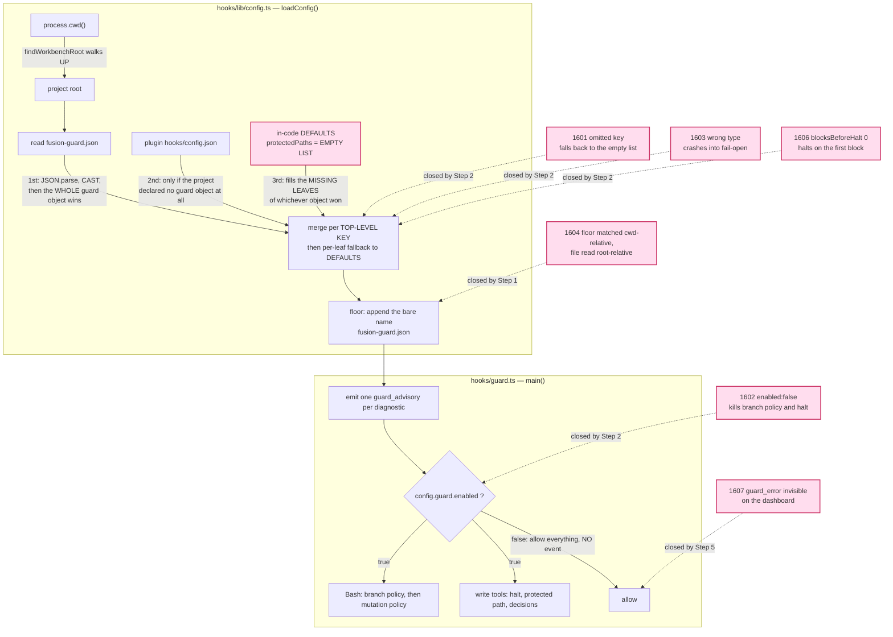
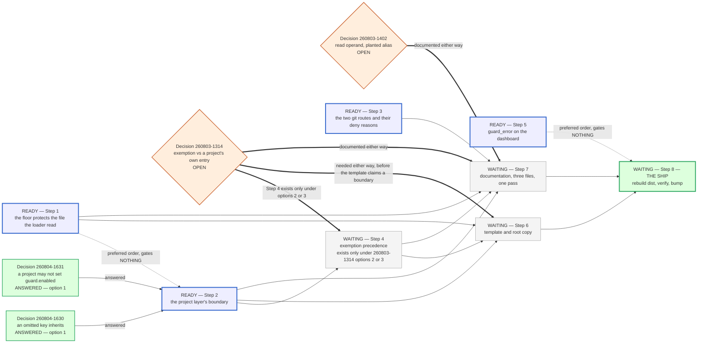

# Implementation Plan: close the C5b configuration boundary, close the two git routes, and ship

**Date:** 2026-08-04
**Revised:** 260804-1650 — see `## Revision 260804-1650`
**Status:** Complete — all eight steps `[DONE]`, the ship landed as v5.9.0–v5.9.2, the twelve acceptance criteria verified and recorded in the spec (reconciler, final reconciliation 260805-2323; see the Step 8 block for evidence). Was: Approved at the plan gate on 2026-08-04, conditional on the diagram repair this revision carries out.
**Circle:** `circles/260801-1244-guard-rules-write`
**Spec:** `shared/planning/260801-1122_o_spec-normative-consolidation.md`, `### C5: Guard changes`, criteria at `:322-332`. Status Final; nothing settled there is reopened here.
**Predecessor plan:** `circles/260801-1244-guard-rules-write/planning/260802-1856_o_plan-guard-rules-write.md`. Its Steps 1 to 8 are complete and are the record of what shipped. Its Steps 9 and 10 are superseded by this plan's Steps 7 and 8, which carry the same obligations plus everything the independent assessment added.
**Executors:** `coder` for seven steps, `ontocoder` for one (Step 6, two JSON files). No strategic-domain step, so `analyst` is not in the active set.
**Trigger:** `circles/260801-1244-guard-rules-write/analyses/260804-1600-c5b-independent-assessment.md`, whose verdict is that capability C5b must not ship in its current state.

---

## Revision 260804-1650

Two things moved in this revision, and they moved together on purpose. The user approved the plan at the gate on the condition that the diagrams be repaired first, and answered both blocking decisions in the same exchange. Repairing a work-order graph while the dependencies it draws are being redefined is how the graph and the prose came apart in the first place, so the answers and the picture land in one edit.

**The decisions, both answered option 1.**

- `decisions/260804-1630_a_what-does-a-project-guard-object-inherit-for-a-key-it-does-not-supply.md`. A key the project layer does not supply falls back to the plugin layer, then to `DEFAULTS`, per leaf across all three layers. A declared `protectedPaths: []` still means the empty list; only omission changes meaning. The answer binds two further obligations: the template's `_override` note and the loader's documentation are rewritten around the leaf rule in the same change, and type validation drops a bad key exactly the way an omission behaves.
- `decisions/260804-1631_a_may-a-project-file-set-guard-enabled-and-switch-the-whole-guard-off.md`. The project layer may not set `guard.enabled`; the key is read from the plugin layer and `DEFAULTS` only, and a project that declares it gets one diagnostic naming the key. The diagnostic is not optional. The exception is documented in the template, in `README-hooks.md` and in the rule file in the same change.

**What "in the same change" means here, stated so it is not read as a dropped obligation.** Both answers require the documentation to move with the code rather than after it. This plan splits that across Steps 2, 6 and 7 because the three artifacts have three different owners: TypeScript to `coder`, the JSON template to `ontocoder`, Markdown to `coder`. The obligation is met at the granularity where it bites. A template sentence propagates into a consuming project only when `/fusion:setup` runs against a released plugin version, and the release is Step 8, which Steps 6 and 7 gate. No false sentence can reach a project ahead of its correction.

**The diagram repair.** `reviews/260804-1644-conceptrev-plan-c5b-remediation-and-ship.md` returned the verdict `tangled` against the work-order graph: the graph omitted the `Step 2 → Step 4` dependency that Step 4's own text declares, four statements about Step 5 and Step 7 disagreed, one arrow type carried three unrelated relations, the fourth open decision was absent, and the transitive-reduction policy was applied in some places and not others. All five are repaired below, and the settlement of each is stated rather than left to be inferred.

**The recurrence.** The evaluator noted that the predecessor plan's evaluation raised the same class of defect, a dependency read at a gate and drawn nowhere. Twice is a pattern in the authoring rule, not in this plan. `rules/design-diagrams.md` asks for a coherence self-check on shape (hairball, fan-out, cycles, layering, orphans) and asks nothing about whether the graph agrees with the prose it illustrates, which is the one check that would have caught both. Filed as `shared/issues/260804-1702_o_the-diagram-self-check-tests-shape-and-never-tests-agreement-with-the-prose.md`, in the shared store because it is a defect in the plugin's authoring rule rather than something this Circle's Directive caused. This plan works one formulation of the missing check out in place, at `### Work order`, as a local convention; whether it generalises to every diagram type is what the issue asks.

---

## Directive

Take this Circle from where it is to shippable. Twenty-nine defects are open across it; twenty of them are in scope here and eight are deliberately deferred with their costs written down. One defect belongs to another Circle. The ship itself is Step 8: rebuild `hooks/dist/`, verify the whole integration suite against the compiled artifact, bump the plugin version. Nothing from thirteen sessions is live in any consuming project. `origin/main` is 48 commits behind `HEAD` at `53b3765`, measured.

Out of scope, stated so it is not drifted into: the shell reachability model, which became its own Circle at `circles/260804-1205-shell-reachability-model`; the curator agent; and any change to the exemption's own boundary beyond what decision `260803-1314` settles.

---

## Why the predecessor plan failed, and the rule that follows from it

The predecessor plan was wrong in three ways, and all three shipped. Its `ConfigSources` sketch would have made every unit case pass vacuously in the one repository where the loader is developed. Its Step 8 asked for a command that the self-protection floor from its own Step 6 denies, once per orchestrator session in every consuming project, forever. And its Q2 reasoned the merge rule through for `defaultSensitivity`, where both sources happen to carry `"medium"`, concluded that nothing observable changes, and never turned the rule around to the one key where the two sources differ. Turning it around is defect `260804-1601`, the finding that stopped the ship.

The three share a shape. Each reasoned about the mechanism and not about what a consuming project would do with it.

So every step below states, in its own words, what a consuming project could do to itself if the step lands as written. The statement is part of the step, not a courtesy. A step whose author cannot write that paragraph has not finished designing it.

Three further constraints are inherited from the Circle and hold for every step.

**No command may newly allow, and no path protected today may become unprotected.** Every Turn has held that line, and it is the only reason the boundary claims are worth anything.

**Costs are stated as rules with examples labelled an open set, never as closed lists.** Five enumerations have been falsified in this Circle. A sixth closed list is a defect the day it ships.

**Eleven of the twelve acceptance criteria describe behaviour in a consuming project, and the write guard stands down in this repository.** A criterion checked by editing a file here is not checked. The instrument that answers these is `hooks/lib/__tests__/helpers/guard-harness.ts`, which runs the real compiled guard as a fresh subprocess against a throwaway project root. Every verification block below names it or names a shell run outside this tree.

One mechanical note. `npm test` builds before it runs, and the build rewrites `hooks/dist/`, which Step 8 owns. Steps 1 to 7 use `npx vitest run`. Step 8 is the one step that runs `npm test`.

---

## Current State

### Where the six loader-and-enforce defects sit

The independent assessment measured C5b through the shipped harness and filed eight defects. Six of them sit on the load-then-enforce path this graph draws, and four of those six meet at one place in the loader.

Two of the eight are deliberately not in the graph, because neither is on that path. `260804-1605` is a defect in the template's text and is closed by Step 6. `260804-1608` was a marker and header correction on the predecessor plan and was closed by this planning session. The node identifiers carry the mapping: node `F<n>` is defect `260804-160<n>`, which is why the sequence runs `F1, F2, F3, F4, F6, F7` with no `F5` and no `F8`. The gaps are the two defects named in this paragraph, not an authoring slip.



The intersection that matters is `MERGE` choosing an object, `DEF` supplying that object's missing leaves, and `DEF`'s value for `protectedPaths` being the empty list. Verified by reading `hooks/lib/config.ts:149` and `:277-292`, and reproduced by the assessment through sixty-two guard invocations.

The three ordinals on the inbound merge edges are the precedence as it stands today, and they are the whole subject of decision `260804-1630`. The answer replaces them: the walk becomes per-leaf across all three layers, so the plugin layer stops being reachable only when the project declared no `guard` object at all and starts supplying any leaf the project omitted. Step 2 is where that happens. This graph stays drawn as it is, because it sits under `## Current State` and its job is to show what the remediation is against.

### The two git routes, and what makes them one pass

Two High defects from the Turn 10 review fail open into the protected list. `git --namespace foo -C rules rm x.md` deletes a rule file and allows, because `resolveGit`'s option walk breaks on an unrecognised option's value and never reads the `-C` standing behind it. `git checkout HEAD~1 -- .` overwrites every tracked file in the project, protected ones included, and allows, because the ancestor check excludes the project root deliberately and `checkout` writes through its pathspec rather than writing the named entry.

The review recommends one pass for both, and the recommendation is sound rather than merely convenient. Both sit inside the eight lines `613d6fd` was working in, both are measured with the same instrument, and the fix for the second is a field on `VerbSpec` that two further defects (`260804-1346` and `260804-1348`) also want. Splitting them means touching `hooks/lib/bash-mutation-guard.ts` twice for one design.

### What the shipped documents say today

Verified at HEAD `53b3765` by grep rather than carried from an earlier reconciliation, whose line numbers have drifted.

| Claim | Location | State |
|---|---|---|
| "There is no override for a protected-path shell write" | `rules/protected-path-discipline.md:510` | False since `45f53d4` |
| "There is no env override for a protected-path shell write" | `README-hooks.md:211` | False since `45f53d4` |
| "no env override waives it" | `CLAUDE.md:48` | False since `45f53d4` |
| `FUSION_ALLOW_RULES_WRITE` named | `rules/protected-path-discipline.md:49`, `README-hooks.md:145` | Both arrived with the case-folding commit, not with a documentation task |
| `fusion-guard.json` described anywhere | none | `grep -rn fusion-guard README-hooks.md README.md CLAUDE.md rules/` returns nothing. Criterion `:332` is met nowhere |
| `guard.enabled: false` stands the whole guard down, branch check included | `README-hooks.md:141` | True, and it has been true since long before this Circle |

The last row deserves its own sentence, because the defect record for `260804-1602` does not draw it. The behaviour of `guard.enabled` is documented and unchanged. What C5b changed is who can write the key: a value only fusion's own protected file could set is now settable by any project, and by any agent in a project whose `fusion-guard.json` does not yet exist. Decision `260804-1631` is framed on that distinction.

---

## Approach

### One seam, three questions, now answered

Five of the six configuration defects are the same seam seen from different sides. The seam is what a project's `fusion-guard.json` contributes to the effective configuration, and it carried exactly three questions. Two were put to the user at the plan gate and both came back as option 1; the third follows from the second.

1. **Which keys may the project layer set at all?** Every key except `guard.enabled`. A project that declares `enabled` is ignored for that key and gets one diagnostic naming it. Decision `260804-1631`, answered.
2. **What does a key the project layer does not set fall back to?** The plugin layer, then `DEFAULTS`, per leaf across all three. A project that declares `protectedPaths: []` still gets the empty list. Decision `260804-1630`, answered.
3. **What happens to a key whose value is the wrong type?** A validator drops it and names it in `diagnostics`, and a dropped key then behaves exactly like an omitted key. Question 3 is not a separate rule; it is question 2 applied to a second way of arriving at "absent". The answer to `260804-1630` states that obligation directly.

The unifying statement is now the plan's, not a conditional: *a key the project layer does not supply, or supplies unusably, is treated as absent, and absent means the plugin layer, then `DEFAULTS`.* One rule, expressible from memory by an agent and by a project owner, closing five defects and the four latent instances filed as `260804-1633`. The single exception is `guard.enabled`, where "the project layer supplied it" and "the project layer did not" both mean the plugin's value, and the difference between them is a diagnostic.

The alternative shape, five per-key rules with five diagnostics, is the thicket this Circle has repeatedly found to be the wrong answer. It is named here so that the choice stays visible: one exception with a diagnostic is not the start of that thicket, and the test for whether it has become one is whether the rule still fits in a sentence.

### What is deliberately not redesigned

The half of the merge rule that matters stays: a project's **declared** value replaces the plugin's, which is what makes deliberate narrowing possible and is half of what decision D2 in the spec asked for. What decision `260804-1630` changes is only the granularity at which "declared" is read, from the whole top-level object down to the leaf. A project that declares a value keeps getting exactly that value, which is the property spec criterion `:327` names. The floor stays keyed on the file existing, which decision `260802-1912` settled and which Step 8 of the predecessor plan was reshaped around. The cache stays keyed on the resolved source pair.

The consequence to carry into Steps 6 and 7 is a sentence, not a behaviour: "the project's object replaces the plugin's whole" is no longer a true description of the shipped code, and it is currently written down in the template and implied in the loader's own comment at `hooks/lib/config.ts:277-278`. Both are corrected, and the answer to `260804-1630` requires it in the same change rather than afterwards.

### Work order

Two conventions govern this graph, and both exist because the previous drawing was read at a gate and gave the wrong answer.

**Every edge is one name in one step's `Dependencies` line, and every name in every `Dependencies` line is one edge.** The correspondence runs both ways, so a reader can check the picture against the eight step bodies mechanically rather than by judgement. `Dependencies` lines name **direct** prerequisites only; a prerequisite that is reached through another step is a path in the graph and is not restated as an edge. That is one policy applied everywhere, which is what the previous drawing lacked: it drew three redundant edges and omitted a fourth, so a missing edge could not be told from a deliberate reduction.

**Three arrow shapes, three different obligations.**

- `-->` **solid: a hard gate.** The target must not start until the source is finished. No label needed; the shape is the claim.
- `==>` **thick: a gate whose shape depends on an open decision.** The label states the condition.
- `-.->` **dotted: a preferred order that gates nothing.** The label says so.

The readiness partition is carried by the node labels and their fill, `READY` against `WAITING`, rather than by two `subgraph` blocks. The evaluator suggested the blocks and they were tried first; Mermaid routes every cluster-crossing edge through the cluster boundary, which bundles the eight edges leaving Steps 1 to 4 into one ribbon and makes the source of each unreadable. Traceability of a single edge is the whole point of this repair, so it wins over the spatial grouping.



Rendered with `mmdc` 11.16.0: 12 nodes, 18 edges, acyclic, no orphan, one sink (`S8`). Every edge was checked back against the `Dependencies` line it comes from.

**The available work is Steps 1, 2, 3 and 5.** Step 2 joined that set when the two decisions were answered, and it is still the longest pole, so it is the one to start. Steps 1 and 3 remain worth taking early rather than as busywork: Step 3 is independent of the whole configuration question and closes two of the five High defects on its own, and Step 1 edits the same function as Step 2, which is why the dotted edge between them exists at all.

**Everything after that waits on decision `260803-1314`.** The plan previously classed it as ship-gating but not code-blocking, and that classification was right only while Step 2 was itself blocked. Now that Step 2 can start, `260803-1314` is the single remaining decision between the available work and the ship: Step 6 needs it either way, because a template that claims a boundary has to claim the chosen one, and Step 6 gates Step 8. Answering it with option 1 costs no code and one paragraph in Step 7. Not answering it stops the plan after Steps 1, 2, 3 and 5.

Decision `260803-1402` gates Step 7 alone and is cheaper: Step 7 documents whichever way it goes, and the record's own recommendation is option 1.

---

## Implementation Steps

### Step 1 [DONE] — The floor protects the file the loader actually read

- **Executor:** `coder`
- **Files:** `hooks/lib/config.ts`, `hooks/lib/__tests__/config.test.ts`, `hooks/lib/__tests__/guard-rules-write-integration.test.ts`
- **Dependencies:** none. Independent of all four decision records, answered and open alike.
- **Closes:** `260804-1604`
- **Changes:** the floor appends the absolute path of the project configuration file alongside the bare `fusion-guard.json` pattern, computed from the same `projectRoot` the layer was read from (`hooks/lib/config.ts:256-265` and `:287-292`). One comment states why the floor is the only entry in the effective list carrying an absolute form: it is the only pattern whose subject has a location the loader already knows, where `rules/**` genuinely names a different directory from a different working directory.
- **What a consuming project could do to itself if this lands as written:** a project whose agents run from a subdirectory gets a floor that defends the file governing them, which is what the seeded template already promises them. The risk runs the other way. An absolute pattern is folded by `matchesAnyFolded` like every other, so on a case-insensitive volume the floor also matches a differently-cased spelling of the same path. A widened deny is the safe direction, and it is still a behaviour change that must be measured rather than assumed.
- **Verification:** the four rows of `260804-1604`'s measurement, run through the harness with the guard's working directory one level below the project root: `Edit ../fusion-guard.json`, `Edit <abs>/fusion-guard.json`, `rm ../fusion-guard.json`, and `cd .. && rm fusion-guard.json`. All four deny. The control that proves the project layer was loaded at all, `Edit secret/a` denying under `{"guard":{"protectedPaths":["secret/**"]}}`, still passes. The existing floor cases at the project root still pass. `npx vitest run`, not `npm test`.
- **What would falsify it:** `Edit ../fusion-guard.json` still allows. Or the `/fusion:setup` Step 0f probe starts denying, which would mean the floor now applies before the file exists and decision `260802-1912` has been reversed by accident. Extract that block and run it twice against a scratch directory as part of this step, because the block was reshaped around the floor and is the fastest signal that the floor moved.
- **[DONE — coder, 260804-1940. Not yet committed; the orchestrator commits after validation. Session: `history/260804-1940-coder-step1-floor-step4-exemption-precedence.md`.]** `npx vitest run` **1532 passed, 26 files** (Steps 1 and 4 together). All four rows of `260804-1604` deny through the harness with the guard's working directory one level below the project root, with the `Edit secret/a` control still denying and the Step 0f block still working run twice — through the real guard AND a real `bash`. **Nothing newly allows**, measured over a generated cross-product of 182,688 classifications: 0 newly allowed under this step alone. Three mutations applied and reverted against checksummed copies (the floor's absolute spelling dropped breaks 16; the resolving normaliser reverted breaks 15; the trailing separator dropped breaks 11) — every one at a guard verdict. **Three things in this step were wrong when built.** (1) The stated change closes two of the four rows: `normalizeToRelative` returned a RELATIVE input unchanged, so `../fusion-guard.json` was matched as literal text against patterns none of which can begin with `..`; the normaliser has to resolve first, which is the other half of the defect and is not in this step's text. (2) The file list is short by three — `hooks/guard.ts`, a new `hooks/lib/project-relative.ts` (the normaliser extracted so it can be asked about a working directory other than this process's own), and a docstring correction in `hooks/lib/bash-mutation-guard.ts`, whose `ancestorOfProtected` said "no protected pattern in the list is absolute". (3) `resolve()` drops a trailing separator, and the first version of the extraction turned `Edit agents/` from a deny into an ALLOW — caught by the suite, not by reasoning. `GuardConfig` also gained `floorPaths` (a load report), because the floor stopped being one pattern and Step 4 needs to take the loader's own entries back out.

### Step 2 [DONE] — The project layer's boundary: what it may say, what an absence means, what nonsense costs

- **Executor:** `coder`
- **Files:** `hooks/lib/config.ts`, `hooks/lib/paths.ts` (one docstring sentence), `hooks/lib/__tests__/config.test.ts`, `hooks/lib/__tests__/guard-rules-write-integration.test.ts`
- **Dependencies:** decisions `260804-1630` and `260804-1631`, both answered option 1 at the plan gate on 2026-08-04, so the step is unblocked. Step 1 need not precede it, but the two edit the same function and land more cheaply in order.
- **Closes:** `260804-1601`, `260804-1602`, `260804-1603`, `260804-1606`, `260804-1633`, and item 1 of `260804-1432`. Item 2 of `260804-1432` becomes decision `260804-1632` and is deferred.
- **Changes:** one seam, three questions, all three now answered, per `## Approach`.
  - **Which keys the project layer may set: every key except `guard.enabled`.** `enabled` is resolved from the plugin layer and then `DEFAULTS`, and the project's value is not consulted. When the project layer declares the key at all, including `false`, the loader appends one diagnostic naming `guard.enabled` and saying the project layer cannot set it. `hooks/guard.ts` is not touched: the short-circuit at `:652` reads `config.guard.enabled`, and under this answer that value can no longer come from a project. The diagnostic is the whole of the user-visible difference between this answer and a silently inert key, which is why decision `260804-1631` calls it not optional.
  - **What an absent key falls back to: the plugin layer, then `DEFAULTS`, per leaf.** The five `project.raw.X ?? plugin.raw.X` lines at `hooks/lib/config.ts:277-282` choose whole objects today; they become a per-leaf walk over the same three sources. `??` is the right operator for it, because `null` already means "nothing configured" and must keep meaning that. The same three lines close the four latent instances in `260804-1633`, which is what makes this one rule rather than five.
  - **What an unusable value costs: the same as an absence, plus a diagnostic.** A validator at the point of the cast (`hooks/lib/config.ts:240`) types `guard.protectedPaths` as an array of strings, the values of `guard.categoryPaths` the same way, `decisions` as its own shape, and `escalation.blocksBeforeHalt` as a positive integer. A key that fails validation is dropped and named in `diagnostics`, and the leaf walk then finds it absent and inherits. The plugin layer runs through the same validator: it is protected, so the risk is smaller, and `260802-2334_c_` is the standing proof that "this file is protected" was not enough once already in this Circle.
  - **One structural obligation the answers create, and it is easy to miss.** The leaf walk knows which layer supplied `protectedPaths`; the `GuardConfig` it returns does not carry that fact (`hooks/lib/config.ts:283-300`, read at HEAD `53b3765`). Step 4's option 2 needs exactly that fact, because "the project's own explicitly declared protected entries" is the set it subtracts from the exempt set. Decide it here rather than in Step 4: either the returned configuration carries the provenance of that one leaf, or Step 4 re-reads a file the loader already read. The second is a second source of truth for the same bytes. Under `260803-1314` option 1 the obligation is void, which is one more reason that decision belongs before Step 6.
  - `hooks/lib/paths.ts`'s `matchesAny` docstring says "no per-project config loader exists yet". Step 6 of the predecessor plan is that loader. The sentence is deleted and replaced by a pointer to decision `260804-1632`.
- **Three constraints the implementation must not break.** The validator accepts unknown keys, including the six underscore-prefixed documentation keys the template carries, or Step 6's template stops parsing into an inheriting configuration and the seeding shipped in `7f3d789` becomes a no-op. `null` keeps meaning "nothing configured", which `readLayer` has always accepted silently. And a **declared** value still wins outright: `"protectedPaths": []` is the empty list, not an inheritance, or the deliberate narrowing spec criterion `:327` asks for is gone.
- **What a consuming project could do to itself if this lands as written:** a project can still turn its own protection off deliberately, by declaring `"protectedPaths": []`, and the git diff is what bounds that residual. What it can no longer do is turn its protection off by omission, by typo, or by a wrong type, and it can no longer turn the guard off wholesale through `guard.enabled` at all. The failure mode that survives is quieter and is the one to watch. The `enabled` diagnostic rides the `diagnostics` channel, which emits one `guard_advisory` per diagnostic per guarded call, so a project that leaves `"enabled": false` in its file gets the same advisory on every tool call for as long as the line sits there. An advisory that repeats forever trains its reader to dismiss advisories, which is the failure Step 5 is separately about. The step is finished when three things are demonstrably identical: a dropped key, an omitted key, and a key the project never wrote.
- **Verification:** every row of the measurement tables in `260804-1601`, `260804-1602`, `260804-1603` and `260804-1606`, added as pinning cases to `describe("what a project configuration can currently reach — measured, not endorsed")` in `guard-rules-write-integration.test.ts`, with that block's title corrected once its contents are no longer only what the configuration can reach. Every row is asserted through a real guard subprocess against a throwaway project root. A loader returning a good list proves nothing about what the guard denies, which is the vacuity trap the harness exists to close. Two rows are new with the answers: `{"guard":{"enabled":false}}` must leave every protected pattern, the branch policy and an active halt in force, and must produce a diagnostic naming `guard.enabled`; and `{"guard":{"enabled":true}}` must keep all nine patterns rather than emptying the list. `npx vitest run`, not `npm test`.
- **[DONE — coder, 260804-1725. Not yet committed; the orchestrator commits after validation. Session: `history/260804-1725-coder-step2-project-layer-boundary.md`.]** `npx vitest run` **1394 passed, 25 files**; 50 cases added (33 unit, 17 integration). Byte-identity for a project with no `fusion-guard.json` still holds, a declared `protectedPaths: []` is still the empty list, and the ignored `guard.enabled` key produces its advisory on both surfaces. Three mutations applied and reverted against a checksummed copy: the whole-object merge restored breaks 3 integration rows, the `enabled` exception removed breaks 4, validation removed breaks 5 — every one at a guard verdict rather than a loader return value. Four things in this step turned out wrong when built, all recorded in the session file: the provenance field had to be classed as a load report rather than a setting (a new top-level field fails the byte-identity assertion this Circle already carries); the collision between the `enabled` rule and the type rule over one key needed deciding and is resolved inside the validator so the project's `enabled` earns exactly one diagnostic and never a misleading type one; "the five `??` lines become a walk" understates a two-stage collapse and is not three lines; and `blocksBeforeHalt: "3"`, listed under "the values that behave" in `260804-1603`, becomes a dropped key that inherits to the same answer. `hooks/guard.ts` genuinely needed no change, as the step predicted.
- **What would falsify it:** `{"guard":{"enabled":true}}` still allows `Edit agents/coder.md`. `{"guard":{"enabled":false}}` still stands any surface down, or stands nothing down and says nothing. `{"guard":{"protectedPaths":"rules/**"}}` still emits `guard_allow` with no diagnostic. `{"guard":{"protectedPaths":123}}` still reaches the fail-open branch. `{"escalation":{"blocksBeforeHalt":0}}` still halts on the first block. `{"guard":{"protectedPaths":[]}}` inherits the plugin's nine patterns, which would mean the leaf walk swallowed a declared value and the narrowing capability is gone. And the anti-vacuity check: revert the leaf walk to the whole-object merge in a throwaway mutation, and at least one integration row must fail. If none does, the new cases are measuring the loader's return value rather than the guard's verdict, and they are worthless.

### Step 3 [DONE] — The two git routes into the protected list, and the deny reasons around them

- **Executor:** `coder`
- **Files:** `hooks/lib/bash-mutation-guard.ts`, `hooks/lib/__tests__/bash-mutation-guard.test.ts`, `hooks/lib/__tests__/guard-bash-integration.test.ts`
- **Dependencies:** none. Independent of the configuration work and of every decision.
- **Closes:** `260804-1344`, `260804-1345`, `260804-1347`, `260804-1348`, and the code half of `260804-1346`.
- **Changes:** one design with three consequences.
  - **Resume the option walk instead of widening the candidate list.** When `resolveGit`'s walk breaks on a non-flag word (`hooks/lib/bash-mutation-guard.ts:1312`) and `unknownOption` is set, treat that word as the option's consumed value and continue the loop from the next index, recording `-C` and `--work-tree` as it goes. Try the subcommand candidates afterwards, as today. The property `613d6fd` rests on survives: a resumed walk can only find more directories, so a directory fact can only add a candidate resolution and therefore only add a deny.
  - **A `writesThrough` field on `VerbSpec`**, consulted by the ancestor pass, for the rows that write every path beneath their pathspec rather than the named entry: `git checkout <treeish> --`, `git restore --source=`, and `git clean -f`. For those rows, and only those, the project-root exclusion at `:1562` does not apply. The exclusion stays for `cp`, `mv`, `rm` and `ln`, which write the named entry, and `cp x .` together with `mv build/out.js .` are why it exists.
  - **The two spellings of the revert strategy reconciled in the same pass** (`260804-1348`). `checkout` and `restore` are one operation with two flag grammars, and the pass that adds a field to both rows is the pass that can make them agree.
  - **The fail-closed deny reason corrected** (`260804-1347`). A git-directory fail-closed deny names the git directory flag it could not resolve, rather than telling the agent to drop a `cd` that the command does not contain. The rule file's central claim is that an agent never meets an unexplained deny, and a deny reason that names the wrong cause is the shortest route to an agent routing around the guard.
- **The cost, stated as a rule.** A `writesThrough` verb whose pathspec resolves to the project root denies. The examples known today are `git checkout <treeish> -- .`, `git checkout <treeish> -- ./`, `git restore --source=<treeish> .`, `git clean -fdx`, and `git clean -fdx .`. That set is open, and the rule is what to reason from. The way through is the literal file list, or the Human Gate. `git checkout HEAD -- .` stays allowed, because `HEAD` writes nothing an agent could not have obtained by leaving the file alone.
- **What a consuming project could do to itself if this lands as written:** nothing new is permitted. Two routes that today delete a rule file and overwrite the whole protected list stop working. What a project loses is `git clean -fdx` at its own root, which is an ordinary command in ordinary use, and the loss is the point: the same command deletes a rule file an agent has just written under `FUSION_ALLOW_RULES_WRITE` and not yet committed, which is the workflow this Circle exists to enable. The failure to avoid is a deny whose reason does not name the alternative. An agent that meets one reaches for a program outside the verb table, and the guard does not see that at all.
- **Verification:** every measured row in `260804-1344`, `260804-1345` and `260804-1346` as denies, with the real-shell effect asserted in bash and zsh, plus every allow-side control those records name: `git --namespace foo -C build rm out.js`, `git --namespace foo -C rules status`, `git --literal-pathspecs -C rules rm x.md`, `git checkout HEAD -- .` asserted UNCHANGED, `git checkout HEAD~1 -- build`, `git restore --source=HEAD~1 build`, `cp x .`, `mv build/out.js .`, `git clean -fdx build`, and `git -C build clean -fdx`. `npx vitest run`.
- **What would falsify it:** any of the seven measured rows still allows. Or an allow-side control flips to deny, which means the fix is a blanket give-up on invocations carrying an unrecognised option rather than a resumed walk. Anti-vacuity, in the shape the two records already specify: a mutation dropping `writesThrough` from the `checkout` row must fail the `checkout HEAD~1 -- .` row and no other, and a mutation removing the root exclusion outright must fail the `cp x .` row.
- **[DONE — coder, 260804-1815. Not yet committed; the orchestrator commits after validation. Session: `history/260804-1815-coder-step3-two-git-routes.md`.]** `npx vitest run` **1448 passed, 25 files**; 54 cases added (33 unit, 21 integration). **Nothing newly allows** — measured against a generated cross-product of 181,115 commands classified by both the pre-change classifier at `f82ac02` and this one: 0 newly allowed, 9,462 newly denied, every one attributable to one of the two intended causes. Four mutations applied and reverted against a checksummed copy, each failing exactly what the records predicted and nothing else: dropping `writesThrough` from `checkout` breaks 8 (all `checkout`, no `restore`, no `clean`, no allow row), removing the root exclusion breaks 18 including `cp x .`, reverting the walk resumption breaks 8 without touching `git --namespace foo -C build rm out.js`, deleting the git-directory cause breaks 3 and only the reason assertions. Three things in this step turned out wrong when built, all recorded in the session file: `writesThrough` cannot be consulted at every candidate base or `git -C build clean -fdx` — an allow control in both suites — flips to deny, so it is consulted only at `gitEffectiveBase`; the resumed walk closes the class only for options taking ONE separated value, and the bound is asserted rather than claimed away; and **`260804-1348` cannot be closed by this step at all** — its code half newly allows and is now decision `260804-1815`, its two documentation halves are in Step 7's file and Step 7's `Closes` line does not name the record. `260804-1346` is likewise half-closed: the code landed, the residual entry is Step 7's obligation 9.

### Step 4 [DONE] — The exemption's precedence against a project's own protected entries [no longer conditional — `260803-1314` answered option 2]

- **Executor:** `coder`
- **Files:** `hooks/lib/rules-write-exemption.ts`, `hooks/guard.ts`, `hooks/lib/__tests__/rules-write-exemption.test.ts`, `hooks/lib/__tests__/guard-rules-write-integration.test.ts`
- **Dependencies:** decision `260803-1314`, and Step 2, where the effective list is assembled. Both are hard, and the second is the one the previous drawing of the work order left out: answering `260803-1314` on its own does not start this step, because the list it subtracts from does not exist until Step 2 has built it.
- **Closes:** decision `260803-1314`, by realising it.
- **This step exists only if the answer is option 2 or option 3, and that conditionality survives the two answers.** Neither `260804-1630` nor `260804-1631` touches `RULE_DIR_PATTERNS` or the seam where the exemption is consulted, so nothing has been decided about the exempt set by answering them. If `260803-1314` comes back option 1, the exempt set stays the two well-known rule directories, no project can change it, no code moves, and the whole obligation is one paragraph in Step 7. The predecessor plan's Step 6 already pinned today's behaviour with a case labelled `MEASURES:` that disclaims endorsement and cites the record, so the case fails the day the decision lands, deliberately.
- **What the two answers did change here, in both directions.** Option 2 got cheaper and better defined: "explicitly declared" is now a per-leaf fact the loader computes anyway, rather than something inferred from whether the project supplied a whole `guard` object, so the precedence rule has a precise subject. Option 3 got harder to justify: `260804-1631` settled that a project may not widen its own exposure by writing `guard.enabled`, and option 3 lets a project widen the exempt set by writing its own rule roots. That is the same direction, and the answer to `260804-1631` is now the standing argument against it. Stating this is not answering the decision; the user may still choose option 3, and if they do, the floor's argument has to be made again rather than inherited.
- **Changes, per option.** Option 2 subtracts the project's own explicitly declared protected entries from the exempt set at the seam where the exemption is consulted, which is the only place a precedence rule can be expressed given the exemption is asked only about paths the protected list already matched. It consumes the leaf provenance Step 2 is obliged to settle. Option 3 makes the rule roots configurable alongside `protectedPaths`.
- **What a consuming project could do to itself, per option:** under option 2 a project can make a subtree of its own `rules/` immutable against the flag, and a curator meeting that deny needs a reason naming the project's own entry, or the deny reads as the flag being broken. Under option 3 a project can widen its own grant by editing a file the guard reads, which is the direction the self-protection floor exists to prevent, so taking option 3 means the floor's argument has to be made again rather than inherited.
- **Verification:** the two consequences the decision record names, measured through the harness. Under option 1 the verification is a grep: `RULE_DIR_PATTERNS` unchanged at `["rules/**", ".claude/rules/**"]`, and the sentence stating the choice present in both shipped documents.
- **What would falsify it:** under option 2, a project entry that the exemption still overrides. Under option 1, an implementation that quietly did something anyway.
- **[DONE — coder, 260804-1940. Not yet committed; the orchestrator commits after validation. Session: `history/260804-1940-coder-step1-floor-step4-exemption-precedence.md`.]** Option 2 realised as gate 1b in `hooks/lib/rules-write-exemption.ts`, consuming Step 2's leaf provenance through a new `projectDeclaredProtectedPaths(config)` in `hooks/lib/config.ts`. **Both halves asserted.** A project declaring `rules/immutable/**` gets the subtraction on both surfaces, and the deny quotes its own entry; a project that declares nothing gets the exemption unchanged — asserted by the whole 145-case exemption unit suite (every pre-existing case now passes the empty declared list, so the file IS that assertion) plus three integration cases through a real guard, one per way of declaring nothing. **Nothing newly allows:** 0 under this step alone across the 182,688-classification cross-product. Two mutations applied and reverted: removing gate 1b breaks 12; **substituting the EFFECTIVE list for the declared one — the trap, which compiles and has the same type — breaks 26, including all three "declares nothing" rows and every pre-existing exemption case**, which is the flag dying everywhere exactly as the decision's first obligation predicts. **Three things in this step turned out different when built.** (1) The `Files` line also needs `hooks/lib/config.ts`: putting the derivation in the loader rather than in `guard.ts` keeps "which entries did this project declare" one fact with one definition. (2) The subtraction has to match the way the PROTECTION side matches — case folded, and a directory operand retried with a trailing separator — which is the opposite of gate 1's conventions and right here because a wider match REFUSES more; without the retry, `rm -rf rules/immutable` deletes the subtree a project declared immutable. (3) **A sharp edge the step does not state and Step 7 owes a sentence:** a project that copies fusion's own `rules/**` into its file loses the flag for the whole rule directory, `rules/retired/` included. There is no exception for a declared entry equal to one of fusion's; it follows from the decision, it is the safe direction, and it is pinned by a `STATED COST:` case. Step 7 also needs the two residual-list corrections recorded in the session file.

### Step 5 [DONE] — `guard_error` reaches the dashboard

- **Executor:** `coder`
- **Files:** `bin/monitor`
- **Dependencies:** none.
- **Closes:** `260804-1607`
- **Does not gate the ship, and the reason is worth stating.** Once Step 2 lands, the project-triggerable fail-open is closed, and `guard_error` returns to the pre-existing rarity it had before C5b. A ship without this step leaves an old invisibility in place. It does not ship a false claim, which is the line the other steps are held to.
- **Settled against Step 7.** Step 7's dependency line used to name Step 5, while this heading, the work-order graph and Open Question 1 all said Step 5 gates nothing. The dependency line was the error and it is struck: Step 7 edits three Markdown files, none of its obligations names the dashboard, `bin/monitor` or `guard_error`, and this step edits `bin/monitor` alone. Nothing in Step 7 waits on it. All four statements now agree, and Step 5 is off the critical path to the ship.
- **Changes:** `guard_error` joins `WARNING_EVENT_TYPES` at `bin/monitor:91-102`, not `ADVISORY_EVENT_TYPES`. Advisories share a small separate budget because they arrive in bursts during a curation session; an error is rare and each one is individually worth reading, which is what the warning budget is for. Confirm that the level mapping in `renderWarnings()` gives it at least the weight of a block.
- **What a consuming project could do to itself if this lands as written:** nothing. The risk is the inverse one. An error rendered at the default advisory weight reads as routine, the user stops looking, and the event that means "the guard is not running" becomes another row to dismiss.
- **Verification:** run `bin/monitor` against a workbench whose `.guard-state/events.jsonl` carries one hand-written `guard_error` line, confirm the row appears in the warnings panel at block weight or above, then remove the line. Reading the set membership is not the check. `260804-1607` labels its own conclusion as inference from set membership rather than a rendered result, and repeating the inference verifies nothing.
- **What would falsify it:** the row renders and is indistinguishable from an advisory.
- **[DONE — coder, 260804-2100. Not yet committed; the orchestrator commits after validation. Session: `history/260804-2100-coder-step5-guard-error-on-the-dashboard.md`.]** `npx vitest run` **1537 passed, 26 files**; 5 cases added, every one driving the real `bin/monitor` binary over HTTP against a seeded `.guard-state/events.jsonl`, per this step's own instruction that reading set membership is not the check. A `guard_error` now reaches the panel and renders at the halt level, labelled "Fail-open" — red border, red badge and background tint, distinct from the amber default and the cyan advisory, asserted by executing the shipped `renderWarnings()` level chain out of the page the binary serves and by reading the colours off the served stylesheet. **Behaviour with no `guard_error` present is unchanged**, asserted as a whole 38-row sequence for a mixed warning-plus-advisory workload rather than as counts. Three mutations applied and reverted against a checksummed copy, each failing exactly what it should: charging `guard_error` to the warning class breaks the two eviction cases and nothing else, dropping it from `WARNING_EVENT_TYPES` breaks three, deleting the `renderWarnings()` branch breaks one with `expected 'Warning' to be 'Fail-open'`. **Two things in this step were wrong when built.** (1) **"`guard_error` joins `WARNING_EVENT_TYPES`, not `ADVISORY_EVENT_TYPES`" is necessary and not sufficient, and its stated reason does not hold.** The reason given — an error is rare and each one is individually worth reading, which is what the warning budget is for — is true of the *fault* and false of the *event*: both hooks fail open per invocation, so a fault sitting on disk emits one row per guarded tool call indefinitely. Charged to the warning class and measured, forty fail-opens evicted all four of the events the panel exists to surface (`expected [] to deeply equal [ 'churn_critical', …(3) ]`), and one fail-open followed by fifty churn warnings was itself evicted. That is the advisory-burst failure through a third door, in both directions. `guard_error` therefore gets its own budget, `MAX_ERRORS_RETURNED = 8`, which is the carve-out this panel already uses rather than a new mechanism; the two carve-outs are now one `SUBSET_BUDGETS` table so a fourth class is a row rather than a branch. (2) The `Files` line is short by one: `hooks/lib/__tests__/monitor-warnings-panel.test.ts`, which this step's own verification requires and which the step names only in prose. One finding filed rather than fixed, per this step's scope: `issues/260804-2100_o_from-a-subdirectory-cwd-the-protected-list-matches-nothing-while-fail-closed-still-denies.md`.

### Step 6 — The template and the repository's own copy

- **Executor:** `ontocoder`
- **Files:** `templates/fusion-guard.json`, `fusion-guard.json`
- **Dependencies:** Steps 1, 2 and 4, and decision `260803-1314`. The step must not start before them. The decision is a dependency **either way**, not only under the options that create Step 4: this file states a boundary, and a file that states an unchosen boundary is the defect `260804-1605` was filed about. Under option 1 the answer discharges the dependency on Step 4 rather than satisfying it, and that is the reading a reader needs stated, because the graph then shows no path from the decision to this step through Step 4.
- **Closes:** `260804-1605`
- **Why the ordering is a constraint rather than a preference:** the file documents a boundary that is about to move, and writing it early is the mistake the predecessor plan's Step 9 already made once in this Circle, recorded in the 260804-1021 reconciliation entry.
- **Changes:** re-read all six underscore-prefixed keys against the behaviour the tests then assert. Three of the six are settled by the answers rather than left to the executor's reading.
  - **`_override` is rewritten around the leaf rule, and this is an obligation the answer to `260804-1630` names.** The current sentence describes a project's object replacing the plugin's whole, which stops being true when Step 2 lands. It must say what a project gets for a key it omits (the plugin's value, then fusion's built-in default), what it gets for a key it declares (exactly that value), and that fusion's built-in default for the protected list is the empty list, which a reader who understands the current sentence perfectly still does not learn.
  - **A key or clause states that `guard.enabled` is the one key a project may not set**, that a declared value is ignored, and that the loader reports the fact. Decision `260804-1631` names the template, `README-hooks.md` and the rule file together; this step owns the first, Step 7 owns the other two.
  - **`_protectsItself` and `_inFusionsOwnSourceTree`** are corrected against what Step 1 settled about the floor and against the `enabled` answer, which is what makes the self-protection claim true rather than aspirational.

  The root copy changes in the same commit: `config.test.ts` asserts the two files are byte-identical, so they cannot drift apart silently.
- **[DONE — ontocoder, 260805-2222. Not yet committed; the orchestrator commits after validation. Session: `history/260805-2222-ontocoder-step6-guard-template-rewrite.md`.]** All keys rewritten against named tests; a seventh key `_guardEnabled` carries the one-key exception of `260804-1631` (the plan allowed "a key or clause"). `_override` now states the leaf rule, the empty-list built-in default, and the `260803-1314` option-2 boundary (a declared entry outranks `FUSION_ALLOW_RULES_WRITE`), each sentence backed by a case in `config.test.ts`, `guard-rules-write-integration.test.ts` or `rules-write-exemption.test.ts`. Both files parse, `cmp` reports byte-identity, `npx vitest run lib/__tests__/config.test.ts` 72 passed. Closes `260804-1605` as this step's line says, and additionally `260805-1840_o_fusion-guard-template-beschreibt-top-level-merge-statt-leaf-merge.md`, the later duplicate of the `_override` half filed by the documentation review.
- **What a consuming project could do to itself if this lands as written:** every sentence in the template is copied verbatim by `/fusion:setup` into every project it touches, so a sentence that overstates propagates by design. The specific failure to avoid is a project owner who reads `_protectsItself`, believes the configuration is defended, and stops checking. A guard that reports normal operation while protecting nothing is worse than no guard, and a template that reports protection the loader does not provide is the same failure one layer up. The window in which this repository's own copies are stale is bounded by Step 8: nothing propagates to a project until a version ships, and Steps 6 and 7 gate the ship.
- **Verification:** `node -e "JSON.parse(require('fs').readFileSync('templates/fusion-guard.json','utf8'))"` on both files; the byte-identity unit case; the unit case asserting that the untouched template merges to a configuration identical to the plugin's; and one reading pass in which each of the six keys is checked against a named test rather than against the code.
- **What would falsify it:** any sentence in the file that no test asserts. A claim in a seeded file with no case behind it is exactly how `260804-1605` came to be filed, and the author of that claim had verified it against the code that existed at the time.

### Step 7 [DONE] — The documentation, three files, one pass

- **Executor:** `coder`
- **Files:** `rules/protected-path-discipline.md`, `README-hooks.md`, `CLAUDE.md`
- **Dependencies:** Steps 1, 2, 3 and 4, and decisions `260803-1314` and `260803-1402`. Every behaviour the step describes has to have settled first. **Step 5 is struck from this line**, where it sat in the previous revision and contradicted three other statements in this plan. Nothing here waits on the dashboard: the three files are Markdown, none of the obligations below names `bin/monitor`, and Step 5 edits nothing else.
- **Closes:** `260803-1402`, `260804-1025`, `260804-1220`, `260804-1223`, `260804-1349`, `260804-1427`, the documentation half of `260804-1346`, and — added 260804, closing the gap `260804-1348` itself flagged — the two documentation edits of `260804-1348`, which no step owned because this line did not name them. Both are **already discharged**, see the block below; the line names them so the record of ownership is not a gap a reviewer has to rediscover.
- **Why one step and not three.** The three files carry the same sentences and have drifted apart twice. Splitting them is what produced the current state, in which `rules/protected-path-discipline.md` names `FUSION_ALLOW_RULES_WRITE` at line 49 and denies that any override exists at line 510. They move together, or the self-contradiction recurs.
- **The thirteen obligations, enumerated so the step can be checked rather than judged.** Obligations 12 and 13 are new with the two answers, and obligation 4 grew a clause for the same reason.
  1. The `FUSION_ALLOW_RULES_WRITE` row in `README-hooks.md`'s tuning table, beside `FUSION_ALLOW_BRANCH_SWITCH`.
  2. The three "no override" sentences corrected, at `rules/protected-path-discipline.md:510`, `README-hooks.md:211` and `CLAUDE.md:48`, verified at HEAD `53b3765`. Earlier reconciliations cite `:421`, `:199` and `:113`; those numbers are stale and the greps in the verification block are what to trust.
  3. The hard-linked rule file is not exempt, and why (`260803-1402`).
  4. `fusion-guard.json` described for a user in `README-hooks.md` and named in `CLAUDE.md`'s layout table: what it is, where it lives, that it is git-tracked and why, what the merge does, what the floor covers, and what fusion's built-in default for the protected list is. Half of criterion `:332`. **What the merge does is now the leaf rule** decision `260804-1630` settled: a key the project omits inherits the plugin's value and then fusion's built-in default, a key the project declares is taken exactly as declared, and an empty list declared on purpose is an empty list. Any surviving sentence describing a whole-object replacement is false after Step 2 and is corrected here, in the same change, which is an obligation the answer names rather than a tidiness preference.
  5. The release-checklist line in `CLAUDE.md`: before tagging, confirm the guard's behaviour was verified against a project root that is not the plugin repository, because the stand-down makes local testing unrepresentative by construction. The other half of criterion `:332`.
  6. `260804-1025` with `260804-1223`'s corrected evidence. The clause "the model stays exact" is deleted or scoped. Close both records together; `260804-1223` is `260804-1025`'s evidence, not a second defect.
  7. `260804-1220`: the illustration block points at three questions in a procedure that now has four.
  8. `260804-1349`: the cost rule's first question is false as written, and the section heading promises predictiveness the questions do not deliver.
  9. `260804-1346`'s documentation half. The residual entry is restored and narrowed, with the explicit `git clean -fdx .` spelling named, or deleted for the right reason if Step 3's code half closed it. State which, and do not leave the reader to infer it.
  10. `260804-1427`: the floor residual described at its measured reach, which includes `fusion-workbench/.guard-state/**` and therefore the escalation machinery, rather than at the narrower reach the decision record states. The record's own instruction is one or the other, not both and not neither; the documentation leg is the one this plan takes, because widening the floor is a second security-policy choice and the spec authorises exactly one floor entry.
  11. The residual list updated for everything Step 3 changed and for everything it deliberately did not. `GIT_WORK_TREE=` in the environment (`260804-1332`) stays a residual, and its entry must survive this rewrite. Deleting a residual entry rather than narrowing it is exactly what `260804-1346` was filed about.
  12. **`guard.enabled` is the one key a project's file may not set**, stated in `README-hooks.md` beside the `fusion-guard.json` description and in `rules/protected-path-discipline.md` where an agent will meet it. What a project owner needs from this sentence is why the key is inert and where the report of it appears, or they write `"enabled": false`, see nothing change, and conclude the file is not being read at all. `README-hooks.md:141` stays true as written and must not be edited into agreement with a change that did not happen: it describes the plugin's own `hooks/config.json`, which still sets the key. Decision `260804-1631` requires the template, `README-hooks.md` and the rule file to carry this together; Step 6 owns the template and this obligation owns the other two.
  13. **The chosen answer to `260803-1314` stated in both shipped documents** — whether a project's own protected entry outranks `FUSION_ALLOW_RULES_WRITE`. The record's own constraint is that the answer is stated where the user reads it, not only in the record, because a silently inert flag is the failure this Turn already spent two findings on. Under option 1 this is one paragraph and Step 4 does not exist; under options 2 and 3 it describes what Step 4 built.
- **Four of the obligations were discharged early, on 2026-08-04, by `coder`, at the user's explicit request.** They are listed here rather than struck from the enumeration above, because Step 7's reviewer has to see that they were considered and be able to check the sentences that were written. All four described behaviour **already true at HEAD** and came from records that were already answered or already half-closed, so none of them waited on Steps 1, 4, 5 or 6. **Step 7 still runs, and none of the four is marked complete.** What Step 7 owes each of them now is a re-read, not a rewrite: confirm the sentence still holds after Steps 1, 4, 5 and 6 land, and fold it into the one-pass consistency check across the three files.
  - **`260803-1402`'s residual obligation — the alias, stated in full.** The answer's obligation was that both residual lists say the whole of it, not only that a *pre-existing* alias escapes. Discharged in `rules/protected-path-discipline.md` (the "an alias to a protected file" residual, rewritten around the measured block and the reasoning that kept the write-only invariant) and in `README-hooks.md:215`. Obligation 3 above is a **different** half of the same record — the hard-linked rule file on the exemption side — and is untouched.
  - **`260804-1815`'s obligation — the `restore` / `checkout` asymmetry names its allowed spelling.** The answer requires the asymmetry to be stated where a reader meets it and the allowed form to be *named* rather than described. Discharged in the rule file's git-row section and in `README-hooks.md:180`, both saying `git checkout HEAD -- <paths>` in as many words. This also discharges recommendation 1 of `260804-1348`: "Now they agree" is gone from the rule file, and the README's equivalent sentence is scoped.
  - **`260804-1346`'s documentation half (obligation 9 above).** Measured at HEAD: `git clean -fdx` and `git clean -fdx .` now **deny** at the project root, so the branch obligation 9 anticipates is the second one — the entry is deleted because the case closed, and the reason is stated rather than inferred. What survives is stated with it: a `clean` the guard cannot place fails closed, and the `GIT_WORK_TREE=` route is live.
  - **`260804-1348`'s documentation half.** Recommendation 1 as above; recommendation 2 restated with a **reachable** example (`git checkout rules/x.md agents/coder.md`) plus the rule for which of the two policies answers a `--`-less `git checkout`. Recommendation 3 is not taken and is not this step's — it is `260804-1815`, answered option 1.
  - **One correction obligation 11 must carry forward.** The `GIT_WORK_TREE=` residual survives, as obligation 11 requires, but its shipped **example** did not: `GIT_WORK_TREE=rules git clean -fdx` now denies, on the root's own write-through rather than on the variable. Both files now state the residual as a rule and carry a measured example that still allows (`cd build && GIT_WORK_TREE=../rules git clean -fdx`, which empties `rules/` in a real repository). An entry whose only example has stopped reproducing is the same defect as a deleted entry, one step later.
- **Every cost statement in these files is a rule with examples labelled an open set.** Five enumerations have been falsified in this Circle. A closed list is a defect the day it ships.
- **What a consuming project could do to itself if this lands as written:** `rules/protected-path-discipline.md` is loaded into every agent's context on every dispatch in every consuming project. A wrong sentence there is a wrong action taken by every agent, and the sentence that costs most is one that says a command is safe when it is not. The agent that reaches for the decision procedure is by definition the one that has not read to the end of the file, so a disclaimer 400 lines later repairs nothing.
- **Verification:** `cd hooks && npx vitest run`, with `provenance-header-lint`, `path-literal-lint`, `marker-format-lint` and `glob-nomatch-lint` all running over `rules/` and staying green. Then a grep pass with stated expectations: `grep -rn "no override\|no env override" README-hooks.md rules/ CLAUDE.md` returns nothing that denies the flag exists; `grep -rn fusion-guard README-hooks.md CLAUDE.md rules/` returns hits in all three files; `grep -n "the model stays exact" rules/protected-path-discipline.md` returns nothing, or returns a form scoped to the cases where it is true; `grep -rn "guard.enabled" README-hooks.md rules/protected-path-discipline.md` returns the exception in both files; and no surviving sentence in any of the three files describes the project layer as replacing a whole top-level object. Then a reading pass in which each sentence stating a boundary is checked against the test that asserts it.
- **What would falsify it:** any sentence in the three files that contradicts another sentence in the same three files. The mechanical form of that check is to read the three files' claims about overrides, about the floor, and about what a `git` invocation can reach, side by side rather than one file at a time.
- **[Remainder executed — coder, 260805-2233. Not yet committed; the orchestrator commits after validation. Session: `history/260805-2233-coder-step7-remainder-documentation.md`.]** Obligation 10 done and `260804-1427` closed (`_o_`→`_c_`, Resolved footer): the floor residual is stated at its measured reach — `fusion-workbench/.guard-state/**` and the escalation machinery included, with the git-diff and active-halt bounds — in `README-hooks.md` § "Per-project configuration: `fusion-guard.json`" (new section, obligation 4's README half) and in the rule file's project-layer paragraph. Obligations 12 and 13 landed in the same pass: the `guard.enabled` exception is stated in `README-hooks.md` and `rules/protected-path-discipline.md` (obligation 12's two files; `README-hooks.md`'s plugin-`config.json` rows untouched, per the obligation's own constraint), and the `260803-1314` option-2 boundary (a declared protected entry outranks `FUSION_ALLOW_RULES_WRITE`, `rules/**` declared withdraws the flag wholly, `retired/` included) is stated in both shipped documents. `CLAUDE.md`'s two surviving "no env override" sentences corrected and `fusion-guard.json` added to its layout table. All five verification greps meet their stated expectations; the four lint suites pass (69 tests). **One obligation found not present and not taken here: obligation 5**, the release-checklist line in `CLAUDE.md` (verify guard behaviour against a non-plugin project root before tagging) — it exists nowhere in `CLAUDE.md` at this pass's HEAD, was not in the early-discharged four, and was outside this dispatch's stated scope; it was the one item standing between this step and `[DONE]`. **[Obligation 5 discharged — coder, 260805-2236. Not yet committed; the orchestrator commits after validation.]** The release-checklist line landed in `CLAUDE.md:70`, inside release step 0's validation: if the release touches the guard, confirm before tagging that its behaviour was verified against a project root that is not the plugin repository (the guard-harness integration tests spawn such roots; a scratch consuming project works too), because the write guard's self-detect stand-down makes local testing here unrepresentative by construction. That is the second half of spec criterion `shared/planning/260801-1122_o_spec-normative-consolidation.md:332`. All thirteen obligations are now discharged; the step heading is marked `[DONE]`. Also flagged for the orchestrator: decision record `260802-1912_a_` still states the residual at its original narrower bound; the issue's own "not both, and not neither" is satisfied by the shipped documents carrying the measured bound, and whether the record gets a correcting appendix is left to the Circle's owner.

### Step 8 [DONE] — The ship

> **Executed across the Ausstiegsplan and the 260805 sessions; verified and marked by the
> reconciler at the final reconciliation 260805-2323.** The ship did not run as one step of
> this plan — the user interposed `planning/260804-2356_c_plan-ausstieg-kontextsteuer-und-auslieferung.md`
> (context-tax cut first, release after), and this step's three obligations landed through it:
>
> - **`hooks/dist` rebuilt and committed:** `199ef22`, built from an emptied `dist/`, all
>   import specifiers relative or `node:`; the previously committed state was measured four
>   days stale (it still allowed `git --work-tree=rules clean -fdx` and lacked the loader,
>   the exemption module and the Bash halt check) — evidence
>   `history/260805-1054-coder-rollendeckel-und-dist-build.md`.
> - **Version bumped and shipped:** v5.9.0 (`2eaee31`), v5.9.1 (`ec0561a`), v5.9.2 (bump
>   `8586ba3`, pin example `4a8fea0`, tag pushed) — all three tags verified with `git tag -l`.
> - **The artifact run:** no history recorded a `FUSION_GUARD_ENTRY=dist` suite run, so the
>   reconciler ran it at HEAD `def351e`: `FUSION_GUARD_ENTRY=dist npx vitest run` — **1550 of
>   1551 passed**, identical to the source run; the sole failure is the `rules-emission-golden`
>   fixture (stale byte count from `373f5ed`, a `bin/fusion-rules` concern, no guard behaviour
>   involved; filed as `issues/260805-2323_o_emissions-golden-veraltet-nach-dem-step-7-doku-commit-die-suite-ist-um-einen-test-rot.md`).
>   The falsification condition — dist and source disagreeing on any row — did not occur.
> - **The twelve criteria walked** and recorded with per-criterion evidence in the spec's
>   checkbox block, `shared/planning/260801-1122_o_spec-normative-consolidation.md:309-332`
>   (the deferred C5c criterion and all eleven C5a/C5b criteria now carry `[x]` with citations).

- **Executor:** `coder`
- **Files:** `hooks/dist/**`, `.claude-plugin/plugin.json`
- **Dependencies:** Steps 6 and 7 gate it directly, and through them so does every behavioural step (1, 2, 3 and 4). The line names the direct pair rather than the closure, per the work-order convention that an edge is a direct prerequisite and a transitive one is a path. Nothing is weakened by the rewording: the closure is unchanged and the graph still shows it. Step 5 should precede this step and does not gate it.
- **Closes:** nothing directly. It is what makes the previous seven steps true of the artifact that runs.
- **Changes:** `npm run build` in `hooks/`, commit the rebuilt `dist`, bump the version in `.claude-plugin/plugin.json`. `hooks/hooks.json` executes `dist/guard.js`, so an unrebuilt `dist` ships a guard without any of this while every test passes against the TypeScript source.
- **What a consuming project could do to itself if this lands as written:** the step is where a consuming project gets any of it at all. Until it runs, `origin/main` is 48 commits behind and no project has the Bash mutation check, the exemption flag, the loader, or any fix above. The failure mode to watch is a stale `dist`, in which the suite is green and the shipped guard is the old one, which is the exact shape of the risk the predecessor plan named and did not reach.
- **Verification:** `cd hooks && FUSION_GUARD_ENTRY=dist npm test`, running the whole integration suite against the compiled guard that the hook actually executes. Then walk the twelve criteria at `shared/planning/260801-1122_o_spec-normative-consolidation.md:322-332` and record the evidence for each, criterion `:332` included, which is the one Step 7 makes reachable. The spec's checkboxes are not edited by a coder step; the reconciler walks them at Phase 3.
- **What would falsify it:** `FUSION_GUARD_ENTRY=dist` and `npx vitest run` disagreeing on any row, which means `dist/` was built from a different tree than the one under test. Or the build touching files this plan does not name.

---

## Data Structures

Two additions, no removals.

```ts
// hooks/lib/config.ts — new
/** Drops a key that cannot be used and names it, so a dropped key
 *  behaves exactly like an omitted one: the leaf walk below then
 *  finds it absent and inherits. Decision 260804-1630 requires that
 *  equivalence. Applied to BOTH layers. */
function validateLayer(raw: unknown, source: string): {
  raw: RawConfig;
  diagnostics: string[];
};

// hooks/lib/config.ts — replaces the five whole-object `??` lines at :277-282
/** Per-leaf precedence: project, then plugin, then DEFAULTS.
 *  `??` and not `||`, because `null` means "nothing configured"
 *  and an empty list declared on purpose must survive as itself.
 *  guard.enabled is the one exception: the project layer is not
 *  consulted for it, and declaring it earns a diagnostic.
 *  Decisions 260804-1630 and 260804-1631. */

// hooks/lib/bash-mutation-guard.ts — VerbSpec gains one field
export interface VerbSpec {
  /* …existing fields… */
  /** The verb writes every path BENEATH its pathspec, not the named
   *  entry. Set on `git checkout <treeish> --`, `git restore --source=`
   *  and `git clean -f`. Pass 2 skips the project-root exclusion for
   *  these rows and only these. */
  writesThrough?: boolean;
}
```

Both questions the previous revision left open here are answered. `loadConfig` gains a per-key policy for `guard.enabled` (`260804-1631`), and the leaf fallback walks three layers rather than two (`260804-1630`). Neither changes an exported signature.

One shape is still undecided and is named in Step 2 rather than settled here: whether the returned `GuardConfig` carries which layer supplied `protectedPaths`. It is needed only under `260803-1314` option 2, it would be an additive optional field, and the alternative is a second read of a file the loader already read.

## API Changes

None, on the answers as they stand. `validateLayer` is module-private, `VerbSpec.writesThrough` is additive and optional, and no exported signature moves. The one contingency: `260803-1314` option 2 adds an optional provenance field to the exported `GuardConfig`, which is additive and breaks no caller.

## Testing Strategy

Three layers, unchanged in shape from the predecessor plan, with one addition.

**Pure unit tests** carry the matrices: the validator's accept and reject sets, the merge's fallback across layers, and `writesThrough` in the classifier. They import directly and touch no filesystem beyond a temporary directory.

**Integration tests through the spawned hook** carry what a verdict cannot show: that a classifier decision reaches a real `{"decision":"block"}`, that the escalation counter and the event log move exactly when they should, and that a configuration file at a project root changes what the guard denies. Every case is a fresh subprocess against a temporary project root that is not a plugin root.

**Real-shell effect assertions** for every git row in Step 3, in bash 3.2 and zsh 5.9 against a fresh repository, because a verdict that matches the shell's behaviour by coincidence is the failure the Turn 10 review found twice.

**One artifact run** at Step 8, against the compiled guard.

The addition is an anti-vacuity obligation on Steps 2 and 3. Each names a mutation that must break a specific case. A suite that survives its own mutation is measuring the wrong thing, and both steps carry the mutation to apply.

What none of the four layers reaches, stated as before: Claude Code's own hook dispatch, and `/fusion:setup` running as an agent. Both are covered by hand, and Step 1's verification runs the seeding block twice rather than reasoning about it.

## Risks & Mitigations

| Risk | Mitigation |
|---|---|
| Decision `260803-1314` goes unanswered and the plan stops after Steps 1, 2, 3 and 5, with nothing shipped | The work order now states plainly that this decision is the single remaining gate between the available work and the ship, and that option 1 costs no code. The record itself states what not answering ships, so the cost of delay is visible rather than implied |
| The two answers each require documentation "in the same change", the plan splits that across Steps 2, 6 and 7, and one leg is forgotten | Each leg is a numbered obligation with a grep behind it: Step 6 owns the template's `_override` and the `enabled` exception, Step 7's obligations 4 and 12 own the same two facts in `README-hooks.md` and the rule file. Step 8 is gated by both steps, so no version ships carrying half of it |
| A project leaves `"enabled": false` in its file and meets the same advisory on every tool call until it removes the line | Named in Step 2 as the surviving failure mode. The advisory is what decision `260804-1631` calls the only thing standing between this answer and a silently inert key, so it cannot be suppressed. Advisories already have their own dashboard budget, separate from blocks, which is what keeps the repetition from evicting anything |
| Type validation lands while the fallback still points at `DEFAULTS`, turning a crash into a silent empty list | Named in Step 2 as the direction to watch, and pinned by the anti-vacuity mutation that step carries. The two questions are answered in one decision record for this reason |
| The `writesThrough` field denies `git clean -fdx` at the project root, an ordinary command, and agents route around it through a program outside the verb table | The cost is stated as a rule with an open example set, and `260804-1347`'s deny-reason correction is in the same step so the deny names its own cause |
| Step 7 writes user-facing text against a boundary that then moves, for the third time in this Circle | Step 7 depends on every behavioural step. Step 6 depends on Steps 1, 2 and 4 for the same reason and is ordered after them explicitly |
| Verification runs in this repository, where the write guard stands down, and every assertion passes vacuously | Every verification block names the harness or a shell run outside this tree. The harness asserts its own preconditions, including that a case against a non-plugin root actually denies |
| `hooks/dist/` is rebuilt by an intermediate `npm test` and lands in a commit that does not own it | Steps 1 to 7 use `npx vitest run`. Step 8 owns the build and is the only step that runs `npm test` |
| Eight deferred defects are read later as "not found" rather than "not taken" | `## What this plan does not close` names each one, its cost, and where it goes |
| The plan is wrong in a way only visible from a consuming project, which is how the predecessor plan was wrong three times | Every step carries a paragraph on what a consuming project could do to itself. A step without that paragraph is not finished |

---

## What this plan closes

Twenty of the twenty-eight defects open in this Circle. One further defect, `260804-0839`, moved to `circles/260804-1205-shell-reachability-model` and is not this plan's.

| Step | Closes |
|---|---|
| Already closed by this planning session | `260804-1608` (the predecessor plan's Step 7 marker and header, corrected in place) |
| Step 1 | `260804-1604` |
| Step 2 | `260804-1601`, `260804-1602`, `260804-1603`, `260804-1606`, `260804-1633`, and item 1 of `260804-1432` |
| Step 3 | `260804-1344`, `260804-1345`, `260804-1347`, `260804-1348`, code half of `260804-1346` |
| Step 4 | decision `260803-1314`, realised (conditional on its answer) |
| Step 5 | `260804-1607` |
| Step 6 | `260804-1605` |
| Step 7 | `260803-1402`, `260804-1025`, `260804-1220`, `260804-1223`, `260804-1349`, `260804-1427`, documentation half of `260804-1346` |

## What this plan does not close, and what deferring each one costs

Eight defects are deliberately left open. Each is named with its cost, because a deferral whose price is not written down is indistinguishable from an oversight.

| Defect | Severity | Cost of deferring | Where it goes |
|---|---|---|---|
| `260804-1332` — `GIT_WORK_TREE=` in the environment relocates the write | High | `GIT_WORK_TREE=rules git clean -fdx` deletes a rule file and allows, in both spellings, measured. The cost is bounded by the residual already being on both shipped lists, and Step 7 obligation 11 requires that entry to survive the rewrite. Closing it needs a decision on which environment variables the classifier reads at all, which is a boundary question the shell-reachability Circle owns | `circles/260804-1205-shell-reachability-model` |
| `260804-1221` — one joiner fact asserted over one file while a second file holds the same fact | Medium | A joiner fact can drift between the two files without any test noticing. Confined to the directory model, which moved out of this Circle | `circles/260804-1205-shell-reachability-model` |
| `260803-1352` — two advisory details skip the 200-character clamp | Low | One long advisory occupies nine ordinary rows and can push blocks below the fold on a laptop viewport. Cosmetic, and it cannot evict anything now that the two event classes have separate budgets | This Circle, after the ship, or a later one |
| `260804-0842` — the git gold fixture has no `\|\|`, `\|` or `&` joiner and no allow-only row | Low | A joiner-shaped regression in the git branch classifier would not be caught by the fixture built to pin joiner behaviour. The classifier itself was independently verified unchanged over 25,845 commands, so the gap is in future coverage rather than in present correctness | `circles/260804-1205-shell-reachability-model` |
| `260804-1027` — the replacement audit recipe went stale and omits `moved` | Low | The next editor of `unmodelled` reads a recipe that misses a field | `circles/260804-1205-shell-reachability-model` |
| `260804-1222` — the `SegmentJoiner` docstring cites a filename that no longer exists | Low | A reader following the citation finds nothing. The same class as `shared/issues/260802-1740`, a citation carrying a state marker | `circles/260804-1205-shell-reachability-model` |
| `260804-1350` — the `DirStack` docstring claims a compiler-enforced invariant | Low | A future editor trusts the type system to enforce a depth invariant it does not enforce | `circles/260804-1205-shell-reachability-model` |
| `260804-1351` — `DIR_BUILTINS` carries a shell-dependent fact justified by the wrong reason | Low | The comment's reasoning does not survive a shell that behaves differently, and the fact happens to be right | `circles/260804-1205-shell-reachability-model` |

Six of the eight sit inside the directory model that became its own Circle, which is why they cluster. None of them is a fail-open into the protected list, and none of them is a claim in a document a consuming project reads. Those two properties are the line this plan draws between "in scope for the ship" and "not".

---

## Decisions — two answered, two open

Four decision records bear on this plan. Two were answered at the plan gate on 2026-08-04 and two are open.

**Answered, both option 1. Step 2 is unblocked.**

- `decisions/260804-1630_a_what-does-a-project-guard-object-inherit-for-a-key-it-does-not-supply.md`. A key the project does not supply inherits from the plugin layer, then from `DEFAULTS`, per leaf. A declared value, including a declared empty list, is taken as declared. Realised by Step 2; documented by Steps 6 and 7 in the same plan, per the answer's own obligation.
- `decisions/260804-1631_a_may-a-project-file-set-guard-enabled-and-switch-the-whole-guard-off.md`. The project layer may not set `guard.enabled`, and a project that declares it gets one diagnostic naming the key. Realised by Step 2; the exception documented by Step 6 in the template and by Step 7 in `README-hooks.md` and the rule file.

Neither record moves to implemented until the code lands. Both stay answered, and the reconciler walks them at Phase 3 against the commits rather than against this plan.

**Open, and now the whole of what stands between the available work and the ship.**

- `decisions/260803-1314_o_may-a-project-protect-a-path-inside-its-own-rule-directory-against-the-rules-write-flag.md`. Step 6 of the predecessor plan turned this from hypothetical into shipped default behaviour. Option 1 needs no code and one paragraph in Step 7; options 2 and 3 add Step 4. Either way the answer is needed before Step 6, which gates Step 8, so this is the remaining pole once Steps 1, 2, 3 and 5 are done. The plan previously classed it as ship-gating but not code-blocking, and that reading was accurate only while Step 2 was blocked as well.
- `decisions/260803-1402_o_should-the-mutation-classifier-inspect-a-read-operand-to-close-the-planted-alias.md`. Not answering ships option 1, which is also the record's own recommendation, so the default here is a chosen position rather than an accident. It gates Step 7 alone, and Step 7 documents whichever way it goes.

One further decision is filed and deliberately deferred: `decisions/260804-1632_o_should-findrelevantdecisions-fold-case-now-that-a-project-can-configure-categorypaths.md`. It does not gate the ship. Step 2 corrects the false reachability sentence in `hooks/lib/paths.ts` regardless of how it is eventually answered.

## Open Questions

- [x] **Closed in this revision.** Does Step 5, the `guard_error` dashboard row, belong before the ship or after it, and does it gate anything? Settled: before the ship, gating nothing. The argument against gating was that Step 2 removes the only project-triggerable route to a fail-open guard, and Step 2's shape is now fixed by the two answers, so that argument holds rather than being contingent. Step 7's dependency line, which was the one statement in this plan that implied otherwise, is struck. The four statements about Step 5 — its own heading, Step 7's dependencies, the work-order graph and this question — now agree.
- [ ] Should the eight deferred defects be re-checked at the plan gate against a fresh reading, or accepted as this plan assesses them? Six of the eight sit in a Circle that has not started, so their cost is a forecast about work not yet scheduled.

---

## Reconciliation Log

### 260805-2323 — reconciler, domain `code`, final Circle reconciliation, session `history/260805-2117-orchestrator-session.md`

**Plan closed, `_p_` → `_c_`.** Steps 1–5 carried their `[DONE]` blocks from the build sessions; Step 6 landed in commit `21a72b7` (template + root copy, byte-identical, closing `260804-1605` and `260805-1840_o_fusion-guard-template…`), Step 7 in `373f5ed` (all thirteen obligations; the five verification greps met; closing `260804-1427` among others), and Step 8's obligations landed via the Ausstiegsplan (see the Step 8 block for the commit and artifact-run evidence). The twelve acceptance criteria are walked and recorded in the spec's checkbox block with per-criterion citations.

**Two findings from this pass:**

1. The emission golden is stale against `373f5ed`'s own +982 bytes on `rules/protected-path-discipline.md` — suite red by exactly one test, budget and caps still green. Filed: `issues/260805-2323_o_emissions-golden-veraltet-nach-dem-step-7-doku-commit-die-suite-ist-um-einen-test-rot.md`.
2. Decision `260802-1912_i_` and the shipped documents are reconciled on the floor residual's measured reach by an appended note on the record (no marker change; `_i_` terminal) — the flag this plan's Step 7 session raised for the Circle's owner is discharged.

Of the eight deliberately deferred defects, all eight remain `_o_` with their routing intact (six to `circles/260804-1205-shell-reachability-model`, `260803-1352` deferred past the ship, `260804-0842` to the reachability Circle). `260804-2100` (filed after this plan) remains `_o_` and is reported to the orchestrator as needing routing — its subject is the path model, which points at the reachability Circle.
