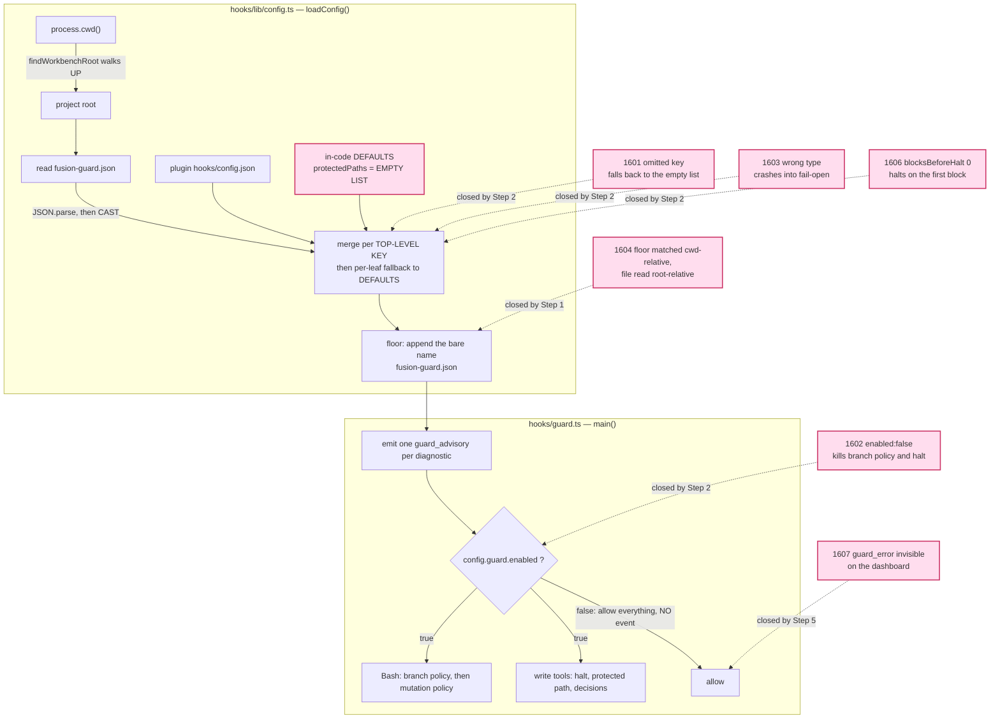
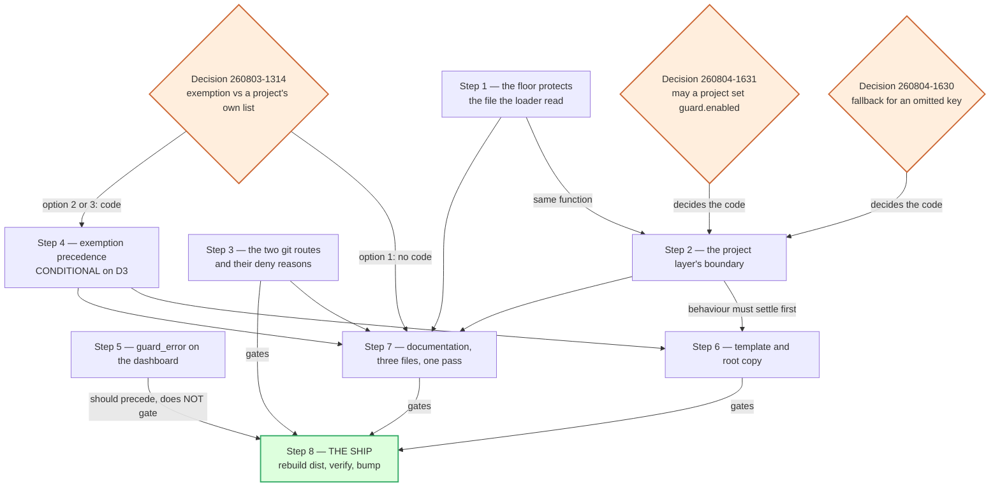

# Implementation Plan: close the C5b configuration boundary, close the two git routes, and ship

**Date:** 2026-08-04
**Status:** Draft — awaiting the plan gate. Two decisions must be answered before Step 2 can start.
**Circle:** `circles/260801-1244-guard-rules-write`
**Spec:** `shared/planning/260801-1122_o_spec-normative-consolidation.md`, `### C5: Guard changes`, criteria at `:322-332`. Status Final; nothing settled there is reopened here.
**Predecessor plan:** `circles/260801-1244-guard-rules-write/planning/260802-1856_o_plan-guard-rules-write.md`. Its Steps 1 to 8 are complete and are the record of what shipped. Its Steps 9 and 10 are superseded by this plan's Steps 7 and 8, which carry the same obligations plus everything the independent assessment added.
**Executors:** `coder` for seven steps, `ontocoder` for one (Step 6, two JSON files). No strategic-domain step, so `analyst` is not in the active set.
**Trigger:** `circles/260801-1244-guard-rules-write/analyses/260804-1600-c5b-independent-assessment.md`, whose verdict is that capability C5b must not ship in its current state.

---

## Directive

Take this Circle from where it is to shippable. Twenty-nine defects are open across it; twenty of them are in scope here and eight are deliberately deferred with their costs written down. One defect belongs to another Circle. The ship itself is Step 8: rebuild `hooks/dist/`, verify the whole integration suite against the compiled artifact, bump the plugin version. Nothing from thirteen sessions is live in any consuming project. `origin/main` is 48 commits behind `HEAD` at `53b3765`, measured.

Out of scope, stated so it is not drifted into: the shell reachability model, which became its own Circle at `circles/260804-1205-shell-reachability-model`; the curator agent; and any change to the exemption's own boundary beyond what decision `260803-1314` settles.

---

## Why the predecessor plan failed, and the rule that follows from it

The predecessor plan was wrong in three ways, and all three shipped. Its `ConfigSources` sketch would have made every unit case pass vacuously in the one repository where the loader is developed. Its Step 8 asked for a command that the self-protection floor from its own Step 6 denies, once per orchestrator session in every consuming project, forever. And its Q2 reasoned the merge rule through for `defaultSensitivity`, where both sources happen to carry `"medium"`, concluded that nothing observable changes, and never turned the rule around to the one key where the two sources differ. Turning it around is defect `260804-1601`, the finding that stopped the ship.

The three share a shape. Each reasoned about the mechanism and not about what a consuming project would do with it.

So every step below states, in its own words, what a consuming project could do to itself if the step lands as written. The statement is part of the step, not a courtesy. A step whose author cannot write that paragraph has not finished designing it.

Three further constraints are inherited from the Circle and hold for every step.

**No command may newly allow, and no path protected today may become unprotected.** Every Turn has held that line, and it is the only reason the boundary claims are worth anything.

**Costs are stated as rules with examples labelled an open set, never as closed lists.** Five enumerations have been falsified in this Circle. A sixth closed list is a defect the day it ships.

**Eleven of the twelve acceptance criteria describe behaviour in a consuming project, and the write guard stands down in this repository.** A criterion checked by editing a file here is not checked. The instrument that answers these is `hooks/lib/__tests__/helpers/guard-harness.ts`, which runs the real compiled guard as a fresh subprocess against a throwaway project root. Every verification block below names it or names a shell run outside this tree.

One mechanical note. `npm test` builds before it runs, and the build rewrites `hooks/dist/`, which Step 8 owns. Steps 1 to 7 use `npx vitest run`. Step 8 is the one step that runs `npm test`.

---

## Current State

### Where the eight new defects sit

The independent assessment measured C5b through the shipped harness and filed eight defects. Four of them meet at one place in the loader.



The intersection that matters is `MERGE` choosing an object, `DEF` supplying that object's missing leaves, and `DEF`'s value for `protectedPaths` being the empty list. Verified by reading `hooks/lib/config.ts:149` and `:277-292`, and reproduced by the assessment through sixty-two guard invocations.

### The two git routes, and what makes them one pass

Two High defects from the Turn 10 review fail open into the protected list. `git --namespace foo -C rules rm x.md` deletes a rule file and allows, because `resolveGit`'s option walk breaks on an unrecognised option's value and never reads the `-C` standing behind it. `git checkout HEAD~1 -- .` overwrites every tracked file in the project, protected ones included, and allows, because the ancestor check excludes the project root deliberately and `checkout` writes through its pathspec rather than writing the named entry.

The review recommends one pass for both, and the recommendation is sound rather than merely convenient. Both sit inside the eight lines `613d6fd` was working in, both are measured with the same instrument, and the fix for the second is a field on `VerbSpec` that two further defects (`260804-1346` and `260804-1348`) also want. Splitting them means touching `hooks/lib/bash-mutation-guard.ts` twice for one design.

### What the shipped documents say today

Verified at HEAD `53b3765` by grep rather than carried from an earlier reconciliation, whose line numbers have drifted.

| Claim | Location | State |
|---|---|---|
| "There is no override for a protected-path shell write" | `rules/protected-path-discipline.md:510` | False since `45f53d4` |
| "There is no env override for a protected-path shell write" | `README-hooks.md:211` | False since `45f53d4` |
| "no env override waives it" | `CLAUDE.md:48` | False since `45f53d4` |
| `FUSION_ALLOW_RULES_WRITE` named | `rules/protected-path-discipline.md:49`, `README-hooks.md:145` | Both arrived with the case-folding commit, not with a documentation task |
| `fusion-guard.json` described anywhere | none | `grep -rn fusion-guard README-hooks.md README.md CLAUDE.md rules/` returns nothing. Criterion `:332` is met nowhere |
| `guard.enabled: false` stands the whole guard down, branch check included | `README-hooks.md:141` | True, and it has been true since long before this Circle |

The last row deserves its own sentence, because the defect record for `260804-1602` does not draw it. The behaviour of `guard.enabled` is documented and unchanged. What C5b changed is who can write the key: a value only fusion's own protected file could set is now settable by any project, and by any agent in a project whose `fusion-guard.json` does not yet exist. Decision `260804-1631` is framed on that distinction.

---

## Approach

### One seam, three questions

Five of the six configuration defects are the same seam seen from different sides. The seam is what a project's `fusion-guard.json` contributes to the effective configuration, and it carries exactly three questions.

1. **Which keys may the project layer set at all?** Decision `260804-1631` answers it, and the key in dispute is `guard.enabled`.
2. **What does a key the project layer does not set fall back to?** Decision `260804-1630` answers it. The answer also decides question 3, which is why the two cannot be answered separately.
3. **What happens to a key whose value is the wrong type?** A validator drops it and names it in `diagnostics`. A dropped key then behaves exactly like an omitted key, which makes questions 2 and 3 one rule rather than two.

The unifying statement, if the decisions land the way the seam is shaped: *a key the project layer does not supply, or supplies unusably, is treated as absent, and absent means the plugin layer.* One rule, expressible from memory by an agent and by a project owner, closing five defects and the four latent instances filed as `260804-1633`.

The alternative shape, five per-key rules with five diagnostics, is the thicket this Circle has repeatedly found to be the wrong answer. It is named here so that the choice is visible rather than assumed.

### What is deliberately not redesigned

The merge rule stays. A project's declared value replaces the plugin's, which is what makes deliberate narrowing possible and is half of what decision D2 in the spec asked for. Neither decision touches it. The floor stays keyed on the file existing, which decision `260802-1912` settled and which Step 8 of the predecessor plan was reshaped around. The cache stays keyed on the resolved source pair.

### Work order



Steps 1, 3 and 5 depend on no decision and can start immediately. Step 2 is blocked until both `260804-1630` and `260804-1631` are answered, and it is the longest pole. Ordering Steps 1 and 3 first is not busywork: Step 3 is independent of the whole configuration question and closes two of the five High defects on its own.

---

## Implementation Steps

### Step 1 — The floor protects the file the loader actually read

- **Executor:** `coder`
- **Files:** `hooks/lib/config.ts`, `hooks/lib/__tests__/config.test.ts`, `hooks/lib/__tests__/guard-rules-write-integration.test.ts`
- **Dependencies:** none. Independent of both blocking decisions.
- **Closes:** `260804-1604`
- **Changes:** the floor appends the absolute path of the project configuration file alongside the bare `fusion-guard.json` pattern, computed from the same `projectRoot` the layer was read from (`hooks/lib/config.ts:256-265` and `:287-292`). One comment states why the floor is the only entry in the effective list carrying an absolute form: it is the only pattern whose subject has a location the loader already knows, where `rules/**` genuinely names a different directory from a different working directory.
- **What a consuming project could do to itself if this lands as written:** a project whose agents run from a subdirectory gets a floor that defends the file governing them, which is what the seeded template already promises them. The risk runs the other way. An absolute pattern is folded by `matchesAnyFolded` like every other, so on a case-insensitive volume the floor also matches a differently-cased spelling of the same path. A widened deny is the safe direction, and it is still a behaviour change that must be measured rather than assumed.
- **Verification:** the four rows of `260804-1604`'s measurement, run through the harness with the guard's working directory one level below the project root: `Edit ../fusion-guard.json`, `Edit <abs>/fusion-guard.json`, `rm ../fusion-guard.json`, and `cd .. && rm fusion-guard.json`. All four deny. The control that proves the project layer was loaded at all, `Edit secret/a` denying under `{"guard":{"protectedPaths":["secret/**"]}}`, still passes. The existing floor cases at the project root still pass. `npx vitest run`, not `npm test`.
- **What would falsify it:** `Edit ../fusion-guard.json` still allows. Or the `/fusion:setup` Step 0f probe starts denying, which would mean the floor now applies before the file exists and decision `260802-1912` has been reversed by accident. Extract that block and run it twice against a scratch directory as part of this step, because the block was reshaped around the floor and is the fastest signal that the floor moved.

### Step 2 — The project layer's boundary: what it may say, what an absence means, what nonsense costs

- **Executor:** `coder`
- **Files:** `hooks/lib/config.ts`, `hooks/guard.ts` (only if decision `260804-1631` chooses option 2), `hooks/lib/paths.ts` (one docstring sentence), `hooks/lib/__tests__/config.test.ts`, `hooks/lib/__tests__/guard-rules-write-integration.test.ts`
- **Dependencies:** decisions `260804-1630` and `260804-1631`, both of which must be answered before the step starts. Step 1 need not precede it, but the two edit the same function and land more cheaply in order.
- **Closes:** `260804-1601`, `260804-1602`, `260804-1603`, `260804-1606`, `260804-1633`, and item 1 of `260804-1432`. Item 2 of `260804-1432` becomes decision `260804-1632` and is deferred.
- **Changes:** one seam, three questions, per `## Approach`.
  - **Which keys the project layer may set.** Implements the answer to `260804-1631`. Option 1 of that record is one condition in the merge plus a diagnostic; option 2 moves the short-circuit at `hooks/guard.ts:652` below the branch step in `guardBashCommand` and must not leave an active halt bypassable.
  - **What an absent key falls back to.** Implements the answer to `260804-1630`. Option 1 of that record makes the leaf fallback walk project, then plugin, then `DEFAULTS`, which closes the four latent instances in `260804-1633` with the same change.
  - **What an unusable value costs.** A validator at the point of the cast (`hooks/lib/config.ts:240`) types `guard.protectedPaths` as an array of strings, the values of `guard.categoryPaths` the same way, `decisions` as its own shape, and `escalation.blocksBeforeHalt` as a positive integer. A key that fails validation is dropped and named in `diagnostics`. The plugin layer runs through the same validator: it is protected, so the risk is smaller, and `260802-2334_c_` is the standing proof that "this file is protected" was not enough once already in this Circle.
  - `hooks/lib/paths.ts`'s `matchesAny` docstring says "no per-project config loader exists yet". Step 6 of the predecessor plan is that loader. The sentence is deleted and replaced by a pointer to decision `260804-1632`.
- **Two constraints the implementation must not break.** The validator accepts unknown keys, including the six underscore-prefixed documentation keys the template carries, or Step 6's template stops parsing into an inheriting configuration and the seeding shipped in `7f3d789` becomes a no-op. And `null` keeps meaning "nothing configured", which `readLayer` has always accepted silently.
- **What a consuming project could do to itself if this lands as written:** a project can still turn its own protection off deliberately, by declaring `"protectedPaths": []`. That residual is the one decision `260802-1912` accepted, and the git diff is what bounds it. What a project can no longer do is turn its protection off by omission, by typo, or by a wrong type. The direction to watch during implementation is the one that produces a quieter version of the same defect: a validator that drops a key while the fallback still points at `DEFAULTS` converts a crash into a silent empty list carrying one diagnostic. The step is only finished when a dropped key and an omitted key are demonstrably the same thing.
- **Verification:** every row of the measurement tables in `260804-1601`, `260804-1602`, `260804-1603` and `260804-1606`, added as pinning cases to `describe("what a project configuration can currently reach — measured, not endorsed")` in `guard-rules-write-integration.test.ts`, with that block's title corrected once its contents are no longer only what the configuration can reach. Every row is asserted through a real guard subprocess against a throwaway project root. A loader returning a good list proves nothing about what the guard denies, which is the vacuity trap the harness exists to close. `npx vitest run`, not `npm test`.
- **What would falsify it:** `{"guard":{"enabled":true}}` still allows `Edit agents/coder.md`. `{"guard":{"protectedPaths":"rules/**"}}` still emits `guard_allow` with no diagnostic. `{"guard":{"protectedPaths":123}}` still reaches the fail-open branch. `{"escalation":{"blocksBeforeHalt":0}}` still halts on the first block. And the anti-vacuity check: revert the fallback to `DEFAULTS` in a throwaway mutation, and at least one integration row must fail. If none does, the new cases are measuring the loader's return value rather than the guard's verdict, and they are worthless.

### Step 3 — The two git routes into the protected list, and the deny reasons around them

- **Executor:** `coder`
- **Files:** `hooks/lib/bash-mutation-guard.ts`, `hooks/lib/__tests__/bash-mutation-guard.test.ts`, `hooks/lib/__tests__/guard-bash-integration.test.ts`
- **Dependencies:** none. Independent of the configuration work and of every decision.
- **Closes:** `260804-1344`, `260804-1345`, `260804-1347`, `260804-1348`, and the code half of `260804-1346`.
- **Changes:** one design with three consequences.
  - **Resume the option walk instead of widening the candidate list.** When `resolveGit`'s walk breaks on a non-flag word (`hooks/lib/bash-mutation-guard.ts:1312`) and `unknownOption` is set, treat that word as the option's consumed value and continue the loop from the next index, recording `-C` and `--work-tree` as it goes. Try the subcommand candidates afterwards, as today. The property `613d6fd` rests on survives: a resumed walk can only find more directories, so a directory fact can only add a candidate resolution and therefore only add a deny.
  - **A `writesThrough` field on `VerbSpec`**, consulted by the ancestor pass, for the rows that write every path beneath their pathspec rather than the named entry: `git checkout <treeish> --`, `git restore --source=`, and `git clean -f`. For those rows, and only those, the project-root exclusion at `:1562` does not apply. The exclusion stays for `cp`, `mv`, `rm` and `ln`, which write the named entry, and `cp x .` together with `mv build/out.js .` are why it exists.
  - **The two spellings of the revert strategy reconciled in the same pass** (`260804-1348`). `checkout` and `restore` are one operation with two flag grammars, and the pass that adds a field to both rows is the pass that can make them agree.
  - **The fail-closed deny reason corrected** (`260804-1347`). A git-directory fail-closed deny names the git directory flag it could not resolve, rather than telling the agent to drop a `cd` that the command does not contain. The rule file's central claim is that an agent never meets an unexplained deny, and a deny reason that names the wrong cause is the shortest route to an agent routing around the guard.
- **The cost, stated as a rule.** A `writesThrough` verb whose pathspec resolves to the project root denies. The examples known today are `git checkout <treeish> -- .`, `git checkout <treeish> -- ./`, `git restore --source=<treeish> .`, `git clean -fdx`, and `git clean -fdx .`. That set is open, and the rule is what to reason from. The way through is the literal file list, or the Human Gate. `git checkout HEAD -- .` stays allowed, because `HEAD` writes nothing an agent could not have obtained by leaving the file alone.
- **What a consuming project could do to itself if this lands as written:** nothing new is permitted. Two routes that today delete a rule file and overwrite the whole protected list stop working. What a project loses is `git clean -fdx` at its own root, which is an ordinary command in ordinary use, and the loss is the point: the same command deletes a rule file an agent has just written under `FUSION_ALLOW_RULES_WRITE` and not yet committed, which is the workflow this Circle exists to enable. The failure to avoid is a deny whose reason does not name the alternative. An agent that meets one reaches for a program outside the verb table, and the guard does not see that at all.
- **Verification:** every measured row in `260804-1344`, `260804-1345` and `260804-1346` as denies, with the real-shell effect asserted in bash and zsh, plus every allow-side control those records name: `git --namespace foo -C build rm out.js`, `git --namespace foo -C rules status`, `git --literal-pathspecs -C rules rm x.md`, `git checkout HEAD -- .` asserted UNCHANGED, `git checkout HEAD~1 -- build`, `git restore --source=HEAD~1 build`, `cp x .`, `mv build/out.js .`, `git clean -fdx build`, and `git -C build clean -fdx`. `npx vitest run`.
- **What would falsify it:** any of the seven measured rows still allows. Or an allow-side control flips to deny, which means the fix is a blanket give-up on invocations carrying an unrecognised option rather than a resumed walk. Anti-vacuity, in the shape the two records already specify: a mutation dropping `writesThrough` from the `checkout` row must fail the `checkout HEAD~1 -- .` row and no other, and a mutation removing the root exclusion outright must fail the `cp x .` row.

### Step 4 — The exemption's precedence against a project's own protected entries [conditional]

- **Executor:** `coder`
- **Files:** `hooks/lib/rules-write-exemption.ts`, `hooks/guard.ts`, `hooks/lib/__tests__/rules-write-exemption.test.ts`, `hooks/lib/__tests__/guard-rules-write-integration.test.ts`
- **Dependencies:** decision `260803-1314`, and Step 2, where the effective list is assembled.
- **Closes:** decision `260803-1314`, by realising it.
- **This step exists only if the answer is option 2 or option 3.** If the answer is option 1, that the exempt set stays the two well-known rule directories and no project can change it, then no code moves and the whole obligation is one paragraph in Step 7. The predecessor plan's Step 6 already pinned today's behaviour with a case labelled `MEASURES:` that disclaims endorsement and cites the record, so the case fails the day the decision lands, deliberately.
- **Changes, per option.** Option 2 subtracts the project's own explicitly declared protected entries from the exempt set at the seam where the exemption is consulted, which is the only place a precedence rule can be expressed given the exemption is asked only about paths the protected list already matched. Option 3 makes the rule roots configurable alongside `protectedPaths`.
- **What a consuming project could do to itself, per option:** under option 2 a project can make a subtree of its own `rules/` immutable against the flag, and a curator meeting that deny needs a reason naming the project's own entry, or the deny reads as the flag being broken. Under option 3 a project can widen its own grant by editing a file the guard reads, which is the direction the self-protection floor exists to prevent, so taking option 3 means the floor's argument has to be made again rather than inherited.
- **Verification:** the two consequences the decision record names, measured through the harness. Under option 1 the verification is a grep: `RULE_DIR_PATTERNS` unchanged at `["rules/**", ".claude/rules/**"]`, and the sentence stating the choice present in both shipped documents.
- **What would falsify it:** under option 2, a project entry that the exemption still overrides. Under option 1, an implementation that quietly did something anyway.

### Step 5 — `guard_error` reaches the dashboard

- **Executor:** `coder`
- **Files:** `bin/monitor`
- **Dependencies:** none.
- **Closes:** `260804-1607`
- **Does not gate the ship, and the reason is worth stating.** Once Step 2 lands, the project-triggerable fail-open is closed, and `guard_error` returns to the pre-existing rarity it had before C5b. A ship without this step leaves an old invisibility in place. It does not ship a false claim, which is the line the other steps are held to.
- **Changes:** `guard_error` joins `WARNING_EVENT_TYPES` at `bin/monitor:91-102`, not `ADVISORY_EVENT_TYPES`. Advisories share a small separate budget because they arrive in bursts during a curation session; an error is rare and each one is individually worth reading, which is what the warning budget is for. Confirm that the level mapping in `renderWarnings()` gives it at least the weight of a block.
- **What a consuming project could do to itself if this lands as written:** nothing. The risk is the inverse one. An error rendered at the default advisory weight reads as routine, the user stops looking, and the event that means "the guard is not running" becomes another row to dismiss.
- **Verification:** run `bin/monitor` against a workbench whose `.guard-state/events.jsonl` carries one hand-written `guard_error` line, confirm the row appears in the warnings panel at block weight or above, then remove the line. Reading the set membership is not the check. `260804-1607` labels its own conclusion as inference from set membership rather than a rendered result, and repeating the inference verifies nothing.
- **What would falsify it:** the row renders and is indistinguishable from an advisory.

### Step 6 — The template and the repository's own copy

- **Executor:** `ontocoder`
- **Files:** `templates/fusion-guard.json`, `fusion-guard.json`
- **Dependencies:** Steps 1, 2 and 4. The step must not start before them.
- **Closes:** `260804-1605`
- **Why the ordering is a constraint rather than a preference:** the file documents a boundary that is about to move, and writing it early is the mistake the predecessor plan's Step 9 already made once in this Circle, recorded in the 260804-1021 reconciliation entry.
- **Changes:** re-read all six underscore-prefixed keys against the behaviour the tests then assert. `_protectsItself` and `_inFusionsOwnSourceTree` are corrected against whatever decision `260804-1631` and Step 1 settled. `_override` gains the missing clause regardless of how anything else is answered, because a reader who understands the current sentence perfectly still does not learn that fusion's built-in default for the protected list is the empty list. The root copy changes in the same commit: `config.test.ts` asserts the two files are byte-identical, so they cannot drift apart silently.
- **What a consuming project could do to itself if this lands as written:** every sentence in the template is copied verbatim by `/fusion:setup` into every project it touches, so a sentence that overstates propagates by design. The specific failure to avoid is a project owner who reads `_protectsItself`, believes the configuration is defended, and stops checking. A guard that reports normal operation while protecting nothing is worse than no guard, and a template that reports protection the loader does not provide is the same failure one layer up.
- **Verification:** `node -e "JSON.parse(require('fs').readFileSync('templates/fusion-guard.json','utf8'))"` on both files; the byte-identity unit case; the unit case asserting that the untouched template merges to a configuration identical to the plugin's; and one reading pass in which each of the six keys is checked against a named test rather than against the code.
- **What would falsify it:** any sentence in the file that no test asserts. A claim in a seeded file with no case behind it is exactly how `260804-1605` came to be filed, and the author of that claim had verified it against the code that existed at the time.

### Step 7 — The documentation, three files, one pass

- **Executor:** `coder`
- **Files:** `rules/protected-path-discipline.md`, `README-hooks.md`, `CLAUDE.md`
- **Dependencies:** Steps 1, 2, 3, 4 and 5. Every behaviour the step describes has to have settled first.
- **Closes:** `260803-1402`, `260804-1025`, `260804-1220`, `260804-1223`, `260804-1349`, `260804-1427`, and the documentation half of `260804-1346`.
- **Why one step and not three.** The three files carry the same sentences and have drifted apart twice. Splitting them is what produced the current state, in which `rules/protected-path-discipline.md` names `FUSION_ALLOW_RULES_WRITE` at line 49 and denies that any override exists at line 510. They move together, or the self-contradiction recurs.
- **The eleven obligations, enumerated so the step can be checked rather than judged:**
  1. The `FUSION_ALLOW_RULES_WRITE` row in `README-hooks.md`'s tuning table, beside `FUSION_ALLOW_BRANCH_SWITCH`.
  2. The three "no override" sentences corrected, at `rules/protected-path-discipline.md:510`, `README-hooks.md:211` and `CLAUDE.md:48`, verified at HEAD `53b3765`. Earlier reconciliations cite `:421`, `:199` and `:113`; those numbers are stale and the greps in the verification block are what to trust.
  3. The hard-linked rule file is not exempt, and why (`260803-1402`).
  4. `fusion-guard.json` described for a user in `README-hooks.md` and named in `CLAUDE.md`'s layout table: what it is, where it lives, that it is git-tracked and why, what the merge does, what the floor covers, and what fusion's built-in default for the protected list is. Half of criterion `:332`.
  5. The release-checklist line in `CLAUDE.md`: before tagging, confirm the guard's behaviour was verified against a project root that is not the plugin repository, because the stand-down makes local testing unrepresentative by construction. The other half of criterion `:332`.
  6. `260804-1025` with `260804-1223`'s corrected evidence. The clause "the model stays exact" is deleted or scoped. Close both records together; `260804-1223` is `260804-1025`'s evidence, not a second defect.
  7. `260804-1220`: the illustration block points at three questions in a procedure that now has four.
  8. `260804-1349`: the cost rule's first question is false as written, and the section heading promises predictiveness the questions do not deliver.
  9. `260804-1346`'s documentation half. The residual entry is restored and narrowed, with the explicit `git clean -fdx .` spelling named, or deleted for the right reason if Step 3's code half closed it. State which, and do not leave the reader to infer it.
  10. `260804-1427`: the floor residual described at its measured reach, which includes `fusion-workbench/.guard-state/**` and therefore the escalation machinery, rather than at the narrower reach the decision record states. The record's own instruction is one or the other, not both and not neither; the documentation leg is the one this plan takes, because widening the floor is a second security-policy choice and the spec authorises exactly one floor entry.
  11. The residual list updated for everything Step 3 changed and for everything it deliberately did not. `GIT_WORK_TREE=` in the environment (`260804-1332`) stays a residual, and its entry must survive this rewrite. Deleting a residual entry rather than narrowing it is exactly what `260804-1346` was filed about.
- **Every cost statement in these files is a rule with examples labelled an open set.** Five enumerations have been falsified in this Circle. A closed list is a defect the day it ships.
- **What a consuming project could do to itself if this lands as written:** `rules/protected-path-discipline.md` is loaded into every agent's context on every dispatch in every consuming project. A wrong sentence there is a wrong action taken by every agent, and the sentence that costs most is one that says a command is safe when it is not. The agent that reaches for the decision procedure is by definition the one that has not read to the end of the file, so a disclaimer 400 lines later repairs nothing.
- **Verification:** `cd hooks && npx vitest run`, with `provenance-header-lint`, `path-literal-lint`, `marker-format-lint` and `glob-nomatch-lint` all running over `rules/` and staying green. Then a grep pass with stated expectations: `grep -rn "no override\|no env override" README-hooks.md rules/ CLAUDE.md` returns nothing that denies the flag exists; `grep -rn fusion-guard README-hooks.md CLAUDE.md rules/` returns hits in all three files; `grep -n "the model stays exact" rules/protected-path-discipline.md` returns nothing, or returns a form scoped to the cases where it is true. Then a reading pass in which each sentence stating a boundary is checked against the test that asserts it.
- **What would falsify it:** any sentence in the three files that contradicts another sentence in the same three files. The mechanical form of that check is to read the three files' claims about overrides, about the floor, and about what a `git` invocation can reach, side by side rather than one file at a time.

### Step 8 — The ship

- **Executor:** `coder`
- **Files:** `hooks/dist/**`, `.claude-plugin/plugin.json`
- **Dependencies:** Steps 1, 2, 3, 4, 6 and 7 gate it. Step 5 should precede it and does not gate it.
- **Closes:** nothing directly. It is what makes the previous seven steps true of the artifact that runs.
- **Changes:** `npm run build` in `hooks/`, commit the rebuilt `dist`, bump the version in `.claude-plugin/plugin.json`. `hooks/hooks.json` executes `dist/guard.js`, so an unrebuilt `dist` ships a guard without any of this while every test passes against the TypeScript source.
- **What a consuming project could do to itself if this lands as written:** the step is where a consuming project gets any of it at all. Until it runs, `origin/main` is 48 commits behind and no project has the Bash mutation check, the exemption flag, the loader, or any fix above. The failure mode to watch is a stale `dist`, in which the suite is green and the shipped guard is the old one, which is the exact shape of the risk the predecessor plan named and did not reach.
- **Verification:** `cd hooks && FUSION_GUARD_ENTRY=dist npm test`, running the whole integration suite against the compiled guard that the hook actually executes. Then walk the twelve criteria at `shared/planning/260801-1122_o_spec-normative-consolidation.md:322-332` and record the evidence for each, criterion `:332` included, which is the one Step 7 makes reachable. The spec's checkboxes are not edited by a coder step; the reconciler walks them at Phase 3.
- **What would falsify it:** `FUSION_GUARD_ENTRY=dist` and `npx vitest run` disagreeing on any row, which means `dist/` was built from a different tree than the one under test. Or the build touching files this plan does not name.

---

## Data Structures

Two additions, no removals.

```ts
// hooks/lib/config.ts — new
/** Drops a key that cannot be used and names it, so a dropped key
 *  is indistinguishable from an omitted one. Shape decided by
 *  decision 260804-1630; applied to BOTH layers. */
function validateLayer(raw: unknown, source: string): {
  raw: RawConfig;
  diagnostics: string[];
};

// hooks/lib/bash-mutation-guard.ts — VerbSpec gains one field
export interface VerbSpec {
  /* …existing fields… */
  /** The verb writes every path BENEATH its pathspec, not the named
   *  entry. Set on `git checkout <treeish> --`, `git restore --source=`
   *  and `git clean -f`. Pass 2 skips the project-root exclusion for
   *  these rows and only these. */
  writesThrough?: boolean;
}
```

Whether `loadConfig` gains a per-key policy for `guard.enabled`, and whether the leaf fallback walks two layers or three, is decided by `260804-1631` and `260804-1630` respectively. Neither changes an exported signature.

## API Changes

None. `validateLayer` is module-private, `VerbSpec.writesThrough` is additive and optional, and no exported signature moves.

## Testing Strategy

Three layers, unchanged in shape from the predecessor plan, with one addition.

**Pure unit tests** carry the matrices: the validator's accept and reject sets, the merge's fallback across layers, and `writesThrough` in the classifier. They import directly and touch no filesystem beyond a temporary directory.

**Integration tests through the spawned hook** carry what a verdict cannot show: that a classifier decision reaches a real `{"decision":"block"}`, that the escalation counter and the event log move exactly when they should, and that a configuration file at a project root changes what the guard denies. Every case is a fresh subprocess against a temporary project root that is not a plugin root.

**Real-shell effect assertions** for every git row in Step 3, in bash 3.2 and zsh 5.9 against a fresh repository, because a verdict that matches the shell's behaviour by coincidence is the failure the Turn 10 review found twice.

**One artifact run** at Step 8, against the compiled guard.

The addition is an anti-vacuity obligation on Steps 2 and 3. Each names a mutation that must break a specific case. A suite that survives its own mutation is measuring the wrong thing, and both steps carry the mutation to apply.

What none of the four layers reaches, stated as before: Claude Code's own hook dispatch, and `/fusion:setup` running as an agent. Both are covered by hand, and Step 1's verification runs the seeding block twice rather than reasoning about it.

## Risks & Mitigations

| Risk | Mitigation |
|---|---|
| Step 2 waits on two user decisions and becomes the whole critical path | Steps 1, 3 and 5 depend on no decision and close two of the five High defects on their own. The decision records state what not answering ships, so the cost of delay is visible rather than implied |
| Type validation lands while the fallback still points at `DEFAULTS`, turning a crash into a silent empty list | Named in Step 2 as the direction to watch, and pinned by the anti-vacuity mutation that step carries. The two questions are answered in one decision record for this reason |
| The `writesThrough` field denies `git clean -fdx` at the project root, an ordinary command, and agents route around it through a program outside the verb table | The cost is stated as a rule with an open example set, and `260804-1347`'s deny-reason correction is in the same step so the deny names its own cause |
| Step 7 writes user-facing text against a boundary that then moves, for the third time in this Circle | Step 7 depends on every behavioural step. Step 6 depends on Steps 1, 2 and 4 for the same reason and is ordered after them explicitly |
| Verification runs in this repository, where the write guard stands down, and every assertion passes vacuously | Every verification block names the harness or a shell run outside this tree. The harness asserts its own preconditions, including that a case against a non-plugin root actually denies |
| `hooks/dist/` is rebuilt by an intermediate `npm test` and lands in a commit that does not own it | Steps 1 to 7 use `npx vitest run`. Step 8 owns the build and is the only step that runs `npm test` |
| Eight deferred defects are read later as "not found" rather than "not taken" | `## What this plan does not close` names each one, its cost, and where it goes |
| The plan is wrong in a way only visible from a consuming project, which is how the predecessor plan was wrong three times | Every step carries a paragraph on what a consuming project could do to itself. A step without that paragraph is not finished |

---

## What this plan closes

Twenty of the twenty-eight defects open in this Circle. One further defect, `260804-0839`, moved to `circles/260804-1205-shell-reachability-model` and is not this plan's.

| Step | Closes |
|---|---|
| Already closed by this planning session | `260804-1608` (the predecessor plan's Step 7 marker and header, corrected in place) |
| Step 1 | `260804-1604` |
| Step 2 | `260804-1601`, `260804-1602`, `260804-1603`, `260804-1606`, `260804-1633`, and item 1 of `260804-1432` |
| Step 3 | `260804-1344`, `260804-1345`, `260804-1347`, `260804-1348`, code half of `260804-1346` |
| Step 4 | decision `260803-1314`, realised (conditional on its answer) |
| Step 5 | `260804-1607` |
| Step 6 | `260804-1605` |
| Step 7 | `260803-1402`, `260804-1025`, `260804-1220`, `260804-1223`, `260804-1349`, `260804-1427`, documentation half of `260804-1346` |

## What this plan does not close, and what deferring each one costs

Eight defects are deliberately left open. Each is named with its cost, because a deferral whose price is not written down is indistinguishable from an oversight.

| Defect | Severity | Cost of deferring | Where it goes |
|---|---|---|---|
| `260804-1332` — `GIT_WORK_TREE=` in the environment relocates the write | High | `GIT_WORK_TREE=rules git clean -fdx` deletes a rule file and allows, in both spellings, measured. The cost is bounded by the residual already being on both shipped lists, and Step 7 obligation 11 requires that entry to survive the rewrite. Closing it needs a decision on which environment variables the classifier reads at all, which is a boundary question the shell-reachability Circle owns | `circles/260804-1205-shell-reachability-model` |
| `260804-1221` — one joiner fact asserted over one file while a second file holds the same fact | Medium | A joiner fact can drift between the two files without any test noticing. Confined to the directory model, which moved out of this Circle | `circles/260804-1205-shell-reachability-model` |
| `260803-1352` — two advisory details skip the 200-character clamp | Low | One long advisory occupies nine ordinary rows and can push blocks below the fold on a laptop viewport. Cosmetic, and it cannot evict anything now that the two event classes have separate budgets | This Circle, after the ship, or a later one |
| `260804-0842` — the git gold fixture has no `\|\|`, `\|` or `&` joiner and no allow-only row | Low | A joiner-shaped regression in the git branch classifier would not be caught by the fixture built to pin joiner behaviour. The classifier itself was independently verified unchanged over 25,845 commands, so the gap is in future coverage rather than in present correctness | `circles/260804-1205-shell-reachability-model` |
| `260804-1027` — the replacement audit recipe went stale and omits `moved` | Low | The next editor of `unmodelled` reads a recipe that misses a field | `circles/260804-1205-shell-reachability-model` |
| `260804-1222` — the `SegmentJoiner` docstring cites a filename that no longer exists | Low | A reader following the citation finds nothing. The same class as `shared/issues/260802-1740`, a citation carrying a state marker | `circles/260804-1205-shell-reachability-model` |
| `260804-1350` — the `DirStack` docstring claims a compiler-enforced invariant | Low | A future editor trusts the type system to enforce a depth invariant it does not enforce | `circles/260804-1205-shell-reachability-model` |
| `260804-1351` — `DIR_BUILTINS` carries a shell-dependent fact justified by the wrong reason | Low | The comment's reasoning does not survive a shell that behaves differently, and the fact happens to be right | `circles/260804-1205-shell-reachability-model` |

Six of the eight sit inside the directory model that became its own Circle, which is why they cluster. None of them is a fail-open into the protected list, and none of them is a claim in a document a consuming project reads. Those two properties are the line this plan draws between "in scope for the ship" and "not".

---

## Decisions the user must answer

Four decision records are open and each one bears on this plan. Two block code, and two do not.

**Blocking. Step 2 cannot start until both are answered.**

- `decisions/260804-1630_o_what-does-a-project-guard-object-inherit-for-a-key-it-does-not-supply.md`. Not answering ships option 3, documenting the current behaviour, without option 3's documentation. The current behaviour is that `{"guard":{"enabled":true}}` removes all nine protected patterns silently.
- `decisions/260804-1631_o_may-a-project-file-set-guard-enabled-and-switch-the-whole-guard-off.md`. Not answering ships option 3, keeping the key settable, with a seeded template that asserts the opposite of the measured behaviour.

**Ship-gating but not code-blocking. Answer them so the shipped documentation states a chosen boundary rather than a default nobody picked.**

- `decisions/260803-1314_o_may-a-project-protect-a-path-inside-its-own-rule-directory-against-the-rules-write-flag.md`. Step 6 of the predecessor plan turned the question from hypothetical into shipped default behaviour. Option 1 needs no code and one paragraph in Step 7. Options 2 and 3 add Step 4.
- `decisions/260803-1402_o_should-the-mutation-classifier-inspect-a-read-operand-to-close-the-planted-alias.md`. Not answering ships option 1, which is also the record's own recommendation, so the default here is a chosen position rather than an accident. Step 7 documents whichever way it goes.

One further decision is filed and deliberately deferred: `decisions/260804-1632_o_should-findrelevantdecisions-fold-case-now-that-a-project-can-configure-categorypaths.md`. It does not gate the ship. Step 2 corrects the false reachability sentence in `hooks/lib/paths.ts` regardless of how it is eventually answered.

## Open Questions

- [ ] Does Step 5, the `guard_error` dashboard row, belong before the ship or after it? The plan orders it before and does not gate on it. The argument for gating is that a fail-open guard is invisible today for reasons unrelated to C5b; the argument against is that Step 2 removes the only project-triggerable route to that state.
- [ ] Should the eight deferred defects be re-checked at the plan gate against a fresh reading, or accepted as this plan assesses them? Six of the eight sit in a Circle that has not started, so their cost is a forecast about work not yet scheduled.
