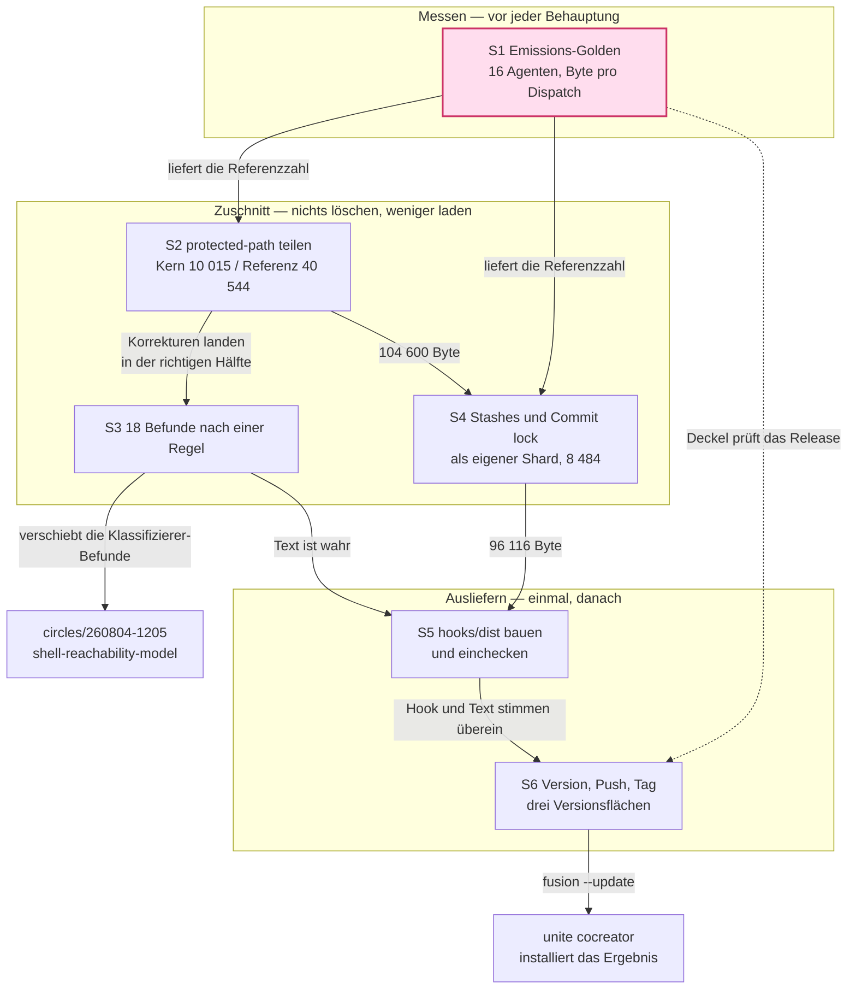

# Ausstiegsplan: Kontextsteuer senken, ausliefern, den Guard abschließen

**Datum:** 2026-08-04
**Status:** Entwurf
**Circle:** `circles/260801-1244-guard-rules-write`
**Spec:** `shared/planning/260801-1122_o_spec-normative-consolidation.md`, C9 Schritt 3 und 4
**Executors:** coder, ontocoder (Default; `analyst` nicht gesetzt)

---

## Directive

Der Circle liefert aus, was er gebaut hat, gibt die Kontextsteuer zurück, die er dabei aufgenommen hat, und schließt seine offenen Befunde nach einer Regel statt nach einer Liste. Der Shell-Klassifizierer wird nicht fortgesetzt; er hat mit `circles/260804-1205-shell-reachability-model` eine eigene Heimat.

Zwei Zahlen tragen den Plan. Jeder Agent lädt heute bei jedem Dispatch **145 144 Byte** Regeltext, gemessen an HEAD. Vor diesem Circle waren es **87 387 Byte**, gemessen am Commit `8c1c9f8` vom 2026-07-31. Der Circle, dessen Elternziel die Senkung dieser Steuer ist, hat sie um zwei Drittel erhöht.

---

## Ausgangslage, gemessen

### Die Kontextsteuer und ihr Verlauf

`bin/fusion-rules` emittiert für jeden Agenten sieben Dateien aus einer festen Liste (`emit_if_exists`, Zeilen 269 bis 275). Ihre Summe:

| Stand | Commit | Byte |
|---|---|---|
| Spec-Baseline, 2026-07-31 | `8c1c9f8` | 87 387 |
| `origin/main` (was ein konsumierendes Projekt heute installiert) | `9ab5a2a` | 105 354 |
| HEAD, 2026-08-04 | `cac3726` | 145 144 |

Die Verteilung an HEAD:

| Datei | Byte | Anteil |
|---|---|---|
| `rules/fusion-workbench-conventions.md` | 59 303 | 40,9 % |
| `rules/protected-path-discipline.md` | 50 559 | 34,8 % |
| `rules/user-facing-output.md` | 16 683 | 11,5 % |
| `rules/git-branch-discipline.md` | 6 299 | 4,3 % |
| `rules/critical-stance.md` | 5 317 | 3,7 % |
| `rules/decision-record-examples.md` | 4 191 | 2,9 % |
| `rules/agent-setup.md` | 2 792 | 1,9 % |

`protected-path-discipline.md` existierte am 2026-07-31 nicht. Ihre erste Fassung (`3806a49`) hatte 11 032 Byte, am 2026-08-02 waren es 16 100 (`929dbf5`), an HEAD sind es 50 559. Sechzehn Commits in vier Tagen.

### Was nicht ausgeliefert ist

`origin/main` liegt 57 Commits zurück, verteilt auf drei Tage (17 am 02., 16 am 03., 24 am 04.). Die Versionsnummer steht an HEAD und auf `origin/main` gleichermaßen auf `5.8.0`: für 57 Commits wurde kein einziges Mal angehoben.

Schwerwiegender: **`hooks/dist` war im Git-Index veraltet.** Beim Verifizieren dieses Plans lief `npm test`, dessen Skript `tsc && vitest run` lautet, also den Build mit ausführt. Das Ergebnis im Arbeitsverzeichnis: 17 geänderte Dateien, 3 874 eingefügte und 325 gelöschte Zeilen, dazu zwei bislang nicht kompilierte Module (`lib/project-relative.js`, `lib/project-relative.d.ts`). Ein Push ohne diesen Rebuild hätte Regeltext ausgeliefert, der Verhalten beschreibt, das der kompilierte Hook nicht hat. Die Testsuite selbst ist grün: 1 537 Tests in 26 Dateien.

### Der Befund, der den Plan bestimmt

**Der Manifest-Mechanismus kann nicht, was ihm im Auftrag zugeschrieben wird.** Geprüft an `bin/fusion-rules`, zwei unabhängige Gründe:

1. **Er ist rein additiv.** Die sieben Always-on-Dateien gehen durch `emit_if_exists` in Abschnitt 1, unbedingt. Der Manifest-Block ist Abschnitt 3 und hängt daran, dass die Datei existiert; sein awk sammelt Treffer und druckt sie in `END` zusätzlich (`bin/fusion-rules:432`). Kein Unit unterdrückt eine Emission. Ein Manifest kann einem Agenten einen Shard geben, nicht wegnehmen.
2. **Er erreicht keine Plugin-Datei.** Das Manifest liegt fest bei `./rules/context-manifest.yaml` im konsumierenden Projekt (`rules/context-manifest.md` `## Where the manifest lives (locked)`). Sein awk gibt `cur_val` unverändert aus (`bin/fusion-rules:360`), ohne `$FUSION_PLUGIN_ROOT` aufzulösen. Ein Projekt-Manifest kann eine Plugin-Regel nicht portabel benennen.

Die Spec sagt beides bereits, verifiziert am 2026-08-01, in C9 Schritt 4 Zeilen 509 bis 514 und im Constraints-Block Zeile 613. Unsere Prüfung bestätigt die Spec, nicht den Auftrag.

**Der Hebel, der wirkt**, steht ebenfalls schon dort: die `case "$AGENT"`-Mustertabelle in `bin/fusion-rules` zusammen mit `emit_pattern_in_dir`. Eine Datei aus der `emit_if_exists`-Liste nehmen und so benennen, dass sie das Muster der Agenten trifft, die sie behalten, ist eine Zeile Tabelle und eine Zeile Emission.

### Was der Zuschnitt hergibt, aus der Struktur abgeleitet

`protected-path-discipline.md` zerfällt sauber an ihren eigenen Überschriften:

| Teil | Byte | Ziel |
|---|---|---|
| Lede | 853 | Kern |
| `## The rule` (Kopf, Regelsatz und Pfadliste) | 817 | Kern |
| `### The match is textual, and case-insensitive` | 1 344 | Kern |
| `### An ancestor directory is covered, in both directions` | 711 | Kern |
| `### A cd is tracked` | 1 343 | Kern |
| `### The overrides waive only what they name` | 535 | Kern |
| `## What stays allowed` | 1 596 | Kern |
| `## What to do instead` | 1 261 | Kern |
| `### What a halt costs you` | 1 555 | Kern |
| `### The verb families` | 5 109 | Referenz |
| `### git carries its own working directory` | 2 976 | Referenz |
| `### Clustered short flags are read letter by letter` | 1 087 | Referenz |
| `### The command word is resolved, not just read` | 966 | Referenz |
| `### The rule, so you can predict a case this file does not list` | 3 173 | Referenz |
| `### Illustrations, not a list` | 10 679 | Referenz |
| `### Fail-closed, and its bound` | 3 709 | Referenz |
| `## Where this check does not reach` | 12 845 | Referenz |

Kern 10 015, Referenz 40 544, Summe 50 559. Der Schnitt folgt dem Zweck, den die Datei sich selbst gibt (Zeilen 15 bis 17): der Agent soll dem Deny nicht begegnen. Dafür braucht er den Regelsatz, die Pfadliste, das Fallfalten, die Vorfahren-Deckung, das `cd`-Tracking, die Override-Grenze und den Ausweg. Die Verbtabellen, die Illustrationen und der Residuenkatalog sind Referenzmaterial für die Agenten, die am Guard selbst arbeiten.

**Der Zitatgrund, der den Schnitt billig macht:** kein Prompt und keine Skill-Datei zitiert einen `##`-Abschnitt dieser Datei. Alle 28 plugin-seitigen Fundstellen nennen die Datei als Ganzes.

Für `fusion-workbench-conventions.md` gilt die Spec-Vorarbeit S6 (Zeile 548): `## Stashes` (5 745) wird von `/fusion:circle-stash` und `/fusion:circle-pop` konsumiert, `## Commit lock` (2 739) vom Orchestrator und `/fusion:commit`. Skills erreichen Regeltext per Direktzitat, nicht über `bin/fusion-rules` (der Helfer beendet sich mit Exit 2 auf jedem Nicht-Agenten-Namen). Geprüft: genau eine Zeile nennt `## Stashes` als Abschnitt, `skills/circle-stash/SKILL.md:365`. `## Commit lock` nennt keine.

### Die 18 offenen Guard-Befunde

Nicht neunzehn, und nicht ohne High. Die Zählung im Issue-Store des Circles ergibt **18** Dateien mit `_o_`, wobei `260804-2100` bereits darunter ist:

| Schwere | Anzahl |
|---|---|
| High | 2, dazu 1 geerbtes |
| Medium | 5 |
| Low | 10 |

Die beiden echten High: `260804-1025` (die Entscheidungsprozedur sagt dem Agenten, das Modell bleibe exakt für genau die zwei Kommandos, die eine Regeldatei löschen) und `260804-1332` (`GIT_WORK_TREE` in der Umgebung verlagert den Schreibvorgang, der Klassifizierer liest keine Variable). `260804-1223` trägt die Schwere von `260804-1025` geerbt und ist dessen Beleg.

---

## Ansatz

Eine Operation, dreimal angewandt, statt drei Mechanismen. Die Operation ist die aus C9 Schritt 3 und 4: **partitionieren, dann pro Agent zuschneiden, ohne ein Byte zu löschen.** Die Spec richtet sie auf die Konventionsdatei, weil die am 2026-08-01 die größte war. Die Messung zeigt inzwischen auf eine andere Datei, und der Plan folgt der Messung.

Drei Anwendungen, in dieser Reihenfolge:

1. Das Messinstrument zuerst, sonst ist jede spätere Behauptung unprüfbar.
2. `protected-path-discipline.md` in Kern und Referenz, Referenz an ein neues Muster für `coder`, `coderev` und `bugfixer`.
3. `## Stashes` und `## Commit lock` aus der Konventionsdatei in einen eigenen Shard, den nur der Orchestrator behält.

Die offenen Befunde werden nach **einer** Regel behandelt, nicht nach achtzehn Einzelentscheidungen: *ein Befund, der einen ausgelieferten Satz falsch macht, wird im Text korrigiert; ein Befund, der den Klassifizierer fähiger machen müsste, wird nicht behoben, sondern als Lücke in den Residuenabschnitt geschrieben.* Damit ist der ausgelieferte Anspruch wahr, ohne dass eine weitere Zeile Klassifizierer entsteht. Der Standard ist derselbe, den die Spec für C5c und für S4 gewählt hat: kein stiller Verlust statt Vollständigkeit.

Ausgeliefert wird einmal, nach dem Zuschnitt. Ein Release vor dem Zuschnitt gäbe jedem konsumierenden Projekt 38 Prozent mehr Kontextsteuer und verbrauchte eine Versionsnummer für eine Regression.

### Struktur

---

## Das Erfolgsmaß

Eine Größe, drei Schwellen, alle mit einem Kommando messbar.

**Gemessen wird:** die Summe der Byte aller Pfade, die `bin/fusion-rules <agent>` für jeden der 16 Agenten emittiert, ohne die projektseitigen Pfade und ohne die Stilprofile, weil beide pro konsumierendem Projekt variieren.

| Schwelle | Zahl | Art |
|---|---|---|
| Release-Deckel | kein Agent über **105 354** Byte | hart, blockiert Schritt 6 |
| Ziel | **≤ 96 500** Byte für mindestens 15 der 16 Agenten | das eigentliche Maß |
| Ausgangswert | 145 144 Byte, alle 16 Agenten | gemessen an HEAD |

Der Deckel ist die Zahl, die `origin/main` heute schon trägt. Ein Release darf die Steuer eines konsumierenden Projekts nicht erhöhen, unabhängig davon, wie viel es sonst mitbringt.

Abgeleitete Erwartung, nicht geschätzt: nach Schritt 2 stehen 104 600 Byte, nach Schritt 4 stehen 96 116 für 15 Agenten und 98 855 für den Orchestrator, der `## Commit lock` behält.

**Was diese Zahlen für unite cocreator bedeuten, ehrlich gerechnet.** Gegen HEAD sind 96 116 ein Rückgang um 33,8 Prozent. Gegen das, was dort heute installiert ist, also gegen 105 354, sind es 8,8 Prozent. Der große Teil der Steuer bleibt liegen: 59 303 Byte Konventionsdatei, 61,7 Prozent des verbleibenden Satzes. Wer die Steuer wirklich halbieren will, muss diese Datei partitionieren, und das ist C9 Schritt 3 und steht nicht in diesem Plan. Der mechanische Teil verhindert eine Regression um 38 Prozent und liefert einstellige Prozent Ersparnis. Mehr behauptet er nicht.

---

## Implementierungsschritte

### 1. Das Emissions-Golden als Test festschreiben

- **Executor:** coder
- **Dateien:** `hooks/lib/__tests__/rules-emission-golden.test.ts` (neu), `hooks/lib/__tests__/fixtures/rules-emission.golden` (neu)
- **Änderung:** Ein Test ruft `bin/fusion-rules` für alle 16 Agentennamen auf, filtert die Pfade unterhalb von `$FUSION_PLUGIN_ROOT/rules`, summiert deren Byte und vergleicht Pfadmenge und Summe pro Agent gegen eine eingecheckte Golden-Datei. Ein zweiter Assert setzt den Deckel: keine Summe über 105 354. Das ist S1 aus der Spec (Zeile 528) in seiner kleinsten Form, und es bleibt für jede spätere Zuschnittsänderung nutzbar.
- **Abhängigkeiten:** keine
- **Falsifikat:** Die vom Test an HEAD gemessene Summe weicht für irgendeinen Agenten von 145 144 ab. Dann misst der Test etwas anderes als der Auftrag, und jede Zahl in diesem Plan steht auf Sand. Zweites Falsifikat: der Test ist grün, obwohl eine Datei aus `emit_if_exists` entfernt wurde, ohne dass die Golden-Datei sich ändert. Dann prüft er die Emission nicht, sondern nur sich selbst.
- **Wirkung in unite cocreator:** keine. Der Test läuft in der Plugin-Suite und erreicht kein konsumierendes Projekt. Genau das ist seine Grenze: er schützt vor einer Regression im Plugin, nicht vor einer projektseitigen Regeldatei, die dort wächst.

### 2. `protected-path-discipline.md` in Kern und Referenz teilen [DONE]

> **Ausgeführt 2026-08-05**, aber in **drei** Schichten statt zwei, nach der Nutzerentscheidung
> `decisions/260805-0709_i_wohin-gehoert-die-forensik-aus-protected-path-discipline.md`. Die
> Forensik (Residuenkatalog + Illustrationsliste) liegt jetzt in
> `analyses/260805-0717-protected-path-forensics.md` und wird von keinem Emissionspfad
> erreicht. Belege und die Abweichung von den Zahlen dieses Schritts:
> `history/260805-0717-coder-step2-drei-schichten.md`. Die hier projizierten 104 600 Byte
> werden **nicht** erreicht: nach dem Schnitt stehen 110 931 / 116 604 / 131 685 Byte, und der
> Release-Deckel wird von keinem Agenten unterschritten. Die Projektion hat die sechs
> Diagramm-Agenten nie mitgerechnet.

- **Executor:** coder
- **Dateien:** `rules/protected-path-discipline.md`, `rules/protected-path-internals-coding.md` (neu), `bin/fusion-rules`
- **Änderung:** Die acht Referenzabschnitte der Tabelle oben wandern unverändert in die neue Datei, mit Provenance-Header nach der C8-Konvention. Die Kerndatei behält Lede, Regelsatz, Pfadliste, Fallfalten, Vorfahren-Deckung, `cd`-Tracking, Override-Grenze, Erlaubtes und Ausweg, und endet mit einer Zeile, die die Referenzdatei bei Pfad nennt. In `bin/fusion-rules` bekommen `coder`, `coderev` und `bugfixer` ein zweites Muster neben `coding`, oder der Dateiname trägt `coding` und die Tabelle bleibt unberührt. Beide Formen erfüllen die Anforderung; der Executor wählt und begründet im History-Eintrag.
- **Abhängigkeiten:** Schritt 1
- **Falsifikat:** Die Verkettung von Kern und Referenz, um Header und Zeigerzeile bereinigt, reproduziert das Original an `cac3726` nicht Byte für Byte. Dann wurde gelöscht, und die Nutzerentscheidung "weniger laden, nichts löschen" ist verletzt. Zweites Falsifikat: `bin/fusion-rules coderev` emittiert die Referenzdatei nicht, oder `bin/fusion-rules shaper` emittiert sie doch. Drittes: der Emissionsdeckel aus Schritt 1 misst nach dem Schnitt mehr als 104 600 Byte.
- **Wirkung in unite cocreator:** Jeder der 16 Agenten dort lädt 40 544 Byte weniger, sobald das Release installiert ist. `coder`, `coderev` und `bugfixer` erhalten inhaltlich unverändert alles, was sie heute erhalten, verteilt auf zwei Dateien. Die 13 übrigen Agenten verlieren den Zugriff auf den Residuenkatalog und sehen ihn nur noch über die Zeigerzeile. Das ist der Verlust, den der Schritt eingeht, und er ist die S4-Diskoverierbarkeit aus der Spec (Zeile 544) in ihrer kleinsten Form.

### 3. Die 18 offenen Befunde nach einer Regel abschließen [DONE]

> **Ausgeführt 2026-08-05.** Beleg: `history/260805-0821-coder-step3-eighteen-findings-one-rule.md`.
> **Beide Falsifikate sind eingetreten, das erste in stärkerer Form als erwartet.**
>
> **Erstes Falsifikat.** Sechs der 18 passen in keinen Zweig. Die Regel schneidet A und B nach der
> *Art* des Mangels, C nach dem *Gegenstand*, und jeder Zweig schreibt zusätzlich eine *Abhilfe*
> und einen *Marker* vor — die stillschweigend voraussetzen, dass der falsche Satz in einer Datei
> dieses Schritts steht. Fehlende Unterscheidung: **wem gehört der Text.** Sechs Befunde sind
> A-förmig, aber ihr Satz steht in einem Quellkommentar, einem Test-Docstring oder der gesäten
> JSON-Vorlage. Zwei weitere (`260804-2100`, `260804-1427`) brauchen A **und** B zugleich und
> bekommen von den beiden Zweigen widersprüchliche Marker.
>
> **Zweig C ist leer, und sein Kriterium ist für alle drei hier genannten Beispiele falsch.**
> `260803-1352` (Advisory aus der Exemption), `260804-1605` (die gesäte Vorlage) und
> `260804-1606` (`blocksBeforeHalt` aus C5b) entstammen sämtlich der Directive dieses Circles;
> die Herkunftsregel behält sie hier. Keiner wurde verschoben.
>
> **Zweites Falsifikat: erfüllt.** Ein Satz behauptete eine Deckung, die `GIT_WORK_TREE`
> widerlegt — `rules/protected-path-internals.md`, "against **every** directory the guard can
> attribute to the invocation". Korrigiert und mit gemessener Kontrollgruppe belegt.
>
> **Bilanz:** 5 geschlossen, 13 offen. Byte pro Agentengruppe: 114 545 / 120 218 / 136 442.
> **Der CEILING-Ratschen-Test ist rot und wurde nicht angehoben** — sein Vertrag lautet
> "may only ever be LOWERED", und Schritt 4 senkt den Höchststand auf 127 958, also unter den
> heute stehenden Deckel. Suite: 1 541 von 1 543 grün, nur die zwei Deckel-Zusicherungen rot.

- **Executor:** coder
- **Dateien:** `rules/protected-path-discipline.md`, `rules/protected-path-internals.md` (der Plan schrieb `-coding`; Schritt 2 hat sie ohne Musterwort benannt), die Forensik-Analyse `analyses/260805-0717-protected-path-forensics.md` (dritte Ablage, die der Plan nicht kannte), `README-hooks.md`, die 18 Issue-Dateien unter `$OUT_ISSUE`
- **Änderung:** Jeder Befund wird genau einem Zweig zugeordnet.
  - **Zweig A, Text korrigieren.** Der Befund macht einen ausgelieferten Satz falsch. Die Korrektur landet in der Hälfte, in die der Satz nach Schritt 2 gehört. Der Issue-Marker geht auf `_c_`. Erwartet trifft das die Dokumentationsbefunde, darunter `260804-1025` und sein Beleg `260804-1223`, `260804-1220`, `260804-1222`, `260804-1027`, `260804-1349`, `260804-1350`, `260804-1351`, `260803-1402` (**Schluss:** die Zuordnung folgt den Titeln und ist bis zur Ausführung eine Ableitung, keine Prüfung).
  - **Zweig B, Lücke schreiben.** Der Befund verlangt, dass der Klassifizierer mehr kann. Er wird nicht behoben. Der Residuenabschnitt der Referenzdatei bekommt einen Eintrag, der die Lücke benennt, und der Issue-Marker bleibt `_o_` mit einer Zeile, die den Zielort nennt. `260804-1332` (`GIT_WORK_TREE`) gehört hierher, obwohl er High ist: er ist eine echte Umgehung, und die ehrliche Behandlung ist, sie zu dokumentieren, statt den Klassifizierer erneut zu öffnen. `260804-0839` wandert per Zitat zu `circles/260804-1205-shell-reachability-model`, wo die Entscheidung `260804-0947` ihn bereits verortet hat.
  - Befunde, die weder einen Satz falsch machen noch den Klassifizierer betreffen, etwa `260803-1352` (Monitor-Zeilenhöhe) und `260804-1605`/`260804-1606` (Template und Untergrenze der Blockzahl), bleiben `_o_` und wandern in den Shared-Issue-Store, weil sie nicht zur Directive dieses Circles gehören.
- **Abhängigkeiten:** Schritt 2
- **Falsifikat:** Ein Befund passt in keinen der drei Zweige. Dann ist die Regel unvollständig, und der Schnitt wäre willkürlich statt begründet. Zweites Falsifikat: nach Schritt 3 behauptet ein Satz in einer der beiden Dateien eine Deckung, die `260804-1332` widerlegt. Dann ist Zweig B nicht ausgeführt, sondern nur behauptet.
- **Wirkung in unite cocreator:** Die dortigen Agenten lesen nach dem Release einen Regeltext, dessen Aussagen zum Verhalten des Hooks stimmen. Ohne Zweig B lesen sie eine Zusage, die `GIT_WORK_TREE` bricht, und die Folge ist genau die, gegen die die Datei geschrieben wurde: ein Agent, der dem Guard vertraut, wo er nicht trägt, oder einer, der ein Deny umgeht, weil der Text es nicht erklärt.

### 4. `## Stashes` und `## Commit lock` aus der Konventionsdatei lösen [DONE]

> **Ausgeführt 2026-08-05.** Beleg: `history/260805-0905-coder-step4-stash-and-lock-shard.md`.
> **Erstes Falsifikat: nicht eingetreten.** Die Verkettung geht Byte für Byte auf.
> **Zweites Falsifikat: eingetreten, in fünffacher Form.** Der Plan kannte eine Zitatstelle und
> hielt ausdrücklich fest, `## Commit lock` werde nirgends genannt. Beides war falsch: fünf Zeilen
> zeigten auf die Konventionsdatei — `agents/orchestrator.md:356` (Commit lock),
> `skills/circle-stash/SKILL.md:14/220/365` und `skills/circle-pop/SKILL.md:146`. Alle fünf
> umgelenkt; `circle-pop` und `orchestrator.md` standen nicht auf der Dateiliste dieses Schritts.
> **Drittes Falsifikat: eingetreten.** Kein Nicht-Orchestrator-Agent liegt unter 96 500; der beste
> steht bei 106 658, also 1 304 Byte über dem Release-Deckel.
>
> Byte pro Gruppe: 6 einfache 106 658, 6 Diagramm 112 331, `coder`/`coderev`/`bugfixer` 128 555,
> Orchestrator 115 908. **Der Orchestrator steigt um 1 363** — er zahlt 9 250 für den Shard und
> spart 7 887. Die hier projizierten 98 855 setzten voraus, dass er nur `## Commit lock` behält;
> die Anweisung dieses Schritts gibt ihm eine Datei mit beiden Abschnitten. Alle anderen sparen
> 7 887 statt 8 484: die Differenz ist der 597-Byte-Zeigerblock, den der Schritt selbst verlangt.
> `CEILING` auf 128 555 **gesenkt**. Suite wieder grün: 1 543 Tests, 27 Dateien.
>
> Schritt 6 bleibt gesperrt. Was den Deckel noch trägt, sind die verbleibenden 51 416 Byte der
> Konventionsdatei, und deren Partitionierung ist C9 Schritt 3 und steht ausdrücklich nicht in
> diesem Plan.

- **Executor:** coder
- **Dateien:** `rules/fusion-workbench-conventions.md`, `rules/workbench-stash-and-lock.md` (neu), `bin/fusion-rules`, `skills/circle-stash/SKILL.md`
- **Änderung:** Beide Abschnitte wandern unverändert in eine neue Regeldatei mit Provenance-Header. `bin/fusion-rules` emittiert sie nur noch für `orchestrator`. Die Konventionsdatei bekommt an beiden Stellen eine Zeigerzeile. Die eine Zitatstelle `skills/circle-stash/SKILL.md:365` wird auf den neuen Pfad umgeschrieben. Der Zuschnitt folgt S6 aus der Spec (Zeile 548): die Zielgruppe ist durch einen Mechanismus begrenzt, nicht durch eine Vermutung darüber, was ein Agent wohl braucht.
- **Abhängigkeiten:** Schritt 2
- **Falsifikat:** Die Verkettungsprüfung über die beiden herausgelösten Abschnitte zeigt Rest auf einer der beiden Seiten. Zweites Falsifikat: `grep -rn 'Stashes\|Commit lock' agents/ skills/ bin/ docs/ README*.md` findet nach dem Umschreiben noch eine Zeile, die auf die Konventionsdatei zeigt. Drittes: der Emissionsdeckel misst für irgendeinen Nicht-Orchestrator-Agenten mehr als 96 500 Byte.
- **Wirkung in unite cocreator:** 15 der 16 Agenten dort laden 8 484 Byte weniger. Die Skills `/fusion:circle-stash` und `/fusion:circle-pop` erreichen den Inhalt unverändert per Direktzitat, weil `bin/fusion-rules` Skills ohnehin nie bedient. Der Schritt ist nicht optional, obwohl er so aussieht: nach Schritt 2 und 3 liegt der Abstand zum Release-Deckel bei 754 Byte, und Schritt 3 fügt Text hinzu. Schritt 4 macht aus 754 Byte Luft 9 232.

### 4a. Die Konventionsdatei partitionieren [DONE] — nachgezogen, stand nicht in diesem Plan

> **Herkunft.** Dies ist C9 Schritt 3 der Spec. Der Plan schließt ihn unter *Was der Plan nicht
> anfasst* ausdrücklich aus. Der Nutzer hat ihn am 2026-08-05 trotzdem angeordnet, nachdem
> Schritt 4 gemeldet hatte, dass kein einziger Agent unter dem Release-Deckel liegt und die
> Konventionsdatei mit 51 416 Byte 48 % der Last des schlanksten Agenten trägt. Er steht hier
> als nachgezogener Schritt und nicht als stille Erweiterung von Schritt 4, weil der Plan sonst
> behauptet, ein Ergebnis erreicht zu haben, das aus einem Schritt stammt, den er nicht kennt.
>
> **Ausgeführt 2026-08-05.** Beleg: `history/260805-0958-coder-step4a-konventionsdatei-partitionieren.md`.
>
> **Der Schnitt.** Nach Adressat, wie in Schritt 2. Die Konventionsdatei geht 51 416 → 34 671.
> Drei Shards:
>
> | Shard | Byte | Emittiert an | Adressat |
> |---|---|---|---|
> | `rules/workbench-path-resolution.md` | 8 962 | keinen Agenten | wer einen Prompt oder `bin/fusion-paths` schreibt |
> | `rules/circle-records.md` | 9 302 | `orchestrator`, `playmaker`, `shaper` | wer einen Circle anlegt, überführt oder rankt |
> | `rules/rule-file-provenance.md` | 5 745 | keinen Agenten | wer eine Regeldatei schreibt |
>
> Die Zielgruppe von `circle-records.md` ist **abgeleitet, nicht geraten**: `bin/fusion-paths`
> baut jeden Schlüsselsatz durch Grep über den Prompt des Konsumenten, und genau diese drei
> nennen einen Circle-Schlüssel (`$OUT_CIRCLE`, `$SCAN_CIRCLES`, `$PORTFOLIO`). Ein Agent, der
> keinen nennt, kann keinen Circle überführen — für ihn ist das Vokabular Text ohne Handlung.
>
> **Was bewusst im Kern blieb.** Die Glob-Disziplin (Unterstrich statt Klammern, die zwei
> korrekten Formen, `find` braucht nichts) lag historisch im Circles-Abschnitt, gilt aber laut
> ihrem eigenen Satz für jedes Marker-Vokabular. Sie steht jetzt als `## Marker globs` im Kern.
> Der Nachweis, dass das richtig ist: **acht der zehn Zitate**, die auf
> `## State Markers — circles` zeigten, griffen nach der Glob-Regel und nicht nach dem
> Circle-Vokabular. Ebenfalls im Kern geblieben: `## State Markers — decisions` und
> `## Decision Record Template`. Der Auftrag verlangte eine Prüfung, ob wirklich alle Agenten
> Decisions filen — die abgeleitete Antwort ist **nein, sechs von sechzehn** nennen
> `$OUT_DECISION` (analyst, consultant, investigator, orchestrator, reconciler, shaper). Der
> Schnitt wurde trotzdem nicht gemacht: das Template wiegt 1 127 Byte, ein vierter Shard kostet
> einen ~700-Byte-Kopf, und das Ergebnis wären drei Dateien, die das Decision-Thema zu je einem
> Drittel definieren. Genau die Aufsplitterung, die die zweite Randbedingung verbietet.
>
> **Verkettung geht auf.** 408 nicht-leere Zeilen vorher, jede genau einmal nachher wiederzufinden,
> keine doppelt. Vier Zeilen fehlen und alle vier sind erklärt: zwei Überschriften
> (`### The name namespace`, `### Emission is per-consumer…`) wurden zu `##` angehoben, weil sie
> im Shard oberste Abschnitte sind, und zwei Sätze — Lede und „This document is the definition" —
> zählten die Themen der Datei auf und mussten es weiter tun, nachdem vier davon ausgezogen sind.
> 88 Zeilen sind hinzugekommen: Zeigerblöcke, Provenance-Header, Ledes.
>
> **Zitate: 21 Stellen umgelenkt** — nicht 12, wie die Zählung nach Ankertext ergab. Die neun
> zusätzlichen nannten die Datei ohne Backtick-Anker (`agents/shaper.md:28/64`,
> `agents/playmaker.md:21/136`, `skills/direct/SKILL.md:81`, `skills/migrate/SKILL.md:94`,
> `docs/working-model.md:112`, `docs/philosophy.md:50`, `README.md:148`). Dazu zwei
> Zeigerstellen in `hooks/lib/__tests__/provenance-header-lint.test.ts` (Kopfkommentar und die
> Fehlermeldung, die dem Leser sagt, wo die Konvention steht).
>
> **Der Path-Literal-Lint, bewusst geregelt.** Er liest weiterhin nur `agents/` und `skills/`.
> Die Shards kommen also durch, weil das Gate nicht hinsieht. Das steht jetzt als
> `DEFINITION_SITES` in `path-literal-lint.test.ts` — fünf Einträge, inklusive
> `workbench-stash-and-lock.md`, das Schritt 4 unbemerkt als drittes Definitionsverzeichnis
> geschaffen hat. Zwei Tests halten die Liste ehrlich (jeder Eintrag existiert und nennt
> wirklich einen Store; keiner liegt im Dateisatz des Gates). Was die Liste **nicht** kann: eine
> neue Definitionsstelle erkennen — eine Datei, die einen Beispielpfad zitiert, ist formgleich
> mit einer, die einen Store definiert. Die Liste macht die Menge abzählbar, nicht selbstprüfend.
> `CLAUDE.md` und der Kopf der Konventionsdatei nennen dieselben fünf.
>
> **Ergebnis, gemessen: 13 der 16 Agenten unter dem Release-Deckel.** 5 einfache bei 89 913,
> 5 Diagramm bei 95 586, `playmaker` bei 99 215, `shaper` bei 104 888. Drei bleiben darüber, und
> das ist der Befund, nicht ein Restbetrag zum Wegschneiden: `coder`/`coderev`/`bugfixer` bei
> 111 810 (6 456 darüber) tragen als einzige `protected-path-internals.md` mit 21 897 Byte — ihre
> Überschreitung stammt aus Schritt 2, nicht aus diesem Schritt. Der `orchestrator` bei 108 465
> (3 111 darüber) trägt `workbench-stash-and-lock.md` **und** `circle-records.md`, zusammen
> 18 552 Byte, weil er der Agent mit den meisten verschiedenen Aufgaben ist. Jedes Byte, das im
> Kern verblieben ist, wenden alle sechzehn an. `CEILING` auf 111 810 **gesenkt**. Suite grün:
> 1 545 Tests in 27 Dateien (1 543 plus die zwei neuen `DEFINITION_SITES`-Tests).
>
> **Schritt 6 bleibt gesperrt** — der Deckel ist eine harte Schwelle für *jeden* Agenten. Wer ihn
> für alle sechzehn will, muss an `protected-path-internals.md` oder an die immer-an-Dateien
> heran, die dieser Plan unter *Die Regeln, die klein sind* ausklammert. Das ist eine Entscheidung
> für den Nutzer, keine Fortsetzung dieses Schritts.

### 5. `hooks/dist` bauen und einchecken

- **Executor:** coder
- **Dateien:** `hooks/dist/**`
- **Änderung:** `rm -rf hooks/dist && npm run build` in `hooks/`, danach die vollständige Suite. Das Ergebnis wird als eigener Commit eingecheckt, getrennt von jeder Quelländerung, damit der Diff lesbar bleibt. Der Rebuild ist im Arbeitsverzeichnis bereits erfolgt (Nebenwirkung der Verifikation dieses Plans, siehe Ausgangslage) und muss vom Executor gegen einen sauberen Build geprüft, nicht übernommen werden.
- **Abhängigkeiten:** Schritt 3, Schritt 4
- **Falsifikat:** Ein Build aus leerem `dist` erzeugt Dateien, die von den eingecheckten abweichen. Dann ist der Index weiterhin nicht reproduzierbar. Zweites Falsifikat: `hooks/dist` enthält nach dem Build ein `require` auf ein externes Modul. Der Installer setzt voraus, dass `dist` ohne `node_modules` lauffähig ist (CLAUDE.md, Abschnitt HTTPS-Installer).
- **Wirkung in unite cocreator:** Ohne diesen Schritt erhält das Projekt einen Hook ohne Fallfaltung, ohne die Projektkonfiguration `fusion-guard.json` und ohne das `rules-write`-Exemption-Modul, zusammen mit Regeltext, der alles drei beschreibt. Die Auslieferung wäre dann keine Verbesserung, sondern eine ausgelieferte Falschaussage über das Schutzniveau.

### 6. Version anheben, veröffentlichen, taggen

- **Executor:** coder
- **Dateien:** `.claude-plugin/plugin.json`, `install.sh` (Kopfkommentar), das Marketplace-Repo `.claude-plugin/marketplace.json`
- **Änderung:** Version von `5.8.0` auf `5.9.0`, weil 57 Commits Verhalten hinzufügen und keines eine dokumentierte Schnittstelle bricht. Vor dem Push: `claude plugin validate .` muss bestehen, und der Smoke-Test `claude --plugin-dir . --agent fusion:orchestrator -p "reply SMOKE-OK"` muss antworten. Danach beide Repos pushen und `v5.9.0` taggen. Alle drei Versionsflächen werden angefasst, `install.sh` eingeschlossen, weil dessen `FUSION_REF=tags/v<version>`-Beispiel sonst auf eine nie getaggte Version zeigt.
- **Abhängigkeiten:** Schritt 5, und der Deckel aus Schritt 1 muss grün sein
- **Falsifikat:** `claude plugin validate .` meldet einen Fehler, oder der Smoke-Test bricht beim Start ab. Zweites Falsifikat, das den ganzen Plan trägt: nach `fusion --update` auf einer Maschine, die konsumiert, ergibt eine Messung von `bin/fusion-rules` gegen `$FUSION_PLUGIN_ROOT` nicht die Zahl, die das Golden aus Schritt 1 vorhersagt. Dann ist der Zuschnitt im Plugin-Repo passiert und im Installationspfad nicht angekommen, und das ist der Fehler, der die letzten zwei Tage geprägt hat.
- **Wirkung in unite cocreator:** Der einzige Schritt, der dort überhaupt etwas ändert. Nötig ist ein `fusion --update` beziehungsweise ein `git pull` auf dem Marketplace-Klon; ohne das bleibt der alte Satz aktiv. Sonst ist nichts zu tun: das dort bereits vorhandene `./rules/context-manifest.yaml` aus dem abgeschlossenen Circle `260719-1536-brest-unite-co-creator-conversion` bleibt unberührt und funktioniert weiter, weil der Manifest-Block rein additiv arbeitet und mit der Always-on-Liste nicht interagiert.

---

## Was der Plan nicht anfasst

- **Den Shell-Klassifizierer.** `hooks/lib/shell-parse.ts` und `hooks/lib/bash-mutation-guard.ts` bleiben unverändert. `circles/260804-1205-shell-reachability-model` trägt die Fortsetzung und hat ihre eigene Grounding-Messung.
- ~~**Die Konventionsdatei jenseits der zwei Abschnitte.**~~ **Überholt am 2026-08-05:** der Nutzer hat die Partitionierung angeordnet, nachdem Schritt 4 gemeldet hatte, dass kein Agent unter dem Release-Deckel liegt. Ausgeführt als **Schritt 4a**, dort dokumentiert. Der ursprüngliche Text lautete: „Ihre Partitionierung ist C9 Schritt 3 mit dem Nullentfernungsstandard, den die Spec in den Zeilen 485 bis 502 setzt. 59 303 Byte, 18 Dokumentabschnitte hinter 32 Überschriften, drei Templates, die ein Schnitt an `^## ` zerreißen würde, und 131 zitierende Zeilen in 42 Dateien." Die Sorge um die Templates war begründet und wurde durch Blockextraktion nach Zeilenbereichen statt durch einen Schnitt an `^## ` umgangen — die drei `##`-Überschriften innerhalb der Template-Codeblöcke sind unversehrt mitgewandert.
- **Die Regeln, die klein sind.** `user-facing-output.md`, `git-branch-discipline.md`, `critical-stance.md`, `decision-record-examples.md` und `agent-setup.md` summieren sich auf 35 282 Byte und bleiben bei allen 16 Agenten. Sie zu zerlegen brächte pro Datei weniger, als der Zuschnitt an Zitatpflege kostet.

---

## Der Curator, eingeordnet

Die Ersparnis wartet nicht auf ihn, und er liefert sie nicht. Die Spec sagt es selbst (C9 Schritt 4, Zeile 514): der Curator darf `bin/` nicht anfassen, produziert also die Zuschnitttabelle und übergibt sie einem Coder. Die Schritte 2 und 4 dieses Plans sind genau diese Übergabe, ohne den Umweg über den Curator.

Was von C1 bis C7 nach diesem Plan noch nötig ist, gemessen am Stand des Codes:

| Fähigkeit | Stand | Nötig für die Ersparnis |
|---|---|---|
| C5a, C5b (Flag, Projektkonfiguration) | gebaut, Tests grün, nicht ausgeliefert | nein |
| C5c (Bash-Inspektion) | 9 von 10 Kriterien, Rest ist C5a | nein |
| C8 (Provenance-Header, Lint-Gate) | gebaut | nein, aber die neuen Dateien tragen ihn |
| C2 (Beweisregel) | unverändert, per Nutzerentscheidung | nein |
| C1, C3, C6, C7 (Agent, Widerspruchsscan, Gate, Skill) | unberührt | nein |
| C4 (Regelrückzug nach `retired/`) | unberührt | nein, und bei "nichts löschen" auch später nicht |

Der Curator bleibt begründet, aber sein Nutzen liegt woanders, als der Circle angenommen hat. Er hält die drei normativen Flächen von unite cocreator dauerhaft abgeglichen. Die Kontextsteuer senkt er nur über C9 Schritt 3, die Partitionierung der Konventionsdatei, und die ist der einzige verbliebene große Posten. C4 kann entfallen, solange nichts zurückgezogen wird.

Was bleibt, ist ein zusammenhängender Rest: C1, C2, C3, C6 und C7 bilden den Agenten mit seinem Gate und sind einzeln nicht sinnvoll. Sie gehören in den Circle `260801-1244-curator`, nicht in diesen.

---

## Risiken

| Risiko | Gegenmaßnahme |
|---|---|
| Schritt 3 fügt mehr Text hinzu, als Schritt 2 einspart, und der Deckel reißt | Schritt 4 schafft 9 232 Byte Abstand; der Deckel ist ein Test, der Schritt 6 blockiert, keine Absichtserklärung |
| Der Zuschnitt nimmt einem Agenten still eine Regel, die er brauchte | Das Emissions-Golden macht jeden Verlust zu einer Diff-Zeile; die Zeigerzeile hält die Referenz auffindbar; die Zielgruppe wird nur dort begrenzt, wo ein Mechanismus sie begrenzt, nicht dort, wo eine Vermutung sie begrenzt |
| Das Release geht raus und die Steuer sinkt trotzdem nicht, weil der Installationspfad nicht getroffen wurde | Falsifikat von Schritt 6 misst gegen `$FUSION_PLUGIN_ROOT` nach `fusion --update`, nicht gegen das Repo. Der heutige Stand belegt das Risiko: die installierte Kopie unter `~/.fusion` meldet `5.8.0` wie HEAD und trägt den Regelstand von `origin/main` |
| Die 57 Commits enthalten Sicherheitsbehebungen, die durch das Warten auf den Zuschnitt länger unausgeliefert bleiben | Die Reihenfolge ist eine Entscheidung mit Preis, keine kostenlose. Der Preis ist benannt: Fallfaltung, das Fail-Open bei formgültigem Eskalations-JSON und `guard.enabled: false` bleiben bis Schritt 6 draußen. Der Gegenwert ist, dass kein konsumierendes Projekt 38 Prozent mehr Kontext lädt und ein zweites Release die Erhöhung zurücknehmen muss |
| Zweig B verschiebt einen High-Befund in die Dokumentation, und er wird nie behoben | `260804-1332` bleibt `_o_` mit benanntem Zielort. Ein Residuum, das in der Referenzdatei steht, ist auffindbar; ein geschlossenes Issue wäre es nicht |

---

## Offene Fragen

- [ ] Trägt die Referenzdatei den Mustertreffer über ihren Namen (`protected-path-internals-coding.md`) oder über ein neues Musterwort in der `case`-Tabelle? Der Name ist eine Zeile weniger Code, das Musterwort ist ehrlicher benannt. Der Executor entscheidet und begründet.
- [ ] Bekommt `260804-1332` (`GIT_WORK_TREE`) außer dem Residuen-Eintrag auch einen eigenen anticipated Circle, oder gehört er in `260804-1205-shell-reachability-model`? Er ist kein Reachability-Problem, sondern ein Problem der Umgebungsvariablen, also vermutlich ein eigener.
- [ ] Bleibt die Versionsnummer bei `5.9.0`, oder rechtfertigt die Projektkonfiguration `fusion-guard.json` als neue Nutzerfläche einen Sprung auf `6.0.0`?
- [ ] Wer misst die Zahl auf der unite-cocreator-Seite nach? Von dieser Maschine aus ist `/Users/kai/Dropbox/qboot/projects/F03_digital-leadership/unite-co-creator` nicht erreichbar, das Falsifikat von Schritt 6 braucht also einen Lauf dort.
