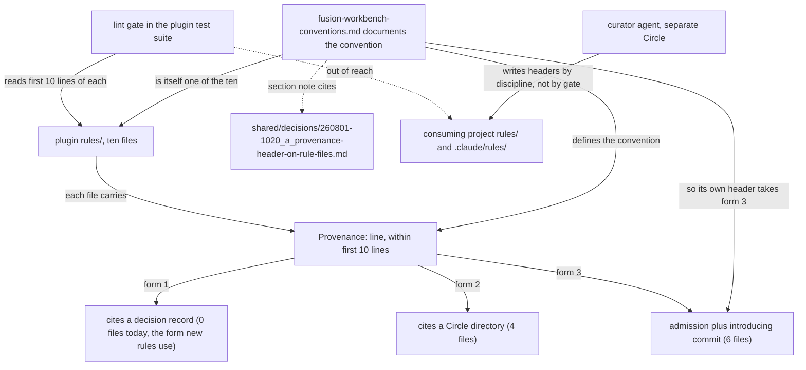

# Spec: Provenance header on rule files (C8)

**Date:** 2026-08-02
**Status:** Complete
**Circle:** `260801-1244-rule-provenance-header`
**Source:** C8 of `260801-1122_*_spec-normative-consolidation.md`, refined by one user clarification round on 2026-08-02. This document supersedes C8's four open questions and is the input the planner works from. Everything C8 states that is not restated or corrected here still holds.

## Directive

Every file in the plugin's `rules/` directory opens with a `Provenance:` line naming what produced it. A lint gate in the plugin's own test suite fails when a rule file carries no such line within its first ten lines, and names the file that is missing one. The convention is documented in `rules/fusion-workbench-conventions.md`, in a section that carries its own motivating record, so the rule mandating provenance demonstrates the practice it mandates.

## Shape



## Capabilities

### C8: Provenance header on rule files

**Description:** A reader who opens any rule file in the plugin learns, within the first ten lines, what caused that rule to exist. Where the cause is a decision record or a Circle, the header names it as a workbench-relative path the reader can follow. Where nothing is recoverable, the header says so and names the commit that introduced the file, which is the most a reader can be given honestly. The plugin's test suite refuses a rule file with no header, so the corpus cannot drift back to its current state one file at a time.

#### The header

One line, anywhere in the first ten lines of the file. The canonical written form is:

```
**Provenance:** <citation>
```

`Provenance:` is a new keyword. No line in any of the ten rule files uses that word followed by a colon today, verified at HEAD `e8988d9`. One case-insensitive occurrence exists, at `rules/user-facing-output.md:178`, inside a quoted example; it reads "provenance markers", lowercase and with no colon, at line 178. It fails the match on case, on the colon, and on position.

Three citation forms are accepted. The distinction between them is what the file's history supports, not the author's preference.

**Form 1, a decision record.** A workbench-relative path to a record under a decisions store, for example `260801-1020_*_provenance-header-on-rule-files.md`. This is the form that carries the capability's stated payoff, because the record's marker changes to `_s_` when the decision is superseded and the rule becomes a visible retirement candidate. No file in the current backfill uses this form. See "Accepted limitations" below, which states plainly why.

**Form 2, a Circle.** A Circle **directory** name, for example `260718-1924-v5x-overhaul`. The directory name is used rather than the record filename because the directory is stable across the Circle's whole lifecycle while the record filename carries a marker that changes. A reader who follows the citation reads whichever `*_circle.md` is present and sees the state from its name.

**Form 3, the admission plus the introducing commit.** For a file with no recoverable motivating record:

```
**Provenance:** No motivating record recoverable; introduced in `git:<short-hash>`.
```

The commit is a secondary, admission-scoped citation. It is not a general endorsement of git as the provenance mechanism. D3 (`260801-1020_*_provenance-header-on-rule-files.md`) considered git history as the *primary* mechanism and rejected it, and nothing here reverses that. Git is admitted only inside the admission form, where the alternative is a header a reader cannot follow anywhere.

#### The gate

A single anchored, case-sensitive regex, matched line by line against the first ten lines of each `rules/*.md` file:

```
/^ {0,3}(?:> ?)?(?:\*\*)?Provenance:(?:\*\*)?(?=\s|$)/
```

The tolerances are deliberate and each has a reason. Up to three leading spaces is Markdown's own indented-code threshold, so an indented header still reads as a header. An optional blockquote marker allows a file whose lede is a blockquote to carry the header inside it. The optional `**` pairs allow the canonical bolded form and a plain unbolded one. Case sensitivity and the required colon are what separate the keyword from prose that happens to use the word.

**Accepted limitation, stated rather than papered over.** The gate proves that a header exists. It does not prove that the header says anything. `Provenance: see the spec` passes. The user considered a value-shape check and did not take it, on the grounds that a regex over free text buys confidence it cannot actually deliver, and that a header written to satisfy a shape check is no more truthful than one written to satisfy a presence check. What stops a hollow header is review, not the gate.

#### The position rule

The header must appear within the **first ten lines** of the file.

Ten is a chosen constant, not a measured bound. It was chosen to clear the longest opening blockquote in the corpus. `rules/context-manifest.md` opens with a blockquote running from line 3 to line 8, so a header placed after it lands at line 10 exactly. `rules/context-lean-claude-md.md` opens with a blockquote running to line 7, so its header lands at line 9. The other eight files open with an H1 on line 1 and prose from line 3, leaving the canonical placement at line 3 comfortable.

The margin at the top of the range is therefore one line, held by a single file. A future rule file whose opening blockquote runs past line 8 will not fit, and the correct response at that point is to place the header above the blockquote rather than to raise the constant quietly.

The position rule carries most of the weight in excluding decoys, and it keeps working after the convention is documented. The section of `rules/fusion-workbench-conventions.md` that documents the convention will necessarily contain the literal string `Provenance:` inside its example. That example will sit several hundred lines into a 698-line file, so it cannot stand in for the file's own header. A keyword-anywhere gate would have passed the conventions file on its own documentation of the rule.

Four lines in the corpus were checked as potential decoys and all four fail on position alone, before the keyword change is considered: `rules/decision-record-examples.md:20`, `rules/fusion-workbench-conventions.md:326`, `:529` and `:654`.

#### The two existing `Binding decision:` lines stay

`rules/fusion-workbench-conventions.md:326` and `:654` are section notes. Each names the motivating record of the section it closes, not of the file. They are not file provenance, the `Provenance:` header does not replace them, and neither line moves. The two mechanisms coexist and mean different things: `Provenance:` at the top of a file is about the file, `Binding decision:` inside a section is about that section.

#### The backfill set is ten files, not nine

C8 and the Circle record both say nine. Nine was correct under an assumption the user's choice of keyword has removed. The earlier count treated `rules/fusion-workbench-conventions.md` as already provenanced because of its `Binding decision:` line at :326. Under the chosen keyword that line is a section note and not a header, so the conventions file has no `Provenance:` header either and would fail its own gate. All ten files are backfilled.

Every citation below was verified on 2026-08-02 by `git log --diff-filter=A` against each file at HEAD `e8988d9`, not carried forward from the earlier round.

| Rule file | Form | Citation |
|---|---|---|
| `agent-setup.md` | Circle | `260718-1924-v5x-overhaul` |
| `context-lean-claude-md.md` | Circle | `260718-1924-v5x-overhaul` |
| `context-manifest.md` | Circle | `260718-1924-v5x-overhaul` |
| `protected-path-discipline.md` | Circle | `260801-1244-guard-bash-inspection` |
| `critical-stance.md` | admission + commit | `git:dac82b8` |
| `decision-record-examples.md` | admission + commit | `git:b05b423` |
| `design-diagrams.md` | admission + commit | `git:bd5f6e6` |
| `fusion-workbench-conventions.md` | admission + commit | `git:b05b423` |
| `git-branch-discipline.md` | admission + commit | `git:4950ffa` |
| `user-facing-output.md` | admission + commit | `git:c18a946` |

The four Circle citations are the only ones available for those files. `260718-1924-v5x-overhaul` holds one decision record, `260718-2150_*_reviewers-history-log-step.md`, which concerns the reviewers' history-log step and did not motivate any of the three files that cite the Circle. `260801-1244-guard-bash-inspection` holds no decision records at all. So no file in the backfill can be upgraded from a Circle citation to a record citation.

The six admission citations belong to files that predate the workbench decision store entirely. The oldest record anywhere in the workbench is dated 260621; all six files were introduced before it. Later records that mention these files by name were checked and rejected: they postdate the file and describe it rather than having caused it. `260717-1935-branch-switch-guard-live-miss-root-cause.md` is the clearest instance, arriving three weeks after `git-branch-discipline.md`.

#### What the conventions file documents

A new section of `rules/fusion-workbench-conventions.md` states the keyword, the three accepted citation forms, the first-ten-lines position rule with its rationale, the admission form's exact wording, and the fact that the gate reads the plugin's `rules/` only.

That section carries a `Binding decision:` line citing `260801-1020_*_provenance-header-on-rule-files.md`. The section that mandates provenance therefore states its own. This is the criterion that makes the convention self-demonstrating, and it is the reason the section note and the file header must not be collapsed into one mechanism: the conventions file's own `Provenance:` header is the admission form, because the file predates its own convention by three months, while the section documenting the convention has a real record to cite.

#### Acceptance criteria

The eight criteria from C8, restated with the count corrected and with the four settled questions written concretely.

- [x] `rules/fusion-workbench-conventions.md` documents the convention: the `Provenance:` keyword, the three accepted citation forms, the first-ten-lines position rule and why ten, and the exact admission wording for a file with no recoverable record.
- [x] All **ten** files in the plugin's `rules/` directory carry a `Provenance:` line within their first ten lines, each matching the citation named for it in the backfill table above.
- [x] The gate fails when a file in the plugin's `rules/` directory has no matching line in its first ten lines. The failure message names the offending file and states the fix, including the admission form for the case where no record is recoverable.
- [x] The gate passes on the backfilled corpus and `npm test` is green.
- [x] A rule file with no header fails the suite, demonstrated by a fixture rather than by adding a real file to `rules/`. A fixture whose only `Provenance:` line sits at line 11 or later also fails, and a fixture carrying a `Cross-references:` or `Binding decision:` line and no `Provenance:` line also fails.
- [x] The convention text states the curator's obligation to write a header whenever it creates a rule file and to preserve or update the existing header whenever it edits one. The curator does not exist yet. It is built in `260801-1244-curator`, so this Circle owes the written obligation and the curator Circle owes the behaviour.
- [x] `bin/fusion-rules` is unchanged. It continues to emit paths without reading file content.
- [x] The conventions-file section documenting the convention cites `260801-1020_*_provenance-header-on-rule-files.md` as its motivating record, in the existing section-scoped `Binding decision:` form.

#### Decisions made

- Header keyword is `Provenance:`, a word the corpus does not currently use, chosen over generalising the existing `Binding decision:` form. Generalising would have made the four decoy lines and the corpus's real section notes indistinguishable from file headers.
- The gate matches presence of the keyword, not the shape of the value. A hollow value passes. Accepted knowingly.
- Position is anywhere in the first ten lines. Ten clears the corpus's longest opening blockquote with one line to spare.
- The gate is a pure text scan and does not resolve any cited path.
- Files with no recoverable record use the admission plus the introducing commit, narrower than the git-as-primary-mechanism option D3 rejected.
- The two `Binding decision:` section notes stay where they are and keep their current meaning.
- The backfill set is ten files. The conventions file joins it, as a consequence of the keyword choice.

## Constraints

- The gate reads the plugin's own `rules/` directory. It cannot reach a consuming project's `./rules/` or `.claude/rules/`, whose files are in no test set fusion controls. For consuming projects the header is documented convention backed by the curator's discipline, and a project gains header-based evidence only for rules written or edited after adopting it.
- The backfill edits ten files under `rules/`, which is a protected path in a consuming project. In this repository the write guard stands down for both the write tools and shell mutations (`hooks/lib/self-detect.ts:18-33`), so no exemption flag is needed. D2 (`260801-1020_*_may-any-fusion-writer-touch-rules.md`) is not on this Circle's path.
- Inventing or reconstructing a decision record for any of the six files that lack one is out of bounds by C8's own terms. An invented rationale is the fiction the capability exists to prevent.
- `bin/fusion-rules` must not start reading file content. The header is inert to path emission.

## Accepted limitations

Four, each a consequence of a settled decision rather than an open question. They belong in the record so a later reader does not mistake the gate for more than it is.

**The gate does not read the value.** Presence of the keyword is the whole check. A header that cites nothing useful passes.

**Dead citations go uncaught.** A pure text scan takes no dependency on the workbench directory and resolves no path, which keeps the test suite in the same shape as the existing `hooks/lib/__tests__/path-literal-lint.test.ts`. The cost is that a header pointing at a record that was moved, renamed, or archived out of reach continues to pass. The archive coupling C8 describes is therefore untouched by this Circle rather than solved by it. It is latent in this repository, because the archive store holds zero files, verified 2026-08-02, and it is already live in any consuming project with a populated archive. The underlying defect is filed at `260801-1020_*_scan-keys-never-reach-the-archive-store.md` and is not refiled here.

**No backfilled file uses the decision-record form, so the superseded check has no live instance when this Circle closes.** Four files cite a Circle and six carry the admission plus a commit. A Circle directory carries no marker at all, and a commit carries no marker either, so neither citation supports the mechanical "the motivating decision was superseded, this rule is a retirement candidate" reading that is the header's stated payoff. That payoff becomes available for rule files written after the convention lands, whose authors have a record to cite. This is a real gap between what the capability promises and what the backfill delivers on day one, and it is not closed by any of the four answers.

**The header narrows the evidence gap forward and does not close it backward.** Stated in C8 and unchanged.

## Out of Scope

- Any check that a cited path resolves, in this Circle or as a follow-up within it.
- Reaching a consuming project's rule files with the gate.
- Changing, moving, or generalising the two `Binding decision:` section notes.
- Fixing the archive coupling. It has its own issue record.
- Reconstructing motivating records for the six files that have none.
- Partitioning `rules/fusion-workbench-conventions.md` into shards. That is C9, in `260801-1244-curator`, and it depends on this gate existing first.
- Building the curator, which owns the forward obligation the convention text states.

## Open for Planner

- Where the gate lives: a new test file or an addition to an existing one, and its name. The existing path-literal gate is the shape reference, not a mandated host.
- How the first ten lines are read and how the fixtures are constructed.
- Whether the backfill is applied by hand or by a script. Shell mutations are permitted in this repository, so either works.
- The exact prose of the conventions-file section, beyond the content the acceptance criteria require.
- The order of the work and whether the gate or the backfill lands first.

## User Decisions Pending

None. The four questions C8 left open were answered on 2026-08-02 and are recorded above. The fourth is closed at `260802-1018_*_what-a-rule-file-with-no-recoverable-record-cites.md`.

---

## Reconciliation Log

**260802-1413-reconciliation.md (reconciler, domain `code`) — Status Draft → Complete, marker `_o_` → `_c_`. All eight acceptance criteria ticked on verified evidence.**

Each criterion was re-checked against the tree at `b568ad9`. The evidence, one line per criterion:

1. **Convention documented.** `rules/fusion-workbench-conventions.md:562` `## Provenance headers on rule files`. Read in full: it states the keyword, all three citation forms, the ten-line rule with its reason, and the admission wording verbatim.
2. **All ten files carry a header in the window.** Ten files in `rules/`, ten matches, every one at line `3`, every citation identical to the backfill table above.
3. **The gate fails and states the fix.** `report()` at `hooks/lib/__tests__/provenance-header-lint.test.ts:122-133` emits the file, the defect, and the three-form fix including the admission wording. Asserted by the tests at `:348`, `:362`, `:383`, `:404`.
4. **Suite green.** `npm test` from `hooks/`, re-run by the reconciler at 260802-1411: 17 files, 780 tests, 0 failures.
5. **Three negative fixtures, no real headerless file.** Present, in-memory. Nothing was added to `rules/`; `ls -1 rules/` still returns exactly the ten backfilled files.
6. **Curator obligation written down.** `rules/fusion-workbench-conventions.md` "Whoever writes a rule file writes its header."
7. **`bin/fusion-rules` unchanged.** `git diff --name-only e8988d9..HEAD -- bin/` returns nothing across the whole Circle.
8. **Section-scoped `Binding decision:`.** `rules/fusion-workbench-conventions.md:592`, citing `260801-1020_*_provenance-header-on-rule-files.md`, which resolves.

### The accepted limitations, re-checked rather than assumed

Two of the four are now measurable, and one of them is the Circle's honest ceiling.

**"No backfilled file uses the decision-record form, so the superseded check has no live instance."** Confirmed, and it is permanent for this corpus rather than a day-one gap that later closes. Four files cite a Circle directory (`260718-1924-v5x-overhaul` ×3, `260801-1244-guard-bash-inspection` ×1); a directory carries no marker. Six cite `git:<hash>`; a commit carries no marker. The spec's own paragraph at `#### The backfill set is ten files, not nine` already established that neither cited Circle holds a decision record that motivated any of those files, so no citation in the backfill can be *upgraded* to form 1 later. The mechanical retirement check therefore exists for rule files written from now on and for none of the ten that exist today.

**"Dead citations go uncaught."** Now demonstrated inside the conventions file itself rather than argued in the abstract. Two of the three `Binding decision:` lines in that file resolve to nothing: `:328` uses a pre-v4 root type-folder path, and `:688` names a record (`260519-1100_*_circle-stash-pop-design.md`) that `find` locates nowhere in the workbench. Filed as issue `260802-1252_*_binding-decision-formalised-while-both-existing-instances-are-dead.md`, left `_o_` by user decision, cross-referenced to `260801-1244-curator`.

**Verified as still latent:** the archive coupling. The archive store holds zero files, so no citation can be archived out of reach yet.

### One spec claim the work overtook

`#### The position rule` states the corpus's longest opening blockquote runs to line 8 in `context-manifest.md`, "with one line to spare". Step 1's insertion made that false in the same Circle — the blockquote now runs 5 to 10 and the margin is zero. Caught by review as issue `260802-1253_*_the-line-8-blockquote-rationale-is-false-in-the-commit-that-states-it.md` and corrected at both live sites (`cc004fc` for the test comment, `7703330` for the conventions prose). The spec text above is deliberately **not** retro-edited: it records what was true when it was written, per the plan's own risk table.
