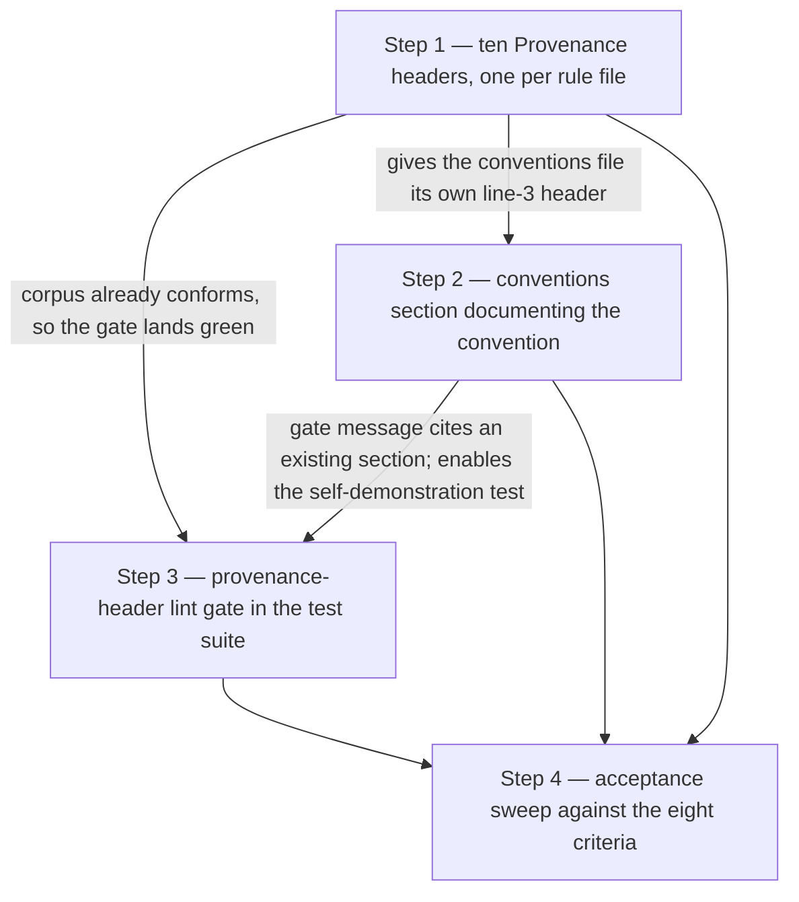
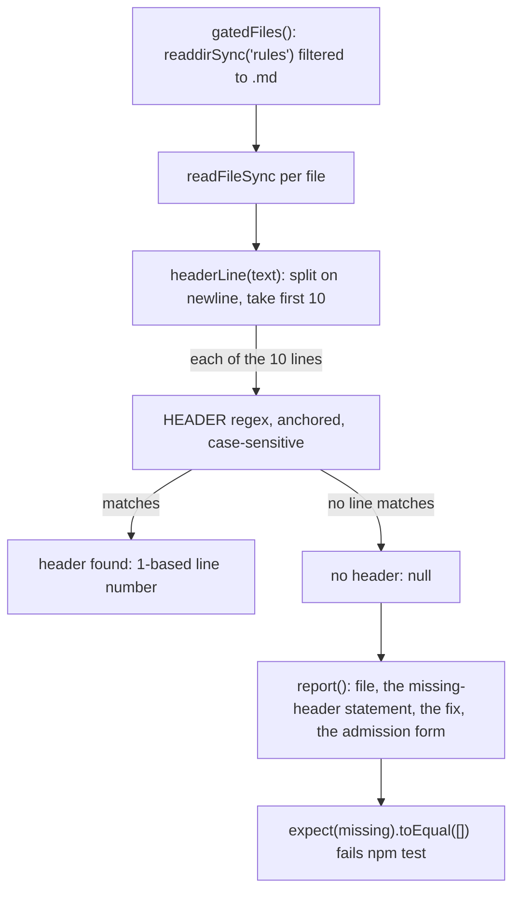

# Implementation Plan: Provenance header on rule files (C8)

**Date:** 2026-08-02
**Status:** Draft
**Circle:** `circles/260801-1244-rule-provenance-header`
**Spec:** `circles/260801-1244-rule-provenance-header/planning/260802-1103_o_spec-rule-provenance-header.md` (user-approved 2026-08-02)
**Executors:** `coder` for every step. All four steps touch Markdown prose that documents a code-enforced convention, plus one TypeScript test file. No step touches structured data, ontology, manifests, or schemas, so `ontocoder` has no work here.

## Directive

Give every file in the plugin's `rules/` directory a `Provenance:` line naming what produced it, document the convention in `rules/fusion-workbench-conventions.md`, and add a lint gate to the plugin's own test suite that fails when a rule file has no such line in its first ten lines. The spec holds the header's form, the regex, the position rule, the ten-file backfill table, and the eight acceptance criteria. Nothing settled there is reopened here.

This plan settles the five items the spec left under `## Open for Planner`: where the gate lives, how the first ten lines are read and how the fixtures are built, whether the backfill runs by hand or by script, the exact prose of the conventions section, and the order of the work.

## Current State

### The corpus

`rules/` holds exactly ten Markdown files, verified by `ls -1 rules/` at HEAD `e8988d9`. None carries a `Provenance:` line today. Eight open with an H1 on line 1, a blank line 2, and prose from line 3. Two open with a lede blockquote: `context-manifest.md` (blockquote lines 3 to 8) and `context-lean-claude-md.md` (blockquote lines 3 to 7).

### The shape reference

`hooks/lib/__tests__/path-literal-lint.test.ts` is one of three corpus-lint gates already in the suite. Its two siblings are `marker-format-lint.test.ts` and `glob-nomatch-lint.test.ts`. All three share one shape, and it is the shape this gate follows:

- A `pluginRoot` resolved from `import.meta.url` with `resolve(dirname(...), "../../..")`.
- A long header comment stating what the gate protects, why, and what it deliberately does not cover.
- A pure `scan(file, text)` function taking a string, so every fixture is an in-memory string rather than a file on disk.
- A `report(violations)` function producing an actionable message: the file, the offending token, and the fix.
- A `gatedFiles()` function deriving the file set from `readdirSync`, so a newly added file is in the set automatically.
- One whole-tree test, several small positive and negative fixture tests, and one "inject the violation into a copy of a real file" test proving the gate fails in the other direction.

The only on-disk fixtures in the suite are under `lib/__tests__/fixtures/plane/`, and they exist because `bin/fusion-plane` needs a real directory tree to walk. A text gate needs no such thing.

### The test runner

`npm test` in `hooks/` runs `tsc && vitest run`. `hooks/tsconfig.json` excludes `lib/__tests__`, so a new test file needs no build-config change; `tsc` skips it and vitest picks it up through its default include pattern. There is no root-level `package.json`, so every test command in this plan runs from `hooks/`.

### Two facts checked rather than taken from the spec

**The backfill table is correct.** All ten citations were re-derived at HEAD `e8988d9` with `git log --diff-filter=A`. The six admission hashes match the spec exactly: `critical-stance.md` `dac82b8` (2026-06-18), `decision-record-examples.md` `b05b423` (2026-05-04), `design-diagrams.md` `bd5f6e6` (2026-06-29), `fusion-workbench-conventions.md` `b05b423` (2026-05-04), `git-branch-discipline.md` `4950ffa` (2026-06-24), `user-facing-output.md` `c18a946` (2026-05-12). The four Circle citations are consistent with the introducing dates: `agent-setup.md` (`046453e`, 2026-07-18), `context-manifest.md` and `context-lean-claude-md.md` (`4620837`, 2026-07-18) against `circles/260718-1924-v5x-overhaul`; `protected-path-discipline.md` (`3806a49`, 2026-08-01) against `circles/260801-1244-guard-bash-inspection`. Both Circle directories exist in the workbench. No correction is needed.

**`bin/fusion-rules` cannot see a header.** The plugin's rule files reach the helper's output through exactly two functions, `emit_if_exists` (line 156, a `[ -f "$1" ]` test and a `printf`) and `emit_pattern_in_dir` (line 160, a filename glob and a `printf`). Neither opens a file. The helper's only content reads are `./CLAUDE.md` (the `**Language:**` line, line 185), `.active-circle` (line 241), the active Circle's `*_circle.md` record (a `Topic:`/`Tags:` line, line 250), and a consuming project's `./rules/context-manifest.yaml` (line 313). Adding a line inside a rule file therefore cannot change what the helper emits. Acceptance criterion 7 holds by construction, and Step 1 verifies it empirically anyway.

## Approach

Three pieces of work, in an order chosen so the test suite is green at every commit boundary: the ten headers first, the conventions section second, the gate last. Then a verification sweep against the eight acceptance criteria.

### Why the backfill lands before the gate

Landing the gate first would leave one commit with ten failing tests. The only thing that intermediate red run would prove is that the gate catches a headerless rule file, and acceptance criterion 5 already requires that proof to be permanent and fixture-based rather than a transient observation. So the red run buys nothing the test file does not encode forever, and it costs a commit that violates the repository's own release discipline. The backfill is written against a regex the spec fixes verbatim, so it does not need the gate to exist in order to be correct, and Step 3's corpus test verifies it retroactively before the gate is committed.

The conventions section goes second, before the gate, so the gate's failure message can point at a section that already exists, and so Step 3 can add a test asserting that the conventions file passes on its own line-3 header rather than on the `Provenance:` string inside its documentation of the rule.

### Header placement: line 3 in all ten files

The header goes directly under the H1, on line 3, in every one of the ten files, including the two whose lede is a blockquote. Uniform placement means the backfill needs no per-file reasoning, every header sits seven lines inside a ten-line window, and a reader finds the header in the same place in every file.

This departs from the spec's illustrative arithmetic without touching any acceptance criterion. The spec computes where the header would land if it were placed *after* a lede blockquote (line 10 for `context-manifest.md`, line 9 for `context-lean-claude-md.md`) and uses that to justify the constant ten. Both placements satisfy the criterion, which asks only for a matching line within the first ten. The spec itself sanctions the above-the-blockquote form: "the correct response at that point is to place the header above the blockquote rather than to raise the constant quietly." Ten remains the documented window, and the conventions text states both the canonical placement and why the window is as wide as it is.

### Work order



### Gate structure



The gate resolves no path, reads no workbench directory, and takes no dependency outside `node:fs` and `node:path`, exactly as the three sibling lint gates do.

## Implementation Steps

Every step runs from the repository root `/Users/k1/Projects/productive/fusion` unless a command says otherwise. Test commands run from `hooks/`.

---

### 1. [DONE] Backfill the ten provenance headers

- **Executor:** `coder`
- **Dependencies:** none
- **Acceptance criterion:** 2 (all ten files carry a matching line in their first ten lines, each with the citation the spec's backfill table names) and 7 (`bin/fusion-rules` unchanged)
- **Files:** all ten of `rules/agent-setup.md`, `rules/context-lean-claude-md.md`, `rules/context-manifest.md`, `rules/critical-stance.md`, `rules/decision-record-examples.md`, `rules/design-diagrams.md`, `rules/fusion-workbench-conventions.md`, `rules/git-branch-discipline.md`, `rules/protected-path-discipline.md`, `rules/user-facing-output.md`

**Method: by hand, one `Edit` per file, not a script.** Ten files each need a different citation string, so a script is a lookup table plus an insertion rather than a uniform transformation, and it saves nothing over ten exact-match edits. The `Edit` tool's exact-match semantics fail loudly on an anchor that does not match, whereas a `sed -i` loop over ten files can silently write the wrong thing into the wrong place. Shell mutation is permitted here (the write guard stands down in the plugin's own tree, `hooks/lib/self-detect.ts:18-33`), so this is a choice about reviewability rather than about permission. The resulting diff is ten two-line insertions with zero deletions, which is directly checkable.

**Changes.** In each file, insert the header and a following blank line between the H1 on line 1 and the blank line 2, so the header becomes line 3 and the original line 3 becomes line 5. Anchor each edit on the file's first three lines. The exact line to insert, per file:

| File | Line to insert at line 3 |
|---|---|
| `rules/agent-setup.md` | `**Provenance:** circles/260718-1924-v5x-overhaul` |
| `rules/context-lean-claude-md.md` | `**Provenance:** circles/260718-1924-v5x-overhaul` |
| `rules/context-manifest.md` | `**Provenance:** circles/260718-1924-v5x-overhaul` |
| `rules/protected-path-discipline.md` | `**Provenance:** circles/260801-1244-guard-bash-inspection` |
| `rules/critical-stance.md` | ``**Provenance:** No motivating record recoverable; introduced in `git:dac82b8`.`` |
| `rules/decision-record-examples.md` | ``**Provenance:** No motivating record recoverable; introduced in `git:b05b423`.`` |
| `rules/design-diagrams.md` | ``**Provenance:** No motivating record recoverable; introduced in `git:bd5f6e6`.`` |
| `rules/fusion-workbench-conventions.md` | ``**Provenance:** No motivating record recoverable; introduced in `git:b05b423`.`` |
| `rules/git-branch-discipline.md` | ``**Provenance:** No motivating record recoverable; introduced in `git:4950ffa`.`` |
| `rules/user-facing-output.md` | ``**Provenance:** No motivating record recoverable; introduced in `git:c18a946`.`` |

The admission wording is fixed by the spec and must be reproduced character for character, including the semicolon, the backticks around `git:<hash>`, and the closing full stop.

Do not touch `rules/fusion-workbench-conventions.md:326` or `:654`. Those are the two section-scoped `Binding decision:` lines and they keep their current position and meaning. After this step's insertion they sit at `:328` and `:656`.

**Verification.**

Before editing anything, capture the rule-emission baseline. `FUSION_PLUGIN_ROOT` is exported by the SessionStart hook and points at the *installed* copy at `~/.fusion`, so it must be overridden to check this repository:

```bash
cd /Users/k1/Projects/productive/fusion
FUSION_PLUGIN_ROOT=$PWD bin/fusion-rules planner > /tmp/fr-planner-before.txt
FUSION_PLUGIN_ROOT=$PWD bin/fusion-rules coder   > /tmp/fr-coder-before.txt
```

After the ten edits:

```bash
cd /Users/k1/Projects/productive/fusion
# 1. Every rule file has a matching header, and it is on line 3.
for f in rules/*.md; do
  printf '%-42s ' "$f"
  head -10 "$f" | grep -nE '^ {0,3}(> ?)?(\*\*)?Provenance:(\*\*)?( |$)' || echo MISSING
done
```

Expect ten lines, each reporting `3:` followed by the header for that file, and no `MISSING`.

```bash
# 2. Pure insertions: no rule file lost a line.
git diff --numstat rules/
```

Expect ten rows whose deletions column is `0`.

```bash
# 3. Emission is byte-identical, so bin/fusion-rules is provably unaffected.
FUSION_PLUGIN_ROOT=$PWD bin/fusion-rules planner | diff -u /tmp/fr-planner-before.txt -
FUSION_PLUGIN_ROOT=$PWD bin/fusion-rules coder   | diff -u /tmp/fr-coder-before.txt   -
git status --porcelain bin/fusion-rules
```

Expect no diff output and no `git status` output.

```bash
# 4. Nothing else broke.
cd hooks && npm test
```

Expect green. Nothing in the suite reads rule-file content yet, so this is a no-collateral-damage check.

---

### 2. [DONE] Document the convention in the conventions file

- **Executor:** `coder`
- **Dependencies:** Step 1 (the file already carries its own line-3 header, so the section and the header are visibly two separate mechanisms in one diff sequence rather than one edit)
- **Acceptance criteria:** 1 (the section states keyword, three forms, position rule and why ten, and the exact admission wording), 6 (the curator's forward obligation is written down), 8 (the section carries a `Binding decision:` line citing the motivating record)
- **Files:** `rules/fusion-workbench-conventions.md`

**Changes.** Insert one new top-level section immediately before the existing `## History Logging` heading. That anchor puts it directly after `## Decision Record Template`, which is the right neighbour: the template defines the record, and this section defines how a rule file cites one.

Insert exactly this text, followed by a blank line, before the `## History Logging` line:

````markdown
## Provenance headers on rule files

Every file in the plugin's `rules/` directory opens with a line naming what caused it to exist. A reader who opens a rule learns, within the first ten lines, which record, Circle, or commit put it there, and therefore has a way to ask whether the reason still holds.

**The header.** One line, anywhere in the first ten lines of the file. The canonical written form is:

```
**Provenance:** <citation>
```

Canonical placement is directly under the file's H1 title, on line 3. The ten-line window is tolerance rather than licence: it is wide enough that a file whose lede is a blockquote can carry the header after the lede instead. Ten was chosen to clear the longest opening blockquote in the corpus, which runs to line 8 in `context-manifest.md`, with one line to spare. A future file whose opening blockquote runs past line 8 does not fit, and the answer then is to move the header above the blockquote, not to widen the window.

**Three citation forms.** Which one a file uses is decided by what its history supports, not by the author's preference.

1. **A decision record.** A workbench-relative path to a record under a decisions store, for example `shared/decisions/260801-1020_a_provenance-header-on-rule-files.md`. Prefer this form whenever a record exists. It is the only form that carries the header's real payoff: the record's marker changes to `_s_` when the decision is superseded, so the rule citing it becomes a retirement candidate any reader can spot.
2. **A Circle.** A Circle **directory** name, for example `circles/260718-1924-v5x-overhaul`. The directory name is used rather than the record filename, because the directory is stable across the Circle's whole lifecycle while the record filename carries a marker that changes. A reader follows the citation, reads whichever `*_circle.md` is present, and takes the state from its name.
3. **The admission plus the introducing commit.** For a file with no recoverable motivating record, written exactly like this:

```
**Provenance:** No motivating record recoverable; introduced in `git:<short-hash>`.
```

The commit is admission-scoped and nothing more. Git is not the provenance mechanism; it is what an honest header falls back to when the alternative is a citation the reader cannot follow anywhere. Do not reconstruct a plausible record for a file that has none. An invented rationale is exactly the fiction this header exists to prevent.

**What the gate checks, and what it does not.** `hooks/lib/__tests__/provenance-header-lint.test.ts` fails `npm test` when a file in the plugin's `rules/` directory carries no `Provenance:` line in its first ten lines, and it names the offending file. It reads the plugin's own `rules/` only. A consuming project's `./rules/` and `.claude/rules/` are in no test set fusion controls, so there the header is documented convention backed by the curator's discipline, and a project gains header-based evidence only for rules written or edited after it adopts the convention. The gate checks that a header is present. It does not read the value and it resolves no cited path, so a header citing something useless still passes, and a header citing a record that was later moved or archived also still passes. What stops a hollow header is review, not the gate.

**`Provenance:` is file-scoped; `Binding decision:` is section-scoped.** The two coexist and mean different things. A `Provenance:` line at the top of a file states why the *file* exists. A `Binding decision:` line inside a section states which record binds *that section*. Neither replaces the other, and a section note never satisfies the gate: the gate reads only the first ten lines, and only for `Provenance:`.

**Whoever writes a rule file writes its header.** An agent that creates a rule file gives it a header in the same edit, choosing the form its history supports. An agent that edits an existing rule file preserves the header, and updates it when the edit is substantial enough that a different record has become the file's reason for existing. This obligation falls first on the curator, whose work is writing and consolidating normative text; in the plugin's own repository the lint gate backs it, and everywhere else the discipline stands alone.

Binding decision: `shared/decisions/260801-1020_a_provenance-header-on-rule-files.md`.
````

Note for the executor: the outer fence above is four backticks and is this plan's quoting device only. The two triple-backtick fenced blocks *inside* the section are part of the text to insert, and they go into the conventions file as written.

**Verification.**

```bash
cd /Users/k1/Projects/productive/fusion
# 1. The section exists, exactly once, and sits before History Logging.
grep -n '^## Provenance headers on rule files' rules/fusion-workbench-conventions.md
grep -n '^## History Logging' rules/fusion-workbench-conventions.md
```

Expect one hit each, with the provenance heading's line number lower than the history-logging one.

```bash
# 2. Criterion 8: the section-scoped Binding decision line cites the record.
grep -n 'Binding decision: `shared/decisions/260801-1020_a_provenance-header-on-rule-files.md`' \
  rules/fusion-workbench-conventions.md
```

Expect exactly one hit.

```bash
# 3. The two pre-existing section notes survive untouched, and nothing was deleted.
grep -n 'Binding decision' rules/fusion-workbench-conventions.md
git diff --numstat rules/fusion-workbench-conventions.md
```

Expect three `Binding decision` hits total (the two originals now at `:328` and `:656`, plus the new one) and a deletions column of `0`.

```bash
# 4. Criterion 1 content check: the required elements are all present in the section.
```

Read the inserted section and confirm by eye that it states the keyword, all three citation forms, the ten-line rule with its reason, and the verbatim admission wording. This one is a reading check, not a grep, because the criterion is about content rather than about a token.

---

### 3. [DONE] Add the provenance-header lint gate

- **Executor:** `coder`
- **Dependencies:** Steps 1 and 2 (the gate lands green on an already-conforming corpus, and its self-demonstration test needs the conventions section in place)
- **Acceptance criteria:** 3 (the gate fails and names the file and the fix), 4 (the gate passes on the backfilled corpus and `npm test` is green), 5 (three negative fixtures, no real headerless file added to `rules/`)
- **Files:** `hooks/lib/__tests__/provenance-header-lint.test.ts` (new)

**Why a new file and this name.** The three existing corpus-lint gates are one file per concern, each named `<concern>-lint.test.ts`. This is a fourth concern over a fourth corpus: `path-literal-lint` and `marker-format-lint` both read `agents/` and `skills/`, `glob-nomatch-lint` reads fenced shell blocks, and none of them reads `rules/`. Folding a `rules/` scan into a file whose header comment describes prompts and skills would make both gates harder to read and would put the exemption logic of one next to the deliberate absence of exemptions in the other. A new file also keeps the failure output legible: when this gate fails, the test name says provenance and nothing else.

**Structure.** Follow the sibling gates exactly.

- Module header comment stating: what the gate protects; that the file set is `rules/*.md` derived by `readdirSync`, with **no exemption list**, deliberately, because every rule file is in scope and the fix for a new file is a header rather than an exemption; that the check is presence-only and reads no value; that it resolves no cited path and takes no dependency on the workbench directory; and that it is a guard, not a fixer (`rules/critical-stance.md` §2).
- `const pluginRoot = resolve(dirname(fileURLToPath(import.meta.url)), "../../..")`.
- `const HEADER_WINDOW = 10;`
- `const HEADER = /^ {0,3}(?:> ?)?(?:\*\*)?Provenance:(?:\*\*)?(?=\s|$)/;` — the spec's regex verbatim, not re-derived.
- `function headerLine(text: string): number | null` — split on `\n`, take the first `HEADER_WINDOW` lines, return the 1-based number of the first line matching `HEADER`, or `null`. Returning the line number rather than a boolean is what lets a test assert the window boundary exactly.
- `function gatedFiles(): { rel: string; abs: string }[]` — `readdirSync(join(pluginRoot, "rules"))` filtered to `.md`, each as `{ rel: "rules/<name>", abs }`.
- `function report(missing: string[]): string` — one block per file, in the sibling gates' two-line shape:

```
  rules/<file>  no 'Provenance:' line in the first 10 lines
    -> add one directly under the H1, e.g. '**Provenance:** shared/decisions/<record>.md'
       or '**Provenance:** circles/<circle-directory>'. If no motivating record is
       recoverable, write exactly:
       '**Provenance:** No motivating record recoverable; introduced in `git:<short-hash>`.'
       The convention is defined in rules/fusion-workbench-conventions.md,
       section '## Provenance headers on rule files'.
```

**How the fixtures are constructed.** In-memory strings passed to `headerLine`, following `path-literal-lint.test.ts` and `marker-format-lint.test.ts`. No fixture file is written to disk, and no file is added to `rules/`. A multi-line fixture is built as an array of lines joined with `\n`, so a test that needs a header at line 11 says so structurally rather than by counting characters.

**Tests to write.**

*Corpus.*
- The whole corpus passes: collect `rel` for every gated file whose `headerLine` is `null`, expect the list to be empty, with `report(missing)` as the failure message.
- Non-vacuity: expect `gatedFiles().length` to be greater than zero, so an empty or misresolved `rules/` directory cannot pass the corpus test silently.

*The window is exactly the first ten lines.*
- A header on line 1 is accepted.
- A header on line 3, the canonical placement, is accepted.
- A header on line 10 is accepted, and `headerLine` returns `10`.
- A header on line 11 is rejected. This is the second of the three negative fixtures criterion 5 requires.

*The pattern matches the keyword, not prose.* Accepted: `**Provenance:** x`; the unbolded `Provenance: x`; the blockquote form `> **Provenance:** x`; a three-space indent; and the exact admission line from the spec. Rejected: a four-space indent (Markdown's indented-code threshold); lowercase `provenance: x`; `Provenance` with no colon; the real corpus line `...pending-stefan provenance markers...` from `rules/user-facing-output.md`, which fails on case, on the colon, and on position; and `**Provenance:**x` with no separator after the keyword, which the trailing lookahead rejects on purpose.

*The three negative fixtures criterion 5 names.* A file with no header at all; a file whose only `Provenance:` line sits at line 11; and a file carrying `**Cross-references:** issues/260430-1900_o_rag-sanitisation.md` and `Binding decision: decisions/260716-1910_i_....md` in its first ten lines and no `Provenance:` line. The third proves that the corpus's existing provenance-adjacent vocabulary does not satisfy the gate.

*A real rule file stripped of its header fails, with an actionable message.* Read `rules/critical-stance.md`, remove its header line in memory, and assert `headerLine` returns `null`. Then assert `report(["rules/critical-stance.md"])` contains the file name, the string `first 10 lines`, and the verbatim admission wording `No motivating record recoverable; introduced in`. This is criterion 5's "demonstrated by a fixture rather than by adding a real file to `rules/`", in the same shape as the injection tests in the two sibling gates.

*The conventions file passes on its own header, not on its documentation of the rule.* Read `rules/fusion-workbench-conventions.md` and assert three things in order. First, `headerLine` returns a number no greater than `HEADER_WINDOW`. Second, after removing that line, the remaining text still contains `Provenance:` somewhere beyond line 10, which keeps the test from going vacuous if the documentation section is ever moved or removed. Third, with the header line removed, `headerLine` returns `null`. This is the position rule doing the work the spec says it does: a keyword-anywhere gate would have passed this file on its own documentation of the rule.

**Verification.**

```bash
cd /Users/k1/Projects/productive/fusion/hooks
npx vitest run lib/__tests__/provenance-header-lint.test.ts
```

Expect every test in the new file to pass.

```bash
cd /Users/k1/Projects/productive/fusion/hooks
npm test
```

Expect the full suite green, including `tsc`.

```bash
cd /Users/k1/Projects/productive/fusion
grep -c 'rules/' hooks/lib/__tests__/provenance-header-lint.test.ts
```

A sanity check that the gate names its corpus. Then read the failing-direction tests once and confirm they assert on `report(...)` output rather than only on a boolean, because criterion 3 is about the message and not only about the failure.

---

### 4. [DONE] Acceptance sweep

- **Executor:** `coder`
- **Dependencies:** Steps 1, 2 and 3
- **Acceptance criteria:** all eight, re-checked together
- **Files:** none. This step runs commands and reports; it changes nothing.

**Changes.** None. If a check fails, fix it in the step that owns it rather than patching here.

**Verification.** Walk the eight criteria in order and record the evidence for each.

```bash
cd /Users/k1/Projects/productive/fusion
# C1  conventions section documents the convention
grep -n '^## Provenance headers on rule files' rules/fusion-workbench-conventions.md
# C2  all ten rule files carry a header in their first ten lines
for f in rules/*.md; do printf '%-42s ' "$f"; head -10 "$f" | grep -nE '^ {0,3}(> ?)?(\*\*)?Provenance:(\*\*)?( |$)' || echo MISSING; done
# C3 + C5  the gate fails, names the file, states the fix, and has the three negative fixtures
cd hooks && npx vitest run lib/__tests__/provenance-header-lint.test.ts --reporter=verbose; cd ..
# C4  gate passes on the corpus and the whole suite is green
cd hooks && npm test; cd ..
# C6  the curator obligation is written down
grep -n 'Whoever writes a rule file writes its header' rules/fusion-workbench-conventions.md
# C7  bin/fusion-rules untouched
git status --porcelain bin/fusion-rules
# C8  the section-scoped Binding decision line
grep -n 'Binding decision: `shared/decisions/260801-1020_a_provenance-header-on-rule-files.md`' rules/fusion-workbench-conventions.md
# scope boundary: exactly eleven paths changed, and nothing outside them
git status --porcelain
```

The last command must show exactly eleven changed paths: the ten `rules/*.md` files as modified, and `hooks/lib/__tests__/provenance-header-lint.test.ts` as new. Anything under `bin/`, `agents/`, `skills/`, `docs/`, or `hooks/lib/` outside `__tests__` is out of this Circle's scope and means something drifted. Workbench files under `fusion-workbench/` are session artifacts and are not counted here.

---

## Data Structures

Three declarations inside the test file, none exported and none shared with production code:

| Name | Type | Purpose |
|---|---|---|
| `HEADER_WINDOW` | `number` (10) | The position rule as a single named constant, so the window is stated once and every test reads it from there. |
| `HEADER` | `RegExp` | The spec's regex verbatim: `/^ {0,3}(?:> ?)?(?:\*\*)?Provenance:(?:\*\*)?(?=\s|$)/` |
| `headerLine(text)` | `(string) => number \| null` | 1-based line number of the first matching line within the window, or `null`. |

No production module changes, so no exported surface changes anywhere in `hooks/lib/`.

## API Changes

None. No hook, no binary, and no agent prompt changes. `bin/fusion-rules` keeps its current behaviour and its current source, which Step 1 verifies by diffing its output across the backfill.

## Testing Strategy

One new test file in the existing vitest suite, run by the existing `npm test` from `hooks/`. No new dependency, no build-config change, no on-disk fixture.

The correctness surface has three layers. The corpus test asserts the ten real files conform, and its non-vacuity assertion stops it passing on an empty file set. The fixture tests assert the regex and the window behave as specified in both directions, including the three negatives criterion 5 names. The two real-file tests assert the gate fires on a real rule file with its header removed, and that the conventions file survives on its own header rather than on the `Provenance:` string inside its documentation of the rule.

What is deliberately not tested: that a citation resolves to anything. The spec puts path resolution out of scope, and the gate takes no dependency on the workbench directory as a result.

## Risks & Mitigations

| Risk | Mitigation |
|---|---|
| Inserting a line at line 3 shifts every line number in ten rule files, breaking any citation of the form `rules/<file>:<n>`. | Checked before planning: `grep -rnE 'rules/[a-z-]+\.md:[0-9]+'` across `agents/`, `skills/`, `rules/`, `hooks/lib/`, `bin/`, `install.sh` and `CLAUDE.md` returns nothing. The only such citation anywhere is in the spec itself (`rules/user-facing-output.md:178`, which becomes `:180`). A spec is a historical record of what was true when it was written and is not retro-edited. |
| A `sed`-based backfill silently writes the wrong citation into the wrong file. | The backfill is ten exact-match `Edit` calls, which fail loudly on a bad anchor, plus a `git diff --numstat` check that every rule file has zero deletions. |
| The gate is written against a re-derived regex that drifts from the spec's. | The regex is copied verbatim from the spec into a single named constant, and the plan states it literally so the executor has no reason to re-derive it. |
| `npm test` is run from the repository root and fails, because there is no root `package.json`. | Every test command in this plan is written with its `cd .../hooks` prefix. |
| A `bin/fusion-rules` regression check silently tests the installed copy at `~/.fusion` instead of this repository, because `FUSION_PLUGIN_ROOT` is exported by the SessionStart hook. | Step 1's verification commands override `FUSION_PLUGIN_ROOT=$PWD` explicitly, and the plan says why. |
| The gate has no exemption list, so a non-rule Markdown file dropped into `rules/` (a README, a template) would be required to carry a header. | Intended. `rules/` holds rule files and nothing else, and the correct response to a new file failing is a header, not an exemption. The absence of an exemption list is stated in the gate's header comment so the next reader does not add one reflexively. |
| A hollow header (`**Provenance:** see the spec`) passes the gate. | Accepted limitation, recorded in the spec and restated in the conventions section. Review is what catches it; the gate does not claim to. |
| A header cites a record that is later archived out of every read set, and the citation resolves to nothing. | Accepted limitation, out of scope by the spec. The underlying defect is already filed at `shared/issues/260801-1020_o_scan-keys-never-reach-the-archive-store.md` and is not refiled here. |
| Scope creep into the curator Circle: partitioning the conventions file, or writing headers into a consuming project's rules. | Step 4's `git status --porcelain` check bounds the change to eleven paths. `circles/260801-1244-curator` owns everything else. |

## Open Questions

Neither blocks the executor. Both are for the user at the plan gate.

- [ ] **Does this Circle bump `.claude-plugin/plugin.json`?** `CLAUDE.md` says to bump the version on every change, but the release process is a separate user-driven sequence covering the marketplace manifest and the git tag as well. No acceptance criterion mentions it, so no step does it. Recommendation: leave the bump to the normal release flow at session close rather than folding a partial release into this Circle.
- [ ] **Does `CLAUDE.md` gain a line about the new gate?** The layout table and the "Where to look when something breaks" table both describe the test suite, and a fourth corpus-lint gate is the kind of thing they cover. `/fusion:revise-claude-md` at session close is the normal route, so no step here writes to `CLAUDE.md`. Recommendation: handle it at session close.

## Verification of the spec's own claims

Two checks the spec asked for, both done before this plan was written.

**The backfill table is correct as printed.** All six admission hashes and all four Circle citations were re-derived at HEAD `e8988d9` with `git log --diff-filter=A` per file, and every one matches. No silent correction was needed and none was made. Details are in `## Current State`.

**`bin/fusion-rules` cannot be affected by a header.** Its two emission functions test for a file's existence and glob filenames; neither opens a rule file. Its only content reads are `CLAUDE.md`, `.active-circle`, the active Circle record, and a consuming project's `context-manifest.yaml`. Line references are in `## Current State`.
