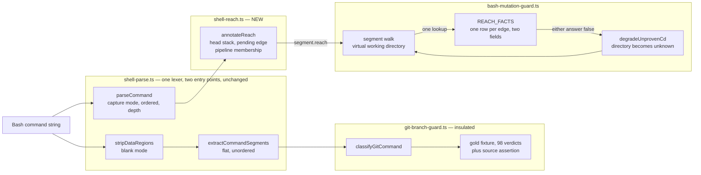
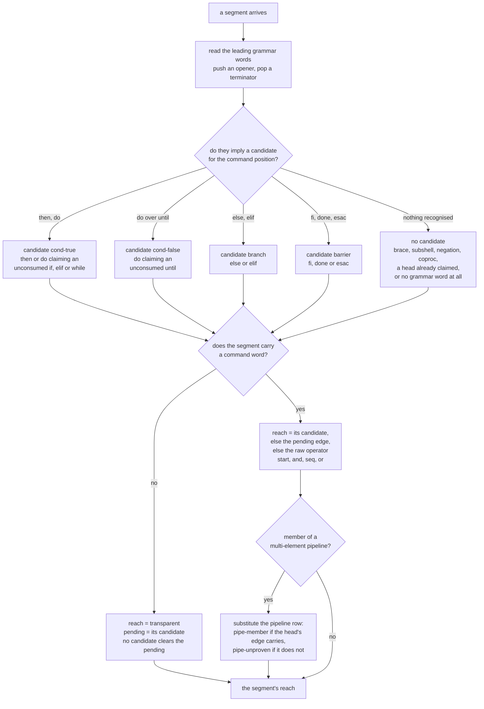
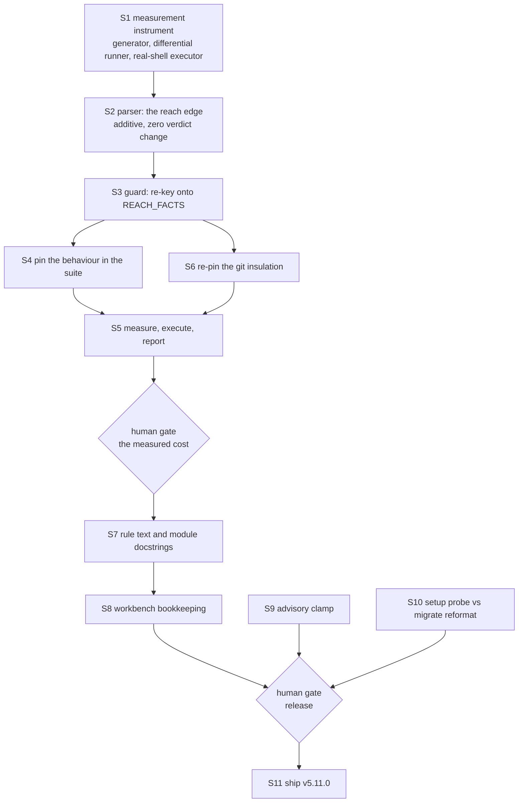

# Implementation Plan: the shell reachability model

**Date:** 2026-08-06
**Status:** Approved by user 260807-0016. Constraint 1 confirmed in the planner's reading: every deny-to-allow transition needs individual real-shell justification; an unjustified one is a regression.
**Revised 260807-0130**, repair pass against the diagram evaluation `reviews/260807-0002-conceptrev-plan-shell-reachability-model.md` (verdict tangled, diagram 2 only). Three findings resolved in place: the reach layer gains a **pending-edge rule** so a grammar word on its own line propagates (finding 2); diagram 2 is redrawn total and disjoint (finding 1); the closing-word vocabulary is settled as a second, separately purposed set (finding 3). Two consequences the findings forced out: the layer moves to its own module rather than into the parser, because the import it was told to make would close a module cycle, and the S1 corpus needs a spelling dimension it does not have. Step numbering, the dependency graph and step 1 are untouched.
**Spec:** none — planned from the Circle record `circles/260804-1205-shell-reachability-model/_t_circle.md` and option 2 of `circles/260801-1244-guard-rules-write/decisions/260804-0947_i_should-the-joiner-be-consulted-for-the-segment-that-moves-as-well-as-the-one-that-writes.md`
**Executors:** `coder` (every step; no structured-data file is touched, so `ontocoder` has nothing to own here)
**Measured against:** HEAD `38c5123`, plugin version 5.10.0

---

## Directive

The Circle record states the goal and is not restated. This plan turns it into ordered work.

Three documents bind the design and are cited rather than summarised: option 2 of decision `260804-0947` (the model), issue `circles/260801-1244-guard-rules-write/issues/260804-0839_o_the-flat-joiner-model-ignores-shell-precedence-so-a-pipeline-and-an-if-body-degrade-a-cd-the-shell-guarantees.md` (the live over-deny, its four shapes, its anti-vacuity pins), and section `### The boundary, by coverage` of `circles/260801-1244-guard-rules-write/reviews/260804-0845-coderev-turn7-separator-degrade-and-the-cause-bound.md` (what is closed, open, and out of reach by nature). No step below spends effort on the last group.

**One correction to how constraint 1 has been phrased, because taken literally it contradicts the Directive.** "No command may newly allow" was the parent Circle's invariant in the security direction, where the change set contained no intended relaxation. This Circle exists to make 84 measured commands newly allow. The constraint that is both true and testable here is:

> Every deny-to-allow transition must be individually justified by a shell measurement showing the write lands where the model now says it does. An unjustified transition is a regression, whatever family it belongs to.

That is the form step 5 proves. Stating it any other way makes the Circle's own prize a violation of its own constraint, and the plan would then be graded against a rule nobody could pass.

## Current State

### What the classifier does today

`hooks/lib/shell-parse.ts` is a segmenter, not a parser. `parseCommand` returns a flat list of segments in source order; each carries `depth` (non-zero only inside a `$(…)` or backtick body) and `joiner` — the operator standing immediately before it at its own nesting level, drawn from `start`, `&&`, `||`, `;`, `|`, `&`, `newline`.

`hooks/lib/bash-mutation-guard.ts` walks that list left to right carrying a virtual working directory (`ShellState`), and asks two questions of every segment through one table, `JOINER_FACTS` (`:2289`), read at exactly one place (`joinerFacts(segment.joiner)`, `:3213`):

- `carriesCdForward` — may a directory change taken earlier be carried across this joiner into this segment?
- `movesCallingShell` — does a directory builtin written *in* this segment move the calling shell?

Both answers, when false, call `degradeUnprovenCd`, which sets the modelled directory to **unknown**. An unknown directory makes every later relative operand unplaceable, and an unplaceable write of a recognised mutation denies fail-closed. That is why both give-ups are safe in the security direction: giving up can only deny.

### Why the model over-denies

The joiner is one adjacent operator, and the shell's reachability rules are not flat. `|` binds tighter than `&&`; a compound command's body is reached on a condition the separator does not express. So the degrade fires on four shapes where the shell does guarantee the directory change, all pinned as costs in the suite today (`hooks/lib/__tests__/bash-mutation-guard.test.ts:3489-3508`):

```
if cd hooks; then rm -rf dist; fi
while cd build; do rm out.js; done
{ cd build; } && rm out.js
cd hooks && npx tsc | tee typecheck.log
```

84 of 84 generated rows of that family deny. `until cd X; do W; done` is the member of the same family whose body runs when the directory change **failed**, so its 12 generated rows deny correctly and must keep denying.

### What is already right and must not be disturbed

- **The git branch classifier is insulated by construction.** It consumes `extractCommandSegments(stripDataRegions(cmd))`, a separate flat segmenter left byte-identical on purpose, and is pinned twice in `hooks/lib/__tests__/git-branch-guard.test.ts`: a gold fixture of 98 command verdicts (`fixtures/git-verdicts-head.json`, `:736`) and a source assertion that the mutation parser never enters it (`:755-760`, forbidding `parseCommand`, `ParsedSegment` and `joiner`).
- **One fact about an edge lives in one place.** `hooks/lib/__tests__/bash-mutation-guard.test.ts:3771-3818` greps the module: exactly one read of the field, no comparison against an edge literal anywhere in code, and the lookup answers "neither" for an edge it has never heard of. That safe-list inversion is what makes a future addition fail closed.
- **`command-word.ts` already enumerates the OPENING grammar words, and only those.** `GRAMMAR_PREFIXES` (`:58-70`) holds `{`, `(`, `!`, `if`, `elif`, `then`, `else`, `while`, `until`, `do`, `coproc`, so `then rm -rf dist` already classifies as the `rm` it is. **The closing words are not there and their absence is deliberate**, which the plan's first draft got wrong and the diagram evaluation caught. The set's own docstring (`:44-52`) defines it as "every reserved word that is followed by a COMMAND in the same position" and names `fi`, `done`, `esac` and `}` as the exclusion, because a terminator is never followed by a command inside one segment. `findCommandWord` (`:183-191`) skips every member when locating the command word, so adding the terminators there would change what counts as a command. Verified in the source rather than inferred: the reach layer needs a second set, and the plan's earlier "reads that set rather than minting a second one" instruction was half right — right for the opening words, wrong for the closing ones. The resolution is in step 2.
- **The module dependency runs one way, and the first draft would have closed it into a cycle.** `command-word.ts:35` imports `resolveWord` from `shell-parse.ts`. A reach layer living *inside* `shell-parse.ts` and reading `GRAMMAR_PREFIXES` from `command-word.ts` would therefore make the two modules mutually dependent, which `HYG-NO-CYCLES` forbids and which the compiled self-contained `hooks/dist/` output would resolve by initialisation order rather than by design. This is why the layer becomes its own module in step 2.
- **Blank mode is pinned byte-for-byte** against the legacy segmenter (`hooks/lib/__tests__/shell-parse.test.ts:86`), and every existing joiner assertion in that file reads the raw operator.

## Approach

**The joiner is replaced by a grammar-derived reachability edge, and nothing else about the mechanism changes.**

The two questions the guard asks are the right two questions; they were being answered from the wrong input. So a grammar layer computes, per segment, how that segment is reached from the preceding command position — reading the shell's grammar rather than one adjacent character — and the guard's existing one-table, one-reader, safe-list machinery is re-keyed onto that richer vocabulary. `JOINER_FACTS` becomes `REACH_FACTS`, same two fields, same default, same single call site.

**The layer sits beside the segmenter rather than inside it**, in a new module `hooks/lib/shell-reach.ts` that imports from both `shell-parse.ts` and `command-word.ts` and is imported by the mutation guard alone. The first draft put it in the parser; the two facts in Current State above make that the wrong home, because the import it needs would close a module cycle. The move is a strict improvement on two counts beyond avoiding the cycle: invariant 1 stops being a promise the coder has to keep and becomes structural, since `shell-parse.ts` is then not edited at all, and the git classifier's insulation gains a whole module name to forbid rather than three identifiers.

This is the reuse the design rests on. The alternative shape considered and rejected was to make pipeline elements a new kind of scope alongside `(…)` and `$(…)`, with a push-and-restore stack. That reads well in prose, and it is what the decision record's option 2 gestures at, but it is strictly more machinery for strictly less safety: a restored scope hands the outer walk its *old* directory, and `echo hi | cd build && rm out.js` would then allow where it denies today. Step 1's witness has since measured that command in both shells and the reasoning holds: **zsh removes `build/out.js` and bash removes nothing**, so the honest answer across both shells is "unknown", not "unchanged". The rejection now rests on an observation rather than on an argument. The edge vocabulary expresses the same subshell fact with the mechanism already in the module.

### The edge vocabulary

Four inputs decide a segment's edge: the raw operator before it, the grammar words leading the segment itself, the stack of open compound heads, and whether the segment sits inside a multi-element pipeline.

| Edge | Reached by | carriesCdForward | movesCallingShell |
|---|---|---|---|
| `start` | first segment of a scope | yes | yes |
| `and` | `&&` | yes | yes |
| `seq` | `;`, a newline, `&` | no | yes |
| `or` | `\|\|` | no | **no** |
| `cond-true` | `then` claiming an unconsumed `if` or `elif` head; `do` claiming an unconsumed `while` head | **yes** | yes |
| `cond-false` | `do` claiming an unconsumed `until` head | **no** | yes |
| `branch` | `else`, and an `elif` condition | no | yes |
| `barrier` | the first command position after `fi`, `done` or `esac`, whatever operator joins it | no | yes |
| `transparent` | a segment carrying grammar words and no command | yes | yes |
| `pipe-member` | a segment of a multi-element pipeline whose head's edge carries | yes | **no** |
| `pipe-unproven` | a segment of a multi-element pipeline whose head's edge does not carry | no | **no** |

Every row is two literal booleans. That is the repair the diagram evaluation forced, and it is worth stating as a rule of its own because the suite pins it:

> **The pass resolves, the table states.** Every inheritance in this model — the pipeline member's carry answer, the propagation of an edge through a segment that runs nothing — is resolved by the annotation pass into one of the literal rows above. `REACH_FACTS` therefore stays one row per edge with two constant fields, and no row's answer depends on another segment.

The first draft had `pipe-member` inherit its carry answer at lookup time, which is not something a two-field table row can express. Splitting it into `pipe-member` and `pipe-unproven` says the same thing in the form the table actually has.

Four rows carry the change and each earns its place:

**`cond-true` is the relief.** Reaching `then` proves the `if` condition returned zero; reaching `do` proves the `while` condition did. Both are guarantees the flat model could not express, and both are what the four target shapes need.

**`cond-false` is the counter-example that keeps the work honest.** `until`'s body is reached when the condition returned non-zero, so the degrade is correct there and survives. The head stack is what makes `do` mean two different things, and it is why `until` cannot be closed by a blanket exemption for grammar words.

**`transparent` types the segment that runs nothing, and the pending rule carries its edge to the segment that does.** This is the load-bearing correction. A segment carrying only grammar words has no command to classify and no operand to resolve, so typing it inert is right — but typing it inert is not enough, because in the multi-line spelling the edge those grammar words prove belongs to the *next* segment. The pending rule below is what delivers it there.

**`pipe-member` and `pipe-unproven` never move the calling shell, head included.** Today a pipeline head answers `movesCallingShell: true` because its own leading joiner is whatever preceded the pipeline. bash subshells every element of a multi-element pipeline, head included, so `cd build | grep x && rm out.js` must keep denying — and under naive head-inheritance it would allow. Step 1's witness measured the neighbouring shape and found the shells disagree, which is the evidence for taking the pessimistic answer in both rows.

### How a segment is typed: one candidate, one consumption

The mechanism is two rules, and they are what make the same shell construct classify the same way however its line breaks fall. The annotation pass walks the segments of one scope left to right, holding a stack of open compound heads and one **pending edge**.

**The candidate rule.** A segment's leading grammar words imply at most one *candidate* edge for the command position that follows them: `cond-true`, `cond-false` or `branch` from a body word, `barrier` from a terminator, and nothing at all from `{`, `}`, `(`, `!`, `coproc`, from a body word whose head has already been claimed, or from a segment with no leading grammar word.

**The consumption rule.** A segment that carries a command word consumes an edge: its own candidate if it has one, otherwise the pending edge if one is waiting, otherwise the raw operator's edge. A segment that carries **no** command word consumes nothing: it types `transparent`, and its candidate becomes the pending edge for the next command position, a candidate of "nothing" clearing any pending edge that was waiting.

Both spellings of the flagship case now travel the same path. In `if cd X; then W; fi` the segment `then W` carries both the body word and the command, so it consumes its own candidate and types `cond-true`. In the four-line spelling the bare `then` types `transparent` and hands `cond-true` on, and `W` — which has no candidate of its own — consumes it instead of falling through to its raw newline joiner. The line break stops mattering, which is exactly what the review found it must.

Three consequences worth naming, because each is a test:

**Deferring a degrade by one segment cannot change a verdict.** `transparent` answers yes to the carry question, so the pass no longer gives up at the grammar word itself. It gives up at the next command position instead, through `barrier` after a terminator or through the raw operator once the pending edge is cleared. Nothing reads the directory model in between, because a grammar-only segment has no operand to place and no directory builtin to apply. The safety of the whole `transparent` row rests on that sentence, so step 4 pins it against a shape where the degrade must still arrive.

**A brace group works without a scope.** `{ cd build; } && rm out.js` segments as `{ cd build` / `}` / `rm out.js`. The `}` implies no candidate, so it clears the pending edge and the write consumes its own `&&`, which proves the group returned zero — a group's status is its last command's status. Contrast `{ cd build; ls; } && rm out.js`, where the chain is already broken by the `;` before `ls`, so that one still denies, correctly. `fi`, `done` and `esac` are **not** neutral in the same way: an `if` with no `else` returns zero when its condition fails, so `&&` after `fi` proves nothing about anything inside, and their candidate is `barrier`.

**Each open head is claimed by exactly one body word.** This is what keeps an unrecognised compound from borrowing an enclosing guarantee. `for` and `case` are not in the opening vocabulary at all, so in `while cd X; do A; for f in *; do B; done; done` the inner `do` finds the `while` head already claimed and falls through to its raw operator, which degrades. Without the claim rule the inner body would inherit `cond-true` from a head it does not belong to. This costs nothing that matters — a `for` body degrading is today's behaviour — and it is the cheapest available proof that the layer models heads rather than pattern-matching the word `do`.

### The two invariants that bound the blast radius

1. **The parser is not edited at all.** In the first draft this invariant was a promise about a field added to `ParsedSegment`; with the layer in its own module it is structural. `shell-parse.ts` keeps its exports, its `joiner` semantics and its segmentation, every existing assertion in `shell-parse.test.ts` stands unmodified, and blank mode is byte-identical because no byte of it changed. The layer reads the segment list the parser already returns and annotates a copy — it never splits differently, because it cannot.
2. **An edge the layer cannot type falls back to today's flat answer.** A `for` body, a `case` arm, a function body, a construct nobody has thought of: the edge resolves to whatever the raw joiner answers now. Only shapes the layer positively recognises can move a verdict, which is the containment property step 3's measurement is graded against. The candidate rule is written so that this is the default branch rather than an afterthought, and the redrawn decision procedure below shows it as the one exit every unrecognised shape reaches.

The two pipeline rows are the one place where an answer genuinely changes rather than being added, and it changes in both directions at once: the carry question relaxes (a pipeline element takes the head's carry answer, which is what lets `cd hooks && npx tsc | tee typecheck.log` allow), while the move question tightens to cover the **head** as well as the tail. Both rows are pinned in step 4 as their own cases.

The pass is **per scope**. The pending edge, the head stack and pipeline membership are all properties of one nesting depth; entering a `$(…)` body starts them fresh and leaving it restores them, mirroring what the guard's own walk already does with the directory model. Without that, a grammar word inside a command substitution would hand an edge to a segment outside it.

### Where the change sits



The two paths out of `cmd` never meet, which is the structural reason the gold fixture can stay untouched. The one cycle in the graph is deliberate and is not a dependency cycle: the walk carries mutable state, so a give-up writes the working directory back into the walk it came from and the walk continues with the next segment.

### How an edge is decided

Two phases, drawn in the order the pass evaluates them. Phase one reads the segment's leading grammar words into at most one candidate edge; phase two decides who consumes it. The pipeline substitution is last, because a pipeline head can itself lead with a body word.



The procedure is total and its branches are disjoint, which the first draft's version claimed and did not deliver. `cand` partitions on the leading words with `nothing recognised` as the catch-all, so a word that is not a recognised body word or terminator lands there rather than in two places at once; `hasCmd` and `pipe` are yes-or-no with both exits drawn. Invariant 2 is the `consume` node's third clause, reached by every shape the layer does not positively recognise — including every segment that arrives with no grammar word and no pending edge, which is the ordinary flat command and the overwhelming majority of the corpus.

## Implementation Steps

The step numbers are stable references; the dependency graph below them is the order that matters.



---

1. [DONE] **Build the measurement instrument before touching the classifier** — commit `3dc5014`. Generator produces 24,304 rows; committed fixture pins 448. A seventh wrapper (`pipe-head`) was added beyond the six named here, because without it the instrument cannot measure the risk this plan's own risk table names.
   - Executor: `coder`
   - Files: `hooks/lib/__tests__/helpers/reachability-corpus.ts` (new), `hooks/lib/__tests__/helpers/shell-witness.ts` (new)
   - Changes: a deterministic cross-product generator over heads (`true`, `false`, `[ -d nope ]`, `echo hi`, `ls`, none) × joiners × the four directory builtins × compound wrappers (`if`, `while`, `until`, brace group, pipeline, bare) × write verbs (`rm`, `rm -rf`, `mv`, `sed -i`, `cp`, redirection, `tee`) × targets (protected and unprotected, relative and absolute). Export the generator as a function so a test can consume it; keep it seedless so two runs produce the same rows in the same order. Alongside it, a witness runner that takes one row, materialises a throwaway project outside the repository, seeds the target file, executes the row in `bash` and in `zsh`, and reports for each shell whether the file survived. Capture the full-corpus verdict baseline at HEAD `38c5123` to a scratch file; commit only a bounded subcorpus baseline (the compound-command, pipeline, `||` and `|` families) as `hooks/lib/__tests__/fixtures/mutation-verdicts-head.json`, modelled on the existing `git-verdicts-head.json` and its non-vacuity assertion.
   - Dependencies: none
   - Note: this step exists first on purpose. The parent Circle shipped two enumerations harvested from its own test suite and both were falsified within a day; a corpus harvested from the tests measures reproduction, not cost. The instrument must predate the change it measures, or the same failure is available again.

2. **Add the grammar-derived reach layer, in its own module**
   - Executor: `coder`
   - Files: `hooks/lib/shell-reach.ts` (new), `hooks/lib/__tests__/shell-reach.test.ts` (new), `hooks/lib/command-word.ts` (one added export), `hooks/lib/__tests__/bash-mutation-guard.test.ts` (extend the existing grammar-vocabulary test), `hooks/lib/__tests__/helpers/reachability-corpus.ts` (the spelling dimension), `hooks/lib/__tests__/fixtures/mutation-verdicts-head.json` (regenerated, additions only)
   - Changes: four pieces, in this order.
     1. **The closing-word vocabulary.** Add `GRAMMAR_TERMINATORS` (`fi`, `done`, `esac`, `}`) to `command-word.ts` directly beneath `GRAMMAR_PREFIXES`, exported, with a docstring stating that the two sets answer different questions and are disjoint by construction. **Do not extend `GRAMMAR_PREFIXES`.** Its own docstring (`:44-52`) defines it as the reserved words followed by a command in the same position and names these four as the deliberate exclusion, and `findCommandWord` (`:183-191`) skips every member when locating the command word, so adding them there would change what counts as a command — a behaviour change outside invariant 1. Extend the existing both-directions test (`bash-mutation-guard.test.ts:1850`) to assert the two sets are disjoint and that `findCommandWord` still finds the command word in a segment led by a terminator.
     2. **The layer.** `hooks/lib/shell-reach.ts` exports `SegmentReach`, `ReachedSegment`, `REACH_FACTS`'s key type, and `annotateReach(segments: readonly ParsedSegment[]): ReachedSegment[]`. It implements the candidate rule, the consumption rule, the one-body-word-per-head claim rule and the pipeline substitution as written in the Approach, holding the pending edge, the head stack and pipeline membership **per nesting depth**. It imports `GRAMMAR_PREFIXES`, `GRAMMAR_TERMINATORS` and `findCommandWord` from `command-word.ts` and the segment types from `shell-parse.ts`. `shell-parse.ts` is not edited; the import direction stays one-way and the module cycle the first draft would have closed does not arise.
     3. **The unit tests.** `shell-reach.test.ts` reads `reach` as a table the way the existing tests read `joiner`, over every row of the vocabulary. It must cover, as named cases: both spellings of each compound wrapper and their equality; a `for` body nested in a `while` body falling through to the raw operator; a grammar word inside `$(…)` handing nothing to the segment after the substitution closes; and a pipeline whose head leads with a body word.
     4. **The corpus spelling dimension.** The S1 generator renders the four compound wrappers single-line only (`reachability-corpus.ts:461-486`, verified) and its `newline` joiner only attaches the head to the construct. The multi-line spelling is therefore absent from all 24,304 rows — and it is now the shape whose verdict this layer changes, so the S5 differential cannot see the repair without it. Add a spelling dimension over the four compound wrappers (`if`, `while`, `until`, brace group), leaving `bare`, `pipeline` and `pipe-head` single-line since they have no body to break across lines. Then regenerate `mutation-verdicts-head.json` **at this step, before S3 lands**: the 448 rows already committed must reproduce their verdicts byte for byte, and the file may only grow. The regeneration is licensed by this step's proof obligation and by nothing else.
   - Dependencies: S1
   - Proof obligation: the guard does not read the new module yet, so re-running the differential runner from S1 across the pre-existing rows must report **zero** moved in either direction. A non-zero result means the layer reached the guard early or the corpus change altered an existing row, both of which invalidate the S5 measurement's left-hand side.

3. **Re-key the guard's two questions onto the reach edge**
   - Executor: `coder`
   - Files: `hooks/lib/bash-mutation-guard.ts`
   - Changes: rename `JOINER_FACTS` to `REACH_FACTS` and re-key it on `SegmentReach`, keeping both field names, the `JOINER_UNKNOWN`-equivalent safe-list default, the single reader, and the export-as-review-surface stance. Every row holds two literal booleans, including the two pipeline rows — the pass resolves, the table states. The walk calls `annotateReach` on the segment list `parseCommand` returns and its one lookup reads `segment.reach`. Update the module docstring's `TWO PRECISIONS ON THE WORD &&` section (`:104-128`) to state the reachability model and to move `260804-0839` from "still open" to closed, keeping the `until` counter-example where it is.
   - Dependencies: S2
   - Note: this is the step that moves verdicts. It should be one commit, so the differential run has a single boundary to measure across.

4. **Pin the behaviour, including the shapes that must not move**
   - Executor: `coder`
   - Files: `hooks/lib/__tests__/bash-mutation-guard.test.ts`, `hooks/lib/__tests__/guard-bash-integration.test.ts`
   - Changes: the four relief families allow (`if cd hooks; then rm -rf dist; fi`, `while cd build; do rm out.js; done`, `{ cd build; } && rm out.js`, `cd hooks && npx tsc | tee typecheck.log`), and the same shapes against a protected target still deny so the block cannot pass by allowing everything. **Every compound row is asserted in both spellings and the two verdicts must be equal** — that pairing is the machine-checkable form of the defect the diagram evaluation found, and it belongs beside the relief rows rather than in a corner of its own. The `until` family keeps denying in every row and both spellings; the twelve rows named in Current State are the named subset of a larger corpus family, and the case comment says why the family denies. The anti-vacuity neighbours from issue `260804-0839` are pinned in the same test as their relief partners: `cd hooks; npx tsc | tee typecheck.log` denies while `cd hooks && npx tsc | tee typecheck.log` allows. `{ cd build; ls; } && rm out.js` denies, so `transparent` cannot be read as a blanket exemption for `}`. `cd build | grep x && rm out.js` denies, which is the pipeline-head rule, and `echo hi | cd build && rm out.js` denies, which is `pipe-unproven`. **The deferred degrade gets its own case**: `if cd hooks; then :; fi && rm -rf dist` (and its multi-line twin) must deny, because `transparent` skipping the give-up at `fi` is only safe if `barrier` delivers it at the next command position. A `for` body nested in a `while` body denies, which is the head-claim rule. The existing `||` and `|` cases (`:3648-3757`) are re-run unchanged. The one-fact grep assertion moves from `.joiner` to `.reach` and additionally asserts zero reads of `.joiner` in the mutation guard's code. Move the four relief rows out of the "costs these ordinary shapes" block (`:3489`) into the relief block, leaving that block's rule statement intact.
   - Dependencies: S3
   - Note: the relief rows must be asserted through the real guard subprocess in the integration suite as well as through the unit classifier. The write guard stands down inside this repository, so a unit-level allow assertion can pass for the wrong reason; `helpers/guard-harness.ts` exists for exactly that.

5. **Measure the change in both directions, execute what newly allows, and report**
   - Executor: `coder`
   - Files: `circles/260804-1205-shell-reachability-model/reviews/` (new measurement record)
   - Changes: run the S1 generator against the S2-regenerated baseline and the post-S3 classifier; bucket every row whose verdict moved. For **every** deny-to-allow row, run the witness in `bash` and in `zsh` and record where the write landed — a row that allows while the shell writes a protected path is a regression and blocks the gate. For the allow-to-deny rows, state the cost as a rule with labelled examples and an explicit note that the example set is open, never as a closed list. Both shells belong in the method because they disagree about the last element of a pipeline, and a row must be measured in the shell that performs its write.
   - Three reading rules for the witness, each learned from a fact S1 measured. They cost nothing to apply and the method is unsound without them; `ShellObservation` already carries `status` and `timedOut`, so no instrument change is needed.
     1. **A surviving file is not evidence unless the command ran.** `chdir build && rm out.js` exits 127 under bash, where `chdir` is not a builtin, and removes the file under zsh. A bash observation of "target untouched" on such a row says the shell never reached the write, not that the write was safe. An observation with a non-zero exit status that the row's own logic does not explain justifies nothing.
     2. **A timed-out row yields no evidence at all.** `until popd; do rm out.js; done` terminates in neither shell and the witness cuts it off. A row that cannot be witnessed may therefore not move from deny to allow; if one does, that is a blocker for the gate rather than a footnote in it.
     3. **The two spellings are reported as a pair.** Every compound row now exists single-line and multi-line. They must move together; a split verdict between them means the pending rule is wrong, and it is the one defect this repair was written to close.
   - Dependencies: S4, S6
   - Human gate: **yes.** The user sees the two sets and the shell evidence, and approves before anything ships. This is the gate the Circle record's honesty about the unmeasured cost was reserving.

6. **Re-pin the git branch classifier's insulation**
   - Executor: `coder`
   - Files: `hooks/lib/__tests__/git-branch-guard.test.ts`
   - Changes: extend the source assertion at `:755-760` to forbid `reach`, `SegmentReach`, `REACH_FACTS` and `annotateReach` alongside the three names it already forbids, and — the stronger form the new module makes available — to forbid any import of `shell-reach.js` in `git-branch-guard.ts` at all. Re-run the 98-command gold fixture, which must reproduce byte for byte with no regeneration. If the fixture needs regenerating, the insulation has been breached and the cause is a defect, not a fixture refresh.
   - Dependencies: S3 (readable earlier; only the new names need to exist)

7. **Move the documentation with the model**
   - Executor: `coder`
   - Files: `rules/protected-path-discipline.md`, `hooks/lib/shell-reach.ts` (its own module docstring), `hooks/lib/shell-parse.ts` (the `SegmentJoiner` docstring at `:102-131`, comment only)
   - Changes: five passages go wrong the moment the model changes and are rewritten together. The rule statement at `:142-148` ("unknown in every segment that is reachable without an `&&`") becomes the reachability statement. The joiner table at `:150-160` becomes the edge table, keeping its three-column shape and its closing sentence that anything not in the table counts as no to both. Question 2 and question 3 of the four-question procedure at `:163-190` are re-stated over the edge rather than over the adjacent operator, and question 3's "is every joiner between the mover and the write an `&&`" acquires the compound-command answers. The "Written, not run" paragraph at `:203-212` keeps the control row exactly as it stands, because that residual does not move. The residual paragraph at `:338-345` drops the clause naming a conditional body, a loop body, a brace group and a pipeline stage as a deny you pay, and the catalogue count is corrected to what the catalogue then holds.
   - Dependencies: S5 gate
   - Note: `reference-resolution-lint.test.ts` checks that citations in rule text resolve, and `rules/rule-file-provenance.md` governs the `**Provenance:**` header. Read both before editing; the header stays as it is, since the file is not new.
   - Note: the `SegmentJoiner` docstring stays true about the joiner and becomes misleading about its consumer, since it tells a reader that a `cd` may only be carried across `&&`. The edit there is a **comment only** — one paragraph pointing at `shell-reach.ts` for the model the mutation guard now uses — and it happens after the S5 gate, so invariant 1's "the parser is not edited" claim is about S2 and S3 and is not weakened by it.

8. **Close the parent Circle's ledger where this work reaches it**
   - Executor: `coder`
   - Files: `circles/260801-1244-guard-rules-write/issues/260804-0839_o_….md` (rename to `_c_`), `circles/260801-1244-guard-rules-write/analyses/260805-0717-protected-path-forensics.md`
   - Changes: append a `Resolved:` note to the issue naming the commit and the measured relief, then rename its marker from open to closed. Append a closure note to the forensics catalogue entry in section 1 ("One honest edge, still open, and it costs rather than leaks"), which the shipped rule file points readers at and which becomes wrong on the same commit. Both records stay where they are — the Origin Rule's second corollary is that reach is cited, never placed, so nothing moves into this Circle.
   - Dependencies: S7
   - Note: what stays open and must be said plainly in both notes: the control row `[ -d nope ] || cd build && rm rules/x.md` denies before and after, because reachability is a static property and an exit status is not. `mv "$f"` and the whole unresolvable-operand class are untouched by this Circle.

9. **Clamp the two unbounded guard advisory details**
   - Executor: `coder`
   - Files: `hooks/guard.ts`, `hooks/lib/rules-write-exemption.ts`, `hooks/lib/__tests__/monitor-warnings-panel.test.ts`
   - Changes: route both advisory details through `forEvent()` — the rules-write exemption's path list at `guard.ts:565` and the git override note at `:593` (line numbers per reconciliation `260806-1152`; read them out of the file rather than trusting the citation). For the path list, drop whole entries and append `(+N more)` rather than truncating mid-path; that is a `rulesWriteDetail` change in `rules-write-exemption.ts`, not a `forEvent` change. Add a test that a 30-path exemption and a long override command both produce a detail within `EVENT_DETAIL_MAX`.
   - Dependencies: none
   - Source: `circles/260801-1244-guard-rules-write/issues/260803-1352_o_two-guard-advisory-details-skip-the-200-char-clamp-and-render-a-row-nine-times-normal-height.md` — cited, not moved; append the resolution note and rename its marker on completion.

10. **Give setup's bracket probe and migrate's reformat pass the same tree**
    - Executor: `coder`
    - Files: `skills/setup/SKILL.md`, `skills/migrate/SKILL.md`
    - Changes: the two must move in one commit, because the criterion is a relation between them — the detector may only look for things the executor can remove. Recommended resolution: widen migrate's reformat candidate `find` (`skills/migrate/SKILL.md:85`, today `shared/` at any depth plus `circles/` from depth 2) to the tree setup probes (`skills/setup/SKILL.md:43`, the whole workbench minus `archive/`, `stashes/` and `.migration-v2-backup/`). Widening is preferred over narrowing the probe because it loses no file: a bracket-marker file at the workbench root gets converted rather than silently left behind an un-flagged detector.
    - Dependencies: none
    - Human gate: **only if the recommendation does not hold.** If widening migrate changes its behaviour in some way the coder cannot bound, the choice is a decision to record rather than to make: file a decision record in this Circle's decision store and stop, rather than picking.
    - Source: `circles/260805-2005-textschicht-gegen-code-nachziehen/issues/260806-0022_o_setup-klammer-probe-und-migrate-reformat-decken-verschiedene-baeume.md` — cited, not moved; append the resolution note and rename its marker on completion.

11. **Ship it**
    - Executor: `coder`
    - Files: `hooks/dist/**`, `.claude-plugin/plugin.json`, `install.sh`, `README.md`, and the marketplace clone's `.claude-plugin/marketplace.json`
    - Changes: follow the release process in `CLAUDE.md`. Validate first (`claude plugin validate .` must pass, plus the agent-resolution smoke test), and confirm the guard was verified against a project root that is not this repository — the write guard's self-detect stand-down here makes a local check unrepresentative by construction, and the S4 integration cases through `guard-harness.ts` are what satisfies it. Then rebuild `hooks/dist/` and commit it, bump `.claude-plugin/plugin.json` to 5.11.0, pull and bump the marketplace clone, commit and push both repositories, tag `v5.11.0` and push the tag, and refresh both `FUSION_REF` pin examples in the same commit as the version bump: `install.sh:27` and `README.md:26`, which is the surface a user reads first and the one that drifted for months.
    - Dependencies: S8, S9, S10, and the S5 human gate
    - Human gate: **yes.** The version bump and the two pushes are the point at which the change becomes live for consuming projects.
    - Note: the parent Circle shipped v5.9.0 through v5.9.2 and the text layer shipped v5.10.0, so the over-deny this Circle closes is live for consuming projects right now. Nothing in this Circle reaches a user until this step runs.

## Data Structures

Nothing in `hooks/lib/shell-parse.ts` changes. The new types live in `hooks/lib/shell-reach.ts` and wrap the parser's output rather than altering it:

```ts
/** How a segment is reached from the preceding command position in its scope. */
export type SegmentReach =
  | "start" | "and" | "seq" | "or"
  | "cond-true" | "cond-false" | "branch"
  | "barrier" | "transparent"
  | "pipe-member" | "pipe-unproven";

/** A parsed segment plus its reach edge. `ParsedSegment` itself is untouched. */
export interface ReachedSegment extends ParsedSegment {
  reach: SegmentReach;
}

export function annotateReach(
  segments: readonly ParsedSegment[],
): ReachedSegment[];
```

One added export in `hooks/lib/command-word.ts`: `GRAMMAR_TERMINATORS` (`fi`, `done`, `esac`, `}`), a second set beside `GRAMMAR_PREFIXES` and disjoint from it. It answers a different question — which words *close* a compound — and no existing consumer reads it, so `findCommandWord` behaves exactly as before.

One rename and re-key in `hooks/lib/bash-mutation-guard.ts`: `JOINER_FACTS: ReadonlyMap<SegmentJoiner, JoinerFacts>` becomes `REACH_FACTS: ReadonlyMap<SegmentReach, ReachFacts>`, with `carriesCdForward` and `movesCallingShell` unchanged in name and meaning, and the absent-row default unchanged in both fields.

**Every row is two literal booleans, with no exception.** The first draft carried one — `pipe-member`'s carry answer inherited the pipeline head's — and a two-field row cannot express that. The pass resolves the inheritance into one of two literal rows (`pipe-member`, `pipe-unproven`) instead, and it resolves the propagation through a grammar-only segment the same way, by handing the next command position a literal edge. The grep-checkable one-row-per-edge property the suite pins therefore holds for the whole table rather than for all-but-one of it.

## API Changes

None outside `hooks/lib/`. Both changed exports (`ParsedSegment`, the facts table) are internal to the hooks package; no `bin/` helper, no agent prompt, and no skill body reads them.

## Testing Strategy

Four levels, and the order is the order of increasing cost:

1. **Reach-layer unit** (`shell-reach.test.ts`, new) — `reach` read as a table across every shape in the vocabulary, single-line and multi-line, with the two spellings asserted equal; plus the nesting cases (a `for` body inside a `while` body, a grammar word inside `$(…)`). `shell-parse.test.ts` is not edited, and its blank-mode equivalence against the legacy segmenter keeps its meaning for free.
2. **Classifier unit** (`bash-mutation-guard.test.ts`) — the relief families in both spellings, the `until` family, the anti-vacuity neighbours, the deferred-degrade case, the two pipeline rows, the `||` and `|` families unchanged, the grammar-set disjointness, and the one-fact grep assertion.
3. **Integration through the real guard subprocess** (`guard-bash-integration.test.ts` via `helpers/guard-harness.ts`) — the relief rows and their protected-target twins, in a throwaway project root, because the guard stands down in this repository and a unit-level allow can pass vacuously.
4. **Generated differential plus real shells** (S1 and S5) — the whole corpus classified before and after, every deny-to-allow row executed in `bash` and `zsh`, the allow-to-deny set stated as a rule with an open example set.

Level 4 is the one that answers the Circle's constraints; levels 1 to 3 are what keeps the answer from regressing afterwards.

## Risks and Mitigations

| Risk | Mitigation |
|---|---|
| A relaxation lets through a command the shell really does execute against a protected path | Every deny-to-allow row is executed in both shells before the gate (S5). A row that allows while the shell writes a protected path blocks the ship. |
| The grammar layer changes segmentation, and blank mode drifts from the legacy segmenter | Invariant 1 is structural now: the layer is a separate module and `shell-parse.ts` is not edited, so the risk is closed by construction rather than by care. S2's zero-movement obligation stands as the check. |
| `transparent` skips the give-up at a grammar word and the give-up never arrives | The pending rule delivers `barrier` or the raw operator to the next command position, and nothing reads the directory model in between. Pinned in S4 as its own case (`if cd hooks; then :; fi && rm -rf dist` denies), in both spellings. |
| The same construct classifies differently depending on where its line breaks fall | The candidate-and-consumption rule is spelling-blind by construction; S4 asserts the two spellings equal for every compound row, and S5 reports them as pairs. This was the diagram evaluation's finding and it is now a test rather than a claim. |
| The reach layer and `command-word.ts` become mutually dependent | The layer is a third module importing both, so the dependency stays one-way. Verified against `command-word.ts:35`, which imports `shell-parse.ts` today. |
| The differential measures a corpus that does not contain the shape the change is about | S2 adds the multi-line spelling to the generator and regenerates the baseline before S3 lands, with the already-committed 448 rows required to reproduce byte for byte. |
| `until` is closed along with `if`, because both spell their body with `do` | The compound-head stack is what distinguishes them, and 12 rows are pinned as their own case with the reason in the comment (S4). It is also the cheapest available check that the work modelled reachability rather than pattern-matched `if`. |
| The pipeline head keeps moving the calling shell, so `cd build \| grep x && rm out.js` newly allows | Both pipeline rows answer no to the move question, head included, and the shape is pinned as its own case (S4). This is the one place inheritance would have been wrong in the allow direction, and S1 added the `pipe-head` wrapper so the corpus can measure it rather than only the suite asserting it. |
| The git branch classifier is dragged into the mutation parser | Two pins, both kept: the 98-command gold fixture must reproduce with no regeneration, and the source assertion is extended to the three new names (S6). |
| The cost is stated as a closed list and falsified within a day, for the third time | Constraint 4 is a step, not a hope: S1 builds a generated cross-product before the change exists, and S5 is required to state a rule with an example set explicitly labelled open. |
| The documentation ships describing a model the code no longer has | S7 is a step with a dependency, not an afterthought, and it names the five passages by line. The residual catalogue the shipped file points at is corrected in S8 on the same pass. |
| Line citations in the two absorbed defects have drifted again | Both issues have been re-cited by reconcilers twice already. S9 and S10 both say to read the line out of the file rather than trust the citation. |
| The work is done and never becomes live | S11 is a step with a human gate. The parent Circle's step 10 was the last thing to happen and it nearly did not. |

## Open Questions

- [ ] **Does the relief set stay inside the four named families?** The plan predicts it does, because invariant 2 confines movement to positively recognised edges. The prediction is unverified until S5 runs, and if the set is wider the extra rows need shell evidence like every other member. The prediction now covers twice as many rows in those families, since each compound row exists in two spellings and both must move.
- [ ] **Is the multi-line relief itself justified in the shell, or only in the grammar?** The argument is that reaching `then` proves the condition returned zero whatever the whitespace, which is not in doubt as shell semantics. What is unverified is that the guard's whole path — segmentation, the pending rule, the walk — produces the same directory model for both spellings on real commands. S5's paired reporting is what answers it, and a split pair blocks the gate.
- [ ] **Whether widening migrate's reformat tree (step 10) has a consequence the issue did not consider.** The issue names two resolutions and a criterion; the plan recommends one. If the coder finds a reason the recommendation does not hold, that is a decision to record rather than to make.
- [ ] **Three decision records are open or answered-but-unrealised in scope and none of them binds this work**, recorded here so the next reader does not re-check: `shared/decisions/260806-1152_o_stash-manifest-dirname-and-pointer-content-duplicate.md` (stash manifest, unrelated), `shared/decisions/260719-2141_a_concurrency-worktree-slots-vs-single-active-circle.md` and `shared/decisions/260801-1020_a_where-does-normative-consistency-live.md` (both answered, neither realised by anything in this plan).

## Before starting

Run `fusion --update` and restart the session. The work-tree preference covers `bin/fusion-rules` and `bin/fusion-paths` only; the hooks themselves always run from the installed copy and are pinned for the whole session, so a stale install means stale guard behaviour while the guard's own sources are being edited. This is behaviour rule (a) of decision `circles/260805-2005-textschicht-gegen-code-nachziehen/decisions/260806-0015_*_veraltete-regeln-im-eigenen-repo-melden-oder-umgehen.md`, and it applies to every step from S1 onward.
