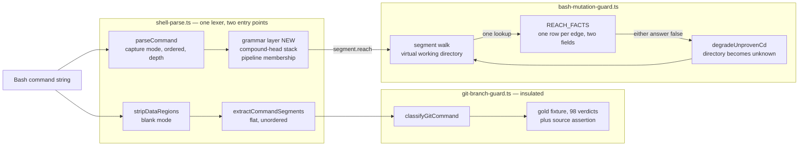
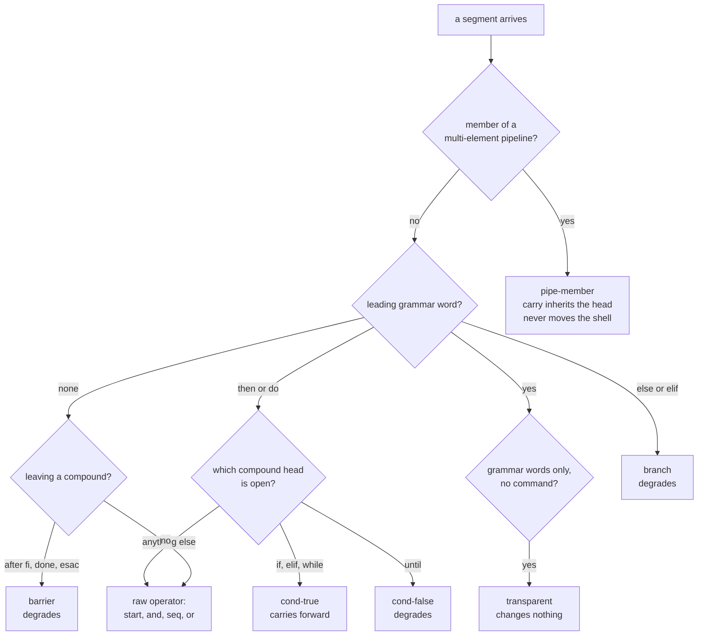
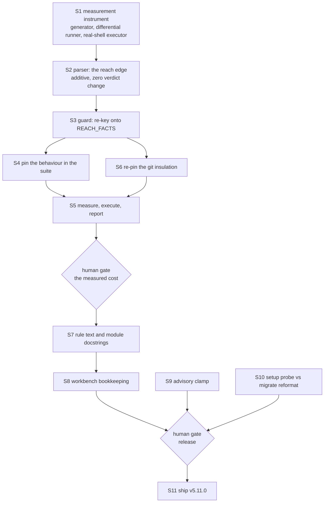

# Implementation Plan: the shell reachability model

**Date:** 2026-08-06
**Status:** Draft
**Spec:** none — planned from the Circle record `circles/260804-1205-shell-reachability-model/_t_circle.md` and option 2 of `circles/260801-1244-guard-rules-write/decisions/260804-0947_i_should-the-joiner-be-consulted-for-the-segment-that-moves-as-well-as-the-one-that-writes.md`
**Executors:** `coder` (every step; no structured-data file is touched, so `ontocoder` has nothing to own here)
**Measured against:** HEAD `38c5123`, plugin version 5.10.0

---

## Directive

The Circle record states the goal and is not restated. This plan turns it into ordered work.

Three documents bind the design and are cited rather than summarised: option 2 of decision `260804-0947` (the model), issue `circles/260801-1244-guard-rules-write/issues/260804-0839_o_the-flat-joiner-model-ignores-shell-precedence-so-a-pipeline-and-an-if-body-degrade-a-cd-the-shell-guarantees.md` (the live over-deny, its four shapes, its anti-vacuity pins), and section `### The boundary, by coverage` of `circles/260801-1244-guard-rules-write/reviews/260804-0845-coderev-turn7-separator-degrade-and-the-cause-bound.md` (what is closed, open, and out of reach by nature). No step below spends effort on the last group.

**One correction to how constraint 1 has been phrased, because taken literally it contradicts the Directive.** "No command may newly allow" was the parent Circle's invariant in the security direction, where the change set contained no intended relaxation. This Circle exists to make 84 measured commands newly allow. The constraint that is both true and testable here is:

> Every deny-to-allow transition must be individually justified by a shell measurement showing the write lands where the model now says it does. An unjustified transition is a regression, whatever family it belongs to.

That is the form step 5 proves. Stating it any other way makes the Circle's own prize a violation of its own constraint, and the plan would then be graded against a rule nobody could pass.

## Current State

### What the classifier does today

`hooks/lib/shell-parse.ts` is a segmenter, not a parser. `parseCommand` returns a flat list of segments in source order; each carries `depth` (non-zero only inside a `$(…)` or backtick body) and `joiner` — the operator standing immediately before it at its own nesting level, drawn from `start`, `&&`, `||`, `;`, `|`, `&`, `newline`.

`hooks/lib/bash-mutation-guard.ts` walks that list left to right carrying a virtual working directory (`ShellState`), and asks two questions of every segment through one table, `JOINER_FACTS` (`:2289`), read at exactly one place (`joinerFacts(segment.joiner)`, `:3213`):

- `carriesCdForward` — may a directory change taken earlier be carried across this joiner into this segment?
- `movesCallingShell` — does a directory builtin written *in* this segment move the calling shell?

Both answers, when false, call `degradeUnprovenCd`, which sets the modelled directory to **unknown**. An unknown directory makes every later relative operand unplaceable, and an unplaceable write of a recognised mutation denies fail-closed. That is why both give-ups are safe in the security direction: giving up can only deny.

### Why the model over-denies

The joiner is one adjacent operator, and the shell's reachability rules are not flat. `|` binds tighter than `&&`; a compound command's body is reached on a condition the separator does not express. So the degrade fires on four shapes where the shell does guarantee the directory change, all pinned as costs in the suite today (`hooks/lib/__tests__/bash-mutation-guard.test.ts:3489-3508`):

```
if cd hooks; then rm -rf dist; fi
while cd build; do rm out.js; done
{ cd build; } && rm out.js
cd hooks && npx tsc | tee typecheck.log
```

84 of 84 generated rows of that family deny. `until cd X; do W; done` is the member of the same family whose body runs when the directory change **failed**, so its 12 generated rows deny correctly and must keep denying.

### What is already right and must not be disturbed

- **The git branch classifier is insulated by construction.** It consumes `extractCommandSegments(stripDataRegions(cmd))`, a separate flat segmenter left byte-identical on purpose, and is pinned twice in `hooks/lib/__tests__/git-branch-guard.test.ts`: a gold fixture of 98 command verdicts (`fixtures/git-verdicts-head.json`, `:736`) and a source assertion that the mutation parser never enters it (`:755-760`, forbidding `parseCommand`, `ParsedSegment` and `joiner`).
- **One fact about an edge lives in one place.** `hooks/lib/__tests__/bash-mutation-guard.test.ts:3771-3818` greps the module: exactly one read of the field, no comparison against an edge literal anywhere in code, and the lookup answers "neither" for an edge it has never heard of. That safe-list inversion is what makes a future addition fail closed.
- **`command-word.ts` already skips the grammar words.** `GRAMMAR_PREFIXES` (`:58`) holds `if`, `elif`, `then`, `else`, `while`, `until`, `do`, `{`, `(`, `!`, `coproc`, so `then rm -rf dist` already classifies as the `rm` it is. The grammar vocabulary the parser needs is therefore already enumerated once in this repository, and the new layer reads that set rather than minting a second one.
- **Blank mode is pinned byte-for-byte** against the legacy segmenter (`hooks/lib/__tests__/shell-parse.test.ts:86`), and every existing joiner assertion in that file reads the raw operator.

## Approach

**The joiner is replaced by a grammar-derived reachability edge, and nothing else about the mechanism changes.**

The two questions the guard asks are the right two questions; they were being answered from the wrong input. So the parser gains a grammar layer that computes, per segment, how that segment is reached from the preceding command position — reading the shell's grammar rather than one adjacent character — and the guard's existing one-table, one-reader, safe-list machinery is re-keyed onto that richer vocabulary. `JOINER_FACTS` becomes `REACH_FACTS`, same two fields, same default, same single call site.

This is the reuse the design rests on. The alternative shape considered and rejected was to make pipeline elements a new kind of scope alongside `(…)` and `$(…)`, with a push-and-restore stack. That reads well in prose, and it is what the decision record's option 2 gestures at, but it is strictly more machinery for strictly less safety: a restored scope hands the outer walk its *old* directory, and `echo hi | cd build && rm out.js` would then allow where it denies today, because bash subshells the element while zsh runs the last one in the calling shell and the honest answer across both shells is "unknown", not "unchanged". The edge vocabulary expresses the same subshell fact with the mechanism already in the module.

### The edge vocabulary

Four inputs decide a segment's edge: the raw operator before it, the grammar words leading the segment itself, the stack of open compound heads, and whether the segment sits inside a multi-element pipeline.

| Edge | Reached by | carriesCdForward | movesCallingShell |
|---|---|---|---|
| `start` | first segment of a scope | yes | yes |
| `and` | `&&` | yes | yes |
| `seq` | `;`, a newline, `&` | no | yes |
| `or` | `\|\|` | no | **no** |
| `cond-true` | `then` after an `if` or `elif` condition; `do` after a `while` condition | **yes** | yes |
| `cond-false` | `do` after an `until` condition | **no** | yes |
| `branch` | `else`, and an `elif` condition | no | yes |
| `barrier` | the first command after `fi`, `done` or `esac`, whatever operator joins it | no | yes |
| `transparent` | a segment carrying only grammar words (`fi`, `}`, `then`, `do` on its own line) | yes | yes |
| `pipe-member` | any segment of a multi-element pipeline, **including its head** | inherits the pipeline head's own edge | **no** |

Three rows carry the whole change and each earns its place:

**`cond-true` is the relief.** Reaching `then` proves the `if` condition returned zero; reaching `do` proves the `while` condition did. Both are guarantees the flat model could not express, and both are what the four target shapes need.

**`cond-false` is the counter-example that keeps the work honest.** `until`'s body is reached when the condition returned non-zero, so the degrade is correct there and survives. The head stack is what makes `do` mean two different things, and it is why `until` cannot be closed by a blanket exemption for grammar words.

**`transparent` is what makes a brace group work without a scope.** `{ cd build; } && rm out.js` segments as `{ cd build` / `}` / `rm out.js`. The `}` carries no command, so it neither runs anything nor breaks the chain; the `&&` after it proves the group returned zero, and a group's status is its last command's status. Contrast `{ cd build; ls; } && rm out.js`, where the chain is already broken by the `;` before `ls` — so that one still denies, correctly. `fi` and `done` are deliberately **not** transparent: an `if` with no `else` returns zero when its condition fails, so `&&` after `fi` proves nothing about anything inside, which is what `barrier` says.

### The two invariants that bound the blast radius

1. **The grammar layer is additive at the parser.** `ParsedSegment.joiner` stays exactly as it is, raw operator and all, with every existing assertion in `shell-parse.test.ts` untouched. `reach` is a new field. Segmentation does not change — the layer annotates, it never splits differently — so blank mode stays byte-identical and the equivalence test against the legacy segmenter keeps its meaning.
2. **An edge the layer cannot type falls back to today's flat answer.** A `for` body, a `case` arm, a function body, a construct nobody has thought of: the edge resolves to whatever the raw joiner answers now. Only shapes the layer positively recognises can move a verdict, which is the containment property step 3's measurement is graded against.

The `pipe-member` row is the one place where an answer genuinely changes rather than being added, and it changes in both directions at once: the carry question relaxes (a pipeline element inherits the head's edge, which is what lets `cd hooks && npx tsc | tee typecheck.log` allow), while the move question tightens to cover the **head** as well as the tail. Today a pipeline head answers `movesCallingShell: true` because its own leading joiner is whatever preceded the pipeline. bash subshells every element of a multi-element pipeline, head included, so `cd build | grep x && rm out.js` must keep denying — and under naive head-inheritance it would allow. That row is pinned in step 4 as its own case.

### Where the change sits



The two paths out of `cmd` never meet, which is the structural reason the gold fixture can stay untouched. The one cycle in the graph is deliberate and is not a dependency cycle: the walk carries mutable state, so a give-up writes the working directory back into the walk it came from and the walk continues with the next segment.

### How an edge is decided



Every leaf either names an edge or falls back to `op`, which is invariant 2 drawn.

## Implementation Steps

The step numbers are stable references; the dependency graph below them is the order that matters.



---

1. **Build the measurement instrument before touching the classifier**
   - Executor: `coder`
   - Files: `hooks/lib/__tests__/helpers/reachability-corpus.ts` (new), `hooks/lib/__tests__/helpers/shell-witness.ts` (new)
   - Changes: a deterministic cross-product generator over heads (`true`, `false`, `[ -d nope ]`, `echo hi`, `ls`, none) × joiners × the four directory builtins × compound wrappers (`if`, `while`, `until`, brace group, pipeline, bare) × write verbs (`rm`, `rm -rf`, `mv`, `sed -i`, `cp`, redirection, `tee`) × targets (protected and unprotected, relative and absolute). Export the generator as a function so a test can consume it; keep it seedless so two runs produce the same rows in the same order. Alongside it, a witness runner that takes one row, materialises a throwaway project outside the repository, seeds the target file, executes the row in `bash` and in `zsh`, and reports for each shell whether the file survived. Capture the full-corpus verdict baseline at HEAD `38c5123` to a scratch file; commit only a bounded subcorpus baseline (the compound-command, pipeline, `||` and `|` families) as `hooks/lib/__tests__/fixtures/mutation-verdicts-head.json`, modelled on the existing `git-verdicts-head.json` and its non-vacuity assertion.
   - Dependencies: none
   - Note: this step exists first on purpose. The parent Circle shipped two enumerations harvested from its own test suite and both were falsified within a day; a corpus harvested from the tests measures reproduction, not cost. The instrument must predate the change it measures, or the same failure is available again.

2. **Add the grammar-derived reach edge to the parser**
   - Executor: `coder`
   - Files: `hooks/lib/shell-parse.ts`, `hooks/lib/__tests__/shell-parse.test.ts`
   - Changes: add `SegmentReach` and `ParsedSegment.reach` per the vocabulary table above. Derive it in a pass over the segments `scanSegments` already produces, using a stack of open compound heads and a pipeline-membership marker; read the grammar words from `command-word.ts`'s `GRAMMAR_PREFIXES` rather than minting a second list. Leave `joiner`, the segmentation, and blank mode untouched. New unit tests read `reach` as a table the way the existing tests read `joiner`, including the multi-line spellings (`if cd X` newline `then` newline `W` newline `fi`) where the grammar word is its own segment.
   - Dependencies: S1
   - Proof obligation: the guard does not read the new field yet, so re-running the differential runner from S1 must report **zero** rows moved in either direction. A non-zero result here means the layer changed segmentation, which invariant 1 forbids.

3. **Re-key the guard's two questions onto the reach edge**
   - Executor: `coder`
   - Files: `hooks/lib/bash-mutation-guard.ts`
   - Changes: rename `JOINER_FACTS` to `REACH_FACTS` and re-key it on `SegmentReach`, keeping both field names, the `JOINER_UNKNOWN`-equivalent safe-list default, the single reader, and the export-as-review-surface stance. The walk's one lookup reads `segment.reach`. Update the module docstring's `TWO PRECISIONS ON THE WORD &&` section (`:104-128`) to state the reachability model and to move `260804-0839` from "still open" to closed, keeping the `until` counter-example where it is.
   - Dependencies: S2
   - Note: this is the step that moves verdicts. It should be one commit, so the differential run has a single boundary to measure across.

4. **Pin the behaviour, including the shapes that must not move**
   - Executor: `coder`
   - Files: `hooks/lib/__tests__/bash-mutation-guard.test.ts`, `hooks/lib/__tests__/guard-bash-integration.test.ts`
   - Changes: the four relief families allow (`if cd hooks; then rm -rf dist; fi`, `while cd build; do rm out.js; done`, `{ cd build; } && rm out.js`, `cd hooks && npx tsc | tee typecheck.log`), and the same shapes against a protected target still deny so the block cannot pass by allowing everything. The twelve `until` rows keep denying, in their own case, with the comment saying why. The anti-vacuity neighbours from issue `260804-0839` are pinned in the same test as their relief partners: `cd hooks; npx tsc | tee typecheck.log` denies while `cd hooks && npx tsc | tee typecheck.log` allows. `{ cd build; ls; } && rm out.js` denies, so `transparent` cannot be read as a blanket exemption for `}`. `cd build | grep x && rm out.js` denies, which is the pipeline-head rule. The existing `||` and `|` cases (`:3648-3757`) are re-run unchanged. The one-fact grep assertion moves from `.joiner` to `.reach` and additionally asserts zero reads of `.joiner` in the mutation guard's code. Move the four relief rows out of the "costs these ordinary shapes" block (`:3489`) into the relief block, leaving that block's rule statement intact.
   - Dependencies: S3
   - Note: the relief rows must be asserted through the real guard subprocess in the integration suite as well as through the unit classifier. The write guard stands down inside this repository, so a unit-level allow assertion can pass for the wrong reason; `helpers/guard-harness.ts` exists for exactly that.

5. **Measure the change in both directions, execute what newly allows, and report**
   - Executor: `coder`
   - Files: `circles/260804-1205-shell-reachability-model/reviews/` (new measurement record)
   - Changes: run the S1 generator against the S1 baseline and the post-S3 classifier; bucket every row whose verdict moved. For **every** deny-to-allow row, run the witness in `bash` and in `zsh` and record where the write landed — a row that allows while the shell writes a protected path is a regression and blocks the gate. For the allow-to-deny rows, state the cost as a rule with labelled examples and an explicit note that the example set is open, never as a closed list. Both shells belong in the method because they disagree about the last element of a pipeline, and a row must be measured in the shell that performs its write.
   - Dependencies: S4, S6
   - Human gate: **yes.** The user sees the two sets and the shell evidence, and approves before anything ships. This is the gate the Circle record's honesty about the unmeasured cost was reserving.

6. **Re-pin the git branch classifier's insulation**
   - Executor: `coder`
   - Files: `hooks/lib/__tests__/git-branch-guard.test.ts`
   - Changes: extend the source assertion at `:755-760` to forbid `reach`, `SegmentReach` and `REACH_FACTS` alongside the three names it already forbids, and re-run the 98-command gold fixture, which must reproduce byte for byte with no regeneration. If the fixture needs regenerating, the insulation has been breached and the cause is a defect, not a fixture refresh.
   - Dependencies: S3 (readable earlier; only the new names need to exist)

7. **Move the documentation with the model**
   - Executor: `coder`
   - Files: `rules/protected-path-discipline.md`, `hooks/lib/shell-parse.ts` (the `SegmentJoiner` docstring at `:102-131`)
   - Changes: five passages go wrong the moment the model changes and are rewritten together. The rule statement at `:142-148` ("unknown in every segment that is reachable without an `&&`") becomes the reachability statement. The joiner table at `:150-160` becomes the edge table, keeping its three-column shape and its closing sentence that anything not in the table counts as no to both. Question 2 and question 3 of the four-question procedure at `:163-190` are re-stated over the edge rather than over the adjacent operator, and question 3's "is every joiner between the mover and the write an `&&`" acquires the compound-command answers. The "Written, not run" paragraph at `:203-212` keeps the control row exactly as it stands, because that residual does not move. The residual paragraph at `:338-345` drops the clause naming a conditional body, a loop body, a brace group and a pipeline stage as a deny you pay, and the catalogue count is corrected to what the catalogue then holds.
   - Dependencies: S5 gate
   - Note: `reference-resolution-lint.test.ts` checks that citations in rule text resolve, and `rules/rule-file-provenance.md` governs the `**Provenance:**` header. Read both before editing; the header stays as it is, since the file is not new.

8. **Close the parent Circle's ledger where this work reaches it**
   - Executor: `coder`
   - Files: `circles/260801-1244-guard-rules-write/issues/260804-0839_o_….md` (rename to `_c_`), `circles/260801-1244-guard-rules-write/analyses/260805-0717-protected-path-forensics.md`
   - Changes: append a `Resolved:` note to the issue naming the commit and the measured relief, then rename its marker from open to closed. Append a closure note to the forensics catalogue entry in section 1 ("One honest edge, still open, and it costs rather than leaks"), which the shipped rule file points readers at and which becomes wrong on the same commit. Both records stay where they are — the Origin Rule's second corollary is that reach is cited, never placed, so nothing moves into this Circle.
   - Dependencies: S7
   - Note: what stays open and must be said plainly in both notes: the control row `[ -d nope ] || cd build && rm rules/x.md` denies before and after, because reachability is a static property and an exit status is not. `mv "$f"` and the whole unresolvable-operand class are untouched by this Circle.

9. **Clamp the two unbounded guard advisory details**
   - Executor: `coder`
   - Files: `hooks/guard.ts`, `hooks/lib/rules-write-exemption.ts`, `hooks/lib/__tests__/monitor-warnings-panel.test.ts`
   - Changes: route both advisory details through `forEvent()` — the rules-write exemption's path list at `guard.ts:565` and the git override note at `:593` (line numbers per reconciliation `260806-1152`; read them out of the file rather than trusting the citation). For the path list, drop whole entries and append `(+N more)` rather than truncating mid-path; that is a `rulesWriteDetail` change in `rules-write-exemption.ts`, not a `forEvent` change. Add a test that a 30-path exemption and a long override command both produce a detail within `EVENT_DETAIL_MAX`.
   - Dependencies: none
   - Source: `circles/260801-1244-guard-rules-write/issues/260803-1352_o_two-guard-advisory-details-skip-the-200-char-clamp-and-render-a-row-nine-times-normal-height.md` — cited, not moved; append the resolution note and rename its marker on completion.

10. **Give setup's bracket probe and migrate's reformat pass the same tree**
    - Executor: `coder`
    - Files: `skills/setup/SKILL.md`, `skills/migrate/SKILL.md`
    - Changes: the two must move in one commit, because the criterion is a relation between them — the detector may only look for things the executor can remove. Recommended resolution: widen migrate's reformat candidate `find` (`skills/migrate/SKILL.md:85`, today `shared/` at any depth plus `circles/` from depth 2) to the tree setup probes (`skills/setup/SKILL.md:43`, the whole workbench minus `archive/`, `stashes/` and `.migration-v2-backup/`). Widening is preferred over narrowing the probe because it loses no file: a bracket-marker file at the workbench root gets converted rather than silently left behind an un-flagged detector.
    - Dependencies: none
    - Human gate: **only if the recommendation does not hold.** If widening migrate changes its behaviour in some way the coder cannot bound, the choice is a decision to record rather than to make: file a decision record in this Circle's decision store and stop, rather than picking.
    - Source: `circles/260805-2005-textschicht-gegen-code-nachziehen/issues/260806-0022_o_setup-klammer-probe-und-migrate-reformat-decken-verschiedene-baeume.md` — cited, not moved; append the resolution note and rename its marker on completion.

11. **Ship it**
    - Executor: `coder`
    - Files: `hooks/dist/**`, `.claude-plugin/plugin.json`, `install.sh`, `README.md`, and the marketplace clone's `.claude-plugin/marketplace.json`
    - Changes: follow the release process in `CLAUDE.md`. Validate first (`claude plugin validate .` must pass, plus the agent-resolution smoke test), and confirm the guard was verified against a project root that is not this repository — the write guard's self-detect stand-down here makes a local check unrepresentative by construction, and the S4 integration cases through `guard-harness.ts` are what satisfies it. Then rebuild `hooks/dist/` and commit it, bump `.claude-plugin/plugin.json` to 5.11.0, pull and bump the marketplace clone, commit and push both repositories, tag `v5.11.0` and push the tag, and refresh both `FUSION_REF` pin examples in the same commit as the version bump: `install.sh:27` and `README.md:26`, which is the surface a user reads first and the one that drifted for months.
    - Dependencies: S8, S9, S10, and the S5 human gate
    - Human gate: **yes.** The version bump and the two pushes are the point at which the change becomes live for consuming projects.
    - Note: the parent Circle shipped v5.9.0 through v5.9.2 and the text layer shipped v5.10.0, so the over-deny this Circle closes is live for consuming projects right now. Nothing in this Circle reaches a user until this step runs.

## Data Structures

Two additions to `hooks/lib/shell-parse.ts`:

```ts
/** How a segment is reached from the preceding command position in its scope. */
export type SegmentReach =
  | "start" | "and" | "seq" | "or"
  | "cond-true" | "cond-false" | "branch"
  | "barrier" | "transparent" | "pipe-member";

export interface ParsedSegment {
  text: string;
  depth: number;
  joiner: SegmentJoiner;   // unchanged, raw operator, still the git-free field
  reach: SegmentReach;     // new
}
```

One rename and re-key in `hooks/lib/bash-mutation-guard.ts`: `JOINER_FACTS: ReadonlyMap<SegmentJoiner, JoinerFacts>` becomes `REACH_FACTS: ReadonlyMap<SegmentReach, ReachFacts>`, with `carriesCdForward` and `movesCallingShell` unchanged in name and meaning, and the absent-row default unchanged in both fields.

For `pipe-member` the carry answer is not a constant: it is the pipeline head's own edge answer, which the parser resolves at annotation time so the table stays one row per edge with two literal fields. That keeps the grep-checkable property the suite pins.

## API Changes

None outside `hooks/lib/`. Both changed exports (`ParsedSegment`, the facts table) are internal to the hooks package; no `bin/` helper, no agent prompt, and no skill body reads them.

## Testing Strategy

Four levels, and the order is the order of increasing cost:

1. **Parser unit** (`shell-parse.test.ts`) — `reach` read as a table across every shape in the vocabulary, single-line and multi-line, plus the untouched blank-mode equivalence against the legacy segmenter.
2. **Classifier unit** (`bash-mutation-guard.test.ts`) — the relief families, the `until` family, the anti-vacuity neighbours, the pipeline-head rule, the `||` and `|` families unchanged, and the one-fact grep assertion.
3. **Integration through the real guard subprocess** (`guard-bash-integration.test.ts` via `helpers/guard-harness.ts`) — the relief rows and their protected-target twins, in a throwaway project root, because the guard stands down in this repository and a unit-level allow can pass vacuously.
4. **Generated differential plus real shells** (S1 and S5) — the whole corpus classified before and after, every deny-to-allow row executed in `bash` and `zsh`, the allow-to-deny set stated as a rule with an open example set.

Level 4 is the one that answers the Circle's constraints; levels 1 to 3 are what keeps the answer from regressing afterwards.

## Risks and Mitigations

| Risk | Mitigation |
|---|---|
| A relaxation lets through a command the shell really does execute against a protected path | Every deny-to-allow row is executed in both shells before the gate (S5). A row that allows while the shell writes a protected path blocks the ship. |
| The grammar layer changes segmentation, and blank mode drifts from the legacy segmenter | Invariant 1 plus the existing equivalence test; S2 is required to measure zero verdict changes, which a segmentation change could not do. |
| `until` is closed along with `if`, because both spell their body with `do` | The compound-head stack is what distinguishes them, and 12 rows are pinned as their own case with the reason in the comment (S4). It is also the cheapest available check that the work modelled reachability rather than pattern-matched `if`. |
| The pipeline head keeps moving the calling shell, so `cd build \| grep x && rm out.js` newly allows | Named as its own row in the vocabulary and pinned as its own case (S4). This is the one place inheritance would have been wrong in the allow direction. |
| The git branch classifier is dragged into the mutation parser | Two pins, both kept: the 98-command gold fixture must reproduce with no regeneration, and the source assertion is extended to the three new names (S6). |
| The cost is stated as a closed list and falsified within a day, for the third time | Constraint 4 is a step, not a hope: S1 builds a generated cross-product before the change exists, and S5 is required to state a rule with an example set explicitly labelled open. |
| The documentation ships describing a model the code no longer has | S7 is a step with a dependency, not an afterthought, and it names the five passages by line. The residual catalogue the shipped file points at is corrected in S8 on the same pass. |
| Line citations in the two absorbed defects have drifted again | Both issues have been re-cited by reconcilers twice already. S9 and S10 both say to read the line out of the file rather than trust the citation. |
| The work is done and never becomes live | S11 is a step with a human gate. The parent Circle's step 10 was the last thing to happen and it nearly did not. |

## Open Questions

- [ ] **Does the relief set stay inside the four named families?** The plan predicts it does, because invariant 2 confines movement to positively recognised edges. The prediction is unverified until S5 runs, and if the set is wider the extra rows need shell evidence like every other member.
- [ ] **Whether widening migrate's reformat tree (step 10) has a consequence the issue did not consider.** The issue names two resolutions and a criterion; the plan recommends one. If the coder finds a reason the recommendation does not hold, that is a decision to record rather than to make.
- [ ] **Three decision records are open or answered-but-unrealised in scope and none of them binds this work**, recorded here so the next reader does not re-check: `shared/decisions/260806-1152_o_stash-manifest-dirname-and-pointer-content-duplicate.md` (stash manifest, unrelated), `shared/decisions/260719-2141_a_concurrency-worktree-slots-vs-single-active-circle.md` and `shared/decisions/260801-1020_a_where-does-normative-consistency-live.md` (both answered, neither realised by anything in this plan).

## Before starting

Run `fusion --update` and restart the session. The work-tree preference covers `bin/fusion-rules` and `bin/fusion-paths` only; the hooks themselves always run from the installed copy and are pinned for the whole session, so a stale install means stale guard behaviour while the guard's own sources are being edited. This is behaviour rule (a) of decision `circles/260805-2005-textschicht-gegen-code-nachziehen/decisions/260806-0015_*_veraltete-regeln-im-eigenen-repo-melden-oder-umgehen.md`, and it applies to every step from S1 onward.
