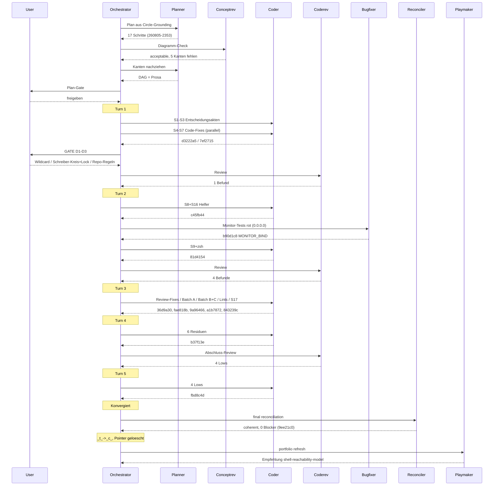

# Orchestrator Session — 260805-2350

**Directive:** Die Textschicht des Plugins sagt wieder, was der Code tut, und zwei Lints halten sie dort (Circle-Directive, `_t_circle.md` `## Directive`)
**Mode:** custom (Circle-Aktivierungslauf — noch kein Plan; Phase 0b Planung steht an)
**Status:** Complete

## Snapshot (Setup)

- Aktiver Circle: `circles/260805-2005-textschicht-gegen-code-nachziehen` (heute aktiviert, erster Turn-Lauf)
- Git HEAD: `66e4a69` (gepusht, origin/main identisch)
- Befundlage: 66 Befunde in drei Berichten, alle als Issues im Nachbar-Circle `260801-1244-guard-rules-write` (Zeitstempel `260805-18*`/`19*`), zitiert, nicht kopiert. 25 offene Shared-Issues.
- Kein Plan, keine Spec-Datei — der Grounding-Snapshot im Circle-Datensatz ist die Spec-Ebene (vom Shaper vollständig geschrieben)
- Offene Entscheidungen: 0 in beiden Stores; der Circle benennt aber drei zu fällende Entscheidungen (Zitierform, `_a_→_t_`-Eigentum, Self-Detect-Meldung)
- Guard: OK, kein Halt, 0 Blocks
- Domain: code (Erkennung der Vorsitzung, unverändert gültig)
- Interrupted session: keine; Session-Marker frisch geschrieben
- Bekannter Record-Lag: Body-Status sagt noch "anticipated" unter `_t_`-Marker (Shared-Issue `260802-0920`)

## Notes

- Plane: Konfig weiter unausgefüllte Vorlage — kein Mirror.
- Voice-Profile geladen (en).

## Coherence
<!-- RECONCILER-OWNED -->

**Verdict:** coherent

**Edges:**
- Artifact↔Grounding: 17/17 plan steps verified against source and commits, 0 drift items beyond in-place-fixed bookkeeping (stale Circle-record body, two hash-less decision footers); 60/66 corpus findings closed with footers, 6 open with stated routes; 10/11 Circle issues closed, 1 genuine residual re-verified open (`issues/260806-0022_*_setup-klammer-probe-…`); 0 open coderev issues; suite green 1611/30 files.
- Artifact↔Directive: all 12 commits `66e4a69..HEAD` (`7ef2715`, `d3222a5`, `c45fb44`, `b90d1c8`, `81d4154`, `36d9a30`, `9a96466`, `fae818b`, `a1b7872`, `843239c`, `b37f13e`, `fbd8c4d`) move toward the stated Directive — every Directive clause has a landing commit (four code fixes `7ef2715`; citation form decided before the mechanical batches, D1 gate 05:03Z vs batches 07:16Z; both lints `a1b7872`/`fbd8c4d`; internals scoping + repo-preference `c45fb44`, measured 0 emissions from a consuming cwd; activation ownership `81d4154`). The one off-Directive commit (`b90d1c8`, monitor bind) served the plan's suite-green-at-every-commit constraint by repairing an inherited red suite; not orthogonal drift.
- Grounding↔Directive: 3 Circle decisions `_i_` and consistent with the Directive (D1 wildcard citation form enforced by the reference lint; D2 writer set + lock realised; D3 repo-preference realised); 2 shared `_a_` records (`260719-2141` worktree-slots, `260801-1020` normative-consistency) pre-existing and non-conflicting; 0 `_o_` decisions in either store.

**Rebalance recommendation:** none

The Directive is reached to its stated bound: the text layer matches the code, the two lints hold it there mechanically, and the six deliberately open corpus findings each carry a route outside this Circle's scope. One genuine residual issue stays open in the Circle (setup/migrate scope mismatch, annotated). Nothing blocks the `_t_→_c_` transition.

## Budget

| Metric | Count |
|--------|-------|
| Turns | 5 |
| Tasks resolved | 21 (17 Plan-Schritte + Bugfix + 3 Review-Fix-Pakete) |
| Tasks skipped/deferred | 0 |
| Issues created (by reviewers) | 10 (alle in-session geschlossen) + 1 offenes Residuum (260806-0022) |
| Issues resolved | 71 (60 Korpus-Befunde + 10 Review-Befunde + Monitor-Bind) |
| Decisions answered (`_o_`→`_a_`) | 3 (D1, D2, D3 am Gate 260806-0027) |
| Decisions implemented (`_a_`→`_i_`) | 3 (D1 a1b7872, D2 81d4154, D3 c45fb44) |
| Commits | 14 (7ef2715..9ee21c0 + Abschluss-Batch) |
| Agent errors | 0 |
| Human gates hit | 5 (Plan-Gate, D1–D3-Gate, 3 Kohärenz-/Turn-Gates) |

## Per-Turn Log

### Turn 1 — Entscheidungen + Code-Fixes
- S1–S3 (d3222a5), S4–S7 (7ef2715); D1–D3 vom User beantwortet
- Review: 1 Befund (unquoted SCAN in 3 Skills). Coherence: ok

### Turn 2 — Helfer + D2/D3-Realisierung
- S8+S16 (c45fb44), Monitor-Bugfix (b90d1c8), S9+zsh (81d4154)
- Review: 4 Befunde (1 Medium, 3 Low). Coherence: ok

### Turn 3 — Batches + Lints + Buchführung
- Review-Fixes (36d9a30), Batch B+C (9a96466), Batch A+S13 (fae818b), Lints S14+S15 (a1b7872, 17 Restdefekte gefunden+behoben), S17 (843239c, 51 Befunde geschlossen)
- Coherence: ok

### Turn 4 — Sechs Residuen
- Lock-Alterung, hooks/lib-Zitate, migrate/playmaker/context-manifest (b37f13e)
- Abschluss-Review: 4 Lows. Coherence: ok

### Turn 5 — Vier Lows
- noclobber-Lock, Lock-Doku, 2 Lint-Härtungen (fbd8c4d). Konvergiert.

## Session Flow

## Portfolio update

Circle `260805-2005-textschicht-gegen-code-nachziehen` kohärent geschlossen; kein Circle aktiv.
Playmaker-Empfehlung für die nächste Aktivierung: `260804-1205-shell-reachability-model`
(alle Vorbedingungen erfüllt; Aktivierung über `/fusion:next`).
Playmaker-Log: `shared/history/260806-1103-playmaker-orchestrator-phase4.md`.
Plane: Konfig unausgefüllt — kein Mirror-Push.
