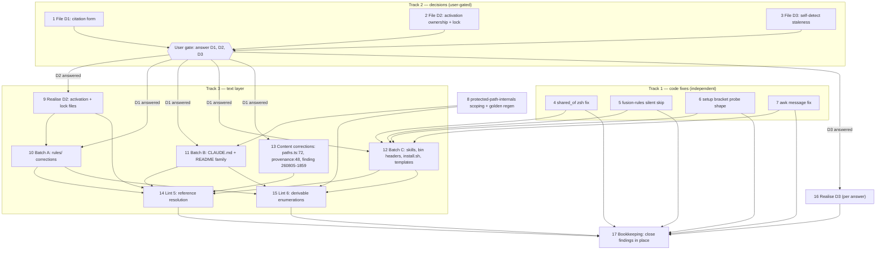

# Implementation Plan: Die Textschicht des Plugins gegen den Code nachziehen

**Date:** 2026-08-05
**Status:** Draft
**Spec:** `circles/260805-2005-textschicht-gegen-code-nachziehen/_t_circle.md` — the Circle record's `## Directive` and `## Grounding snapshot` are the spec; no separate spec file exists.

## Directive

The plugin's documentation, rule files, and skill bodies say again what the shipped code does; four defects that are code rather than text are fixed; two new lint tests keep the text layer aligned from now on; `protected-path-internals.md` stops reaching executors it cannot serve in consuming projects; and three decisions (citation form, activation ownership, self-detect staleness) are recorded before the mechanical work that follows from them. Full statement: the Circle record's `## Directive`.

Source findings: 66 issue records under `circles/260801-1244-guard-rules-write/issues/` (timestamps `260805-18*`/`19*`), produced by three passes cited in the Circle record's Grounding table. The records stay where they are; this plan cites them and closes them in place.

## Current State

Verified against the working tree during planning:

- `bin/fusion-rules:131` sets `set -eu`; `emit_if_exists()` is a bare `[ -f "$1" ] && printf …`, so a missing always-on file (seven calls at lines 328–334) returns status 1 and kills the emission mid-stream with partial output, against the promise in `rules/agent-setup.md:26` ("missing files are skipped silently").
- `skills/archive/SKILL.md:48` derives shared stores with `for p in $1`, which requires word splitting; zsh does not split. Measured in the source reports: `zsh → []`, `bash → [shared/planning]`. The Bash tool environment is zsh. `/fusion:cleanup` step 4 runs tier-1 autonomously and inherits the loss. An empty result is indistinguishable from "nothing to archive".
- `skills/setup/SKILL.md:41` probes for bracket markers with `-name '*[[]*[]]*.md'`, which matches **any** bracket pair, not only the old marker form `[a-z]`. A file like `notes [draft].md` triggers the refuse→migrate→"nothing to do"→refuse deadlock. The v5.9.1 fix narrowed the probe's scope (frozen stores excluded) but not its shape.
- `bin/fusion-rules:452` emits `"is missing \x27agents:\x27"`-style text whose `\x27a` is consumed as one hex escape by awk, garbling the message ("is missing zgents:'").
- Four text-property lints exist under `hooks/lib/__tests__/` (`path-literal-lint`, `marker-format-lint`, `glob-nomatch-lint`, `provenance-header-lint`). None checks reference resolvability or enumeration freshness.
- `bin/fusion-rules:365-367` emits `protected-path-internals.md` (21.9 kB) to coder/coderev/bugfixer unconditionally. The repo-context criterion exists (`hooks/lib/self-detect.ts`, `isFusionPluginCwd()`: `.claude-plugin/plugin.json` with `name === "fusion"` at cwd) but the bash helper never consults it. The emission golden (`rules-emission-golden.test.ts`) runs with an empty temp dir as cwd, i.e. it measures the consuming-project emission; its header documents the deliberate-regeneration procedure and pins `RELEASE_CAP = 105 354`.
- `hooks/lib/paths.ts:72` claims a decision is "deliberately not taken" that has since been taken; `rules/rule-file-provenance.md:48` cites its own binding decision under a filename that no longer exists. These two are content corrections, not path swaps.
- The suite is green: 1551 tests in 27 files, `hooks/dist` byte-identical to a fresh `tsc` run (review's baseline).

## Approach

Three tracks with one ordering constraint. Track 1 (four code fixes) is independent and goes first; the zsh `shared_of` fix leads because it is the only silent-data-loss finding. Track 2 files the three decision records immediately so the user can answer them at one gate; every citation-touching correction and the reference lint wait on the citation-form answer, exactly as the review argues ("decide the citation form first, or everything is touched twice"). Track 3 executes the mechanical text layer after the decisions: batched corrections by file group, then the two lints as permanent enforcement, landing only when their target class is clean so the suite stays green at every commit.

One integral design point, not a pile of point fixes: the two skill defects (archive, setup probe) share the root the conventions already name, `HYG-NO-SILENT-FAIL` — both fail with an empty result indistinguishable from a legitimate empty result. Their fixes each add the distinguishing check rather than a local workaround. Likewise the citation-form decision removes a whole defect class instead of patching 16 instances, and the two lints make both dominant error patterns (dangling references, stale closed enumerations) mechanically impossible to ship again.

### Step dependency graph

The graph is a layered DAG: decisions gate the text layer, code fixes gate nothing, the lints land last in their track, and the bookkeeping pass closes the Circle's ledger after everything it cites has a commit.

## Implementation Steps

### Track 2 — decision records first (filed now, answered at one user gate)

1. [DONE] **File decision record D1: how a workbench record is cited** — filed as `decisions/260806-0015_o_zitierform-fuer-workbench-records.md`
   - Executor: coder
   - Files: new record in the Circle's decision store (`$OUT_DECISION` as the executor resolves it), `YYMMDD-HHMM_o_zitierform-fuer-workbench-records.md`, template per `fusion-workbench-conventions.md`
   - Changes: file the question with the options the Circle record and review already sketch. **Option (a), recommended by the review:** markerless citation form `YYMMDD-HHMM_*_<slug>` — the `*` matches any marker in grep/find, survives every `_o_→_a_→_i_` transition, eliminates the class of 16 dead references. **Option (b):** keep full-filename citations and rely on the new reference lint to force an update at every marker transition. **Option (c):** cite marker-free (`YYMMDD-HHMM-<slug>`, no wildcard) and let the lint resolve across markers. Constraints to state in the record: the reference lint (step 14) cannot be written before this answer; the living proof of the defect is `rules/rule-file-provenance.md:48` citing its own binding decision under a vanished name. The executor files the record and stops; the answer is the user's.
   - Dependencies: none
   - Verification: record exists in the Circle's decision store with `_o_` marker, all three options and the review's recommendation stated.
   - Falsifier: if `rules/rule-file-provenance.md`'s rationale already covers marker transitions and the 16 references broke for another reason, the decision is mis-framed — re-read the 8+8 citation findings (`260805-1839_o_ausgelieferte-texte-zitieren-acht-workbench-records-…` and `…acht-zitate-tragen-verfallene-decision-marker-…`) before filing.

2. [DONE] **File decision record D2: who owns the `_a_→_t_` transition, and the lock rule** — filed as `decisions/260806-0015_o_wem-gehoert-die-circle-aktivierung.md`
   - Executor: coder
   - Files: new record in the Circle's decision store, `YYMMDD-HHMM_o_wem-gehoert-die-circle-aktivierung.md`
   - Changes: file the ownership question with the evidence from both Medium findings: `rules/fusion-workbench-conventions.md:75` says "the orchestrator writes it … Nothing else touches it" while `skills/next/SKILL.md` steps 6.2/6.3 write the pointer themselves, and circle-stash/circle-pop/migrate also touch it; the shaper's portfolio-activation mode has no reachable dispatcher (`agents/shaper.md:3,47` names playmaker and `/fusion:next`; neither dispatches it). **Option (a):** orchestrator-only — `/fusion:next` proposes and hands off, the orchestrator's phase model gains the missing activation step. **Option (b):** `/fusion:next` owns interactive activation — the conventions line is rewritten to name the actual writer set (orchestrator, next, and the stash/pop/migrate lifecycle skills as recorded exceptions), and the shaper mode gets a real dispatcher or is removed from `agents/shaper.md`. **Option (c):** a shared `bin/` helper performs the transition; every party calls it. Include the lock-rule contradiction in the same record, as the review demands ("decided together, not patched separately"): the rule says "Always, when any party is about to commit", yet `/fusion:commit` and `/fusion:cleanup` commit without the lock — sub-options: both skills acquire the lock, or the rule's scope is narrowed honestly. Name the four+ files that follow the answer.
   - Dependencies: none
   - Verification: record filed `_o_` with both halves (ownership + lock) and the file list.
   - Falsifier: if `/fusion:next` in fact dispatches shaper somewhere its `allowed-tools` permits, the "no reachable dispatcher" premise fails — re-verify against `skills/next/SKILL.md` before filing (the Circle record states it was checked on 2026-08-05).

3. [DONE] **File decision record D3: the self-detect staleness follow-up** — filed as `decisions/260806-0015_o_veraltete-regeln-im-eigenen-repo-melden-oder-umgehen.md`
   - Executor: coder
   - Files: new record in the Circle's decision store, `YYMMDD-HHMM_o_veraltete-regeln-im-eigenen-repo-melden-oder-umgehen.md`
   - Changes: the High finding's mechanism is understood (session-start pins `FUSION_PLUGIN_ROOT` to the installed copy; a four-day session read v5.8.0 rules while editing v5.9.1 sources). The question: **(a)** keep the behaviour rule only ("run `fusion --update` and restart before rule work" — documentation, zero code); **(b)** SessionStart warning when cwd is the plugin repo (via `isFusionPluginCwd()`) and installed version ≠ source version — cheap, advisory; **(c)** make `bin/fusion-rules`/`bin/fusion-paths` prefer the repo's own `rules/` when cwd is the plugin repo — the review calls this the clean cut. State the review's cost/benefit line for (b) vs (c) and that the release procedure should carry the check either way.
   - Dependencies: none
   - Verification: record filed `_o_` with three options.
   - Falsifier: if `hooks/hooks.json` SessionStart already re-resolves `FUSION_PLUGIN_ROOT` per turn rather than per session, the staleness window is smaller than claimed — check before filing.

### Track 1 — the four code fixes (independent of the decision chain)

4. [DONE] **Fix `shared_of` losing all shared stores under zsh — the silent-data-loss item, first**
   - Executor: coder
   - Files: `skills/archive/SKILL.md` (line 48 area); check `skills/cleanup/SKILL.md` step 4 for an inherited copy of the same snippet
   - Changes: replace the word-splitting `for p in $1` with a shell-neutral iteration (e.g. `printf '%s\n' $1` piped under explicit IFS handling, or a `set -- $1` form that bash and zsh treat identically), and add the non-empty distinction the Circle record demands: a derived shared-store set that comes back empty while the resolver emitted a `SCAN_*` value is an error to surface, not an empty archive bucket (`HYG-NO-SILENT-FAIL`). The fix is the review's "one line plus a non-empty check".
   - Dependencies: none
   - Verification: run the snippet standalone under both `zsh -c` and `bash -c` with a `SCAN_PLANS` containing a Circle path and a shared path; both must print the shared path. With an artificially empty derivation, the skill text must instruct an abort with a named reason, not a "nothing to archive" report.
   - Falsifier: if zsh's emulation mode in the Bash tool actually word-splits (`sh` emulation), the measured `zsh → []` would not reproduce — reproduce the measurement first; the source review already did (`260805-1904_o_shared-of-im-archive-skill-…`).

5. [DONE] **Fix `bin/fusion-rules` aborting under `set -eu` on a missing rule file**
   - Executor: coder
   - Files: `bin/fusion-rules` (function `emit_if_exists`, used at lines 328–334 and all conditional blocks)
   - Changes: make `emit_if_exists` return 0 on a missing file so the documented contract (`rules/agent-setup.md:26`, "missing files are skipped silently") holds under `set -eu`: `[ -f "$1" ] && printf … ; return 0` or an explicit `if`/`fi`. The contract side is the one to keep; the doc pass classified this as a code error precisely because the documented behaviour is recognisably the intended one.
   - Dependencies: none
   - Verification: with `FUSION_PLUGIN_ROOT` pointed at a copy of the repo minus one always-on rule file, `bin/fusion-rules coder` exits 0 and emits every remaining path. Add a regression case to the existing script-driving test family (`context-manifest.test.ts` sets the precedent for driving the real script).
   - Falsifier: if some caller depends on the abort (exit 1 on partial emission) the fix would mask a real failure; grep callers of `fusion-rules` in skills/agents for exit-code branching before changing semantics.

6. [DONE] **Fix the setup bracket probe's shape so non-marker bracket names no longer deadlock** *(executed against the falsifier's finding: the filter is migrate's exact executor set `\[[oatcibspd]\]-`, not the timestamp-anchored `[a-z]` sketch — see the step's falsifier and the follow-up issue `issues/260806-0022_o_setup-klammer-probe-und-migrate-reformat-decken-verschiedene-baeume.md`)*
   - Executor: coder
   - Files: `skills/setup/SKILL.md` (probe at line 41); `skills/migrate/SKILL.md` (survey scope, for the consistency rule)
   - Changes: narrow the probe's filename test from "any bracket pair" to the actual old marker form the executor can remove: the basename pattern `^[0-9]{6}-[0-9]{4}\[[a-z]\]` (the same regex the Circle-file probe on the line already uses) applied to the whole-tree probe as well, e.g. via `find … -name '*\[?\]*.md'` piped through the same `grep -qE` filter instead of the raw `-name '*[[]*[]]*.md'`. Honour migrate's own rule, quoted in the review: "the detector must only look for things the executor can remove". Keep the three frozen-store exclusions untouched — they are load-bearing and documented in the skill body.
   - Dependencies: none
   - Verification: in a scratch workbench, `notes [draft].md` no longer sets `OLD=1`; a genuine `260101-1200[o]-topic.md` still does; the excluded stores still stay silent. Run the probe snippet directly under zsh.
   - Falsifier: legitimate pre-underscore artifacts whose names deviate from `YYMMDD-HHMM[x]` (if any real migration corpus contains them) would now be missed — check `/fusion:migrate`'s executor sed for the exact set it can convert and match the probe to that set, no wider and no narrower.

7. [DONE] **Fix the garbled awk error message in `bin/fusion-rules:452`**
   - Executor: coder
   - Files: `bin/fusion-rules` (the `finalize()` fail strings at ~line 452)
   - Changes: stop the `\x27a`/`\x27t` hex-escape greed (awk consumes trailing hex digits): replace `\x27` with the portable `\047` octal escape or pass the quote via `-v q="'"` and concatenate. Message must read `unit '<val>' is missing 'agents:'` verbatim.
   - Dependencies: none
   - Verification: feed a malformed `context-manifest.yaml` (unit without `agents:`) and assert the exact stderr text; extend the existing context-manifest test with the message assertion.
   - Falsifier: macOS awk (BWK) vs gawk differ in escape handling — verify on the shipping platform's `/usr/bin/awk`, which is where the garbling was measured.

### Independent scoping change

8. [DONE] **Stop emitting `protected-path-internals.md` to coder/coderev/bugfixer outside the plugin repo**
   - Executor: coder
   - Files: `bin/fusion-rules` (the `IS_GUARD_INTERNALS_AGENT` block, lines 365–367); `hooks/lib/__tests__/rules-emission-golden.test.ts` + `fixtures/rules-emission.golden`
   - Changes: gate the emission on the repo-context criterion that already exists: a small shell equivalent of `isFusionPluginCwd()` (cwd contains `.claude-plugin/plugin.json` with `"name": "fusion"` — a `grep`-level check is enough; keep it consistent with the TS heuristic and note the pairing in a comment). In a consuming project the file's audience ("whoever changes or reviews the classifier") is empty by construction: the guard sources sit outside the project tree and are protected. In the plugin repo the emission stays. Then regenerate the golden **deliberately** per the procedure in the test's own header: the golden runs with a temp cwd (consuming context), so the trio's path set shrinks by 21 870 bytes, which brings three of the four over-cap roles under `RELEASE_CAP` (the Circle record's stated relief). Update the per-role floor justifications the test requires for any floor above the cap.
   - Dependencies: none (but lands before step 15, whose enumeration lint may cover the emission lists)
   - Verification: `bin/fusion-rules coder` from a scratch consuming project omits `protected-path-internals.md`; from the repo root it emits it; `npx vitest run` green after regeneration; the golden diff shows exactly the three roles' path-set and total changes and nothing else.
   - Falsifier: if the golden's temp-cwd construction also strips `FUSION_PLUGIN_ROOT`-relative context the new check depends on, the test could accidentally measure plugin-repo context — assert in the test that the consuming-context branch is the one exercised.

### Track 3 — text layer, after the decisions

9. [DONE] **Realise D2: one coherent activation story across the four files, plus the lock rule** *(option (b) + lock (i): conventions writer-set sentence rewritten, shaper mode honestly user-invoked-only, commit+cleanup skills lock-wrapped, lock rule's acquirer list and tags extended; `skills/next/SKILL.md` and `agents/orchestrator.md` needed no change — their current state is the (b) target state)*
   - Executor: coder
   - Files (per D2's answer, the expected set): `rules/fusion-workbench-conventions.md` (the `.active-circle` writer sentence, line 75 area), `skills/next/SKILL.md` (steps 6.2/6.3), `agents/shaper.md` (portfolio-activation mode: give it its real dispatcher or remove the claim), `agents/orchestrator.md` (phase model gains or disclaims the activation step), `rules/workbench-stash-and-lock.md` (lock-rule scope), `skills/commit/SKILL.md` and `skills/cleanup/SKILL.md` (acquire the lock, or be named as the honest exception)
   - Changes: exactly what the answered decision says, no more; the invariant sentence in the conventions must end up true against every writer that exists. Closes findings `260805-1839_o_die-circle-aktivierung-gehoert-drei-parteien-…`, `…der-shaper-portfolio-activation-modus-…`, `…die-lock-regel-sagt-always-…`, `260805-1840_o_konventionen-active-circle-nothing-else-touches-it.md`.
   - Dependencies: D2 answered (step 2 + user gate)
   - Verification: grep the tree for every `.active-circle` writer (`printf`, `rm`, `mv` targets) and check each against the rewritten sentence; suite green; golden regenerated if `fusion-workbench-conventions.md` or `workbench-stash-and-lock.md` change size.
   - Falsifier: a writer the findings missed (e.g. a hook) would falsify the "complete writer set" claim — the grep in verification is the check.

10. [DONE] **Batch A: mechanical corrections in `rules/` (all 15 files as needed)** *(eight rule files corrected; `agent-setup.md` needed no text change — step 5's code fix made its sentence true; the `konventionen-active-circle` finding was already resolved by step 9; golden deliberately regenerated, floors unchanged)*
    - Executor: coder
    - Files: `rules/agent-setup.md` (skip-silently sentence stays, now true after step 5), `rules/protected-path-discipline.md` (empty-list claim, `260805-1840_o_ppd-leere-liste-…`), `rules/fusion-workbench-conventions.md` (0/1/2-shape vs `fusion-rules` exit 3, `…konventionen-012-shape-…`; "auto-loaded by the plugin system", `260805-1841_o_konventionen-auto-loaded-…`), `rules/decision-record-examples.md` (heading `_a_→_s_` over an `_i_→_s_` body; `_i_→_s_` normed only in examples — align with the conventions' vocabulary), `rules/circle-records.md` (four of six citing skills do not cite; binding-decision path), `rules/workbench-path-resolution.md` ("cited directly by fusion-paths"; pre-v4 pointer-rejection mechanism; stale log-activity example), `rules/workbench-stash-and-lock.md` ("nine fields" vs ten, three dead record citations), pre-v4 example paths in the two always-on files (`260805-1840_o_beispielpfade-…`). Citation rewrites follow D1's decided form.
    - Dependencies: D1 answered; step 9 (avoid double-touching the conventions file)
    - Changes: text only; every corrected sentence must state what the code does today, verified against the code at the moment of editing, not against the finding's snapshot. **Size discipline:** corrections should be net size-neutral or shrinking; the golden must be regenerated for every size change of an emitted rule file (documented procedure in `rules-emission-golden.test.ts`), and shaper's measured total already sits 499 bytes over `RELEASE_CAP` while its floor does not — growth in shaper-emitted files triggers the budget message.
    - Verification: suite green after golden regeneration; each covered issue record's claim re-tested against the fixed text.
    - Falsifier: a finding whose "wrong" text turns out correct against HEAD (code moved since 2026-08-05) is closed as no-change-needed with the evidence, not "fixed".

11. [DONE] **Batch B: `CLAUDE.md` and the README family**
    - Executor: coder
    - Files: `CLAUDE.md` (the seven findings: two-rule-files symptom line, templates/ line, docs/ line without plane-setup, `WRAPPER_PROGRAMS` misattribution, two dead workbench references, four stale entries from the recent rebuilds, skill list without `seed-from-plane`), `README.md` (`FUSION_REF=tags/v5.3.0` → an existing tag; setup copy list without `fusion-guard.json`/`plane.config.yaml`; `fusion-guard.json` mechanism mentioned), `README-agents.md` ("no agent declares tools:", always-on list without `protected-path-discipline.md`, three missing conditional emissions, relocation artifacts, skill list), `README-hooks.md` (walk-out-and-back residual is closed — coverage is better than documented; files table missing three `lib/` modules; effective-hook-configuration section)
    - Dependencies: D1 answered (dead references follow the decided form); step 8 (README-agents' emission lists must describe the new scoping)
    - Changes: text only, same verification duty as Batch A. Not golden-relevant (none of these are emitted rule files).
    - Verification: each enumerated list re-derived from the tree at edit time (`ls skills/`, the `emit_if_exists` lines, `ls hooks/lib/`), then written.
    - Falsifier: same as Batch A.

12. [DONE] **Batch C: skill bodies, bin headers, `install.sh`, templates** *(the `plane.config.yaml` item was executed by coder rather than ontocoder — the two corrections are comment lines only, no data value touched; `install.sh`'s LICENSE entry deliberately left for the user decision step 17 records; `rules/context-manifest.md`'s "stops" nuance left to the rules batch, whose files this step must not touch)*
    - Executor: coder, except the YAML template item → ontocoder
    - Files (coder): `skills/*/SKILL.md` mechanical findings (`260805-1904_o_sechs-kleinbefunde-…` — text-level items only, including `/fusion:commit`'s missing `AskUserQuestion` in `allowed-tools`; `…help-verweist-…` — help pointing at a `CLAUDE.md` the installer never ships; `…log-activity-scannt-…` — backup-folder scan and setup's untenable store-equality claim; `260805-1842_o_circle-pop-nennt-manifest-feld-…`; `260805-1839_o_cleanup-hardcodet-einen-modellnamen-…`), bin header comments (`260805-1842_o_fusion-paths-header-…`, `…commit-lock-header-…`, `…header-kleinbefunde-…`, `260805-1839_o_kommentar-drift-…` — the bracket-notation relics the conventions themselves outlaw), `bin/fusion-rules`/`bin/fusion-paths` comment drift, `install.sh` header, `…context-manifest-stops-…` nuance. Files (ontocoder): `templates/plane.config.yaml` header (`260805-1842_o_plane-config-header-…`).
    - Dependencies: D1 answered (any record citations in these files); steps 4–7 (don't correct a comment a code fix is about to rewrite)
    - Changes: text corrections only; where a finding names a behaviour change beyond text (e.g. log-activity's scan set), fix the snippet in the skill body — skill bodies are the executable, so a snippet fix is in scope; anything needing new mechanism is out of scope and stays open (see Open Questions).
    - Verification: each snippet edited is re-run standalone in a scratch dir under zsh.
    - Falsifier: same as Batch A.

13. [DONE] **Content corrections: the two citations that became false claims, and the High finding's text** *(falsifier checked: the fold-case record is `_d_`, not `_o_` — `paths.ts` comment now states the deferral and cites wildcard-form; `hooks/dist` rebuilt; provenance form 1 rewritten to the wildcard form with marker-transition rationale; finding 260805-1859 amended per the Circle record and closed `_o_`→`_c_` citing c45fb44)*
    - Executor: coder
    - Files: `hooks/lib/paths.ts:72` (comment claims the fold-case decision is "deliberately not taken"; it has since been taken — rewrite to state the decision's actual outcome and cite it in D1's form), `rules/rule-file-provenance.md:48` (the `Binding decision:` line of the very file defining citation forms; rewrite to D1's form and amend the rationale so it covers marker transitions), and the issue record `circles/260801-1244-guard-rules-write/issues/260805-1859_o_im-eigenen-repo-laden-alle-agenten-…` (append the correction the Circle record mandates: the finding's defect claim is wrong — `FUSION_PLUGIN_ROOT` pins to the installed copy at session start by design, and `fusion --update` plus restart resolves it; the four-day stale-rules consequence is real and is carried as D3's grounding).
    - Dependencies: D1 answered; kept separate from the mechanical batches by explicit instruction of the Circle record.
    - Verification: read the cited decision records to confirm their current state before writing the new claims; the amended finding text separates "not a defect" from "the residue is real".
    - Falsifier: if the fold-case decision record is still open (`_o_`), `paths.ts:72` is correct as written and the finding is wrong instead — check the record's marker first.

14. **Lint 5: reference-resolution lint over the shipped text**
    - Executor: coder
    - Files: new `hooks/lib/__tests__/reference-resolution-lint.test.ts`
    - Changes: for every file in the shipped text surface (`rules/*.md`, `agents/*.md`, `skills/*/SKILL.md`, `README*.md`, `CLAUDE.md`, `docs/*.md`, `templates/*`, bin header comments as feasible): resolve (a) references to `rules/` files, (b) `## section` / `§` heading citations into those files, (c) workbench-record citations in the form D1 decided, resolved against the live workbench when present and syntax-checked otherwise. Fail on any dangling reference. Follow the four precedent lints' style (file-set enumeration, explicit exemption list with a reason per entry, self-explaining failure message). The accepted citation grammar is defined once in the lint header and cites D1's record. Land only after steps 9–13 leave the tree clean, so the suite stays green.
    - Dependencies: D1 answered; steps 9, 10, 11, 12, 13
    - Verification: `npx vitest run` green on the corrected tree; mutation check — reintroduce one dead reference locally and watch the lint fail with a message naming file, line, and target.
    - Falsifier: the review's claim "would have found all 16" is testable: run the lint against the pre-correction commit; if it finds fewer, the grammar is too narrow.

15. **Lint 6: derivable enumerations checked against the tree**
    - Executor: coder
    - Files: new `hooks/lib/__tests__/derivable-enumerations-lint.test.ts`
    - Changes: for each enumeration that is mechanically derivable, parse the documented list and diff it against the derived one: the skill lists in `CLAUDE.md`/`README-agents.md` vs `ls skills/`, the always-on rule list vs the `emit_if_exists` block, the conditional emissions vs the `IS_*` blocks, the `README-hooks.md` files table vs `ls hooks/lib/`, the stash-manifest field count vs the schema in the same document, `DEFINITION_SITES` vs the path-literal lint's own list. Non-derivable prose lists stay out, with the boundary documented in the lint header. Land after batches A–C and step 8 leave every covered enumeration true.
    - Dependencies: steps 8, 10, 11, 12
    - Verification: suite green; mutation check — add a scratch skill directory locally and watch the two skill-list assertions fail.
    - Falsifier: an enumeration that legitimately diverges from the tree (deliberate subset) belongs on the documented exemption list, not silently skipped; if the first run finds a divergence no finding covered, file it as a new issue rather than absorbing it.

16. [DONE] **Realise D3 per its answer**
    - Executor: coder
    - Files: per answer — (a) doc text only (release procedure in `CLAUDE.md`, a line in the relevant rule); (b) `hooks/` SessionStart path + `hooks/dist` rebuild + a test; (c) `bin/fusion-rules`/`bin/fusion-paths` root-preference + golden considerations + tests
    - Changes: exactly the chosen option, small by construction. If (b) or (c): compiled hooks are committed (installer invariant), and the plugin-repo behaviour must not alter consuming-project emission (golden guards this).
    - Dependencies: D3 answered
    - Verification: per option; suite green; for (c) additionally the golden must be byte-identical (consuming context unaffected).
    - Falsifier: for (c), if repo-preference changes what the golden measures, the option leaks into consuming projects and needs the gate reconsidered.

17. **Bookkeeping: close the resolved findings where they live**
    - Executor: coder
    - Files: `circles/260801-1244-guard-rules-write/issues/260805-18*`/`19*` records resolved by steps 4–16
    - Changes: for each record whose fix landed, append the `Resolved:` footer citing this Circle's commit hash(es) and rename `_o_` → `_c_` in place. Records are never moved. Explicitly left open: `…alle-17-guard-blocks-…` (routes to the reachability Circle's Grounding per this Circle's `## Dependencies`), `…der-circle-datensatz-dieses-circles-…` (belongs to the neighbour Circle's closure), `…die-domaenenheuristik-…`, `…die-coder-beschreibung-nennt-rust-…`, `…das-guard-event-log-waechst-…`, `…der-tracker-steht-im-plugin-repo-…` (pairs with guard issue `260804-2100`), `…install-sh-will-eine-license-…` (user decision), `…beim-filen-prueft-niemand-…`, `…der-plane-testfixture-…`, `260805-2323_o_die-emissionsmessung-…` (external machine). The marker renames are the loop-form `mv` the guard is known to fail-closed on when variables are used — write the paths literally.
    - Dependencies: all prior steps (per record: its resolving step)
    - Verification: every `_c_`-renamed record carries a footer with at least one commit hash; a final count reconciles 66 = closed-here + closed-before-this-plan + explicitly-left-open.
    - Falsifier: a record closed without a citing commit is a bookkeeping error the count check must catch.

## Data Structures

None. The only new artifacts are two test files and three decision records; no schema, no manifest change.

## API Changes

None public. `bin/fusion-rules` changes behaviour twice, both matching already-documented contracts: missing rule files skip silently (step 5, per `agent-setup.md:26`), and `protected-path-internals.md` becomes plugin-repo-conditional (step 8, a new documented condition — README-agents' emission description follows in Batch B).

## Testing Strategy

- `npx vitest run` green at every commit; the current baseline is 1551 tests in 27 files.
- The emission golden is regenerated **deliberately** at every step that changes an emitted rule file's size or an agent's path set (steps 8, 9, 10, possibly 16), following the procedure in the test header; a regeneration commits together with the change that caused it and its diff is reviewed as part of the step.
- New lints (steps 14, 15) get mutation checks in their verification, not only a green run.
- Shell fixes (steps 4, 6) are verified under both zsh and bash, since zsh is the shipping Bash-tool environment and the divergence is the defect.
- Steps 5 and 7 add regression cases to the existing script-driving test family.

## Risks & Mitigations

| Risk | Mitigation |
|------|------------|
| Rule-file corrections grow emitted text; shaper's total already sits 499 bytes over `RELEASE_CAP` (floor is not) | Size discipline in steps 10 and 9: corrections aim net-neutral or shrinking; every size change goes through deliberate golden regeneration; growth triggers the budget message and is justified or trimmed in-step |
| D1's answer arrives late and stalls Track 3 | Track 1 and step 8 are decision-independent and fill the gap; the three records are filed in the first batch so one gate answers all three |
| The reference lint's citation grammar is too narrow (misses forms) or too wide (false danglings) | Falsifier run against the pre-correction commit must find all 16 known dead references; exemption list with reasons for legitimate non-references |
| Golden regeneration masks an unintended emission change | Regenerate only in the step that intends the change; the golden diff is reviewed against the step's stated expectation (step 8: exactly three roles change) |
| Fixing `emit_if_exists` semantics hides a genuinely missing file forever | The contract is "skip silently" and D3 addresses the staleness-visibility question at the right layer; if D3 chooses the warning, missing-file visibility can ride the same mechanism |
| Bracket-probe narrowing misses a real pre-underscore artifact shape | Step 6's falsifier: match the probe to exactly the set `/fusion:migrate`'s executor converts, derived from the migrate skill, not guessed |
| Two steps touch `fusion-workbench-conventions.md` (9 and 10) and collide | Explicit ordering: step 9 first, step 10 depends on it |

## Open Questions

- [ ] D1, D2, D3 — the three filed decision records (steps 1–3) are the open questions of this plan; each blocks its dependent steps and nothing else.
- [ ] Out-of-scope findings named in step 17 stay open in the neighbour Circle's store; whether any of them (e.g. the coder description not naming Rust, the unbounded event log) get their own Circle or ride a later batch is the user's call, not this plan's.
- [ ] Step 12 includes snippet-level behaviour fixes inside skill bodies (log-activity scan set) on the argument that the skill body is the executable. If the user prefers a stricter text-only reading of the Directive, that item moves to the open list instead.
