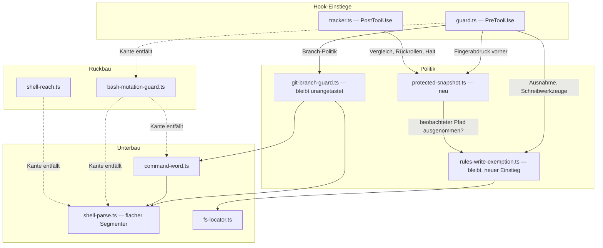
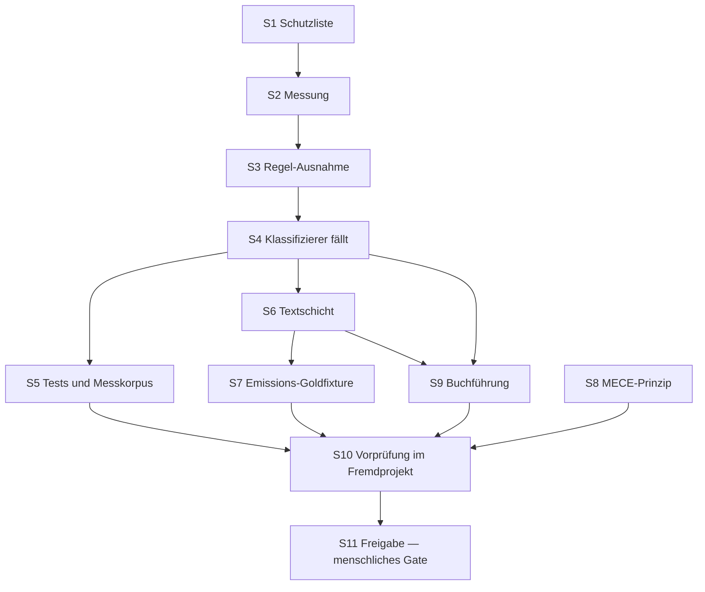

# Umsetzungsplan: Der Guard misst, was sich geändert hat

**Datum:** 2026-08-07
**Status:** Vom Nutzer freigegeben am 260807-0945. Beide Schutzverzichte (Zustandsverzeichnis von der Schutzliste, kein Halt mehr auf der Shell) ausdrücklich bestätigt; die Halt-Integrität wird als eigene offene Frage abgelegt und nicht in diesem Circle gelöst. Der MECE-Teil bleibt Bestandteil.
**Spec:** keiner — geplant gegen den Circle-Datensatz `circles/260807-0923-guard-misst-statt-orakelt/_t_circle.md`
**Bindende Entscheidung:** `circles/260804-1205-shell-reachability-model/decisions/260807-0825_a_should-the-guard-predict-shell-writes-or-enforce-them.md`, Option 3
**Entscheidbarkeit:** Die tragende Frage lautet nach dem Umbau "hat sich eine geschützte Datei verändert?" und wird durch Vergleich zweier Fingerabdrücke beantwortet. Sie ist entschieden, nicht genähert. Die abgelöste Frage "wird dieser Befehl gleich schreiben?" war unentscheidbar; genau deshalb wechselt der Mechanismus statt der Näherung.

## Directive

Der statische Klassifizierer verschwindet vollständig und wird durch eine Messung nach der Ausführung ersetzt. Zweiter Bestandteil: das MECE-Prinzip wird als Abschnitt in `rules/critical-stance.md` verankert, mit einem Prüfpunkt im Arbeitsfluss. Der Circle-Datensatz trägt die Messwerte und die Begründung; dieser Plan wiederholt sie nicht.

## Ausgangslage — zwei Korrekturen am Import-Graphen des Datensatzes

Der Graph im Circle-Datensatz stimmt in zwei Zeilen nicht mit dem Quelltext überein. Beide Abweichungen ändern den Zuschnitt von Schritten, deshalb stehen sie hier und nicht in einer Fußnote.

**`rules-write-exemption.ts` importiert den Klassifizierer nicht.** Geprüft an `hooks/lib/rules-write-exemption.ts:260-262`: es importiert `paths.js`, `git-branch-guard.js` und `config.js`. Die Kopplung läuft umgekehrt und über einen Dritten: `guard.ts:433-449` reicht zwei Rückrufe (`exempt`, `exemptRefusal`) in `classifyBashMutation` hinein. Mit dem Klassifizierer fallen also die beiden Rückruf-Stellen in `guard.ts`, nicht das Ausnahme-Modul.

**`fs-locator.ts` gehört nicht zum Klassifizierer und bleibt.** Die Grounding-Zeile zählt 5.640 Zeilen "Klassifizierer produktiv" und schließt `fs-locator` (268) und `command-word` (350) ein. Beide dienen anderen Herren: `fs-locator.ts` liefert den Dateisystem-Zugriff für die Regel-Ausnahme auf der Schreibwerkzeug-Seite (`guard.ts:51`), `command-word.ts` liefert die Programmnamen-Auflösung für `git-branch-guard.ts:66`. Produktiv fallen daher rund **4.140 Zeilen** vollständig (`bash-mutation-guard.ts` 3.351, `shell-reach.ts` 786) plus der Grammatik-Anteil von `shell-parse.ts`. Die Gesamtzahl aus dem Datensatz bleibt richtig, weil der Testanteil sie trägt; die produktive Teilsumme nicht.

## Die vier Entscheidungen, die der Plan trifft

**1. `fusion-workbench/.guard-state/**` fällt von der Schutzliste.** Der Grund ist Selbstbezug, nicht Abwägung: die Messung schreibt ihren eigenen Fingerabdruck, ihre Ereignisse und ihren Eskalationszähler genau dorthin (`tracker.ts:195`, `guard.ts` `saveEscalation`, `events.ts`). Bliebe das Verzeichnis geschützt, meldete jeder einzelne Werkzeugaufruf seine eigene Buchführung als Verletzung. Dazu kommt, dass `git checkout HEAD --` dort nicht trägt: die Workbench ist in einem Konsumprojekt ein Laufzeit-Artefakt und in der Regel gar nicht versioniert. Was verloren geht, ist offen zu benennen: ein Agent kann `escalation.json` löschen und damit seinen eigenen Halt aufheben. Das ist eine Frage an die Integrität des Eskalationsspeichers und nicht an die Schutzliste; Schritt S1 legt sie als Entscheidungssatz ab, statt sie hier mitzuerledigen.

**2. `FUSION_ALLOW_RULES_WRITE` zieht auf die Messseite um, in einer schlankeren Form.** Auf der Schreibwerkzeug-Seite bleibt die Ausnahme unverändert: dort steht der Pfad im Argument, der Schreibvorgang hat noch nicht stattgefunden, und die Tore gegen `..`-Ausbruch, Symlink und Hardlink haben weiter einen Gegenstand. Auf der Messseite haben sie keinen mehr. Beobachtet wird eine Datei, die sich geändert hat, an dem Pfad, an dem sie liegt — es gibt keine Schreibweise, die etwas anderes meinen könnte. Die Messseite braucht daher einen eigenen, engeren Einstieg, der nur Tor 1 (ist es ein Regelpfad) und Tor 1b (hat das Projekt den Pfad selbst deklariert und damit die Ausnahme zurückgezogen) stellt. Den vorhandenen `isProjectRulePath` mit demselben Pfad in beiden Argumenten aufzurufen wäre die naheliegende Abkürzung und genau die, vor der sein Docstring warnt.

**3. Der Halt auf der Bash-Oberfläche entfällt.** Er fragt heute `mutation.mutates` — "schreibt dieser Befehl überhaupt eine Datei?" — und das ist dieselbe unentscheidbare Frage in kleiner. Einen Rest-Erkenner nur für den Halt stehen zu lassen hieße, den Klassifizierer als Setzling zu behalten. Nach dem Umbau blockiert ein Halt die vier Schreibwerkzeuge, und geschützte Pfade stellt die Messung ohnehin wieder her, Halt oder nicht. Der Preis ist echt: unter einem Halt läuft `rm notes.txt` künftig durch. Schritt S2 legt ihn als Entscheidungssatz ab.

**4. `rules/protected-path-internals.md` wird gelöscht, nicht gekürzt.** Die Datei ist die Referenzhälfte des Orakels, und die Zielgruppe (`coder`, `coderev`, `bugfixer`) existierte, weil ein Klassifizierer existierte. Mit ihm fällt der Anlass. Die verbleibende Kernregel trägt die Messung in der Größenordnung ihrer Schwester `rules/git-branch-discipline.md`.

## Aufbau nach dem Umbau

Der Fingerabdruck vor dem Aufruf ist kein zweiter Hook. `guard.ts` ist der bereits laufende PreToolUse-Hook auf denselben fünf Werkzeugen; er bekommt eine Zeile mehr. Ohne ihn wäre die Messung nicht zurechnungsfähig: eine bereits vorher geänderte Regeldatei — der Mensch arbeitet in seinem Editor daran — würde beim nächsten Werkzeugaufruf zurückgerollt, und der Guard zerstörte menschliche Arbeit. Die Zurechnung ist keine Verfeinerung, sie ist die Bedingung dafür, dass die Messung überhaupt zulässig ist.

## Schritte

1. [DONE] **Die Schutzliste verliert das Zustandsverzeichnis**
   - Ausführer: ontocoder
   - Dateien: `hooks/config.json`, `hooks/config.example.json`
   - Änderungen: `"fusion-workbench/.guard-state/**"` aus `guard.protectedPaths` beider Dateien entfernen. Danach einen Entscheidungssatz in `$OUT_DECISION` anlegen, der die Halt-Integrität als eigene, offene Frage festhält: ein Agent kann `escalation.json` löschen und damit seinen Halt aufheben; das war bisher durch die Schutzliste gedeckt und ist es künftig nicht.
   - Quelle: offener Punkt 2 des Circle-Datensatzes; Entscheidung 1 oben.
   - Abhängigkeiten: keine

2. [DONE] **Die Messung: Fingerabdruck vorher, Vergleich und Rückrollen nachher** — 260807-1026
   - Ausführer: coder
   - Dateien: `hooks/lib/protected-snapshot.ts` (neu), `hooks/guard.ts`, `hooks/tracker.ts`
   - Änderungen: Das neue Modul löst `guard.protectedPaths` gegen das Dateisystem auf und bildet je Pfad einen Fingerabdruck (Inhalts-Hash; Nichtexistenz ist ein eigener Wert, damit Anlegen und Löschen erkannt werden). `guard.ts` legt den Fingerabdruck vor dem Werkzeugaufruf ab, `tracker.ts` vergleicht ihn danach. Bei Abweichung: `git checkout HEAD -- <pfad>` für jeden veränderten Pfad, Halt setzen, ein `guard_block`-Ereignis mit Datei und Ursache. Die Meldung nennt die Datei und sagt, was der Nutzer tun kann — die Entscheidung `260807-0825` macht die erklärende Ablehnung zur Randbedingung, und PostToolUse blockiert nicht. Der Ausführer klärt am Hook-Vertrag von Claude Code, ob die PostToolUse-Antwort einen Text ans Modell zurückgeben kann, und fällt sonst auf Halt plus Ereignis zurück; das ist zu prüfen, nicht anzunehmen. Ein Pfad, den `git` nicht kennt, wird nicht zurückgerollt: dort wird gemeldet und gehaltet, mit der fehlenden Versionierung als benanntem Grund. Beide Seiten stehen unter derselben `isFusionPluginCwd()`-Stilllegung wie die Schreibwerkzeuge heute. Der Bash-Halt-Zweig in `guard.ts` (`mutation.mutates`) entfällt; der Verlust kommt als Entscheidungssatz in `$OUT_DECISION`.
   - Quelle: Directive; Entscheidung 3 oben.
   - Abhängigkeiten: S1 (solange `.guard-state/**` geschützt ist, meldet die Messung sich selbst)
   - **Nachbesserung, vom Nutzer am 260807 entschieden — 260807-1049.** Das Rückrollziel
     ist nicht mehr HEAD. Der Fingerabdruck trägt den Dateiinhalt (base64, byteweise),
     und zurückgeschrieben wird der Zustand vor dem Aufruf; `restore()` in
     `protected-snapshot.ts` tut das, `tracker.ts` ruft es. Damit entfällt die
     Fallunterscheidung, die dieser Schritt noch festschrieb: die fünf Zweige (in git und
     sauber / in git mit gestagter Arbeit / nicht versioniert / in diesem Aufruf angelegt /
     gar kein Repository) sind ein Zweig. Der benannte Zweig "ein Pfad, den git nicht kennt,
     wird nicht zurückgerollt" existiert nicht mehr. Keine Größenschwelle, keine
     Sonderbehandlung für Binärdateien — gemessen 53 Dateien / 745 KB im schlechtesten Fall.
     Anlass: Befund `260807-1026_c_rueckrollen-auf-head-kann-menschliche-vorarbeit-verwerfen.md`.

3. [DONE] **Die Regel-Ausnahme bekommt einen Einstieg für beobachtete Pfade** — 260807-1049
   - Ausführer: coder
   - Dateien: `hooks/lib/rules-write-exemption.ts`, `hooks/tracker.ts`
   - Änderungen: Eine neue exportierte Funktion für die Messseite, die Tor 1 (Regelpfad-Muster) und Tor 1b (vom Projekt selbst deklarierter Pfad schlägt die Ausnahme) stellt und die übrigen Tore nicht. Ihr Docstring sagt, warum `spellingWalksUp`, die Symlink-Auflösung und das Hardlink-Tor auf einem beobachteten Pfad gegenstandslos sind. Die Messung überspringt einen veränderten Pfad, den diese Funktion ausnimmt, und schreibt dieselbe `guard_advisory`-Notiz wie heute (`rulesWriteDetail`). Die Tore der Schreibwerkzeug-Seite bleiben unberührt.
   - Quelle: offener Punkt 1 des Circle-Datensatzes; Entscheidung 2 oben.
   - Abhängigkeiten: S2

4. [DONE] **Der Klassifizierer fällt** — 260807-1117
   - Ausführer: coder
   - Dateien: `hooks/lib/bash-mutation-guard.ts` (löschen), `hooks/lib/shell-reach.ts` (löschen), `hooks/lib/shell-parse.ts`, `hooks/lib/command-word.ts`, `hooks/guard.ts`
   - Änderungen: Beide Module löschen. Aus `guard.ts` den `classifyBashMutation`-Import, den Schritt-2-Block samt beider Rückrufe und die Kopfdokumentation dazu entfernen; Schritt 1 (Branch-Politik) und Schritt 3 (Override-Notiz) bleiben. `shell-parse.ts` behält genau das, was `git-branch-guard.ts` und `command-word.ts` importieren: `extractCommandSegments`, `stripDataRegions`, `tokenize`, `resolveWord` und den Blank-Modus. Alles, was nur über `parseCommand`, den Capture-Modus, `SUBSTITUTION_FILLER`, `SegmentJoiner`, `ParsedSegment` oder `ParsedCommand` erreichbar ist, fällt. Aus `command-word.ts` fällt `GRAMMAR_TERMINATORS`, dessen einziger Leser `shell-reach.ts` war (`command-word.ts:94`). Das Prüfkriterium ist mechanisch: nach dem Schnitt darf `hooks/` keinen Verweis auf `parseCommand` mehr enthalten, und `tsc` muss durchlaufen.
   - Quelle: Directive.
   - Abhängigkeiten: S3 (erst wenn die Ausnahme umgehängt ist, hängt nichts mehr am Klassifizierer)

5. [DONE] **Tests und Messkorpus** — 260807-1155
   - Ausführer: coder
   - Dateien: löschen — `hooks/lib/__tests__/bash-mutation-guard.test.ts`, `shell-reach.test.ts`, `reachability-corpus.test.ts`, `helpers/reachability-corpus.ts`, `helpers/shell-witness.ts`, `fixtures/mutation-verdicts-head.json`; bearbeiten — `guard-bash-wiring.test.ts`, `guard-bash-integration.test.ts`, `guard-rules-write-integration.test.ts`, `guard-case-folding.test.ts`, `shell-parse.test.ts`, `config.test.ts`, `rules-emission-golden.test.ts`; unverändert — `git-branch-guard.test.ts`, `fixtures/git-verdicts-head.json`, `fs-locator.test.ts`, `rules-write-exemption.test.ts` (nur ergänzt)
   - Änderungen: Aus den gemischten Suiten den Bash-Klassifizierer-Anteil herausnehmen und den Anteil behalten, der die Schreibwerkzeuge, die Fallfaltung und die Branch-Politik prüft. Neu geschrieben wird die Messung, und zwar über `hooks/lib/__tests__/helpers/guard-harness.ts`: `makeProject` erzeugt ein echtes Fremdprojekt, in dem die Stilllegung nicht greift, `runBash` und `runWrite` fahren die Fälle. Abzudecken sind mindestens — eine geschützte Datei per Shell verändert wird zurückgerollt und setzt den Halt; eine vorher schon veränderte geschützte Datei wird nicht angefasst; ein Regelpfad unter gesetztem `FUSION_ALLOW_RULES_WRITE` bleibt stehen und erzeugt die Notiz; derselbe Pfad, vom Projekt in seiner `fusion-guard.json` selbst deklariert, wird trotz Flag zurückgerollt; ~~eine nicht versionierte geschützte Datei meldet und rollt nicht zurück~~ **(hinfällig nach der Nachbesserung zu S2: ein Projekt ganz ohne git wird ebenso zurückgeschrieben — der Testfall existiert in dieser Form)**. Die Zusicherungen zu S2 und S3 sind bereits geschrieben (`protected-snapshot-integration.test.ts`, 21 Fälle) und `rules-write-exemption.test.ts` ist um `isObservedRulePath` ergänzt; S5 fügt hier nichts mehr hinzu. `config.test.ts` verliert die drei `.guard-state`-Zusicherungen (Zeilen 247 und 497). `git-branch-guard.test.ts` bleibt vollständig grün, Gold-Fixture über 98 Befehle eingeschlossen; seine Quelltext-Zusicherung, dass die Branch-Politik `parseCommand` nie berührt, wird gegenstandslos und bleibt trotzdem stehen.
   - Quelle: Directive; Prüfauflage des Auftrags.
   - Abhängigkeiten: S4
   - **Ergebnis 260807-1155.** Suite 999 grün / 2 rot; beide roten gehören S6
     (`reference-resolution-lint.test.ts`, Befund `260807-1133`) und S7
     (`rules-emission-golden.test.ts`, Goldfixture). `git-branch-guard.test.ts`
     102 grün, Goldfixture über 98 Befehle nicht neu erzeugt. Zwei Dateien mehr
     bearbeitet als die Liste nennt — `guard-halt-event.test.ts` und
     `guard-escalation-shape.test.ts`, die sechs der Halt-Fehlschläge trugen.
     `rules-emission-golden.test.ts` **nicht** angefasst (S6 hatte es bereits
     bearbeitet). Die zehn `guardStateWritten === false`-Zusicherungen sind auf
     "kein Zähler, kein Ereignis" geschärft statt gelöscht; das Prädikat selbst
     ist aus dem Harness gefallen, weil es seine Frage seit dem Fingerabdruck
     nicht mehr beantworten kann. Einzelheiten:
     `history/260807-1155-coder-schritt5-tests-und-messkorpus.md`.
   - **Offen, Zuständigkeit strittig.** Der Befund `260807-1133_o_*` weist die
     Streichung der vier toten `EXAMPLE_PATHS`-Einträge diesem Schritt zu, der
     Auftrag an diesen Schritt verbietet ausdrücklich, die Datei anzufassen.
     Nicht eigenmächtig entschieden.

6. [DONE] **Die Textschicht** — 260807-1133
   - Ausführer: coder
   - Dateien: `rules/protected-path-discipline.md`, `rules/protected-path-internals.md` (löschen), `bin/fusion-rules`, `README-hooks.md`, `CLAUDE.md`, `hooks/lib/__tests__/rules-emission-golden.test.ts`
   - Änderungen: `protected-path-discipline.md` neu schreiben, Zielgröße rund 55 Zeilen. Inhalt: geschützte Pfade werden nach dem Aufruf gemessen, eine Veränderung wird zurückgerollt und setzt den Halt, das gilt für jeden Weg zur Datei; die eine Ausnahme `FUSION_ALLOW_RULES_WRITE`; das menschliche Gate als Ausweg. Ersatzlos gestrichen: Vier-Fragen-Prozedur, Joiner-Tabelle, Fail-Closed bei unauflösbarem Operanden, `cd`-Verfolgung, Ancestor-Regel, Residuen-Katalog. `protected-path-internals.md` löschen und in `bin/fusion-rules` die gesamte Zielgruppen-Mechanik dazu entfernen (`IS_GUARD_INTERNALS_AGENT`, Block 1d, die Kommentare bei Zeile 61 und 205). In `README-hooks.md` die beiden Klassifizierer-Zeilen der Modultabelle, den `cd`-Absatz und die Bash-Halt-Beschreibung ersetzen; die neuen Zeilen für `protected-snapshot.ts` und den geänderten `tracker.ts` aufnehmen. In `CLAUDE.md`: der `hooks/`-Eintrag der Layouttabelle, der Absatz "Die zwei Bash-Regeln", die Erwähnungen des Klassifizierers im Absatz zur Selbstentdeckung, und die beiden Symptomzeilen zu den Guard-Denies weichen einer Zeile über das Rückrollen. In `rules-emission-golden.test.ts` die Budget-Tabelle und die beiden Zusicherungen zur Auslieferung von `protected-path-internals.md` (Zeilen 348, 656-662) entfernen.
   - Quelle: offener Punkt 3 des Circle-Datensatzes; Entscheidung 4 oben.
   - Abhängigkeiten: S4

7. **Die Emissions-Goldfixture nachziehen**
   - Ausführer: ontocoder
   - Dateien: `hooks/lib/__tests__/fixtures/rules-emission.golden`
   - Änderungen: Neu erzeugen. Die Byte-Zahl für `protected-path-discipline.md` sinkt in allen sechzehn Agentenblöcken, `protected-path-internals.md` verschwindet aus den drei Guard-Blöcken.
   - Abhängigkeiten: S6

8. **Das MECE-Prinzip und sein Prüfpunkt** — [DONE] 260807-0955
   - Ausführer: coder
   - Dateien: `rules/critical-stance.md`, `agents/planner.md`
   - Änderungen: Ein vierter Abschnitt in `critical-stance.md` mit den drei Sätzen: eine Fallunterscheidung ist disjunkt und vollständig, Überlappung und Lücke sind Defekte; lässt sie sich nicht MECE machen, ist das Problem falsch geschnitten und braucht einen anderen Schnitt statt angehängter Sonderfälle; ist die Frage nachweislich unentscheidbar, ist Approximation keine Lösung, dann wechselt der Mechanismus. Der Abschnitt sagt ausdrücklich, warum Abschnitt 2 nicht gereicht hat: "eine integrale Lösung statt eines Dickichts aus Sonderfällen" beschreibt, wie eine gute Lösung aussieht, und beantwortet nicht, ob die gestellte Frage überhaupt eine hat. Der Prüfpunkt ist eine Pflichtzeile im Kopf jedes Plans, `**Entscheidbarkeit:**`, die die tragende Frage benennt und sagt, ob sie aus den Eingaben des Mechanismus entscheidbar ist; lautet die Antwort nein, muss der Plan den Mechanismuswechsel benennen. `agents/planner.md` nimmt die Zeile ins Ausgabeformat auf. Die Wirkung ist ehrlich zu beschreiben: die Durchsetzung liegt nicht in der Anweisung im Agentenprompt, sondern darin, dass der Mensch den Plankopf am Freigabe-Gate liest und eine leere Zeile dort auffällt. Der vorliegende Plan trägt sie bereits.
   - Quelle: zweiter Bestandteil der Directive.
   - Abhängigkeiten: keine

9. **Buchführung**
   - Ausführer: coder
   - Dateien: die drei Befundsätze, der Entscheidungssatz `260807-0825`
   - Änderungen: `circles/260804-1205-shell-reachability-model/issues/260807-0251_o_*` und `260807-0252_o_*` sowie `circles/260807-0923-guard-misst-statt-orakelt/issues/260807-0930_o_*` je um eine `Resolved:`-Zeile ergänzen, die sagt, dass der beschriebene Code nicht mehr existiert, und auf `_c_` umbenennen. Den Entscheidungssatz `260807-0825_a_*` um `Implemented:` mit dem Commit-Hash ergänzen und auf `_i_` umbenennen. Die beiden Commits `3dc5014` und `9a24c9b` werden nicht per `git revert` zurückgenommen, sondern durch die Löschungen in S4 und S5 vorwärts abgeräumt: `9a24c9b` hat auch `command-word.ts` und `bash-mutation-guard.test.ts` angefasst, und ein Revert nähme dort Dinge mit, deren Schicksal S4 anders entscheidet.
   - Quelle: Auftrag, Abschnitt zu den zwei Commits.
   - Abhängigkeiten: S4, S6

10. **Vorprüfung im Fremdprojekt**
    - Ausführer: coder
    - Dateien: keine (Prüflauf)
    - Änderungen: In `hooks/` `npm test` (baut und fährt die Suite) und `npm run build`. Danach die Harness-Suiten ein zweites Mal mit `FUSION_GUARD_ENTRY=dist`, damit das ausgelieferte Kompilat geprüft ist und nicht nur die Quelle. Zuletzt `claude plugin validate .` und der Rauchtest `claude --plugin-dir . --agent fusion:orchestrator -p "reply SMOKE-OK"`. Eine lokale Prüfung ohne Harness ist hier bedeutungslos, weil der Write-Guard in diesem Repository stillsteht; ein zweiter Prüfmechanismus wird nicht gebaut.
    - Quelle: Prüfauflage des Auftrags; `CLAUDE.md` Release-Schritt 0.
    - Abhängigkeiten: S5, S7, S8, S9

11. **Freigabe — menschliches Gate**
    - Ausführer: ontocoder (nach ausdrücklicher Freigabe durch den Nutzer)
    - Dateien: `.claude-plugin/plugin.json`, `<marktplatz>/.claude-plugin/marketplace.json`, `install.sh` (Kopfzeile), `README.md` (Pin-Beispiel)
    - Änderungen: **Gate.** Der Nutzer gibt frei, dann: Version in `plugin.json` erhöhen, Marktplatz-Klon rebasen und dort dieselbe Version setzen, beide Repositories committen und pushen, `v<version>` taggen und den Tag pushen, die beiden Pin-Beispiele auf die neue Version ziehen. Ohne diesen Schritt wirkt nichts davon in einem Konsumprojekt. Der Ablauf steht in `CLAUDE.md` unter "Release process"; er wird hier nicht dupliziert.
    - Abhängigkeiten: S10

## Prüfstrategie

Die Suite ist der Nachweis, und `hooks/lib/__tests__/helpers/guard-harness.ts` ist der einzige Ort, an dem sie aussagekräftig ist. Der Harness startet für jeden Fall einen eigenen Prozess in einem echten Fremdverzeichnis, weil `isFusionPluginCwd()` seine Antwort prozessweit zwischenspeichert und eine im Plugin-Repo geschriebene Verweigerungs-Zusicherung sonst leer bestünde. Drei Zusicherungen tragen den Umbau: die Messung rollt zurück und hält, sie fasst fremde Vorarbeit nicht an, und die Regel-Ausnahme greift auf der neuen Seite genauso wie auf der alten. Die Gold-Fixture der Branch-Politik über 98 Befehle bleibt unverändert grün — das ist die Zusicherung, dass der Rückbau die Nachbarpolitik nicht gestreift hat.

## Risiken

| Risiko | Gegenmaßnahme |
|---|---|
| Die Messung rollt eine Änderung zurück, die der Mensch selbst vorgenommen hat | Fingerabdruck vor dem Werkzeugaufruf; nur die Differenz dieses Aufrufs wird angefasst. Zurückgeschrieben wird der Vorher-Inhalt, nicht HEAD, also auch dann korrekt, wenn der Mensch bereits gestagte Arbeit an derselben Datei hatte (Nachbesserung zu S2). Zwei Testfälle. |
| Der Schnitt an `shell-parse.ts` beschädigt die Branch-Politik | Die Gold-Fixture über 98 Befehle und die Quelltext-Zusicherung in `git-branch-guard.test.ts` bleiben unverändert und müssen grün bleiben. |
| ~~Eine geschützte Datei liegt im Konsumprojekt nicht in git, das Zurückrollen scheitert still~~ | Gegenstandslos seit der Nachbesserung zu S2: der Fingerabdruck trägt den Inhalt, git ist am Zurückschreiben nicht beteiligt. Testfall (Projekt ohne Repository) bleibt. |
| Zwei Fingerabdruck-Läufe je Aufruf kosten spürbar Zeit | Die gemessenen 27 ms gelten für einen Lauf über alle geschützten Pfade. Fällt die Messung im Betrieb auf, wird sie auf geänderte Verzeichnis-Zeitstempel vorgefiltert — nicht auf eine Textanalyse des Befehls. |
| Der Halt-Verlust auf der Shell wird übersehen | Eigener Entscheidungssatz in S2, statt einer Zeile im Plan. |

## Offene Fragen

- [x] Kann die PostToolUse-Antwort einen erklärenden Text an das Modell zurückgeben? **Ja, geklärt in S2 (260807-1026).** Der Hook-Vertrag von Claude Code führt für PostToolUse `hookSpecificOutput.additionalContext` und setzt es "next to the tool result", damit das Gespräch weiterläuft und Claude darauf reagieren kann. Gemessen gegen Claude Code 2.1.224 mit einem eigenen Probe-Hook: der Text kommt als System-Reminder `PostToolUse:Bash hook additional context: <text>` beim Modell an. Die Randbedingung der Entscheidung `260807-0825` ist damit **vollständig** erfüllt, nicht nur teilweise; der Rückfall auf Halt plus Ereignis wurde nicht gebraucht. Der Kopf von `tracker.ts` behauptete das Gegenteil und ist korrigiert: blockieren kann ein PostToolUse-Hook nicht, erklären schon.
- [ ] Wie wird die Integrität des Eskalationsspeichers gesichert, nachdem `.guard-state/` von der Schutzliste fällt? S1 legt die Frage ab; beantwortet wird sie in diesem Circle nicht.
