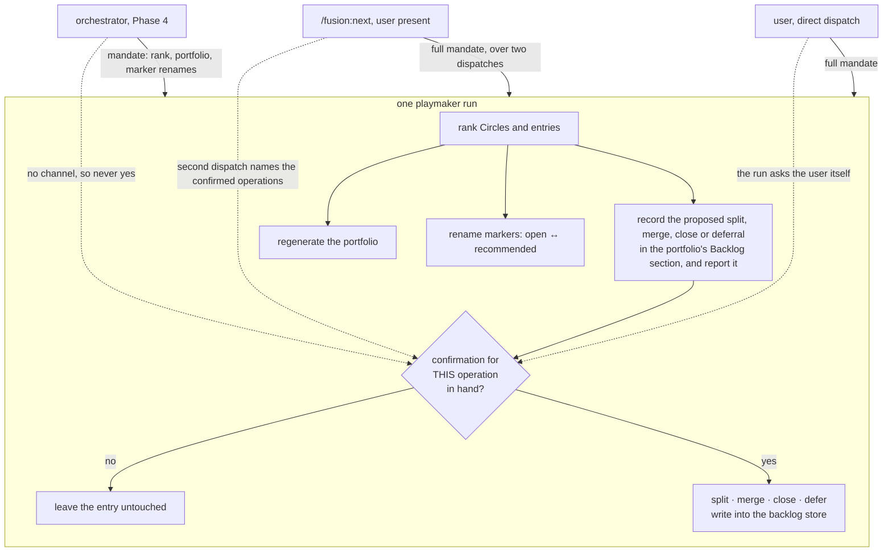
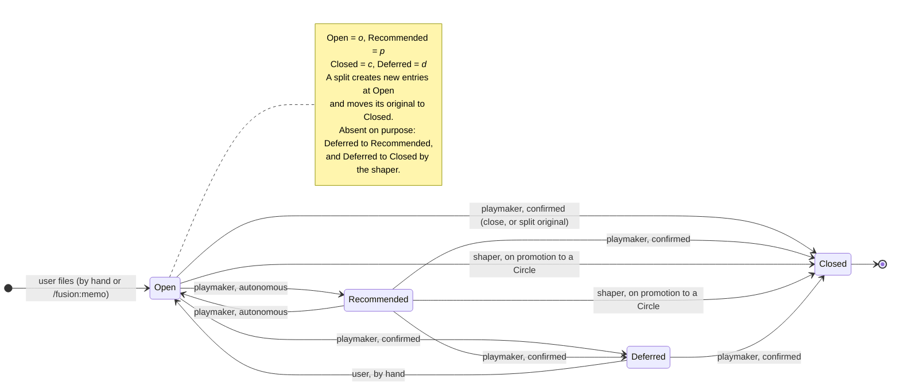
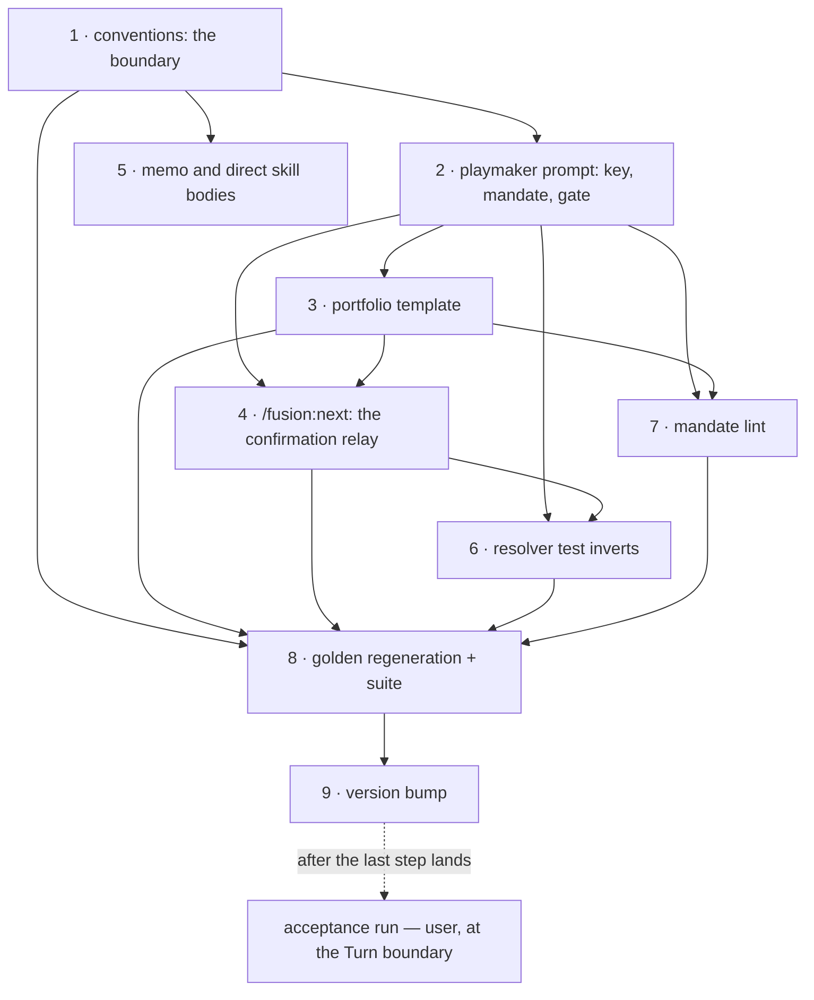

# Implementation Plan: the playmaker maintains the backlog store

**Date:** 2026-08-13
**Status:** Approved, revised at the approval gate on 2026-08-13 after the `conceptrev` diagram verdict and the user's two answers
**Spec:** none — planned from the Circle's Directive in `circles/260813-0858-playmaker-maintains-backlog-store/_t_circle.md`, which is settled
**Decidability:** The load-bearing question is *may this run perform a confirm-gated backlog operation, meaning a split, a merge, a close or a deferral?* It is decidable from an input the mechanism holds directly: whether the run has a user confirmation for that specific operation, either obtained inside the run through a question channel the run actually has, or carried into the run by its own dispatch prompt. It is not decided by predicting which dispatcher called the agent. The mandate stated by dispatch path is the reader-facing half; the mechanical gate is confirmation-in-hand, which the run observes rather than infers. The two cannot disagree in the unsafe direction, because a run with neither channel holds no confirmation and performs nothing.

## Directive

The Circle's `## Directive` is the authority and is not restated here. In one line for the executor: the playmaker gains full maintenance of `shared/backlog/` (autonomous marker renames, plus splitting, merging, closing and deferring under a confirmation the run holds) while filing stays outside every agent.

Two answered decisions bind this plan and neither is reopened:

- `shared/decisions/260812-2043_*_who-writes-the-recommended-marker-on-a-backlog-entry.md` — option 2, widened to full maintenance by the user, over that record's own recommendation to decline it.
- `circles/260813-0858-playmaker-maintains-backlog-store/decisions/260813-0858_*_does-a-non-interactive-playmaker-run-perform-the-confirm-gated-backlog-operations.md` — option 3. The Phase 4 mandate is ranking, portfolio regeneration and marker renames, stated in the prompt as a deliberate rule. **No proposal-return path from a Phase 4 orchestrator dispatch is built.** Step 4 of this plan builds something else, and `## Approach` says in detail why the two are not the same thing.

## Current State

### The resolver already holds the key. Only the prompt is missing.

`bin/fusion-paths` needs no change. `OUT_BACKLOG` is already in its `ORDER` list (line 377) and already valued in `value_for` (line 341, `shared/backlog`, unconditionally shared). The key set is derived at run time by one grep over the consumer's own prompt (line 233), so `bin/fusion-paths playmaker` withholds the key for exactly one reason: `agents/playmaker.md` never writes the token `$OUT_BACKLOG`. Verified by running the resolver in this session — its playmaker output carries `SCAN_BACKLOG=shared/backlog` and no `OUT_BACKLOG`.

This narrows the mechanical constraint the Circle's Grounding states. Prompt and key still cannot move independently, but the move is one-sided: naming the write in the prompt is the whole of it, and there is no resolver edit that could arrive out of step with it. `hooks/lib/__tests__/fusion-paths.test.ts` already proves the write path end to end against a staged fixture prompt (`the backlog keys` → *emits both keys for a prompt that names them*), so the derivation is exercised today by something other than the change we are about to make.

One nuance the executor should hold, because it explains why the key matters and where it does not. A rename and an append reach an existing entry through the read key alone — the shaper does exactly that when it closes a promoted entry, holding `$SCAN_BACKLOG` and no write key (`agents/shaper.md:28`). What genuinely requires `$OUT_BACKLOG` is **creating a file**: the entries a split produces and the consolidated entry a merge writes. The key is therefore both the Circle's stated acceptance condition and the real precondition for two of the four operations.

### The same grep is a trap for `/fusion:next`

The key set is derived by one grep over the consumer's prompt, and the grep does not care where in the file the token sits. A single occurrence of `$OUT_BACKLOG` or `$SCAN_BACKLOG` anywhere in `skills/next/SKILL.md`, including inside a fenced example of a dispatch prompt, hands that skill a key into the store. Step 4 adds a dispatch-prompt example to exactly that file, so the trap is live in this change and not hypothetical. The assertion it would break is `hooks/lib/__tests__/fusion-paths.test.ts` → *emits neither to a shipped prompt that names neither*, which names `next` on purpose.

### The confirmation channel: reported behaviour, verified documents

The first version of this plan carried the missing confirmation channel as its top risk and proposed to settle it in the acceptance run. It is settled now, and the plan builds for the answer.

What is **verified** by reading: `agents/shaper.md:119` states that a shaper dispatched as a sub-agent does not receive `AskUserQuestion` and must return its batched questions to the dispatcher, while `skills/direct/SKILL.md:84` and `:93` tell the reader that the dispatched shaper runs its clarification flow with the user interactively. Two shipped documents describe one dispatch differently. `skills/next/SKILL.md:4` does carry `AskUserQuestion` in `allowed-tools`, and that grant belongs to the skill body running in the main session; it does not travel to a sub-agent the skill dispatches.

What is **reported** by the orchestrator that commissioned this revision, and is not recorded in any history file on disk: `fusion:shaper` was dispatched as a sub-agent twice in this session, both runs returned their clarification questions as report text instead of asking them, the second said outright that it had no way to put a question to the user, and the orchestrator then relayed the questions through `AskUserQuestion` and passed the answers back on a second dispatch.

The consequence for this Circle is the same on either level of evidence. Without a relay, three of the four confirm-gated operations are unreachable on the `/fusion:next` path, and the interactive mandate the whole Circle rests on would exist only under direct dispatch. The user chose the relay, and step 4 builds it.

The documentation contradiction is a defect in a different skill and a different agent, found nearby rather than caused by this Directive, so it is filed at `shared/issues/260813-1334_*_fusion-direct-documents-a-shaper-clarification-flow-that-a-dispatched-sub-agent-cannot-run.md` and is not folded into this plan.

### The prompt states the old boundary in ten places

`agents/playmaker.md`, by line: the frontmatter description (`:3`, "Never edits … backlog entries"), the three-things paragraph (`:8`), the write-narrow paragraph (`:10`, "never write or rename a backlog entry"), the read grant (`:48`), the `You MAY write` list (`:53`–`:59`, which has no backlog row), the prohibition (`:65`), Step 2b (`:106`–`:115`, "Consolidation is **naming what is there**; you write no entry"), the dispatch-source list (`:184`–`:191`), the history-log field list (`:193`–`:208`), and the boundary notes (`:222`–`:227`).

### Three surfaces the issue's list does not carry

The authoritative list is `shared/issues/260813-0825_*_the-playmaker-is-charged-with-backlog-upkeep-and-holds-no-write-key-to-the-store.md` `## Surfaces the fix has to reach`. Reading the shipped text against it turns up three more, and one deletion:

- `skills/memo/SKILL.md:152` enumerates who moves a backlog marker — "the user … by hand, or … the shaper" — and that enumeration becomes incomplete the moment the playmaker holds the write.
- `skills/direct/SKILL.md:77` reasons that no key into the store is "the same omission that keeps every other consumer of the backlog inside its scope". After this change the playmaker's scope is bounded by prose rather than by a missing key, so the sentence overclaims.
- `rules/circle-records.md:126`, the portfolio template's `## Backlog — ranked` placeholder, describes the section as carrying "playmaker's proposed split". On the interactive path the split is now performed, and the section reports it.

`skills/next/SKILL.md` is a fourth file this plan touches, and it is not on that list for a good reason: it states nothing false today. Step 4 gives it a capability it never had, rather than correcting a claim it makes.

The deletion is surface 4 of the issue's list, `CLAUDE.md`'s inventory line. It is **out of scope here**: `circles/260813-0910-documentation-matches-shipped-plugin/_a_circle.md` names `CLAUDE.md:51`, `README-agents.md:40`, `docs/working-model.md` and `skills/help/SKILL.md` as four passages that wait on this Circle and are picked up when it closes. Both records agree on the direction. The issue's list predates that Circle; this plan follows the Circle.

One surface needs no change and is named so nobody edits it: `skills/archive/SKILL.md:102` already reads `_p_` as "an idea the playmaker has recommended for promotion and the user has not yet acted on". It anticipated this change and stays true through it.

### The tests that assert the old boundary

- `hooks/lib/__tests__/fusion-paths.test.ts`, `the backlog keys` → *gives playmaker the read key and withholds the write key* (line 394). It fails by design when step 2 lands. Its comment argues that the write prohibition is "mechanical rather than merely stated", which is the claim the change inverts, so the prose is part of the edit.
- `hooks/lib/__tests__/rules-emission-golden.test.ts` pins each always-on rule file's byte size and each agent's total against `fixtures/rules-emission.golden`. Steps 1 and 3 change two rule files, so the fixture is regenerated. This blocks nothing: the golden's job is to put the movement in a diff somebody reads.
- Constraints rather than failures, from the lint gates that scan every agent prompt: `portfolio-citation-form-lint.test.ts` gates `agents/playmaker.md` alone and rejects a stamped literal marker in a path citation, so new prose cites entries as `YYMMDD-HHMM_*_<slug>.md`; `path-literal-lint.test.ts` rejects a store-path literal, so new prose names `$OUT_BACKLOG` and never `shared/backlog`; `marker-format-lint.test.ts` rejects the retired bracket marker form; `glob-nomatch-lint.test.ts` rejects an unguarded glob in a shell snippet; `reference-resolution-lint.test.ts` requires every cited plugin path to resolve. The two `playmaker.md` fixtures in `domain-cascade.test.ts` (`MUST_NOT_FIRE`) are copied text, not line anchors, so rewriting Step 2b does not touch them.

## Approach

One integral change with a single organising idea: **the store's boundary moves from origination to authorship of ideas, and the run's authority is decided by a confirmation it holds rather than by a dispatcher it guesses.**

Everything else follows. The conventions file states the boundary once; the prompt states the mandate and the gate; `/fusion:next` carries the confirmation to the run that needs it; the two skill bodies and the portfolio template stop contradicting the boundary; one test inverts and one lint arrives to keep the statement true across surfaces.

### The prose deliverable — where the line falls between filing and maintaining

This is the part no test can verify, and it is written first for that reason. `rules/fusion-workbench-conventions.md` `## Backlog entries` currently says: *"**No agent files a backlog entry.** … The backlog is written by the user and consolidated by the playmaker, and by nobody else."* A reader who then learns that the playmaker writes a consolidated entry when merging duplicates reads a contradiction inside one document.

The distinction that resolves it, in the vocabulary the surrounding text already uses:

> **Filing is originating an idea. Maintenance is reshaping ideas the store already holds.**

The test is the set of ideas in the store. A split partitions one entry's ideas across several files; a merge collapses several statements of one idea into one file; a close removes an entry whose idea the user has confirmed is no longer live; a deferral pushes an entry out to a named later moment; a marker rename records how the playmaker ranks what is there. None of them adds an idea to the set, and that is exactly what filing does. The playmaker writes entry *text* when it merges, and the text it writes must be a consolidation of statements already in the store, not a new idea wearing the user's name.

The bound therefore survives in a sharper form than it had: no agent originates a backlog entry, the playmaker included. What changes is that the document now says which operations are not origination, instead of leaving a reader to infer that a merge must be one.

### Two mandates, one gate

The decision answers option 3, so the split of the mandate by dispatch path is written into the prompt as a rule. It is stated in the same words the frontmatter description uses, and the new lint in step 7 holds the two surfaces together.

The mandate is the reader's rule. The **gate** is the mechanism, and it is deliberately not the same question:

- **Autonomous** — every rename that states the playmaker's own ranking judgement of a live idea: `_o_ ↔ _p_`. No confirmation, on any dispatch path.
- **Confirmed** — every operation that states a disposition of the idea: a split, a merge, a close (`_c_`) and a deferral (`_d_`). **Four operations, not three.** The `_c_` on a split's original is part of the confirmed split, not a second gate.

That cut is disjoint and complete over the four markers and the four operations, and it resolves an apparent overlap between the two settled inputs: the decision record's answered footer grants renames "across `_o_`/`_p_`/`_c_`/`_d_`" while the Directive gates closing on a confirmation. The footer enumerates the vocabulary the playmaker may **write**; the Directive decides which of those writes need a confirmation. Read that way both hold, with no marker outside a branch and none in two. **The user settled this reading at the approval gate on 2026-08-13**, choosing it over the alternative reading in which all four renames are autonomous. It is no longer an open question, and the count of confirm-gated operations is four everywhere in this document.

A confirmation reaches a run through exactly two channels, and they are disjoint: the run asks the user itself, which requires a question channel it actually has, or the run's dispatch prompt names the confirmed operations. A run with neither performs no confirmed operation, whatever it believes about its dispatcher. The Phase 4 mandate is a statement of that fact for the reader, not a second mechanism.

### The confirmation relay is not the proposal-return path that was declined

This needs saying in as many words, because the next reader will otherwise take step 4 for a quiet reversal of the decision this Circle answered earlier the same day.

What decision `260813-0858_*_does-a-non-interactive-playmaker-run-perform-the-confirm-gated-backlog-operations.md` declined, as its option 2, is a return protocol from a **Phase 4 orchestrator dispatch**: a run that fires when a Circle closes, with no user in the loop, handing backlog questions upward so the orchestrator can interrupt a closure with them. It was declined on a measurement the record asked for itself, that ten Circle closures had produced roughly ten Phase 4 dispatches and not one of them could have met backlog work, because the store did not exist for nine of them.

What the user approved instead is a relay **inside `/fusion:next`**, and the differences are not cosmetic:

| | Declined (option 2) | Approved (step 4) |
|---|---|---|
| Dispatcher | The orchestrator, at Phase 4 | The `/fusion:next` skill body, in the main session |
| The user | Absent | Present, and already being asked to confirm an activation |
| The moment | A Circle is closing | The user is deciding what to work on next |
| The reason | To make one behaviour of two | To make the interactive mandate reachable at all on the path the user actually uses |

Nothing about the Phase 4 path changes in this plan. A Phase 4 run still ranks, regenerates the portfolio and renames markers, and it still leaves the four confirmed operations alone. If Phase 4 runs later turn out to meet real backlog work, that is the reversal the decision record already priced at one prompt paragraph, and it is a separate record.

The constraint the decision record set is also honoured literally: the playmaker never dispatches another agent and never invokes a skill. It does neither here. The skill dispatches twice; the agent answers twice.

### What "confirmed in the same run" means when the run is two dispatches

The Directive says a confirmation is obtained inside the same run. The relay makes the playmaker's `/fusion:next` work **two dispatches**, and the writes happen in the second. That is not a loophole, and it is worth being precise about why.

The gate is not "did this process ask a question at some point". It is "does this run hold a confirmation for the operation it is about to perform". A confirmation carried in the dispatch prompt is held by the run that performs the write, names that specific operation, and was given for it minutes earlier by a user who was looking at the proposal. What the Directive rules out is a standing grant: a run may not perform an operation on the strength of a confirmation given for something else, or given in a previous session, or inferred from the user having run the skill at all. The relay carries one confirmation for one named operation into one run, which is the thing the gate asks for.

A second dispatch proposes nothing. It performs the operations its prompt names, regenerates the portfolio and stops, so the relay is exactly two dispatches and cannot loop.

### Diagram — what a run may do, and on what evidence



### Diagram — a backlog entry's markers, and who writes each



**The deferral transitions, decided rather than left absent.** The first draft of this state machine gave `Deferred` one entrance and one exit, which said, without meaning to, that a recommended entry has to lose its recommendation before it can be pushed out, and that a pushed-out entry can never be closed. Neither restriction has a reason behind it, and neither was stated in prose. With `_d_` now a confirmed playmaker write, the four transitions that genuinely exist are these.

*Two that were missing.* Deferring states a disposition of the idea, and it applies to a live idea whatever the playmaker's current ranking of it happens to say, so `Recommended → Deferred` exists on the same confirmed gate as `Open → Deferred`. An entry that was pushed out and has since stopped being live is closed exactly as any other entry is, so `Deferred → Closed` exists on that gate too.

*Two that are absent, and why.* `Deferred → Recommended` does not exist. The autonomous rename is the playmaker restating its own ranking of a live idea, and a deferred entry is not one: reviving it reverses a disposition the user took, and a reversal is not a ranking. Revival stays `Deferred → Open`, performed by the user by hand, which is the edge the diagram already carried. `Deferred → Closed by the shaper` does not exist either, because the shaper's promotion path renames `_o_` or `_p_` and nothing else (`agents/shaper.md:87`). A deferred entry the user wants to promote goes back to open first, through the edge above. Neither absence is an oversight, and step 1's marker table says so in the conventions file rather than leaving the next reader to rediscover it.

## Implementation Steps

Every step is assigned to `coder`. The routing was run per file rather than assumed: the change set is rule files, agent and skill prompts, TypeScript tests and one plugin manifest, and none of it is ontology, manifest, schema or fixture **data**. The one near-miss is named in step 8.

1. **State the filing/maintenance boundary in the conventions file**
   - Executor: `coder`
   - Files: `rules/fusion-workbench-conventions.md` (`## Backlog entries`, lines 194–207)
   - Source: `shared/decisions/260812-2043_*_who-writes-the-recommended-marker-on-a-backlog-entry.md`
   - Changes: rewrite the first of the two bounds and add the marker-writer table. The bound becomes *no agent originates a backlog entry*, with the filing-versus-maintenance distinction of `## Approach` above stated in the section's own vocabulary and at its own register, as a short paragraph and not an essay. Name the four maintenance operations, name the confirmation gate on all four, and state which markers are autonomous and which are confirmed. Add a table naming, for each of `_o_`, `_p_`, `_c_`, `_d_`, who writes it and under what gate; the table's `_d_` row carries the two absent transitions from `## Approach` so the restriction is stated where a reader looks it up. Leave the second bound (the backlog is not the work queue) untouched, and leave the minimum-content paragraph untouched. Extend the `Binding decisions:` line with the two records above.
   - Acceptance: (a) the section states that filing is originating an idea and maintenance is reshaping ideas already in the store, in one sentence a reader can quote; (b) it names the playmaker as the writer of `_p_`, and that is the only writer named for it; (c) the confirm-gated operations are named as four, and a reader who has just read the merge behaviour in `agents/playmaker.md` finds no statement here it contradicts; (d) the section still fits its neighbours in length and register, because the file is loaded into every agent on every dispatch and step 8 measures what this costs.
   - Dependencies: none

2. **Give the playmaker the write, the mandate and the gate**
   - Executor: `coder`
   - Files: `agents/playmaker.md`
   - Source: both binding decisions above
   - Changes: one coherent pass over the ten passages listed in `## Current State`.
     - `:3` frontmatter description — remove "backlog entries" from the never-edits clause; state what a run does to the store and state the two mandates. These are the words the body must reuse verbatim, so choose them here first.
     - `:10` — replace "never write or rename a backlog entry" with the bounded form: never originates one.
     - `:53`–`:59` `You MAY write` — add the backlog store as `$OUT_BACKLOG`, listing the four operations and marking all four as confirmed. **This is the token that makes `bin/fusion-paths` emit the key**; it must be spelled `$OUT_BACKLOG`, never as a path literal, or `path-literal-lint.test.ts` fails.
     - `:65` `You may NOT` — replace the blanket prohibition with: originate an entry, and perform a confirmed operation without a confirmation in hand.
     - `:106`–`:115` Step 2b — rewrite from proposing to performing. Keep the four numbered activities and the ranking; replace "you write no entry" with the gate. State what a merge may contain (a consolidation of statements already in the store) and what it may not (a new idea). State the split's form: the original stays, its marker moves to `_c_`, and one appended line names the entries it became, following the shaper's `Promoted:` precedent, whose form is at `agents/shaper.md:88`.
     - New section, `## Two mandates, by dispatch path` — the Phase 4 mandate (rank, regenerate, rename markers) and the interactive mandate (all four operations), in the description's words, with the confirmation-in-hand gate stated as the mechanism and the mandate as the rule. Name the two channels a confirmation can arrive through, and state plainly that a run holding no confirmation performs no confirmed operation whatever it believes about its dispatcher. Step 4 adds one subsection under this section; leave room for it rather than writing the section as a closed list.
     - `:184`–`:191` Dispatch sources — carry the mandate onto each of the three sources.
     - `:193`–`:208` History logging — log every write performed: entries renamed with old and new marker, entries created by a split with the original they came from, entries merged with the sources, entries closed, entries deferred with the target the deferral cites. Git is the undo (Circle Grounding, answer 4), so the log is a record of what happened and not a before-state.
     - `:222`–`:227` Boundary notes — add the boundary against `/fusion:memo` (the user's filing surface) and against the shaper (which closes an entry a Circle took whole). The `vs taskplanner` note stays exactly as it is; option 4 is undecided and out of scope.
   - Acceptance: (a) `bin/fusion-paths playmaker` emits `OUT_BACKLOG=shared/backlog` alongside `SCAN_BACKLOG`; (b) the two mandates appear in the frontmatter description and in the body in the same words; (c) no sentence in the file still says the agent writes no entry; (d) every entry path cited in new prose wildcards its marker; (e) `npx vitest run lib/__tests__/portfolio-citation-form-lint.test.ts lib/__tests__/path-literal-lint.test.ts lib/__tests__/marker-format-lint.test.ts lib/__tests__/glob-nomatch-lint.test.ts lib/__tests__/reference-resolution-lint.test.ts` is green.
   - Dependencies: step 1 (the prompt cites the conventions boundary rather than restating it)

3. **Bring the portfolio template up to a performed operation**
   - Executor: `coder`
   - Files: `rules/circle-records.md` (the `## Backlog — ranked` placeholder at line 126, inside the portfolio template)
   - Changes: the section carries both cases, what the run performed and what it proposes and could not perform, in one clause rather than a second template. The proposed case is what step 4's relay reads back to the user, so each proposed operation is named in a form a person can approve one at a time: the operation, the entry path or paths, and for a split the pieces it would produce. Keep the two existing first-line forms (`Recommended to shape:` and `Recommended to split first:`) exactly as they are: `skills/next/SKILL.md:124` reads them and re-makes none of that judgement, so changing their spelling would break the briefing.
   - Acceptance: a Phase 4 run and an interactive run both have a form to write; `/fusion:next`'s existing render step needs no change to read either; a proposed operation is individually nameable, so a partial confirmation has something to point at.
   - Dependencies: step 2

4. **Carry the confirmation into `/fusion:next` and back to the agent**
   - Executor: `coder`
   - Files: `skills/next/SKILL.md` (a new step), `agents/playmaker.md` (one subsection under the mandate section step 2 creates)
   - Source: the Circle's Directive (a confirmation held for the operation this run performs); the channel evidence in `## Current State` → *The confirmation channel*; and `## Approach` → *The confirmation relay is not the proposal-return path that was declined*, which the executor should read before touching either file, because the distinction is the whole reason this step is allowed to exist.
   - Changes, in three parts.

     **(a) The agent's half.** Add `### A confirmation carried by the dispatch prompt` under `## Two mandates, by dispatch path`. It states: a confirmation reaches a run either because the run asked the user and has the answer, or because the dispatch prompt names the confirmed operations; a run whose prompt carries a `**Confirmed operations:**` block performs exactly the operations listed there, proposes nothing further, regenerates the portfolio so it records what was performed, and writes its history log with the trigger segment `user-fusion-next-confirmed` rather than `user-fusion-next`. That distinct trigger is not cosmetic: both dispatches of one relay can land inside the same minute, and the log filename is stamped to the minute, so without it the second run's log overwrites the first's.

     **(b) The skill's half.** Add a step between the briefing render (Step 5) and the interactive activation (Step 6). Order is load-bearing: the activation step's last action prints a message that chains into a fresh orchestrator session and ends the skill, so anything after it never runs. The new step:
     - reads the proposal block from the playmaker's returned report, and does nothing at all when there is none, asking no question and printing no line;
     - puts the proposals to the user with `AskUserQuestion`, one prompt with the operations named in plain words and the entry paths shown, offering perform-all, choose-which, and perform-none, with perform-none as an unremarkable choice rather than a failure;
     - dispatches `fusion:playmaker` a second time when at least one operation was approved, and dispatches nothing when none was;
     - re-reads `$PORTFOLIO` afterwards and reports in one line what the second run performed;
     - then proceeds to the activation step unchanged.

     **(c) The dispatch prompt, stated in the same form in both files:**

     ```
     **Domain:** <detected-domain>
     **Confirmed operations:**
     - split <entry path> into: <slug> — <title>; <slug> — <title>
     - merge <entry path>, <entry path> into: <slug> — <title>
     - close <entry path> — <reason>
     - defer <entry path> until <target>
     **Proposal source:** <portfolio> `## Backlog — ranked`, generated <stamp from the portfolio header>
     ```

     The `**Confirmed operations:**` lines carry the first run's own words, copied rather than paraphrased, so the second run matches its instruction to its analysis without re-deriving it. The `**Proposal source:**` line points at where the first run wrote that analysis down, which the second run opens through its own resolved key. Between them the second dispatch needs to redo none of the first run's reading.

     **The trap in part (b).** `skills/next/SKILL.md` must not contain the token `$OUT_BACKLOG` or `$SCAN_BACKLOG` anywhere, the fenced example above included. `bin/fusion-paths` derives a consumer's key set by one grep over its prompt (`bin/fusion-paths:233`), so a single occurrence hands `/fusion:next` a key into the store, widens a scope this step is careful to keep narrow, and breaks `hooks/lib/__tests__/fusion-paths.test.ts` → *emits neither to a shipped prompt that names neither*. Write entry paths as `<entry path>` placeholders. The relay carries text; it never resolves a path into the store, and that is what keeps the skill's scope where `skills/direct/SKILL.md:77` says every non-playmaker consumer's scope is.
   - Acceptance: (a) `bin/fusion-paths next` emits neither `OUT_BACKLOG` nor `SCAN_BACKLOG`; (b) the parameter block appears in the same form in both files, and its four operation words are the same four the mandate section uses; (c) the skill asks nothing and prints nothing when the report carries no proposals; (d) a perform-none answer dispatches nothing a second time; (e) the new step sits before the activation step in the file; (f) `cd hooks && npx vitest run lib/__tests__/fusion-paths.test.ts lib/__tests__/path-literal-lint.test.ts lib/__tests__/reference-resolution-lint.test.ts lib/__tests__/glob-nomatch-lint.test.ts lib/__tests__/marker-format-lint.test.ts` is green.
   - Dependencies: steps 2 and 3

5. **Correct the two skill bodies that state the old writer set**
   - Executor: `coder`
   - Files: `skills/memo/SKILL.md` (guardrail at line 152), `skills/direct/SKILL.md` (line 77)
   - Changes: in `memo`, add the playmaker to the enumeration of who moves a backlog marker, and leave the surrounding guardrails untouched, particularly `:153`, "never file an entry on an agent's behalf", which this change strengthens rather than weakens. In `direct`, correct the clause claiming that a missing key is what keeps every consumer of the store in scope; it stays true of that skill, of the shaper, and of `/fusion:next`, which after step 4 relays a confirmation without ever resolving a key into the store, and it is not true of the playmaker.
   - Acceptance: no shipped skill body states a writer set that omits the playmaker; `skills/archive/SKILL.md` is untouched.
   - Dependencies: step 1

6. **Invert the resolver's playmaker assertion**
   - Executor: `coder`
   - Files: `hooks/lib/__tests__/fusion-paths.test.ts` (the `the backlog keys` block, lines 317–425)
   - Changes: rename and rewrite *gives playmaker the read key and withholds the write key* so it asserts both keys, with `OUT_BACKLOG === "shared/backlog"`. Rewrite its comment: the asymmetry it argued is gone, and what replaces it is that the playmaker is the first shipped consumer holding both, while `shaper`, `memo`, `next` and `direct` keep the shapes the neighbouring cases pin. Also update the comment on *emits neither to a shipped prompt that names neither*, whose justification for `next` ("renders the ranking out of `portfolio.md`, which playmaker already wrote") stops describing everything that skill does once step 4 lands. **The assertion itself does not change and must stay green**, and saying why is the point of the edit: the relay carries text, not a path into the store. Leave the other five cases in the block untouched, since the fixture-prompt case, the two target-Circle cases, the shaper case and the memo case all still hold.
   - Acceptance: `cd hooks && npx vitest run lib/__tests__/fusion-paths.test.ts` green; the file's test count is unchanged.
   - Dependencies: steps 2 and 4

7. **Add the lint that keeps the mandate stated on both surfaces**
   - Executor: `coder`
   - Files: `hooks/lib/__tests__/playmaker-backlog-mandate-lint.test.ts` (new)
   - Source: `circles/260813-0858-playmaker-maintains-backlog-store/decisions/260813-0858_*_does-a-non-interactive-playmaker-run-perform-the-confirm-gated-backlog-operations.md`, which accepts "two mandates for one agent, kept true in several places" as a cost rather than avoiding it. This step is what makes that cost payable.
   - Changes: five cases over `agents/playmaker.md` and `rules/fusion-workbench-conventions.md`.
     1. The prompt names `$OUT_BACKLOG` at least once, the mechanical precondition for the resolver emitting the key.
     2. The frontmatter description and the body's mandate section both carry the canonical mandate clause.
     3. The prompt no longer carries the retired prohibition, guarding against a half-revert.
     4. `## Backlog entries` names the playmaker as the `_p_` writer.
     5. Non-vacuity: the parser located the mandate section and the conventions section at all, and fails loudly naming itself when a rewording moves them. Follow the boundary and the failure style of `derivable-enumerations-lint.test.ts`, a guard that reads and asserts and never rewrites a prompt.
   - Acceptance: the five cases pass at HEAD after steps 1 and 2, and case 3 is verified to fail against the pre-change `agents/playmaker.md` (via `git show`), so the gate is proven to catch what it claims.
   - Dependencies: steps 2, 3
   - Not in scope, and stated so the omission is a decision rather than an oversight: this lint does not pin step 4's dispatch-parameter contract. `## Testing Strategy` gives the reasoning.

8. **Regenerate the emission golden and run the suite**
   - Executor: `coder`. The `.golden` fixture is derived byte-size data, which is the one file in this plan with a claim on `ontocoder`. It goes to `coder` because its role is a test fixture regenerated by a `vitest` command in the TypeScript suite, and because the obligation attached to it, read the diff, is an obligation about rule text and not about data.
   - Files: `hooks/lib/__tests__/fixtures/rules-emission.golden`
   - Changes: `cd hooks && UPDATE_RULES_GOLDEN=1 npx vitest run lib/__tests__/rules-emission-golden.test.ts`, then a second run without the flag. That run fails on purpose; the second is the real one. Review the diff and report the byte movement on `fusion-workbench-conventions.md` and `circle-records.md`, and the resulting per-agent totals. Do **not** move `RULE_BASELINE`; it moves only after a cleanup, and this is growth. If the budget report prints, quote it in the step's verification rather than cutting anyone's prose to silence it.
   - Acceptance: `cd hooks && npx vitest run` green; the report names the exact test and file counts, before and after; the golden diff shows movement only in the two rule files this Circle touched.
   - Dependencies: steps 1, 3, 4, 6, 7

9. **Bump the plugin version**
   - Executor: `coder`
   - Files: `.claude-plugin/plugin.json`
   - Changes: `8.1.0` → `8.2.0`. Behaviour change to a shipped agent and a shipped skill, so a minor bump. `claude plugin validate .` must report passed.
   - Acceptance: validation passes; the four other version surfaces named in `CLAUDE.md` `## Release process` are the release's business and not this step's, per `## Open Questions`.
   - Dependencies: step 8

### Diagram — step ordering



The relay capability exists once step 4 lands, and the acceptance run is still taken against the finished change rather than against that intermediate state, which is why the dashed edge leaves step 9 and not step 4. Step 4 reaches the run the long way round, through steps 6 and 8, and the run exercises it directly.

## Data Structures

None. No schema, manifest or structured-data file changes. The one structured artifact touched is `hooks/lib/__tests__/fixtures/rules-emission.golden`, and it is regenerated rather than authored.

The dispatch-prompt parameter block in step 4 is a text contract between two prompts, not a data format. It follows the shape every other fusion dispatch parameter uses, `**<Keyword>:**` lines ahead of the body, which `agents/playmaker.md` already parses for `**Domain:**`.

## API Changes

Two.

The one the Circle is about: `bin/fusion-paths playmaker` gains `OUT_BACKLOG=shared/backlog`. The resolver's code does not change; the key becomes emitted because the prompt names it. `SCAN_BACKLOG` and every other key in the playmaker's set are unaffected, and the value stays `shared/backlog` under an active Circle and under a `<circle-dir>` target alike, which the existing tests already pin.

The one step 4 adds: `agents/playmaker.md` accepts a second dispatch parameter, `**Confirmed operations:**`, alongside `**Domain:**`. `bin/fusion-paths next` is deliberately unchanged and must stay unchanged, which is step 4's first acceptance criterion.

## Testing Strategy

**Suite arithmetic.** The baseline is 1014 tests across 48 files. Step 7 adds one file with five cases; step 6 rewrites one existing case without adding or removing one; step 4 adds no test and no case. The predicted result is **1019 tests across 49 files**, unchanged from the pre-revision plan. That is a prediction from reading the plan, not a measurement. Step 8 reports the exact number, and a mismatch is a finding to report rather than a number to reconcile away.

**Why step 4 gets no lint, stated rather than left to inference.** The relay is a contract across two files, which is the shape the mandate lint in step 7 exists for, so the omission needs a reason. The reason is the failure mode. A drifted mandate is silent: the prompt reads fine, the agent behaves as one of the two statements says, and nobody learns which until a run does the wrong thing. A drifted parameter name is loud: the second dispatch performs nothing, the entries the user just approved are visibly unchanged, and the skill's own closing line reports it. The plugin's linted contracts are all of the first kind, `deliverable-language-lint.test.ts` most explicitly, whose comment says the whole value of the answer is that the failure is loud and what it pins is the absence of a silent fallback. The closest analogue by shape, the `**Mode:**` / `**Draft:**` / `**Domain:**` block between `/fusion:direct` and the shaper, carries no lint and has not drifted. Building one here would be machinery for a case that announces itself, which is the thing `rules/critical-stance.md` §2 asks us not to do. It is named in `## Risks & Mitigations` rather than hidden.

**What each gate covers.** Steps 1 and 3 are the only rule-file edits and are covered by the golden regeneration in step 8. Step 2 is covered mechanically by the resolver assertion in step 6 (the key), by the new lint in step 7 (the mandate on both surfaces), and by the five prompt-scanning lints named in `## Current State` (form). Step 4 is covered mechanically on its scope bound (the `next` key-set assertion in step 6, which must stay green) and by the same five lints for form; its behaviour is covered by the acceptance run. Step 5 has no gate and is verified by reading. Step 9 is covered by `claude plugin validate .`.

**The acceptance run, and why it is not an implementation step.** The end-to-end case is a run against `$SCAN_BACKLOG/260811-0826_*_observations.md`, the hand-written dump three consecutive playmaker runs read as carrying thirteen ideas: three live and shapeable, seven already carried by a filed record, three duplicates of each other. The most recent run's analysis is in `fusion-workbench/portfolio.md` `## Backlog — ranked`, with the proposed split spelled out entry by entry.

That run cannot be an implementation step. `agents/playmaker.md` forbids dispatch from inside an active Turn loop, which is where an executor works, and the confirmed operations need a user who is present. **The acceptance run is performed by the user at the Turn boundary**, through `/fusion:next` or a direct dispatch, after step 9 lands. The checklist:

1. The run proposes the split and asks for confirmation before writing anything **into the backlog store**. Item 6 below is what it may write in the meantime.
2. On confirmation, the store holds one open entry per idea the user confirmed as live, each carrying a title and a paragraph.
3. `260811-0826_*_observations.md` is at `_c_` with one appended line naming exactly the entries it became, every name resolving to a file that exists, and no file in the store unnamed by it.
4. No idea the original carried is silently lost: the seven already covered by records and the duplicate groups are accounted for in the appended line or in the run's history log.
5. The playmaker's history log names every write it performed.
6. Nothing outside `$OUT_BACKLOG`, `$PORTFOLIO` and the playmaker's own history file was written. `git status` is the check, and git is the undo.
7. `/fusion:next` renders the resulting portfolio without a change to its own body.
8. On the `/fusion:next` path the run took two dispatches, and the writes all happened in the second. Two playmaker history logs exist for it, distinguishable by their trigger segment even when both stamps fall in the same minute. Report which dispatch carried the confirmation; a run through a direct dispatch takes one, and that is the other valid shape rather than a discrepancy.

A run that stops at checklist item 1 because it holds no confirmation channel is a **pass**, not a failure. It is the Phase 4 mandate behaving as designed. Distinguish the two before reporting.

## Risks & Mitigations

| Risk | Mitigation |
|---|---|
| The confirmation channel on the `/fusion:next` path. A skill's `allowed-tools` grant does not travel to a sub-agent it dispatches, so a dispatched playmaker cannot ask the user anything, and three of the four confirmed operations would be unreachable on the path the user actually uses. | Settled, not deferred. Step 4 builds the relay: the agent returns proposals as report text, the skill body asks with `AskUserQuestion`, the answer travels back on a second dispatch. The gate is still confirmation-in-hand, so a relay that fails produces a run that performs nothing rather than a run that writes unconfirmed. |
| A reader takes step 4 for the proposal-return path decision `260813-0858_*` declined, and reverts it. | `## Approach` states the difference in a table and in prose: different dispatcher, different moment, different reason, and nothing about the Phase 4 path changes. Step 4's own Source line sends the executor to that section before touching either file. |
| The step-4 parameter block drifts between the skill body and the agent prompt, and no lint pins it. | Accepted deliberately, with the reasoning in `## Testing Strategy`. The failure is loud: a drifted name makes the second dispatch perform nothing, which the user sees immediately in unchanged entries and in the skill's closing line. Checklist item 8 exercises it on the first real run. |
| `skills/next/SKILL.md` gains a backlog key by accident, because the example dispatch prompt in step 4 names one. | Step 4 states the trap where the executor will be standing, and step 4's first acceptance criterion is the resolver's own answer. `hooks/lib/__tests__/fusion-paths.test.ts` names `next` in its no-keys case, so the suite in step 8 catches it even if the criterion is skipped. |
| The conventions section grows enough to matter, since it is loaded by all sixteen agents on every dispatch. | Step 1's acceptance bounds the register and length; step 8 measures the exact cost and quotes it. The budget reports and never blocks. |
| The two mandates drift apart across the prompt's surfaces, the cost the decision record accepted openly. | Step 7's lint is the payment. Case 2 pins description against body; case 5 fails loudly rather than passing vacuously when a rewording moves either. |
| A merge is written as authorship of a new idea, which would breach the bound the same document asserts. | Step 1 states the test (the set of ideas is unchanged) and step 2 restates it where the operation is performed. It is a prose bound with no mechanical gate, and this plan does not claim otherwise. |
| A partial landing leaves the prompt and a rule file contradicting each other. | The dependency order puts the conventions boundary first and the prompt second, so no intermediate state grants a write the conventions have not yet bounded. |

## Open Questions

- [ ] **Release timing.** `CLAUDE.md` `## Release process` names four version surfaces plus a tag and a marketplace bump. Step 9 moves one of them. Whether this Circle ships on its own or waits for `circles/260813-0910-documentation-matches-shipped-plugin/`, which is queued directly behind it and rewrites four passages about this behaviour, is the user's call at closure.
- [ ] **The same relay is owed to `/fusion:direct`, and this plan does not build it.** The evidence that settled step 4 also shows that `skills/direct/SKILL.md` documents a shaper clarification flow its own dispatch cannot run, and that skill has no relay step. Filed as `shared/issues/260813-1334_*_fusion-direct-documents-a-shaper-clarification-flow-that-a-dispatched-sub-agent-cannot-run.md`. It is a different skill and a different agent, found nearby rather than caused by this Directive, so it belongs to a later Circle. Step 4's shape is the template for fixing it.

## Resolved at the approval gate

Recorded so the revision is legible against the first version rather than silently different.

- **The autonomy reading** was an open question in the first version and is now the user's answer: the decision's `_o_`/`_p_`/`_c_`/`_d_` grant enumerates which markers the playmaker may write, and the Directive decides which of those writes need a confirmation. Ranking judgements are autonomous, dispositions are confirmed, and there are **four** confirm-gated operations rather than three. The count is corrected in the head's `**Decidability:**` line, in both nodes of the first diagram, and in steps 1 and 2.
- **The confirmation channel** was the first risk row's open question and is now step 4.
- **`skills/next/SKILL.md`** was listed as untouched with a caveat. It is touched, by step 4.
- **The deferral transitions** were incomplete in the state diagram, which `conceptrev` found. They are decided and drawn, with the two absent transitions named and reasoned in `## Approach` and carried into step 1's marker table.
