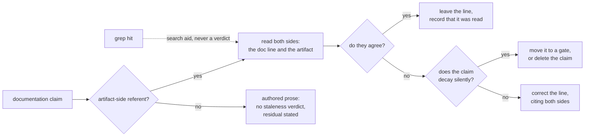
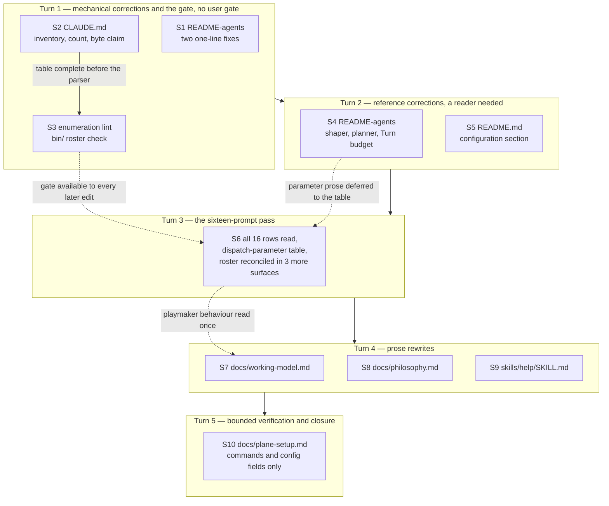

# Implementation Plan: fusion's documentation agrees with the plugin at v8.1.0

**Date:** 2026-08-13
**Status:** Draft
**Spec:** none — planned from the Circle Directive at `circles/260813-0910-documentation-matches-shipped-plugin/_t_circle.md`, against the bounded finding list in `shared/analyses/260813-0828-documentation-staleness-survey.md` and the acceptance conditions in `shared/issues/260813-0825_o_the-v8-1-0-documentation-step-reached-three-files-and-the-feature-reached-seven-surfaces.md`
**Decidability:** The load-bearing question is whether a documentation sentence is stale. It is decidable whenever the sentence has an artifact-side referent — a path, a parameter, a write scope, a roster, a configuration key — because the mechanism then holds two texts and compares them. It is not decidable for prose whose referent is a reader's need rather than an artifact, and three surfaces in scope carry such prose: the troubleshooting and rationale passages of `docs/plane-setup.md`, and the arguments in `docs/philosophy.md` and `docs/working-model.md`. For that class the mechanism changes rather than approximates. No step returns a staleness verdict on it: prose with no artifact-side referent is authored (steps 7 to 9), and the one place where silence would be mistaken for coverage states the residual instead (step 10). Two further consequences follow. A match count is not a reading and decides nothing, so the mechanism is reading both sides in every step without exception. And for the sub-class that is decidable *and* decays silently — an inventory, a hand-written count — a corrected line is itself an approximation of a check, so the mechanism moves out of prose into a gate (step 3) or the claim is removed (step 2).

## Directive

The Circle record holds the authoritative Directive and is not restated here. In one sentence: every documentation surface a fusion reader consults must describe the plugin as it behaves at v8.1.0, over the bounded list of defects the survey established, and the two claims a machine can derive stop being prose.

Three points where this plan follows the Directive against the survey's wording, so no step drifts back to the survey:

1. The tracked-file count at `CLAUDE.md:51` is **deleted**, not corrected and not gated. The survey's step A3 says "correct 612 to the measured count"; that instruction is superseded.
2. All sixteen `README-agents.md` agent rows are read against their prompts, not only the four the survey confirmed, and the file gains a dispatch-parameter table. The parameter roster is established by reading all sixteen prompts. Neither the survey's count of five nor `CLAUDE.md`'s count of four is carried forward.
3. `docs/plane-setup.md` has its command forms and configuration fields verified against `bin/fusion-plane`, and nothing else. The troubleshooting prose stays unverified, and step 10 states that residual rather than letting silence read as coverage.

## The method constraint

**A documentation defect is confirmed by reading both sides, never by a match count.** This binds every step in this plan and is an acceptance condition of each one, not a preamble.

The alternative has already been measured in this Circle's own Grounding. The first version of the defect record claimed `README-hooks.md` still describes the removed guard mechanism as live, on the evidence of thirteen `grep -c` hits that were never opened. All thirteen turned out to be past tense or explicitly labelled as removed history, and acting on the finding would have rewritten one of the best-maintained documents in the set into something worse. The claim was withdrawn and the withdrawal kept.

This Circle greps across sixteen agent prompts and nine documents, which makes it the most exposed of any to that failure. A grep is a search aid: it locates candidate lines. The verdict comes from opening both the documentation line and the artifact it describes. **A step that reports a count without a reading has not done its work**, and its output is to be treated as unfinished rather than as evidence.

## Current State

Measured against the working tree at HEAD `267a65c` while writing this plan. Every value below was read, and the reading is named.

**The finding list is bounded and mostly confirmed.** The survey's fifteen findings stand, plus the sixteenth defect on the `coderev` row and the byte-budget claim the Circle record's activation proposal added. Three investigated leads came back clean and no step re-verifies them: the four version surfaces all read 8.1.0, the guard's protected-path removal is described accurately everywhere it is described, and the citation lint resolves every citation in scope.

**The `bin/` inventory gap is reproducible and has a parseable shape.** `ls bin/` returns fifteen entries; `CLAUDE.md`'s Layout table carries rows for ten of them, each in the form `` | `bin/<name>` | … | ``. The five absent are `fusion-commit-lock`, `fusion-count-sources`, `fusion-review-coverage`, `fusion-staging-drift` and `fusion-state-drift`. The row shape is regular enough for a lint parser, which is what makes step 3 small.

**The byte-budget claim at `CLAUDE.md:64` is stale and was re-measured here.** The line claims an always-on floor of 88 023 bytes per dispatch, 80 670 of them shipped rule text. Summing the five always-on files that `bin/fusion-rules` emits unindented (`agent-setup.md`, `fusion-workbench-conventions.md`, `decision-record-examples.md`, `user-facing-output.md`, `critical-stance.md`) plus this project's 7 353-byte chat profile gives **93 819 bytes total, 86 466 of shipped rule text**. The gap is not a typo in the original: `rules/fusion-workbench-conventions.md` alone has grown to 51 920 bytes and gained 1 928 bytes in seven hours on the day this plan was written. The claim is a hand-written measurement of files that change every session, which is the same class of maintenance obligation as the tracked-file count the Directive deletes.

**The parameter roster is larger than any documented count, and one documented claim contradicts the prompt.** Read on both sides while planning, as leads for step 6 rather than as the roster: `agents/planner.md` declares `**Executors:**` and `**Circle:**` and contains **zero** occurrences of the string "Domain"; `agents/taskplanner.md`, `agents/reconciler.md` and `agents/playmaker.md` each carry a `Parameter parsing` section for `**Domain:**`; `agents/editor.md` declares `**Deliverable language:**` with no default and a halt; `agents/shaper.md` declares a four-line mode contract (`**Mode:**`, `**Draft:**`, `**Circle file:**`, `**Parent task:**`). The work-tree and installed copies of `agents/planner.md` are byte-identical, so this is not an install-drift artefact. Three shipped surfaces nevertheless state that the planner takes a domain parameter: `CLAUDE.md:14`, `CLAUDE.md:56-60` and `docs/philosophy.md:19`, and the manifest description in `.claude-plugin/plugin.json:3` states a count of three domain-parameterised agents. That is a documentation defect against the prompt, and separately it raises a design question this plan does not answer (decision record `260813-1820_o_should-the-planner-accept-a-domain-parameter…`).

**The dependency that once split this Circle in half has closed.** `circles/260813-0858-playmaker-maintains-backlog-store/` carries the closed-coherent marker, so the four passages the Directive named as waiting are workable now. They are folded into steps 2, 6, 7 and 9 rather than carried as a separate deferred group.

**The test suite is green at HEAD, on the closure note rather than on a run of my own.** `shared/issues/260813-0828_c_three-tests-fail-at-head…` records `cd hooks && npx vitest run` at exit 0, 48 files, 1010 tests passed, after two fixes. *Inference:* the first run of the extended gate in step 3 should therefore be green if steps 1 and 2 land first. The executor verifies this by running the suite rather than by trusting the note.

**Two lint gates already constrain the files this plan edits.** `derivable-enumerations-lint.test.ts` parses `README-agents.md` and `CLAUDE.md` with regexes anchored to their current phrasing — the skill table rows, the "Always-on core" bullet, the `of the 16 prompts` claim, the `DEFINITION_SITES` echo. A reworded surface makes a parser find nothing, and the gate then fails loudly by design. Every step that edits either file therefore ends with a lint run.

## Approach

The work is one correction pass against a bounded list, ordered so that the mechanical half is separable from the judgement-heavy half and so that no step depends on a later one. Three commitments shape the ordering.

**The gate lands early, not last.** The `bin/` roster check is written in step 3, immediately after the table it parses is completed in step 2, and before the heavy rewrites of `README-agents.md` and `CLAUDE.md` begin. Every later step that touches either file then runs an existing gate rather than one that arrives afterwards.

**The sixteen-prompt read happens once and feeds four surfaces.** Establishing the parameter roster requires opening all sixteen prompts, and so does verifying the sixteen table rows. These are one step, not two, and their output supplies `README-agents.md`'s table, `CLAUDE.md`'s bullet, `docs/philosophy.md` §5 and the playmaker facts that step 7 needs. Splitting them would mean either reading the prompts twice or carrying an unverified roster between steps.

**A decaying claim is not corrected in place.** Where a documented value is derivable from the tree and decays silently, the fix is a gate or a deletion. Two instances are in scope: the `bin/` roster becomes a gate, and the tracked-file count is deleted. The byte-budget claim is the third instance and takes the deletion treatment for its present-tense half while keeping its historical measurement, which is the question decision record `260813-1820_o_how-fusion-s-own-docs-treat-a-hand-measured-number…` generalises.

Every step routes to `coder`. The scope is markdown documentation of code and agent behaviour, one TypeScript test file, and one build manifest — no ontology, manifest, schema or fixture data is touched, so no step routes to `ontocoder`.

## Implementation Steps

1. [DONE] **README-agents.md — the two dead references**
   - Executor: `coder`
   - Files: `README-agents.md`
   - Changes: At `:268`, replace `fusion-workbench/history/` with the v4.0.0 spelling. The correct layout is stated in `rules/fusion-workbench-conventions.md` `## fusion-workbench Layout` and, forty lines earlier in the same file, at `README-agents.md:225-236`: history lives in `shared/history/` and `circles/<dir>/history/`. At `:262-265`, step 5 of "Adding a new agent" tells the reader to register the agent in a "`CLAUDE.md` folder structure block" and a "`CLAUDE.md` key-documentation table"; `CLAUDE.md` has neither. Open `CLAUDE.md` and name what it actually has: one `## Layout` table, and the agent listing in the prose bullet under `## What this is`. Read both sides of each before editing. Finish with `cd hooks && npx vitest run lib/__tests__/derivable-enumerations-lint.test.ts`.
   - Dependencies: none

2. [DONE] **CLAUDE.md — the inventory, the deleted count, the playmaker clause, the byte claim**
   - Executor: `coder`
   - Files: `CLAUDE.md`
   - Changes: Four edits in one file.
     (a) Add Layout rows for the five `bin/` helpers absent from the table: `fusion-commit-lock`, `fusion-count-sources`, `fusion-review-coverage`, `fusion-staging-drift`, `fusion-state-drift`. Confirm the set with `ls bin/` against the existing rows. Each row points at the authoring home rather than restating it — `README-hooks.md:177-179` covers three of them, `rules/workbench-stash-and-lock.md:128` covers `fusion-commit-lock`. `fusion-count-sources` is documented in no markdown file in the repository, so read its own header and write it a real row. Keep the row shape `` | `bin/<name>` | … | `` exactly: step 3's parser keys on it.
     (b) At `:51`, **delete** the tracked-file count `— 612 files since e8988d9 (260801) —`. Do not replace it with a measured number and do not gate it. The sentence's point is that the workbench is git-tracked in this repository and that this state is load-bearing for the stash issue; that point survives without a number. Leave the deletion legible enough that the next reader does not restore it.
     (c) At `:51`, correct the playmaker parenthetical. It reads "the playmaker consolidates and ranks them, no agent files one". Read `agents/playmaker.md` at HEAD: the agent now *maintains* the store, renaming markers between open and in-progress on its own and splitting, merging, closing and deferring under confirmation. The second clause stays if `agents/playmaker.md` and `skills/memo/SKILL.md` still support it; verify rather than assume.
     (d) At `:64`, the always-on rule budget. The line claims a current floor of 88 023 bytes, 80 670 shipped. Re-measure with `wc -c` over the five files that `bin/fusion-rules` emits unindented plus the project's chat profile — this plan measured 93 819 and 86 466 — and then rewrite the sentence so that the removal's delta stays as a **stamped historical measurement** and no current floor is claimed. The historical numbers 98 443 and 91 090 describe a past state and remain true; the two present-tense numbers decay with every rule edit and are the ones to remove. This is the one judgement call in an otherwise mechanical step; the treatment is fixed here so the executor makes no choice, and the general rule is the subject of the decision record cited in Open Questions.
   - Dependencies: none

3. **Extend `derivable-enumerations-lint.test.ts` with the `bin/` roster**
   - Executor: `coder`
   - Files: `hooks/lib/__tests__/derivable-enumerations-lint.test.ts`
   - Changes: Add one `describe` block following the shape the file already uses for the skill roster and the `hooks/lib` table. Derive ground truth with `readdirSync` over `bin/`. Parse the documented claim from `CLAUDE.md`'s Layout table with a regex over `` | `bin/<name>` | ``. Assert both directions: every file under `bin/` has a row, and no row names a file that does not exist. Include the non-vacuity assertion the file's convention requires — a parser that finds no rows must fail loudly rather than pass — and a mutation check that a scratch helper would be reported. **Do not add a workbench file-count check**: step 2 deletes that claim, so there is no documented value to diff against. Say so in the block's comment, because the survey proposed such a check and the next reader will otherwise add it back against a claim that no longer exists. Run the file, then `cd hooks && npx vitest run` for the whole suite.
   - Dependencies: step 2 — the table must be complete before the parser is written against it, so the first run is green

4. **README-agents.md — the shaper and planner rows, and the Turn-budget diagram**
   - Executor: `coder`
   - Files: `README-agents.md`
   - Changes: Rewrite the `shaper` row at `:25` and the `planner` row at `:26` against the current prompts. Read `agents/shaper.md` and `agents/planner.md`, and run `bin/fusion-paths shaper` and `bin/fusion-paths planner` for the resolver key sets: the shaper's anticipated-circle mode creates a Circle directory as its first write and reads the backlog store, which is why its keys carry `OUT_CIRCLE` and `SCAN_BACKLOG`. Correct the Role, Writes and Output columns to match. **Leave both rows' dispatch parameters to step 6's table** rather than describing them in the row, so the roster is authored in one place. At `:110`, the pipeline diagram draws `Turn loop (max 5 Turns)`. Replace it with wording that carries no digit: the budget is resolved once per session by `bin/fusion-turn-budget` from `{"orchestrator": {"maxTurns": N}}` in `fusion-guard.json`, with the default defined once in `hooks/lib/config.ts` `DEFAULTS`. Finish with the enumeration lint.
   - Dependencies: step 3 (the gate is in place before README-agents is reshaped)

5. **README.md — the configuration section and the tuning table**
   - Executor: `coder`
   - Files: `README.md`
   - Changes: The claim at `:100` that the plugin's `hooks/config.json` "defines the defaults: decision-to-path mappings and sensitivity levels" is wrong on both halves. Read `hooks/config.json`: it ships `categoryPaths: {}`, `categorySensitivity: {}` and `decisions: []`, so it defines no mappings and no sensitivities. Read `hooks/lib/config.ts` around the `DEFAULTS` block: there are three layers, not two — the project's `fusion-guard.json`, then the plugin's `hooks/config.json`, then the built-in defaults — merged per leaf. Correct the description and point the reader at `templates/fusion-guard.json` as the file a project actually edits, since `hooks/config.example.json` documents neither `orchestrator.maxTurns` nor the retired key. Then close the two gaps in the tuning table: add `orchestrator.maxTurns`, which appears nowhere in `README.md` today, and add the retired `guard.protectedPaths` advisory, which is what an upgrading project actually sees on every guarded tool call. `README-hooks.md:268` is the authoring home for the advisory — cite it, do not restate it.
   - Dependencies: none

6. **All sixteen agent rows, and the dispatch-parameter roster**
   - Executor: `coder`
   - Files: `README-agents.md`, `CLAUDE.md`, `docs/philosophy.md`, `.claude-plugin/plugin.json`
   - Changes: This is the Circle's largest step and has two halves that share one reading of the sixteen prompts.
     *The rows.* For each of the sixteen agents, open `agents/<name>.md` and run `bin/fusion-paths <name>`, then check the row's Role, Reads, Writes and Output columns against them. The read is bounded per row: the prompt's Setup, Scope and Output sections plus the resolver key set, not the whole prompt. Correct every row that disagrees, and record for each row that it was read — the twelve previously unverified rows are the point of the step, so "no change needed" is a result only when it follows a reading. Two defects are already confirmed on both sides and are the starting point, not the scope: the `coderev` row at `:29` says "Go / TS / Python code" where `agents/coderev.md:3` says "application code, prompts, build/packaging, and tooling"; the `playmaker` row at `:40` says the agent "names duplicates" where it merges them, and its Writes column omits the backlog store while `bin/fusion-paths playmaker` emits `OUT_BACKLOG=shared/backlog`.
     *The roster.* Establish which agents accept which run-time dispatch parameters by reading all sixteen prompts. Do not carry forward the survey's count of five or `CLAUDE.md`'s count of four. The leads read while planning are listed under Current State above and are a starting set to confirm or refute, not the answer. Add a dispatch-parameter table to `README-agents.md` with one row per parameter: the agent, the parameter line, its accepted values, what happens when it is absent (default value, or halt), and who passes it. The editor's `**Deliverable language:**` is the one parameter with no default and a halt, and the table must make that visible rather than uniform with the others.
     *The reconciliation.* The same claim is stated in three further places, and all three are wrong about the planner if the reading above confirms that `agents/planner.md` never parses `**Domain:**`: `CLAUDE.md:14`, the `CLAUDE.md:56-60` bullet, and `docs/philosophy.md:19`. Correct each to what the prompts do. Check `.claude-plugin/plugin.json:3`, whose description claims three domain-parameterised agents, and correct it if the roster contradicts it — leaving one knowingly false copy while fixing the others is exactly the failure this Circle exists to end. **The prompts are the ground truth here; whether the planner *should* take a domain parameter is a design question this step does not answer** (see Open Questions). Finish with the enumeration lint, whose parsers key on `README-agents.md` phrasing.
   - Dependencies: steps 3 and 4

7. **docs/working-model.md — the Circle-first flow, the backlog store, the playmaker's role**
   - Executor: `coder`
   - Files: `docs/working-model.md`
   - Changes: Three passages. §2 at `:31-40` says the shaper "produces a **spec**"; under the v8.1.0 Circle-first placement rule its anticipated-circle mode produces a Circle, and the flow diagram at `:33-35` has no branch for it. Read `agents/shaper.md` and fold the branch into both prose and diagram. §1 at `:7-24` describes how a Circle comes into existence without mentioning the backlog store, `/fusion:direct`, or the idea-to-Circle path; introduce all three. §5's walkthrough at `:87-103` runs one code session end to end. *Recommendation:* add a short second walkthrough for the idea-to-Circle path rather than a step inside the existing one, because the existing walkthrough is a single code session and folding a portfolio path into it blurs both; the executor may choose otherwise with a stated reason. Now that the playmaker Circle has closed, the sentences describing what a playmaker run does to a backlog entry are no longer deferred — state them from `agents/playmaker.md`, using the reading step 6 already performed rather than re-deriving it.
   - Dependencies: step 6

8. **docs/philosophy.md — the traceability paragraph**
   - Executor: `coder`
   - Files: `docs/philosophy.md`
   - Changes: §3 at `:15` names `/fusion:memo` for personal notes and `/fusion:log-activity` for the activity log. Two things are missing: `/fusion:memo` is also the one user surface that files a backlog entry, and `/fusion:cadence` is a third traceability surface the paragraph omits entirely. Read `skills/memo/SKILL.md` and `skills/cadence/SKILL.md` before writing. §5 at `:19` belongs to step 6 and is not touched here.
   - Dependencies: none

9. **skills/help/SKILL.md — the two missing entry points and the backlog store**
   - Executor: `coder`
   - Files: `skills/help/SKILL.md`
   - Changes: Topic 2 item 2 at `:55-65` routes ten kinds of request to an agent or skill and has no route for capturing an idea and none for drafting a Directive without starting work. Add both: `/fusion:memo` to the backlog store, and `/fusion:direct` for an anticipated Circle. Read `skills/memo/SKILL.md` and `skills/direct/SKILL.md` for what each actually does. Item 3 at `:67-69` describes the workbench and omits `shared/backlog/` and `portfolio.md`; add them. Keep the file's own discipline: it cites `rules/fusion-workbench-conventions.md` for the layout rather than reciting paths, and the additions must not break that. This is fusion's only in-session documentation surface, which is why it is in scope despite being the smallest edit.
   - Dependencies: none

10. **docs/plane-setup.md — command forms and configuration fields only**
    - Executor: `coder`
    - Files: `docs/plane-setup.md`
    - Changes: Extract every command form and every configuration field the 466-line document names, and check each against `bin/fusion-plane`: its header usage block at `:15-56`, its `usage()` function at `:2482`, its `cfg_get` call sites, and `templates/plane.config.yaml`. Correct what disagrees. **The seam is exact and is the user's:** a command form or a configuration field is verified wherever it appears, including inside the troubleshooting blocks; a claim about what a symptom means or what to do about it is not verified. The two passages that are rationale and troubleshooting rather than reference — "Why this is worth doing" at `:395-413` and "If a check fails" at `:414-436` — keep their prose. The step's completion note and the Circle's history entry must **state that residual explicitly**, so a later reader does not mistake this step for a full audit of the document. Verification is by reading the helper; no live Plane instance is required and `fusion-plane doctor` is not part of this step.
    - Dependencies: none

## Data Structures

No runtime data structure changes. One test-side contract is added in step 3: the `bin/` roster check derives its ground truth from `readdirSync("bin")` and its documented claim from a regex over `CLAUDE.md`'s Layout rows in the form `` | `bin/<name>` | ``. That regex is a coupling between the test and the table's formatting, in the same way the file's six existing parsers are coupled to their surfaces. The coupling is deliberate and the file documents why: a reworded surface makes the parser find nothing, the non-vacuity assertion fails loudly, and the fix is to update the parser rather than to let the check pass silently.

## API Changes

None. No agent prompt, helper, hook or skill changes behaviour in this Circle. The only non-documentation file edited is a test, and the only manifest edit is a description string. The plugin behaves at the end of this Circle exactly as it behaves now; what changes is what the documentation says about it.

## Testing Strategy

- **After every edit to `README-agents.md` or `CLAUDE.md`:** `cd hooks && npx vitest run lib/__tests__/derivable-enumerations-lint.test.ts`. Both files are parsed by phrasing-anchored regexes, and a rewrite is the documented way to break them.
- **After step 3 and at the end of each Turn:** `cd hooks && npx vitest run` — the full suite. The baseline is 48 files and 1010 tests green, recorded in the closure note of `shared/issues/260813-0828_c_three-tests-fail-at-head…` and not re-run while planning. Establish it by running, not by citing.
- **After steps 1, 4, 5, 7, 8, 9:** the citation lint runs inside the full suite and covers every surface in scope, so a corrected path or anchor is checked mechanically. New citations are cheap to add for that reason.
- **Step 6 has no machine check for its main claim.** Whether a table row matches its prompt is not derivable, so the evidence is the reading itself: each corrected row cites the prompt line it was checked against, in the step note and in the commit message. Sixteen rows read is the acceptance condition, not sixteen rows changed.
- **Step 10 is verified by reading `bin/fusion-plane`,** not by running it. A live push needs a Plane instance and an API key, and neither is in scope.

## Risks & Mitigations

| Risk | Mitigation |
|------|------------|
| A grep count is reported as a finding, repeating the withdrawn claim this Circle was shaped around | The method constraint is an acceptance condition of every step. Each correction cites both sides, doc line and artifact line. A step note that carries counts without citations is unfinished and goes back. |
| A rewrite of `README-agents.md` or `CLAUDE.md` breaks one of the enumeration lint's phrasing-anchored parsers | Run that lint after every edit to either file. Step 3 lands the new parser before the heavy rewrites begin. A parser that finds nothing fails loudly by design: fix the parser, never drop the check. |
| Step 6 overruns its Turn — sixteen prompts total about 4 300 lines, of which `agents/orchestrator.md` alone is 1 417 | Read per row, not per prompt: Setup, Scope and Output plus the resolver key set answer every column. The orchestrator row is the one that can overrun; take it first while the budget is intact. If the Turn budget still runs out, defer step 10 (see below) or raise `{"orchestrator": {"maxTurns": 6}}` in `fusion-guard.json` — the knob step 5 documents. |
| Step 10 is squeezed out at the end | It is the only step with no dependency in either direction, so it is the intended deferral candidate. If it is deferred, the residual must be filed as an issue rather than left in the Circle's prose, because the Directive promises the verification. |
| The playmaker's behaviour is written twice, in step 6 and step 7, and the two drift | Step 6 establishes it from `agents/playmaker.md`; step 7 uses that reading and cites the same lines. One reading, two surfaces. |
| A row correction turns out to be a prompt defect rather than a documentation defect, as the planner/`**Domain:**` case already has | The prompt is ground truth for what the plugin does, so the documentation is corrected to match it in every case. The design question goes to a decision record and does not block the row. |
| Scope creeps into the four coverage gaps inherited from the survey — no `rules/` file audited, `README-hooks.md` read in part, `install.sh` read in its header only, nothing tested against a consuming project | All four are out of scope. A step that trips over one files an issue in `$OUT_ISSUE` and continues. |
| The deleted count at `CLAUDE.md:51` is restored by a later session with "the right number" | The Circle record already states that the deletion is the chosen fix; step 2 leaves the sentence readable without a number, and step 3's comment records why no count check was added to the gate. |

## Open Questions

- [ ] **Should `agents/planner.md` accept a `**Domain:**` parameter?** Three shipped surfaces say it does; the prompt never parses the string. This plan corrects the documentation to the prompt and leaves the design question open. Filed as `circles/260813-0910-documentation-matches-shipped-plugin/decisions/260813-1820_o_should-the-planner-accept-a-domain-parameter-that-three-documented-surfaces-already-promise.md`.
- [ ] **How do fusion's own documents treat a hand-measured number that decays?** The tracked-file count is deleted by Directive and the byte-budget claim takes the same treatment in step 2, which makes two instances of one rule and no stated convention. Filed as `circles/260813-0910-documentation-matches-shipped-plugin/decisions/260813-1820_o_how-fusion-s-own-documentation-treats-a-hand-measured-number-that-decays.md`.
- [ ] **Does the turn-budget lint want extending to `README-agents.md`?** The survey raised it as an open question. Step 4 removes the digit from the diagram instead, which makes the extension moot: a lint that follows a picture is a different kind of anchor than the prose it follows today, and there is no longer a number to check. Recorded here so the question is visibly answered rather than dropped. Plan-scoped, no record filed.
- [ ] **Does `docs/working-model.md` §5 gain a step or a second walkthrough?** Step 7 recommends a second short walkthrough and permits the executor to differ with a stated reason. Plan-scoped, no record filed.

## Turn budget and completability

**Ten steps across five Turns is completable, with one honest caveat.** The packing is: Turn 1 takes steps 1 to 3, Turn 2 takes steps 4 and 5, Turn 3 takes step 6 alone, Turn 4 takes steps 7 to 9, Turn 5 takes step 10 and the closure. Turns 1, 2 and 4 are comfortable. Turn 3 is the one at risk, because step 6 is a bounded read of sixteen prompts and one of them is 1 417 lines; if any Turn overruns, it is that one.

The caveat is stated rather than absorbed: if step 6 needs a second Turn, the five-Turn budget no longer covers step 10, and step 10 is then the item to defer, since it depends on nothing and nothing depends on it. The alternative is to raise the budget to six in `fusion-guard.json`, which is the knob step 5 documents and which this Circle is entitled to use on its own work. What must not happen is step 6 being compressed to fit: the twelve unread rows are the Circle's largest single piece of work by the user's own decision, and a partial pass over them reproduces the sampling that produced the sixteenth defect in the first place.

The sequencing the user indicated is kept unchanged, and reading the material confirmed it rather than contradicting it. Groups A and B land in one Turn with no user gate; running the gate after the mechanical edits gives a green first run; the reference corrections want a reader; the sixteen-prompt pass and the prose rewrites are where the time goes and where a reviewer earns its dispatch.
