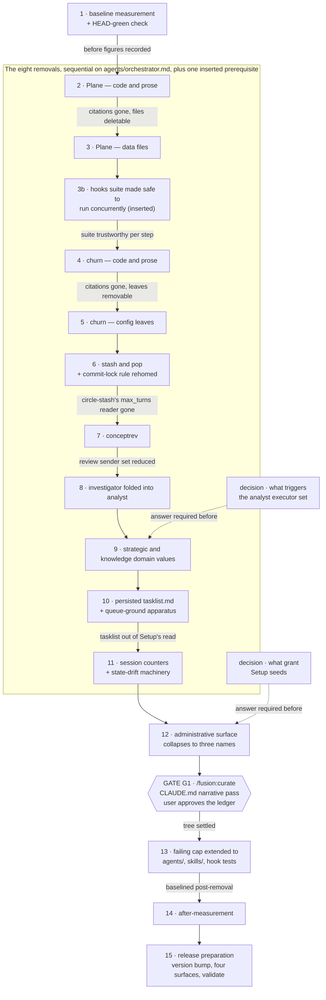
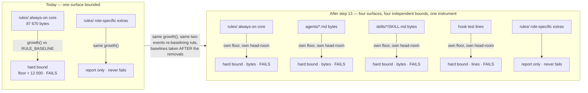

# Implementation Plan: remove eight mechanisms, collapse the administrative surface, extend the failing cap

**Date:** 2026-08-15
**Status:** Approved
**Spec:** none — the Circle record is the spec: `circles/260815-0007-remove-eight-mechanisms-and-cap-growth/_t_circle.md`
**Decidability:** The load-bearing question is *"has every reference to a removed mechanism gone?"* **It is decidable for one class of reference and not for two others, and the honest form of the claim is the narrow one.** Decidable: a **path-shaped citation in shipped text**. `hooks/lib/__tests__/reference-resolution-lint.test.ts` resolves every `rules|agents|skills|docs|hooks|bin|templates|stilwerk`-shaped path — plus `CLAUDE.md`, `README*.md`, `install.sh`, `settings.json` and `.claude-plugin/plugin.json` by name — in every shipped text surface against the tree and fails on a dangling one, and `hooks/lib/__tests__/derivable-enumerations-lint.test.ts` re-derives seven enumerations (the skill roster, the agent-count digits, the always-on rule list, the conditional emission sets, the `hooks/lib` table, the `DEFINITION_SITES` echo, **and the `bin/` helper roster in `CLAUDE.md`'s Layout table**) and diffs them against what the documents claim. For that class, `npm test` answers the question after every step and the sweep obligation is enforced rather than promised.

**Two classes it does not reach, both measured in Turn 1 rather than supposed.** First, **the workbench**: `reference-resolution-lint` scans the shipped tree and not `fusion-workbench/`, which is `shared/issues/260812-1720_*_the-reference-resolution-lint-does-not-scan-the-workbench-where-citations-are-densest.md`, and after steps 2 and 3 the open defect records naming a deleted Plane path stood at seven, tabulated and verified in `issues/260815-0803_*_seven-open-defect-records-name-the-deleted-plane-mirror-and-neither-removal-step-owns-a-record-sweep.md`. Second, **bare filenames**: `CLAUDE.md`'s `templates/` and `docs/` inventory rows write a filename with the directory only in the row label, so no path-shaped token exists for any lint to resolve, and both rows went stale at step 2 while the suite stayed green (`issues/260815-0803_*_two-claude-md-inventory-rows-went-stale-and-neither-lint-gate-can-see-them.md`). The `stilwerk/` row has the same shape and the same exposure.

**What follows, and what deliberately does not.** This plan does not add a mechanism for either class and does not plan work for one; narrowing the claim is the correction `rules/critical-stance.md` §3 asks for, and widening the plan is not. What the two classes cost is that each step's sweep over them rests on the step naming what to touch, not on the suite — so a step's file list is complete evidence only for path-shaped citations in shipped text. Two consequences remain built into the ordering below: a citation is removed *before* its target file is deleted, never after, or the intermediate commit is red; and the edits those two gates assert cannot wait for the curator's pass at gate G1, which stands after step 12 and before step 13 (see `## Approach` → *The `CLAUDE.md` cut*).

The one question in this Circle that was **not** decidable from the inputs its mechanism had is who should receive the `analyst` executor set once the `strategic` and `knowledge` domains are gone. The orchestrator decided it at Phase 0b, one phase before the plan that would answer it exists. The change of mechanism this line called for, rather than a better guess, was to stop deciding it there, and that is the change the user chose: `decisions/260815-0029_*_what-triggers-the-analyst-executor-set-once-strategic-and-knowledge-are-gone.md` is answered with option 1. The orchestrator now prefixes `**Executors:** coder, ontocoder, analyst` on every planner dispatch, unconditionally, and the planner routes a step to `analyst` when, and only when, that step produces a strategic deliverable. The decision therefore sits with the mechanism that holds the input it needs, which is the plan. Step 9 carries the edit, and the question is no longer undecidable from where it is now made.

## Directive

Eight mechanisms leave the shipped plugin, the administrative surface collapses from eight user-visible names to three, and the failing growth bound that today guards only the always-on rule corpus is extended to `agents/`, `skills/` and the hook test lines. The Circle record carries the Directive in full, with the measurement behind each removal; nothing here restates it.

What this plan adds to the record is the part the record does not contain: the order, the collisions, the executor split, and the three places where the record's outline meets a gate in this repository's own test suite and has to bend around it.

## Current State

**Measured at planning time, 2026-08-15, at HEAD `9a7da8e`.** These are reference readings, not the Circle's "before" figures — step 1 re-takes them at execution time, because the tree may have moved between the plan and its approval.

| Surface | Reading |
|---|---|
| Rule bytes per dispatch, leanest agent (`coder`) | 95 023, of which 87 670 is plugin rule text and 7 353 this project's chat voice profile |
| Rule bytes per dispatch, `orchestrator` | 130 440 |
| `agents/*.md` | 460 292 bytes, 4 684 lines |
| `skills/*/SKILL.md` | 294 134 bytes, 3 632 lines |
| Hook source (`hooks/*.ts` + `hooks/lib/*.ts`) | 7 934 lines |
| Hook tests (`__tests__` + `helpers`) | 25 897 lines across 49 test files |
| Orchestrator Setup read | 464 893 bytes ≈ 116 223 tokens, of which `tasklist.md` is 162 038 bytes ≈ 40 510 tokens |

Three facts about the tree decide most of what follows.

**The growth bound has 10 903 bytes of head-room and the removals spend none of it.** The core-only role stands at 87 670 against a `RULE_BASELINE` floor of 86 573 plus 12 000 of budget. Every rule-file edit in this plan is a deletion, so the bound stays green throughout. What does move is `hooks/lib/__tests__/fixtures/rules-emission.golden`, which pins each file's exact size — it is regenerated in every step that touches a rule file, by the documented one-command procedure.

**Eight of the sixteen steps edit `agents/orchestrator.md`.** (Sixteen: the fifteen numbered steps plus the inserted 3b, which touches neither that file nor any other shipped prompt.) Steps 2, 4, 6, 7, 8, 9, 10 and 11 name it in their file lists: Plane, churn, the stash pair, `conceptrev`, the investigator fold, the domain values, the tasklist and the counters. Three steps that might be expected here are not. Step 12, the administrative surface, edits `agents/curator.md` and not the orchestrator. Steps 1 and 14 read the file inside a `wc -c` command without changing it, so they are measurements of the surface rather than edits to it. The same eight steps also edit `rules/fusion-workbench-conventions.md`, six of them `skills/setup/SKILL.md`, four of them `README-hooks.md`. There is no useful parallelism here, and the plan does not pretend otherwise: it is one chain.

**`skills/cadence/SKILL.md` uses the word "churn" for something else and must not be edited for it.** Its churn is *themes by number of distinct sessions* — a cadence metric with no relation to the guard's file heatmap. Nine occurrences, all of them keepers. Its one genuine edit is the prose example at line 154 naming `conceptrev`, which step 7 handles.

## Approach

Five rules govern the whole sequence. Each of them is a response to a specific way this work can go wrong, not a preference.

**1. Every step ends green.** The orchestrator's Step 3b runs the test suite after each task and reverts or self-heals on failure, so a step that lands red is not merely untidy — it is undone. Since the reference lint fails on a dangling citation but never on an uncited file, the rule that falls out is: **remove the citation first, delete the target second.** Every mixed step below is ordered that way, and it is why the `coder` half of each removal precedes its `ontocoder` half.

**2. The `CLAUDE.md` cut, and why it is two things rather than one.** The record asks that the `CLAUDE.md` pass be one step behind a user gate. That holds for the half it was written about and cannot hold for the other half, because `derivable-enumerations-lint.test.ts` asserts three things in `CLAUDE.md` against the tree itself: the skill roster covers every `skills/*/` directory and cites no phantom, the `17 specialized agents` / `The 17 agent prompts` / `the other 16 inherit` digit claims equal the agent count, and the `DEFINITION_SITES` echo matches the lint. Deleting `agents/conceptrev.md` without touching `CLAUDE.md` in the same commit ships a red suite. So:

- **Gate-forced edits** — land in the removing commit, by the removing executor. They are mechanical, derived from the tree, and asserted by a test; they are not statements a curator judges. Six kinds, and the list is what an executor checks against rather than a summary: (1) the skill roster — every `/fusion:<name>` token **anywhere in `CLAUDE.md`**, both directions against `skills/*/`, plus `README-agents.md`'s one-row-per-directory table; (2) the agent-count digit claims, of which there are **five, not three** — three in `CLAUDE.md`, one in `README.md`, one in `README-agents.md` (`derivable-enumerations-lint.test.ts` `CLAIMS`); (3) the `DEFINITION_SITES` echo; (4) **the `bin/` helper roster rows in the Layout table**, a closed enumeration in both directions; (5) `README-hooks.md`'s `hooks/lib` table, exact set equality in both directions, so an **added** module needs a row exactly as a deleted one needs its row gone; (6) **every citation that spells a path into the plugin tree, wherever in the file it sits** — `reference-resolution-lint` resolves the token, and does not care which section or which table the token sits in.
- **Narrative edits** — the Conventions bullets, and the rows and prose that name a removed thing **without** carrying a path-shaped token or an asserted digit — are the curator's, behind user gate G1, which stands after step 12 and before step 13, as one pass. The `templates/`, `docs/` and `stilwerk/` inventory rows are the clearest case: they write a bare filename, so no lint can see them, and they are G1's for exactly that reason (see `**Decidability:**`).

The criterion is unchanged and it is still mechanical: *does `npm test` assert it?* If yes it lands with the removal; if no it waits for the curator. **What was wrong, and what step 2 proved wrong, is the shortcut of answering it by which part of the document the text sits in.** The plan said at step 4 that the Layout table is not read by `derivable-enumerations-lint`; it is, at `hooks/lib/__tests__/derivable-enumerations-lint.test.ts:423-495`, and step 2 met the second branch of that check and deleted the `bin/fusion-plane` Layout row in its own commit under this very criterion. A Layout row is gate-forced or narrative depending on what it *carries*, not on being a Layout row. So the executor greps for the token it is about to orphan across `rules/ agents/ docs/ templates/ skills/*/SKILL.md README*.md CLAUDE.md bin/ install.sh` before deciding, rather than judging by section.

**3. One executor per step, and the data half comes second.** The active set is `[coder, ontocoder]`. Almost everything here is prose, prompts, shell and TypeScript, which is `coder`'s. `ontocoder` gets exactly two steps, both of them the structured-data tail of a removal whose prose half ran first: the Plane YAML/JSON/JSONL files and test fixtures, and the churn configuration leaves. `templates/investigator-capture-layout.md` is Markdown rule prose and stays with `coder`.

**4. Reuse before build, at the three points where this plan is tempted to build.** The cap extension reuses `growth()` and the `RULE_BASELINE` shape rather than inventing a second budget mechanism. The Setup permission seeding reuses `/fusion:unlock`'s merge procedure rather than writing a second one — the defect it closes says so in its acceptance. And the commit-lock rule keeps its own file rather than being folded back into the always-on core, where its 9 250 bytes would be charged to all sixteen agents and would spend most of the head-room the growth bound has left.

**5. The two measurements bracket the removals and neither is optional.** A before/after measurement whose "before" was never taken cannot be produced afterwards. Step 1 takes it and does nothing else; step 14 re-takes it with the identical command. Step 15, the release preparation, is after both of them and measures nothing.

### Step dependency graph



### What the cap instrument becomes



**The four bounds are independent and the graph is drawn to say so.** One shared instrument does not mean one shared budget: each surface carries its own baseline map, its own floor summed over the files present, and its own head-room derived from its own `git log` replay. Growth in `agents/` cannot be paid for by shrinkage in `skills/`, and a single surface crossing its own bound fails the suite on its own.

## Implementation Steps

Every step's acceptance includes `cd hooks && npm test` green and a history entry in the Circle's history store. Those two are not restated per step.

1. [DONE] **Take the before-measurement and confirm HEAD is green**
   - Executor: `coder`
   - Files: `circles/260815-0007-remove-eight-mechanisms-and-cap-growth/history/` (new entry only). No shipped file is touched.
   - Changes: run `cd hooks && npm test` first and record the result and the wall-clock duration; the Circle's claim that `fusion-plane.test.ts` is 74.5 seconds of a 99-second suite is checked here, not asserted. Then run the measurement below from the repo root and record every line verbatim in the history entry under a heading `## Before`. The identical block is re-run at step 14, so copy it into the history entry as well — a measurement whose command was paraphrased is not comparable.

     ```bash
     for a in coder orchestrator planner shaper playmaker; do
       printf '%-14s %s\n' "$a" "$(./bin/fusion-rules "$a" | xargs wc -c | tail -1 | awk '{print $1}')"
     done
     cat agents/*.md       | wc -c;  cat agents/*.md       | wc -l
     cat skills/*/SKILL.md | wc -c;  cat skills/*/SKILL.md | wc -l
     cat rules/*.md        | wc -c
     cat docs/*.md README*.md | wc -c
     cat hooks/*.ts hooks/lib/*.ts | wc -l
     cat hooks/lib/__tests__/*.ts hooks/lib/__tests__/helpers/*.ts | wc -l
     cat bin/* | wc -l
     ls hooks/lib/__tests__/*.test.ts | wc -l
     # Setup read, in bytes and in tokens at 4 bytes per token
     S=$(wc -c < agents/orchestrator.md)
     R=$(./bin/fusion-rules orchestrator | xargs wc -c | tail -1 | awk '{print $1}')
     Q=$([ -f fusion-workbench/tasklist.md ]   && wc -c < fusion-workbench/tasklist.md   || echo 0)
     A=$([ -f fusion-workbench/agentstate.yaml ] && wc -c < fusion-workbench/agentstate.yaml || echo 0)
     echo "setup_bytes=$((S+R+Q+A)) setup_tokens=$(((S+R+Q+A)/4))"
     ```
   - Dependencies: none. Nothing else may start before this lands.

2. [DONE] **Remove the Plane mirror: code, prompts and prose** *(record item 1, first half)*
   - Executor: `coder`
   - Files: `bin/fusion-plane`; `hooks/lib/__tests__/fusion-plane.test.ts`; `skills/seed-from-plane/SKILL.md` (whole directory); `docs/plane-setup.md`; `agents/orchestrator.md`; `skills/setup/SKILL.md`; `skills/cleanup/SKILL.md`; `rules/fusion-workbench-conventions.md`; `rules/circle-records.md`; `hooks/lib/staging-drift.ts`; `hooks/lib/__tests__/{staging-drift,review-coverage,churn,churn-key-anchor,domain-cascade,derivable-enumerations-lint,monitor-warnings-panel,state-drift-detection-lint}.test.ts`; `README.md`; `README-agents.md`; `docs/working-model.md`; `CLAUDE.md` (enumeration half only); `.claude-plugin/plugin.json` (description).
   - Changes:
     - Delete `bin/fusion-plane` (197 references, the largest single file in `bin/`), `hooks/lib/__tests__/fusion-plane.test.ts` (3 020 lines), `skills/seed-from-plane/` and `docs/plane-setup.md`.
     - `agents/orchestrator.md`: delete `## Plane mirror (push-only, optional side-effect)` in full, the three call points it defines (the activation push named at `:249`, the end-of-Turn push at `:694` inside Step 3e, and the Phase-4 closure push at `:880` step 4, which must leave the `.active-circle` clear in place and merely lose the push that preceded it), and the `plane_push` row of the event-type table.
     - Remove `## Step 0e — Ensure the Plane config template is present locally` from `skills/setup/SKILL.md`; remove the two Plane mentions from `skills/cleanup/SKILL.md`.
     - `rules/fusion-workbench-conventions.md`: remove `plane.config.yaml`, `.plane-map.json` and `.plane-outbox.jsonl` from the root-anchored layout tree, and the sentence beneath it that counts them. The tree is normative and declares itself exhaustive; leaving a removed file in it is the exact defect `260810-0410` was filed about.
     - Strip Plane from the exclusion and classification lists in `hooks/lib/staging-drift.ts` and from the eight test files that name a Plane path in a fixture list or an exclusion set.
     - `CLAUDE.md`, enumeration half only: delete `/fusion:seed-from-plane` from the skill listing so `claudeMdDrift` stays empty, and drop `seed-from-plane` from the `README-agents.md` skill table so its one-row-per-directory assertion holds. Everything narrative — the `bin/fusion-plane` Layout row, the `docs/` row's Plane entry, the Conventions text — waits for gate G1.
     - `.claude-plugin/plugin.json`: remove "and an optional push-only Plane work-queue mirror" from the description. Do **not** bump the version here; step 15 owns the bump.
     - Record in the history entry what the mirror was, citing `circles/260719-1536-plane-mirror-integration/_c_circle.md` and its closure note, and quote the two outbox facts this Circle's own activation produced: the outbox holds deferred entries whose reason is `Plane unreachable`, and `.plane-map.json` is `{}` — zero successful pushes, in this project's own runtime state. The record asks that the removal record what was built, and this is where it is recorded.
   - Dependencies: step 1.

3. [DONE] **Delete the Plane data files and fixtures** *(record item 1, second half)*
   - Executor: `ontocoder`
   - Files: `templates/plane.config.yaml`; `fusion-workbench/plane.config.yaml`; `fusion-workbench/.plane-map.json`; `fusion-workbench/.plane-outbox.jsonl`; `hooks/lib/__tests__/fixtures/plane/` (whole tree, 14 files).
   - Changes: delete all of them. The workbench is git-tracked in this repository, so the outbox's evidence survives in history and needs no copy; step 2's history entry already carries the two figures that matter.
   - Dependencies: step 2. Reversing the order fails the reference lint, which resolves `templates/` paths: deleting the template while `skills/setup/SKILL.md` Step 0e still cites it is a dangling citation.

3b. [DONE] **Make the hooks suite safe to run concurrently with itself** *(inserted prerequisite — not in the plan the user approved)*
   - Executor: `coder`
   - Files: `hooks/scripts/build.mjs` (new, 205 lines); `hooks/scripts/run-tests.mjs` (new, 48); `hooks/vitest.config.mjs` (new, 67); `hooks/package.json`; `hooks/tsconfig.json`; `.gitignore`; `hooks/lib/__tests__/helpers/guard-harness.ts`; `hooks/lib/__tests__/{fusion-commit-lock,monitor-warnings-panel,legacy-halt-clearing,clear-halt-concurrent-halt,rules-emission-golden}.test.ts`; `README-hooks.md`.
   - Changes:
     - The build stopped deleting. `npm run build` compiles into a private staging directory and moves the result into `hooks/dist/` file by file with `rename(2)`, so a path under `dist/` is never absent and never partial while a second run reads it. A `dist/` entry is pruned only when it is absent from this build **and** its `.ts` source is absent from the tree.
     - `npm test` became `node scripts/run-tests.mjs`, which keeps the staging tree alive for the run and names it in `FUSION_TEST_DIST`. The two cases that spawn or copy a compiled artifact (`legacy-halt-clearing`, `clear-halt-concurrent-halt`) read that private tree instead of the shared one.
     - The two wall-clock-bound cases became event-bound: `fusion-commit-lock`'s noclobber case gates on files appearing rather than polling inside an injected four-second window, and `monitor-warnings-panel`'s browser-launch case waits on the file or on the process that would create it exiting.
     - `hooks/vitest.config.mjs` caps a run at half the machine's cores. The suite is subprocess-bound, and at one worker per core three concurrent runs collapse macOS fork/exec.
   - Measured: 6 of 6 red before, 12 of 12 green after (two concurrent runs, six rounds). Landed as `332267a`.
   - Why it is here: this Circle's closure criterion rests on the suite meaning something. Step 13 arms a growth bound whose whole value is that the suite fails on an add-back, and every step's acceptance is `cd hooks && npm test` green. Binding record: `shared/decisions/260811-2009_i_is-the-hooks-suite-meant-to-be-run-concurrently-with-itself-and-if-not-who-serialises-it.md`, option 2. Run record: `history/260815-1133-coder-hooks-suite-concurrency-safety.md`.
   - What it left behind for later steps: **steps 11 and 13 both touch what it changed**, and each says where in its own Changes. Whether an inserted step should also be recorded as a change of plan, since the plan was approved at a gate and this step was not in what the user approved, is a question about the plan-gate contract and is not answered here (`issues/260815-1247_o_the-inserted-step-p-3b-is-in-no-plan-and-in-no-turn-log-only-in-the-event-stream.md`).
   - Dependencies: step 3.

4. [DONE] **Remove churn and the cross-file counters: code, prompts and prose** *(record item 2, first half)*
   - Executor: `coder`
   - Files: `hooks/lib/churn.ts` (667 lines); `hooks/churn-rank.ts`; `bin/fusion-churn-rank`; `hooks/tracker.ts` (39 references); `hooks/lib/{fail-open,guard-state-file,project-relative,escalation,config,paths,events,self-detect}.ts`; `bin/monitor`; `agents/orchestrator.md`; `skills/setup/SKILL.md`; `skills/archive/SKILL.md`; `rules/fusion-workbench-conventions.md`; `hooks/lib/__tests__/{churn,churn-key-anchor}.test.ts` (deleted) and `{guard-state-shape,hook-fail-open,monitor-warnings-panel,config,turn-budget-lint,state-drift,staging-drift,review-coverage,fusion-count-sources}.test.ts` plus `helpers/guard-harness.ts` (edited); `hooks/{state-drift,review-coverage,turn-budget}.ts` and `bin/fusion-source-root` (comment references); `README.md`; `README-hooks.md` (19 references); `README-agents.md`; `docs/philosophy.md`; `docs/working-model.md`; `CLAUDE.md` (enumeration half only).
   - Changes:
     - Delete `hooks/lib/churn.ts`, `hooks/churn-rank.ts`, `bin/fusion-churn-rank`, `hooks/lib/__tests__/churn.test.ts` and `hooks/lib/__tests__/churn-key-anchor.test.ts`.
     - `hooks/tracker.ts`: remove the churn measurement and the `churn_warning` / `churn_critical` emissions. This is the surgical part of the step — the tracker also carries the state-drift call (step 11) and the staging-drift and review-coverage calls (which stay), so cut only what the churn measurement owns and leave the three call sites structurally intact.
     - `bin/monitor`: remove `churn_warning` and `churn_critical` from `WARNING_EVENT_TYPES` (line 121) and the `churn_critical` level branch (line 541), and correct the six comment passages that reason about churn's arrival rate when sizing the panel. **Verified, and worth stating because the record's wording invites the wrong edit:** there are no two churn panels. `bin/monitor` has exactly one warnings panel, and churn reaches it as two of its event types. Removing "two panels" would remove the panel that `guard_block`, `guard_halt` and `state_drift` also use.
     - `agents/orchestrator.md` Setup Step 5: delete the high-thrash-files read (`:142`–`:152`), the `[ -x ]`-guarded `bin/fusion-churn-rank` call, and its exit-code prose. Two later passages cite that block as the precedent for their own `[ -x ]` guard — the turn-budget read at `:125` and the review-coverage read at `:609` — and both must be re-pointed at a guard that still exists rather than left citing a deleted one.
     - `skills/setup/SKILL.md` Step 3: same removal.
     - `skills/archive/SKILL.md`: the three churn mentions are all in the `.guard-state/` classification, where they name `churn.json` as an example of a rewritten-in-place state file. Replace the example with `escalation.json`, which survives; the classification itself is unchanged and normative.
     - `rules/fusion-workbench-conventions.md`: remove `hooks/lib/churn.ts` from the four consumer lists in the root-anchored layout tree and the `churn.json` example in `### Which of them a tracked workbench tracks`. Regenerate the golden afterwards.
     - **`CLAUDE.md`, and the whole of it is gate-forced here:** the `bin/fusion-churn-rank` Layout row (`CLAUDE.md:38`) leaves **in this commit**, not at gate G1. Two gates assert it independently — `derivable-enumerations-lint.test.ts:423-495` re-derives the `bin/` roster from the tree and fails with *"CLAUDE.md's Layout table has a row for bin/X but that file does not exist"*, and `reference-resolution-lint` resolves the row's own `` `bin/fusion-churn-rank` `` token. Step 2 met the same pair and deleted the `bin/fusion-plane` row in its own commit; this bullet used to say the opposite and was corrected against that run (`issues/260815-0804_*_the-plan-still-carries-the-false-premise-step-2-disproved-and-steps-4-and-11-will-ship-red-on-it.md`). That row is the step's only `CLAUDE.md` obligation — nothing else in the file names churn — so step 4 leaves **nothing** for G1.
     - `README-hooks.md`, two edits, both gate-forced: `lib/churn.ts` leaves the `hooks/lib` file table (exact set equality both ways), and the `churn-rank.ts` row at `:163` cites `bin/fusion-churn-rank` as a path, which dangles the moment the helper is deleted.
     - `bin/fusion-source-root:61`'s header comment cites `bin/fusion-churn-rank` as the precedent for its own resolution. Shell comments are scanned by `reference-resolution-lint`, so this is a gate-forced edit and not a courtesy one; it is already in the file list and is named here so it does not read as optional.
     - Note the sequencing consequence: `hooks/lib/__tests__/monitor-warnings-panel.test.ts` (810 lines) asserts panel composition against the event set. It is edited here, not deleted — the panel survives.
   - Dependencies: step 3.

5. [DONE] **Remove the churn configuration leaves** *(record item 2, second half)*
   - Executor: `ontocoder`
   - Files: `hooks/config.json`; `hooks/config.example.json`; `fusion-guard.json`; `templates/fusion-guard.json`.
   - Changes: delete the `"churn": { "changesPerSessionWarning": 5, "changesPerSessionCritical": 10 }` block from `hooks/config.json` and its counterpart from `hooks/config.example.json`. Remove the clause "how loud the churn warning is and" from the `_gitTracked` note in **both** `fusion-guard.json` and `templates/fusion-guard.json` — `hooks/lib/__tests__/config.test.ts` holds every byte of those two files identical outside its `PROJECT_SET_KEYS`, so an edit to one alone turns the suite red.
   - Changes, negative: do **not** retire `churn` the way `guard.protectedPaths` was retired. That key earns a per-call advisory in every consuming project until the line is deleted, which is right for a key a project may have set deliberately; the churn thresholds were never a project-set key. Removing the leaf and letting an unrecognised key pass through untouched is the documented behaviour and the quiet one.
   - Dependencies: step 4.

6. [DONE] **Remove the stash and pop skill pair, and rehome the commit-lock rule** *(record item 3)*
   - Executor: `coder`
   - Files: `skills/circle-stash/` and `skills/circle-pop/` (deleted); `rules/workbench-stash-and-lock.md` → `rules/commit-lock.md`; `bin/fusion-rules`; `hooks/lib/__tests__/rules-emission-golden.test.ts` and `fixtures/rules-emission.golden`; `hooks/lib/__tests__/circle-stash-git-exclusion.test.ts` (deleted); `rules/fusion-workbench-conventions.md`; `rules/circle-records.md`; `agents/orchestrator.md`; `agents/{coderev,ontorev,playmaker}.md`; `skills/{setup,cleanup,archive,direct,migrate,log-activity,commit}/SKILL.md`; `hooks/lib/staging-drift.ts`; `hooks/lib/review-coverage.ts`; `hooks/turn-budget.ts`; `hooks/lib/__tests__/{derivable-enumerations-lint,turn-budget-lint,path-literal-lint,reference-resolution-lint,fusion-paths}.test.ts`; `README-agents.md`; `CLAUDE.md` (enumeration half only).
   - Changes:
     - Delete both skill directories and `hooks/lib/__tests__/circle-stash-git-exclusion.test.ts`.
     - **Rename** `rules/workbench-stash-and-lock.md` to `rules/commit-lock.md` and delete its `## Stashes` half, keeping the commit-lock protocol whole. Update its `**Provenance:**` header per `rules/rule-file-provenance.md` to name this Circle as the cause of the rename. Keeping it as its own file, emitted to `orchestrator` alone, is deliberate: folding it back into `rules/fusion-workbench-conventions.md` would charge its bytes to all sixteen agents and spend most of the 10 903 bytes the growth bound has left.
     - `bin/fusion-rules`: change the `1e` emission to the renamed file, and correct the comment block above it — it currently justifies the orchestrator-only audience partly by the two stash skills, an argument that dies with them. The commit lock alone still carries it.
     - `hooks/lib/__tests__/rules-emission-golden.test.ts`: the role key `"circle-records.md + workbench-stash-and-lock.md"` and the `RULE_BASELINE` entry `"workbench-stash-and-lock.md": 9_250` both change name. **The baseline value moves with the rename and is not re-cut** — a rename is neither of the two re-baselining events, and the file shrinks by the stash half, so the role reads as having shrunk, which is exactly what happened. Rewrite the role's `overRelease` prose, which names the stash protocol and its two skills as part of the justification. Then regenerate the golden.
     - `rules/fusion-workbench-conventions.md`: remove `stashes/` from the layout tree, rewrite `## Stashes` into a single sentence saying the protocol was removed with its skills (or delete the section outright and correct the header table's four-topic row to three), and remove `/fusion:circle-stash` and `/fusion:circle-pop` from the enumerated writer set of `.active-circle` in `## fusion-workbench Layout`. That enumeration declares itself closed; leaving two dead writers in it is a false closure.
     - `hooks/lib/__tests__/derivable-enumerations-lint.test.ts`: remove the stash-manifest field-count check, whose subject is gone.
     - `CLAUDE.md`, four gate-forced edits and no narrative half: drop `/fusion:circle-stash` and `/fusion:circle-pop` from the skill listing at `:21`; **drop the `/fusion:circle-stash` mention at `:55`**, inside the `fusion-workbench/` Layout row — the phantom-skill check scans the whole file, not the listing line, so a surviving mention in a Layout row is the same failure as one in the listing; re-point the `` `rules/workbench-stash-and-lock.md` `` path citation in the `bin/fusion-commit-lock` row at `:41` to `rules/commit-lock.md`, because a rename dangles it under `reference-resolution-lint`; and update the `DEFINITION_SITES` echo at `:137`, which names the file by bare basename and is asserted by the echo check rather than by the path lint. Check `path-literal-lint.test.ts`'s own `DEFINITION_SITES` list in the same edit — the two are asserted equal, and the renamed file still names store literals, so it is re-added under its new name rather than dropped.
     - `README-agents.md`, two gate-forced edits: delete the `/fusion:circle-stash` and `/fusion:circle-pop` rows from the skill table (`:250`, `:251`), which is asserted to hold exactly one row per skill directory; and rename `workbench-stash-and-lock.md` to `commit-lock.md` in the **Conditional** bullet at `:197`, where `derivable-enumerations-lint` requires the rule file and its full derived agent set (`` `orchestrator` ``) to be co-mentioned on one line.
   - Dependencies: step 5. It must precede step 11: `skills/circle-stash/SKILL.md` reads `progress.max_turns` as a number, and step 11 removes that field. Deleting the reader first means step 11 has one fewer consumer to reason about, and the reverse order breaks a shipped skill between two commits.

7. [DONE] **Remove `conceptrev`** *(record item 6)*
   - Executor: `coder`
   - Files: `agents/conceptrev.md` (deleted); `agents/orchestrator.md`; `bin/fusion-rules`; `rules/design-diagrams.md`; `rules/fusion-workbench-conventions.md`; `rules/workbench-path-resolution.md`; `agents/{analyst,taskplanner,reconciler,shaper,planner,investigator}.md`; `skills/{setup,migrate,archive,cadence}/SKILL.md`; `hooks/lib/review-coverage.ts`; `hooks/lib/__tests__/{path-literal-lint,fusion-paths,rules-emission-golden,context-manifest,review-coverage-mandate}.test.ts` and `fixtures/rules-emission.golden`; `README.md`; `README-agents.md`; `docs/philosophy.md`; `CLAUDE.md` (enumeration half only).
   - Changes:
     - Delete `agents/conceptrev.md`.
     - `agents/orchestrator.md`: delete Step 0b.1 step 6 and Step 0b.2 step 5 (the two advisory dispatches), the clauses in the two Human Gate steps that present the verdict, and the `conceptrev_start` / `conceptrev_done` rows of the event table. The gates themselves stay — only the wait goes.
     - `bin/fusion-rules`: remove `conceptrev` from the `PATTERNS`, `IS_PROSE_AGENT` and `IS_DIAGRAM_AGENT` branches. `derivable-enumerations-lint.test.ts` re-derives every flag's agent set from this file and diffs it against `README-agents.md`'s conditional-emission bullet, so that bullet is rewritten in the same commit.
     - `rules/design-diagrams.md`: delete `## How the evaluation works` and rewrite the opening sentence, which names `conceptrev` as the evaluator the rule serves. **The rule survives the evaluator**, and the plan is explicit about why: the coherence self-check, the diagram-type table and the authoring rules are guidance to the producer, and they were guidance to the producer before an evaluator existed. What must not survive is the claim that an independent pass judges the graph — the five producers would keep writing for a reviewer that is gone.
     - `rules/fusion-workbench-conventions.md`: `<sender>` in the review-filename row drops to `coderev` / `ontorev`, and the three-review-types paragraph in `## fusion-workbench Layout` becomes two. Regenerate the golden.
     - `hooks/lib/review-coverage.ts` and `review-coverage-mandate.test.ts`: remove `conceptrev` from the recognised sender set. Note `shared/issues/260811-1145_o_conceptrev-review-files-are-scanned-and-trigger-the-coverage-report-though-no-mandate-covers-them.md` — that open defect is retired by this step and should be transitioned `_o_` → `_c_` with a `Resolved:` footer citing the removal.
     - `skills/cadence/SKILL.md:154` uses "design the conceptrev agent" as an example of a real work topic. Replace the example; do not touch the nine churn occurrences (see `## Current State`).
     - **The agent-count digit claims are five, not three, and all five are asserted.** `derivable-enumerations-lint.test.ts`'s `CLAIMS` list covers three phrasings in `CLAUDE.md` (`N specialized agents`, `The N agent prompts`, `the other N inherit`) **plus `README.md:3`** (`17 specialized agents`) **and `README-agents.md:196`** (`of the 17 prompts`). All five drop by one here: `CLAUDE.md` to `16` / `16` / `15`, `README.md` to `16`, `README-agents.md` to `16`. `README.md` is added to this step's file list for that reason.
   - Dependencies: step 6.

8. [DONE] **Fold `investigator` into `analyst`** *(record item 5)*
   - Executor: `coder`
   - Files: `agents/investigator.md` (deleted); `templates/investigator-capture-layout.md` (deleted); `agents/analyst.md`; `bin/fusion-rules`; `bin/fusion-paths`; `agents/{bugfixer,consultant,orchestrator}.md`; `skills/{archive,help}/SKILL.md`; `rules/{agent-setup,critical-stance,fusion-workbench-conventions,design-diagrams,workbench-path-resolution,user-facing-output}.md`; `hooks/lib/__tests__/{rules-emission-golden,fusion-paths,context-manifest}.test.ts` and `fixtures/rules-emission.golden`; `README.md`; `README-agents.md`; `docs/philosophy.md`; `CLAUDE.md` (enumeration half only); `shared/decisions/260812-0254_o_should-the-investigator-get-case-folders-with-a-status-per-case.md`.
   - Changes:
     - Delete `agents/investigator.md` and `templates/investigator-capture-layout.md`.
     - `agents/analyst.md` gains a ninth analysis type, **Failure Investigation**, carrying what the investigator's prompt held that the analyst's does not: reconstructing a timeline from a capture, the evidence inventory, root-cause analysis distinguishing symptom from cause, and the vision capability for reading screenshots and rendered output. What it does **not** carry is the project-supplied capture layout — that template is deleted, and with it the halt-at-Setup behaviour that made the agent unrunnable in a project which had not copied it. The analyst reads whatever the user points it at, which is what it already does for external documents.
     - `bin/fusion-rules`: remove the `investigator` line from the `PATTERNS` case, and from `IS_PROSE_AGENT` and `IS_DIAGRAM_AGENT`. The `investigator` pattern directory itself has no plugin-side file, so no rule file is orphaned. Rewrite `README-agents.md`'s conditional-emission bullet again, and the header comment at `bin/fusion-rules:69` that points at the deleted template.
     - `bin/fusion-paths`: `OUT_INVESTIGATION` loses its last writer. **`shared/investigations/` and both keys stay**, and the reason is worth writing down rather than leaving implied: consuming projects hold investigation reports in that store, `/fusion:archive` still names `$SCAN_INVESTIGATIONS` in its safety filters, and the resolver emits a key only when a prompt names it, so an unnamed key costs nothing at run time. New failure analyses land in `$OUT_ANALYSIS` like every other analyst output. Verify at execution time whether any prompt still names `OUT_INVESTIGATION` after the deletion; if none does, the key's arm in `bin/fusion-paths` may be removed in the same commit, and `fusion-paths.test.ts` (16 investigator references) updated with it.
     - Transition `shared/decisions/260812-0254_o_should-the-investigator-get-case-folders-with-a-status-per-case.md` to `_s_`, appending `Superseded by: circles/260815-0007-remove-eight-mechanisms-and-cap-growth/_t_circle.md § Grounding snapshot item 5 — …`. **Not `_c_`, and not the `shared/issues/` path the Circle record names.** The record is a decision, decisions have no closed state, and this Circle's activation-gate answer overrides an open question — `_o_` → `_s_`, worked transition 5. Defect filed: `issues/260815-0029_o_the-circle-record-cites-the-investigator-case-folder-record-as-an-issue-and-asks-for-a-transition-that-vocabulary-has-no.md`.
     - The five agent-count digit claims drop again: `CLAUDE.md` to `15` / `15` / `14`, `README.md:3` to `15`, `README-agents.md:196` to `15`. `README.md` is in this step's file list for the same reason as step 7's.
     - **`CLAUDE.md:122` is gate-forced and `CLAUDE.md:51` is not, and the difference is how each spells the same file.** The *"Where to look when something breaks"* row at `:122` writes `templates/investigator-capture-layout.md` as a **path**, so `reference-resolution-lint` resolves it and the row leaves in this commit. The `templates/` Layout row at `:51` writes `investigator-capture-layout.md` as a **bare filename** with the directory only in the row label, so no lint can see it and it is genuinely the curator's at gate G1 — which is also why that row is already stale from step 2 (`issues/260815-0803_*_two-claude-md-inventory-rows-went-stale-and-neither-lint-gate-can-see-them.md`). Do not read "it is a Layout row" as an answer either way; read the token.
   - Dependencies: step 7. Adjacent to it on purpose: both change the `IS_DIAGRAM_AGENT` audience, so the role sets in `rules-emission-golden.test.ts` settle once rather than twice.

9. [DONE] **Remove the `strategic` and `knowledge` domain values** *(record item 7)*
   - Executor: `coder`
   - Files: `hooks/lib/domain-cascade.ts` (992 lines); `hooks/lib/__tests__/domain-cascade.test.ts` (953 lines); `hooks/lib/__tests__/domain-cascade-order-lint.test.ts` (193 lines); `agents/orchestrator.md`; `agents/{taskplanner,reconciler,playmaker,consultant,planner,shaper}.md`; `skills/{next,direct,archive,cleanup,help}/SKILL.md`; `rules/{fusion-workbench-conventions,circle-records,context-manifest,context-lean-claude-md}.md`; `README.md`; `README-agents.md`; `README-hooks.md`; `docs/philosophy.md`; `.claude-plugin/plugin.json`; `CLAUDE.md` (enumeration half only).
   - Changes:
     - `agents/orchestrator.md` Setup Step 5: delete the three cascade branches that assign `strategic` or `knowledge` (`:187`–`:189`) and rewrite the two prose paragraphs beneath them (`:194`, `:196`) which explain a branch order that will no longer contain those branches. The `counted_by == "none"` line keeps its load-bearing position ahead of every count-reading branch — that is what `260809-1731` settled and what removing two branches must not disturb.
     - **`hooks/lib/domain-cascade.ts` is rewritten, not deleted.** The record lists it under the removal, and that reading has to be corrected against what the module is: it parses the prompt's own fenced cascade and executes it, so that no second copy of the decision exists. That job survives the loss of two branches — the cascade still has branches, still has an order that matters, and still has the absent-count case whose position is the whole point. What goes is the grammar's acceptance of the two removed domain names and `REACH`'s coverage of them. Deleting the module would delete the only executable definition of a decision that still gets made.
     - `hooks/lib/__tests__/domain-cascade-order-lint.test.ts` is rewritten rather than deleted, as the record anticipates: the branch order it pins is the property the cascade still has, minus the two branches whose lifting was the defect. Its negative controls — the decoy branch, the inverted condition, the dead threshold, the comment-only token — all still apply.
     - `domain-cascade.test.ts` runs `findCascadeStatements()` over `REACH.fileSet` and allows exactly one file to state the cascade. That check is why the four skill-body copies matter: `skills/{next,direct,archive,cleanup}/SKILL.md` each name the four domain values, and `260810-1918` records what a second statement of the cascade cost. Reduce each to two values and re-run the reach check.
     - `agents/{taskplanner,reconciler,playmaker}.md`: reduce the `**Domain:**` accepted values to `code | data` and delete the domain-specific protocol halves that only `strategic` and `knowledge` selected — 13 references in the reconciler, 6 in the taskplanner, 7 in the playmaker. **The parameter itself stays**, with its `code` default.
     - `agents/orchestrator.md` `:434`, `:492`, `:1444`, `:1452` and `agents/planner.md` `## Executor Agents`: apply `decisions/260815-0029_*_what-triggers-the-analyst-executor-set-once-strategic-and-knowledge-are-gone.md`, answered option 1. Delete the orchestrator-side condition at `:434` and prefix `**Executors:** coder, ontocoder, analyst` on **every** planner dispatch, with no condition in front of it. The planner's routing rule is unchanged in substance: it routes a step to `analyst` when, and only when, that step produces a strategic deliverable. What leaves `agents/planner.md` is only the wording that presents the extended set as conditional, since nothing conditions it any more. The `analyst` row of the Agent Routing Table at `:492` stays, and its "Available" cell drops the condition with it.
     - Rewrite the `planner` / `**Executors:**` row of `README-agents.md` `## Dispatch parameters` in the same change. Its "Passed by" cell quotes the deleted condition verbatim, and the table is the roster's single authoring home, so leaving the cell is leaving the condition in the shipped tree under another name.
     - `.claude-plugin/plugin.json`: the description names all four values and the investigator's capture-layout parameterisation; correct both.
     - **`CLAUDE.md` carries no gate-forced edit for this step**, checked rather than assumed: its two domain-value passages (`:16`, the `**Domain:**` values in the Dispatch-parameters bullet at `:60`) are prose carrying no path token, no `/fusion:` token and no asserted digit, and this step deletes no file in any re-derived roster. Both are the curator's at gate G1. The file-list entry stands so the curator's ledger has them, not as an obligation for this commit.
     - Acceptance, and it is mechanical: `grep -rn 'strategic\|knowledge' agents skills rules bin hooks docs README*.md .claude-plugin` returns nothing but ordinary English usage of the words.
   - Dependencies: step 8. The analyst-executor decision that once blocked this step is answered and its answer is folded into the Changes above; nothing here waits on it.

10. [DONE] **Remove the persisted `tasklist.md` and the queue-ground apparatus** *(record item 4)*
    - Executor: `coder`
    - Files: `agents/orchestrator.md`; `agents/taskplanner.md`; `agents/{coder,ontocoder,playmaker,reconciler,coderev,ontorev,analyst}.md`; `skills/{next,archive,cleanup,setup,help}/SKILL.md`; `bin/fusion-paths`; `bin/fusion-rules`; `bin/fusion-staging-drift`; `rules/{fusion-workbench-conventions,workbench-path-resolution,context-lean-claude-md,design-diagrams}.md`; `hooks/lib/{domain-cascade,staging-drift,review-coverage}.ts`; `hooks/tracker.ts`; `hooks/staging-drift.ts`; `hooks/lib/__tests__/{queue-ground-producer,queue-ground-lint,queue-commit-ownership-lint,queue-retirement-empty-key}.test.ts` (deleted) and `{staging-drift,commit-message-path,fusion-paths,path-literal-lint,context-manifest,review-coverage-mandate,rules-emission-golden}.test.ts` plus `fixtures/rules-emission.golden` (edited); `fusion-workbench/tasklist.md` (deleted); `README.md`; `README-agents.md`; `README-hooks.md`; `docs/philosophy.md`; `CLAUDE.md` (enumeration half only).
    - Changes — **what leaves `agents/orchestrator.md`:**
      - `### The queue's ground` and its two sub-sections `#### Reading a queue` and `#### Where the ground moves`, and `#### What this is, honestly` — the whole apparatus, including the shell block that compares the queue's `**Active Circle:**` head line against the pointer.
      - Phase 1 steps 1–4: the staleness check, the `taskplanner` dispatch that writes a file, and step 3's commit-the-rebuild obligation with its `fusion-commit-lock` invocation. The **taskplanner dispatch survives**; what goes is the file it wrote and the commit that carried it.
      - Phase 2 Step 3a step 6's `Update $TASKLIST if it exists`, and Phase 4 step 4's queue retirement (the `mv` that moves a closing Circle's queue out of the root).
      - The Rebalance gate's *Revise Artifact* option keeps its taskplanner re-dispatch and loses the phrase "refresh `$TASKLIST` with a new queue entry".
    - Changes — **what survives in `agents/taskplanner.md`:** the agent keeps its scan, its dependency ordering, its priority axes, its executor routing and its Step 1.5 "no routable tasks" result. Its output becomes its **report**, returned to the dispatching orchestrator, rather than a file. Three things go with the file: Step 4's `**Active Circle:**` head-line mandate (its consumer was the ground check), Step 6's `**Files written:**` field (there is no file to name), and the `**If $TASKLIST already exists**` update path. Step 210's "only write `$TASKLIST` and a history entry" becomes "write only a history entry".
    - Changes — **the executors:** `agents/coder.md` (5 references) and `agents/ontocoder.md` lose the "check if `$TASKLIST` exists, use it as your work queue, mark `[x]` when done" protocol entirely. Their queue is the dispatch prompt, which is what it has been in practice — the orchestrator dispatches one task at a time with an explicit prompt.
    - Changes — **the resolver:** remove `TASKLIST` from `bin/fusion-paths`'s ordered key list and its value arm, and the `Task queue` row from the filename-pattern table in `rules/fusion-workbench-conventions.md`. Remove `tasklist.md` from the layout tree and from `### Which of them a tracked workbench tracks`, where it is named as a record a tracked workbench tracks. Delete `fusion-workbench/tasklist.md` itself.
    - Changes — **the tests:** delete the four queue tests (1 167 lines together). `staging-drift.ts` and `review-coverage.ts` each name the queue in an exclusion or classification list; strip it there and in their tests. `hooks/lib/domain-cascade.ts` names `tasklist` in `REACH`; adjust.
    - **`CLAUDE.md` carries no gate-forced edit for this step either**, and for a reason worth stating because it is the opposite of step 4's: the queue's name appears there only as `tasklist.md` under a `fusion-workbench/` label (`:55`, `:69`), which is not a plugin-tree path and matches no re-derived roster. This step deletes no `bin/` helper, no skill directory, no agent and no `hooks/lib/*.ts`. One citation *is* gate-forced and sits elsewhere: `agents/orchestrator.md:947` spells `hooks/lib/__tests__/queue-ground-producer.test.ts`, inside `#### What this is, honestly`, which this step deletes whole — so the citation goes with its section rather than needing a bullet of its own.
    - Note for the record: `agents/playmaker.md:280` explains at length that whether the taskplanner and the queue retire into the backlog is open in both directions, citing option 4 of the backlog decision. That paragraph is now half-answered — the queue retires and the taskplanner does not — and must be rewritten to say so rather than left standing as an open question this step closed.
    - Dependencies: step 9. Placed after the smaller removals because it is the widest prompt surgery in the plan and benefits from a tree that has already settled.

11. [DONE] **Remove the hand-maintained session counters and the drift machinery** *(record item 8)*
    - Executor: `coder`
    - Files: `hooks/lib/state-drift.ts` (677 lines, deleted); `hooks/state-drift.ts` (deleted); `bin/fusion-state-drift` (deleted); `hooks/lib/__tests__/{state-drift,state-drift-detection-lint}.test.ts` (1 846 lines, deleted); a new `hooks/lib/state-file.ts`; `hooks/lib/{staging-drift,review-coverage}.ts`; `hooks/tracker.ts`; `bin/monitor`; `bin/{fusion-staging-drift,fusion-review-coverage}`; `agents/orchestrator.md`; `skills/setup/SKILL.md`; `rules/fusion-workbench-conventions.md`; `hooks/lib/__tests__/{hook-fail-open,staging-drift,review-coverage}.test.ts` and `hooks/lib/__tests__/helpers/guard-harness.ts`; **`hooks/lib/__tests__/guard-state-shape.test.ts`** and **`hooks/lib/__tests__/monitor-warnings-panel.test.ts`**, both added to this list on 2026-08-15 after step 4 re-pointed them onto the measurement this step deletes; `README-hooks.md`; `CLAUDE.md` (enumeration half only).
    - Changes:
      - **Extract before deleting.** `hooks/lib/staging-drift.ts:122` and `hooks/lib/review-coverage.ts:348` both import `readStateFile` and `stateField` from `state-drift.js`. Those two are a file-reading utility, not the counter measurement. Move them to a new `hooks/lib/state-file.ts` and re-point both importers **first**, in the same commit, or deleting `state-drift.ts` breaks two surviving measurements.
      - Delete `hooks/lib/state-drift.ts`, `hooks/state-drift.ts`, `bin/fusion-state-drift` and the two state-drift tests. Remove the `state_drift` call from `hooks/tracker.ts`, the `state_drift` row from the orchestrator's event table, the `DRIFT_EVENT_TYPES` set and the `state_drift` level branch in `bin/monitor` (line 133, 562), and the four call points in `agents/orchestrator.md` (`### Drift check`, and the `turn_start` / `turn_end` / `session_end` / Setup Step 1 invocations) plus the Setup Step 1 read in `skills/setup/SKILL.md`.
      - **Two suites were re-pointed onto this measurement after the plan was written, and both are now in the file list above.** `a69d56e`, step 4's commit, moved `guard-state-shape.test.ts`'s fixture from `churn.json` to `state-drift.json` and its probe onto the drift sentence, and left `monitor-warnings-panel.test.ts:730` asserting the `state_drift` level. Neither file was in this step's list until 2026-08-15; following the step as written would land red, which the orchestrator's Step 3b reverts whole. Defect: `issues/260815-1251_o_step-11s-file-list-predates-turn-2-which-re-pointed-two-suites-onto-the-measurement-step-11-deletes.md`.
        - `guard-state-shape.test.ts` — **all nine cases**, checked at HEAD `b093a54`: six malformed-row cases, the repair case, the unwritable-directory case and the carried-forward case. Every one runs a single `Edit` on `notes.txt` through `ordinaryEdit()` and asserts `DRIFT_SENTENCE_MARKERS`. After this step that call produces no sentence at all, so all nine fail and the seeded `state-drift.json` is a file nothing reads. Its subject survives the Circle — a shape-valid state file must not swallow the tracker's reply — but its only trigger does not. **Choose between a third re-pointing and a deletion at execution time, and read the file's own header before choosing:** it carries the criterion the previous two choices were made on, and states why review coverage and staging drift were declined as successors (each would couple the rows to a second trigger unrelated to the state load). Record the choice with the commit.
        - `monitor-warnings-panel.test.ts:730` — one assertion, `expect(level("state_drift")).toEqual({ levelClass: "warning", levelLabel: "Stale state" })`, falsified by this step's removal of the `state_drift` level branch from `bin/monitor`. Delete the assertion; the panel and the rest of the file survive, exactly as they did through step 4.
      - **`agentstate.yaml`'s shape** — remove `progress.commits`, `progress.tasks_total`, `progress.tasks_done`, `progress.tasks_skipped`, `progress.tasks_errored`, `progress.turn` and `progress.max_turns`. Every one is derivable at read time: the commit count from `git rev-list session.git_head_at_start..HEAD`, the task tallies from `work_queue[].status` in the same file, the Turn number from the `turn_start` events in `orchestrator-events.jsonl`, and the ceiling from `bin/fusion-turn-budget`, which stays.
      - What remains under `progress:` is `turn_start_head`, `paused_at_task` and `directive_revisions_this_session` — a git anchor and two pieces of control state, none of them a count. **Rename the block to `control:`**, because a block named `progress` holding no progress is the kind of false name this project files defects about. The readers are few and all in this plan's reach: the orchestrator's Write Points table, its dashboard refresh, and the Rebalance bounding section. `bin/monitor` names `progress` only in a comment.
      - Rewrite the Write Points table: the rows that existed to update a counter go, and the rows that record a transition stay.
      - **Gate-forced documentation, and the step-4 trap arrives here by omission.** Four edits, all in this commit, none of them G1's: (1) the `bin/fusion-state-drift` Layout row in `CLAUDE.md` (`:43`) leaves — the `bin/` roster check fails both ways, and the row additionally spells `hooks/lib/state-drift.ts` as a path; (2) `README-hooks.md`'s `hooks/lib` table drops `lib/state-drift.ts` **and gains a row for the new `hooks/lib/state-file.ts`** — the check is exact set equality in both directions, so creating a module without documenting it is as red as deleting one without undocumenting it; (3) `README-hooks.md:165`'s `state-drift.ts` row cites `bin/fusion-state-drift` as a path; (4) `bin/fusion-staging-drift:29` and `bin/fusion-review-coverage:31` each cite `bin/fusion-state-drift` in a header comment, and shell comments are scanned. Both scripts are in the file list; they are named here so the citation edit is not read as optional.
      - **What the deletions and the new module do to `hooks/dist/`, which ships and is git-tracked.** Since step 3b the build no longer wipes the output tree: it syncs file by file and prunes a `dist/` entry only when the entry is absent from this build **and** its `.ts` source is absent from the tree (`hooks/scripts/build.mjs`, `sourceOf` and `syncIntoDist`). So `dist/state-drift.{js,d.ts}` and `dist/lib/state-drift.{js,d.ts}` leave through the prune on the next `npm run build`, and `dist/lib/state-file.{js,d.ts}` arrives through the sync. All six belong in this step's commit. Step 4 already exercised the same path, and `hooks/dist/lib/` holds no churn output at HEAD. Put `state-file.ts` under `hooks/lib/`, inside `tsconfig.json` `include`: a TypeScript file the build deliberately skips is the one pair the prune cannot decide, which is the reason `vitest.config.mjs` carries that extension.
      - **`bin/fusion-turn-budget` is not in this step and is not touched.** The record says so, and the reason is that it reads a configured ceiling and measures no drift. Its unresolved-budget branch in `agents/orchestrator.md` `#### Unresolved-budget check-in` survives with it.
      - **`staging-drift` and `review-coverage` both stay, and the criterion is their subject.** `state-drift`'s five rows measure `progress.commits`, `progress.turn`, `session.history_file`, the history file's Directive line and the Circle record's Turn log; the first two lose their subject outright in this step. `staging-drift` asks what the workbench holds that no commit carries — a question about the git index and the working tree, entirely untouched by anything in this Circle. `review-coverage` asks which commits in the session's range no review opened; it reads `session.git_head_at_start`, which is an anchor and survives, and it loses only the `conceptrev` sender value that step 7 already removed. Neither one's subject is a counter, so neither goes.
      - **State plainly what stops being measured, because it is not covered by that criterion.** `state-drift` rows 3, 4 and 5 measure surfaces that survive: a dangling `session.history_file`, a history file whose Directive disagrees with the state file's, and a Circle record whose Turn log froze. The justification for deleting them is not subject-removal but the second measurement the record cites — every `state_drift` firing in both projects was `agentstate.yaml` disagreeing with git, so those three rows have never once fired. Deleting a measurement with zero hits is defensible; deleting it silently is not. After this step nothing notices a frozen Circle Turn log, which is one of the six failures `260801-2038` was filed about. **The user was shown this as a one-way door at the plan gate and accepted it:** the whole file goes, all five rows, on the evidence that rows 3, 4 and 5 have never fired in either measured project. Re-adding one of them later is writing a new measurement, not reverting a deletion, and the choice was made with that stated.
      - **One more thing stops being measured, and the enumeration above missed it: after this step no tracker measurement fires on an ordinary write at an unremarkable path.** `hooks/tracker.ts:173-201` names three surviving measurements and their triggers — state-drift on *every guarded tool call*, review coverage when *a review file lands* under a reviews store, staging drift when *HEAD has moved*. This step removes the first, and nothing is left that a plain `Edit` on `notes.txt` reaches. Two cases in `hook-fail-open.test.ts` rest on exactly that reachability, and although the file is in the list above, **they lose their subject rather than their wording, so they are not edits**: `:184-215` ("tracker replies with a valid envelope, exits 0, and still says why on stderr") and `:325-374` ("delivers the tracker's report with its throttle record unwritable"). Both hold the property `shared/issues/260809-2045` was filed about, that a report may not withdraw a verdict, and that property survives the Circle. So the same choice as above applies to them: build a replacement probe, or retire the two cases and say what stops being demonstrated. `inference:` `measureStagingDriftForModel` writes `staging-drift.json` on its first sighting of a HEAD and is the nearest candidate, but it fires once per project rather than on every call, which makes it a different construction and not an edit; nobody has built it.
    - Dependencies: step 10. Also strictly after step 6, whose `skills/circle-stash/SKILL.md` reads `progress.max_turns`.

12. [DONE] **Collapse the administrative surface to three names** *(record item 9)*
    - Executor: `coder`
    - Files: `skills/revise-claude-md/` (deleted); `skills/unlock/` (deleted); `skills/archive/SKILL.md`; `skills/log-activity/SKILL.md`; `skills/curate/SKILL.md`; `skills/cleanup/SKILL.md`; `skills/setup/SKILL.md`; `skills/help/SKILL.md`; `settings.json`; `install.sh`; `agents/curator.md`; `hooks/lib/__tests__/{derivable-enumerations-lint,fusion-paths,path-literal-lint,monitor-warnings-panel}.test.ts`; `README.md`; `README-agents.md`; `CLAUDE.md` (enumeration half only); `shared/issues/260810-0326_o_setup-must-seed-claude-settings-because-the-plugin-settings-json-is-not-a-permission-source.md`.
    - Changes:
      - **`archive` and `log-activity` become step arguments of `cleanup`, and their skill bodies stay.** `skills/cleanup/SKILL.md` Steps 4 and 6 already read those bodies and execute them inline, so what changes is only their *visibility*: they lose their `description` line's standing as a user-invocable command and gain an entry in `/fusion:cleanup`'s `argument-hint`. The bodies are not merged into `cleanup` — that would be a copy, and `260810-1918` measured what a second copy of a procedure costs. Extend `## Arguments` with the step selector (for example `--only archive,claude-md,log-activity` and `--skip …`), defaulting to the full pipeline exactly as today.
      - **`revise-claude-md` is deleted and `curate` replaces it as Step 5.** `skills/cleanup/SKILL.md` Step 5 becomes: read `$FUSION_SRC/skills/curate/SKILL.md` and execute its seven-step procedure inline — survey dispatch, read the run file, blast-radius check, **gate**, apply dispatch, report. `skills/curate/SKILL.md` stays as a body and loses its slash-command standing, which keeps the visible names at three.
      - **The gate blocks.** Per `decisions/260815-0007_a_does-fusion-cleanup-block-at-the-claude-md-gate-or-leave-the-ledger.md`, answered option 1: `/fusion:cleanup` presents the change ledger and waits before touching `CLAUDE.md`. `AskUserQuestion` is already in the skill's `allowed-tools`, so no new mechanism is needed. Under `--dry-run` the step runs the survey dispatch and stops there, as every other step does.
      - **Rewrite `## Autonomy and safety`.** Its opening sentence — *"'Autonomous' means: no per-step confirmation gates"* — is false under that answer and is replaced, not softened: the pipeline runs unattended through every step except the `CLAUDE.md` step, which waits for the user, and a run left alone stops there with the commit-and-push steps after it unperformed. Say that plainly; it is the property the user gives up, and a user who types `/fusion:cleanup` and walks away needs to know the run did not finish.
      - **`unlock` becomes a Setup step and its skill directory is deleted.** Add a step to `skills/setup/SKILL.md`, next to Step 0f, which already seeds a config file, performing the merge procedure from the deleted body verbatim, including its `.gitignore` step. The procedure is `/fusion:unlock`'s and is not re-implemented; a second implementation of a settings merge is the duplication `rules/critical-stance.md` §2 forbids, and the defect's own acceptance says so.
      - **What the step writes, per `decisions/260815-0029_a_what-permission-grant-does-setup-seed-when-unlock-becomes-a-setup-step.md`, part (a) answered option 2.** Setup **asks once, defaulting to yes**, naming `.claude/settings.local.json` and `bypassPermissions` in plain words rather than behind a term the user has to look up, and writes only on the answer. A user who declines keeps per-tool approval prompts, and Setup says so in its report instead of leaving the project to discover it later. Bare tool names only: the scoped path forms fusion ships were measured not to match even from a settings file that is read, so no wording of this step may seed them.
      - **The plugin-root `settings.json` is deleted**, per part (b) answered option 1 of the same decision, together with its `install.sh:81` copy entry. It is inert, its sixteen entries use the path form that was measured not to match, and nothing reads it. No shipped document may claim it grants permissions; `CLAUDE.md` already states that it does not, and that statement stays **true** after the file is gone — **but true is not the test the suite applies.** `settings.json` is named by `reference-resolution-lint`'s own path grammar, so every bare `settings.json` token in a scanned surface dangles the moment the file goes: `CLAUDE.md:108` carries three of them, and `install.sh:77`'s comment carries one alongside the `:81` code line. Both edits land in this commit. Rewrite the passage to state the measurement — a plugin's `settings.json` was never a permission source — without naming a file that is gone.
      - Transition `shared/issues/260810-0326_o_…` to `_c_` with a `Resolved:` footer naming the Setup step and the decision that set the grant. This is an issue, so `_c_` is correct here.
      - **The phantom-skill check scans four root documents and every `docs/*.md`, not the skill listing alone.** Beyond the listing line, three mentions of a deleted skill survive at HEAD and each fails the check on its own: `CLAUDE.md:108` (`/fusion:unlock`, on the same line as the `settings.json` tokens above), `README.md:95` (`/fusion:unlock`, three times, in the *Prefer `/fusion:unlock` over `--yolo`* bullet — rewrite the bullet around the Setup step that replaces it) and `README-agents.md:41` (`/fusion:revise-claude-md`, in the orchestrator row). No `docs/*.md` cites either skill; verified at planning time and worth re-checking with one grep rather than assuming.
      - `CLAUDE.md`, enumeration half: the skill listing loses `/fusion:unlock`, `/fusion:revise-claude-md`, `/fusion:archive`, `/fusion:log-activity` and `/fusion:curate` **only** to the extent that their directories are gone. Note the trap: `derivable-enumerations-lint` asserts a two-way match between `skills/*/` directories and `CLAUDE.md` mentions, so a body that survives as a directory must still be mentioned, and a mention of a deleted directory fails. `archive`, `log-activity` and `curate` keep their directories and therefore keep their mentions, reworded as steps rather than commands; `unlock` and `revise-claude-md` lose both. `README-agents.md`'s skill table is asserted to have exactly one row per directory, so it follows the same rule.
    - Dependencies: step 11. The permission-grant decision that once blocked this step is answered in both its parts and its answers are folded into the Changes above; nothing here waits on it.

**GATE G1 — the `CLAUDE.md` narrative pass.** Not an executor step, and it cannot be one: the active executor set is `[coder, ontocoder]` and this pass belongs to the `curator`, behind a user gate, per the Circle's own answer. The orchestrator runs `/fusion:curate` after step 12 lands; the curator surveys the three normative surfaces against the recorded history of this Circle, produces the change ledger, and the user approves entry by entry. Every removal above falsifies at least one row of the `CLAUDE.md` Layout table or one Conventions bullet, and the whole set of them is one coherent pass rather than twelve scattered edits. The enumeration edits the test suite forces have already landed with their removals (see `## Approach` → *The `CLAUDE.md` cut*), so what the curator faces is the narrative half alone. Nothing after this gate may start until the ledger is applied or rejected.

13. **Extend the failing cap to `agents/`, `skills/` and the hook test lines** *(record item 10)*
    - Executor: `coder`
    - Files: a new `hooks/lib/__tests__/surface-growth-bound.test.ts`; `hooks/lib/__tests__/rules-emission-golden.test.ts`; a new `hooks/lib/__tests__/fixtures/surface-growth.golden`; `README-hooks.md`; `CLAUDE.md` (via gate G1's ledger if the curator's pass reached it, otherwise a mechanical row).
    - Changes:
      - **A second test file, not an extension of the first.** `rules-emission-golden.test.ts` measures what `bin/fusion-rules` emits; `agents/`, `skills/` and the hook tests are not emitted by anything. Overloading that file would give it two subjects, which is the same defect its own header warns about in a diagram. The shared part — the `Growth` interface, `growth()`, `grownLines()`, `fmt()` and the two-events re-baselining rule — is extracted into a helper both files import, so there is one budget mechanism and not two. **Put that helper under `hooks/lib/__tests__/helpers/`, not `hooks/lib/`:** `derivable-enumerations-lint` holds `README-hooks.md`'s `hooks/lib` table in exact set equality with `hooks/lib/*.ts`, so a new module at the top of `lib/` needs a documented row in the same commit, and a test helper does not belong in that table.
      - **Three surfaces, two units, one budget shape.** `agents/*.md` and `skills/*/SKILL.md` are measured in **bytes**, because their cost is context loaded into a dispatch. The hook tests are measured in **lines**, as the record specifies, because their cost is maintenance and suite time rather than context. Each surface gets its own baseline map keyed by file, its own floor summed over the files present, and its own head-room; a file with no baseline entry contributes 0 to the floor and counts as growth in full, exactly as `RULE_BASELINE` already does.
      - **The head-room figures are derived, not chosen, and derived at execution time.** `GROWTH_BUDGET = 12 000` bytes was measured against the growth rate of `rules/`, and nothing licenses transplanting it to a surface whose measured rate is different. The record supplies the rates: `agents/` rose 38 percent and hook tests 47 percent after the 5 August change turned the ratchet into a report. Compute each surface's head-room from its own `git log` replay over the same window the rules figure came from, state the derivation in the file header the way the existing one does, and only then arm.
      - **Arm at the post-removal size, and record the arming.** This is the second occurrence of the re-baselining rule's event 2, and it follows the precedent `5c843e6` set: the baseline is taken once, at the arming, from the tree as this Circle leaves it; the arming is written into a cut log as a dated entry naming what it absolved; and the entry says that no bytes were removed *by the arming itself*, distinguishing it from the removals that preceded it. Cite `circles/260801-1244-curator/decisions/260814-0738_*_how-is-the-always-on-growth-bound-armed-when-the-corpus-is-already-over-budget.md` as the governing precedent.
      - **Three things step 3b left this step**, since both the new files and the measured surface sit inside what it changed. First, the new test file and the extracted helper live under `hooks/lib/__tests__/`, which `tsconfig.json` `exclude`s, so neither emits into `hooks/dist/` and the build's orphan prune never sees them — a second reason for the placement the bullet above already argues on the `hooks/lib` table. Second, the arming reads the tree as this Circle leaves it, and that tree includes the 356 test lines step 3b added (`fusion-commit-lock.test.ts` +236, `monitor-warnings-panel.test.ts` +120); the arming entry says so, the way the precedent asks an arming to name what it absolved, so a later reader does not try to reconcile the hook-test floor against the removals alone. Third, the hook-test-line surface counts `.ts` under `hooks/lib/__tests__/`, so the three `.mjs` files step 3b added are hook scripts and fall outside it: after this step they are bounded by no surface, and the step claims no coverage of them.
      - **`RELEASE_CAP` and `DRIFT_CEILING` are not touched, not copied and not imitated.** They are historical facts about what `origin/main` once shipped in rule text; they say nothing about `agents/` or the tests, and inventing analogues would be fabricating history.
      - **Falsify the bound before accepting it**, as the 2026-08-14 arming did: add a byte to an agent prompt and a line to a hook test, confirm the suite goes red for each, and revert. A bound that has never been seen to fail has not been armed, it has been declared.
    - Dependencies: gate G1. Last of the substantive steps by construction — arming before the removals would baseline the surfaces at their pre-removal size and grant the space this Circle just opened as head-room, which is the one outcome the record forbids.

14. **Take the after-measurement** *(closure criterion)*
    - Executor: `coder`
    - Files: the Circle's history store (new entry only).
    - Changes: re-run step 1's command block verbatim and record the output under `## After` beside step 1's `## Before`. Produce the three comparisons the closure criterion names — bytes per dispatch, Setup tokens, line counts — as a table with a delta column, and state the suite's wall-clock duration before and after. Where a figure moved for a reason other than this Circle's removals, say so; an unexplained delta in a closure note is a number nobody can use.
      - **The command stays byte-identical and the hook-source row is annotated instead — this is an obligation of the closure note, not an edit to the block.** `cat hooks/*.ts hooks/lib/*.ts | wc -l` cannot see three files step 3b added: `hooks/scripts/build.mjs` (205 lines), `hooks/scripts/run-tests.mjs` (48 lines) and `hooks/vitest.config.mjs` (67 lines), 320 lines together, verified at HEAD `b093a54`. Both available repairs sit in the measurement, and neither may change the tree or the command. The `.mjs` extension is load-bearing, because a TypeScript file the build deliberately skips is the one pair its orphan prune cannot decide (`hooks/scripts/build.mjs`, the paragraph beginning "That rule is only sound"), and step 1's block must be re-run verbatim or the before and after are not comparable. **So the closure note names those three files and their 320 lines, and states that the hook-source delta in its table overstates the reduction by that much:** the command reads a shrink the Circle did not produce, because 320 lines of hook code it cannot see were added inside the same range. The arithmetic to carry: step 1 read 7 934 lines at `d78dfb7`, the reading at `5d29b6d` was 6 945, and the −989 that implies is a real −669 in hook code once the 320 `.mjs` lines are counted. This step re-takes the after reading and applies the same correction to whatever it finds. This is the inverse of the sentence the paragraph above already asks for: a figure that did **not** move, for a reason. Defect: `issues/260815-1251_o_the-after-measurement-command-cannot-see-the-320-lines-the-build-change-added.md`.
    - Dependencies: step 13.

15. **Prepare the release**
    - Executor: `coder`
    - Files: `.claude-plugin/plugin.json`; `install.sh`; `README.md`; and the marketplace clone at `/Users/k1/Projects/productive/F03-CLAUDE-plugin-marketplace/claude-plugins/.claude-plugin/marketplace.json`.
    - Changes:
      - Run `claude plugin validate .` and require **passed**. Then the smoke test from `CLAUDE.md` `## Release process` step 0: `claude --plugin-dir . --agent fusion:orchestrator -p "reply SMOKE-OK"`. Both matter more than usual here, because this Circle deletes two agent prompts and five skill directories, and a broken agent reference aborts Claude Code at startup rather than failing visibly later.
      - Bump `version` in `.claude-plugin/plugin.json`. This is a breaking change to the shipped surface — two agents, five skills, three `bin/` helpers and one resolver key are gone — so it is a **major** bump to `9.0.0` rather than a minor one.
      - Update all four version surfaces named in `CLAUDE.md` `## Release process`: `plugin.json`, the marketplace clone's `marketplace.json`, the `FUSION_REF=tags/v<version>` example in `install.sh`'s header comment (`:27`), and the same pin example in `README.md:26`.
      - Leave the commit, push, tag and cache-clone pull to the user or to Phase 4 — this step prepares the release and does not perform it.
    - Dependencies: step 14.

## Data Structures

**`agentstate.yaml` after step 11.** The counters go; the anchors and the control state stay. The `progress:` block is renamed `control:` because nothing in it counts progress any more.

```yaml
session:
  directive: "<user's original request>"
  mode: "<all|plan|bundle|issues|review|custom>"
  domain: "<code|data>"                      # two values after step 9, not four
  started: "<YYMMDD-HHMM>"
  history_file: "<workbench-relative path>"
  git_head_at_start: "<short hash>"          # read by review-coverage; stays

control:                                      # was `progress:`
  turn_start_head: "<short hash>"            # a git anchor, not derivable
  paused_at_task: "<task ID or absent>"
  directive_revisions_this_session: <integer>

current_task: { … }                           # unchanged
work_queue:   [ … ]                           # unchanged — the per-task status
plan_context: { … }                           # list the tallies were a copy of
```

Removed, each with where its value now comes from:

| Field | Derived instead from |
|---|---|
| `progress.commits` | `git rev-list --count session.git_head_at_start..HEAD` |
| `progress.turn` | the count of `turn_start` events in `orchestrator-events.jsonl` |
| `progress.tasks_total` / `_done` / `_skipped` / `_errored` | tallying `work_queue[].status` in the same file |
| `progress.max_turns` | `bin/fusion-turn-budget`, read once at Setup and held |

**Rule-file audiences after the removals.** `bin/fusion-rules` keeps its five always-on emissions unchanged. `IS_DIAGRAM_AGENT` drops from six agents to four (`planner`, `analyst`, `taskplanner`, `shaper`). `IS_PROSE_AGENT` drops from ten to eight. The orchestrator-only emission changes name from `workbench-stash-and-lock.md` to `commit-lock.md` and shrinks by the stash half. Five roles in `rules-emission-golden.test.ts` become five roles with one renamed key.

## API Changes

The shipped surface a consuming project can call. Everything here is a removal, which is why step 15 makes the version bump major.

| Surface | Before | After |
|---|---|---|
| `bin/` helpers | 13 | 10 — `fusion-plane`, `fusion-churn-rank`, `fusion-state-drift` gone |
| Slash commands | 17 | 3 visible: `setup`, `cleanup`, `cadence` |
| Skill directories | 17 | 12 — `circle-stash`, `circle-pop`, `seed-from-plane`, `unlock`, `revise-claude-md` deleted; `archive`, `log-activity`, `curate` survive as cleanup steps |
| Agents | 17 | 15 — `conceptrev`, `investigator` gone |
| `fusion-paths` keys | includes `TASKLIST` | `TASKLIST` removed |
| `**Domain:**` values | `code \| data \| strategic \| knowledge` | `code \| data` |
| Guard config leaves | includes `churn.*` | `churn.*` removed, not retired |
| Event types | includes `plane_push`, `state_drift`, `conceptrev_start`, `conceptrev_done` | all four removed |
| Root-anchored workbench files | includes `tasklist.md`, `plane.config.yaml`, `.plane-map.json`, `.plane-outbox.jsonl` | all four removed |
| Plugin-root `settings.json` | shipped and copied by `install.sh` | deleted, pending the permission decision's part (b) |

## Testing Strategy

`cd hooks && npm test` after every step, and it is the plan's principal instrument rather than a formality — see `**Decidability:**`. Three gates carry the sweep:

- **`reference-resolution-lint.test.ts`** resolves every `rules|agents|skills|docs|hooks|bin|templates|stilwerk` path cited anywhere in the shipped text. It is what makes "did we miss a reference?" a decided question. It is also the reason each step's file list is long: the list is not a guess at blast radius, it is what the lint will demand.
- **`derivable-enumerations-lint.test.ts`** re-derives **seven** enumerations: the skill roster, the agent-count digits (five claims across three files, not three in one), the always-on rule list, the conditional emission sets, the `hooks/lib` table, the `DEFINITION_SITES` echo, **and the `bin/` helper roster in `CLAUDE.md`'s Layout table**. It was eight until step 6 deleted the stash-manifest field count with its subject. The last of the seven is the one this plan originally denied, at step 4; it is section 7 of the file, `:387-462`, renumbered from 8 by that same deletion, and it predates this Circle. It is what forces the enumeration half of `CLAUDE.md` into each removing commit.
- **What neither gate reaches**, so that a green suite is not read as a finished sweep: the workbench's own records, and any inventory row written as a bare filename. Both bounds are stated with their evidence in `**Decidability:**`; the consequence for this section is that a step's file list is complete evidence for path-shaped citations in shipped text and for nothing else.
- **`rules-emission-golden.test.ts`** fails on any change to the emitted path set, order or size. Every step touching a rule file regenerates the fixture with `cd hooks && UPDATE_RULES_GOLDEN=1 npx vitest run lib/__tests__/rules-emission-golden.test.ts`, which rewrites and then deliberately fails, forcing a second clean run. Review the fixture diff each time; that is the whole obligation.

Tests deleted (their subject is gone): `fusion-plane`, `churn`, `churn-key-anchor`, `circle-stash-git-exclusion`, the four queue tests, `state-drift`, `state-drift-detection-lint`. Roughly 7 900 lines.

Tests rewritten rather than deleted, and each for a stated reason: `domain-cascade-order-lint` (the branch order is still a property of a cascade that still exists), `domain-cascade` (the reach check still bounds how many files may state it), `monitor-warnings-panel` (the panel survives its churn rows), `review-coverage-mandate` (the sender set shrinks by one), `config` (the two guard files stay byte-identical outside the project-set keys).

Tests added: `surface-growth-bound.test.ts`, plus the falsification runs at step 13 that prove it fails before it is accepted.

Beyond the suite: `claude plugin validate .` and the orchestrator smoke test at step 15, and a manual read of `git diff --stat` per step against the step's declared file list — a step touching a file the plan did not name is either a missed dependency or scope creep, and both are worth catching at the commit rather than at the review.

## Risks & Mitigations

| Risk | Mitigation |
|---|---|
| A step lands red because a citation outlived its target, and Step 3b reverts the whole task | The citation-before-target ordering is built into every mixed step, and it is why steps 3 and 5 follow 2 and 4 rather than leading them. `npm test` is the check, run before the commit rather than after. |
| The `CLAUDE.md` enumeration edits get deferred to gate G1 "because the record said one step", turning every removal commit red | The criterion is written into `## Approach` and repeated in each step's Changes: if `npm test` asserts it, it lands here. Six kinds of gate-forced edit are enumerated there with the check that asserts each, and every remaining step's Changes now names its own by file and line, so the executor checks rather than judges. |
| An executor decides gate-forced-versus-narrative by which section of `CLAUDE.md` the text sits in — the exact error step 4 shipped in this plan until step 2 disproved it | `## Approach` states that a Layout row is gate-forced or narrative by what its text *carries*, never by being a Layout row, and prescribes the grep over the shipped surface before the decision. Steps 4, 6, 7, 8, 11 and 12 each name their gate-forced citations by line. |
| `hooks/tracker.ts` loses more than churn, because churn, state-drift, staging-drift and review-coverage all call from it | Steps 4 and 11 are separated by six steps, and each names the call sites it may touch. `hook-fail-open.test.ts` and `guard-harness.ts` exercise the tracker's surviving paths. |
| Deleting `hooks/lib/state-drift.ts` breaks `staging-drift` and `review-coverage`, which import two helpers from it | Step 11's first instruction is the extraction into `hooks/lib/state-file.ts`, before the deletion, in the same commit. Named as the step's opening move, not as a note. |
| `hooks/lib/domain-cascade.ts` is deleted because the record lists it under a removal, taking with it the only executable definition of a decision that still gets made | Step 9 states the correction explicitly and says what survives. The module's own header explains why a second copy of the cascade is the defect it was built against. |
| The cap is armed at pre-removal sizes and grants this Circle's own savings as head-room | Step 13 is last by construction and the DAG shows the edge. The arming entry records the sizes it took and the date, so a later reader can check. |
| `GROWTH_BUDGET`'s 12 000 bytes is transplanted to two surfaces it was never measured against | Step 13 requires each surface's head-room to be derived from its own `git log` replay, over the same window, with the derivation written into the file header — the way the existing figure documents itself. |
| The `RULE_BASELINE` entry for the renamed commit-lock rule is re-cut during the rename, silently absolving its growth | Step 6 states that the value moves with the name and is not re-cut, and that a rename is neither of the two re-baselining events. |
| `skills/cadence/SKILL.md`'s nine "churn" occurrences are removed as part of step 4 | Named in `## Current State` and again in step 4: cadence's churn is a different measurement and is a keeper. Only its `conceptrev` example changes, in step 7. |
| Nothing notices a frozen Circle Turn log after step 11 | Recorded as a consequence in step 11, put to the user there as a one-way door, and accepted at the plan gate. The evidence is that the three non-counter rows never fired in either measured project. |
| A user's `/fusion:cleanup` stops mid-run at the new gate and the commit-and-push steps never happen | Step 12 rewrites `## Autonomy and safety` to say exactly this rather than softening it. The decision that produced the gate names this as its accepted cost and records that the deciding fact — the user sits with the run — came from the user. |
| The removals reopen the surface `circles/260813-0910-documentation-matches-shipped-plugin` (`_b_`) worked on | That Circle's step 10 verified `docs/plane-setup.md` against `bin/fusion-plane` and was deferred; it is moot once the mirror is gone. Its open records are checked at step 2 and its Bounded-Closure finding — that a pass over sixteen agent prompts is not a pass over the plugin — is the reason this plan's file lists include `bin/`, `hooks/`, `templates/` and `install.sh` rather than prompts alone. |

## Open Questions

The three questions that blocked this plan at the gate are answered and folded into the steps: the `analyst` executor set (step 9), the permission grant Setup seeds (step 12), and whether state-drift goes whole (step 11). Two plan-local questions remain, and neither blocks execution.

- [x] **Does `bin/fusion-paths` keep its `OUT_INVESTIGATION` arm?** **Answered at step 8: no, and `SCAN_INVESTIGATIONS` goes with it.** The premise that saved the read key was measured false at step 7 — `/fusion:archive` writes the name without the `$` the resolver's derivation grep reads, so it has never been a consumer (`issues/260815-1339_o_step-7-named-a-review-coverage-sender-set-that-does-not-exist-and-orphaned-scan-investigations.md`). Step 8 applied this entry's own criterion instead: with the investigator prompt gone, the two are the only 2 of the resolver's 23 keys named by no shipped prompt, and every other key has at least one consumer. Both arms and both ORDER entries were removed; the reasoning, and the fact that a future prompt naming either exits 4 rather than failing silently, is written up in `rules/workbench-path-resolution.md` `### The three unconditionally-shared kinds`. `shared/investigations/` stays — consuming projects hold reports there, `/fusion:setup` still creates it, and `/fusion:archive` still keeps it out of tier scope.
- [ ] **Is the Circle record's Dependencies bullet corrected, or left as a historical statement?** Plan-local. The bullet cites a decision record as an issue and asks for a transition the decision vocabulary does not have; the defect is filed as `issues/260815-0029_o_the-circle-record-cites-the-investigator-case-folder-record-as-an-issue-and-asks-for-a-transition-that-vocabulary-has-no.md` and step 8 performs the correct transition regardless. Whether the record itself is edited is a question about what a Circle record is for.
