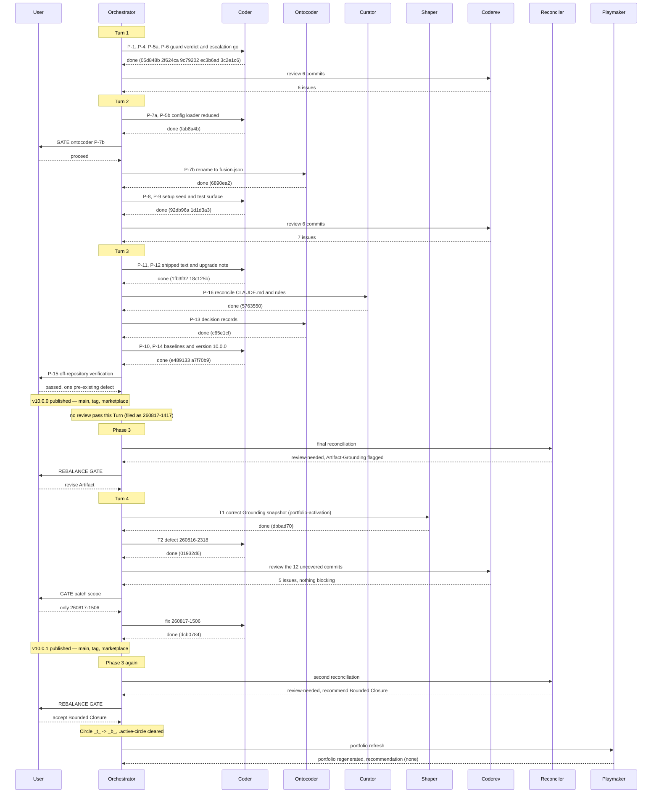

# Orchestrator Session — 260816-1841

**Directive:** The compliance guard observes and never blocks (the Circle's own Directive,
read from `circles/260816-1741-guard-becomes-observation-only/_t_circle.md`)
**Mode:** (not yet resolved — Phase 0 pending)
**Status:** In progress

## Setup snapshot

**Workspace:** /Users/k1/Projects/productive/fusion
**Plugin version:** 9.0.0
**Git HEAD at start:** 3d41d4a
**Turn budget:** 12
**Workbench domain:** code (code_files=111, data_files=12, counted_by=git-ls-files)

**Active Circle:** `260816-1741-guard-becomes-observation-only`, activated at 260816-1841 via
`/fusion:next` with an explicit target. The record moved `_a_` to `_t_`, its
`**Status:**` head field was set to `active` in the same command, and
`.active-circle` now names the directory.

**Predecessor history file this session:** `shared/history/260816-1814-orchestrator-session.md`
holds the pre-activation Setup, when no Circle was active and the shared store was the whole
scan. This file continues that session against the Circle.

**The Circle's own stores at activation:**

| Store | Contents |
|---|---|
| planning | empty — no plan exists yet |
| issues | empty |
| decisions | 1 answered: `260816-1742_a_where-does-the-orchestrators-turn-budget-live-once-the-guard-configuration-file-is-gone.md` |
| history | 1 shaper log, plus this file |
| reviews, analyses | empty |

**Shared stores (every SCAN_* carries both):** 92 open defect records, 1 open plan,
1 open decision.

**Playmaker's activation proposal** was appended to the record before the rename. Its three
substantive warnings are carried forward:

1. The Grounding still calls the Turn-budget decision unanswered. It was answered at
   260816-1742 as option 1.
2. The second backlog entry's blocking chain now hangs on one record whose larger half is
   moot, because `hooks/lib/__tests__/queue-ground-lint.test.ts` was removed on 2026-08-15
   with the persisted work queue.
3. The unreached work from the Bounded Closure of `260813-0910` is still carried by nobody.

## Session log

- Circle activated. Phase 0 scope resolution next.

## Coherence

<!-- RECONCILER-OWNED -->

Computed 2026-08-17 at Phase 3, over `3d41d4a..9ae7974`. Domain `code`. Full working in
`circles/260816-1741-guard-becomes-observation-only/history/260817-1417-reconciliation.md`.

**Verdict:** review-needed

**Edges:**

- **Artifact↔Grounding:** FLAGGED. Every one of the 18 plan tasks verifies against the tree and
  `npm test` is green whole (35 files, 653 tests), so the work matches its claims — but two of the
  five still-open defects are corrections to this Circle's *own* Grounding and are due before the
  record is transitioned: `_t_circle.md:101` still lists `guard-state-shape.test.ts` among the
  tests whose subject is removed (it survives, keeps two callers, and is green), and `:106-115`
  still omits `docs/working-model.md`, `README-agents.md:169` and `hooks/session-start.ts` from the
  text surfaces in scope (all three were in fact corrected). Three further defects stand against
  the shipped surface at the released tag, `260816-2318` (Medium, the v10 migration notice reaches
  a consuming project's chat through no mandate — `agents/orchestrator.md:132` unchanged),
  `260816-2319` and `260816-2320`. Tracking drift found and corrected in this pass: 4 stale plan
  markers, 1 stale plan status, 3 stale-open issues (`260816-2123`, `260816-2317`, `260817-1032`,
  all closed on verified evidence). 2 new defects filed.
- **Artifact↔Directive:** OK. All 21 commits move toward the stated Directive with none orthogonal
  and none away. Traced end to end: `2f624ca` `9c79202` `ec3b6ad` `3c2e1c6` remove the verdict, the
  escalation apparatus, the stand-down and the orphaned module; `fab8a4b` `6890ea2` `92db96a` move
  the configuration surface; `1d1d3a3` `e489133` follow it in the tests and the growth caps;
  `05d848b` `1fb3f32` `18c125b` `5763550` `e331332` make the shipped text say what the guard now
  is; `c65e1cf` `a7f70b9` annotate the records and ship v10.0.0. `2ae202b` `d2db84f` `79477d1`
  `a52cf14` `9ae7974` are the Circle's own bookkeeping. The Directive is delivered: `hooks/guard.ts`
  reaches no verdict on any path, and the tag `v10.0.0` at `e331332` is on `origin/main`.
- **Grounding↔Directive:** OK. 30 active decision records (`_o_` + `_a_`) across all stores,
  0 conflicting. The three records this Circle executes are all `_i_` with cited commits
  (`260809-1224`, and both `260812-1232`), as are the Circle's own three. A grep of every active
  record for the removed mechanisms returns one hit,
  `shared/decisions/260810-1635_a_where-does-the-obligation-sit-to-update-the-artefact-that-explains-a-behaviour-when-the-behaviour-changes.md`,
  and it cites `fusion-guard.json` as historical evidence inside its own argument rather than
  depending on the mechanism being live. Not a conflict.

**Rebalance recommendation:** revise Artifact

Only one edge is flagged, so no priority ordering was needed. The recommendation is advisory and
the gate is the user's. What "revise Artifact" points at, in order of leverage: correct the two
enumerations in `_t_circle.md` **before** the transition, because afterwards the record is history
and a closed Circle carries two false statements about its own scope permanently; then decide what
happens to the three defects standing against a version that has already shipped.

**Not flagged, and named because the reader will look for it.** `bin/fusion-review-coverage --since
3d41d4a` reports `uncovered=9` — Turn 3 received no review pass, and six of the nine uncovered
commits touch 35 shipped files between them, one of which is the commit the tag points at. Under
the recorded answer to
`shared/decisions/260815-2109_a_may-a-circle-close-over-an-uncovered-review-range-and-who-decides.md`
(options 3 then 1, answered by the user on 2026-08-16) coverage is **advisory**: the gap is named
in the closure note and does not flag the edge. That record exists precisely to stop this verdict
varying on this evidence, and it was followed rather than reasoned around. The gap is filed
separately as
`circles/260816-1741-guard-becomes-observation-only/issues/260817-1417_o_the-release-went-out-over-a-turn-whose-six-shipped-file-commits-no-review-opened.md`,
because the plan's own `## Where this Circle stops` named that review pass as a precondition of the
tag and no record said the gate was crossed without it.

## Coherence — second pass

<!-- RECONCILER-OWNED -->

Computed 2026-08-17 at Phase 3, after the Rebalance, over the full session range
`3d41d4a..d0f13fa` (27 commits). Domain `code`. **This section is appended beneath the first pass's
`## Coherence` and does not replace it** — the first records the state at `9ae7974` that produced
`review-needed` and the Rebalance; this one records the state at the released HEAD. Full working in
`circles/260816-1741-guard-becomes-observation-only/history/260817-1618-reconciliation.md`.

**Verdict:** review-needed

**Edges:**

- **Artifact↔Grounding: OK. The first pass's flag is cleared, verified against the tree rather than
  against `dbbad70`'s message.** Both corrections in `_t_circle.md` hold in both directions:
  `guard-state-shape.test.ts` is out of the removed-tests list at `:101` and the paragraph beneath it
  is accurate in every particular (the file is present, `hooks/lib/guard-state-file.ts` keeps exactly
  two callers, and `review-coverage.ts:118` and `staging-drift.ts:128` both resolve); and
  `docs/working-model.md`, `README-agents.md:169` and `hooks/session-start.ts` are enumerated at
  `:122-138`, each was read at the anchor and at HEAD, and each was in fact corrected inside this
  Circle (`1fb3f32`, `5763550`, `ec3b6ad`). Both `260816-1917_*` records carry a `Resolved:` footer
  and a `_c_` marker. 26 claims re-verified, **0 drift items**, `npm test` green whole at 35 files
  and 653 tests. 8 open defects in the Circle store, of which 6 are open by explicit user decision.
  Tracking drift corrected in this pass: 1 issue closed on verified evidence, 7 annotated, 1 review
  annotated per finding, 1 plan log extended, 3 shared records given `Also seen:` lines, 2 new
  records filed.
- **Artifact↔Directive: FLAGGED, on completeness rather than on direction.** All 27 commits move
  toward the Directive; none is orthogonal and none is away. Every clause of the Directive verifies
  at HEAD except one, and each was checked in the tree: `hooks/guard.ts` is 223 lines with no
  `permissionDecision`, no `"deny"` and no `hookSpecificOutput`, writing `{}` on every path (`:112`,
  `:202`); `hooks/lib/escalation.ts`, `hooks/clear-halt.ts` and `hooks/lib/project-relative.ts` are
  absent; `hooks/lib/self-detect.ts` exports `isFusionPluginRoot` alone; both PreToolUse entries in
  `hooks/hooks.json` still match `Write|Edit|MultiEdit|NotebookEdit|Bash`; `fusion-guard.json`,
  `templates/fusion-guard.json` and `hooks/config.json` are gone and `fusion.json` and
  `templates/fusion.json` are present; v10.0.1 is tagged at `d0f13fa` on `origin/main`, with the
  marketplace entry at `f3ad823` and the three in-repo version surfaces all reading 10.0.1.
  **The unmet clause is the last one**: "The shipped text that presents a blocking, halting guard as
  a live property says what the guard now is, in code, **in the agent prompts and skill bodies**, in
  `README-hooks.md` and in `docs/philosophy.md`" (`_t_circle.md:25-27`). `agents/curator.md:212` and
  `skills/curate/SKILL.md:110` both still say a write denied by the project's guard configuration is
  a `failed` entry. An agent prompt and a skill body, both named by that clause, both stating a
  mechanism that cannot fire. Filed as `260817-1505`, **left open by explicit user decision against
  the shipped release**. The other three left open (`260817-1507`, `260817-1508`, `260817-1509`) were
  read against the same clause and fall outside it: a helper's stderr scope, an omission in a log
  description whose present-perfect sentence stays true, and a missing test.
- **Grounding↔Directive: OK.** 24 active decision records (`_o_` + `_a_`) in `$SCAN_DECISIONS`
  scope, 30 across every store, **0 conflicting**. This Circle's own three are all `_i_` with cited
  commits. A grep of every active record for the removed mechanisms returns four files, and all four
  were opened: `shared/decisions/260810-1635_a_*` cites `fusion-guard.json` as historical evidence
  inside its own argument; `circles/260801-1244-curator/decisions/260814-1915_o_*` and
  `circles/260815-0007-…/decisions/260815-1845_o_*` use "halt" for a curator run and a Setup step,
  not for the guard's; and `circles/260801-1244-guard-rules-write/decisions/260805-1548_a_*` matched
  on German words containing the letters. None depends on a removed mechanism being live.

**Rebalance recommendation:** accept Bounded Closure

**Why this departs from the mapping table, stated rather than left to be noticed.** The table maps
`review-needed` with the Artifact↔Directive edge flagged to `revise Directive`, and
`accept Bounded Closure` only to `bounded-closure-proposed`, which is defined as *the Directive is
judged definitively unreachable*. Neither fits: nothing here is unreachable, and the shortfall is
one filed defect the user already chose to leave. **The vocabulary has no value for a Directive that
is reachable and deliberately not reached**, which is a gap in a case split rather than a judgement
call, and it is filed as
`shared/issues/260817-1613_o_the-reconcilers-verdict-vocabulary-has-no-case-for-a-directive-that-is-reachable-but-deliberately-not-reached.md`.

**What each closure would mean, since the gate is the user's:**

- **Bounded Closure (`_b_`)** — the Directive stands as written, the Circle closes acknowledging it
  was not fully reached, and `260817-1505` plus the three adjacent defects are the recorded residue.
  This is the honest reading of what happened and needs no further Turn.
- **Revise the Directive, then close `_c_`** — narrow the last clause to the surfaces that were in
  fact swept, so the record says what the Circle delivered. Equally honest, and it is what the
  priority order in `agents/reconciler.md` names first. It costs one edit to `_t_circle.md`, and no
  agent may perform it (`shared/issues/260815-0752_o_*`).
- **Another Turn is not recommended.** The one item inside the Directive is two sentences in two
  files, and the user has already declined to spend a Turn on it.

**Due in the same edit as the closure note, whichever marker is chosen.** `_t_circle.md` carries two
literal-marker citations that no longer resolve: `:7` `**Active spec/plan:**` names
`planning/260816-1915_p_…` and the plan is `_c_`, and `:167` names `decisions/260816-1742_o_…` and
that record is `_i_`. The first is the pointer field `rules/circle-records.md` describes as
degrading silently for `portfolio.md` rendering and orchestrator resume. Both are one token each,
the record is being edited anyway, and after the transition they are permanent. Recorded on
`shared/issues/260811-2105_o_*` rather than filed anew. Not a flag — the record's other five
citations use the ratified `_*_` wildcard form and all resolve.

**Not flagged, and named because the reader will look for it.** `bin/fusion-review-coverage --since
3d41d4a` reports `commits=27 reviews=3 unusable=0 uncovered=3`, down from `uncovered=9`. The three
are `70f17da` (the review file itself), `dcb0784` and `d0f13fa`, all of them *after* `coderev`'s
declared range `1d1d3a3..01932d6` — a review cannot open the commit that adds it, so this residue is
structural rather than the gap the first pass measured. Coverage is advisory under
`shared/decisions/260815-2109_a_*` and does not flag an edge. `dcb0784` did touch a shipped code
file no review opened, `hooks/lib/config.ts`; the change is a docstring plus the `dist` rebuild that
carries it, and no behaviour moved.

---

# Final summary (written at Phase 4, 2026-08-17)

**Status:** Bounded Closure — one Directive clause reachable and deliberately not reached
(`260817-1505`), by explicit user decision at the second Rebalance gate.

The session was interrupted once and resumed. It kept this history file, the anchor `3d41d4a` and
its work queue; the Turn count spans the interruption because it is taken from `turn_start` events
since the first `session_start` naming this file.

## Budget

Record counts are read off the stores at write time, never accumulated — the rule in
`agents/orchestrator.md` that exists because a hand-kept pair once drifted by two in both
directions and the endpoint check could not see it. Measured across **both** the Circle store and
`shared/`, anchor `3d41d4a`, session start `260816-1841`.

| Metric | Count |
|--------|-------|
| Turns | 4 |
| Tasks resolved | 21 of 21 (18 plan tasks, 3 Turn-4 tasks) |
| Tasks skipped/deferred | 0 |
| Issues created | 32 |
| Issues resolved | 23 |
| Decisions filed | 3 |
| Decisions implemented (`_a_`→`_i_`) | 6 |
| Commits | 30 |
| Agent errors | 0 |
| Human gates hit | 7 |
| Releases published | 2 (v10.0.0, v10.0.1) |

**A caveat on the counts.** `bin/fusion-paths` resolves `SCAN_*` to `shared/` alone once
`.active-circle` is deleted, so a count taken after the closure sees only a third of this session's
records. The figures above were re-measured with the Circle store named explicitly. Anyone
reproducing them after closure must do the same.

## Review coverage

**Range:** `3d41d4a..26fd2e6` — 30 commits
**Covered by:** three review files tiling `3d41d4a..01932d6` (6 + 6 + 12 commits)
**Not covered:** 6 — `70f17da`, `dcb0784`, `d0f13fa`, `d5f4ae7`, `5e7bdc1`, `26fd2e6`
**Carried out-of-scope files:** `hooks/lib/__tests__/fixtures/rules-emission.golden`,
`hooks/lib/__tests__/fixtures/surface-growth.golden`

All six uncovered commits fall *after* the last review's declared range, and a review cannot open
the commit that adds it. Five of the six are workbench bookkeeping; `dcb0784` is a shipped-text fix
and `d0f13fa` the release that carries it. Advisory under `shared/decisions/260815-2109`, and
stated rather than counted, because a count is what let seven unreviewed commits read as one in the
run that filed `260810-1205`.

## What the orchestrator got wrong in this session

Recorded because a session that only lists what it fixed is not a record.

1. **Two commits carried renames their messages do not describe.** A sub-agent left work staged and
   `git commit` writes the whole index. `dbbad70` carries six renames, four of them unnamed — my
   own count of four was itself wrong and the reconciler corrected it. Filed as `260817-1502`,
   which then turned out to duplicate `shared/issues/260816-0105`, open since 2026-08-16 with its
   own measurement.
2. **One commit message and the dashboard were written in German** while the artifact language is
   `en`. The reconciler had already filed `260817-1417` for an earlier instance in this same range;
   the second instance was produced after reading that record.
3. **The queue was carried without its own history entry into a staging list** until the drift
   check named it.

## Remaining work

Six defects stay open by user decision: `260816-2319`, `260816-2320`, `260817-1505`, `260817-1507`,
`260817-1508`, `260817-1509`. `260817-1505` is the unmet Directive clause and sits in a terminal
Circle's issue store, so nothing carries it forward — the portfolio's `## Warnings` is the only
surface naming it.

Two questions were opened and not answered: `shared/decisions/260817-1613` (does a plan-stated
precondition get any mechanism at all) and `shared/issues/260817-1613` (the verdict vocabulary has
no value for a Directive that is reachable and deliberately not reached).

## Session Flow

