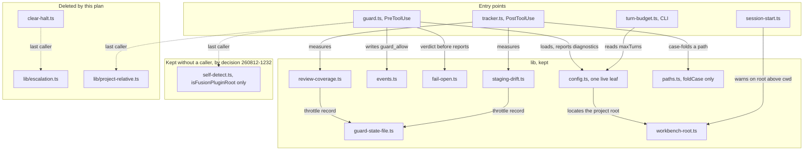
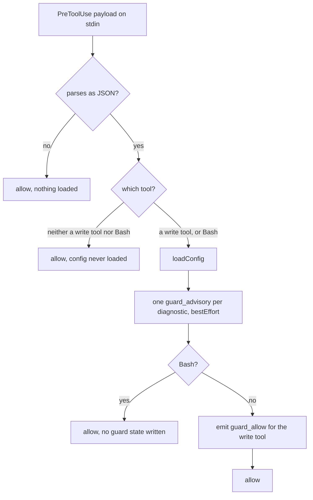
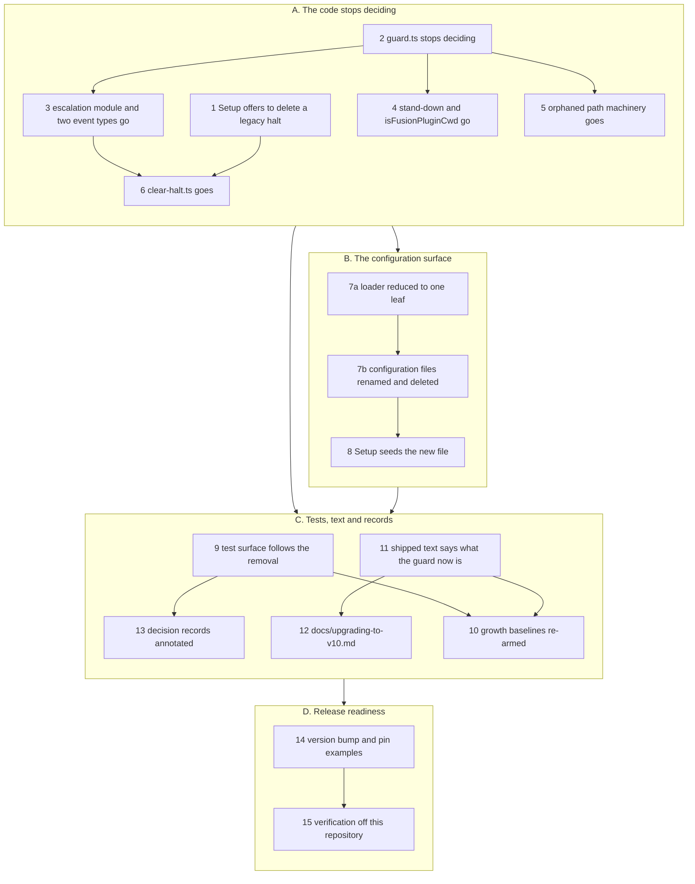

# Implementation Plan: the compliance guard becomes observation-only

**Date:** 2026-08-16
**Status:** Approved — user gate 2026-08-16; all three open questions answered
**Spec:** none as a separate file. The specification is the Circle record, `circles/260816-1741-guard-becomes-observation-only/_t_circle.md`, whose `## Directive` states the target state and whose `## Grounding snapshot` carries the three decisions this Circle executes.
**Decidability:** The load-bearing question is *what does a consuming project still carrying the removed mechanism's state or configuration get told, and can the plugin decide that from inputs it has?* Both halves are decided by reading the file system at a moment the project is already standing in: `haltActive` in `escalation.json` when `/fusion:setup` runs, and the existence of a project-root `fusion-guard.json` on every guarded tool call. Neither is predicted from a command's text or from an agent's intent, so both are facts read rather than conditions inferred. One thing here is genuinely undecidable, and the plan states it rather than approximating it: whether a given project ever runs Setup again. No mechanism inside the plugin can answer that, so nothing in this plan tries. Step 1 accepts the consequence in the words the Circle's Grounding already uses, a project that never runs Setup keeps an inert halt flag in a file nothing reads.

## Directive

The Circle record carries the Directive in full and this plan does not restate it. In one sentence: after this work the guard decides nothing, observes the write tools, and the shipped text says so.

Three decisions drive it, all answered by the user on 2026-08-16 and all recorded in `shared/history/260816-1500-orchestrator-session.md`:

| Record | Answer |
|---|---|
| `shared/decisions/260809-1224_*_is-the-decision-governed-escalation-check-3-a-live-feature.md` | option 1, retired |
| `shared/decisions/260812-1232_*_does-the-escalation-counter-survive-a-block-source-that-ships-inert.md` | option 3, remove escalation, the halt and `clear-halt.js` |
| `shared/decisions/260812-1232_*_does-the-write-guards-fusion-repo-stand-down-survive-the-loss-of-its-subject.md` | option 3, dissolution |

A fourth record belongs to this Circle and bounds the removal rather than driving it: `circles/260816-1741-guard-becomes-observation-only/decisions/260816-1742_a_where-does-the-orchestrators-turn-budget-live-once-the-guard-configuration-file-is-gone.md`, answered as option 1. A renamed project-root file keeps the Turn budget, and `hooks/lib/config.ts`, `hooks/turn-budget.ts` and `bin/fusion-turn-budget` survive in reduced form instead of being deleted.

## Current State

### What decides today, and what remains after each removal

`hooks/guard.ts` runs 483 lines and reaches a verdict at three places. CHECK 1 blocks every write while a halt is active (`:359`). CHECK 3 blocks a write into a decision-governed path at `high` sensitivity and counts the block toward the halt threshold (`:394`). Above both sits the fusion-repository stand-down (`:310`), which allows every write when the working directory is this repository. The consecutive-block counter, the halt and their state file live in `hooks/lib/escalation.ts` (411 lines), and `hooks/clear-halt.ts` (295 lines) is the only thing that clears a halt.

CHECK 3 is the only remaining input to that counter. `hooks/tracker.ts` stopped raising a halt when the protected-path measurement was removed on 2026-08-12, and nothing else calls `recordBlock` or `raiseHalt`. So removing CHECK 3 leaves the whole escalation apparatus behind a halt that no shipped code can raise, which is the composition the second decision record was filed to settle.

### What each removal orphans, measured against HEAD

The three removals reach further than the Circle record's code-site table names, and the reach was measured rather than assumed. `grep` over `hooks/**/*.ts` at HEAD gives the caller counts below.

| Module or export | Last caller today | State after the cut |
|---|---|---|
| `hooks/lib/escalation.ts` | `guard.ts`, `clear-halt.ts` | no caller, deleted |
| `isFusionPluginCwd()` in `hooks/lib/self-detect.ts` | `guard.ts:310` | no caller, deleted |
| `isFusionPluginRoot(dir)` in the same module | none already | kept without a caller, by the third decision |
| `hooks/lib/project-relative.ts` (152 lines) | `guard.ts:96` | no caller, deleted |
| `matchesAny`, `matchesPattern`, `globToRegex` in `hooks/lib/paths.ts` | `config.ts:736` (`findRelevantDecisions`) | no caller, deleted |
| `collapseSegments` in the same module | `guard.ts:354` | no caller, deleted |
| `foldCase` in the same module | `tracker.ts:303` | keeps its caller, stays |
| `hooks/lib/guard-state-file.ts` | `escalation.ts`, `review-coverage.ts`, `staging-drift.ts` | keeps two callers, stays |

`bin/fusion-plugin-cwd` is the shell implementation of the same criterion and keeps all three of its own consumers (`bin/fusion-rules`, `bin/fusion-paths`, `bin/fusion-source-root`). What it loses is its pairing partner: its header states "one criterion, two implementations, change one change the other", and after this cut it is the only implementation of the cwd-anchored form.

### What the configuration surface carries

`hooks/lib/config.ts` runs 742 lines and merges three layers per leaf. Six leaves are guard settings (`guard.enabled`, `guard.defaultSensitivity`, `guard.categoryPaths`, `guard.categorySensitivity`, `decisions`, `escalation.blocksBeforeHalt`). One is not: `orchestrator.maxTurns`, read once per session by `bin/fusion-turn-budget` and by no hook. Once the guard decides nothing, that single integer is the only live leaf the loader has, and the retired-key machinery (`RETIRED_CONTAINER_LEAVES`, `:503`) is the only other thing in the file with a subject.

Four files carry the configuration surface: `hooks/config.json` (the plugin layer), `hooks/config.example.json` (a filled-in illustration), `templates/fusion-guard.json` (what Setup seeds) and `fusion-guard.json` at this repository's own root. `hooks/lib/__tests__/config.test.ts:1436` pins the last two byte-identical outside the keys listed in its `PROJECT_SET_KEYS`, which today is `["orchestrator"]` alone.

### Two Grounding claims that did not survive the check

The Circle record's Grounding was spot-checked at activation and holds on the figures. Two of its enumerations do not, and both are filed as defects rather than corrected in silence.

`guard-state-shape.test.ts` is listed among the test files whose subject is being removed. Its subject is the state-load coercion seam in `hooks/lib/guard-state-file.ts`, which survives, and its rows have seeded `review-coverage.json` since 2026-08-15 rather than `escalation.json` (`guard-state-shape.test.ts:30, :99`). It stays. Filed as `circles/260816-1741-guard-becomes-observation-only/issues/260816-1917_o_the-groundings-test-list-names-a-test-whose-subject-survives-the-removal.md`.

The Grounding's text-surface list omits three shipped surfaces that state the removed mechanism as live: `docs/working-model.md:116-124`, `README-agents.md:169` and `hooks/session-start.ts:12-14`. The Directive states the scope by property, "the shipped text that presents a blocking, halting guard as a live property", and the Grounding's list is an enumeration under that property rather than a narrowing of it, so all three are in scope here. Filed as `circles/260816-1741-guard-becomes-observation-only/issues/260816-1917_o_the-groundings-text-surface-list-omits-three-surfaces-that-state-the-halt-as-live.md`.

## Approach

The removal is one cut taken in dependency order, not a set of independent deletions. Its shape follows from a single observation: after CHECK 3 goes, every other piece of this machinery loses its last caller, so the correct order is to stop deciding first and then delete what nothing calls. That keeps every intermediate state compiling and testable, which matters because this repository's own history records a release tagged while its review pass was still running (`shared/issues/260810-1618_o_a-release-was-tagged-and-pushed-while-its-own-review-pass-was-still-running.md`).

Three properties are preserved deliberately and none of them is incidental.

**The hook stays wired and keeps writing the write trace.** `hooks/hooks.json` goes on registering `guard.js` for the four write tools and for Bash. The write-tool path goes on emitting `guard_allow`, so the monitor's panel keeps the trace it renders today. The Bash path keeps its zero-side-effect property for a correctly configured project, which is the measured reason recorded in `shared/issues/260707-0751_*_guard-allow-bash-events-flood-events-jsonl.md`.

**Bash still reaches the hook for a reason that is current rather than historical.** `hooks-wiring.test.ts` asserts the Bash matcher and justifies it in a comment by the protected-path fingerprint, which was removed on 2026-08-12. The surviving reason is the configuration diagnostic loop, which sits above the Bash return on purpose (`guard.ts:238`) so that a project with a broken or retired configuration hears about it on every guarded call. The assertion stays and the comment is corrected.

**Retirement is announced at one scope higher than before, through the mechanism that already exists.** `RETIRED_CONTAINER_LEAVES` names a key that used to configure something, drops it, and emits one advisory per guarded call until the line comes out. This plan generalises that notion rather than adding a second one: retirement gains a *file* scope for a project's leftover `fusion-guard.json` and a *top-level key* scope for the guard containers a project may copy into the new file. That is what satisfies the constraint the Turn-budget decision record carries, that any answer must say what still reads a project's leftover `fusion-guard.json` in order to name it.

The naming choice this plan makes, and the two questions it does not close, are in `## Open Questions`.

### What the modules look like after the cut



The dotted edges are the ones this plan severs. `self-detect.ts` is drawn as its own group rather than left floating: it is kept with no caller because the third decision record asks for it, and `hooks/lib/self-detect.ts` carries the measured rule that the next root-anchored mechanism needs.

### What `guard.ts` does afterwards



Every leaf is an allow. The hook has no `block` call and no verdict branch left, which is the whole of the Directive expressed as control flow.

### Step order



The per-step `Dependencies` lines below are the authority; the subgraph edges are the shape. Step 7a and 7b are split because the first changes TypeScript that reads a filename and the second changes the JSON files carrying that name, and the routing rule in `agents/planner.md` forbids one step held by two executors.

## Implementation Steps

1. [DONE] **`/fusion:setup` offers to delete a legacy halt**
   - Executor: `coder`
   - Files: `skills/setup/SKILL.md`
   - Changes: rewrite the guard check at Step 3 (`:300`). Today it reads `./fusion-workbench/.guard-state/escalation.json`, warns when `haltActive` is true and offers to clear or to proceed. It becomes a migration offer: when the file exists and reads `haltActive: true`, tell the user that this halt was raised by a mechanism fusion no longer ships, that nothing at this version reads it, and offer to delete the file. Say plainly that deleting it removes a flag rather than unblocking anything, because at this version nothing is blocked. When the file is absent, or `haltActive` is false, say nothing, which is the behaviour of every other idempotent Setup step. The offer runs before `clear-halt.js` leaves in step 6, which is the sequencing constraint the escalation decision record carries in its `## Constraints`.
   - Dependencies: none
   - Verification: the offer text is asserted by the re-pointed `legacy-halt-clearing.test.ts` in step 9.

2. [DONE] **`guard.ts` stops deciding**
   - Executor: `coder`
   - Files: `hooks/guard.ts`
   - Changes: delete CHECK 1 (`:358-392`), CHECK 3 (`:394-452`), `emitBlockEvent` (`:156-168`), `shouldEscalate` (`:114-118`), `block` (`:124-126`), the fusion-repository stand-down (`:286-320`), the path normalisation that only CHECK 3 read (`:95-97`, `:322-354`) and every import from `lib/escalation.js`, `lib/project-relative.js`, `lib/self-detect.js` and the guard half of `lib/config.js`. What stays is the shape in the control-flow diagram above: parse, dispatch on tool name, `loadConfig`, the diagnostic loop under `bestEffort`, a bare allow for Bash, and an allow for a write tool with one `guard_allow` report through `answer`. The `answer` call keeps its verdict-before-reports ordering, so `lib/fail-open.ts` keeps a caller and its own test file keeps a subject. Rewrite the file header: it currently opens by naming the two things the guard checks, and after this step it checks nothing. Say what the hook is for now, which is the write trace and the configuration diagnostic, and keep the paragraph naming the removed halves so a reader of an older tree or an existing `events.jsonl` still finds the account.
   - Dependencies: none
   - Verification: `cd hooks && npm run build` compiles with no unused-import errors; the guard emits `{}` for every payload class.

3. [DONE] **The escalation module goes, and two event types with it**
   - Executor: `coder`
   - Files: `hooks/lib/escalation.ts` (delete), `hooks/lib/events.ts`
   - Changes: delete the module outright. Remove `guard_block` and `guard_halt` from the `GuardEventType` union, following the precedent that module's own header already sets for `state_drift`: the union is the emitter's vocabulary, and a value no shipped code can produce has no place in it, while `bin/monitor` goes on rendering the historical rows because it reads data that exists. Keep `halt_cleared` until step 6, which removes its last emitter. Extend the union's comment with this second instance rather than writing a parallel one.
   - Dependencies: step 2
   - Verification: no import of `lib/escalation.js` remains anywhere under `hooks/`; `bin/monitor` is untouched and still styles both row types.

4. [DONE] **The stand-down and `isFusionPluginCwd()` go**
   - Executor: `coder`
   - Files: `hooks/lib/self-detect.ts`, `hooks/session-start.ts`, `bin/fusion-plugin-cwd`, `bin/fusion-rules`, `bin/fusion-paths`, `bin/fusion-source-root`, `hooks/tracker.ts`
   - Changes: delete `isFusionPluginCwd()` and its module-level cache. Keep `isFusionPluginRoot(dir)` and rewrite the module header so it states, in the present tense, that the module has no caller inside `hooks/` and why it is kept anyway: it carries the measured rule that a stand-down is evaluated in the coordinate space the mechanism keys its state by, and the next root-anchored mechanism should not have to rediscover it. `hooks/session-start.ts:12-14` justifies its warning by two cwd-anchored resolutions, the write-tool checks and `isFusionPluginCwd()`, and both are gone after this step. The warning keeps a subject and the header has to name it correctly: the three `bin/` helpers resolve their work-tree preference against cwd through `bin/fusion-plugin-cwd`, with no upward walk. Correct the four `bin/` headers that describe `bin/fusion-plugin-cwd` as the shell half of a TypeScript function that no longer exists; the shell helper becomes the sole cwd-anchored implementation, paired with `isFusionPluginRoot(dir)` as the root-anchored form rather than as a duplicate. `hooks/tracker.ts:56-59` and `:457-469` describe the surviving stand-down in `guard.ts` and are false after this step.
   - Dependencies: step 2
   - Verification: `grep -r isFusionPluginCwd` over the repository returns nothing outside the workbench's own records.
   - Executed 2026-08-16. The verification above does **not** hold at this step and was not made to: `CLAUDE.md:8`, `CLAUDE.md:36` and `README-hooks.md:187` still name the deleted function, and all three are out of this step's scope — `CLAUDE.md` is the curator's gated path and `README-hooks.md` belongs to step 11. What holds is the load-bearing half: no caller and no import of the module remains under `hooks/`, and the compiled output carries no such export. Two prose mentions survive in files this step wrote, in `hooks/lib/self-detect.ts` and `bin/fusion-plugin-cwd`, both naming what was deleted rather than referring to it, on the precedent step 2 set at `hooks/guard.ts:48`. History: `circles/260816-1741-guard-becomes-observation-only/history/260816-2110-step-4-stand-down-and-isfusionplugincwd.md`.

5. [DONE] **The orphaned path machinery goes**
   - Executor: `coder`
   - Files: `hooks/lib/project-relative.ts` (delete), `hooks/lib/__tests__/project-relative.test.ts` (delete), `hooks/lib/paths.ts`
   - Changes: delete `project-relative.ts`, whose only caller was `guard.ts:96`. Reduce `paths.ts` to `foldCase`, deleting `globToRegex`, `matchesPattern`, `matchesAny` and `collapseSegments`, all of which lose their last caller when CHECK 3 and the path normalisation go. Rewrite the module header, which currently explains a trailing-separator asymmetry that has no remaining side. This deletion is the honest reading of the same rule step 4 declines to apply to `isFusionPluginRoot`, and the difference is recorded rather than left implicit: the surviving entry point is kept because a decision record asks for it and states the reason, and nothing comparable was ever argued for these four functions.
   - Dependencies: step 2
   - Verification: `npm run build` prunes the compiled outputs of both deleted modules from `hooks/dist/`, which is the behaviour `README-hooks.md` `### Rebuilding after TS changes` describes.
   - Executed in part on 2026-08-16. `hooks/lib/project-relative.ts` and `hooks/lib/__tests__/project-relative.test.ts` are deleted, the build exits 0 and prunes `hooks/dist/lib/project-relative.js` and its `.d.ts`. **`hooks/lib/paths.ts` is untouched and the reduction is not done.** The `Dependencies: step 2` line points the wrong way for three of the four functions: `matchesAny` still has a live caller at `hooks/lib/config.ts:155` and `:736` inside `findRelevantDecisions`, which **step 7a** deletes and step 2 never touched, and `matchesPattern` and `globToRegex` are reached through it. Reducing `paths.ts` now fails the compile before the build's prune can run, by the mechanism `260816-2032_c_*` measured. `collapseSegments` alone is orphaned, and deleting it by itself would turn the currently green `lib/__tests__/paths.test.ts` red — a file no step names — while leaving the mandated header rewrite unable to tell the truth, since the asymmetry that header explains still has a live side in the surviving matchers. Recorded with three orders in `circles/260816-1741-guard-becomes-observation-only/issues/260816-2108_*_step-5s-paths-reduction-depends-on-step-7a-not-step-2.md`, which also names `lib/__tests__/paths.test.ts` as missing from step 9's edit list.
   - **The asymmetry with `isFusionPluginRoot`, recorded rather than left implicit.** `hooks/lib/project-relative.ts` was deleted although the same argument step 4 accepted for `isFusionPluginRoot(dir)` could have been made for it: it carries a worked account of the coordinate space a written path has to be normalised into before a reader matches it, and a future mechanism that matches paths would want it. The difference is not that the argument is weaker here; it is that nobody ever made it. `isFusionPluginRoot` is kept because a decision record asks for it by name and states the reason, so removing it would overrule a recorded answer. No record asks for `project-relative.ts` or for the four `paths.ts` functions, and a module kept on an argument nobody wrote down is a module nobody can later decide is finished with. History: `circles/260816-1741-guard-becomes-observation-only/history/260816-2108-step-5-orphaned-path-machinery.md`.
   - **Second half executed 2026-08-16, in the same change as step 7a**, per the plan amendment's re-queue. `hooks/lib/paths.ts` is reduced to `foldCase` and its header is rewritten. The four deletions were re-measured by grep after the loader was rewritten and before anything was cut: all four had zero callers outside `lib/paths.ts` and `lib/__tests__/paths.test.ts`, and `foldCase` kept `tracker.ts:101`, `:306`, `:307`. `npm run build` exits 0. `lib/__tests__/paths.test.ts` is now red at 14 of its 18 cases, which is the second finding of issue `260816-2108` arriving as predicted; it is step 9's. Nothing was pruned from `hooks/dist/` this time, because `paths.ts` survives as a module. History: `circles/260816-1741-guard-becomes-observation-only/history/260816-2156-step-7a-loader-reduced-and-step-5b-paths.md`.

6. [DONE] **`clear-halt.ts` goes**
   - Executor: `coder`
   - Files: `hooks/clear-halt.ts` (delete), `hooks/lib/events.ts`
   - Changes: delete the entry point and remove `halt_cleared` from the `GuardEventType` union, this step being the one that removes its last emitter. This is the step the escalation decision record sequences: it may not land before step 1, because a project carrying an active halt must be able to reach a remedy, and after this step the remedy is Setup's offer rather than this script.
   - Dependencies: steps 1 and 3
   - Verification: `hooks/dist/clear-halt.js` is pruned by the build; no shipped text names it after step 11.
   - Executed as one change with step 3, because the `Dependencies` line above points the wrong way: `clear-halt.ts` imports from `lib/escalation.ts`, which step 3 deletes, so step 3 alone fails the compile and the build's orphan prune never runs — the two compiled outputs would ship. Recorded in `circles/260816-1741-guard-becomes-observation-only/issues/260816-2032_o_step-3-deletes-a-module-step-6s-file-still-imports.md`, option 1. Step 1 had already landed, which is the one ordering constraint the escalation decision record imposes.

7a. [DONE] **The configuration loader is reduced to one leaf and learns to name a retired file**
   - Executor: `coder`
   - Files: `hooks/lib/config.ts`, `hooks/turn-budget.ts`
   - Changes: cut the guard settings out of `GuardSettings`, `RawConfig`, `DEFAULTS`, `CONTAINER_LEAF_RULES` and the merge, leaving `orchestrator.maxTurns` as the one live leaf with `DEFAULTS` as its single definition site. Delete `Sensitivity`, `Decision`, `sensitivityLevel`, `findRelevantDecisions` and the sensitivity validators. Rename `PROJECT_CONFIG_FILENAME` to the new file (see `## Open Questions` for the name and the gate on it). Generalise the retirement notion from one scope to two, in one table family rather than two mechanisms: a **retired file**, `fusion-guard.json` at the project root, probed with `existsSync` and named in one diagnostic per guarded call; and a **retired top-level key**, `guard`, `decisions` and `escalation`, named the same way when a project copies its old file across. The retired-leaf table has no members after this and folds away, because `guard.protectedPaths` now sits inside a retired container. The retired-file diagnostic must name `orchestrator.maxTurns` explicitly and say to copy it across, because a project that carried a budget of 12 and does nothing would otherwise drop to the default silently, which is precisely the class of failure this loader's diagnostics exist to prevent. `hooks/turn-budget.ts` needs no logic change and needs its docstring rewritten: it currently explains at length why a non-guard setting lives in the guard's configuration file, and after this step there is no guard configuration.
   - Dependencies: steps 2 and 3
   - **User gate before this step runs.** Two questions it depends on are filed and open: `260816-1915_o_how-much-of-the-configuration-loader-survives-when-its-only-leaf-is-the-turn-budget.md` (does the plugin layer survive, and does `guard.enabled` survive in any form) and the new file's name. Both are in `## Open Questions` with a recommendation.
   - Verification: `bin/fusion-turn-budget` prints `max_turns=12` in this repository after step 7b, and prints the retired-file diagnostic on stderr while the old file is still present.
   - Executed 2026-08-16, together with step 5's second half. `npm run build` exits 0; `./bin/fusion-turn-budget` exits 0, prints `max_turns=5` on stdout and the retired-file diagnostic on stderr. The `5` is the correct value between 7a and 7b: this repository's budget of 12 is still in `fusion-guard.json`, which is no longer read, and `fusion.json` does not exist until 7b writes it. `TOP_LEVEL_LEAF_RULES` folded away as well as `RETIRED_CONTAINER_LEAVES`, its only member `decisions` having become a retired top-level key. The diagnostic prefix moved from `Guard configuration` to `fusion configuration`; no consumer outside the three step-9 test files reads that string. **Two things step 9 needs that no record carried before:** `helpers/guard-harness.ts` seeds `fusion-guard.json` into throwaway roots, which is now a *retired file*, so every harness project emits an extra advisory per guarded call until the seeded name changes to `fusion.json` — two currently-red cases are that alone; and `turn-budget-lint.test.ts` did **not** move at this step, because all three of its configuration cases read files 7b has yet to touch. History: `circles/260816-1741-guard-becomes-observation-only/history/260816-2156-step-7a-loader-reduced-and-step-5b-paths.md`.

7b. **The configuration files are renamed and the retired ones deleted**
   - Executor: `ontocoder`
   - Files: `templates/fusion.json` (new), `templates/fusion-guard.json` (delete), `fusion.json` at the repository root (new), `fusion-guard.json` at the repository root (delete), `hooks/config.json` (delete), `hooks/config.example.json` (delete)
   - Changes: write the new template carrying the same underscore-prefixed documentation notes, cut down to what the file still configures. `_what` describes a per-project fusion configuration rather than a guard configuration; `_turnBudget` survives largely as written; `_override` keeps the per-leaf merge account with the guard examples replaced; `_guardEnabled` goes with the key; `_gitTracked` keeps its argument, which was never about the guard. Add one note naming the retired file and what to copy out of it. This repository's own root file carries `{"orchestrator": {"maxTurns": 12}}`, which is the value the Turn-budget decision record requires to survive the move. The two plugin-layer files go if the gate on step 7a answers that the plugin layer goes; if it answers that the layer survives, `hooks/config.json` stays as an empty object with its `_comment` and `hooks/config.example.json` still goes, because its whole content is filled-in `categoryPaths` and `decisions`.
   - Dependencies: step 7a
   - Verification: `config.test.ts`'s template-equality case passes with `PROJECT_SET_KEYS` unchanged at `["orchestrator"]`, which is what makes the byte-identity claim in `CLAUDE.md` still true for the renamed pair.

8. [DONE] **`/fusion:setup` seeds the new file and names the old one**
   - Executor: `coder`
   - Files: `skills/setup/SKILL.md`
   - Changes: rewrite Step 0f (`:169-190`). The probe and the idempotent copy keep their shape and change their filename. The prose loses the guard account: this file is where a project sets how many Turns the orchestrator may run, and no longer where it sets how sensitively the guard reads its decisions. The paragraph explaining that the probe exists because the guard used to protect this file becomes a shorter statement, since the protection went on 2026-08-12 and the probe is kept only because reporting `present` beats a silent no-op. Whether this step also offers to move a project's `orchestrator.maxTurns` out of a leftover `fusion-guard.json` is the second open question; the plan as written does not, and the loader's diagnostic carries the migration instead.
   - Dependencies: step 7b
   - **User gate:** the second open question, `260816-1916_o_does-setup-offer-to-move-a-projects-turn-budget-out-of-the-retired-configuration-file.md`.
   - Executed 2026-08-16. Step 0f is renamed *Ensure the project configuration file is present locally*; the probe and the copy keep their two-command shape against `fusion.json` and `templates/fusion.json`. The guard account is gone from the prose and from the probe's `absent` message, which now says the seeded template inherits fusion's own Turn budget. The protected-path history was cut from the probe's justification, leaving only the reason that still holds. No migration offer was added, per the user's option 1 at the plan gate; the step states in one paragraph that a leftover `fusion-guard.json` is the loader's to name and instructs the reader not to read it or offer a move. The closing sentence no longer claims an absent file costs nothing — it names the one cost, running on fusion's own Turn budget rather than a chosen one. Verification is delta-only, since no test can assert a skill body's run-time behaviour: `cd hooks && npm test` exits 1 at 14 files / 116 cases both before and after, the same file set, and `turn-budget-lint.test.ts` is unmoved at 2 failed / 13 passed, both failures being step 7b's deleted `hooks/config.json` and `templates/fusion-guard.json`. History: `circles/260816-1741-guard-becomes-observation-only/history/260816-2226-step-8-setup-seeds-fusion-json.md`.

9. [DONE] **The test surface follows the removal**
   - Executor: `coder`
   - Files: delete `hooks/lib/__tests__/escalation.test.ts`, `guard-escalation-shape.test.ts`, `guard-halt-event.test.ts`, `clear-halt-concurrent-halt.test.ts`; edit `legacy-halt-clearing.test.ts`, `config.test.ts`, `guard-project-config-integration.test.ts`, `hook-fail-open.test.ts`, `hooks-wiring.test.ts`, `turn-budget-lint.test.ts`, `derivable-enumerations-lint.test.ts`, `helpers/guard-harness.ts`
   - Changes: the four deletions are the files whose whole subject is the halt or the counter. `guard-state-shape.test.ts` is **not** among them; its subject is the state-load seam, which survives, and the Grounding's contrary claim is filed as a defect. `legacy-halt-clearing.test.ts` is re-pointed rather than deleted, because the migration path it pins is the one step 1 replaces: it now asserts that a project seeded with `haltActive: true` is not blocked by the guard at this version, that the guard leaves the file untouched, and that `skills/setup/SKILL.md` carries the deletion offer. In `guard-project-config-integration.test.ts` the unparseable-configuration and retired-key groups survive and gain the retired-file case; the "what a project configuration can and cannot reach" group and the plugin-repo group go with their subjects. In `hook-fail-open.test.ts` the unit-level groups survive untouched, and the integration cases that need a deny are re-pointed onto the surviving `answer` call on the allow path. In `helpers/guard-harness.ts` the governed-project fixtures (`GOVERNED_*`, `withGovernedProject`, `governedFiles`, `GOVERNED_CONFIG`), the seeded `escalation.json` and `readEscalation`/`EscalationSnapshot` go; the rest of the harness is used by five surviving files and stays. `hooks-wiring.test.ts` keeps its Bash assertion and gains the current reason for it, the configuration diagnostic loop. `turn-budget-lint.test.ts` and `derivable-enumerations-lint.test.ts` follow the renamed configuration file and the shortened `hooks/lib` table.
   - Dependencies: steps 3, 4, 5, 6, 7b
   - Verification: `cd hooks && npm test` is green.
   - Executed 2026-08-16. The four deletions and the eight edits landed as one change, because three of the records amending this step describe one tangle rather than three faults — the fixtures the harness would have lost are the fixtures the re-pointed cases run on. **`npm test` is not green and was never going to be at this step**, and the verification line above is the plan's, not a claim: 3 files / 5 cases remain red, all of them another step's — `derivable-enumerations-lint` (1) and `reference-resolution-lint` (2) are step 11's `README-hooks.md` table and the 26 citations of files steps 3 to 7b deleted, and `surface-growth-bound` (2) is step 10's. The set went from 14 files / 116 cases to 3 / 5, and no file outside those three is red.
   - **Three departures from this step's text, each forced by a record it was written before.** First, `guard-bash-integration.test.ts` was added to the file list (issue `260816-2021`): five of its cases asserted a CHECK 3 deny or the stand-down, the `self-detect stand-down` describe and the `macOS realpath trap` case went with their subjects, and the two properties the Testing Strategy actually relies on — a fresh project running innocuous Bash writes nothing, and a write is allowed and recorded — are green and are now asserted with `guardStateWritten`, which is the strong spelling those cases had before the protected-path measurement made it undiscriminating. Second, `helpers/guard-harness.ts` did NOT lose `readEscalation`, `EscalationSnapshot` or the `escalation` seed option: the re-pointed `legacy-halt-clearing.test.ts` is the one file here whose subject is a migration, and it cannot assert that a seeded halt neither blocks nor gets rewritten without them. They are kept with one consumer and a section header saying so. `GOVERNED_*`, `governedFiles`, `GOVERNED_CONFIG` and `withGovernedProject` did go, with the deny they packaged. Third, `lib/__tests__/paths.test.ts` was reduced to its `foldCase` group, per the second finding of issue `260816-2108`.
   - **The harness seeded the retired filename, and the fix is structural.** `governedFiles` wrote the literal `fusion-guard.json` into every throwaway project, which `fab8a4b` turned into a *retired file* — so every harness project emitted an extra `guard_advisory` per guarded call and a previously-green case in `guard-bash-integration.test.ts` was red for a reason no case was about. The harness now imports `PROJECT_CONFIG_FILENAME` from `lib/config.ts` and exposes only `configFiles(value)`; `projectConfig` is no longer exported, so a case cannot write the configuration under a name it chose for itself.
   - **What this step could not reach, named rather than absorbed.** `bin/fusion-turn-budget:41` and `docs/upgrading-to-v9.md:100` each carry a dangling citation of the deleted `hooks/config.json`, and neither file is in step 11's Files list. They are two of the 26 the citation lint reports, and they have no owner in this plan.
   - History: `circles/260816-1741-guard-becomes-observation-only/history/260816-2250-step-9-test-surface-follows-the-removal.md`.

10. **The growth baselines are re-armed**
    - Executor: `coder`
    - Files: `hooks/lib/__tests__/surface-growth-bound.test.ts`
    - Changes: this is a cleanup, which is one of exactly two moments at which a baseline may move under the rule authored in `hooks/lib/__tests__/helpers/growth-bound.ts`. Regenerate the golden with `UPDATE_SURFACE_GOLDEN=1`, copy the per-file sizes into the baseline map, and write a comment naming this Circle as the cut that produced them. All three of that file's surfaces move: `agents/*.md` and `skills/*/SKILL.md` shrink through steps 1, 8 and 11, and the hook test surface shrinks by roughly 1 100 lines through step 9. Leave `rules-emission-golden.test.ts` alone: the always-on rule set is the curator's surface under the user's answer to shaping question 4, this Circle does not touch it, and re-baselining a corpus this work did not cut would grant head-room nobody paid for.
    - Dependencies: steps 9 and 11
    - Verification: `npm test` green with the regenerated fixture committed in the same change.

11. **The shipped text says what the guard now is**
    - Executor: `coder`
    - Files: `README-hooks.md`, `README.md`, `README-agents.md`, `docs/philosophy.md`, `docs/working-model.md`, `agents/orchestrator.md`, `skills/help/SKILL.md`, `skills/archive/SKILL.md`, `bin/monitor`
    - Changes, surface by surface:
      - `README-hooks.md`: the opening sentence, `## Concept`, `### Escalation`, the `## Architecture` diagram, `### Tuning or disabling the guard`, `### Per-project configuration`, `### Clearing a halt`, `### Adding a decision`, and the `## Files` and `hooks/lib` tables. The tables are pinned by `derivable-enumerations-lint.test.ts` in set equality with the tree, so the rows for `lib/escalation.ts`, `lib/project-relative.ts` and `clear-halt.ts` must go in the same change as the files. Two paragraphs are stale before this Circle and are corrected while the file is open: `:32-36` names session-state drift as a live PostToolUse measurement, removed on 2026-08-15, and `:151-161` and `:288` describe the stand-down this Circle deletes.
      - `README.md`: the product summary at `:3`, the `guard.protectedPaths` and halt rows of the tuning table (`:110-117`), and the configuration paragraph at `:102`. The `orchestrator.maxTurns` row survives with the new filename, and the pin example is step 14's.
      - `README-agents.md:169`: names `fusion-guard.json` as the Turn budget's home and the plugin's `hooks/config.json` as a merge layer.
      - `docs/philosophy.md:17`: the fourth principle presents the deny and the three-blocks halt as a product property. It is the surface the user named by hand at shaping. Rewrite it around what the guard now offers, which is a write trace and a configuration diagnostic, and say that enforcement was tried and measured rather than dropping the principle silently.
      - `docs/working-model.md:116-124` and `:136`: the same content one level more concrete, including the sentence "only two things ever block a write".
      - `agents/orchestrator.md`: the Turn-budget paragraph at `:122` (filename), the Setup guard check at `:150`, the *Guard halt* circuit-breaker row at `:626` and its restatement at `:644`. The circuit-breaker row goes rather than being reworded: nothing can halt, so the row is not a breaker that never trips, it is a condition that cannot arise.
      - `skills/help/SKILL.md:111`: points a user at `hooks/config.example.json` and at escalation behaviour, and the first is deleted in step 7b.
      - `skills/archive/SKILL.md:94`: classifies `escalation.json` among the live state files beside the throttle records. The `events.jsonl` sections at `:130`, `:132` and `:274` stay exactly as written, because they describe evidence already in the log and the ban on a byte ceiling is unaffected by nothing new arriving.
      - `bin/monitor:212`: a comment lists a corrupted escalation counter among the causes of a `guard_advisory`. Nothing about the rendering changes and no row type is dropped.
    - Dependencies: steps 4, 6, 8
    - Verification: `reference-resolution-lint.test.ts` and `derivable-enumerations-lint.test.ts` green, which between them catch a citation of a deleted file and a table that no longer matches the tree.

12. **The migration note for consuming projects**
    - Executor: `coder`
    - Files: `docs/upgrading-to-v10.md` (new), `README.md`, `skills/help/SKILL.md`
    - Changes: write the note on the precedent of `docs/upgrading-to-v9.md`, which exists because v9 removed mechanisms consuming projects had configured. This release does more than that: it removes a file every consuming project has at its root. The note states what left, what a project still has on disk, and what to do with it, in the same shape as its predecessor. Its load-bearing section is the configuration one, because a project that ignores it loses a Turn budget it set. Point at it from `README.md` `## Install` and from the update topic of `/fusion:help`, exactly as the v9 note is pointed at.
    - Dependencies: step 11
    - Verification: the note names the version step 14 writes into `plugin.json`.

13. **The decision records are annotated**
    - Executor: `ontocoder`
    - Files: records under `shared/decisions/`, `circles/260801-1244-guard-rules-write/decisions/`, `circles/260807-0923-guard-misst-statt-orakelt/decisions/` and this Circle's own store
    - Changes: three transitions, each with its own instrument from `rules/fusion-workbench-conventions.md`.
      - `_a_` to `_i_`, with an `Implemented:` line citing the commit: the three records this Circle executes, and `260816-1742_a_where-does-the-orchestrators-turn-budget-live-once-the-guard-configuration-file-is-gone.md`.
      - A `Retired:` line with **no rename**, the marker staying `_i_`: every record whose implementation this plan deletes. Found at HEAD: `260804-1631_i_may-a-project-file-set-guard-enabled-and-switch-the-whole-guard-off.md`, `260804-1630_i_what-does-a-project-guard-object-inherit-for-a-key-it-does-not-supply.md`, `260803-1419_i_how-should-the-protected-path-check-treat-the-case-of-a-path.md` and `260802-1912_i_does-the-self-protection-floor-apply-before-the-config-file-exists.md`. Re-derive the list rather than trusting it: `grep` the decision stores for the identifiers this plan deletes.
      - `_a_` to `_s_`, with a `Superseded by:` line: `circles/260807-0923-guard-misst-statt-orakelt/decisions/260807-0945_a_integritaet-des-eskalationsspeichers.md`, whose question is how the integrity of the escalation store is secured. The store is gone, so its recorded answer can never be realised, and the superseding record is the escalation decision this Circle executes.
      - Close the two issues this removal resolves: `shared/issues/260812-1546_o_check-3-the-guards-only-remaining-block-source-allows-from-any-subdirectory-and-nothing-tests-it.md` and `shared/issues/260812-1546_o_the-record-of-the-floors-loss-does-not-say-the-file-it-stopped-defending-arms-the-last-block-source.md`, each with a `Resolved:` line and a rename to `_c_`.
    - Dependencies: step 9
    - Note on the executor: the conventions put a decision's annotation on the executor whose commit realised it. This is one step rather than an annotation inside each step above because the walk spans nine records across four stores, and split across steps it would land partial. `ontocoder` holds it because the records are workbench artifacts rather than application code.

14. **The version and the pin examples**
    - Executor: `coder`
    - Files: `.claude-plugin/plugin.json`, `install.sh`, `README.md`
    - Changes: bump the version to `10.0.0`, which is what a removal of a project-root configuration file requires. Update the `FUSION_REF=tags/v<version>` example in the `install.sh` header and the same example in `README.md`, both of which `CLAUDE.md` names as version surfaces that drift. Rewrite `plugin.json`'s `description` in the same change if the guard appears in it, and read it against the marketplace entry's description before the release, which is the fifth surface `CLAUDE.md` names as the one that slips because it is prose rather than a version string.
    - Dependencies: steps 12 and 13
    - Verification: `claude plugin validate .` reports passed.

15. **Verification against a project root that is not this repository**
    - Executor: `coder`
    - Files: none, this step produces a verification report and no edit
    - Changes: the release process requires, for any change touching the guard, that its behaviour is confirmed against a project root that is not this repository. Until this Circle that requirement existed because the write-tool stand-down made local testing unrepresentative by construction. Step 4 removes the stand-down, so the guard now behaves identically in both trees, and this step is what establishes that claim rather than asserting it. Run the guard against a scratch consuming project in three states: with no configuration file, with the new file carrying a budget, and with a leftover `fusion-guard.json` still present. Confirm three things: every write and every Bash call is allowed, a `guard_allow` row is written for the write tools and none for Bash, and the retired-file diagnostic appears once per guarded call while the old file is there. Also run the default-agent smoke test the release process asks for.
    - Dependencies: step 14
    - **User gate after this step:** the release itself. See `## Where this Circle stops` below.

## Where this Circle stops

**This plan ends at the work tree.** Step 14 bumps the version in this repository and updates the two pin examples; the tag, the marketplace bump in `tenzoki/claude-plugins`, the push of both repositories and the local cache pull are a separate act at a user gate, after step 15 and after this Circle's review pass.

Three reasons, and the first is measured rather than argued. This repository's own history carries `shared/issues/260810-1618_o_a-release-was-tagged-and-pushed-while-its-own-review-pass-was-still-running.md`, so a plan that ends at a tag is a plan that repeats a defect this project has already paid for. Second, the release process makes step 15's off-repository verification a precondition of tagging when a change touches the guard, and a verification whose result is unknown when the plan is approved cannot have a tag scheduled behind it. Third, the release touches a second repository that is outside this tree, so no step here can be verified by reading this one.

## Data Structures

Two shapes change and one is new.

`GuardSettings` in `hooks/lib/config.ts` loses everything except `orchestrator.maxTurns` and, with the plugin layer's fate, may lose the `ConfigLayer` union as well. `GuardConfig` keeps its `diagnostics` field, which becomes the module's main product rather than a report about a load.

`GuardEventType` in `hooks/lib/events.ts` loses `guard_block`, `guard_halt` and `halt_cleared`, leaving `guard_allow`, `guard_advisory`, `guard_error`, `review_coverage`, `staging_drift` and `tracker_record`. The union is the emitter's vocabulary; `bin/monitor` keeps rendering all three removed values from existing logs.

The new shape is the retired-file table, a sibling of `RETIRED_CONTAINER_LEAVES` at one scope higher:

```
RETIRED_PROJECT_FILES: Record<filename, reason>
```

keyed on a filename resolved against the project root, valued with a sentence completing "… is no longer read — ___", naming what moved and where.

## API Changes

No public interface changes, because the plugin exposes none. Four command-line and hook surfaces move.

| Surface | Before | After |
|---|---|---|
| `hooks/dist/clear-halt.js` | a manual halt reset a user runs | gone; a legacy halt flag is deleted at `/fusion:setup` |
| project configuration | `fusion-guard.json` at the project root | a renamed file at the project root, see `## Open Questions` |
| plugin configuration | `hooks/config.json`, `hooks/config.example.json` | gone, subject to the first open question |
| `guard.ts` verdict | `{}` or `{"decision":"block", …}` | `{}` on every path |

## Testing Strategy

The suite is the gate and it already covers most of this, which is why the plan can delete confidently. Four things need saying beyond "run `npm test`".

**What must stay green throughout.** `guard-bash-integration.test.ts` pins the Bash allow and its zero-side-effect property, which the Directive preserves. `guard-state-shape.test.ts` pins the state-load seam through `review-coverage.json`. `review-coverage.test.ts` and `staging-drift.test.ts` pin the two surviving measurements. `session-start-subdirectory.test.ts` pins the warning whose justification step 4 rewrites. None of the four is edited by this plan, and any of them going red is evidence that a step reached further than it was meant to.

**What replaces a deleted assertion rather than dropping it.** `legacy-halt-clearing.test.ts` is the only file here whose subject is a migration, and step 9 re-points it instead of deleting it. That is the difference between removing a mechanism and removing the evidence that the removal was survivable.

**What no test covers, stated rather than discovered.** No test can assert that `/fusion:setup` actually makes the offer at run time, because a skill body is a prompt rather than a program. The re-pointed test asserts the text is present, which is the same class of check `turn-budget-lint.test.ts` already performs over two prompt files and is honest about in its own header.

**The manual check.** Step 15, off this repository, against three configuration states. It is manual because the harness spawns synthetic project roots and this checks the real installed path.

## Risks & Mitigations

| Risk | Mitigation |
|---|---|
| A consuming project's Turn budget silently reverts to the default when its `fusion-guard.json` stops being read | The retired-file diagnostic in step 7a names `orchestrator.maxTurns` and says to copy it across, on every guarded tool call until the file is deleted. The migration note in step 12 says the same thing at length. |
| A project that never runs `/fusion:setup` again keeps an inert halt flag | Accepted and stated, not designed around. The Circle's Grounding records the user accepting this price at shaping round 1, and the flag blocks nothing at this version. |
| The removal reaches further than the Grounding's code-site table names, and something is missed | The table in `## Current State` was rebuilt from `grep` over HEAD rather than copied, and it already found four sites the Grounding did not list. Steps 4 and 5 exist because of that measurement. |
| A deleted module's citation survives in shipped text and nobody notices | `reference-resolution-lint.test.ts` resolves plugin-file citations and fails on a dangling one; `derivable-enumerations-lint.test.ts` holds the `hooks/lib` table in set equality with the tree. Step 11 lands in the same change as the deletions for exactly this reason. |
| A deleted source's compiled output stays in `hooks/dist/` and ships | The build prunes an output once its source is gone, which `README-hooks.md` documents and which was written after this happened once with the retired Bash classifier. Steps 3, 5 and 6 each verify the prune. |
| The growth baselines are left where they are, granting head-room this cut paid for but nobody claimed | Step 10 re-arms them at the one moment the instrument's own rule permits, and names the cut in a comment. |
| The release goes out over an unverified guard change | Step 15 verifies off this repository, and the release sits behind a user gate after it. |

## Open Questions

Two are filed as decision records, because each binds work beyond this plan. One is a naming choice this plan makes and puts at the gate.

- [x] **How much of the configuration loader survives when its only leaf is the Turn budget?** Filed as `circles/260816-1741-guard-becomes-observation-only/decisions/260816-1915_o_how-much-of-the-configuration-loader-survives-when-its-only-leaf-is-the-turn-budget.md`. It covers whether the plugin layer `hooks/config.json` survives and whether `guard.enabled` survives in any form. The plan's steps assume the recommended answer, two layers and no `guard.enabled`, and step 7a is gated on it. Blocks step 7a only.

- [x] **Does `/fusion:setup` offer to move a project's Turn budget out of the retired file?** Filed as `circles/260816-1741-guard-becomes-observation-only/decisions/260816-1916_o_does-setup-offer-to-move-a-projects-turn-budget-out-of-the-retired-configuration-file.md`. The plan as written says no, and lets the loader's diagnostic carry the migration. Blocks step 8 only.

- [x] **What is the new file called?** The Turn-budget decision names `fusion.json` as an example rather than as the answer, so the choice is open by one word. This plan uses `fusion.json` throughout, on the ground that it is the name the record put in front of the user when they chose the option. It is a naming choice rather than a design fork, so it sits here rather than in a record of its own, and it is confirmed at the plan gate. Changing it after step 7b costs a second rename in every consuming project.

Two defects found while planning are filed separately and block nothing:

- `circles/260816-1741-guard-becomes-observation-only/issues/260816-1917_o_the-groundings-test-list-names-a-test-whose-subject-survives-the-removal.md`
- `circles/260816-1741-guard-becomes-observation-only/issues/260816-1917_o_the-groundings-text-surface-list-omits-three-surfaces-that-state-the-halt-as-live.md`

One defect found next to this work, unrelated to the Directive, is filed in the shared store: `shared/issues/260816-1918_o_the-orchestrators-setup-names-planner-among-the-domain-parameterised-dispatches.md`.

## Why no step is routed to `analyst`

The active executor set names `analyst`, and this plan uses none. The routing rule assigns a step to `analyst` when its product is a strategic deliverable, a decision record, an architectural snapshot or a comparative analysis needed before code or data work. Nothing here fits. The three decisions this Circle executes are answered, the two questions this plan raises are decision records the planner files rather than steps an executor runs, and the architectural account of what the guard becomes is `README-hooks.md`, which is a shipped text surface and belongs to `coder`. Stating this is part of the plan's job, because no caller upstream of the plan holds the input to answer it.

---

## Gate outcome — 2026-08-16

The user approved this plan and answered all three open questions at the same gate. The
session history is `circles/260816-1741-guard-becomes-observation-only/history/260816-1841-orchestrator-session.md`.

1. **Loader scope: option 1**, both cut. `hooks/config.json` and `hooks/config.example.json`
   go, `guard.enabled` is retired with the guard settings, and the loader keeps two merge
   layers. The record is now at the answered marker.
2. **Setup migration: option 1**, no offer. The retired-file diagnostic carries the migration
   alone. The record is now at the answered marker.
3. **Filename: `fusion.json`**, as this plan already uses throughout. Confirmed at the gate,
   so step 7b writes that name and no second rename is owed to consuming projects.

Step 7a and step 8 are unblocked. Their per-step user gates are discharged by this outcome and
do not fire again.


---

## Plan amendment — Turn 1 coherence gate, 2026-08-16

Two changes to the step order and one new step, all decided by the user at the Turn 1
coherence gate. The session history is
`circles/260816-1741-guard-becomes-observation-only/history/260816-1841-orchestrator-session.md`.

### Step 16 (new): the curator reconciles `CLAUDE.md`

- Executor: dispatched through `/fusion:curate`, which holds its own user gate
- Dependencies: steps 11 and 12. Runs before step 14.
- Why it exists: `CLAUDE.md:29` and `:129` cite `hooks/lib/project-relative.ts`, deleted in
  `3c2e1c6`, and `reference-resolution-lint.test.ts` scans `CLAUDE.md`. So the suite cannot
  reach green through any step of this plan, and step 11's verification line claims a lint green
  that it cannot make green. The Directive puts `CLAUDE.md` and the rule files on the curator's
  gated path and this amendment does not weaken that: it schedules the curator pass inside the
  Circle rather than granting step 11 an exception. The user chose this over the exception and
  over shipping a red lint.
- Scope: whatever the curator's survey proposes and the user approves at its gate. The two
  dangling citations are the reason the step exists, not its bound — `CLAUDE.md:8` and `:36`
  also name `isFusionPluginCwd()` as live, and `rules/fusion-workbench-conventions.md`
  `## Project language` still illustrates itself with two removed mechanisms
  (issue `260816-2115`).
- Defect: `circles/260816-1741-guard-becomes-observation-only/issues/260816-2123_o_claude-mds-two-dangling-citations-keep-the-citation-lint-red-and-no-step-in-this-plan-may-fix-them.md`

### Step 5 is split, and its second half moves behind step 7a

Step 5's `paths.ts` reduction claims all four functions lose their last caller when CHECK 3
goes. `matchesAny` is imported at `config.ts:155` and called at `:736` inside
`findRelevantDecisions`, which step **7a** deletes. The `project-relative.ts` half landed as
`3c2e1c6`; the reduction is re-queued behind 7a. Defect: `260816-2108`.

### Steps 3 and 6 were executed as one change

Recorded under step 6 at the time. Defect: `260816-2032`, closed.

### What the review added to step 9, which is now the largest unlanded step

Three records amend it and are worth reading together rather than in three passes:
`260816-2021` (`guard-bash-integration.test.ts` is in no step's list),
`260816-2122` (the harness reduction deletes four fixtures that same file imports, so adding the
file is not sufficient on its own), and `260816-2108`'s second finding
(`lib/__tests__/paths.test.ts` loses its subject at step 5b).
