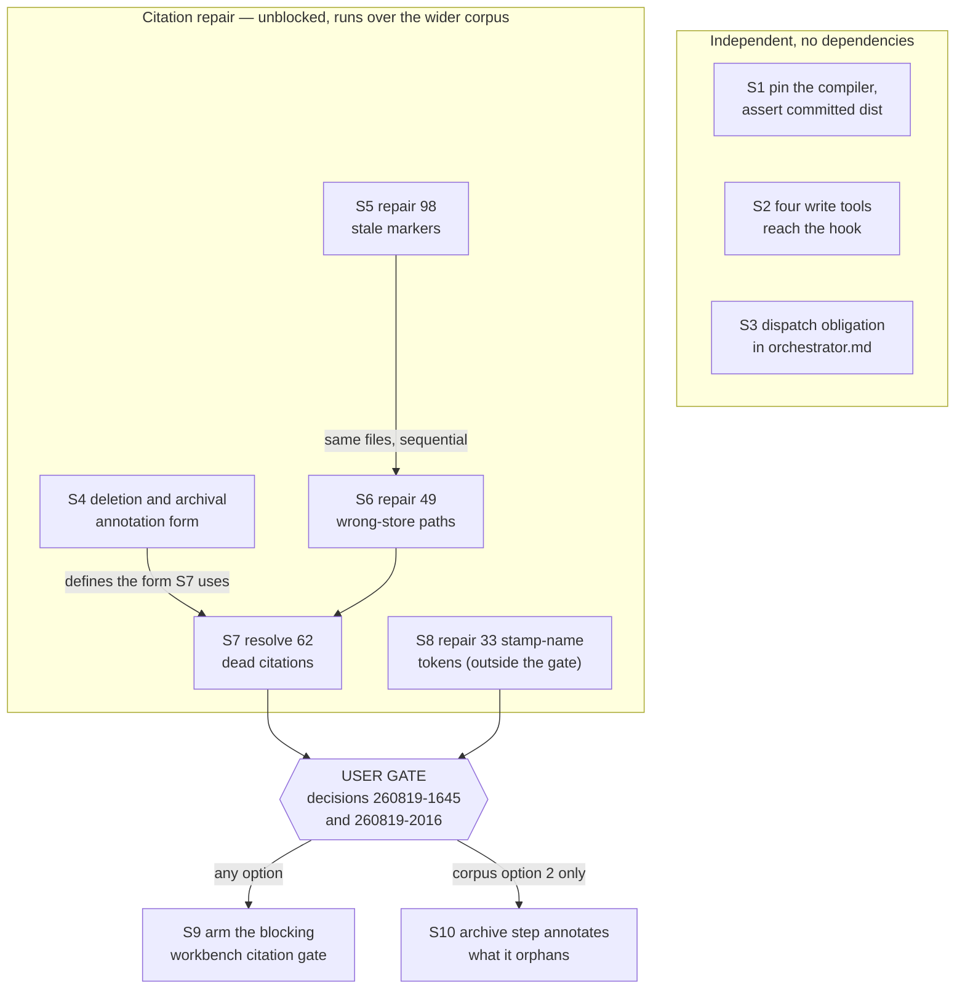
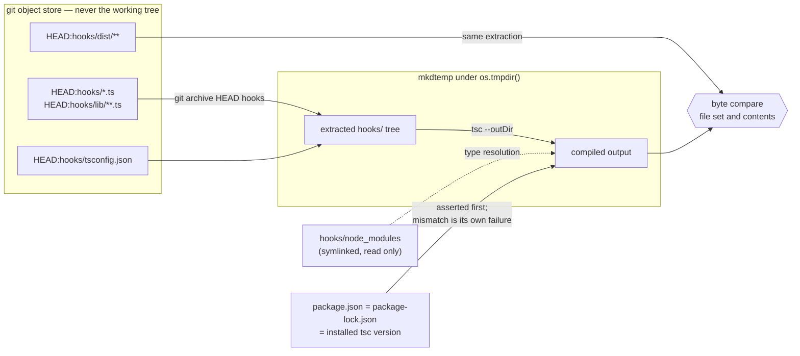

# Implementation Plan: four constraints on deep change

**Date:** 2026-08-19
**Status:** Complete
**Spec:** none. Planned from the Circle record `circles/260819-1645-four-constraints-on-deep-change/_t_circle.md`, whose Directive and Grounding snapshot are the contract.
**Decidability:** Constraint 1's load-bearing question is "is the committed `hooks/dist` the compilation of the committed source", and it is decidable, on one condition. A compile is a function of source, configuration and compiler version. Source and artifact are both in the git object store and can be read without touching the working tree. The configuration is committed. The compiler version is the only free variable, and the answering decision names it as the thing that would redden the suite for no defect. Step 1 removes it as a variable by pinning `typescript` to an exact version and asserting, before the comparison runs, that the compiler about to be used is that one. A mismatch is then a separate, separately-named failure ("the toolchain is not the pinned one") rather than a wrong answer to the question. Verified at HEAD `b91c01c`: two compiles of the identical extracted tree produced byte-identical output, and that output equals the committed `hooks/dist` in all 36 files. Constraint 4's question, "does this citation name a record that exists", is decidable for the three token classes `scanRecordCitations` reads and undecidable for a bare timestamp, which is why `citation-scan.ts` partitions those out and no step here judges them. Constraint 3 is the one place where nothing is decided by a mechanism: whether an executor ran a whole-tree git command is only answerable by reading the command's text, which is the undecidable question this repository deleted a classifier over on 2026-08-09. Constraint 3 is therefore a written obligation and this plan claims no enforcement for it.

## Directive

The Circle record carries it in full. In one line: four ways a deep change to fusion can go wrong unobserved are closed, by asserting the compiled artifact against its source, by putting all four write tools through the guard in a test, by telling every executor at dispatch that whole-tree git commands are not its tools, and by putting the workbench's own citations under a gate and repairing what that gate would find.

Four settled points arrive with the dispatch and are not reopened here. Constraint 1 takes option 2 of decision `shared/decisions/260816-0719_*_should-anything-assert-that-the-committed-hooks-dist-is-the-compilation-of-the-committed-source.md`. Constraint 3's prohibition goes into the orchestrator's dispatch obligations rather than into the executor prompts, on every executor dispatch. Constraint 4 builds a blocking test in `npm test` and repairs the dead citations in the live surfaces, leaving session histories and `archive/` as they are. The deletion obligation from `circles/260801-1244-guard-rules-write/decisions/260805-1548_*_wie-soll-ein-circle-verschwinden-duerfen-den-jemand-absichtlich-loescht.md` is in scope.

## Current State

Everything below was measured in this planning run, at HEAD `b91c01c`, against the working tree as it stood at 260819-2016. The tree carries the Circle directory and two record edits that are not yet committed, which is why two figures differ slightly from the Grounding snapshot's.

**The compiled artifact is in sync today, so constraint 1's gate is green at the moment it is armed.** Extracting `hooks/` from HEAD with `git archive`, compiling it with the installed `tsc`, and comparing against the extracted `hooks/dist` gives identical file sets (36 files) and identical bytes. A second compile of the same tree is byte-identical to the first. One compile costs 3.5 seconds of wall clock, against a suite that runs in roughly 37 seconds.

**The compiler is pinned in one of the two places that matter and not in the other.** `hooks/package-lock.json` records `typescript` at `5.9.3`, which is what `npm ci` installs and what is installed today. `hooks/package.json` declares the caret range `^5.6.0`, so a fresh `npm install` with no lockfile may resolve something else. No emitted declaration in `hooks/dist` references a node type (`grep` over all 36 files finds no `import(` type and no `node:` reference), so `@types/node` does not reach the emit as the sources stand today.

**Corrected 260820** (`coder`, Circle Turn 2). Two measurements in the paragraph above were wrong when it was written, and the correction is appended rather than substituted, because this is the record of a planning run and what it measured is part of it. The conclusion each supported is unaffected and stands.

*The lockfile is not one of the two places.* `hooks/package-lock.json` is gitignored — `.gitignore:7` carries the bare pattern `package-lock.json`, and `git ls-files hooks/package-lock.json` prints nothing. The file exists on the machine the plan was written on and in no clone, no commit and no tarball, so a fresh checkout cannot run `npm ci` at all. The pin therefore had to go into `hooks/package.json`, which is committed and now reads `"typescript": "5.9.3"` exactly, and the implementation put it there. `hooks/lib/__tests__/committed-dist.test.ts` states the same reading in its own header: the lockfile is a local-consistency leg of the toolchain case rather than the pin itself.

*The `node:` half of the grep does not reproduce.* Re-measured at `b91c01c`, the commit the paragraph names: `git grep -o 'node:' b91c01c -- hooks/dist | wc -l` returns **18 occurrences, on 18 lines, across 11 of the 36 files** (`config.js`, `events.js`, `git.js`, `guard-state-file.js`, `review-coverage.js`, `self-detect.js`, `staging-drift.js`, `state-file.js`, `workbench-root.js`, `session-start.js`, `tracker.js`). Every one of them is an `import … from "node:fs"`, `"node:path"` or `"node:child_process"` in an emitted `.js` — a runtime import copied from the source, not a type drawn from `@types/node`. Two earlier reports of this figure disagreed, at 17 across 10 and 18 across 11; the second reproduces. What the plan should have said is what the other half of the grep did establish and what does reproduce: `git grep -c 'import(' b91c01c -- hooks/dist` returns nothing, so none of the 18 emitted `.d.ts` files carries an `import(` type. `hooks/dist` is byte-identical at `8e7cae7`, so all of these figures are unchanged today.

**Two of the guard's four write tools reach no integration case.** `grep -rn 'NotebookEdit\|MultiEdit\|notebook_path' hooks/lib/__tests__/` returns one hit, `hooks-wiring.test.ts:70`, which asserts the `hooks.json` matcher list rather than calling through the hook. The remedy the defect record names is available and unchanged: `runWrite` takes a tool name (`helpers/guard-harness.ts:753`), and `runGuard` is exported beside it (`:697`), so the `notebook_path` payload has an entry point too. The row the cases would assert on carries both a `tool` and a `file` field (`hooks/guard.ts:202-207`, `EventLine` at `helpers/guard-harness.ts:926`).

**The orchestrator's dispatch prompt lists four things and does not list this one.** Step 3a item 4 of `agents/orchestrator.md` enumerates what an executor dispatch carries: what to do, which files to touch, the acceptance criteria, and the source record. The existing prohibition at `agents/orchestrator.md:983` sits in the `## Error Handling` table and governs the orchestrator's own revert, not an executor's tools.

**The citation corpus and what a gate over it would see.** Running `citation-scan.ts` over the corpus the user chose gives the table below. Two readings of "the open decisions" are possible, and only the wider one reproduces the Grounding's figures, so both are stated.

| Corpus reading | Files | Tokens | Resolved | Dangling | Undecidable | Exempt |
|---|---|---|---|---|---|---|
| decisions `_o_` only | 169 | 1 556 | 719 | 203 | 590 | 44 |
| decisions `_o_` and `_a_` | 189 | 1 754 | 783 | 242 | 685 | 44 |

The Grounding's 1 711 tokens and 245 dangling reproduce under the second reading, at the commit before this session's own records entered the tree. The corpus is defined by state markers and by files that ordinary work creates, so the count moved between the shaper's run and this one without anybody touching a citation. That is direct evidence for the sibling decision's own reasoning about count pins, and it is measurement rather than argument.

**The gate would judge fewer tokens than the repair scope names.** `scanRecordCitations` filters on `GATE_KINDS`, which holds `record`, `bare-record` and `circle-dir`. Over the wider corpus it returns **209 violations across 81 files**. The `partition()` figure of 242 additionally counts 33 `stamp-name` tokens, a class the gate does not read. The gap is filed as decision `circles/260819-1645-four-constraints-on-deep-change/decisions/260819-2016_*_does-the-citation-gate-judge-the-stamp-name-class-which-scanrecordcitations-does-not-read.md` and is the second question the user answers at this gate.

The 209 break down as follows, and the breakdown is what makes the repair three steps rather than one:

| Class | Tokens | Treatment |
|---|---|---|
| stale marker | 98 | mechanical: rewrite the marker position to `_*_` |
| wrong store | 49 | mechanical: the scanner names the record's actual path |
| resolves to nothing | 62 | judgement, one of three treatments per token |

**The archive filter is narrower than its defect record says.** `skills/archive/SKILL.md` checks `CLAUDE.md` alone, by `grep -F` on the basename and the workbench-relative path. The rule is stated at `:112`, executed at `:185-187` and restated at `:282`. It does not read the shipped tree, and it reads the workbench not at all. The record `shared/issues/260819-1511_*_the-archive-citation-filter-reads-shipped-text-and-never-the-workbench-so-archiving-dangles-citations-invisibly.md` now carries a `Revised by:` line saying so. Every step below is planned against the code.

**The deletion obligation exists as an answer and as nothing else.** `rules/circle-records.md` says nothing about deletion, no skill supports it, and no agent prompt carries it, which the reconciliation pass of 2026-08-19 measured and recorded in the decision record's own footer.

**Head-room, measured rather than quoted.** `agents/*.md` stands at 414 534 bytes against a budget of 417 843, leaving **3 309 bytes**, of which `orchestrator.md` has already spent 10 444. `skills/*/SKILL.md` leaves **9 716 bytes**. The hook test surface stands at 18 498 lines against 20 375, leaving **1 877 lines**. `rules/circle-records.md` is a conditional emission (`bin/fusion-rules:432`, indented), so it sits outside the always-on rule bound, and `rules/` is not one of the three surfaces `surface-growth-bound.test.ts` measures. Writing there costs no budget. (**Qualified 260820:** that last sentence is true of `rules/circle-records.md`, the file this paragraph measured and the file step 4 wrote into, and false as a general statement about `rules/`. Step 9 wrote 987 bytes into `rules/fusion-workbench-conventions.md`, which is in the always-on core and has its own failing bound in `rules-emission-golden.test.ts` — the fourth bounded surface, and the most expensive of the four, since every byte of it is charged to every agent on every dispatch. Step 9's line was not in the plan when this paragraph was written. The always-on surface stands at 92 367 bytes against a cap of 98 573, leaving **6 206 bytes**.)

## Approach

The work splits along one line, and it is not the line the four constraints suggest. Three of the four constraints are self-contained additions that depend on nothing and on each other not at all. The fourth is a repair followed by an arming, and only the arming waits on the user.

So the plan runs the three independent constraints first, in any order or in parallel, then the citation repair, which is unblocked and is the longest single piece of work, then stops at a gate that names the two open decisions, then arms the test. The repair is deliberately performed over the **wider** of the two corpus readings, so that it satisfies either answer to the corpus question. Repairing a citation that turns out to sit outside the gate's corpus is never wrong; leaving one inside it unrepaired is what reddens the suite on the commit that arms the gate.

The deletion obligation lands before the repair rather than after it, because the repair needs the annotation form it defines. Sixty-two of the dangling citations resolve to nothing, and for some of them the honest treatment is to say that the target was deliberately removed and when. That sentence has to have a written form before sixty-two records start improvising one.

Constraint 1's mechanism is worth drawing separately, because the whole of its correctness is in which tree each side of the comparison comes from.

The shared build tree appears in neither diagram, which is the constraint decision `260816-0719` attached and decision `260811-2009` established: `hooks/dist` and `hooks/.build-staging` are read and written by concurrent suite runs, and this test touches neither.

## Implementation Steps

1. [DONE] **Pin the compiler and assert the committed artifact**
   - Executor: `coder`
   - Files: `hooks/package.json`, `hooks/lib/__tests__/committed-dist.test.ts` (new)
   - Changes:
     - In `hooks/package.json`, replace the `typescript` range `^5.6.0` with the exact version `5.9.3`. Leave `hooks/package-lock.json` untouched: it already records 5.9.3, so the two agree without a reinstall. Leave the other three devDependencies as they are; none of them reaches the emit, and widening the pin without a measurement would be pinning by superstition.
     - Write the new test with three assertions in this order. **First**, that the toolchain is the pinned one: the version in `node_modules/typescript/package.json`, the version in `package-lock.json` at `packages["node_modules/typescript"]`, and the literal in `package.json` `devDependencies.typescript` are all equal. Its failure message says that the toolchain is not the pinned one, that this is not an artifact defect, and that `npm ci` in `hooks/` is the fix. **Second**, that HEAD compiles: extract with `git archive HEAD hooks | tar -x -C <tmp>` into a `mkdtempSync(tmpdir())` directory, symlink `<tmp>/hooks/node_modules` at the live `hooks/node_modules`, and run `node_modules/.bin/tsc --outDir <tmp>/out` with `cwd` at `<tmp>/hooks`. A non-zero exit fails with the compiler's own output. **Third**, that the artifact matches: the set of files under `<tmp>/out` equals the set under `<tmp>/hooks/dist`, and every file's bytes are equal. The failure names the differing, missing and extra paths and says the fix is `npm run build` in `hooks/` with `hooks/dist` committed alongside the source in the same commit.
     - The test writes nothing under `hooks/dist` and nothing under `hooks/.build-staging`. Both are shared between concurrent runs, and that is the constraint the answering decision attached.
     - Degrade loudly, never silently: if `git rev-parse HEAD` fails or `git archive` produces no tree, fail with that as the stated reason rather than skipping. The precedent is the "degrades loudly, not silently" case in `reference-resolution-lint.test.ts`.
   - Acceptance: `cd hooks && npm test -- lib/__tests__/committed-dist.test.ts` is green at the commit that lands it, and goes red when `hooks/dist` is reverted one commit while its source is not.
   - Cost: about 200 lines on the hook test surface, of 1 877 available.
   - Dependencies: none.

2. [DONE] **Put all four write tools through the hook**
   - Executor: `coder`
   - Files: `hooks/lib/__tests__/guard-bash-integration.test.ts`
   - Changes: add `runGuard` to the import list from `./helpers/guard-harness.js`. In the existing describe block, add three cases beside the `Edit` one: `Write` and `MultiEdit` through `runWrite(root, path, "<tool>")`, and `NotebookEdit` through `runGuard(root, "NotebookEdit", { notebook_path: path })`. Each case asserts that exactly one event was written, that its `event` is `guard_allow`, that its `tool` is the tool name the case passed, and that its `file` names the path. Rename the describe from "the Edit write path allows and records" to a name covering four tools.
   - Assert the `tool` field and not only the `file` field. A case that asserted `file` alone would still pass if the harness silently fell back to its default tool name, which is the exact failure the four cases exist to rule out.
   - Acceptance: `grep -rn 'NotebookEdit\|MultiEdit\|notebook_path' hooks/lib/__tests__/` returns hits in `guard-bash-integration.test.ts` as well as the matcher assertion in `hooks-wiring.test.ts`, and the suite is green.
   - Cost: about 70 lines on the hook test surface.
   - Dependencies: none.

3. [DONE] **State the whole-tree git prohibition at every executor dispatch**
   - Executor: `coder`
   - Files: `agents/orchestrator.md`
   - Changes: add one bullet to the list under Step 3a item 4 ("Dispatch to executor"), which is where the orchestrator is told what an executor dispatch prompt carries. The bullet says that a whole-tree git command is never an executor's tool, names the forms (`git stash`, `git checkout .`, `git reset`, `git clean`, `git restore .`), and says that a measurement against HEAD uses `git show HEAD:<path>`. Add one clause to the `bugfixer` dispatch at Step 3b item 2b pointing at the same bullet, because the bugfixer writes to the live tree on the same terms and is dispatched from a different place.
   - **This is a new bullet at the dispatch point and not an extension of `agents/orchestrator.md:983`.** That sentence sits in the `## Error Handling` table and governs the orchestrator's own revert. The user placed this obligation on the dispatch, and somebody assembling a dispatch prompt does not read the error-handling table on the way. Do not edit line 983.
   - Budget: keep the whole edit at or under 600 bytes. `agents/*.md` has 3 309 bytes of head-room, `orchestrator.md` has already spent 10 444 of the surface's 14 691, and the rule for a red bound is a cut and never a baseline edit (`hooks/lib/__tests__/helpers/growth-bound.ts`). Re-run the bound after the edit.
   - Stated residual, accepted by the user in the shaping: an executor cannot tell from its own prompt whether it runs alone, so the sentence binds a solitary executor where the command would have been harmless.
   - Acceptance: `npm test` is green, including `surface-growth-bound.test.ts`, and the new text carries no store-directory path literal (`path-literal-lint.test.ts`).
   - Dependencies: none.

4. [DONE] **Write down the deletion and archival annotation form**
   - Executor: `coder`
   - Files: `rules/circle-records.md`, and the decision record `circles/260801-1244-guard-rules-write/decisions/260805-1548_*_wie-soll-ein-circle-verschwinden-duerfen-den-jemand-absichtlich-loescht.md`
   - Changes: add a short section to `rules/circle-records.md` realising the operative half of that decision. It states three things. A deliberately deleted Circle leaves no directory, no record and no marker, and the vocabulary deliberately has no case for it. The obligation sits on the surviving references rather than on the deleted object, because an instruction inside the object cannot survive the object. Whoever deletes annotates every surviving citation with the fact and the date, in a stated literal form that step 7 then reuses.
   - After the text lands, append `Implemented: <path>:<line> — …` to the decision record and rename its marker from `_a_` to `_i_`, per `rules/fusion-workbench-conventions.md` `## Inline State Tracking`. Leave its existing `**Status:** open` head field exactly as it stands: it predates the field's removal and is evidence for it.
   - Reachability residual, stated and not closed here: `rules/circle-records.md` is emitted to `orchestrator`, `playmaker` and `shaper`, so a human deleting a Circle by hand still reads nothing. The decision's own closing paragraph left a `/fusion:circle-delete` skill open, and this plan neither builds it nor closes that question.
   - Budget: none consumed. `rules/circle-records.md` is a conditional emission and `rules/` is outside the three bounded surfaces.
   - Acceptance: `npm test` green, including `provenance-header-lint.test.ts`. If the new text adds a resolvable plugin path or record citation, re-approve `BASELINE` in `reference-resolution-lint.test.ts` in the same commit, which is what that gate's own failure message asks for.
   - Dependencies: none.

5. [DONE] **Repair the 98 stale-marker citations**
   - Executor: `coder`
   - Files: workbench records across the repair corpus. Drive the file list from the scanner rather than from a written list.
   - Changes: for every hit whose status is `stale-marker`, rewrite the marker position in the citation to the wildcard `_*_`. This is the form decision `circles/260805-2005-textschicht-gegen-code-nachziehen/decisions/260806-0015_*_zitierform-fuer-workbench-records.md` prescribes for a marker that moves, and it is the fix the scanner itself names on each violation. Do not rewrite the citation to the record's current marker: that repair goes stale again on the record's next transition, which is what produced 98 of these.
   - **Run over the wider corpus reading**, meaning decisions with marker `_o_` or `_a_`, so the repair satisfies either answer to the open corpus question.
   - Acceptance: a rerun of the scan over the same corpus reports zero `stale-marker` hits. Report the before and after counts.
   - Dependencies: none.

6. [DONE] **Repair the 49 wrong-store citations**
   - Executor: `coder`
   - Files: workbench records across the repair corpus, driven by the scanner.
   - Changes: for every hit whose status is `wrong-store`, correct the cited path to where the record actually is. The scanner reports the real path on each violation, so this is mechanical. Where a citation resolves to more than one candidate, treat it as step 7's judgement case rather than picking one.
   - Acceptance: a rerun reports zero `wrong-store` hits.
   - Dependencies: step 5. The two steps touch overlapping files and a single sequential pass avoids two agents rewriting one record.

7. [DONE] **Resolve the 62 citations that resolve to nothing**
   - Executor: `coder`
   - Files: workbench records across the repair corpus, driven by the scanner.
   - Changes: every remaining `dangling` hit of kind `record`, `bare-record` or `circle-dir` gets exactly one of three treatments, and every treatment ends with the token either gone or resolving.
     1. **Correct the path** when the target is identifiable, which is usually the case for a record that moved into `archive/` in a sweep. Cite it where it now is.
     2. **Pull the citation's substance into the text and drop the dead path**, which is what decision `circles/260801-1244-guard-rules-write/decisions/260805-0709_*_wohin-gehoert-die-forensik-aus-protected-path-discipline.md` established and what the scanner's own fix text names.
     3. **Annotate as deliberately removed**, in the form step 4 writes down, when the target was deleted rather than moved.
   - No token is left standing because its target could not be identified. When none of the three applies cleanly, use treatment 2 and file a defect in `$OUT_ISSUE` naming the record and the lost reference. A token left in place is a red gate at step 9.
   - Acceptance: a rerun reports zero violations from `scanRecordCitations` over the repair corpus, in both corpus readings.
   - Dependencies: steps 4 and 6.

8. [DONE] **Repair the 33 `stamp-name` citations that name nothing**
   - Executor: `coder`
   - Files: workbench records across the repair corpus, driven by the scanner.
   - Changes: same three treatments as step 7, applied to hits of kind `stamp-name` whose status is `dangling`. These are stamps carrying a dashed name, such as `260812-2116-coder-<slug>`, for which no artifact and no Circle directory exists.
   - **This step buys no gate under one of the two answers.** `scanRecordCitations` does not read the `stamp-name` class, so unless the user widens it in decision `260819-2016`, these 33 tokens are repaired and then held by nothing. They are in scope because the Directive says the live surfaces carry no dangling citation, and they are stated separately because the Directive's second clause, that a blocking test holds them there, does not reach them.
   - Acceptance: a rerun of the corpus scan reports zero `stamp-name` hits with status `dangling`.
   - Dependencies: step 7.

   **--- USER GATE. Steps 9 and 10 do not start until decisions `260819-1645` and `260819-2016` are answered. ---**

9. [DONE] **Arm the blocking workbench citation gate**
   - Executor: `coder`
   - Files: `hooks/lib/__tests__/workbench-citation-lint.test.ts` (new)
   - Changes: the second caller of `scanRecordCitations`, over the corpus the user's answer defines. Follow the shape of `reference-resolution-lint.test.ts`, which is the first caller: build the file list, scan each file's lines, collect violations, and assert. Two cases at minimum. One asserts the violation list is empty, with `report(violations)` as the failure message so a reader learns which citation is dead and where. One asserts `WORKBENCH_PRESENT`, so a workbench that is absent fails loudly rather than passing an empty scan.
     - **Write the corpus as a marker predicate, not as the word "open".** The predicate is a written constant in the test file, and it names the record kinds and the markers it selects. The two readings measured above differ by 20 files and 39 dangling tokens, so the word alone does not define a corpus.
     - Whether a resolved-count pin accompanies the assertion follows the answer. Corpus options 1 and 2 add none. Option 3 adds one in the shape `BASELINE` already uses, with the same failure message discipline.
     - Under decision `260819-2016` option 2, widen `GATE_KINDS` in `hooks/lib/__tests__/helpers/citation-scan.ts` and re-approve `BASELINE.records` in `reference-resolution-lint.test.ts` in the same commit, because both callers share the list. Under option 3, give the new gate its own kind list and leave `GATE_KINDS` alone.
   - Acceptance: `npm test` green on the commit that lands it, and red when a single citation in the corpus is broken by hand.
   - Cost: about 200 lines on the hook test surface. With steps 1 and 2, the three additions come to roughly 470 lines of the 1 877 available.
   - Dependencies: steps 5, 6 and 7, plus step 8 under decision `260819-2016` options 2 and 3, plus the user's answers.

10. [STRUCK — corpus decision 260819-1645 answered option 1; this step does not exist] **Make the archive step annotate the citations it orphans**
    - Executor: `coder`
    - Files: `skills/archive/SKILL.md`
    - **Conditional: this step runs only if the user answers decision `260819-1645` with option 2.** Under options 1 and 3 it does not exist, and archiving stays a way to redden the suite.
    - Changes: add a process step between the confirmation at step 6 and the manifest at step 8. Before moving a candidate, scan the live corpus for citations of it, and either drop the candidate from the proposal or annotate every citing record with its new archive path. Report what was annotated in the manifest.
      - This makes the skill a writer of records other than its own manifest, which the decision names as a new capability needing its own bound. State the bound in the text: the skill rewrites the cited path and nothing else in a record it did not create, and it never changes a marker.
      - Do not describe the existing filter as reading the shipped text. It checks `CLAUDE.md` alone, by `grep -F` on the basename and the workbench-relative path, stated at `:112`, executed at `:185-187` and restated at `:282`. The new step is a second, separate check over the workbench, not a widening of that one.
    - Budget: `skills/*/SKILL.md` has 9 716 bytes of head-room, so the addition is affordable. Re-run the bound after the edit.
    - Acceptance: `npm test` green, and a dry run of the archive step over a candidate that is cited from a live Circle record reports the citation rather than moving silently.
    - Dependencies: step 9, and the user's answer.

## Data Structures

None new. Step 9 reuses `Violation`, `CitationHit` and `scanRecordCitations` from `hooks/lib/__tests__/helpers/citation-scan.ts` unchanged, except under decision `260819-2016` option 2, which adds one entry to the existing `GATE_KINDS` array.

## API Changes

None. Nothing in `hooks/lib/` or `bin/` changes signature. `hooks/package.json` changes one dependency literal from a range to an exact version, which no code reads.

## Testing Strategy

Every step is verified by `cd hooks && npm test`, which is the project's own validation command and the one the orchestrator runs at Step 3b.

Three of the ten steps are themselves tests, so their verification is the ordinary one: the suite is green at the commit that lands them. What matters more is that each of the three has a stated way of being made red on purpose, because a gate nobody has seen fail is a gate nobody knows is connected. Step 1 goes red when `hooks/dist` is reverted one commit while its source is not. Step 2 goes red when `extractFilePath`'s `notebook_path` branch is removed. Step 9 goes red when a single citation in the corpus is broken by hand. Each acceptance line names its own.

The five repair steps are verified by rerunning the scanner over the corpus and reporting the before and after counts, not by reading a diff. The counts are the acceptance criterion, and they are stated per step.

Steps 3, 4 and 10 change shipped text and are verified by the gates that already read it: `surface-growth-bound.test.ts` for the byte budgets, `path-literal-lint.test.ts` for store literals, `provenance-header-lint.test.ts` for the rule file, and `reference-resolution-lint.test.ts` for any citation the new text adds. That last one pins a resolved count, so an edit adding a citation to shipped text moves `BASELINE` and the re-approval belongs in the same commit.

## Risks & Mitigations

| Risk | Mitigation |
|---|---|
| Step 1 measures HEAD, so a commit that stages source without `hooks/dist` is caught on the next suite run rather than at the commit itself. | Accepted and stated rather than engineered around. The alternative, comparing against the git index, would catch it a few seconds earlier and would make the test depend on transient index state, which two concurrent executors in one checkout share. The orchestrator runs validation before every commit, so the lag is one task, not one session. |
| A `typescript` upgrade reddens the suite for no defect, which is the failure the answering decision named. | The version assertion runs first and fails with its own message naming the toolchain rather than the artifact. An upgrade is then a three-line change: bump `package.json`, `npm install`, rebuild and commit `hooks/dist`. |
| Declaration emit could in principle depend on the ambient type packages, so `@types/node` would become a second unpinned input. `inference:` verified only for the sources as they stand: no file in `hooks/dist` emits an `import(` type. (**Corrected 260820:** the second half of that sentence, "or references `node:`", was false when written. 18 `node:` occurrences stand across 11 emitted `.js` files at `b91c01c` and at HEAD, every one a runtime import rather than a type reference, so the row's conclusion is unaffected. Measured in `## Current State` above.) | Left unpinned deliberately, with the measurement recorded here. Pinning four devDependencies on the strength of one that reaches the emit would be pinning by superstition, and the version assertion's failure message is where a future divergence will surface. |
| Step 3 lands 600 bytes into a surface with 3 309 left, and `orchestrator.md` is the file that has spent most of the budget. | The step names its own cap and re-runs the bound. If the bound goes red, the rule is a cut in `agents/`, never a baseline edit (`helpers/growth-bound.ts` `## Re-baselining`). |
| The repair is sized from a count that moves. Two runs eleven hours apart, with no citation touched, differ by three tokens. | The repair steps assert on a rerun of the scanner reaching zero, never on hitting a number. No step in this plan writes a count into a test. |
| Step 7's judgement calls could stall on a token whose target nobody can identify. | The step forbids leaving a token standing. Treatment 2, pulling the substance into the text and dropping the dead path, always applies, and the lost reference is filed as a defect rather than swallowed. |
| Under corpus option 1 the next `/fusion:cleanup` archive sweep reddens the suite, and archiving is routine. | Named in the gate rather than mitigated. It is the cost the sibling decision states, and step 10 is the branch that removes it. |
| Step 9 arms a gate whose corpus is defined by markers that ordinary work moves, so a newly filed record with a bad citation reddens the suite for its author. | Also named rather than mitigated: under option 1 that is the gate working, and the filing agent is the one who can fix it. The plan does not soften it with a warning-only mode, which would be the third gate in this repository that reports and is read by nobody. |

## Open Questions

- [ ] **What defines the gate's corpus, and what happens when a marker move changes it.** Open at `circles/260819-1645-four-constraints-on-deep-change/decisions/260819-1645_*_what-defines-the-citation-gates-corpus-and-what-happens-when-a-marker-move-changes-it.md`. This plan does not answer it and does not assume an answer. What each option changes here:
  - **Option 1, zero dangling recomputed on every run.** Steps 1 through 9 run as written and step 10 does not exist. Step 9 carries no count. The accepted cost is that a `/fusion:cleanup` archive sweep can turn `npm test` red, and so can a newly filed record carrying a bad citation.
  - **Option 2, zero dangling plus archive and deletion annotations.** Steps 1 through 9 as written, plus step 10, which adds a workbench scan to `skills/archive/SKILL.md` and makes it a writer of records it did not create. The largest option, and the only one under which archiving stops breaking the build. Step 4 already carries the deletion half, so option 2 adds the archive half alone.
  - **Option 3, an exact count pin.** Steps 1 through 9 run, step 10 does not exist, and step 9 additionally writes a baseline number and its re-approval message. The repair steps are unchanged, because a pin over an unrepaired corpus would pin 209 dangling citations as approved. This is the option the sibling record argues against on this repository's own measured history, and this planning run adds one measurement to that history: the corpus count moved by three tokens between the shaper's run and this one with no citation touched.
- [ ] **Does the gate judge the `stamp-name` class?** Filed this run at `circles/260819-1645-four-constraints-on-deep-change/decisions/260819-2016_*_does-the-citation-gate-judge-the-stamp-name-class-which-scanrecordcitations-does-not-read.md`. It decides whether step 8's 33 tokens are held by anything and whether step 9 touches `GATE_KINDS`, which both callers share. Answer it at the same gate as the one above; the two are independent and neither presumes the other.
- [ ] **Which reading of "the open decisions" the corpus predicate takes**, `_o_` alone or `_o_` together with `_a_`. Noted on the corpus decision as an `Also seen:` line rather than filed separately, because it is part of that question. It is recorded here because only the wider reading reproduces the Grounding's figures, and because the repair steps deliberately run over the wider one so that either answer is satisfied.
- [ ] **Whether a `/fusion:circle-delete` skill should support the deletion the annotation form describes.** Left open by the answer in `260805-1548` itself and not closed by this plan. Step 4 writes the obligation into a rule file that three agents read, which leaves a human deleting a Circle by hand still reading nothing.

## Notes on executor routing

Every step routes to `coder`, and that is a result rather than an oversight. The Circle changes TypeScript tests, one build manifest, three shipped Markdown surfaces and a set of workbench prose records. Nothing here is ontology, manifest, schema or fixture data, so `ontocoder` has no step: `hooks/package.json` is build configuration, which the routing table assigns to `coder` by role rather than by extension. No step produces a strategic deliverable, so `analyst` has none either. The one judgement call is the citation repair in steps 5 through 8, which edits Markdown records rather than code. It routes to `coder` because the work is driven by a scanner's output and verified by rerunning that scanner to zero, which is a code-shaped task, and because the records it edits document the project's own history rather than its data.

## Reconciliation Log

**Reconciliation 260820-0830** (reconciler, domain `code`, HEAD `04db0b0`, working tree clean).
Scope: this Circle's stores plus the four records elsewhere that the range `b91c01c..04db0b0`
transitioned. Every claim below was checked against the tree, not against the step's own report.

**Status confirmed Complete; nine steps done, step 10 struck.** All nine live steps verified on
disk:

| Step | Claim | Verified at |
|---|---|---|
| 1 | compiler pinned, committed artifact asserted | `hooks/package.json:17` (`"typescript": "5.9.3"`), `hooks/lib/__tests__/committed-dist.test.ts` — 3 cases, green in 3.7 s |
| 2 | four write tools through the hook | `hooks/lib/__tests__/guard-bash-integration.test.ts:113` describe, cases at `:165` and `:182`; `notebook_path` branch live at `hooks/guard.ts:104` |
| 3 | whole-tree git prohibition at every dispatch | `agents/orchestrator.md:522` (new bullet, 324 bytes) and `:546` (bugfixer clause); 395 bytes total, against the 600 the step allowed |
| 4 | deletion and archival annotation form | `rules/circle-records.md:67` section, literal at `:97`, worked example at `:103` |
| 5–8 | citation repair over the wider corpus | 195 corpus files scanned at HEAD, **0 violations** |
| 9 | blocking workbench citation gate | `hooks/lib/__tests__/workbench-citation-lint.test.ts` — 8 cases, green; corpus is a marker predicate with no baseline and no count |

**One inline marker was corrected by this pass.** Step 5 carried its `[DONE]` after the title where
the other eight carry it before, against `rules/fusion-workbench-conventions.md` `## Inline State
Tracking` → `### Planning files`. It now reads `5. [DONE] **Repair the 98 stale-marker citations**`.
The defect record that named it (`260820-0805_*_the-plan-is-still-status-draft-under-the-open-marker-with-nine-of-its-ten-steps-done.md`)
was closed on the Status and marker alone; this was the third item of its own fix direction and had
not been done.

**Three stated measurements in this plan do not reproduce at HEAD, and each is already filed.**

- `## Current State` calls `hooks/package-lock.json` one of "the two places that matter" for the
  pin. It is gitignored and `git ls-files hooks/package-lock.json` returns nothing, so it is a
  local-consistency leg and not the pin. Filed as `260820-0805_*_the-plan-names-a-gitignored-lockfile-as-one-of-the-two-places-the-compiler-is-pinned.md`.
- The same paragraph states that a grep over the 36 emitted files finds no `node:` reference.
  Re-measured here: `git grep -c 'node:' b91c01c -- hooks/dist` returns **18 hits across 11 files**.
  The conclusion (that `@types/node` does not reach the emit) is unaffected; the measurement is
  wrong. Filed as `260820-0805_*_the-plans-node-types-residual-states-a-grep-result-that-does-not-reproduce.md`.
  Note for whoever takes that record: the review states 17 hits across 10 files, which is also not
  what reproduces here — re-measure rather than copying either figure.
- Step 4's budget line says writing to `rules/circle-records.md` costs no budget. True of step 4's
  file and false of step 9's, which spent 987 bytes of the always-on rule core. The always-on set
  measures **99 720 bytes** today (`bin/fusion-rules coder | xargs wc -c`). Filed as
  `260820-0805_*_the-step-that-spent-the-always-on-rule-budget-reported-green-without-the-figure-its-siblings-report.md`.

**What no step in this plan exercised.** No commit in `b91c01c..04db0b0` changed a file under
`hooks/dist` — the last commit that did is `06ab15b`, before the range opened. So step 1's gate has
never gone red on a real change in this Circle, and its recorded demonstration ("revert `hooks/dist`
one commit") is not re-runnable at HEAD in the form it is written, because there is nothing one
commit back to revert to. The mechanism was re-verified independently by this pass instead:
extracting HEAD with `git archive` into a temp tree, compiling with the pinned `tsc` (exit 0), and
comparing produced an identical 36-file set, and perturbing one byte of the temp copy's
`dist/guard.js` made the comparison differ. The gate is sound; only the demonstration is historical.

**Gates re-run by this pass, all green:** `committed-dist`, `workbench-citation-lint`,
`guard-bash-integration`, `reference-resolution-lint`, `rules-emission-golden`,
`surface-growth-bound`. The full suite was not run (out of scope for this dispatch).
