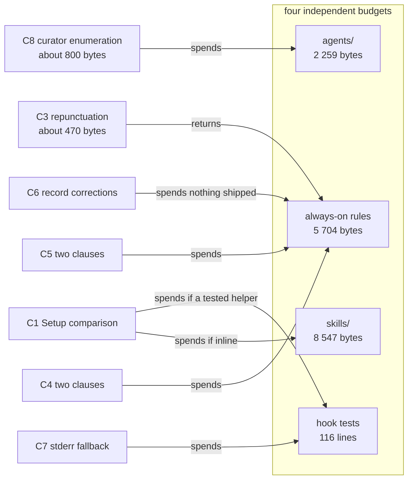

# Analysis: critical assessment of the style-rules spec before planning

**Date:** 2026-08-20 23:08
**Type:** Risk / Feasibility (pre-planning assessment of a specification)
**Status:** Complete
**Requested by:** orchestrator, on the user's behalf
**Measured at:** HEAD `a5b73da`, 2026-08-20, working tree clean of source changes

## Question

Is the spec at
`circles/260820-2051-style-rules-arrive-and-get-measured/planning/260820-2249_o_spec-style-rules-arrive-and-get-measured.md`
sound enough to hand to a planner? Specifically: does its three-cause cut satisfy
`rules/critical-stance.md` §4, are its two decidability answers honest, does its record-coverage
table hold, do the four growth budgets survive its mechanism set, and which of its six open
questions are genuine preferences rather than questions the workbench already answers?

## Scope

Read in full: the spec (589 lines), the Circle record, the shaper's session log, the defect the
shaper filed, and fifteen of the seventeen records the coverage table names, including all four
that the table's strongest claims rest on. Measured independently: the always-on emission set, the
four growth budgets, the three profile stations, the em-dash rates of the four stylometric profiles
and of `CLAUDE.md`, the prose-agent enumeration count, and the hook-test line inventory. The four
figures the requester had already re-derived were not re-derived again.

## Verdict

The spec is well above the standard this project usually gets from a shaping run, and it is not
ready to plan against. Three of its load-bearing claims do not survive checking, and one of them
means the Circle cannot deliver the fourth outcome its own Directive promises. None of the three is
fatal to the design. Each is fixable by a decision the user can take now.

## Findings

### F1. The three-cause cut is complete and disjoint as tabled, and its prose contradicts its own table

Every one of the seventeen records lands in exactly one cause or is explicitly placed outside the
three (spec:498-516). No record sits in two rows and none is missing. As an assignment, the cut is
MECE.

The prose above the table is not. It states counts that its own table refutes, in all three causes:

| Cause | Prose count (spec:48, :55, :61) | Table assignment |
|---|---|---|
| RC1 | "Six records are this" | 8 |
| RC2 | "Five records are this" | 4 |
| RC3 | "Three records are this" | 4 |

The prose totals fourteen against sixteen records to place. Two records assigned to RC1 in the
table appear in none of the five conditions RC1's prose enumerates: the token-count record
(`260816-1330_o_the-repunctuations-evidence-paragraph…`) and the override record
(`260816-1330_o_the-override-record-names-the-shipped-chat-profiles-cap…`). A cut whose headline is
"seventeen records are seventeen appearances of three" (spec:24) has to be able to count the
appearances.

**One assignment is wrong on the merits.**
`shared/issues/260812-0253_o_agents-answer-a-question-the-user-did-not-ask-and-the-length-caps-do-not-hold.md`
is placed in RC2, "a clause states a requirement and not the test that decides a case" (spec:513).
That record's principal fault is neither a missing test nor an untestable clause. Its own text says
so: "the fix is not another rule about length… Something in the corpus rewards thoroughness on a
lookup, and the first job is to find what". The record is about answering a question nobody asked.
Nothing in RC1, RC2 or RC3 describes that, and no capability in the spec addresses it.

**One assignment is debatable.** The token-count record is the third defect of the same repunctuation
pass whose other two defects are in RC3. Its content is a §3 calibrated-certainty fault, and the
record cross-references `rules/critical-stance.md` §3 by name. Splitting one pass's aftermath across
two causes on a distinction the records do not draw makes the cut look tidier than the material is.

**The right cut.** Keep RC1, RC2 and RC3. Move the token-count record to RC3. Make the fourth
bucket explicit rather than a single row reading "none of the three": it holds two records, the
verbosity record and the rules-decay record, and its name is that both are faults of the writer
under load rather than faults in the text. That bucket already exists in the spec by implication;
naming it costs one line and removes the pressure to force the verbosity record into RC2.

### F2. C10 cannot complete inside this Circle, under C10's own exclusion rule

This is the finding that most changes what a planner should be told.

C10's strengthening 2 says: "The post-repair window excludes this Circle's own history files"
(spec:378-379). Its reason is sound. A session whose subject is em-dashes has a primed writer.

The consequence is not drawn. After C3 lands, the only sessions producing history files in this
repository are this Circle's own, because the one other Circle is closed (see F7). So the post-repair
window has no members until a later Circle runs. C10's acceptance criterion "The measurement runs
against both windows and reports per-file rates" (spec:388) is therefore unreachable before this
Circle closes, and with it the fourth outcome of the Circle's Directive: that the answered decision
"carries a number produced by a protocol registered before the repair landed" (spec:20).

Three ways out, and the spec should name which one it takes:

1. **Bounded Closure.** The Circle registers the protocol, lands the repair, and closes with the
   measurement explicitly deferred to the next Circle. The Directive's fourth outcome moves with it.
   This is the honest option and it is the one I would take.
2. **Narrow the exclusion** from "this Circle's history files" to "history files written by an agent
   that read this Circle's planning documents". That is decidable, since a dispatch's inputs are
   recorded, and it readmits sessions that ran in the Circle on unrelated work. There are none, so
   this buys nothing today.
3. **Drop strengthening 2.** Not recommended. It is the one confound the spec can actually remove.

### F3. `CLAUDE.md` is 41 per cent of the always-on prose and is excluded on the wrong criterion

The spec excludes `CLAUDE.md` from the repaired corpus, and states the ground: "`bin/fusion-rules`
does not emit it, verified by running `bin/fusion-rules coder`" (spec:209-211). The verification is
correct. The criterion is the wrong one for this Circle's purpose.

The premise of the whole repair, taken from finding 10 of the analysis and quoted in the parent
defect record, is that a model follows the register of its conditioning text. The conditioning text
is what sits in an agent's context, not what a particular shell script put there. `CLAUDE.md` is
loaded into every agent's context by Claude Code as project instructions. It is in the context of the
agent writing this report.

Measured at HEAD `a5b73da` with the spec's own raw command:

```
                             words   raw em-dash   /1000
six emitted files            13283*  171 prose     12.9   (spec's own figures)
CLAUDE.md                     9155   125            13.6
```
`*` prose words, per the spec's metric.

The always-on prose an agent actually holds is therefore about 22 438 words carrying about 296
prose em-dashes, 13.2 per 1000. After C3 repairs the six emitted files to 13, the same agent still
holds 138 marks over 22 438 words, 6.2 per 1000. The repair halves the conditioning rate. It does
not bring it to the ceiling.

That matters in two places. It contradicts the Circle record's claim that "The whole-corpus scope
the user chose is what makes the measurement able to carry a result"
(`_t_circle.md`:136-137), and it weakens the dose the answered decision already warned about.

It also puts C6 in conflict with a record C6 claims to close.
`shared/issues/260816-1345_o_the-register-defects-corpus-table-is-labelled-always-on-and-is-not-the-always-on-set.md`
states its fix direction as: "State the set as the unindented `emit_if_exists` lines of
`bin/fusion-rules` plus the unconditional `emit_voice_profile` call **plus `CLAUDE.md`**". C6's
acceptance criterion states the derivation without `CLAUDE.md` (spec:278-281). So C6 as written
either leaves that record's stated fix unperformed or departs from it silently. (The record is itself
imprecise: it attributes that derivation to `CLAUDE.md` `## Conventions`, which in fact derives the
floor as the `emit_if_exists` lines plus the chat profile and does not include itself. Two live
records disagreeing about the membership of the same set is RC1 arriving one level up.)

**Recommendation.** Put the `CLAUDE.md` question to the user as a seventh decision, not as a spec
paragraph. It is the single largest lever on C10's dose, it costs nothing beyond the pass itself
since `CLAUDE.md` carries no growth bound, and the argument for excluding it (that it is not a
shipped rule file) does not survive the inclusion of `chat-voice-de.yaml`, which is a project file
and is in scope.

### F4. C1's five-case split is complete and not disjoint, and its migration path has no stated end state

The provenance-checksum answer is the right shape and it is the strongest single move in the spec.
`rules/critical-stance.md` §4 asks for a change of mechanism where a question is undecidable from the
inputs, and a third input that makes the question decidable is exactly that. Two defects in the
execution.

**The overlap.** With P the project copy, S the shipped copy and R the recorded provenance, case 1 is
`P == S` and case 4 is `P != R and S != R` (spec:119, :122). Both hold when the project and the
plugin have moved to the same content, which is what happens whenever a user takes today's
workaround of deleting the file and re-running Setup, or performs the manual `cp` this repository
will need before C1 exists. Case 0 (`R` absent) overlaps case 1 the same way. The table states no
precedence. Under `rules/critical-stance.md` §4 an overlap is a defect of the same kind as a wrong
result, and the spec asserts the split is "disjoint and complete" (spec:114). The fix is one line:
evaluate `P == S` first and let case 1 win, then branch on `R`.

**The undefined end state.** Case 0 is the migration path, and every existing workbench enters it. The
spec does not say what Setup records when the user declines the offer. Stamp `R` with the current
project copy and a genuinely stale file becomes case 3 forever, "leave it alone and say nothing",
which converts today's visible defect into a permanent silent one. Do not stamp, and the user is
asked again at every Setup, on the procedure whose felt slowness is already an open record. Neither
outcome is acceptable unstated. A third option exists and should be named: stamp `R` with the
*shipped* checksum at the moment of the decline, which records "the user has seen this divergence
and kept their copy" and re-raises only when the plugin moves again.

### F5. C1's acceptance criterion 7 is unreachable inside this Circle

C1 compares the project copy against "the version the installed plugin ships" (spec:107), which is
`$FUSION_PLUGIN_ROOT`, today `~/.fusion` at version 10.4.0. Measured at HEAD: all four profiles are
byte-identical between the work tree and the installed copy, so the shaper's answer under
`## Answered from the records` ("Would a refresh from the installed plugin actually fix this
repository today? Yes", spec:582-584) is correct as stated.

It stops being correct the moment C2 and C3 edit `stilwerk/` in the work tree. From then on the
installed copy is the pre-Circle version, and a C1 refresh in this repository would offer to replace
the workbench copy with text that predates the Circle's own work. So acceptance criterion 7, "this
repository's workbench copies match the work tree, and the match was produced by the mechanism rather
than by hand" (spec:142-143), cannot be satisfied without an intervening commit, push and
`fusion --update`, because `install.sh` reads the GitHub tarball and not the work tree, and the
work-tree preference for `stilwerk/` was ruled out by user decision 3.

This is the same expiry trap the spec correctly identifies in the 260814 record. It is worth saying
plainly, because it is the one place where the spec's own honesty discipline did not reach its own
claim.

**Recommendation.** Drop acceptance criterion 7, or rewrite it as a release-path step: commit and push
the profile revisions, run `fusion --update`, re-run Setup, and let C1 produce the match. Either way
this repository pays the two-write cost once, which the `## Constraints` section already anticipates
but then tries to sequence away.

### F6. The metric is load-bearing for two of the four outcomes and no capability owns it

`## The metric` (spec:64-98) is the best section in the document. It is also the only major piece of
work with no capability, no acceptance criterion and no owner. C3 says its number is "measured by the
metric in `## The metric` above" and C10 says the protocol names "the counting command". Nothing says
the metric exists as a committed, re-runnable artifact.

The reuse claim is optimistic. `fencedContentLines()` in
`hooks/lib/__tests__/helpers/citation-scan.ts:228-265` is a line-level fenced-block scanner. The
metric needs four exclusions: fenced blocks, inline code spans, block-quote lines and YAML example
values, plus a word count under the same exclusions. Only the first is reusable, and block-quote
handling exists in `scanCitationTokens` as a separate line test rather than as an exported helper.
"Reusing its definition costs nothing" (spec:79) understates it by three quarters.

The `## Out of Scope` ban on "any test or gate that measures a prose property" does not block this. A
script that reports and never fails the suite is not a gate; the project already ships two such
programs, `bin/fusion-staging-drift` and `bin/fusion-review-coverage`. Make the metric one capability
with one acceptance criterion, or C3's number and C10's number will be produced by two ad-hoc
implementations and neither will be reproducible in six weeks.

### F7. The concurrent Circle is closed, so both budget contingencies keyed to it are void

`circles/260819-1645-four-constraints-on-deep-change/_c_circle.md` carries the closed marker, set in
commit `5faed26`, three commits before the HEAD the spec measured. The spec calls it "the concurrent
Circle" and warns that "Both Circles draw on this one budget" (spec:421-425), and question 6's
fallback reads "If the concurrent Circle spends those lines first, C7 drops out" (spec:566-567).
Neither holds. Its spend is already inside the 2 259 bytes and the 116 lines the spec measured, and
nothing else is drawing on either.

The practical effect is favourable: the budgets are this Circle's alone.

### F8. The budgets fit, with one forced choice the spec leaves open

Verified independently: the always-on rule files weigh 92 869 bytes against a baseline of 86 573 and
a budget of 12 000, so 5 704 bytes of head-room. The suite is green
(`npx vitest run lib/__tests__/surface-growth-bound.test.ts`, 12 tests). The hook-test inventory is
20 259 lines by `wc -l` over `lib/__tests__/**.ts` excluding `fixtures/`, and the smallest test file
is `lib/__tests__/paths.test.ts` at 51 lines, both as the spec states.



`agents/` at 2 259 bytes carries C8 alone. Measured against the sibling prompts the enumeration would
be copied from, the block runs 645 bytes in `agents/playmaker.md`, 726 in `agents/editor.md`, 994 in
`agents/analyst.md` and 1 072 in `agents/consultant.md`. The spec's "about 800" is right and leaves
roughly 1 450 bytes. C8 is affordable and is the only agent-surface spend.

The always-on budget is comfortable. C3 returns about 470 bytes (156 marks in the five bounded rule
files, three bytes saved per replacement), and 5 704 absorbs C4 and C5 even at the 750-byte cost of
the single clause that closed the 260818 gate-options defect.

The hook-test surface is the forced choice, and the spec names it without resolving it. 116 lines have
to cover C7 and, if C1 becomes a `bin/` helper over a `hooks/lib/` module, C1's tests as well. A
meaningful new test file starts at 51 lines and the median is 393. A `hooks/lib/` module additionally
needs a row in `README-hooks.md`'s table in the same commit, which `derivable-enumerations-lint`
holds in exact set equality. **So the budget decides the open question the spec hands to the planner:
C1 goes inline into `skills/setup/SKILL.md`, where 8 547 bytes is ample, unless the user is willing to
ship an untested helper.** State that as a constraint rather than as a planner's choice.

**Load-bearing, in order:** C1, C3, C10's protocol, C2. **The pieces to cut if anything has to go:**
C9 first (a robustness gap whose own record rates it Low and whose reference resolves today), then C5
(two open user numbers that are not one of the Directive's four outcomes), then C7 (its record is
Low-Medium and it is the only claim on the tightest budget). C8 should not be cut: it is 800 bytes
against 2 259, it closes a record outright, and the alternative is weakening a rule to accommodate a
defect, which two records already refused.

### F9. The record coverage table, spot-checked

Twelve of the seventeen rows hold. Three do not.

| Row | Spec claim | Verdict |
|---|---|---|
| `260812-0253_o_agents-answer-a-question…` | "C4 closes the opener half" (spec:513) | **Does not hold.** The record has no opener half. Its two halves are answering the unasked question and the missing total budget. C4 addresses neither. The opening-sentence material comes from the user's two samples in the Circle record, not from this record. |
| `260816-1345_o_the-register-defects-corpus-table…` | Resolved by C6 (spec:504) | **Holds only if the `CLAUDE.md` question is settled.** The record's stated fix direction includes `CLAUDE.md` in the derivation and C6's acceptance criterion excludes it. See F3. |
| `260816-0740_o_the-always-on-rule-corpus…` | "Closes when the corpus is at the ceiling under the stated metric" (spec:500) | **Holds with the same caveat.** The record's table measures seven files including `CLAUDE.md`; closing it against a six-file corpus is a redefinition that C6 has to state, not assume. |
| `260807-2154_o_corrected-sibling-wording…` | "Its candidate 1 is a narrower version of what C1 does generally" (spec:506) | **Holds.** Verified against the record: candidate 1 is a Setup-side detection with an opt-in overwrite, and C1's case 0 delivers exactly that for a workbench with no provenance. |
| `260816-1330_o_the-repunctuations-evidence-paragraph…` | "The progress note is corrected; the commit message stands" (spec:503) | **Holds.** The record's own fix direction says the same, and its third point about the semicolon is confined to the commit message, which it declares immutable. |
| `260814-1332_o_the-curator-prompt…` | Resolved by C8 (spec:510) | **Holds, on a wrong count.** The spec says "Eight of the nine do" (spec:327). Measured: the prose set is eight agents (`bin/fusion-rules:193`) and seven carry the enumeration. Seven of eight, not eight of nine. The record's own 260819 reconciliation already states the set is eight. |

Corrected arithmetic for `## Record coverage`: eleven resolved outright, one in part (the foreclosure
record), two left open with reasons (the rules-decay record and the verbosity record), one already
closed, one advanced, and one conditional on the `CLAUDE.md` decision.

### F10. Risks the spec does not name

**No review is required of C3.** The one precedent for a repunctuation pass in this project produced
four defects, and every one of them was found by a `coderev` pass, not by the executor. C3 makes 158
replacements across six files, five of them always-on. The spec turns the four known defects into
acceptance criteria, which is right, and nothing in it requires a second pair of eyes over the 158 new
replacements. Add a review step.

**Adding prose to the always-on corpus dilutes the measured dose.** The answered decision carries the
constraint in its own text: "A change that adds prose to the always-on set makes the pending
measurement weaker and should say so". C4 and C5 add clauses to `rules/user-facing-output.md`, which
is in the corpus. Because the new clauses will carry no em-dashes, they lower the corpus rate by
dilution rather than by repair, and the protocol should state the corpus word count at both window
boundaries so the dose is attributable.

**`rules/design-diagrams.md` conditions four of the agents whose output C10 measures.** It runs at
25.2 per 1000, the second-worst file measured, and reaches `planner`, `analyst`, `taskplanner` and
`shaper`, which are the agents most likely to write the long-form history files in the post-repair
window. Excluding it from the repair is coherent as a corpus definition and incoherent as a treatment.
Either include it in C3 or name it in C10's protocol as an untreated confound.

**C1 puts a gate on Setup.** The reconciliation of
`shared/issues/260812-0253_o_setup-takes-far-too-long-and-nothing-measures-it.md` measured Setup's own
shell cost at 593 ms and attributed the felt duration to human gate waits. C1 adds a gate to Setup.
The mitigation is already half in the design, since cases 1 and 3 are silent, and it should be
completed: one question covering all differing assets, never one per file, and no question at all when
nothing differs.

**Driving a proxy to a numeric target.** The rule's target is the telegraphic-with-parentheses figure;
the em-dash count is its proxy. A corpus-wide instruction to reach a number is an instruction to
remove marks that are not instances of the fault, which is how the first pass produced its two
mark-choice defects. The acceptance criterion "No replacement weakens the force of the clause it
replaces" is the right guard and it is a judgement, not a check. Say so.

**The en-dash is not counted.** The metric counts `—` only. This project's chat language is German,
where `–` is the conventional Gedankenstrich. No output file in the measured windows should carry
many, but the protocol should state the decision rather than leave it to the implementation.

## The two decidability answers, judged against `rules/critical-stance.md` §4

**C1: honest, and the split needs one correction.** The question "is this copy stale or adapted" is
genuinely undecidable from two files, the spec says so, and the response is a change of mechanism
rather than an approximation. That is §4 applied correctly, and it reuses nothing that already exists
because nothing does. The split is complete and not disjoint (F4), and the migration path has no
stated end state (F4). Both are one-line fixes and neither touches the design.

**C10: the reasoning is honest and the marker scheme is not.** The spec is right that causation is not
decidable here, right to refuse the approximation, and right that a rate over two pre-registered
windows is decidable. It is also right that this is what the user's own decision needs, because the
decision's branch condition is "if the output rate does not fall", which is an observation and not a
causal claim.

What the spec does not say is that the two branches are not symmetric. A rate that does not fall
licenses building a gate, and that inference is safe: whatever the confounds, imitation did not
deliver. A rate that falls licenses nothing, because every one of the four named confounds pushes in
the direction of a fall, the Hawthorne effect most of all. Yet question 4's recommendation gives the
falling branch the terminal marker: "prediction met on a usable sample, the record moves to
implemented" (spec:552-553). `_i_` is terminal, and the observation cannot carry a terminal marker on
its own strength.

The answered decision's own closing text does support `_i_`, since it says the record "stays answered
rather than implemented until that measurement exists". That sentence was written before anyone knew
the measurement would be uncontrolled. The resolution that respects both: move to `_i_` on a met
prediction, and require the record's implemented state to carry, in its own text, the confounds it did
not remove and the condition under which it would be superseded. That is the difference between a
result and a weaker claim dressed as one, and it costs two sentences.

**The threshold is not fixed by the spec's own standard.** "The fall counts as met when the
post-repair rate sits below the spread already present among the pre-repair files" (spec:550-551) is
not a threshold. Below the minimum, below the range, below the interquartile band and below one
standard deviation are four different tests and the sentence admits all four. A protocol registered in
advance to defeat post-hoc baseline choice has to be exact. State it as: below the lowest per-file
rate observed in the pre-repair window, with a stated minimum window size.

## The six open questions

| # | Question | Settled by evidence? | What I would take, and what it forecloses |
|---|---|---|---|
| 1 | Ceiling corpus-level or per-file | **Leans settled.** `stilwerk/default-voice-en.yaml:140` (AI02) states "Maximum one per 1000 words" as an instruction to a writer of one document, and `rules/user-facing-output.md`'s readability gate states the same of "your draft". Both authored surfaces are per-document. The cost of the stricter reading is three marks: per-file permits 10 across the six files against 13 corpus-wide. | **Per-file**, with the corpus total reported beside it. It forecloses a future short always-on rule file carrying any em-dash at all, since a 500-word file's allowance rounds to zero. That is the rule as written and I would accept it. |
| 2 | What a foreclosure costs, and the `description` cap | **Genuinely open, and the spec's recommendation reverses the recorded basis of the approval.** `shared/history/260816-1251-curator-run.md` records that the user was shown "roughly one line per option" before approving the clause, which is reading (b). The spec acknowledges this and recommends (a) anyway (spec:538-541). | **(b) plus (c): a foreclosure takes its own line, and a plain-text gate carries at most three options.** That is 1 + 3 + 3 = 7 lines against the cap of 8, it preserves what the user approved, and it does not satisfy a line cap by making lines longer, which is what (a) does. A 2-line cap on the `AskUserQuestion` `description` field is a free choice with no evidence either way and I would take it. Choosing (b) forecloses four-option plain-text gates; such a gate goes through `AskUserQuestion` or gets split. **This is the one where deciding for the user carries real risk**, because the record itself says the numbers are a judgement no evidence tier reaches. |
| 3 | Does `scope: long-form` go into the writing profiles | **Genuinely open, with a lean.** Verified: `scope:` appears in exactly two files, the two chat profiles, and nothing reads it. `agents/`, `rules/`, `hooks/lib/` and `bin/` contain no consumer. The record's own text says item 2 alone closes the dangling-reference half. | **Item 2 only**, the text handle, and file item 1 as a deferred decision. C1 removes the reach objection but not the case against adding a key with no consumer to a file every project holds. Taking item 2 alone forecloses nothing: C1 is exactly what makes item 1 cheap to add later. |
| 4 | Threshold and the three marker outcomes | **Half settled.** The marker scheme follows from the decision record's own closing text and from `rules/decision-record-examples.md` on terminal states. The threshold does not, and the spec's phrasing is ambiguous (see above). | Take the marker scheme, with the added requirement that the implemented record carries its confounds in its own text. Restate the threshold exactly: **below the lowest per-file rate in the pre-repair window**, with a minimum of five usable files per window. Safe to decide. |
| 5 | The verbosity record's remaining half | **Settled against taking it**, and for a reason the spec does not give. Its C10-contamination argument is sound. The stronger reason is that a total reply budget changes every agent's output across the fleet and is not one of the Directive's four outcomes. | **No**, and additionally correct the coverage table: the record is not half-closed by C4, it is deferred whole. Deferring forecloses nothing; the record stays open at severity high with the reason recorded. |
| 6 | Is C7 in | **Settled yes**, and the stated risk is void: the Circle it hedges against is closed (F7). | **Yes.** Add the honest qualification the spec omits: stderr makes the fallback *detectable*, which is what §4 asks for, and the history line remains an instruction-following obligation of the kind this project has documented as overridable under load. It forecloses nothing, and dropping it later still needs the decision the record names. |

**A seventh question the spec should have asked.** Is `CLAUDE.md` in the repaired corpus? See F3. It
is the largest single lever on the measurement the Circle exists to produce, and it is currently
answered inside a spec paragraph rather than at a gate.

## Implications

The design is right. The provenance checksum is the correct answer to C1's undecidability, the
prose-em-dash metric is the correct answer to the counting problem and reuses the project's own
settled precedent, and the refusal to approximate causation in C10 is the correct application of §4.
None of the ten findings above asks for a different mechanism.

Three of them ask for a decision the spec took on its own: whether `CLAUDE.md` is in scope, whether
the Circle closes bounded with the measurement deferred, and whether the foreclosure clause costs a
line. The first two determine whether the Circle can deliver its Directive as written.

## Recommendations

1. **Take the three decisions to the user before planning:** the `CLAUDE.md` scope question, the
   Bounded Closure of C10, and the foreclosure reading. Route through the orchestrator's gate.
2. **Amend the spec** (shaper, in-Circle clarification): correct the three cause counts and the
   verbosity-record assignment, add case precedence and a case-0 end state to C1's table, drop or
   rewrite C1's acceptance criterion 7, correct "eight of the nine" to "seven of the eight", promote
   the metric to its own capability, and delete the two contingencies keyed to the closed Circle.
3. **Then plan** (planner, `**Executors:** coder, ontocoder, analyst, curator`), with the hook-test
   budget stated as a constraint that forces C1 inline rather than as an open question.
4. **Require a `coderev` pass over C3** before the Circle's own reconciliation, on the precedent of
   the first repunctuation pass.

## Filed Issues

None. Every finding above is a change to a draft specification that has not been planned or
implemented, which the shaper can absorb in one amendment pass. Filing defects against a draft would
duplicate this report at a second location, and `rules/fusion-workbench-conventions.md` puts one
record in one place.

## Sources

- `circles/260820-2051-style-rules-arrive-and-get-measured/planning/260820-2249_o_spec-style-rules-arrive-and-get-measured.md`, read in full
- `circles/260820-2051-style-rules-arrive-and-get-measured/_t_circle.md:136-137`, :212-216
- `circles/260820-2051-style-rules-arrive-and-get-measured/history/260820-2249-shaper-spec-style-rules-arrive-and-get-measured.md`
- `circles/260820-2051-style-rules-arrive-and-get-measured/issues/260820-2249_o_the-always-on-corpus-is-said-to-have-grown-by-a-file-that-is-emitted-to-no-agent.md`
- `circles/260819-1645-four-constraints-on-deep-change/_c_circle.md`, closed in `5faed26`
- `shared/decisions/260816-0740_a_does-the-prose-register-get-a-measurable-gate-and-which-surface-does-it-measure.md`
- `shared/issues/260816-0740_o_the-always-on-rule-corpus-runs-at-sixteen-times-the-em-dash-ceiling-it-states.md`
- `shared/issues/260816-1345_o_the-register-defects-corpus-table-is-labelled-always-on-and-is-not-the-always-on-set.md`
- `shared/issues/260816-1330_o_*` (four records)
- `shared/issues/260814-1419_o_*` (two records)
- `shared/issues/260807-2154_o_*` (two records)
- `shared/issues/260812-0253_o_agents-answer-a-question-the-user-did-not-ask-and-the-length-caps-do-not-hold.md`
- `shared/issues/260812-0253_o_rules-lose-their-effect-during-a-long-dispatch.md`
- `shared/issues/260812-0253_o_setup-takes-far-too-long-and-nothing-measures-it.md`
- `shared/issues/260818-1452_c_gate-options-name-the-category-of-what-is-being-decided-instead-of-stating-its-content.md`
- `circles/260801-1244-curator/issues/260814-1332_o_*` (two records)
- `bin/fusion-rules:193` (prose-agent set), `:300-328` (`emit_voice_profile`), `:383-429` (the emission block)
- `skills/setup/SKILL.md:119-127` (Step 0b), `:150-167` (Step 0d), `:169-192` (Step 0f)
- `hooks/lib/__tests__/rules-emission-golden.test.ts:251`, `:460-476`
- `hooks/lib/__tests__/surface-growth-bound.test.ts:352-390`
- `hooks/lib/__tests__/helpers/growth-bound.ts`, header
- `hooks/lib/__tests__/helpers/citation-scan.ts:228-265`, `:551-580`
- `stilwerk/default-voice-en.yaml:136-146` (AI02)
- `rules/critical-stance.md` §3, §4; `rules/user-facing-output.md` `## Length`, readability gate point 2

Commands run for the independent measurements:

```bash
wc -c rules/agent-setup.md rules/fusion-workbench-conventions.md \
      rules/decision-record-examples.md rules/user-facing-output.md rules/critical-stance.md
for f in stilwerk/*.yaml CLAUDE.md; do w=$(wc -w < "$f"); d=$(grep -o '—' "$f" | wc -l); \
  echo "$f $w $d"; done
for a in orchestrator consultant shaper planner analyst playmaker editor curator; do \
  grep -c 'Long-form prose vs short-form' agents/$a.md; done
npx vitest run lib/__tests__/surface-growth-bound.test.ts   # 12 passed
```

## Open Questions

- [ ] Is `CLAUDE.md` in the corpus this Circle repairs? User decision, and it determines C10's dose.
- [ ] Does this Circle close bounded with the measurement deferred, or does it hold open for a later
      session's output? User decision, and it determines whether the Directive's fourth outcome is
      delivered here.
- [ ] Does a foreclosure take its own line? User decision, and the recorded approval basis says yes
      while the spec recommends no.
- [ ] Is an untested `bin/` helper acceptable for C1, or does the 116-line hook-test budget force the
      comparison inline into the Setup skill? Answerable by the user; the budget makes inline the
      cheaper route by a wide margin.
