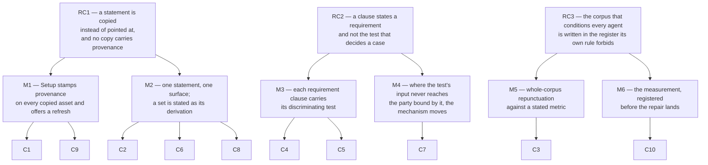

# Spec: the style rules every agent loads are the ones fusion ships, and their effect is measured

**Date:** 2026-08-20
**Status:** Draft
**Source:** In-Circle clarification dispatched by the orchestrator against the Directive of
`circles/260820-2051-style-rules-arrive-and-get-measured`, with sixteen open defect records and one
answered decision named as the material.
**Measured at:** HEAD `a5b73da`, 2026-08-20. Every figure below was produced during this shaping run
and is reproducible by the commands named beside it.

## Directive

After this Circle, a change to a stylometric profile in the plugin's source reaches a project that
was set up before the change, because Setup notices that the project's copy is stale and offers to
replace it. The always-on rule corpus sits at or under the em-dash ceiling it states, measured by a
rule that does not count a file's own anti-examples as instances of the fault. The rule that owns
the fact-first requirement states the condition under which an opening sentence fails, so a writer
can apply it. And
`shared/decisions/260816-0740_*_does-the-prose-register-get-a-measurable-gate-and-which-surface-does-it-measure.md`
carries a number produced by a protocol registered before the repair landed.

## Three causes, and the mechanism for each

The seventeen records are not seventeen faults. They are seventeen appearances of three.



**RC1. A statement is copied instead of pointed at, and no copy carries a provenance that would
make its staleness decidable.** Six records are this. The four stylometric profiles are copied into
every workbench and never compared again. The two line caps are restated in the profiles and drift
from the rule that owns them. The always-on file set is restated as a list in three live records and
is wrong in all three. The reference "the long-form writing profile" resolves only through a third
file. The prose-agent enumeration is written by hand in each prose prompt and is missing from one.

**RC2. A clause states a requirement and not the test that decides a case, so the clause is
interpreted rather than applied.** Five records are this. The fact-first requirement has no test.
Correctio has no test. The foreclosure clause does not say what it costs, and the field it steers
writers towards has no cap. And one obligation is not merely untested but undecidable by the party
it binds: an agent is told to record a voice-profile fallback it has no way to detect.

**RC3. The corpus that conditions every agent is written in the register its own rule forbids, and
the one repair pass so far reproduced the fault it was repairing.** Three records are this: the
corpus rate itself, and the two mark-choice defects the first pass introduced.

## The metric, stated before anything is measured against it

Two of this Circle's four outcomes are numbers, so the counting rule is a capability and not an
implementation detail. Today's rule is the shell line in the analysis's Sources block, `grep -o '—'`
over a whole file. It counts a file's exhibits of the fault as instances of the fault, and that is
not a rounding error. Under it, `rules/user-facing-output.md` reads 6 em-dashes at 2.1 per 1000 and
therefore fails its own ceiling. Five of those 6 are the four quoted anti-examples the file displays
as faults and the two code-span mentions of the character in the clause that states the ceiling. The
file has **one** em-dash in its own voice.

The project has already met this exact problem and settled it once, on a different subject. Twenty-six
citations read as broken because a record quoting somebody else's bad citation became a violation
itself, and the answer was to exempt fenced content, defined in `fencedContentLines()` in
`hooks/lib/__tests__/helpers/citation-scan.ts` against CommonMark
(`circles/260819-1645-four-constraints-on-deep-change/issues/260820-0530_*_twenty-six-citations-in-the-corpus-are-statements-rather-than-pointers-and-no-exemption-expresses-that.md`).
The same exemption is the right one here, and reusing its definition costs nothing.

**The metric this Circle uses, and the number it must state.** A *prose em-dash* is an em-dash that
is not inside a fenced code block, not inside an inline code span, not on a block-quote line, and,
in a YAML profile, not inside an example or anti-example value. Word counts exclude the same
regions. Measured at HEAD `a5b73da` over the six files `bin/fusion-rules coder` actually emits:

```
rules/agent-setup.md                            15 prose em-dash    502 prose words   29.9 /1000
rules/fusion-workbench-conventions.md          114                7753                14.7
rules/decision-record-examples.md               10                 341                29.3
rules/user-facing-output.md                      1                2248                 0.4
rules/critical-stance.md                        29                1557                18.6
fusion-workbench/stilwerk/chat-voice-de.yaml      2 (of 6 raw)      882                 2.3
---------------------------------------------------------------------------------------------
always-on total                                171               13283                12.9
permitted at 1 per 1000                         13
```

Raw counts over the same files total 210. The difference of 39 is the exhibits.

## Capabilities

### C1: Setup notices a copied asset that has gone stale, and offers to replace it

**Description:** A project sets up once and keeps its copies of fusion's stylometric profiles so it
can adapt its own voice. Today nothing ever looks at those copies again, so an improvement made in
fusion's source never reaches that project. After this capability, Setup compares each asset it
copies into the workbench against the version the installed plugin ships and tells the user what it
found, in one of five states. It only ever offers; it never replaces a file the project has edited.

**The decidability question, and why a byte comparison alone cannot answer it.** "Is this copy stale
or has the project adapted it" is not decidable from the two files in front of Setup. A difference
is one bit and the two causes produce the same bit. It becomes decidable the moment a third input
exists: the checksum of what was copied, recorded at the moment of copying. With that record the
five cases are disjoint and complete, and each is decided by comparisons Setup can actually perform.

| Case | What holds | What Setup does |
|---|---|---|
| 0 | No provenance recorded for this asset | Report the difference, say that fusion cannot tell an adaptation from a stale copy for this file, and offer a replace with an explicit warning. Never replace silently. |
| 1 | Project copy equals shipped copy | Nothing. Say nothing. |
| 2 | Project copy equals its recorded provenance, shipped copy differs | Stale and unedited. Offer to replace; this is the case the whole capability exists for. |
| 3 | Project copy differs from its provenance, shipped copy equals the provenance | Locally adapted, fusion has not moved. Leave it alone and say nothing. |
| 4 | Project copy differs from its provenance and the shipped copy differs too | Both moved. Report the conflict, name both, and leave the file alone. |

Case 0 is the migration path and every existing workbench is in it on the first run after this
lands, including this repository's own.

**Acceptance criteria:**
- [ ] Running Setup on a project whose copy of a profile is byte-identical to what it was given, when
      the plugin now ships a different version, produces a message naming that file and offering to
      replace it, and replaces it only if the user says yes.
- [ ] Running Setup on a project that has edited its own copy, where the plugin has not changed that
      file, produces no message about it and does not touch it.
- [ ] Running Setup on a project where both copies moved produces a message that names the conflict
      and does not offer a one-click replace.
- [ ] Running Setup twice in a row, with no change in between, produces the same output the second
      time, and the second run changes no file.
- [ ] The capability covers every asset Setup copies into the workbench, not the four profiles alone.
      At HEAD that set is the four profiles and `monitor`. `monitor` is already re-copied
      unconditionally on every Setup, so it needs no offer; the mechanism must not break that.
- [ ] A workbench with no provenance record still completes Setup, is told which files differ, and is
      told plainly that fusion cannot classify them.
- [ ] After this Circle's own profile revisions land, this repository's workbench copies match the
      work tree, and the match was produced by the mechanism rather than by hand.

**Decisions made:**
- Location: the project keeps its own copy, so a project can adapt its voice. Options 2, 3 and 4 of
  the user's draft are not pursued (Circle record, user decision 3).
- A work-tree preference for `stilwerk/` is not the route, because it would require answering part
  (c) of `shared/decisions/260810-1544_*_should-prompt-called-bin-helpers-get-one-guarded-call-convention-and-does-the-work-tree-preference-extend-to-them.md`,
  which is deliberately unanswered (Circle record, user decision 3).
- Scope is every copied asset, not the profiles alone (Circle record, user decision 4).
- A refresh is offered, never performed without an answer. `skills/setup/SKILL.md` states the
  guarded-copy intent explicitly and it must not be silently inverted.

**Open for planner:** where the provenance record lives, what form the checksum takes, and whether
the comparison is a Setup step or a `bin/` helper Setup calls. Note one measured constraint that
bears on the last of these: a new hook test file is not affordable (see `## Constraints`).

### C2: The stylometric profiles stop restating what the rule owns

**Description:** Two always-on surfaces state the line caps and they disagree. The rule says 8 lines
for a gate prompt and 12 for a chat reply; the shipped profiles say 6 and 8; the copies every agent
in this repository actually loads say 8 and 12. After this capability there is one number on one
surface. The profiles cite `rules/user-facing-output.md` `## Length` and state no number.

**Acceptance criteria:**
- [ ] Neither chat profile contains a line count for a gate prompt or a chat reply. Each cites the
      rule section that owns them.
- [ ] The German and English chat profiles say the same thing. The German file regains the two
      clauses it dropped ("or to a file", "not the opening lines") and loses the one it added with no
      English counterpart ("Klare Formulierungen, kein Jargon"), which duplicates the rule's own
      `## Vocabulary` and readability-gate point 4.
- [ ] No line in any of the four profiles ends with whitespace.
- [ ] The four profiles in the plugin source, the installed copy and this repository's workbench are
      identical after the Circle closes, and the last of the three was brought into line by C1.

**Decisions made:**
- The caps stay at 8 and 12, the rule's numbers (Circle record, user decision 5).

### C3: The always-on corpus meets its own ceiling

**Description:** Every agent reads six files at every dispatch, and their prose carries 171 em-dashes
where the rule inside them permits 13. This capability repunctuates all six to the ceiling. It
changes no wording. The replacement marks are the four the rule itself prescribes: a comma, a colon,
parentheses, or two sentences.

**The pass is held to the blacklist it is enforcing.** The first pass took one file from 38 to 6 and
introduced two new faults in doing it. Those are C3's acceptance criteria, not a separate task.

**Acceptance criteria:**
- [ ] The six emitted files carry at most 13 prose em-dashes in total, measured by the metric in
      `## The metric` above, and the per-file counts are reported.
- [ ] No em-dash inside a quoted anti-example, a code span, a fenced block or an ASCII sketch was
      touched. The file's exhibits of a fault stay as they are.
- [ ] No word changed anywhere in the pass. The evidence is a token-stream comparison, reported with
      the tokenisation that produced the number, so a later reader can re-derive it.
- [ ] No replacement sentence opens with a bare demonstrative or pronoun carrying a whole preceding
      clause. The three sites the first pass created in `rules/user-facing-output.md` are re-marked
      as its own record proposes: a colon at the two clearest sites and a comma at the third.
- [ ] No replacement weakens the force of the clause it replaces. The two sites the first pass
      weakened are re-marked as their record proposes: a colon where an appositive defined a closed
      set, parentheses where a mark separated an exemplar from its commentary.
- [ ] No em-dash is restored anywhere.
- [ ] The always-on growth bound is green, and the pass's byte effect on it is reported.

**Decisions made:**
- Scope is the whole always-on corpus plus the four stylometric profiles, not the narrow first-pass
  scope (Circle record, user decision 2).
- `CLAUDE.md` is **not** in the corpus and is not repunctuated here. `bin/fusion-rules` does not emit
  it, verified by running `bin/fusion-rules coder`. Whether it should be repaired for its own sake is
  a separate question and this Circle does not answer it.
- `rules/design-diagrams.md`, `rules/circle-records.md` and `rules/commit-lock.md` are conditional
  emissions reaching a derived audience, and are out of this capability's scope for the same reason.

### C4: The rule states when an opening sentence fails

**Description:** The rule requires the opening line to carry the finding. It gives no test, so it is
interpreted. The two samples that started this Circle both state a judgement or an image where a
number was available. After this capability a writer can decide the case from what they hold.

**The decidability question.** "Does this opening sentence carry the finding" cannot be decided
mechanically, and this capability does not try. It is a writer-applied test in the shape
recommendation 3 of the analysis specifies for correctio, and the writer holds the input it needs:
the writer knows which facts were available. The test is decidable by the only party asked to apply
it. Nothing here proposes a gate, and nothing here may propose one; see `## Constraints`.

**Acceptance criteria:**
- [ ] `rules/user-facing-output.md` states, in one sentence, the condition under which an opening
      sentence fails: the fact it stands in for was available to the writer and the sentence names
      the significance of that fact instead of the fact.
- [ ] The clause is demonstrated with a before and after drawn from the two reported samples, in the
      same `Not X, Y` form the neighbouring clauses use. The pattern is the one
      `shared/issues/260818-1452_c_gate-options-name-the-category-of-what-is-being-decided-instead-of-stating-its-content.md`
      established when it closed on 260818.
- [ ] The clause states that the factual form is usually no longer than the form it replaces, so it
      cannot be read as licence against `## Length`.
- [ ] The same file gains the correctio test from recommendation 3 of the analysis, in one sentence:
      naming the rejected term earns its place when the reader would otherwise have assumed it.
- [ ] The always-on growth bound is green after both clauses land, and the byte cost is reported
      against the measured head-room.

### C5: The gate clauses state their cost and cap the field they steer writers towards

**Description:** The foreclosure clause tells a writer to state what each option rules out and does
not say whether that takes a line. Six lines below, the gate cap of 8 lines forbids being relaxed. A
four-option chat-text gate is either compliant or nine lines, and nothing on either surface says
which. Separately, the branch the clause prefers writes mandatory content into the `AskUserQuestion`
`description` field, which no cap governs, while the fallback branch writes into a field that has one.

**Acceptance criteria:**
- [ ] `rules/user-facing-output.md` states whether a foreclosure occupies its own line, in words that
      admit one reading.
- [ ] The arithmetic of the worst case the clause permits is stated and is consistent with the caps
      in `## Length`. No cap is relaxed to make it work.
- [ ] `## Length` carries a cap for the `AskUserQuestion` `description` field.
- [ ] The always-on growth bound is green.

**User decisions pending:** which reading, and which number. Both are in `## User Decisions Pending`
below. The record that filed this says the same: the numbers are a judgement no evidence tier
reaches.

### C6: A live record states the corpus as its derivation, not as a list

**Description:** Three live records name the always-on file set and all three are wrong. The one that
motivates the whole repair lists `rules/design-diagrams.md`, a conditional emission, and omits the
chat profile, which every agent loads. The answered decision carries the same wrong denominator into
the reasoning that will be re-opened with it. And a third claim, added on 260819 and repeated in this
Circle's own Grounding, says `rules/workbench-tracking.md` was added to the emitted set. It was not.

**This third one is a defect I found during shaping and filed separately.** `bin/fusion-rules`
contains no reference to `workbench-tracking` and `bin/fusion-rules coder` does not emit it, verified
at HEAD `a5b73da`. The commit that created that file, `b200902`, moved text **out** of the conventions
file and says so in its own message: the always-on set fell by 3 416 bytes. The claim is not merely
wrong, it is inverted, and it makes the pending measurement's dose look weaker than it is. Filed as
`circles/260820-2051-style-rules-arrive-and-get-measured/issues/260820-2249_o_the-always-on-corpus-is-said-to-have-grown-by-a-file-that-is-emitted-to-no-agent.md`.

**Acceptance criteria:**
- [ ] Each live record that names the always-on set states it as its derivation: the unindented
      `emit_if_exists` calls in `bin/fusion-rules`, plus the unconditional `emit_voice_profile` call
      for the chat profile. No record carries a hand-written list that a later emission change makes
      stale.
- [ ] The wrong `workbench-tracking` claim is corrected wherever it stands live, which at HEAD is the
      decision record's 260819 reconciliation and this Circle's own Grounding snapshot.
- [ ] The unreproducible token count in the progress note on
      `shared/issues/260816-0740_o_the-always-on-rule-corpus-runs-at-sixteen-times-the-em-dash-ceiling-it-states.md`
      is corrected: the identity is stated without a total, or with the tokenisation that produces
      one, and the capitalisation claim is stated in the direction the evidence shows, which is ten
      tokens gaining a capital and none losing one.
- [ ] The 260814 claim that a forced copy would not help, because `$FUSION_PLUGIN_ROOT` points at an
      older tarball, is annotated as expired rather than repeated. Verified today: all four installed
      profiles are byte-identical with the work tree, so a copy from the installed plugin resolves the
      divergence now.
- [ ] `shared/analyses/260816-0740-rhetorical-register-of-agent-output.md` is **not** edited. It is a
      completed report.
- [ ] `shared/history/260816-1251-curator-run.md` is **not** rewritten. The correction to the cap it
      names is an appended note.

### C7: The voice-profile fallback becomes visible to the agent that is told to record it

**Description:** `rules/fusion-workbench-conventions.md` requires an agent whose voice profile is
missing to fall back to the English variant and write one line in its history saying so. The agent
cannot do either half. `bin/fusion-rules` performs the fallback itself and prints a bare path, so an
agent handed `chat-voice-en.yaml` cannot tell a fallback from a project that declared English.

**The decidability question, and why the answer is to move the mechanism.** The obligation is
undecidable from the inputs the agent has. There is no channel on which the signal could arrive, so
no wording of the rule makes it obeyable. `rules/critical-stance.md` §4 says what follows: the
mechanism changes, not the approximation. The helper says what it did.

**Acceptance criteria:**
- [ ] When `bin/fusion-rules` resolves a voice profile by falling back to the English variant, it says
      so on a channel the agent can read, naming both the requested variant and the resolved one.
- [ ] Standard output is unchanged, byte for byte, in every case including the fallback. The emission
      contract and the golden fixture both depend on it.
- [ ] An agent that receives the English profile because the project declared English sees no such
      message.
- [ ] The hook-test surface grows by fewer than 40 lines. See `## Constraints`.

**Alternative if the head-room is not there:** the other route is to drop the history-line
requirement, and that is a constraint removal that needs its own decision rather than a patch. This
capability is the cheaper of the two and is why it is here.

### C8: The curator prompt enumerates its long-form outputs

**Description:** `rules/user-facing-output.md` states that each long-form-prose agent's prompt
enumerates which of its outputs the writing profile governs. Eight of the nine do. `agents/curator.md`
does not, and it receives the writing profile all the same.

**Acceptance criteria:**
- [ ] `agents/curator.md` `## Output Style` carries the `Long-form prose vs short-form` enumeration in
      the shape the other eight carry, naming the run file's prose sections and the decision records
      it files as long-form, and the gate prompt, survey report and chat summary as short-form.
- [ ] `rules/user-facing-output.md` is not weakened to say "most" prose agents.
- [ ] The `agents/` growth bound is green afterwards, and the byte cost is reported against a
      head-room that is measured at **2 259 bytes** today. See `## Constraints`.

### C9: The writing profiles carry the handle their siblings point at

**Description:** Each chat profile refers to its sibling as "the long-form writing profile". Neither
writing profile contains that phrase or declares a `scope:` key, while both chat profiles do. The
reference resolves only through one sentence in `rules/agent-setup.md`.

**Acceptance criteria:**
- [ ] Each writing profile names its own role in text, so a plain search for the phrase the chat
      profile uses finds it.
- [ ] Whatever is added is language-neutral, so the coupling that an earlier change deliberately
      removed is not reintroduced.
- [ ] Any change reaches projects that were set up before it, through C1.

**User decisions pending:** whether the `scope: long-form` key is added. It is a schema change to a
file every consuming project holds a copy of. See `## User Decisions Pending`.

### C10: The measurement runs under a protocol registered before the repair lands

**Description:** The answered decision chose option 4: fix the corpus, measure the output, re-open
with a number. The measurement has never run. This capability runs it, and the protocol is written
and fixed before C3 lands, so the baseline cannot be chosen after the result is known.

**The decidability question, and it is the sharpest one in this spec.** The question as
recommendation 4 poses it is *did the output rate fall because the corpus rate fell*. That is not
decidable from the inputs available. There is one project, no control group, no randomisation, a
sample of a few history files per window, and at least four confounds that cannot be removed:
different sessions do different work; the model version moves; a session run in the knowledge that
it is being measured is not a session run otherwise; and the agents writing the post-repair files
also read this Circle's own planning documents, which are not part of the corpus and are not
governed by it. Approximating a causal answer here is exactly the move `rules/critical-stance.md` §4
forbids, and this project has deleted a mechanism for making it once already.

**So the mechanism changes.** What is decidable is a rate: the prose em-dash density of a named set
of output files, measured with a stated command, over two windows fixed in advance. The capability
produces that number and states, in the same breath, that it is an observation and not a controlled
result. The Directive asks for a measured number in the place of an untested inference, and this
delivers exactly that without pretending to more.

Three cheap strengthenings, each decidable:
1. The protocol is written and committed **before** C3 lands, naming the file set, the command, the
   exclusions, both window boundaries, and the threshold at which the prediction counts as met.
2. The post-repair window excludes this Circle's own history files. A session whose subject is
   em-dashes has a primed writer, and which Circle a session belongs to is recorded.
3. This spec, the plan written from it, and the Circle's own records are written at or under the
   ceiling, so the post-repair window's writers are not reading pre-repair register in their own
   working documents.

**Acceptance criteria:**
- [ ] A protocol document exists, committed before the C3 repair commit, naming the output file set,
      the counting command, the exclusion rules from `## The metric`, both window boundaries, the
      minimum number of files a window needs to be usable, and the threshold for the predicted fall.
- [ ] The measurement runs against both windows and reports per-file rates, not only a total, so one
      outlier is visible.
- [ ] `shared/decisions/260816-0740_*_does-the-prose-register-get-a-measurable-gate-and-which-surface-does-it-measure.md`
      carries the resulting number and the protocol's path.
- [ ] The record states in its own text that the number is an observation of a rate and not a
      controlled test of the causal claim, and names the confounds it does not remove.
- [ ] The record's marker moves according to a scheme fixed in advance, covering three outcomes and
      no others: the prediction is met on a usable sample; the prediction is not met on a usable
      sample; the sample is not usable under the protocol. Which marker each outcome earns is in
      `## User Decisions Pending`.
- [ ] No gate is built. See `## Constraints`.

## Constraints

**Four growth budgets bind this Circle, and one of them is nearly spent.** Measured today at HEAD
`a5b73da` by summing the tree against each test's own baseline map.

| Surface | Today | Budget | Head-room left | What this Circle spends it on |
|---|---|---|---|---|
| always-on rule bytes | 92 869 | 98 573 | **5 704** | C4 clauses, C6; C3 gives some back |
| `agents/` bytes | 415 584 | 417 843 | **2 259** | C8, about 800 bytes |
| `skills/` bytes | 231 892 | 240 439 | **8 547** | C1, the Setup comparison step |
| hook test lines | 20 259 | 20 375 | **116** | C7 only, and only just |

Three things follow and each is binding.

**No capability in this spec may add a hook test file.** The surface has 116 lines left. The smallest
existing test file is 51 lines and the median is around 400. This kills option 2 of
`shared/issues/260814-1419_*_the-shipped-chat-voice-profiles-changed-and-the-workbench-copies-agents-actually-load-did-not.md`,
a divergence check implemented as a test, and it is one of two independent reasons C1 is a Setup step
instead. The other is that a test would fail in this repository on a divergence a consuming project
is entitled to have.

**`agents/` at 2 259 bytes is tighter than this Circle was told.** The Grounding of the concurrent
Circle `circles/260819-1645-four-constraints-on-deep-change` measures roughly 3 300. The difference
is growth since that measurement, and `agents/orchestrator.md` carries 10 948 of the 15 741 already
spent. Both Circles draw on this one budget. C8 costs about 800 bytes, taken from a sibling prompt of
the same shape.

**A repunctuation gives head-room back rather than spending it, and not much of it.** An em-dash is
three bytes and a comma is one, so removing 158 of them returns roughly 500 bytes to the always-on
budget. The single clause that closed the 260818 gate-options defect cost 750. C4 and C6 together will
cost more than C3 returns, and 5 704 bytes is comfortable for that.

**A red bound is cleared by a cut and never by editing a baseline.** The rule is authored in
`hooks/lib/__tests__/helpers/growth-bound.ts` and a baseline moves at two written-down moments only.

**No prose gate may be built in this Circle.** The answered decision makes the measurement a
precondition for that question. Building a gate now answers it ahead of the evidence the user's own
choice made binding. This applies to every capability above, and C4 in particular is a writer-applied
test and not a check.

**Existing artifacts are not rewritten.** `rules/fusion-workbench-conventions.md` `## Project
language` settles the analogous case. Session histories, reviews, closed records and completed
analyses keep the register they were written in, and a correction to one of them is an appended note.

**The corpus repair precedes the measurement, and the protocol precedes the repair.** A measurement
taken against a partly repaired corpus reproduces the weak-dose problem the answered decision warns
about, and a protocol written after the repair cannot be trusted to have fixed its own baseline.

**Two write locations until C1 exists.** The profiles are revised in `stilwerk/` or the work does not
survive the next release, and this repository's workbench copy is refreshed or the revision has no
effect here. Sequence C1 early enough that the second write is the mechanism's own output.

## Out of Scope

- **Any test or gate that measures a prose property.** Not authorised until C10 has run.
- **`shared/issues/260812-0253_o_rules-lose-their-effect-during-a-long-dispatch.md`.** Its stated
  cause was refuted by measurement on 260817: within-document em-dash compliance improves toward the
  end of a document, which is the opposite of decay with context depth. Its remaining remedy, attaching
  a rule to the act it governs, is gated on decision `260810-0710`, which is deferred. It is a
  dispatch-architecture question, not a style-rule question.
- **The second half of
  `shared/issues/260812-0253_o_agents-answer-a-question-the-user-did-not-ask-and-the-length-caps-do-not-hold.md`.**
  See `## User Decisions Pending` question 5.
- **`CLAUDE.md`'s own em-dash rate.** It is not emitted by `bin/fusion-rules` and is not part of the
  corpus this Circle repairs.
- **The conditional rule files** `design-diagrams.md`, `circle-records.md` and `commit-lock.md`.
- **A work-tree preference for `stilwerk/`.** Ruled out by user decision 3 and blocked on an
  unanswered decision.
- **Rewriting the analysis, the curator run file, or any closed record.**
- **The self-praise gap** the analysis names as an open question: praise by a dispatching agent for
  work it dispatched falls between the chat profile's AI11 and `critical-stance.md` §1 and is caught
  by neither. Worth a record; not shaped here.

## Open for Planner

- Where the provenance record for a copied asset lives, and in what form. Candidates the planner
  should weigh rather than assume: the existing `.fusion-setup` marker JSON, a sibling file, or a
  per-asset stamp. The constraint is that it must survive an archive pass and must not be mistaken
  for a live artifact.
- Whether C1's comparison is inline in `skills/setup/SKILL.md` or a `bin/` helper the skill calls.
  The `skills/` budget has 8 547 bytes; a helper costs less there and more elsewhere.
- The channel C7 uses to report a fallback. Standard output is not available; the acceptance criteria
  fix the requirement and leave the channel open.
- Executor mix. The four profiles are YAML and belong to `ontocoder`. `bin/fusion-rules`,
  `skills/setup/SKILL.md` and any helper belong to `coder`. Rule prose is `curator` where a clause is
  reworded and `coder` where it is repunctuated. C10 is `analyst`. The `**Executors:**` line is the
  planner's.
- Step order. Two orderings are forced by `## Constraints`: C10's protocol before C3, and C1 before
  the profile revisions are expected to take effect in this repository.
- Whether C3 runs as one commit or one per file. The first pass's own evidence discipline, a token
  stream compared before and after, argues for per-file.

## Record coverage

Seventeen records were named in the dispatch. Twelve are resolved by the capabilities above, two are
resolved in part, one is already closed and read for its pattern, one is deliberately left open, and
one is the decision that this Circle advances rather than closes.

| Record | Cause | Resolved by | Note |
|---|---|---|---|
| `shared/issues/260816-0740_o_the-always-on-rule-corpus-runs-at-sixteen-times-the-em-dash-ceiling-it-states.md` | RC3 | C3, C6 | Closes when the corpus is at the ceiling under the stated metric and the table's membership is a derivation. |
| `shared/issues/260816-1330_o_the-repunctuation-replaced-three-em-dashes-with-three-vague-pronoun-openers-the-same-blacklist-bans.md` | RC3 | C3 | Its own proposed marks are the acceptance criterion. |
| `shared/issues/260816-1330_o_two-of-the-twenty-nine-replacements-chose-a-mark-weaker-than-the-clause-it-replaced.md` | RC3 | C3 | Same. |
| `shared/issues/260816-1330_o_the-repunctuations-evidence-paragraph-carries-a-token-count-nobody-can-reproduce-and-an-inverted-capitalisation-claim.md` | RC1 | C6 | The progress note is corrected; the commit message stands. |
| `shared/issues/260816-1345_o_the-register-defects-corpus-table-is-labelled-always-on-and-is-not-the-always-on-set.md` | RC1 | C6 | Plus the inverted `workbench-tracking` claim found today. |
| `shared/issues/260814-1419_o_the-shipped-chat-voice-profiles-changed-and-the-workbench-copies-agents-actually-load-did-not.md` | RC1 | C1, C2 | Its option 2 as a test is not affordable; C1 is the same mechanism as a Setup step. |
| `shared/issues/260807-2154_*_corrected-sibling-wording-never-reaches-an-existing-consumer.md` | RC1 | C1 | Its candidate 1 is a narrower version of what C1 does generally. |
| `shared/issues/260814-1419_*_the-tightened-chat-profile-caps-contradict-the-length-section-of-the-rule-that-owns-them.md` | RC1 | C2 | All three parts: the number, the de/en divergence, the trailing space. |
| `shared/issues/260816-1330_o_the-override-record-names-the-shipped-chat-profiles-cap-and-the-copy-every-agent-loads-says-otherwise.md` | RC1 | C6 | Appended note on the run file, not a rewrite. |
| `shared/issues/260807-2154_o_the-writing-profile-carries-no-handle-for-the-reference-that-now-points-at-it.md` | RC1 | C9 | Its item 2 lands unconditionally; item 1 is question 3 below. |
| `circles/260801-1244-curator/issues/260814-1332_o_the-curator-prompt-is-the-one-prose-agent-that-does-not-enumerate-its-long-form-outputs.md` | RC1 | C8 | About 800 bytes against 2 259 of head-room. |
| `circles/260801-1244-curator/issues/260814-1332_o_the-voice-profile-fallback-is-performed-by-the-helper-so-the-agent-cannot-record-it.md` | RC2 | C7 | A §4 case: the mechanism moves, not the wording. Subject to question 6. |
| `shared/issues/260816-1330_o_the-foreclosure-clause-does-not-say-whether-it-costs-a-line-per-option-and-the-cap-two-sections-below-forbids-relaxing.md` | RC2 | C5, **in part** | The ambiguity is removable now; the two numbers are question 2. |
| `shared/issues/260812-0253_o_agents-answer-a-question-the-user-did-not-ask-and-the-length-caps-do-not-hold.md` | RC2 | C4, **in part** | C4 closes the opener half. The record's structural half, that the rule prescribes relocation and states no total budget, is question 5. |
| `shared/issues/260818-1452_c_gate-options-name-the-category-of-what-is-being-decided-instead-of-stating-its-content.md` | RC2 | **already closed** | Read for its pattern. Its resolution is the template C4 and C5 follow: a clause plus a demonstrated before and after, with the cost reported against the head-room. Not reopened. |
| `shared/issues/260812-0253_o_rules-lose-their-effect-during-a-long-dispatch.md` | none of the three | **left open** | Cause refuted by measurement; remedy gated on a deferred decision. Out of scope, stated above. |
| `shared/decisions/260816-0740_a_does-the-prose-register-get-a-measurable-gate-and-which-surface-does-it-measure.md` | RC3 | C10 | Advanced, not necessarily closed. Its marker follows the three-outcome scheme in question 4. |

One record is added by this spec:
`circles/260820-2051-style-rules-arrive-and-get-measured/issues/260820-2249_o_the-always-on-corpus-is-said-to-have-grown-by-a-file-that-is-emitted-to-no-agent.md`,
resolved by C6.

## User Decisions Pending

Six questions. The shaper had no channel to ask them and the user is away, so each is labelled with
whether the records already answer it. Five that the records **do** answer are listed under
`## Answered from the records` and are not repeated here.

1. **The ceiling target: corpus-level or per-file?** The rule says one em-dash per 1000 words. Over
   the corpus that permits 13. Per file it permits 0 in `rules/agent-setup.md`, which is 502 words.
   *Recommendation: corpus-level, with per-file rates reported.* A per-file reading makes the target
   depend on file boundaries that exist for other reasons, and the Directive says "the always-on rule
   corpus sits at or under the ceiling".

2. **What a foreclosure costs, and what caps the `description` field.** Three readings and a number.
   (a) The foreclosure appends to the option's own line, so it costs nothing and the 8-line gate cap
   stands. (b) It takes its own line, so a four-option chat-text gate needs 9 and something must give.
   (c) Chat-text gates carry at most three options. *Recommendation: (a) for chat-text gates, plus an
   explicit cap of 2 lines on the `AskUserQuestion` `description` field.* Note the evidence: the run
   file records that the user was shown a cost of "roughly one line per option" before approving, so
   reading (b) is what the approval was given against. That makes this a genuine preference and not a
   settled question, and it is why the record itself says a number needs the same gate.

3. **Does `scope: long-form` go into the two writing profiles?** It is a schema change to a file every
   consuming project holds. *Recommendation: yes, together with the text handle.* The objection that
   held it back was that a schema change cannot reach an existing project. C1 removes exactly that
   objection, and this Circle is the one place where the two land together.

4. **The measurement's threshold and the record's three outcomes.** The protocol must fix, in advance,
   what counts as the predicted fall and what marker each outcome earns. *Recommendation:* the fall
   counts as met when the post-repair rate sits below the spread already present among the pre-repair
   files, which needs no arbitrary constant. Markers: prediction met on a usable sample, the record
   moves to implemented; prediction not met on a usable sample, the record is superseded by a new open
   decision carrying the gate question with the number in it; sample not usable, the record stays
   answered, gains the number and the reason, and the protocol states what a usable window needs.

5. **Does this Circle take the remaining half of the verbosity record?** That record's reconciliation
   says the structural cause is undisturbed: `rules/user-facing-output.md` prescribes relocating
   material to a Details block rather than deleting it, and states no total budget for a reply. Adding
   one changes what every agent's output looks like across the fleet. *Recommendation: no.* It is a
   separate cut, it is not one of the Directive's four outcomes, and it would land in the same commit
   window as the measurement's baseline, which is precisely the contamination C10 is built to avoid.

6. **Is C7 in?** It closes an obligation no agent can currently obey and it is the only capability
   that touches the hook-test surface, which has 116 lines. *Recommendation: yes.* It needs no new
   test file and the change to standard output is nil, so the golden fixture does not move. If the
   concurrent Circle spends those lines first, C7 drops out and its record stays open with the
   head-room named as the reason.

## Answered from the records

Five questions that look open and are not. Each is answered here with the evidence, so the planner
does not re-ask them.

- **Which files are the always-on corpus?** The five unindented `emit_if_exists` calls in
  `bin/fusion-rules` plus the chat voice profile, which is six files. Verified by running
  `bin/fusion-rules coder` at HEAD `a5b73da`. `rules/workbench-tracking.md` is emitted to no agent;
  `bin/fusion-rules` contains no reference to it.
- **Does the em-dash count include a file's own anti-examples?** No, and the current metric's failure
  to exclude them is why `rules/user-facing-output.md` reads as over its ceiling when its own prose
  carries one em-dash. The project settled the identical question for citations on 260820 and the
  definition is reusable.
- **Would a refresh from the installed plugin actually fix this repository today?** Yes. All four
  installed profiles are byte-identical with the work tree, measured today. The 260814 record's claim
  to the contrary was accurate when written and has expired.
- **Can a divergence check tell a stale copy from a local adaptation?** Not from the two files alone.
  With a provenance checksum recorded at copy time it becomes a five-case split that is disjoint and
  complete, and the fifth case is every workbench that exists today.
- **Is a new hook test file affordable?** No. 116 lines of head-room against a 51-line smallest
  existing file and a median around 400.

---

## Orchestrator corrections and decisions (binding, appended 260820-2314)

The body above is the shaper's and is left unedited, because its reasoning is the evidence for what
follows. Where this section and the body disagree, **this section governs**. It records an assessment
by `analyst` and eight decisions taken by the orchestrator while the user was away.

Assessment: `circles/260820-2051-style-rules-arrive-and-get-measured/analyses/260820-2308-assessment-of-the-style-rules-spec.md`.
Its verdict was that the design is right and no mechanism needs replacing. Every correction below is a
claim, a number or a decision, not a design change.

### The eight decisions

Each is a record in this Circle's decision store, filed **open** so the user can overrule one without
unpicking the others. Stamp `260820-2314`.

| Question | Answer |
|---|---|
| Ceiling per file or per corpus | **Per file**, corpus total reported beside it |
| What a foreclosure costs | **Its own line**, plain-text gates carry at most three options, `description` capped at 2 lines |
| `scope: long-form` key in the writing profiles | **No**, text handle alone, key deferred |
| Measurement threshold and markers | **Below the lowest per-file rate in the pre-repair window**, minimum five usable files per window; a met prediction earns `_i_` only if the record's text carries its unremoved confounds |
| The verbosity record's structural half | **Not taken**, deferred whole rather than half-closed |
| The voice-profile fallback capability | **In scope**; the contention that hedged it is void |
| `CLAUDE.md` in the repaired corpus | **Named in the corrected set statement, prose not repaired here** |
| Can this Circle close coherent | **No. Bounded Closure**, measurement deferred |

### Corrections to the body

1. **C10 does not complete in this Circle.** Its post-repair window has no members: the exclusion of
   this Circle's own history files is correct and leaves nothing, because no other Circle is live.
   Verified: one active record, one bounded, ten closed, one superseded. C10 is reduced to **registering
   the protocol and capturing the pre-repair window**, which is the half that must precede the repair.
2. **The threshold is exact.** Below the lowest per-file rate observed in the pre-repair window,
   minimum five usable files per window. The body's "below the spread already present" admits four
   different tests and is superseded.
3. **The ceiling is per file.** Every per-file rate in the repaired corpus sits at or under one em-dash
   per 1000 prose words. `rules/agent-setup.md` at 502 prose words therefore permits zero.
4. **`CLAUDE.md` enters the set statement and not the repair.** The record that C6 closes asks for the
   stated set to include it, which is satisfied by naming it. Its prose is out of scope here, and the
   registered protocol states that the largest single conditioning file was not repaired.
5. **C1's acceptance criterion 7 is dropped.** It makes `$FUSION_PLUGIN_ROOT` the refresh source, and
   that source goes stale the moment the profile revisions land in the work tree. It is the same expiry
   trap the body correctly identifies elsewhere. The refresh source is the work tree where one is
   detected, and the installed copy otherwise.
6. **C1's five-case split gets a precedence rule and an end state.** The cases are complete and not
   disjoint: case 1 and case 4 overlap whenever both copies moved to the same content. State the
   precedence explicitly, and state what case 0, every workbench that exists today, converges to.
7. **The three cause counts and the verbosity-record assignment are corrected** per the assessment's
   first finding, and the coverage table's "eight of the nine" reads "seven of the eight".
8. **The metric becomes its own capability.** It is load-bearing for two outcomes and no capability
   owned it.
9. **Both contingencies keyed to the concurrent Circle are deleted.** That Circle closed at `5faed26`.
   The `agents/` head-room is 2 259 bytes and uncontested; the hook-test head-room is 116 lines and
   uncontested.
10. **The hook-test budget is a constraint, not a planner's choice.** 116 lines forces the Setup
    comparison inline rather than into a new test file.
11. **A `coderev` pass runs over the corpus repair** before the Circle's reconciliation, on the
    precedent of the first repunctuation pass, which introduced new defects while repairing old ones.
