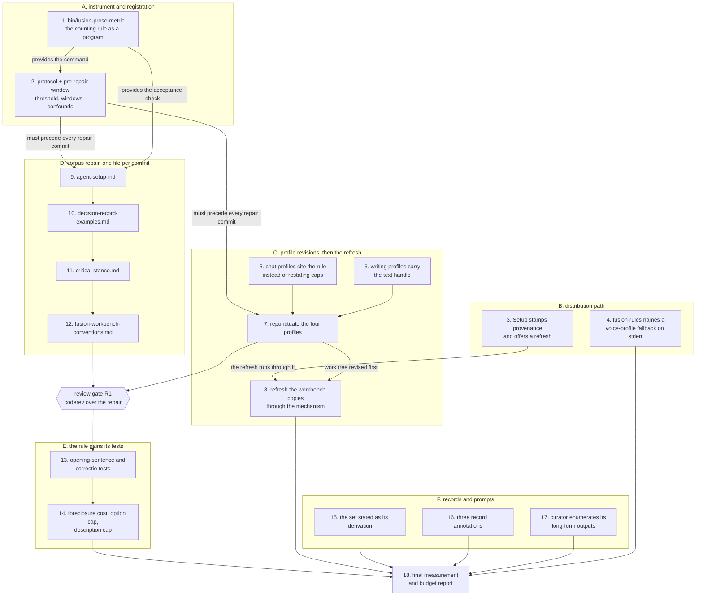

# Implementation Plan: the style rules every agent loads are the ones fusion ships, and their effect is registered for measurement

**Date:** 2026-08-20
**Status:** Draft
**Spec:** `circles/260820-2051-style-rules-arrive-and-get-measured/planning/260820-2249_*_spec-style-rules-arrive-and-get-measured.md`, read with its appended binding section governing wherever it and the body disagree
**Decidability:** Three load-bearing questions, two of them already judged under `rules/critical-stance.md` §4 and one raised by this plan. (1) "Is a project's copy of a shipped asset stale, or has the project adapted it" is not decidable from the two files Setup holds, and becomes decidable from a third input, the checksum recorded at the moment of copying; the mechanism changes accordingly and step 3 builds it. (2) "Did the output register improve because the corpus register improved" is not decidable from the inputs available at all, so the mechanism changes to a pre-registered rate over two fixed windows, and this Circle delivers only the registration half, because the post-repair window has no members while the Circle runs. (3) "How many prose em-dashes does a file carry" is decidable only once prose is separated from exhibits, which no committed program in this repository does today; step 1 makes it decidable by writing the counting rule down as an executable.

## Directive

The Circle's Directive names four outcomes. Three are delivered here: a change to a stylometric profile
in the plugin's source reaches a project that was set up before the change, the always-on rule corpus
sits at or under the em-dash ceiling it states under a metric that does not count a file's own
anti-examples, and the rule that owns the fact-first requirement states the condition under which an
opening sentence fails. The fourth, a measured number on
`shared/decisions/260816-0740_*_does-the-prose-register-get-a-measurable-gate-and-which-surface-does-it-measure.md`,
is delivered in half: the protocol and the pre-repair window are captured before the repair lands, and
the measurement itself is deferred. That reduction is decided in
`circles/260820-2051-style-rules-arrive-and-get-measured/decisions/260820-2314_*_can-this-circle-close-coherent-when-its-fourth-outcome-has-no-measurement-window.md`
and is what makes this Circle end in Bounded Closure.

## Current State

Every figure below was measured while writing this plan, at HEAD `c866d81`, and each reproduces the
spec's number exactly.

**The four growth budgets.** `cat agents/*.md | wc -c` gives 415 584 bytes, the skill bodies sum to
231 892, the hook test tree sums to 20 259 lines, and the five always-on rule files sum to 92 869 bytes.
Against the baselines and head-room each bound declares, that leaves 2 259 bytes on `agents/`, 8 547 on
`skills/`, 116 lines on the hook tests, and 5 704 bytes on the always-on rule corpus. Three of the four
are comfortable for what this plan spends. The hook-test surface is not, and the spec's correction 10
turns that into a constraint rather than a choice: no step adds a hook test file, and the Setup
comparison goes inline into the skill body.

**The corpus.** Six files reach every agent: the five rule files `bin/fusion-rules` emits from
unindented `emit_if_exists` lines, plus the project's chat voice profile. Their prose em-dash rates at
HEAD are 29.9, 14.7, 29.3, 0.4, 18.6 and 2.3 per 1000 prose words. Read per file, which is what
`circles/260820-2051-style-rules-arrive-and-get-measured/decisions/260820-2314_*_is-the-em-dash-ceiling-read-per-file-or-across-the-always-on-corpus.md`
decided, `rules/agent-setup.md` at 502 prose words permits zero and carries fifteen.

**The distribution path.** `emit_voice_profile` in `bin/fusion-rules` reads
`./fusion-workbench/stilwerk/` and nothing else. `/fusion:setup` Step 0d copies each profile only when
it is absent. The shipped and workbench copies of `chat-voice-de.yaml` differ by five bytes today, and
nothing in the tree notices.

**The counting rule.** It exists as a shell line inside a completed analysis and counts a file's
exhibits of the fault as instances of it. No committed program implements the metric the spec defines.

**Three programs bound this plan's shape without being about it.** `derivable-enumerations-lint`
holds `CLAUDE.md`'s `bin/` roster in exact set equality, so a new helper needs a Layout row in the same
commit. `workbench-citation-lint` scans live plans, so every record this plan cites must resolve.
`rules/fusion-workbench-conventions.md` requires a new root-anchored workbench surface to land in the
layout tree and in `rules/workbench-tracking.md` in the same commit as the code that writes it.

## Approach

The work divides into an instrument, a registration, a mechanism, and a repair, in that order. The
instrument comes first because both remaining numbers are produced by it. The registration comes second
because a protocol written after the repair cannot be trusted to have fixed its own baseline. The
distribution mechanism comes third because it is what carries the profile revisions into this
repository's own workbench, which is the only way the revisions take effect here without a release. The
repair comes last, one file per commit, followed by a review pass, because the one precedent for a
repunctuation pass in this project introduced new defects while repairing old ones.

Two orderings are forced and neither may be reordered for convenience. The protocol and the pre-repair
capture precede every repair commit. The refresh mechanism precedes the moment the profile revisions are
expected to take effect in this repository.



The graph has one long chain, the per-file repair, and that is deliberate: each commit's evidence is a
token-stream comparison over one file, and a parallel edit would make the comparison ambiguous. Steps 4,
15, 16 and 17 hang off nothing and can run at any point; they are drawn into the closing measurement
because it reports on the state they leave.

## Implementation Steps

Every step below is one commit. Each states the executor, the files it touches, what changes, its
acceptance criteria, and what it depends on. The "Closes" line names the records the reconciler should
be able to walk to a terminal marker once the step's acceptance holds; the walk itself is Phase 3 work
and no step performs it.

### 1. [DONE] The counting rule becomes a committed program

- **Executor:** coder
- **Files:** `bin/fusion-prose-metric` (new), `CLAUDE.md` (one Layout row)
- **Source:** spec `## The metric`, binding correction 8, assessment finding F6
- **Changes:** A bash and awk helper that takes one or more file paths and prints, per file, the prose
  em-dash count, the prose word count, the rate per 1000, the number permitted at one per 1000, and a
  verdict; then a total line over all inputs. Prose excludes four regions: fenced code blocks, inline
  code spans, block-quote lines, and, in a YAML file, example and anti-example values. Word counts
  exclude the same regions. The header carries the authoritative usage block, the exit-code table, the
  statement that the program reports and never gates, and two explicit decisions: only `—` is counted
  and `–` is not, and `fencedContentLines()` in `hooks/lib/__tests__/helpers/citation-scan.ts` is not
  reused, because it is test-scoped, line-level, and covers one of the four exclusions. The precedent
  for a reporting program that never fails the suite is `bin/fusion-staging-drift` and
  `bin/fusion-review-coverage`, and the header names it.
- **Acceptance:**
  1. `bin/fusion-prose-metric $(bin/fusion-rules coder)` prints six rows and a total.
  2. Its numbers are compared against the spec's `## The metric` table and every deviation is reported
     with its cause. From this step onward the program's output is the authoritative count, and the
     comparison is recorded so a later reader can see where a hand count differed.
  3. `npx vitest run lib/__tests__/derivable-enumerations-lint.test.ts` is green, which proves the
     `CLAUDE.md` row exists and matches the filename.
  4. The four growth bounds are untouched: `bin/` is in none of them, and the `CLAUDE.md` row is in
     none of them either.
  5. Running it on a file with no em-dash prints a zero row rather than failing.
- **Dependencies:** none

### 2. [DONE] The measurement protocol, and the pre-repair window captured before anything is repaired

- **Executor:** analyst
- **Files:** one new analysis document in this Circle's analysis store,
  `YYMMDD-HHMM-prose-register-measurement-protocol.md`
- **Source:** spec C10 as reduced by binding correction 1; the threshold and marker scheme from
  `circles/260820-2051-style-rules-arrive-and-get-measured/decisions/260820-2314_*_what-threshold-does-the-registered-measurement-use-and-which-marker-does-each-outcome-earn.md`
- **Changes:** Write the protocol and run its pre-repair half. The document states, in this order: the
  output file set (session history files under the workbench, by store and by author); the counting
  command, which is step 1's program by name; the exclusion rules; both window boundaries, the
  pre-repair one closed by the commit that lands step 7 and the post-repair one left open with the
  condition that opens it; the exclusion of this Circle's own history files from the post-repair window
  and why; the minimum of five usable files per window and the definition of usable; the threshold,
  which is below the lowest per-file rate observed in the pre-repair window; the three outcomes and the
  marker each earns, including the requirement that a met prediction records its unremoved confounds in
  the record's own text; and the corpus word count at the pre-repair boundary, so the dose is
  attributable later. It then reports the pre-repair per-file table produced by the command.
  Four untreated conditions are named rather than left implicit: `CLAUDE.md` is roughly 41 per cent of
  the always-on prose an agent holds and is not repaired here, `rules/design-diagrams.md` runs at 25.2
  per 1000 and conditions four of the agents most likely to write the post-repair files, steps 13 and 14
  lower the corpus rate by dilution rather than by repair, and the post-repair writers read this
  Circle's own planning documents.
  The document states plainly that the measurement does not run in this Circle and names the record it
  will be reported on.
- **Acceptance:**
  1. The document exists and its commit is an ancestor of the first repair commit, verifiable with
     `git log --oneline`.
  2. The pre-repair table lists at least five usable files with per-file rates, not only a total.
  3. The threshold is a single test that admits one reading.
  4. Nothing in the document proposes or designs a gate.
- **Dependencies:** step 1

### 3. [DONE] Setup stamps what it copies, and offers a refresh when the plugin has moved

- **Executor:** coder
- **Files:** `skills/setup/SKILL.md` (new Step 0e, plus a stamping clause in Step 0d),
  `rules/fusion-workbench-conventions.md` (`## fusion-workbench Layout`, one tree line and one clause),
  `rules/workbench-tracking.md` (the new surface classified as a record), `CLAUDE.md` (the
  `bin/fusion-source-root` row's clause about copied assets)
- **Source:** spec C1 as corrected by binding corrections 5 and 6; the location question is
  `circles/260820-2051-style-rules-arrive-and-get-measured/decisions/260820-2324_*_where-does-the-copied-asset-provenance-record-live.md`
  and the source question is
  `circles/260820-2051-style-rules-arrive-and-get-measured/decisions/260820-2324_*_is-the-work-tree-the-refresh-source-when-setup-runs-in-the-plugins-own-repository.md`
- **Changes:** Step 0d keeps its guarded copy unchanged and gains one clause: when it copies an asset, it
  appends that asset's checksum to `fusion-workbench/.asset-provenance`. A new Step 0e compares every
  asset Setup copies into the workbench against the shipped copy, resolving the shipped root through
  `bin/fusion-source-root` guarded with `[ -x ]` and falling back to `$FUSION_PLUGIN_ROOT`. The five
  cases are evaluated in a stated precedence, which is the fix binding correction 6 requires: test
  `project == shipped` first and report nothing, then branch on whether a provenance line exists, then
  on the three remaining comparisons. Case 0, no provenance recorded, reports the difference, states
  that fusion cannot tell an adaptation from a stale copy for that file, and offers a replace carrying
  that warning. Case 2, stale and unedited, offers the replace this capability exists for. Cases 3 and 4
  are silent and reporting respectively, and neither touches the file. The end state binding correction
  6 also requires is stated: when the user declines an offer, Setup stamps the provenance with the
  **shipped** checksum, which records that this divergence was seen and kept, and re-raises only when
  the plugin moves again. One question covers every differing asset, never one per file, and no question
  is asked when nothing differs. `monitor` keeps its unconditional re-copy and is stamped without ever
  producing an offer.
- **Acceptance:**
  1. In a scratch project whose copy of a profile equals its recorded provenance while the shipped file
     differs, Setup names that file, offers a replace, and replaces only on yes.
  2. In a scratch project that edited its own copy while the shipped file did not move, Setup says
     nothing about it and does not touch it.
  3. In a scratch project where both moved, Setup names the conflict and offers no one-click replace.
  4. Two consecutive Setup runs with no change in between produce the same output and the second changes
     no file.
  5. A workbench with no `.asset-provenance` completes Setup, is told which files differ, and is told
     that fusion cannot classify them.
  6. Declining an offer and re-running Setup produces no second offer for that file.
  7. `npx vitest run` is green, including `path-literal-lint` and `derivable-enumerations-lint`.
  8. The `skills/` bound is green and the byte cost is reported against 8 547.
- **Dependencies:** none. It is independent of the corpus work and can run in parallel with steps 1 and 2.
- **Closes:** `shared/issues/260807-2154_*_corrected-sibling-wording-never-reaches-an-existing-consumer.md`
  and the distribution half of
  `shared/issues/260814-1419_*_the-shipped-chat-voice-profiles-changed-and-the-workbench-copies-agents-actually-load-did-not.md`

### 4. [DONE] The voice-profile fallback becomes visible to the agent told to record it

- **Executor:** coder
- **Files:** `bin/fusion-rules` (`emit_voice_profile`), `hooks/lib/__tests__/rules-voice-profile.test.ts`
  (cases appended to the existing file, no new file)
- **Source:** spec C7;
  `circles/260820-2051-style-rules-arrive-and-get-measured/decisions/260820-2314_*_is-the-voice-profile-fallback-capability-in-scope-given-116-lines-of-hook-test-head-room.md`
- **Changes:** When `emit_voice_profile` resolves a profile by falling back to the English variant, it
  writes one line to standard error naming the family, the requested variant and the resolved one.
  Standard output is untouched in every case. `rules/fusion-workbench-conventions.md` `## Project
  language` already tells the agent to record the fallback; that sentence needs no edit once the signal
  exists, and the issue it cites can then close. The qualification the decision record makes is carried
  into the helper's own comment: standard error makes the event detectable, and whether the agent then
  writes the history line stays an instruction-following obligation.
- **Acceptance:**
  1. A project declaring `de` with no `chat-voice-de.yaml` present gets `chat-voice-en.yaml` on standard
     output and one naming line on standard error.
  2. A project declaring `en` gets the same standard output and nothing on standard error.
  3. `npx vitest run lib/__tests__/rules-emission-golden.test.ts` is green with no fixture regenerated,
     which is what proves standard output did not move.
  4. The hook test tree grows by fewer than 40 lines, verified with `wc -l`, and
     `npx vitest run lib/__tests__/surface-growth-bound.test.ts` is green.
- **Dependencies:** none
- **Closes:** `circles/260801-1244-curator/issues/260814-1332_*_the-voice-profile-fallback-is-performed-by-the-helper-so-the-agent-cannot-record-it.md`

### 5. [DONE] The chat profiles stop restating what the rule owns

- **Executor:** ontocoder
- **Files:** `stilwerk/chat-voice-de.yaml`, `stilwerk/chat-voice-en.yaml`
- **Source:** spec C2; Circle record user decision 5
- **Changes:** Remove every line count for a gate prompt and for a chat reply, and cite
  `rules/user-facing-output.md` `## Length` in their place. Bring the two files back into agreement: the
  German file regains the two clauses it dropped, "or to a file" and "not the opening lines", and loses
  the clause it added with no English counterpart, "Klare Formulierungen, kein Jargon", which duplicates
  the rule's own vocabulary section and readability-gate point 4. Strip trailing whitespace. No
  repunctuation happens in this commit.
- **Acceptance:**
  1. Neither file contains a numeric line cap for a gate prompt or a chat reply, and each cites the rule
     section that owns them.
  2. A clause-by-clause comparison of the two files shows the same content in two languages, reported in
     the commit message or the step's progress note.
  3. `grep -n '[[:space:]]$'` finds nothing in either file.
  4. Both files parse as YAML.
- **Dependencies:** none
- **Closes:** `shared/issues/260814-1419_*_the-tightened-chat-profile-caps-contradict-the-length-section-of-the-rule-that-owns-them.md`

### 6. The writing profiles carry the handle their siblings point at

- **Executor:** ontocoder
- **Files:** `stilwerk/default-voice-de.yaml`, `stilwerk/default-voice-en.yaml`
- **Source:** spec C9;
  `circles/260820-2051-style-rules-arrive-and-get-measured/decisions/260820-2314_*_does-the-scope-key-go-into-the-two-long-form-writing-profiles.md`
- **Changes:** Each writing profile names its own role in text, so that a plain search for the phrase the
  chat profiles use, "the long-form writing profile", finds it. The wording is language-neutral in the
  sense that the German file says the same thing in German and neither file names the other's language.
  No `scope:` key is added, by decision.
- **Acceptance:**
  1. `grep -ril "long-form writing profile" stilwerk/` names all four profiles.
  2. Neither writing profile gains a `scope:` key.
  3. Both files parse as YAML.
- **Dependencies:** none
- **Closes:** item 2 of `shared/issues/260807-2154_*_the-writing-profile-carries-no-handle-for-the-reference-that-now-points-at-it.md`; item 1 stays open under the decision above.

### 7. [DONE] The four profiles are repunctuated

- **Executor:** ontocoder
- **Files:** the four files under `stilwerk/`
- **Source:** spec C3, whose scope is the always-on corpus plus the four stylometric profiles per Circle
  record user decision 2
- **Changes:** Replace prose em-dashes with the four marks the rule itself prescribes: a comma, a colon,
  parentheses, or two sentences. Change no word. An em-dash inside an example or anti-example value
  stays exactly as it is, because those are the profile's exhibits of the fault.
- **Acceptance:**
  1. `bin/fusion-prose-metric stilwerk/*.yaml` reports every file at or under one prose em-dash per 1000
     prose words, and the per-file rows are recorded.
  2. A token-stream comparison of each file before and after shows no word changed, reported with the
     tokenisation that produced it.
  3. No replacement sentence opens with a bare demonstrative or pronoun standing for a whole preceding
     clause.
  4. Both languages still say the same thing.
- **Dependencies:** steps 1, 2, 5 and 6
- **Closes:** the profile share of `shared/issues/260816-0740_*_the-always-on-rule-corpus-runs-at-sixteen-times-the-em-dash-ceiling-it-states.md`

### 8. [DONE] The workbench copies are refreshed by the mechanism, not by hand

- **Executor:** coder
- **Files:** `fusion-workbench/stilwerk/*.yaml` and `fusion-workbench/.asset-provenance`, both written by
  running Setup's comparison step rather than by editing
- **Source:** spec C1 acceptance criterion 7, as replaced by binding correction 5
- **Changes:** Run the Step 0e comparison in this repository. It resolves the shipped root to the work
  tree through `bin/fusion-source-root`, finds all four profiles divergent, and offers the refresh. Accept
  it. Record in the step's note that the match was produced by the mechanism, with the command and its
  output.
- **Acceptance:**
  1. The four files under `fusion-workbench/stilwerk/` are byte-identical with the four under
     `stilwerk/`, verified with `diff -r`.
  2. `fusion-workbench/.asset-provenance` carries a line for each of them whose checksum matches.
  3. No profile file was edited by hand in this commit, verifiable from the diff against step 7's output.
  4. `bin/fusion-prose-metric $(bin/fusion-rules coder)` now shows the chat profile row at or under its
     ceiling.
- **Dependencies:** steps 3 and 7
- **Note (the match was produced by the mechanism):** the four workbench copies and
  `fusion-workbench/.asset-provenance` were written by the shell blocks of `skills/setup/SKILL.md`
  Step 0d and Step 0e, extracted and run verbatim in this repository, with `$FUSION_SRC` substituted by
  the path `bin/fusion-source-root` printed. No `cp` outside those blocks and no editor touched a
  profile. The run, in order:
  1. The source root resolved to the work tree, `/Users/k1/Projects/productive/fusion`, not to the
     install copy at `/Users/k1/.fusion`. That is the one behaviour step 3 built this comparison to have,
     and it is what makes an unreleased profile revision reach this repository's own workbench.
  2. Step 0d copied nothing, because all four files were present, and stamped nothing, because only a
     file that run copies is stamped. It created `fusion-workbench/.asset-provenance` empty.
  3. The Step 0e classification block printed `case0-unclassifiable` for all four profiles, which is the
     predicted result for a workbench that predates the record.
  4. The offer was accepted, so the replace loop and the stamp loop ran over all four. The provenance
     file then carried four lines, and `shasum -a 256 -c .asset-provenance` run inside the workbench
     reported `OK` on every one.
  5. Re-running the classification block printed `case1-equal` four times and the stamp loop rewrote
     nothing, the checksum of the provenance file being identical before and after. That is criterion 4
     of step 3 observed on a real workbench rather than a scratch one.
- **Acceptance observed:** (1) `diff -r stilwerk fusion-workbench/stilwerk` exits 0 with no output.
  (2) `shasum -a 256 -c .asset-provenance` reports `OK` for all four. (3) `git status --porcelain` scoped
  to the two directories lists the four workbench copies modified and the provenance file new, and
  `stilwerk/` itself clean, so what landed is exactly step 7's committed output. (4) The chat profile row
  of `bin/fusion-prose-metric $(bin/fusion-rules coder)` moved from 2 em-dashes in 617 prose words
  (3.2 per 1000, over) to 0 in 628 (0.0 per 1000, ok). The corpus total moved from 172 to 170 and stays
  over, which the four remaining repair steps address.

### 9. [DONE] `rules/agent-setup.md` reaches its ceiling

- **Executor:** coder
- **Files:** `rules/agent-setup.md`
- **Source:** spec C3;
  `circles/260820-2051-style-rules-arrive-and-get-measured/decisions/260820-2314_*_is-the-em-dash-ceiling-read-per-file-or-across-the-always-on-corpus.md`
- **Changes:** Replace all fifteen prose em-dashes. At 502 prose words the file's allowance is zero, so
  none may remain outside an excluded region. No word changes.
- **Acceptance:**
  1. `bin/fusion-prose-metric rules/agent-setup.md` reports zero prose em-dashes.
  2. Token-stream comparison shows no word changed, reported with its tokenisation.
  3. No replacement sentence opens with a bare demonstrative or pronoun carrying a whole preceding
     clause.
  4. No replacement weakens the force of the clause it replaces. This is a judgement, not a check, and
     review gate R1 is where it is judged.
  5. `npx vitest run lib/__tests__/rules-emission-golden.test.ts` is green and the byte delta is reported.
- **Dependencies:** steps 1 and 2
- **Acceptance observed:** (1) `bin/fusion-prose-metric rules/agent-setup.md` reports 0 em-dashes in
  488 prose words, permit 0, `ok`. (2) The token stream (a token is a maximal run of Unicode letters
  or digits, every other character separates, case preserved) is 562 tokens before and after, with
  one differing position: `read` to `Read`, the capital taken by the one sentence split. No word was
  added, removed or substituted. (3) The single split opens on an imperative, so no replacement
  sentence opens with a demonstrative or a pronoun. (4) Twelve replacements: five colons on
  definitional glosses and explanatory clauses, four more colons on label-and-gloss pairs, two
  parenthesis pairs on removable appositives, one sentence split. No comma was used, so no strong
  break was weakened. (5) `npx vitest run lib/__tests__/rules-emission-golden.test.ts` green after
  regenerating the golden; the file moved 3 499 to 3 455 bytes, minus 44.

### 10. [DONE] `rules/decision-record-examples.md` reaches its ceiling

- **Executor:** coder
- **Files:** `rules/decision-record-examples.md`
- **Changes:** Replace all ten prose em-dashes. At 341 prose words the allowance is zero.
- **Acceptance:** as step 9, with zero as the target count.
- **Dependencies:** step 9
- **Acceptance observed:** (1) `bin/fusion-prose-metric rules/decision-record-examples.md` reports 0
  em-dashes in 332 prose words, permit 0, `ok`. (2) The token stream is 670 tokens and byte-identical
  before and after, same tokenisation as step 9. No sentence was split, so not even a capital moved.
  (3) No replacement sentence exists, so no pronoun opener can have been created. (4) Ten
  replacements: seven colons and three parenthesis pairs. No comma was used. The seven em-dashes
  inside the fenced template blocks are exhibits and were not touched. (5) Golden test green; the
  file moved 4 522 to 4 495 bytes, minus 27.

### 11. [DONE] `rules/critical-stance.md` reaches its ceiling

- **Executor:** coder
- **Files:** `rules/critical-stance.md`
- **Changes:** Replace prose em-dashes until at most one remains outside an excluded region, against 1
  557 prose words. The file quotes bad practice in several places, and those quotations are exhibits: the
  metric already excludes fenced and quoted regions, and the pass must not reach into them.
- **Acceptance:** as step 9, with one as the permitted count, plus an explicit statement of which marks
  were left standing and why.
- **Dependencies:** step 10
- **Acceptance observed:** (1) `bin/fusion-prose-metric rules/critical-stance.md` reports 1 em-dash in
  1 529 prose words, permit 1, `ok`. (2) The token stream is 1 619 tokens before and after, with three
  differing positions, all upward and all from a sentence split: `and` to `And` twice, `the` to `The`
  once. No word was added, removed or substituted. (3) The three split sentences open on `And`, `And`
  and `The rule`, none of which is a bare demonstrative or pronoun. (4) Twenty-four replacements:
  thirteen colons on strong breaks, five parenthesis pairs on removable asides, three sentence splits,
  and three commas, every comma on a `X, not Y` correlative appositive where no independent clause
  follows and the contrast is carried by `not`. (5) Golden test green; the file moved 9 941 to 9 858
  bytes, minus 83.
- **The one mark left standing:** line 17, the `Before:` anti-example
  `*"Grossartiger Hinweis - dein Gespuer war goldrichtig! ..."*`, quoted with an em-dash. It is the
  section's designated exhibit of the fault, and the metric counts it only because it is marked with
  italics rather than a fence. Repunctuating it would have made the specimen less faithful to the
  output the section warns about. The paired `After:` specimen on line 19 was repunctuated instead,
  because a model of good output must not carry the banned figure.

### 12. [DONE] `rules/fusion-workbench-conventions.md` reaches its ceiling

- **Executor:** coder
- **Files:** `rules/fusion-workbench-conventions.md`
- **Changes:** Replace prose em-dashes until at most seven remain, against 7 753 prose words. This is the
  largest single edit in the Circle, 114 replacements in a file every agent loads, and it stays one
  commit so that the token-stream evidence covers one before-and-after pair.
- **Acceptance:** as step 9, with seven as the permitted count. In addition, the file's tables and its
  two marker-glob forms are unchanged, verified by diffing the table rows alone.
- **Dependencies:** step 11
- **Acceptance observed:** (1) `bin/fusion-prose-metric rules/fusion-workbench-conventions.md` reports
  6 em-dashes in 7 738 prose words, permit 7, `ok`. (2) The token stream (a token is a maximal run of
  Unicode letters or digits, every other character separates, case preserved) is 9 047 tokens before
  and after, with eleven differing positions: `and` to `And` five times, and `never`, `the` twice,
  `no`, `if` once each. All eleven are upward and all eleven are the capital a sentence split takes.
  No word was added, removed or substituted. The hyphen blind spot was closed by measurement rather
  than argument: the multiset of hyphen-joined words is identical on both sides, 251 occurrences over
  136 distinct forms. (3) The eleven splits open on `And` (five), `Never`, `The answer`, `The
  underscore`, `No second file`, `If interrupted` and `And then`; none is a demonstrative or a
  pronoun. The other 98 sites were checked for the same figure, since a pronoun opener is not created
  only by splitting: eight colons are followed by `they`, `this`, `it` or `that`, none opens a
  sentence, and in all eight the em-dash was already followed by that same word before the edit.
  (4) 109 replacements: 61 colons, 20 opening and 13 closing parentheses, 11 sentence splits and 4
  commas. Every comma sits where no independent clause follows; every parenthetical was checked to be
  genuinely removable. (5) `npx vitest run lib/__tests__/rules-emission-golden.test.ts` green after
  regenerating the golden; the file moved 57 371 to 57 055 bytes, minus 316, and the always-on
  head-room went from 5 189 to 5 505.
- **Tables and glob forms:** 58 rows before and after, same line numbers, same per-row cell counts,
  932 table-row tokens on both sides with one differing position (`the` to `The` in the `_i_` row).
  19 rows changed, every one mark-only. The two glob forms at `:349-350` are byte-identical.
- **The six marks kept:** four section headings whose spelling 61 citations across 49 files depend on
  (`## Issues vs Decisions — when to use which`, gate-enforced through `agents/curator.md:159`;
  `## State Markers — issues and planning`; `## State Markers — decisions`;
  `## Issue and Decision Filing — MANDATORY`), the not-applicable glyph in the Portfolio row's
  State-marker column at `:284`, and `:450`, where all four prescribed marks fail. The seventh was
  not spent.
- **A criterion that could not be met as written**, filed rather than quietly reinterpreted: this
  step asks for the metric at or under seven and for the tables to be unchanged, and 21 of the 115
  marks are inside table cells, so the frozen-table floor is 21 against a fixed permit of 7. The step
  was implemented under the structural reading of "unchanged", which is what its own "114
  replacements" implies. See
  `circles/260820-2051-style-rules-arrive-and-get-measured/issues/260821-0242_*_step-12s-two-acceptance-criteria-cannot-both-hold-because-21-of-the-115-em-dashes-are-in-table-cells.md`.

### Review gate R1

Not an implementation step and not assigned to an executor. Before the Circle's reconciliation, the
orchestrator dispatches `coderev` over the repair commits from steps 7 and 9 to 12. The precedent is
binding correction 11: the one earlier repunctuation pass in this project produced four defects and every
one of them was found by review rather than by the executor. The review reads for three things the
acceptance criteria cannot check mechanically: a replacement that weakens the clause it replaced, a
replacement sentence opening with a bare demonstrative, and a mark removed from a region that was an
exhibit rather than prose. Findings are filed as defects in this Circle's issue store and closed or
deferred before the Circle's marker moves.

### 13. [DONE] The rule states when an opening sentence fails

- **Executor:** coder
- **Files:** `rules/user-facing-output.md`
- **Source:** spec C4; Circle record user decision 6
- **Changes:** Add one sentence stating the condition under which an opening sentence fails: the fact it
  stands in for was available to the writer, and the sentence names the significance of that fact instead
  of the fact. Demonstrate it with a before and after drawn from the two reported samples, in the same
  `Not X, Y` form the neighbouring clauses use. State that the factual form is usually no longer than the
  form it replaces, so the clause cannot be read as licence against `## Length`. Add the correctio test
  in one sentence: naming the rejected term earns its place when the reader would otherwise have assumed
  it. Neither clause proposes a check, and no gate is built.
- **Acceptance:**
  1. Both clauses are present, each in one sentence, each with a demonstrated before and after.
  2. Neither clause carries a prose em-dash, verified with step 1's program.
  3. `bin/fusion-prose-metric rules/user-facing-output.md` still reports the file at or under its
     ceiling.
  4. `npx vitest run lib/__tests__/rules-emission-golden.test.ts` is green and the byte cost is reported
     against the remaining always-on head-room.
- **Dependencies:** review gate R1
- **Closes:** the opening-sentence half of the Circle's Directive. It does not close
  `shared/issues/260812-0253_*_agents-answer-a-question-the-user-did-not-ask-and-the-length-caps-do-not-hold.md`,
  which is deferred whole per
  `circles/260820-2051-style-rules-arrive-and-get-measured/decisions/260820-2314_*_does-this-circle-take-the-structural-half-of-the-verbosity-record.md`.

### 14. [DONE] The gate clauses state their cost and cap the field they steer writers towards

- **Executor:** coder
- **Files:** `rules/user-facing-output.md`
- **Source:** spec C5;
  `circles/260820-2051-style-rules-arrive-and-get-measured/decisions/260820-2314_*_does-a-foreclosure-clause-cost-its-own-line-and-what-caps-the-description-field.md`
- **Changes:** State that a foreclosure takes its own line, that a plain-text gate carries at most three
  options, and that the `AskUserQuestion` `description` field is capped at 2 lines. State the arithmetic
  of the worst case the clauses permit: one line of question stem, three option lines, three foreclosure
  lines, seven against a cap of eight. No cap in `## Length` is relaxed.
- **Acceptance:**
  1. The three statements are present and each admits one reading.
  2. The arithmetic is written out and is consistent with `## Length` as it stands.
  3. Neither clause carries a prose em-dash.
  4. `npx vitest run lib/__tests__/rules-emission-golden.test.ts` is green and the byte cost is reported.
- **Dependencies:** step 13
- **Closes:** `shared/issues/260816-1330_*_the-foreclosure-clause-does-not-say-whether-it-costs-a-line-per-option-and-the-cap-two-sections-below-forbids-relaxing.md`

### 15. [DONE] Every live record states the always-on set as its derivation

- **Executor:** coder
- **Files:** `shared/issues/260816-1345_*_the-register-defects-corpus-table-is-labelled-always-on-and-is-not-the-always-on-set.md`,
  `shared/decisions/260816-0740_*_does-the-prose-register-get-a-measurable-gate-and-which-surface-does-it-measure.md`,
  `shared/issues/260816-0740_*_the-always-on-rule-corpus-runs-at-sixteen-times-the-em-dash-ceiling-it-states.md`,
  `circles/260820-2051-style-rules-arrive-and-get-measured/_t_circle.md` (the Grounding snapshot only)
- **Source:** spec C6;
  `circles/260820-2051-style-rules-arrive-and-get-measured/decisions/260820-2314_*_is-claude-md-inside-the-corpus-this-circle-repairs.md`
- **Changes:** Each live record that names the always-on set states it as its derivation: the unindented
  `emit_if_exists` calls in `bin/fusion-rules`, plus the unconditional `emit_voice_profile` call for the
  chat profile. No record keeps a hand-written list. The corrected statement names `CLAUDE.md` as
  always-on prose an agent holds while stating that no helper emits it and that its prose was not
  repaired in this Circle, which is what the decision above requires. The inverted claim that
  `rules/workbench-tracking.md` was added to the emitted set is corrected wherever it stands live,
  including this Circle's own Grounding snapshot, with the evidence named: `bin/fusion-rules` contains no
  reference to it and commit `b200902` moved text out of the emitted set rather than into it. Corrections
  are appended beneath the claim they correct rather than overwriting it, so the evidence stays visible.
  The Circle record's state marker and filename are not touched.
- **Acceptance:**
  1. `grep -rl "design-diagrams" ` over the four files finds no remaining claim that it is always-on.
  2. No live record carries a hand-written always-on list.
  3. `grep -rn "workbench-tracking" ` over the four files finds only corrected statements.
  4. `npx vitest run lib/__tests__/workbench-citation-lint.test.ts` is green, so no correction introduced
     a dangling citation.
- **Dependencies:** none, though it reads better after step 12 has landed the repair it describes.
- **Closes:** `shared/issues/260816-1345_*_the-register-defects-corpus-table-is-labelled-always-on-and-is-not-the-always-on-set.md`
  and `circles/260820-2051-style-rules-arrive-and-get-measured/issues/260820-2249_*_the-always-on-corpus-is-said-to-have-grown-by-a-file-that-is-emitted-to-no-agent.md`

### 16. [DONE] Three record annotations that must not become rewrites

- **Executor:** coder
- **Files:** `shared/issues/260816-1330_*_the-repunctuations-evidence-paragraph-carries-a-token-count-nobody-can-reproduce-and-an-inverted-capitalisation-claim.md`,
  `shared/issues/260814-1419_*_the-shipped-chat-voice-profiles-changed-and-the-workbench-copies-agents-actually-load-did-not.md`,
  `shared/history/260816-1251-curator-run.md`
- **Source:** spec C6
- **Changes:** Three appended notes and nothing else. The unreproducible token count in the progress note
  is corrected by stating the identity without a total, or with the tokenisation that produces one, and
  the capitalisation claim is stated in the direction the evidence shows, which is ten tokens gaining a
  capital and none losing one. The 260814 claim that a forced copy would not help, because
  `$FUSION_PLUGIN_ROOT` points at an older tarball, is annotated as expired, with today's measurement
  named. The curator run file gains an appended note recording that the cap it names is superseded by the
  rule's numbers; the file itself is not rewritten. `shared/analyses/260816-0740-rhetorical-register-of-agent-output.md`
  is not edited at all.
- **Acceptance:**
  1. Each of the three files gained an appended note and no existing sentence in them was altered,
     verifiable from the diff.
  2. The completed analysis is untouched, verifiable from the diff.
  3. `npx vitest run lib/__tests__/workbench-citation-lint.test.ts` is green.
- **Dependencies:** none
- **Closes:** `shared/issues/260816-1330_*_the-repunctuations-evidence-paragraph-carries-a-token-count-nobody-can-reproduce-and-an-inverted-capitalisation-claim.md`
  and `shared/issues/260816-1330_*_the-override-record-names-the-shipped-chat-profiles-cap-and-the-copy-every-agent-loads-says-otherwise.md`

### 17. [DONE] The curator prompt enumerates its long-form outputs

- **Executor:** coder
- **Files:** `agents/curator.md`
- **Source:** spec C8, with the count corrected by binding correction 7 to seven of eight
- **Changes:** Add the `Long-form prose vs short-form` block to `## Output Style` in the shape the other
  seven prose prompts carry, naming the run file's prose sections and the decision records the curator
  files as long-form, and the gate prompt, the survey report and the chat summary as short-form. The
  sibling blocks run from 645 to 1 072 bytes; the shortest shape that says all of it is the one to copy.
  `rules/user-facing-output.md` is not weakened to say "most" prose agents.
- **Acceptance:**
  1. `grep -c 'Long-form prose vs short-form' agents/curator.md` returns 1, and the same grep over the
     eight prose agents returns 1 for each.
  2. `npx vitest run lib/__tests__/surface-growth-bound.test.ts` is green and the byte cost is reported
     against 2 259.
  3. The block carries no prose em-dash.
- **Dependencies:** none
- **Closes:** `circles/260801-1244-curator/issues/260814-1332_*_the-curator-prompt-is-the-one-prose-agent-that-does-not-enumerate-its-long-form-outputs.md`

### 18. The final state is measured and reported

- **Executor:** coder
- **Files:** this Circle's history store (one note); no shipped file changes
- **Changes:** Run `bin/fusion-prose-metric` over the six emitted files and over the four profiles, and
  report the per-file table and the corpus total. Run `npm test` and report the four bounds with their
  remaining head-room. Report the always-on byte delta the Circle produced, separating what the repair
  returned from what steps 13 and 14 spent. Record the corpus word count so the protocol's dilution note
  has its number.
- **Acceptance:**
  1. Every file in the repaired corpus is at or under one prose em-dash per 1000 prose words, per file.
  2. `npm test` is green and no baseline was edited anywhere in the Circle, verifiable with
     `git diff --stat` over `hooks/lib/__tests__/`.
  3. The four head-room figures are reported as numbers, not as verdicts.
- **Dependencies:** steps 4, 8, 12, 14, 15, 16, 17 and review gate R1

## Where this Circle stops

Each clause is answerable yes or no by reading a file or running a command.

1. Setup compares every asset it copies into the workbench against the shipped copy, decides the five
   cases in a stated precedence, offers a replace in cases 0 and 2 only, and stamps provenance including
   on a decline.
2. Every file in the repaired corpus, the six emitted files and the four source profiles, sits at or
   under one prose em-dash per 1000 prose words, measured by `bin/fusion-prose-metric`, and the per-file
   table is recorded.
3. `rules/user-facing-output.md` states the condition under which an opening sentence fails, states the
   correctio test, and states what a foreclosure costs together with the arithmetic that keeps it inside
   the existing caps.
4. The measurement protocol exists, its commit precedes the first repair commit, and it carries the
   pre-repair per-file table over at least five usable files, the exact threshold, both window
   boundaries, the three-outcome marker scheme and the untreated confounds.
5. The measurement itself does not run in this Circle.
   `shared/decisions/260816-0740_*_does-the-prose-register-get-a-measurable-gate-and-which-surface-does-it-measure.md`
   stays answered and gains the protocol's path and the pre-repair number, and nothing moves it to a
   terminal marker here.
6. A `coderev` pass has read the repair commits and every finding it filed is closed or deferred.
7. No gate over a prose property was built anywhere in this Circle.
8. The Circle record moves from active to bounded, never to closed-coherent, and its closure note names
   the deferred measurement, the unrepaired `CLAUDE.md`, and the unrepaired conditional rule files.

Precondition for any release or tag that carries this work: `npm test` green with all four growth bounds
inside their head-room and no baseline edited, and the eight decisions this plan assumed either confirmed
by the user or reopened with the affected steps named.

## Data Structures

**`fusion-workbench/.asset-provenance`.** One line per copied asset, in the shape `shasum -a 256`
prints, so that a check is one command and a human can read the file:

```
<64 hex characters>  stilwerk/chat-voice-de.yaml
<64 hex characters>  stilwerk/default-voice-en.yaml
<64 hex characters>  monitor
```

Paths are relative to `fusion-workbench/`. Written by `/fusion:setup` only. Classified as a record in
`rules/workbench-tracking.md`, so a project that tracks its workbench commits it: losing it puts every
asset back into case 0, where fusion can no longer tell an adaptation from a stale copy.

**`bin/fusion-prose-metric` output.** One row per input file and one total row:

```
path                                    prose_emdash  prose_words  per_1000  permitted  verdict
rules/agent-setup.md                              15          502      29.9          0  over
TOTAL                                            171        13283      12.9         13  over
```

The columns are the metric the spec defines and nothing else. No column is a pass or fail for a suite.

## API Changes

- `bin/fusion-prose-metric <path>...` is new. Exit 0 on a successful report whatever the verdict, 1 on
  usage error, 2 on an unreadable input. It never fails a test suite, by the same rule
  `bin/fusion-staging-drift` and `bin/fusion-review-coverage` follow.
- `bin/fusion-rules` gains one standard-error line when a voice profile falls back to the English
  variant. Standard output is unchanged in every case, which the golden fixture proves.
- `/fusion:setup` gains Step 0e, the asset comparison, and Step 0d gains a stamping clause. The letter
  `0e` is currently unused and sits exactly where the comparison belongs, after the profiles are ensured
  present and before the configuration file.

## Testing Strategy

The hook-test surface has 116 lines and one claim on it, so the strategy is deliberately asymmetric.

- **Step 4 is the only step that adds test lines**, appended to the existing
  `hooks/lib/__tests__/rules-voice-profile.test.ts`, whose `makeProject` harness already builds a scratch
  project with a chosen subset of profiles. Budget: fewer than 40 lines.
- **Step 3 gets no automated test, and that is forced twice over.** A divergence check written as a test
  would need a new file, which the budget forbids, and it would fail in this repository on a divergence a
  consuming project is entitled to have. Verification is a scripted walk of the five cases in a scratch
  project, recorded in the step's note with the commands and their output.
- **Step 1 gets no test either.** Its acceptance is that it reproduces a published table, and a
  reproduction with the deviations named is stronger evidence than a unit test written by the same author
  in the same hour.
- **Every repair step is verified by the program from step 1 plus a token-stream comparison**, and judged
  by review gate R1 for the property no program decides, which is whether a replacement weakened the
  clause it replaced.
- **`npm test` runs after every step.** Three gates in it can go red over text nobody compiled:
  `workbench-citation-lint` over records this plan edits, `plan-stopping-section-lint` over this plan
  itself, and `committed-dist` if anything under `hooks/` is touched without a build.

## Risks & Mitigations

| Risk | Mitigation |
|---|---|
| Step 1's program disagrees with the spec's hand-counted table, and the Circle's headline numbers move under it. | Acceptance criterion 2 of step 1 requires the deviations to be named with their cause. The program's output becomes authoritative from that point, and step 2's pre-repair capture uses it, so both windows are counted by one rule. |
| A second definition of "fenced content" now exists in the repository, beside `fencedContentLines()` in the citation helper. | The helper is test-scoped and covers one of four exclusions, so reuse is not available without moving it into `hooks/lib/`, which costs a `README-hooks.md` row and changes the citation gate's dependency. The new program's header names the other implementation and the reason, so the pair stays comparable. |
| 158 replacements across nine files reintroduce the defects the first pass produced. | One file per commit, a token-stream comparison per commit, the four known defect shapes written into the acceptance criteria, and review gate R1 before reconciliation. |
| The always-on bound turns red after steps 13 and 14. | The repair returns roughly 470 bytes before they spend anything, and 5 704 bytes of head-room was measured today. If it still turns red, the cut is step 3's layout row, by moving the provenance record into `.fusion-setup` per option 2 of the location decision. A baseline is never edited. |
| Setup gains a user gate, on a procedure whose felt slowness is already an open record. | One question covers every differing asset, cases 1 and 3 are silent, and a decline is stamped so the same question is not asked twice. |
| The installed copy cannot match the work tree until a release, so a three-way identity claim is unreachable inside the Circle. | Step 8's acceptance is restated as source and workbench copy identical. The installed copy is a release-path concern and is named as such in the closure note rather than promised here. |
| The user overrules one of the eight open decisions after work has assumed it. | Each decision names what it forecloses, and the steps that assume it are named in this plan's `## Open Questions`, so a reversal identifies its own blast radius. |
| A repair step touches a marker glob, a table row or a code fence and changes behaviour rather than punctuation. | The metric excludes those regions by construction, step 12 diffs its table rows separately, and review gate R1 reads for exactly this. |

## Open Questions

- [ ] Where the copied-asset provenance record lives:
      `circles/260820-2051-style-rules-arrive-and-get-measured/decisions/260820-2324_*_where-does-the-copied-asset-provenance-record-live.md`.
      Step 3 is written against option 1 and step 3's fallback is option 2.
- [ ] Whether the refresh source is the work tree in this repository, and whether that answers part (c)
      of `shared/decisions/260810-1544_*_should-prompt-called-bin-helpers-get-one-guarded-call-convention-and-does-the-work-tree-preference-extend-to-them.md`:
      `circles/260820-2051-style-rules-arrive-and-get-measured/decisions/260820-2324_*_is-the-work-tree-the-refresh-source-when-setup-runs-in-the-plugins-own-repository.md`.
      Steps 3 and 8 assume the narrow answer.
- [ ] The eight decisions stamped `260820-2314` are filed open and were answered by the orchestrator
      while the user was away. Their blast radius, if any is reversed: the per-file ceiling governs steps
      7 and 9 to 12; the foreclosure reading governs step 14; the `scope:` key answer governs step 6; the
      threshold and marker scheme govern step 2; the `CLAUDE.md` answer governs steps 2 and 15; the
      fallback capability answer governs step 4; the Bounded Closure answer governs this plan's
      `## Where this Circle stops` and nothing else; and the verbosity-record answer governs no step,
      because it decided to take none.
- [ ] Whether `rules/design-diagrams.md` should be repaired for its own sake in a later Circle. It runs at
      25.2 prose em-dashes per 1000 and conditions four of the agents whose output the measurement will
      read. This Circle names it as an untreated confound in step 2 and does not repair it, because the
      spec puts the conditional rule files out of scope.
