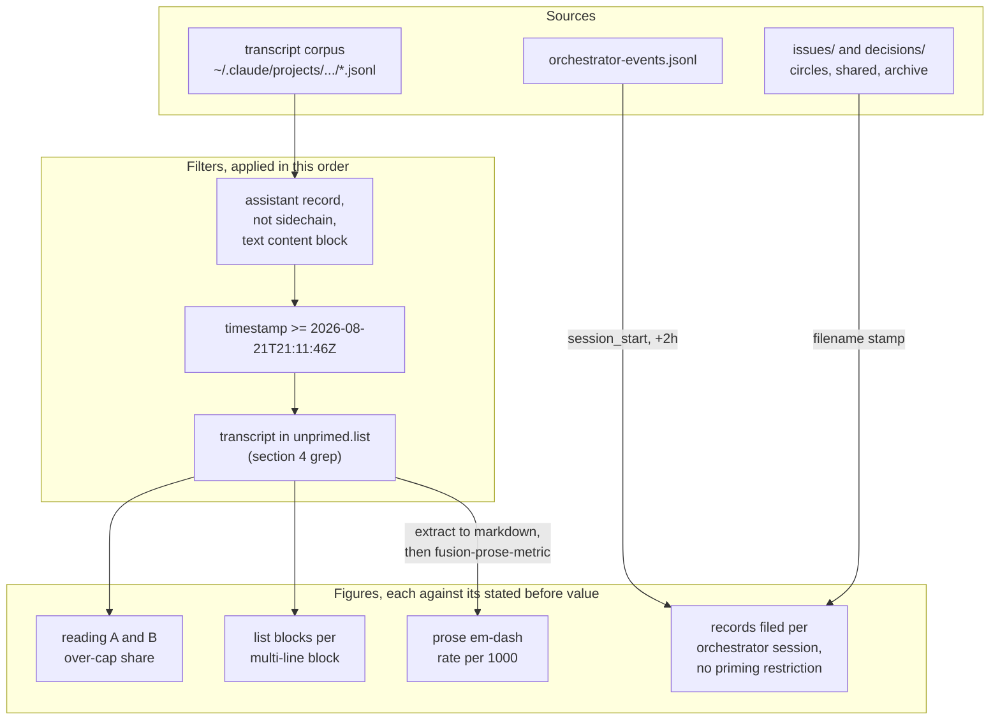

# Analysis: three before-figures, the after-measurement defined, and the count it needs

**Date:** 2026-08-22 00:35
**Type:** Document Study
**Status:** Complete
**Requested by:** orchestrator, against `260822-0010-measurement-briefing-does-the-rule-change-shorten-a-reply.md`
**Revised:** 2026-08-22 01:57, against findings 1 and 2 of
`260822-0116-coderev-the-measurement-report-reproduces-and-its-after-run-does-not.md`.
Section 6 now states that the records-per-session arm is **not** restricted to unprimed transcripts,
why the project records no key that could restrict it, and what counting every one of them costs;
the
flowchart edge that claimed the restriction is gone. The word "session" named two units and now
names one: `## Scope` defines the pair and sections 4 to 7, the Implications, the Recommendations
and the Open Questions say "transcript" where the unit is a file. **No figure changed.**

## Question

The briefing commissions three before-measurements the reply-length baseline does not carry, a
fully specified after-measurement that is not to be run, and a judgement about how much
after-corpus the comparison needs. This report answers all four, plus one thing the briefing
assumed and this run found to be false: the contamination test as the briefing states it marks
almost every fusion transcript as primed, because the `/fusion:setup` skill body names the very
files the test greps for.

## Scope

Three objects. The Claude Code transcript corpus at
`~/.claude/projects/-Users-k1-Projects-productive-fusion/*.jsonl`, in the window the baseline
fixed. The workbench's defect and decision stores, every Circle and `shared/` and the archive. The
orchestrator event log at `fusion-workbench/orchestrator-events.jsonl`.

**This report extends the baseline and re-measures none of it.** Reading A was re-run once, as a
check that the closed window still returns what it returned, and it does: `blocks=2236 over12=400
share=17.9% multiline=856 share_multiline=46.7%`, unchanged over 72 transcript files where the
baseline saw 70. Every other figure below is new.

**No gate, no test, nothing added to `bin/`, no rule and no profile touched.** The commands are in
this file and nowhere else. Nothing here was written to a growth-bounded surface.

**`bin/fusion-prose-metric` was run from the work tree**, at
`/Users/k1/Projects/productive/fusion/bin/fusion-prose-metric`, because it is absent from the
installed plugin copy at `$FUSION_PLUGIN_ROOT/bin/`. Section 4 establishes why, and a defect
record is filed.

**Two different things are called a session in the sources, and this report keeps them apart by
name.** An **orchestrator session** is one `session_start` event in
`fusion-workbench/orchestrator-events.jsonl`. A **transcript** is one file in the Claude Code
corpus, named by the Claude Code session's UUID. Section 1 is the only figure keyed to orchestrator
sessions; sections 4, 5 and 7 are keyed to transcripts.

| Unit | Source | Count in the before-window |
|---|---|---|
| Orchestrator session | a `session_start` event in the event log | 52 |
| Transcript | a `*.jsonl` file in the Claude Code corpus | 72 present, 68 contributing at least one in-window reply, 52 of those unprimed |

**The two counts collide at 52 in this window and are not the same population**, at a ratio near 1.3
transcripts to one orchestrator session over the same period. Below, each word names one of these
two things and nothing else. Section 6 states why the report cannot map a given transcript onto a
given orchestrator session.

## Findings

### 1. Filed records per orchestrator session: 16.4 on average, and the spread makes it the least sensitive figure

**52 orchestrator sessions in the baseline window filed 854 defect and decision records, a mean of
16.4 per session and a median of 11.** Five sessions filed nothing. The largest filed 78.

```sh
WB=/Users/k1/Projects/productive/fusion/fusion-workbench
T="${TMPDIR:-/tmp}"

# a) session starts, shifted from the event log's UTC onto the local clock the
#    filename stamps are written in. The whole corpus lies in CEST, so the shift
#    is a constant +2h and needs no DST handling.
jq -r 'select(.event=="session_start") | .ts' "$WB/orchestrator-events.jsonl" \
| while read -r t; do date -j -f '%Y-%m-%dT%H:%M:%S' -v+2H "$t" '+%y%m%d-%H%M'; done \
| sed 's/$/ S/' > "$T/fusion-sessions.txt"

# b) every defect and decision record anywhere under the workbench, archive included
find "$WB" \( -path '*/issues/*.md' -o -path '*/decisions/*.md' \) -type f -print \
| sed -E 's#.*/##; s#^([0-9]{6}-[0-9]{4})_.*#\1#' \
| grep -E '^[0-9]{6}-[0-9]{4}$' | sed 's/$/ R/' > "$T/fusion-records.txt"

# c) assign each record to the session window it falls in
LC_ALL=C sort -k1,1 -k2,2 "$T/fusion-sessions.txt" "$T/fusion-records.txt" \
| LC_ALL=C awk '$2=="S" { if (cur!="") print cur, n; cur=$1; n=0; next }
                { if (cur!="") n++ }
                END { if (cur!="") print cur, n }' > "$T/fusion-per-session.txt"

# d) the summary over the window
LC_ALL=C awk '$1>="260801-2302" && $1<="260820-2104" { print $2 }' "$T/fusion-per-session.txt" \
| LC_ALL=C sort -n \
| LC_ALL=C awk '{ v[n++]=$1; s+=$1; if ($1==0) z++ }
    END { printf "sessions=%d records=%d mean=%.2f median=%d p25=%d p75=%d max=%d zero=%d\n",
                 n, s, s/n, v[int((n-1)*0.5+0.5)], v[int((n-1)*0.25+0.5)],
                 v[int((n-1)*0.75+0.5)], v[n-1], z }'
```

Returns `sessions=52 records=854 mean=16.42 median=11 p25=3 p75=24 max=78 zero=5`.

The whole series, so the figure survives without the event log:

```
260801-2302:0 260801-2318:1 260801-2359:0 260802-0849:13 260802-1828:15 260803-1039:8
260803-1756:24 260804-1138:4 260804-1243:11 260804-1408:2 260804-1550:17 260805-0638:78
260805-2035:0 260805-2118:3 260805-2350:14 260806-1139:4 260806-2158:6 260807-0926:11
260807-1918:5 260807-2020:10 260808-0132:1 260808-0922:17 260809-1725:18 260810-0241:36
260810-0845:20 260810-1403:10 260810-1646:38 260811-0752:39 260811-1915:51 260812-2315:1
260813-0806:25 260813-1647:0 260813-1815:28 260813-2345:20 260814-1315:3 260814-1404:18
260814-2009:16 260814-2241:1 260814-2306:74 260815-2147:42 260816-0805:10 260816-1500:3
260816-1814:0 260816-1841:25 260817-1236:10 260817-1821:1 260817-2037:10 260818-0723:12
260818-2124:6 260818-2301:28 260819-2006:26 260820-2104:39
```

**What a rise and a flat line would each mean, stated before the after-run so neither can be read
in afterwards.** The new clause in `rules/user-facing-output.md` `## Information architecture` says
that what an agent noticed on the way is filed and named in the reply in one line, rather than
carried in the reply. Three outcomes are possible and they are not equally good.

| After-state | Reading |
|---|---|
| records per session rises, reply length falls | the clause relocated the material, which is what it was written to do |
| records per session flat, reply length falls | material is being dropped, not relocated. The reply got shorter by losing content, and the content did not land anywhere |
| records per session rises, reply length flat | the filing habit changed and the reply did not. The clause reached the store and not the prose |

**Two cautions on this figure, and they are large.** First, the standard deviation is 17.6 against
a mean of 16.4, so the coefficient of variation exceeds one. Session-to-session variation swamps
any plausible effect: section 7 shows that with the before arm fixed at 52 orchestrator sessions, a
rise of five records per orchestrator session is undetectable at any after-size, and a rise of ten
needs roughly 45 further orchestrator sessions. **The briefing calls this the strongest evidence
available. It is the most independent, because it lives outside the transcripts, and it is at the
same time the least sensitive of the three.** Both halves are true and the second is the operative
one.

Second, the count is of records filed, not of records that needed filing. A session that fixes
nothing and files thirty observations scores higher than one that fixes ten defects and files ten.

**Three details of the command are load-bearing.** The `+2H` shift converts the event log's UTC
timestamps onto the local clock `date +%y%m%d-%H%M` writes filename stamps in; the corpus runs from
2026-07-06 to 2026-08-21 and lies entirely inside CEST, so the constant is exact. The archive store
is inside the `find` scope on purpose: `fusion-workbench/archive/260817-1907-safe-cleanup-scoped/`
holds five Circles' records, and excluding it would depress every session before 2026-08-17.
Backlog entries are excluded, because filing one is the user's act and no agent originates one
(`rules/fusion-workbench-conventions.md` `## Backlog entries`).

One record shares its stamp `260811-1915_*_the-queue-ground-check-reads-any-backticked-word-in-the-head-line-as-a-circle-name.md` with a session start. Under this sort it is assigned to
the preceding session. Re-running step (c) with `-k2,2r`, which reverses the tie, returns the same
`sessions=52 records=854 mean=16.42 median=11`, so the tie-break changes nothing above the
per-session row.

### 2. Enumeration density: 0.104 list blocks per reply block, and a third of the lists have exactly three items

**Over the 2 236 reply blocks the baseline defines, 233 list blocks appear, 0.104 per block. 190
blocks, 8.5 per cent, carry at least one list; among the 856 multi-line blocks that is 22.2 per
cent. The mean list runs 3.47 items, and 77 of the 233 lists, 33.0 per cent, have exactly three.**

```sh
DIR=~/.claude/projects/-Users-k1-Projects-productive-fusion
CUT=2026-08-21T10:16:31Z

jq -r --arg cut "$CUT" '
  select(.type == "assistant" and (.isSidechain != true))
  | select(.timestamp < $cut)
  | .message.content[]?
  | select(.type == "text")
  | "@@FUSION-BLOCK@@", .text
' "$DIR"/*.jsonl \
| LC_ALL=C awk '
  function flush() { if (inrun) { lists++; blocklists++; inrun=0 } }
  function endblock() { flush()
    if (started) { n++; if (nlines > 1) mult++
                   if (blocklists > 0) { withlist++; if (nlines > 1) mwl++ } }
    blocklists=0; nlines=0; infence=0; started=0 }
  $0 == "@@FUSION-BLOCK@@" { endblock(); started=1; next }
  started {
    nlines++
    if ($0 ~ /^ {0,3}(```|~~~)/) { flush(); infence = !infence; next }
    if (infence) next
    if ($0 ~ /^[ \t]*$/) next
    if ($0 ~ /^ {0,3}([-*+] |[0-9]+[.)] )/) { inrun=1; items++; next }
    flush() }
  END { endblock()
    printf "blocks=%d listblocks=%d per_block=%.3f items=%d\n", n, lists, lists/n, items
    printf "with_a_list=%d (%.1f%%) multiline=%d multiline_with_a_list=%d (%.1f%%) per_multiline=%.3f items_per_list=%.2f\n",
           withlist, 100*withlist/n, mult, mwl, 100*mwl/mult, lists/mult, items/lists }'
```

Returns `blocks=2236 listblocks=233 per_block=0.104 items=809` and `with_a_list=190 (8.5%)
multiline=856 multiline_with_a_list=190 (22.2%) per_multiline=0.272 items_per_list=3.47`.

Replacing the final `awk` stage with one that prints each run length gives the item-count
distribution: `1:1 2:51 3:77 4:61 5:30 6:10 7:3`, total 233.

**A list block is a maximal run of list-item lines**, where an item line is `-`, `*`, `+`, `<n>.`
or `<n>)` followed by a space after at most three spaces of indent. Blank lines do not break a run;
any other non-blank line does. Fenced code is skipped, so a shell script's comment lines are not
counted as bullets. Table rows are not lists.

**This measures the presence of a list, not whether the list was earned.** A reply satisfying any
count above may still enumerate for rhythm, and a reply with no list may have flattened a genuine
enumeration into a sentence that reads worse. AI04 in the four voice profiles bans the mechanical
three-item list, and the 33.0 per cent figure is the closest this instrument comes to AI04's actual
subject. It still does not touch it: a three-item list of three real things satisfies AI04 and is
counted here identically to a padded triad.

**One bias worth naming.** The denominator is every text block, and 1 380 of the 2 236 are one-line
narrations between tool calls, which cannot contain a list. The 0.104 figure is therefore diluted
by construction. The 22.2 per cent over multi-line blocks is the sharper reading and is the one to
carry forward, exactly as reading B is sharper than reading A in the baseline.

### 3. Em-dash rate: 10.0 per 1000 prose words, against a ceiling of 1.0

**The 2 236 reply blocks hold 2 029 prose em-dashes across 202 832 prose words, a rate of 10.0 per
1000. The ceiling `rules/user-facing-output.md` states is one per 1000. Agent replies run at ten
times the rule they load on every dispatch. 942 of the 2 236 blocks, 42.1 per cent, carry at least
one.**

```sh
DIR=~/.claude/projects/-Users-k1-Projects-productive-fusion
T="${TMPDIR:-/tmp}"
CUT=2026-08-21T10:16:31Z

jq -r --arg cut "$CUT" '
  select(.type == "assistant" and (.isSidechain != true))
  | select(.timestamp < $cut)
  | .message.content[]?
  | select(.type == "text")
  | "@@FUSION-BLOCK@@", .text
' "$DIR"/*.jsonl | LC_ALL=C sed 's/^@@FUSION-BLOCK@@$//' > "$T/replies-before.md"

/Users/k1/Projects/productive/fusion/bin/fusion-prose-metric "$T/replies-before.md"
```

Returns `2029  202832  10.0  202  over`.

**The transcript form does not defeat the tool, and the adaptation is one line.** The tool takes
files of markdown. A transcript is JSON Lines, in which a reply's markdown is one escaped string
field alongside user prompts, tool inputs and whole file contents, all of which would be counted.
So the corpus is extracted first and the tool is then run on ordinary markdown. The separator line
is blanked rather than left in, so 2 236 sentinel words do not enter the denominator.

**The one hazard was checked rather than assumed.** Concatenating 2 236 blocks into one file is
only safe if no block opens a code fence it does not close, since an unbalanced fence would swallow
the rest of the corpus into an excluded region. Counting fence lines per block returns `blocks=2236
fence_lines=154 blocks_with_odd_fence_count=0`. Every fence closes inside its own block, so the
concatenation changes no exclusion. Nothing else was adapted.

**The tool ran from the work tree, not from `$FUSION_PLUGIN_ROOT`.** `ls ~/.fusion/bin/` lists
twelve helpers and `fusion-prose-metric` is not among them, while the work tree at
`/Users/k1/Projects/productive/fusion/bin/` lists thirteen and it is. The cause is not the
installer: `install.sh:82` copies `bin` wholesale. The cause is that the commit adding the program,
`fac97f4`, is not an ancestor of the tag `v10.4.0`, which is 48 commits behind HEAD, while
`.claude-plugin/plugin.json` still reads `10.4.0` in both trees. **Two installations can report the
same version string and differ in which helpers they carry.** That is filed as a defect; see
`## Filed Issues`.

Two contrasts that calibrate the number. A naive `grep -o '—' | wc -l` over the same extracted file
returns 2 062 against the tool's 2 029, so the tool's four exclusions remove 33 instances, about 1.6
per cent; the reply corpus is mostly prose and the exclusions matter far less here than they do in
a rule file full of exhibits. And 22 en-dashes `–` U+2013 are present and are not counted, by
design, which is the asymmetry `260821-0147_*_the-english-em-dash-entry-lost-its-inline-demonstration-and-the-german-one-still-breaks-its-own-rule.md`
already tracks.

The figure sits beside a known one. `260816-0740_*_the-always-on-rule-corpus-runs-at-sixteen-times-the-em-dash-ceiling-it-states.md`
records the always-on rule corpus at sixteen times the ceiling. The replies those rules govern run
at ten times it. Neither number is evidence about the other, and the pair is worth seeing together.

### 4. The contamination test the briefing states does not work, and this is why

**Applied literally, `grep -l user-facing-output` over the transcript files matches 49 of 72, and
`chat-voice` matches 48.** Those are not primed transcripts. They are transcripts in which
`/fusion:setup` ran, whose skill body is injected into the transcript as a user message and which
names `default-voice-{en,de}.yaml`, `chat-voice-{en,de}.yaml` and the stylometric profiles in its
Step 0d prose. The 23 non-matching transcripts are largely ones in which no agent Setup ever ran.
**The briefing's test, taken at its word, excludes precisely the population the measurement is
about.**

The intent behind it is sound and is recoverable. Priming means the agent writing the replies was
working on, or was told about, reply length and register. Evidence for that lives in what a human
typed and in what the agent itself wrote, not in a skill body that every transcript carries
identically before and after the rule change.

**So the surface is narrowed to human prompts and agent replies, and the pattern is then applied to
that.** This is the exact test the after-run must use:

```sh
DIR=~/.claude/projects/-Users-k1-Projects-productive-fusion
T="${TMPDIR:-/tmp}"

PRIMED='260821-1042-reply-bounded|260820-2051-style-rules|user-facing-output|chat-voice|default-voice|stilwerk|fusion-prose-metric|[Ee]m-[Dd]ash|[Gg]edankenstrich|[Aa]ntwortlänge|[Zz]eilen(zahl|limit|obergrenze|kappe)|[Rr]eply.length|line cap|length cap|12 lines|12 Zeilen|[Ss]tilomet|stylometric|[Pp]rosaregister|prose register|[Rr]egister|AI0[0-9]|C0[0-9]'

# cleared, not reused: the grep below globs this directory, so a .txt left by an earlier
# run keeps voting after its transcript is pruned
rm -rf "$T/conv"; mkdir -p "$T/conv"
for f in "$DIR"/*.jsonl; do
  jq -r 'select(.isSidechain != true)
    | if (.type=="user" and .origin.kind=="human") then
        (if (.message.content|type)=="string" then .message.content
         else ((.message.content // []) | map(select(.type=="text") | .text) | join("\n")) end)
      elif (.type=="assistant") then
        ((.message.content // []) | map(select(.type=="text") | .text) | join("\n"))
      else empty end' "$f" > "$T/conv/$(basename "$f" .jsonl).txt"
done

# the unprimed transcripts, one absolute path per line
LC_ALL=C grep -LE "$PRIMED" "$T"/conv/*.txt \
| sed "s#.*/conv/#$DIR/#; s#\.txt\$#.jsonl#" > "$T/unprimed.list"
```

**`.origin.kind=="human"` is the whole correction.** A transcript's `user` records carry that field
on 249 of 6 473 records; the rest are tool results, task notifications and injected skill bodies,
which carry `«none»`. The baseline's reading C already uses the same field to find human prompts,
so this is the corpus's own existing notion of what a person typed, not a new one.

**Measured against the before-corpus the corrected test marks 19 of 72 transcripts primed and 53
unprimed.** Restricted to the 68 that contribute at least one in-window reply, 16 are primed and 52
are unprimed, and the unprimed 52 carry 1 166 of the 2 236 blocks.

**The pattern errs towards over-flagging on purpose.** `[Rr]egister` and `C0[0-9]` are broad and
catch some transcripts that were discussing something else. A false "primed" costs one transcript
of after-corpus; a false "unprimed" puts contaminated prose into the measurement and cannot be
detected afterwards. The asymmetry is not close, so the broad pattern is the right error.

### 5. The like-for-like before arm: the baseline restricted to unprimed transcripts

The after-measurement will be unprimed-only. Comparing it against the full baseline would compare
two different populations, so the before arm is restricted the same way here. This extends the
baseline rather than replacing it: the published figures stand and these sit beside them.

| Figure | Full corpus (baseline) | Unprimed only (this report) |
|---|---|---|
| Transcripts | 68 contributing | 52 |
| Reading A, text blocks | 2 236 | 1 166 |
| Reading A, over 12 lines | 400, 17.9 % | 183, **15.7 %** |
| Reading B, multi-line blocks | 856 | 428 |
| Reading B, over 12 lines | 400, 46.7 % | 183, **42.8 %** |
| Mean lines per block | 5.9 | 5.3 |
| Median / p75 / p90 / p95 / p99 / max | 1 / 9 / 18 / 23 / 35 / 154 | 1 / 9 / 16 / 21 / 28 / 58 |
| One-line blocks | 1 380 | 738 |
| Two-line blocks | 0 | 0 |
| List blocks | 233 | 145 |
| Lists per multi-line block | 0.272 | 0.339 |
| Lists of exactly three items | 77 of 233, 33.0 % | 50 of 145, 34.5 % |
| Prose em-dashes / prose words | 2 029 / 202 832 | 813 / 93 724 |
| Em-dash rate per 1000 | 10.0 | **8.7** |

The unprimed frequency table, embedded for the same reason the baseline embedded its own:

```
1:738 3:45 5:22 6:1 7:46 8:4 9:58 10:9 11:47 12:13 13:28 14:16 15:20 16:13 17:13
18:10 19:13 20:11 21:14 22:8 23:2 24:6 25:3 26:7 27:3 28:5 29:3 31:1 32:1 33:1
38:1 44:1 46:1 48:1 58:1
```

The structure the baseline found holds on the subset. No block is exactly two lines, 738 of 1 166
are exactly one, and the odd lengths dominate the multi-line half.

The unprimed subset runs slightly cleaner than the corpus as a whole on every figure, which is what
one would expect if the transcripts that discussed register were also the ones that wrote the most
about it. **The comparison arm is 42.8 per cent, not 46.7.**

### 6. The after-measurement, defined and not run

**Lower bound `2026-08-21T21:11:46Z`, verified rather than copied.** The briefing derives it from
three commits. All three were checked: `9aa8ecf` at 21:53:42+02:00 and `a5e2cc5` at 23:11:27+02:00
touch `rules/user-facing-output.md`, `1daf063` at 23:11:46+02:00 touches `stilwerk/`, and
`git log -- rules/user-facing-output.md stilwerk/` shows no later commit at HEAD `084c626`. The
boundary is therefore correct as of this writing. **Other executors are editing `stilwerk/*.yaml`
in this tree right now, so the after-run repeats that `git log` before trusting the number, and
moves the bound to the last commit touching either surface.**



The pipeline is the baseline's, with three changes and no others.

1. **The cut becomes a lower bound.** Replace `select(.timestamp < $cut)` with
   `select(.timestamp >= $cut)` and set `CUT=2026-08-21T21:11:46Z`. The string comparison stays
   valid: every `timestamp` is a fixed-width ISO 8601 instant in UTC.
2. **The file list becomes `$T/unprimed.list`** from section 4, in place of `"$DIR"/*.jsonl`. Feed
   it with `tr '\n' '\0' < "$T/unprimed.list" | xargs -0 jq ...`, which is what this run used; a
   bare unquoted expansion of the list breaks on the path lengths involved.
3. **`LC_ALL=C` stays on every `awk` stage**, for the decimal separator.

Report, line by line against section 5: reading A, reading B, the frequency table, the percentiles,
the list-block figures including the exactly-three share, the pooled em-dash rate, and records per
orchestrator session. Report reading A and reading B together and never reading A alone, per the
baseline's own recommendation 1.

**Records per orchestrator session in the after-window** uses section 1's command with the window
bounds changed to `$1>="260821-2311"`, which is the local-clock form of the same instant, and with
**no priming restriction at all**. Both sides of this figure are whole-corpus: section 1's before
value counts every orchestrator session in its window, and the after value counts every one in its
own, so the two compare to each other. Two orchestrator sessions exist at this writing on the after
side of the boundary, so this arm has almost no data yet.

**The restriction is dropped because the project records no key that could apply it.**
`unprimed.list` names transcript files by their UUID. Section 1 keys on `yymmdd-HHMM` stamps derived
from `session_start` events, and nothing in the event log carries a transcript identifier: across
all 1 896 records the key set is `ts`, `event`, `detail`, `agent`, `task`, `turn`, `verdict` and
`history_file`, and `fusion-workbench/.guard-state/events.jsonl` adds only `file` and `tool`.
`history_file` looks like the missing key and is not one. It names a workbench history log rather
than a transcript, and it sits on 25 of the 70 before-window session starts, first appearing on
2026-08-12. Restricting this arm would therefore mean inventing a time-proximity join with four
judgements this report does not make: which timestamp stands for a transcript, the matching rule,
the tolerance, and what happens when one transcript spans two session starts or two transcripts sit
inside one. Two runs would invent it differently and their figures would stop comparing, which is
worse than not restricting at all.

**What would have to be recorded for the restriction to become possible, and why it would still not
reach this comparison.** One field on `session_start` naming the Claude Code session the
orchestrator is running in. The value already arrives inside fusion: the `PreToolUse` hook receives
it as `session_id` (`hooks/guard.ts:84`), and the transcript file is that identifier plus `.jsonl`,
which was verified by locating this run's own transcript from its Claude Code session id. It is
never written to the event log, and `session_start` is written by the orchestrator rather than by
the hook, so carrying it across that boundary is the work. **Even then it would not reach the
before-window**, whose events are written and closed. A restricted after arm against an
unrestricted before arm is a worse comparison than the unrestricted pair specified here, so this
arm stays unrestricted whatever a later version records.

**What counting every orchestrator session costs, stated so it is not read as free.** The after
value will include orchestrator sessions primed on reply length and on filing, and this Circle's own
sessions are among them: both orchestrator sessions on the after side of the boundary at this
writing are primed. The bias runs upward, because the clause under measurement is a filing
instruction and a session told about it is likelier to obey it. Its size is not measurable, and the
reason is the same missing key: the primed share is known only per transcript, 16 of the 68
contributing transcripts in the before-window, and it cannot be restated per orchestrator session.
**Read this arm as a direction carrying a named upward bias, never as a verdict.** Section 7 already
finds it carries no verdict at any realistic size, so the restriction was buying less than it
appeared to.

**Three things the after-run must also do.** State that the transcript corpus is outside version
control and embed its own frequency table, per the baseline's recommendation 3. Re-run reading A on
the before-window as a check that the closed window still returns 2 236 and 400, which costs one
command and catches a pruned corpus. And record the corpus file count and the
`ls *.jsonl | sort | shasum -a 256` of the after-window, knowing that this checksum changes with
every new transcript and is a record of what was read, not a reproducibility guarantee.

### 7. How many unprimed transcripts: twenty

**Twenty unprimed transcripts.** Below that, only a change large enough to be visible without
statistics is worth reporting; above it, the reply-length figure the Circle is actually about
becomes readable.

**The unit here is the transcript, and the conversion is stated once so that nobody makes it
silently.** Twenty transcripts is roughly fifteen orchestrator sessions, at the before-window ratio
of 68 contributing transcripts to 52 session starts. Every count in this section is transcripts
unless it says orchestrator session, and section 1's filing figure is the one that says it.

The reasoning, and it is arithmetic rather than judgement up to the last step.

**The figure the count is set by is reading B**, the share of multi-line blocks over the 12-line
cap, at 42.8 per cent over 428 blocks. Reading A is a worse statistic for this purpose: 1 380 of
2 236 blocks are one-line narrations whose share can move because a transcript carries more tool
calls, which has nothing to do with the rule.

**Blocks are clustered within transcripts and the clustering was measured, not assumed.** Across
the 31 unprimed transcripts carrying at least one multi-line block, the ANOVA estimator gives an
intra-cluster correlation of 0.046 with a mean cluster size of 13.3, so the design effect is 1.56
and the before arm's 428 blocks are worth about 274 independent ones. Unprimed transcripts in the
window average 8.2 multi-line blocks each, counting the 21 that produced none.

**With the before arm fixed at 428 blocks**, at 5 per cent two-sided and 80 per cent power:

| Fall in reading B | After blocks needed | Unprimed transcripts |
|---|---|---|
| 5 points, 42.8 % to 37.8 % | not reachable at any size | — |
| 10 points, to 32.8 % | 900 | about 110 |
| **15 points, to 27.8 %** | **158** | **about 19** |
| 20 points, to 22.8 % | 65 | about 8 |
| 25 points, to 17.8 % | 32 | about 4 |

Twenty is the 15-point row, rounded up. **The last step is the judgement and it is this: a
15-point fall is the smallest change worth waiting for.** The rule change restates a hard cap and
closes four routes out of it. If it works, close to half of over-cap prose replies come under the
cap, which is a change of that order. A 10-point fall would be real and would matter, and buying
the power to see it costs 110 unprimed transcripts, which at the observed rate of roughly two and a
half unprimed transcripts a day is six weeks of work whose tasks, models and mix would have changed
underneath the measurement long before the count arrived. That is not a better measurement, it is
a worse one with a bigger number attached.

**What twenty transcripts does not buy, stated plainly so nobody claims it later.**

- **Not the filing figure, whose counts are in the other unit.** With the before arm at 52
  orchestrator sessions and a standard deviation of 17.6, a rise of five records per orchestrator
  session is unreachable at any after-size and a rise of ten needs about 45 further orchestrator
  sessions. Twenty transcripts is roughly fifteen orchestrator sessions, so the wait this section
  sets is about a third of what that rise would need. At twenty, report the direction and the
  interval, and make no claim.
- **Not a clustered em-dash result.** Pooled over words the em-dash rate is by far the most
  sensitive of the three, and a halving would show on a few thousand prose words. Read per
  transcript it is the noisiest: across the 28 unprimed transcripts with at least 200 prose words
  the rate runs from 0.0 to 33.3 per 1000, mean 9.1, standard deviation 8.0. With a before arm of 28
  transcripts, even a 4-point fall is unreachable. **Report the pooled rate as the headline and the
  per-transcript distribution beside it, and attach no p-value to either.**
- **Not the enumeration figure at fine resolution.** 145 list blocks before, of which 50 have
  exactly three items. Twenty transcripts yields roughly 170 multi-line blocks and, at the before
  rate, about 58 list blocks. That is enough to see a halving and not enough to see a quarter.

**One number cannot serve all four figures, and pretending otherwise is how a measurement gets
quoted past its power.** Twenty is set by reading B because reading B is what the Circle's Directive
is about. The other three are read descriptively at that size.

### 8. What none of this can show

**Whether the reply answered the question that was asked is not decidable from any of it, and no
proxy is offered.** The Circle's Directive has two halves and every figure above measures the first
one. The second needs the user's message and the reply side by side, and a judgement about whether
the second addresses the first. Length is not that judgement: a two-line reply can miss the
question entirely and a thirty-line one can answer it exactly. Neither is list count, em-dash rate,
nor filing rate.

**A sampled rubric judgement is possible and it is a different instrument.** Sketched, so the cost
is visible rather than implied:

- **Unit.** One human prompt with everything the agent wrote in reply to it, up to the next human
  prompt. The baseline's reading C already extracts exactly this unit and counted 281 of them.
- **Sample.** Forty units, twenty either side of the boundary, drawn at random from unprimed
  transcripts, with the boundary hidden from the judge.
- **Rubric.** Three ordinal marks per unit: did the reply answer the question asked, did it answer
  something else, did it leave the question unanswered. Plus one binary: did the reply carry
  material that belonged in a filed record.
- **Judge.** The user, or two independent judges with the disagreement rate reported. **Not an
  agent of this project**, which would be scoring prose written under rules it has itself loaded.
- **Cost.** Forty units at a median of 26 lines each is roughly a thousand lines of reading, plus
  the blinding and the sampling. Call it an evening, and it is the user's evening, not an agent's.

**It is worth running, and it is worth running after the twenty transcripts rather than instead of
them**, because a length change with no answer-quality change is the outcome the numbers cannot
distinguish from success, and it is the outcome most likely to be mistaken for one.

**One further limit applies to the whole comparison and the baseline already stated it.** Nothing
here controls for what else changes between the two windows: the models, the tasks, the mix of
interactive and unattended transcripts, and the fact that this project has spent two Circles
thinking about prose. The honest use is description against description, not experiment.

### 9. Calibration

**Verified by running it**, with the commands as written above: every figure in sections 1, 2, 3,
4 and 5, the reading-A reproduction in `## Scope`, the fence-balance check, the raw-versus-prose
em-dash contrast, the tie-break insensitivity in section 1, the absence of
`fusion-prose-metric` from `~/.fusion/bin/`, the ancestry of `fac97f4` against `v10.4.0`, the two
identical version strings, and the commit history behind the section 6 boundary.

**Inference**, reasoned from what was verified: that the 49 of 72 `user-facing-output` matches are
caused by the `/fusion:setup` skill body. Three matching transcripts were opened and each match
sits inside the Step 0d prose, and the narrowed surface drops the count to 5, which fits no other
mechanism. No exhaustive attribution of all 49 was performed.

**Inference**, second: that the design effect of 1.56 transfers to the after-window. It is
estimated from before-window clustering, and an after-window with a different mix of interactive
and unattended transcripts would cluster differently. The direction of the error is unknown.

**Speculation**, marked so it is not later read as a finding: that the unprimed subset running
cleaner than the full corpus on every figure is because transcripts discussing register also wrote
more prose about it. The pattern fits all five figures and no competing mechanism was tested.

**Not established at all:** any causal link between the rule text and any figure here. All of it
predates the change.

## Implications

The Circle can now be finished without guessing. The before-state is complete on four figures
rather than one, the after-run is a mechanical exercise against a written boundary and a written
grep, and the size at which its answer means something was fixed before anybody saw a result.

Two of the four figures turned out weaker than the briefing expected, and that is the more useful
half of this report. Filed records per orchestrator session is independent evidence and is too
noisy to carry a verdict at any realistic corpus size. The em-dash rate is sharp pooled and hopeless
per transcript.
Neither was knowable without measuring the spread, and both would have been quoted with confidence
by an after-run that had not.

The one figure that is both sensitive and on-topic is reading B. Twenty unprimed transcripts is
what it needs and twenty is what the Circle should wait for.

## Recommendations

1. **The after-run waits for twenty unprimed transcripts**, counted with section 4's grep, and
   reports reading A and reading B together against section 5's column. A run at ten transcripts
   reports a direction and says it is a direction.
2. **Re-verify the boundary before the after-run**, with `git log -- rules/user-facing-output.md
   stilwerk/`. Executors are editing `stilwerk/` in this tree now, and the boundary moves with the
   last commit to either surface.
3. **Do not build a gate from any figure here.** `260816-0740_*_does-the-prose-register-get-a-measurable-gate-and-which-surface-does-it-measure.md`
   forbids it until its own registered measurement runs, and this is not that measurement.
4. **Put the rubric judgement of section 8 to the user as a decision**, not as an agent task. It
   costs the user an evening and it is the only instrument that reaches the Directive's second half.
5. **Close the version-string defect before the next release**, so that a later orchestrator
   session can tell from `plugin.json` whether the copy it is running carries the helper its own
   records name.

## Filed Issues

- `260822-0035_*_two-installed-copies-report-the-same-version-and-differ-in-which-bin-helpers-they-carry.md`
  — `bin/fusion-prose-metric` is absent from the installed plugin copy while both trees report
  version 10.4.0, so no orchestrator session can tell from the version string which helpers it has.
- `260822-0035_*_the-briefings-contamination-grep-marks-49-of-72-transcripts-primed-because-the-setup-skill-body-names-the-files-it-greps-for.md`
  — the measurement briefing states a contamination test that excludes the population being
  measured; the corrected test is in section 4 of this report.

## Sources

- `~/.claude/projects/-Users-k1-Projects-productive-fusion/*.jsonl`, 72 files, read through `jq` only
- `260821-2020-reply-length-baseline.md`, sections 1 to 4 and recommendations 1 and 3
- `260822-0010-measurement-briefing-does-the-rule-change-shorten-a-reply.md`, the whole briefing
- `260820-2354-prose-register-measurement-protocol.md`, read and not amended
- `260821-1108_*_may-an-agent-read-the-session-transcripts-as-a-source-of-evidence.md`, the authority to read the corpus
- `fusion-workbench/orchestrator-events.jsonl`, 1 896 records, 71 `session_start`
- `fusion-workbench/circles/*/issues`, `*/decisions`, `shared/issues`, `shared/decisions`, and `archive/260817-1907-safe-cleanup-scoped/**`, 954 records in total
- `rules/user-facing-output.md`, `## Length` and `## Information architecture`
- `bin/fusion-prose-metric`, header, and `install.sh:82`
- `260816-0740_*_the-always-on-rule-corpus-runs-at-sixteen-times-the-em-dash-ceiling-it-states.md`
- `260821-0147_*_the-english-em-dash-entry-lost-its-inline-demonstration-and-the-german-one-still-breaks-its-own-rule.md`
- `260816-0740_*_does-the-prose-register-get-a-measurable-gate-and-which-surface-does-it-measure.md`

## Open Questions

- [ ] The section 4 pattern over-flags on purpose, and nobody has read the transcripts it flags to
      see how many are false. A one-hour read of the 19 flagged transcripts would say whether the
      unprimed rate of roughly 72 per cent is real or pessimistic, which changes the calendar time
      twenty transcripts takes but not the number itself.
- [ ] Records per orchestrator session counts what was filed, not what should have been. No
      instrument here distinguishes an orchestrator session that filed thirty real observations
      from one that filed thirty duplicates, and `rules/fusion-workbench-conventions.md`
      `## Issue and Decision Filing` explicitly prefers a duplicate to a miss, which biases the
      figure upward over time independently of any rule change.
- [ ] Whether the em-dash ceiling is read per file or across a corpus is still open
      (`260820-2314_*_is-the-em-dash-ceiling-read-per-file-or-across-the-always-on-corpus.md`).
      This report reads it pooled across the reply corpus and per transcript beside it, which is one
      answer applied to a different corpus than that record is about, and settles nothing there.
