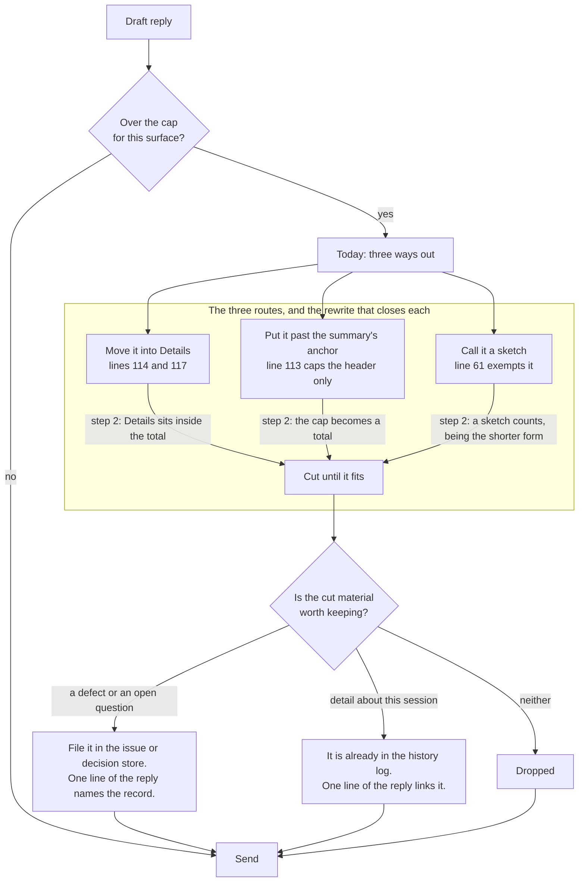
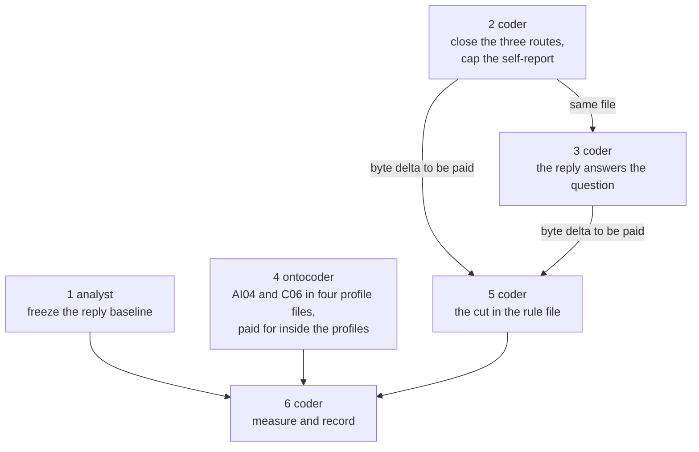

# Implementation Plan: the whole reply is bounded, and it answers the question that was asked

**Date:** 2026-08-21
**Status:** Draft
**Spec:** none. Planned from the Directive in `circles/260821-1042-reply-bounded-whole-question-answered/_t_circle.md`, whose `**Active spec/plan:**` field reads `(none yet)`.
**Decidability:** The load-bearing question is whether an agent can tell, while it drafts a reply, that a block of that reply falls outside the question it was asked. It is decidable at that moment and only there. The agent holds the user's message and the draft together, and the correspondence between them is a judgement over two texts it has in front of it. The same question is not decidable from anything the project persists: the workbench stores no chat reply at all, and a session transcript holds what the agent said without holding what the user would have accepted as an answer. So the mechanism this plan changes is the text the writer reads, and no check is added anywhere. That matches what `shared/decisions/260816-0740_*_does-the-prose-register-get-a-measurable-gate-and-which-surface-does-it-measure.md` requires until its registered measurement runs. The second question, whether a reply is over its cap, is decidable by counting and the file already tells the writer to count. The residual is stated rather than closed: an instruction placed at the writer is overridable under task pressure, this project has a worked case of exactly that in `CLAUDE.md`, and nothing in this plan would notice a violation.

## Directive

The Circle record holds the Directive and it is not restated here. Its three demands, in the order the steps below take them: a budget for a complete reply so that material which will not fit is dropped rather than relocated; a requirement that the answer address the question that was put; and the shorter form of three named register habits written beside them where an agent reads them. All of it by rewriting what the corpus says rather than by adding to it.

## Current State

### The rule text, and where it lets a reply out of its own cap

`rules/user-facing-output.md` is 20 144 bytes over 199 lines at HEAD `e764637`. Read line by line, `## Length` does not fail to cap a reply. It caps each named surface and then opens three routes by which material leaves the cap without leaving the reply.

- **Line 117**, the section's closing instruction: *"Before sending, count the lines. If a cap is exceeded, move material to Details. Do not relax the cap."* Relocation satisfies the count and changes nothing the reader experiences. Line 114 offers the same move a second time, and its second half already names the correct remedy: *"move detail to a Details trailing block or to a file and link it."*
- **Line 113**: *"Session summary header: ≤ 10 lines before the first 'Details' anchor."* Every other entry caps a whole output. This one caps a prefix, so the summary's tail is unbounded. That surface is precisely an agent reporting on its own work.
- **Line 61**, in `## Sketch structure instead of narrating it`: *"A sketch that replaces a wall of prose does not count against the chat length cap in the same way."* The phrase "in the same way" states no rule, and it is an exemption in the position where an exemption is most useful to a writer who is over the cap. Chat profile entry C05 carries the same sentence in a flatter form: *"A sketch that replaces a paragraph does not count against the line cap."*

Those three are the whole of it. I read `## Length`, `## Information architecture`, `## Questions and gates` and `## Sketch structure instead of narrating it` for any further exemption or relocation clause and found none: `## Questions and gates` line 105 already writes its arithmetic as a total, and lines 68 and 115 govern placement inside an output rather than escape from a cap.

### The rule text, and where the question the user asked is governed

Nowhere. `## Information architecture` orders a reply's parts, `## Length` caps its pieces, `## Questions and gates` governs what an agent asks. No clause says the reply answers what was asked. That is the structural half of `shared/issues/260812-0253_*_agents-answer-a-question-the-user-did-not-ask-and-the-length-caps-do-not-hold.md`, whose specimen is a sixty-line reply in which every sentence is true and the question was a two-line lookup.

The destination for the material such a reply carries already exists and is already mandatory. `rules/fusion-workbench-conventions.md` `## Issue and Decision Filing — MANDATORY` requires every defect and every open question found during work to be written as its own file, and it already forbids putting them in chat output. What is missing is the sentence that binds the two: the reply names the filed record and does not carry its content.

### The three register habits, and what already names each

| Habit | What names it today | What is missing |
|---|---|---|
| An enumeration written for rhythm rather than for a real count | AI04, in both chat profiles and both writing profiles | It reaches a three-item list inside a sentence. It does not reach a reply whose default shape is an enumeration. |
| One statement given again in a second and a third formulation | Nothing | `## Vocabulary` `One name per thing` and chat entry C06 govern synonyms for one entity. The writing profile's AI09 governs parallel syntax. Neither governs one claim restated. |
| An agent's account of its own work at the length of the work | The ten-line header cap at line 113 | The cap covers a prefix, and no clause says the length of a report is set by the reader's need rather than by the size of the work. |

### The constraints that shape every step

**Two independent byte budgets, each net zero or less.** `circles/260821-1042-reply-bounded-whole-question-answered/decisions/260821-1108_*_what-may-the-circles-own-new-clauses-cost.md` answers option 1: the always-on corpus may not grow and every new clause is paid for by a cut. This plan holds that as **two** budgets rather than one, and forbids paying either from the other. `rules/user-facing-output.md` is inside the always-on growth bound; the voice profiles are outside it by construction, as `hooks/lib/__tests__/rules-emission-golden.test.ts` states in its header. A single budget spanning both would be satisfiable by moving text from the bounded file into the unbounded one, which is the same move `## Length` is being repaired for. Relocation is not removal here either.

**One surface set.** `circles/260821-1042-reply-bounded-whole-question-answered/decisions/260821-1108_*_which-surfaces-may-this-circle-change.md` answers option 1: `rules/` and `stilwerk/`. No agent prompt is touched, and the `agents/` budget's 1 638 free bytes stay untouched.

**No prose gate, and no new test.** `shared/decisions/260816-0740_*_does-the-prose-register-get-a-measurable-gate-and-which-surface-does-it-measure.md` is answered at option 4 and its reconciliation states that no gate is authorised until its measurement runs. This Circle does not run that measurement: `circles/260820-2051-style-rules-arrive-and-get-measured/analyses/260820-2354-prose-register-measurement-protocol.md` excludes from both its windows any history file written by a session primed on the subject being measured, and every session in this Circle is so primed. The protocol may be read and is not amended. The hook test suite has 21 lines of head-room in any case.

**Headings may not be renamed or removed where shipped text cites them.** `hooks/lib/__tests__/reference-resolution-lint.test.ts` resolves the adjacent form `` `file.md` `## Section` `` against the cited file. Measured over `agents/`, `rules/`, `skills/`, `CLAUDE.md` and the READMEs with `grep -rn "user-facing" --include='*.md' … | grep -o '`## [^`]*`' | sort | uniq -c`, three of this file's headings are cited from shipped text: `## Style anti-patterns apply to everything` (11 citations), `## Effort estimates` (9) and `## Self-review before sending` (7). `## Length`, `## Questions and gates`, `## Vocabulary`, `## Information architecture` and `## Sketch structure instead of narrating it` are cited only from workbench records, which the workbench gate does not check for headings. **The plan keeps every heading anyway.** The repair belongs inside the sections that already own each subject, so no heading needs to move, and keeping them all removes a class of failure for free.

**The workbench copy of a profile is the one agents read.** `bin/fusion-rules` emits `./fusion-workbench/stilwerk/chat-voice-<lang>.yaml`. The plugin's own `stilwerk/` is what `/fusion:setup` seeds and refreshes. The two are byte-identical at HEAD, verified with `diff -q` over all four files, and any step that edits one edits the other in the same commit.

### The four growth budgets at HEAD `e764637`

| Surface | Unit | Head-room | This plan's use of it |
|---|---|---|---|
| Always-on rule set | bytes | 3 507 | Net zero or less, so none of it is spent |
| `agents/*.md` | bytes | 1 638 | Not touched |
| `skills/*/SKILL.md` | bytes | 30 | Not touched |
| Hook test suite | lines | 21 | Not touched, and no test is added |

The always-on figure reproduces as 95 066 bytes over the five emitted rule files against the floor of 86 573 declared in `hooks/lib/__tests__/rules-emission-golden.test.ts` and a head-room of 12 000.

## Approach

One idea carries all five demands, and it is already half-written in the corpus: **the workbench is where material goes, and the reply is not.** A defect noticed during a lookup goes to the issue store, which is already mandatory. A session's detail goes to the history log, which is written anyway and which the file's own Example 1 already links from a summary. What the reply keeps is the answer to the question, inside a count the writer can take before sending.

That gives the two rule gaps a single shape rather than two separate prohibitions. `## Length` stops offering Details as an overflow store and states that every cap is a total; `## Information architecture` states what the reply is about before it states what order its parts come in, and points at the filing mandate that already exists for everything else. Neither is a new mechanism, and neither adds a section.

The three register habits land where their nearest existing clause lives, which is the reuse the Research Gate asks for rather than a fourth, fifth and sixth prohibition. Enumeration rhythm extends AI04, which already names the habit at sentence scale and needs to reach reply scale. Restatement extends C06, which already forbids two names for one thing and needs to forbid two formulations of one claim. Self-report length is a length matter and belongs in `## Length` beside the cap it corrects.

The cut that pays for all of it comes from the same fault the Circle is repairing, which is why it is the right cut rather than merely an available one. `rules/user-facing-output.md` and the chat profiles state several things twice, with the same worked example in both places. Removing a duplicate is the corpus doing what the new clause asks the writer to do.

## Implementation Steps

1. **Freeze the pre-change reply baseline**
   - Executor: `analyst`
   - Files: `circles/260821-1042-reply-bounded-whole-question-answered/analyses/<stamp>-reply-length-baseline.md`
   - Changes: write down the command that produces the Circle's Grounding figures over `~/.claude/projects/<project-slug>/*.jsonl`, together with the figures it produced at HEAD `e764637`: the transcript count, the count of top-level assistant text replies, and the count of those exceeding twelve rendered lines. Record the denominator's known bias, that it counts one-line narration between tool calls and so understates the share of substantive replies over the cap. State in the document, in its own sentence, that it is a frozen baseline and not a gate, that it does not amend and does not run the protocol in `circles/260820-2051-style-rules-arrive-and-get-measured/analyses/260820-2354-prose-register-measurement-protocol.md`, and that reading the transcripts is authorised by `circles/260821-1042-reply-bounded-whole-question-answered/decisions/260821-1108_*_may-an-agent-read-the-session-transcripts-as-a-source-of-evidence.md`.
   - Why it is first: the Circle's own Grounding states these figures and no command anywhere reproduces them. Without one, nothing anybody does later can tell whether this Circle changed a reply.
   - Dependencies: none
   - Bounded surfaces touched: none

2. **Close the three routes out of the length cap, and cap an agent's report on its own work**
   - Executor: `coder`
   - Files: `rules/user-facing-output.md`
   - Changes, all four of them rewrites of existing sentences:
     - Line 117: the closing instruction stops offering Details as the remedy. Every cap in the section is the budget for the complete output it names, trailing Details included; a count that is over is brought down by cutting, and the cut material goes to the store or the file that already holds that kind of thing.
     - Line 114: delete the Details half of the remedy and keep the file half, which is already correct.
     - Line 113: the session summary entry states a total as well as its header cap. The number is `circles/260821-1042-reply-bounded-whole-question-answered/decisions/260821-1801_*_what-total-caps-a-session-summary-now-that-no-reply-has-an-uncapped-tail.md`; write the recommended 25 unless the user answered otherwise at the plan gate, and cite the record on the line.
     - Line 61 and its sentence in `## Sketch structure instead of narrating it`: a sketch counts against the cap. It earns its place by being shorter than the prose it replaces, which is what the rest of that section already says.
     - One entry is added to the `## Length` list, for the habit no clause reaches: an agent's account of its own work is sized by what the reader needs to know, not by how much work there was. A longer run does not buy more lines.
   - Acceptance: `## Length` contains no clause that routes material out of a count, and no entry in it caps a prefix. Each of the four rewrites is checkable by reading the four lines named.
   - Dependencies: none. Records the byte delta it added, which step 5 must cover.

3. **Write the clause that makes the reply answer the question that was put**
   - Executor: `coder`
   - Files: `rules/user-facing-output.md`
   - Changes: `## Information architecture (in this order)` gains its subject before its ordering. The reply answers the question that was asked. What the agent noticed on the way is filed under `rules/fusion-workbench-conventions.md` `## Issue and Decision Filing — MANDATORY`, which already requires the record and already forbids putting it in chat output, and the reply spends one line naming the filed record rather than carrying what is in it. Cite the conventions rule by file and heading, in the adjacent form the reference lint resolves. Keep the clause to the shortest form that states the rule and its one worked contrast, taken from `shared/issues/260812-0253_*_agents-answer-a-question-the-user-did-not-ask-and-the-length-caps-do-not-hold.md`: the question was where the acceptance criteria are, the answer is the path and the section names, and the two defects found on the way are two filed records named in one line each.
   - Acceptance: an agent reading `## Information architecture` learns what the reply is about before it learns what order the parts come in, and the destination for everything else is a store that already exists.
   - Dependencies: step 2, same file. Records its byte delta.

4. **Name the two remaining register habits where the agent reads them, at no net cost to the profiles**
   - Executor: `ontocoder`
   - Files: `stilwerk/chat-voice-en.yaml`, `stilwerk/chat-voice-de.yaml`, `fusion-workbench/stilwerk/chat-voice-en.yaml`, `fusion-workbench/stilwerk/chat-voice-de.yaml`
   - Changes:
     - AI04, today "Mechanical triads" and "Mechanische Dreiergruppen": the instruction extends from a three-part list inside a sentence to a reply whose default shape is an enumeration. The shorter form goes beside it in the entry's `examples:` block: where there is one thing to say, it is a sentence.
     - C06, today "One name per thing" and "Eine Benennung pro Sache": the instruction extends from one name per entity to one formulation per claim. A statement made once is not improved by a second and a third wording. The `examples:` block gains the before and after.
     - The cut that pays for both, inside the same four files: C05's instruction prose restates `rules/user-facing-output.md` `## Sketch structure instead of narrating it` at length. Reduce it to the entry's own language-specific instruction plus its example, and let the rule file carry the statement. The direction is forced rather than chosen: every agent reads the rule file, while the profile can be absent from a workbench, so the profile may point at the rule and the rule may not point at the profile.
     - Both language variants say the same thing in their own language. The German file is written in German.
   - Acceptance: the four files stay byte-identical in their two pairs, verified with `diff -q`; each file's net byte delta is zero or less; both habits appear in both languages with a shorter form beside them.
   - Dependencies: none. Independent of steps 2, 3 and 5 by construction, because it holds its own budget.

5. **Take the cut in the rule file, sized to what steps 2 and 3 spent**
   - Executor: `coder`
   - Files: `rules/user-facing-output.md`
   - Changes: remove duplicated worked material until the file's net delta against HEAD `e764637` is zero or less. The candidates, measured at HEAD, in the order this plan recommends spending them:
     - The sketch worked example and its legend, lines 52 to 62, **639 bytes**. Chat entry C05 carries the same sketch. Keep the section, its heading and its statement.
     - The `One name per thing` worked example under `## Vocabulary`, **585 bytes of the bullet**, whose `uif-framework.yaml` illustration is duplicated verbatim in C06. Keep the principle, which step 4 extends in the profile.
     - The before and after under "The recurring offender" in `## Style anti-patterns apply to everything`, lines 34 to 45, **948 bytes**. The same pair is the chat profile's own `examples:` block at the foot of the file, and `## Self-review before sending` carries a second, sharper anti-example.
     - `### Example 2: activation confirmation`, lines 189 to 199, **760 bytes**.
     - `### Example 1: session report`, lines 162 to 188, **1 420 bytes**. Spend this last: it is the one place the file demonstrates the history-file link that steps 2 and 3 now depend on, so if it goes, that link has to survive in the shortened form.
   - What may not be cut: `### Canonical anti-example (a real failure)` under `## Self-review before sending`, and no heading anywhere in the file.
   - Acceptance: `wc -c rules/user-facing-output.md` is at most 20 144. The measured pool is 4 352 bytes against an expected spend well under it, so the step has room to keep whichever examples the coder judges load-bearing.
   - Dependencies: steps 2 and 3, whose deltas set the size of the cut.

6. **Measure the result and write it into the Circle**
   - Executor: `coder`
   - Files: `circles/260821-1042-reply-bounded-whole-question-answered/history/<stamp>-coder-the-corpus-is-measured.md`
   - Changes: record, each with the command that produced it: the net byte delta of `rules/user-facing-output.md` and of each of the four profile files against HEAD `e764637`; the always-on total against the 86 573 floor and the 98 573 budget; the other three growth bounds, unchanged; `bin/fusion-prose-metric` over `rules/user-facing-output.md`; and `cd hooks && npm test`. State plainly in the note that the clauses land unenforced, that no gate was built and why, and that whether they change a reply is not observed by this Circle.
   - Dependencies: steps 2, 3, 4 and 5

## Where this Circle stops

- `rules/user-facing-output.md` `## Length` contains no clause that moves material out of a count without moving it out of the reply, and no entry in that section caps a prefix of an output rather than the whole of it. The three routes named in `## Current State` are each closed by name.
- `rules/user-facing-output.md` states that a reply answers the question that was put, and that what the agent noticed alongside it is filed under the existing mandate and named in one line rather than carried.
- Both chat voice profiles, in both languages and in both the plugin tree and the workbench copy, name the enumeration-for-rhythm habit and the restated-claim habit, each with its shorter form beside it, and the two pairs of files remain byte-identical.
- The net byte delta of `rules/user-facing-output.md` is zero or less, and the net delta of each voice profile file is zero or less, both measured against HEAD `e764637` and both recorded with their commands in the Circle's history.
- `cd hooks && npm test` exits 0, and none of the four growth bounds stands closer to failing than it did at HEAD `e764637`.
- The pre-change reply baseline exists as a written command with its figures, so a later Circle can re-run it.

Two preconditions before any closure note is written. The measurement note of step 6 exists first: this Circle does not close over an unrecorded number, which is the fault its own Grounding records in the Circle before it. And the closure note states in its own words that the clauses landed unenforced and that no observation of their effect was taken, so that a later reader does not mistake a landed clause for a changed reply.

`shared/issues/260812-0253_*_agents-answer-a-question-the-user-did-not-ask-and-the-length-caps-do-not-hold.md` is closed by steps 2, 3 and 5 together, both halves, which is what the Circle was cut to do. Its adjacent record `shared/issues/260812-0253_*_rules-lose-their-effect-during-a-long-dispatch.md` is not closed and is not touched.

## Data Structures

None. No file gains a field, no schema changes, and the two YAML profiles keep their existing entry shape: an `id`, a `name`, an `instruction` and an optional `examples:` list.

## API Changes

None.

## Testing Strategy

No test is added, and this is a constraint rather than an omission. `shared/decisions/260816-0740_*_does-the-prose-register-get-a-measurable-gate-and-which-surface-does-it-measure.md` forbids a prose gate until its registered measurement runs, this Circle does not run that measurement, and the hook test suite has 21 lines of head-room in any case.

What the existing suite must keep saying, run at step 6 as `cd hooks && npm test`:

- `reference-resolution-lint.test.ts` resolves every heading a shipped file cites in `rules/user-facing-output.md`. The three cited headings survive the plan by construction, and the plan keeps the other five as well.
- `rules-emission-golden.test.ts` fails if the always-on set exceeds 98 573 bytes and its golden fixture changes when any emitted file's size does. The golden is regenerated once, at step 6, with `cd hooks && UPDATE_RULES_GOLDEN=1 npx vitest run lib/__tests__/rules-emission-golden.test.ts` followed by a second run without the flag, and the fixture diff is read. `RULE_BASELINE` is not touched: this plan shrinks the corpus, and a shrink never needs a baseline to move.
- `rules-voice-profile.test.ts` asserts which profile paths resolve and asserts nothing about their contents, so step 4 is free of it. Verified by reading the file: every assertion in it compares path lists.
- `workbench-citation-lint.test.ts` reads this plan and the decision record filed with it, so every workbench citation in both had to resolve when they were written.

The substantive verification is a reading rather than a run, and step 6 records it as such: the four rewrites of step 2 are checkable line by line, and the acceptance clause of each step above says what to read.

## Risks & Mitigations

| Risk | Mitigation |
|---|---|
| The clauses land and no reply gets shorter. This is the Circle before this one, which repaired punctuation and did not reach the register. | Named in the plan head and required in the closure note. Step 1 freezes the baseline so the question stays answerable later, by the Circle that runs the registered measurement. Nothing here claims the effect. |
| The cut removes an example that was teaching the register rather than duplicating it. | Step 5 spends the measured candidates in a stated order, cheapest and most duplicated first, and forbids cutting the canonical anti-example. The pool is 4 352 bytes against an expected spend far below it, so the last and most load-bearing candidate need not be spent at all. |
| Step 4 pays for its clauses out of the rule file, or step 5 pays for the rule file out of the profiles. Either satisfies one number by moving bytes to the other surface. | Two independent budgets, each net zero or less, stated in `## Current State` and repeated in each step's acceptance. It is the same fault the Circle is repairing, so it would be a conspicuous one to commit. |
| The session summary total is a number nobody measured. | Filed as an open decision with the alternative spelled out, and step 2 cites the record on the line it writes. If the user prefers a measured number, option 3 of that record leaves the route open and the plan loses one clause rather than its shape. |
| A profile edit lands in the plugin tree and not in the workbench copy, so the agents keep reading the old text. | Step 4 names all four files, and its acceptance is a `diff -q` over the two pairs. The two are byte-identical at HEAD, verified. |
| The plan is itself an example of the register it is repairing. | Stated, not mitigated. The plan is a workbench artifact and no agent reads it at dispatch, so it is outside the corpus the Directive's mechanism concerns. It is not outside the honest reading of it. |

## Open Questions

- [ ] What total caps a session summary, now that no reply has an uncapped tail? Filed as `circles/260821-1042-reply-bounded-whole-question-answered/decisions/260821-1801_*_what-total-caps-a-session-summary-now-that-no-reply-has-an-uncapped-tail.md`, recommendation option 1. Step 2 needs the number; it is not blocking, because the recommendation is written unless the user answers otherwise at this gate.
- [ ] Three decisions this Circle's Grounding cites still carry an open marker while their substance is settled elsewhere, all three in `circles/260820-2051-style-rules-arrive-and-get-measured/decisions/`. The playmaker recorded the same observation at activation. Moving a decision marker is not the planner's act and no step here does it.
